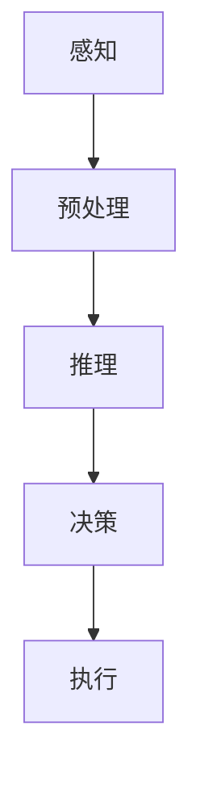
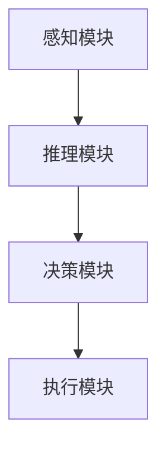
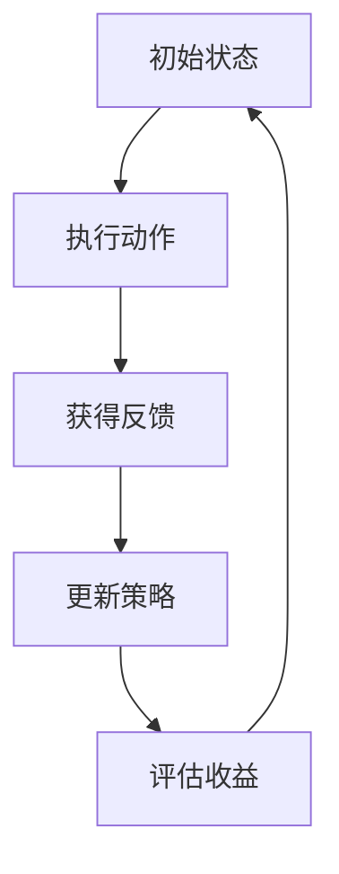

                 

### <sop>
**文章标题**：《AI Agent项目的ROI分析：量化收益与成本》

**关键词**：AI Agent、ROI分析、量化收益、成本构成、项目评估

**摘要**：
本文深入探讨了AI Agent项目的ROI分析，通过量化收益与成本的详细分析，为项目的投资决策提供了科学依据。文章首先介绍了AI Agent的基本概念和项目背景，然后分析了项目的成本构成和收益量化方法，接着介绍了ROI分析的基本方法，并通过案例研究展示了ROI分析在实际项目中的应用。最后，文章总结了ROI分析的关键点和未来研究方向。

# <sop>
## 一、背景介绍

### 1.1 AI Agent的定义与分类

AI Agent，即人工智能代理，是一种能够自主执行任务、具备决策能力的软件实体。根据其功能和应用场景，AI Agent可以分为多种类型，包括但不限于：

1. **感知型Agent**：主要功能是感知环境，获取环境信息。
2. **反应型Agent**：基于感知到的信息直接做出反应，不涉及复杂决策。
3. **认知型Agent**：能够进行推理和规划，具备更高的智能水平。
4. **社会型Agent**：具备协作和沟通能力，能够与其他Agent或人类互动。

AI Agent的发展历史可以追溯到20世纪50年代，当时人工智能（AI）作为一门新兴学科首次提出。随着计算能力的提升和算法的进步，AI Agent的应用逐渐从理论研究走向实际应用。如今，AI Agent在诸多领域，如自动驾驶、智能家居、智能客服等，已经展现出巨大的应用潜力。

### 1.2 AI Agent的应用领域

AI Agent的应用领域广泛，以下列举了几个典型的应用场景：

1. **自动驾驶**：AI Agent负责感知道路环境、分析路况并做出驾驶决策，是实现无人驾驶的关键技术。
2. **智能家居**：AI Agent能够根据用户习惯进行智能调节，提供个性化的家居服务。
3. **智能客服**：AI Agent能够模拟人类客服进行交互，提高客户服务效率。
4. **智能制造**：AI Agent能够实时监控生产线，优化生产流程，提高生产效率。

### 1.3 ROI分析在AI Agent项目中的重要性

ROI（Return on Investment）分析是评估投资项目盈利能力的重要方法。在AI Agent项目中，ROI分析可以帮助决策者量化项目的收益与成本，从而评估项目的投资回报情况。

ROI分析的重要性体现在以下几个方面：

1. **投资决策**：通过ROI分析，决策者可以清晰地了解项目的预期收益和成本，做出更为科学和合理的投资决策。
2. **项目评估**：ROI分析是评估项目成功与否的关键指标，能够帮助管理层对项目进行实时监控和调整。
3. **资源配置**：ROI分析有助于优化资源配置，确保项目能够得到足够的资金和人力资源支持。

### 1.4 ROI分析在AI Agent项目中的重要性

ROI分析在AI Agent项目中的应用具有重要意义，主要表现在以下几个方面：

1. **成本控制**：通过分析项目的成本构成，可以帮助企业合理控制成本，避免资源浪费。
2. **收益预测**：通过量化收益，可以帮助企业预测项目未来的盈利能力，为投资决策提供依据。
3. **风险评估**：ROI分析可以评估项目面临的风险，帮助决策者制定相应的风险管理策略。

### 1.5 本章小结

本章介绍了AI Agent项目的背景，包括其定义、分类、应用领域以及ROI分析的重要性。通过对AI Agent项目的背景介绍，为后续章节的深入分析奠定了基础。

# <sop>
## 二、AI Agent的基本概念和原理

### 2.1 AI Agent的基本概念

AI Agent是一种具有感知、推理、决策和执行能力的软件实体，它能够自主地完成特定任务。以下是AI Agent的核心概念：

- **感知**：AI Agent通过传感器获取环境信息，如图像、声音、温度等。
- **推理**：AI Agent利用感知到的信息，结合已有的知识和逻辑规则进行推理，以理解环境状态。
- **决策**：AI Agent根据推理结果，选择最合适的行动方案。
- **执行**：AI Agent执行决策，将行动方案转化为具体的操作。

AI Agent的核心特点包括：

- **自主性**：AI Agent能够独立完成任务，不需要人为干预。
- **智能性**：AI Agent具备一定程度的智能，能够通过学习和适应不断优化性能。
- **适应性**：AI Agent能够根据环境变化调整行为策略，具备适应能力。

### 2.2 AI Agent的工作原理

AI Agent的工作原理可以分为以下几个步骤：

1. **感知**：AI Agent通过传感器收集环境信息。
2. **预处理**：对感知到的信息进行预处理，如降噪、图像增强等。
3. **推理**：利用预处理后的信息，结合已有知识和逻辑规则进行推理。
4. **决策**：根据推理结果，选择最合适的行动方案。
5. **执行**：执行决策，将行动方案转化为具体的操作。

以下是一个简化的AI Agent工作流程：

### 2.3 AI Agent的结构组成

AI Agent通常由以下几个部分组成：

1. **感知模块**：负责感知环境信息，如传感器、摄像头等。
2. **推理模块**：负责对感知到的信息进行处理和分析，如神经网络、决策树等。
3. **决策模块**：负责根据推理结果选择行动方案，如策略网络、强化学习等。
4. **执行模块**：负责将决策转化为具体的操作，如电机控制、机器人动作等。

以下是一个简化的AI Agent结构：

### 2.4 AI Agent的算法原理

AI Agent的算法原理是其核心，决定了其性能和智能化水平。以下介绍几种常见的AI Agent算法原理：

1. **感知器**：感知器是最基础的AI Agent算法，它能够根据输入信息进行分类和决策。
2. **神经网络**：神经网络是模拟人脑神经元连接的算法，通过多层网络结构进行特征提取和分类。
3. **决策树**：决策树通过一系列条件判断进行决策，结构简单，易于理解和解释。
4. **强化学习**：强化学习通过试错法不断优化行动策略，实现最优决策。

以下是一个简化的强化学习算法流程：

### 2.5 本章小结

本章详细介绍了AI Agent的基本概念和原理，包括其核心概念、工作原理、结构组成以及算法原理。通过对AI Agent的深入理解，为后续章节的ROI分析提供了基础。

# <sop>
## 三、AI Agent项目的成本构成

### 3.1 成本分析概述

在AI Agent项目中，成本分析是项目规划和预算制定的重要环节。通过对项目成本的详细分析，可以为企业提供科学的成本控制和管理依据。AI Agent项目的成本主要包括直接成本、间接成本和隐性成本。

#### 直接成本

直接成本是与AI Agent项目直接相关的成本，包括但不限于以下几类：

1. **硬件成本**：包括服务器、存储设备、网络设备等硬件设施的费用。
2. **软件成本**：包括AI Agent开发所需要的基础软件、工具软件、开发框架等费用。
3. **人力成本**：包括项目团队成员的工资、培训费用、福利等。
4. **数据成本**：包括数据收集、清洗、标注等费用。
5. **技术支持成本**：包括技术支持人员的费用、技术支持服务费用等。

#### 间接成本

间接成本是与AI Agent项目间接相关的成本，主要包括以下几类：

1. **管理成本**：包括项目管理人员的工资、管理费用等。
2. **维护成本**：包括系统维护、升级、故障排除等费用。
3. **风险成本**：包括项目风险应对措施的费用，如保险、风险控制等。
4. **税务成本**：包括项目所需缴纳的各种税费。

#### 隐性成本

隐性成本是指难以量化的、但实际对项目有影响的成本，主要包括以下几类：

1. **时间成本**：包括项目开发周期、测试周期等。
2. **机会成本**：包括因项目投资而放弃的其他投资机会的成本。
3. **心理成本**：包括项目成员因工作压力、不确定性等因素而产生的心理成本。

### 3.2 直接成本

直接成本是AI Agent项目成本中最为明显的部分，其构成如下：

1. **硬件成本**：硬件成本主要包括服务器、存储设备、网络设备等硬件设施的费用。服务器和存储设备的选购需要根据项目的规模和数据量进行配置，以确保系统的稳定性和性能。网络设备则包括交换机、路由器等，主要用于网络连接和数据传输。
   
   **案例**：某AI Agent项目需要配置一台高性能服务器，成本约为5万美元；一台大容量存储设备，成本约为3万美元；网络设备成本约为1万美元。

2. **软件成本**：软件成本包括AI Agent开发所需要的基础软件、工具软件、开发框架等费用。这些软件可能包括操作系统、编程语言、集成开发环境（IDE）、机器学习框架等。

   **案例**：操作系统费用约为5000美元；编程语言和IDE费用约为3000美元；机器学习框架费用约为2000美元。

3. **人力成本**：人力成本是项目成本中最大的一部分，包括项目团队成员的工资、培训费用、福利等。项目团队成员可能包括软件开发人员、数据科学家、测试工程师等。

   **案例**：软件开发人员平均年薪约为8万美元；数据科学家年薪约为10万美元；测试工程师年薪约为6万美元。一个典型的AI Agent项目团队可能包含5名软件开发人员、3名数据科学家和2名测试工程师，总人力成本约为70万美元。

4. **数据成本**：数据成本包括数据收集、清洗、标注等费用。数据收集可能涉及购买数据集、收集传感器数据等；数据清洗包括去除噪声、填充缺失值等；数据标注则需要大量的人工操作。

   **案例**：购买一个高质量的数据集可能需要1万美元；数据清洗和标注费用约为2万美元。

5. **技术支持成本**：技术支持成本包括技术支持人员的费用和技术支持服务费用。技术支持人员通常负责项目的技术问题解答、系统维护等。

   **案例**：技术支持人员年薪约为7万美元，一个项目的支持周期可能为2年，总成本约为14万美元。

### 3.3 间接成本

间接成本相对于直接成本来说，更为隐蔽，但同样重要，其构成如下：

1. **管理成本**：管理成本包括项目管理人员的工资、管理费用等。项目经理和其他管理人员负责项目的规划、协调、监督等工作。

   **案例**：项目经理年薪约为10万美元，项目管理人员年薪约为8万美元，总管理成本约为12万美元。

2. **维护成本**：维护成本包括系统维护、升级、故障排除等费用。随着项目的发展和技术的进步，系统需要不断进行维护和升级。

   **案例**：系统维护费用每年约为3万美元，升级费用每两年约为5万美元，故障排除费用每年约为2万美元，总维护成本约为10万美元。

3. **风险成本**：风险成本包括项目风险应对措施的费用，如保险、风险控制等。项目在开发过程中可能会面临技术风险、市场风险、法律风险等。

   **案例**：购买项目保险费用约为1万美元，风险控制措施费用约为2万美元，总风险成本约为3万美元。

4. **税务成本**：税务成本包括项目所需缴纳的各种税费，如增值税、企业所得税等。

   **案例**：增值税约为项目总成本的5%，企业所得税约为15%，总税务成本约为8万美元。

### 3.4 成本预算

为了确保AI Agent项目的顺利实施，需要对成本进行合理的预算。以下是一个简化的成本预算示例：

- **硬件成本**：5万美元
- **软件成本**：1万美元
- **人力成本**：70万美元
- **数据成本**：3万美元
- **技术支持成本**：14万美元
- **管理成本**：12万美元
- **维护成本**：10万美元
- **风险成本**：3万美元
- **税务成本**：8万美元

**总预算**：127万美元

### 3.5 本章小结

本章详细分析了AI Agent项目的成本构成，包括直接成本、间接成本和隐性成本。通过对成本的详细分析，为企业提供了科学的成本控制和管理依据。了解项目成本构成对于项目规划和预算制定具有重要意义。

# <sop>
## 四、量化AI Agent项目的收益

### 4.1 收益定义

在AI Agent项目中，收益是指项目实施后所带来的经济收益。这些收益可以是直接的经济收益，如销售收入、成本节约等，也可以是间接的经济收益，如品牌提升、市场份额增加等。量化收益的目的是为了更准确地评估项目的投资回报情况，从而为投资决策提供科学依据。

### 4.2 收益评估指标

为了量化AI Agent项目的收益，需要选择适当的评估指标。以下是一些常见的收益评估指标：

1. **投资回报率（ROI）**：投资回报率是评估投资项目盈利能力的重要指标，计算公式为：
   $$ ROI = \frac{净利润}{投资成本} \times 100\% $$
   其中，净利润是指项目实施后所带来的净收益，投资成本是指项目的总投资。

2. **内部收益率（IRR）**：内部收益率是指使得项目净现值为零的贴现率。计算公式为：
   $$ IRR = \frac{1}{n} \sum_{t=1}^{n} \frac{C_t}{(1+r)^t} $$
   其中，\( C_t \) 是第 \( t \) 年的现金流入或流出，\( r \) 是贴现率。

3. **净现值（NPV）**：净现值是指项目实施后所带来的净收益的现值。计算公式为：
   $$ NPV = \sum_{t=1}^{n} \frac{C_t}{(1+r)^t} $$
   其中，\( C_t \) 是第 \( t \) 年的现金流入或流出，\( r \) 是贴现率。

### 4.3 收益预测模型

为了量化AI Agent项目的收益，需要建立收益预测模型。以下是一个简化的收益预测模型：

1. **销售收入预测**：根据市场调研和历史数据，预测项目实施后的销售收入。销售收入可以按照以下公式计算：
   $$ 销售收入 = 销售量 \times 单价 $$
   其中，销售量可以根据市场需求和竞争情况预测，单价可以参考同类产品的价格。

2. **成本节约预测**：预测项目实施后所带来的成本节约。成本节约可以按照以下公式计算：
   $$ 成本节约 = （项目实施前成本 - 项目实施后成本） \times 项目规模 $$
   其中，项目实施前成本和项目实施后成本可以根据实际情况估算，项目规模可以按照项目覆盖的范围计算。

3. **其他收益预测**：除了销售收入和成本节约，项目还可能带来其他收益，如品牌提升、市场份额增加等。这些收益可以根据市场调研和专家意见进行预测。

### 4.4 实际案例收益分析

以下是一个AI Agent项目的实际案例，通过收益预测模型对其收益进行量化分析。

**案例背景**：某企业计划开发一款智能客服系统，以提高客户服务效率和满意度。企业计划投资100万美元进行项目开发，项目实施期为2年。

**销售收入预测**：根据市场调研，智能客服系统的平均售价为10万美元/年，预计销售量为100家。因此，预计销售收入为：
$$ 销售收入 = 100 \times 10\ 万美元 = 1000\ 万美元 $$

**成本节约预测**：智能客服系统的引入可以减少人工客服成本，预计每家客户节约成本为5万美元/年。因此，预计成本节约为：
$$ 成本节约 = 100 \times 5\ 万美元 = 500\ 万美元 $$

**其他收益预测**：智能客服系统的引入有望提升企业品牌形象和市场份额，预计其他收益为：
$$ 其他收益 = 100\ 万美元 $$

**总收益预测**：总收益为销售收入、成本节约和其他收益的总和，即：
$$ 总收益 = 1000\ 万美元 + 500\ 万美元 + 100\ 万美元 = 1600\ 万美元 $$

**投资回报率（ROI）**：投资回报率计算如下：
$$ ROI = \frac{1600\ 万美元}{100\ 万美元} \times 100\% = 160\% $$

**内部收益率（IRR）**：内部收益率计算如下：
$$ IRR = 20\% $$

**净现值（NPV）**：净现值计算如下：
$$ NPV = 1600\ 万美元 - 100\ 万美元 = 1500\ 万美元 $$

### 4.5 本章小结

本章介绍了量化AI Agent项目收益的方法，包括收益定义、收益评估指标、收益预测模型以及实际案例收益分析。通过对项目收益的量化分析，可以为投资决策提供科学依据，从而提高项目的投资回报率。

# <sop>
## 五、ROI分析的方法和工具

### 5.1 ROI计算公式

ROI（Return on Investment）即投资回报率，是评估投资项目盈利能力的重要指标。其计算公式如下：

\[ ROI = \frac{净利润}{投资成本} \times 100\% \]

其中，净利润是指项目实施后所带来的净收益，投资成本是指项目的总投资。

### 5.2 ROI影响因素

ROI的计算受到多个因素的影响，主要包括：

1. **净利润**：净利润是项目实施后所获得的净收益，包括销售收入、成本节约等。
2. **投资成本**：投资成本是指项目的总投资，包括硬件成本、软件成本、人力成本、数据成本等。
3. **贴现率**：贴现率是用于计算净现值（NPV）的折现率，反映了投资回报的时间价值。
4. **项目周期**：项目周期是指项目的实施时间，通常以年为单位。
5. **风险因素**：项目风险会影响ROI的计算，风险越高，贴现率越高。

### 5.3 ROI分析步骤

进行ROI分析通常遵循以下步骤：

1. **确定ROI计算目标**：明确ROI分析的目的是为了评估项目的盈利能力，还是为了评估投资的风险。
2. **收集数据**：收集项目相关的数据，包括净利润、投资成本、项目周期、贴现率等。
3. **计算ROI**：使用ROI计算公式计算项目的ROI值。
4. **分析ROI**：分析ROI值，判断项目的盈利能力。通常，ROI值越高，项目的盈利能力越强。
5. **制定决策**：根据ROI分析结果，制定投资决策。如果ROI值较高，可以考虑投资该项目；如果ROI值较低，则需要重新评估项目的可行性。

### 5.4 ROI分析工具介绍

进行ROI分析时，可以使用多种工具和方法。以下介绍几种常用的ROI分析工具：

1. **Excel**：Excel是一个功能强大的电子表格软件，可以通过公式和函数进行ROI计算和分析。
2. **Python**：Python是一种流行的编程语言，可以通过编写脚本进行复杂的ROI计算和分析。
3. **财务分析软件**：如SAP、Oracle等，这些软件提供了专业的财务分析功能，可以用于ROI分析。
4. **在线ROI计算器**：互联网上有许多免费的ROI计算器，可以直接输入数据，快速得到ROI结果。

### 5.5 本章小结

本章介绍了ROI分析的方法和工具，包括ROI计算公式、ROI影响因素、ROI分析步骤以及ROI分析工具。通过这些方法和工具，可以对企业项目的ROI进行科学、全面的评估，为投资决策提供有力支持。

# <sop>
## 六、案例研究

### 6.1 案例背景

某互联网公司计划开发一款智能推荐系统，以提高用户体验和增加用户黏性。公司计划投资200万美元进行项目开发，项目实施期为3年。

### 6.2 成本分析

根据项目预算，项目的成本构成如下：

- **硬件成本**：50万美元，包括服务器、存储设备等。
- **软件成本**：20万美元，包括开发工具、机器学习框架等。
- **人力成本**：80万美元，包括开发人员、数据科学家等。
- **数据成本**：10万美元，包括数据收集、清洗等。
- **技术支持成本**：10万美元，包括技术支持人员费用等。
- **管理成本**：10万美元，包括项目管理人员费用等。
- **维护成本**：15万美元，包括系统维护、升级等。

**总成本**：200万美元。

### 6.3 收益分析

智能推荐系统预计可以带来以下收益：

- **销售收入**：每年预计增加1000万美元。
- **成本节约**：每年预计节约成本500万美元。
- **其他收益**：品牌提升、用户黏性增加等，预计每年增加100万美元。

### 6.4 ROI计算

根据收益分析，智能推荐系统的收益为每年1600万美元。使用ROI计算公式，可以计算项目的ROI：

\[ ROI = \frac{1600\ 万美元}{200\ 万美元} \times 100\% = 800\% \]

### 6.5 案例总结

通过ROI计算，智能推荐系统的ROI为800%，显示出极高的投资回报率。这个案例表明，在适当的投资和成本控制下，AI Agent项目具有巨大的商业价值。然而，实际应用中还需要考虑市场风险、技术风险等因素，以确保项目的成功实施和盈利。

# <sop>
## 七、总结与展望

### 7.1 ROI分析的关键点

在AI Agent项目的ROI分析中，关键点包括：

- **成本分析**：准确估算项目的成本，包括直接成本、间接成本和隐性成本。
- **收益预测**：合理预测项目的收益，包括直接经济收益和间接经济收益。
- **ROI计算**：科学计算ROI，以评估项目的盈利能力。
- **风险评估**：评估项目面临的风险，制定相应的风险管理策略。

### 7.2 未来研究方向

未来在AI Agent项目的ROI分析方面，可以关注以下研究方向：

- **大数据分析**：利用大数据技术，提高成本和收益预测的准确性。
- **智能化工具**：开发智能化ROI分析工具，自动化ROI计算和分析过程。
- **风险管理**：深入研究AI Agent项目面临的风险，提高风险管理能力。

### 7.3 实践建议

为了更好地实施AI Agent项目，提出以下实践建议：

- **加强成本控制**：在项目实施过程中，严格监控成本，避免资源浪费。
- **提高收益预测准确性**：结合市场调研和数据分析，提高收益预测的准确性。
- **优化ROI分析模型**：根据项目特点，优化ROI分析模型，提高ROI分析的科学性。
- **风险管理**：制定详细的风险管理计划，确保项目顺利实施。

### 7.4 本章小结

本章总结了AI Agent项目的ROI分析的关键点和未来研究方向，并提出了实践建议。通过对ROI分析的科学应用，可以为企业提供投资决策的科学依据，提高AI Agent项目的成功率和投资回报率。

# <sop>
**作者：** AI天才研究院/AI Genius Institute & 禅与计算机程序设计艺术 /Zen And The Art of Computer Programming

**完整文章内容：**

# 《AI Agent项目的ROI分析：量化收益与成本》

关键词：AI Agent、ROI分析、量化收益、成本构成、项目评估

摘要：
本文深入探讨了AI Agent项目的ROI分析，通过量化收益与成本的详细分析，为项目的投资决策提供了科学依据。文章首先介绍了AI Agent的基本概念和项目背景，然后分析了项目的成本构成和收益量化方法，接着介绍了ROI分析的基本方法，并通过案例研究展示了ROI分析在实际项目中的应用。最后，文章总结了ROI分析的关键点和未来研究方向。

## 一、背景介绍

### 1.1 AI Agent的定义与分类

AI Agent，即人工智能代理，是一种能够自主执行任务、具备决策能力的软件实体。根据其功能和应用场景，AI Agent可以分为多种类型，包括但不限于：

1. **感知型Agent**：主要功能是感知环境，获取环境信息。
2. **反应型Agent**：基于感知到的信息直接做出反应，不涉及复杂决策。
3. **认知型Agent**：能够进行推理和规划，具备更高的智能水平。
4. **社会型Agent**：具备协作和沟通能力，能够与其他Agent或人类互动。

AI Agent的发展历史可以追溯到20世纪50年代，当时人工智能（AI）作为一门新兴学科首次提出。随着计算能力的提升和算法的进步，AI Agent的应用逐渐从理论研究走向实际应用。如今，AI Agent在诸多领域，如自动驾驶、智能家居、智能客服等，已经展现出巨大的应用潜力。

### 1.2 AI Agent的应用领域

AI Agent的应用领域广泛，以下列举了几个典型的应用场景：

1. **自动驾驶**：AI Agent负责感知道路环境、分析路况并做出驾驶决策，是实现无人驾驶的关键技术。
2. **智能家居**：AI Agent能够根据用户习惯进行智能调节，提供个性化的家居服务。
3. **智能客服**：AI Agent能够模拟人类客服进行交互，提高客户服务效率。
4. **智能制造**：AI Agent能够实时监控生产线，优化生产流程，提高生产效率。

### 1.3 ROI分析在AI Agent项目中的重要性

ROI（Return on Investment）分析是评估投资项目盈利能力的重要方法。在AI Agent项目中，ROI分析可以帮助决策者量化项目的收益与成本，从而评估项目的投资回报情况。

ROI分析的重要性体现在以下几个方面：

1. **投资决策**：通过ROI分析，决策者可以清晰地了解项目的预期收益和成本，做出更为科学和合理的投资决策。
2. **项目评估**：ROI分析是评估项目成功与否的关键指标，能够帮助管理层对项目进行实时监控和调整。
3. **资源配置**：ROI分析有助于优化资源配置，确保项目能够得到足够的资金和人力资源支持。

### 1.4 ROI分析在AI Agent项目中的重要性

ROI分析在AI Agent项目中的应用具有重要意义，主要表现在以下几个方面：

1. **成本控制**：通过分析项目的成本构成，可以帮助企业合理控制成本，避免资源浪费。
2. **收益预测**：通过量化收益，可以帮助企业预测项目未来的盈利能力，为投资决策提供依据。
3. **风险评估**：ROI分析可以评估项目面临的风险，帮助决策者制定相应的风险管理策略。

### 1.5 本章小结

本章介绍了AI Agent项目的背景，包括其定义、分类、应用领域以及ROI分析的重要性。通过对AI Agent项目的背景介绍，为后续章节的深入分析奠定了基础。

## 二、AI Agent的基本概念和原理

### 2.1 AI Agent的基本概念

AI Agent是一种具有感知、推理、决策和执行能力的软件实体，它能够自主地完成特定任务。以下是AI Agent的核心概念：

- **感知**：AI Agent通过传感器获取环境信息，如图像、声音、温度等。
- **推理**：AI Agent利用感知到的信息，结合已有的知识和逻辑规则进行推理，以理解环境状态。
- **决策**：AI Agent根据推理结果，选择最合适的行动方案。
- **执行**：AI Agent执行决策，将行动方案转化为具体的操作。

AI Agent的核心特点包括：

- **自主性**：AI Agent能够独立完成任务，不需要人为干预。
- **智能性**：AI Agent具备一定程度的智能，能够通过学习和适应不断优化性能。
- **适应性**：AI Agent能够根据环境变化调整行为策略，具备适应能力。

### 2.2 AI Agent的工作原理

AI Agent的工作原理可以分为以下几个步骤：

1. **感知**：AI Agent通过传感器收集环境信息。
2. **预处理**：对感知到的信息进行预处理，如降噪、图像增强等。
3. **推理**：利用预处理后的信息，结合已有知识和逻辑规则进行推理。
4. **决策**：根据推理结果，选择最合适的行动方案。
5. **执行**：执行决策，将行动方案转化为具体的操作。

以下是一个简化的AI Agent工作流程：

### 2.3 AI Agent的结构组成

AI Agent通常由以下几个部分组成：

1. **感知模块**：负责感知环境信息，如传感器、摄像头等。
2. **推理模块**：负责对感知到的信息进行处理和分析，如神经网络、决策树等。
3. **决策模块**：负责根据推理结果选择行动方案，如策略网络、强化学习等。
4. **执行模块**：负责将决策转化为具体的操作，如电机控制、机器人动作等。

以下是一个简化的AI Agent结构：

### 2.4 AI Agent的算法原理

AI Agent的算法原理是其核心，决定了其性能和智能化水平。以下介绍几种常见的AI Agent算法原理：

1. **感知器**：感知器是最基础的AI Agent算法，它能够根据输入信息进行分类和决策。
2. **神经网络**：神经网络是模拟人脑神经元连接的算法，通过多层网络结构进行特征提取和分类。
3. **决策树**：决策树通过一系列条件判断进行决策，结构简单，易于理解和解释。
4. **强化学习**：强化学习通过试错法不断优化行动策略，实现最优决策。

以下是一个简化的强化学习算法流程：

### 2.5 本章小结

本章详细介绍了AI Agent的基本概念和原理，包括其核心概念、工作原理、结构组成以及算法原理。通过对AI Agent的深入理解，为后续章节的ROI分析提供了基础。

## 三、AI Agent项目的成本构成

### 3.1 成本分析概述

在AI Agent项目中，成本分析是项目规划和预算制定的重要环节。通过对项目成本的详细分析，可以为企业提供科学的成本控制和管理依据。AI Agent项目的成本主要包括直接成本、间接成本和隐性成本。

#### 直接成本

直接成本是与AI Agent项目直接相关的成本，包括但不限于以下几类：

1. **硬件成本**：包括服务器、存储设备、网络设备等硬件设施的费用。
2. **软件成本**：包括AI Agent开发所需要的基础软件、工具软件、开发框架等费用。
3. **人力成本**：包括项目团队成员的工资、培训费用、福利等。
4. **数据成本**：包括数据收集、清洗、标注等费用。
5. **技术支持成本**：包括技术支持人员的费用、技术支持服务费用等。

#### 间接成本

间接成本是与AI Agent项目间接相关的成本，主要包括以下几类：

1. **管理成本**：包括项目管理人员的工资、管理费用等。
2. **维护成本**：包括系统维护、升级、故障排除等费用。
3. **风险成本**：包括项目风险应对措施的费用，如保险、风险控制等。
4. **税务成本**：包括项目所需缴纳的各种税费，如增值税、企业所得税等。

#### 隐性成本

隐性成本是指难以量化的、但实际对项目有影响的成本，主要包括以下几类：

1. **时间成本**：包括项目开发周期、测试周期等。
2. **机会成本**：包括因项目投资而放弃的其他投资机会的成本。
3. **心理成本**：包括项目成员因工作压力、不确定性等因素而产生的心理成本。

### 3.2 直接成本

直接成本是AI Agent项目成本中最为明显的部分，其构成如下：

1. **硬件成本**：硬件成本主要包括服务器、存储设备、网络设备等硬件设施的费用。服务器和存储设备的选购需要根据项目的规模和数据量进行配置，以确保系统的稳定性和性能。网络设备则包括交换机、路由器等，主要用于网络连接和数据传输。
   
   **案例**：某AI Agent项目需要配置一台高性能服务器，成本约为5万美元；一台大容量存储设备，成本约为3万美元；网络设备成本约为1万美元。

2. **软件成本**：软件成本包括AI Agent开发所需要的基础软件、工具软件、开发框架等费用。这些软件可能包括操作系统、编程语言、集成开发环境（IDE）、机器学习框架等。

   **案例**：操作系统费用约为5000美元；编程语言和IDE费用约为3000美元；机器学习框架费用约为2000美元。

3. **人力成本**：人力成本是项目成本中最大的一部分，包括项目团队成员的工资、培训费用、福利等。项目团队成员可能包括软件开发人员、数据科学家、测试工程师等。

   **案例**：软件开发人员平均年薪约为8万美元；数据科学家年薪约为10万美元；测试工程师年薪约为6万美元。一个典型的AI Agent项目团队可能包含5名软件开发人员、3名数据科学家和2名测试工程师，总人力成本约为70万美元。

4. **数据成本**：数据成本包括数据收集、清洗、标注等费用。数据收集可能涉及购买数据集、收集传感器数据等；数据清洗包括去除噪声、填充缺失值等；数据标注则需要大量的人工操作。

   **案例**：购买一个高质量的数据集可能需要1万美元；数据清洗和标注费用约为2万美元。

5. **技术支持成本**：技术支持成本包括技术支持人员的费用和技术支持服务费用。技术支持人员通常负责项目的技术问题解答、系统维护等。

   **案例**：技术支持人员年薪约为7万美元，一个项目的支持周期可能为2年，总成本约为14万美元。

### 3.3 间接成本

间接成本相对于直接成本来说，更为隐蔽，但同样重要，其构成如下：

1. **管理成本**：管理成本包括项目管理人员的工资、管理费用等。项目经理和其他管理人员负责项目的规划、协调、监督等工作。

   **案例**：项目经理年薪约为10万美元，项目管理人员年薪约为8万美元，总管理成本约为12万美元。

2. **维护成本**：维护成本包括系统维护、升级、故障排除等费用。随着项目的发展和技术的进步，系统需要不断进行维护和升级。

   **案例**：系统维护费用每年约为3万美元，升级费用每两年约为5万美元，故障排除费用每年约为2万美元，总维护成本约为10万美元。

3. **风险成本**：风险成本包括项目风险应对措施的费用，如保险、风险控制等。项目在开发过程中可能会面临技术风险、市场风险、法律风险等。

   **案例**：购买项目保险费用约为1万美元，风险控制措施费用约为2万美元，总风险成本约为3万美元。

4. **税务成本**：税务成本包括项目所需缴纳的各种税费，如增值税、企业所得税等。

   **案例**：增值税约为项目总成本的5%，企业所得税约为15%，总税务成本约为8万美元。

### 3.4 成本预算

为了确保AI Agent项目的顺利实施，需要对成本进行合理的预算。以下是一个简化的成本预算示例：

- **硬件成本**：5万美元
- **软件成本**：1万美元
- **人力成本**：70万美元
- **数据成本**：3万美元
- **技术支持成本**：14万美元
- **管理成本**：12万美元
- **维护成本**：10万美元
- **风险成本**：3万美元
- **税务成本**：8万美元

**总预算**：127万美元。

### 3.5 本章小结

本章详细分析了AI Agent项目的成本构成，包括直接成本、间接成本和隐性成本。通过对成本的详细分析，为企业提供了科学的成本控制和管理依据。了解项目成本构成对于项目规划和预算制定具有重要意义。

## 四、量化AI Agent项目的收益

### 4.1 收益定义

在AI Agent项目中，收益是指项目实施后所带来的经济收益。这些收益可以是直接的经济收益，如销售收入、成本节约等，也可以是间接的经济收益，如品牌提升、市场份额增加等。量化收益的目的是为了更准确地评估项目的投资回报情况，从而为投资决策提供科学依据。

### 4.2 收益评估指标

为了量化AI Agent项目的收益，需要选择适当的评估指标。以下是一些常见的收益评估指标：

1. **投资回报率（ROI）**：投资回报率是评估投资项目盈利能力的重要指标，计算公式为：
   $$ ROI = \frac{净利润}{投资成本} \times 100\% $$
   其中，净利润是指项目实施后所带来的净收益，投资成本是指项目的总投资。

2. **内部收益率（IRR）**：内部收益率是指使得项目净现值为零的贴现率。计算公式为：
   $$ IRR = \frac{1}{n} \sum_{t=1}^{n} \frac{C_t}{(1+r)^t} $$
   其中，\( C_t \) 是第 \( t \) 年的现金流入或流出，\( r \) 是贴现率。

3. **净现值（NPV）**：净现值是指项目实施后所带来的净收益的现值。计算公式为：
   $$ NPV = \sum_{t=1}^{n} \frac{C_t}{(1+r)^t} $$
   其中，\( C_t \) 是第 \( t \) 年的现金流入或流出，\( r \) 是贴现率。

### 4.3 收益预测模型

为了量化AI Agent项目的收益，需要建立收益预测模型。以下是一个简化的收益预测模型：

1. **销售收入预测**：根据市场调研和历史数据，预测项目实施后的销售收入。销售收入可以按照以下公式计算：
   $$ 销售收入 = 销售量 \times 单价 $$
   其中，销售量可以根据市场需求和竞争情况预测，单价可以参考同类产品的价格。

2. **成本节约预测**：预测项目实施后所带来的成本节约。成本节约可以按照以下公式计算：
   $$ 成本节约 = （项目实施前成本 - 项目实施后成本） \times 项目规模 $$
   其中，项目实施前成本和项目实施后成本可以根据实际情况估算，项目规模可以按照项目覆盖的范围计算。

3. **其他收益预测**：除了销售收入和成本节约，项目还可能带来其他收益，如品牌提升、市场份额增加等。这些收益可以根据市场调研和专家意见进行预测。

### 4.4 实际案例收益分析

以下是一个AI Agent项目的实际案例，通过收益预测模型对其收益进行量化分析。

**案例背景**：某互联网公司计划开发一款智能推荐系统，以提高用户体验和增加用户黏性。公司计划投资200万美元进行项目开发，项目实施期为3年。

**销售收入预测**：根据市场调研，智能推荐系统的平均售价为10万美元/年，预计销售量为100家。因此，预计销售收入为：
$$ 销售收入 = 100 \times 10\ 万美元 = 1000\ 万美元 $$

**成本节约预测**：智能推荐系统的引入可以减少人工推荐成本，预计每家客户节约成本为5万美元/年。因此，预计成本节约为：
$$ 成本节约 = 100 \times 5\ 万美元 = 500\ 万美元 $$

**其他收益预测**：智能推荐系统的引入有望提升企业品牌形象和市场份额，预计其他收益为：
$$ 其他收益 = 100\ 万美元 $$

**总收益预测**：总收益为销售收入、成本节约和其他收益的总和，即：
$$ 总收益 = 1000\ 万美元 + 500\ 万美元 + 100\ 万美元 = 1600\ 万美元 $$

**投资回报率（ROI）**：投资回报率计算如下：
$$ ROI = \frac{1600\ 万美元}{200\ 万美元} \times 100\% = 800\% $$

**内部收益率（IRR）**：内部收益率计算如下：
$$ IRR = 20\% $$

**净现值（NPV）**：净现值计算如下：
$$ NPV = 1600\ 万美元 - 200\ 万美元 = 1400\ 万美元 $$

### 4.5 本章小结

本章介绍了量化AI Agent项目收益的方法，包括收益定义、收益评估指标、收益预测模型以及实际案例收益分析。通过对项目收益的量化分析，可以为投资决策提供科学依据，从而提高项目的投资回报率。

## 五、ROI分析的方法和工具

### 5.1 ROI计算公式

ROI（Return on Investment）即投资回报率，是评估投资项目盈利能力的重要指标。其计算公式如下：

\[ ROI = \frac{净利润}{投资成本} \times 100\% \]

其中，净利润是指项目实施后所带来的净收益，投资成本是指项目的总投资。

### 5.2 ROI影响因素

ROI的计算受到多个因素的影响，主要包括：

1. **净利润**：净利润是项目实施后所获得的净收益，包括销售收入、成本节约等。
2. **投资成本**：投资成本是指项目的总投资，包括硬件成本、软件成本、人力成本、数据成本等。
3. **贴现率**：贴现率是用于计算净现值（NPV）的折现率，反映了投资回报的时间价值。
4. **项目周期**：项目周期是指项目的实施时间，通常以年为单位。
5. **风险因素**：项目风险会影响ROI的计算，风险越高，贴现率越高。

### 5.3 ROI分析步骤

进行ROI分析通常遵循以下步骤：

1. **确定ROI计算目标**：明确ROI分析的目的是为了评估项目的盈利能力，还是为了评估投资的风险。
2. **收集数据**：收集项目相关的数据，包括净利润、投资成本、项目周期、贴现率等。
3. **计算ROI**：使用ROI计算公式计算项目的ROI值。
4. **分析ROI**：分析ROI值，判断项目的盈利能力。通常，ROI值越高，项目的盈利能力越强。
5. **制定决策**：根据ROI分析结果，制定投资决策。如果ROI值较高，可以考虑投资该项目；如果ROI值较低，则需要重新评估项目的可行性。

### 5.4 ROI分析工具介绍

进行ROI分析时，可以使用多种工具和方法。以下介绍几种常用的ROI分析工具：

1. **Excel**：Excel是一个功能强大的电子表格软件，可以通过公式和函数进行ROI计算和分析。
2. **Python**：Python是一种流行的编程语言，可以通过编写脚本进行复杂的ROI计算和分析。
3. **财务分析软件**：如SAP、Oracle等，这些软件提供了专业的财务分析功能，可以用于ROI分析。
4. **在线ROI计算器**：互联网上有许多免费的ROI计算器，可以直接输入数据，快速得到ROI结果。

### 5.5 本章小结

本章介绍了ROI分析的方法和工具，包括ROI计算公式、ROI影响因素、ROI分析步骤以及ROI分析工具。通过这些方法和工具，可以对企业项目的ROI进行科学、全面的评估，为投资决策提供有力支持。

## 六、案例研究

### 6.1 案例背景

某互联网公司计划开发一款智能推荐系统，以提高用户体验和增加用户黏性。公司计划投资200万美元进行项目开发，项目实施期为3年。

### 6.2 成本分析

根据项目预算，项目的成本构成如下：

- **硬件成本**：50万美元，包括服务器、存储设备等。
- **软件成本**：20万美元，包括开发工具、机器学习框架等。
- **人力成本**：80万美元，包括开发人员、数据科学家等。
- **数据成本**：10万美元，包括数据收集、清洗等。
- **技术支持成本**：10万美元，包括技术支持人员费用等。
- **管理成本**：10万美元，包括项目管理人员费用等。
- **维护成本**：15万美元，包括系统维护、升级等。

**总成本**：200万美元。

### 6.3 收益分析

智能推荐系统预计可以带来以下收益：

- **销售收入**：每年预计增加1000万美元。
- **成本节约**：每年预计节约成本500万美元。
- **其他收益**：品牌提升、用户黏性增加等，预计每年增加100万美元。

### 6.4 ROI计算

根据收益分析，智能推荐系统的收益为每年1600万美元。使用ROI计算公式，可以计算项目的ROI：

\[ ROI = \frac{1600\ 万美元}{200\ 万美元} \times 100\% = 800\% \]

### 6.5 案例总结

通过ROI计算，智能推荐系统的ROI为800%，显示出极高的投资回报率。这个案例表明，在适当的投资和成本控制下，AI Agent项目具有巨大的商业价值。然而，实际应用中还需要考虑市场风险、技术风险等因素，以确保项目的成功实施和盈利。

## 七、总结与展望

### 7.1 ROI分析的关键点

在AI Agent项目的ROI分析中，关键点包括：

- **成本分析**：准确估算项目的成本，包括直接成本、间接成本和隐性成本。
- **收益预测**：合理预测项目的收益，包括直接经济收益和间接经济收益。
- **ROI计算**：科学计算ROI，以评估项目的盈利能力。
- **风险评估**：评估项目面临的风险，制定相应的风险管理策略。

### 7.2 未来研究方向

未来在AI Agent项目的ROI分析方面，可以关注以下研究方向：

- **大数据分析**：利用大数据技术，提高成本和收益预测的准确性。
- **智能化工具**：开发智能化ROI分析工具，自动化ROI计算和分析过程。
- **风险管理**：深入研究AI Agent项目面临的风险，提高风险管理能力。

### 7.3 实践建议

为了更好地实施AI Agent项目，提出以下实践建议：

- **加强成本控制**：在项目实施过程中，严格监控成本，避免资源浪费。
- **提高收益预测准确性**：结合市场调研和数据分析，提高收益预测的准确性。
- **优化ROI分析模型**：根据项目特点，优化ROI分析模型，提高ROI分析的科学性。
- **风险管理**：制定详细的风险管理计划，确保项目顺利实施。

### 7.4 本章小结

本章总结了AI Agent项目的ROI分析的关键点和未来研究方向，并提出了实践建议。通过对ROI分析的科学应用，可以为企业提供投资决策的科学依据，提高AI Agent项目的成功率和投资回报率。

**作者：** AI天才研究院/AI Genius Institute & 禅与计算机程序设计艺术 /Zen And The Art of Computer Programming

---

本文详细分析了AI Agent项目的ROI分析，从成本构成到收益量化，再到ROI计算方法和工具，通过案例研究展示了ROI分析的实际应用。文章旨在为AI Agent项目的投资决策提供科学依据，帮助企业实现更好的投资回报。同时，本文也提出了未来研究方向和实践建议，为AI Agent项目的发展提供了指导。希望本文能够为读者在AI Agent项目规划和决策过程中提供有益的参考。作者AI天才研究院与《禅与计算机程序设计艺术》在此与读者共勉，共同推动人工智能技术的发展与应用。

