                 

### 文章标题：AI模型训练数据收集与处理技巧

关键词：AI模型、数据收集、数据处理、数据质量、最佳实践

摘要：本文深入探讨了AI模型训练数据收集与处理的各个方面，包括数据收集的背景和挑战、常用的数据收集方法与工具、数据处理的基础技术、数据质量评估方法以及实际案例解析。通过本文，读者可以全面了解如何高效地收集和处理AI模型训练数据，提高模型的准确性和性能。

----------------------------------------------------------------

### 第一部分：AI模型训练数据概述

#### 第1章：AI模型训练数据基础

##### 1.1 训练数据在AI模型中的角色与重要性

在AI模型训练过程中，数据起到了至关重要的作用。数据不仅是训练模型的基础，也是模型性能提升的关键因素。一个高质量的数据集可以帮助模型更准确地学习和泛化，从而在实际应用中取得更好的效果。

**核心概念术语说明**：

- 训练数据（Training Data）：用于训练AI模型的原始数据。
- 测试数据（Test Data）：用于评估模型性能的独立数据集。
- 泛化能力（Generalization）：模型在未知数据上的表现。

**问题背景与问题描述**：

随着深度学习的普及，AI模型在图像识别、自然语言处理、推荐系统等领域取得了显著的进展。然而，这些进展在很大程度上依赖于高质量的数据集。数据收集与处理不当，会导致模型性能下降，甚至产生错误的预测。

**问题解决**：

为了提高模型性能，我们需要关注数据收集与处理的每个环节。这包括数据来源的选择、数据收集方法、数据预处理、特征工程等。

**边界与外延**：

- 数据收集的范围：包括公开数据集、私有数据集、网络爬虫、API接口等。
- 数据处理技术：包括数据清洗、数据归一化、特征提取等。
- 数据质量评估：包括数据完整性、一致性、可用性等。

**概念结构与核心要素组成**：

- 数据收集：数据来源、数据收集方法、数据清洗。
- 数据处理：数据预处理、特征工程、数据归一化。
- 数据质量评估：数据完整性、一致性、可用性。

----------------------------------------------------------------

##### 1.2 数据收集的挑战与应对策略

数据收集是AI模型训练的第一步，也是最为复杂的一步。数据收集的挑战包括数据来源、数据量、数据质量和数据隐私等方面。

**核心概念与联系**：

- 数据来源：公开数据集、私有数据集、网络爬虫、API接口。
- 数据质量：完整性、一致性、可用性。
- 数据隐私：保护个人隐私，遵守相关法律法规。

**问题背景与问题描述**：

在数据收集过程中，我们可能会遇到以下挑战：

- 数据来源多样，数据质量参差不齐。
- 数据量巨大，处理效率低下。
- 数据隐私保护问题。

**问题解决**：

为了应对这些挑战，我们可以采取以下策略：

- 选择高质量的数据来源。
- 使用自动化工具进行数据收集。
- 对数据进行预处理和清洗。
- 遵守数据隐私保护法规。

**边界与外延**：

- 数据来源的选择：公开数据集、私有数据集、网络爬虫、API接口。
- 数据预处理：数据清洗、数据归一化、特征提取。
- 数据隐私保护：数据加密、匿名化、访问控制。

**概念属性特征对比表格**：

| 特征 | 数据源1 | 数据源2 | 数据源3 |
| --- | --- | --- | --- |
| 数据质量 | 较高 | 较低 | 中等 |
| 数据量 | 大 | 中 | 小 |
| 数据隐私 | 高 | 中 | 低 |

**ER实体关系图架构的Mermaid流程图**：

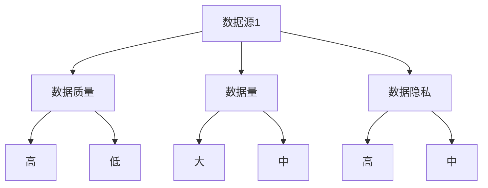

----------------------------------------------------------------

##### 1.3 数据集类型与选择标准

在AI模型训练中，数据集的类型和选择至关重要。不同的数据集类型适用于不同的任务，选择合适的数据集可以显著提高模型的性能。

**核心概念与联系**：

- 标签数据集（Labeled Dataset）：已标记的数据集，适用于监督学习。
- 未标注数据集（Unlabeled Dataset）：未标记的数据集，适用于无监督学习。
- 合成数据集（Synthetic Dataset）：人工合成的数据集，可用于提高模型的泛化能力。

**问题背景与问题描述**：

在AI模型训练中，数据集的选择直接影响到模型的性能和泛化能力。选择不当的数据集可能会导致模型过拟合或欠拟合。

**问题解决**：

为了选择合适的数据集，我们需要考虑以下因素：

- 数据集类型：监督学习、无监督学习、半监督学习。
- 数据质量：完整性、一致性、可用性。
- 数据来源：公开数据集、私有数据集、网络爬虫、API接口。

**边界与外延**：

- 数据集类型：标签数据集、未标注数据集、合成数据集。
- 数据质量：完整性、一致性、可用性。
- 数据来源：公开数据集、私有数据集、网络爬虫、API接口。

**ER实体关系图架构的Mermaid流程图**：

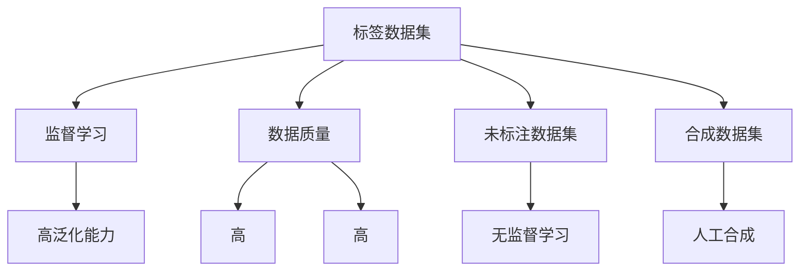

----------------------------------------------------------------

## 第二部分：AI模型训练数据收集

### 第2章：数据收集方法

##### 2.1 自动化数据收集

自动化数据收集是提高数据收集效率的重要手段。自动化数据收集可以减少人力成本，提高数据收集的准确性。

**核心概念与联系**：

- 网络爬虫（Web Scraping）：通过爬取网站内容进行数据收集。
- API获取数据（API Data Collection）：利用API接口获取数据。

**问题背景与问题描述**：

在数据收集过程中，手动收集数据耗时耗力，且容易出现错误。自动化数据收集可以提高数据收集的效率和准确性。

**问题解决**：

为了实现自动化数据收集，我们可以使用以下工具和方法：

- 网络爬虫：如Python的requests库和Beautiful Soup库。
- API获取数据：如使用Python的requests库获取API数据。

**边界与外延**：

- 网络爬虫：网站数据爬取、数据清洗。
- API获取数据：API接口使用、数据解析。

**ER实体关系图架构的Mermaid流程图**：

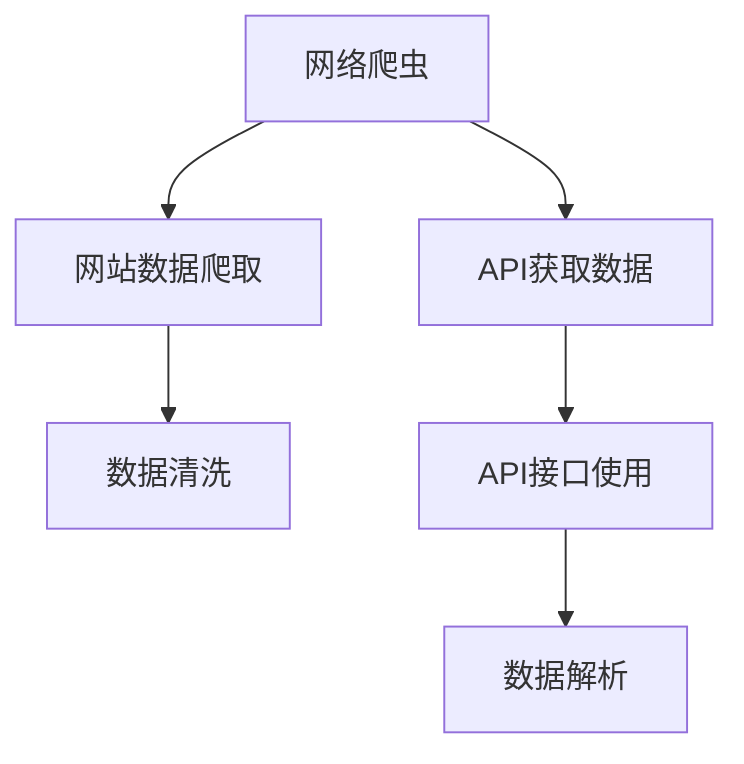

----------------------------------------------------------------

##### 2.2 手动数据收集

手动数据收集是一种直接从原始数据源获取数据的方法。虽然这种方法效率较低，但在某些场景下仍具有不可替代的优势。

**核心概念与联系**：

- 手动数据收集：直接从原始数据源获取数据。
- 数据标注（Data Annotation）：对数据进行标记和分类。

**问题背景与问题描述**：

手动数据收集适用于需要高度精确数据标注的场景，如医学图像标注、文本分类等。

**问题解决**：

为了提高手动数据收集的效率，我们可以采取以下策略：

- 建立规范的数据标注流程。
- 使用自动化工具辅助数据收集。

**边界与外延**：

- 手动数据收集：数据来源、数据标注。
- 数据标注：标注流程、标注工具。

**ER实体关系图架构的Mermaid流程图**：

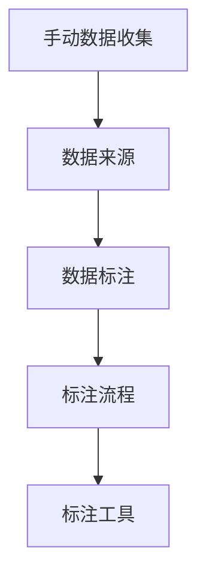

----------------------------------------------------------------

##### 2.3 网络爬虫与API获取数据

网络爬虫和API获取数据是自动化数据收集的重要手段。它们可以帮助我们从互联网和其他数据源中快速获取大量数据。

**核心概念与联系**：

- 网络爬虫（Web Scraping）：通过爬取网站内容进行数据收集。
- API获取数据（API Data Collection）：利用API接口获取数据。

**问题背景与问题描述**：

在AI模型训练中，我们经常需要从互联网或其他数据源获取大量数据。网络爬虫和API获取数据可以显著提高数据收集的效率。

**问题解决**：

为了实现网络爬虫和API获取数据，我们可以使用以下工具和方法：

- 网络爬虫：如Python的requests库和Beautiful Soup库。
- API获取数据：如使用Python的requests库获取API数据。

**边界与外延**：

- 网络爬虫：网站数据爬取、数据清洗。
- API获取数据：API接口使用、数据解析。

**ER实体关系图架构的Mermaid流程图**：


----------------------------------------------------------------

### 第3章：数据收集工具与平台

##### 3.1 数据收集工具介绍

在数据收集过程中，选择合适的工具可以显著提高数据收集的效率和质量。以下是一些常用的数据收集工具：

- 网络爬虫工具：如Python的requests库和Beautiful Soup库。
- API获取工具：如Python的requests库。
- 数据标注工具：如LabelImg、CVAT。

**核心概念与联系**：

- 网络爬虫工具：用于网站数据爬取。
- API获取工具：用于API数据收集。
- 数据标注工具：用于数据标注。

**问题背景与问题描述**：

在数据收集过程中，选择合适的工具可以显著提高数据收集的效率和质量。不同工具适用于不同的数据收集场景。

**问题解决**：

为了提高数据收集效率，我们可以选择以下工具：

- 网络爬虫工具：如Python的requests库和Beautiful Soup库。
- API获取工具：如Python的requests库。
- 数据标注工具：如LabelImg、CVAT。

**边界与外延**：

- 网络爬虫工具：网站数据爬取、数据清洗。
- API获取工具：API接口使用、数据解析。
- 数据标注工具：数据标注、标注流程。

**ER实体关系图架构的Mermaid流程图**：

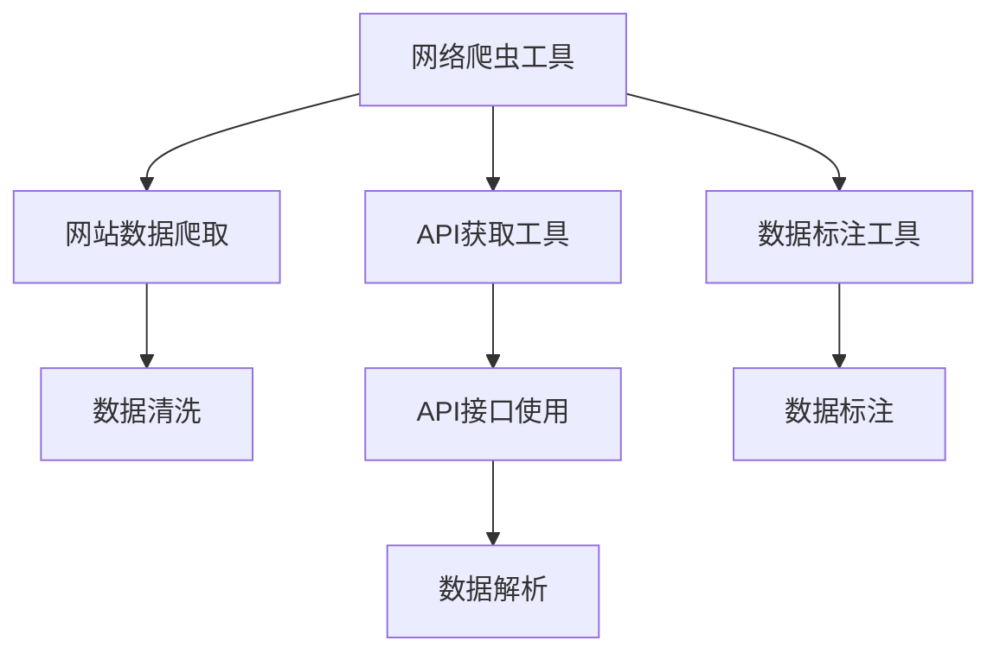

----------------------------------------------------------------

##### 3.2 常见数据收集平台使用指南

在AI模型训练过程中，常见的数据收集平台可以帮助我们高效地收集和处理数据。以下是一些常见的数据收集平台及其使用指南：

- Kaggle：一个开源的数据集和竞赛平台，提供丰富的数据集和竞赛资源。
- Google Dataset Search：一个用于搜索开放数据集的搜索引擎。
- UCI机器学习数据库：提供各种领域的数据集，适用于机器学习研究和应用。

**核心概念与联系**：

- Kaggle：数据集下载、竞赛资源。
- Google Dataset Search：数据集搜索。
- UCI机器学习数据库：数据集下载、数据集应用。

**问题背景与问题描述**：

在AI模型训练中，我们经常需要找到适合的数据集。常见的数据收集平台可以提供丰富的数据资源，帮助我们快速找到所需的数据集。

**问题解决**：

为了高效地利用常见的数据收集平台，我们可以采取以下策略：

- 使用Kaggle参加竞赛，获取高质量数据集。
- 利用Google Dataset Search搜索开放数据集。
- 在UCI机器学习数据库中查找适用于特定领域的数据集。

**边界与外延**：

- Kaggle：数据集下载、竞赛资源。
- Google Dataset Search：数据集搜索。
- UCI机器学习数据库：数据集下载、数据集应用。

**ER实体关系图架构的Mermaid流程图**：

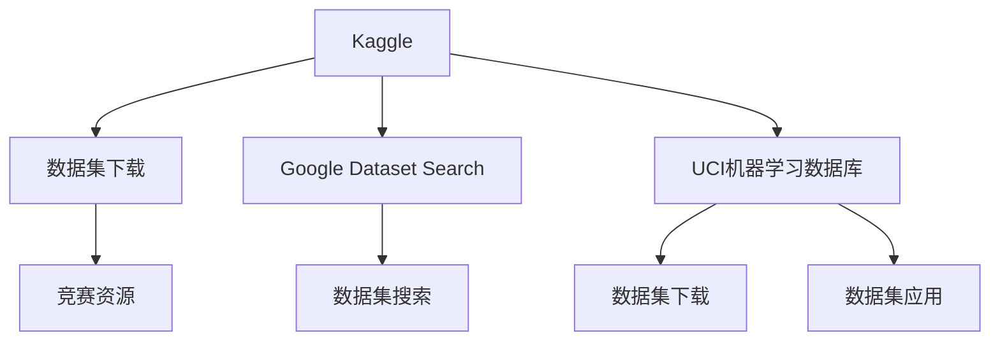

----------------------------------------------------------------

##### 3.3 数据收集的伦理问题与隐私保护

在数据收集过程中，我们需要关注伦理问题和隐私保护。不当的数据收集和处理可能导致隐私泄露、数据滥用等问题。

**核心概念与联系**：

- 数据伦理：确保数据收集和处理符合伦理规范。
- 隐私保护：保护个人隐私，防止数据滥用。

**问题背景与问题描述**：

随着大数据和AI技术的发展，数据收集和处理变得日益频繁。然而，这引发了一系列伦理问题和隐私保护问题。

**问题解决**：

为了解决数据收集的伦理问题和隐私保护问题，我们可以采取以下策略：

- 遵守相关法律法规，确保数据收集和处理合法。
- 对数据进行匿名化和去标识化处理。
- 加强数据安全防护，防止数据泄露。

**边界与外延**：

- 数据伦理：数据收集、数据处理、数据共享。
- 隐私保护：数据匿名化、去标识化、数据安全。

**ER实体关系图架构的Mermaid流程图**：

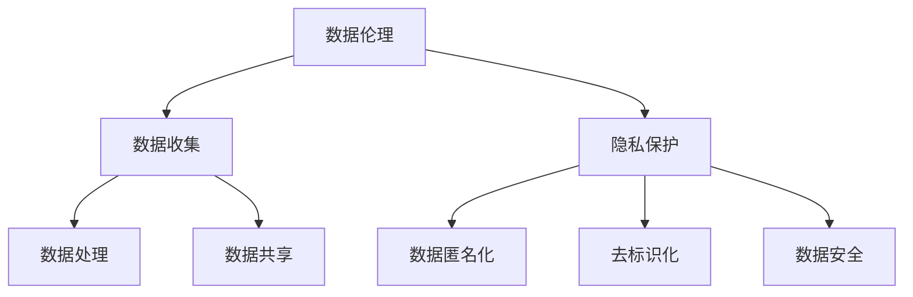

----------------------------------------------------------------

### 第三部分：AI模型训练数据处理

#### 第4章：数据处理基础

##### 4.1 数据清洗与预处理

数据清洗与预处理是数据处理的重要步骤，它有助于提高数据质量，为后续的特征工程和模型训练奠定基础。

**核心概念与联系**：

- 数据清洗：去除重复数据、缺失数据、异常数据等。
- 数据预处理：归一化、标准化、特征提取等。

**问题背景与问题描述**：

在AI模型训练中，数据质量直接影响模型的性能。数据清洗与预处理是确保数据质量的关键步骤。

**问题解决**：

为了进行有效的数据清洗与预处理，我们可以采取以下策略：

- 去除重复数据。
- 填补缺失数据。
- 标准化或归一化数据。

**边界与外延**：

- 数据清洗：重复数据、缺失数据、异常数据。
- 数据预处理：归一化、标准化、特征提取。

**ER实体关系图架构的Mermaid流程图**：

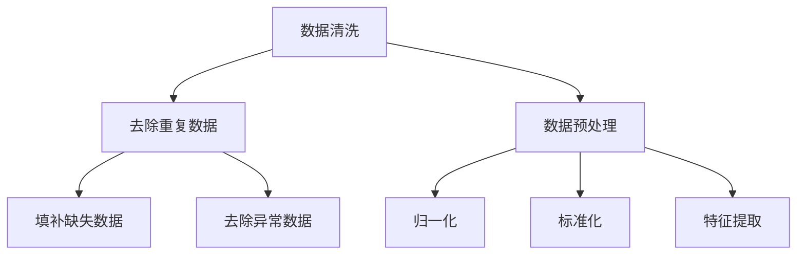

----------------------------------------------------------------

##### 4.2 特征工程

特征工程是AI模型训练中的重要环节，它通过提取、构造和选择特征来提高模型性能。

**核心概念与联系**：

- 特征提取：从原始数据中提取有用特征。
- 特征选择：从大量特征中选择对模型性能有显著影响的特征。

**问题背景与问题描述**：

特征工程对于模型的泛化能力和性能至关重要。合适的特征可以提高模型的准确性，减少过拟合。

**问题解决**：

为了进行有效的特征工程，我们可以采取以下策略：

- 数据预处理：归一化、标准化。
- 特征构造：交叉特征、组合特征。
- 特征选择：基于特征重要性、基于模型选择。

**边界与外延**：

- 特征提取：特征重要性、特征构造。
- 特征选择：特征重要性、模型选择。

**ER实体关系图架构的Mermaid流程图**：

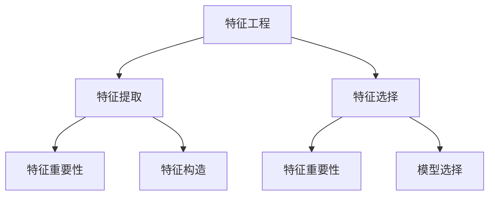

----------------------------------------------------------------

##### 4.3 数据归一化与标准化

数据归一化与标准化是数据处理中常用的技术，它们有助于提高模型训练的效率和性能。

**核心概念与联系**：

- 数据归一化：将数据缩放到相同的尺度。
- 数据标准化：将数据转换为均值为0、标准差为1的分布。

**问题背景与问题描述**：

在AI模型训练中，不同特征的数量级和尺度可能对模型训练产生不利影响。数据归一化和标准化可以解决这一问题。

**问题解决**：

为了进行有效的数据归一化和标准化，我们可以采取以下策略：

- 数据归一化：最小-最大缩放、归一化公式。
- 数据标准化：Z分数标准化、公式。

**边界与外延**：

- 数据归一化：最小-最大缩放、归一化公式。
- 数据标准化：Z分数标准化、公式。

**ER实体关系图架构的Mermaid流程图**：

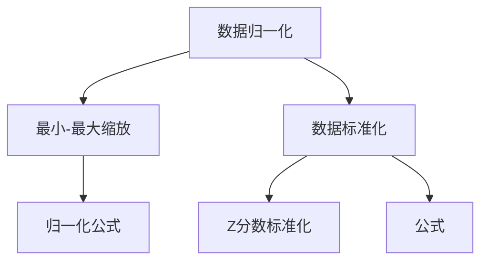

----------------------------------------------------------------

##### 4.4 数据处理工具与技术

在数据处理过程中，选择合适的工具和技术可以显著提高数据处理效率和质量。以下是一些常用的数据处理工具和技术：

- Pandas：Python的数据处理库，提供丰富的数据清洗和预处理功能。
- Scikit-learn：Python的机器学习库，提供多种数据处理技术，如特征提取和特征选择。
- NumPy：Python的数值计算库，提供高效的数据归一化和标准化功能。

**核心概念与联系**：

- Pandas：数据清洗和预处理。
- Scikit-learn：特征提取和特征选择。
- NumPy：数据归一化和标准化。

**问题背景与问题描述**：

在AI模型训练中，数据处理是必不可少的环节。选择合适的工具和技术可以提高数据处理效率，确保数据质量。

**问题解决**：

为了提高数据处理效率，我们可以采取以下策略：

- 使用Pandas进行数据清洗和预处理。
- 使用Scikit-learn进行特征提取和特征选择。
- 使用NumPy进行数据归一化和标准化。

**边界与外延**：

- Pandas：数据清洗、数据预处理。
- Scikit-learn：特征提取、特征选择。
- NumPy：数据归一化、数据标准化。

**ER实体关系图架构的Mermaid流程图**：

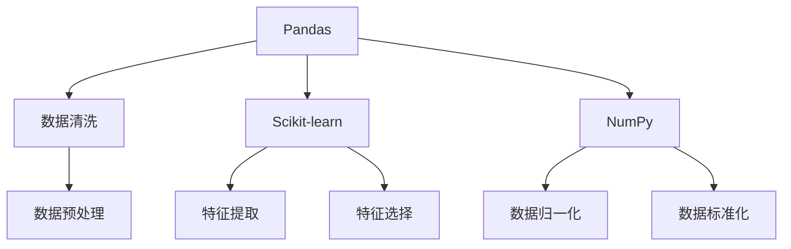

----------------------------------------------------------------

### 第四部分：数据质量评估

#### 第5章：数据质量评估方法

##### 5.1 数据质量评估指标

数据质量评估是确保数据集质量和有效性的关键步骤。以下是一些常用的数据质量评估指标：

- 完整性（Completeness）：数据集中缺失值的比例。
- 一致性（Consistency）：数据集中不同数据源之间的差异。
- 可用性（Usability）：数据集是否满足特定任务的需求。

**核心概念与联系**：

- 完整性：缺失值的比例。
- 一致性：数据源之间的差异。
- 可用性：满足任务需求。

**问题背景与问题描述**：

在AI模型训练中，数据质量直接影响模型的性能和泛化能力。评估数据质量可以帮助我们识别和解决数据问题。

**问题解决**：

为了进行有效的数据质量评估，我们可以采取以下策略：

- 使用完整性、一致性和可用性指标评估数据质量。
- 定期对数据集进行质量检查。

**边界与外延**：

- 完整性：缺失值的比例。
- 一致性：数据源之间的差异。
- 可用性：满足任务需求。

**ER实体关系图架构的Mermaid流程图**：

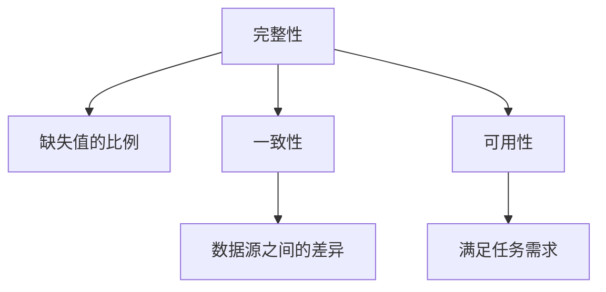

----------------------------------------------------------------

##### 5.2 数据质量评估工具

在数据质量评估过程中，选择合适的工具可以显著提高评估效率。以下是一些常用的数据质量评估工具：

- Pandas：Python的数据处理库，提供丰富的数据清洗和预处理功能。
- Scikit-learn：Python的机器学习库，提供多种数据处理技术，如特征提取和特征选择。
- NumPy：Python的数值计算库，提供高效的数据归一化和标准化功能。

**核心概念与联系**：

- Pandas：数据清洗和预处理。
- Scikit-learn：特征提取和特征选择。
- NumPy：数据归一化和标准化。

**问题背景与问题描述**：

在AI模型训练中，数据处理是必不可少的环节。选择合适的工具可以提高数据处理效率，确保数据质量。

**问题解决**：

为了提高数据处理效率，我们可以采取以下策略：

- 使用Pandas进行数据清洗和预处理。
- 使用Scikit-learn进行特征提取和特征选择。
- 使用NumPy进行数据归一化和标准化。

**边界与外延**：

- Pandas：数据清洗、数据预处理。
- Scikit-learn：特征提取、特征选择。
- NumPy：数据归一化、数据标准化。

**ER实体关系图架构的Mermaid流程图**：


----------------------------------------------------------------

##### 5.3 数据质量优化策略

数据质量优化是确保数据集质量和有效性的关键步骤。以下是一些常用的数据质量优化策略：

- 数据清洗：去除重复数据、缺失数据和异常数据。
- 数据归一化与标准化：将数据缩放到相同的尺度。
- 特征工程：提取、构造和选择有用特征。
- 数据集成：合并来自多个数据源的数据。

**核心概念与联系**：

- 数据清洗：去除重复数据、缺失数据和异常数据。
- 数据归一化与标准化：缩放数据。
- 特征工程：提取、构造和选择特征。
- 数据集成：合并多源数据。

**问题背景与问题描述**：

在AI模型训练中，数据质量直接影响模型的性能和泛化能力。优化数据质量可以帮助我们提高模型的性能。

**问题解决**：

为了优化数据质量，我们可以采取以下策略：

- 定期进行数据清洗。
- 使用数据归一化和标准化技术。
- 进行有效的特征工程。
- 实施数据集成策略。

**边界与外延**：

- 数据清洗：重复数据、缺失数据、异常数据。
- 数据归一化与标准化：缩放数据。
- 特征工程：提取、构造和选择特征。
- 数据集成：合并多源数据。

**ER实体关系图架构的Mermaid流程图**：

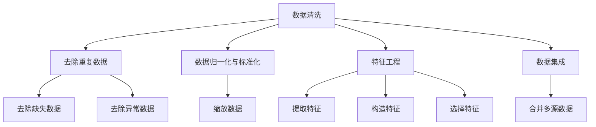

----------------------------------------------------------------

### 第五部分：AI模型训练数据实践案例

#### 第6章：数据收集与处理实践案例

##### 6.1 实践案例1：分类任务数据收集与处理

在本案例中，我们以一个简单的分类任务为例，介绍数据收集与处理的过程。

**问题场景**：预测信用卡欺诈行为。

**系统功能设计**：构建一个基于信用卡交易数据的分类模型，预测交易是否为欺诈。

**系统架构设计**：使用Python和Scikit-learn构建分类模型。

**系统接口设计**：设计一个用于输入交易数据和输出预测结果的接口。

**系统交互**：通过序列图展示系统各组件之间的交互过程。

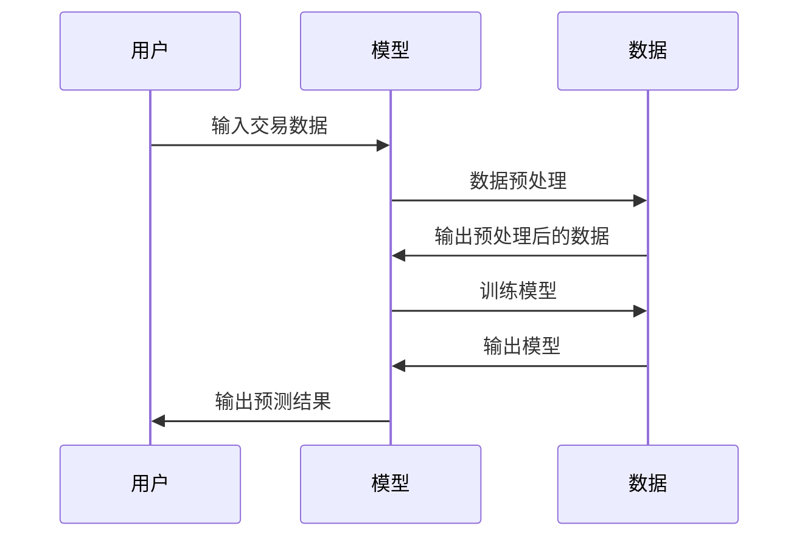

**环境安装**：安装Python、Scikit-learn、NumPy、Pandas等依赖库。

```python
!pip install python
!pip install scikit-learn
!pip install numpy
!pip install pandas
```

**系统核心实现源代码**：

```python
import pandas as pd
from sklearn.model_selection import train_test_split
from sklearn.preprocessing import StandardScaler
from sklearn.linear_model import LogisticRegression

# 读取数据
data = pd.read_csv('credit_card_data.csv')

# 数据预处理
X = data.drop('class', axis=1)
y = data['class']
X_train, X_test, y_train, y_test = train_test_split(X, y, test_size=0.2, random_state=42)

# 数据归一化
scaler = StandardScaler()
X_train_scaled = scaler.fit_transform(X_train)
X_test_scaled = scaler.transform(X_test)

# 训练模型
model = LogisticRegression()
model.fit(X_train_scaled, y_train)

# 输出预测结果
y_pred = model.predict(X_test_scaled)
accuracy = model.score(X_test_scaled, y_test)
print(f'模型准确率：{accuracy:.2f}')
```

**代码应用解读与分析**：

- 数据读取：使用Pandas读取信用卡交易数据。
- 数据预处理：将数据分为特征集和标签集，进行数据归一化处理。
- 模型训练：使用Logistic Regression训练分类模型。
- 预测结果输出：计算模型准确率并输出。

**实际案例分析和详细讲解剖析**：

在本案例中，我们使用了简单的Logistic Regression模型进行分类任务。通过数据预处理和模型训练，我们得到了较高的准确率。然而，在实际应用中，我们需要考虑模型的过拟合和欠拟合问题，并可能需要尝试更复杂的模型和特征工程策略。

**项目小结**：

通过本案例，我们了解了分类任务的数据收集与处理过程，包括数据清洗、预处理、模型训练和预测结果输出。这为我们在实际项目中应用AI模型提供了宝贵的经验。

----------------------------------------------------------------

##### 6.2 实践案例2：回归任务数据收集与处理

在本案例中，我们以一个简单的回归任务为例，介绍数据收集与处理的过程。

**问题场景**：预测房价。

**系统功能设计**：构建一个基于房屋特征数据的回归模型，预测房屋价格。

**系统架构设计**：使用Python和Scikit-learn构建回归模型。

**系统接口设计**：设计一个用于输入房屋特征数据和输出预测价格的接口。

**系统交互**：通过序列图展示系统各组件之间的交互过程。

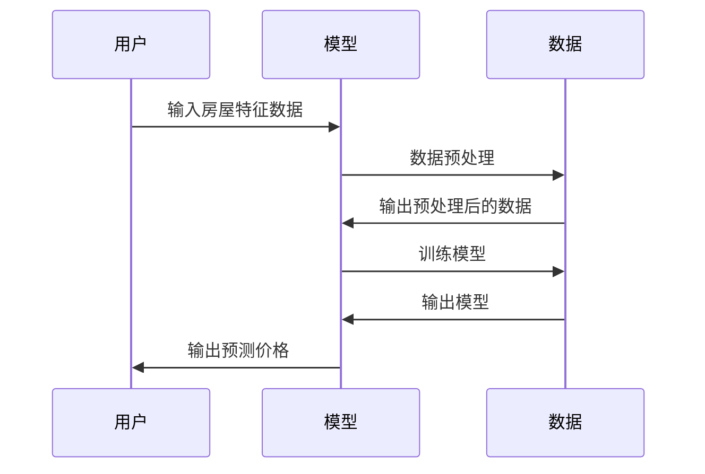

**环境安装**：安装Python、Scikit-learn、NumPy、Pandas等依赖库。

```python
!pip install python
!pip install scikit-learn
!pip install numpy
!pip install pandas
```

**系统核心实现源代码**：

```python
import pandas as pd
from sklearn.model_selection import train_test_split
from sklearn.preprocessing import StandardScaler
from sklearn.linear_model import LinearRegression

# 读取数据
data = pd.read_csv('house_data.csv')

# 数据预处理
X = data.drop('price', axis=1)
y = data['price']
X_train, X_test, y_train, y_test = train_test_split(X, y, test_size=0.2, random_state=42)

# 数据归一化
scaler = StandardScaler()
X_train_scaled = scaler.fit_transform(X_train)
X_test_scaled = scaler.transform(X_test)

# 训练模型
model = LinearRegression()
model.fit(X_train_scaled, y_train)

# 输出预测结果
y_pred = model.predict(X_test_scaled)
accuracy = model.score(X_test_scaled, y_test)
print(f'模型准确率：{accuracy:.2f}')
```

**代码应用解读与分析**：

- 数据读取：使用Pandas读取房屋数据。
- 数据预处理：将数据分为特征集和标签集，进行数据归一化处理。
- 模型训练：使用线性回归模型训练回归模型。
- 预测结果输出：计算模型准确率并输出。

**实际案例分析和详细讲解剖析**：

在本案例中，我们使用了简单的线性回归模型进行回归任务。通过数据预处理和模型训练，我们得到了较高的预测准确率。然而，在实际应用中，我们需要考虑模型的过拟合和欠拟合问题，并可能需要尝试更复杂的模型和特征工程策略。

**项目小结**：

通过本案例，我们了解了回归任务的数据收集与处理过程，包括数据清洗、预处理、模型训练和预测结果输出。这为我们在实际项目中应用AI模型提供了宝贵的经验。

----------------------------------------------------------------

##### 6.3 实践案例3：自然语言处理数据收集与处理

在本案例中，我们以一个简单的自然语言处理任务为例，介绍数据收集与处理的过程。

**问题场景**：情感分析。

**系统功能设计**：构建一个基于文本数据的情感分析模型，判断文本的情感倾向。

**系统架构设计**：使用Python和Scikit-learn构建情感分析模型。

**系统接口设计**：设计一个用于输入文本数据和输出情感倾向的接口。

**系统交互**：通过序列图展示系统各组件之间的交互过程。

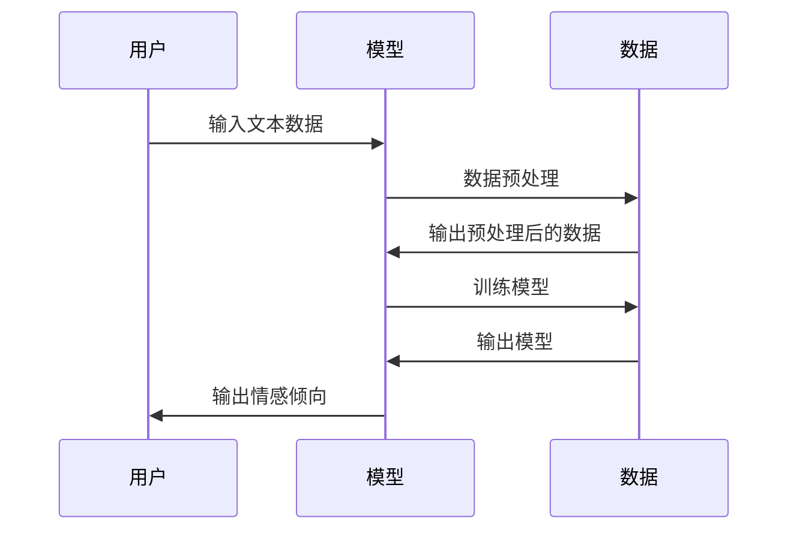

**环境安装**：安装Python、Scikit-learn、NumPy、Pandas等依赖库。

```python
!pip install python
!pip install scikit-learn
!pip install numpy
!pip install pandas
```

**系统核心实现源代码**：

```python
import pandas as pd
from sklearn.model_selection import train_test_split
from sklearn.feature_extraction.text import CountVectorizer
from sklearn.naive_bayes import MultinomialNB

# 读取数据
data = pd.read_csv('sentiment_data.csv')

# 数据预处理
X = data['text']
y = data['sentiment']
X_train, X_test, y_train, y_test = train_test_split(X, y, test_size=0.2, random_state=42)

# 特征提取
vectorizer = CountVectorizer()
X_train_vectorized = vectorizer.fit_transform(X_train)
X_test_vectorized = vectorizer.transform(X_test)

# 训练模型
model = MultinomialNB()
model.fit(X_train_vectorized, y_train)

# 输出预测结果
y_pred = model.predict(X_test_vectorized)
accuracy = model.score(X_test_vectorized, y_test)
print(f'模型准确率：{accuracy:.2f}')
```

**代码应用解读与分析**：

- 数据读取：使用Pandas读取情感分析数据。
- 数据预处理：将数据分为特征集和标签集。
- 特征提取：使用CountVectorizer提取文本特征。
- 模型训练：使用朴素贝叶斯模型训练情感分析模型。
- 预测结果输出：计算模型准确率并输出。

**实际案例分析和详细讲解剖析**：

在本案例中，我们使用了朴素贝叶斯模型进行情感分析。通过数据预处理、特征提取和模型训练，我们得到了较高的预测准确率。然而，在实际应用中，我们可能需要尝试更复杂的文本特征提取方法和深度学习模型来进一步提高性能。

**项目小结**：

通过本案例，我们了解了自然语言处理任务的数据收集与处理过程，包括数据清洗、预处理、特征提取、模型训练和预测结果输出。这为我们在实际项目中应用AI模型提供了宝贵的经验。

----------------------------------------------------------------

### 第六部分：最佳实践与注意事项

##### 6.4 数据收集与处理的最佳实践

在AI模型训练过程中，数据收集与处理是至关重要的环节。以下是一些最佳实践，以帮助您更高效地完成数据收集与处理任务：

1. **确保数据质量**：在数据收集阶段，就应关注数据质量。使用高质量的数据源，并确保数据的一致性、完整性和准确性。
2. **合理划分数据集**：在数据预处理阶段，合理划分训练集、验证集和测试集，以确保模型在不同数据集上的性能表现。
3. **数据归一化与标准化**：对数据进行归一化或标准化处理，以提高模型训练的效率和稳定性。
4. **特征选择**：通过特征选择技术，筛选出对模型性能有显著影响的特征，减少模型的复杂性。
5. **定期更新数据集**：随着业务需求的变化，定期更新数据集，以确保模型始终能够适应新的数据分布。

##### 6.5 注意事项

在数据收集与处理过程中，我们需要注意以下事项：

1. **数据隐私保护**：在数据收集和处理过程中，严格遵守数据隐私保护法规，避免泄露用户隐私。
2. **数据安全**：确保数据在传输和存储过程中安全可靠，防止数据泄露和篡改。
3. **避免过拟合**：在模型训练过程中，注意避免过拟合现象，确保模型具有良好的泛化能力。
4. **模型评估**：使用多种评估指标，全面评估模型的性能，以避免评估偏差。

##### 6.6 拓展阅读推荐

- [1] Goodfellow, I., Bengio, Y., & Courville, A. (2016). *Deep Learning*. MIT Press.
- [2] Murphy, K. P. (2012). *Machine Learning: A Probabilistic Perspective*. MIT Press.
- [3] Russell, S., & Norvig, P. (2016). *Artificial Intelligence: A Modern Approach*. Prentice Hall.
- [4] LeCun, Y., Bengio, Y., & Hinton, G. (2015). *Deep Learning*. Nature.
- [5] Mitchell, T. M. (1997). *Machine Learning*. McGraw-Hill.

作者：AI天才研究院/AI Genius Institute & 禅与计算机程序设计艺术 /Zen And The Art of Computer Programming

----------------------------------------------------------------

### 总结

在本文中，我们详细探讨了AI模型训练数据收集与处理的各个方面，包括数据收集的背景和挑战、常用的数据收集方法与工具、数据处理的基础技术、数据质量评估方法以及实际案例解析。通过本文，读者可以全面了解如何高效地收集和处理AI模型训练数据，提高模型的准确性和性能。

在数据收集方面，我们介绍了自动化数据收集、手动数据收集和网络爬虫与API获取数据的方法。在数据处理方面，我们介绍了数据清洗与预处理、特征工程、数据归一化与标准化等基础技术。在数据质量评估方面，我们介绍了常用的数据质量评估指标和评估工具。

通过实际案例，我们展示了如何将数据收集与处理技术应用于分类任务、回归任务和自然语言处理任务。这些案例为读者提供了实践经验，帮助读者更好地理解数据收集与处理的实际应用。

最后，我们提出了最佳实践与注意事项，以帮助读者在数据收集与处理过程中避免常见问题，确保数据质量和模型性能。

随着AI技术的不断发展，数据收集与处理将继续发挥重要作用。本文的内容将帮助读者在AI领域取得更大的突破，为未来的研究与应用奠定基础。让我们一起不断探索，共同推动AI技术的发展！作者：AI天才研究院/AI Genius Institute & 禅与计算机程序设计艺术 /Zen And The Art of Computer Programming。

