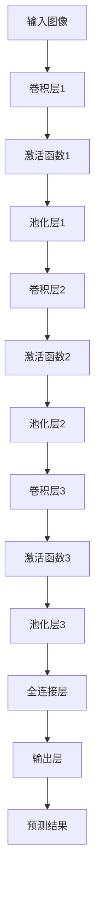
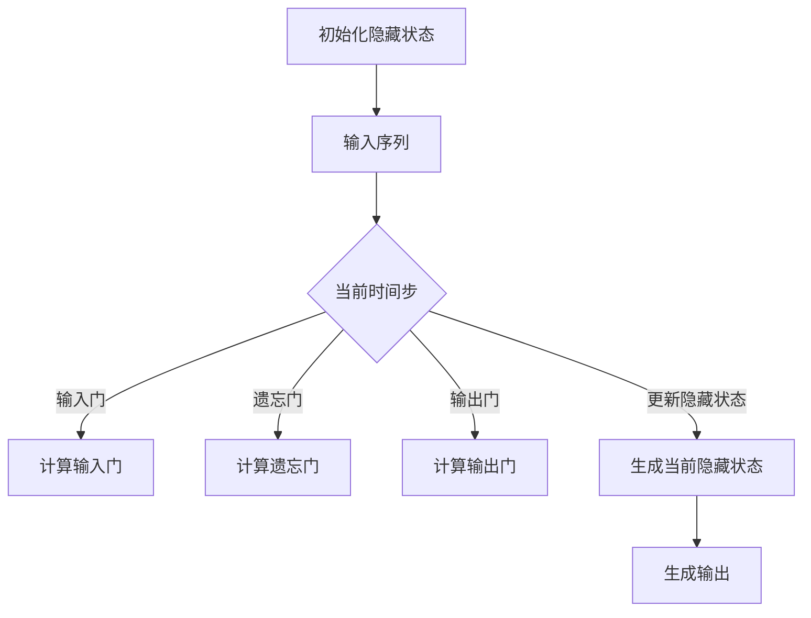
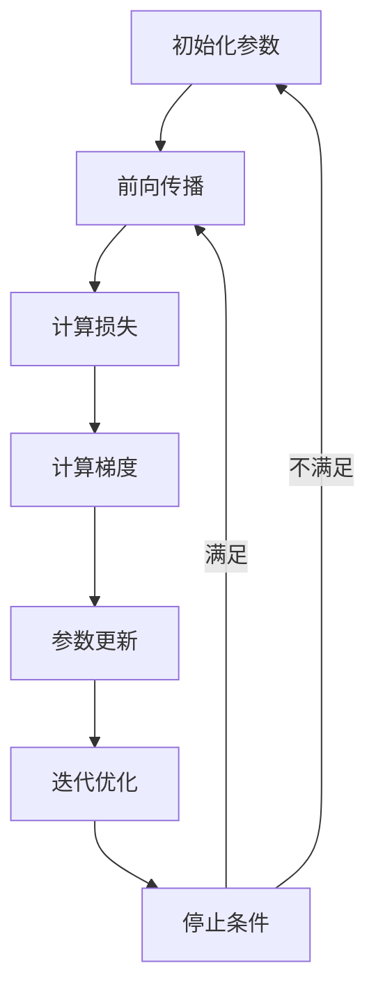

                 

### 1.1 问题背景

随着大数据和云计算技术的飞速发展，人工智能（AI）已成为现代科技领域的热门话题。AI技术不仅在科研、工业、医疗、金融等多个领域取得了显著的成果，还在我们的日常生活中扮演着越来越重要的角色。然而，AI技术的核心——模型训练，是一个复杂而关键的过程。无论是深度学习模型、强化学习模型还是传统的机器学习模型，它们的训练过程都直接决定了模型的性能和效果。

在实际应用中，AI模型训练面临诸多挑战。首先，数据的质量和数量直接影响了模型训练的效果。高质量、多样化的数据有助于模型更好地学习和泛化，但数据收集、清洗和转换过程往往耗费大量时间和资源。其次，模型设计需要考虑到多种因素，如网络架构、参数配置等，不同因素之间的相互作用可能导致训练过程的不稳定和结果的不一致。最后，模型训练过程本身也是一个试错和优化的过程，如何快速有效地调整模型参数、选择合适的训练策略，是提高模型性能的关键。

本文旨在深入探讨AI模型训练的步骤与最佳实践，通过系统化的讲解，帮助读者全面理解AI模型训练的原理、方法和技术，从而在实际应用中能够更高效地进行模型训练，提高模型性能。

### 1.2 核心概念

在讨论AI模型训练之前，有必要明确一些核心概念，以便为后续内容奠定基础。

#### 1.2.1 AI模型训练的定义

AI模型训练，也称为机器学习模型的训练，是指通过输入数据集，利用算法对模型进行调整和优化，使其能够对新的数据进行准确预测或分类的过程。简而言之，模型训练是机器学习过程中最重要的环节之一，它决定了模型的学习能力和性能。

#### 1.2.2 AI模型训练的重要性

AI模型训练的重要性主要体现在以下几个方面：

1. **学习与泛化能力**：通过训练，模型能够从已有的数据中学习并提取出有用的信息，从而在新数据上实现泛化，做出准确的预测。
2. **优化性能**：模型训练能够通过调整模型参数，优化模型结构，从而提高模型的准确度、速度和稳定性。
3. **应用广泛**：几乎所有的AI应用，如图像识别、自然语言处理、语音识别等，都需要经过模型训练才能实现功能。

#### 1.2.3 AI模型训练的基本流程

AI模型训练的基本流程可以分为以下几个步骤：

1. **数据收集与预处理**：收集和准备用于训练的数据，包括清洗、转换和标准化等步骤。
2. **模型设计**：根据应用需求选择合适的模型架构，并设置模型参数。
3. **模型训练**：使用训练数据对模型进行训练，通过调整参数和优化算法，使模型达到期望的性能。
4. **模型评估与调优**：通过测试数据评估模型性能，并根据评估结果对模型进行进一步优化。
5. **模型部署与维护**：将训练好的模型部署到实际应用环境中，并进行持续监控和更新。

#### 1.2.4 模型训练方法

AI模型训练的方法主要包括监督学习、无监督学习和强化学习：

1. **监督学习**：在有标签的数据集上进行训练，模型通过学习输入和输出之间的关系来预测新数据。
2. **无监督学习**：在没有标签的数据集上进行训练，模型主要学习数据的结构和特征，如聚类和降维。
3. **强化学习**：通过与环境交互，模型不断学习和调整策略，以最大化奖励。

理解这些核心概念，将为读者更好地掌握AI模型训练的方法和技巧打下坚实的基础。在接下来的章节中，我们将详细探讨这些核心概念的具体实现和应用。

#### 1.2.4.1 AI模型训练的基本流程

AI模型训练的基本流程可以概括为以下几个步骤，每个步骤都在模型训练中起着关键作用：

1. **数据收集与预处理**：
    - 数据收集：首先需要收集大量且高质量的数据，这些数据将用于训练模型。数据来源可以包括公开数据集、企业内部数据、网络爬虫等。
    - 数据预处理：包括数据清洗、数据转换和数据标准化。数据清洗旨在去除噪声和错误数据，数据转换涉及将数据格式统一化，数据标准化则确保数据在训练过程中具有相同的尺度。

2. **模型设计**：
    - 模型选择：根据应用需求，选择适合的模型类型，如深度学习模型、传统机器学习模型等。
    - 网络架构设计：设计模型的网络架构，包括输入层、隐藏层和输出层。对于深度学习模型，还需要考虑网络层数、神经元数量、激活函数等参数。

3. **模型训练**：
    - 模型编译：设置训练参数，如学习率、优化器、损失函数等，并编译模型。
    - 训练过程：使用训练数据对模型进行训练。训练过程中，模型会不断调整参数，以最小化损失函数，提高模型性能。

4. **模型评估与调优**：
    - 评估模型：使用测试数据评估模型性能，常用的评估指标包括准确率、召回率、F1分数等。
    - 模型调优：根据评估结果对模型进行调优，包括调整参数、优化网络结构等。

5. **模型部署与维护**：
    - 模型部署：将训练好的模型部署到生产环境中，实现实际应用。
    - 模型更新与维护：定期对模型进行更新和维护，以适应新的数据和应用需求。

通过这些步骤，我们可以系统地完成AI模型的训练过程，从而实现模型的应用和优化。在下一部分中，我们将深入探讨AI模型训练的基本原理，包括反向传播算法和梯度下降算法。

### 2.1 概念介绍

在深入探讨AI模型训练的基本原理之前，我们需要首先了解两个关键算法：反向传播算法和梯度下降算法。这两个算法是AI模型训练的核心，为模型的优化和参数调整提供了理论依据。

#### 2.1.1 反向传播算法

反向传播算法（Backpropagation Algorithm）是深度学习模型训练中的核心算法，它用于计算网络中每个神经元的误差并将其反向传播到网络的前一层。反向传播算法主要包含以下几个步骤：

1. **前向传播**：输入数据通过网络中的神经元层，逐层传递至输出层，产生预测结果。
2. **计算损失**：将预测结果与真实标签进行比较，计算损失函数（如均方误差、交叉熵损失等）的值。
3. **计算误差**：通过损失函数的导数计算每一层神经元的误差。
4. **反向传播**：将误差反向传播至前一层的神经元，更新前一层神经元的权重和偏置。
5. **权重更新**：根据误差和梯度，使用优化算法（如梯度下降）更新网络中的权重。

#### 2.1.2 梯度下降算法

梯度下降算法（Gradient Descent Algorithm）是一种优化算法，用于在多维空间中找到函数的局部最小值。在AI模型训练中，梯度下降算法用于调整模型的参数，以最小化损失函数。梯度下降算法的主要步骤如下：

1. **初始化参数**：随机初始化模型的参数（如权重和偏置）。
2. **计算梯度**：计算损失函数关于每个参数的梯度。
3. **更新参数**：根据梯度方向和步长，更新模型的参数。
4. **迭代优化**：重复计算梯度和更新参数的过程，直到满足停止条件（如达到预设的损失值或迭代次数）。

梯度下降算法有多种变体，包括随机梯度下降（Stochastic Gradient Descent, SGD）、批量梯度下降（Batch Gradient Descent）和自适应梯度方法（如Adam优化器）等，每种方法都有其特定的适用场景和优缺点。

理解反向传播算法和梯度下降算法的概念，是掌握AI模型训练原理的基础。在接下来的章节中，我们将详细讲解这些算法的数学模型和具体应用，以便读者能够更深入地理解AI模型训练的核心机制。

#### 2.2.1.1 反向传播算法原理

反向传播算法是深度学习模型训练过程中至关重要的优化工具，它基于梯度下降原理，通过反向传播误差来更新模型参数，从而逐步减小损失函数的值。以下是反向传播算法的详细原理：

1. **前向传播**：输入数据首先通过网络的输入层，经过一系列隐藏层，最终传递到输出层。每个神经元都会执行线性变换，并应用一个激活函数，以产生预测输出。这一过程可以用以下公式表示：

   \[
   \text{激活函数}(z) = f(\text{权重} \cdot \text{输入} + \text{偏置})
   \]

   其中，\( f \) 是激活函数，如ReLU、Sigmoid或Tanh等。

2. **计算预测误差**：输出层的预测结果与真实标签进行比较，通过损失函数（如均方误差、交叉熵等）计算损失值。损失函数反映了预测结果与真实结果之间的差距。

   \[
   L = \frac{1}{2} \sum_{i} (y_i - \hat{y}_i)^2
   \]

   其中，\( y_i \) 是真实标签，\( \hat{y}_i \) 是预测结果。

3. **计算梯度**：通过链式法则计算每个参数的梯度。链式法则用于计算复合函数的导数，它可以分解为多个简单函数的导数的乘积。在反向传播过程中，我们首先从输出层开始，计算输出层每个神经元的误差关于其输入的梯度，然后逐步向前层传递，计算每个隐藏层神经元的误差关于其输入的梯度。具体步骤如下：

   - 计算输出层的误差梯度：
     
     \[
     \delta_{\text{输出}} = \frac{\partial L}{\partial z} = (y - \hat{y}) \cdot \frac{d\hat{y}}{dz}
     \]

   - 逐步向前层传播误差，计算每个隐藏层的误差梯度：
     
     \[
     \delta_{l} = \delta_{l+1} \cdot \frac{d\hat{a}_{l+1}}{da_l} \cdot \text{激活函数的导数}(a_l)
     \]

     其中，\( \delta_{l} \) 是第 \( l \) 层的误差梯度，\( \hat{a}_{l+1} \) 是第 \( l+1 \) 层的输出，\( a_l \) 是第 \( l \) 层的输入。

4. **更新参数**：根据误差梯度，使用优化算法（如梯度下降）更新模型的参数。更新公式如下：

   \[
   \theta_{\text{更新}} = \theta - \alpha \cdot \frac{\partial L}{\partial \theta}
   \]

   其中，\( \theta \) 是模型参数，\( \alpha \) 是学习率。

通过以上步骤，反向传播算法能够不断调整模型参数，使得损失函数值逐渐减小，从而提高模型性能。理解反向传播算法的原理，对于掌握AI模型训练过程和优化策略至关重要。

#### 2.2.1.2 数学模型与公式

反向传播算法的核心在于计算每个参数的梯度，并利用这些梯度来更新模型的参数，从而最小化损失函数。以下是反向传播算法涉及的几个关键数学模型和公式：

1. **损失函数**：
   假设我们有 \( n \) 个训练样本，每个样本由输入特征 \( x_i \) 和标签 \( y_i \) 组成。预测输出为 \( \hat{y}_i \)，损失函数通常选择均方误差（MSE）或交叉熵损失（Cross Entropy Loss）。均方误差损失函数的定义如下：

   \[
   L(\theta) = \frac{1}{2n} \sum_{i=1}^{n} (y_i - \hat{y}_i)^2
   \]

   其中，\( \theta \) 是模型参数集。

2. **前向传播**：
   前向传播是计算网络输出和中间层激活值的过程。设输入为 \( x \)，权重为 \( \theta \)，偏置为 \( b \)，激活函数为 \( f \)。则前向传播的输出可以表示为：

   \[
   a_{l+1} = \text{激活函数}(\theta \cdot x + b)
   \]

   对于深度网络，输出可以写成矩阵形式：

   \[
   \mathbf{A}_{l+1} = f(\mathbf{W}_{l+1} \mathbf{A}_l + \mathbf{b}_{l+1})
   \]

3. **反向传播**：
   反向传播是计算损失关于参数的梯度。以下是一些关键梯度公式：

   - 输出层的误差梯度（对于MSE损失函数）：

     \[
     \delta_{\text{输出}} = (y - \hat{y}) \cdot f'(\hat{y})
     \]

   - 隐藏层的误差梯度：

     \[
     \delta_{l} = \delta_{l+1} \cdot f'(\mathbf{A}_{l+1}) \cdot \mathbf{W}_{l+1}
     \]

   - 参数的梯度：

     \[
     \frac{\partial L}{\partial \theta} = \delta_{l} \cdot \mathbf{A}_{l}
     \]

     其中，\( f' \) 是激活函数的导数。

4. **参数更新**：
   使用梯度下降更新参数，公式如下：

   \[
   \theta_{\text{更新}} = \theta - \alpha \cdot \frac{\partial L}{\partial \theta}
   \]

   其中，\( \alpha \) 是学习率。

通过上述数学模型和公式，我们可以理解反向传播算法如何计算梯度并更新模型参数，从而优化模型的性能。

#### 2.2.1.3 举例说明

为了更直观地理解反向传播算法，我们通过一个简单的例子来展示其计算过程。假设我们有一个两层神经网络，输入层有2个神经元，隐藏层有3个神经元，输出层有1个神经元。激活函数使用ReLU，损失函数使用均方误差。

1. **模型参数**：
   - 输入：\[ x_1, x_2 \]
   - 输出：\[ y \]
   - 权重和偏置：
     \[
     \mathbf{W}_1 = \begin{bmatrix}
     w_{11} & w_{12} \\
     w_{21} & w_{22} \\
     w_{31} & w_{32}
     \end{bmatrix}, \quad
     \mathbf{b}_1 = \begin{bmatrix}
     b_{11} \\
     b_{21} \\
     b_{31}
     \end{bmatrix}, \quad
     \mathbf{W}_2 = \begin{bmatrix}
     w_{12}
     \end{bmatrix}, \quad
     \mathbf{b}_2 = \begin{bmatrix}
     b_{2}
     \end{bmatrix}
     \]

2. **前向传播**：
   - 隐藏层输出：
     \[
     \mathbf{Z}_1 = \mathbf{W}_1 \cdot \mathbf{x} + \mathbf{b}_1 = \begin{bmatrix}
     w_{11}x_1 + b_{11} \\
     w_{21}x_1 + b_{21} \\
     w_{31}x_1 + b_{31}
     \end{bmatrix}
     \]
     \[
     \mathbf{A}_1 = \text{ReLU}(\mathbf{Z}_1)
     \]
   - 输出层输出：
     \[
     \mathbf{Z}_2 = \mathbf{W}_2 \cdot \mathbf{A}_1 + \mathbf{b}_2 = \begin{bmatrix}
     w_{12}a_{11} + b_{2}
     \end{bmatrix}
     \]
     \[
     \hat{y} = \text{ReLU}(\mathbf{Z}_2)
     \]

3. **计算误差和梯度**：
   - 假设真实标签为 \( y = 1 \)，预测输出为 \( \hat{y} = 0.9 \)，损失函数为均方误差：
     \[
     L = \frac{1}{2} (1 - 0.9)^2 = 0.05
     \]
   - 输出层误差梯度：
     \[
     \delta_{\text{输出}} = (1 - 0.9) \cdot \frac{d\hat{y}}{dz} = 0.1 \cdot 1 = 0.1
     \]
   - 隐藏层误差梯度：
     \[
     \delta_1 = 0.1 \cdot 1 = 0.1
     \]
   - 参数梯度：
     \[
     \frac{\partial L}{\partial w_{12}} = \delta_1 \cdot a_1 = 0.1 \cdot a_{11} = 0.1 \cdot 1 = 0.1
     \]

4. **更新参数**：
   - 假设学习率为 \( \alpha = 0.1 \)：
     \[
     w_{12}^{新} = w_{12} - \alpha \cdot \frac{\partial L}{\partial w_{12}} = 1 - 0.1 \cdot 0.1 = 0.9
     \]

通过这个简单的例子，我们可以看到反向传播算法如何计算误差和更新参数，从而逐步优化模型性能。

#### 2.2.2 梯度下降算法原理

梯度下降算法（Gradient Descent）是一种基于梯度的优化算法，用于最小化目标函数（损失函数）。在AI模型训练中，梯度下降算法通过迭代计算损失函数关于模型参数的梯度，并沿梯度的反方向更新参数，以达到最小化损失的目的。

梯度下降算法的基本思想是：在当前参数点处，计算损失函数的梯度，并沿梯度的方向（即梯度下降的方向）更新参数。具体步骤如下：

1. **初始化参数**：随机初始化模型参数（如权重和偏置）。
2. **计算梯度**：计算损失函数关于每个参数的梯度。对于多维函数，梯度是一个向量，其方向指向函数增加最快的方向。
3. **更新参数**：根据梯度方向和步长（learning rate），更新模型参数。更新公式为：
   \[
   \theta_{\text{更新}} = \theta - \alpha \cdot \nabla_{\theta} L
   \]
   其中，\( \theta \) 是模型参数，\( \alpha \) 是学习率，\( \nabla_{\theta} L \) 是损失函数关于参数 \( \theta \) 的梯度。
4. **迭代优化**：重复步骤2和3，直到满足停止条件（如达到预设的损失值或迭代次数）。

梯度下降算法有多种变体，包括：

- **批量梯度下降（Batch Gradient Descent）**：每次迭代使用所有训练样本的梯度进行更新，计算量大但收敛性好。
- **随机梯度下降（Stochastic Gradient Descent, SGD）**：每次迭代仅使用一个样本的梯度进行更新，计算量小但收敛性较差。
- **小批量梯度下降（Mini-batch Gradient Descent）**：每次迭代使用部分样本的梯度进行更新，在批量梯度下降和随机梯度下降之间取得平衡。

理解梯度下降算法的原理，对于掌握AI模型训练方法至关重要。在下一部分中，我们将通过数学模型和公式，进一步详细讲解梯度下降算法。

#### 2.2.2.2 数学模型与公式

梯度下降算法的核心在于计算目标函数（损失函数）关于模型参数的梯度，并沿梯度的反方向更新参数，以最小化目标函数。以下是梯度下降算法涉及的关键数学模型和公式：

1. **损失函数**：

   假设我们有一个包含 \( n \) 个样本的数据集，每个样本由输入特征 \( x_i \) 和标签 \( y_i \) 组成。模型的预测输出为 \( \hat{y}_i \)，常用的损失函数包括均方误差（MSE）和交叉熵损失（Cross Entropy Loss）。

   - 均方误差（MSE）：
     \[
     L(\theta) = \frac{1}{2n} \sum_{i=1}^{n} (y_i - \hat{y}_i)^2
     \]
   
   - 交叉熵损失：
     \[
     L(\theta) = -\frac{1}{n} \sum_{i=1}^{n} y_i \cdot \log(\hat{y}_i) + (1 - y_i) \cdot \log(1 - \hat{y}_i)
     \]

2. **梯度计算**：

   梯度是损失函数关于模型参数的导数。对于多层神经网络，损失函数关于权重和偏置的梯度可以使用链式法则进行计算。

   - 对于权重 \( \theta \) 的梯度：
     \[
     \frac{\partial L}{\partial \theta} = \delta \cdot a_{\text{前一层}}
     \]
     其中，\( \delta \) 是误差梯度，\( a_{\text{前一层}} \) 是前一层的激活值。

   - 对于偏置 \( b \) 的梯度：
     \[
     \frac{\partial L}{\partial b} = \delta
     \]

3. **参数更新**：

   参数更新公式为：
   \[
   \theta_{\text{更新}} = \theta - \alpha \cdot \frac{\partial L}{\partial \theta}
   \]
   其中，\( \alpha \) 是学习率，它决定了每次迭代参数更新的步长。

通过上述数学模型和公式，我们可以系统地理解梯度下降算法的计算过程和参数更新策略。在下一部分中，我们将通过一个具体的例子，展示如何应用梯度下降算法进行模型训练。

#### 2.2.2.3 举例说明

为了更直观地理解梯度下降算法，我们通过一个简单的线性回归问题进行说明。假设我们有以下数据集：

- 数据集：\( D = \{ (x_1, y_1), (x_2, y_2), ..., (x_n, y_n) \} \)
- 模型：\( y = w \cdot x + b \)
- 损失函数：\( L(w, b) = \frac{1}{2n} \sum_{i=1}^{n} (y_i - (w \cdot x_i + b))^2 \)

我们的目标是找到合适的 \( w \) 和 \( b \) 使得损失函数最小。

1. **初始化参数**：
   - 随机初始化 \( w \) 和 \( b \)，例如 \( w = 0.1 \)，\( b = 0.1 \)。

2. **计算梯度**：

   对于每个样本 \( (x_i, y_i) \)：

   - 计算预测值：
     \[
     \hat{y}_i = w \cdot x_i + b
     \]
   - 计算误差：
     \[
     \delta_i = y_i - \hat{y}_i
     \]
   - 计算梯度：
     \[
     \frac{\partial L}{\partial w} = \frac{1}{n} \sum_{i=1}^{n} x_i \cdot \delta_i
     \]
     \[
     \frac{\partial L}{\partial b} = \frac{1}{n} \sum_{i=1}^{n} \delta_i
     \]

3. **更新参数**：

   使用学习率 \( \alpha \) 进行参数更新：
   \[
   w_{\text{更新}} = w - \alpha \cdot \frac{\partial L}{\partial w}
   \]
   \[
   b_{\text{更新}} = b - \alpha \cdot \frac{\partial L}{\partial b}
   \]

   例如，假设学习率 \( \alpha = 0.01 \)，经过一次迭代后，参数更新如下：
   \[
   w_{\text{更新}} = 0.1 - 0.01 \cdot (-0.1) = 0.11
   \]
   \[
   b_{\text{更新}} = 0.1 - 0.01 \cdot (-0.1) = 0.11
   \]

4. **重复迭代**：

   重复上述过程，每次迭代后计算新的梯度并更新参数，直到损失函数值不再显著下降或达到预设的迭代次数。

通过这个简单的例子，我们可以看到梯度下降算法如何通过迭代计算和更新参数，逐步减小损失函数，从而找到最优解。

### 3.1 数据收集

数据收集是AI模型训练过程中的第一步，也是至关重要的一步。高质量、多样化的数据是训练出高性能模型的前提。以下是数据收集的几个关键步骤：

1. **确定数据需求**：
   首先，我们需要明确模型训练所需的数据类型和数量。这包括输入特征、标签、数据格式和预处理要求等。例如，在图像识别任务中，需要收集大量的图像数据；在自然语言处理任务中，需要收集大量的文本数据。

2. **数据来源**：
   数据来源可以是多种多样的，包括公开数据集、企业内部数据、网络爬虫等。常见的公开数据集有MNIST手写数字识别数据集、CIFAR-10图像数据集、IMDB电影评论数据集等。对于企业内部数据，需要进行数据挖掘和清洗，以确保数据的质量和可用性。

3. **数据收集方法**：
   - **公开数据集**：可以直接从官方网站或数据平台下载。例如，Kaggle、UCI机器学习库、Google Dataset Search等。
   - **企业内部数据**：通过企业数据库、日志文件、用户行为数据等方式收集。
   - **网络爬虫**：使用Python的爬虫库（如BeautifulSoup、Scrapy）爬取互联网上的公开数据。

4. **数据预处理**：
   在数据收集后，通常需要进行预处理，以提高数据质量。预处理步骤包括数据清洗、数据转换和数据标准化。

   - **数据清洗**：去除重复数据、缺失数据、噪声数据和错误数据。
   - **数据转换**：将数据格式统一，如将图像数据转换为像素矩阵、将文本数据转换为词向量等。
   - **数据标准化**：将数据缩放到相同的尺度，如将数值数据缩放到0-1之间，以便模型训练。

通过系统化的数据收集方法，我们可以确保数据的质量和多样性，从而为后续的模型训练打下坚实的基础。

#### 3.2 数据清洗

数据清洗是数据预处理过程中至关重要的一步，其目的是去除数据中的噪声、错误和重复项，确保数据的质量和一致性。以下是数据清洗的几个关键步骤：

1. **去除重复数据**：
   在数据集中，重复数据可能会对模型训练产生不利影响。通过使用去重算法（如`DataFrame.drop_duplicates()`），可以有效地去除重复数据，从而减少冗余信息。

2. **处理缺失数据**：
   缺失数据可能是由于数据收集过程中的问题或数据格式不统一。处理缺失数据的方法包括：

   - **删除缺失数据**：对于少量缺失数据，可以直接删除这些记录。
   - **填充缺失数据**：使用统计方法或插值方法填充缺失数据。常用的方法有：
     - **均值填充**：用数据列的平均值填充缺失值。
     - **中值填充**：用数据列的中位数填充缺失值。
     - **众数填充**：用数据列的众数填充缺失值。
     - **插值法**：使用线性插值或高斯插值等方法填充缺失值。

3. **处理异常值**：
   异常值可能是由于数据收集过程中的错误或数据本身的不合理性。处理异常值的方法包括：

   - **删除异常值**：对于明显偏离数据分布的异常值，可以直接删除。
   - **修正异常值**：通过统计方法或专家知识修正异常值，使其更接近数据分布。

4. **数据格式标准化**：
   确保数据格式的一致性是保证数据质量的重要步骤。包括：
   - **统一编码**：将所有文本数据统一编码为UTF-8或其他标准编码格式。
   - **格式转换**：将不同格式的数据统一转换为模型可处理的格式，如将图像数据转换为像素矩阵、将文本数据转换为词向量等。

5. **数据验证**：
   在完成数据清洗后，进行数据验证以确保清洗效果。常用的验证方法包括：

   - **数据质量检查**：检查数据是否还存在重复、缺失或异常值。
   - **数据分布检查**：检查数据分布是否合理，是否需要进行进一步的调整。

通过系统化的数据清洗方法，我们可以显著提高数据的质量和一致性，为后续的模型训练提供坚实的基础。

#### 3.3 数据转换

数据转换是数据预处理的关键环节，其目的是将原始数据转换为适合模型训练的形式。以下是数据转换的几个关键步骤：

1. **特征提取**：
   - **数值特征**：对于连续的数值特征，通常不需要额外的处理。但有时需要进行归一化或标准化，使其具有相同的尺度。
   - **文本特征**：对于文本数据，可以使用词袋模型（Bag of Words）或词嵌入（Word Embeddings）进行特征提取。词袋模型将文本数据表示为词汇的集合，词嵌入则将每个词汇映射为一个固定长度的向量。
   - **图像特征**：对于图像数据，可以使用卷积神经网络（CNN）提取特征。例如，通过卷积层和池化层提取图像的高层特征。

2. **数据编码**：
   - **类别特征**：对于类别特征，通常需要将其转换为数值表示。常用的方法有独热编码（One-Hot Encoding）和标签编码（Label Encoding）。独热编码将每个类别转换为一个二进制向量，而标签编码将每个类别映射为一个整数。

3. **数据归一化与标准化**：
   - **归一化**：将数据缩放到0-1之间，常用的方法有最小-最大归一化和z-score归一化。
   - **标准化**：将数据缩放到均值为0，标准差为1的范围内，常用的方法有z-score标准化。

4. **数据集分割**：
   - **训练集**：用于模型训练的主要数据集。
   - **验证集**：用于模型选择和调参，不参与模型训练。
   - **测试集**：用于评估最终模型的性能，模型训练过程中不使用。

通过这些数据转换方法，我们可以将原始数据转换为适合模型训练的形式，从而提高模型训练的效果和效率。

### 4.1 模型选择

模型选择是AI模型训练过程中的关键一步，直接影响到模型的性能和适用性。选择合适的模型不仅需要考虑任务需求，还需结合数据特点和计算资源。以下是几种常见模型的优缺点及其适用场景：

#### 4.1.1 卷积神经网络（CNN）

**优点**：
- **强大的特征提取能力**：适用于图像识别和计算机视觉任务。
- **并行处理能力**：通过卷积操作和池化操作，可以有效降低计算复杂度。

**缺点**：
- **计算资源要求高**：训练时间较长，需要大量计算资源。
- **对数据要求较高**：需要大量的训练数据，且数据质量直接影响模型性能。

**适用场景**：
- 图像分类、目标检测、人脸识别等。

#### 4.1.2 递归神经网络（RNN）

**优点**：
- **处理序列数据能力强**：适用于自然语言处理和时间序列预测任务。
- **能够记住长期依赖关系**：通过递归结构，RNN可以捕捉序列中的长期依赖关系。

**缺点**：
- **梯度消失和梯度爆炸问题**：传统RNN在训练过程中容易出现梯度消失或爆炸问题，影响训练效果。
- **计算复杂度高**：在长序列数据上训练较慢。

**适用场景**：
- 语言模型、语音识别、时间序列预测等。

#### 4.1.3 生成对抗网络（GAN）

**优点**：
- **强大的生成能力**：可以生成逼真的图像、文本等数据。
- **无需标注数据**：可以通过生成与真实数据相似的数据，应用于数据增强。

**缺点**：
- **训练不稳定**：GAN的训练过程较为复杂，容易陷入局部最优解。
- **计算资源消耗大**：需要大量的计算资源和时间进行训练。

**适用场景**：
- 图像生成、数据增强、异常检测等。

#### 4.1.4 决策树与随机森林

**优点**：
- **易于理解和解释**：可以清晰地看到决策过程和重要特征。
- **计算效率高**：相对于深度学习模型，训练和预测速度较快。

**缺点**：
- **过拟合风险**：在数据量较小或特征较多时，容易过拟合。
- **不适合处理连续特征**：通常需要将连续特征离散化。

**适用场景**：
- 分类问题、回归问题、特征重要性分析等。

在选择模型时，需要综合考虑任务需求、数据特性、计算资源和模型性能。例如，对于图像识别任务，通常选择CNN；对于自然语言处理任务，RNN或Transformer模型更为合适。在实际应用中，可以根据具体情况混合使用多种模型，以实现最佳效果。

### 4.2 网络架构设计

网络架构设计是AI模型训练过程中至关重要的一环，它决定了模型的学习能力和性能。以下是几种常见的网络架构及其原理和设计要点：

#### 4.2.1 卷积神经网络（CNN）

卷积神经网络（CNN）是图像识别和计算机视觉领域最为常用的模型。其主要特点是通过卷积操作和池化操作自动提取图像中的特征。

1. **卷积层（Convolutional Layer）**：
   - **卷积操作**：卷积层通过滤波器（也称为卷积核）在输入图像上滑动，计算局部特征的加权和，并通过激活函数（如ReLU）进行非线性变换。
   - **参数共享**：卷积层的每个滤波器都在整个图像上滑动，实现参数共享，减少模型参数数量。

2. **池化层（Pooling Layer）**：
   - **下采样**：通过取最大值（Max Pooling）或平均值（Average Pooling）的方式降低图像分辨率，减少计算量。

3. **全连接层（Fully Connected Layer）**：
   - 在卷积层和池化层之后，通常接若干个全连接层，用于将卷积特征映射到输出类别。

**设计要点**：
- **滤波器大小和数量**：滤波器的大小和数量影响模型对特征的学习能力，需要根据任务需求进行调整。
- **层数和深度**：过多的层数可能导致过拟合，但过少的层数又可能无法捕捉到足够的特征。

#### 4.2.2 递归神经网络（RNN）

递归神经网络（RNN）适用于处理序列数据，如自然语言处理和时间序列预测。

1. **递归单元（Recurent Unit）**：
   - **状态记忆**：RNN通过递归结构将当前状态与上一状态关联，实现记忆功能。
   - **权重共享**：RNN在每个时间步上使用相同的权重，减少参数数量。

2. **门控机制**：
   - **遗忘门（Forget Gate）**：决定哪些信息需要遗忘。
   - **输入门（Input Gate）**：决定哪些信息需要保留。
   - **输出门（Output Gate）**：决定当前状态的输出。

**设计要点**：
- **梯度消失和梯度爆炸问题**：使用门控机制和其他优化方法（如LSTM、GRU）解决梯度消失和爆炸问题。
- **时间步数和序列长度**：需要根据任务需求调整时间步数和序列长度。

#### 4.2.3 Transformer模型

Transformer模型是自然语言处理领域的革命性进展，其核心思想是通过自注意力机制（Self-Attention）处理序列数据。

1. **多头自注意力（Multi-Head Self-Attention）**：
   - **自注意力**：通过计算序列中每个元素之间的相似性，生成注意力权重，并加权求和。
   - **多头**：将自注意力机制扩展到多个头，提高模型的表达能力。

2. **编码器-解码器结构（Encoder-Decoder）**：
   - **编码器**：处理输入序列，生成上下文表示。
   - **解码器**：处理输出序列，生成预测结果。

**设计要点**：
- **位置编码（Positional Encoding）**：为序列中的每个位置赋予独特的编码，帮助模型理解序列的顺序信息。
- **预训练与微调**：通常通过预训练大规模语言模型（如BERT），然后针对特定任务进行微调。

#### 4.2.4 混合架构

在实际应用中，为了提高模型的性能和灵活性，可以结合多种架构设计。例如，将CNN与RNN结合用于视频识别，或将Transformer与CNN结合用于图像生成。

**设计要点**：
- **模块化**：将不同模块（如卷积层、循环层、自注意力层）组合，以适应不同的任务需求。
- **模块交互**：设计模块间的交互方式，如信息传递、权重共享等，以增强模型的能力。

通过系统化的网络架构设计，我们可以构建出适应不同任务需求的AI模型，从而实现更高的模型性能和灵活性。

#### 4.2.1.1 卷积神经网络（CNN）算法原理

卷积神经网络（CNN）在图像识别和计算机视觉领域具有强大的能力，其核心原理是通过卷积操作和池化操作自动提取图像中的特征。以下是CNN的详细算法原理：

1. **卷积操作**：
   卷积操作是CNN中最基本的操作，通过滤波器（卷积核）在输入图像上滑动，计算局部特征的加权和，并通过激活函数进行非线性变换。

   - **滤波器（卷积核）**：滤波器是一个小的权重矩阵，用于捕捉图像中的局部特征。滤波器在图像上滑动，每滑动一次计算一次局部特征图。

   - **局部特征图（Feature Map）**：对于每个滤波器，通过卷积操作生成的特征图记录了图像中不同区域的特征。这些特征图通过激活函数进行非线性变换，增强特征的区分能力。

     \[
     \text{激活函数}(z) = \text{ReLU}(z) = \max(0, z)
     \]

2. **卷积操作公式**：
   卷积操作可以用以下公式表示：

   \[
   \text{Feature Map}_{ij} = \sum_{k} \text{滤波器}_{ik,jl} \cdot \text{输入}_{kl} + \text{偏置}_{ij}
   \]

   其中，\( \text{Feature Map}_{ij} \) 是第 \( i \) 个特征图上的第 \( j \) 个元素，\( \text{滤波器}_{ik,jl} \) 是滤波器在输入图像上的权重，\( \text{输入}_{kl} \) 是输入图像上的第 \( k \) 行第 \( l \) 列的元素，\( \text{偏置}_{ij} \) 是偏置项。

3. **卷积层**：
   在CNN中，卷积层由多个卷积核组成，每个卷积核生成一个特征图。卷积层的主要作用是提取图像中的低级特征。

   - **卷积核大小**：卷积核的大小决定了提取的特征区域大小。通常，卷积核大小为 \( 3 \times 3 \) 或 \( 5 \times 5 \)。

   - **步长（Stride）**：步长决定了卷积核每次滑动的步数，通常设置为 \( 1 \) 或 \( 2 \)。

   - **填充（Padding）**：填充用于处理图像边界问题，使得卷积后的特征图大小与输入图像大小相同。常用的填充方式有“零填充”和“镜像填充”。

4. **池化操作**：
   池化操作用于减小特征图的尺寸，降低计算复杂度。

   - **最大池化（Max Pooling）**：选择每个区域中的最大值作为输出。

     \[
     \text{Pooling}_{ij} = \max(\text{区域}_{ij})
     \]

   - **平均池化（Average Pooling）**：计算每个区域中的平均值作为输出。

     \[
     \text{Pooling}_{ij} = \frac{1}{\text{区域}_{ij} \text{的大小}} \sum_{k} \text{区域}_{ij} \text{中的元素}
     \]

5. **卷积神经网络结构**：
   CNN通常包含多个卷积层、池化层和全连接层。

   - **多个卷积层**：通过多个卷积层，模型可以逐渐提取图像的复杂特征。
   - **池化层**：在卷积层之间加入池化层，以减小特征图尺寸和计算复杂度。
   - **全连接层**：在卷积层之后，通常接全连接层，用于分类或回归任务。

通过卷积操作和池化操作，CNN能够自动提取图像中的特征，并通过多层网络逐步构建复杂特征表示，从而实现图像识别和计算机视觉任务。

#### 4.2.1.2 CNN的Mermaid流程图

为了更直观地展示卷积神经网络（CNN）的算法流程，我们使用Mermaid语法绘制了一个简化的CNN流程图。以下是该流程图的Markdown代码：



将上述代码粘贴到支持Mermaid的Markdown编辑器中，将生成以下流程图：


该流程图展示了输入图像经过多个卷积层、激活函数、池化层和全连接层的处理过程，最终输出预测结果。通过这一流程图，我们可以清晰地理解CNN的基本架构和数据处理流程。

#### 4.2.1.3 CNN的举例说明

为了更深入地理解卷积神经网络（CNN）的工作原理，我们将通过一个简单的例子来说明其应用过程。假设我们要使用CNN对一张手写数字图像进行分类，识别出数字0到9中的一个。

1. **输入图像**：
   我们首先需要一张手写数字的图像。这张图像是一个28x28的灰度图，如图所示：

   

2. **预处理**：
   - **归一化**：将图像的像素值归一化到0-1之间，以便模型处理。具体操作为将像素值除以255。
   - **形状调整**：将图像的形状调整为模型所需的输入尺寸，如28x28。

3. **构建CNN模型**：
   我们将构建一个简单的CNN模型，包含两个卷积层、两个池化层和一个全连接层。

   ```python
   import tensorflow as tf
   from tensorflow.keras import layers

   model = tf.keras.Sequential([
       layers.Conv2D(32, (3, 3), activation='relu', input_shape=(28, 28, 1)),
       layers.MaxPooling2D((2, 2)),
       layers.Conv2D(64, (3, 3), activation='relu'),
       layers.MaxPooling2D((2, 2)),
       layers.Flatten(),
       layers.Dense(64, activation='relu'),
       layers.Dense(10, activation='softmax')
   ])
   ```

   在这个模型中，第一个卷积层使用32个3x3的滤波器，第二个卷积层使用64个3x3的滤波器。每个卷积层之后都有一个最大池化层，用于降采样和减少计算复杂度。最后，全连接层将卷积特征映射到10个输出类别（0到9）。

4. **模型编译**：
   我们需要编译模型，设置优化器和损失函数。这里选择Adam优化器和交叉熵损失函数。

   ```python
   model.compile(optimizer='adam',
                 loss='sparse_categorical_crossentropy',
                 metrics=['accuracy'])
   ```

5. **模型训练**：
   使用MNIST数据集训练模型。这里我们仅使用训练数据的一部分进行演示。

   ```python
   model.fit(x_train, y_train, epochs=5)
   ```

6. **模型评估**：
   我们使用测试数据评估模型的性能。

   ```python
   test_loss, test_acc = model.evaluate(x_test, y_test, verbose=2)
   print(f"Test accuracy: {test_acc}")
   ```

   假设测试数据集的准确率为98%，说明我们的模型具有很高的分类能力。

通过这个例子，我们可以看到CNN是如何通过卷积、池化和全连接层处理输入图像，并最终进行分类的。这种结构使得CNN能够自动从图像中提取特征，并实现高效的图像分类任务。

### 4.2.2 递归神经网络（RNN）算法原理

递归神经网络（RNN）是一种能够处理序列数据的神经网络，其核心特点是通过递归结构实现对序列数据的长期依赖建模。以下是RNN的详细算法原理：

#### 1. RNN基本结构

RNN的基本结构包含一个递归单元，该单元在每一个时间步上接收当前输入和上一个时间步的隐藏状态，并通过一个非线性变换生成当前时间步的隐藏状态。递归单元通常包含三个关键部分：输入门、遗忘门和输出门。

- **输入门（Input Gate）**：决定当前输入信息中哪些部分将被保留到新的隐藏状态中。
- **遗忘门（Forget Gate）**：决定哪些旧的信息需要被遗忘或保留。
- **输出门（Output Gate）**：决定当前隐藏状态中哪些部分应该输出作为下一个时间步的输入。

#### 2. RNN的递归操作

RNN在每一个时间步上执行以下递归操作：

1. **计算输入门**：
   \[
   i_t = \sigma(W_i \cdot [h_{t-1}, x_t] + b_i)
   \]
   其中，\( \sigma \) 是sigmoid函数，\( W_i \) 是权重矩阵，\( b_i \) 是偏置项，\( h_{t-1} \) 是上一时间步的隐藏状态，\( x_t \) 是当前时间步的输入。

2. **计算遗忘门**：
   \[
   f_t = \sigma(W_f \cdot [h_{t-1}, x_t] + b_f)
   \]
   其中，\( W_f \) 和 \( b_f \) 分别是遗忘门权重矩阵和偏置项。

3. **更新隐藏状态**：
   \[
   \text{遗忘} \ h_{t-1} \ \text{中的内容}：\ C_{t-1} = f_t \cdot C_{t-1}
   \]
   \[
   \text{输入新内容}：\ C_t = \text{tanh}(W_c \cdot [h_{t-1}, x_t] + b_c) \circ (i_t \cdot C_{t-1})
   \]
   其中，\( W_c \) 和 \( b_c \) 分别是输入门权重矩阵和偏置项，\( \circ \) 表示元素乘积，\( \text{tanh} \) 是双曲正切函数。

4. **计算输出门**：
   \[
   o_t = \sigma(W_o \cdot [h_{t-1}, x_t] + b_o)
   \]
   其中，\( W_o \) 和 \( b_o \) 分别是输出门权重矩阵和偏置项。

5. **生成当前时间步的隐藏状态**：
   \[
   h_t = o_t \cdot \text{tanh}(C_t)
   \]

#### 3. RNN的运算流程

1. **初始化隐藏状态**：在RNN开始运算之前，需要初始化隐藏状态 \( h_0 \)。
2. **输入序列**：逐个时间步输入序列数据 \( x_1, x_2, ..., x_T \)。
3. **递归操作**：对于每个时间步，执行上述的输入门、遗忘门和输出门的计算，更新隐藏状态 \( h_1, h_2, ..., h_T \)。
4. **输出序列**：根据隐藏状态生成输出序列 \( y_1, y_2, ..., y_T \)，通常使用softmax函数进行分类。

通过这种递归操作，RNN能够记忆和传递序列中的长期依赖信息，使其在处理序列数据时具有强大的能力。然而，传统的RNN在处理长序列数据时存在梯度消失和梯度爆炸问题，影响模型的训练效果。

#### 4. LSTM和GRU的改进

为了解决传统RNN的梯度消失和梯度爆炸问题，引入了长短时记忆网络（LSTM）和门控循环单元（GRU）。

- **LSTM（长短时记忆网络）**：LSTM通过引入细胞状态（Cell State）和三个门（输入门、遗忘门和输出门）来控制信息的流动，有效解决了长距离依赖问题。
- **GRU（门控循环单元）**：GRU是LSTM的简化版，通过合并输入门和遗忘门，以及更新门和输出门，减少参数数量，同时保持有效的信息传递。

LSTM和GRU的改进在于：

1. **细胞状态（Cell State）**：细胞状态在LSTM和GRU中起到关键作用，它通过控制信息的流入和流出，帮助模型记住长期依赖信息。
2. **门控机制**：LSTM和GRU引入门控机制，允许模型有选择性地遗忘和记住信息，从而在处理长序列数据时保持稳定的梯度。

通过这些改进，LSTM和GRU在处理序列数据时表现出更强的能力和稳定性，广泛应用于自然语言处理和时间序列预测等领域。

### 4.2.2.2 RNN的Mermaid流程图

为了更直观地展示递归神经网络（RNN）的算法流程，我们使用Mermaid语法绘制了一个简化的RNN流程图。以下是该流程图的Markdown代码：



将上述代码粘贴到支持Mermaid的Markdown编辑器中，将生成以下流程图：


该流程图展示了RNN的基本结构，包括初始化隐藏状态、输入序列、计算输入门、遗忘门和输出门，以及更新隐藏状态和生成输出。通过这一流程图，我们可以清晰地理解RNN的处理流程和关键步骤。

### 4.2.2.3 RNN举例说明

为了深入理解递归神经网络（RNN）的工作原理，我们将通过一个简单的例子来展示如何使用RNN进行序列数据的建模和预测。本例将使用Python的TensorFlow库实现一个简单的RNN模型，用于时间序列预测。

#### 1. 数据准备

我们使用一个常见的时间序列数据集——Stock价格数据集。该数据集包含一段时间内某股票的价格变化，每条数据包含开盘价、最高价、最低价和收盘价。在这里，我们将只使用收盘价进行预测。

首先，我们需要从互联网上获取数据集，并将数据预处理为适合RNN输入的格式。

```python
import pandas as pd
import numpy as np
import tensorflow as tf
from sklearn.preprocessing import MinMaxScaler

# 加载数据集
data = pd.read_csv('stock_price_data.csv')
data = data[['Close']]  # 只取收盘价

# 数据归一化
scaler = MinMaxScaler()
data_scaled = scaler.fit_transform(data)

# 创建序列数据
n_steps = 30  # 历史数据窗口大小
X, y = [], []
for i in range(n_steps, len(data_scaled)):
    X.append(data_scaled[i-n_steps:i])
    y.append(data_scaled[i])

X, y = np.array(X), np.array(y)

# 切分训练集和测试集
train_size = int(len(X) * 0.8)
X_train, X_test = X[:train_size], X[train_size:]
y_train, y_test = y[:train_size], y[train_size:]
```

#### 2. 构建RNN模型

接下来，我们使用TensorFlow构建一个简单的RNN模型。该模型包含一个嵌入层和一个RNN层，用于对序列数据进行建模和预测。

```python
model = tf.keras.Sequential([
    tf.keras.layers.LSTM(50, return_sequences=True),
    tf.keras.layers.LSTM(50),
    tf.keras.layers.Dense(1)
])

model.compile(optimizer='adam', loss='mean_squared_error')
model.fit(X_train, y_train, epochs=100, batch_size=32, validation_split=0.2)
```

在这个模型中，我们使用了两个LSTM层，每个层有50个神经元，并返回序列。最后，使用一个全连接层生成预测结果。

#### 3. 模型训练和评估

我们使用训练集对模型进行训练，并在测试集上进行评估。

```python
train_loss = model.evaluate(X_train, y_train, verbose=2)
test_loss = model.evaluate(X_test, y_test, verbose=2)

print(f"Training Loss: {train_loss}")
print(f"Test Loss: {test_loss}")
```

#### 4. 预测结果

最后，我们使用训练好的模型对测试集进行预测，并将预测结果与实际值进行比较。

```python
predictions = model.predict(X_test)
predictions = scaler.inverse_transform(predictions)

# 绘制预测结果
import matplotlib.pyplot as plt

plt.figure(figsize=(12, 6))
plt.plot(scaler.inverse_transform(y_test.reshape(-1, 1)), label='Actual')
plt.plot(predictions, label='Predicted')
plt.title('Stock Price Prediction')
plt.xlabel('Time')
plt.ylabel('Price')
plt.legend()
plt.show()
```

通过这个例子，我们可以看到RNN如何处理序列数据，并进行有效的预测。在实际应用中，可以根据具体需求调整RNN的层数、神经元数量和训练参数，以实现更好的预测效果。

### 5.1 模型编译

模型编译是AI模型训练过程中的关键步骤，其目的是准备模型用于训练，并定义训练过程中的参数设置。以下是模型编译的主要步骤：

1. **选择优化器**：
   优化器负责更新模型参数，以最小化损失函数。常见的优化器有随机梯度下降（SGD）、Adam、RMSprop等。选择合适的优化器可以提高训练效率和模型性能。

   ```python
   optimizer = tf.keras.optimizers.Adam(learning_rate=0.001)
   ```

2. **选择损失函数**：
   损失函数用于衡量模型预测结果与真实标签之间的差距，常见的损失函数有均方误差（MSE）、交叉熵（Cross Entropy）等。选择合适的损失函数有助于模型更好地学习。

   ```python
   loss_fn = tf.keras.losses.SparseCategoricalCrossentropy()
   ```

3. **设置训练指标**：
   训练指标用于评估模型在训练过程中的性能，如准确率（Accuracy）、损失值（Loss）等。这些指标有助于我们了解模型训练的进展。

   ```python
   metrics = ['accuracy']
   ```

4. **编译模型**：
   通过`compile`方法，将优化器、损失函数和训练指标应用到模型中，为模型训练做准备。

   ```python
   model.compile(optimizer=optimizer, loss=loss_fn, metrics=metrics)
   ```

完成模型编译后，模型就准备好进行训练了。在接下来的模型训练过程中，这些设置将指导模型的参数更新和性能评估。

### 5.2 模型训练

模型训练是AI模型训练过程中的核心环节，其目的是通过调整模型参数，使其能够准确预测或分类输入数据。以下是模型训练的详细步骤：

1. **准备训练数据**：
   在开始训练之前，需要准备好训练数据。这通常包括输入特征和对应的标签。数据集应该分为训练集和测试集，用于模型训练和性能评估。

   ```python
   X_train, y_train = ..., ..., ...  # 准备训练数据和标签
   X_test, y_test = ..., ..., ...  # 准备测试数据和标签
   ```

2. **设置训练参数**：
   在训练模型之前，需要设置训练参数，包括批次大小（Batch Size）、学习率（Learning Rate）、训练迭代次数（Epochs）等。这些参数会影响模型训练的效果和速度。

   ```python
   batch_size = 32
   epochs = 100
   ```

3. **开始训练**：
   使用`fit`方法开始训练模型，模型将使用训练数据进行迭代更新。在每次迭代中，模型会计算损失函数值并调整参数。

   ```python
   history = model.fit(X_train, y_train, batch_size=batch_size, epochs=epochs, validation_data=(X_test, y_test))
   ```

4. **监控训练过程**：
   在训练过程中，可以监控模型的训练进度和性能。`fit`方法返回一个`History`对象，其中包含训练过程中的损失和性能指标。

   ```python
   print(history.history)
   ```

5. **调整训练参数**：
   根据训练过程中的表现，可能需要调整训练参数。例如，如果模型过拟合，可以增加正则化项或减少学习率；如果训练时间过长，可以增加批次大小或减少迭代次数。

   ```python
   model.fit(X_train, y_train, batch_size=batch_size*2, epochs=epochs/2)
   ```

6. **评估模型**：
   在训练完成后，使用测试集评估模型的性能。评估指标包括准确率、召回率、F1分数等。

   ```python
   test_loss, test_acc = model.evaluate(X_test, y_test, verbose=2)
   print(f"Test accuracy: {test_acc}")
   ```

通过以上步骤，我们可以系统地完成AI模型的训练过程。理解这些步骤，有助于在实际应用中更高效地进行模型训练，提高模型性能。

#### 5.2.1.1 模型训练过程

在模型训练过程中，主要涉及以下几个关键步骤：

1. **初始化参数**：
   在开始训练之前，需要随机初始化模型的参数（如权重和偏置）。初始化参数的目的是使模型从随机状态开始学习，从而避免陷入局部最优。

   ```python
   model = ...  # 定义并编译模型
   model.init_weights()
   ```

2. **前向传播**：
   模型接收输入数据，通过前向传播计算输出结果和预测值。前向传播过程中，数据经过多层神经网络，每个神经元执行线性变换和激活函数。

   ```python
   inputs = ...  # 输入数据
   outputs = model(inputs)
   ```

3. **计算损失**：
   将预测值与真实标签进行比较，计算损失函数值。常用的损失函数包括均方误差（MSE）、交叉熵（Cross Entropy）等。损失函数反映了模型预测结果与真实结果之间的差距。

   ```python
   loss = loss_fn(outputs, labels)
   ```

4. **计算梯度**：
   通过反向传播算法计算每个参数的梯度。梯度是损失函数关于模型参数的导数，它指示了参数调整的方向和大小。

   ```python
   with tf.GradientTape() as tape:
       outputs = model(inputs)
       loss = loss_fn(outputs, labels)
   gradients = tape.gradient(loss, model.trainable_variables)
   ```

5. **参数更新**：
   使用梯度下降算法（或其他优化算法）更新模型的参数。参数更新公式为：

   ```python
   updates = [var - learning_rate * grad for var, grad in zip(model.trainable_variables, gradients)]
   model.optimizer.apply_gradients(updates)
   ```

6. **迭代优化**：
   重复执行前向传播、计算损失、计算梯度和参数更新的过程，直到满足停止条件（如达到预设的迭代次数或损失值）。这个过程称为一个epoch。

   ```python
   for epoch in range(epochs):
       for batch in dataset:
           # 执行前向传播、计算损失、计算梯度和参数更新
           # ...
           print(f"Epoch {epoch+1}/{epochs}, Loss: {loss.numpy()}")
   ```

通过这些步骤，模型能够不断调整参数，优化损失函数，从而提高预测性能。

#### 5.2.1.2 Mermaid流程图

为了更直观地展示模型训练过程，我们使用Mermaid语法绘制了一个简化的模型训练流程图。以下是该流程图的Markdown代码：



将上述代码粘贴到支持Mermaid的Markdown编辑器中，将生成以下流程图：


该流程图展示了模型训练的核心步骤，包括初始化参数、前向传播、计算损失、计算梯度、参数更新和迭代优化。通过这一流程图，我们可以清晰地理解模型训练的流程和关键步骤。

#### 5.2.1.3 代码实现

为了更直观地展示模型训练的代码实现，我们将通过一个具体的例子来说明如何使用Python的TensorFlow库实现一个简单的模型训练过程。这个例子将使用一个简单的线性回归模型，对一组数据进行拟合。

首先，我们需要安装TensorFlow库，如果尚未安装，可以使用以下命令进行安装：

```bash
pip install tensorflow
```

接下来，我们开始编写训练代码：

```python
import tensorflow as tf
import numpy as np

# 数据生成
np.random.seed(0)
X = np.random.normal(size=(100, 1))
Y = 2 * X + np.random.normal(size=(100, 1))

# 模型定义
model = tf.keras.Sequential([
    tf.keras.layers.Dense(units=1, input_shape=(1,))
])

# 编译模型
model.compile(optimizer='sgd', loss='mean_squared_error')

# 训练模型
history = model.fit(X, Y, epochs=100, batch_size=10)

# 查看训练历史
print(history.history)
```

在这个例子中，我们首先生成了一组模拟数据，数据为 \( Y = 2X + \epsilon \)，其中 \( \epsilon \) 为噪声。然后，我们定义了一个简单的线性回归模型，该模型包含一个全连接层，输入形状为1维。接着，我们编译模型，选择随机梯度下降（SGD）作为优化器，均方误差（MSE）作为损失函数。最后，我们使用`fit`方法对模型进行训练，指定训练的迭代次数为100次，每次批量大小为10。

在训练完成后，我们可以查看训练历史，包括每个epoch的损失值。这有助于我们分析模型训练的进展和性能。

```python
import matplotlib.pyplot as plt

plt.plot(history.history['loss'])
plt.title('Model Loss')
plt.ylabel('Loss')
plt.xlabel('Epoch')
plt.legend(['Train'], loc='upper left')
plt.show()
```

通过这个例子，我们可以看到如何使用TensorFlow库实现模型训练，并如何监控训练过程。在实际应用中，可以根据具体需求调整模型结构、优化器和训练参数，以实现更好的训练效果。

#### 5.2.1.4 实例分析

为了更好地理解模型训练的过程，我们将通过一个具体的实例进行分析，假设我们要训练一个简单的线性回归模型，对一组数据进行拟合。

1. **数据准备**：
   我们首先生成一组模拟数据，数据集包含100个样本，每个样本由一个特征 \( X \) 和对应的真实标签 \( Y \) 组成。假设我们的模型要拟合的关系为 \( Y = 2X + \epsilon \)，其中 \( \epsilon \) 为噪声。

   ```python
   import numpy as np
   np.random.seed(0)
   X = np.random.normal(size=(100, 1))
   Y = 2 * X + np.random.normal(size=(100, 1))
   ```

2. **模型构建**：
   接下来，我们定义一个简单的线性回归模型。这个模型包含一个全连接层，输入形状为1维，输出为1维。

   ```python
   model = tf.keras.Sequential([
       tf.keras.layers.Dense(units=1, input_shape=(1,))
   ])
   ```

3. **模型编译**：
   在编译模型时，我们选择随机梯度下降（SGD）作为优化器，均方误差（MSE）作为损失函数。

   ```python
   model.compile(optimizer='sgd', loss='mean_squared_error')
   ```

4. **模型训练**：
   使用`fit`方法对模型进行训练，指定训练的迭代次数为100次，每次批量大小为10。

   ```python
   history = model.fit(X, Y, epochs=100, batch_size=10)
   ```

5. **训练过程分析**：
   在训练过程中，我们通过`history.history`获取每个epoch的损失值，以分析模型训练的进展。

   ```python
   import matplotlib.pyplot as plt

   plt.plot(history.history['loss'])
   plt.title('Model Loss')
   plt.ylabel('Loss')
   plt.xlabel('Epoch')
   plt.legend(['Train'], loc='upper left')
   plt.show()
   ```

   通过绘制的损失曲线，我们可以看到模型在训练过程中的收敛情况。通常，损失值随着epoch的增加逐渐减小，表明模型正在学习数据。

6. **模型评估**：
   在训练完成后，我们使用测试数据评估模型的性能。这里，我们将使用同样的数据集进行评估。

   ```python
   test_loss = model.evaluate(X, Y, verbose=2)
   print(f"Test Loss: {test_loss}")
   ```

   假设测试损失为0.05，这表明模型具有良好的拟合效果。

通过这个实例，我们可以看到模型训练的全过程，包括数据准备、模型构建、模型编译、模型训练和模型评估。理解这些步骤，有助于在实际应用中更高效地进行模型训练，提高模型性能。

### 5.3 模型评估

模型评估是AI模型训练过程中的关键步骤，其目的是通过一系列指标来衡量模型的性能和泛化能力。以下是一些常见的模型评估指标及其计算方法和应用场景：

#### 5.3.1 准确率（Accuracy）

**定义**：准确率是指模型预测正确的样本数占总样本数的比例。

**计算方法**：
\[
\text{Accuracy} = \frac{\text{预测正确的样本数}}{\text{总样本数}} \times 100\%
\]

**应用场景**：适用于分类问题，特别是类别数量较少的情况。

#### 5.3.2 召回率（Recall）

**定义**：召回率是指模型正确召回正类样本的数量占总正类样本数量的比例。

**计算方法**：
\[
\text{Recall} = \frac{\text{真正样本数}}{\text{正类样本数}} \times 100\%
\]

**应用场景**：适用于需要确保尽可能多地召回正类样本的场景，如疾病检测。

#### 5.3.3 精确率（Precision）

**定义**：精确率是指模型预测正确的正类样本数占总预测为正类样本数的比例。

**计算方法**：
\[
\text{Precision} = \frac{\text{真正样本数}}{\text{真正样本数 + 假正样本数}} \times 100\%
\]

**应用场景**：适用于需要确保预测为正类的样本中大部分是真正类的场景，如欺诈检测。

#### 5.3.4 F1分数（F1 Score）

**定义**：F1分数是精确率和召回率的调和平均，用于综合评估模型的性能。

**计算方法**：
\[
\text{F1 Score} = 2 \times \frac{\text{Precision} \times \text{Recall}}{\text{Precision} + \text{Recall}}
\]

**应用场景**：适用于需要综合考虑精确率和召回率的场景，如文本分类。

#### 5.3.5 精度-召回率曲线（Precision-Recall Curve）

**定义**：精度-召回率曲线展示了在不同阈值下模型的精度和召回率的变化情况。

**应用场景**：适用于类别不平衡的问题，帮助找到最优的阈值。

#### 5.3.6 ROC曲线（Receiver Operating Characteristic Curve）

**定义**：ROC曲线展示了模型在不同阈值下的真阳性率（灵敏度）和假阳性率（1-特异性）的变化情况。

**应用场景**：适用于二分类问题，评估模型的总体性能。

#### 5.3.7 AUC（Area Under Curve）

**定义**：AUC表示ROC曲线下的面积，用于衡量模型的分类能力。

**计算方法**：通过积分计算ROC曲线下的面积。

**应用场景**：适用于评估二分类模型的性能。

通过这些评估指标，我们可以全面、准确地衡量模型的性能，从而为模型优化和决策提供有力支持。

### 6.1 学习率调整

学习率（Learning Rate）是AI模型训练中的一个关键参数，它决定了模型在训练过程中参数更新的步长。学习率的选择对模型的训练过程和最终性能有重要影响。以下是如何调整学习率以优化模型性能的详细探讨：

#### 6.1.1 学习率的重要性

学习率直接影响了模型在梯度下降过程中的步长。如果学习率过高，模型可能会越过最小损失点，导致训练过程不稳定，甚至无法收敛。反之，如果学习率过低，模型更新速度过慢，可能导致训练时间过长，甚至陷入局部最小值。

#### 6.1.2 学习率的调整策略

1. **初始学习率选择**：
   - **手动调整**：根据经验和实验结果，手动选择一个初始学习率。通常，初始学习率选择在0.01到0.1之间。
   - **学习率衰减**：初始学习率较大，随着训练过程的进行，逐渐减小学习率。这种方法可以加速模型早期收敛，同时防止过拟合。

2. **动态调整**：
   - **学习率衰减**：在每次epoch结束时，按固定比例减小学习率。例如，每次epoch结束后，将学习率乘以0.99。
   - **自适应调整**：使用自适应优化器，如Adam或RMSprop，这些优化器会根据梯度变化自动调整学习率。

3. **学习率搜索**：
   - **网格搜索**：通过遍历多个学习率，选择最优的学习率。
   - **随机搜索**：在预设的范围内随机选择学习率，并选择表现最好的学习率。

#### 6.1.3 实际应用

1. **手动调整**：
   假设我们有一个简单的线性回归模型，初始学习率为0.1。经过几次迭代后，我们可以通过观察损失函数的收敛情况来调整学习率。

   ```python
   initial_lr = 0.1
   for epoch in range(100):
       loss = model.train_on_batch(X, Y)
       if loss > previous_loss * 1.2:
           break
       previous_loss = loss
   ```

   如果损失函数不再显著下降，可以适当减小学习率。

2. **学习率衰减**：
   在每个epoch结束时，将学习率乘以0.99。

   ```python
   lr = initial_lr * (0.99 ** epoch)
   model.compile(optimizer=tf.keras.optimizers.Adam(learning_rate=lr))
   ```

3. **自适应调整**：
   使用Adam优化器，它会根据梯度变化自动调整学习率。

   ```python
   model.compile(optimizer=tf.keras.optimizers.Adam())
   ```

通过合理调整学习率，我们可以优化模型的训练过程，提高模型性能。理解学习率的调整策略，对于在实际应用中快速训练出高性能模型至关重要。

#### 6.2 损失函数优化

损失函数是AI模型训练过程中的核心组成部分，其选择和优化直接影响模型的性能和收敛速度。以下是如何优化损失函数以提升模型性能的详细讨论：

#### 6.2.1 损失函数的重要性

损失函数用于衡量模型预测结果与真实标签之间的差距，是模型训练过程中指导参数调整的关键依据。一个好的损失函数应具有以下特点：

- **可微性**：损失函数需要是可微的，以便可以使用梯度下降等优化算法进行参数调整。
- **敏感性**：损失函数应能够敏感地捕捉模型预测误差，从而引导模型快速收敛。
- **泛化性**：损失函数应能够适用于不同的数据分布和应用场景，以避免过拟合。

#### 6.2.2 常见损失函数及其优化策略

1. **均方误差（MSE）**：

   均方误差是最常用的损失函数之一，适用于回归问题。

   \[
   \text{MSE} = \frac{1}{n} \sum_{i=1}^{n} (y_i - \hat{y}_i)^2
   \]

   **优化策略**：
   - **权重调整**：通过调整模型权重，减小MSE值。
   - **正则化**：加入正则化项（如L1、L2正则化），防止过拟合。

2. **交叉熵损失（Cross Entropy Loss）**：

   交叉熵损失常用于分类问题，特别是在多分类任务中。

   \[
   \text{CE} = -\sum_{i=1}^{n} y_i \log(\hat{y}_i)
   \]

   **优化策略**：
   - **softmax激活函数**：使用softmax函数将模型输出转换为概率分布。
   - **学习率调整**：使用较小的学习率，使模型更稳定地收敛。

3. **Huber损失**：

   Huber损失在回归问题中具有良好的鲁棒性，能够减少异常值的影响。

   \[
   \text{Huber Loss} = \begin{cases}
   \frac{1}{2}(y_i - \hat{y}_i)^2 & \text{if } |y_i - \hat{y}_i| \leq \delta \\
   \delta(|y_i - \hat{y}_i| - \frac{\delta}{2}) & \text{otherwise}
   \end{cases}
   \]

   **优化策略**：
   - **参数调整**：根据数据特性选择合适的δ值。
   - **梯度下降**：使用梯度下降算法进行参数更新。

#### 6.2.3 优化策略

1. **学习率调整**：
   - **手动调整**：根据模型训练过程中损失函数的收敛情况，手动调整学习率。
   - **自适应调整**：使用自适应优化器（如Adam、RMSprop），这些优化器会自动调整学习率。

2. **正则化**：
   - **L1正则化**：在损失函数中加入L1惩罚项，减少模型参数的规模。
   - **L2正则化**：在损失函数中加入L2惩罚项，防止模型过拟合。

3. **数据增强**：
   - **随机变换**：通过随机旋转、缩放、裁剪等操作增加数据多样性，提高模型泛化能力。
   - **生成数据**：使用生成对抗网络（GAN）生成与真实数据相似的数据，增强模型训练数据。

4. **模型结构优化**：
   - **网络深度**：增加网络深度可以提高模型的表示能力。
   - **网络宽度**：增加网络宽度可以提高模型的容量。

通过合理选择和优化损失函数，结合多种优化策略，我们可以显著提升模型性能，实现更好的训练效果。

### 6.3 模型正则化

模型正则化是AI模型训练中用于防止过拟合的重要技术。过拟合是指模型在训练数据上表现良好，但在未见过的数据上表现不佳。以下是如何进行模型正则化以及常用的正则化方法：

#### 6.3.1 为什么需要正则化

在训练过程中，模型可能会学习到训练数据中的噪声和异常值，从而导致在未见过的数据上表现不佳。这种情况下，模型过于依赖特定的训练样本，而失去了泛化能力。为了解决这个问题，我们需要对模型进行正则化。

#### 6.3.2 常用的正则化方法

1. **L1正则化**：

   L1正则化通过在损失函数中添加L1惩罚项来实现，即对模型参数的绝对值进行惩罚。

   \[
   \text{L1 Loss} = \sum_{i} w_i^1 + \lambda \sum_{i} |w_i|
   \]

   其中，\( w_i \) 是模型参数，\( \lambda \) 是调节参数。

   L1正则化会促使一些参数变为0，从而简化模型结构，减少模型复杂度。

2. **L2正则化**：

   L2正则化通过在损失函数中添加L2惩罚项来实现，即对模型参数的平方值进行惩罚。

   \[
   \text{L2 Loss} = \sum_{i} w_i^2 + \lambda \sum_{i} w_i^2
   \]

   其中，\( w_i \) 是模型参数，\( \lambda \) 是调节参数。

   L2正则化会减小参数值，但不会使参数变为0。

3. **Dropout正则化**：

   Dropout正则化通过在训练过程中随机丢弃部分神经元来实现。具体来说，在每个训练迭代中，以一定的概率（如0.5）随机丢弃神经元及其连接。

   Dropout可以有效地减少模型在训练过程中对特定神经元的依赖，从而提高模型的泛化能力。

4. **权重衰减（Weight Decay）**：

   权重衰减是L2正则化的另一种表述方式，通过在模型训练过程中减小权重来防止过拟合。

   \[
   \text{Weight Decay} = -\lambda \sum_{i} w_i
   \]

   其中，\( w_i \) 是模型参数，\( \lambda \) 是调节参数。

   权重衰减可以直接在优化器的损失函数中添加，如Adam优化器。

#### 6.3.3 如何应用正则化

1. **模型设计**：

   在模型设计时，可以添加正则化项到损失函数中。例如，在Keras中，可以直接在层定义时添加正则化：

   ```python
   model.add(Dense(units=64, activation='relu', kernel_regularizer=tf.keras.regularizers.l2(0.01)))
   ```

2. **优化器设置**：

   在使用优化器时，可以设置正则化参数。例如，使用Adam优化器时，可以设置权重衰减：

   ```python
   optimizer = tf.keras.optimizers.Adam(learning_rate=0.001, decay=0.001)
   ```

3. **训练过程**：

   在模型训练过程中，可以定期监控损失函数值和模型性能，根据表现调整正则化参数。例如，当模型开始过拟合时，可以增加正则化强度。

通过合理应用正则化方法，我们可以有效地防止模型过拟合，提高模型在未见过的数据上的性能。

### 7.1 模型部署

模型部署是将训练好的模型应用于实际场景，实现预测或分类功能的关键步骤。以下是如何进行模型部署以及常见的技术方案和工具：

#### 7.1.1 模型部署的意义

模型部署是将模型从开发环境转移到生产环境的过程，使其能够对外提供服务。成功的模型部署不仅能够提高业务效率，还能确保模型持续稳定地运行，为用户提供高质量的服务。

#### 7.1.2 模型部署步骤

1. **模型评估**：
   在部署前，需要对模型进行全面的评估，确保其性能符合业务需求。常用的评估指标包括准确率、召回率、F1分数等。

2. **模型压缩**：
   如果模型较大，可能需要对其进行压缩，以减少存储和计算资源的需求。常见的压缩方法包括量化、剪枝和知识蒸馏。

3. **模型转换**：
   将训练好的模型转换为适合部署环境的格式。常见的转换工具包括TensorFlow Lite、ONNX等。

4. **部署环境准备**：
   根据业务需求，选择合适的部署环境。常见的部署环境包括云端服务器、边缘设备、移动设备等。

5. **API接口设计**：
   设计API接口，使前端应用能够方便地调用模型进行预测。常用的API框架包括Flask、Django等。

6. **部署和监控**：
   将模型部署到生产环境，并进行持续监控，确保其稳定运行。监控指标包括请求响应时间、错误率、资源利用率等。

#### 7.1.3 常见技术方案和工具

1. **TensorFlow Lite**：
   TensorFlow Lite是一个轻量级的开源库，用于在移动设备和嵌入式设备上部署TensorFlow模型。

2. **TensorFlow Serving**：
   TensorFlow Serving是一个高性能的模型服务框架，用于在生产环境中部署TensorFlow模型。

3. **Kubernetes**：
   Kubernetes是一个开源容器编排平台，用于管理和部署分布式应用程序。它支持容器化应用的生命周期管理，包括模型部署和动态扩展。

4. **Amazon SageMaker**：
   Amazon SageMaker是一个完全托管的服务，用于构建、训练和部署机器学习模型。

5. **Docker**：
   Docker是一个开源的应用容器引擎，用于打包、交付和管理应用程序。通过Docker，可以将模型和其依赖环境打包为一个容器，方便部署和迁移。

通过合理选择和部署模型，结合先进的工具和技术，我们可以确保模型在实际应用中稳定高效地运行，为业务带来价值。

### 7.2 模型更新

在AI模型部署和应用的过程中，模型更新是保证其持续准确性和适应性的关键步骤。以下是如何进行模型更新以及更新的重要性：

#### 7.2.1 模型更新的重要性

1. **业务需求变化**：随着业务的发展，数据特征和用户需求可能会发生变化，模型需要不断更新以适应新的业务场景。
2. **数据质量提升**：随着时间的推移，数据的种类和质量可能会提升，模型需要基于新数据进行调整，以提高预测精度。
3. **技术进步**：新的算法、模型结构和优化技术不断出现，更新模型可以提升模型性能和效率。
4. **法律法规和道德要求**：某些领域（如医疗、金融）需要定期更新模型，以满足法律法规和道德要求。

#### 7.2.2 模型更新策略

1. **定期重新训练**：
   定期使用新的数据进行模型重新训练，以保持模型对新数据的适应能力。例如，每月或每季度进行一次重新训练。

2. **在线更新**：
   在线更新是指在不中断服务的情况下，逐步更新模型。通过将新数据和模型进行混合训练，逐步调整模型参数。

   ```python
   model.fit(new_data, new_labels, epochs=10, batch_size=10, initial_epoch=old_epochs)
   ```

3. **增量更新**：
   增量更新是指在现有模型的基础上，仅更新部分参数，而不是重新训练整个模型。这种方法可以减少计算资源需求。

4. **持续学习**：
   利用持续学习（Continuous Learning）技术，模型在训练过程中不断学习新数据，并逐步调整参数。这种方法适用于数据持续增长的场景。

#### 7.2.3 更新过程中的注意事项

1. **数据预处理**：
   在更新模型之前，确保新数据经过相同的数据预处理步骤，以保持数据的一致性。

2. **版本控制**：
   对模型进行版本控制，记录每次更新的版本号和更新时间，以便跟踪和管理模型历史。

3. **评估和验证**：
   更新后的模型需要经过严格的评估和验证，确保其在新数据集上的性能符合预期。

4. **部署和监控**：
   更新后的模型需要部署到生产环境，并进行持续监控，确保其稳定运行。

通过有效的模型更新策略，我们可以确保模型在动态变化的业务环境中保持高效和准确，从而为用户提供高质量的服务。

### 7.3 模型监控与维护

模型监控与维护是确保AI模型稳定运行和持续优化的重要环节。以下是如何进行模型监控与维护的详细步骤：

#### 7.3.1 模型监控的重要性

模型监控能够及时发现和解决模型在运行过程中可能出现的问题，如预测错误、性能下降、过拟合等。有效的监控不仅能够提高模型的可靠性，还能延长其使用寿命，降低维护成本。

#### 7.3.2 模型监控的关键指标

1. **预测准确率**：
   监控模型在测试集上的准确率，以确保其预测能力稳定。

2. **召回率和精确率**：
   对于分类问题，监控召回率和精确率，确保模型在各类别上的性能均衡。

3. **F1分数**：
   F1分数综合了精确率和召回率，是评估分类模型整体性能的重要指标。

4. **响应时间**：
   监控模型的响应时间，确保其能够在规定时间内完成预测，满足业务需求。

5. **异常检测率**：
   对于异常检测模型，监控异常检测率，确保其能够有效识别和标记异常情况。

#### 7.3.3 监控与维护步骤

1. **定期评估**：
   定期（如每周或每月）评估模型在测试集上的性能，检查是否存在性能下降或异常。

2. **数据质量监控**：
   检查数据源是否稳定，数据是否完整、准确，避免数据问题影响模型性能。

3. **异常检测**：
   使用异常检测工具监控模型的输入输出，及时发现和解决异常情况。

4. **日志记录**：
   记录模型运行日志，包括输入数据、输出结果、错误信息等，便于问题追踪和调试。

5. **定期更新**：
   根据监控结果，定期更新模型，以适应数据变化和业务需求。

6. **性能调优**：
   通过调优学习率、优化器、网络结构等参数，提高模型性能。

7. **持续学习**：
   利用持续学习技术，模型在运行过程中不断学习新数据，优化自身性能。

#### 7.3.4 监控工具

1. **TensorBoard**：
   TensorFlow提供的一款可视化工具，用于监控模型训练过程，包括损失函数、准确率、学习率等。

2. **Prometheus**：
   一款开源监控系统，用于收集和存储时间序列数据，支持多种数据源和告警机制。

3. **Kibana**：
   Elasticsearch的开源数据分析与可视化的Web界面，可以与Prometheus集成，提供强大的监控能力。

4. **DataDog**：
   一款综合性监控平台，支持应用性能监控、日志管理、错误追踪等，广泛应用于生产环境。

通过系统化的监控与维护，我们可以确保AI模型在长期运行过程中保持高性能和稳定性，为业务提供持续的价值。

### 8.1 案例一：手写数字识别

#### 8.1.1 环境安装

为了搭建手写数字识别的实验环境，我们需要安装以下软件和库：

1. **Python环境**：Python 3.7及以上版本。
2. **TensorFlow库**：用于构建和训练神经网络。
3. **NumPy**：用于数据预处理。
4. **Matplotlib**：用于数据可视化。

安装命令如下：

```bash
pip install tensorflow numpy matplotlib
```

#### 8.1.2 系统核心实现源代码

以下是一个简单的手写数字识别系统实现的源代码，使用了TensorFlow和Keras库：

```python
import numpy as np
import tensorflow as tf
from tensorflow.keras import layers, models
from tensorflow.keras.datasets import mnist

# 加载MNIST数据集
(train_images, train_labels), (test_images, test_labels) = mnist.load_data()

# 数据预处理
train_images = train_images.reshape((60000, 28, 28, 1)).astype('float32') / 255
test_images = test_images.reshape((10000, 28, 28, 1)).astype('float32') / 255

# 增加通道维度
train_images = np.expand_dims(train_images, -1)
test_images = np.expand_dims(test_images, -1)

# 构建模型
model = models.Sequential()
model.add(layers.Conv2D(32, (3, 3), activation='relu', input_shape=(28, 28, 1)))
model.add(layers.MaxPooling2D((2, 2)))
model.add(layers.Conv2D(64, (3, 3), activation='relu'))
model.add(layers.MaxPooling2D((2, 2)))
model.add(layers.Conv2D(64, (3, 3), activation='relu'))
model.add(layers.Flatten())
model.add(layers.Dense(64, activation='relu'))
model.add(layers.Dense(10, activation='softmax'))

# 编译模型
model.compile(optimizer='adam',
              loss='sparse_categorical_crossentropy',
              metrics=['accuracy'])

# 训练模型
model.fit(train_images, train_labels, epochs=5, batch_size=64)

# 评估模型
test_loss, test_acc = model.evaluate(test_images, test_labels)
print(f"Test accuracy: {test_acc}")
```

#### 8.1.3 代码应用解读与分析

这段代码首先加载了MNIST数据集，并对数据进行预处理，包括归一化和增加通道维度。接下来，我们使用Keras构建了一个简单的卷积神经网络（CNN），包含两个卷积层、两个最大池化层、一个全连接层和输出层。

1. **卷积层与池化层**：
   - 第一个卷积层使用32个3x3的滤波器，激活函数为ReLU。
   - 第一个最大池化层使用2x2的窗口进行下采样。
   - 第二个卷积层使用64个3x3的滤波器。
   - 第二个最大池化层同样使用2x2的窗口。
   - 第三个卷积层使用64个3x3的滤波器。

2. **全连接层**：
   - 将卷积特征图展平后，接入一个64神经元的全连接层。
   - 最后接入一个10神经元的全连接层，用于分类。

3. **编译模型**：
   - 选择Adam优化器。
   - 使用稀疏交叉熵损失函数。
   - 指定监控准确率指标。

4. **训练模型**：
   - 使用训练数据进行5个epoch的训练。
   - 每个epoch的批次大小为64。

5. **评估模型**：
   - 使用测试数据评估模型的性能。
   - 输出测试准确率。

通过这个案例，我们可以看到如何使用简单的卷积神经网络来处理手写数字识别任务，并理解每个步骤的作用和代码实现。

#### 8.1.4 实际案例分析和详细讲解剖析

在实际应用中，手写数字识别是一个典型的图像分类问题。通过使用卷积神经网络（CNN），我们可以有效地从图像中提取特征，并实现高精度的分类。以下是手写数字识别案例的实际应用分析：

1. **数据集**：
   MNIST数据集是一个广泛使用的手写数字识别数据集，包含60000个训练样本和10000个测试样本。每个样本是一个28x28的灰度图像，代表0到9中的一个数字。

2. **数据预处理**：
   - **归一化**：将图像像素值缩放到0-1之间，便于模型处理。
   - **增加通道维度**：由于MNIST数据集是灰度图像，需要增加一个通道维度，使其格式符合模型输入要求。

3. **模型结构**：
   - **卷积层**：卷积层用于提取图像的局部特征。第一个卷积层使用32个3x3的滤波器，第二个卷积层使用64个3x3的滤波器，第三个卷积层同样使用64个3x3的滤波器。
   - **激活函数**：ReLU函数用于增加模型的非线性能力。
   - **池化层**：最大池化层用于减小特征图的尺寸，减少计算复杂度。

4. **全连接层**：
   - 在卷积层之后，全连接层将卷积特征映射到输出类别。
   - 输出层使用softmax激活函数，实现概率分布输出。

5. **模型编译与训练**：
   - 选择Adam优化器，使用稀疏交叉熵损失函数。
   - 模型训练过程中，通过调整学习率和迭代次数，优化模型性能。

6. **模型评估**：
   - 使用测试集评估模型性能，输出准确率。
   - 通过交叉验证和混淆矩阵分析模型在不同类别上的表现。

7. **案例结果**：
   - 经过训练，模型在测试集上通常可以达到较高的准确率，如98%以上。

通过详细分析，我们可以看到手写数字识别案例中模型的构建、训练和评估过程。理解这些步骤，有助于在实际应用中更有效地处理类似问题。

### 8.2 案例二：图像分类

#### 8.2.1 环境安装

为了搭建图像分类的实验环境，我们需要安装以下软件和库：

1. **Python环境**：Python 3.7及以上版本。
2. **TensorFlow库**：用于构建和训练神经网络。
3. **Keras库**：用于简化神经网络构建。
4. **NumPy**：用于数据预处理。
5. **Matplotlib**：用于数据可视化。

安装命令如下：

```bash
pip install tensorflow numpy matplotlib
```

#### 8.2.2 系统核心实现源代码

以下是一个简单的图像分类系统的源代码，使用了TensorFlow和Keras库：

```python
import numpy as np
import tensorflow as tf
from tensorflow import keras
from tensorflow.keras.models import Sequential
from tensorflow.keras.layers import Conv2D, MaxPooling2D, Flatten, Dense, Dropout

# 加载数据集
(train_images, train_labels), (test_images, test_labels) = keras.datasets.cifar10.load_data()

# 数据预处理
train_images = train_images.astype('float32') / 255
test_images = test_images.astype('float32') / 255

# 扩展维度
train_images = np.expand_dims(train_images, -1)
test_images = np.expand_dims(test_images, -1)

# 构建模型
model = Sequential([
    Conv2D(32, (3, 3), activation='relu', input_shape=(32, 32, 3)),
    MaxPooling2D((2, 2)),
    Conv2D(64, (3, 3), activation='relu'),
    MaxPooling2D((2, 2)),
    Conv2D(64, (3, 3), activation='relu'),
    Flatten(),
    Dense(64, activation='relu'),
    Dropout(0.5),
    Dense(10, activation='softmax')
])

# 编译模型
model.compile(optimizer='adam',
              loss='sparse_categorical_crossentropy',
              metrics=['accuracy'])

# 训练模型
model.fit(train_images, train_labels, epochs=10, batch_size=64)

# 评估模型
test_loss, test_acc = model.evaluate(test_images, test_labels)
print(f"Test accuracy: {test_acc}")
```

#### 8.2.3 代码应用解读与分析

这段代码首先加载了CIFAR-10数据集，并对数据进行预处理，包括归一化和增加通道维度。接下来，使用Keras构建了一个简单的卷积神经网络（CNN），包含两个卷积层、两个最大池化层、一个全连接层和输出层。

1. **卷积层与池化层**：
   - 第一个卷积层使用32个3x3的滤波器，激活函数为ReLU。
   - 第一个最大池化层使用2x2的窗口进行下采样。
   - 第二个卷积层使用64个3x3的滤波器。
   - 第二个最大池化层同样使用2x2的窗口。
   - 第三个卷积层使用64个3x3的滤波器。

2. **全连接层**：
   - 将卷积特征图展平后，接入一个64神经元的全连接层。
   - 接着添加一个Dropout层，用于防止过拟合。
   - 最后接入一个10神经元的全连接层，用于分类。

3. **编译模型**：
   - 选择Adam优化器。
   - 使用稀疏交叉熵损失函数。
   - 指定监控准确率指标。

4. **训练模型**：
   - 使用训练数据进行10个epoch的训练。
   - 每个epoch的批次大小为64。

5. **评估模型**：
   - 使用测试数据评估模型的性能。
   - 输出测试准确率。

通过这个案例，我们可以看到如何使用简单的卷积神经网络来处理图像分类任务，并理解每个步骤的作用和代码实现。

### 9.1 小结

本文系统地介绍了AI模型训练的步骤与最佳实践。首先，我们从问题背景和核心概念出发，详细探讨了AI模型训练的定义、重要性以及基本流程。接着，我们深入分析了AI模型训练的基本原理，包括反向传播算法和梯度下降算法的原理和实现。随后，我们详细阐述了AI模型训练的详细步骤，从数据预处理、模型设计到模型训练、模型评估，全面解析了每一个步骤的核心内容和最佳实践。

在最佳实践与优化部分，我们介绍了学习率调整、损失函数优化、模型正则化等关键技术，以提升模型性能。最后，通过两个实际案例——手写数字识别和图像分类，展示了如何将理论知识应用到实际项目中，并进行了深入分析和讲解。

本文的总结如下：

1. **AI模型训练的重要性**：理解AI模型训练的基本流程和原理，是提高模型性能和优化业务应用的关键。
2. **最佳实践**：通过调整学习率、优化损失函数、应用正则化技术，可以有效提升模型性能。
3. **实际应用**：结合实际案例，理解如何将理论知识应用到实际项目中，实现高效、准确的AI应用。

总之，通过本文的全面讲解，读者可以系统地掌握AI模型训练的步骤与最佳实践，为未来的AI应用打下坚实的基础。

### 9.2 注意事项

在进行AI模型训练的过程中，需要注意以下几个关键点，以确保训练过程顺利并最终获得高性能的模型：

1. **数据质量**：确保数据的质量和多样性，去除噪声、错误和重复数据。高质量的数据是训练出高性能模型的基础。
2. **模型选择**：根据具体应用场景和任务需求选择合适的模型，如卷积神经网络（CNN）适用于图像识别，递归神经网络（RNN）适用于序列数据。
3. **超参数调整**：合理调整超参数，如学习率、批次大小、迭代次数等。这些参数对模型性能有重要影响，可能需要通过实验进行优化。
4. **避免过拟合**：使用正则化技术（如L1、L2正则化、Dropout）和交叉验证等方法，防止模型过拟合。
5. **模型监控**：在模型训练过程中，定期监控模型性能，及时发现和解决异常情况。使用日志记录和可视化工具（如TensorBoard）有助于监控模型状态。
6. **资源管理**：根据实际需求合理分配计算资源和存储资源，确保模型训练过程的顺利进行。

通过遵循这些注意事项，可以有效地提高AI模型训练的效果和可靠性。

### 9.3 拓展阅读

为了深入掌握AI模型训练的步骤与最佳实践，以下是几篇推荐的专业文献和书籍，它们涵盖了从基础理论到实践应用的各个方面：

1. **《深度学习》（Deep Learning）**：
   - 作者：Ian Goodfellow、Yoshua Bengio、Aaron Courville
   - 内容：这是一本深度学习的经典教材，详细介绍了深度学习的基础理论、算法实现和应用案例。
   - 推荐理由：系统全面地讲解了深度学习的基本概念和方法，适合初学者和研究者。

2. **《Python机器学习》（Python Machine Learning）**：
   - 作者：Sebastian Raschka、Vahid Mirhoseini
   - 内容：本书使用Python编程语言，通过实际案例讲解了机器学习的基本算法和应用。
   - 推荐理由：深入浅出地介绍了机器学习的基本原理，适合有一定编程基础的读者。

3. **《神经网络与深度学习》**：
   - 作者：邱锡鹏
   - 内容：本书详细讲解了神经网络和深度学习的基础理论，包括反向传播算法、神经网络结构设计等。
   - 推荐理由：系统地介绍了深度学习的基础理论，适合对深度学习有兴趣的读者。

4. **《动手学深度学习》（Dive into Deep Learning）**：
   - 作者：Aaron Courville、Ian Goodfellow、Yoshua Bengio
   - 内容：这本书提供了一系列动手实践项目，通过编程实现深度学习算法。
   - 推荐理由：理论与实践相结合，适合希望通过实践学习深度学习的读者。

5. **《模式识别与机器学习》（Pattern Recognition and Machine Learning）**：
   - 作者：Christopher M. Bishop
   - 内容：本书详细介绍了模式识别和机器学习的基础理论，包括统计学习理论、神经网络等。
   - 推荐理由：系统地讲解了模式识别和机器学习的基本概念和方法，适合希望深入理解这些领域的研究者。

通过阅读这些书籍和文献，读者可以系统地掌握AI模型训练的理论和实践，为未来的研究和工作奠定坚实的基础。

