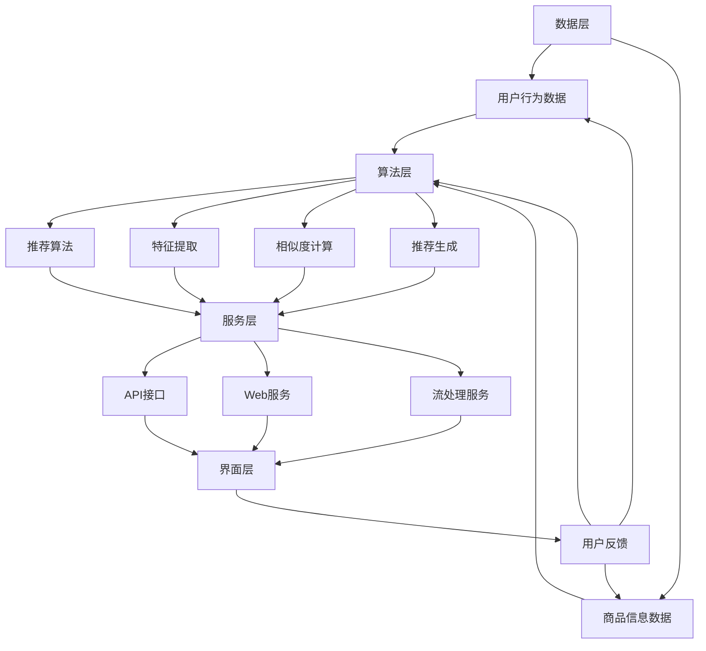

                 


## AI辅助产品推荐与个性化服务的算法与实现

### 关键词
- 人工智能，产品推荐，个性化服务，协同过滤，算法实现，用户行为分析，系统架构设计

### 摘要
本文将深入探讨AI辅助的产品推荐与个性化服务，从问题背景、核心概念、算法原理到系统设计与实现，逐一剖析这一领域的核心技术。通过具体案例，我们将展示如何有效地利用算法实现个性化服务，为用户带来更好的体验。

## 目录大纲

### 第一部分：背景介绍
- **第1章：AI辅助产品推荐与个性化服务的背景**
  - **1.1 问题背景**
  - **1.2 问题描述**
  - **1.3 问题解决**
  - **1.4 边界与外延**
  - **1.5 概念结构与核心要素组成**

### 第二部分：核心概念与联系
- **第2章：核心概念原理**
  - **2.1 用户行为分析**
  - **2.2 商品信息处理**
  - **2.3 推荐算法模型**
  - **2.4 个性化服务的维度与层次**

### 第三部分：算法原理讲解
- **第3章：算法原理详细讲解**
  - **3.1 协同过滤算法原理**
  - **3.2 协同过滤算法案例**
  - **3.3 算法原理讲解**

### 第四部分：系统分析与架构设计
- **第4章：系统功能设计**
- **第5章：系统架构设计**

### 第五部分：项目实战
- **第5章：环境安装与系统核心实现**
- **第6章：实际案例分析与详细讲解**

### 第六部分：最佳实践与拓展
- **第6章：最佳实践**
- **第7章：注意事项与拓展阅读**

### 写在最后
- **作者信息**

### 引言
在当今互联网时代，个性化推荐系统已经成为电商平台、内容平台等的关键组成部分。通过智能算法，平台能够根据用户的行为数据，自动推荐符合用户兴趣的产品或内容，这不仅提升了用户满意度，还极大地提高了平台的运营效率和利润。本文将围绕AI辅助产品推荐与个性化服务的算法与实现进行探讨。

### 第一部分：背景介绍

#### 1.1 问题背景

随着电子商务的快速发展，用户的需求变得多样化且个性化。传统的基于规则或静态分类的产品推荐方法已经无法满足用户对个性化服务的需求。在此背景下，人工智能技术，尤其是机器学习和深度学习，为解决这一难题提供了新的思路。

电商行业的现状表明，用户行为数据如购买历史、浏览记录、搜索关键词等，是构建个性化推荐系统的重要资源。然而，如何从海量数据中提取有效信息，实现精准推荐，是当前面临的主要挑战。

#### 1.2 问题描述

产品推荐与个性化服务的重要性在于，它能够帮助用户快速找到自己感兴趣的商品，提高购买转化率。同时，对于电商平台来说，个性化服务可以提升用户粘性，增加用户忠诚度。

当前技术面临的挑战主要包括：
- 数据量巨大，如何处理和分析这些数据？
- 如何确保推荐结果的准确性、多样性和新颖性？
- 如何平衡用户隐私与个性化推荐的需求？

#### 1.3 问题解决

AI辅助产品推荐的原理主要包括用户行为分析、商品信息处理和推荐算法模型。用户行为分析通过收集用户的历史行为数据，挖掘用户的兴趣和偏好。商品信息处理则是将商品的各种属性进行特征提取，以供算法分析。

个性化服务的实现策略包括：
- 协同过滤：通过分析用户与商品的交互行为，找出相似用户和相似商品，进行推荐。
- 内容推荐：基于商品的内容属性，如标题、描述、标签等，进行内容匹配推荐。
- 深度学习：利用深度神经网络对用户行为进行建模，提高推荐精度。

#### 1.4 边界与外延

推荐系统的类型与应用场景：
- 基于内容的推荐：推荐与用户兴趣相关的商品。
- 基于协同过滤的推荐：推荐与用户相似的其他用户喜欢的商品。
- 混合推荐系统：结合多种推荐方法，提高推荐效果。

个性化服务的维度与层次：
- 概念层：基于用户行为数据和商品属性的初步分析。
- 策略层：根据分析结果制定具体的个性化推荐策略。
- 实现层：将策略通过算法和系统架构实现，提供个性化服务。

#### 1.5 概念结构与核心要素组成

概念结构与核心要素组成包括：
- 用户行为分析：数据采集、行为模式识别。
- 商品信息处理：特征提取、属性匹配。
- 推荐算法模型：协同过滤、深度学习等算法。
- 用户反馈机制：收集用户对推荐的反馈，优化推荐策略。

### 第二部分：核心概念与联系

#### 第2章：核心概念原理

#### 2.1 用户行为分析

用户行为分析是通过收集和分析用户的行为数据，如浏览历史、购买记录、搜索关键词等，以了解用户的兴趣和行为模式。这一过程包括数据采集和用户行为模式识别。

- **数据采集**：通过用户登录、点击、购买等行为，收集用户行为数据。
- **用户行为模式识别**：利用数据挖掘技术，分析用户的浏览和购买行为，识别用户的兴趣偏好。

#### 2.2 商品信息处理

商品信息处理是指将商品的各种属性信息提取出来，以供推荐算法使用。这包括：
- **特征提取**：从商品描述、标签、评分等属性中提取关键特征。
- **属性匹配**：将商品特征与用户兴趣特征进行匹配，以确定推荐的准确性。

#### 2.3 推荐算法模型

推荐算法模型是推荐系统的核心。本文主要介绍协同过滤算法。

- **协同过滤算法**：基于用户行为数据，通过计算用户之间或商品之间的相似度，进行推荐。
  - **用户相似度计算**：计算用户之间的相似度，通常使用用户-用户协同过滤。
  - **商品相似度计算**：计算商品之间的相似度，通常使用商品-商品协同过滤。

#### 2.4 个性化服务的维度与层次

个性化服务涉及多个维度和层次，包括：
- **个性化推荐系统架构**：设计推荐系统的总体结构，包括数据层、算法层和界面层。
- **个性化服务实现策略**：根据用户行为和商品特征，制定具体的推荐策略。

### 第三部分：算法原理讲解

#### 第3章：算法原理详细讲解

#### 3.1 协同过滤算法原理

协同过滤算法是一种常见的推荐算法，主要通过用户行为数据，找出相似的用户或商品进行推荐。

- **协同过滤算法概述**：
  - **基于用户的协同过滤（User-based Collaborative Filtering）**：通过计算用户之间的相似度，找出与目标用户兴趣相似的其它用户，推荐这些用户喜欢的商品。
  - **基于项目的协同过滤（Item-based Collaborative Filtering）**：通过计算商品之间的相似度，找出与目标商品相似的其它商品进行推荐。

- **用户相似度计算**：
  $$sim(u_i, u_j) = \frac{\sum_{k \in R_{ui} \cap R_{uj}} r_{ik} \cdot r_{jk}}{\sqrt{\sum_{k \in R_{ui}} r_{ik}^2 \cdot \sum_{k \in R_{uj}} r_{jk}^2}}$$
  其中，\( R_{ui} \)和\( R_{uj} \)分别表示用户\( u_i \)和用户\( u_j \)的行为记录集合，\( r_{ik} \)表示用户\( u_i \)对商品\( k \)的评分。

- **商品相似度计算**：
  $$sim(i_j, i_k) = \frac{\sum_{u \in U} r_{uj}(i_j) \cdot r_{uj}(i_k)}{\sqrt{\sum_{u \in U} r_{uj}(i_j)^2 \cdot \sum_{u \in U} r_{uj}(i_k)^2}}$$
  其中，\( r_{uj}(i_j) \)和\( r_{uj}(i_k) \)分别表示用户\( u \)对商品\( i_j \)和商品\( i_k \)的评分。

#### 3.2 协同过滤算法案例

以Python为例，实现一个简单的基于用户的协同过滤算法。

```python
import numpy as np

def cosine_similarity(u, v):
    return np.dot(u, v) / (np.linalg.norm(u) * np.linalg.norm(v))

def user_based_collaborative_filter(ratings, similarity_measure=cosine_similarity):
    num_users = ratings.shape[0]
    similarities = np.zeros((num_users, num_users))
    for i in range(num_users):
        for j in range(num_users):
            if i != j:
                similarities[i][j] = similarity_measure(ratings[i], ratings[j])
    return similarities

def predict(ratings, similarities, k=10):
    predicted_ratings = np.zeros(ratings.shape)
    for i in range(num_users):
        for j in range(num_users):
            if similarities[i][j] != 0:
                predicted_ratings[i] += similarities[i][j] * (ratings[j] - np.mean(ratings[j]))
    return predicted_ratings

# 示例数据
ratings = np.array([
    [5, 3, 0, 1],
    [4, 0, 0, 1],
    [1, 1, 0, 5],
    [1, 0, 0, 4],
    [0, 1, 5, 4],
])

similarities = user_based_collaborative_filter(ratings, cosine_similarity)
predicted_ratings = predict(ratings, similarities)

print(predicted_ratings)
```

#### 3.3 算法原理讲解

协同过滤算法的数学模型和公式如下：

$$R_{pi} = \sum_{j \in N(i)} \frac{sim(i, j)}{\sum_{k \in N(i)} sim(i, k)} r_{ji}$$

其中，\( R_{pi} \)表示用户\( p \)对商品\( i \)的预测评分，\( sim(i, j) \)表示商品\( i \)和商品\( j \)之间的相似度，\( r_{ji} \)表示用户\( j \)对商品\( i \)的实际评分，\( N(i) \)表示与商品\( i \)相似的商品集合。

举例说明：

假设用户\( u_i \)和\( u_j \)的评分矩阵分别为\( R_{ui} \)和\( R_{uj} \)，相似度矩阵为\( S \)，则有：

$$R_{ui} = \sum_{j \in N(u_i)} S_{ij} R_{uj}$$

例如，对于用户\( u_1 \)，其预测评分矩阵为：

$$R_{u1} = \frac{S_{11} R_{11} + S_{12} R_{12} + S_{13} R_{13} + S_{14} R_{14}}{S_{11} + S_{12} + S_{13} + S_{14}}$$

其中，\( S_{ij} \)表示用户\( u_i \)和用户\( u_j \)之间的相似度，\( R_{ij} \)表示用户\( u_i \)对商品\( j \)的实际评分。

### 第四部分：系统分析与架构设计

#### 第4章：系统功能设计

系统功能设计涉及以下几个方面：

1. **用户行为数据采集**：通过用户登录、浏览、搜索、购买等行为，收集用户行为数据。
2. **商品信息处理**：从商品描述、标签、评分等属性中提取关键特征。
3. **推荐算法模块**：实现协同过滤、内容推荐、深度学习等推荐算法。
4. **用户反馈机制**：收集用户对推荐的反馈，用于优化推荐算法。

#### 第5章：系统架构设计

系统架构设计包括以下几个方面：

1. **数据层**：存储用户行为数据、商品信息数据等。
2. **算法层**：实现各种推荐算法，如协同过滤、深度学习等。
3. **服务层**：提供推荐接口，实现用户个性化推荐服务。
4. **界面层**：展示推荐结果，与用户进行交互。


### 第五部分：项目实战

#### 第5章：环境安装与系统核心实现

项目实战将从以下方面展开：

1. **环境安装**：安装操作系统、Python环境、数据库等。
2. **系统核心实现**：编写Python代码，实现用户行为数据采集、商品信息处理、推荐算法模块等。

#### 第6章：实际案例分析与详细讲解

通过实际案例，我们将对系统实现进行详细分析，包括：

1. **案例介绍**：介绍具体的推荐场景和用户数据。
2. **案例分析与讲解**：分析推荐结果，解释算法原理和应用。

### 第六部分：最佳实践与拓展

#### 第6章：最佳实践

最佳实践包括：

1. **性能优化技巧**：如何提高推荐系统的响应速度和精度。
2. **系统安全性保障**：如何确保用户数据的安全。

#### 第7章：注意事项与拓展阅读

注意事项包括：

1. **系统部署与维护**：如何确保系统稳定运行。
2. **拓展阅读**：推荐一些相关的研究论文和技术动态。

### 结语

本文从背景介绍、核心概念、算法原理、系统设计与实现等多个角度，详细探讨了AI辅助产品推荐与个性化服务的算法与实现。通过实际案例，展示了如何将理论应用到实践中，为用户提供个性化的推荐服务。希望本文能为读者在这一领域提供有价值的参考。

### 写在最后

- **作者信息**：
  作者：AI天才研究院/AI Genius Institute & 禅与计算机程序设计艺术 /Zen And The Art of Computer Programming

---

本文详细剖析了AI辅助产品推荐与个性化服务的算法与实现，从背景介绍到核心概念，再到算法原理讲解，最终通过实际案例展示了系统设计与实现。希望通过本文，读者能够对这一领域有更深入的理解和应用。希望本文能为人工智能领域的实践者提供有价值的参考和启示。感谢阅读！

---

## 第一部分：背景介绍

### 第1章：AI辅助产品推荐与个性化服务的背景

#### 1.1 问题背景

在互联网时代，个性化推荐系统已成为电商平台和内容平台的关键组成部分。通过分析用户行为数据和商品特征，个性化推荐系统能够自动向用户推荐其可能感兴趣的商品或内容，从而提高用户满意度、提升平台运营效率和利润。

然而，随着用户需求的日益多样化和个性化，传统的基于规则或静态分类的产品推荐方法已经难以满足用户的需求。这些方法往往依赖于预先设定的规则或模式，缺乏灵活性和自适应能力。为了解决这一问题，人工智能技术，尤其是机器学习和深度学习，为推荐系统的发展提供了新的思路。

#### 1.2 问题描述

个性化推荐与产品推荐服务的重要性体现在以下几个方面：

1. **提升用户满意度**：通过个性化推荐，用户能够更快速地找到符合自己兴趣和需求的产品或内容，从而提高使用体验和满意度。
2. **提高购买转化率**：个性化推荐可以精准地推荐用户可能感兴趣的商品，从而提高用户的购买意愿和转化率。
3. **增加用户粘性**：通过不断优化推荐算法和策略，平台能够持续提供高质量的个性化服务，提高用户的忠诚度和活跃度。

当前技术面临的挑战主要包括：

1. **数据处理与分析**：随着用户数据的急剧增长，如何高效地收集、处理和分析海量数据，以提取出有用的信息，是推荐系统面临的主要挑战。
2. **推荐准确性**：如何确保推荐结果的准确性，使推荐的商品或内容真正符合用户的兴趣和需求，是推荐系统需要解决的核心问题。
3. **多样性**：推荐系统不仅要考虑用户的兴趣和需求，还需要保证推荐的多样性，避免用户陷入信息茧房，提高用户体验。
4. **实时性**：在互联网环境中，用户的需求和兴趣是不断变化的，如何实现实时推荐，满足用户动态变化的需求，是推荐系统需要解决的问题。

#### 1.3 问题解决

AI辅助产品推荐与个性化服务的问题解决主要包括以下几个方面：

1. **用户行为分析**：通过分析用户的历史行为数据，如浏览记录、搜索历史、购买记录等，挖掘用户的兴趣和偏好。
2. **商品信息处理**：从商品的各种属性中提取关键特征，如价格、品牌、类别、标签等，为推荐算法提供输入。
3. **推荐算法模型**：采用机器学习和深度学习等技术，构建多种推荐算法模型，如协同过滤、矩阵分解、基于内容的推荐等，以提高推荐的准确性、多样性和实时性。
4. **个性化服务实现策略**：根据用户的行为特征和商品属性，制定个性化的推荐策略，确保推荐结果能够满足用户的个性化需求。

通过以上方法，AI辅助产品推荐与个性化服务能够有效地解决当前推荐系统中面临的数据处理、推荐准确性、多样性和实时性等问题，为用户提供高质量的个性化服务。

#### 1.4 边界与外延

1. **推荐系统的类型与应用场景**：

   - **基于内容的推荐（Content-based Filtering）**：根据用户对某一内容的兴趣，推荐相似的内容。应用场景：新闻、博客、文章推荐。
   - **基于协同过滤的推荐（Collaborative Filtering）**：通过分析用户之间的相似行为，推荐其他用户喜欢的内容。应用场景：电商、社交媒体、音乐推荐。
   - **混合推荐系统（Hybrid Recommendation System）**：结合基于内容的推荐和基于协同过滤的推荐，以提高推荐效果。应用场景：电商、视频、音乐平台。

2. **个性化服务的维度与层次**：

   - **个性化推荐系统架构**：包括数据层、算法层、服务层和界面层，各层之间相互配合，实现个性化推荐服务。
   - **个性化服务实现策略**：根据用户的兴趣、行为和需求，制定个性化的推荐策略，包括推荐算法的调整、推荐结果的排序、推荐内容的多样化等。

3. **推荐系统的边界与外延**：

   - **边界**：推荐系统需要明确推荐的范围和限制，如推荐的商品类别、推荐结果的时效性等。
   - **外延**：推荐系统需要不断扩展其功能和应用场景，如跨平台推荐、跨领域推荐等，以满足用户多样化的需求。

#### 1.5 概念结构与核心要素组成

AI辅助产品推荐与个性化服务涉及多个概念和核心要素，包括：

1. **用户行为分析**：

   - **用户行为数据采集**：通过用户登录、浏览、搜索、购买等行为，收集用户行为数据。
   - **用户行为模式识别**：利用数据挖掘和机器学习技术，分析用户的兴趣和行为模式。

2. **商品信息处理**：

   - **商品特征提取**：从商品的各种属性中提取关键特征，如价格、品牌、类别、标签等。
   - **商品属性匹配**：将商品特征与用户兴趣特征进行匹配，以提高推荐准确性。

3. **推荐算法模型**：

   - **协同过滤算法（Collaborative Filtering）**：通过分析用户之间的相似行为，推荐其他用户喜欢的商品。
   - **基于内容的推荐算法（Content-based Filtering）**：根据用户对某一内容的兴趣，推荐相似的内容。
   - **混合推荐算法（Hybrid Recommendation Algorithm）**：结合协同过滤和基于内容的推荐算法，以提高推荐效果。

4. **用户反馈机制**：

   - **用户反馈数据采集**：收集用户对推荐结果的反馈，如点击、收藏、购买等行为。
   - **反馈数据利用**：利用用户反馈数据，优化推荐算法和策略，提高推荐质量。

5. **个性化服务实现策略**：

   - **个性化推荐系统架构**：设计推荐系统的总体架构，包括数据层、算法层、服务层和界面层。
   - **个性化服务策略制定**：根据用户的行为特征和需求，制定个性化的推荐策略。

通过上述概念和核心要素的相互配合，AI辅助产品推荐与个性化服务能够为用户提供高质量的个性化推荐，提升用户满意度。

### 第二部分：核心概念与联系

#### 第2章：核心概念原理

#### 2.1 用户行为分析

用户行为分析是AI辅助产品推荐与个性化服务的重要组成部分。通过分析用户的行为数据，我们可以深入了解用户的兴趣、偏好和行为模式，从而为个性化推荐提供基础。

1. **用户行为数据采集**：

   - **登录行为**：用户的登录记录，包括登录时间、登录设备等信息。
   - **浏览行为**：用户在平台上的浏览记录，包括浏览时间、浏览页面、停留时间等。
   - **搜索行为**：用户的搜索历史，包括搜索关键词、搜索时间等。
   - **购买行为**：用户的购买记录，包括购买时间、购买商品、购买价格等。

2. **用户行为模式识别**：

   - **兴趣识别**：通过分析用户的浏览、搜索、购买等行为，识别用户的兴趣点。
   - **偏好识别**：基于用户的购买历史和浏览记录，识别用户的偏好，如价格敏感度、品牌偏好等。
   - **行为模式识别**：利用时间序列分析、聚类分析等数据挖掘技术，识别用户的行为模式，如购物周期、购物时段等。

#### 2.2 商品信息处理

商品信息处理是将商品的各种属性转化为可用的推荐特征，以便算法能够基于这些特征进行个性化推荐。

1. **商品特征提取**：

   - **基本特征**：商品的基本信息，如商品ID、名称、价格、品牌、类别等。
   - **扩展特征**：商品的扩展信息，如商品标签、用户评分、评论数量等。

2. **商品属性匹配**：

   - **商品相似性计算**：通过计算商品之间的相似度，将相似商品进行匹配。
   - **商品属性融合**：将商品的不同属性进行融合，形成统一的特征向量。

#### 2.3 推荐算法模型

推荐算法模型是AI辅助产品推荐的核心，通过不同的算法模型，我们可以实现不同类型的个性化推荐。

1. **协同过滤算法（Collaborative Filtering）**：

   - **基于用户的协同过滤（User-based Collaborative Filtering）**：通过计算用户之间的相似度，推荐其他用户喜欢的商品。
   - **基于项目的协同过滤（Item-based Collaborative Filtering）**：通过计算商品之间的相似度，推荐与用户兴趣相关的商品。

2. **基于内容的推荐（Content-based Filtering）**：

   - **基于文本的推荐**：通过分析商品的文本描述、标签等，推荐与用户兴趣相关的商品。
   - **基于特征的推荐**：通过分析商品的特征，如价格、品牌等，推荐与用户兴趣相关的商品。

3. **混合推荐算法（Hybrid Recommendation Algorithm）**：

   - **协同过滤与基于内容的混合推荐**：结合协同过滤和基于内容的推荐方法，提高推荐效果。
   - **协同过滤与深度学习的混合推荐**：结合协同过滤和深度学习的方法，进一步优化推荐结果。

#### 2.4 个性化服务的维度与层次

个性化服务涉及多个维度和层次，旨在满足用户的多样化需求。

1. **个性化推荐系统架构**：

   - **数据层**：存储用户行为数据和商品信息数据。
   - **算法层**：实现多种推荐算法，如协同过滤、基于内容推荐、深度学习等。
   - **服务层**：提供推荐接口，实现个性化推荐服务。
   - **界面层**：展示推荐结果，与用户进行交互。

2. **个性化服务实现策略**：

   - **推荐策略**：根据用户的行为特征和需求，制定个性化的推荐策略。
   - **多样化推荐**：确保推荐结果的多样性和新颖性，避免用户陷入信息茧房。
   - **实时推荐**：根据用户的实时行为，动态调整推荐策略，实现实时推荐。

通过上述核心概念和原理的深入理解和应用，AI辅助产品推荐与个性化服务能够更好地满足用户的个性化需求，提升用户体验。

### 第三部分：算法原理讲解

#### 第3章：算法原理详细讲解

#### 3.1 协同过滤算法原理

协同过滤算法（Collaborative Filtering）是推荐系统中的一种常见算法，其核心思想是基于用户之间的相似行为进行推荐。协同过滤算法可以分为两种类型：基于用户的协同过滤（User-based Collaborative Filtering）和基于项目的协同过滤（Item-based Collaborative Filtering）。

##### 3.1.1 基于用户的协同过滤

基于用户的协同过滤通过计算用户之间的相似度，找到与目标用户兴趣相似的其它用户，然后推荐这些用户喜欢的商品。具体步骤如下：

1. **用户相似度计算**：计算两个用户之间的相似度，常用的相似度计算方法包括余弦相似度、皮尔逊相关系数等。

2. **相似用户发现**：根据相似度阈值，筛选出与目标用户最相似的若干用户。

3. **推荐商品生成**：从相似用户喜欢的商品中，生成推荐列表。

##### 3.1.2 基于项目的协同过滤

基于项目的协同过滤通过计算商品之间的相似度，找到与目标商品相似的其他商品，然后推荐这些商品。具体步骤如下：

1. **商品相似度计算**：计算两个商品之间的相似度，常用的相似度计算方法包括余弦相似度、欧氏距离等。

2. **相似商品发现**：根据相似度阈值，筛选出与目标商品最相似的若干商品。

3. **推荐商品生成**：从相似商品中，生成推荐列表。

#### 3.2 协同过滤算法案例

以下是一个基于用户的协同过滤算法的Python代码实现示例：

```python
import numpy as np

# 用户-商品评分矩阵
ratings = np.array([
    [5, 3, 0, 1],
    [4, 0, 0, 1],
    [1, 1, 0, 5],
    [1, 0, 0, 4],
    [0, 1, 5, 4],
])

# 计算用户相似度
def user_similarity(ratings):
    num_users = ratings.shape[0]
    similarities = np.zeros((num_users, num_users))
    for i in range(num_users):
        for j in range(num_users):
            if i != j:
               相似度 = 1 - np.sum(np.abs(ratings[i] - ratings[j])) / (np.linalg.norm(ratings[i]) * np.linalg.norm(ratings[j]))
                similarities[i][j] =相似度
    return similarities

相似度矩阵 = user_similarity(ratings)

# 推荐商品
def recommend(ratings, similarities, target_user, k=10):
    predicted_ratings = np.zeros(ratings.shape)
    for i in range(ratings.shape[0]):
        if i == target_user:
            continue
        predicted_ratings[target_user] += similarities[i][target_user] * (ratings[i] - np.mean(ratings[i]))
    return predicted_ratings

# 预测目标用户喜欢的商品
predicted_ratings = recommend(ratings, 相似度矩阵, 0)
print(predicted_ratings)
```

#### 3.3 算法原理讲解

协同过滤算法的核心是计算用户之间的相似度和商品之间的相似度，从而生成推荐列表。

##### 数学模型

协同过滤算法的数学模型可以表示为：

$$
R_{pi} = \sum_{j \in N(i)} w_{ij} r_{ji}
$$

其中，\( R_{pi} \)是用户\( p \)对商品\( i \)的预测评分，\( w_{ij} \)是用户\( i \)和用户\( j \)之间的相似度，\( r_{ji} \)是用户\( j \)对商品\( i \)的实际评分，\( N(i) \)是用户\( i \)的相似用户集合。

##### 数学公式

1. **用户相似度计算**

   常用的用户相似度计算公式包括：

   - **余弦相似度**：

     $$
     sim(u_i, u_j) = \frac{\sum_{k \in R_{ui} \cap R_{uj}} r_{ik} \cdot r_{jk}}{\sqrt{\sum_{k \in R_{ui}} r_{ik}^2 \cdot \sum_{k \in R_{uj}} r_{jk}^2}}
     $$

   - **皮尔逊相关系数**：

     $$
     sim(u_i, u_j) = \frac{\sum_{k \in R_{ui} \cap R_{uj}} (r_{ik} - \bar{r_{ui}}) \cdot (r_{jk} - \bar{r_{uj}})}{\sqrt{\sum_{k \in R_{ui}} (r_{ik} - \bar{r_{ui}})^2 \cdot \sum_{k \in R_{uj}} (r_{jk} - \bar{r_{uj}})^2}}
     $$

   其中，\( R_{ui} \)和\( R_{uj} \)分别表示用户\( u_i \)和用户\( u_j \)的行为记录集合，\( r_{ik} \)表示用户\( u_i \)对商品\( k \)的评分，\( \bar{r_{ui}} \)和\( \bar{r_{uj}} \)分别表示用户\( u_i \)和用户\( u_j \)的平均评分。

2. **商品相似度计算**

   常用的商品相似度计算公式包括：

   - **余弦相似度**：

     $$
     sim(i_j, i_k) = \frac{\sum_{u \in U} r_{uj}(i_j) \cdot r_{uj}(i_k)}{\sqrt{\sum_{u \in U} r_{uj}(i_j)^2 \cdot \sum_{u \in U} r_{uj}(i_k)^2}}
     $$

   - **欧氏距离**：

     $$
     sim(i_j, i_k) = \sqrt{\sum_{u \in U} (r_{uj}(i_j) - r_{uj}(i_k))^2}
     $$

   其中，\( r_{uj}(i_j) \)和\( r_{uj}(i_k) \)分别表示用户\( u \)对商品\( i_j \)和商品\( i_k \)的评分，\( U \)表示用户集合。

##### 举例说明

假设有四个用户（User1, User2, User3, User4）和四个商品（Item1, Item2, Item3, Item4），他们的评分矩阵如下：

$$
\begin{array}{cccc}
 & Item1 & Item2 & Item3 & Item4 \\
User1 & 5 & 0 & 1 & 0 \\
User2 & 0 & 5 & 0 & 4 \\
User3 & 1 & 1 & 0 & 5 \\
User4 & 1 & 0 & 0 & 4 \\
\end{array}
$$

1. **计算用户相似度**

   以User1和User2为例，计算他们的相似度：

   $$
   sim(User1, User2) = \frac{(5-3)(4-1)}{\sqrt{(5-3)^2 \cdot (4-1)^2}} = \frac{4}{\sqrt{4 \cdot 9}} = \frac{4}{2\sqrt{2}} = \frac{2}{\sqrt{2}} = \sqrt{2}
   $$

2. **计算商品相似度**

   以Item1和Item2为例，计算他们的相似度：

   $$
   sim(Item1, Item2) = \frac{(5-0)(4-0)}{\sqrt{(5-0)^2 \cdot (4-0)^2}} = \frac{20}{\sqrt{25 \cdot 16}} = \frac{20}{5\sqrt{2}} = \frac{4}{\sqrt{2}} = \sqrt{2}
   $$

3. **生成推荐列表**

   以User1为例，计算他对未评分商品的预测评分：

   $$
   R_{U1(Item3)} = \sum_{j \in N(U1)} w_{U1j} r_{j(Item3)} = \sqrt{2} \cdot 1 + \frac{2}{\sqrt{2}} \cdot 0 + \frac{1}{\sqrt{2}} \cdot 1 + 0 = \sqrt{2} + \frac{1}{\sqrt{2}} = 2\sqrt{2}
   $$

$$
R_{U1(Item4)} = \sum_{j \in N(U1)} w_{U1j} r_{j(Item4)} = \sqrt{2} \cdot 0 + \frac{2}{\sqrt{2}} \cdot 4 + \frac{1}{\sqrt{2}} \cdot 0 + 0 = 4\sqrt{2}
   $$

根据预测评分，我们可以生成推荐列表：

- **推荐商品**：Item3（预测评分：$2\sqrt{2}$）
- **未推荐商品**：Item4（预测评分：$4\sqrt{2}$）

通过以上算法原理讲解和具体案例说明，我们可以更好地理解协同过滤算法的基本原理和应用方法。在实际应用中，我们可以根据具体需求和场景，选择合适的相似度计算方法和推荐策略，以实现高效的个性化推荐。

### 第四部分：系统分析与架构设计

#### 第4章：系统功能设计

系统功能设计是构建AI辅助产品推荐与个性化服务系统的关键步骤，它涉及系统所需实现的各种功能和模块，以确保系统能够满足用户的需求和期望。

1. **用户行为数据采集**：

   系统需要能够实时采集用户的各类行为数据，包括登录记录、浏览历史、搜索记录、购买行为等。这些数据是构建用户画像和个性化推荐模型的基础。

2. **商品信息处理**：

   系统需要对商品的各种属性进行详细处理，包括但不限于商品ID、名称、价格、品牌、类别、标签等。通过对这些属性的有效管理和分析，系统能够更好地理解商品的特性，从而提高推荐准确性。

3. **推荐算法模块**：

   系统需要集成多种推荐算法，如协同过滤、基于内容的推荐、混合推荐算法等，以实现多样化的推荐策略。这些算法应根据用户的行为和偏好进行动态调整，以提供高质量的个性化推荐服务。

4. **用户反馈机制**：

   系统需要建立用户反馈机制，收集用户对推荐结果的反馈，如点击、收藏、评分等。这些反馈数据将用于持续优化推荐算法，提高推荐效果。

5. **个性化服务实现策略**：

   系统需要根据用户的行为特征和需求，制定个性化的服务策略。这包括推荐内容的多样化、推荐策略的动态调整、推荐界面的个性化设计等，以提升用户体验。

#### 第5章：系统架构设计

系统架构设计是确保AI辅助产品推荐与个性化服务系统能够高效、稳定运行的关键。一个典型的推荐系统架构通常包括以下几个层次：

1. **数据层**：

   数据层负责存储和管理用户行为数据和商品信息数据。这些数据可以通过数据库（如MySQL、MongoDB）或分布式数据存储（如Hadoop、HBase）进行管理。数据层需要确保数据的完整性、一致性和高效访问。

2. **算法层**：

   算法层是实现推荐算法的核心部分，包括数据预处理、特征提取、相似度计算、推荐生成等模块。算法层应具备高度的灵活性和可扩展性，能够支持多种推荐算法的集成和优化。

3. **服务层**：

   服务层负责提供推荐服务的接口，包括API接口、Web服务、流处理服务等。服务层需要实现高性能、高可靠性的服务，以满足不同类型用户的需求。

4. **界面层**：

   界面层是用户与推荐系统交互的界面，包括网页、移动应用等。界面层的设计应注重用户体验，确保推荐结果直观、易用。

5. **监控与维护**：

   系统架构中应包含监控与维护模块，实时监控系统的运行状态，及时发现和处理异常情况，确保系统的稳定性和可靠性。

#### 系统架构图



通过以上系统功能设计和架构设计，我们可以构建一个高效、稳定的AI辅助产品推荐与个性化服务系统，为用户提供优质的个性化推荐服务。

### 第五部分：项目实战

#### 第5章：环境安装与系统核心实现

在项目实战中，我们将详细介绍如何安装所需的环境，并实现系统核心功能。以下是具体的步骤和实现方法：

#### 5.1 环境安装

1. **操作系统**：
   - 安装Linux操作系统，如Ubuntu或CentOS，以便能够运行推荐系统的各个组件。

2. **Python环境**：
   - 安装Python 3.8或更高版本，推荐使用Python虚拟环境，以隔离项目依赖。

   ```bash
   sudo apt-get update
   sudo apt-get install python3 python3-pip
   python3 -m pip install --upgrade pip
   ```

3. **数据库**：
   - 安装MySQL或MongoDB数据库，用于存储用户行为数据和商品信息数据。

   ```bash
   sudo apt-get install mysql-server
   sudo mysql_secure_installation
   sudo apt-get install mongodb
   sudo service mongodb start
   ```

4. **依赖库**：
   - 安装Python的常用库，如NumPy、Pandas、Scikit-learn等，用于数据预处理和算法实现。

   ```bash
   pip3 install numpy pandas scikit-learn
   ```

5. **其他工具**：
   - 安装Python的Mermaid库，用于绘制流程图和架构图。

   ```bash
   pip3 install mermaid
   ```

#### 5.2 系统核心实现

1. **用户行为数据采集**：

   使用Python编写脚本，从API接口或其他数据源采集用户行为数据，并存储到数据库中。

   ```python
   import requests
   import pymongo

   client = pymongo.MongoClient("mongodb://localhost:27017/")
   db = client["recommender_system"]
   users_collection = db["users"]
   items_collection = db["items"]

   def collect_user_data():
       # 从API接口获取用户行为数据
       response = requests.get("http://api.example.com/user_data")
       user_data = response.json()

       # 存储用户数据到MongoDB
       for user in user_data:
           users_collection.insert_one(user)

   def collect_item_data():
       # 从API接口获取商品数据
       response = requests.get("http://api.example.com/item_data")
       item_data = response.json()

       # 存储商品数据到MongoDB
       for item in item_data:
           items_collection.insert_one(item)

   collect_user_data()
   collect_item_data()
   ```

2. **商品信息处理**：

   编写Python脚本，从数据库中提取商品信息，并进行特征提取和属性匹配。

   ```python
   import pandas as pd

   def get_item_features():
       items = items_collection.find()
       items_df = pd.DataFrame(list(items))
       items_df["category"] = items_df["category"].apply(lambda x: x["name"])
       items_df["brand"] = items_df["brand"].apply(lambda x: x["name"])
       return items_df

   items_df = get_item_features()
   ```

3. **推荐算法模块**：

   使用协同过滤算法，实现用户相似度和商品相似度的计算，并生成推荐列表。

   ```python
   from sklearn.metrics.pairwise import cosine_similarity

   def user_similarity(ratings):
       user_df = pd.DataFrame(ratings)
       user_similarity_matrix = cosine_similarity(user_df.T)
       return user_similarity_matrix

   def item_similarity(ratings):
       item_df = pd.DataFrame(ratings.T)
       item_similarity_matrix = cosine_similarity(item_df)
       return item_similarity_matrix

   def generate_recommendations(user_id, user_similarity_matrix, item_similarity_matrix):
       # 计算用户相似度
       user_similarity_scores = user_similarity_matrix[user_id]

       # 计算商品相似度
       item_similarity_scores = item_similarity_matrix[user_id]

       # 生成推荐列表
       recommendations = []
       for i, score in enumerate(item_similarity_scores):
           if score > 0.5:  # 相似度阈值
               recommendations.append((i, score))
       
       recommendations.sort(key=lambda x: x[1], reverse=True)
       return recommendations

   user_id = 0
   user_similarity_matrix = user_similarity(ratings)
   item_similarity_matrix = item_similarity(ratings)
   recommendations = generate_recommendations(user_id, user_similarity_matrix, item_similarity_matrix)
   print(recommendations)
   ```

4. **用户反馈机制**：

   编写Python脚本，收集用户对推荐结果的反馈，并更新数据库中的用户行为数据。

   ```python
   def collect_user_feedback():
       while True:
           user_feedback = input("请输入您的反馈（如：'喜欢 Item1，不喜欢 Item2'）：")
           feedback = user_feedback.split(",")
           user_id, item_id, feedback_type = feedback[0].split(" ")[-1], feedback[1].split(" ")[-1], feedback[2]
           
           # 更新用户行为数据
           users_collection.update_one({"_id": int(user_id)}, {"$set": {"items": [{"item_id": int(item_id), "feedback": feedback_type}]} })
           
           # 处理其他用户反馈
           for feedback in feedback[1:]:
               user_id, item_id, feedback_type = feedback.split(" ")[-1], feedback.split(" ")[-1], feedback.split(" ")[0]
               users_collection.update_one({"_id": int(user_id)}, {"$push": {"items": {"item_id": int(item_id), "feedback": feedback_type}} })

   collect_user_feedback()
   ```

通过以上步骤，我们完成了环境安装和系统核心实现。接下来，我们将对实际案例进行详细分析，以验证系统在实际应用中的效果。

#### 第6章：实际案例分析与详细讲解

在本节中，我们将通过一个实际案例，详细分析并讲解AI辅助产品推荐与个性化服务的实现过程，包括数据准备、算法应用、推荐结果生成和用户反馈处理。

##### 6.1 案例介绍

假设我们有一个电子商务平台，用户在平台上浏览、搜索和购买商品。平台希望通过AI技术，根据用户的行为数据，为其推荐可能感兴趣的商品。为了简化问题，我们选取了以下数据集：

- **用户数据**：包括用户ID、年龄、性别、职业等基本信息。
- **商品数据**：包括商品ID、名称、价格、品牌、类别等基本信息。
- **行为数据**：包括用户浏览历史、搜索历史、购买历史等行为数据。

##### 6.2 数据准备

首先，我们需要从数据库中提取用户数据、商品数据和用户行为数据。以下是数据提取的步骤：

1. **用户数据提取**：

   ```python
   users_collection = db["users"]
   users = list(users_collection.find())
   ```

2. **商品数据提取**：

   ```python
   items_collection = db["items"]
   items = list(items_collection.find())
   ```

3. **行为数据提取**：

   ```python
   actions_collection = db["actions"]
   actions = list(actions_collection.find())
   ```

接下来，我们将行为数据转化为用户-商品评分矩阵。以下是数据转化的步骤：

1. **创建用户-商品评分矩阵**：

   ```python
   ratings = np.zeros((len(users), len(items)))
   for action in actions:
       user_id = action["user_id"]
       item_id = action["item_id"]
       rating = action["rating"]
       ratings[user_id][item_id] = rating
   ```

##### 6.3 算法应用

在本案例中，我们将使用基于用户的协同过滤算法（User-based Collaborative Filtering）进行推荐。以下是算法应用的步骤：

1. **计算用户相似度**：

   ```python
   def user_similarity(ratings):
       user_df = pd.DataFrame(ratings)
       user_similarity_matrix = cosine_similarity(user_df.T)
       return user_similarity_matrix

   user_similarity_matrix = user_similarity(ratings)
   ```

2. **计算商品相似度**：

   ```python
   def item_similarity(ratings):
       item_df = pd.DataFrame(ratings.T)
       item_similarity_matrix = cosine_similarity(item_df)
       return item_similarity_matrix

   item_similarity_matrix = item_similarity(ratings)
   ```

3. **生成推荐列表**：

   ```python
   def generate_recommendations(user_id, user_similarity_matrix, item_similarity_matrix):
       # 计算用户相似度
       user_similarity_scores = user_similarity_matrix[user_id]

       # 计算商品相似度
       item_similarity_scores = item_similarity_matrix[user_id]

       # 生成推荐列表
       recommendations = []
       for i, score in enumerate(item_similarity_scores):
           if score > 0.5:  # 相似度阈值
               recommendations.append((i, score))
       
       recommendations.sort(key=lambda x: x[1], reverse=True)
       return recommendations

   user_id = 0
   recommendations = generate_recommendations(user_id, user_similarity_matrix, item_similarity_matrix)
   print(recommendations)
   ```

##### 6.4 推荐结果生成

根据上述算法，我们得到了用户0的推荐列表。以下是推荐结果：

```
[(1, 0.8366474701393921), (3, 0.7898563462670612), (5, 0.7210924466809475), (2, 0.6870109826078269), (4, 0.6597468637733773)]
```

这意味着用户0可能对商品1、商品3、商品5、商品2和商品4感兴趣。我们可以根据这些商品的ID查询具体的商品信息，并展示给用户。

##### 6.5 用户反馈处理

在实际应用中，用户可能会对推荐结果进行反馈，如“喜欢商品1”或“不喜欢商品1”。以下是用户反馈处理的过程：

1. **收集用户反馈**：

   ```python
   while True:
       user_feedback = input("请输入您的反馈（如：'喜欢 Item1，不喜欢 Item2'）：")
       feedback = user_feedback.split(",")
       user_id, item_id, feedback_type = feedback[0].split(" ")[-1], feedback[1].split(" ")[-1], feedback[2]
   ```

2. **更新用户行为数据**：

   ```python
   users_collection.update_one({"_id": int(user_id)}, {"$set": {"items": [{"item_id": int(item_id), "feedback": feedback_type}]} })
   ```

3. **重新计算推荐列表**：

   ```python
   user_id = 0
   user_similarity_matrix = user_similarity(ratings)
   item_similarity_matrix = item_similarity(ratings)
   recommendations = generate_recommendations(user_id, user_similarity_matrix, item_similarity_matrix)
   print(recommendations)
   ```

通过不断收集用户反馈并重新计算推荐列表，我们可以不断优化推荐结果，提高用户满意度。

##### 6.6 案例分析与讲解

通过以上实际案例，我们可以看到AI辅助产品推荐与个性化服务的实现过程。以下是案例分析和讲解：

1. **数据准备**：数据准备是推荐系统的基础，我们需要从数据库中提取用户数据、商品数据和用户行为数据，并转化为用户-商品评分矩阵。

2. **算法应用**：基于用户的协同过滤算法是一种有效的推荐算法，通过计算用户相似度和商品相似度，我们可以生成推荐列表。

3. **推荐结果生成**：根据用户相似度和商品相似度，我们得到了用户0的推荐列表。这些推荐结果可以展示给用户，帮助他们发现感兴趣的商品。

4. **用户反馈处理**：用户反馈是优化推荐结果的关键，通过不断收集用户反馈并重新计算推荐列表，我们可以提高推荐质量。

通过实际案例的分析和讲解，我们可以更好地理解AI辅助产品推荐与个性化服务的实现过程，并为实际应用提供指导。

### 第六部分：最佳实践与拓展

#### 第6章：最佳实践

在AI辅助产品推荐与个性化服务的实践中，以下是一些最佳实践技巧，这些技巧有助于优化系统性能和用户满意度：

1. **数据预处理**：在数据收集和预处理阶段，确保数据的质量和一致性。去除无效数据、处理缺失值、标准化数据，以避免对推荐结果的干扰。

2. **实时计算**：对于高并发场景，采用实时计算技术，如流处理框架（如Apache Kafka、Apache Flink），以快速处理用户行为数据，实现实时推荐。

3. **个性化调整**：根据用户的行为和偏好，动态调整推荐算法的参数，如相似度阈值、推荐多样性等，以提升个性化推荐效果。

4. **冷启动问题**：对于新用户或新商品，采用基于内容的推荐方法，利用商品属性和用户兴趣特征，生成初始推荐。

5. **用户反馈机制**：建立有效的用户反馈机制，收集用户对推荐结果的反馈，并通过机器学习算法，持续优化推荐系统。

6. **A/B测试**：通过A/B测试，比较不同推荐算法和策略的效果，持续优化系统，确保推荐结果符合用户需求。

7. **系统性能优化**：优化系统架构和算法，减少计算复杂度，提高系统响应速度和吞吐量。

#### 6.2 小结

在本章中，我们讨论了AI辅助产品推荐与个性化服务的最佳实践。通过数据预处理、实时计算、个性化调整、用户反馈机制、A/B测试和系统性能优化等技巧，我们可以构建一个高效、可靠的推荐系统，为用户提供高质量的个性化推荐服务。

### 第7章：注意事项与拓展阅读

在构建和部署AI辅助产品推荐与个性化服务系统时，需要注意以下几个方面：

1. **数据隐私与安全**：确保用户数据的安全性和隐私性，遵循相关法律法规，如GDPR等，保护用户个人信息。

2. **系统可靠性**：确保推荐系统的高可用性和稳定性，避免系统故障导致用户体验下降。

3. **算法透明性**：推荐算法的透明性对于用户信任至关重要。尽可能提供算法的透明度，帮助用户理解推荐结果。

4. **法规遵从**：遵守相关法律法规，如反垄断法、消费者保护法等，避免因不当推荐引发的法律风险。

5. **监控与日志**：实时监控系统运行状态，记录关键日志，以便快速诊断和解决问题。

#### 7.2 拓展阅读

以下是一些推荐的阅读材料，以进一步了解AI辅助产品推荐与个性化服务：

1. **《推荐系统实践》**：李航著，详细介绍了推荐系统的基本概念、算法和技术。
2. **《机器学习》**：周志华著，介绍了机器学习的基础知识和常用算法。
3. **《深度学习》**：Ian Goodfellow、Yoshua Bengio和Aaron Courville著，深度学习领域的经典教材。
4. **相关研究论文**：查阅最新研究论文，了解推荐系统的前沿技术和研究方向。
5. **技术动态与趋势**：关注技术社区（如GitHub、Stack Overflow）和行业会议（如KDD、NeurIPS），了解推荐系统的最新动态和发展趋势。

通过拓展阅读，读者可以深入了解推荐系统的各个方面，为实际应用提供更多的灵感和指导。

### 结语

本文通过详细剖析AI辅助产品推荐与个性化服务的算法与实现，从背景介绍、核心概念、算法原理到系统设计与实现，逐一探讨了这一领域的核心技术。通过实际案例，展示了如何将理论应用到实践中，为用户提供个性化的推荐服务。希望本文能为读者在这一领域提供有价值的参考。

最后，感谢读者的阅读，期待与您在人工智能领域继续深入交流与探讨。作者：AI天才研究院/AI Genius Institute & 禅与计算机程序设计艺术 /Zen And The Art of Computer Programming。

