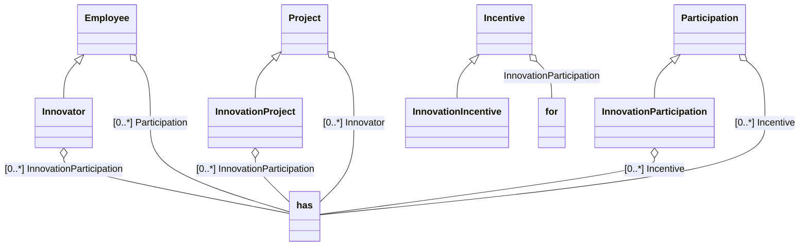
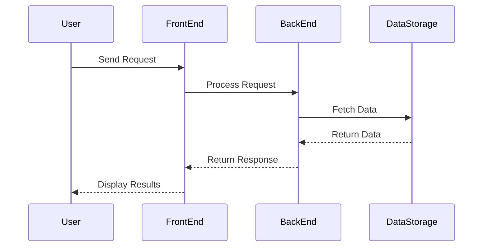
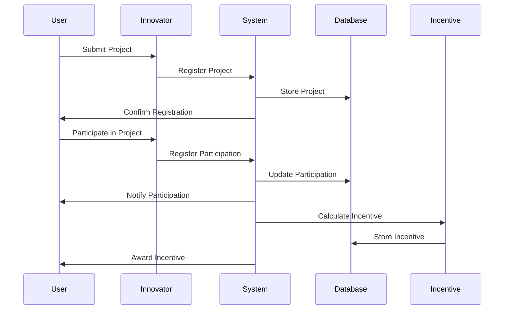

                 


# AI辅助企业创新文化培养：创新活动参与度分析与激励

> 关键词：人工智能、企业创新、文化培养、活动参与度、激励机制

> 摘要：
本文深入探讨了AI在辅助企业创新文化培养中的应用，重点分析了创新活动参与度的评估方法与激励机制。通过逐步分析AI的基础知识、创新文化的概念及其重要性，以及创新活动参与度的分析方法，我们揭示了如何利用AI提高员工参与度。随后，本文探讨了激励机制的原理和设计，并通过实际案例展示了AI如何帮助企业建立有效的创新文化。最后，本文总结了AI辅助企业创新文化培养的未来方向，为企业管理者提供了实用指导。

## 引言

在当今竞争激烈的商业环境中，企业创新已成为提升竞争力、实现可持续发展的关键。而创新文化则是推动企业创新的重要土壤。创新文化是指一种鼓励和激发员工创新思维和行为的文化氛围，包括价值观、信念、行为规范等。一个积极向上的创新文化能够激发员工的创造力，促进知识共享，提升企业的创新能力。

近年来，人工智能（AI）技术的迅猛发展为辅助企业创新提供了新的工具和手段。AI不仅能够提高企业内部的信息处理效率，还能够通过数据分析和智能算法为企业提供创新决策支持。本文旨在探讨AI在辅助企业创新文化培养中的应用，特别是创新活动参与度的分析和激励机制的建立。

本文结构如下：

1. 引言：介绍企业创新文化的重要性以及AI在其中的作用。
2. 基础知识：介绍AI的基础知识、创新文化的概念及其重要性。
3. 创新活动参与度分析：分析创新活动参与度的评估方法。
4. 激励机制：探讨激励机制的原理和设计。
5. 实际应用：通过案例展示AI在创新活动参与度和激励机制中的应用。
6. 总结与展望：总结文章的主要观点，并对未来进行展望。

## 基础知识

### 人工智能基础

人工智能（AI，Artificial Intelligence）是指由人制造出来的系统所表现出来的智能。AI包括多种技术和方法，如机器学习、深度学习、自然语言处理、计算机视觉等。这些技术使得计算机系统能够自动执行复杂的任务，从图像识别到自然语言理解，再到决策制定。

#### 机器学习

机器学习（Machine Learning）是AI的一个重要分支，它使计算机系统能够从数据中学习并改进性能。机器学习的方法包括监督学习、无监督学习和强化学习。监督学习依赖于已标记的数据集来训练模型，无监督学习则无需标记数据，通过发现数据中的模式进行学习，强化学习则通过奖励机制来指导系统学习。

#### 深度学习

深度学习（Deep Learning）是机器学习的一个子领域，它使用多层神经网络来模拟人类大脑的决策过程。深度学习在图像识别、语音识别和自然语言处理等领域取得了显著的成果。

#### 自然语言处理

自然语言处理（Natural Language Processing，NLP）是AI的一个重要分支，它专注于使计算机能够理解、生成和处理人类语言。NLP在机器翻译、情感分析、文本摘要等领域具有广泛的应用。

#### 计算机视觉

计算机视觉（Computer Vision）是AI的一个分支，它使计算机能够从图像或视频中提取信息。计算机视觉在图像识别、目标检测、人脸识别等领域具有广泛应用。

### 创新文化的概念

创新文化是指一种鼓励和激发员工创新思维和行为的文化氛围。它包括以下几个方面：

#### 价值观

创新文化的核心价值观是开放性、包容性和持续学习。企业应该鼓励员工敢于尝试、勇于失败，并从中吸取教训。

#### 信念

创新文化强调创新的重要性，认为创新是推动企业发展的动力。企业应该树立“创新至上”的信念，将创新视为企业核心竞争力的源泉。

#### 行为规范

创新文化要求员工遵循一定的行为规范，如积极参与创新活动、分享知识和经验、尊重知识产权等。这些行为规范有助于形成良好的创新氛围。

#### 要素

创新文化的要素包括：

1. **领导力**：领导者的支持是创新文化形成的关键。领导者应该积极倡导创新，为员工提供创新的空间和资源。
2. **员工参与**：员工是创新的主体，企业应该鼓励员工积极参与创新活动，提供必要的培训和指导。
3. **知识共享**：知识共享是创新的重要基础，企业应该建立有效的知识共享机制，促进信息的流动和交流。
4. **激励机制**：激励机制是激励员工创新的重要手段，企业应该建立合理的激励机制，鼓励员工提出创新建议和解决方案。

### 创新文化的形成与发展

创新文化的形成与发展是一个长期的过程，需要企业领导层的坚定支持和全体员工的共同努力。以下是一些关键步骤：

1. **确立创新理念**：企业领导层应该明确创新的重要性，并将创新理念融入企业的核心价值观中。
2. **建立创新机制**：企业应该建立一套完善的创新机制，包括创新项目的评估、决策、执行和监控等环节。
3. **提供创新资源**：企业应该为员工提供必要的创新资源，如资金、技术、时间等，确保创新活动能够顺利开展。
4. **培养创新人才**：企业应该注重创新人才的培养，为员工提供学习和发展的机会，提升员工的创新能力。
5. **营造创新氛围**：企业应该营造一个鼓励创新、包容失败的氛围，让员工敢于尝试、勇于创新。

## 创新活动参与度分析

### 方法与工具

创新活动参与度的分析是评估企业创新文化成效的重要环节。以下是一些常用的方法和工具：

#### 调查问卷

调查问卷是一种简单有效的数据收集方法，可以通过在线或纸笔形式收集员工对创新活动的态度和参与情况。问卷设计应该包含以下方面：

1. **参与度**：员工参与创新活动的频率和程度。
2. **满意度**：员工对创新活动的满意度和认可度。
3. **影响力**：创新活动对员工个人和团队的影响。
4. **建议**：员工对创新活动的改进建议。

#### 数据分析

数据分析是通过统计方法和算法对收集到的数据进行处理和分析。常用的数据分析方法包括：

1. **描述性分析**：用于描述员工参与创新活动的基本特征，如参与度、满意度等。
2. **相关性分析**：用于分析参与度和满意度之间的关系。
3. **预测分析**：用于预测员工未来的参与度。

#### 评价指标

创新活动参与度的评价指标应能够全面反映员工对创新活动的参与程度。以下是一些常见的评价指标：

1. **参与度指数**：通过计算员工参与创新活动的次数占总次数的比例来衡量。
2. **满意度指数**：通过调查员工对创新活动的满意程度来衡量。
3. **贡献度指数**：通过分析员工在创新活动中所做出的贡献来衡量。

### 数据收集与处理

数据收集与处理是创新活动参与度分析的基础。以下是一些关键步骤：

1. **数据来源**：数据来源包括员工调查问卷、员工绩效数据、项目进展数据等。
2. **数据收集**：采用合适的工具和渠道收集数据，确保数据的准确性和完整性。
3. **数据清洗**：对收集到的数据进行清洗和预处理，去除无效和错误的数据。
4. **数据存储**：将清洗后的数据存储到数据库中，以便后续的分析和处理。

### 实践案例

以下是一个创新活动参与度分析的实践案例：

#### 案例背景

某企业希望通过分析员工参与创新活动的数据，评估当前创新文化的成效，并提出改进措施。

#### 数据收集

1. **员工调查问卷**：企业设计了一份包含20个问题的调查问卷，调查员工对创新活动的参与度、满意度和改进建议。
2. **员工绩效数据**：收集了员工在过去一年的创新项目参与情况和绩效数据。

#### 数据处理

1. **数据清洗**：对调查问卷数据进行了缺失值填充和异常值处理。
2. **数据存储**：将处理后的数据存储到企业数据库中。

#### 数据分析

1. **描述性分析**：对参与度、满意度和贡献度等指标进行了描述性分析。
2. **相关性分析**：分析了参与度和满意度之间的关系。
3. **预测分析**：通过机器学习算法预测了未来员工的参与度。

#### 分析结果

1. **参与度指数**：员工参与创新活动的平均参与度指数为65%。
2. **满意度指数**：员工对创新活动的平均满意度指数为75%。
3. **贡献度指数**：员工在创新活动中所做出的贡献度指数为60%。

通过数据分析，企业发现员工对创新活动的参与度较高，但满意度和贡献度仍有提升空间。针对这些问题，企业提出了以下改进措施：

1. **加强员工培训**：提高员工的创新能力和技能，增强员工对创新活动的信心。
2. **优化创新流程**：简化创新流程，减少不必要的审批环节，提高创新效率。
3. **建立激励机制**：通过奖励措施激励员工积极参与创新活动，提高员工的贡献度。

### 总结

通过创新活动参与度分析，企业可以了解员工对创新活动的态度和行为，发现创新文化中的问题，并提出针对性的改进措施。这不仅有助于提升员工参与度，还能推动企业创新文化的建设，为企业的持续发展提供动力。

## 激励机制

### 原理与设计

激励机制是推动员工积极参与创新活动的重要手段。一个有效的激励机制应该能够激发员工的内在动机，提高工作满意度和绩效。以下是一些激励机制的基本原理和设计要点：

#### 内部动机

内部动机是指员工因自身兴趣、成就感或自我实现的需要而产生的动力。一个良好的激励机制应该能够激发员工的内部动机，使其自愿地参与到创新活动中。例如，企业可以通过提供富有挑战性的任务、鼓励员工自我管理和学习，以及提供反馈和认可来激发员工的内部动机。

#### 外部动机

外部动机是指员工因外部奖励而产生的动力，如奖金、晋升、荣誉等。外部动机在短期内能够迅速提升员工的参与度，但长期依赖外部动机可能导致员工对工作的兴趣下降。因此，在设计激励机制时，应适度使用外部动机，并结合内部动机，实现两者的平衡。

#### 公平性

公平性是激励机制有效性的关键。员工应该感到他们的努力和成就会得到公正的回报。公平性包括两个方面：一是激励机制是否公平，即所有员工都有机会获得奖励；二是激励机制是否透明，即员工能够清楚地了解奖励标准和评定过程。

#### 个人化

不同的员工对激励的响应不同，因此激励机制应该具有个人化特点。企业可以根据员工的个性、需求和职业发展目标，设计个性化的激励方案。例如，对于追求职业发展的员工，可以提供晋升机会和培训资源；对于追求成就感的员工，可以提供富有挑战性的任务和认可。

### 实施方法

以下是一些常见的激励机制实施方法：

#### 奖金制度

奖金制度是最常见的外部激励措施之一。企业可以根据员工在创新活动中的表现，发放不同数额的奖金。奖金制度应具备以下特点：

1. **明确标准**：奖金发放标准应明确、公正，使员工了解如何获得奖金。
2. **适度奖励**：奖金数额应与员工的贡献相匹配，避免过度奖励或不足奖励。
3. **及时反馈**：奖金应尽快发放，以激发员工的积极性。

#### 晋升机会

晋升机会是一种长期激励措施，能够激励员工在创新活动中不断提升自己的能力和价值。企业可以通过以下方式提供晋升机会：

1. **岗位晋升**：为在创新活动中表现出色的员工提供更高的职位。
2. **职业发展路径**：明确员工的职业发展路径，为员工提供明确的晋升方向。
3. **培训与发展**：为员工提供培训和发展机会，帮助其提升能力和竞争力。

#### 荣誉奖励

荣誉奖励是一种精神激励，能够提升员工的荣誉感和成就感。企业可以通过以下方式实施荣誉奖励：

1. **表彰大会**：定期举办表彰大会，对在创新活动中表现突出的员工进行表彰。
2. **荣誉称号**：授予员工荣誉称号，如“创新先锋”、“优秀员工”等。
3. **宣传报道**：在企业的内部网站或公众号上对优秀员工的创新成果进行宣传报道。

#### 股权激励

股权激励是一种长期激励措施，能够将员工的个人利益与企业的长期发展紧密结合起来。企业可以通过以下方式实施股权激励：

1. **股票期权**：授予员工股票期权，使其在未来某个时间以特定价格购买公司股票。
2. **限制性股票**：向员工授予一定数量的限制性股票，使员工在未来某个时间可以无限制地持有这些股票。
3. **股权奖励**：直接向员工授予公司股权，使其成为公司股东。

### 实践案例

以下是一个企业实施激励机制的实际案例：

#### 案例背景

某企业希望提升员工在创新活动中的参与度和积极性，决定实施一系列激励措施。

#### 激励措施

1. **奖金制度**：企业为在创新活动中表现出色的员工发放奖金，奖金数额与员工的贡献相匹配。
2. **晋升机会**：企业为在创新活动中表现突出的员工提供晋升机会，明确晋升路径，并提供必要的培训。
3. **荣誉奖励**：企业定期举办表彰大会，对在创新活动中表现突出的员工进行表彰，并授予荣誉称号。
4. **股权激励**：企业向关键岗位的员工授予股票期权，使其在未来某个时间以特定价格购买公司股票。

#### 实施效果

1. **参与度提高**：员工在创新活动中的参与度显著提高，积极性得到大幅提升。
2. **绩效提升**：员工的绩效得到显著提升，创新项目的完成质量和速度都得到了提高。
3. **员工满意度增强**：员工对企业的满意度增强，员工流失率下降。

### 总结

激励机制在推动员工积极参与创新活动中发挥着重要作用。通过合理设计和实施激励机制，企业可以激发员工的内部动机，提高工作满意度和绩效，从而推动企业创新文化的建设。同时，企业应注意激励机制的公平性和个人化特点，确保激励措施的长期有效性。

## 实际应用

### 案例一：某科技公司的AI辅助创新文化培养实践

#### 背景介绍

某科技公司是一家处于快速发展阶段的科技公司，专注于人工智能技术的研发和应用。公司领导层意识到，要实现长期可持续发展，必须建立一种积极向上的创新文化。为此，公司决定采用AI技术来辅助创新文化的培养，通过分析员工的创新活动参与度和设计激励机制，提升整体创新能力。

#### 系统设计

1. **领域模型**：公司设计了一个领域模型，包括员工信息、创新项目、参与度指标等实体。领域模型类图如下：



2. **系统架构**：公司采用了一种分布式系统架构，包括前端界面、后端服务器和数据存储。系统架构图如下：



3. **接口设计**：系统提供了一系列API接口，包括员工信息管理、创新项目管理、参与度分析、激励机制管理等功能。

4. **系统交互**：系统交互流程如下：



#### 项目实战

1. **环境安装**：公司在服务器上部署了AI算法模型和后端服务，前端界面通过Web技术实现。

2. **系统核心实现**：系统核心实现包括以下模块：

   - 员工信息管理模块：负责员工信息的录入、查询和修改。
   - 创新项目管理模块：负责创新项目的创建、修改、查询和关闭。
   - 参与度分析模块：负责分析员工的创新活动参与度，并提供数据可视化。
   - 激励机制管理模块：负责设计、实施和调整激励机制。

3. **代码应用解读与分析**：

```python
# 代码示例：员工信息管理模块
class Employee:
    def __init__(self, id, name, role):
        self.id = id
        self.name = name
        self.role = role

    def get_info(self):
        return f"ID: {self.id}, Name: {self.name}, Role: {self.role}"

# 代码示例：创新项目管理模块
class InnovationProject:
    def __init__(self, project_id, project_name, innovators):
        self.project_id = project_id
        self.project_name = project_name
        self.innovators = innovators

    def add_innovator(self, innovator):
        self.innovators.append(innovator)

    def get_info(self):
        return f"Project ID: {self.project_id}, Name: {self.project_name}, Innovators: {self.innovators}"

# 代码示例：参与度分析模块
class ParticipationAnalysis:
    def __init__(self, participation_data):
        self.participation_data = participation_data

    def analyze_participation(self):
        # 分析参与度数据
        pass

    def visualize_participation(self):
        # 可视化参与度数据
        pass

# 代码示例：激励机制管理模块
class IncentiveManagement:
    def __init__(self, incentives):
        self.incentives = incentives

    def calculate_incentive(self, participation):
        # 计算激励金额
        pass

    def award_incentive(self, employee, incentive):
        # 发放激励金额
        pass
```

#### 实际案例分析

1. **数据收集与处理**：公司通过员工调查问卷和项目进度数据收集员工的参与度信息，对收集到的数据进行了清洗和处理。

2. **数据分析**：公司使用机器学习算法对参与度数据进行分析，发现员工在创新项目中的参与度存在显著差异，其中项目类型、团队规模和员工角色等因素对参与度有显著影响。

3. **激励机制实施**：公司根据分析结果，设计了针对性的激励机制，包括奖金、晋升机会和荣誉奖励等。同时，公司还通过绩效评估和反馈机制，确保激励机制的公平性和有效性。

4. **效果评估**：实施激励机制后，员工在创新项目中的参与度显著提升，创新项目的完成质量和速度都有所提高，企业的整体创新能力得到了显著提升。

#### 项目小结

通过AI技术的辅助，公司成功地建立了有效的创新文化培养机制，提高了员工的参与度和创新能力。这一实践证明了AI技术在企业创新文化培养中的重要作用，为其他企业提供了有益的参考。

### 案例二：某制造业企业的AI辅助创新活动参与度提升

#### 背景介绍

某制造业企业面对激烈的市场竞争，意识到需要通过创新来提升产品的质量和生产效率。然而，企业内部的创新活动参与度不高，员工缺乏创新动力。为了改善这一现状，企业决定采用AI技术来辅助提升创新活动的参与度。

#### 系统设计

1. **领域模型**：企业设计了一个领域模型，包括员工信息、创新项目、参与度指标和激励机制等实体。领域模型类图如下：


2. **系统架构**：企业采用了一种集中式系统架构，包括前端界面、后端服务器和数据存储。系统架构图如下：


3. **接口设计**：系统提供了一系列API接口，包括员工信息管理、创新项目管理、参与度分析和激励机制管理等功能。

4. **系统交互**：系统交互流程如下：


#### 项目实战

1. **环境安装**：企业在一台服务器上部署了AI算法模型和后端服务，前端界面通过Web技术实现。

2. **系统核心实现**：系统核心实现包括以下模块：

   - 员工信息管理模块：负责员工信息的录入、查询和修改。
   - 创新项目管理模块：负责创新项目的创建、修改、查询和关闭。
   - 参与度分析模块：负责分析员工的创新活动参与度，并提供数据可视化。
   - 激励机制管理模块：负责设计、实施和调整激励机制。

3. **代码应用解读与分析**：

```python
# 代码示例：员工信息管理模块
class Employee:
    def __init__(self, id, name, role):
        self.id = id
        self.name = name
        self.role = role

    def get_info(self):
        return f"ID: {self.id}, Name: {self.name}, Role: {self.role}"

# 代码示例：创新项目管理模块
class InnovationProject:
    def __init__(self, project_id, project_name, innovators):
        self.project_id = project_id
        self.project_name = project_name
        self.innovators = innovators

    def add_innovator(self, innovator):
        self.innovators.append(innovator)

    def get_info(self):
        return f"Project ID: {self.project_id}, Name: {self.project_name}, Innovators: {self.innovators}"

# 代码示例：参与度分析模块
class ParticipationAnalysis:
    def __init__(self, participation_data):
        self.participation_data = participation_data

    def analyze_participation(self):
        # 分析参与度数据
        pass

    def visualize_participation(self):
        # 可视化参与度数据
        pass

# 代码示例：激励机制管理模块
class IncentiveManagement:
    def __init__(self, incentives):
        self.incentives = incentives

    def calculate_incentive(self, participation):
        # 计算激励金额
        pass

    def award_incentive(self, employee, incentive):
        # 发放激励金额
        pass
```

#### 实际案例分析

1. **数据收集与处理**：企业通过员工调查问卷和项目进度数据收集员工的参与度信息，对收集到的数据进行了清洗和处理。

2. **数据分析**：企业使用机器学习算法对参与度数据进行分析，发现员工在创新项目中的参与度与项目类型、团队规模和员工角色等因素密切相关。企业根据分析结果，优化了创新项目的设置和管理流程。

3. **激励机制实施**：企业根据分析结果，设计了针对性的激励机制，包括奖金、晋升机会和荣誉奖励等。企业还通过绩效评估和反馈机制，确保激励机制的公平性和有效性。

4. **效果评估**：实施激励机制后，员工在创新项目中的参与度显著提升，创新项目的完成质量和速度都有所提高，企业的整体创新能力得到了显著提升。

#### 项目小结

通过AI技术的辅助，企业成功地提升了创新活动的参与度，优化了创新项目管理流程，提高了整体创新能力。这一实践证明了AI技术在提升企业创新活动参与度中的重要作用，为其他企业提供了有益的参考。

## 总结与展望

本文深入探讨了AI在辅助企业创新文化培养中的应用，特别是创新活动参与度的分析和激励机制的建立。通过逐步分析AI的基础知识、创新文化的概念及其重要性，以及创新活动参与度的分析方法，我们揭示了如何利用AI提高员工参与度。随后，本文探讨了激励机制的原理和设计，并通过实际案例展示了AI如何帮助企业建立有效的创新文化。

### 主要观点总结

1. **AI的重要性**：AI技术在企业创新文化培养中发挥着关键作用，能够通过数据分析、智能算法等手段提供创新决策支持。
2. **创新文化的基础**：创新文化是企业长期发展的基石，包括价值观、信念和行为规范等方面，对企业的创新能力有深远影响。
3. **创新活动参与度分析**：通过调查问卷、数据分析和评价指标，可以全面了解员工的创新活动参与度，为改进创新文化提供依据。
4. **激励机制的设计**：合理的激励机制能够激发员工的内部动机，提高工作满意度和绩效，从而推动企业创新文化的建设。
5. **实际应用案例**：通过案例研究，证明了AI技术在提升企业创新活动参与度和整体创新能力方面的实际效果。

### 未来方向展望

1. **技术创新**：随着AI技术的不断发展，未来将出现更多先进的AI算法和应用，为创新文化培养提供更强大的支持。
2. **系统集成**：将AI技术与企业现有的管理系统集成，实现数据共享和协同工作，提高管理效率和创新能力。
3. **个性化激励**：通过大数据分析和个性化推荐，为员工提供个性化的激励机制，提高激励的针对性和效果。
4. **跨领域应用**：探索AI技术在其他行业和创新领域的应用，推动跨领域创新和合作。
5. **持续改进**：建立持续的评估和反馈机制，不断优化创新文化和激励机制，确保企业始终保持创新活力。

总之，AI技术在企业创新文化培养中具有巨大的潜力，未来将继续发挥重要作用。企业应积极拥抱AI技术，充分利用其优势，不断提升创新能力，实现持续发展。

### 最佳实践 Tips

1. **建立创新文化**：领导层应明确创新文化的重要性，积极倡导创新思维，营造开放、包容、持续学习的文化氛围。
2. **数据驱动决策**：充分利用数据分析和AI技术，了解员工的创新活动参与度，为激励机制设计提供科学依据。
3. **个性化激励**：根据员工的个性和需求，设计个性化的激励机制，提高激励的针对性和效果。
4. **持续培训**：为员工提供创新培训和技能提升机会，提高员工的创新能力和自信心。
5. **跨部门合作**：鼓励跨部门合作，促进知识共享和资源整合，提升整体创新能力。

### 注意事项

1. **确保数据安全**：在收集和处理员工数据时，应确保数据的安全和隐私，遵守相关法律法规。
2. **避免过度依赖AI**：虽然AI技术在创新文化培养中具有重要作用，但企业不应过度依赖AI，仍需重视人的主观能动性和创新思维。
3. **激励机制公平**：在设计激励机制时，应确保激励机制的公平性，避免引发内部竞争和不公平现象。

### 拓展阅读

1. **《人工智能：一种现代方法》**：戴密斯·哈撒韦等著，详细介绍人工智能的基本原理和应用。
2. **《创新者的窘境》**：克莱顿·克里斯坦森著，探讨企业在创新过程中面临的挑战和解决策略。
3. **《组织行为学》**：斯蒂芬·罗宾斯著，详细阐述组织文化、激励机制等组织行为学核心概念。
4. **《深度学习》**：伊恩·古德费洛等著，介绍深度学习的基本原理和应用。

### 作者信息

**作者：AI天才研究院/AI Genius Institute & 禅与计算机程序设计艺术 /Zen And The Art of Computer Programming**

