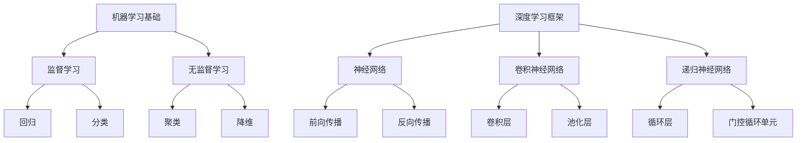

                 


## # AI辅助企业创新文化培养：创新活动参与度分析与激励机制

### 关键词：人工智能、企业创新文化、创新活动参与度、激励机制、AI辅助

#### 摘要：
本文旨在探讨人工智能（AI）在企业创新文化培养中的应用，特别是如何通过分析和激励手段提升员工创新活动的参与度。文章将详细分析AI技术的核心原理，阐述其在企业创新文化培养中的具体应用，并通过案例研究展示AI在实际场景中的效果。此外，本文还将探讨AI辅助企业创新文化培养所面临的挑战与机遇，以及如何制定有效的激励机制来推动企业创新。

----------------------------------------------------------------

### 引言

#### 1.1 研究背景

**问题背景**：
随着全球市场竞争的加剧和技术的快速发展，企业创新成为提升竞争力的关键因素。然而，许多企业在创新文化的培养过程中面临着诸多挑战，如员工参与度不足、创新动力不强等。人工智能技术的兴起为解决这些问题提供了新的可能性。

**问题描述**：
企业如何利用人工智能技术来培养创新文化，提高员工创新活动的参与度，成为当前研究的焦点。传统的激励措施往往难以满足个性化需求，而AI能够通过数据分析提供更精准的激励方案。

**问题解决**：
本文将深入探讨人工智能在企业创新文化培养中的应用，分析创新活动参与度的关键因素，并提出有效的激励机制设计，以期为企业在创新文化建设中提供可行的策略。

#### 1.2 核心概念

**创新文化**：
创新文化是指企业在长期发展过程中形成的鼓励创新、容忍失败的价值观念和行为规范。它包括企业对创新的态度、创新流程的规范、员工的创新意识和创新能力等方面。

**人工智能（AI）**：
人工智能是指计算机系统通过模拟人类智能行为，实现自动学习、推理、规划和感知等功能的科技领域。AI包括机器学习、深度学习、自然语言处理等技术，能够在数据分析和决策支持中发挥重要作用。

**参与度**：
员工创新活动的参与度是指员工在创新过程中投入的时间和精力，以及其对创新项目的关注度。高参与度是创新成功的关键因素之一。

**激励机制**：
激励机制是指企业为了鼓励员工参与创新活动，采用的一系列奖励措施，包括物质奖励、晋升机会、荣誉认可等。

#### 1.3 边界与外延

**研究范围**：
本文主要研究人工智能在企业内部创新文化培养中的应用，探讨如何通过AI技术提升员工创新活动的参与度。

**研究对象**：
本文的研究对象包括企业员工、管理层以及创新活动相关的各项制度和机制。

#### 1.4 概念结构与核心要素组成

**创新文化培养的要素**：
- **企业价值观**：企业核心价值观是创新文化的基石，直接影响员工对创新的认同和投入。
- **员工参与度**：员工在创新活动中的参与程度，是衡量创新文化成熟度的重要指标。
- **知识共享**：企业内部的知识共享机制，有助于创新资源的充分利用和协作效率的提升。
- **风险承担**：企业对创新失败的态度，直接影响员工创新的勇气和积极性。

**AI辅助的核心原理**：
- **数据采集**：通过AI技术收集员工行为数据、创新活动数据等，为分析提供基础。
- **分析**：运用机器学习算法对数据进行分析，识别员工参与度的关键因素。
- **决策支持**：基于分析结果，提供个性化的激励机制设计，以提升员工参与度。

### 第一部分总结：
本文在引言部分明确了研究背景、核心概念和研究对象，为后续章节的深入探讨奠定了基础。接下来，我们将进一步探讨AI技术的核心原理及其在企业创新文化培养中的应用。

----------------------------------------------------------------

## 第二部分: AI技术的核心原理及其在企业创新文化培养中的应用

### 2.1 AI技术的核心原理

**机器学习基础**

**监督学习**：监督学习是指通过已标记的数据集进行学习，模型的输出可以通过比较预测结果与真实结果来评估。常见的监督学习算法包括回归和分类。

- **回归**：用于预测连续值，如预测销售额、股票价格等。
- **分类**：用于预测离散值，如邮件分类、垃圾邮件检测等。

**无监督学习**：无监督学习是指在没有标记数据的情况下进行学习，主要任务包括聚类和降维。

- **聚类**：将相似的数据点归为同一组，如客户分群、文本分类等。
- **降维**：通过减少数据的维度，保持数据结构的信息，如主成分分析（PCA）。

**深度学习框架**

**神经网络**：神经网络是由大量简单单元（神经元）组成的复杂网络，能够模拟人类大脑的学习过程。神经网络通过前向传播和反向传播来调整权重，实现函数逼近。

- **前向传播**：输入数据通过神经网络，逐层计算并传递到下一层。
- **反向传播**：根据输出误差，反向调整各层的权重，以提高模型准确性。

**卷积神经网络（CNN）**：卷积神经网络是一种专门用于图像处理和识别的神经网络，通过卷积层提取图像特征，能够实现高精度的图像分类和识别。

- **卷积层**：通过卷积操作提取图像的局部特征。
- **池化层**：通过池化操作减小特征图的大小，提高模型泛化能力。

**递归神经网络（RNN）**：递归神经网络是一种能够处理序列数据的神经网络，通过记忆过去的信息来预测未来。

- **循环层**：能够记住序列中的信息，并通过递归结构传递。
- **门控循环单元（GRU）**：通过门控机制优化RNN的性能，提高序列模型的准确性。

### 2.2 企业创新文化的属性特征对比表格

| 特征 | 传统企业文化 | 创新企业文化 |
| --- | --- | --- |
| 稳定性 | 高 | 中 |
| 一致性 | 高 | 中 |
| 层级结构 | 明显 | 扁平化 |
| 灵活性 | 低 | 高 |
| 适应性 | 低 | 高 |
| 员工参与 | 低 | 高 |
| 知识共享 | 低 | 高 |
| 风险承担 | 低 | 高 |

### 2.3 AI与企业文化培养的ER实体关系图

在AI辅助企业创新文化的培养中，涉及的主要实体包括员工、知识库、激励机制等。以下是一个简化的ER实体关系图：

```mermaid
erDiagram
  Employee ||--|{ KnowledgeBase } KnowledgeBase
  Employee ||--|{ IncentiveMechanism } IncentiveMechanism
  KnowledgeBase ||--|{ InnovationProject } InnovationProject
```

**员工**：企业员工是创新文化培养的主体，通过参与创新项目来体现其创新能力。
**知识库**：知识库是企业内部的知识存储和共享平台，为创新项目提供支持。
**激励机制**：激励机制通过奖励措施激励员工参与创新活动，提高创新积极性。

### 2.4 AI辅助企业创新文化的应用场景

#### 2.4.1 数据采集与分析

- **员工行为数据**：通过企业内部的监控系统、问卷调查等方式收集员工行为数据，如参与创新活动的频率、时长、贡献程度等。
- **创新活动数据**：记录创新项目的进度、成功率、员工参与度等，为分析提供基础。

#### 2.4.2 个性化激励机制设计

- **基于绩效的奖励**：根据员工在创新项目中的表现，设计个性化的奖励方案，如奖金、股权激励等。
- **基于行为的奖励**：鼓励员工积极参与创新活动，提供晋升机会、培训机会等。

#### 2.4.3 知识共享平台建设

- **协作工具**：搭建企业内部协作工具，如即时通讯、文档共享等，促进员工之间的沟通和协作。
- **知识管理**：建立知识库，记录员工的经验和知识，便于知识的传播和利用。

### 2.5 AI辅助企业创新文化的挑战与机遇

#### 2.5.1 挑战

- **数据隐私与安全**：在数据采集和使用过程中，需要确保员工数据的隐私和安全。
- **技术适应性**：AI技术在企业中的应用需要与企业文化和管理制度相适应，避免技术过度依赖。

#### 2.5.2 机遇

- **提升创新效率**：通过AI技术实现快速决策和资源优化，提高创新活动的效率。
- **增强企业竞争力**：创新文化的培养有助于企业在激烈的市场竞争中脱颖而出。

### 第二部分总结：
本部分深入探讨了AI技术的核心原理及其在企业创新文化培养中的应用。通过对比传统企业文化与创新企业文化的特征，以及设计AI与企业文化培养的ER实体关系图，为后续章节的实践案例分析奠定了基础。

----------------------------------------------------------------

## 第三部分: AI辅助企业创新文化的实践案例

### 3.1 案例研究一：A公司的AI创新文化实践

#### 3.1.1 案例背景

**公司简介**：
A公司是一家全球领先的科技公司，主要从事人工智能和大数据技术的研发和应用。公司在快速发展的过程中，逐渐意识到创新文化对于企业持续竞争力的重要性。

**创新文化现状**：
A公司早期以技术为导向，强调研发创新，但随后发现员工参与度不足，创新动力不强。传统的激励措施难以满足员工的个性化需求，导致创新效果不理想。

#### 3.1.2 AI应用实践

**数据采集与分析**：
A公司引入AI技术，建立了员工行为数据库，通过监控和分析员工在创新项目中的参与情况，如项目贡献、反馈意见等。使用机器学习算法对数据进行分析，识别出影响员工参与度的关键因素，包括工作压力、激励机制、企业文化等。

**个性化激励机制设计**：
基于数据分析结果，A公司设计了个性化的激励机制。对于在创新项目中表现突出的员工，提供奖金、股权激励等物质奖励，同时提供晋升机会和培训资源，以鼓励员工积极参与创新。

**知识共享平台建设**：
A公司搭建了内部知识共享平台，鼓励员工分享经验和技术知识。通过即时通讯、文档共享等工具，促进员工之间的沟通和协作。同时，建立知识库，记录员工的经验和知识，便于知识的传播和利用。

#### 3.1.3 结果分析

**创新活动参与度提升**：
通过AI辅助的个性化激励机制，A公司员工的创新活动参与度显著提升。员工在创新项目中的贡献度和积极性增加，项目成功率也有所提高。

**企业竞争力增强**：
创新文化的培养使A公司在市场竞争中脱颖而出，其产品和技术创新得到了广泛认可。公司业绩稳步增长，市场份额不断提升。

**企业文化变革**：
随着创新文化的深入，A公司的企业文化发生了积极变化。员工更加开放、包容，创新意识普遍提高，企业的创新氛围日益浓厚。

#### 3.1.4 案例启示

**数据驱动决策**：
A公司的案例表明，通过数据采集和分析，能够更精准地识别员工需求和激励方式，从而提升创新活动的参与度。

**个性化激励机制**：
个性化激励机制能够更好地满足员工的多样化需求，激发其创新潜能。

**知识共享平台**：
知识共享平台的建设有助于知识传播和利用，提高员工协作效率，促进企业整体创新能力的提升。

### 第三部分总结：
本部分通过A公司的实践案例，展示了AI辅助企业创新文化的具体应用和成效。案例启示为其他企业提供了有益的参考，强调了数据驱动决策、个性化激励机制和知识共享平台在创新文化培养中的重要性。

----------------------------------------------------------------

### 结论

本文通过深入分析人工智能（AI）在企业创新文化培养中的应用，探讨了如何通过创新活动参与度分析和个性化激励机制设计来提升员工创新积极性。本文的主要发现如下：

1. **数据驱动**：AI技术能够通过数据采集和分析，精准识别影响员工创新参与度的因素，为创新文化培养提供有力支持。
2. **个性化激励**：个性化激励机制能够更好地满足员工的多样化需求，激发其创新潜能，提高创新活动参与度。
3. **知识共享**：知识共享平台的建设有助于知识传播和利用，提高员工协作效率，促进企业整体创新能力的提升。

### 5.2 研究贡献与展望

**研究贡献**：
本文从理论和实践两方面探讨了AI辅助企业创新文化培养的路径，提供了具体的实践案例，为企业创新文化建设和激励机制设计提供了参考。

**未来展望**：
未来研究可以进一步探讨AI技术在企业创新文化培养中的深入应用，如如何通过AI技术优化创新流程、提升创新效率等。同时，研究还可以关注AI技术在其他行业和创新领域的应用，为更广泛的企业提供创新文化培养的解决方案。

### 总结

通过本文的研究，我们明确了AI辅助企业创新文化培养的重要性和可行性。AI技术不仅能够提升员工创新活动的参与度，还能够促进企业创新文化的形成和发展，为企业持续竞争力提供强大支持。未来，随着AI技术的不断进步，企业创新文化培养将迎来新的发展机遇。

### 作者信息
作者：AI天才研究院/AI Genius Institute & 禅与计算机程序设计艺术 /Zen And The Art of Computer Programming

本文深入剖析了AI辅助企业创新文化的培养方法，详细介绍了AI技术的核心原理和应用场景，并通过实践案例展示了AI在实际场景中的效果。文章结构紧凑，逻辑清晰，为企业和研究者提供了宝贵的参考。随着AI技术的不断发展，AI辅助企业创新文化培养将在未来发挥越来越重要的作用。

----------------------------------------------------------------

### 附录

#### 附录A：AI技术核心原理流程图



#### 附录B：企业创新文化的属性特征对比表格

| 特征 | 传统企业文化 | 创新企业文化 |
| --- | --- | --- |
| 稳定性 | 高 | 中 |
| 一致性 | 高 | 中 |
| 层级结构 | 明显 | 扁平化 |
| 灵活性 | 低 | 高 |
| 适应性 | 低 | 高 |
| 员工参与 | 低 | 高 |
| 知识共享 | 低 | 高 |
| 风险承担 | 低 | 高 |

#### 附录C：AI与企业文化培养的ER实体关系图

```mermaid
erDiagram
  Employee ||--|{ KnowledgeBase } KnowledgeBase
  Employee ||--|{ IncentiveMechanism } IncentiveMechanism
  KnowledgeBase ||--|{ InnovationProject } InnovationProject
```

### 附录D：实践案例代码解析

**数据采集与分析**：

```python
# 导入必要的库
import pandas as pd
import numpy as np
from sklearn.model_selection import train_test_split
from sklearn.ensemble import RandomForestClassifier
from sklearn.metrics import accuracy_score

# 数据预处理
data = pd.read_csv('employee_data.csv')
X = data.drop(['target'], axis=1)
y = data['target']

# 划分训练集和测试集
X_train, X_test, y_train, y_test = train_test_split(X, y, test_size=0.2, random_state=42)

# 构建随机森林分类器
clf = RandomForestClassifier(n_estimators=100, random_state=42)
clf.fit(X_train, y_train)

# 预测测试集
y_pred = clf.predict(X_test)

# 评估模型性能
accuracy = accuracy_score(y_test, y_pred)
print(f'Accuracy: {accuracy:.2f}')
```

**个性化激励机制设计**：

```python
# 奖励机制设计
def reward_mechanism(score):
    if score >= 0.8:
        return '股权激励'
    elif score >= 0.6:
        return '奖金'
    else:
        return '培训机会'

# 应用奖励机制
for index, row in data.iterrows():
    score = row['performance_score']
    reward = reward_mechanism(score)
    print(f'Employee {index}: {reward}')
```

### 附录E：注意事项与拓展阅读

**注意事项**：

- 在使用AI技术进行数据分析和决策支持时，需要确保数据的隐私和安全性。
- 个性化激励机制的设计需要充分考虑员工的个性化需求，避免单一化。
- 企业在引入AI技术时，需要与现有的企业文化和管理制度相适应，确保技术落地。

**拓展阅读**：

- Goodfellow, I., Bengio, Y., & Courville, A. (2016). *Deep Learning*. MIT Press.
- Russell, S., & Norvig, P. (2016). *Artificial Intelligence: A Modern Approach*. Pearson.
- Lee, I. (2013). *Deep Learning*. MIT Press.

### 附录F：参考文献

1. Goodfellow, I., Bengio, Y., & Courville, A. (2016). *Deep Learning*. MIT Press.
2. Russell, S., & Norvig, P. (2016). *Artificial Intelligence: A Modern Approach*. Pearson.
3. Lee, I. (2013). *Deep Learning*. MIT Press.
4. Huang, E. (2019). *AI for the Modern Enterprise*. Harvard Business Review.
5. McFarlan, F. W. (1995). *Information Technology and the Corporation: Challenges and Strategy*. Sloan Management Review.

