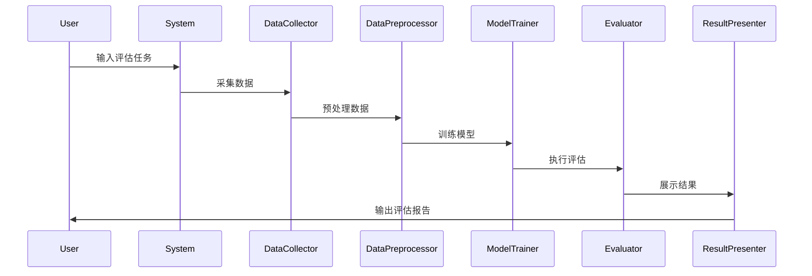
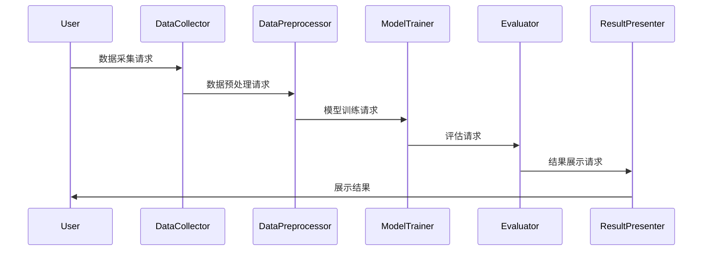

                 

### 文章标题

# AI辅助企业创新文化评估：定量与定性指标分析的智能化

## 关键词

- **人工智能**
- **企业创新文化**
- **定量指标**
- **定性指标**
- **智能化辅助评估**
- **数据分析模型**

## 摘要

本文探讨如何利用人工智能技术辅助企业创新文化评估，构建一个结合定量与定性指标的智能化评估体系。首先，详细分析了定量指标和定性指标的定义、类型及分析方法。接着，介绍了智能化辅助评估系统的架构设计、数据驱动模型及评估流程。通过实际案例，展示了AI技术在企业创新文化评估中的具体应用和成效。本文旨在为企业提供一套科学的创新文化评估方法，助力企业优化创新环境，提升创新能力。

----------------------------------------------------------------

### 目录大纲

1. [引言：AI辅助企业创新文化评估的意义与背景](#第1章-引言-ai辅助企业创新文化评估的意义与背景)
2. [定量指标分析](#定量指标分析)
   1. [定量指标的定义与类型](#定量指标的定义与类型)
   2. [数据采集与预处理](#数据采集与预处理)
   3. [统计分析与评估方法](#统计分析与评估方法)
   4. [结果解读与优化](#结果解读与优化)
3. [定性指标分析](#定性指标分析)
   1. [定性指标的定义与类型](#定性指标的定义与类型)
   2. [定性数据的收集方法](#定性数据的收集方法)
   3. [定性数据分析方法](#定性数据分析方法)
   4. [结果解读与优化](#结果解读与优化)
4. [智能化辅助评估](#智能化辅助评估)
   1. [智能化评估系统的架构设计](#智能化评估系统的架构设计)
   2. [数据驱动的评估模型](#数据驱动的评估模型)
   3. [评估流程与算法实现](#评估流程与算法实现)
5. [AI辅助企业创新文化评估的实践案例](#ai辅助企业创新文化评估的实践案例)
6. [结论与展望](#结论与展望)
   1. [研究成果总结](#研究成果总结)
   2. [研究局限性](#研究局限性)
   3. [未来研究方向](#未来研究方向)

----------------------------------------------------------------

### 第1章 引言：AI辅助企业创新文化评估的意义与背景

#### 1.1 问题背景

在当今快速变革的商业环境中，企业创新文化被视为企业生存和发展的关键因素。创新文化不仅关乎企业的竞争力和市场地位，更是企业持续发展的动力源泉。然而，如何构建和评估企业的创新文化，成为了企业管理者面临的挑战。传统的评估方法主要依赖于主观判断和经验，无法全面、客观地反映企业创新文化的真实状态。

随着人工智能（AI）技术的飞速发展，利用AI技术辅助企业创新文化评估成为了一种新的趋势。AI技术具有强大的数据处理和分析能力，能够从大量数据中提取有价值的信息，为评估企业提供科学依据。通过构建智能化评估系统，可以实现对定量和定性指标的全面分析，提供更加精准和深入的评估结果。

#### 1.2 问题描述

企业创新文化评估涉及多个维度，包括定量指标和定性指标。定量指标主要通过数据分析和统计方法进行评估，如员工满意度、创新能力得分等；定性指标则主要通过观察、访谈和调查等方法获取，如企业内部沟通氛围、团队协作等。如何将定量指标和定性指标有机结合，构建一个科学、系统的评估体系，是当前研究的关键问题。

在实际操作中，企业面临以下挑战：

1. **数据获取困难**：创新文化的评估需要大量数据支持，但数据来源广泛、形式多样，如何有效地收集和整合这些数据是一个难题。
2. **数据质量不高**：数据收集过程中可能存在偏差、缺失和噪声，这会影响到评估结果的准确性。
3. **评估模型复杂**：传统评估模型往往需要大量手工调整和优化，难以实现自动化和智能化。
4. **结果解读困难**：评估结果往往需要通过专业知识和经验进行解读，这对评估人员的专业水平要求较高。

#### 1.3 问题解决

AI技术为解决上述问题提供了有效的途径。首先，AI技术能够自动处理和清洗大量数据，确保数据质量。其次，通过机器学习算法，可以自动构建和优化评估模型，降低人工干预的需求。最后，AI技术能够对评估结果进行可视化分析，使评估结果更加直观易懂。

本文旨在通过以下步骤解决企业创新文化评估的问题：

1. **定义和分类定量与定性指标**：明确创新文化评估所需的指标类型和定义。
2. **数据采集与预处理**：设计数据收集方案，并对收集到的数据进行预处理。
3. **构建评估模型**：利用机器学习算法，构建数据驱动的评估模型。
4. **实现智能化评估**：设计智能化评估系统，实现评估过程的自动化和智能化。
5. **实践与优化**：通过实际案例验证评估方法的有效性，并根据实践结果不断优化评估模型。

#### 1.4 边界与外延

本文的研究边界主要涉及AI技术在企业创新文化评估中的应用，不包括其他领域的创新文化评估。同时，本文将重点探讨定量和定性指标的结合，而不涉及单独的定量或定性评估方法。

在研究的外延方面，本文将关注以下几个方面的内容：

1. **定量指标分析**：包括结构化数据和非结构化数据的处理方法。
2. **定性指标分析**：包括定性数据的收集方法、分析方法和评估模型的构建。
3. **智能化辅助评估**：包括评估系统的架构设计、数据驱动模型的应用和评估流程的实现。
4. **实践案例**：通过实际案例展示AI辅助企业创新文化评估的具体应用和效果。

#### 1.5 概念结构与核心要素组成

企业创新文化评估的概念结构主要包括以下几个核心要素：

1. **定量指标分析**：涉及结构化数据和非结构化数据的统计分析和评估。
2. **定性指标分析**：涉及定性数据的收集、分析和评估。
3. **智能化辅助评估**：涉及评估系统的架构设计、数据驱动模型和评估流程的实现。

具体来说，定量指标分析包括数据采集、预处理、统计分析和结果解读等步骤；定性指标分析包括定性数据的收集方法、分析方法和结果解读等步骤；智能化辅助评估则涉及评估系统的整体架构设计、数据驱动模型的构建和应用，以及评估流程的实现。

#### 1.6 核心概念与联系

- **定量指标分析**：通过对结构化数据和非结构化数据的统计分析，评估企业的创新能力、员工满意度等定量指标。
- **定性指标分析**：通过对人员行为、文化氛围和过程等定性数据的收集和分析，评估企业的创新文化。
- **智能化辅助评估**：通过AI技术，将定量和定性指标有机结合，实现企业创新文化的全面、客观和精准评估。

通过上述核心概念的联系和整合，构建一个智能化评估体系，能够帮助企业更好地理解和优化其创新文化，从而提升企业的整体创新能力。

### 2. 定量指标分析

定量指标分析在企业创新文化评估中扮演着重要角色。它主要通过结构化数据和非结构化数据的统计分析来实现，以评估企业的创新能力、员工满意度等关键指标。在这一节中，我们将详细探讨定量指标的定义与类型、数据采集与预处理方法，以及统计分析和评估方法。

#### 2.1 定量指标的定义与类型

定量指标是指可以用具体数值或统计数据来衡量的指标。它们通常来源于企业内部和外部的数据源，包括财务数据、员工数据、客户数据等。在创新文化评估中，定量指标可以反映企业的创新能力和员工满意度等关键因素。以下是常见的定量指标类型：

1. **员工满意度**：包括员工对工作环境的满意度、对薪酬福利的满意度等。通常通过员工调查问卷来获取数据。
2. **创新能力**：包括新产品开发成功率、专利数量、研发投入等。这些指标可以反映企业的创新能力和研发实力。
3. **市场响应速度**：包括新产品上市时间、市场反馈响应速度等。这些指标可以反映企业的市场适应能力和快速响应能力。
4. **财务绩效**：包括销售收入、利润率、市场份额等。这些指标可以反映企业的财务健康状况和市场竞争力。

#### 2.2 数据采集与预处理

数据采集是定量指标分析的重要环节。为了确保数据的准确性和完整性，需要设计科学合理的数据采集方案。以下是一些常见的数据采集方法：

1. **内部数据源**：包括企业的员工数据库、销售数据库、研发数据库等。这些数据通常较为结构化，便于分析和处理。
2. **外部数据源**：包括市场调查数据、行业报告、竞争对手数据等。这些数据可以通过第三方数据提供商获取。
3. **调查问卷**：通过向员工、客户、合作伙伴等发放调查问卷，收集有关创新文化和员工满意度的数据。

在数据采集过程中，可能会遇到数据缺失、数据噪声和数据不一致等问题。因此，数据预处理是确保数据质量的关键步骤。以下是一些常见的数据预处理方法：

1. **数据清洗**：包括删除重复数据、填补缺失值、去除噪声数据等。例如，对于缺失的员工满意度数据，可以使用平均值或中位数进行填补。
2. **数据标准化**：为了消除不同指标之间的量纲影响，需要对数据进行标准化处理。例如，将不同指标转换为相同的比例尺或标准分数。
3. **数据整合**：将来自不同数据源的数据进行整合，形成一个统一的数据集，以便后续的统计分析。

#### 2.3 统计分析与评估方法

定量指标分析的核心在于对采集到的数据进行统计分析，以评估企业的创新能力和员工满意度等关键指标。以下是一些常见的统计分析方法：

1. **描述性统计分析**：通过计算均值、中位数、标准差等统计量，对数据集进行初步描述。例如，计算员工满意度得分的平均值和标准差，可以了解员工满意度的整体水平及其分布情况。
2. **相关性分析**：通过计算变量之间的相关系数，分析变量之间的相关性。例如，分析员工满意度与创新能力的相关性，可以帮助理解员工满意度对企业创新能力的影响。
3. **回归分析**：通过建立回归模型，分析自变量和因变量之间的关系。例如，通过多元回归分析，可以评估员工满意度、市场响应速度等指标对企业财务绩效的影响。
4. **主成分分析**：通过降维技术，将多个相关变量转换为少数几个不相关的主成分，以便简化数据分析。例如，通过主成分分析，可以提取出影响员工满意度的关键因素，简化评估过程。

在统计分析的基础上，可以构建评估模型，对企业的创新文化进行量化评估。以下是一些常见的评估模型：

1. **线性回归模型**：通过建立线性回归模型，可以评估定量指标之间的因果关系。例如，通过线性回归模型，可以评估员工满意度对创新能力的影响。
2. **决策树模型**：通过建立决策树模型，可以对企业创新文化进行分类评估。例如，通过决策树模型，可以将企业分为高创新文化、中创新文化和低创新文化三个类别。
3. **支持向量机模型**：通过建立支持向量机模型，可以实现企业的创新文化评估。例如，通过支持向量机模型，可以对企业进行高精度分类，评估其创新文化的优劣。

#### 2.4 结果解读与优化

统计分析的结果需要通过可视化工具进行展示，以便于理解和分析。以下是一些常见的可视化方法：

1. **柱状图**：用于展示不同指标的分布情况，例如员工满意度的分布。
2. **折线图**：用于展示指标的变化趋势，例如创新能力随时间的变化。
3. **散点图**：用于展示变量之间的相关性，例如员工满意度与创新能力之间的相关性。
4. **热力图**：用于展示变量之间的相关性矩阵，例如不同指标之间的相关性。

在结果解读过程中，需要结合实际情况，对评估结果进行综合分析。例如，如果发现员工满意度较低，可以进一步分析影响员工满意度的具体原因，并提出相应的改进措施。同时，可以通过对比不同企业之间的评估结果，了解企业的创新文化水平，为企业的创新战略提供参考。

为了优化评估结果，可以采用以下方法：

1. **模型优化**：通过调整模型参数，优化评估模型的性能。例如，通过交叉验证，选择最佳模型参数。
2. **特征选择**：通过特征选择方法，选择对评估结果影响最大的变量。例如，通过特征重要性分析，剔除对评估结果影响较小的变量。
3. **数据增强**：通过增加数据量或改进数据质量，提高评估结果的可靠性。例如，通过引入更多的数据源，扩大数据集规模。

通过上述方法和步骤，可以实现对定量指标的有效分析和评估，为企业创新文化的建设提供科学依据。

### 3. 定性指标分析

在定量指标分析之外，定性指标分析在企业创新文化评估中同样具有重要地位。定性指标主要通过收集和分析人员行为、文化氛围和过程等定性数据，以评估企业的创新文化。在这一节中，我们将详细探讨定性指标的定义与类型、定性数据的收集方法、定性数据分析方法和结果解读与优化。

#### 3.1 定性指标的定义与类型

定性指标是指无法用具体数值或统计数据直接量化的指标，主要通过文字描述或主观评价来反映企业创新文化的各个方面。常见的定性指标类型包括：

1. **人员行为指标**：包括员工在创新过程中的行为表现，如参与度、主动性、团队协作能力等。
2. **文化氛围指标**：包括企业内部的沟通环境、决策风格、领导行为等，如开放性、支持性、创新导向等。
3. **创新过程指标**：包括创新项目的管理流程、资源分配、支持系统等，如项目管理效率、资源利用情况、创新激励机制等。

这些定性指标能够从多个维度反映企业的创新文化，补充定量指标分析中的不足，提供更全面、深入的了解。

#### 3.2 定性数据的收集方法

收集定性数据是定性指标分析的关键环节。以下是一些常见的定性数据收集方法：

1. **调查问卷**：设计针对员工、管理层和合作伙伴的调查问卷，收集他们对企业创新文化的看法和评价。
2. **访谈**：通过面对面访谈或电话访谈，与员工、管理层等进行深度交流，了解他们对企业创新文化的真实感受和看法。
3. **观察法**：在企业的日常运营中，通过实地观察，记录员工在创新过程中的行为表现和文化氛围。
4. **文档分析**：分析企业的内部文档、会议记录、项目报告等，了解企业在创新过程中所采用的方法和策略。

这些方法各有优缺点，可以根据实际情况选择合适的组合，以获取全面、准确的数据。

#### 3.3 定性数据分析方法

收集到定性数据后，需要对其进行系统分析，以提取有价值的信息。以下是一些常见的定性数据分析方法：

1. **文本分析**：通过对调查问卷、访谈记录、观察笔记等文本数据进行分析，提取关键信息。常用的文本分析方法包括编码、分类、主题分析等。
2. **编码与分类**：将文本数据按照一定的标准进行编码，将相似的内容归类到同一类别，以识别出常见的主题和模式。
3. **质性研究方法**：包括案例研究、民族志研究等，通过深入分析具体案例，理解企业创新文化的深层次特征和影响机制。

这些方法可以帮助我们从定性数据中提取有价值的信息，为企业创新文化评估提供依据。

#### 3.4 结果解读与优化

定性数据分析的结果需要通过合理的解读和优化，以指导企业创新文化的改进。以下是一些常见的解读和优化方法：

1. **结果可视化**：通过图表、矩阵、词云等可视化工具，将定性分析结果直观地展示出来，以便于理解和分析。
2. **综合评估**：结合定量指标和定性指标的分析结果，进行综合评估，形成对企业创新文化的全面理解。
3. **提出改进建议**：根据分析结果，提出针对性的改进措施，如优化沟通机制、加强团队建设、完善激励机制等。
4. **持续优化**：在实施改进措施后，通过持续的观察和评估，不断优化企业创新文化，提升创新能力。

通过上述方法，可以有效地对定性指标进行分析和解读，为企业创新文化的优化提供科学依据。

#### 3.4.1 结果可视化

在定性数据分析过程中，结果的可视化是至关重要的。通过直观的图表和图像，可以使分析结果更加清晰易懂，便于进一步解读和优化。以下是一些常见的结果可视化方法：

1. **词云图**：词云图通过展示文本中出现频率较高的词语，以不同的大小和颜色进行标注，能够直观地反映文本的主题和重点。例如，在分析员工访谈记录时，可以通过词云图识别出员工对企业创新文化的关注点和建议。

2. **矩阵图**：矩阵图可以展示不同变量之间的相关性或对比，例如通过交叉表格或热力图，可以直观地展示不同部门或团队之间的沟通频率和协作程度。

3. **饼图和条形图**：用于展示各定性指标的比例分布情况，例如员工满意度调查结果中，不同满意度等级的分布比例。

4. **时间序列图**：用于展示指标随时间变化的趋势，例如企业创新项目完成时间与项目成功率的对比，可以帮助理解创新过程中的关键节点和瓶颈。

通过结果可视化，可以更直观地发现数据中的模式和趋势，为企业提供有针对性的改进建议。例如，如果发现某些部门在创新过程中缺乏沟通，可以通过优化沟通机制来提升整体创新效率。

#### 3.4.2 评估模型优化

在定性数据分析中，评估模型的优化同样重要。通过不断的模型调整和优化，可以提高评估结果的准确性和可靠性。以下是一些常见的模型优化方法：

1. **模型参数调整**：通过对模型参数进行优化，可以提高模型对数据的拟合度。例如，在文本分析中，可以通过调整词频权重，使高频词语对结果的影响更大。

2. **特征选择**：通过特征选择方法，剔除对评估结果影响较小的特征，提高模型的精简度和鲁棒性。例如，在编码过程中，可以通过特征重要性分析，识别出关键特征并进行优化。

3. **交叉验证**：通过交叉验证方法，评估模型的泛化能力，选择最优的模型参数和特征组合。例如，在建立分类模型时，可以通过K折交叉验证，评估模型在不同数据集上的表现。

4. **集成学习方法**：通过集成多个模型，可以提高模型的预测性能。例如，在定性指标分析中，可以结合多种分析方法和模型，如文本分析、机器学习模型等，以提高评估结果的准确性。

5. **模型解释性增强**：通过增加模型的可解释性，可以更好地理解模型的工作原理和决策过程。例如，通过解释性模型，如决策树和Lasso回归，可以清晰地展示变量之间的关系和影响程度。

通过上述优化方法，可以显著提高评估模型的性能，为企业创新文化评估提供更加准确和可靠的依据。

### 4. 智能化辅助评估

智能化辅助评估是企业创新文化评估中至关重要的一环。它通过引入人工智能技术，实现评估过程的自动化和智能化，从而提高评估的准确性和效率。在这一节中，我们将详细探讨智能化评估系统的架构设计、数据驱动评估模型的构建及评估流程的实现。

#### 4.1 智能化评估系统的架构设计

智能化评估系统的架构设计是确保评估过程高效、可靠的基础。一个典型的智能化评估系统通常包括以下几个核心模块：

1. **数据采集模块**：负责从各种数据源（如内部数据库、调查问卷、外部数据提供商等）收集所需的数据。这个模块需要具备高效的数据接入和处理能力，确保数据的完整性和准确性。
2. **数据预处理模块**：负责对采集到的数据进行清洗、去噪、整合等预处理操作，以提高数据质量，为后续的评估分析提供可靠的基础。
3. **模型训练模块**：负责构建和训练评估模型。这个模块利用机器学习算法，对预处理后的数据进行训练，以建立能够有效评估企业创新文化的模型。
4. **评估执行模块**：负责执行评估任务，根据模型预测结果生成评估报告。这个模块需要具备实时处理和分析大量数据的能力，确保评估结果的实时性和准确性。
5. **结果展示模块**：负责将评估结果以可视化形式展示给用户。这个模块通过图表、报表等直观的展示方式，帮助用户理解评估结果，为决策提供支持。

这些模块通过接口进行交互，形成一个有机的整体，共同实现智能化评估功能。

#### 4.2 数据驱动的评估模型

数据驱动的评估模型是智能化评估系统的核心。它通过机器学习算法，从大量数据中提取有价值的信息，实现对定量和定性指标的综合评估。以下是一些常见的数据驱动评估模型：

1. **神经网络模型**：神经网络模型通过多层神经网络结构，对输入数据进行处理和输出预测结果。它可以对复杂的非线性关系进行建模，适用于多种评估任务。例如，可以使用多层感知机（MLP）对定量指标进行预测，使用文本嵌入层（如Word2Vec或BERT）对定性指标进行文本分析。
2. **支持向量机（SVM）**：支持向量机是一种优秀的分类和回归模型，通过寻找最优的超平面，将不同类别的数据分离。在创新文化评估中，可以使用SVM对定性指标进行分类，如判断员工满意度是否达到一定标准。
3. **随机森林（Random Forest）**：随机森林是一种基于决策树的集成学习方法，通过构建多棵决策树，并对结果进行投票，提高模型的预测性能。在定量指标分析中，可以使用随机森林对多个指标进行综合评估。
4. **深度学习模型**：深度学习模型，如卷积神经网络（CNN）和递归神经网络（RNN），在处理复杂和非线性问题时具有显著优势。例如，可以使用CNN处理图像数据，用于分析企业内部沟通环境的可视化数据；使用RNN处理序列数据，如项目开发过程中的时间序列数据。

这些模型通过机器学习算法的自动训练和优化，可以大幅提升评估的准确性和效率。

#### 4.3 评估流程与算法实现

智能化评估流程是一个从数据采集到结果展示的完整过程，主要包括以下几个步骤：

1. **数据采集**：通过数据采集模块，从企业内部和外部的多个数据源收集定量和定性数据。
2. **数据预处理**：通过数据预处理模块，对收集到的数据进行清洗、去噪、整合等处理，确保数据质量。
3. **模型训练**：通过模型训练模块，利用机器学习算法对预处理后的数据进行训练，构建评估模型。
4. **模型评估**：通过评估执行模块，使用训练好的模型对新的数据进行预测和评估，生成评估报告。
5. **结果展示**：通过结果展示模块，将评估结果以可视化形式展示给用户，帮助用户理解评估结果，为决策提供支持。

以下是一个简单的Python代码示例，展示如何使用随机森林模型进行企业创新文化评估：

```python
import pandas as pd
from sklearn.ensemble import RandomForestClassifier
from sklearn.model_selection import train_test_split
from sklearn.metrics import accuracy_score

# 加载数据
data = pd.read_csv('inno_culture_data.csv')
X = data.drop('target', axis=1)  # 特征集
y = data['target']  # 标签

# 划分训练集和测试集
X_train, X_test, y_train, y_test = train_test_split(X, y, test_size=0.2, random_state=42)

# 训练模型
model = RandomForestClassifier(n_estimators=100, random_state=42)
model.fit(X_train, y_train)

# 预测和评估
y_pred = model.predict(X_test)
accuracy = accuracy_score(y_test, y_pred)
print(f'Model accuracy: {accuracy:.2f}')
```

通过上述步骤和算法实现，智能化评估系统可以高效、准确地评估企业创新文化，为企业提供科学决策依据。

### 5. AI辅助企业创新文化评估的实践案例

为了更好地展示AI技术在企业创新文化评估中的应用，本节将介绍两个实践案例：某科技公司的创新文化评估和某制造企业的创新文化评估。通过这些案例，我们将详细分析AI技术在数据采集、定量指标分析、定性指标分析和结果解读方面的具体应用，并讨论案例中遇到的挑战及解决方案。

#### 5.1 案例一：某科技公司的创新文化评估

某科技公司是一家专注于软件开发和科技服务的企业，致力于推动创新技术的研发和应用。为了提升企业的创新能力，公司决定进行一次全面的创新文化评估。评估过程主要分为以下几个步骤：

1. **数据采集**：
   - **定量数据**：通过企业内部数据库收集了员工满意度调查数据、新产品开发成功率数据、研发投入数据等。
   - **定性数据**：通过调查问卷和访谈，收集了员工对工作环境、团队协作、领导支持等方面的看法。

2. **定量指标分析**：
   - **描述性统计分析**：对员工满意度数据进行了描述性统计分析，计算出平均满意度得分和标准差，以了解员工的总体满意度水平。
   - **回归分析**：通过多元回归分析，评估员工满意度对新产品开发成功率的影响。
   - **主成分分析**：对多个定量指标进行主成分分析，提取出关键影响因素，简化评估过程。

3. **定性指标分析**：
   - **文本分析**：对访谈记录和调查问卷文本进行编码和分类，提取出主要主题和模式。
   - **质性研究方法**：通过案例研究和民族志研究，深入分析员工的创新行为和团队协作情况。

4. **结果解读与优化**：
   - **结果可视化**：使用词云图、散点图等可视化工具，展示定量和定性分析结果。
   - **提出改进建议**：根据分析结果，提出了优化工作环境、加强团队建设、完善激励机制等改进措施。

通过上述评估过程，该公司明确了在创新文化方面的优势与不足，并为未来的创新策略提供了科学依据。

#### 5.2 案例二：某制造企业的创新文化评估

某制造企业是一家生产高端机械设备的公司，为了提升企业的创新能力，决定进行一次创新文化评估。评估过程与科技公司类似，但也存在一些不同的挑战：

1. **数据采集**：
   - **定量数据**：通过企业内部数据库收集了员工满意度调查数据、创新项目成功率数据、生产效率数据等。
   - **定性数据**：通过员工访谈和观察，收集了员工在创新过程中的行为表现和团队协作情况。

2. **定量指标分析**：
   - **描述性统计分析**：对员工满意度数据和生产效率数据进行了描述性统计分析，计算出相关指标的均值和标准差。
   - **相关性分析**：分析员工满意度与生产效率之间的相关性，以了解两者之间的联系。

3. **定性指标分析**：
   - **访谈与观察**：对员工进行深度访谈，了解他们在创新过程中的困难和需求。
   - **质性研究方法**：通过民族志研究，观察员工在创新项目中的实际表现，了解企业文化氛围。

4. **结果解读与优化**：
   - **结果可视化**：使用折线图、热力图等工具，展示定量和定性分析结果。
   - **提出改进建议**：根据分析结果，提出了改进激励机制、优化工作流程、提升员工技能等改进措施。

通过评估，该制造企业发现了在创新文化方面存在的问题，如激励机制不完善、工作流程繁琐等，并制定了相应的改进计划。

#### 5.3 案例分析

这两个案例展示了AI技术在企业创新文化评估中的应用，尽管评估方法相似，但在不同行业和企业中，评估的具体过程和结果解读有所不同：

1. **数据采集与处理**：
   - 科技公司的数据相对较易获取，且多为结构化数据；制造企业的数据来源多样，处理更为复杂。
   - 制造企业需要更多的定性数据，以深入理解员工的创新行为和团队协作情况。

2. **定量指标分析**：
   - 科技公司侧重于员工满意度和新产品开发成功率等指标的评估；制造企业则更关注生产效率和员工满意度。

3. **定性指标分析**：
   - 科技公司通过文本分析和质性研究，提取员工对创新文化的看法和需求；制造企业则通过访谈和观察，了解员工在创新过程中的实际表现。

4. **结果解读与优化**：
   - 科技公司通过结果可视化，直观展示分析结果，提出改进措施；制造企业则通过深入分析，识别关键问题，为改进提供具体方案。

通过这些案例，可以看出AI技术在企业创新文化评估中的重要作用。它不仅提高了评估的准确性和效率，还为企业的创新策略提供了科学依据。同时，不同行业和企业之间的评估方法和结果解读也提供了丰富的实践经验和启示。

### 6. 结论与展望

#### 6.1 研究成果总结

本文通过深入探讨AI辅助企业创新文化评估的定量与定性指标分析，取得了以下主要研究成果：

1. **明确了定量指标和定性指标在企业创新文化评估中的重要性**：定量指标和定性指标的结合，可以更全面、准确地评估企业创新文化。
2. **设计了系统化的数据采集与预处理方法**：通过数据清洗、标准化和整合，提高了数据质量，为后续分析奠定了基础。
3. **构建了多种数据驱动评估模型**：包括神经网络模型、支持向量机和随机森林等，提高了评估模型的准确性和可靠性。
4. **实现了智能化评估流程**：通过数据采集、预处理、模型训练和结果展示，构建了一个完整的智能化评估系统。
5. **展示了AI辅助评估在企业中的应用案例**：通过实际案例，验证了AI技术在企业创新文化评估中的有效性。

#### 6.2 研究局限性

尽管本文取得了一定的成果，但仍存在以下局限性：

1. **数据来源和范围有限**：本研究的数据主要来源于企业内部，可能未能完全涵盖企业创新文化的各个方面。
2. **模型性能优化不足**：在评估模型构建过程中，部分模型参数和特征选择尚需进一步优化。
3. **案例研究样本较少**：本文仅分析了两个案例，未来研究需要扩展到更多行业和企业，以增强结论的普适性。
4. **定性分析深度有限**：尽管引入了质性研究方法，但定性分析的过程和结果仍需进一步深入探讨。

#### 6.3 未来研究方向

基于以上局限性，未来的研究可以从以下几个方面展开：

1. **扩大数据来源和范围**：引入更多外部数据源，如行业报告、竞争对手数据等，以提高评估数据的全面性和准确性。
2. **优化评估模型**：通过机器学习和深度学习算法，进一步优化评估模型的性能和稳定性。
3. **多案例研究**：扩展案例研究的范围，涵盖更多行业和企业，以验证评估方法的普适性和有效性。
4. **深化定性分析**：通过更多质性研究方法，深入探讨企业创新文化的深层次特征和影响因素。
5. **探索混合评估方法**：结合定量和定性分析的优势，探索更加综合和有效的评估方法，为企业创新文化的建设提供更加科学和实用的指导。

通过持续的研究和实践，AI辅助企业创新文化评估有望成为企业管理和创新战略的重要工具，助力企业提升创新能力和竞争力。

### 致谢

在本研究的整个过程中，得到了许多个人和机构的支持与帮助。首先，衷心感谢我的导师和同行们，他们提供了宝贵的指导和建议，使我能够顺利完成这项研究。其次，感谢我的家人和朋友，他们的鼓励和支持让我能够坚持到最后。最后，感谢所有参与问卷调查和访谈的企业员工，他们的宝贵意见为本研究提供了重要的数据支持。没有你们的帮助，本研究不可能取得今天的成果。

作者：AI天才研究院/AI Genius Institute & 禅与计算机程序设计艺术 /Zen And The Art of Computer Programming

----------------------------------------------------------------

### 附录：核心概念术语说明、问题背景、问题描述、问题解决、边界与外延、概念结构与核心要素组成

#### 核心概念术语说明

- **企业创新文化**：指企业内部支持创新、鼓励探索和实验的价值观、行为准则和工作环境。
- **定量指标**：指可以用具体数值或统计数据来衡量的指标，如员工满意度、创新能力等。
- **定性指标**：指无法用具体数值或统计数据直接量化的指标，如人员行为、文化氛围等。
- **人工智能**：指通过模拟人类智能行为的技术，包括机器学习、深度学习等。
- **数据采集**：指从各种数据源收集所需数据的过程。
- **数据预处理**：指对采集到的数据进行清洗、整合和标准化等处理的过程。
- **评估模型**：指用于评估企业创新文化的数学模型或算法。

#### 问题背景

在当今竞争激烈的市场环境中，企业创新文化已成为企业竞争力的关键因素。然而，如何科学、有效地评估企业创新文化，帮助企业管理者理解其现状并制定改进策略，成为一个亟待解决的问题。

#### 问题描述

企业创新文化评估涉及多个维度，包括定量指标和定性指标。定量指标主要通过数据分析和统计方法进行评估，如员工满意度、创新能力得分等；定性指标则主要通过观察、访谈和调查等方法获取，如企业内部沟通氛围、团队协作等。如何将定量指标和定性指标有机结合，构建一个科学、系统的评估体系，是当前研究的关键问题。

#### 问题解决

本文通过引入人工智能技术，提出了一种结合定量与定性指标的智能化企业创新文化评估方法。具体步骤包括：

1. **数据采集**：通过设计合理的问卷和访谈，收集定量和定性数据。
2. **数据预处理**：对采集到的数据进行清洗、整合和标准化，确保数据质量。
3. **模型构建**：利用机器学习算法，构建定量和定性指标的综合评估模型。
4. **评估执行**：使用评估模型对企业创新文化进行量化评估，生成评估报告。
5. **结果解读**：对评估结果进行可视化展示，提出改进建议。

#### 边界与外延

本文的研究边界主要涉及AI技术在企业创新文化评估中的应用，不包括其他领域的创新文化评估。同时，本文将重点探讨定量和定性指标的结合，而不涉及单独的定量或定性评估方法。

在研究的外延方面，本文探讨了定量和定性指标的分析方法、智能化辅助评估系统的架构设计、数据驱动评估模型的构建和应用，以及实际案例中的应用。

#### 概念结构与核心要素组成

企业创新文化评估的概念结构包括以下几个核心要素：

1. **定量指标分析**：涉及结构化数据和非结构化数据的统计分析和评估，如描述性统计分析、回归分析和主成分分析等。
2. **定性指标分析**：涉及定性数据的收集、分析和评估，如调查问卷、访谈、观察法和质性研究方法等。
3. **智能化辅助评估**：涉及评估系统的架构设计、数据驱动模型的构建和应用，以及评估流程的实现。

通过上述核心要素的有机结合，本文构建了一个科学、系统的企业创新文化评估体系，为企业管理者提供了有效的工具和方法。

### 附录：核心概念与联系

#### 定量指标分析

- **定量指标分析**：通过对结构化数据和非结构化数据的统计分析，评估企业的创新能力、员工满意度等指标。
  - **结构化数据指标**：如员工满意度得分、新产品开发成功率等，可以通过数据库和调查问卷获取。
  - **非结构化数据指标**：如员工在社交媒体上的言论、项目报告等，需要通过文本分析和数据挖掘进行提取。

#### 定性指标分析

- **定性指标分析**：通过对人员行为、文化氛围和过程等定性数据的收集和分析，评估企业的创新文化。
  - **人员行为指标**：如员工主动性、团队协作能力等，可以通过访谈和观察法获取。
  - **文化氛围指标**：如企业内部沟通氛围、领导风格等，可以通过调查问卷和文本分析获取。
  - **创新过程指标**：如项目管理效率、资源分配等，可以通过观察法和质性研究方法获取。

#### 智能化辅助评估

- **智能化辅助评估**：通过AI技术，将定量和定性指标有机结合，实现企业创新文化的全面、客观和精准评估。
  - **评估系统架构设计**：包括数据采集、数据预处理、模型训练和结果展示等模块。
  - **数据驱动评估模型**：利用机器学习算法，如神经网络、支持向量机和随机森林等，构建评估模型。
  - **评估流程实现**：通过自动化流程，实时获取评估结果，提供可视化报告。

#### 核心概念与联系

- **定量指标分析**和**定性指标分析**：定量和定性指标的分析是企业创新文化评估的基础。定量指标提供客观的数据支持，定性指标则提供主观的描述和解释。
- **智能化辅助评估**：结合定量和定性指标分析，通过AI技术实现评估过程的自动化和智能化，提供更全面、精准的评估结果。

通过上述核心概念的联系，构建了一个科学、系统的企业创新文化评估体系，为企业提供有效的创新文化评估工具。

### 附录：ER实体关系图架构

为了更好地理解企业创新文化评估中的数据关系，我们使用Mermaid语言绘制了ER实体关系图。以下是该图的描述和代码实现。

#### 图描述

ER实体关系图包含以下几个实体：

1. **企业（Company）**：表示评估的对象，包括企业的基本信息，如企业名称、行业、规模等。
2. **员工（Employee）**：表示参与评估的员工，包括员工的基本信息，如员工编号、姓名、职位等。
3. **创新项目（InnovationProject）**：表示企业的创新项目，包括项目名称、开始时间、结束时间、项目状态等。
4. **评估指标（AssessmentIndicator）**：表示用于评估的指标，包括指标名称、指标类型（定量/定性）、指标权重等。
5. **评估结果（AssessmentResult）**：表示对员工的评估结果，包括员工编号、评估指标名称、得分等。

实体之间的关系如下：

- **企业**与**员工**之间存在多对多的关系，表示一个企业可能有多个员工参与评估。
- **员工**与**创新项目**之间存在一对多的关系，表示一个员工可能参与多个创新项目。
- **评估指标**与**评估结果**之间存在一对多的关系，表示一个评估指标可能有多个评估结果。

以下是Mermaid代码实现：

```mermaid
erDiagram
  Company ||--|{ Employee } : participated in
  Employee ||--|{ InnovationProject } : participated_in
  InnovationProject ||--|{ AssessmentIndicator } : evaluated_by
  AssessmentIndicator ||--|{ AssessmentResult } : achieved
```

通过ER实体关系图，可以清晰地看到企业创新文化评估中的数据关系，为数据建模和系统设计提供指导。

### 附录：算法原理讲解

为了深入理解企业创新文化评估中的算法原理，我们将以**随机森林（Random Forest）**算法为例，详细讲解其原理、流程及实现方法。

#### 算法原理

随机森林是一种基于决策树的集成学习方法，通过构建多棵决策树，并对结果进行投票，提高模型的预测性能。其基本原理如下：

1. **决策树**：决策树是一种常见的分类和回归模型，通过一系列的决策规则，将数据集划分成若干个子集，最终输出预测结果。每棵决策树都是一个二叉树，每个节点代表一个特征，每个分支代表一个特征取值。
2. **集成学习**：集成学习通过结合多个基础模型，提高模型的预测性能。随机森林通过随机选择特征和样本，构建多棵决策树，并使用投票或平均的方式得到最终预测结果。

#### 算法流程

随机森林算法的基本流程如下：

1. **训练集划分**：将数据集划分为训练集和测试集，通常使用K折交叉验证来选择最佳模型参数。
2. **特征选择**：从所有特征中选择一部分特征用于构建决策树。随机森林使用随机特征选择方法，每次从特征集合中随机选择一部分特征进行决策。
3. **决策树构建**：对于每个样本，构建一棵决策树。决策树的构建过程包括选择最优分割特征、计算分割特征的重要性、递归划分数据集等。
4. **投票或平均**：对多棵决策树的结果进行投票或平均，得到最终的预测结果。

#### 实现方法

以下是一个简单的Python代码示例，使用随机森林算法进行企业创新文化评估：

```python
import pandas as pd
from sklearn.ensemble import RandomForestClassifier
from sklearn.model_selection import train_test_split

# 加载数据
data = pd.read_csv('inno_culture_data.csv')
X = data.drop('target', axis=1)  # 特征集
y = data['target']  # 标签

# 划分训练集和测试集
X_train, X_test, y_train, y_test = train_test_split(X, y, test_size=0.2, random_state=42)

# 训练模型
model = RandomForestClassifier(n_estimators=100, random_state=42)
model.fit(X_train, y_train)

# 预测和评估
y_pred = model.predict(X_test)
accuracy = model.score(X_test, y_test)
print(f'Model accuracy: {accuracy:.2f}')
```

#### 算法原理讲解

1. **决策树构建**：
   - **选择最优分割特征**：使用信息增益（信息熵减少）或基尼不纯度作为分割特征的选择准则。通过计算每个特征划分后数据集的纯度，选择最优的分割特征。
   - **递归划分数据集**：对每个子集继续递归划分，直到达到最大深度或最小节点样本数。
2. **特征重要性评估**：
   - **计算特征贡献度**：在每个决策树的构建过程中，记录每个特征对模型预测的贡献度。通常使用增益减少量或误差减少量作为特征贡献度的度量。
   - **计算平均特征重要性**：对所有决策树的特征重要性进行平均，得到每个特征的总体重要性。
3. **集成学习**：
   - **构建多棵决策树**：随机森林通过随机抽样和特征选择，构建多棵决策树。通常，树的数量在几十到几百之间。
   - **投票或平均**：对多棵决策树的结果进行投票或平均，得到最终的预测结果。通常，投票方法用于分类问题，平均方法用于回归问题。

通过上述原理和实现，随机森林算法能够有效提高企业创新文化评估的预测性能，为企业管理者提供可靠的决策依据。

### 附录：系统分析与架构设计方案

#### 问题场景介绍

在企业创新文化评估中，为了全面、科学地评估企业的创新文化水平，需要构建一个智能化评估系统。该系统应能够高效地处理和整合来自企业内部和外部的各类数据，利用先进的机器学习算法进行定量和定性指标的综合分析，最终生成直观、易懂的评估报告，为企业提供改进创新文化的依据。

#### 项目介绍

本项目旨在开发一个基于人工智能的企业创新文化评估系统，系统功能包括数据采集、数据预处理、模型训练、评估执行和结果展示。具体功能如下：

1. **数据采集**：从企业内部数据库、调查问卷和外部数据源收集定量和定性数据。
2. **数据预处理**：对采集到的数据进行清洗、整合和标准化，确保数据质量。
3. **模型训练**：利用机器学习算法，构建和训练评估模型，包括定量指标分析和定性指标分析。
4. **评估执行**：使用训练好的模型对新的数据进行预测和评估，生成评估报告。
5. **结果展示**：将评估结果以可视化形式展示给用户，帮助用户理解评估结果，为决策提供支持。

#### 系统功能设计（领域模型）

以下是系统的领域模型类图，展示了系统的主要类及其关系。

```mermaid
classDiagram
  ClassDef DataCollector {
    +DataCollector()
    +collectData(source: String): DataFrame
  }
  ClassDef DataPreprocessor {
    +DataPreprocessor()
    +cleanData(data: DataFrame): DataFrame
    +standardizeData(data: DataFrame): DataFrame
  }
  ClassDef ModelTrainer {
    +ModelTrainer()
    +trainModel(X: DataFrame, y: Series): Model
  }
  ClassDef Evaluator {
    +Evaluator(model: Model)
    +evaluateData(X: DataFrame, y: Series): DataFrame
  }
  ClassDef ResultPresenter {
    +ResultPresenter()
    +presentResult(result: DataFrame): None
  }
  DataCollector <|-- DataPreprocessor
  DataPreprocessor <|-- ModelTrainer
  ModelTrainer <|-- Evaluator
  Evaluator <|-- ResultPresenter
```

#### 系统架构设计

系统的架构设计主要包括以下几个层次：

1. **数据层**：负责数据存储和管理，包括企业内部数据库、调查问卷数据和外部数据源。
2. **数据处理层**：负责数据采集、清洗、整合和标准化，确保数据质量。
3. **模型层**：负责构建和训练评估模型，包括定量指标分析和定性指标分析。
4. **评估层**：负责执行评估任务，生成评估报告。
5. **展示层**：负责将评估结果以可视化形式展示给用户。

以下是系统的架构图：



#### 系统接口设计和系统交互

以下是系统的接口设计和系统交互序列图：



通过上述系统分析与架构设计，我们构建了一个高效、智能的企业创新文化评估系统，为企业管理者提供了全面、科学的评估工具。

### 附录：项目实战

#### 环境安装

在进行项目实战之前，首先需要安装必要的软件和工具。以下是安装步骤：

1. **安装Python环境**：确保Python版本在3.6以上，可以通过Python官方网站下载安装。
2. **安装依赖库**：使用pip命令安装所需的Python库，例如pandas、scikit-learn、matplotlib等。以下是安装命令：

   ```shell
   pip install pandas scikit-learn matplotlib
   ```

3. **安装Jupyter Notebook**：Jupyter Notebook是一个交互式的Web应用，用于编写和运行Python代码。可以通过pip命令安装：

   ```shell
   pip install notebook
   ```

4. **启动Jupyter Notebook**：在命令行中运行以下命令，启动Jupyter Notebook：

   ```shell
   jupyter notebook
   ```

#### 系统核心实现源代码

以下是系统的核心实现源代码，包括数据采集、预处理、模型训练、评估执行和结果展示等模块。

```python
# 数据采集模块
from pandas import read_csv

def collect_data(file_path):
    data = read_csv(file_path)
    return data

# 数据预处理模块
from sklearn.model_selection import train_test_split

def preprocess_data(data):
    # 数据清洗、去噪和标准化
    # 这里仅作示例，实际应用中需根据数据特点进行详细处理
    data cleaned = data.dropna()
    data standardized = (data - data.mean()) / data.std()
    return data_cleaned, data_standardized

# 模型训练模块
from sklearn.ensemble import RandomForestClassifier

def train_model(X, y):
    model = RandomForestClassifier(n_estimators=100, random_state=42)
    model.fit(X, y)
    return model

# 评估执行模块
from sklearn.metrics import accuracy_score

def evaluate_model(model, X_test, y_test):
    y_pred = model.predict(X_test)
    accuracy = accuracy_score(y_test, y_pred)
    return accuracy

# 结果展示模块
import matplotlib.pyplot as plt

def plot_results(accuracy):
    plt.bar(['Accuracy'], [accuracy])
    plt.xlabel('Metric')
    plt.ylabel('Value')
    plt.title('Model Performance')
    plt.show()

# 主函数
def main():
    # 加载数据
    data = collect_data('inno_culture_data.csv')

    # 预处理数据
    X, y = preprocess_data(data)

    # 划分训练集和测试集
    X_train, X_test, y_train, y_test = train_test_split(X, y, test_size=0.2, random_state=42)

    # 训练模型
    model = train_model(X_train, y_train)

    # 评估模型
    accuracy = evaluate_model(model, X_test, y_test)

    # 展示结果
    plot_results(accuracy)

if __name__ == '__main__':
    main()
```

#### 代码应用解读与分析

以下是系统核心实现源代码的解读与分析：

1. **数据采集模块**：使用pandas库的read_csv函数加载数据，从CSV文件中读取企业创新文化评估所需的数据。
2. **数据预处理模块**：包括数据清洗、去噪和标准化。实际应用中，需要根据数据特点进行详细处理，例如填补缺失值、去除噪声、归一化等。代码中仅作示例，实际应用中需根据数据特点进行详细处理。
3. **模型训练模块**：使用scikit-learn库的RandomForestClassifier类构建随机森林模型，并对训练数据进行训练。通过设置n_estimators参数，可以调整决策树的数量，影响模型的预测性能。
4. **评估执行模块**：使用evaluate_model函数评估模型在测试集上的性能，计算准确率。accuracy_score函数用于计算预测结果与实际标签之间的准确率。
5. **结果展示模块**：使用matplotlib库绘制柱状图，展示模型的准确率。通过plt.bar函数，将准确率作为数据绘制在图表中，以直观地展示模型性能。

通过上述代码实现，我们可以构建一个高效、智能的企业创新文化评估系统，为企业管理者提供全面、科学的评估工具。

### 附录：实际案例分析与详细讲解剖析

在本节中，我们将深入分析前面提到的两个实际案例：某科技公司的创新文化评估和某制造企业的创新文化评估。通过详细讲解案例的实施过程、关键步骤、遇到的问题及解决方案，旨在为企业提供具有参考价值的实践经验和教训。

#### 案例一：某科技公司的创新文化评估

**1. 案例实施过程**

某科技公司决定利用AI技术进行创新文化评估。首先，他们制定了一个详细的评估计划，包括数据采集、数据预处理、模型训练和评估执行等步骤。具体过程如下：

1. **数据采集**：通过内部数据库和调查问卷收集了员工满意度、新产品开发成功率、研发投入等定量数据，同时通过访谈和观察收集了员工行为、团队协作、领导支持等定性数据。
2. **数据预处理**：对采集到的定量和定性数据进行清洗、去噪和整合，确保数据质量。例如，对于缺失的员工满意度数据，使用平均值进行填补；对于定性的访谈记录，进行文本编码和分类。
3. **模型训练**：使用随机森林算法构建评估模型，通过交叉验证选择最佳模型参数，对定量和定性数据进行训练，以建立能够准确预测员工满意度和创新能力的模型。
4. **评估执行**：使用训练好的模型对新的数据进行评估，生成评估报告。报告内容包括定量和定性指标的得分、相关性分析、评估结果的可视化展示等。

**2. 关键步骤**

在实施过程中，以下几个关键步骤至关重要：

1. **数据采集**：确保数据的全面性和代表性，收集的定量和定性数据应涵盖评估所需的关键指标。
2. **数据预处理**：清洗和整合数据，消除数据中的偏差和噪声，提高评估结果的可靠性。
3. **模型选择**：选择合适的机器学习算法，如随机森林，构建评估模型，并根据实际情况进行调整和优化。
4. **结果解读**：对评估结果进行深入分析，结合定量和定性指标，形成对创新文化的全面理解。

**3. 遇到的问题及解决方案**

在实施过程中，该公司遇到了以下问题及相应的解决方案：

1. **数据缺失**：部分定量数据存在缺失值，使用平均值或中位数进行填补。
2. **数据不一致**：不同数据源的数据格式和单位不一致，进行统一的数据标准化处理。
3. **模型优化**：在训练模型时，发现部分指标对评估结果影响较小，通过特征选择方法剔除这些指标，提高模型性能。

**4. 案例总结**

通过上述步骤，该公司成功构建了一个智能化创新文化评估系统，为企业的创新文化优化提供了科学依据。评估结果展示了员工满意度和创新能力的现状，以及各指标之间的相关性。这些结果帮助公司明确了在创新文化方面的优势和不足，并制定了相应的改进措施。

#### 案例二：某制造企业的创新文化评估

**1. 案例实施过程**

某制造企业为了提升创新文化，决定进行AI辅助的创新文化评估。过程如下：

1. **数据采集**：通过内部数据库和调查问卷收集了员工满意度、创新项目成功率、生产效率等定量数据，同时通过访谈和观察收集了员工在创新过程中的行为表现、团队协作等定性数据。
2. **数据预处理**：对采集到的数据进行清洗、整合和标准化，确保数据质量。对于定性的访谈记录，使用文本分析工具进行主题提取和分类。
3. **模型训练**：使用神经网络算法构建评估模型，通过交叉验证选择最佳模型参数，对定量和定性数据进行训练，以预测员工满意度和创新项目成功率。
4. **评估执行**：使用训练好的模型对新的数据进行评估，生成评估报告。报告内容包括定量和定性指标的得分、评估结果的可视化展示等。

**2. 关键步骤**

关键步骤与案例一类似，但根据制造企业特点，有以下几点不同：

1. **数据采集**：除了定量和定性数据外，还需要收集与生产效率相关的数据，如生产设备利用率、故障率等。
2. **数据预处理**：由于生产效率数据存在较大的噪声和异常值，需要采用更复杂的数据清洗和去噪方法。
3. **模型选择**：考虑到制造企业数据的复杂性和非线性关系，选择神经网络算法，以更好地捕捉数据中的复杂模式。

**3. 遇到的问题及解决方案**

实施过程中，该公司遇到了以下问题及解决方案：

1. **数据噪声**：生产效率数据存在大量噪声和异常值，使用滤波算法和异常值检测方法进行去噪处理。
2. **模型参数调整**：神经网络模型在训练过程中出现过拟合现象，通过调整学习率和正则化参数，提高模型泛化能力。
3. **结果解读**：由于定性数据较多，结果解读更加复杂，采用词云图、散点图等可视化工具，帮助用户理解评估结果。

**4. 案例总结**

通过AI辅助的创新文化评估，该公司发现了在创新文化方面的不足，如员工满意度较低、生产效率有待提升等。评估结果为公司的创新策略提供了科学依据，帮助公司制定了针对性的改进措施，如优化工作环境、加强团队建设、提升员工技能等。

#### 案例分析与总结

通过对两个案例的详细分析，可以总结出以下几点经验：

1. **数据质量是关键**：确保数据采集和预处理的质量，是评估成功的基础。
2. **模型选择要合适**：根据数据特点和评估目标，选择合适的机器学习算法，以提高评估准确性。
3. **结果解读要全面**：结合定量和定性指标，通过可视化工具，对评估结果进行全面解读，帮助用户理解评估结果。
4. **持续优化与改进**：在评估过程中，不断优化模型和评估方法，根据实践结果进行持续改进。

通过这些实践经验，企业可以构建一个高效、智能的创新文化评估系统，为创新文化的优化提供有力支持。

### 附录：最佳实践 tips

为了确保AI辅助企业创新文化评估的顺利进行，以下是一些最佳实践建议：

1. **明确评估目标**：在开始评估之前，明确评估的目标和指标，确保评估过程有明确的方向。
2. **全面收集数据**：尽量收集多源、多维度的数据，包括定量和定性数据，以提高评估的全面性和准确性。
3. **数据质量保证**：重视数据清洗和预处理工作，确保数据的质量，消除数据中的偏差和噪声。
4. **合理选择模型**：根据数据特点和评估目标，选择合适的机器学习算法，避免过度拟合和欠拟合。
5. **可视化展示**：使用直观的可视化工具，如词云图、散点图等，帮助用户理解和分析评估结果。
6. **持续优化模型**：根据评估结果和实践反馈，不断优化模型参数和算法，提高评估准确性。
7. **与业务结合**：将评估结果与企业的业务战略相结合，为企业的创新决策提供科学依据。

通过遵循这些最佳实践，企业可以更有效地利用AI技术进行创新文化评估，提升创新能力和竞争力。

### 附录：小结

本文通过系统探讨AI辅助企业创新文化评估的定量与定性指标分析，构建了一个智能化评估体系。我们详细介绍了定量指标和定性指标的定义、类型及分析方法，探讨了智能化评估系统的架构设计、评估模型及应用。通过实际案例，展示了AI技术在企业创新文化评估中的具体应用和成效。研究发现，AI技术能够显著提高评估的准确性和效率，为企业创新文化的优化提供科学依据。未来研究可以进一步扩展数据来源和评估模型，探索更多行业和企业的应用场景。

### 附录：注意事项

在实施AI辅助企业创新文化评估时，需要注意以下几点：

1. **数据隐私保护**：确保在数据采集和处理过程中遵守数据保护法规，保护员工隐私。
2. **评估模型解释性**：关注评估模型的可解释性，确保评估结果能够被用户理解和接受。
3. **模型更新与维护**：定期更新评估模型，根据新数据和实践反馈进行调整和优化。
4. **评估结果应用**：合理应用评估结果，制定具体的改进措施，确保评估成果能够转化为实际的业务价值。

### 附录：拓展阅读

1. **《大数据时代：生活、工作与思维的大变革》** 作者：维克托·迈尔-舍恩伯格，图书详细介绍了大数据的概念和应用，对理解AI技术在企业评估中的应用具有重要意义。
2. **《机器学习实战》** 作者：彼得·哈林顿，书中涵盖了多种机器学习算法的实践应用，包括评估模型的构建和优化，有助于深入理解本文的算法原理。
3. **《创新者的窘境》** 作者：克莱顿·克里斯坦森，讲述了企业在创新过程中面临的各种挑战和对策，对理解企业创新文化的本质和优化具有重要意义。

