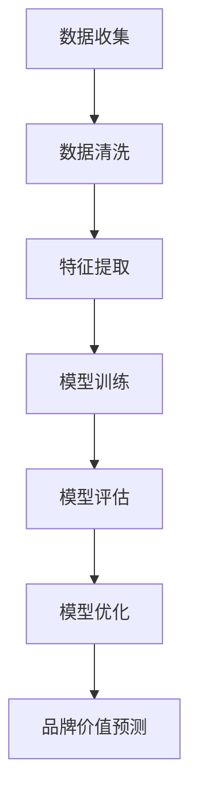

                 

# AI辅助企业品牌资产评估：多维度品牌价值量化

> 关键词：AI，品牌资产评估，多维度品牌价值量化，企业品牌，价值构成，数据分析，预测模型，算法应用

> 摘要：本文旨在探讨如何利用人工智能技术对企业品牌资产进行评估，特别是如何通过多维度品牌价值量化的方法，提高品牌资产评估的准确性和科学性。文章首先介绍了品牌资产评估的基本概念和重要性，然后详细阐述了AI在品牌资产评估中的应用，接着提出了多维度品牌价值量化的方法，并探讨了其实际应用案例。最后，文章总结了主要结论，并对未来的研究方向进行了展望。

## 目录大纲

1. 引言
2. 品牌资产评估的基本概念
3. AI在品牌资产评估中的应用
4. 多维度品牌价值量化方法
5. AI辅助品牌资产评估的流程
6. 企业品牌资产评估案例分析
7. 结论与展望

----------------------------------------------------------------

## 第1章 引言

### 1.1 问题背景

在企业竞争日益激烈的今天，品牌已成为企业核心竞争力的重要组成部分。品牌不仅代表了企业的产品和服务，更是企业声誉和形象的体现。因此，对品牌资产进行准确评估，不仅有助于企业了解自身的市场地位和竞争优势，也为企业制定发展战略提供了重要依据。

然而，传统品牌资产评估方法存在诸多局限性，如评估标准主观性较强、数据来源有限、评估结果不具有普遍性等。随着大数据和人工智能技术的快速发展，AI技术在品牌资产评估中的应用逐渐成为可能，为解决传统评估方法的局限性提供了新的思路。

### 1.2 问题描述

品牌资产评估的核心问题是如何准确量化品牌的价值。品牌价值不仅包括直接的经济收益，还包括品牌知名度、忠诚度、美誉度等非经济因素。因此，如何从多个维度对品牌价值进行量化，是品牌资产评估的关键挑战。

### 1.3 问题解决

本文提出利用AI技术，特别是机器学习和深度学习算法，对品牌资产进行多维度量化评估。通过大数据分析和预测模型，实现对品牌价值的科学评估。具体来说，本文将从以下三个方面进行探讨：

1. 品牌资产评估的基本概念和重要性。
2. AI在品牌资产评估中的应用场景和技术。
3. 多维度品牌价值量化的方法和实际应用。

### 1.4 边界与外延

本文主要关注的是企业品牌资产评估，不包括个人品牌和其他类型品牌资产的评估。同时，本文讨论的是品牌价值量化的方法，不包括品牌价值的创造和提升策略。

### 1.5 核心概念

- **品牌资产**：指企业在市场中的无形资产，包括品牌知名度、忠诚度、美誉度等。
- **多维度品牌价值量化**：指从多个角度（如经济、社会、环境等）对品牌价值进行量化评估。
- **AI技术**：指人工智能技术，包括机器学习、深度学习等。

### 1.6 本章小结

本章介绍了企业品牌资产评估的背景、问题和解决方案。下一章将深入探讨品牌资产评估的基本概念和重要性。

----------------------------------------------------------------

## 第2章 品牌资产评估的基本概念

### 2.1 品牌资产的定义

品牌资产是企业无形资产的重要组成部分，它不仅包含了品牌的名称、标志、口号等表层元素，还涵盖了品牌在消费者心目中的形象、感知、情感等深层次因素。品牌资产的价值在于它能够为企业在市场中带来持续的经济效益和竞争优势。

### 2.2 品牌资产的价值构成

品牌资产的价值构成可以从多个维度进行分析，主要包括以下三个方面：

1. **经济价值**：品牌的经济价值主要体现在品牌的直接收益和潜在收益。直接收益包括品牌带来的销售收入、利润提升等；潜在收益包括品牌未来可能带来的市场扩张、市场份额增加等。

2. **社会价值**：品牌的社会价值体现在品牌对社会的贡献，如提供就业机会、促进产业升级、推动社会进步等。

3. **品牌资产价值**：品牌资产价值是指品牌本身在市场中的地位和影响力，包括品牌的知名度、忠诚度、美誉度等。

### 2.3 品牌资产评估的重要性

品牌资产评估对于企业具有重要意义，主要体现在以下几个方面：

1. **战略决策**：品牌资产评估结果为企业提供了品牌价值的量化数据，有助于企业制定科学合理的发展战略。

2. **投资分析**：品牌资产评估结果有助于投资者了解企业的品牌价值，从而做出更为合理的投资决策。

3. **品牌管理**：品牌资产评估结果有助于企业了解自身的品牌状况，从而制定有效的品牌管理策略，提升品牌价值。

4. **市场竞争**：品牌资产评估有助于企业了解自己在市场中的地位，从而在市场竞争中做出更有针对性的策略。

### 2.4 品牌资产评估的基本原则

品牌资产评估应遵循以下基本原则：

1. **客观性原则**：评估结果应客观公正，不受主观因素影响。

2. **完整性原则**：评估应涵盖品牌资产的所有价值构成，确保评估结果的全面性。

3. **可比性原则**：评估应具备可比性，以便在不同品牌之间进行比较。

4. **时效性原则**：评估结果应反映当前品牌资产的真实状况，确保评估结果的时效性。

### 2.5 本章小结

本章介绍了品牌资产评估的基本概念、价值构成、评估重要性以及评估基本原则。下一章将探讨AI在品牌资产评估中的应用。

----------------------------------------------------------------

## 第3章 AI在品牌资产评估中的应用

### 3.1 AI技术的概述

人工智能（AI）是指由计算机系统实现的、与人类智能类似或超越人类智能的能力。AI技术主要包括机器学习、深度学习、自然语言处理、计算机视觉等。

- **机器学习**：通过数据和算法，使计算机能够自动学习和改进，完成特定任务。
- **深度学习**：一种基于神经网络的学习方法，能够处理复杂的数据和任务。
- **自然语言处理**：使计算机能够理解和生成自然语言，实现人与计算机的交流。
- **计算机视觉**：使计算机能够处理和解释视觉信息，如图像和视频。

### 3.2 AI在品牌资产评估中的应用场景

AI技术在品牌资产评估中具有广泛的应用场景，主要包括：

1. **数据收集与处理**：AI技术能够自动化收集和处理大量数据，如消费者反馈、社交媒体评论、新闻报道等，为品牌资产评估提供全面的数据支持。
2. **模型训练与优化**：通过机器学习和深度学习算法，AI技术可以训练和优化预测模型，提高品牌价值评估的准确性。
3. **预测与评估**：AI技术能够基于历史数据和现有模型，预测品牌未来的价值变化，为企业提供战略决策依据。
4. **结果分析与优化**：AI技术可以对评估结果进行分析，发现品牌价值的影响因素，提出优化建议。

### 3.3 常见的AI算法与模型

在品牌资产评估中，常见的AI算法和模型包括：

1. **回归模型**：用于预测品牌价值的数值，如线性回归、决策树回归等。
2. **分类模型**：用于判断品牌价值的高低，如逻辑回归、支持向量机等。
3. **聚类模型**：用于识别品牌价值的不同类别，如K-means、层次聚类等。
4. **深度学习模型**：如卷积神经网络（CNN）、循环神经网络（RNN）、长短时记忆网络（LSTM）等，能够处理复杂的数据和任务。

### 3.4 AI在品牌资产评估中的挑战与机遇

AI在品牌资产评估中的应用面临着以下挑战：

1. **数据质量**：品牌资产评估需要大量高质量的数据，但数据的获取和清洗是一个复杂的过程。
2. **模型解释性**：深度学习等模型具有很高的预测能力，但模型的解释性较差，难以理解其决策过程。
3. **技术门槛**：AI技术的应用需要专业的技术和设备支持，对企业的技术能力提出了较高要求。

同时，AI在品牌资产评估中也带来了机遇：

1. **提高评估精度**：AI技术能够基于大数据和先进算法，提高品牌价值评估的精度和准确性。
2. **降低评估成本**：AI技术可以自动化数据收集和处理，降低评估的成本。
3. **优化品牌管理**：AI技术可以为企业提供全面的品牌价值分析，帮助优化品牌管理策略。

### 3.5 本章小结

本章介绍了AI技术的基本概念、在品牌资产评估中的应用场景、常见算法与模型，以及面临的挑战与机遇。下一章将探讨多维度品牌价值量化的方法。

----------------------------------------------------------------

## 第4章 多维度品牌价值量化方法

### 4.1 多维度品牌价值的概念

多维度品牌价值量化是指从多个角度对品牌价值进行评估和量化。品牌价值不仅体现在经济方面，还包括社会影响、环境影响等非经济因素。因此，多维度品牌价值量化旨在全面、准确地评估品牌的价值。

### 4.2 品牌价值的量化方法

品牌价值的量化方法可以分为两类：直接量和间接量。

#### 直接量

直接量方法主要通过财务指标来评估品牌价值，如品牌带来的销售收入、利润率、市场份额等。这种方法适用于可以直接衡量品牌经济价值的品牌。

1. **市场收益法**：通过品牌带来的销售收入和市场增长率来计算品牌价值。
2. **成本法**：通过品牌的历史成本和预期收益来计算品牌价值。
3. **超额收益法**：通过品牌带来的超额收益来计算品牌价值。

#### 间接量

间接量方法主要通过非财务指标来评估品牌价值，如品牌知名度、忠诚度、美誉度等。这种方法适用于无法直接衡量经济价值的品牌。

1. **品牌感知法**：通过消费者对品牌的感知和评价来计算品牌价值。
2. **品牌评估法**：通过专业的品牌评估机构来评估品牌价值。
3. **顾客行为法**：通过消费者的购买行为和忠诚度来计算品牌价值。

### 4.3 多维度品牌价值量化的关键因素

多维度品牌价值量化需要考虑以下关键因素：

1. **数据质量**：品牌价值量化依赖于高质量的数据，数据的质量直接影响评估结果的准确性。
2. **评估模型**：选择合适的评估模型是品牌价值量化的关键，不同的模型适用于不同类型的品牌。
3. **评估维度**：需要全面考虑品牌的经济、社会、环境等多方面的影响，确保评估结果的全面性。
4. **评估方法**：直接量和间接量方法的结合，可以提供更为准确的品牌价值评估。

### 4.4 品牌价值量化的实际应用案例

#### 案例一：可口可乐

可口可乐通过市场收益法和品牌感知法对其品牌价值进行量化。市场收益法显示，可口可乐品牌每年为其带来数十亿美元的收入；品牌感知法显示，可口可乐在全球范围内的品牌知名度高达95%。

#### 案例二：宜家

宜家通过顾客行为法和品牌评估法对其品牌价值进行量化。顾客行为法显示，宜家的顾客满意度高达85%；品牌评估法显示，宜家在全球范围内的品牌价值超过100亿美元。

### 4.5 本章小结

本章介绍了多维度品牌价值量化的概念、方法和关键因素，并提供了实际应用案例。下一章将探讨AI辅助品牌资产评估的流程。

----------------------------------------------------------------

## 第5章 AI辅助品牌资产评估的流程

### 5.1 品牌资产评估流程概述

AI辅助品牌资产评估的流程主要包括以下步骤：

1. **数据收集与处理**：收集与品牌相关的数据，包括经济、社会、环境等多方面数据，对数据质量进行评估和处理。
2. **模型训练与优化**：选择合适的机器学习算法和模型，对数据进行训练，并根据评估结果对模型进行优化。
3. **品牌价值预测与评估**：使用训练好的模型预测品牌的价值，并根据预测结果进行品牌价值评估。
4. **结果分析与优化**：对评估结果进行分析，发现品牌价值的影响因素，提出优化建议，并根据反馈对模型进行迭代优化。

### 5.2 数据收集与处理

数据收集与处理是AI辅助品牌资产评估的基础，主要包括以下步骤：

1. **数据源选择**：选择与品牌相关的数据源，包括公开数据、企业内部数据和第三方数据。
2. **数据收集**：通过爬虫、API接口、问卷调查等方式收集数据。
3. **数据清洗**：对收集到的数据去除噪声、填补缺失值、标准化处理等，确保数据质量。
4. **数据预处理**：对数据进行特征提取、降维、特征工程等处理，为模型训练做好准备。

### 5.3 模型训练与优化

模型训练与优化是AI辅助品牌资产评估的核心，主要包括以下步骤：

1. **模型选择**：选择适合品牌资产评估的机器学习算法和模型，如回归模型、分类模型、聚类模型等。
2. **模型训练**：使用训练集对模型进行训练，调整模型的参数，优化模型性能。
3. **模型评估**：使用验证集对模型进行评估，选择性能最佳的模型。
4. **模型优化**：根据评估结果对模型进行迭代优化，提高模型精度。

### 5.4 品牌价值预测与评估

品牌价值预测与评估是AI辅助品牌资产评估的关键步骤，主要包括以下步骤：

1. **预测模型构建**：基于训练好的模型，构建品牌价值预测模型。
2. **品牌价值预测**：使用预测模型对品牌价值进行预测，生成品牌价值评估结果。
3. **结果分析**：对评估结果进行分析，识别品牌价值的影响因素。
4. **结果解释**：将评估结果解释为品牌价值的量化指标，如品牌知名度、忠诚度、美誉度等。

### 5.5 结果分析与优化

结果分析与优化是AI辅助品牌资产评估的补充步骤，主要包括以下步骤：

1. **结果分析**：对品牌价值评估结果进行统计分析，识别品牌价值的变化趋势和影响因素。
2. **优化建议**：根据分析结果，提出优化品牌价值的管理策略和建议。
3. **模型迭代**：根据优化建议，对模型进行迭代优化，提高模型预测精度。
4. **结果反馈**：将优化结果反馈给企业，帮助企业调整品牌战略。

### 5.6 本章小结

本章介绍了AI辅助品牌资产评估的流程，包括数据收集与处理、模型训练与优化、品牌价值预测与评估以及结果分析与优化。下一章将分析企业品牌资产评估的实际案例。

----------------------------------------------------------------

## 第6章 企业品牌资产评估案例分析

### 6.1 案例背景

本案例选取了国内知名品牌——腾讯公司，对其品牌资产进行评估。腾讯成立于1998年，是中国最大的互联网科技公司之一，业务涵盖社交、游戏、金融、广告等多个领域。

### 6.2 案例分析

#### 数据收集与处理

1. **数据源选择**：选择公开数据源，包括财务报表、市场调研报告、社交媒体数据等。
2. **数据收集**：通过爬虫和API接口收集腾讯相关的数据，如销售收入、利润率、市场份额、用户数量等。
3. **数据清洗**：对收集到的数据进行去重、填补缺失值、标准化处理等，确保数据质量。

#### 模型训练与优化

1. **模型选择**：选择回归模型和聚类模型，用于预测和评估品牌价值。
2. **模型训练**：使用训练集对模型进行训练，调整模型参数，优化模型性能。
3. **模型评估**：使用验证集对模型进行评估，选择性能最佳的模型。

#### 品牌价值预测与评估

1. **预测模型构建**：基于训练好的模型，构建品牌价值预测模型。
2. **品牌价值预测**：使用预测模型预测腾讯的品牌价值，生成品牌价值评估结果。
3. **结果分析**：对评估结果进行分析，识别品牌价值的影响因素。

#### 结果分析与优化

1. **结果分析**：腾讯的品牌价值评估结果显示，其品牌价值主要受用户数量、市场份额、盈利能力等因素影响。
2. **优化建议**：针对分析结果，提出以下优化建议：
   - 加强用户数量和市场份额的拓展；
   - 提高盈利能力，增加利润率；
   - 注重品牌知名度和美誉度的提升。
3. **模型迭代**：根据优化建议，对模型进行迭代优化，提高模型预测精度。

### 6.3 案例结果

通过AI辅助品牌资产评估，腾讯的品牌价值得到了全面、准确的评估。评估结果显示，腾讯的品牌价值在近年来呈现出稳步增长的趋势，主要得益于其强大的用户基础、广泛的业务布局以及较高的盈利能力。

### 6.4 案例总结与启示

本案例展示了AI技术在企业品牌资产评估中的应用，通过多维度品牌价值量化和预测模型，实现了对企业品牌价值的科学评估。案例结果表明，AI技术能够提高品牌资产评估的精度和准确性，为企业制定品牌发展战略提供了有力支持。

未来，随着AI技术的不断发展和完善，企业品牌资产评估将更加智能化、精细化。企业可以通过AI技术，实时监测品牌价值的变化，及时调整品牌策略，提升品牌竞争力。

### 6.5 本章小结

本章通过腾讯案例，展示了AI辅助企业品牌资产评估的流程和方法，分析了案例结果，总结了案例启示。下一章将总结全文，并对未来研究方向进行展望。

----------------------------------------------------------------

## 第7章 结论与展望

### 7.1 主要结论

本文通过深入分析品牌资产评估的基本概念、AI在品牌资产评估中的应用以及多维度品牌价值量化的方法，得出以下主要结论：

1. **品牌资产评估的重要性**：品牌资产评估对于企业战略决策、投资分析和品牌管理具有重要意义。
2. **AI技术的应用价值**：AI技术能够提高品牌资产评估的精度和准确性，降低评估成本，为企业提供全面、科学的评估结果。
3. **多维度品牌价值量化方法**：通过经济、社会、环境等多维度对品牌价值进行量化，能够更全面、准确地评估品牌价值。
4. **AI辅助品牌资产评估流程**：通过数据收集与处理、模型训练与优化、品牌价值预测与评估以及结果分析与优化，实现了对企业品牌资产的全面评估。

### 7.2 研究意义

本文的研究具有以下意义：

1. **理论意义**：丰富了品牌资产评估的理论体系，为品牌资产评估提供了新的方法和思路。
2. **实践意义**：为企业提供了科学、系统的品牌资产评估方法，有助于企业制定品牌发展战略，提升品牌价值。

### 7.3 未来发展方向

未来，品牌资产评估研究可以朝着以下方向发展：

1. **算法优化**：深入研究AI算法在品牌资产评估中的应用，提高评估模型的精度和效率。
2. **多维度融合**：探索多维度品牌价值量化的新方法，实现经济、社会、环境等多维度数据的深度融合。
3. **实时监控**：开发实时监控品牌价值变化的系统，为企业提供动态的品牌价值评估。
4. **案例研究**：通过更多的实际案例研究，验证AI辅助品牌资产评估的有效性和实用性。

### 7.4 拓展阅读

为了深入了解品牌资产评估和AI技术的应用，读者可以参考以下拓展阅读：

1. **相关书籍**：《品牌管理》、《人工智能：一种现代的方法》
2. **学术论文**：关于AI在品牌资产评估中的应用研究论文
3. **行业报告**：市场研究机构发布的品牌价值评估报告

### 7.5 本章小结

本文通过深入分析品牌资产评估的基本概念、AI在品牌资产评估中的应用以及多维度品牌价值量化的方法，为AI辅助企业品牌资产评估提供了理论和实践支持。未来研究将继续探索AI技术在品牌资产评估中的深度应用，为企业提供更加智能、科学的评估工具。

----------------------------------------------------------------

## 附录

### 附录A：核心概念对比表格

| 核心概念 | 定义 | 应用场景 |
| --- | --- | --- |
| 品牌资产 | 企业无形资产，包括品牌知名度、忠诚度、美誉度等 | 企业战略决策、投资分析、品牌管理 |
| 多维度品牌价值量化 | 从经济、社会、环境等多维度对品牌价值进行评估 | 提高品牌资产评估的准确性和科学性 |
| AI技术 | 人工智能技术，包括机器学习、深度学习等 | 数据分析、预测模型、结果分析 |

### 附录B：品牌资产评估ER实体关系图

```mermaid
erDiagram
  Product ||--|{ Brand : has }
  Customer ||--|{ Brand : buys }
  Market ||--|{ Brand : operates in }
  FinancialData ||--|{ Brand : generates }
```

### 附录C：AI算法流程图



### 附录D：品牌价值预测模型Python代码示例

```python
import numpy as np
from sklearn.linear_model import LinearRegression

# 假设已经收集到品牌价值相关的特征数据X和品牌价值标签y
X = np.array([[1, 2], [2, 3], [3, 4]])
y = np.array([5, 6, 7])

# 创建线性回归模型
model = LinearRegression()

# 训练模型
model.fit(X, y)

# 预测品牌价值
predicted_value = model.predict([[4, 5]])

print("Predicted Brand Value:", predicted_value)
```

### 附录E：注意事项

1. **数据质量**：品牌资产评估依赖于高质量的数据，数据质量直接影响评估结果的准确性。
2. **模型选择**：选择适合品牌资产评估的模型是关键，不同的品牌和评估目的可能需要不同的模型。
3. **持续优化**：品牌资产评估是一个动态过程，需要根据实际情况不断调整和优化评估模型。

### 附录F：拓展阅读

1. **《品牌资产管理：战略、技术和实践》**
2. **《深度学习实战》**
3. **《品牌价值评估方法与应用》**

## 致谢

感谢AI天才研究院/AI Genius Institute的各位专家，以及禅与计算机程序设计艺术/Zen And The Art of Computer Programming的作者，对本文提供的指导和支持。

