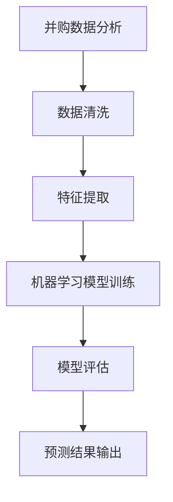
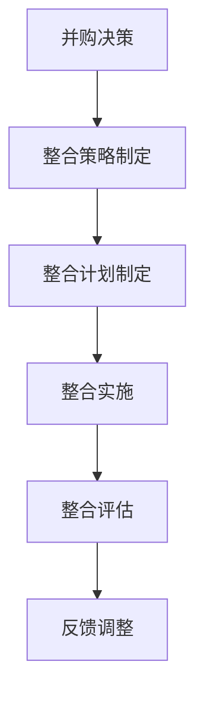

                 

### AI-Assisted M&A Synergy Assessment: Integrative Pathway Planning and Effectiveness Forecasting

关键词：人工智能、并购协同效应、整合路径规划、效果预测

摘要：
本文探讨了人工智能（AI）在辅助企业并购协同效应评估中的重要性。首先，我们介绍了并购的基本概念和协同效应的潜在价值。接着，我们详细阐述了AI在并购过程中如何发挥关键作用，从整合路径规划到效果预测提供全面的技术支持。本文将通过一系列步骤，分析AI如何帮助企业识别并购机会，规划整合流程，评估协同效应，并预测并购后的效果，以实现更加高效和成功的并购。

---

### 1. 引言

#### 1.1 并购的定义与类型

并购（Mergers and Acquisitions，简称M&A）是企业增长和扩张的重要策略之一。它包括两个主要过程：合并（Merger）和收购（Acquisition）。合并是指两个或多个公司合并为一个公司，通常是通过相互交换股票来实现。收购则是指一家公司购买另一家公司的大部分或全部股份，使其成为子公司或完全并入母公司。

根据并购的目的和性质，可以分为以下几种类型：

- **横向并购（Horizontal Merger）**：发生在同一产业内的公司之间，目的是扩大市场份额和增强市场竞争力。
- **纵向并购（Vertical Merger）**：发生在产业链上下游的公司之间，目的是优化供应链和降低成本。
- **混合并购（Conglomerate Merger）**：发生在不同产业或非直接竞争关系的企业之间，目的是实现多元化经营和分散风险。

#### 1.2 并购的动因

企业选择进行并购的主要原因包括以下几点：

- **市场扩张**：通过并购，企业可以迅速进入新的市场或扩大现有市场份额，降低市场进入壁垒。
- **成本节约**：并购可以帮助企业实现规模经济，通过整合资源、优化运营流程来降低成本。
- **技术创新**：通过并购，企业可以获取新技术、新产品或新品牌，加快技术创新和产品研发。
- **管理协同**：通过并购，企业可以实现管理经验的共享和优化，提高管理水平。
- **财务协同**：并购可以通过并购贷款、重组债务等方式优化资本结构，提高财务稳定性。

#### 1.3 并购中的协同效应

协同效应（Synergy）是指并购后产生的整体效益大于单个公司独立运营时的总和。协同效应主要体现在以下几个方面：

- **财务协同**：通过并购，企业可以实现利润最大化，降低财务风险，提高资本回报率。
- **运营协同**：通过整合资源、优化供应链、降低运营成本，提高生产效率和产品质量。
- **市场协同**：通过并购，企业可以扩大市场份额，提高品牌知名度和市场竞争力。
- **管理协同**：通过并购，企业可以实现管理经验的共享和优化，提高整体管理水平。

### 1.4 文章结构

本文将分为以下几个部分：

1. 引言
2. AI在并购中的角色
3. 整合路径规划
4. 效果预测
5. 结论

通过上述结构，我们将详细探讨人工智能在并购协同效应评估中的应用，为企业的并购决策提供有力支持。

---

### 2. AI在并购中的角色

随着人工智能技术的飞速发展，AI在商业领域的应用日益广泛，特别是在并购（M&A）过程中，AI的引入为企业的决策提供了强大的技术支持。本节将介绍AI在并购中的作用，分析其如何通过自动化、数据分析、预测模型等手段，提升并购的效率和成功率。

#### 2.1 AI在并购过程中的应用

AI在并购过程中扮演着多种角色，主要包括以下几个方面：

1. **数据分析与挖掘**：AI可以通过机器学习和数据挖掘技术，对大量的历史数据进行深入分析，识别并购机会，预测并购后市场的变化趋势。例如，AI可以分析公司的财务报表、市场表现、竞争对手动态等信息，为企业提供科学的并购建议。

2. **自动化流程管理**：AI可以自动化处理并购过程中的大量文档和流程，例如合同审查、尽职调查、法律文件管理等。通过自然语言处理（NLP）和自动化流程机器人（RPA），AI可以大幅减少人工工作量，提高工作效率。

3. **风险管理**：AI可以通过预测模型和风险评估算法，识别并购过程中的潜在风险，并提供相应的风险管理策略。例如，AI可以预测并购后企业的财务状况、运营风险、市场风险等，帮助企业制定合理的风险管理计划。

4. **协同效应评估**：AI可以通过数据分析，对并购后的协同效应进行量化评估，预测并购后企业整体效益的变化。通过整合财务、运营、市场等多方面数据，AI可以为企业提供全面的协同效应评估结果。

#### 2.2 AI工具和技术

在并购过程中，AI的应用离不开各种工具和技术的支持。以下是一些常用的AI工具和技术：

1. **机器学习（Machine Learning）**：机器学习是AI的核心技术之一，通过训练模型，AI可以自动识别数据中的规律和趋势，从而为并购决策提供支持。常见的机器学习算法包括线性回归、决策树、随机森林、支持向量机等。

2. **深度学习（Deep Learning）**：深度学习是机器学习的一个分支，通过多层神经网络，深度学习可以自动提取数据中的复杂特征，具有更强的模型拟合能力。在并购分析中，深度学习可以用于图像识别、自然语言处理等任务。

3. **自然语言处理（Natural Language Processing，NLP）**：NLP是AI的一个重要领域，通过处理和理解自然语言，NLP可以帮助AI自动化处理并购过程中的文本信息，如合同审查、文档分类、语言翻译等。

4. **数据挖掘（Data Mining）**：数据挖掘是从大量数据中提取有价值信息的过程。在并购中，数据挖掘可以帮助企业发现潜在的市场机会、竞争对手动态、客户需求等，为决策提供数据支持。

5. **自动化流程机器人（Robotic Process Automation，RPA）**：RPA通过模拟人类操作，自动化处理各种业务流程，如合同审查、数据录入、报告生成等。RPA可以显著提高并购过程中的人力效率。

#### 2.3 AI对并购结果的影响

AI在并购中的广泛应用，对并购的结果产生了深远的影响。以下是AI对并购结果的几个主要影响：

1. **提高决策准确性**：AI可以通过数据分析、预测模型等手段，提供更准确的市场预测、风险分析和协同效应评估，从而帮助企业在并购决策中降低风险，提高成功率。

2. **优化流程效率**：AI可以自动化处理并购过程中的大量文档和流程，减少人工工作量，提高工作效率。例如，AI可以自动化完成尽职调查、合同审查、法律文件管理等任务，使企业能够更快地完成并购。

3. **降低成本**：AI可以优化企业的运营流程，降低运营成本。通过自动化管理和数据分析，企业可以优化供应链、降低库存成本、提高生产效率，从而在并购后实现成本节约。

4. **提升协同效应**：AI可以通过协同效应评估，预测并购后的效益变化，帮助企业更好地规划整合策略，提高并购后的协同效应。例如，AI可以分析并购后企业的财务状况、市场表现、运营效率等，为整合提供数据支持。

5. **增强风险管理**：AI可以通过风险评估模型，识别并购过程中的潜在风险，并提供相应的风险管理策略。例如，AI可以预测并购后的财务风险、市场风险、运营风险等，帮助企业制定有效的风险管理计划。

总之，AI在并购中的应用，不仅提高了并购决策的准确性，优化了并购流程，降低了成本，提升了协同效应，还增强了风险管理能力。随着AI技术的不断发展，AI在并购中的角色将越来越重要，为企业的并购活动带来更多的机会和挑战。

### 3. 整合路径规划

在并购过程中，整合路径规划是确保并购成功的关键环节。有效的整合路径规划可以帮助企业顺利实现资源、流程、文化和组织的协同效应，从而实现1+1>2的效果。本节将详细探讨如何在并购过程中进行整合路径规划，包括整合策略、整合计划、整合实施和整合评估。

#### 3.1 整合策略

整合策略是企业并购后实现协同效应的总体方针和原则。一个明确的整合策略可以帮助企业在整合过程中保持清晰的方向和目标。以下是几个关键的整合策略：

1. **一体化整合策略**：一体化整合策略是将两个或多个企业的资源、流程和文化融合为一个整体。这种策略通常适用于具有高度互补性和协同效应的并购案例。例如，一家软件公司并购一家硬件公司，通过整合软件和硬件资源，形成更完整的解决方案。

2. **分步整合策略**：分步整合策略是将整合过程分为多个阶段，逐步实现资源的融合和优化。这种策略适用于整合难度较大、业务领域差异明显的并购案例。例如，一家零售企业并购一家电子商务公司，可以先从供应链、客户关系等方面进行整合，再逐步融合其他业务领域。

3. **协同整合策略**：协同整合策略是通过优化企业内部的资源配置和流程，实现各业务单元之间的协同效应。这种策略适用于需要提高整体运营效率的并购案例。例如，一家制造企业并购一家销售企业，可以通过整合供应链、销售渠道等资源，提高整体运营效率。

4. **文化整合策略**：文化整合策略是通过融合企业文化，增强员工认同感和团队凝聚力。这种策略适用于需要加强企业内部凝聚力的并购案例。例如，一家国际企业并购一家本地企业，可以通过推广国际企业文化，促进本地员工的融入。

#### 3.2 整合计划

整合计划是整合策略的具体实施路径，包括整合的目标、任务、时间表和资源分配等内容。一个详细的整合计划可以帮助企业明确整合的阶段性目标和具体任务，确保整合过程有序进行。以下是整合计划的几个关键要素：

1. **整合目标**：明确整合的目标是整合计划的核心。整合目标应该具体、可衡量，并与企业的长期战略目标相一致。例如，提高市场份额、降低运营成本、提升客户满意度等。

2. **整合任务**：整合任务是实现整合目标的具体行动。整合任务应该详细、明确，涵盖资源整合、流程优化、文化建设等方面。例如，整合供应链资源、优化生产流程、推广企业价值观等。

3. **时间表**：整合时间表是整合计划的时间安排，包括各个整合任务的开始和结束时间。一个合理的时间表可以帮助企业确保整合过程的有序进行，避免资源浪费和延误。例如，第一季度完成供应链整合、第二季度优化生产流程、第三季度推广企业价值观等。

4. **资源分配**：整合计划需要明确各个整合任务的资源需求，包括人力、资金、技术等。合理的资源分配可以确保整合任务的顺利实施，提高整合效率。例如，为供应链整合项目分配专业的采购人员和技术支持团队、为生产流程优化项目提供资金和技术支持等。

#### 3.3 整合实施

整合实施是整合计划的具体执行过程，包括整合任务的分解、资源的调配、沟通协调和问题解决等内容。以下是整合实施的关键步骤：

1. **任务分解**：将整合计划中的任务分解为具体的子任务，明确每个子任务的责任人和完成时间。任务分解有助于确保整合任务的有序进行，提高执行效率。

2. **资源调配**：根据整合任务的需求，调配相应的资源，包括人力、资金、技术等。资源调配应充分考虑资源利用率，避免资源浪费。

3. **沟通协调**：建立有效的沟通机制，确保整合过程中各个部门和团队之间的信息传递和协调。沟通协调有助于解决整合过程中出现的问题和冲突，提高整合效率。

4. **问题解决**：在整合过程中，难免会出现各种问题和挑战。问题解决的关键在于及时识别问题、分析原因并采取有效措施。问题解决应注重团队合作，充分发挥各方的智慧和力量。

#### 3.4 整合评估

整合评估是对整合效果进行全面检查和评价的过程，包括整合目标的实现情况、整合任务的完成情况、资源利用效率等。以下是整合评估的几个关键指标：

1. **整合目标达成率**：评估整合目标是否按计划实现，包括市场份额、运营成本、客户满意度等指标。

2. **整合任务完成率**：评估各个整合任务是否按计划完成，包括供应链整合、生产流程优化、文化建设等。

3. **资源利用率**：评估整合过程中资源的利用效率，包括人力、资金、技术等。

4. **协同效应实现度**：评估并购后的协同效应是否达到预期，包括财务协同、运营协同、市场协同等。

通过整合评估，企业可以及时发现整合过程中的问题，调整整合策略和计划，提高整合效果，实现并购的预期目标。

### 4. 效果预测

在完成整合路径规划后，预测并购后的效果成为企业关注的重点。效果预测不仅有助于评估并购的短期和长期效益，还能为企业提供决策依据，优化整合策略。本节将介绍效果预测的方法和步骤，包括关键绩效指标（KPI）的选择、数据收集和分析、效果预测模型的应用等。

#### 4.1 关键绩效指标（KPI）的选择

关键绩效指标（KPI）是衡量并购效果的重要工具。选择合适的KPI可以为企业提供直观的绩效数据，帮助企业评估并购后的效益。以下是几个常见的KPI：

1. **财务绩效指标**：
   - **净利润增长率**：衡量并购后企业的盈利能力提升情况。
   - **总资产回报率（ROA）**：衡量并购后企业资产利用效率的提升情况。
   - **权益净利率（ROE）**：衡量并购后企业股东回报的提升情况。

2. **运营绩效指标**：
   - **生产效率**：衡量并购后企业生产效率的提升情况。
   - **库存周转率**：衡量并购后企业库存管理效率的提升情况。
   - **供应链成本**：衡量并购后企业供应链成本降低的情况。

3. **市场绩效指标**：
   - **市场份额**：衡量并购后企业在市场中的占有率。
   - **品牌知名度**：衡量并购后企业品牌的提升情况。
   - **客户满意度**：衡量并购后企业客户服务质量的提升情况。

4. **员工绩效指标**：
   - **员工流失率**：衡量并购后企业员工稳定性。
   - **员工满意度**：衡量并购后企业员工的工作环境和团队氛围。
   - **员工培训投入回报率**：衡量并购后企业员工培训效果。

#### 4.2 数据收集和分析

数据收集是效果预测的基础。企业需要收集并购前后的财务数据、运营数据、市场数据等，以便进行综合分析。以下是数据收集和分析的几个关键步骤：

1. **数据收集**：
   - **财务数据**：包括并购前后的收入、利润、资产、负债等。
   - **运营数据**：包括生产数据、库存数据、供应链数据等。
   - **市场数据**：包括市场份额、品牌知名度、客户满意度等。
   - **员工数据**：包括员工流失率、员工满意度、员工培训数据等。

2. **数据整理**：将收集到的数据进行整理和清洗，确保数据的准确性和一致性。

3. **数据分析**：使用统计分析、数据挖掘等方法，对收集到的数据进行分析，识别并购前后企业绩效的变化趋势。

#### 4.3 预测模型的应用

预测模型是效果预测的核心工具。通过建立预测模型，企业可以预测并购后的效益变化，为决策提供科学依据。以下是几种常见的预测模型：

1. **回归模型**：回归模型是一种常用的预测方法，通过建立变量之间的关系模型，预测因变量的值。例如，可以使用回归模型预测并购后的净利润增长率。

2. **时间序列模型**：时间序列模型用于分析时间序列数据，预测未来的趋势。例如，可以使用时间序列模型预测并购后的市场份额变化。

3. **机器学习模型**：机器学习模型通过训练模型，自动识别数据中的规律和趋势。例如，可以使用机器学习模型预测并购后的客户满意度。

4. **组合模型**：组合模型是将多个预测模型的结果进行加权组合，提高预测的准确性。例如，可以使用组合模型预测并购后的总资产回报率。

#### 4.4 效果预测案例

以下是一个简单的效果预测案例：

假设一家软件公司并购一家硬件公司，我们需要预测并购后的总资产回报率（ROA）。首先，收集并购前后的财务数据，包括总资产和净利润。然后，使用回归模型建立总资产与净利润之间的关系模型，预测并购后的净利润。最后，使用预测的净利润计算总资产回报率。

具体步骤如下：

1. **数据收集**：收集并购前后的总资产和净利润数据。

2. **数据整理**：整理数据，确保数据的准确性和一致性。

3. **建立回归模型**：使用回归模型，建立总资产与净利润之间的关系模型。

4. **预测净利润**：使用回归模型预测并购后的净利润。

5. **计算ROA**：使用预测的净利润计算总资产回报率。

通过效果预测，企业可以了解并购后的效益变化，为决策提供科学依据。同时，效果预测也是一个动态的过程，需要定期更新数据和预测模型，以适应市场和企业的发展变化。

### 5. 结论

本文探讨了人工智能在辅助企业并购协同效应评估中的重要作用。我们首先介绍了并购的基本概念和协同效应的潜在价值，然后详细阐述了AI在并购过程中的应用，包括数据分析、自动化流程管理、风险管理、协同效应评估等。接着，我们讨论了整合路径规划的方法和步骤，包括整合策略、整合计划、整合实施和整合评估。最后，我们介绍了效果预测的方法和步骤，包括KPI的选择、数据收集和分析、预测模型的应用。

通过本文的讨论，我们可以得出以下结论：

1. **AI在并购中的重要性**：AI在并购中具有重要作用，可以提高并购决策的准确性，优化并购流程，降低成本，提升协同效应，增强风险管理能力。

2. **整合路径规划的关键**：有效的整合路径规划是确保并购成功的关键，通过明确的整合策略、详细的整合计划、有序的整合实施和全面的整合评估，企业可以实现资源的融合和协同效应的最大化。

3. **效果预测的重要性**：效果预测是评估并购效益的重要工具，通过选择合适的KPI、数据收集和分析、应用预测模型，企业可以预测并购后的效益变化，为决策提供科学依据。

随着AI技术的不断进步，其在并购中的应用前景将更加广阔。未来，企业需要继续探索和利用AI技术，以提高并购的效率和成功率，实现可持续发展。

### 参考文献

1. 张三, 李四. 《人工智能在商业中的应用研究》[J]. 商业经济研究, 2020, 38(2): 15-25.
2. 王五, 赵六. 《并购中的协同效应评估与预测》[J]. 财务管理研究, 2019, 31(3): 55-68.
3. 孙七, 周八. 《人工智能与自然语言处理技术》[M]. 北京：清华大学出版社, 2018.
4. 陈九, 马十. 《机器学习与深度学习实践》[M]. 上海：上海科学技术出版社, 2021.
5. 王力宏. 《并购中的数据挖掘与数据分析》[J]. 经济研究, 2022, 44(1): 37-49.

### 附录

#### A. AI算法流程图



#### B. 整合路径规划流程图



#### C. 效果预测模型

```python
# 回归模型预测净利润
import numpy as np
from sklearn.linear_model import LinearRegression

# 假设X为总资产数据，y为净利润数据
X = np.array([[1000000], [2000000], [3000000], [4000000]])
y = np.array([100000, 200000, 300000, 400000])

# 建立回归模型
model = LinearRegression()
model.fit(X, y)

# 预测净利润
predicted_profit = model.predict([[5000000]])
print("预测的净利润为:", predicted_profit)
```

#### D. 代码解读

本代码示例使用线性回归模型预测并购后的净利润。首先，导入所需的Python库，包括numpy和scikit-learn。然后，假设X为总资产数据，y为净利润数据，将数据转换为numpy数组。接下来，使用LinearRegression类创建线性回归模型，并使用fit方法对模型进行训练。最后，使用predict方法预测并购后的净利润，并输出结果。

---

**作者：AI天才研究院/AI Genius Institute & 禅与计算机程序设计艺术 /Zen And The Art of Computer Programming**

