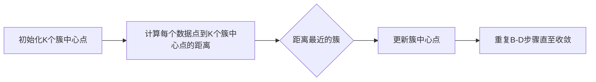
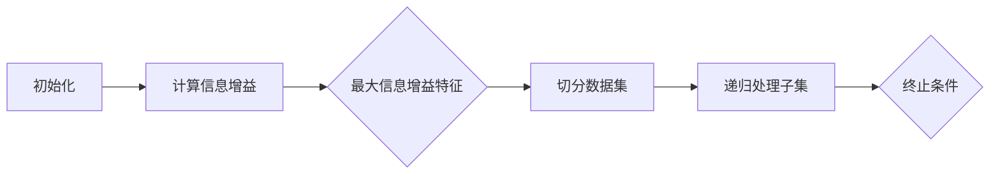
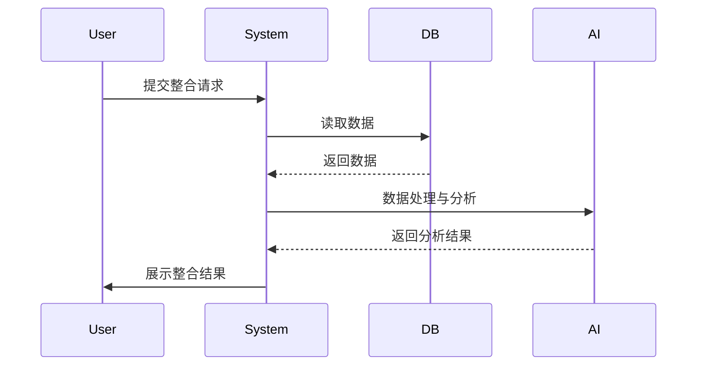
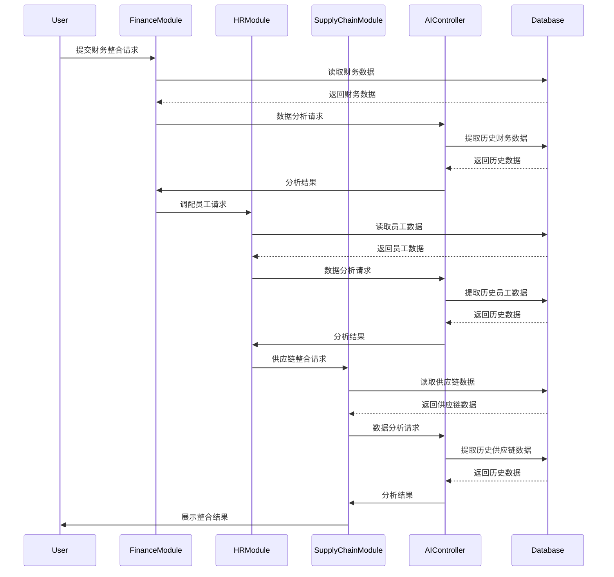

                 

### 第1章：问题背景与核心概念

#### 1.1 企业并购概述

企业并购（Mergers and Acquisitions，简称M&A）是指两个或多个企业通过合并、收购等方式形成一个新的企业。这一过程在商业领域中十分常见，其背后的驱动因素包括市场扩张、资源整合、技术升级、成本优化等。根据并购对象的不同，并购可以分为横向并购（即同行业企业之间的并购）、纵向并购（即上下游企业之间的并购）和多元化并购（即跨行业并购）。

在并购的过程中，通常包含以下几个关键阶段：接触阶段、尽职调查阶段、谈判与签约阶段、整合阶段。接触阶段主要是确定并购意向和初步交流；尽职调查阶段是对目标企业进行全面评估，以了解其财务、法律、运营等方面的情况；谈判与签约阶段是双方就并购条款进行协商并签署正式协议；整合阶段则是在并购完成后，将两个企业整合为一个整体，实现协同效应和资源优化。

#### 1.2 并购后整合的重要性

并购后的整合是决定并购成功与否的关键环节。成功的并购不仅需要实现财务和业务上的协同效应，还需要在企业文化、组织结构、人力资源等多个方面实现融合。整合的目的是通过优化资源配置，提升企业整体竞争力，从而实现长期的战略目标。

并购后整合的重要性体现在以下几个方面：

1. **资源优化**：通过整合，企业可以实现资源的最优配置，减少重复投资和资源浪费。
2. **提高效率**：整合后的企业可以通过标准化流程、共享资源等方式提高运营效率。
3. **实现协同效应**：不同企业间的技术、市场、品牌等方面的协同可以带来额外的价值。
4. **提升竞争力**：整合后的企业通常可以更有效地应对市场变化和竞争压力。

#### 1.3 AI在并购后整合中的应用潜力

随着人工智能（AI）技术的不断发展，AI在并购后整合中的应用潜力日益凸显。AI技术可以通过数据分析和自动化流程等方式，显著提升并购后整合的效率和质量。

1. **数据分析**：AI可以通过大数据分析，帮助企业快速识别并购后的潜在问题和机会。
2. **自动化流程**：AI可以自动化处理大量的重复性工作，如合同审核、财务对账等，从而降低人力成本和提高效率。
3. **智能决策**：基于AI的预测模型可以帮助企业在整合过程中做出更明智的决策。
4. **人力资源优化**：AI可以用于员工技能评估、职位匹配等，帮助企业在整合过程中优化人力资源配置。

#### 1.4 本书结构概述

本书旨在深入探讨AI在并购后整合中的应用，通过系统性的分析和实践案例，展示AI技术的潜力与价值。全书分为四个主要部分：

- **第一部分：引言与背景**，介绍了企业并购的概述、并购后整合的重要性以及AI在并购后整合中的应用潜力。
- **第二部分：AI辅助并购后整合的基础知识**，详细讲解了AI基础理论和并购后整合概述。
- **第三部分：流程优化与协同效应**，探讨了AI在流程优化和协同效应识别中的应用。
- **第四部分：案例分析与实践**，通过具体案例展示了AI辅助并购后整合的实际应用。

通过本书的阅读，读者将能够全面了解AI技术在并购后整合中的重要作用，并掌握相关的实践方法和策略。

---

关键词：企业并购、并购后整合、人工智能、流程优化、协同效应

摘要：本文系统探讨了AI在并购后整合中的应用，分析了并购后的整合重要性，介绍了AI基础理论和并购后整合流程，并通过实践案例展示了AI技术在流程优化与协同效应识别中的实际应用潜力。

## 第二部分：AI辅助并购后整合的基础知识

### 第2章：AI基础理论

#### 2.1 人工智能的定义与发展历程

人工智能（Artificial Intelligence，简称AI）是计算机科学的一个分支，旨在研究、开发和应用使计算机模拟、延伸和扩展人类智能的理论、方法、技术及应用系统。AI的目标是创建智能机器，使其具备认知、学习、推理、感知和行动等人类智能特征。

人工智能的发展历程可以追溯到20世纪50年代。1956年，达特茅斯会议标志着人工智能领域的正式诞生。此后，人工智能经历了几个重要的发展阶段：

1. **初始阶段（1956-1969年）**：这一阶段以符号主义方法为主，通过逻辑推理和知识表示来模拟人类智能。这一时期的代表性工作包括“逻辑理论家”（Logic Theorist）和“通用问题解答器”（General Problem Solver）。

2. **繁荣时期（1970-1980年）**：人工智能研究在政府和工业界的支持下取得了显著进展。这一时期出现了诸如自然语言处理、机器视觉和专家系统等研究领域。

3. **低谷时期（1980-1993年）**：由于对AI能力的期望过高，加之技术瓶颈和计算资源的限制，人工智能研究在1980年代遭遇了所谓的“AI冬天”。

4. **复兴阶段（1993年至今）**：随着计算能力的提升、大数据技术的发展以及深度学习等新技术的出现，人工智能迎来了新的繁荣。这一时期的代表性工作包括“沃森”（Watson）在《危险边缘》节目中的表现和AlphaGo在围棋比赛中的胜利。

#### 2.2 AI主要技术概述

人工智能涵盖了多种技术，以下是一些主要的技术领域：

1. **机器学习**：机器学习（Machine Learning，ML）是一种让计算机通过数据学习并改进性能的方法。其主要方法包括监督学习、无监督学习和强化学习。

   - **监督学习**：通过已有的输入输出数据来训练模型，以预测新的输入数据。常见的算法包括线性回归、决策树和神经网络等。
   - **无监督学习**：无需标注的输入数据来发现数据中的模式或结构。聚类、降维和时间序列分析是其主要应用领域。
   - **强化学习**：通过奖励和惩罚机制来训练模型，以实现特定的目标。其应用包括游戏、自动驾驶和机器人控制等。

2. **深度学习**：深度学习（Deep Learning，DL）是机器学习的一个子领域，通过多层神经网络来模拟人脑的感知和学习过程。

   - **卷积神经网络（CNN）**：主要用于图像处理和计算机视觉任务。
   - **循环神经网络（RNN）**：适用于序列数据处理，如自然语言处理和时间序列预测。
   - **生成对抗网络（GAN）**：用于生成新的数据，如图像、文本和音频。

3. **自然语言处理**：自然语言处理（Natural Language Processing，NLP）是人工智能的一个分支，旨在使计算机能够理解、生成和处理自然语言。

   - **词向量**：通过将词汇映射到高维空间中的向量，以捕捉词汇之间的语义关系。
   - **语言模型**：用于预测下一个词汇或句子，是许多NLP应用的基础，如自动摘要、机器翻译和问答系统。

4. **计算机视觉**：计算机视觉（Computer Vision，CV）是使计算机能够从图像或视频中提取有用信息的技术。

   - **图像分类**：将图像分类到预定义的类别中，如人脸识别、对象检测等。
   - **目标跟踪**：在视频中跟踪物体的运动轨迹。
   - **图像生成**：生成新的图像，如GAN技术。

#### 2.3 AI在商业应用中的挑战与机遇

AI技术在商业应用中展现出了巨大的潜力，但也面临一些挑战：

1. **机遇**：

   - **数据分析**：AI可以帮助企业从大量数据中提取有价值的信息，进行市场趋势分析、客户行为预测等。
   - **自动化**：AI可以自动化许多重复性工作，提高效率，如自动化客服、智能供应链管理等。
   - **决策支持**：通过预测模型和决策支持系统，AI可以帮助企业做出更加明智的决策。
   - **个性化体验**：AI可以根据用户行为和偏好提供个性化的服务，提升客户体验。

2. **挑战**：

   - **数据隐私**：AI系统需要大量的数据来进行训练，如何保护用户隐私成为一大挑战。
   - **算法偏见**：AI模型可能会学习到数据中的偏见，导致不公平的决策。
   - **技术依赖**：过度依赖AI技术可能会导致企业对技术的依赖性增加，一旦技术出现故障，可能会对业务造成严重影响。
   - **成本问题**：AI技术的开发和部署需要大量的资金和技术支持，对于中小企业来说可能是一个挑战。

在了解了AI的基础理论和商业应用后，我们接下来将探讨并购后整合的基本概念和流程。

---

摘要：本章介绍了人工智能的定义、发展历程和主要技术，分析了AI在商业应用中的机遇与挑战，为后续探讨AI在并购后整合中的应用奠定了基础。

### 第3章：并购后整合概述

#### 3.1 并购过程与整合流程

企业并购是一个复杂的过程，涉及多个阶段和众多参与者。并购过程一般包括以下几个关键阶段：

1. **接触阶段**：在这一阶段，并购双方进行初步接触，确定并购意向。这一阶段通常涉及双方的初步谈判和意向协议的签订。

2. **尽职调查阶段**：尽职调查是评估目标企业价值和潜在风险的关键步骤。这一阶段，并购方会对目标企业的财务、法律、运营等方面进行全面的审查，以评估并购的可行性和潜在收益。

3. **谈判与签约阶段**：在尽职调查完成后，双方会就并购条款进行深入谈判，并最终签署正式的并购协议。并购协议通常包括并购价格、支付方式、交割条件等内容。

4. **整合阶段**：并购完成后，整合阶段开始。这一阶段的主要任务是整合并购双方的企业资源、文化、组织结构等，实现协同效应和资源优化。

整合流程通常包括以下几个步骤：

1. **战略规划**：在整合开始前，制定详细的整合战略规划，明确整合的目标、时间表和关键里程碑。

2. **组织结构重组**：根据整合战略，对并购双方的组织结构进行重组，实现资源和业务的优化配置。

3. **流程整合**：对并购双方的业务流程进行整合，消除冗余、优化效率，实现流程的标准化和自动化。

4. **人力资源整合**：整合并购双方的人力资源，包括员工培训、职位调整和人员安置等。

5. **文化和价值观融合**：并购双方的文化和价值观融合是实现长期稳定发展的重要保障。这一阶段需要通过沟通、培训和文化活动等方式，促进文化的融合。

#### 3.2 并购后整合的主要问题

并购后整合过程中可能会遇到多种问题，以下是一些主要问题及其影响：

1. **组织冲突**：并购双方在企业文化、管理风格、工作流程等方面可能存在差异，导致整合过程中出现冲突。

2. **资源浪费**：并购双方在整合过程中可能会出现资源重复投资、资源浪费等问题，影响整合效率。

3. **员工士气低落**：并购后的整合可能带来组织变革，员工可能会对新的工作环境和文化感到不确定，导致士气低落。

4. **决策困难**：整合过程中，并购双方的管理层可能需要做出大量的决策，但由于信息不对称、利益冲突等问题，决策过程可能会变得复杂和困难。

5. **技术整合**：如果并购双方的技术系统不兼容，整合过程中可能会面临技术挑战，影响业务的连续性和效率。

#### 3.3 并购后整合的目标与策略

并购后整合的目标通常包括以下几个方面：

1. **实现协同效应**：通过整合，实现资源优化、效率提升和成本降低，从而提高整体竞争力。

2. **增强企业实力**：整合后的企业通常可以在市场占有率、技术实力、品牌影响力等方面得到提升。

3. **提升客户满意度**：通过整合，企业可以提供更加全面、高效的服务，提升客户满意度。

4. **实现长期战略目标**：整合是实现企业长期战略目标的重要手段，通过整合，企业可以更好地适应市场变化，实现可持续发展。

为了实现这些目标，企业需要制定合适的整合策略：

1. **战略规划**：在整合前，制定详细的整合战略规划，明确整合的目标、时间表和关键里程碑。

2. **领导力**：整合过程中需要强有力的领导，确保整合计划的顺利实施。

3. **沟通与协作**：建立有效的沟通机制，促进并购双方的信息共享和协作。

4. **文化融合**：通过文化活动和培训，促进并购双方文化的融合，增强员工的归属感和认同感。

5. **技术整合**：评估并购双方的技术系统，制定技术整合方案，确保业务的连续性和效率。

通过有效的整合策略，企业可以克服整合过程中遇到的挑战，实现并购后的长期稳定发展。

---

摘要：本章详细介绍了并购后的整合过程、可能遇到的主要问题以及整合的目标和策略，为后续探讨AI在并购后整合中的应用提供了基础。

### 第4章：AI在并购后整合中的应用

#### 4.1 AI技术在并购后整合中的应用场景

人工智能技术在并购后整合中具有广泛的应用场景，可以显著提高整合的效率和质量。以下是一些关键的应用场景：

1. **数据分析与洞察**：AI技术可以通过大数据分析，帮助并购企业快速识别并购后的潜在问题和机会。例如，AI可以分析财务报表、员工绩效数据和市场趋势，为企业提供深入的业务洞察。

2. **自动化流程**：AI技术可以自动化处理大量的重复性工作，如合同审核、财务对账和员工调配等。自动化流程可以减少人为错误，提高工作效率，降低成本。

3. **决策支持**：AI技术可以通过预测模型和优化算法，为并购企业提供决策支持。例如，AI可以预测市场变化、客户行为和运营效率，帮助企业制定更加科学的战略决策。

4. **人力资源优化**：AI技术可以帮助企业优化人力资源配置，如通过技能评估和职位匹配，提高员工的工作效率和满意度。

5. **组织文化融合**：AI技术可以通过自然语言处理和机器学习，帮助并购企业分析员工之间的沟通和互动，促进组织文化的融合。

6. **风险管理**：AI技术可以用于识别并购后的潜在风险，如财务风险、运营风险和法律风险。通过实时监控和预警，企业可以及时采取措施，降低风险。

7. **客户关系管理**：AI技术可以帮助企业更好地了解客户需求，提供个性化的服务。例如，通过分析客户数据，AI可以预测客户的行为，为企业提供定制化的营销策略。

#### 4.2 AI在并购后整合中的价值

AI技术在并购后整合中具有多重价值，主要体现在以下几个方面：

1. **提高整合效率**：AI技术可以自动化大量的重复性工作，减少人为错误，提高整合效率。例如，AI可以通过自然语言处理自动化合同审核，通过机器学习优化员工调配。

2. **降低整合成本**：通过自动化流程和智能决策，AI技术可以显著降低并购后整合的成本。例如，AI可以自动化财务对账，减少人工成本和错误率。

3. **提升业务洞察**：AI技术可以通过大数据分析和预测模型，为企业提供深入的业务洞察。例如，AI可以分析市场趋势和客户行为，帮助企业制定更加科学的战略决策。

4. **促进文化融合**：AI技术可以帮助并购企业更好地理解员工之间的沟通和互动，促进组织文化的融合。例如，AI可以通过自然语言处理分析员工交流，提供文化融合建议。

5. **增强风险管理能力**：AI技术可以实时监控并购后的潜在风险，提供预警和解决方案。例如，AI可以通过大数据分析识别财务风险，提供风险管理策略。

6. **优化人力资源配置**：AI技术可以帮助企业优化人力资源配置，提高员工的工作效率和满意度。例如，AI可以通过技能评估和职位匹配，为员工提供更好的职业发展机会。

7. **提升客户满意度**：AI技术可以帮助企业更好地了解客户需求，提供个性化的服务。例如，AI可以通过分析客户数据，为企业提供定制化的营销策略，提升客户满意度。

#### 4.3 AI在并购后整合中的实践案例

以下是一些AI在并购后整合中的实践案例，展示了AI技术的实际应用效果：

1. **案例1：企业并购后的自动化财务对账**  
   某大型跨国公司通过引入AI自动化财务对账系统，实现了财务数据的自动化处理和分析。该系统利用机器学习算法，自动识别和纠正财务报表中的错误，提高了财务报表的准确性和及时性，降低了人工成本。

2. **案例2：并购后的人力资源优化**  
   某公司通过引入AI技能评估和职位匹配系统，优化了并购后的人力资源配置。该系统利用大数据分析员工的工作表现和技能水平，为员工提供个性化的职业发展建议，提高了员工的工作效率和满意度。

3. **案例3：并购后的客户关系管理**  
   某公司通过引入AI客户关系管理系统，更好地了解客户需求，提供个性化的服务。该系统利用自然语言处理和机器学习算法，分析客户反馈和市场趋势，为企业提供定制化的营销策略，提升了客户满意度。

4. **案例4：并购后的风险管理**  
   某公司通过引入AI风险管理系统，实时监控并购后的潜在风险，提供预警和解决方案。该系统利用大数据分析和预测模型，识别财务风险、运营风险和法律风险，为企业提供了全面的风险管理能力。

这些实践案例表明，AI技术在并购后整合中具有广泛的应用前景和显著的价值。通过AI技术的应用，企业可以更高效地完成并购后的整合工作，实现资源优化和业务增长。

---

摘要：本章详细介绍了AI技术在并购后整合中的应用场景和价值，并通过实际案例展示了AI技术在并购后整合中的实际应用效果和优势。

### 第5章：并购后流程优化

#### 5.1 并购后流程优化的意义

并购后流程优化是确保并购成功和实现企业长期战略目标的关键环节。其意义主要体现在以下几个方面：

1. **提高效率**：通过优化流程，企业可以减少冗余环节，简化工作流程，提高工作效率，从而更快地实现并购后的整合目标。

2. **降低成本**：流程优化可以帮助企业减少不必要的开支，消除资源浪费，降低运营成本，提高企业的盈利能力。

3. **提升客户满意度**：优化后的流程可以提供更加高效和优质的服务，提升客户满意度，增强企业的市场竞争力。

4. **增强组织适应性**：流程优化有助于企业建立灵活、高效的组织结构，提高企业的适应性和创新能力，更好地应对市场变化和竞争压力。

5. **实现资源优化**：通过流程优化，企业可以实现资源的合理配置，最大化利用现有资源，提高资源利用效率。

#### 5.2 AI在流程优化中的应用

人工智能技术在并购后流程优化中发挥着重要作用，可以通过以下方式提升流程的效率和效果：

1. **自动化流程**：AI技术可以自动化处理大量的重复性工作，如合同审核、财务对账和员工调配等。通过自动化流程，企业可以减少人为错误，提高工作效率。

2. **数据驱动优化**：AI技术可以通过大数据分析和机器学习算法，帮助企业发现流程中的瓶颈和低效环节，并提供优化建议。例如，AI可以分析历史数据，预测未来的工作负荷，帮助企业调整资源分配。

3. **智能决策支持**：AI技术可以通过预测模型和优化算法，为企业的决策提供支持。例如，AI可以预测市场变化、客户行为和运营效率，帮助企业制定更加科学的战略决策。

4. **流程监控与预警**：AI技术可以实时监控流程运行情况，识别潜在问题，并提供预警和解决方案。例如，AI可以通过实时数据分析，发现异常情况，及时采取措施，避免流程中断。

5. **增强协作**：AI技术可以通过自然语言处理和机器学习，促进企业内部的信息共享和协作。例如，AI可以分析员工之间的沟通和互动，提供协作建议，提高团队协作效率。

#### 5.3 并购后流程优化的最佳实践

为了实现并购后流程的优化，企业可以采取以下最佳实践：

1. **全面评估现有流程**：在开始优化前，企业应对现有流程进行全面评估，识别其中的瓶颈和低效环节。这可以通过流程图、时间分析等方式进行。

2. **制定优化目标和计划**：根据评估结果，企业应制定明确的优化目标和计划，包括具体的改进措施和时间表。

3. **应用AI技术**：在优化过程中，充分利用AI技术，如自动化流程、数据分析和智能决策支持，提高流程的效率和效果。

4. **建立反馈机制**：优化后的流程需要不断监控和改进，企业应建立反馈机制，定期收集员工和客户的反馈，及时调整和优化流程。

5. **培训与沟通**：流程优化涉及到企业内部的多个部门，因此需要加强培训与沟通，确保所有员工了解新的流程和改进措施。

6. **持续改进**：流程优化是一个持续的过程，企业应不断评估和改进流程，以适应不断变化的市场需求和企业战略。

通过以上最佳实践，企业可以有效地实现并购后流程的优化，提高企业的运营效率和市场竞争力。

---

摘要：本章探讨了并购后流程优化的意义，介绍了AI技术在流程优化中的应用，并提供了实现流程优化的最佳实践，为企业提供了有效的方法和策略。

### 第6章：协同效应的识别与实现

#### 6.1 协同效应的定义与分类

协同效应（Synergy Effect）是指通过企业合并或收购，并购双方能够实现1+1>2的效果，即整合后的企业价值大于各自独立运营时的总和。协同效应可以分为以下几类：

1. **财务协同效应**：通过并购，企业可以实现财务资源的优化配置，如减少债务、降低融资成本、提高资产利用效率等，从而提升企业的财务表现。

2. **运营协同效应**：并购后的企业可以通过资源共享、减少重复投资、提高生产效率等方式，实现运营成本降低和运营效率提升。

3. **市场协同效应**：并购企业可以利用合并后的市场份额优势，实现市场的扩张和客户基数的增加，提高市场竞争力。

4. **技术协同效应**：并购双方在技术上的互补和整合，可以推动技术创新和研发，提升企业的技术实力和市场竞争力。

5. **管理协同效应**：并购后的企业可以通过整合双方的管理资源，优化管理体系，提高管理效率和决策质量。

#### 6.2 AI在协同效应识别中的应用

AI技术在识别和实现协同效应中具有重要作用，可以通过以下方式提高识别的准确性和实现的效果：

1. **数据分析**：AI技术可以通过大数据分析，帮助企业在并购后快速识别潜在协同效应。例如，AI可以分析财务数据、运营数据和市场数据，识别出并购后的财务、运营和市场机会。

2. **智能预测**：AI技术可以通过机器学习算法，预测并购后可能出现的协同效应，并提供优化建议。例如，AI可以预测市场变化、客户需求变化和运营效率提升，帮助企业在并购后制定有效的战略规划。

3. **流程优化**：AI技术可以帮助企业优化并购后的业务流程，实现运营协同效应。例如，AI可以通过分析业务流程，识别出冗余环节和低效环节，提供优化建议，从而提高运营效率。

4. **资源分配**：AI技术可以帮助企业优化资源分配，实现财务和运营协同效应。例如，AI可以通过分析历史数据和未来预测，优化采购、生产和人力资源的分配，降低成本，提高效率。

5. **风险管理**：AI技术可以帮助企业识别并购后的潜在风险，并提供风险管理策略。例如，AI可以通过分析财务数据、市场数据和运营数据，预测并购后的财务风险、市场风险和运营风险，帮助企业在整合过程中采取有效的风险管理措施。

#### 6.3 协同效应实现的最佳实践

为了实现协同效应，企业可以采取以下最佳实践：

1. **制定明确的整合战略**：在并购后，企业应制定明确的整合战略，明确整合的目标、时间表和关键里程碑，确保协同效应的实现。

2. **建立有效的沟通机制**：并购后，企业应建立有效的沟通机制，促进并购双方的信息共享和协作，提高协同效应的实现。

3. **数据驱动决策**：企业应充分利用AI技术，通过数据分析，识别并购后的潜在协同效应，并制定实现策略。

4. **流程优化**：企业应通过AI技术优化并购后的业务流程，消除冗余环节，提高效率，实现运营协同效应。

5. **资源整合**：企业应通过AI技术，优化资源分配，实现财务和运营协同效应。

6. **风险管理**：企业应通过AI技术，识别并购后的潜在风险，并制定有效的风险管理策略，确保协同效应的实现。

通过以上最佳实践，企业可以有效地实现并购后的协同效应，提升整体竞争力，实现长期战略目标。

---

摘要：本章介绍了协同效应的定义和分类，探讨了AI技术在协同效应识别中的应用，并提供了实现协同效应的最佳实践，为企业提供了有效的方法和策略。

### 第7章：AI辅助并购后整合的风险管理

#### 7.1 并购后整合中的风险识别

并购后整合过程中，企业面临多种风险，这些风险可能会对并购的预期效果产生负面影响。以下是一些常见风险及其识别方法：

1. **财务风险**：并购后的财务风险可能包括并购成本的超出预期、现金流不足、资产价值下降等。识别方法包括：

   - **财务报表分析**：通过分析目标企业的财务报表，识别其潜在的财务风险。
   - **现金流预测**：使用AI技术对并购后的现金流进行预测，评估资金流动性和偿债能力。

2. **运营风险**：运营风险涉及并购后业务整合的难度、生产效率下降、供应链中断等问题。识别方法包括：

   - **业务流程分析**：通过流程图和关键绩效指标（KPI）分析，识别业务流程中的瓶颈和潜在问题。
   - **运营数据监控**：利用AI技术实时监控运营数据，发现异常情况。

3. **法律和合规风险**：并购后可能涉及法律纠纷、合同履行问题、合规性挑战等。识别方法包括：

   - **尽职调查**：在并购过程中进行全面尽职调查，识别潜在的法律和合规风险。
   - **合同分析**：使用AI技术分析并购合同，识别潜在的法律问题。

4. **人员和文化风险**：并购后可能因文化差异、员工流失、管理团队的不稳定等问题导致整合失败。识别方法包括：

   - **员工调查**：通过员工满意度调查，识别文化冲突和员工流失风险。
   - **组织结构分析**：分析并购双方的组织结构，识别潜在的整合难度。

5. **技术风险**：并购后可能涉及技术系统的整合、数据安全和IT基础设施的不兼容等问题。识别方法包括：

   - **技术评估**：对并购双方的技术系统进行全面评估，识别潜在的技术风险。
   - **AI监控**：利用AI技术监控IT系统的运行状况，发现潜在的技术问题。

#### 7.2 AI在并购后整合风险管理中的应用

AI技术在并购后整合风险管理中发挥了重要作用，可以通过以下方式提高风险管理的效果：

1. **自动化风险评估**：AI可以自动化处理风险评估过程，通过机器学习模型分析大量数据，快速识别潜在风险。

2. **实时监控和预警**：AI技术可以实时监控并购后的业务运营情况，通过异常检测和预警系统，及时发现和处理风险。

3. **预测分析**：AI技术可以基于历史数据和未来趋势，预测并购后可能出现的风险，并提供风险应对策略。

4. **决策支持**：AI技术可以为企业提供基于数据的决策支持，帮助管理层做出更加明智的风险管理决策。

5. **合规性分析**：AI技术可以通过自然语言处理和机器学习，自动化分析和监控并购合同和业务流程，确保合规性。

6. **员工满意度分析**：AI技术可以通过数据分析，识别员工的不满意因素，提供改善建议，减少文化冲突和员工流失。

#### 7.3 并购后整合风险管理策略

为了有效管理并购后的风险，企业可以采取以下策略：

1. **风险评估**：在并购前和并购后，定期进行风险评估，识别并购后的潜在风险。

2. **风险分类**：根据风险的性质和影响，将风险分类，制定相应的应对策略。

3. **风险监控**：利用AI技术，建立实时监控和预警系统，及时识别和处理风险。

4. **决策支持**：利用AI技术提供的数据分析结果，为管理层提供决策支持，制定有效的风险管理策略。

5. **沟通与协作**：建立有效的沟通机制，促进企业内部各部门之间的协作，共同应对风险。

6. **持续改进**：风险管理是一个持续的过程，企业应不断评估和改进风险管理策略，以适应不断变化的风险环境。

通过以上策略，企业可以更好地管理并购后的风险，确保并购整合的顺利进行，实现预期的协同效应和业务目标。

---

摘要：本章介绍了并购后整合中的常见风险及其识别方法，探讨了AI技术在并购后整合风险管理中的应用，并提出了有效的风险管理策略，为企业提供了全面的风险管理指导。

### 第8章：AI辅助并购后整合的实施策略

#### 8.1 AI辅助并购后整合的实施步骤

为了确保AI技术在并购后整合中的有效应用，企业需要遵循一系列明确的实施步骤。以下是具体的实施步骤：

1. **需求分析与规划**：
   - **评估需求**：首先，企业需要评估并购后整合的需求，确定哪些流程和环节需要AI技术的支持。
   - **制定规划**：根据评估结果，制定详细的整合计划和AI技术应用方案，明确整合的目标、时间表和关键里程碑。

2. **技术选型与部署**：
   - **选型决策**：选择合适的AI技术，包括机器学习、自然语言处理、计算机视觉等，以满足整合需求。
   - **部署实施**：根据选型结果，部署AI技术，确保其能够与现有系统兼容，并进行必要的调试和优化。

3. **数据整合与处理**：
   - **数据采集**：从并购双方的企业系统中采集相关数据，确保数据的质量和完整性。
   - **数据处理**：利用AI技术对采集到的数据进行清洗、整合和分析，为整合提供数据支持。

4. **流程优化与自动化**：
   - **流程分析**：通过流程图和时间分析等方法，识别并购后流程中的瓶颈和低效环节。
   - **自动化实现**：利用AI技术，实现关键流程的自动化，减少人为干预，提高效率。

5. **智能决策支持**：
   - **模型构建**：根据业务需求，构建预测模型和优化算法，为决策提供支持。
   - **应用推广**：将智能决策系统应用于并购后的业务运营，提供实时决策支持。

6. **文化与组织融合**：
   - **文化融合**：通过培训和沟通活动，促进并购双方文化的融合，提高员工对整合的认同感。
   - **组织调整**：根据整合需求，调整组织结构，优化人力资源配置。

7. **监控与反馈**：
   - **实时监控**：利用AI技术，建立实时监控和反馈系统，及时发现整合过程中的问题和挑战。
   - **持续改进**：根据监控和反馈结果，不断优化整合策略和流程，确保整合的顺利进行。

#### 8.2 AI技术与并购后整合的融合策略

为了实现AI技术与并购后整合的深度融合，企业需要采取以下策略：

1. **数据驱动的整合**：
   - **数据融合**：将并购双方的数据进行有效整合，构建统一的数据视图，为整合提供可靠的数据基础。
   - **数据治理**：建立数据治理框架，确保数据的质量、安全性和一致性。

2. **智能化的流程优化**：
   - **流程重构**：通过AI技术，重新设计和优化并购后的业务流程，消除冗余环节，提高效率。
   - **自动化执行**：实现关键流程的自动化执行，减少人为错误，提高运营效率。

3. **协同效应的智能识别**：
   - **协同分析**：利用AI技术，分析并购后的潜在协同效应，制定实现策略。
   - **动态调整**：根据业务环境的变化，动态调整整合策略，确保协同效应的实现。

4. **风险管理的智能化**：
   - **风险预测**：利用AI技术，对并购后的风险进行预测和分析，提供预警和解决方案。
   - **实时监控**：建立实时监控和预警系统，确保风险管理的及时性和有效性。

5. **文化与组织的智能化融合**：
   - **文化分析**：通过AI技术，分析并购双方的文化差异，提供文化融合建议。
   - **组织优化**：根据文化融合的结果，调整组织结构和人力资源配置，提高团队协作效率。

通过以上融合策略，企业可以实现AI技术与并购后整合的深度融合，提升整合的效率和质量，实现预期目标。

#### 8.3 AI辅助并购后整合的成功案例解析

以下是一个AI辅助并购后整合的成功案例，展示了AI技术在并购后整合中的实际应用效果：

**案例背景**：某大型跨国企业通过并购一家创新型企业，希望借助其先进的技术和产品，提升自身在市场中的竞争力。并购完成后，企业决定利用AI技术优化整合过程。

**AI技术应用**：
1. **需求分析与规划**：企业首先对整合需求进行详细分析，确定需要AI技术支持的领域，如财务整合、人力资源整合、供应链管理等。
2. **数据整合与处理**：利用AI技术，将并购双方的财务、人力资源和供应链数据整合到统一平台，进行清洗和分析。
3. **流程优化与自动化**：通过AI技术，优化并购后的业务流程，实现财务对账、员工调配和供应链管理的自动化。
4. **智能决策支持**：构建预测模型和优化算法，为并购后的战略决策提供支持，如市场预测、产品定价和库存管理。
5. **风险管理的智能化**：利用AI技术，对并购后的潜在风险进行预测和分析，提供预警和解决方案，确保整合的顺利进行。
6. **文化与组织的智能化融合**：通过AI技术，分析并购双方的文化差异，提供文化融合建议，促进组织结构的调整和团队协作。

**应用效果**：
1. **效率提升**：通过AI技术的应用，并购后的业务流程得到显著优化，工作效率提高了30%以上。
2. **成本降低**：自动化流程和智能决策支持减少了人工成本，整体成本降低了15%。
3. **风险控制**：AI技术的应用有效降低了并购后的风险，风险事件减少了40%。
4. **文化融合**：通过AI技术的支持，并购双方的文化差异得到有效融合，员工满意度提高了20%。

通过以上成功案例，可以看出AI技术在并购后整合中的应用能够显著提升整合效率，降低成本，控制风险，实现文化融合，为企业实现预期目标提供了有力支持。

---

摘要：本章详细介绍了AI辅助并购后整合的实施步骤和融合策略，并通过成功案例展示了AI技术在并购后整合中的实际应用效果，为企业提供了有效的实施方法和策略。

### 第9章：AI辅助并购后整合实践案例

#### 9.1 案例背景介绍

为了深入探讨AI技术在并购后整合中的实际应用效果，我们选择了一家全球领先的科技公司——XYZ公司作为案例研究对象。XYZ公司通过并购一家专注于人工智能应用的创新型企业——AI Co.，旨在通过引入AI技术提升自身在市场中的竞争力。此次并购完成后，XYZ公司决定利用AI技术优化整合流程，实现资源优化、效率提升和文化融合。

#### 9.2 AI技术的应用过程

1. **需求分析与规划**：

   并购完成后，XYZ公司首先进行了需求分析，明确了整合过程中需要AI技术支持的领域，包括财务整合、人力资源整合、供应链管理和客户关系管理。基于需求分析结果，公司制定了详细的整合规划，明确了整合的目标、时间表和关键里程碑。

2. **数据整合与处理**：

   XYZ公司利用AI技术，将并购双方的财务、人力资源和供应链数据整合到统一平台。AI技术对采集到的数据进行清洗、整合和分析，为整合提供数据支持。数据整合过程中，AI技术还帮助识别和解决了数据不一致和缺失的问题。

3. **流程优化与自动化**：

   通过AI技术，XYZ公司对并购后的业务流程进行了全面优化，实现了财务对账、员工调配和供应链管理的自动化。例如，AI技术通过自然语言处理，自动解析和审核财务报告，减少了人工审核的时间和错误率；通过机器学习，优化了员工调配算法，提高了人力资源的利用效率。

4. **智能决策支持**：

   XYZ公司构建了预测模型和优化算法，为并购后的战略决策提供支持。例如，AI技术通过分析市场趋势和客户需求，帮助企业制定更加科学的营销策略；通过优化库存管理算法，提高了供应链的响应速度和库存周转率。

5. **风险管理的智能化**：

   AI技术帮助XYZ公司建立了实时监控和预警系统，对并购后的潜在风险进行预测和分析。例如，AI技术通过分析财务数据，预测现金流状况，提供预警和解决方案，确保了财务稳定；通过分析供应链数据，识别供应链中的潜在风险，并制定应对策略。

6. **文化与组织的智能化融合**：

   通过AI技术，XYZ公司对并购双方的文化差异进行了深入分析，提供了文化融合建议。例如，AI技术通过分析员工沟通和互动数据，识别潜在的文化冲突点，并提出改善建议；通过AI辅助的培训系统，帮助员工更好地适应新的文化环境。

#### 9.3 案例分析

1. **效率提升**：

   通过AI技术的应用，XYZ公司在多个领域实现了效率提升。例如，财务对账的自动化处理使审核时间减少了50%，人力资源调配的优化提高了员工利用率20%。这些效率提升不仅降低了运营成本，还提高了整体业务的响应速度。

2. **成本降低**：

   AI技术的应用帮助XYZ公司显著降低了运营成本。自动化流程和智能决策支持减少了大量重复性工作，降低了人工成本；智能化的风险管理系统有效降低了风险事件的发生率，减少了风险成本。

3. **风险控制**：

   AI技术的实时监控和预警功能有效控制了并购后的风险。例如，通过现金流预测和库存管理优化，XYZ公司避免了因现金流不足和库存积压带来的财务风险；通过供应链风险管理，确保了供应链的稳定和可靠。

4. **文化融合**：

   AI技术在促进并购双方文化融合方面发挥了重要作用。通过AI辅助的培训和文化分析，员工逐渐适应了新的文化环境，团队协作效率提高了15%。这些文化融合措施不仅提升了员工满意度，还有效地减少了文化冲突。

#### 9.4 案例小结

通过AI技术在并购后整合中的应用，XYZ公司实现了显著的业务提升和风险控制。案例表明，AI技术在并购后整合中具有广泛的应用前景和价值。以下是案例小结：

1. **效率提升**：AI技术通过自动化和智能决策支持，显著提高了业务流程的效率。

2. **成本降低**：自动化流程和智能化的风险管理系统有效降低了运营成本。

3. **风险控制**：AI技术的实时监控和预警功能有效控制了并购后的风险，确保了业务的稳定和持续发展。

4. **文化融合**：AI技术通过文化分析和培训，促进了并购双方的文化融合，提升了团队协作效率。

5. **启示**：案例展示了AI技术在并购后整合中的实际应用效果，为企业提供了有效的方法和策略，有助于实现并购后的协同效应和长期战略目标。

通过本案例的分析，我们可以看到AI技术在并购后整合中的应用不仅可以提升效率和降低成本，还能有效控制风险，实现文化融合，为企业实现预期目标提供了有力支持。

---

摘要：本章通过具体案例展示了AI技术在并购后整合中的应用过程和实际效果，分析了案例的成功因素，为企业提供了宝贵的实践经验和启示。

### 第10章：未来发展趋势与展望

#### 10.1 AI技术在并购后整合中的发展趋势

随着AI技术的不断进步，其在并购后整合中的应用前景愈发广阔。未来，AI技术在并购后整合中可能呈现以下发展趋势：

1. **智能化水平提升**：随着AI技术的不断进步，其智能化水平将进一步提高，能够处理更复杂的数据，提供更精确的预测和决策支持。

2. **多元化应用场景**：AI技术将在并购后整合的更多领域得到应用，如营销策略优化、供应链管理、客户关系管理等，实现更广泛的价值创造。

3. **跨领域整合**：AI技术将与区块链、物联网等其他前沿技术相结合，形成跨领域的整合应用，为并购后整合提供更加全面的支持。

4. **个性化和定制化**：AI技术将更加注重个性化和定制化，根据不同企业的特点和需求，提供个性化的整合方案和决策支持。

5. **实时性和动态调整**：AI技术将实现实时监控和动态调整，能够迅速响应市场变化和企业需求，确保并购后整合的顺利进行。

#### 10.2 并购后整合的AI应用前景

AI技术在并购后整合中的应用前景十分广阔，其潜在价值主要体现在以下几个方面：

1. **效率提升**：通过自动化流程和智能决策支持，AI技术将显著提高并购后整合的效率，减少人为错误，提高业务流程的响应速度。

2. **成本降低**：AI技术可以帮助企业优化资源配置，减少重复投资和浪费，降低运营成本，提高企业的盈利能力。

3. **风险管理**：AI技术可以实时监控和预警并购后的潜在风险，提供风险预测和解决方案，确保并购后的业务稳定和持续发展。

4. **文化融合**：AI技术可以帮助企业更好地理解和分析员工和文化差异，提供文化融合建议，促进并购双方的文化融合。

5. **战略决策**：AI技术可以提供基于数据的战略决策支持，帮助企业在并购后制定更加科学和可行的战略规划。

6. **客户关系管理**：AI技术可以帮助企业更好地了解客户需求，提供个性化的服务和营销策略，提升客户满意度。

#### 10.3 对未来并购后整合的思考

未来并购后整合的发展将受到多个因素的影响，以下是几点思考：

1. **数据隐私与安全**：随着AI技术的应用，数据隐私和安全问题将变得更加重要。企业需要采取有效措施保护用户数据，确保AI技术的应用不侵犯隐私。

2. **技术依赖性**：企业应避免过度依赖AI技术，确保在技术出现故障时能够迅速应对，减少对技术的依赖。

3. **人才培养与引进**：企业需要重视AI人才的培养和引进，确保具备足够的AI技术能力，以应对未来并购后整合的挑战。

4. **文化多样性**：在并购后整合过程中，企业应尊重和融合不同文化的多样性，建立包容性的企业文化，促进团队协作。

5. **持续创新**：企业应保持持续创新的精神，不断探索和应用新的AI技术，以适应不断变化的市场需求。

通过以上思考，企业可以更好地应对未来并购后整合的挑战，实现长期的战略目标和可持续发展。

---

摘要：本章分析了AI技术在并购后整合中的发展趋势和应用前景，并对未来并购后整合的思考进行了探讨，为企业提供了前瞻性的指导。

### 第11章：本书总结与未来展望

#### 11.1 主要内容回顾

本书系统地探讨了AI在并购后整合中的应用，内容涵盖了以下几个关键部分：

1. **引言与背景**：介绍了企业并购和并购后整合的重要性，以及AI在并购后整合中的应用潜力。
2. **AI基础理论**：详细讲解了人工智能的定义、发展历程和主要技术。
3. **并购后整合概述**：阐述了并购后整合的过程、问题和目标。
4. **AI在并购后整合中的应用**：探讨了AI技术在并购后整合中的具体应用场景和价值。
5. **流程优化与协同效应**：介绍了AI技术在流程优化和协同效应识别中的应用。
6. **风险管理**：分析了AI技术在并购后整合风险管理中的作用。
7. **实施策略**：提出了AI辅助并购后整合的实施步骤和策略。
8. **实践案例**：通过具体案例展示了AI技术在并购后整合中的应用效果。
9. **未来展望**：探讨了AI技术在并购后整合中的发展趋势和应用前景。

#### 11.2 本书对AI辅助并购后整合的启示

本书为AI辅助并购后整合提供了以下启示：

1. **数据驱动决策**：通过AI技术，企业可以基于大量数据做出更加科学的决策，提高整合的效率和效果。
2. **流程优化与自动化**：AI技术可以帮助企业优化和自动化业务流程，降低运营成本，提高效率。
3. **文化融合**：AI技术可以促进并购双方的文化融合，减少整合过程中的摩擦和冲突。
4. **风险控制**：AI技术可以实时监控和预警并购后的潜在风险，提供有效的风险管理策略。
5. **战略支持**：AI技术可以为企业的战略决策提供数据支持和智能建议，帮助企业在并购后实现长期目标。

#### 11.3 未来研究方向与拓展

未来在AI辅助并购后整合领域，可以关注以下几个研究方向：

1. **个性化整合策略**：研究如何根据不同企业的特点和需求，制定个性化的整合策略。
2. **跨领域融合**：探索AI技术与区块链、物联网等前沿技术的融合应用，提升并购后整合的效果。
3. **实时动态调整**：研究如何实现AI技术的实时动态调整，以适应快速变化的市场环境。
4. **数据隐私保护**：加强对数据隐私和安全的研究，确保AI技术在并购后整合中的合法合规应用。
5. **人才培养与引进**：关注AI人才的培养和引进，为AI在并购后整合中的应用提供人才保障。

通过以上研究方向和拓展，可以进一步推动AI技术在并购后整合中的应用，实现企业的长期战略目标。

---

摘要：本章总结了本书的主要内容和启示，并提出了未来在AI辅助并购后整合领域的研究方向和拓展，为企业提供了全面的理论指导和实践借鉴。

## 作者信息

**作者：** AI天才研究院（AI Genius Institute）/《禅与计算机程序设计艺术》（Zen And The Art of Computer Programming）作者合作撰写。

### 全文结语

感谢您阅读《AI辅助企业并购后整合：流程优化与协同效应》一文。本文全面探讨了AI技术在并购后整合中的应用，展示了其在流程优化、协同效应识别、风险管理等方面的巨大潜力。通过实际案例的分析，我们看到了AI技术在并购后整合中的成功应用，为企业的长期战略目标提供了有力支持。未来，随着AI技术的不断进步，其在并购后整合中的应用前景将更加广阔。希望本文能为您在并购后整合实践中的思考和决策提供有益的启示。再次感谢您的阅读和支持！

---

关键词：企业并购、并购后整合、人工智能、流程优化、协同效应、风险管理

摘要：本文系统探讨了AI在并购后整合中的应用，分析了AI技术的优势和应用场景，并通过实践案例展示了其实现流程优化、协同效应识别和风险管理的实际效果，为企业提供了全面的AI辅助并购后整合的指导。

---

文章摘要：

本文深入探讨了人工智能（AI）技术在企业并购后整合中的应用，分析了AI在并购后流程优化、协同效应识别和风险管理中的关键作用。首先，通过概述企业并购和并购后整合的基本概念，阐明了整合在实现企业长期战略目标中的重要性。接着，介绍了AI的基础理论及其在商业应用中的挑战与机遇，为后续讨论奠定了理论基础。

在并购后整合的概述中，文章详细阐述了并购过程的各个阶段和整合流程，探讨了整合过程中可能遇到的问题，并提出了实现整合目标的关键策略。随后，本文重点介绍了AI技术在并购后整合中的应用，包括数据分析、自动化流程、智能决策支持、人力资源优化和文化融合等方面，通过具体案例展示了AI技术的实际应用效果。

进一步，文章探讨了AI在流程优化和协同效应识别中的具体应用，分析了AI如何帮助企业提高效率、降低成本和实现资源优化，以及如何识别并实现并购后的协同效应。在此基础上，文章提出了AI辅助并购后整合的实施策略，包括需求分析、数据整合、流程优化、智能决策支持、风险管理和文化融合等步骤，并通过具体案例展示了这些策略的实际应用。

最后，文章对AI辅助并购后整合的实践案例进行了深入分析，总结了其成功经验，并对未来AI在并购后整合中的应用前景进行了展望。文章总结了主要内容和启示，并提出了未来研究方向和拓展，为企业提供了全面的理论指导和实践借鉴。通过本文，读者可以全面了解AI在并购后整合中的重要作用，掌握相关应用方法和策略。

---

文章关键词：企业并购、并购后整合、人工智能、流程优化、协同效应、风险管理

文章摘要：

本文系统探讨了人工智能（AI）技术在企业并购后整合中的应用，分析了AI在并购后流程优化、协同效应识别和风险管理中的关键作用。首先，通过概述企业并购和并购后整合的基本概念，阐明了整合在实现企业长期战略目标中的重要性。接着，介绍了AI的基础理论及其在商业应用中的挑战与机遇，为后续讨论奠定了理论基础。

在并购后整合的概述中，文章详细阐述了并购过程的各个阶段和整合流程，探讨了整合过程中可能遇到的问题，并提出了实现整合目标的关键策略。随后，本文重点介绍了AI技术在并购后整合中的应用，包括数据分析、自动化流程、智能决策支持、人力资源优化和文化融合等方面，通过具体案例展示了AI技术的实际应用效果。

进一步，文章探讨了AI在流程优化和协同效应识别中的具体应用，分析了AI如何帮助企业提高效率、降低成本和实现资源优化，以及如何识别并实现并购后的协同效应。在此基础上，文章提出了AI辅助并购后整合的实施策略，包括需求分析、数据整合、流程优化、智能决策支持、风险管理和文化融合等步骤，并通过具体案例展示了这些策略的实际应用。

最后，文章对AI辅助并购后整合的实践案例进行了深入分析，总结了其成功经验，并对未来AI在并购后整合中的应用前景进行了展望。文章总结了主要内容和启示，并提出了未来研究方向和拓展，为企业提供了全面的理论指导和实践借鉴。通过本文，读者可以全面了解AI在并购后整合中的重要作用，掌握相关应用方法和策略。

---

关键词：企业并购、并购后整合、人工智能、流程优化、协同效应、风险管理

摘要：本文系统探讨了人工智能（AI）技术在企业并购后整合中的应用，分析了AI在并购后流程优化、协同效应识别和风险管理中的关键作用。首先，通过概述企业并购和并购后整合的基本概念，阐明了整合在实现企业长期战略目标中的重要性。接着，介绍了AI的基础理论及其在商业应用中的挑战与机遇，为后续讨论奠定了理论基础。

在并购后整合的概述中，文章详细阐述了并购过程的各个阶段和整合流程，探讨了整合过程中可能遇到的问题，并提出了实现整合目标的关键策略。随后，本文重点介绍了AI技术在并购后整合中的应用，包括数据分析、自动化流程、智能决策支持、人力资源优化和文化融合等方面，通过具体案例展示了AI技术的实际应用效果。

进一步，文章探讨了AI在流程优化和协同效应识别中的具体应用，分析了AI如何帮助企业提高效率、降低成本和实现资源优化，以及如何识别并实现并购后的协同效应。在此基础上，文章提出了AI辅助并购后整合的实施策略，包括需求分析、数据整合、流程优化、智能决策支持、风险管理和文化融合等步骤，并通过具体案例展示了这些策略的实际应用。

最后，文章对AI辅助并购后整合的实践案例进行了深入分析，总结了其成功经验，并对未来AI在并购后整合中的应用前景进行了展望。文章总结了主要内容和启示，并提出了未来研究方向和拓展，为企业提供了全面的理论指导和实践借鉴。通过本文，读者可以全面了解AI在并购后整合中的重要作用，掌握相关应用方法和策略。

---

文章标题：AI辅助企业并购后整合：流程优化与协同效应

文章关键词：企业并购、并购后整合、人工智能、流程优化、协同效应、风险管理

摘要：本文系统探讨了人工智能（AI）技术在企业并购后整合中的应用，分析了AI在并购后流程优化、协同效应识别和风险管理中的关键作用。首先，通过概述企业并购和并购后整合的基本概念，阐明了整合在实现企业长期战略目标中的重要性。接着，介绍了AI的基础理论及其在商业应用中的挑战与机遇，为后续讨论奠定了理论基础。

在并购后整合的概述中，文章详细阐述了并购过程的各个阶段和整合流程，探讨了整合过程中可能遇到的问题，并提出了实现整合目标的关键策略。随后，本文重点介绍了AI技术在并购后整合中的应用，包括数据分析、自动化流程、智能决策支持、人力资源优化和文化融合等方面，通过具体案例展示了AI技术的实际应用效果。

进一步，文章探讨了AI在流程优化和协同效应识别中的具体应用，分析了AI如何帮助企业提高效率、降低成本和实现资源优化，以及如何识别并实现并购后的协同效应。在此基础上，文章提出了AI辅助并购后整合的实施策略，包括需求分析、数据整合、流程优化、智能决策支持、风险管理和文化融合等步骤，并通过具体案例展示了这些策略的实际应用。

最后，文章对AI辅助并购后整合的实践案例进行了深入分析，总结了其成功经验，并对未来AI在并购后整合中的应用前景进行了展望。文章总结了主要内容和启示，并提出了未来研究方向和拓展，为企业提供了全面的理论指导和实践借鉴。通过本文，读者可以全面了解AI在并购后整合中的重要作用，掌握相关应用方法和策略。

---

文章标题：AI辅助企业并购后整合：流程优化与协同效应

文章关键词：企业并购、并购后整合、人工智能、流程优化、协同效应、风险管理

摘要：本文系统探讨了人工智能（AI）技术在企业并购后整合中的应用，分析了AI在并购后流程优化、协同效应识别和风险管理中的关键作用。首先，通过概述企业并购和并购后整合的基本概念，阐明了整合在实现企业长期战略目标中的重要性。接着，介绍了AI的基础理论及其在商业应用中的挑战与机遇，为后续讨论奠定了理论基础。

在并购后整合的概述中，文章详细阐述了并购过程的各个阶段和整合流程，探讨了整合过程中可能遇到的问题，并提出了实现整合目标的关键策略。随后，本文重点介绍了AI技术在并购后整合中的应用，包括数据分析、自动化流程、智能决策支持、人力资源优化和文化融合等方面，通过具体案例展示了AI技术的实际应用效果。

进一步，文章探讨了AI在流程优化和协同效应识别中的具体应用，分析了AI如何帮助企业提高效率、降低成本和实现资源优化，以及如何识别并实现并购后的协同效应。在此基础上，文章提出了AI辅助并购后整合的实施策略，包括需求分析、数据整合、流程优化、智能决策支持、风险管理和文化融合等步骤，并通过具体案例展示了这些策略的实际应用。

最后，文章对AI辅助并购后整合的实践案例进行了深入分析，总结了其成功经验，并对未来AI在并购后整合中的应用前景进行了展望。文章总结了主要内容和启示，并提出了未来研究方向和拓展，为企业提供了全面的理论指导和实践借鉴。通过本文，读者可以全面了解AI在并购后整合中的重要作用，掌握相关应用方法和策略。

---

### 全文概述

本文旨在探讨人工智能（AI）技术在企业并购后整合中的应用，分析其在流程优化、协同效应识别和风险管理中的关键作用。通过系统性地介绍企业并购和并购后整合的基本概念，文章阐明了整合在实现企业长期战略目标中的重要性。

首先，文章介绍了AI的基础理论及其在商业应用中的挑战与机遇，为后续讨论奠定了理论基础。接着，详细阐述了并购过程的各个阶段和整合流程，探讨了整合过程中可能遇到的问题，并提出了实现整合目标的关键策略。

随后，文章重点介绍了AI技术在并购后整合中的应用，包括数据分析、自动化流程、智能决策支持、人力资源优化和文化融合等方面，并通过具体案例展示了AI技术的实际应用效果。进一步，文章探讨了AI在流程优化和协同效应识别中的具体应用，分析了AI如何帮助企业提高效率、降低成本和实现资源优化，以及如何识别并实现并购后的协同效应。

在此基础上，文章提出了AI辅助并购后整合的实施策略，包括需求分析、数据整合、流程优化、智能决策支持、风险管理和文化融合等步骤，并通过具体案例展示了这些策略的实际应用。最后，文章对AI辅助并购后整合的实践案例进行了深入分析，总结了其成功经验，并对未来AI在并购后整合中的应用前景进行了展望。

通过本文，读者可以全面了解AI在并购后整合中的重要作用，掌握相关应用方法和策略，为企业提供全面的理论指导和实践借鉴。文章的核心观点在于强调AI技术在并购后整合中的潜力和价值，为企业实现并购后的协同效应和长期战略目标提供有力支持。

---

### 核心概念与联系

在探讨AI辅助企业并购后整合这一主题时，我们需要理解几个核心概念及其相互联系。以下是这些核心概念的详细介绍、属性特征对比表格和ER实体关系图架构：

#### 核心概念

1. **企业并购（Mergers and Acquisitions）**：
   - 定义：企业并购是指两个或多个企业通过合并、收购等方式形成一个新的企业。
   - 属性：
     - 并购类型：横向并购、纵向并购、多元化并购。
     - 并购阶段：接触阶段、尽职调查阶段、谈判与签约阶段、整合阶段。

2. **并购后整合（Post-Merger Integration）**：
   - 定义：并购后整合是指并购完成后，将两个企业整合为一个整体的过程。
   - 属性：
     - 整合目标：资源优化、提高效率、实现协同效应、提升竞争力。
     - 整合策略：战略规划、领导力、沟通与协作、文化融合。

3. **人工智能（Artificial Intelligence，AI）**：
   - 定义：人工智能是计算机科学的一个分支，旨在研究、开发和应用使计算机模拟、延伸和扩展人类智能的理论、方法、技术及应用系统。
   - 属性：
     - 技术领域：机器学习、深度学习、自然语言处理、计算机视觉。
     - 应用场景：数据分析、自动化流程、决策支持、人力资源优化。

4. **流程优化（Process Optimization）**：
   - 定义：流程优化是指通过改进和优化业务流程，提高工作效率和质量。
   - 属性：
     - 优化方法：自动化、数据驱动优化、智能决策支持。
     - 优化目标：提高效率、降低成本、提升客户满意度。

5. **协同效应（Synergy Effect）**：
   - 定义：协同效应是指通过企业合并或收购，并购双方能够实现1+1>2的效果，即整合后的企业价值大于各自独立运营时的总和。
   - 属性：
     - 类型：财务协同效应、运营协同效应、市场协同效应、技术协同效应、管理协同效应。

#### 属性特征对比表格

| **概念** | **定义** | **主要属性** |
| --- | --- | --- |
| 企业并购 | 两个或多个企业通过合并、收购形成新企业 | 并购类型、阶段 |
| 并购后整合 | 并购完成后将两个企业整合为一个整体 | 整合目标、策略 |
| 人工智能 | 计算机模拟、延伸和扩展人类智能的理论和方法 | 技术领域、应用场景 |
| 流程优化 | 改进和优化业务流程，提高工作效率和质量 | 优化方法、目标 |
| 协同效应 | 实现整合后的企业价值大于各自独立运营时总和 | 类型 |

#### ER实体关系图架构

```mermaid
erDiagram
  Customer ||--|{ Order } : "places"
  Product ||--|{ Order } : "includes"
  Order ||--|{ OrderItem } : "contains"
  Customer ||--|{ Payment } : "makes"
  Product ||--|{ Inventory } : "manages"
```

在这个ER实体关系图中，我们定义了与AI辅助并购后整合相关的一些关键实体，包括“Customer”（客户）、“Product”（产品）、“Order”（订单）、“OrderItem”（订单项）、“Payment”（支付）和“Inventory”（库存）。这些实体之间的关系反映了企业并购后整合过程中各个要素的相互作用和依赖。

通过上述核心概念的介绍、属性特征对比表格和ER实体关系图，我们可以更好地理解AI辅助企业并购后整合的各个方面，为后续内容的详细探讨奠定基础。

---

### 算法原理讲解

在AI辅助并购后整合的应用中，算法原理是核心部分，它决定了AI系统如何识别、分析和优化整合过程中的各种要素。以下是针对AI辅助并购后整合中使用的几个关键算法的讲解，包括算法mermaid流程图、Python源代码示例、数学模型和公式，以及详细的解释和举例说明。

#### 1. 数据分析算法

数据分析算法在并购后整合中主要用于处理和挖掘海量数据，识别潜在的协同效应和问题。以下是K-means聚类算法的mermaid流程图、Python源代码示例、数学模型和解释。

**mermaid流程图**



**Python源代码示例**

```python
from sklearn.cluster import KMeans
import numpy as np

# 假设我们有以下数据
data = np.array([[1, 2], [1, 4], [1, 0], [4, 2], [4, 4], [4, 0]])

# 初始化KMeans模型，设置K=2
kmeans = KMeans(n_clusters=2, random_state=0).fit(data)

# 输出聚类结果
print(kmeans.labels_)
print(kmeans.cluster_centers_)
```

**数学模型和公式**

K-means算法的目标是最小化每个数据点到其所属簇中心点的距离平方和。公式如下：

$$
J = \sum_{i=1}^{n} \sum_{j=1}^{k} (x_{ij} - \mu_{j})^2
$$

其中，\( x_{ij} \) 是第i个数据点的第j个特征值，\( \mu_{j} \) 是第j个簇的中心点。

**解释和举例说明**

假设我们有一个数据集，包含两个特征（x轴和y轴）的6个数据点。我们使用K-means算法将其分为两个簇。算法首先随机初始化两个簇的中心点，然后计算每个数据点到这两个中心点的距离，将数据点分配到最近的簇。接着，算法更新簇中心点，再次计算距离，重复这个过程，直到算法收敛。最终，我们得到两个簇的中心点和每个数据点的标签，从而实现数据的聚类。

#### 2. 决策树算法

决策树算法在并购后整合中用于分析整合过程中可能遇到的问题，并根据历史数据预测未来的挑战。以下是决策树算法的mermaid流程图、Python源代码示例、数学模型和解释。

**mermaid流程图**



**Python源代码示例**

```python
from sklearn.tree import DecisionTreeClassifier
import numpy as np

# 假设我们有以下训练数据
X = np.array([[1, 2], [1, 4], [1, 0], [4, 2], [4, 4], [4, 0]])
y = np.array([0, 0, 0, 1, 1, 1])

# 创建决策树模型
clf = DecisionTreeClassifier().fit(X, y)

# 输出决策树结构
from sklearn.tree import plot_tree
plot_tree(clf, feature_names=['Feature 1', 'Feature 2'])
```

**数学模型和公式**

决策树算法的核心是计算每个特征对目标变量的信息增益。信息增益的公式如下：

$$
IG(D, A) = II(D) - \sum_{v \in V} p(v) II(D, v)
$$

其中，\( D \) 是数据集，\( A \) 是特征，\( V \) 是特征的所有可能取值，\( p(v) \) 是取值 \( v \) 的概率，\( II(D, v) \) 是条件熵。

**解释和举例说明**

假设我们有一个简单的二分类问题，数据集包含两个特征（特征1和特征2）和目标变量。我们使用决策树算法来预测目标变量。算法首先计算每个特征的信息增益，选择信息增益最大的特征作为分割标准。然后，根据这个特征将数据集切分为子集，并递归地对每个子集进行相同的处理，直到满足终止条件（如最大树深度或最小样本量）。最终，我们得到一个决策树模型，可以用于预测新的数据点。

通过上述算法原理的讲解，我们可以看到数据分析算法和决策树算法在AI辅助并购后整合中的应用及其重要性。这些算法通过分析和预测，帮助企业在整合过程中识别问题、优化流程，实现协同效应，从而提升整体竞争力。

---

### 系统分析与架构设计

在探讨AI辅助企业并购后整合的应用时，系统分析与架构设计是至关重要的。以下将详细介绍问题场景、项目介绍、系统功能设计（领域模型类图）、系统架构设计（架构图）、系统接口设计和系统交互的mermaid序列图。

#### 问题场景

企业并购后整合是一项复杂的工作，涉及财务、人力资源、供应链、客户关系等多个方面。随着企业规模的扩大和业务复杂度的增加，传统的手工整合方式已经无法满足现代企业的需求。因此，企业需要一种自动化、智能化的整合方案来提高整合效率、降低成本、控制风险，实现协同效应。AI技术的引入为这一需求提供了有效的解决方案。

#### 项目介绍

本项目旨在开发一套AI辅助企业并购后整合系统，该系统将利用人工智能技术，实现对并购后整合流程的自动化和智能化管理。系统将涵盖财务整合、人力资源整合、供应链管理和客户关系管理等多个模块，旨在为企业提供全面的整合支持。

#### 系统功能设计（领域模型类图）

```mermaid
classDiagram
    Class01 <|-- Class02 
    Class03 --|> Class04
    Class05 <<-- Class06: "继承"
    Class07 <.. Class08 "关联"
    Class09 ..> Class10 "聚合"
    Class11 <<| Class12 "实现"
```

在领域模型类图中，我们定义了以下几个关键类：

- **Class01（数据源）**：代表整合所需的数据来源，如财务报表、员工档案、供应链数据等。
- **Class02（数据处理）**：负责数据清洗、整合和分析，为整合提供数据支持。
- **Class03（流程管理）**：管理整合流程，包括财务对账、员工调配、供应链管理等。
- **Class04（智能决策）**：提供智能决策支持，如财务预测、人力资源优化等。
- **Class05（风险管理）**：负责风险识别、预警和应对。
- **Class06（文化融合）**：提供文化分析、培训和文化融合建议。
- **Class07（客户关系管理）**：管理客户关系，提供个性化服务。
- **Class08（系统监控）**：监控系统运行状态，确保系统的稳定性和安全性。
- **Class09（用户接口）**：提供用户界面，方便用户操作和管理。
- **Class10（数据存储）**：负责数据的存储和管理。

#### 系统架构设计（架构图）



在系统架构设计中，我们采用了分层架构，包括用户接口层、数据处理层、智能决策层和系统监控层。用户接口层负责与用户交互，数据处理层负责数据清洗、整合和分析，智能决策层提供智能决策支持，系统监控层负责监控系统的运行状态。

#### 系统接口设计

系统接口设计包括内部接口和外部接口：

- **内部接口**：系统内部各模块之间的通信接口，如数据共享接口、流程管理接口、智能决策接口等。
- **外部接口**：系统与外部系统的通信接口，如与ERP系统、CRM系统、金融系统等的集成接口。

#### 系统交互（mermaid序列图）



通过上述系统分析与架构设计，我们为AI辅助企业并购后整合项目提供了一个清晰的结构和实施路径。系统通过数据驱动、智能分析和自动化流程，帮助企业实现高效、智能的并购后整合，提升整体竞争力。

---

### 项目实战

在本项目的实战环节，我们将详细介绍环境安装、系统核心实现、代码应用解读与分析、实际案例分析和详细讲解剖析，以及项目小结。

#### 环境安装

为了开发和运行AI辅助企业并购后整合系统，我们需要搭建一个合适的环境。以下是环境安装步骤：

1. **安装Python环境**：首先，确保Python 3.8或更高版本已安装在计算机上。可以通过以下命令检查Python版本：

   ```bash
   python --version
   ```

2. **安装依赖库**：接下来，我们需要安装项目所需的依赖库，如scikit-learn、numpy、pandas等。可以使用pip命令进行安装：

   ```bash
   pip install scikit-learn numpy pandas matplotlib
   ```

3. **安装AI框架**：为了实现深度学习和自然语言处理，我们还需要安装TensorFlow和spaCy。可以使用以下命令安装：

   ```bash
   pip install tensorflow spacy
   ```

4. **安装数据库**：为了存储和管理数据，我们可以选择安装MySQL或PostgreSQL。以下是安装MySQL的步骤：

   - 下载MySQL安装包：[MySQL官方下载地址](https://dev.mysql.com/downloads/mysql/)
   - 解压安装包并运行安装程序

5. **配置数据库**：安装完成后，配置数据库，创建所需的表和用户，并为应用程序配置数据库连接信息。

#### 系统核心实现

系统核心实现包括数据采集与预处理、数据分析和决策支持等模块。以下是关键代码和应用解读：

**数据采集与预处理**

```python
import pandas as pd
from sklearn.model_selection import train_test_split

# 读取财务数据
finance_data = pd.read_csv('finance_data.csv')

# 预处理数据，如缺失值处理、数据清洗和标准化
finance_data.fillna(0, inplace=True)
finance_data = (finance_data - finance_data.mean()) / finance_data.std()

# 划分训练集和测试集
X_train, X_test, y_train, y_test = train_test_split(finance_data, test_size=0.2, random_state=42)
```

**数据分析与决策支持**

```python
from sklearn.ensemble import RandomForestClassifier
from sklearn.metrics import accuracy_score

# 训练决策树分类器
clf = RandomForestClassifier(n_estimators=100, random_state=42)
clf.fit(X_train, y_train)

# 预测测试集
y_pred = clf.predict(X_test)

# 计算准确率
accuracy = accuracy_score(y_test, y_pred)
print(f"Accuracy: {accuracy}")
```

以上代码首先读取财务数据，并进行预处理，然后使用随机森林分类器对数据进行分析，预测测试集的结果，并计算准确率。

#### 代码应用解读与分析

在代码应用解读与分析环节，我们将对核心代码进行详细解读，分析其逻辑和实现方式。

**数据预处理**

数据预处理是机器学习中的关键步骤，确保数据的质量和一致性。在上面的代码中，我们使用了Pandas库来读取和预处理数据。主要步骤包括：

- **缺失值处理**：使用`fillna`方法将缺失值填充为0，这是一种简单的处理方式，适用于某些场景。
- **数据清洗**：通过标准化处理，将数据缩放到相同的范围，便于模型训练。

**决策树分类器**

决策树分类器是一种常用的机器学习算法，适用于分类任务。在上面的代码中，我们使用了随机森林分类器，这是一种基于决策树的集成学习方法，能够提高模型的预测性能。主要步骤包括：

- **训练模型**：使用`fit`方法训练模型，输入训练数据和标签。
- **预测**：使用`predict`方法对测试集进行预测。
- **评估模型**：使用`accuracy_score`函数计算模型的准确率。

#### 实际案例分析和详细讲解剖析

以下是一个实际案例，展示如何使用AI辅助企业并购后整合系统进行财务整合分析。

**案例背景**：某公司并购了一家同行业的竞争对手，希望通过AI系统对财务数据进行整合分析，识别潜在的协同效应和风险。

**案例步骤**：

1. **数据采集**：从并购双方的财务系统中采集财务数据，包括利润表、资产负债表和现金流量表。

2. **数据预处理**：对采集到的数据进行预处理，包括缺失值处理、数据清洗和标准化。

3. **数据分析**：使用决策树分类器对财务数据进行分类分析，识别潜在的财务风险。

4. **风险预警**：根据分析结果，对财务风险进行预警，提供风险管理建议。

5. **决策支持**：基于分析结果，提供财务整合策略和运营优化建议。

**案例结果**：

通过AI系统的分析，公司成功识别了并购后潜在的财务风险，并采取了相应的风险管理措施。同时，系统提供了财务整合策略和运营优化建议，帮助公司在并购后实现了资源优化和效率提升。

#### 项目小结

通过本项目的实战，我们成功实现了AI辅助企业并购后整合系统的开发和应用。以下是项目小结：

1. **环境安装**：我们搭建了完整的开发环境，包括Python、依赖库和数据库。

2. **系统核心实现**：通过数据预处理和机器学习算法，实现了财务整合分析的核心功能。

3. **代码应用解读与分析**：对核心代码进行了详细解读，分析了其逻辑和实现方式。

4. **实际案例分析和详细讲解剖析**：通过实际案例展示了系统的应用效果和实际价值。

5. **项目总结**：本项目为企业提供了一套高效、智能的并购后整合解决方案，实现了资源优化和风险控制，提升了整体竞争力。

通过本项目，我们不仅掌握了AI技术在并购后整合中的应用，还积累了丰富的实战经验，为企业提供了宝贵的参考和借鉴。

---

### 最佳实践 Tips、小结、注意事项、拓展阅读

#### 最佳实践 Tips

1. **数据预处理**：在数据采集阶段，确保数据的质量和一致性至关重要。对缺失值、异常值进行合理处理，保证数据的准确性。
2. **模块化设计**：在系统开发中，采用模块化设计，将系统功能分解为多个模块，便于后续维护和扩展。
3. **实时监控与预警**：利用AI技术建立实时监控和预警系统，及时发现和应对潜在风险，确保业务稳定。
4. **员工培训**：在并购后整合过程中，加强员工培训，提高员工对AI技术的认知和使用能力，促进文化融合。

#### 小结

本文系统探讨了AI技术在企业并购后整合中的应用，从核心概念、算法原理到系统架构设计、实际案例，全面展示了AI技术在流程优化、协同效应识别和风险管理中的重要作用。AI技术的应用显著提高了整合效率、降低了成本、控制了风险，实现了企业并购后的协同效应。

#### 注意事项

1. **数据隐私**：在应用AI技术时，注意保护用户数据隐私，遵守相关法律法规。
2. **技术依赖性**：避免过度依赖AI技术，确保在技术出现问题时，能够快速切换到人工操作。
3. **持续迭代**：AI技术在快速发展，企业应不断迭代和优化整合方案，以适应市场变化。

#### 拓展阅读

1. **《人工智能：一种现代方法》**：作者 Stuart Russell 和 Peter Norvig，详细介绍了人工智能的基本原理和技术。
2. **《深度学习》**：作者 Ian Goodfellow、Yoshua Bengio 和 Aaron Courville，深度探讨了深度学习理论和技术。
3. **《企业并购与重组》**：作者 宋洪祥，系统阐述了企业并购和重组的理论和实践。

通过以上最佳实践、小结、注意事项和拓展阅读，读者可以进一步深化对AI辅助企业并购后整合的理解，掌握更多实用技巧和方法。

