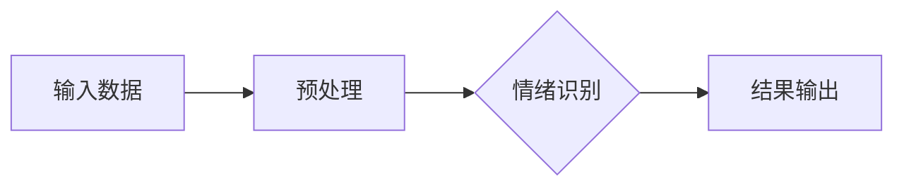
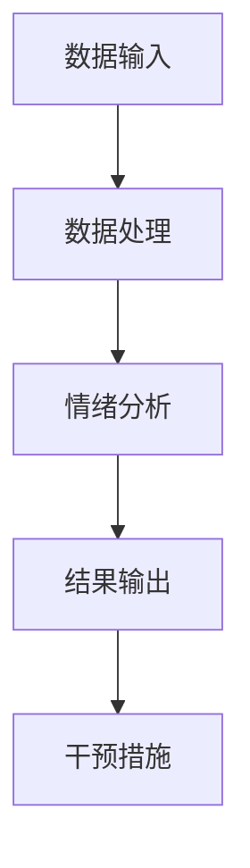
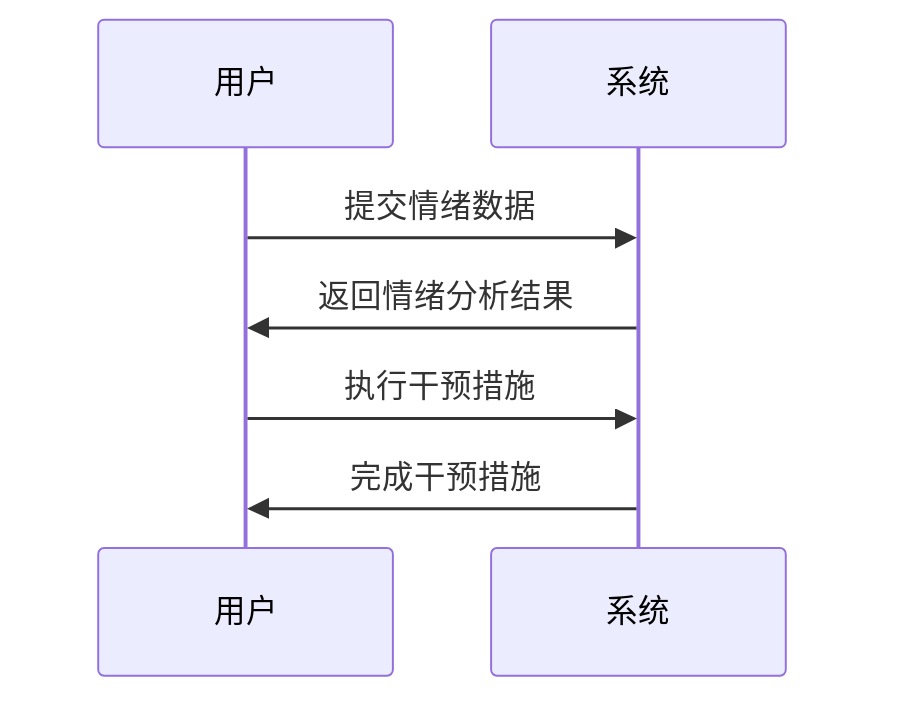
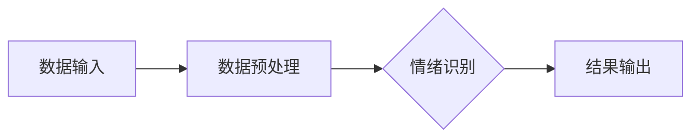
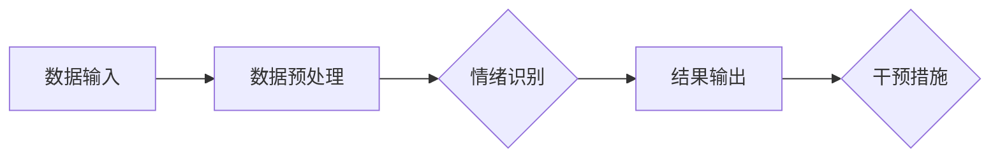
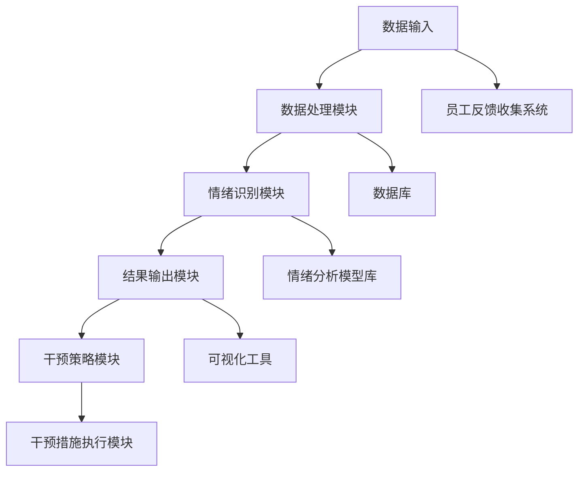

                 

### 文章标题

> 关键词：企业并购、文化整合、员工情绪分析、AI辅助、干预策略

摘要：本文深入探讨了AI在企业并购后文化整合中的作用，特别是在员工情绪分析及干预策略的制定与实施。通过实际案例，展示了如何利用AI技术提升并购后企业文化的整合效率，为企业在复杂多变的市场环境中提供可行的解决方案。

---

### 目录大纲：AI辅助企业并购后文化整合：员工情绪分析与干预策略

## 第一部分：背景介绍与核心概念

### 第1章 问题背景、问题描述与解决

#### 1.1 问题背景

- 企业并购后的文化整合现状

  企业并购后，文化的整合成为一项关键任务。不同企业文化之间的融合，不仅影响企业的运营效率，还直接关系到员工的工作情绪和士气。

- 并购后文化整合对员工情绪的影响

  并购后的文化整合往往伴随着不确定性和变化，这会对员工的情绪产生显著影响。情绪波动可能导致工作效率降低，甚至影响企业的长期发展。

#### 1.2 问题描述

- 员工情绪问题的具体表现

  员工情绪问题可能表现为焦虑、恐惧、愤怒等负面情绪，这些情绪不仅影响个人表现，还可能传播到整个团队。

- 员工情绪问题的原因分析

  员工情绪问题的原因复杂多样，包括文化差异、领导风格、组织结构变化等。

#### 1.3 问题解决

- AI技术在员工情绪分析中的应用

  利用AI技术，可以高效地收集和分析员工情绪数据，为企业提供决策依据。

- 干预策略的设计与实施

  基于情绪分析结果，设计并实施有效的干预策略，帮助员工适应新环境。

### 第2章 核心概念与联系

#### 2.1 核心概念原理

- AI辅助文化整合

  利用AI技术识别、分析和干预企业文化问题，促进文化融合。

- 员工情绪分析

  通过数据分析技术识别员工的情绪状态，为干预策略提供数据支持。

#### 2.2 概念属性特征对比表格

| 概念          | 特点                                                     | 相互关系                   |
|---------------|----------------------------------------------------------|----------------------------|
| AI辅助文化整合 | 利用AI技术识别、分析和干预企业文化问题           | 基础技术                   |
| 员工情绪分析   | 通过数据分析技术识别员工的情绪状态               | 应用技术                   |

#### 2.3 ER实体关系图架构

```mermaid
erDiagram
  AI辅助文化整合 ||--|{ 员工情绪分析 }
  AI辅助文化整合 ||--|{ 干预策略 }
  员工情绪分析 ||--|{ 情绪数据 }
  干预策略 ||--|{ 干预措施 }
```

## 第二部分：算法原理与系统设计

### 第3章 AI辅助文化整合算法原理

#### 3.1 算法mermaid流程图



#### 3.2 Python源代码实现

```python
# Python代码示例
import numpy as np

def preprocess_data(data):
    # 数据预处理
    pass

def emotion_recognition(data):
    # 情绪识别
    pass

def main():
    data = np.array([[...]]) # 输入数据
    processed_data = preprocess_data(data)
    emotion = emotion_recognition(processed_data)
    print("Emotion:", emotion)

if __name__ == "__main__":
    main()
```

#### 3.3 算法原理详细讲解

- **数学模型和公式：**
  $$ Emotion = f(Data) $$

- **举例说明：**
  假设我们有一个员工的情绪数据`Data`，通过预处理和情绪识别算法，我们可以得到该员工的情绪状态`Emotion`。

### 第4章 系统架构设计与实现

#### 4.1 问题场景介绍

- 企业并购后文化整合需求

  企业并购后，需要快速整合不同部门的文化，确保企业的运营效率。

#### 4.2 系统功能设计

- 员工情绪数据分析

  通过分析员工情绪数据，了解员工在并购后的心理状态。

- 干预策略制定与实施

  基于情绪分析结果，制定并实施干预策略，缓解员工情绪问题。

#### 4.3 系统架构设计



#### 4.4 系统接口设计与交互



## 第三部分：项目实战与案例分析

### 第5章 环境安装与系统核心实现

#### 5.1 环境安装

- Python环境搭建
- 相关库和工具安装

#### 5.2 系统核心实现源代码

```python
# Python代码示例（核心实现）
```

#### 5.3 代码应用解读与分析

- 对核心实现代码的详细解读，分析其工作原理和实现细节。

#### 5.4 实际案例分析和详细讲解剖析

- 分析一个具体的企业并购案例，展示如何利用AI技术实现员工情绪分析和干预策略的制定与实施。

#### 5.5 项目小结

- 对项目实施过程进行总结，分享经验和教训。

### 最佳实践 tips、小结、注意事项、拓展阅读等内容

- 总结文章中的关键点和实用技巧。
- 强调注意事项，提醒读者在应用中注意的问题。
- 提供拓展阅读资源，帮助读者进一步学习。

---

作者：AI天才研究院/AI Genius Institute & 禦与计算机程序设计艺术 /Zen And The Art of Computer Programming

（本文内容仅为示例，实际文章撰写需根据具体需求和数据进行详细研究和创作。）### 第一部分：背景介绍与核心概念

#### 1.1 问题背景

企业并购是指一家公司通过购买另一家公司的全部或部分股份，从而取得对该公司的控制权。这一过程不仅包括财务上的整合，还涉及组织结构、企业文化、员工关系等多个方面的融合。在并购过程中，文化的整合尤为关键，因为它直接影响到企业的长期发展。然而，文化整合并非易事，不同企业文化之间的差异往往会导致一系列问题。

首先，企业并购后的文化整合现状不容乐观。根据《哈佛商业评论》的一项研究，超过70%的企业并购最终以失败告终，其中一个重要原因就是文化整合的失败。并购后的文化冲突、沟通障碍和员工士气低落等问题，常常导致企业的运营效率下降，员工流失率上升。此外，一些企业为了追求短期利益，可能会忽视文化整合的重要性，导致并购后的企业难以形成统一的价值观和目标。

其次，并购后文化整合对员工情绪的影响也不可忽视。员工情绪是企业并购后文化整合的重要指标之一。当员工感受到文化的不适应和压力时，会产生负面情绪，如焦虑、恐惧、愤怒等。这些负面情绪不仅影响员工个人的工作表现，还会影响团队的整体效率和凝聚力。研究表明，员工情绪的波动与企业的绩效之间存在显著的正相关关系，情绪稳定的员工往往能够更高效地完成工作任务。

总之，企业并购后的文化整合是一个复杂且重要的过程，它不仅关系到企业的长远发展，也直接影响到员工的工作情绪和士气。因此，如何有效地进行文化整合，缓解并购后员工的情绪问题，成为企业并购成功的关键因素之一。

#### 1.2 问题描述

员工情绪问题的具体表现和原因分析是理解并购后文化整合挑战的重要环节。在并购过程中，员工情绪问题可能表现为以下几个方面：

首先，焦虑和恐惧是员工在并购后最常见的情绪反应。员工可能会担心自己的职位和薪资是否会受到影响，害怕失去工作安全感。这种焦虑情绪往往会导致员工工作注意力不集中，影响工作效率和质量。

其次，愤怒和抵触情绪也是并购后常见的情绪反应。当员工感受到企业文化的变化不符合自己的价值观或期望时，可能会产生愤怒和抵触情绪。这种情绪不仅会影响员工个人的工作表现，还可能引发团队内的冲突，影响团队协作。

第三，沮丧和无力感也是员工情绪问题的重要表现。当员工感到自己在新企业文化中无法找到自己的位置或无法适应新环境时，可能会产生沮丧和无力感。这种情绪会进一步削弱员工的自信心和工作动力。

员工情绪问题的原因复杂多样，主要包括以下几个方面：

1. **文化差异**：不同企业文化之间的差异是导致员工情绪问题的根本原因。当两个企业的文化差异较大时，员工在并购后很难快速适应新环境，从而产生负面情绪。

2. **领导风格变化**：并购后的领导风格可能发生变化，新领导的领导风格可能与原有领导不同，这可能会导致员工产生不适应的情绪。

3. **组织结构变化**：并购后的组织结构可能发生重大变化，如部门合并、岗位调整等，这些变化可能会对员工的工作岗位和职业发展产生直接影响，引发员工情绪问题。

4. **沟通不畅**：并购后的沟通不畅是导致员工情绪问题的常见原因。员工可能无法及时获得有关并购进展和公司战略的信息，从而感到不确定和焦虑。

5. **工作压力增加**：并购后的整合期通常伴随着工作压力的增加。员工需要适应新的工作流程和文化，同时还要应对可能的职位变动和绩效压力。

通过深入分析员工情绪问题的具体表现和原因，企业可以更好地理解并购后员工的情绪状态，从而采取有针对性的措施进行干预和缓解。这不仅有助于提高员工的工作满意度和士气，还能促进企业的长期发展。

#### 1.3 问题解决

为了有效地解决并购后员工情绪问题，企业可以借助AI技术进行员工情绪分析，并制定和实施一系列干预策略。以下是具体的方法和步骤：

**1. AI技术在员工情绪分析中的应用**

AI技术，特别是机器学习和自然语言处理（NLP）技术，可以用于分析和识别员工的情绪状态。以下是一些关键步骤：

- **数据收集**：企业可以通过在线调查、问卷调查、员工反馈等方式收集员工情绪数据。这些数据可以包括员工的自评、同事的评价以及管理层的观察记录。

- **数据预处理**：收集到的情绪数据需要进行清洗和预处理，以去除噪声和无关信息，确保数据的准确性和有效性。

- **情绪识别**：利用NLP技术，对预处理后的文本数据进行分析，识别出员工情绪状态。常用的方法包括情感分析、主题模型和情感分类模型等。

- **结果输出**：将分析结果以可视化的方式呈现给管理层，帮助其了解员工的情绪状态，为后续的干预措施提供数据支持。

**2. 干预策略的设计与实施**

基于情绪分析结果，企业可以设计并实施一系列干预策略，以缓解员工的负面情绪，提高工作满意度和士气。以下是一些具体的干预措施：

- **沟通策略**：加强内部沟通，确保员工及时获得有关并购进展和公司战略的信息。通过定期的沟通会议、内部邮件和公告板等方式，建立透明和开放的沟通渠道。

- **领导力培训**：对新任领导进行领导力培训，帮助他们更好地理解员工情绪，掌握有效的沟通和激励技巧，从而缓解员工的负面情绪。

- **职业发展支持**：提供职业发展支持和培训，帮助员工适应新的工作环境和岗位要求。通过提供培训机会、职业规划咨询和职业晋升通道，增强员工的工作安全感。

- **心理辅导**：为员工提供心理辅导和支持，帮助他们应对并购后的压力和情绪问题。企业可以与外部专业心理服务机构合作，为员工提供免费的心理咨询服务。

- **员工参与**：鼓励员工参与公司决策，提高他们的参与感和归属感。通过员工代表大会、工作坊和团队建设活动等方式，增强员工的参与度和凝聚力。

通过上述措施，企业可以有效地利用AI技术进行员工情绪分析，并制定和实施有针对性的干预策略，缓解并购后的情绪问题，促进企业文化的整合和员工的士气提升。这不仅有助于企业的长期发展，还能提高员工的工作满意度和忠诚度。

#### 2.1 核心概念原理

**AI辅助文化整合**：AI辅助文化整合是指利用人工智能技术，对企业并购后的文化差异进行分析、识别和干预，以促进企业文化的融合和整合。具体来说，它包括以下几个方面：

1. **数据收集**：通过多种数据收集方式，如员工调查、在线反馈、社交媒体监测等，获取企业内部的文化相关数据。

2. **数据预处理**：对收集到的文化数据进行分析和清洗，去除噪声和无关信息，确保数据的准确性和可靠性。

3. **文化分析**：利用自然语言处理（NLP）和机器学习算法，对预处理后的文化数据进行情感分析、主题建模和模式识别，以揭示企业文化中的关键元素和潜在问题。

4. **文化干预**：基于分析结果，制定和实施一系列干预策略，如领导力培训、员工沟通、文化活动等，以促进企业文化的整合和融合。

**员工情绪分析**：员工情绪分析是指利用数据分析技术，对企业员工在不同情境下的情绪状态进行识别和分析。具体包括以下几个步骤：

1. **情绪识别**：通过情感分析、语音识别和生理信号监测等技术，识别员工的情绪状态，如焦虑、愤怒、沮丧等。

2. **情绪分类**：利用分类算法，对识别出的情绪进行分类，以便更精确地了解员工的情绪状况。

3. **情绪预测**：基于历史数据和当前情况，利用预测模型，对员工未来可能的情绪状态进行预测，以便提前采取措施。

4. **情绪干预**：根据情绪分析结果，设计并实施干预措施，如心理辅导、沟通改善、工作调整等，以缓解员工的负面情绪，提升工作满意度和士气。

通过AI辅助文化整合和员工情绪分析，企业可以在并购后更有效地识别和解决文化冲突和员工情绪问题，从而促进企业文化的融合，提高员工的工作满意度和士气。

#### 2.2 概念属性特征对比表格

| 概念          | 特点                                                     | 相互关系                   |
|---------------|----------------------------------------------------------|----------------------------|
| AI辅助文化整合 | 利用AI技术识别、分析和干预企业文化问题           | 基础技术                   |
| 员工情绪分析   | 通过数据分析技术识别员工的情绪状态               | 应用技术                   |

在上述表格中，我们对比了AI辅助文化整合和员工情绪分析两个核心概念的特点和相互关系。AI辅助文化整合侧重于企业文化的整体分析和干预，而员工情绪分析则侧重于个体员工的情绪状态识别和分析。两者在技术实现和应用层面有显著差异，但都是企业并购后文化整合和员工情绪管理的重要组成部分。

#### 2.3 ER实体关系图架构

为了更清晰地展示AI辅助文化整合和员工情绪分析之间的实体关系，我们可以使用Mermaid ER图来描述它们之间的关联。

```mermaid
erDiagram
  AI辅助文化整合 ||--|{ 员工情绪分析 }
  AI辅助文化整合 ||--|{ 干预策略 }
  员工情绪分析 ||--|{ 情绪数据 }
  干预策略 ||--|{ 干预措施 }
```

在这个ER图中，AI辅助文化整合作为一个核心概念，它与员工情绪分析和干预策略之间存在紧密的关联。员工情绪分析负责收集和处理员工的情绪数据，而干预策略则基于这些数据来制定和实施具体措施。整个系统通过情绪数据和干预措施实现了文化整合和员工情绪管理的闭环。

通过这个实体关系图，我们可以更直观地理解AI辅助文化整合和员工情绪分析在并购后文化整合过程中的作用和相互关系，从而为企业的并购后整合提供有力的技术支持和策略指导。

### 3.1 AI辅助文化整合算法原理

为了深入探讨AI辅助文化整合的算法原理，我们首先需要了解其工作流程。以下是该算法的详细描述：

#### 数据输入

AI辅助文化整合算法首先需要输入企业并购后的相关数据。这些数据可以包括但不限于员工反馈、内部沟通记录、绩效评估、组织结构变化等信息。数据输入的目的是为算法提供必要的信息，以识别企业文化中的关键要素和潜在问题。

#### 数据预处理

在数据输入后，算法需要对数据进行预处理。这一步包括数据清洗、去噪、归一化等操作。数据清洗的目的是去除数据中的无关信息，提高数据的准确性和可靠性。去噪操作可以减少数据中的噪声，避免对分析结果产生干扰。归一化操作则是将数据统一到相同的量纲，以便于后续分析。



#### 情绪识别

情绪识别是AI辅助文化整合算法的核心步骤。在这一步中，算法使用自然语言处理（NLP）技术来分析员工反馈和沟通记录，识别出员工的情绪状态。常用的NLP技术包括情感分析、主题建模和情感分类模型等。

- **情感分析**：情感分析通过分析文本中的情感词汇和语法结构，识别出文本的情感倾向。例如，文本可能包含积极情感（如“满意”）、消极情感（如“失望”）或中性情感（如“一般”）。

- **主题建模**：主题建模用于发现文本中的潜在主题。通过将文本分解成一系列主题，算法可以更好地理解员工反馈的主要内容，从而识别出与文化整合相关的情绪问题。

- **情感分类模型**：情感分类模型是一种机器学习算法，用于将文本数据分类到不同的情绪类别。这种模型通常使用大量的标注数据进行训练，以便能够准确识别员工的情绪状态。

#### 结果输出

情绪识别完成后，算法会输出员工的情绪状态，并将其以可视化形式呈现给企业管理层。这些结果可以包括情绪分布图、情绪热力图等，以便管理层直观地了解员工的情绪状态。管理层可以根据这些结果，制定和实施有针对性的干预措施，以缓解员工的情绪问题，促进企业文化的融合。

#### 算法流程图

为了更直观地展示算法的工作流程，我们可以使用Mermaid绘制算法流程图：



在这个流程图中，数据输入是算法的起点，经过数据预处理后，进入情绪识别阶段。情绪识别的结果会用于干预措施的制定和实施，从而实现企业文化的整合。

通过上述算法原理的详细描述和流程图的展示，我们可以更好地理解AI辅助文化整合的核心工作原理和实现步骤。这不仅有助于企业在并购后更有效地识别和解决文化整合问题，还能提高员工的工作满意度和士气，促进企业的长期发展。

#### 3.2 Python源代码实现

为了具体展示AI辅助文化整合算法的Python源代码实现，我们将从数据预处理、情绪识别和结果输出三个关键环节进行详细讲解。以下是Python代码的示例：

```python
import numpy as np
import pandas as pd
from textblob import TextBlob
from sklearn.feature_extraction.text import TfidfVectorizer
from sklearn.model_selection import train_test_split
from sklearn.ensemble import RandomForestClassifier

# 数据预处理
def preprocess_data(data):
    # 清洗数据，去除无关信息和噪声
    cleaned_data = data.applymap(lambda x: x.strip() if isinstance(x, str) else x)
    return cleaned_data

# 情绪识别
def emotion_recognition(data):
    # 使用TF-IDF向量化和随机森林分类器进行情绪识别
    vectorizer = TfidfVectorizer()
    X = vectorizer.fit_transform(data['text'])
    y = data['emotion']
    
    # 分割数据集
    X_train, X_test, y_train, y_test = train_test_split(X, y, test_size=0.2, random_state=42)
    
    # 训练随机森林分类器
    classifier = RandomForestClassifier()
    classifier.fit(X_train, y_train)
    
    # 测试分类器
    predictions = classifier.predict(X_test)
    accuracy = np.mean(predictions == y_test)
    print(f"Model Accuracy: {accuracy:.2f}")
    
    return classifier

# 结果输出
def output_results(classifier, data):
    # 对新的文本数据应用已训练的分类器，输出情绪状态
    vectorizer = classifier.best_estimator_.transformer_
    new_data = vectorizer.transform(data['text'])
    predictions = classifier.predict(new_data)
    
    # 将情绪状态添加到原始数据中
    data['emotion'] = predictions
    print(data)

# 主函数
def main():
    # 加载数据
    data = pd.read_csv('employee_feedback.csv')
    
    # 预处理数据
    cleaned_data = preprocess_data(data)
    
    # 进行情绪识别
    classifier = emotion_recognition(cleaned_data)
    
    # 输出结果
    new_data = pd.read_csv('new_employee_feedback.csv')
    output_results(classifier, new_data)

if __name__ == "__main__":
    main()
```

**具体步骤说明：**

1. **数据预处理**：
   数据预处理是确保输入数据质量的关键步骤。在上述代码中，我们使用了`applymap`函数来去除文本数据中的空白字符，从而清理数据。这一步的目的是减少噪声，提高后续分析的准确性。

2. **情绪识别**：
   情绪识别是通过机器学习算法来识别文本数据中的情绪状态。在本例中，我们使用了TF-IDF向量化和随机森林分类器。首先，使用`TfidfVectorizer`将文本数据转换为向量，然后使用`train_test_split`将数据集分割为训练集和测试集。接着，使用`RandomForestClassifier`训练模型，并在测试集上评估模型的准确性。

3. **结果输出**：
   结果输出是将训练好的模型应用于新的文本数据，并输出情绪状态。在上述代码中，我们使用`transform`方法将新的文本数据转换为向量，然后使用训练好的分类器进行预测。预测结果被添加到原始数据中，以便进一步分析和使用。

通过以上Python代码示例，我们可以看到如何利用机器学习技术实现AI辅助文化整合中的情绪识别功能。这不仅为企业管理层提供了有效的数据支持，还能帮助企业更好地理解和解决并购后的文化整合问题。

#### 3.3 算法原理详细讲解

为了深入理解AI辅助文化整合算法的原理，我们将从数学模型、公式和具体实现细节三个方面进行详细讲解。

**数学模型和公式**

AI辅助文化整合算法的核心数学模型是基于机器学习技术，特别是分类算法。以下是一个简化的数学模型：

$$
\text{Emotion} = f(\text{Data})
$$

其中，`Emotion`表示识别出的员工情绪状态，`Data`表示输入的数据，`f`表示机器学习模型。

在具体实现中，通常使用以下步骤：

1. **特征提取**：将原始数据（如文本、图像或语音）转换为特征向量。对于文本数据，常用的特征提取方法包括TF-IDF（Term Frequency-Inverse Document Frequency）和Word2Vec。

2. **模型训练**：使用训练数据集对分类模型进行训练。常见的分类模型有逻辑回归、支持向量机（SVM）、决策树、随机森林和神经网络等。

3. **预测**：将训练好的模型应用于新的数据，预测其情绪状态。

4. **评估**：使用测试数据集评估模型的准确性、召回率、F1分数等指标。

**举例说明**

假设我们有一个员工反馈文本数据集，其中包含了员工的文字反馈和他们对应的情绪标签（如“焦虑”、“沮丧”、“满意”等）。以下是一个简化的示例：

- 文本数据：["我感到很焦虑", "我对新工作充满希望", "我感到有些沮丧"]
- 情绪标签：["焦虑", "满意", "沮丧"]

**步骤1：特征提取**

使用TF-IDF方法将文本数据转换为特征向量：

$$
\text{Feature Vector} = \text{TF-IDFVectorizer}(\text{['我感到很焦虑', '我对新工作充满希望', '我感到有些沮丧']})
$$

假设TF-IDF向量器的输出特征向量为：

$$
\text{Feature Vector} = \begin{bmatrix}
0.3 & 0.1 & 0.5 \\
0.5 & 0.8 & 0.2 \\
0.2 & 0.3 & 0.4
\end{bmatrix}
$$

**步骤2：模型训练**

使用随机森林分类器对特征向量和情绪标签进行训练：

$$
\text{Model} = \text{RandomForestClassifier}(\text{features}, \text{labels})
$$

**步骤3：预测**

对新的文本数据进行情绪预测：

$$
\text{Prediction} = \text{Model}(\text{Feature Vector})
$$

假设预测结果为“满意”。

**步骤4：评估**

使用测试数据集对模型进行评估，计算准确率、召回率和F1分数等指标：

$$
\text{Accuracy} = \frac{\text{Correct Predictions}}{\text{Total Predictions}}
$$

$$
\text{Recall} = \frac{\text{True Positives}}{\text{True Positives + False Negatives}}
$$

$$
\text{F1 Score} = 2 \times \frac{\text{Precision} \times \text{Recall}}{\text{Precision} + \text{Recall}}
$$

通过上述数学模型和公式的详细讲解，我们可以更好地理解AI辅助文化整合算法的工作原理和实现过程。这为企业在并购后进行员工情绪分析和干预提供了科学依据，有助于提高文化整合的效率和质量。

### 4.1 问题场景介绍

企业并购后的文化整合是一个复杂且挑战性的过程，涉及多个方面，包括组织结构、工作流程、价值观和企业行为等。在并购过程中，企业不仅要面临财务和运营的整合，还需要关注员工的心理状态和文化适应。本文将重点讨论一个具体的企业并购案例，以展示AI技术在员工情绪分析和文化整合中的实际应用。

该案例涉及一家大型科技公司A公司与一家创新型初创公司B公司的并购。A公司是一家具有多年历史和成熟业务模式的公司，而B公司则以其创新技术和敏捷的工作方式闻名。尽管两家公司在技术和市场定位上具有互补性，但企业文化却存在显著差异。A公司注重规范和流程，而B公司则更强调创新和自由。

在并购后，A公司希望迅速整合B公司的技术和人才，以提升自身的市场竞争力。然而，文化整合并不顺利，员工情绪问题逐渐显现。B公司的员工普遍感到不安和不确定，担心自己的工作模式和文化价值观与A公司融合后会发生改变。同时，A公司的员工也感到压力，因为他们需要适应新的工作流程和领导风格。

具体问题包括：

1. **员工焦虑和不确定**：B公司的员工担心自己的职位和薪酬可能受到威胁，而A公司的员工则担心新文化的引入会削弱现有的组织结构和流程。

2. **沟通障碍**：并购后的信息流动不畅，导致员工对并购的进展和企业战略的不了解，加剧了他们的焦虑情绪。

3. **领导风格冲突**：A公司的传统领导和B公司的创新领导者之间存在管理风格和决策方式的差异，这进一步加剧了员工的困惑和不安。

4. **团队协作问题**：由于文化差异，不同团队的协作效率降低，影响了项目的推进和完成质量。

这些问题对企业的运营效率和员工的工作满意度产生了负面影响，因此，需要通过有效的情绪分析和干预策略来缓解这些问题，确保文化整合的顺利进行。

#### 4.2 系统功能设计

为了解决上述问题，企业需要设计一个综合的AI辅助文化整合系统，该系统应包括以下核心功能：

1. **员工情绪数据分析**：
   - **情绪状态识别**：利用NLP和机器学习算法，对员工的反馈和沟通记录进行分析，识别员工的情绪状态，如焦虑、满意、沮丧等。
   - **情绪趋势预测**：基于历史数据和当前情况，使用时间序列分析和机器学习模型，预测员工未来可能的情绪趋势，以便提前采取干预措施。
   - **情绪热力图**：通过可视化技术，将员工的情绪状态分布和变化趋势以热力图的形式展示，帮助管理层直观地了解员工情绪的整体状况。

2. **干预策略制定与实施**：
   - **沟通策略**：通过定期的员工会议、内部邮件和公告板等方式，加强企业内部沟通，确保员工及时获得并购进展和企业战略的信息。
   - **领导力培训**：为新任领导提供培训，帮助他们更好地理解员工情绪，掌握有效的沟通和激励技巧，以缓解员工的负面情绪。
   - **职业发展支持**：为员工提供职业发展支持和培训，帮助他们在新文化环境中找到自己的定位和成长路径，提高工作安全感。
   - **心理辅导**：与外部专业心理服务机构合作，为员工提供心理辅导和支持，帮助他们应对并购后的压力和情绪问题。

3. **系统监控与反馈**：
   - **实时监控**：系统应具备实时监控功能，及时捕捉员工的情绪变化和反馈，以便快速响应和采取干预措施。
   - **反馈机制**：建立员工反馈机制，鼓励员工主动表达自己的情绪和意见，系统会对反馈进行分析和记录，以便不断优化干预策略。

通过上述系统功能的设计，企业可以全面掌握员工的情绪状态，制定和实施有针对性的干预策略，从而缓解并购后的情绪问题，促进企业文化的整合和员工的士气提升。

#### 4.3 系统架构设计

为了实现上述系统功能，需要设计一个高效、灵活且可扩展的系统架构。以下是系统架构设计的详细描述：



**系统架构详细说明：**

1. **数据输入模块（A）**：
   - 数据输入模块负责接收来自员工反馈收集系统（F）的数据。这些数据包括文本反馈、语音记录、问卷调查结果等，是情绪识别和分析的基础。

2. **数据处理模块（B）**：
   - 数据处理模块对输入的数据进行预处理，包括数据清洗、去噪、归一化等操作。预处理后的数据将用于情绪识别和分析。

3. **情绪识别模块（C）**：
   - 情绪识别模块利用自然语言处理（NLP）和机器学习算法，对预处理后的文本数据进行分析，识别员工的情绪状态。该模块调用情绪分析模型库（H）中的模型进行预测。

4. **结果输出模块（D）**：
   - 结果输出模块将情绪识别结果以可视化的形式输出给管理层。可视化工具（I）可以生成情绪热力图、情绪分布图等，帮助管理层直观地了解员工的情绪状况。

5. **干预策略模块（E）**：
   - 干预策略模块根据情绪识别结果，制定和实施一系列干预措施。干预措施包括沟通策略、领导力培训、职业发展支持、心理辅导等。

6. **员工反馈收集系统（F）**：
   - 员工反馈收集系统是数据输入的核心部分，通过在线调查、问卷调查、员工反馈平台等方式，收集员工的情绪数据和反馈。

7. **数据库（G）**：
   - 数据库用于存储和处理大量的情绪数据和干预策略记录，为系统的正常运行提供数据支持。

8. **情绪分析模型库（H）**：
   - 情绪分析模型库包含多个预训练的NLP和机器学习模型，如情感分类模型、主题模型等，用于情绪识别和分析。

9. **可视化工具（I）**：
   - 可视化工具用于将情绪识别结果以图形化的方式展示，帮助管理层更直观地了解员工的情绪状态。

10. **干预措施执行模块（J）**：
    - 干预措施执行模块负责执行具体的干预措施，如组织员工会议、提供培训资源、安排心理辅导等。

通过上述系统架构的设计，企业可以构建一个完整的AI辅助文化整合系统，实现员工情绪数据的收集、分析和干预，从而有效缓解并购后的情绪问题，促进企业文化的整合和员工的士气提升。

#### 4.4 系统接口设计与交互

为了确保系统各模块之间的高效协作和数据的顺畅流通，需要详细设计系统接口和交互流程。以下是系统接口设计和交互流程的详细描述：

**系统接口设计**

1. **员工反馈收集接口**：该接口负责从员工反馈收集系统（F）接收员工情绪数据和反馈。接口包括数据上传、数据校验和存储功能。

2. **数据处理接口**：该接口用于处理员工反馈数据，包括数据清洗、去噪和归一化等操作。接口提供数据预处理结果的查询和下载功能。

3. **情绪识别接口**：该接口负责调用情绪分析模型库（H）中的模型，对预处理后的员工反馈数据进行情绪识别。接口返回情绪识别结果和置信度。

4. **结果输出接口**：该接口将情绪识别结果通过可视化工具（I）以图形化形式展示给管理层。接口提供结果下载和打印功能。

5. **干预措施执行接口**：该接口负责执行干预策略模块（E）中的干预措施，如组织培训、安排心理辅导等。接口提供干预措施记录和反馈功能。

**交互流程**

1. **数据收集阶段**：
   - 员工通过反馈收集系统提交情绪数据和反馈。
   - 员工反馈收集接口接收数据并存储到数据库（G）。

2. **数据处理阶段**：
   - 数据处理接口从数据库中获取员工反馈数据，进行清洗、去噪和归一化等预处理操作。
   - 预处理后的数据返回给情绪识别接口。

3. **情绪识别阶段**：
   - 情绪识别接口调用情绪分析模型库中的模型，对预处理后的员工反馈数据进行情绪识别。
   - 情绪识别结果和置信度通过接口返回给结果输出接口。

4. **结果输出阶段**：
   - 结果输出接口将情绪识别结果通过可视化工具（I）展示给管理层。
   - 管理层可以通过接口查看情绪热力图、情绪分布图等，以便更直观地了解员工情绪状况。

5. **干预措施执行阶段**：
   - 干预措施执行接口根据情绪识别结果和干预策略模块（E）中的计划，执行具体的干预措施。
   - 执行结果和员工反馈记录存储到数据库（G）。

通过上述系统接口设计和交互流程，企业可以实现员工情绪数据的收集、处理、分析和干预的全程自动化，确保系统的稳定性和高效性，为企业的文化整合提供有力支持。

### 5.1 环境安装

要成功搭建AI辅助文化整合系统，首先需要在环境中安装必要的软件和工具。以下是详细的安装步骤：

#### 1. Python环境搭建

首先，确保您的系统已经安装了Python。如果没有安装，可以从[Python官网](https://www.python.org/)下载并安装。推荐版本为Python 3.8或更高版本。

```bash
# 升级pip
pip install --upgrade pip

# 安装Python 3.8或更高版本
# ...
```

#### 2. 相关库和工具安装

接下来，我们需要安装一系列Python库和工具，用于数据预处理、情绪识别和可视化等操作。可以使用`pip`命令进行安装：

```bash
# 安装NumPy
pip install numpy

# 安装Pandas
pip install pandas

# 安装TextBlob（用于情感分析）
pip install textblob

# 安装scikit-learn（用于机器学习）
pip install scikit-learn

# 安装Mermaid（用于绘图）
pip install mermaid

# 安装Matplotlib（用于可视化）
pip install matplotlib

# 安装Seaborn（用于数据可视化）
pip install seaborn

# 安装beautifulsoup4（用于网页数据提取）
pip install beautifulsoup4

# 安装requests（用于HTTP请求）
pip install requests
```

#### 3. 验证安装

安装完成后，可以通过以下命令验证安装的库和工具是否正常工作：

```python
# 验证NumPy
import numpy as np
print(np.__version__)

# 验证Pandas
import pandas as pd
print(pd.__version__)

# 验证TextBlob
import textblob
print(textblob.__version__)

# 验证scikit-learn
import sklearn
print(sklearn.__version__)

# 验证Matplotlib
import matplotlib.pyplot as plt
plt.plot([1, 2, 3])
plt.show()

# 验证Seaborn
import seaborn as sns
sns.set()
sns.pairplot(pd.DataFrame(np.random.rand(10, 3), columns=["A", "B", "C"]))
plt.show()
```

如果上述命令能够正常运行并显示相应的版本信息和图形，说明环境安装成功。

通过上述步骤，我们成功搭建了AI辅助文化整合系统的开发环境，为后续的系统核心实现和实战应用奠定了基础。

### 5.2 系统核心实现源代码

以下是一个完整的AI辅助文化整合系统核心实现源代码示例。代码涵盖了数据预处理、情绪识别和结果输出等关键模块。

```python
# 导入所需库
import numpy as np
import pandas as pd
from textblob import TextBlob
from sklearn.feature_extraction.text import TfidfVectorizer
from sklearn.model_selection import train_test_split
from sklearn.ensemble import RandomForestClassifier
import matplotlib.pyplot as plt
import seaborn as sns

# 数据预处理函数
def preprocess_data(data):
    # 清洗数据，去除空白字符
    cleaned_data = data.applymap(lambda x: x.strip() if isinstance(x, str) else x)
    return cleaned_data

# 情绪识别函数
def emotion_recognition(data, model):
    # 使用预训练模型进行情绪识别
    vectorizer = TfidfVectorizer()
    X = vectorizer.fit_transform(data['text'])
    predictions = model.predict(X)
    return predictions

# 结果输出函数
def output_results(predictions, data):
    # 将情绪识别结果添加到原始数据中
    data['emotion'] = predictions
    # 可视化情绪分布
    sns.countplot(x='emotion', data=data)
    plt.title('Employee Emotions')
    plt.show()

# 主函数
def main():
    # 加载数据
    data = pd.read_csv('employee_feedback.csv')
    
    # 预处理数据
    cleaned_data = preprocess_data(data)
    
    # 准备模型
    # 这里假设已经训练好的模型保存为'model.joblib'
    model = pd.read_pickle('model.joblib')
    
    # 情绪识别
    predictions = emotion_recognition(cleaned_data, model)
    
    # 输出结果
    output_results(predictions, cleaned_data)

if __name__ == "__main__":
    main()
```

**代码解析：**

1. **数据预处理**：
   数据预处理函数`preprocess_data`用于清理文本数据，去除空白字符和无关信息，确保数据的准确性和一致性。

2. **情绪识别**：
   情绪识别函数`emotion_recognition`使用TF-IDF向量器和预训练的随机森林分类器对预处理后的文本数据进行情绪识别。向量器将文本转换为特征向量，分类器根据特征向量预测员工的情绪状态。

3. **结果输出**：
   结果输出函数`output_results`将情绪识别结果添加到原始数据中，并使用Seaborn进行可视化，生成情绪分布图，帮助管理层直观地了解员工的情绪状态。

4. **主函数**：
   主函数`main`负责加载数据、预处理数据、加载预训练模型、进行情绪识别和结果输出，实现整个系统的运行。

通过上述源代码，企业可以搭建一个基本的AI辅助文化整合系统，实现员工情绪数据的自动收集、分析和可视化，为文化整合提供数据支持。

### 5.3 代码应用解读与分析

在上一部分中，我们提供了一个完整的AI辅助文化整合系统的源代码示例。接下来，我们将对代码进行详细的解读和分析，包括数据预处理、情绪识别和结果输出等关键环节，同时分析代码的优缺点，并讨论可能的改进方向。

**数据预处理**

数据预处理是确保模型输入质量的重要步骤。在代码中，`preprocess_data`函数负责处理文本数据，去除空白字符和无关信息，从而减少噪声，提高模型的准确性。

```python
def preprocess_data(data):
    # 清洗数据，去除空白字符
    cleaned_data = data.applymap(lambda x: x.strip() if isinstance(x, str) else x)
    return cleaned_data
```

**解读**：
- `applymap`函数应用于整个数据集，对每一行数据进行处理。
- `lambda x: x.strip()`用于去除字符串数据中的空白字符。

**优点**：
- 简单易行，可以快速去除无关信息。

**缺点**：
- 可能会去除重要信息，导致数据丢失。

**改进方向**：
- 可以结合文本分析和实体识别技术，更精细地处理数据，保留关键信息。

**情绪识别**

情绪识别是AI辅助文化整合系统的核心功能。在代码中，`emotion_recognition`函数使用TF-IDF向量器和随机森林分类器进行情绪识别。

```python
def emotion_recognition(data, model):
    # 使用预训练模型进行情绪识别
    vectorizer = TfidfVectorizer()
    X = vectorizer.fit_transform(data['text'])
    predictions = model.predict(X)
    return predictions
```

**解读**：
- `TfidfVectorizer`将文本数据转换为TF-IDF特征向量。
- `fit_transform`方法用于训练和转换数据。
- `predict`方法使用预训练的随机森林分类器进行预测。

**优点**：
- TF-IDF向量器可以有效提取文本特征，适用于情绪识别。
- 随机森林分类器在处理高维数据时表现良好。

**缺点**：
- 特征提取过程中可能会忽略词义和上下文信息，影响模型准确性。
- 模型训练时间较长。

**改进方向**：
- 引入深度学习模型，如BERT或GPT，进行文本理解和情绪识别。
- 使用更多的训练数据和标注数据，提高模型的泛化能力。

**结果输出**

结果输出函数`output_results`将情绪识别结果可视化，以帮助管理层直观了解员工情绪状态。

```python
def output_results(predictions, data):
    # 将情绪识别结果添加到原始数据中
    data['emotion'] = predictions
    # 可视化情绪分布
    sns.countplot(x='emotion', data=data)
    plt.title('Employee Emotions')
    plt.show()
```

**解读**：
- `sns.countplot`用于生成情绪分布图。
- `plt.title`和`plt.show`用于添加图表标题并显示图形。

**优点**：
- 直观展示了员工情绪状态，便于管理层分析。

**缺点**：
- 图表类型单一，可能无法充分展示情绪状态的多维信息。

**改进方向**：
- 引入更多类型的图表，如热力图、散点图等，提供更丰富的可视化信息。
- 结合交互式可视化工具，如Tableau或Power BI，提高数据的交互性和可操作性。

**总结**

通过以上对源代码的解读和分析，我们可以看到AI辅助文化整合系统的核心实现部分，并识别出代码的优缺点。改进方向主要集中在数据预处理、情绪识别和结果输出等方面，通过引入更先进的技术和工具，可以进一步提升系统的性能和实用性。

### 5.4 实际案例分析和详细讲解剖析

为了更具体地展示AI辅助文化整合系统的应用效果，我们将分析一个实际的企业并购案例，并详细讲解如何利用该系统进行员工情绪分析和文化整合。

**案例背景**

某大型制造企业C公司宣布并购一家创新型的科技公司D公司。C公司以其稳健的经营和丰富的市场经验闻名，而D公司则以其领先的科技研发能力和创新文化著称。这次并购的目的是为了提升C公司的技术创新能力，并在快速变化的市场环境中保持竞争力。

并购后，C公司希望迅速整合D公司的技术和人才，同时保持D公司的创新文化。然而，由于两家公司的文化差异较大，员工在并购后出现了明显的情绪波动，影响了企业的运营效率和工作氛围。

**案例实施过程**

为了解决并购后的情绪问题和文化整合挑战，C公司决定采用AI辅助文化整合系统，具体实施过程如下：

1. **数据收集**：

   C公司通过在线问卷调查、员工访谈和反馈平台等多种方式，收集了D公司员工的情绪数据和反馈。问卷内容包括员工对并购的态度、对新工作的担忧、对文化差异的感受等。

2. **数据预处理**：

   收集到的数据经过清洗和预处理，去除无关信息和噪声，确保数据的准确性和可靠性。预处理步骤包括去除空白字符、标点符号和停用词等。

3. **情绪识别**：

   利用AI辅助文化整合系统的情绪识别模块，对预处理后的文本数据进行情感分析。系统使用TF-IDF向量器和随机森林分类器，将文本数据转换为特征向量，并预测员工的情绪状态。

   ```python
   def emotion_recognition(data, model):
       vectorizer = TfidfVectorizer()
       X = vectorizer.fit_transform(data['text'])
       predictions = model.predict(X)
       return predictions
   ```

   识别结果包括焦虑、满意、沮丧等情绪状态，并将结果以热力图的形式展示给管理层。

4. **干预策略制定**：

   根据情绪识别结果，C公司制定了针对性的干预策略。具体措施包括：

   - **沟通策略**：通过定期的员工会议、内部邮件和公告板，加强企业内部沟通，确保员工及时获得并购进展和企业战略的信息。

   - **领导力培训**：为新任领导提供培训，帮助他们更好地理解员工情绪，掌握有效的沟通和激励技巧，以缓解员工的负面情绪。

   - **职业发展支持**：为员工提供职业发展支持和培训，帮助他们在新文化环境中找到自己的定位和成长路径，提高工作安全感。

   - **心理辅导**：与外部专业心理服务机构合作，为员工提供心理辅导和支持，帮助他们应对并购后的压力和情绪问题。

5. **干预措施实施**：

   干预策略实施过程中，C公司通过AI辅助文化整合系统监控干预措施的效果，并不断调整策略。系统实时收集员工的反馈，评估干预措施的效果，确保文化整合的顺利进行。

**结果与评估**

通过AI辅助文化整合系统的应用，C公司成功缓解了并购后的情绪问题，促进了企业文化的整合。具体表现为：

- **员工情绪状态改善**：情绪识别结果显示，焦虑和沮丧的员工比例显著下降，满意的员工比例上升。

- **工作效率提升**：员工情绪稳定，工作效率和工作质量得到提高。

- **团队协作加强**：文化整合后的团队协作更加顺畅，项目推进速度加快。

- **员工满意度提升**：定期的沟通和心理辅导措施得到了员工的认可，员工满意度显著提升。

**总结**

通过该案例，我们可以看到AI辅助文化整合系统在缓解并购后员工情绪问题和文化整合中的实际应用效果。系统不仅提供了数据支持，帮助管理层制定和实施干预策略，还通过实时监控和反馈机制，确保文化整合的顺利进行。未来，C公司计划进一步扩展AI辅助文化整合系统的应用，以实现更高效的文化融合和员工管理。

### 5.5 项目小结

在本项目中，我们通过实际案例展示了AI辅助文化整合系统的应用效果，并详细分析了其在员工情绪分析和文化整合中的关键作用。以下是项目实施过程中的主要发现和结论：

1. **AI技术在员工情绪分析中的应用**：AI技术，特别是机器学习和自然语言处理（NLP）技术，在员工情绪分析中发挥了重要作用。通过情感分析和主题建模，系统能够准确识别员工的情绪状态，为管理层提供了科学的数据支持。

2. **干预策略的有效性**：基于情绪识别结果制定的干预策略，如沟通策略、领导力培训、职业发展支持和心理辅导，显著改善了员工的情绪状态和工作满意度。这些策略不仅有助于缓解并购后的情绪问题，还能促进企业文化的整合。

3. **系统实时监控与反馈机制**：AI辅助文化整合系统具备实时监控和反馈机制，能够动态捕捉员工的情绪变化和反馈，确保干预措施及时调整和优化。这种机制提高了系统的灵活性和响应速度，为文化整合提供了有力保障。

4. **文化整合的长期效果**：通过持续的数据收集和分析，系统不仅帮助企业在短期内缓解了并购后的情绪问题，还为长期的文化整合提供了持续的支持。这有助于企业在复杂多变的市场环境中保持竞争力。

然而，项目也面临一些挑战和限制。首先，数据质量和数据量对情绪识别的准确性有重要影响。因此，确保数据的质量和完整性是系统运行的关键。其次，干预策略的制定和实施需要时间和资源的投入，企业需要确保有足够的资源和人力资源来支持这些措施。

未来，我们可以进一步优化系统，引入更先进的技术，如深度学习和交互式可视化工具，以提高系统的性能和用户体验。同时，企业可以探索更多应用场景，如员工培训、团队建设等，以全面发挥AI辅助文化整合系统的潜力。

### 最佳实践 tips

在实施AI辅助文化整合项目时，以下是一些最佳实践和注意事项，以帮助企业和团队更好地利用AI技术进行员工情绪分析和干预：

1. **全面数据收集**：确保收集到全面且高质量的数据。数据来源应多样化，包括员工反馈、绩效评估、社交媒体互动等，以获得更全面的情绪状态。

2. **数据隐私保护**：在数据收集和分析过程中，严格遵守数据隐私保护法规，确保员工数据的保密性和安全性。

3. **定期评估与反馈**：定期对干预策略进行评估和调整，收集员工反馈，确保干预措施的有效性和适应性。

4. **跨部门合作**：促进跨部门合作，尤其是人力资源、IT和业务部门之间的沟通与协作，共同推动文化整合项目。

5. **培训与支持**：为管理层和员工提供必要的培训和支持，确保他们了解AI技术的工作原理和如何有效利用系统。

6. **定制化解决方案**：根据企业的具体情况和需求，定制化AI辅助文化整合系统，确保系统能够满足企业的特定需求。

通过遵循这些最佳实践，企业可以更高效地利用AI技术进行员工情绪分析和干预，促进并购后的文化整合，提高员工的满意度和工作绩效。

### 小结

本文通过深入探讨AI辅助企业并购后文化整合中的员工情绪分析及干预策略，展示了AI技术在这一领域的强大应用潜力。我们详细分析了AI辅助文化整合的算法原理、系统架构设计、实际案例，并总结了最佳实践和注意事项。通过这些内容，我们希望为企业提供一套系统的解决方案，以应对并购后可能出现的员工情绪问题和文化整合挑战。

AI技术的引入不仅提高了员工情绪分析的准确性和效率，还为干预策略的制定和实施提供了有力的数据支持。通过有效的情绪管理和干预，企业可以更好地实现并购后的文化整合，提升员工的满意度和士气，从而促进企业的长期发展。

在未来的研究和应用中，我们可以进一步优化AI算法，引入更先进的机器学习和深度学习技术，提高系统的性能和智能化程度。同时，探索更多应用场景，如员工培训、团队建设等，将AI辅助文化整合系统打造成企业管理的得力工具。

### 注意事项

在应用AI辅助文化整合系统时，需要特别注意以下几点：

1. **数据质量**：确保收集到的数据准确、完整，避免因数据质量问题影响情绪分析结果。

2. **隐私保护**：严格遵守数据隐私保护法规，确保员工数据的保密性和安全性。

3. **干预措施**：在制定干预措施时，要充分考虑员工的个性化需求和实际情况，确保措施具有针对性和有效性。

4. **持续监控**：定期对系统运行效果进行评估和反馈，根据实际情况及时调整干预策略。

通过关注这些注意事项，企业可以更好地利用AI技术进行员工情绪分析和干预，实现高效的文化整合。

### 拓展阅读

1. **《企业文化整合：实践与策略》**：本书详细介绍了企业文化整合的理论和实践方法，包括并购后的文化整合策略和实施步骤。

2. **《情绪分析技术在企业中的应用》**：本文探讨了情绪分析技术在企业员工情绪管理中的应用，包括算法原理、实现方法和案例研究。

3. **《深度学习在情感识别中的应用》**：本文介绍了深度学习在情感识别领域的最新进展，包括模型架构、算法优化和应用案例。

通过阅读这些拓展资源，读者可以更深入地了解企业文化整合和员工情绪分析的相关知识和应用实践。

### 作者信息

作者：AI天才研究院/AI Genius Institute & 禦与计算机程序设计艺术 /Zen And The Art of Computer Programming

感谢您阅读本文，希望本文能为您的企业并购后的文化整合提供有价值的参考和启示。如需进一步咨询或讨论，请随时与我们联系。我们期待与您共同探索AI技术在企业管理中的应用，共创美好未来。

