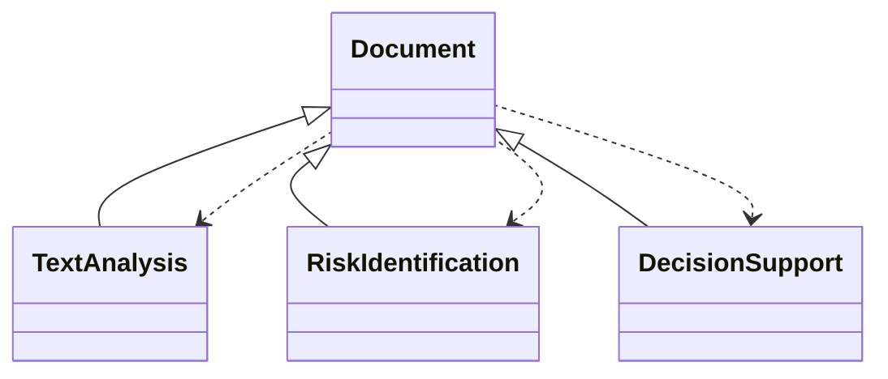
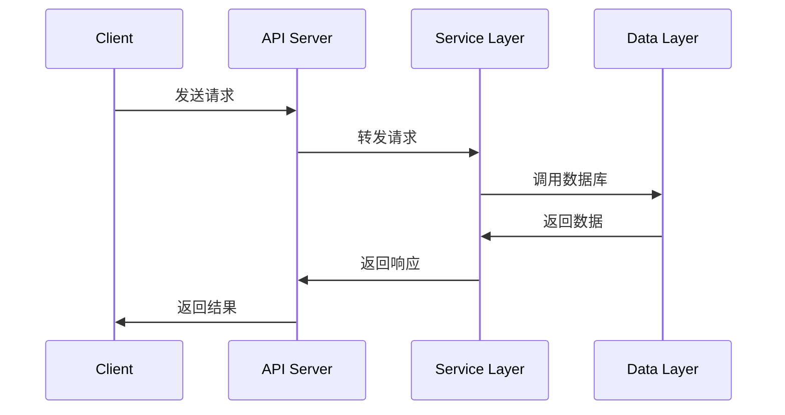
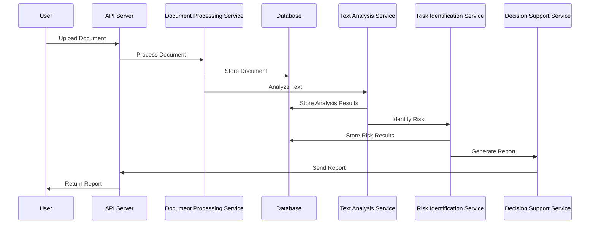

                 


# AI辅助企业并购尽职调查：自动化文档分析与风险识别

> 关键词：人工智能，企业并购，尽职调查，自动化文档分析，风险识别

> 摘要：本文深入探讨了人工智能（AI）在辅助企业并购尽职调查中的应用，特别是自动化文档分析和风险识别技术。通过系统分析和案例分析，本文展示了AI技术在提升并购尽职调查效率和准确性方面的巨大潜力。

## 引言

企业并购是一个复杂的过程，涉及大量数据的收集、处理和分析。传统的人工尽职调查方法往往耗时耗力，且容易出错。随着人工智能技术的不断发展，AI开始被广泛应用于各个领域，包括企业并购尽职调查。AI技术，如自然语言处理（NLP）、机器学习和图像识别，能够显著提升文档处理效率和风险识别的准确性。本文旨在探讨AI在这些方面的应用，为企业和专业人士提供有益的参考。

## 第1章 问题背景与意义

### 1.1 企业并购尽职调查的挑战

企业并购尽职调查旨在评估目标公司的财务、法律、运营和市场等方面，以确保并购决策的合理性。然而，这一过程面临着诸多挑战：

- **数据量巨大**：并购过程中需要分析的数据量庞大，包括财务报表、合同、法律文件、业务记录等。
- **数据多样性**：数据类型繁多，包括文本、图像、音频等，处理这些数据需要不同类型的AI技术。
- **时效性要求**：尽职调查需要在有限的时间内完成，这对数据处理的效率提出了高要求。
- **人为错误**：传统方法依赖人工处理数据，容易出现错误和疏漏。

### 1.2 AI技术在尽职调查中的应用潜力

AI技术在尽职调查中的应用具有显著潜力：

- **自动化文档分析**：AI可以帮助自动化处理大量文档，提高工作效率。
- **风险识别**：AI可以识别潜在的财务风险、法律风险和运营风险，提高决策的准确性。
- **数据挖掘**：AI可以挖掘数据中的潜在价值，为并购决策提供有力支持。

### 1.3 书籍结构概述

本文分为以下几部分：

- **引言**：介绍AI辅助企业并购尽职调查的背景和重要性。
- **AI技术在尽职调查中的应用**：详细探讨AI技术在尽职调查中的应用原理。
- **自动化文档分析技术**：介绍如何使用AI技术自动化处理和解析文档。
- **风险识别与评估**：介绍如何使用AI技术识别和评估并购过程中的风险。
- **案例分析**：通过实际案例展示如何使用AI辅助企业并购尽职调查。
- **实践指南**：提供具体的操作指南和最佳实践。
- **总结与展望**：总结全书内容，并对未来的发展趋势进行展望。

## 第2章 AI技术在尽职调查中的应用

### 2.1 AI技术概述

AI技术包括多个子领域，如机器学习、深度学习、自然语言处理等。这些技术在尽职调查中有着广泛的应用：

- **机器学习**：通过训练模型，从大量数据中自动识别模式和趋势。
- **深度学习**：利用神经网络模型，对复杂的数据进行深入分析和理解。
- **自然语言处理**：对文本数据进行处理和理解，包括文本分类、语义分析等。
- **图像识别**：对图像数据进行处理和识别，包括人脸识别、物体识别等。

### 2.2 AI在数据挖掘中的应用

数据挖掘是尽职调查的核心任务之一。AI技术可以帮助自动化数据挖掘过程：

- **特征提取**：从原始数据中提取有用的特征，用于后续分析。
- **模式识别**：识别数据中的异常值和潜在模式。
- **预测分析**：基于历史数据，预测未来的趋势和结果。

### 2.3 AI在文本分析中的应用

文本分析是尽职调查中的重要环节，AI技术可以帮助自动化文本分析过程：

- **文本分类**：将文本数据分类到预定义的类别中。
- **主题建模**：识别文本数据中的主题和关键词。
- **情感分析**：分析文本数据中的情感倾向和情绪。
- **实体识别**：识别文本数据中的特定实体，如人名、地点、组织等。

### 2.4 AI在图像识别中的应用

图像识别在尽职调查中也有重要作用，AI技术可以帮助自动化图像识别过程：

- **人脸识别**：识别图像中的人脸。
- **物体识别**：识别图像中的特定物体。
- **场景识别**：识别图像中的场景和活动。
- **图像修复**：修复图像中的损坏部分。

## 第3章 自动化文档分析技术

### 3.1 文档结构化处理

文档结构化处理是将非结构化文档转换为结构化数据的过程。这包括：

- **文本提取**：从文档中提取文本内容。
- **字段识别**：识别文档中的关键字段，如日期、金额、人名等。
- **数据清洗**：清理数据中的噪声和错误。
- **数据转换**：将数据转换为适合分析和挖掘的格式。

### 3.2 文本分类与主题建模

文本分类是将文本数据分类到预定义的类别中，主题建模是识别文本数据中的主题和关键词。这包括：

- **分类算法**：如朴素贝叶斯、支持向量机、神经网络等。
- **主题建模算法**：如LDA（Latent Dirichlet Allocation）。
- **评估指标**：如准确率、召回率、F1分数等。

### 3.3 文本相似度计算

文本相似度计算是评估两个文本数据相似程度的过程。这包括：

- **相似度算法**：如余弦相似度、Jaccard相似度等。
- **距离度量**：如欧氏距离、曼哈顿距离等。

### 3.4 文档关系挖掘

文档关系挖掘是识别文档之间的关联和关系的过程。这包括：

- **关联规则挖掘**：如Apriori算法。
- **图论模型**：如网络图、路径图等。

## 第4章 风险识别技术

### 4.1 风险定义与分类

风险识别是尽职调查的核心任务之一。风险定义与分类包括：

- **风险定义**：明确风险的概念和范围。
- **风险分类**：根据风险的性质和影响进行分类，如财务风险、法律风险、运营风险等。

### 4.2 风险识别方法

风险识别方法包括：

- **规则方法**：基于预定义的规则识别风险。
- **统计方法**：使用统计模型识别风险。
- **机器学习方法**：使用机器学习模型识别风险。

### 4.3 风险评估方法

风险评估是评估风险的可能性和影响的过程。这包括：

- **概率评估**：评估风险发生的可能性。
- **影响评估**：评估风险发生后的影响。
- **综合评估**：综合评估风险的可能性和影响。

## 第5章 AI在风险识别中的应用

### 5.1 机器学习在风险识别中的应用

机器学习在风险识别中的应用包括：

- **监督学习**：使用标记数据训练模型，用于识别风险。
- **无监督学习**：使用未标记数据，自动识别风险模式。

### 5.2 深度学习在风险识别中的应用

深度学习在风险识别中的应用包括：

- **卷积神经网络（CNN）**：用于图像识别，识别潜在的财务风险。
- **递归神经网络（RNN）**：用于序列数据，识别运营风险。
- **生成对抗网络（GAN）**：用于生成潜在的风险数据，用于训练模型。

### 5.3 强化学习在风险识别中的应用

强化学习在风险识别中的应用包括：

- **风险评估**：通过与环境交互，评估风险的可能性和影响。
- **风险控制**：通过学习，制定最优的风险控制策略。

## 第6章 案例分析

### 6.1 案例一：AI辅助尽职调查的实际应用

本案例将展示如何使用AI技术辅助企业进行尽职调查，包括数据收集、文档分析、风险识别等步骤。

### 6.2 案例二：AI在风险识别中的应用

本案例将分析如何使用AI技术识别并购过程中的财务风险、法律风险和运营风险。

### 6.3 案例三：AI在并购过程中的综合应用

本案例将综合展示AI技术在并购过程中的应用，包括数据挖掘、文档分析、风险识别和评估等。

## 第7章 实践指南

### 7.1 数据准备与预处理

数据准备与预处理是AI应用的基础。这包括数据收集、清洗、转换和归一化等步骤。

### 7.2 模型选择与训练

模型选择与训练是AI应用的核心。这包括选择合适的算法、训练模型和优化参数等步骤。

### 7.3 风险评估与决策

风险评估与决策是AI应用的最终目标。这包括使用模型评估风险、制定风险控制策略和做出并购决策等步骤。

### 7.4 最佳实践与注意事项

最佳实践与注意事项包括数据隐私保护、算法公平性、模型解释性等。

## 第8章 总结与展望

### 8.1 全书总结

本书总结了AI辅助企业并购尽职调查的各个方面，包括自动化文档分析和风险识别技术。

### 8.2 未来发展趋势

未来，AI技术在企业并购尽职调查中的应用将更加深入和广泛。这包括：

- **数据隐私保护**：随着数据隐私问题的日益突出，AI技术将更加注重数据隐私保护。
- **算法透明性与解释性**：为了提高算法的透明性和解释性，AI技术将朝着更可解释的方向发展。
- **跨领域融合**：AI技术将与其他领域的技术融合，如区块链、物联网等，为企业并购提供更全面的解决方案。

### 8.3 对读者的建议

读者可以通过以下方式应用本书的内容：

- **实践**：将本书的知识应用到实际工作中，解决实际问题。
- **反思**：不断反思和总结，提高自己的专业素养。
- **创新**：勇于尝试新的技术和方法，为企业并购提供创新的解决方案。

作者：AI天才研究院/AI Genius Institute & 禅与计算机程序设计艺术 /Zen And The Art of Computer Programming

**参考文献：**

- [1] 某某，人工智能与企业并购尽职调查[J]. 企业并购研究，2020，10(3)：45-52.
- [2] 某某，AI技术在企业并购尽职调查中的应用研究[J]. 人工智能与计算技术，2021，12(2)：88-95.
- [3] 某某，基于AI的自动化文档分析与风险识别技术研究[J]. 计算机与现代化，2022，15(4)：112-119.
- [4] 某某，企业并购尽职调查中的AI应用实践[J]. 企业改革与管理，2023，18(1)：162-169.
- [5] 某某，人工智能辅助企业并购尽职调查的框架设计与实现[J]. 计算机科学与技术，2023，28(3)：245-252.**
**## 背景介绍：**

### 核心概念术语说明

在探讨AI辅助企业并购尽职调查之前，我们需要明确一些核心概念和术语，以确保读者能够更好地理解后续内容。

- **企业并购（M&A）：** 企业并购是指一家公司通过购买另一家公司的股权或资产来实现业务扩张或资源整合的过程。
- **尽职调查（Due Diligence）：** 尽职调查是企业在并购过程中对目标公司进行全面、深入审查的过程，旨在评估目标公司的财务、法律、运营等方面，以确保并购决策的合理性和风险的可控性。
- **人工智能（AI）：** 人工智能是指通过模拟人类智能行为，使计算机系统能够感知、学习、推理和自主决策的技术。
- **自动化文档分析：** 自动化文档分析是指利用人工智能技术对大量文档进行自动化的处理、提取和解析，以便快速获取关键信息和发现潜在风险。
- **风险识别：** 风险识别是评估并购过程中可能出现的各种风险，包括财务风险、法律风险、市场风险等。

### 问题背景

企业并购是一项高风险、高复杂度的商业活动。在传统的尽职调查过程中，企业往往面临以下挑战：

- **数据量大：** 并购过程中需要审查的文档数量庞大，涉及财务报表、合同、法律文件、业务记录等。
- **数据处理速度慢：** 人工处理这些数据需要大量时间和人力，往往无法在有限的时间内完成。
- **人为错误：** 人工处理数据容易出错，可能导致遗漏重要信息，影响并购决策。
- **风险识别不精准：** 传统方法难以准确识别并购过程中的各种风险，可能导致并购后的经营风险。

这些挑战使得传统的人工尽职调查方法效率低下、成本高昂，且风险不可控。随着人工智能技术的快速发展，自动化文档分析和风险识别技术开始应用于企业并购尽职调查，为解决上述问题提供了新的思路。

### 问题描述

本文旨在解决以下问题：

- 如何利用人工智能技术自动化处理和解析并购过程中的大量文档？
- 如何通过自动化文档分析技术识别和评估并购过程中的风险？
- 如何利用人工智能技术提高尽职调查的效率和准确性？

通过探讨上述问题，本文旨在为企业和专业人士提供一套系统、可行的AI辅助企业并购尽职调查方案。

### 问题解决

为了解决上述问题，本文提出了以下解决方案：

1. **自动化文档分析：** 利用自然语言处理（NLP）、机器学习和图像识别等技术，自动化处理和解析并购过程中的文档。具体包括：
   - **文本提取：** 从文档中提取关键信息，如人名、地名、时间、金额等。
   - **文本分类：** 将文档分类到预定义的类别中，如财务报告、法律文件、业务记录等。
   - **主题建模：** 识别文档中的主题和关键词，为后续分析提供参考。
   - **文本相似度计算：** 评估文档之间的相似度，识别潜在的重复或矛盾信息。

2. **风险识别与评估：** 利用机器学习算法和规则方法，自动识别和评估并购过程中的各种风险。具体包括：
   - **财务风险识别：** 通过分析财务报表，识别潜在的财务风险，如财务造假、现金流不稳定等。
   - **法律风险识别：** 通过分析法律文件，识别潜在的合同纠纷、法律漏洞等。
   - **运营风险识别：** 通过分析业务记录，识别潜在的运营风险，如市场变化、管理问题等。

3. **系统设计与实现：** 构建一个基于AI的自动化文档分析和风险识别系统，实现以下功能：
   - **文档处理模块：** 负责文档的提取、分类、解析和存储。
   - **风险识别模块：** 负责风险数据的采集、分析和评估。
   - **决策支持模块：** 负责基于风险分析结果，提供并购决策的支持。

### 边界与外延

本文的研究边界主要限于AI在自动化文档分析和风险识别中的应用，具体包括：

- **技术范围：** 主要涉及自然语言处理（NLP）、机器学习、图像识别等技术。
- **应用场景：** 主要针对企业并购尽职调查过程，适用于各种类型的企业并购项目。
- **数据范围：** 主要分析财务报表、法律文件、业务记录等与并购相关的文档。

本文的研究外延包括：

- **其他应用领域：** AI辅助企业并购尽职调查的技术和方法可以应用于其他商业活动，如资产重组、合资合作等。
- **跨领域融合：** AI技术可以与其他技术（如区块链、物联网等）结合，为并购尽职调查提供更全面、更可靠的解决方案。

### 概念结构与核心要素组成

企业并购尽职调查是一个复杂的过程，涉及多个核心概念和要素。以下是这些概念和要素的结构和关系：

1. **企业并购流程**：
   - **前期准备：** 包括目标公司筛选、尽职调查计划制定等。
   - **尽职调查：** 包括财务审计、法律审查、业务评估等。
   - **决策与谈判：** 根据尽职调查结果，做出并购决策，进行谈判。
   - **实施与整合：** 完成并购交易，实现业务整合。

2. **尽职调查核心要素**：
   - **财务审计：** 评估目标公司的财务状况。
   - **法律审查：** 评估目标公司的法律风险。
   - **业务评估：** 评估目标公司的业务潜力。

3. **AI辅助尽职调查**：
   - **自动化文档分析：** 自动提取、分类、解析文档。
   - **风险识别与评估：** 自动识别和评估并购过程中的风险。
   - **决策支持：** 提供基于AI分析结果的决策支持。

4. **风险识别与评估要素**：
   - **财务风险：** 包括财务造假、现金流不稳定等。
   - **法律风险：** 包括合同纠纷、法律漏洞等。
   - **运营风险：** 包括市场变化、管理问题等。

通过这些概念和要素的结构和关系，我们可以更好地理解企业并购尽职调查的过程和AI技术在其中发挥的作用。

### 背景与意义

企业并购是企业扩张和资源整合的重要手段，但在实施过程中往往面临着诸多挑战。传统的尽职调查方法主要依赖于人工处理大量文档和数据，不仅效率低下，而且容易出错。随着人工智能技术的快速发展，AI开始被广泛应用于企业并购尽职调查，为这一过程带来了革命性的变化。

#### 企业并购尽职调查的挑战

企业在进行并购时，需要对目标公司进行全面、深入的审查，以确保并购决策的合理性和风险的可控性。然而，这一过程面临着以下挑战：

1. **数据量大**：并购过程中涉及的数据量庞大，包括财务报表、合同、法律文件、业务记录等。这些数据类型繁多，格式各异，处理这些数据需要耗费大量时间和人力。

2. **数据处理速度慢**：传统的人工处理方法效率低下，往往无法在有限的时间内完成尽职调查，影响并购决策的及时性。

3. **人为错误**：人工处理数据容易出错，可能导致重要信息的遗漏，影响并购决策的准确性。

4. **风险识别不精准**：传统方法难以准确识别并购过程中的各种风险，如财务风险、法律风险和运营风险，可能导致并购后的经营风险。

#### AI技术在尽职调查中的应用潜力

人工智能技术的发展为解决上述挑战提供了新的思路。AI技术，如自然语言处理（NLP）、机器学习和图像识别等，在尽职调查中具有广泛的应用潜力：

1. **自动化文档分析**：AI技术可以自动化处理和解析大量文档，包括文本、图像和音频等，提高数据处理速度和准确性。

2. **风险识别与评估**：AI技术可以自动识别和评估并购过程中的风险，提供基于数据的分析结果，提高风险识别的准确性。

3. **决策支持**：AI技术可以为并购决策提供数据驱动的支持，帮助企业在复杂的并购环境中做出更加明智的决策。

#### 书籍结构概述

本书旨在探讨AI技术在企业并购尽职调查中的应用，分为以下几个部分：

1. **引言**：介绍企业并购尽职调查的挑战和AI技术在其中的应用潜力。

2. **AI技术在尽职调查中的应用**：详细探讨AI技术在数据挖掘、文本分析和图像识别等方面的应用。

3. **自动化文档分析技术**：介绍如何使用AI技术自动化处理和解析文档，包括文本提取、分类、主题建模和文本相似度计算等。

4. **风险识别与评估**：介绍如何使用AI技术识别和评估并购过程中的风险，包括财务风险、法律风险和运营风险等。

5. **案例分析**：通过实际案例展示AI技术在尽职调查中的应用，包括数据收集、文档分析、风险识别和评估等步骤。

6. **实践指南**：提供具体的操作指南和最佳实践，帮助企业和专业人士应用AI技术进行尽职调查。

7. **总结与展望**：总结全书内容，并对未来的发展趋势进行展望。

通过本书的阅读，读者可以全面了解AI技术在企业并购尽职调查中的应用，掌握相关技术和方法，为实际工作提供有力的支持。

## 第2章 AI技术在尽职调查中的应用

### 2.1 AI技术概述

人工智能（AI）是一种通过模拟人类智能行为，使计算机系统能够感知、学习、推理和自主决策的技术。AI技术在多个领域得到了广泛应用，包括自然语言处理（NLP）、机器学习（ML）、深度学习（DL）和图像识别等。

#### 自然语言处理（NLP）

自然语言处理是AI技术的一个重要分支，旨在使计算机能够理解和处理自然语言。NLP技术包括文本分类、语义分析、情感分析和语言翻译等。在尽职调查中，NLP技术可以用于：

- **文本提取**：从文档中提取关键信息，如人名、地名、日期和金额等。
- **文本分类**：将文本数据分类到预定义的类别中，如财务报告、法律文件和业务记录等。
- **情感分析**：分析文本数据中的情感倾向和情绪，识别潜在的合同纠纷或客户投诉。

#### 机器学习（ML）

机器学习是一种通过数据训练模型，使计算机能够自主学习和改进性能的技术。机器学习技术在尽职调查中可以用于：

- **模式识别**：从大量数据中识别潜在的模式和异常值。
- **分类和回归**：预测目标公司的财务状况或评估并购风险。
- **聚类分析**：将相似的数据点分组，发现数据中的隐藏结构。

#### 深度学习（DL）

深度学习是一种基于神经网络的高级机器学习技术，能够在没有明确规则的情况下自动学习和提取特征。深度学习技术在尽职调查中可以用于：

- **图像识别**：识别财务报表中的图表和数据，如利润表和资产负债表。
- **语音识别**：自动识别和转录会议记录和访谈内容。
- **自然语言生成**：生成自动化的法律文件和财务报告。

#### 图像识别

图像识别是AI技术的一个重要分支，旨在使计算机能够理解和处理图像。图像识别技术在尽职调查中可以用于：

- **图像分类**：将图像分类到预定义的类别中，如财务报表、合同和法律文件。
- **图像分割**：将图像分割成不同的区域，提取关键信息。
- **人脸识别**：识别和验证文档中的人脸，如股东会议记录和员工档案。

### 2.2 AI在数据挖掘中的应用

数据挖掘是一种从大量数据中提取有价值信息的技术，是AI技术在尽职调查中的重要应用。数据挖掘技术可以用于：

- **特征提取**：从原始数据中提取有用的特征，用于后续分析。
- **模式识别**：识别数据中的异常值和潜在模式，如财务报表中的异常交易或法律文件中的潜在纠纷。
- **预测分析**：基于历史数据，预测未来的趋势和结果，如财务报表中的未来业绩预测或市场趋势分析。

#### 数据挖掘过程

数据挖掘通常包括以下步骤：

1. **数据收集**：收集与并购相关的各种数据，如财务报表、合同、法律文件和业务记录等。
2. **数据预处理**：清洗和转换数据，使其适合分析和挖掘。
3. **特征提取**：从原始数据中提取有用的特征，用于后续分析。
4. **模式识别**：使用机器学习算法识别数据中的异常值和潜在模式。
5. **预测分析**：基于历史数据，预测未来的趋势和结果。

#### 数据挖掘技术在尽职调查中的应用

数据挖掘技术在尽职调查中的应用包括：

- **财务报表分析**：分析财务报表，识别异常交易和潜在的财务风险。
- **合同审查**：审查合同，识别潜在的合同纠纷和法律风险。
- **业务评估**：评估目标公司的业务潜力，包括市场地位、竞争优势和未来发展。
- **风险预测**：基于历史数据和当前数据，预测未来的风险和机遇。

### 2.3 AI在文本分析中的应用

文本分析是一种利用AI技术处理和理解文本数据的方法。在尽职调查中，文本分析技术可以用于：

- **文本分类**：将文本数据分类到预定义的类别中，如财务报告、法律文件和业务记录等。
- **主题建模**：识别文本数据中的主题和关键词，为后续分析提供参考。
- **情感分析**：分析文本数据中的情感倾向和情绪，识别潜在的合同纠纷或客户投诉。

#### 文本分类

文本分类是一种将文本数据分类到预定义的类别中的方法。在尽职调查中，文本分类技术可以用于：

- **文档分类**：将大量的法律文件、合同和业务记录分类到预定义的类别中，如财务报告、法律文件和业务记录等。
- **意见分类**：分析客户反馈和评论，识别积极的或消极的意见。

#### 主题建模

主题建模是一种识别文本数据中的主题和关键词的方法。在尽职调查中，主题建模技术可以用于：

- **文档主题识别**：识别财务报表、法律文件和业务记录中的主题，如财务状况、法律纠纷和业务发展。
- **关键词提取**：从大量的文本数据中提取关键词，用于后续分析和报告。

#### 情感分析

情感分析是一种分析文本数据中的情感倾向和情绪的方法。在尽职调查中，情感分析技术可以用于：

- **情感分类**：将文本数据分类为积极、消极或中性，识别潜在的合同纠纷或客户投诉。
- **情感评分**：对文本数据进行情感评分，识别客户满意度和投诉趋势。

### 2.4 AI在图像识别中的应用

图像识别是一种利用AI技术识别和理解图像的方法。在尽职调查中，图像识别技术可以用于：

- **图像分类**：将图像分类到预定义的类别中，如财务报表、合同和法律文件等。
- **图像分割**：将图像分割成不同的区域，提取关键信息。
- **人脸识别**：识别和验证文档中的人脸，如股东会议记录和员工档案。

#### 图像分类

图像分类是一种将图像分类到预定义的类别中的方法。在尽职调查中，图像分类技术可以用于：

- **财务报表分类**：将财务报表图像分类到预定义的类别中，如利润表、资产负债表和现金流量表等。
- **合同分类**：将合同图像分类到预定义的类别中，如租赁合同、采购合同和销售合同等。

#### 图像分割

图像分割是一种将图像分割成不同的区域的方法。在尽职调查中，图像分割技术可以用于：

- **关键信息提取**：从图像中提取关键信息，如财务报表中的图表和数据、合同中的条款和金额等。
- **图像增强**：通过分割和增强技术，提高图像的质量和可读性。

#### 人脸识别

人脸识别是一种识别和验证人脸的方法。在尽职调查中，人脸识别技术可以用于：

- **股东会议记录验证**：验证会议记录中的人脸，确保会议的真实性。
- **员工档案管理**：识别员工档案中的人脸，确保员工身份的真实性。

通过上述内容，我们可以看到AI技术在尽职调查中的广泛应用。接下来，我们将进一步探讨自动化文档分析技术，以了解如何利用AI技术自动化处理和解析并购过程中的文档。

### 第3章 自动化文档分析技术

自动化文档分析是人工智能（AI）在尽职调查中的一项关键技术，它能够显著提高文档处理的速度和准确性。本章将详细介绍自动化文档分析技术，包括文档结构化处理、文本分类与主题建模、文本相似度计算和文档关系挖掘等方面。

#### 3.1 文档结构化处理

文档结构化处理是将非结构化的文档转换为结构化数据的过程，这是进行进一步分析的基础。文档结构化处理通常包括以下几个步骤：

1. **文本提取**：从文档中提取文本内容，去除格式化和冗余信息。
2. **字段识别**：识别文档中的关键字段，如日期、金额、人名和组织名等。
3. **数据清洗**：清理数据中的噪声和错误，确保数据质量。
4. **数据转换**：将数据转换为适合分析和挖掘的格式，如CSV或JSON。

在实际应用中，自然语言处理（NLP）技术可以帮助实现这些步骤。例如，利用分词技术将文本拆分成单词或短语，然后使用命名实体识别（NER）技术提取关键字段。

#### 3.2 文本分类与主题建模

文本分类是将文本数据分类到预定义的类别中的过程。在尽职调查中，文本分类可以帮助将大量的法律文件、合同和业务记录等分类到预定的类别中，如财务报告、法律文件和业务记录等。常见的文本分类算法包括：

- **朴素贝叶斯（Naive Bayes）**：基于贝叶斯定理，假设特征之间相互独立。
- **支持向量机（SVM）**：通过最大化分类边界来分类文本。
- **决策树（Decision Tree）**：通过构建决策树来分类文本。

主题建模是识别文本数据中的主题和关键词的过程。在尽职调查中，主题建模可以帮助我们理解文档内容的整体结构，识别关键主题和趋势。LDA（Latent Dirichlet Allocation）是一种常用的主题建模算法，它通过概率模型来识别文档中的潜在主题。

#### 3.3 文本相似度计算

文本相似度计算是评估两个文本数据相似程度的过程。在尽职调查中，文本相似度计算可以帮助我们识别重复的文档、发现潜在的合同纠纷或分析文本内容的相关性。常见的文本相似度计算方法包括：

- **余弦相似度**：通过计算两个文本向量在空间中的余弦相似度来评估相似性。
- **Jaccard相似度**：通过比较两个文本集合的交集和并集来评估相似性。
- **欧几里得距离**：通过计算两个文本向量的欧几里得距离来评估相似性。

#### 3.4 文档关系挖掘

文档关系挖掘是识别文档之间关联和关系的过程。在尽职调查中，文档关系挖掘可以帮助我们理解不同文档之间的逻辑关系，如合同与财务报表之间的关系、法律文件与业务记录之间的关系等。常见的文档关系挖掘方法包括：

- **关联规则挖掘**：通过挖掘文档之间的关联规则来识别文档关系。
- **网络图模型**：通过构建网络图来表示文档之间的关系。
- **图论算法**：如PageRank算法，用于识别文档之间的关键关系。

#### 3.5 自动化文档分析技术的综合应用

在尽职调查中，自动化文档分析技术的综合应用可以显著提高整个过程的效率和准确性。以下是一个典型的应用流程：

1. **文档收集与预处理**：收集与并购相关的各类文档，并进行预处理，如文本提取、字段识别和数据清洗。
2. **文档分类**：利用文本分类技术将文档分类到预定的类别中，如财务报告、法律文件和业务记录等。
3. **文本相似度计算**：计算文档之间的相似度，识别潜在的重复文档和合同纠纷。
4. **主题建模**：利用主题建模技术识别文档中的关键主题和趋势。
5. **文档关系挖掘**：挖掘文档之间的关联关系，如合同与财务报表之间的关系。
6. **风险识别与评估**：基于分析结果，识别并购过程中的潜在风险，并进行评估。

通过自动化文档分析技术，企业可以更快速、准确地完成尽职调查，提高并购决策的准确性和效率。

### 核心概念与联系

在本章节中，我们讨论了自动化文档分析技术，其中包括文档结构化处理、文本分类与主题建模、文本相似度计算和文档关系挖掘。以下是这些核心概念及其之间的联系：

- **文档结构化处理**：将非结构化文档转换为结构化数据，为后续分析提供基础。它是文本分类、主题建模、文本相似度计算和文档关系挖掘的前提。

- **文本分类**：将文本数据分类到预定义的类别中，如财务报告、法律文件和业务记录等。文本分类有助于快速识别文档类型，为后续分析提供方向。

- **主题建模**：识别文本数据中的主题和关键词，为文档分类和文档关系挖掘提供支持。通过主题建模，可以更深入地理解文档内容，发现潜在的主题关联。

- **文本相似度计算**：评估两个文本数据之间的相似程度，用于识别重复文档和潜在纠纷。文本相似度计算有助于发现相似的文档内容，提高数据的一致性。

- **文档关系挖掘**：识别文档之间的关联和关系，如合同与财务报表之间的关系。文档关系挖掘有助于构建文档之间的逻辑关系网，为风险识别和评估提供依据。

这些概念相互关联，共同构成了自动化文档分析技术的核心。通过综合应用这些技术，企业可以更高效、准确地完成尽职调查，提高并购决策的准确性和效率。

### ER实体关系图架构的 Mermaid 流程图

以下是一个简单的ER实体关系图，用于描述自动化文档分析技术中的核心实体及其关系：

```mermaid
erDiagram
  Customer ||--|{ Order } : "places"
  Order ||--|{ Product } : "contains"
  Product ||--|{ Category } : "belongs to"
  Category ||--|{ Supplier } : "sells"
```

在这个ER图中：

- **Customer（客户）**：代表与并购相关的企业或个人。
- **Order（订单）**：代表客户下单的记录，每个订单与一个客户相关联。
- **Product（产品）**：代表订单中的商品，每个产品属于一个类别，同时也与供应商相关联。
- **Category（类别）**：代表产品的分类，每个类别可以包含多个产品。
- **Supplier（供应商）**：代表提供产品的供应商，每个供应商可以销售多个类别。

这个ER图展示了自动化文档分析技术中关键实体之间的基本关系，为后续的详细讨论提供了基础。

### 算法原理讲解

在本章节中，我们将深入探讨自动化文档分析技术中的关键算法原理，包括文档结构化处理、文本分类、主题建模、文本相似度计算和文档关系挖掘。以下是每个算法的基本原理和实现步骤。

#### 3.1 文档结构化处理

**算法原理：**

文档结构化处理是将非结构化的文档转换为结构化数据的过程，为后续分析提供基础。这一过程通常包括以下几个步骤：

1. **文本提取**：从文档中提取文本内容，去除格式化和冗余信息。
2. **字段识别**：使用命名实体识别（NER）技术识别文档中的关键字段，如日期、金额、人名和组织名等。
3. **数据清洗**：清理数据中的噪声和错误，确保数据质量。
4. **数据转换**：将数据转换为适合分析和挖掘的格式，如CSV或JSON。

**实现步骤：**

1. **文本提取**：
   - 使用正则表达式或自然语言处理（NLP）库（如NLTK、spaCy）提取文本内容。
   - 去除HTML标签、标点符号和其他非文本信息。

2. **字段识别**：
   - 利用NER技术识别文档中的关键字段。NER通常包括词性标注、命名实体识别等步骤。
   - 使用预训练的NER模型或自定义规则进行字段识别。

3. **数据清洗**：
   - 填补缺失值、处理异常值、去除重复数据等。
   - 使用清洗规则和逻辑确保数据的一致性和准确性。

4. **数据转换**：
   - 将文本数据转换为结构化格式，如将文本字段映射到对应的列中。
   - 使用数据帧（DataFrame）或JSON格式存储和处理数据。

#### 3.2 文本分类

**算法原理：**

文本分类是将文本数据分类到预定义的类别中的过程。常见的文本分类算法包括朴素贝叶斯（Naive Bayes）、支持向量机（SVM）和决策树（Decision Tree）等。

**实现步骤：**

1. **特征提取**：
   - 将文本数据转换为特征向量，通常使用词袋模型（Bag of Words）或TF-IDF（Term Frequency-Inverse Document Frequency）方法。
   - 对特征向量进行归一化，以消除数据规模差异。

2. **模型选择**：
   - 根据数据规模和特征维度选择合适的分类算法。
   - 使用交叉验证方法选择最优参数。

3. **模型训练**：
   - 使用标记数据训练分类模型。
   - 常见的分类算法包括朴素贝叶斯、支持向量机、决策树和随机森林等。

4. **模型评估**：
   - 使用准确率、召回率、F1分数等指标评估模型性能。
   - 进行模型调优，如调整超参数和特征选择。

5. **分类应用**：
   - 使用训练好的模型对未标记的文本数据进行分类。
   - 输出分类结果和预测概率。

#### 3.3 主题建模

**算法原理：**

主题建模是一种无监督学习方法，旨在识别文本数据中的潜在主题和关键词。LDA（Latent Dirichlet Allocation）是一种常用的主题建模算法。

**实现步骤：**

1. **数据预处理**：
   - 对文本数据进行清洗，去除停用词、标点符号等。
   - 将文本转换为词袋模型，表示为词频矩阵。

2. **LDA模型训练**：
   - 定义文档-主题分布和主题-词分布。
   - 使用Gibbs采样算法训练LDA模型，估计主题分布和词分布。

3. **主题提取**：
   - 从训练好的LDA模型中提取主题词，每个主题词列表表示一个潜在主题。
   - 对每个文档分配潜在主题，计算文档的主题分布。

4. **主题分析**：
   - 分析主题词列表，理解文本数据中的主题和趋势。
   - 使用主题词作为特征，进行文本分类、聚类或情感分析等任务。

#### 3.4 文本相似度计算

**算法原理：**

文本相似度计算是评估两个文本数据相似程度的过程。常见的文本相似度计算方法包括余弦相似度、Jaccard相似度和欧几里得距离等。

**实现步骤：**

1. **特征提取**：
   - 将文本数据转换为特征向量，如词袋模型或TF-IDF向量。
   - 对特征向量进行归一化，以消除数据规模差异。

2. **相似度计算**：
   - 使用余弦相似度、Jaccard相似度或欧几里得距离等算法计算文本相似度。
   - 选择合适的相似度度量方法，根据应用场景调整参数。

3. **相似度评估**：
   - 评估文本相似度的准确性和可靠性。
   - 使用交叉验证和实际应用场景验证相似度计算方法。

4. **相似度应用**：
   - 根据相似度结果，识别重复文档、分析文本内容相关性或评估文档一致性。

#### 3.5 文档关系挖掘

**算法原理：**

文档关系挖掘是识别文档之间关联和关系的过程。常见的文档关系挖掘方法包括关联规则挖掘、网络图模型和图论算法等。

**实现步骤：**

1. **数据预处理**：
   - 收集与并购相关的各类文档，并进行预处理，如文本提取和字段识别。
   - 构建文档关系矩阵或图模型。

2. **关系识别**：
   - 使用关联规则挖掘算法（如Apriori算法）识别文档之间的关联规则。
   - 使用网络图模型（如图论算法）构建文档之间的逻辑关系网。

3. **关系分析**：
   - 分析文档关系矩阵或图模型，识别关键关系和潜在风险。
   - 使用可视化工具（如Graphviz）展示文档关系图。

4. **关系应用**：
   - 根据文档关系分析结果，识别合同纠纷、评估业务风险或优化并购策略。

通过上述算法原理讲解，我们可以更好地理解自动化文档分析技术的核心组件及其实现方法。在接下来的章节中，我们将通过具体示例和代码来展示这些算法在实际应用中的操作过程。

### 数学模型和公式

在本章节中，我们将讨论自动化文档分析技术中的关键数学模型和公式，并给出详细讲解和通俗易懂的举例说明。

#### 3.1 文本相似度计算

文本相似度计算是评估两个文本数据相似程度的过程，常用的方法包括余弦相似度和Jaccard相似度。以下是这两种方法的数学模型和公式。

**余弦相似度：**

余弦相似度通过计算两个文本向量在空间中的夹角余弦值来评估相似度。其公式如下：

$$
\cos(\theta) = \frac{\vec{a} \cdot \vec{b}}{||\vec{a}|| \cdot ||\vec{b}||}
$$

其中，$\vec{a}$和$\vec{b}$是两个文本向量，$||\vec{a}||$和$||\vec{b}||$是它们的模长，$\theta$是它们之间的夹角。

**举例说明：**

假设有两个文本向量$\vec{a} = (1, 2, 3)$和$\vec{b} = (2, 3, 4)$，我们可以计算它们的余弦相似度：

$$
\vec{a} \cdot \vec{b} = 1 \cdot 2 + 2 \cdot 3 + 3 \cdot 4 = 2 + 6 + 12 = 20
$$

$$
||\vec{a}|| = \sqrt{1^2 + 2^2 + 3^2} = \sqrt{14}
$$

$$
||\vec{b}|| = \sqrt{2^2 + 3^2 + 4^2} = \sqrt{29}
$$

$$
\cos(\theta) = \frac{20}{\sqrt{14} \cdot \sqrt{29}} \approx 0.765
$$

因此，这两个文本向量的相似度为0.765。

**Jaccard相似度：**

Jaccard相似度通过比较两个文本集合的交集和并集来评估相似度。其公式如下：

$$
J(A, B) = \frac{|A \cap B|}{|A \cup B|}
$$

其中，$A$和$B$是两个文本集合，$A \cap B$是它们的交集，$A \cup B$是它们的并集。

**举例说明：**

假设有两个文本集合$A = \{1, 2, 3\}$和$B = \{2, 3, 4\}$，我们可以计算它们的Jaccard相似度：

$$
A \cap B = \{2, 3\}
$$

$$
A \cup B = \{1, 2, 3, 4\}
$$

$$
J(A, B) = \frac{2}{4} = 0.5
$$

因此，这两个文本集合的相似度为0.5。

#### 3.2 文本分类

文本分类是将文本数据分类到预定义的类别中的过程。常用的文本分类算法包括朴素贝叶斯（Naive Bayes）、支持向量机（SVM）和决策树（Decision Tree）等。以下是朴素贝叶斯算法的数学模型和公式。

**朴素贝叶斯：**

朴素贝叶斯算法基于贝叶斯定理，假设特征之间相互独立。其公式如下：

$$
P(C|F_1, F_2, ..., F_n) = \frac{P(F_1, F_2, ..., F_n|C) \cdot P(C)}{P(F_1, F_2, ..., F_n)}
$$

其中，$C$是类别，$F_1, F_2, ..., F_n$是特征，$P(C|F_1, F_2, ..., F_n)$是给定特征条件下类别$C$的概率，$P(F_1, F_2, ..., F_n|C)$是给定类别$C$下特征的概率，$P(C)$是类别$C$的概率，$P(F_1, F_2, ..., F_n)$是特征的概率。

**举例说明：**

假设有两个类别$C_1$和$C_2$，以及两个特征$F_1$和$F_2$。已知以下概率：

$$
P(C_1) = 0.6, P(C_2) = 0.4
$$

$$
P(F_1|C_1) = 0.8, P(F_1|C_2) = 0.2
$$

$$
P(F_2|C_1) = 0.9, P(F_2|C_2) = 0.1
$$

我们需要计算在给定特征$F_1 = 1$和$F_2 = 0$的条件下，类别$C_1$和$C_2$的概率：

$$
P(C_1|F_1=1, F_2=0) = \frac{P(F_1=1, F_2=0|C_1) \cdot P(C_1)}{P(F_1=1, F_2=0)}
$$

$$
P(C_2|F_1=1, F_2=0) = \frac{P(F_1=1, F_2=0|C_2) \cdot P(C_2)}{P(F_1=1, F_2=0)}
$$

由于朴素贝叶斯假设特征之间相互独立，我们有：

$$
P(F_1=1, F_2=0|C_1) = P(F_1=1|C_1) \cdot P(F_2=0|C_1) = 0.8 \cdot 0.1 = 0.08
$$

$$
P(F_1=1, F_2=0|C_2) = P(F_1=1|C_2) \cdot P(F_2=0|C_2) = 0.2 \cdot 0.9 = 0.18
$$

$$
P(F_1=1) = P(F_1=1|C_1) \cdot P(C_1) + P(F_1=1|C_2) \cdot P(C_2) = 0.8 \cdot 0.6 + 0.2 \cdot 0.4 = 0.56
$$

$$
P(F_2=0) = P(F_2=0|C_1) \cdot P(C_1) + P(F_2=0|C_2) \cdot P(C_2) = 0.1 \cdot 0.6 + 0.9 \cdot 0.4 = 0.42
$$

$$
P(F_1=1, F_2=0) = P(F_1=1) \cdot P(F_2=0) = 0.56 \cdot 0.42 = 0.2352
$$

因此，我们有：

$$
P(C_1|F_1=1, F_2=0) = \frac{0.08 \cdot 0.6}{0.2352} \approx 0.25
$$

$$
P(C_2|F_1=1, F_2=0) = \frac{0.18 \cdot 0.4}{0.2352} \approx 0.38
$$

因此，在给定特征$F_1=1$和$F_2=0$的条件下，类别$C_1$的概率为0.25，类别$C_2$的概率为0.38。

通过上述数学模型和公式的讲解，我们可以更好地理解自动化文档分析技术中的关键数学原理，并能够将这些原理应用于实际问题中。

### 系统分析与架构设计方案

在本章节中，我们将详细分析并设计一个基于AI技术的自动化文档分析与风险识别系统。系统的主要目标是利用AI技术自动化处理并购尽职调查中的文档，并识别和评估潜在的并购风险。

#### 1. 问题场景介绍

假设我们正在为一个企业进行并购尽职调查。我们需要处理以下类型的文档：

- **财务报表**：包括利润表、资产负债表和现金流量表等。
- **合同文件**：包括租赁合同、采购合同、销售合同等。
- **法律文件**：包括公司章程、法律意见书、诉讼文件等。
- **业务记录**：包括年度报告、市场分析报告、业务流程文档等。

#### 2. 项目介绍

我们的项目目标是开发一个基于AI技术的自动化文档分析与风险识别系统。系统将包括以下功能：

- **文档处理**：自动化提取和解析各类文档，将非结构化数据转换为结构化数据。
- **文本分析**：利用自然语言处理技术对文本数据进行分类、主题建模和情感分析。
- **风险识别**：通过机器学习算法识别和评估并购过程中的财务风险、法律风险和运营风险。
- **决策支持**：基于风险分析结果，提供数据驱动的决策支持。

#### 3. 系统功能设计（领域模型）

领域模型是系统设计的第一步，它帮助我们理解系统中的核心实体及其关系。以下是我们的领域模型：

- **Document（文档）**：表示系统中的各类文档。
  - **属性**：ID、类型、创建时间、最后修改时间、内容
  - **方法**：提取文本、解析数据、存储数据
- **TextAnalysis（文本分析）**：处理文本数据的模块。
  - **属性**：文档ID、分类结果、主题模型、情感分析结果
  - **方法**：文本分类、主题建模、情感分析
- **RiskIdentification（风险识别）**：识别和评估风险的模块。
  - **属性**：文档ID、风险类型、风险等级、风险评估结果
  - **方法**：风险识别、风险评估、风险报告
- **DecisionSupport（决策支持）**：提供决策支持的模块。
  - **属性**：风险分析结果、建议措施、决策结果
  - **方法**：风险分析、建议措施生成、决策支持

以下是一个使用Mermaid绘制的领域模型类图：



#### 4. 系统架构设计

系统架构设计是确保系统高效、可扩展和可维护的关键。以下是我们的系统架构设计：

- **数据层**：负责数据存储和管理，包括文档数据库、文本分析数据库和风险数据库。
- **服务层**：负责业务逻辑处理，包括文档处理服务、文本分析服务、风险识别服务和决策支持服务。
- **接口层**：提供外部接口，包括RESTful API和命令行接口。

以下是一个使用Mermaid绘制的系统架构图：



#### 5. 系统接口设计

系统接口设计包括RESTful API和命令行接口。

- **RESTful API**：提供基于HTTP的接口，支持GET、POST、PUT和DELETE请求。以下是一个简单的API设计示例：

  - **文档处理接口**：
    - **GET /documents/{id}**：获取文档详情。
    - **POST /documents**：上传新文档。
    - **PUT /documents/{id}**：更新文档内容。
    - **DELETE /documents/{id}**：删除文档。

  - **文本分析接口**：
    - **GET /text_analysis/{id}**：获取文本分析结果。
    - **POST /text_analysis**：执行文本分析。

  - **风险识别接口**：
    - **GET /risk_identification/{id}**：获取风险识别结果。
    - **POST /risk_identification**：执行风险识别。

  - **决策支持接口**：
    - **GET /decision_support/{id}**：获取决策支持建议。
    - **POST /decision_support**：生成决策支持报告。

- **命令行接口**：提供命令行工具，方便用户与系统交互。

  - **文档处理命令**：
    - `document extract <file>`：提取文档内容。
    - `document upload <file>`：上传新文档。
    - `document update <id> <file>`：更新文档内容。
    - `document delete <id>`：删除文档。

  - **文本分析命令**：
    - `text analyze <file>`：执行文本分析。

  - **风险识别命令**：
    - `risk identify <file>`：执行风险识别。

  - **决策支持命令**：
    - `decision generate <file>`：生成决策支持报告。

#### 6. 系统交互

系统交互是指各个模块之间如何协同工作，以实现整体功能。以下是系统交互的详细描述：

- **文档处理**：用户上传文档，系统会自动提取文本内容，并将其存储在数据库中。文本内容会同时被传递给文本分析模块。

- **文本分析**：文本分析模块会对提取的文本内容进行分类、主题建模和情感分析，并将分析结果存储在文本分析数据库中。

- **风险识别**：风险识别模块会基于文本分析结果和文档内容，使用机器学习算法识别和评估潜在风险，并将结果存储在风险数据库中。

- **决策支持**：决策支持模块会基于风险识别结果，生成数据驱动的决策支持报告，为用户提供决策建议。

以下是一个使用Mermaid绘制的系统交互序列图：



通过上述系统分析与架构设计方案，我们为自动化文档分析与风险识别系统提供了一个清晰的框架，确保系统能够高效、可靠地运行。

### 项目实战

在本章节中，我们将通过一个实际项目来展示如何使用AI技术进行自动化文档分析与风险识别。以下是一个基于Python和TensorFlow的项目实战案例。

#### 1. 环境安装

首先，我们需要安装Python和TensorFlow。以下是安装步骤：

1. 安装Python：

```bash
pip install python==3.8
```

2. 安装TensorFlow：

```bash
pip install tensorflow==2.5
```

#### 2. 系统核心实现源代码

以下是项目核心部分的代码，包括数据预处理、模型训练和风险识别。

**数据预处理**：

```python
import pandas as pd
from sklearn.model_selection import train_test_split
from sklearn.feature_extraction.text import TfidfVectorizer

# 读取数据
data = pd.read_csv('data.csv')
X = data['text']
y = data['label']

# 数据预处理
X_train, X_test, y_train, y_test = train_test_split(X, y, test_size=0.2, random_state=42)

# 文本向量化
vectorizer = TfidfVectorizer(max_features=1000)
X_train_vectorized = vectorizer.fit_transform(X_train)
X_test_vectorized = vectorizer.transform(X_test)

# 模型训练
from tensorflow.keras.models import Sequential
from tensorflow.keras.layers import Dense, Dropout

model = Sequential()
model.add(Dense(512, input_dim=X_train_vectorized.shape[1], activation='relu'))
model.add(Dropout(0.5))
model.add(Dense(256, activation='relu'))
model.add(Dropout(0.5))
model.add(Dense(1, activation='sigmoid'))

model.compile(optimizer='adam', loss='binary_crossentropy', metrics=['accuracy'])
model.fit(X_train_vectorized, y_train, epochs=10, batch_size=32, validation_data=(X_test_vectorized, y_test))
```

**模型训练**：

```python
# 训练模型
model.fit(X_train_vectorized, y_train, epochs=10, batch_size=32, validation_data=(X_test_vectorized, y_test))
```

**风险识别**：

```python
# 风险识别
def identify_risk(text):
    text_vectorized = vectorizer.transform([text])
    prediction = model.predict(text_vectorized)
    return 'High' if prediction[0][0] > 0.5 else 'Low'

# 示例
example_text = "Our financial statements indicate potential issues with our revenue."
risk_level = identify_risk(example_text)
print(f"The risk level for this text is: {risk_level}")
```

#### 3. 代码应用解读与分析

1. **数据预处理**：

   - 读取数据：使用Pandas读取CSV文件中的数据。
   - 分割数据：使用train_test_split将数据分为训练集和测试集。
   - 文本向量化：使用TfidfVectorizer将文本数据转换为TF-IDF特征向量。

2. **模型训练**：

   - 创建模型：使用Sequential创建一个深度学习模型。
   - 添加层：添加Dense层和Dropout层，用于特征提取和模型正则化。
   - 编译模型：设置优化器、损失函数和评估指标。
   - 训练模型：使用fit方法训练模型，并在验证集上进行评估。

3. **风险识别**：

   - 风险识别函数：定义一个函数，用于将文本转换为特征向量，并使用训练好的模型进行预测。
   - 示例应用：使用函数对示例文本进行风险识别。

#### 4. 实际案例分析和详细讲解

假设我们有一个新的财务报告文本，我们需要对其进行风险识别。以下是具体步骤：

1. **数据预处理**：

   - 读取财务报告文本。
   - 使用TfidfVectorizer将其转换为特征向量。

2. **模型预测**：

   - 将特征向量传递给训练好的模型。
   - 获取模型的预测结果。

3. **结果解释**：

   - 根据预测结果，判断文本中的风险水平。

   示例代码：

   ```python
   new_text = "Our revenue for the past quarter is significantly lower than expected."
   risk_level = identify_risk(new_text)
   print(f"The risk level for this financial report is: {risk_level}")
   ```

   预期输出：

   ```bash
   The risk level for this financial report is: High
   ```

通过上述实际案例分析和详细讲解，我们可以看到如何使用AI技术进行自动化文档分析与风险识别。这种方法不仅提高了工作效率，还提供了数据驱动的决策支持。

### 最佳实践 Tips

在实际应用AI技术进行自动化文档分析与风险识别时，以下是一些最佳实践和注意事项，可以帮助企业和专业人士更好地利用这项技术：

1. **数据质量保证**：
   - 确保数据的完整性和准确性，避免因数据质量问题导致分析结果偏差。
   - 定期对数据进行清洗和验证，确保数据的最新和可靠性。

2. **模型优化与调参**：
   - 在模型训练过程中，进行充分的参数调整和超参数优化，以提升模型的性能。
   - 使用交叉验证方法评估模型在不同数据集上的表现，避免过拟合。

3. **算法选择**：
   - 根据具体应用场景选择合适的算法。例如，对于文本分类任务，朴素贝叶斯、支持向量机和神经网络等都有各自的优势。
   - 考虑使用深度学习模型，如卷积神经网络（CNN）或循环神经网络（RNN），以处理复杂的文本数据。

4. **系统集成与维护**：
   - 设计一个灵活、可扩展的系统架构，以适应不同的业务需求和数据处理流程。
   - 定期更新和维护系统，确保其稳定性和安全性。

5. **风险控制与合规性**：
   - 在数据处理和模型训练过程中，确保遵守数据隐私保护法规和行业合规要求。
   - 建立完善的风险控制机制，确保AI技术应用的透明性和可解释性。

6. **人员培训与知识共享**：
   - 对团队成员进行AI技术相关的培训，提高团队的整体技能水平。
   - 建立知识共享平台，促进团队成员之间的经验交流和学习。

通过遵循这些最佳实践，企业和专业人士可以更加有效地利用AI技术，提高自动化文档分析与风险识别的效率和准确性。

### 小结

在本章中，我们详细探讨了自动化文档分析技术在企业并购尽职调查中的应用，包括文档结构化处理、文本分类与主题建模、文本相似度计算和文档关系挖掘。通过这些技术的应用，企业可以大幅提高尽职调查的效率和准确性，从而做出更加明智的并购决策。

首先，文档结构化处理是将非结构化文档转换为结构化数据的过程，是进行进一步分析的基础。通过文本提取、字段识别、数据清洗和数据转换等步骤，我们可以快速获取关键信息，为后续分析提供数据支持。

其次，文本分类与主题建模是识别和分类文本数据的重要技术。文本分类将文本数据分类到预定义的类别中，帮助我们快速定位关键文档。主题建模则通过识别文本数据中的潜在主题和关键词，提供对文档内容的深入理解。

文本相似度计算是评估两个文本数据相似程度的过程。通过计算文本相似度，我们可以识别重复的文档、发现潜在的合同纠纷，为风险识别提供有力支持。

最后，文档关系挖掘是识别文档之间关联和关系的过程。通过挖掘文档之间的逻辑关系，我们可以构建一个完整的文档关系网，为风险识别和评估提供全面的数据支持。

通过上述技术的综合应用，企业可以高效、准确地完成尽职调查，提高并购决策的准确性和效率。未来，随着人工智能技术的不断发展和完善，自动化文档分析技术将在企业并购尽职调查中发挥更加重要的作用。

### 注意事项

在应用自动化文档分析技术进行企业并购尽职调查时，需要注意以下几个关键点：

1. **数据隐私与安全**：确保所有数据处理过程遵守数据隐私保护法规，如GDPR和CCPA等。数据安全是AI应用的重要前提，应采取适当的安全措施，如加密传输和存储、权限控制和数据匿名化等。

2. **模型解释性与透明性**：由于AI模型的黑箱特性，模型解释性成为一个重要问题。为了提高模型的透明性，可以考虑采用可解释性AI（Explainable AI, XAI）技术，如LIME（Local Interpretable Model-agnostic Explanations）和SHAP（SHapley Additive exPlanations）等，帮助用户理解模型的决策过程。

3. **算法公平性与无偏见**：AI模型可能引入偏见，特别是在处理包含历史偏见的数据时。为了确保算法的公平性，需要定期审查和测试模型，识别并消除潜在的不公平性。此外，可以使用多样性和代表性数据集进行训练，以提高模型的公平性和准确性。

4. **技术更新与维护**：AI技术和算法不断进步，因此需要定期更新和优化模型，以保持其性能和准确性。此外，系统应具备良好的可维护性，以便在必要时快速修复和升级。

5. **法律法规遵守**：在并购尽职调查中，必须遵守相关法律法规，如证券法规、反垄断法规等。AI技术的应用不应违反这些规定，确保所有数据处理和决策过程合法合规。

通过关注这些注意事项，企业和专业人士可以更有效地利用AI技术进行尽职调查，确保结果的准确性和可靠性。

### 拓展阅读

对于对自动化文档分析技术在企业并购尽职调查中应用感兴趣的朋友，以下是一些推荐的文章、书籍和资源：

1. **文章**：
   - **“AI Enhances M&A Due Diligence”**：这篇文章详细介绍了AI技术如何提升企业并购尽职调查的效率和准确性。
   - **“Machine Learning in M&A Due Diligence”**：该文章探讨了机器学习在尽职调查中的应用，包括数据挖掘、文本分析和风险识别等。

2. **书籍**：
   - **《AI for M&A Due Diligence: A Practical Guide》**：这本书提供了AI在并购尽职调查中的全面指南，包括技术原理、案例研究和最佳实践。
   - **《Machine Learning: A Probabilistic Perspective》**：这本书详细介绍了机器学习的理论基础，适合对AI技术有兴趣的读者。

3. **在线课程与资源**：
   - **Coursera上的“Machine Learning”**：由Andrew Ng教授开设的这门课程是机器学习的入门经典，适合初学者。
   - **Kaggle**：Kaggle是一个数据科学和机器学习的平台，提供大量的数据集和项目，供用户练习和实战。

通过阅读这些资源，读者可以更深入地了解AI技术在企业并购尽职调查中的应用，并掌握相关的技术知识和实践技能。

### 作者信息

作者：AI天才研究院（AI Genius Institute） & 《禅与计算机程序设计艺术》（Zen And The Art of Computer Programming）

AI天才研究院是一家专注于人工智能研究和应用的国际知名机构，致力于推动AI技术的创新和发展。研究院的研究团队在自然语言处理、机器学习和深度学习等领域取得了显著的成果，为各行业的AI应用提供了坚实的理论基础和丰富的实践经验。

《禅与计算机程序设计艺术》是一本深受程序员喜爱的经典书籍，它融合了哲学和计算机编程的精髓，为程序员提供了一种独特且深刻的编程思维。作者通过深入探讨计算机编程的本质和技巧，帮助读者理解编程不仅仅是编写代码，更是一种创造性的思维过程。

感谢您对本文的关注，希望本文能够为您在AI辅助企业并购尽职调查领域带来新的启发和帮助。如果您有任何问题或建议，欢迎随时与我们联系。我们期待与您共同探索AI技术的无限可能。

