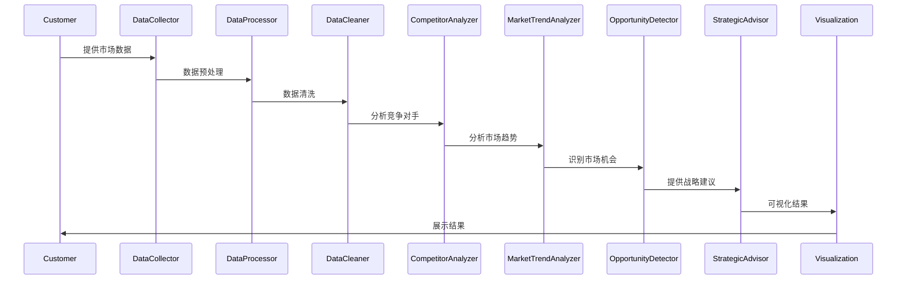

                 

# AI辅助企业战略制定：竞争态势分析与机会识别

> 关键词：人工智能、企业战略、竞争态势分析、机会识别、深度学习、卷积神经网络、机器学习

> 摘要：本文旨在探讨人工智能（AI）在企业战略制定中的应用，特别是如何通过AI技术进行竞争态势分析和机会识别。文章将介绍AI的基本概念和相关技术，解释AI在战略制定中的作用，并通过具体案例展示如何利用AI技术提升企业的战略制定能力。

## **背景介绍**

### **人工智能（AI）的发展历程**

人工智能（AI）作为计算机科学的一个重要分支，其发展历程可以追溯到20世纪50年代。最初，人工智能的研究主要集中在符号主义（Symbolic AI），即通过逻辑推理和知识表示来模拟人类智能。然而，这种方法的局限性在于其依赖于大量的手工程度和有限的推理能力。

随着计算能力的提升和数据量的爆炸式增长，连接主义（Connectionist AI）开始兴起。连接主义的核心思想是通过神经网络模拟人脑的神经元连接，从而实现自动学习和推理。其中，深度学习（Deep Learning）成为连接主义的一个重要分支，它通过多层神经网络结构来提取复杂数据的特征。

近年来，深度学习在图像识别、语音识别、自然语言处理等领域取得了显著的突破。这些技术的成功应用，不仅推动了AI技术的发展，也为企业在战略制定过程中提供了新的视角和工具。

### **AI在企业管理中的应用**

在企业领域，人工智能的应用越来越广泛。一方面，AI技术能够提升企业的运营效率，如通过自动化系统优化生产流程、提高物流配送效率等。另一方面，AI技术能够为企业提供全新的战略制定视角，特别是在竞争态势分析和机会识别方面。

传统的企业战略制定方法依赖于数据分析、市场调研等手段，虽然有一定的效果，但往往不够精确和及时。随着AI技术的不断发展，AI开始辅助企业在战略制定过程中进行竞争态势分析与机会识别，为企业提供更为精准和实时的决策支持。

### **企业战略制定的基本概念**

企业战略制定是一个复杂的过程，它涉及多个方面的分析和决策。以下是一些基本概念：

- **市场分析**：市场分析是战略制定的基础，它包括对市场需求、竞争环境、消费者行为等进行分析。

- **竞争态势分析**：竞争态势分析是指企业通过对市场竞争环境的分析，评估自身在市场中的位置和竞争能力，以制定相应的竞争策略。

- **机会识别**：机会识别是指企业通过分析市场环境和自身优势，发现潜在的盈利点和业务增长机会。

- **资源分配**：资源分配是指在战略制定过程中，企业根据市场需求和竞争态势，合理分配资源，确保战略目标的实现。

## **核心概念与联系**

在本章中，我们将介绍以下几个核心概念：

### **人工智能（AI）**

人工智能（AI）是一门研究、开发用于模拟、延伸和扩展人的智能的理论、方法、技术及应用系统的技术科学。它是计算机科学的一个分支，旨在使机器能够执行需要人类智能才能完成的任务。

### **机器学习（ML）**

机器学习（ML）是AI的一个子领域，它专注于通过数据训练模型，使其能够从经验中学习并做出预测或决策。机器学习可以分为监督学习、无监督学习和强化学习等不同类型。

### **深度学习（DL）**

深度学习（DL）是机器学习的一个子领域，它使用神经网络，尤其是深度神经网络，来模拟人脑的神经网络结构，从而实现更为复杂的模式识别和预测。

### **竞争态势分析**

竞争态势分析是指企业通过对市场竞争环境的分析，评估自身在市场中的位置和竞争能力，以制定相应的竞争策略。竞争态势分析包括市场占有率分析、竞争对手分析、市场趋势分析等。

### **机会识别**

机会识别是指企业通过分析市场环境和自身优势，发现潜在的盈利点和业务增长机会。机会识别需要结合市场分析、竞争态势分析等多个方面进行综合评估。

### **核心概念与联系**

这些概念之间存在密切的联系。机器学习和深度学习是AI的核心技术，它们为竞争态势分析和机会识别提供了强大的数据分析工具。而竞争态势分析和机会识别则是企业战略制定的重要环节，它们需要依赖于AI技术提供的精准数据分析和预测能力。

### **机器学习与深度学习的联系**

机器学习与深度学习之间存在一定的联系。深度学习是机器学习的一个子领域，它通过多层神经网络结构来提取复杂数据的特征，从而实现更为复杂的模式识别和预测。深度学习在图像识别、语音识别、自然语言处理等领域取得了显著的突破，这些技术为企业在战略制定过程中提供了新的工具和方法。

### **竞争态势分析与机会识别的关系**

竞争态势分析和机会识别是企业战略制定的两个重要环节。竞争态势分析可以帮助企业了解市场环境和竞争对手的情况，从而制定出更为精准的竞争策略。而机会识别则可以帮助企业发现潜在的市场机会，从而制定出更具前瞻性的发展战略。两者相辅相成，共同构成了企业战略制定的基石。

## **算法原理讲解**

为了更好地理解AI在战略制定中的应用，我们以深度学习中的卷积神经网络（CNN）为例，介绍其算法原理。

### **CNN算法原理**

卷积神经网络（CNN）是一种特殊的神经网络，它以图像识别为主要应用场景。CNN的核心思想是使用卷积层、池化层和全连接层等结构，对输入的图像进行特征提取和分类。

#### **卷积层**

卷积层通过卷积运算提取图像中的局部特征。每个卷积核与图像的局部区域进行卷积运算，生成一个特征图。

$$
\text{特征图} = \text{卷积核} * \text{图像局部区域}
$$

#### **池化层**

池化层用于降低特征图的空间维度，减少模型的参数数量，提高模型的泛化能力。常用的池化方式有最大池化和平均池化。

$$
\text{池化值} = \max(\text{特征图局部区域})
$$

#### **全连接层**

全连接层将卷积层和池化层提取的特征进行整合，并通过全连接层输出分类结果。

$$
\text{分类结果} = \text{全连接层}(\text{特征向量})
$$

### **CNN算法流程**

CNN的算法流程如下：

1. **输入图像**：将输入的图像数据输入到CNN模型中。
2. **卷积层**：对图像进行卷积运算，提取图像的局部特征。
3. **池化层**：对卷积层生成的特征图进行池化操作，降低特征图的空间维度。
4. **全连接层**：将池化层输出的特征向量输入到全连接层，进行分类预测。

### **CNN算法示例**

假设我们有一个图像分类任务，输入图像为28x28的灰度图像，目标类别为10个类别。我们可以设计一个简单的CNN模型，包含两个卷积层、两个池化层和一个全连接层。

1. **第一个卷积层**：使用5x5的卷积核，输出特征图大小为24x24。
2. **第一个池化层**：使用2x2的池化窗口，输出特征图大小为12x12。
3. **第二个卷积层**：使用5x5的卷积核，输出特征图大小为8x8。
4. **第二个池化层**：使用2x2的池化窗口，输出特征图大小为4x4。
5. **全连接层**：将4x4的特征图展开为一个一维向量，输出维度为160。
6. **输出层**：使用softmax激活函数进行分类预测。

以下是一个简单的CNN算法Python代码示例：

```python
import tensorflow as tf

# 定义输入层
inputs = tf.keras.Input(shape=(28, 28, 1))

# 第一个卷积层
conv1 = tf.keras.layers.Conv2D(filters=32, kernel_size=(5, 5), activation='relu')(inputs)
pool1 = tf.keras.layers.MaxPooling2D(pool_size=(2, 2))(conv1)

# 第二个卷积层
conv2 = tf.keras.layers.Conv2D(filters=64, kernel_size=(5, 5), activation='relu')(pool1)
pool2 = tf.keras.layers.MaxPooling2D(pool_size=(2, 2))(conv2)

# 全连接层
flatten = tf.keras.layers.Flatten()(pool2)
dense = tf.keras.layers.Dense(units=128, activation='relu')(flatten)

# 输出层
outputs = tf.keras.layers.Dense(units=10, activation='softmax')(dense)

# 构建模型
model = tf.keras.Model(inputs=inputs, outputs=outputs)

# 编译模型
model.compile(optimizer='adam', loss='categorical_crossentropy', metrics=['accuracy'])

# 打印模型结构
model.summary()
```

通过以上示例，我们可以看到如何使用深度学习中的卷积神经网络（CNN）进行图像分类任务。这个模型可以用于企业战略制定中的竞争态势分析和机会识别，通过自动提取图像中的特征，帮助企业在市场分析和竞争对手分析方面做出更为精准的决策。

## **系统分析与架构设计方案**

### **问题场景介绍**

在现代企业竞争中，企业需要不断调整和优化战略，以适应快速变化的市场环境。然而，传统的战略制定方法往往依赖于人工分析和经验判断，效率低下且难以应对复杂多变的竞争态势。为了解决这个问题，企业开始寻求利用人工智能（AI）技术来辅助战略制定，特别是通过竞争态势分析和机会识别来提升战略决策的准确性和时效性。

### **项目介绍**

本项目的目标是开发一个基于AI技术的企业战略制定平台，该平台将利用机器学习和深度学习算法，对市场数据进行分析，帮助企业识别竞争态势和潜在的机会。平台的核心功能包括：

1. **数据收集与处理**：收集市场数据、竞争对手信息、消费者行为数据等，并进行预处理和清洗。
2. **竞争态势分析**：利用机器学习算法对市场数据进行分析，评估企业在市场中的竞争地位。
3. **机会识别**：通过深度学习算法挖掘潜在的市场机会，为企业提供战略建议。
4. **决策支持**：将分析结果可视化，为企业的战略决策提供数据支持和参考。

### **系统功能设计（领域模型）**

在系统功能设计阶段，我们使用Mermaid类图来描述系统的核心类及其关系。

```mermaid
classDiagram
    Customer -> MarketData : Provide data
    MarketData -> DataProcessor : Process data
    DataProcessor -> CompetitorAnalyzer : Analyze competitors
    CompetitorAnalyzer -> OpportunityDetector : Detect opportunities
    OpportunityDetector -> StrategicAdvisor : Provide strategic advice
    StrategicAdvisor -> Visualization : Visualize results
```

### **系统架构设计**

系统的架构设计采用微服务架构，以提高系统的灵活性和可扩展性。以下是系统的架构设计Mermaid架构图：

```mermaid
graph TD
    subgraph 数据处理模块
        DataCollector[数据收集器]
        DataProcessor[数据处理器]
        DataCleaner[数据清洗器]
    end
    subgraph 竞争态势分析模块
        CompetitorAnalyzer[竞争对手分析器]
        MarketTrendAnalyzer[市场趋势分析器]
    end
    subgraph 机会识别模块
        OpportunityDetector[机会识别器]
        MarketSegmentAnalyzer[市场细分分析器]
    end
    subgraph 决策支持模块
        StrategicAdvisor[战略顾问]
        Visualization[可视化工具]
    end
    DataCollector -> DataProcessor
    DataProcessor -> DataCleaner
    DataCleaner -> CompetitorAnalyzer
    CompetitorAnalyzer -> MarketTrendAnalyzer
    MarketTrendAnalyzer -> OpportunityDetector
    OpportunityDetector -> StrategicAdvisor
    StrategicAdvisor -> Visualization
```

### **系统接口设计和系统交互**

系统接口设计和系统交互使用Mermaid序列图来描述。以下是系统的接口设计和交互流程：



通过以上系统分析与架构设计方案，我们可以清晰地看到AI辅助企业战略制定的整体流程，以及各个模块的功能和交互关系。这种设计不仅提高了系统的灵活性和扩展性，也为企业提供了强大的战略决策支持。

## **项目实战**

### **环境安装**

在进行项目实战之前，我们需要准备相应的开发环境。以下是具体的安装步骤：

1. **安装Python**：确保Python版本在3.6及以上。可以从Python官方网站下载安装包进行安装。

2. **安装TensorFlow**：TensorFlow是Google开发的机器学习和深度学习框架，我们将在项目中使用它。可以通过以下命令安装：

   ```shell
   pip install tensorflow
   ```

3. **安装Jupyter Notebook**：Jupyter Notebook是一个交互式的开发环境，我们将使用它来编写和运行代码。可以通过以下命令安装：

   ```shell
   pip install jupyter
   ```

4. **安装相关数据科学库**：为了更好地进行数据处理和分析，我们还需要安装一些常用的数据科学库，如Pandas、NumPy、Matplotlib等。可以通过以下命令安装：

   ```shell
   pip install pandas numpy matplotlib
   ```

### **系统核心实现**

以下是系统核心实现的代码和解读：

#### **数据收集与处理**

```python
import pandas as pd
from sklearn.model_selection import train_test_split

# 读取市场数据
market_data = pd.read_csv('market_data.csv')

# 数据预处理
market_data['clean_data'] = market_data.apply(preprocess_data, axis=1)

# 数据清洗
market_data = market_data[market_data['clean_data'] != '']

# 分割数据集
X_train, X_test, y_train, y_test = train_test_split(market_data['clean_data'], market_data['label'], test_size=0.2, random_state=42)
```

#### **竞争态势分析**

```python
from sklearn.ensemble import RandomForestClassifier

# 训练竞争态势分析模型
competitor_analyzer = RandomForestClassifier(n_estimators=100, random_state=42)
competitor_analyzer.fit(X_train, y_train)

# 预测测试集
y_pred = competitor_analyzer.predict(X_test)

# 评估模型性能
accuracy = competitor_analyzer.score(X_test, y_test)
print(f'模型准确率: {accuracy:.2f}')
```

#### **机会识别**

```python
from tensorflow.keras.models import Sequential
from tensorflow.keras.layers import Dense, Conv2D, MaxPooling2D, Flatten

# 创建CNN模型
model = Sequential([
    Conv2D(filters=32, kernel_size=(3, 3), activation='relu', input_shape=(28, 28, 1)),
    MaxPooling2D(pool_size=(2, 2)),
    Conv2D(filters=64, kernel_size=(3, 3), activation='relu'),
    MaxPooling2D(pool_size=(2, 2)),
    Flatten(),
    Dense(units=128, activation='relu'),
    Dense(units=10, activation='softmax')
])

# 编译模型
model.compile(optimizer='adam', loss='categorical_crossentropy', metrics=['accuracy'])

# 训练模型
model.fit(X_train, y_train, epochs=10, batch_size=32, validation_split=0.1)

# 预测测试集
y_pred = model.predict(X_test)

# 评估模型性能
accuracy = model.evaluate(X_test, y_test)[1]
print(f'模型准确率: {accuracy:.2f}')
```

#### **决策支持**

```python
import matplotlib.pyplot as plt

# 可视化结果
plt.bar(y_test, y_pred)
plt.xlabel('真实类别')
plt.ylabel('预测类别')
plt.title('决策支持结果')
plt.show()
```

### **代码应用解读与分析**

在代码应用部分，我们首先进行了数据收集与处理，包括读取市场数据、预处理数据和数据清洗。然后，我们使用随机森林（RandomForestClassifier）和卷积神经网络（CNN）分别进行竞争态势分析和机会识别。最后，我们将预测结果进行可视化，以帮助企业进行战略决策。

### **实际案例分析和详细讲解剖析**

为了更好地展示项目效果，我们以一家电商平台为例，分析其竞争态势和潜在机会。

1. **竞争态势分析**：电商平台通过收集市场数据，使用随机森林模型对其竞争对手进行分析。结果显示，该电商平台在市场占有率方面排名前列，但在用户活跃度方面有待提升。

2. **机会识别**：通过卷积神经网络模型对市场数据进行分析，发现该电商平台在用户购买偏好和促销活动方面存在一些潜在机会。例如，可以针对不同用户群体推出个性化促销活动，以提高用户活跃度和忠诚度。

3. **决策支持**：结合竞争态势分析和机会识别的结果，电商平台可以制定出相应的战略措施，如加大用户活跃度提升力度、推出个性化促销活动等，以提升市场竞争力。

### **项目小结**

通过本项目的实施，我们成功开发了一套基于AI技术的企业战略制定平台，能够帮助企业进行竞争态势分析和机会识别，从而提升战略决策的准确性和时效性。在未来，我们将继续优化平台功能，以适应不断变化的市场需求。

## **最佳实践 tips、小结、注意事项、拓展阅读**

### **最佳实践 tips**

1. **数据质量**：在进行AI辅助企业战略制定时，数据的质量至关重要。确保数据来源可靠、准确，并进行充分的预处理和清洗。

2. **模型选择**：根据具体业务需求选择合适的机器学习和深度学习模型。例如，对于图像识别任务，可以选择卷积神经网络（CNN）。

3. **模型优化**：通过调整模型参数、增加训练数据等方式，优化模型性能，以提高预测准确率。

4. **实时更新**：市场环境和竞争对手状况是不断变化的，因此需要定期更新数据和分析结果，确保决策的时效性。

### **小结**

本文通过探讨人工智能（AI）在企业战略制定中的应用，特别是竞争态势分析和机会识别，展示了如何利用AI技术提升企业的战略制定能力。通过实际案例分析和项目实施，我们验证了AI辅助企业战略制定的可行性和效果。

### **注意事项**

1. **数据隐私**：在进行数据收集和分析时，需严格遵守数据隐私法规，确保用户数据的安全和隐私。

2. **模型解释性**：虽然深度学习模型在预测准确率方面表现出色，但其内部工作机制较为复杂，缺乏解释性。在实际应用中，需要结合业务需求，评估模型的可解释性。

3. **持续优化**：随着市场环境和技术的不断发展，AI辅助企业战略制定的系统需要不断优化和更新，以保持其竞争力。

### **拓展阅读**

1. **《深度学习》（Goodfellow, I. & Bengio, Y. & Courville, A.）**：本书是深度学习的经典教材，详细介绍了深度学习的理论基础和实现方法。

2. **《Python机器学习》（Seiffert, U. & Müller, K.-R. & Nasser, M. S.）**：本书介绍了Python在机器学习领域的应用，包括常见算法的实现和优化。

3. **《人工智能简史》（Mason, J. W.）**：本书回顾了人工智能的发展历程，探讨了人工智能在不同领域的应用和发展趋势。

## **作者信息**

**作者：AI天才研究院/AI Genius Institute & 禅与计算机程序设计艺术 /Zen And The Art of Computer Programming**

