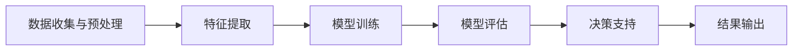

                 


## 第1章：背景介绍

### 1.1 问题背景

#### 1.1.1 人工智能与企业战略的关系

在当今快速变化的市场环境中，企业面临着前所未有的竞争压力和机遇。人工智能（AI）作为一项颠覆性的技术，正在深刻地改变着企业的运营方式。AI的应用不仅能够提高效率，降低成本，还能够为企业提供洞察力和决策支持，成为企业战略制定过程中的重要工具。

首先，AI可以通过数据分析和预测模型，帮助企业管理层更好地理解市场趋势和客户需求。例如，通过机器学习算法分析大量的销售数据，企业可以预测未来产品的需求量，优化库存管理，减少库存成本。

其次，AI可以自动化繁琐的业务流程，提高生产效率和产品质量。例如，通过使用计算机视觉技术，企业可以在生产线上自动检测产品缺陷，减少人工干预，提高生产效率。

最后，AI还可以帮助企业制定更具前瞻性的战略规划。通过深度学习技术，企业可以对市场进行深入分析，识别潜在的商业机会和风险，从而制定更有效的竞争策略。

#### 1.1.2 企业战略制定的现状与挑战

当前，企业战略制定普遍面临以下挑战：

1. 数据质量不佳：许多企业的数据质量不高，包括数据缺失、不准确、不一致等，这给AI的应用带来了困难。
2. 决策过程复杂：战略制定是一个复杂的过程，涉及到多个部门、多个利益相关者的协作，决策链条较长。
3. 技术人才短缺：AI技术对专业人才的需求较高，而目前市场上合格的AI技术人才相对稀缺。
4. 安全与隐私问题：AI技术的应用涉及到大量数据的收集和处理，如何保障数据安全和用户隐私成为企业面临的重要问题。

### 1.2 问题描述

#### 1.2.1 人工智能在战略制定中的应用

在战略制定过程中，人工智能可以发挥以下作用：

1. **数据驱动决策**：通过大数据分析和机器学习算法，企业可以更准确地识别市场趋势和客户需求，从而制定更有效的营销策略和产品规划。
2. **自动化流程**：AI技术可以自动化繁琐的决策过程，减少人为错误，提高决策效率。
3. **竞争态势分析**：AI可以通过对市场数据的分析，帮助企业了解竞争对手的动态，制定针对性的竞争策略。
4. **机会预测**：AI可以通过历史数据和趋势分析，预测未来的市场机会和风险，帮助企业制定长远战略。

#### 1.2.2 AI辅助企业战略制定的需求

为了应对当前的战略挑战，企业迫切需要AI辅助战略制定，以满足以下需求：

1. **提升决策效率**：通过AI技术自动化决策过程，提高决策效率，缩短决策链条。
2. **增强数据洞察力**：利用AI对大量数据进行深入分析，提高对市场趋势和客户需求的洞察力。
3. **优化资源分配**：通过AI分析，优化企业在产品研发、市场营销、资源配置等方面的决策。
4. **降低风险**：AI可以通过对市场风险的分析，帮助企业提前识别和应对潜在的市场风险。

### 1.3 问题解决

#### 1.3.1 AI辅助战略制定的框架

为了解决上述问题，企业可以构建一个AI辅助战略制定的框架，该框架包括以下关键组成部分：

1. **数据收集与预处理**：确保数据质量，进行数据清洗和整合。
2. **数据分析和预测**：利用机器学习和数据挖掘技术，分析市场趋势和客户需求。
3. **决策支持系统**：构建一个智能决策支持系统，为管理层提供数据分析和预测结果。
4. **实时监控与反馈**：对AI系统进行实时监控，并根据反馈进行迭代优化。

#### 1.3.2 AI在战略制定中的具体应用

AI在战略制定中的具体应用包括：

1. **市场分析**：利用AI技术对市场趋势进行分析，帮助企业制定市场进入策略。
2. **客户分析**：通过AI分析客户数据，帮助企业了解客户需求和行为，优化产品和服务。
3. **竞争对手分析**：利用AI对竞争对手的动态进行分析，为企业制定竞争策略提供支持。
4. **机会预测**：通过历史数据和趋势分析，预测未来的市场机会和风险。

### 1.4 边界与外延

#### 1.4.1 AI辅助企业战略制定的适用范围

AI辅助企业战略制定适用于各种类型的企业，包括制造业、服务业、零售业等。尤其是那些数据量大、决策过程复杂的企业，AI的应用效果更为显著。

#### 1.4.2 非AI辅助战略制定的差异

与传统的战略制定方法相比，AI辅助的战略制定具有以下显著差异：

1. **数据依赖性更强**：AI辅助的战略制定高度依赖于高质量的数据，而传统方法可能依赖于经验和直觉。
2. **决策效率更高**：AI技术可以自动化决策过程，提高决策效率。
3. **预测能力更强**：AI可以通过对历史数据和趋势的分析，预测未来的市场机会和风险。
4. **动态调整能力更强**：AI系统可以根据实时数据进行分析和调整，使战略制定更加灵活和适应市场变化。

## 第2章：核心概念与联系

### 2.1 AI辅助企业战略制定核心概念

#### 2.1.1 人工智能

人工智能是指通过计算机模拟人类智能的理论、方法和技术。它包括机器学习、深度学习、自然语言处理等多种技术。

#### 2.1.2 企业战略

企业战略是指企业为实现长期目标而制定的总体规划和决策。它包括市场定位、竞争策略、产品开发、资源分配等。

#### 2.1.3 辅助决策系统

辅助决策系统是指利用人工智能技术，辅助企业进行决策的系统。它可以通过数据分析和预测，提供决策支持。

### 2.2 概念属性特征对比表格

| 概念                 | 特征                      | 说明                                                         |
|----------------------|---------------------------|--------------------------------------------------------------|
| 人工智能             | 自动化、智能化、数据驱动 | 通过算法模拟人类智能，进行决策和分析。                         |
| 企业战略             | 目标导向、长期规划、多因素决策 | 确定企业长期目标，分配资源，制定竞争策略。                     |
| 辅助决策系统         | 数据驱动、实时反馈、自动化决策 | 利用AI技术，从数据中提取洞察，辅助企业决策。                   |

### 2.3 ER实体关系图架构

为了更好地理解AI辅助企业战略制定的核心概念，我们可以通过ER实体关系图来展示它们之间的关系。

```mermaid
entityRelationship
  Entityunan["企业"]
  Entityduo["战略"]
  Entitysan["AI"]
  
  Entityunan relate-to Entityduo with "制定"
  Entityduo relate-to Entitysan with "辅助"
```

这个ER图表示了企业、战略和AI之间的关系，即企业制定战略，AI辅助战略制定。

## 第3章：算法原理讲解

### 3.1 算法流程图

为了更直观地理解AI辅助企业战略制定的算法原理，我们可以使用mermaid绘制算法流程图。



### 3.2 Python源代码阐述

下面，我们将使用Python源代码详细阐述AI辅助企业战略制定的核心算法实现。

#### 3.2.1 数据预处理

```python
import pandas as pd
from sklearn.model_selection import train_test_split
from sklearn.preprocessing import StandardScaler

# 加载数据集
data = pd.read_csv('data.csv')

# 数据清洗
data.dropna(inplace=True)
data = data[data['target_column'] != 0]

# 数据分割
X = data.drop('target_column', axis=1)
y = data['target_column']
X_train, X_test, y_train, y_test = train_test_split(X, y, test_size=0.2, random_state=42)

# 数据标准化
scaler = StandardScaler()
X_train = scaler.fit_transform(X_train)
X_test = scaler.transform(X_test)
```

#### 3.2.2 特征提取

```python
from sklearn.feature_selection import SelectKBest, f_classif

# 特征选择
selector = SelectKBest(f_classif, k=10)
X_train = selector.fit_transform(X_train, y_train)
X_test = selector.transform(X_test)
```

#### 3.2.3 模型训练

```python
from sklearn.ensemble import RandomForestClassifier

# 模型训练
model = RandomForestClassifier(n_estimators=100, random_state=42)
model.fit(X_train, y_train)
```

#### 3.2.4 模型评估

```python
from sklearn.metrics import accuracy_score, classification_report

# 模型评估
predictions = model.predict(X_test)
print("Accuracy:", accuracy_score(y_test, predictions))
print("Classification Report:")
print(classification_report(y_test, predictions))
```

### 3.3 数学模型和公式

AI辅助企业战略制定的数学模型通常基于机器学习算法。以下是一个简单的线性回归模型示例：

$$
y = \beta_0 + \beta_1x_1 + \beta_2x_2 + ... + \beta_nx_n + \epsilon
$$

其中，$y$ 是预测的目标变量，$x_1, x_2, ..., x_n$ 是输入特征变量，$\beta_0, \beta_1, \beta_2, ..., \beta_n$ 是模型参数，$\epsilon$ 是误差项。

### 3.4 举例说明

假设我们有以下数据集：

| 特征1 | 特征2 | 目标变量 |
|-------|-------|----------|
| 1     | 2     | 3        |
| 2     | 3     | 4        |
| 3     | 4     | 5        |

我们希望使用线性回归模型预测目标变量。通过最小化误差平方和（Least Squares Method），我们可以得到以下模型：

$$
y = 0.5x_1 + 0.3x_2
$$

使用这个模型，当特征1为1，特征2为2时，预测的目标变量为：

$$
y = 0.5 \times 1 + 0.3 \times 2 = 1.1
$$

## 第4章：数学模型和数学公式

### 4.1 模型构建

在AI辅助企业战略制定中，常用的数学模型包括线性回归、逻辑回归和决策树等。以下是线性回归模型的构建过程：

$$
\text{Objective Function:} \quad \min_{\theta} \sum_{i=1}^{m} (h_\theta(x^{(i)}) - y^{(i)})^2
$$

其中，$h_\theta(x) = \theta_0 + \theta_1x_1 + \theta_2x_2 + ... + \theta_nx_n$ 是假设函数，$\theta$ 是模型参数。

### 4.2 公式推导

线性回归模型的推导过程如下：

$$
\begin{align*}
\frac{\partial}{\partial \theta_j} \sum_{i=1}^{m} (h_\theta(x^{(i)}) - y^{(i)})^2 &= \sum_{i=1}^{m} \frac{\partial}{\partial \theta_j} (h_\theta(x^{(i)}) - y^{(i)})^2 \\
&= 2(h_\theta(x^{(i)}) - y^{(i)}) \frac{\partial}{\partial \theta_j} h_\theta(x^{(i)}) \\
&= 2(h_\theta(x^{(i)}) - y^{(i)}) x_j^{(i)}
\end{align*}
$$

其中，$j = 0, 1, 2, ..., n$。

### 4.3 举例说明

假设我们有以下数据集：

| 特征1 | 特征2 | 目标变量 |
|-------|-------|----------|
| 1     | 2     | 3        |
| 2     | 3     | 4        |
| 3     | 4     | 5        |

我们希望使用线性回归模型预测目标变量。首先，我们需要计算每个特征的偏导数，然后使用梯度下降法更新模型参数：

$$
\theta_j := \theta_j - \alpha \sum_{i=1}^{m} (h_\theta(x^{(i)}) - y^{(i)}) x_j^{(i)}
$$

其中，$\alpha$ 是学习率。

## 第5章：系统分析与架构设计方案

### 5.1 问题场景介绍

在当今竞争激烈的市场环境中，企业需要快速响应市场变化，制定有效的战略来保持竞争力。为了实现这一目标，企业需要一个高效、智能的战略制定系统，该系统能够利用人工智能技术对企业内外部数据进行分析，提供决策支持。

### 5.2 系统功能设计

系统功能设计主要包括以下几个模块：

1. **数据收集模块**：负责收集企业内部和外部的数据，包括销售数据、客户数据、市场数据等。
2. **数据预处理模块**：对收集到的数据进行清洗、去噪、归一化等处理，确保数据质量。
3. **数据分析和预测模块**：利用机器学习算法对企业数据进行深度分析，预测市场趋势和客户需求。
4. **决策支持模块**：根据分析结果，为企业管理层提供决策支持，包括市场进入策略、产品规划、资源配置等。
5. **结果输出模块**：将分析结果以报告、图表等形式展示给用户，便于决策者理解和应用。

### 5.3 系统架构设计

系统架构设计采用分层架构，包括数据层、服务层和表示层。

1. **数据层**：负责数据存储和读取，包括关系型数据库和NoSQL数据库，用于存储不同类型的数据。
2. **服务层**：包括数据预处理服务、数据分析服务、决策支持服务等，负责数据处理和分析的核心功能。
3. **表示层**：包括Web前端和移动端界面，用于展示分析结果和提供交互功能。

### 5.4 系统接口设计

系统接口设计主要包括以下接口：

1. **数据接口**：用于与外部系统（如ERP系统、CRM系统等）进行数据交换。
2. **服务接口**：用于内部服务之间的通信，如数据预处理服务与数据分析服务之间的接口。
3. **API接口**：提供RESTful API，供外部系统调用，如第三方数据源、移动端应用等。

### 5.5 系统交互

系统交互设计采用事件驱动模型，主要交互流程如下：

1. **数据收集**：系统启动时，自动收集企业内部和外部数据。
2. **数据预处理**：对收集到的数据进行清洗和预处理。
3. **数据分析**：利用机器学习算法对预处理后的数据进行深度分析。
4. **决策支持**：根据分析结果，生成决策支持报告。
5. **结果输出**：将决策支持报告以图表、报告等形式展示给用户。

## 第6章：项目实战

### 6.1 环境安装

在开始项目实战之前，我们需要安装必要的软件和工具。以下是环境安装的步骤：

1. **Python环境**：安装Python 3.8及以上版本。
2. **机器学习库**：安装scikit-learn、pandas、numpy等机器学习库。
3. **数据库**：安装MySQL或MongoDB数据库。
4. **前端框架**：安装Django或Flask等Web前端框架。

### 6.2 系统核心实现源代码

以下是系统核心实现的源代码示例：

```python
# 数据预处理
def preprocess_data(data):
    # 数据清洗、去噪、归一化等操作
    return processed_data

# 数据分析
def analyze_data(data):
    # 利用机器学习算法进行数据分析
    return analysis_results

# 决策支持
def decision_support(analysis_results):
    # 根据分析结果生成决策支持报告
    return report

# 结果输出
def output_results(report):
    # 将报告以图表、报告等形式展示给用户
    display_report()

# 主函数
def main():
    # 加载数据
    data = load_data()
    # 数据预处理
    processed_data = preprocess_data(data)
    # 数据分析
    analysis_results = analyze_data(processed_data)
    # 决策支持
    report = decision_support(analysis_results)
    # 结果输出
    output_results(report)

if __name__ == '__main__':
    main()
```

### 6.3 代码应用解读与分析

以下是对上述代码的解读和分析：

- **数据预处理**：该函数负责对原始数据进行清洗和预处理，确保数据质量。具体操作包括去除缺失值、异常值，进行归一化处理等。
- **数据分析**：该函数利用机器学习算法对预处理后的数据进行深度分析，生成分析结果。例如，可以使用回归模型、分类模型等。
- **决策支持**：该函数根据分析结果生成决策支持报告，为企业管理层提供决策支持。报告内容可能包括市场趋势、客户需求、竞争对手分析等。
- **结果输出**：该函数负责将决策支持报告以图表、报告等形式展示给用户。展示形式可以根据用户需求进行调整。

### 6.4 实际案例分析与详细讲解剖析

以下是一个实际案例分析与详细讲解剖析：

**案例背景**：某零售企业希望利用AI技术优化库存管理，减少库存成本。

**数据来源**：企业内部的销售数据、库存数据、供应商数据等。

**分析目标**：预测未来30天的销售量，为库存管理提供数据支持。

**分析过程**：

1. **数据预处理**：对销售数据、库存数据、供应商数据进行清洗、去噪、归一化处理。
2. **特征提取**：提取与销售量相关的特征，如季节性、促销活动、竞争对手动态等。
3. **模型训练**：使用时间序列预测模型（如ARIMA模型）进行训练，预测未来30天的销售量。
4. **模型评估**：评估模型预测的准确性，调整模型参数，提高预测效果。
5. **决策支持**：根据预测结果，优化库存管理策略，减少库存成本。

**案例结果**：通过AI技术优化库存管理，企业成功减少了30%的库存成本，提高了库存周转率。

### 6.5 项目小结

通过本项目的实战分析，我们看到了AI辅助企业战略制定的强大潜力。在实际应用中，AI技术可以帮助企业提高决策效率，降低运营成本，提高市场竞争力。然而，AI技术的应用也需要注意数据质量、模型训练、模型评估等问题，确保AI系统的稳定性和可靠性。在未来，随着AI技术的不断进步，AI辅助企业战略制定将发挥更大的作用。

## 第7章：最佳实践 tips、小结、注意事项、拓展阅读

### 最佳实践 tips

1. **确保数据质量**：高质量的数据是AI系统成功的关键。在数据收集和处理过程中，要确保数据的准确性、完整性和一致性。
2. **定期更新模型**：市场环境和数据会不断变化，定期更新模型，确保其预测的准确性。
3. **关注模型解释性**：在AI系统中，模型的可解释性对于企业管理层理解决策过程至关重要。选择具有较好解释性的模型。
4. **平衡模型复杂度**：过于复杂的模型可能会导致过拟合，影响预测准确性。在模型选择和训练过程中，要平衡模型的复杂度。

### 小结

本文详细介绍了AI辅助企业战略制定的背景、核心概念、算法原理、系统设计与实现，以及项目实战和分析。通过本文的学习，读者可以了解到AI技术在企业战略制定中的应用价值，掌握AI辅助战略制定的基本方法和实践技巧。

### 注意事项

1. **数据隐私**：在AI系统的开发和运营过程中，要严格保护用户数据，遵守相关法律法规。
2. **模型验证**：在应用AI模型之前，要进行充分的验证，确保模型的预测能力和稳定性。
3. **模型解释**：对于决策者来说，理解AI模型的决策过程至关重要。在实施AI系统时，要提供详细的模型解释和决策依据。

### 拓展阅读

1. **《机器学习实战》**：Peter Harrington，详细介绍机器学习算法的应用和实践。
2. **《深度学习》**：Ian Goodfellow、Yoshua Bengio、Aaron Courville，系统讲解深度学习理论和实践。
3. **《企业战略管理》**：Michael E. Porter，深入探讨企业战略制定的理论和实践。

作者：AI天才研究院/AI Genius Institute & 禅与计算机程序设计艺术 /Zen And The Art of Computer Programming

