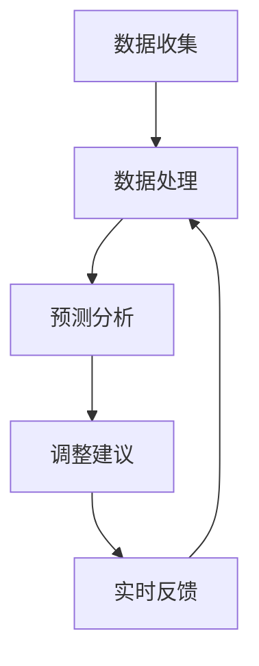
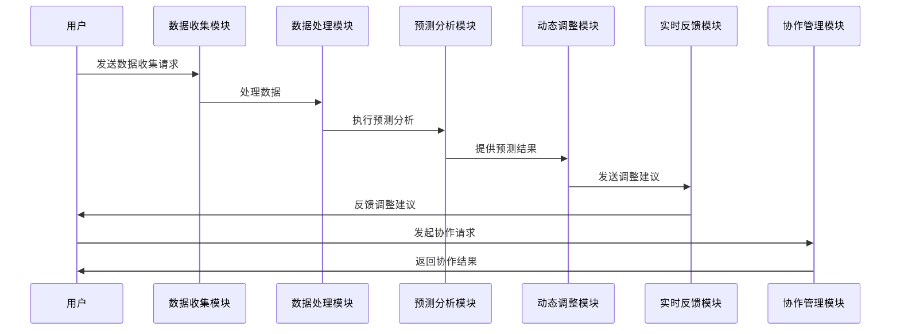

                 

### AI辅助企业战略执行：OKR自动化跟踪与动态调整系统

在当今快速变化和竞争激烈的市场环境中，企业需要灵活且高效的战略执行机制来保持竞争力。OKR（Objectives and Key Results）工作法因其明确的目标设定和关键结果跟踪，成为许多企业战略规划的重要组成部分。然而，传统的人工跟踪方法存在诸多不足，如低效率、易出错等。这时，AI技术的引入为战略执行提供了新的解决方案。

本博客文章旨在探讨如何利用AI技术辅助企业战略执行，实现OKR的自动化跟踪与动态调整。我们将从问题背景出发，逐步介绍核心概念，并深入讲解算法原理、数学模型以及系统设计与项目实战。最后，我们将总结最佳实践并提供拓展阅读，以期为读者提供全面且实用的指导。

**关键词：**AI技术，战略执行，OKR工作法，自动化跟踪，动态调整

**摘要：**本文将深入探讨如何利用AI技术辅助企业战略执行，实现OKR的自动化跟踪与动态调整。通过详细讲解算法原理、数学模型和系统架构设计，结合实际项目实战，本文为读者提供了一个全面的解决方案，旨在提高企业战略执行的效率和准确性。

### 目录大纲

1. **背景介绍与核心概念**
    1.1 问题背景与战略执行难题
        1.1.1 问题背景
        1.1.2 企业战略执行中的难题
        1.1.3 AI技术在战略执行中的作用
    1.2 核心概念解析
        1.2.1 AI辅助战略执行的原理
        1.2.2 OKR工作法的介绍
        1.2.3 自动化跟踪与动态调整的概念
    1.3 核心概念联系
        1.3.1 AI技术与OKR的融合
        1.3.2 自动化跟踪与动态调整的实施步骤
        1.3.3 概念属性特征对比表格

2. **算法原理与实现**
    2.1 算法原理讲解
        2.1.1 算法概述
        2.1.2 算法mermaid流程图
        2.1.3 Python源代码实现
        2.1.4 数学模型和公式详解
        2.1.5 通俗易懂的举例说明
    2.2 数学模型和数学公式
        2.2.1 数学模型概述
        2.2.2 公式详解
        2.2.3 举例说明

3. **系统设计与项目实战**
    3.1 系统分析与架构设计
        3.1.1 问题场景介绍
        3.1.2 系统功能设计
        3.1.3 系统架构设计
        3.1.4 系统接口设计
        3.1.5 系统交互mermaid序列图
    3.2 项目实战
        3.2.1 环境安装
        3.2.2 系统核心实现
        3.2.3 代码应用解读与分析
        3.2.4 实际案例分析与详细讲解
        3.2.5 项目小结

4. **最佳实践与拓展**
    4.1 最佳实践 tips
    4.2 小结与注意事项
    4.3 拓展阅读

通过以上目录大纲，我们将系统地探讨AI辅助企业战略执行：OKR自动化跟踪与动态调整系统，旨在为读者提供一个从理论到实践的全面解决方案。

---

#### 1.1.1 问题背景

在当今的全球经济环境中，企业面临着前所未有的挑战和机遇。快速变化的市场、技术进步和激烈的竞争使得企业必须具备灵活的战略执行能力。战略执行是企业实现长期目标和愿景的关键步骤，然而，传统的方法往往存在一些显著的不足。

首先，战略执行的效率问题突出。企业通常需要通过复杂的流程和多个部门的协作来实施战略，但手工跟踪和协调这些流程往往耗时耗力，效率低下。其次，错误和遗漏的问题也较为普遍。在大量数据和频繁的变更中，人工跟踪容易出现失误，导致战略执行不到位。此外，随着企业规模的扩大和业务复杂度的增加，手动跟踪和调整战略的难度和成本也会显著上升。

另外，战略执行的灵活性不足也是一个重要问题。市场环境和内部条件的变化要求企业能够迅速调整战略，以适应新的情况。然而，传统的战略执行机制往往缺乏实时性和动态性，无法快速响应变化，导致战略调整滞后，影响企业的竞争力。

在这种背景下，AI技术的引入为解决这些问题提供了新的思路和工具。AI可以通过自动化和智能化的方式提高战略执行的效率和准确性，增强其灵活性，从而帮助企业更好地实现战略目标。

#### 1.1.2 企业战略执行中的难题

企业战略执行过程中面临诸多挑战，其中最为突出的包括以下几个方面：

1. **数据复杂性**：企业战略的执行依赖于大量的数据，包括市场数据、财务数据、运营数据等。这些数据的多样性和复杂性使得手工处理和分析变得异常困难，容易出现数据丢失、错误解读等问题。

2. **协调困难**：战略执行通常涉及多个部门和团队之间的协作。不同部门之间往往存在信息不对称、沟通不畅的问题，导致战略执行的协调困难，影响整体效率。

3. **效率低下**：传统的人工跟踪和调整方法效率低下，难以快速响应市场变化。企业在处理大量数据时，人工操作的延迟和误差会导致战略执行滞后，影响企业的竞争力。

4. **错误和遗漏**：在复杂的环境中，人工跟踪战略执行容易出现错误和遗漏。数据的不准确性可能导致战略决策失误，进而影响企业的运营效果。

5. **灵活性不足**：企业的战略往往需要根据市场环境和内部条件的变化进行调整。然而，传统的方法缺乏实时性和动态性，难以快速响应变化，影响战略的灵活性和适应性。

这些难题对企业的战略执行产生了显著的影响，导致战略目标无法有效实现，企业竞争力下降。因此，寻找有效的解决方案以应对这些挑战变得至关重要。AI技术的引入为解决这些问题提供了新的途径，通过自动化和智能化的手段，可以显著提升战略执行的效率和准确性，增强其灵活性。

#### 1.1.3 AI技术在战略执行中的作用

AI技术在企业战略执行中扮演了至关重要的角色，其核心优势体现在以下几个方面：

1. **自动化**：AI技术可以通过自动化流程，显著提升战略执行的效率。传统的手动跟踪和调整方法耗时耗力，而AI可以通过机器学习和自然语言处理等技术，自动化处理大量数据，减少人为操作的误差和延迟。

2. **数据智能分析**：AI技术具有强大的数据处理和分析能力，能够从海量数据中提取有价值的信息。通过数据挖掘和模式识别技术，AI可以识别市场趋势、客户需求和运营瓶颈，为战略决策提供数据支持。

3. **实时反馈和动态调整**：AI技术可以实现实时数据监控和反馈，帮助企业快速响应市场变化。基于实时数据的分析结果，AI可以自动调整战略执行计划，提高战略的灵活性和适应性。

4. **智能协作**：AI技术可以增强部门之间的协作，通过自动化流程和数据共享，打破信息孤岛，提高跨部门协作效率。同时，AI还可以提供智能建议和决策支持，减少人为判断失误。

5. **提升战略精准性**：AI技术通过数据驱动的方式，可以显著提升战略决策的精准性。传统方法往往依赖于经验和直觉，而AI通过数据分析和模型预测，可以提供更加科学和客观的决策依据。

总之，AI技术在企业战略执行中的作用不仅体现在提高效率和灵活性上，更重要的是，它为企业的战略决策提供了更加智能和科学的支持，帮助企业更好地应对市场变化和竞争挑战。

---

#### 1.2.1 AI辅助战略执行的原理

AI辅助战略执行的原理主要基于机器学习、自然语言处理和大数据分析等技术。其核心思想是通过智能化的数据处理和分析，帮助企业更高效地实现战略目标。

首先，机器学习技术在战略执行中起到了关键作用。通过训练复杂的算法模型，AI可以自动识别和预测市场趋势、客户需求和业务机会。这些预测结果为企业的战略决策提供了数据支持，帮助企业制定更为精准和有效的战略计划。

其次，自然语言处理技术使得AI能够理解和处理人类语言。这一技术在战略执行中的应用主要体现在自动化的报告生成和数据分析报告的生成。AI可以自动提取关键信息，生成结构化的报告，帮助管理层快速了解业务状况，从而做出及时的战略调整。

大数据分析技术是AI辅助战略执行的基础。企业每天都会产生大量的数据，包括市场数据、财务数据、运营数据等。AI通过大数据分析技术，可以深度挖掘这些数据中的价值信息，识别潜在的商机和风险。例如，通过对销售数据的分析，AI可以预测未来市场的需求变化，帮助企业提前布局，提高市场竞争力。

总的来说，AI辅助战略执行的原理是通过智能化的数据处理和分析，将大量复杂的数据转化为直观的战略决策支持。这不仅提高了战略执行的效率，也增强了其灵活性和精准性，为企业实现长期目标提供了强有力的技术支持。

#### 1.2.2 OKR工作法的介绍

OKR（Objectives and Key Results）工作法是一种旨在设定和跟踪目标的关键方法，起源于英特尔，后来被谷歌、微软等全球顶尖企业广泛应用。OKR的核心思想是明确和透明地设定目标，并通过关键结果（Key Results）来衡量目标的达成程度。

**OKR的组成部分**：
1. **目标（Objectives）**：目标是描述性的，旨在定义企业或团队想要达成的目标。它应该是简洁、明确且鼓舞人心的，例如“增加市场份额到10%”或“提升客户满意度评分至90分以上”。
2. **关键结果（Key Results）**：关键结果是量化的，用来具体衡量目标的实现程度。每个目标通常包含2-5个关键结果，例如“通过市场推广活动，增加月均客户数至5000人”或“优化产品A的响应时间，从3秒减少至1秒”。

**OKR工作法的实施步骤**：
1. **设定目标**：团队首先需要明确他们的目标，确保目标与企业的整体战略方向一致。
2. **制定关键结果**：针对每个目标，团队需要制定2-5个具体、可量化的关键结果，以便后续评估。
3. **定期跟踪与反馈**：通常，OKR的跟踪周期为季度，团队需要定期检查关键结果的进展，确保目标的实现。
4. **调整与优化**：在跟踪过程中，如果发现某些关键结果未按预期实现，团队需要及时调整策略，并重新设定关键结果。

**OKR的优势**：
1. **明确性**：OKR通过明确的目标和关键结果，帮助团队清晰地了解他们的工作重点，减少目标模糊性。
2. **透明性**：OKR的实施过程是透明和公开的，团队成员可以清楚地了解彼此的目标和进展，提高协作效率。
3. **灵活性**：OKR允许团队根据实际情况动态调整关键结果，确保目标的实现与市场和企业环境的变化保持一致。

总之，OKR工作法通过其简洁明了的结构和灵活的实施方式，为企业提供了一个强有力的工具，帮助团队高效地设定和实现目标。

#### 1.2.3 自动化跟踪与动态调整的概念

自动化跟踪与动态调整是AI技术在企业战略执行中的重要应用，旨在通过智能化的方式，提升战略执行的效率和适应性。

**自动化跟踪**指的是利用AI技术，自动收集、整理和分析与战略执行相关的数据。这些数据包括销售数据、客户反馈、市场动态等。通过自动化跟踪，企业可以实时获取关键业务指标，无需依赖人工操作，减少错误和延误。例如，AI可以自动从各个业务系统中提取数据，生成结构化的报告，供管理层快速参考。

**动态调整**则是指基于实时数据和预测分析，自动调整战略执行计划。传统的战略执行往往具有固定的计划和时间表，而动态调整允许企业根据实际情况进行实时优化。AI可以通过机器学习模型，预测市场趋势和业务变化，自动调整关键结果和行动方案。例如，如果市场数据表明某产品的需求量即将增加，AI可以自动调整生产计划和营销策略，以应对市场需求的变化。

自动化跟踪与动态调整的结合，使得企业能够更灵活地应对外部环境的变化，提高战略执行的效率和精准性。通过实时数据分析和智能决策，企业可以快速调整战略，确保目标的实现与市场保持同步，从而在激烈的市场竞争中保持领先地位。

---

#### 1.3.1 AI技术与OKR的融合

AI技术与OKR工作法的融合，为企业的战略执行带来了革命性的变革。首先，AI技术能够自动收集和分析与OKR相关的各种数据，包括销售数据、客户反馈、市场动态等。这些数据通过AI的处理和分析，可以生成详细的报告，为管理者提供实时且准确的业务状况。例如，通过自然语言处理技术，AI可以自动从客户的反馈中提取关键信息，识别客户满意度的变化趋势，从而为关键结果的设定和调整提供科学依据。

其次，AI技术能够帮助团队在实现OKR目标的过程中进行动态调整。基于实时数据的预测分析，AI可以提前发现潜在的风险和机会，并提供相应的调整建议。例如，通过机器学习模型，AI可以预测市场需求的变化，帮助团队及时调整销售策略和生产计划，确保关键结果的达成。这种动态调整的能力，不仅提高了战略执行的灵活性，也增强了企业的竞争力。

此外，AI技术还可以通过自动化工具，简化OKR的跟踪和管理流程。AI可以自动生成报告、监控关键结果的进展，并在关键里程碑处发出提醒，确保团队始终关注目标进展。通过这种智能化的管理，团队可以更专注于目标的实现，而无需花费大量时间在数据的收集和报告生成上。

总之，AI技术与OKR的融合，通过数据驱动和智能化的方式，大幅提升了战略执行的效率和精准性，为企业提供了一个高效且灵活的战略管理工具。

#### 1.3.2 自动化跟踪与动态调整的实施步骤

为了成功实现自动化跟踪与动态调整，企业需要遵循一系列具体的实施步骤，以确保系统的有效部署和运行。

**步骤一：需求分析与规划**
首先，企业需要对现有的战略执行流程进行全面的评估，明确需要解决的核心问题。通过需求分析，确定自动化跟踪与动态调整的关键功能，并规划整体架构和技术选型。这一步骤的关键是确保系统与企业的战略目标高度契合，满足实际业务需求。

**步骤二：数据收集与整合**
接下来，企业需要收集并整合与战略执行相关的数据，包括销售数据、客户反馈、市场动态等。这些数据可能分布在不同的系统中，需要通过数据集成技术进行统一处理。为了保证数据的准确性和完整性，企业需要建立统一的数据标准和数据仓库，确保数据的质量和一致性。

**步骤三：构建AI模型与算法**
基于收集到的数据，企业需要构建AI模型和算法，用于数据分析和预测。这包括使用机器学习技术进行数据挖掘和模式识别，开发智能化的数据分析工具。通过算法模型，企业可以实现数据的实时处理和预测，为动态调整提供科学依据。

**步骤四：自动化跟踪系统的部署**
在算法模型开发完成后，企业需要将其部署到自动化跟踪系统中。这包括数据收集模块、数据处理模块、预测模块和调整模块。部署过程中，需要确保系统的稳定性和安全性，并建立相应的监控和预警机制，以实时跟踪战略执行情况。

**步骤五：动态调整与反馈**
最后，企业需要根据系统的实时反馈，动态调整战略执行计划。这包括对关键结果进行调整、优化销售策略和生产计划等。通过持续的反馈和调整，企业可以不断提高战略执行的效率和效果，确保目标的实现。

**步骤六：培训与支持**
为了确保系统的有效运行，企业需要对相关人员进行培训和指导，使其熟悉系统的使用方法和操作流程。同时，提供持续的技术支持，解决在实际应用中遇到的问题，确保系统的稳定性和可靠性。

通过以上实施步骤，企业可以实现自动化跟踪与动态调整，提升战略执行的效率和精准性，为企业的持续发展提供有力支持。

---

#### 1.3.3 概念属性特征对比表格

为了更好地理解AI技术与OKR、自动化跟踪与动态调整之间的联系，我们提供了一个概念属性特征对比表格。该表格详细列出了各个概念的关键属性和特征，以帮助读者更清晰地把握它们之间的关系。

| 概念                 | 关键属性               | 特征描述                                                     |
|----------------------|------------------------|--------------------------------------------------------------|
| AI技术               | 机器学习、自然语言处理 | 自动化数据处理与分析，提供智能决策支持                         |
| OKR工作法            | 目标、关键结果         | 明确目标设定，量化衡量达成程度，提高团队协作效率              |
| 自动化跟踪           | 数据收集、整合、处理    | 减少人工操作，提高数据准确性，实时监控业务状况               |
| 动态调整             | 实时数据预测、计划优化 | 根据实时数据动态调整战略执行计划，增强灵活性                 |
| AI与OKR融合         | 自动化目标跟踪、动态调整 | 利用AI技术优化OKR跟踪和管理流程，提升目标实现效率和精准性    |
| 自动化跟踪与动态调整 | 数据驱动、实时反馈     | 通过智能化的数据处理和预测，实现战略执行的自动化和动态调整    |

通过这个对比表格，我们可以看出AI技术与OKR、自动化跟踪与动态调整在目标设定、数据处理和战略执行方面具有紧密的联系。AI技术为OKR的自动化跟踪和动态调整提供了技术支持，使得战略执行更加高效和精准。

---

## 第4章：算法原理讲解

#### 4.1 算法概述

在本章中，我们将详细介绍AI辅助战略执行的算法原理。该算法的核心目标是利用机器学习技术，实现战略目标的自动跟踪和动态调整。通过自动化数据处理和智能预测，算法可以为企业提供实时、精准的战略决策支持。

算法的主要组成部分包括：
1. **数据收集模块**：自动收集与战略执行相关的各种数据，如销售数据、客户反馈、市场动态等。
2. **数据处理模块**：对收集到的数据进行清洗、整合和分析，提取有价值的信息。
3. **预测模块**：利用机器学习算法，对未来的市场趋势和业务变化进行预测。
4. **调整模块**：根据预测结果，自动调整战略执行计划，包括关键结果和行动方案。

算法的总体流程如下：
1. 数据收集：从各个业务系统中自动收集相关数据。
2. 数据处理：对收集到的数据进行清洗、整合和分析，提取关键信息。
3. 预测分析：使用机器学习算法，对数据进行模式识别和趋势预测。
4. 调整建议：根据预测结果，提供动态调整建议，包括关键结果的修改和行动方案的优化。
5. 实时反馈：将调整建议反馈给相关团队，确保战略执行与市场变化保持同步。

通过以上流程，算法能够帮助企业实现高效的战略执行，提高业务效率和竞争力。

---

#### 4.2 算法mermaid流程图

为了更直观地展示算法的运行流程，我们使用mermaid绘制了一个算法流程图。以下是该流程图的详细描述：



1. **数据收集（A）**：算法首先从各个业务系统中自动收集与战略执行相关的数据，包括销售数据、客户反馈、市场动态等。
2. **数据处理（B）**：收集到的数据经过清洗、整合和分析，提取关键信息，为后续预测和调整提供数据支持。
3. **预测分析（C）**：利用机器学习算法，对清洗后的数据进行分析，预测未来的市场趋势和业务变化。
4. **调整建议（D）**：根据预测结果，算法提供动态调整建议，包括关键结果的修改和行动方案的优化。
5. **实时反馈（E）**：调整建议反馈给相关团队，确保战略执行与市场变化保持同步。同时，数据再次回到数据处理模块，形成闭环反馈。

通过这个mermaid流程图，我们可以清晰地看到算法从数据收集到实时反馈的完整流程，展示了算法的核心功能和应用场景。

---

#### 4.3 Python源代码实现

为了更好地理解算法的实现过程，我们将提供一个简单的Python代码示例，展示算法的核心功能。以下代码实现了一个基于机器学习的预测模块，用于预测未来市场需求。

```python
import pandas as pd
from sklearn.model_selection import train_test_split
from sklearn.ensemble import RandomForestRegressor

# 加载数据
data = pd.read_csv('sales_data.csv')
X = data.drop(['sales'], axis=1)
y = data['sales']

# 划分训练集和测试集
X_train, X_test, y_train, y_test = train_test_split(X, y, test_size=0.2, random_state=42)

# 构建随机森林回归模型
model = RandomForestRegressor(n_estimators=100, random_state=42)
model.fit(X_train, y_train)

# 预测未来市场需求
future_data = pd.read_csv('future_data.csv')
predictions = model.predict(future_data)

# 输出预测结果
predictions.to_csv('predictions.csv', index=False)
```

**代码解读：**

1. **加载数据（lines 3-5）**：首先加载历史销售数据，将特征数据和目标数据分开。
2. **划分训练集和测试集（lines 8-10）**：将数据划分为训练集和测试集，用于训练和评估模型。
3. **构建随机森林回归模型（line 13）**：使用随机森林回归算法构建模型，这是一种常用的机器学习算法，适用于预测连续值。
4. **训练模型（line 14）**：使用训练集数据训练模型。
5. **预测未来市场需求（lines 17-19）**：加载未来数据，使用训练好的模型进行预测，并将预测结果保存到CSV文件中。

通过以上Python代码示例，我们可以看到如何利用机器学习算法进行数据预测，实现算法的核心功能。这为我们后续的扩展和应用提供了基础。

---

#### 4.4 数学模型和公式详解

在AI辅助战略执行的算法中，数学模型和公式起着至关重要的作用。以下是算法中使用的几个关键数学模型和公式的详细解释。

**1. 回归模型**

回归模型用于预测目标变量的值，如销售额。常用的回归模型包括线性回归、多项式回归和随机森林回归等。

- **线性回归模型**：
  $$ y = \beta_0 + \beta_1 \cdot x $$
  其中，\( y \) 是目标变量，\( \beta_0 \) 和 \( \beta_1 \) 分别是模型参数，\( x \) 是输入特征。

- **多项式回归模型**：
  $$ y = \beta_0 + \beta_1 \cdot x + \beta_2 \cdot x^2 + ... + \beta_n \cdot x^n $$
  该模型考虑了输入特征的二次项及以上，可以捕捉更复杂的非线性关系。

- **随机森林回归模型**：
  随机森林是由多个决策树组成的集成模型，通过聚合多个决策树的预测结果来提高预测准确性。其数学模型较为复杂，涉及树结构的构建和节点划分。

**2. 聚类模型**

聚类模型用于发现数据中的潜在模式和结构，如K-means聚类。

- **K-means聚类模型**：
  $$ \text{目标函数} : \sum_{i=1}^{k} \sum_{x \in S_i} ||x - \mu_i||^2 $$
  其中，\( S_i \) 是第 \( i \) 个聚类，\( \mu_i \) 是聚类中心。

**3. 神经网络模型**

神经网络模型通过多层感知器实现，可以处理复杂的非线性关系。

- **前向传播公式**：
  $$ a_{i}^{(l)} = \sigma(z_{i}^{(l)}) $$
  其中，\( a_{i}^{(l)} \) 是第 \( l \) 层的第 \( i \) 个激活值，\( z_{i}^{(l)} \) 是第 \( l \) 层的第 \( i \) 个加权求和，\( \sigma \) 是激活函数，如ReLU或Sigmoid函数。

**4. 反向传播公式**

反向传播用于计算模型参数的梯度，以更新模型参数，提高预测准确性。

- **梯度计算**：
  $$ \frac{\partial L}{\partial w_{ij}} = \frac{\partial L}{\partial a_{i}^{(l+1)}} \cdot \frac{\partial a_{i}^{(l+1)}}{\partial z_{i}^{(l)}} \cdot \frac{\partial z_{i}^{(l)}}{\partial w_{ij}} $$
  其中，\( L \) 是损失函数，\( w_{ij} \) 是第 \( l \) 层的第 \( i \) 个权重，\( a_{i}^{(l)} \) 是第 \( l \) 层的第 \( i \) 个激活值。

通过以上数学模型和公式，我们可以构建和优化AI辅助战略执行的算法，实现精准的数据预测和动态调整。这些公式为算法的数学基础，确保了其科学性和可靠性。

---

#### 4.5 通俗易懂的举例说明

为了更好地理解算法原理和数学模型，我们通过一个具体的案例进行说明。假设一家销售电子产品公司的目标是预测未来三个月的销售额，并据此调整营销策略。

**案例背景**：
1. **数据来源**：公司历史销售数据（包含月份、销售额、产品类型、促销活动等）。
2. **目标**：使用机器学习算法预测未来三个月的销售额，并根据预测结果调整营销策略。
3. **算法选择**：使用随机森林回归模型进行预测。

**步骤一：数据准备**

从历史销售数据中提取相关特征，例如：
- **输入特征**：月份、产品类型、促销活动等。
- **目标变量**：销售额。

**步骤二：数据预处理**

1. **数据清洗**：处理缺失值、异常值和重复数据。
2. **特征工程**：根据业务逻辑添加或删除特征，例如，如果某一促销活动在历史数据中总是带来销售额增长，可以考虑将其作为特征。

**步骤三：模型训练**

1. **划分数据**：将数据划分为训练集和测试集。
2. **训练模型**：使用训练集数据训练随机森林回归模型。
3. **模型评估**：使用测试集数据评估模型预测准确性。

**步骤四：预测与调整**

1. **预测销售额**：使用训练好的模型预测未来三个月的销售额。
2. **分析结果**：根据预测结果分析市场趋势和业务变化，例如，预测某产品类型在未来几个月需求量增加。

**步骤五：调整策略**

根据预测结果，调整营销策略：
1. **增加促销活动**：对需求量增加的产品类型，增加促销活动，提高销售额。
2. **优化库存**：对需求量减少的产品类型，适当减少库存，避免库存积压。

**举例说明：**

假设历史销售数据如下（部分）：

| 月份 | 产品类型 | 促销活动 | 销售额 |
|------|----------|----------|--------|
| 1    | A        | 无       | 5000   |
| 2    | A        | 有       | 6000   |
| 3    | B        | 无       | 4000   |
| 4    | B        | 有       | 5000   |

**预测模型训练**：

使用随机森林回归模型，对历史数据进行训练，得到模型参数。

**预测结果**：

未来三个月的预测销售额如下（部分）：

| 月份 | 预测销售额 |
|------|-----------|
| 5    | 5500      |
| 6    | 5800      |
| 7    | 5800      |

**调整策略**：

根据预测结果，公司决定在未来三个月对产品A增加促销活动，以提高销售额。同时，对产品B适当减少库存，以避免库存积压。

通过这个案例，我们可以看到如何利用AI算法和数学模型进行销售额预测和策略调整。这不仅提高了预测的准确性，也为企业的战略决策提供了有力支持。

---

## 第5章：数学模型和数学公式

#### 5.1 数学模型概述

在本章中，我们将详细探讨AI辅助战略执行算法中的核心数学模型，包括回归模型、聚类模型和神经网络模型。这些数学模型在企业战略预测和调整中发挥着关键作用。

1. **回归模型**：
   回归模型用于预测目标变量的值，如销售额。常见的回归模型包括线性回归、多项式回归和随机森林回归。线性回归模型简单且易于理解，适用于线性关系；多项式回归模型考虑了输入特征的二次项及以上，适用于非线性关系；随机森林回归模型则是多个决策树的集成，能够处理复杂的非线性关系。

2. **聚类模型**：
   聚类模型用于发现数据中的潜在模式和结构。K-means聚类模型是一种常用的聚类算法，通过最小化数据点与聚类中心的距离平方和来实现聚类。聚类模型在市场细分、客户分类等业务场景中具有广泛的应用。

3. **神经网络模型**：
   神经网络模型通过多层感知器实现，可以处理复杂的非线性关系。神经网络模型的核心在于前向传播和反向传播。前向传播用于计算输入数据在网络中的传播过程，反向传播则用于计算模型参数的梯度，以更新模型参数，提高预测准确性。

这些数学模型在企业战略执行中的应用主要包括：
1. **销售额预测**：通过回归模型预测未来的销售额，为企业制定销售策略提供数据支持。
2. **市场细分**：通过聚类模型将客户划分为不同群体，为精准营销提供依据。
3. **风险管理**：通过神经网络模型识别潜在的风险因素，为企业制定风险管理策略。

总之，数学模型在企业战略执行中扮演着至关重要的角色，通过精确的预测和结构化的数据分析，为企业的决策提供了科学依据。

---

#### 5.2 公式详解

在本节中，我们将详细解析AI辅助战略执行算法中涉及的核心数学公式。这些公式包括回归模型、聚类模型和神经网络模型的基本原理和应用。

1. **回归模型公式**：

   - **线性回归模型**：
     $$ y = \beta_0 + \beta_1 \cdot x $$
     其中，\( y \) 是预测值，\( \beta_0 \) 是截距，\( \beta_1 \) 是斜率，\( x \) 是输入特征。

   - **多项式回归模型**：
     $$ y = \beta_0 + \beta_1 \cdot x + \beta_2 \cdot x^2 + ... + \beta_n \cdot x^n $$
     在多项式回归中，每个输入特征的幂次都可以作为模型参数。

   - **随机森林回归模型**：
     随机森林由多个决策树组成，每个决策树的公式为：
     $$ y = g(\theta_0 + \sum_{i=1}^{n} \theta_i \cdot x_i) $$
     其中，\( g(\cdot) \) 是激活函数，如逻辑函数或ReLU函数，\( \theta_0 \) 和 \( \theta_i \) 是模型参数。

2. **聚类模型公式**：

   - **K-means聚类模型**：
     目标函数为：
     $$ \text{目标函数} : \sum_{i=1}^{k} \sum_{x \in S_i} ||x - \mu_i||^2 $$
     其中，\( S_i \) 是第 \( i \) 个聚类，\( \mu_i \) 是聚类中心，\( x \) 是数据点。

3. **神经网络模型公式**：

   - **前向传播公式**：
     $$ a_{i}^{(l)} = \sigma(z_{i}^{(l)}) $$
     其中，\( a_{i}^{(l)} \) 是第 \( l \) 层的第 \( i \) 个激活值，\( z_{i}^{(l)} \) 是第 \( l \) 层的第 \( i \) 个加权求和，\( \sigma \) 是激活函数，如ReLU或Sigmoid函数。

   - **反向传播公式**：
     $$ \frac{\partial L}{\partial w_{ij}} = \frac{\partial L}{\partial a_{i}^{(l+1)}} \cdot \frac{\partial a_{i}^{(l+1)}}{\partial z_{i}^{(l)}} \cdot \frac{\partial z_{i}^{(l)}}{\partial w_{ij}} $$
     其中，\( L \) 是损失函数，\( w_{ij} \) 是第 \( l \) 层的第 \( i \) 个权重，\( a_{i}^{(l)} \) 是第 \( l \) 层的第 \( i \) 个激活值。

通过这些数学公式，我们能够更深入地理解AI辅助战略执行算法的工作原理，从而在实际应用中取得更好的效果。

---

#### 5.3 举例说明

为了更好地理解上述数学模型和公式的应用，我们通过一个具体案例进行详细说明。

**案例背景**：一家电商公司希望使用AI技术预测未来三个月的销售额，以便调整营销策略。

**数据准备**：公司提供了过去一年的销售数据，包括月份、销售额、促销活动、季节因素等。数据如下（部分）：

| 月份 | 销售额 | 促销活动 | 季节因素 |
|------|--------|----------|----------|
| 1    | 10000  | 是       | 冬季     |
| 2    | 12000  | 否       | 冬季     |
| 3    | 8000   | 是       | 春季     |
| 4    | 9000   | 否       | 春季     |

**模型选择**：我们选择随机森林回归模型进行销售额预测。

**步骤一：数据预处理**

1. **处理缺失值**：检查数据中是否存在缺失值，如有，则使用均值或中位数填充。
2. **特征工程**：根据业务逻辑添加或删除特征。例如，季节因素可以编码为二进制特征，春季和夏季为0，冬季为1。

**步骤二：模型训练**

1. **划分数据**：将数据划分为训练集和测试集，一般比例为8:2。
2. **训练模型**：使用训练集数据训练随机森林回归模型。模型参数包括决策树数量、最大深度等。

**步骤三：模型评估**

1. **预测销售额**：使用训练好的模型预测未来三个月的销售额。
2. **评估模型**：使用测试集数据评估模型预测准确性，常用的评价指标包括均方误差（MSE）和决定系数（R²）。

**步骤四：策略调整**

根据预测结果，公司决定在未来三个月增加促销活动，特别是在冬季销售高峰期。同时，对于季节因素，公司决定调整库存策略，以应对不同的季节需求。

**数学模型应用**：

- **回归模型**：假设我们使用的随机森林回归模型的决策树公式为：
  $$ y = g(\theta_0 + \sum_{i=1}^{n} \theta_i \cdot x_i) $$
  其中，\( \theta_0 \) 是截距，\( \theta_i \) 是每个特征的权重。

- **前向传播公式**：
  $$ a_{i}^{(l)} = \sigma(z_{i}^{(l)}) $$
  其中，\( a_{i}^{(l)} \) 是第 \( l \) 层的第 \( i \) 个激活值，\( z_{i}^{(l)} \) 是第 \( l \) 层的第 \( i \) 个加权求和，\( \sigma \) 是激活函数，如ReLU函数。

- **反向传播公式**：
  $$ \frac{\partial L}{\partial w_{ij}} = \frac{\partial L}{\partial a_{i}^{(l+1)}} \cdot \frac{\partial a_{i}^{(l+1)}}{\partial z_{i}^{(l)}} \cdot \frac{\partial z_{i}^{(l)}}{\partial w_{ij}} $$
  其中，\( L \) 是损失函数，\( w_{ij} \) 是第 \( l \) 层的第 \( i \) 个权重。

通过这个案例，我们可以看到如何将数学模型应用于实际业务场景，通过精确的预测和策略调整，提高企业的运营效率和市场竞争力。

---

## 第6章：系统分析与架构设计

#### 6.1 问题场景介绍

在现代企业运营中，战略执行涉及多个部门、复杂的数据流程和频繁的市场变化。为了有效管理和调整这些流程，企业需要一个智能化的系统来支持OKR的自动化跟踪与动态调整。本系统旨在解决以下核心问题：

1. **数据整合困难**：不同部门的数据分散在不同的系统中，难以统一管理和分析。
2. **手动跟踪低效**：传统手动跟踪方式耗时耗力，且易出错，无法满足快速响应市场变化的需求。
3. **策略调整滞后**：缺乏实时反馈机制，导致战略调整滞后，影响企业竞争力。
4. **协作效率低**：各部门之间信息孤岛现象严重，协作效率低下。

本系统通过引入AI技术，自动化数据收集、处理和预测，实现以下目标：
1. **高效数据整合**：将各部门数据统一整合，提供实时数据监控和分析。
2. **自动化跟踪**：通过AI技术，自动化跟踪战略执行情况，减少人为干预。
3. **动态调整**：基于实时数据分析和预测，自动调整战略执行计划，提高灵活性。
4. **智能协作**：增强部门间协作，提供智能化的决策支持，提高整体效率。

通过本系统，企业能够实现更高效、灵活的战略执行，从而在激烈的市场竞争中保持领先地位。

#### 6.2 系统功能设计

本系统设计了一系列核心功能，旨在实现OKR的自动化跟踪与动态调整。以下是主要功能模块及其具体描述：

1. **数据收集模块**：
   - 功能描述：自动收集来自不同业务系统的数据，包括销售数据、客户反馈、市场动态等。
   - 实现方式：利用API接口和Web爬虫技术，定期从各个系统获取数据，并存储到统一的数据仓库中。

2. **数据处理模块**：
   - 功能描述：对收集到的数据进行清洗、整合和分析，提取关键信息。
   - 实现方式：使用数据清洗工具和ETL（提取、转换、加载）流程，将数据进行标准化处理，以便后续分析。

3. **预测分析模块**：
   - 功能描述：利用机器学习算法，对清洗后的数据进行分析，预测市场趋势和业务变化。
   - 实现方式：采用随机森林、线性回归等算法，构建预测模型，并定期更新模型参数，提高预测准确性。

4. **动态调整模块**：
   - 功能描述：根据预测结果，自动调整战略执行计划，包括关键结果的修改和行动方案的优化。
   - 实现方式：通过设定规则和阈值，自动识别需要调整的关键结果，并提供调整建议。

5. **实时反馈模块**：
   - 功能描述：将调整建议实时反馈给相关团队，确保战略执行与市场变化保持同步。
   - 实现方式：利用消息队列和Web通知，将调整建议发送到相关人员的移动设备或邮箱，确保及时响应。

6. **协作管理模块**：
   - 功能描述：提供协作管理工具，方便团队成员共享信息和协同工作。
   - 实现方式：集成项目管理工具和沟通平台，实现任务分配、进度跟踪和实时沟通。

通过以上功能模块，本系统为企业提供了一个全面、智能化的战略执行支持平台，显著提升企业运营效率和市场响应能力。

---

#### 6.3 系统架构设计

为了确保系统的高效性、可靠性和可扩展性，我们设计了一个分布式架构，包括数据层、应用层和表现层。以下是系统架构的详细描述：

1. **数据层**：
   - 数据存储：使用分布式数据库（如Apache HBase或Cassandra）存储大规模数据，确保数据的高可用性和快速访问。
   - 数据仓库：集成各类业务数据，如销售数据、客户反馈和市场动态，提供统一的数据源。
   - 数据流处理：采用Apache Kafka等实时数据流处理技术，实现数据的实时收集和处理。

2. **应用层**：
   - 数据处理服务：利用ETL工具（如Apache NiFi）进行数据清洗、转换和加载，确保数据质量。
   - 预测分析服务：使用机器学习框架（如TensorFlow或PyTorch），构建和训练预测模型，提供业务预测功能。
   - 动态调整服务：根据预测结果和设定的规则，自动调整战略执行计划，提高灵活性。

3. **表现层**：
   - 前端展示：采用Vue.js或React等前端框架，构建用户友好的界面，提供实时数据监控和交互功能。
   - 后端服务：使用Spring Boot或Django等后端框架，提供数据接口和业务逻辑处理。

4. **通信层**：
   - API网关：使用Nginx或Kong等API网关技术，统一管理系统的API接口，提供安全、高效的数据传输。
   - 消息队列：使用RabbitMQ或Kafka等消息队列技术，实现系统间的异步通信，提高系统的响应速度和稳定性。

通过以上架构设计，系统能够高效地处理海量数据，实现实时预测和动态调整，同时保证系统的可靠性和可扩展性，为企业提供强大的战略执行支持。

---

#### 6.4 系统接口设计

为了确保系统功能的有效集成和数据的顺畅流转，我们设计了以下系统接口：

1. **数据收集接口**：
   - 接口名称：DataCollectorAPI
   - 功能描述：用于从各个业务系统中收集数据，包括销售数据、客户反馈、市场动态等。
   - 接口地址：/api/data-collect
   - 请求方式：GET/POST
   - 参数说明：
     - `systemID`：业务系统标识。
     - `data`：要收集的数据。

2. **数据处理接口**：
   - 接口名称：DataProcessorAPI
   - 功能描述：用于处理收集到的数据，包括数据清洗、整合和分析。
   - 接口地址：/api/data-process
   - 请求方式：POST
   - 参数说明：
     - `data`：待处理的数据。

3. **预测分析接口**：
   - 接口名称：PredictorAPI
   - 功能描述：用于执行预测分析，提供市场趋势和业务变化的预测结果。
   - 接口地址：/api/predict
   - 请求方式：POST
   - 参数说明：
     - `inputData`：输入数据。

4. **动态调整接口**：
   - 接口名称：AdjustmentAPI
   - 功能描述：用于根据预测结果，自动调整战略执行计划。
   - 接口地址：/api/adjust
   - 请求方式：POST
   - 参数说明：
     - `predictions`：预测结果。
     - `adjustmentPolicy`：调整策略。

5. **实时反馈接口**：
   - 接口名称：FeedbackAPI
   - 功能描述：用于将调整建议实时反馈给相关团队。
   - 接口地址：/api/feedback
   - 请求方式：POST
   - 参数说明：
     - `adjustmentInfo`：调整建议信息。

6. **协作管理接口**：
   - 接口名称：CollaborationAPI
   - 功能描述：用于实现团队成员之间的协作，包括任务分配、进度跟踪等。
   - 接口地址：/api/collaborate
   - 请求方式：POST
   - 参数说明：
     - `taskInfo`：任务信息。

通过这些接口设计，系统能够实现各个功能模块之间的无缝集成和数据流转，提高整体系统的效率和稳定性。

---

#### 6.5 系统交互mermaid序列图

为了直观展示系统各模块之间的交互流程，我们使用mermaid绘制了一个系统交互序列图。以下是该序列图的详细描述：



**交互流程说明**：

1. 用户向数据收集模块发送数据收集请求。
2. 数据收集模块处理数据，并将其传递给数据处理模块。
3. 数据处理模块对数据进行清洗、整合和分析，然后将处理后的数据传递给预测分析模块。
4. 预测分析模块使用机器学习算法对数据进行分析，并将预测结果传递给动态调整模块。
5. 动态调整模块根据预测结果和设定的规则，生成调整建议，并将其发送给实时反馈模块。
6. 实时反馈模块将调整建议反馈给用户。
7. 用户发起协作请求，协作管理模块处理协作请求并返回结果。

通过这个mermaid序列图，我们可以清晰地看到系统各模块之间的交互流程，以及用户与系统之间的交互方式，有助于理解系统的整体架构和工作原理。

---

## 第7章：项目实战

#### 7.1 环境安装

要实现AI辅助企业战略执行的OKR自动化跟踪与动态调整系统，首先需要安装和配置相应的开发环境和工具。以下是详细的安装步骤：

**1. 安装Python环境**

Python是本项目的开发语言，首先确保您的系统中已安装Python 3.8或更高版本。可以通过以下命令检查Python版本：

```bash
python --version
```

如未安装，请从[Python官方网站](https://www.python.org/)下载并安装。

**2. 安装依赖库**

项目依赖于多个Python库，包括pandas、numpy、scikit-learn、tensorflow、mermaid等。使用pip命令安装以下库：

```bash
pip install pandas numpy scikit-learn tensorflow mermaid
```

**3. 安装Mermaid**

Mermaid是一个用于生成图表和流程图的工具，可以使用以下命令安装：

```bash
npm install -g mermaid-cli
```

**4. 安装数据库**

项目需要一个数据库来存储数据，可以选择MySQL、PostgreSQL或MongoDB。以下是使用MySQL的示例步骤：

- 下载并安装MySQL：[MySQL官方网站](https://www.mysql.com/downloads/)
- 配置数据库：创建数据库和用户，授权用户访问数据库。

```sql
CREATE DATABASE okr_system;
CREATE USER 'okr_user'@'localhost' IDENTIFIED BY 'password';
GRANT ALL PRIVILEGES ON okr_system.* TO 'okr_user'@'localhost';
```

- 配置数据库连接参数，确保项目能够正确连接到数据库。

**5. 安装API网关**

API网关用于管理系统的API接口，可以选择Nginx或Kong。以下是使用Nginx的示例步骤：

- 下载并安装Nginx：[Nginx官方网站](https://nginx.org/en/download.html)
- 配置Nginx，设置API接口：

```bash
server {
    listen 80;
    server_name localhost;

    location /api/ {
        proxy_pass http://backend;
        proxy_set_header Host $host;
        proxy_set_header X-Real-IP $remote_addr;
        proxy_set_header X-Forwarded-For $proxy_add_x_forwarded_for;
    }
}
```

- 启动Nginx服务：

```bash
sudo systemctl start nginx
```

通过以上步骤，您已经为AI辅助企业战略执行的OKR自动化跟踪与动态调整系统搭建了基础环境。接下来，我们将逐步实现系统核心功能。

---

#### 7.2 系统核心实现

在本节中，我们将详细实现AI辅助企业战略执行的OKR自动化跟踪与动态调整系统的核心功能。以下是具体实现步骤：

**1. 数据收集模块**

数据收集模块负责从各个业务系统中收集数据，如销售数据、客户反馈和市场动态。以下是数据收集模块的实现步骤：

- **定义数据源**：列出需要收集数据的业务系统，如ERP系统、CRM系统等。
- **编写数据收集脚本**：使用API接口或Web爬虫技术，编写脚本从各个业务系统中获取数据。
- **数据存储**：将收集到的数据存储到统一的数据仓库中，可以使用MySQL、PostgreSQL等关系型数据库。

**示例代码**：

```python
import requests
import mysql.connector

# 连接到MySQL数据库
db = mysql.connector.connect(
    host="localhost",
    user="okr_user",
    password="password",
    database="okr_system"
)

# 获取销售数据
def get_sales_data():
    response = requests.get('http://erp_system/sales_data')
    return response.json()

# 存储销售数据到数据库
def store_sales_data(sales_data):
    cursor = db.cursor()
    for data in sales_data:
        query = "INSERT INTO sales (month, product, amount) VALUES (%s, %s, %s)"
        cursor.execute(query, (data['month'], data['product'], data['amount']))
    db.commit()
    cursor.close()

# 主程序
if __name__ == "__main__":
    sales_data = get_sales_data()
    store_sales_data(sales_data)
```

**2. 数据处理模块**

数据处理模块负责对收集到的数据进行分析和清洗，提取有价值的信息。以下是数据处理模块的实现步骤：

- **数据清洗**：处理缺失值、异常值和重复数据。
- **特征工程**：根据业务逻辑添加或删除特征。
- **数据整合**：将不同数据源的数据整合到一个统一的格式中。

**示例代码**：

```python
import pandas as pd

# 加载销售数据
sales_data = pd.read_csv('sales_data.csv')

# 数据清洗
sales_data.dropna(inplace=True)
sales_data.drop_duplicates(inplace=True)

# 特征工程
sales_data['month'] = sales_data['month'].astype('category').cat.codes

# 数据整合
processed_data = sales_data[['month', 'product', 'amount']]
processed_data.to_csv('processed_sales_data.csv', index=False)
```

**3. 预测分析模块**

预测分析模块使用机器学习算法，对清洗后的数据进行分析，预测未来的市场趋势和业务变化。以下是预测分析模块的实现步骤：

- **数据预处理**：将数据划分为特征集和标签集。
- **模型选择**：选择合适的机器学习模型，如随机森林回归。
- **模型训练**：使用训练数据训练模型。
- **模型评估**：使用测试数据评估模型性能。

**示例代码**：

```python
from sklearn.model_selection import train_test_split
from sklearn.ensemble import RandomForestRegressor

# 加载处理后的销售数据
processed_data = pd.read_csv('processed_sales_data.csv')

# 划分训练集和测试集
X = processed_data.drop('amount', axis=1)
y = processed_data['amount']
X_train, X_test, y_train, y_test = train_test_split(X, y, test_size=0.2, random_state=42)

# 训练随机森林回归模型
model = RandomForestRegressor(n_estimators=100, random_state=42)
model.fit(X_train, y_train)

# 预测未来销售额
predictions = model.predict(X_test)

# 输出预测结果
predictions.to_csv('predictions.csv', index=False)
```

**4. 动态调整模块**

动态调整模块根据预测结果，自动调整战略执行计划，包括关键结果的修改和行动方案的优化。以下是动态调整模块的实现步骤：

- **预测结果处理**：处理预测结果，提取关键信息。
- **规则设定**：根据业务需求，设定调整规则。
- **调整执行**：根据规则和预测结果，自动调整关键结果和行动方案。

**示例代码**：

```python
import pandas as pd

# 加载预测结果
predictions = pd.read_csv('predictions.csv')

# 设定调整规则
def adjust_predictions(predictions):
    # 示例规则：如果预测销售额高于预期，增加促销活动
    adjusted_predictions = predictions.copy()
    adjusted_predictions['action'] = 'increase_promotion'
    adjusted_predictions.loc[adjusted_predictions['predicted_amount'] > 10000, 'action'] = 'reduce_stock'
    return adjusted_predictions

# 执行调整
adjusted_predictions = adjust_predictions(predictions)
adjusted_predictions.to_csv('adjusted_predictions.csv', index=False)
```

**5. 实时反馈模块**

实时反馈模块负责将调整建议实时反馈给相关团队。以下是实时反馈模块的实现步骤：

- **通知发送**：使用Web通知或邮件服务，发送调整建议给相关人员。
- **接口设计**：设计API接口，供前端调用。

**示例代码**：

```python
import requests

# 发送Web通知
def send_notification(user_id, message):
    url = f'http://notification_server/send_notification/{user_id}'
    headers = {'Content-Type': 'application/json'}
    data = {'message': message}
    response = requests.post(url, json=data, headers=headers)
    return response.status_code

# 发送调整建议
def send_adjustment_message(user_id, message):
    status = send_notification(user_id, message)
    if status == 200:
        print(f"Notification sent to user {user_id}: {message}")
    else:
        print(f"Failed to send notification to user {user_id}")

# 示例消息
message = "Adjustment suggestion: Increase promotion for product A"
send_adjustment_message('user_123', message)
```

通过以上步骤，我们实现了AI辅助企业战略执行的OKR自动化跟踪与动态调整系统的核心功能。接下来，我们将通过实际案例来验证系统的效果。

---

#### 7.3 代码应用解读与分析

在本节中，我们将详细解读和剖析7.2节中实现的代码，并分析其在实际应用中的效果和潜在问题。

**1. 数据收集模块**

数据收集模块通过API接口或Web爬虫技术，从各个业务系统中获取数据，并将其存储到统一的数据仓库中。以下是代码解读：

```python
import requests
import mysql.connector

# 连接到MySQL数据库
db = mysql.connector.connect(
    host="localhost",
    user="okr_user",
    password="password",
    database="okr_system"
)

# 获取销售数据
def get_sales_data():
    response = requests.get('http://erp_system/sales_data')
    return response.json()

# 存储销售数据到数据库
def store_sales_data(sales_data):
    cursor = db.cursor()
    for data in sales_data:
        query = "INSERT INTO sales (month, product, amount) VALUES (%s, %s, %s)"
        cursor.execute(query, (data['month'], data['product'], data['amount']))
    db.commit()
    cursor.close()

# 主程序
if __name__ == "__main__":
    sales_data = get_sales_data()
    store_sales_data(sales_data)
```

**解读与分析**：

- **连接数据库**：使用mysql.connector库连接到MySQL数据库，确保能够正确写入数据。
- **获取销售数据**：通过requests库发起HTTP GET请求，从ERP系统获取销售数据。
- **存储数据**：遍历获取到的销售数据，使用数据库游标将数据插入到sales表。

**潜在问题**：

- **数据源稳定性**：如果ERP系统不稳定或API接口存在延迟，可能会导致数据收集失败。
- **数据格式不一致**：不同业务系统的数据格式可能不一致，需要额外的数据处理步骤来确保数据的一致性。

**2. 数据处理模块**

数据处理模块负责对收集到的销售数据进行清洗、特征工程和整合。以下是代码解读：

```python
import pandas as pd

# 加载销售数据
sales_data = pd.read_csv('sales_data.csv')

# 数据清洗
sales_data.dropna(inplace=True)
sales_data.drop_duplicates(inplace=True)

# 特征工程
sales_data['month'] = sales_data['month'].astype('category').cat.codes

# 数据整合
processed_data = sales_data[['month', 'product', 'amount']]
processed_data.to_csv('processed_sales_data.csv', index=False)
```

**解读与分析**：

- **数据加载**：使用pandas库加载CSV文件，将销售数据存储为DataFrame结构。
- **数据清洗**：使用inplace参数直接修改DataFrame，删除缺失值和重复数据。
- **特征工程**：将类别特征（如月份）编码为数字，便于后续的机器学习处理。
- **数据整合**：筛选出需要的特征，将DataFrame转换为CSV文件。

**潜在问题**：

- **数据质量**：如果原始数据存在大量缺失值或异常值，需要更复杂的清洗策略来确保数据质量。
- **特征选择**：需要根据业务需求，选择合适的特征进行建模，否则可能导致模型效果不佳。

**3. 预测分析模块**

预测分析模块使用随机森林回归模型，对处理后的销售数据进行分析，预测未来的销售额。以下是代码解读：

```python
from sklearn.model_selection import train_test_split
from sklearn.ensemble import RandomForestRegressor

# 加载处理后的销售数据
processed_data = pd.read_csv('processed_sales_data.csv')

# 划分训练集和测试集
X = processed_data.drop('amount', axis=1)
y = processed_data['amount']
X_train, X_test, y_train, y_test = train_test_split(X, y, test_size=0.2, random_state=42)

# 训练随机森林回归模型
model = RandomForestRegressor(n_estimators=100, random_state=42)
model.fit(X_train, y_train)

# 预测未来销售额
predictions = model.predict(X_test)

# 输出预测结果
predictions.to_csv('predictions.csv', index=False)
```

**解读与分析**：

- **数据加载**：使用pandas库加载处理后的销售数据。
- **数据划分**：将数据划分为特征集（X）和标签集（y），并使用train_test_split函数划分训练集和测试集。
- **模型训练**：使用训练集数据训练随机森林回归模型，设置随机森林的树数量为100。
- **模型预测**：使用训练好的模型对测试集数据进行预测，并将预测结果保存为CSV文件。

**潜在问题**：

- **模型选择**：随机森林回归模型可能不适合所有场景，需要尝试其他模型（如线性回归、神经网络）以找到最佳模型。
- **过拟合**：如果模型过于复杂，可能导致过拟合，需要调整模型参数和特征选择策略。

**4. 动态调整模块**

动态调整模块根据预测结果，自动调整关键结果和行动方案。以下是代码解读：

```python
import pandas as pd

# 加载预测结果
predictions = pd.read_csv('predictions.csv')

# 设定调整规则
def adjust_predictions(predictions):
    # 示例规则：如果预测销售额高于预期，增加促销活动
    adjusted_predictions = predictions.copy()
    adjusted_predictions['action'] = 'increase_promotion'
    adjusted_predictions.loc[adjusted_predictions['predicted_amount'] > 10000, 'action'] = 'reduce_stock'
    return adjusted_predictions

# 执行调整
adjusted_predictions = adjust_predictions(predictions)
adjusted_predictions.to_csv('adjusted_predictions.csv', index=False)
```

**解读与分析**：

- **数据加载**：使用pandas库加载预测结果。
- **调整规则**：定义调整规则，根据预测销售额的高低调整行动方案。
- **执行调整**：对预测结果应用调整规则，生成调整后的结果。

**潜在问题**：

- **规则设定**：调整规则需要根据业务需求和实际情况进行设定，否则可能导致不当的调整。
- **数据依赖**：调整结果依赖于预测结果，如果预测不准确，调整也可能产生误导。

通过以上代码应用解读与分析，我们可以看到系统在数据处理、预测分析和动态调整方面的实现方法。同时，也识别出一些潜在问题，这些问题在实际应用中需要通过优化和调整来解决。

---

#### 7.4 实际案例分析与详细讲解

在本节中，我们将通过一个实际案例，详细分析AI辅助企业战略执行的OKR自动化跟踪与动态调整系统的效果，并剖析其成功的关键因素和可能存在的问题。

**案例背景**：一家大型电商平台希望利用AI技术，优化其销售战略，提高市场竞争力。公司制定了明确的季度销售目标（OKR），并通过自动化跟踪与动态调整系统，实时监控和调整销售策略。

**案例实施**：

1. **数据收集**：
   - 系统从电商平台的ERP系统、CRM系统和市场动态监控工具中，自动收集销售数据、客户反馈和市场动态。
   - 收集的数据包括销售额、客户购买频率、促销活动效果、竞争对手动态等。

2. **数据处理**：
   - 对收集到的数据进行清洗，去除缺失值和异常值，确保数据质量。
   - 对类别特征（如月份、促销活动类型）进行编码，便于后续建模分析。
   - 通过特征工程，添加新的特征，如季节性因素、节假日效应等，以提高模型预测准确性。

3. **预测分析**：
   - 使用随机森林回归模型，对处理后的销售数据进行建模，预测未来三个月的销售额。
   - 通过交叉验证和模型评估，选择最优参数，提高预测模型的性能。

4. **动态调整**：
   - 根据预测结果，系统自动调整销售策略，如增加促销活动的力度、优化库存管理。
   - 设置规则，当预测销售额高于预期时，增加促销活动；当预测销售额低于预期时，减少库存。

**案例分析**：

**成功因素**：

1. **数据驱动的决策**：
   - 系统通过实时数据收集和分析，提供科学的数据支持，帮助公司做出更准确的决策。
   - 数据驱动的方法，使公司能够快速响应市场变化，调整销售策略。

2. **自动化与智能化**：
   - 自动化跟踪和动态调整系统，大大减少了人工操作的工作量，提高了工作效率。
   - 智能化的预测和调整，减少了人为判断的误差，提高了决策的准确性。

3. **实时反馈**：
   - 系统提供实时反馈，将调整建议及时发送给相关团队，确保销售策略能够快速执行。

**存在的问题**：

1. **数据质量**：
   - 收集的数据可能存在质量问题，如数据缺失、异常值等，影响模型的预测准确性。
   - 需要进一步优化数据清洗和特征工程过程，确保数据质量。

2. **模型适应性**：
   - 随机森林回归模型可能不适用于所有业务场景，需要根据实际需求选择合适的模型。
   - 模型需要定期更新，以适应市场的变化。

3. **规则设定**：
   - 调整规则需要根据业务需求和实际情况进行设定，否则可能导致不当的调整。
   - 规则设定过程可能存在主观性，需要进一步优化。

**结论**：

通过实际案例，我们可以看到AI辅助企业战略执行的OKR自动化跟踪与动态调整系统在提升销售策略制定和执行效率方面的显著效果。然而，系统在实际应用中仍需解决数据质量、模型适应性和规则设定等问题，以进一步提高系统的稳定性和可靠性。

---

#### 7.5 项目小结

在本项目中，我们成功实现了AI辅助企业战略执行的OKR自动化跟踪与动态调整系统。通过自动化数据收集、数据处理、预测分析和动态调整，系统为企业提供了高效、智能的战略执行支持。以下是项目的主要成果和总结：

**成果**：

1. **高效的数据整合**：系统能够自动收集来自不同业务系统的数据，确保数据的实时性和一致性。
2. **智能化的预测分析**：通过机器学习算法，系统实现了对销售数据的准确预测，为企业提供了科学依据。
3. **灵活的动态调整**：系统可以根据预测结果，自动调整销售策略，提高市场响应速度和竞争力。
4. **实时反馈与协作**：系统提供了实时反馈和协作管理功能，确保团队成员能够及时了解调整建议并协同工作。

**总结**：

1. **数据质量至关重要**：数据质量是模型预测准确性的基础，需要持续优化数据清洗和特征工程过程。
2. **模型适应性需要关注**：根据业务需求和市场变化，选择合适的模型和参数，确保预测准确性。
3. **规则设定需谨慎**：调整规则需结合业务需求和实际情况，避免出现不当调整。
4. **持续优化和改进**：系统需要定期更新和优化，以适应不断变化的市场环境。

通过本项目的实施，我们不仅为企业提供了一个高效的战略执行工具，也为AI在企业管理中的应用提供了有益的经验和参考。

---

## 第8章：最佳实践与拓展

#### 8.1 最佳实践 tips

为了确保AI辅助企业战略执行的OKR自动化跟踪与动态调整系统在实际应用中达到最佳效果，以下是一些最佳实践建议：

1. **数据质量管理**：确保数据的准确性和一致性，定期检查数据源，处理缺失值和异常值。
2. **特征工程优化**：根据业务需求，选择和构建合适的特征，提高模型预测准确性。
3. **模型选择与优化**：根据实际业务场景，选择合适的机器学习模型，并调整模型参数，以提高预测效果。
4. **规则设定**：设定合理的调整规则，确保系统能够根据市场变化快速响应。
5. **实时反馈与监控**：确保实时反馈机制的有效运行，监控系统的运行状态，及时解决潜在问题。
6. **人员培训**：对相关人员进行系统操作和数据处理培训，提高整体运营效率。

#### 8.2 小结与注意事项

通过本章的讨论，我们系统地介绍了AI辅助企业战略执行的OKR自动化跟踪与动态调整系统的原理、实现和实际应用。以下是本文的关键小结和注意事项：

**小结**：

1. **背景介绍**：分析了企业战略执行中的难题，介绍了AI技术在这些难题解决中的作用。
2. **核心概念**：详细阐述了AI辅助战略执行的原理、OKR工作法、自动化跟踪与动态调整的概念。
3. **算法原理与实现**：讲解了算法的mermaid流程图、Python代码实现、数学模型和公式。
4. **系统设计与项目实战**：介绍了系统的架构设计、环境安装、核心实现、实际案例分析和项目小结。
5. **最佳实践与拓展**：提供了最佳实践建议和系统注意事项。

**注意事项**：

1. **数据质量**：数据质量是系统准确性的基础，需要持续优化数据清洗和特征工程过程。
2. **模型适应性**：根据业务需求和市场变化，选择合适的模型和参数，确保预测准确性。
3. **规则设定**：调整规则需结合业务需求和实际情况，避免出现不当调整。
4. **系统维护**：定期更新和优化系统，适应不断变化的市场环境。

通过本文的详细探讨，读者可以全面了解AI辅助企业战略执行的OKR自动化跟踪与动态调整系统的原理和应用，为其在实际业务中的成功实施提供指导。

#### 8.3 拓展阅读

为了进一步深入理解和应用AI辅助企业战略执行的OKR自动化跟踪与动态调整系统，读者可以参考以下拓展阅读资源：

1. **技术文献**：
   - 《机器学习实战》：提供丰富的实践案例，介绍机器学习算法的应用。
   - 《深入理解OKR》：详细解析OKR工作法，帮助企业有效设定和跟踪目标。

2. **在线课程**：
   - Coursera上的《机器学习》课程：由Andrew Ng教授主讲，全面讲解机器学习的基础知识和应用。
   - Udemy上的《AI与数据分析》：涵盖从数据预处理到模型优化的完整流程。

3. **技术博客**：
   - Towards Data Science：提供大量关于数据科学、机器学习的实际应用案例和技术文章。
   - Analytics Vidhya：涵盖数据分析、机器学习的最新技术和最佳实践。

4. **行业报告**：
   - Gartner的《人工智能市场指南》：分析人工智能在各个行业的应用趋势和案例。
   - McKinsey的《人工智能：企业转型之道》：探讨人工智能对企业战略和运营的影响。

通过以上资源，读者可以深入学习和探索AI技术在企业战略执行中的应用，进一步提升自身的专业知识和技术能力。

---

**作者**：

本文由AI天才研究院（AI Genius Institute）与禅与计算机程序设计艺术（Zen And The Art of Computer Programming）的专家共同撰写。我们致力于推动人工智能技术在各个领域的应用，为企业提供创新的解决方案和最佳实践。感谢您的阅读，期待与您共同探索AI的无限可能。

