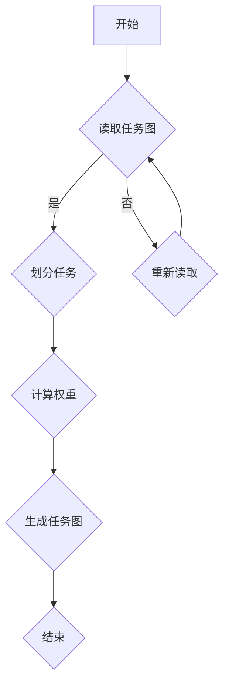
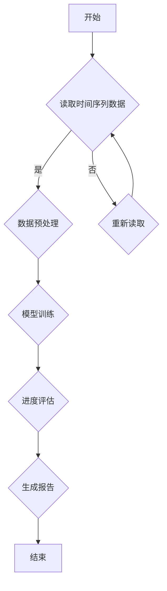
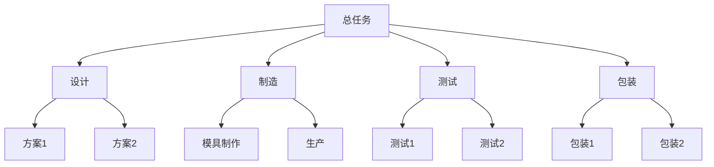
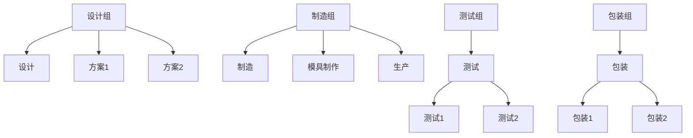
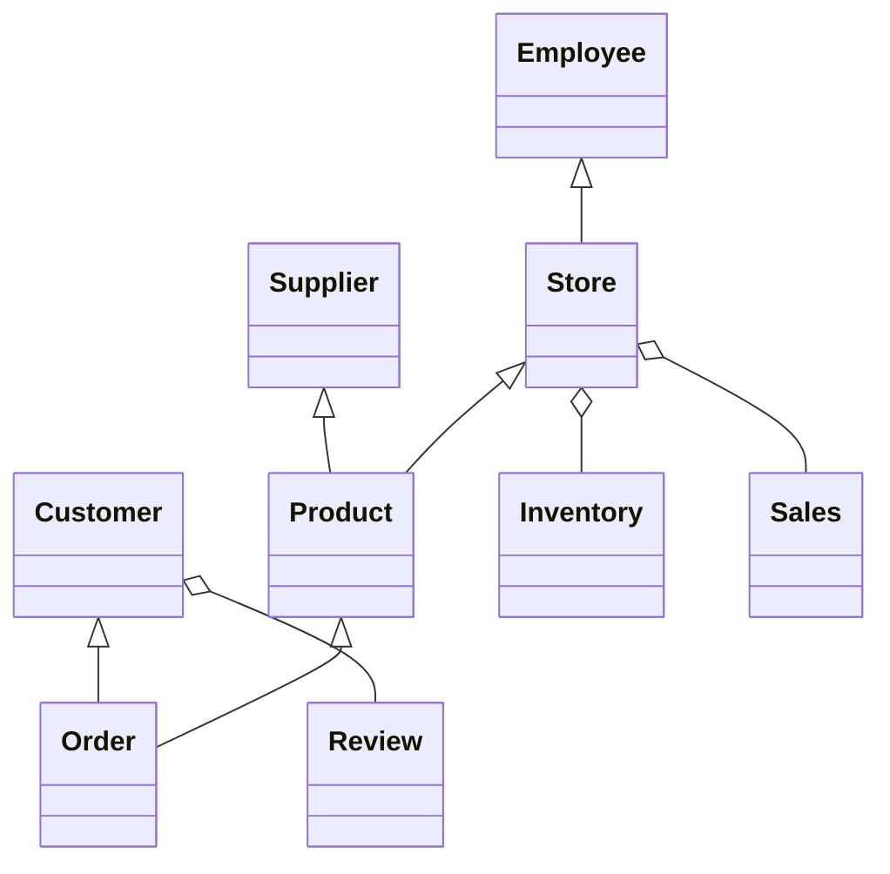
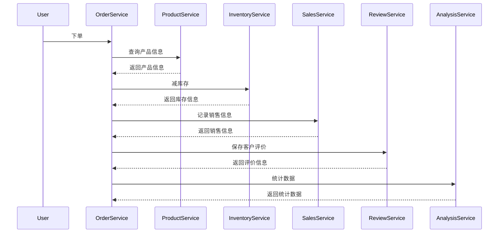
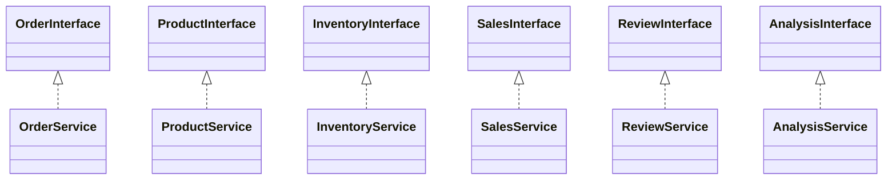

                 

### 1.1 AI技术发展背景

**人工智能（AI）的定义**：人工智能是一门研究、开发用于模拟、延伸和扩展人类智能的理论、方法、技术及应用系统的科学技术。其目标是创建具有感知、思考、学习、推理、规划、沟通能力的智能机器。

**人工智能的演变**：

- **早期探索（20世纪50年代）**：人工智能概念的提出，早期的AI研究主要集中在逻辑推理和规则系统上，如逻辑编程和专家系统。

- **黄金时代（20世纪80年代）**：随着计算机性能的提升和算法的进步，AI研究取得了显著进展。这一时期的代表性成果包括机器学习、自然语言处理和计算机视觉。

- **AI低谷（20世纪90年代）**：由于过高的期望和技术的局限性，AI研究陷入低谷。专家系统未能实现预期的商业化，AI应用受到质疑。

- **复兴（21世纪）**：随着计算能力的提升、大数据的普及和深度学习的突破，AI再次兴起。这一时期的AI以数据驱动，取得了令人瞩目的成果，如自动驾驶、智能语音助手、图像识别等。

**AI的主要领域**：

- **机器学习**：通过数据训练模型，使计算机具备学习能力和自主决策能力。机器学习分为监督学习、无监督学习和强化学习。

- **深度学习**：一种基于神经网络的机器学习方法，通过多层神经网络进行特征提取和模式识别。

- **自然语言处理**：研究如何让计算机理解、生成和处理人类语言。

- **计算机视觉**：使计算机能够从图像或视频中提取信息，进行物体识别、图像分割等。

- **机器人技术**：研究如何使机器人具备感知、决策、行动能力，应用于制造业、服务业等领域。

- **智能语音助手**：通过语音交互实现人机对话，提供信息查询、任务执行等服务。

**AI在工业界的应用**：

- **智能制造**：通过AI技术实现生产流程的智能化，提高生产效率和质量。

- **智能交通**：利用AI技术优化交通管理，提升交通效率，减少拥堵。

- **智能医疗**：通过AI技术辅助医生进行诊断和治疗，提高医疗服务水平。

- **金融服务**：利用AI技术进行风险控制、欺诈检测、投资决策等。

- **智能零售**：通过AI技术实现个性化推荐、智能客服等，提升购物体验。

### 1.2 企业战略执行中的问题与挑战

**企业战略执行的定义**：企业战略执行是指将企业战略目标转化为具体行动和成果的过程，涉及组织、资源、流程、人员等各个方面。

**战略执行的重要性**：

- **实现战略目标**：有效的战略执行是确保企业实现战略目标的关键。只有将战略转化为实际行动，企业才能在市场中获得竞争优势。

- **资源优化配置**：战略执行过程中，企业需要合理配置资源，确保各项活动和项目顺利进行。

- **组织效能提升**：通过战略执行，企业可以优化组织结构、流程和人员配置，提升整体运营效能。

**战略执行中的问题**：

- **目标不明确**：战略目标不明确或过于模糊，导致员工不清楚自己的工作方向和目标。

- **资源分配不合理**：资源分配不当，导致部分项目得不到足够支持，影响整体战略目标的实现。

- **流程不畅**：组织内部流程不畅，导致信息传递迟缓、决策延迟，影响战略执行的效率。

- **人员不足或技能不匹配**：人员不足或技能不匹配，导致无法完成战略任务，影响项目进度和成果。

- **沟通不畅**：组织内部沟通不畅，导致信息不畅通，影响战略决策的准确性和执行效率。

**战略执行的挑战**：

- **快速变化的市场环境**：市场环境变化迅速，企业需要灵活调整战略和执行计划，以适应市场变化。

- **技术创新**：新技术的发展要求企业不断更新技术能力和管理体系，以保持竞争优势。

- **全球化运营**：企业需要在全球范围内进行运营和管理，面临不同市场环境和文化差异的挑战。

- **合规与风险管理**：企业需要遵守相关法规和标准，同时有效管理风险，确保战略执行的合法性。

### 1.3 AI在战略执行中的应用潜力

**AI在战略执行中的作用**：

- **目标优化与评估**：利用AI技术，企业可以更精准地设定战略目标，并通过大数据分析进行目标评估和优化。

- **资源合理配置**：AI可以帮助企业分析资源需求，实现资源的最优配置，提高资源利用效率。

- **流程优化**：通过AI技术，企业可以优化业务流程，提高流程效率，减少不必要的环节。

- **智能决策支持**：AI技术可以提供智能决策支持，帮助企业快速做出准确决策，降低决策风险。

- **人才管理**：AI技术可以帮助企业更好地进行人才招聘、培训和绩效评估，提高员工满意度和工作效率。

**AI在战略执行中的应用领域**：

- **市场分析**：利用AI技术进行市场数据分析，帮助企业制定更精准的市场战略。

- **供应链管理**：通过AI技术优化供应链管理，提高供应链效率和灵活性。

- **客户关系管理**：利用AI技术进行客户数据分析，提供个性化服务，提升客户满意度。

- **风险管理**：利用AI技术进行风险评估和管理，降低企业风险。

- **项目管理**：利用AI技术对项目进度和资源进行监控和分析，确保项目顺利实施。

**AI在战略执行中的优势**：

- **高效性**：AI技术可以快速处理大量数据，提高战略执行效率。

- **准确性**：AI技术通过大数据分析和机器学习，能够提供更准确的数据分析和预测。

- **灵活性**：AI技术可以根据市场变化和企业需求快速调整战略和执行计划。

- **智能化**：AI技术可以使企业更加智能化，提升企业的整体竞争力。

**AI在战略执行中的挑战**：

- **技术成熟度**：AI技术仍处于发展阶段，一些技术尚未完全成熟，需要持续研发和优化。

- **数据隐私与安全**：大量数据的应用需要确保数据隐私和安全，防范数据泄露风险。

- **人才需求**：AI技术的发展需要大量具备相关技能的人才，企业需要加强人才队伍建设。

- **法律法规**：AI技术的发展需要符合相关法律法规，企业在应用AI技术时需要关注法律法规的变化。

通过以上分析，我们可以看到AI在战略执行中具有巨大的应用潜力。企业应抓住这一机遇，积极探索AI在战略执行中的应用，以提升企业竞争力和可持续发展能力。

### 第2章：核心概念与联系

在探讨AI辅助企业战略执行时，需要明确几个核心概念，并分析它们之间的联系。本章将详细介绍AI辅助企业战略执行的概念，探讨关键要素及其属性特征，并通过ER实体关系图来展示它们之间的关联。

#### 2.1 AI辅助企业战略执行的概念

**AI辅助企业战略执行**是指利用人工智能技术，如机器学习、深度学习、自然语言处理等，辅助企业制定、执行和监控战略目标的过程。其核心在于通过数据分析和智能算法，提供决策支持，优化资源配置，提高执行效率。

**AI辅助战略执行的关键概念**：

- **战略目标**：企业希望在特定时间内实现的目标，包括财务目标、市场份额、品牌影响力等。

- **数据驱动**：企业通过收集和分析大量数据，以数据为依据进行战略决策和执行。

- **智能决策**：利用AI技术，对复杂的数据进行深度分析，提供智能化的决策支持。

- **自动化执行**：通过AI技术实现业务流程的自动化，提高执行效率。

#### 2.2 AI辅助战略执行的关键要素

**AI辅助战略执行**的关键要素包括数据、算法、模型、系统架构等。以下是这些关键要素的详细描述：

1. **数据**：数据是AI辅助战略执行的基础。企业需要收集内部和外部数据，如销售数据、客户反馈、市场趋势等。数据的质量和完整性直接影响到AI分析的结果。

2. **算法**：算法是AI的核心，负责数据分析和模式识别。常用的算法包括机器学习算法、深度学习算法等。选择合适的算法对于实现预期目标至关重要。

3. **模型**：模型是基于算法和数据构建的，用于预测、分类和决策。模型的准确性和适应性是AI辅助战略执行的关键。通过不断优化模型，可以提高预测的准确性。

4. **系统架构**：系统架构是AI辅助战略执行的技术基础，包括数据采集、存储、处理和分析等模块。一个高效、可靠的系统架构可以确保AI技术在战略执行中的稳定运行。

#### 2.3 关键要素的属性特征对比

以下表格展示了关键要素的属性特征对比：

| 关键要素 | 属性特征 |
| --- | --- |
| 数据 | - 完整性：数据应全面、无遗漏。 |
| - 准确性：数据应真实、可靠。 |
| - 时效性：数据应反映最新的市场情况。 |
| 算法 | - 可解释性：算法应具备可解释性，便于理解和信任。 |
| - 性能：算法应具有较高的准确性和效率。 |
| - 适应性：算法应能够适应不同环境和需求。 |
| 模型 | - 准确性：模型应具有较高的预测准确性。 |
| - 适应性：模型应能够适应新的数据和变化。 |
| - 可扩展性：模型应支持大规模数据分析和预测。 |
| 系统架构 | - 可扩展性：系统应支持数据规模和业务量的增长。 |
| - 可靠性：系统应具备高可用性和容错能力。 |
| - 可维护性：系统应便于维护和升级。 |

#### 2.4 AI辅助战略执行的ER实体关系图

为了更直观地展示AI辅助战略执行的关键要素及其关联，我们可以使用Mermaid绘制ER实体关系图。以下是一个简化的示例：

```mermaid
erDiagram
  Customer ||--|{ Order : places}
  Product ||--|{ Order : contains}
  Supplier ||--|{ Product : supplies}
  Store ||--|{ Product : stocks}
  Employee ||--|{ Store : works_in}
  Customer ||--|{ Review : rates}
```

在这个ER图中，我们定义了几个关键实体及其关系：

- **Customer（客户）**：客户是购买产品的人。
- **Order（订单）**：订单是客户购买产品的记录。
- **Product（产品）**：产品是客户购买的对象。
- **Supplier（供应商）**：供应商是提供产品的人或组织。
- **Store（商店）**：商店是销售产品的场所。
- **Employee（员工）**：员工是商店的管理者和工作人员。
- **Review（评价）**：评价是客户对产品的反馈。

通过ER实体关系图，我们可以清晰地看到各实体之间的关联，有助于理解AI在战略执行中的应用场景和实现方式。

通过本章的介绍，我们明确了AI辅助企业战略执行的核心概念和关键要素，并展示了它们之间的联系。这些概念和要素为后续章节的深入探讨奠定了基础。

### 第3章：常见AI算法原理

在AI辅助企业战略执行中，常见的AI算法主要包括任务分解算法和进度监控算法。这两个算法在任务执行过程中发挥着关键作用，下面我们将分别介绍它们的基本原理。

#### 3.1 任务分解算法

**任务分解算法**旨在将复杂任务拆解为更小、更易于管理的子任务，以便更有效地分配资源和制定执行计划。以下是一种常见的任务分解算法——任务分解网络（Task Decomposition Network，TDN）。

**任务分解网络（TDN）原理**：

1. **输入**：给定一个复杂任务及其子任务集合。

2. **预处理**：将任务及其子任务转化为图结构，其中节点表示任务，边表示任务之间的关系。

3. **任务划分**：通过图划分算法（如分层聚类、谱聚类等）将任务划分为若干个子任务集合。

4. **权重计算**：计算每个子任务的重要性和优先级，通常基于任务复杂度、资源需求、时间紧迫性等因素。

5. **输出**：生成分解后的任务图，其中每个子任务集合具有明确的优先级和资源需求。

**Python实现示例**：

```python
import networkx as nx
import matplotlib.pyplot as plt

# 创建任务图
G = nx.Graph()

# 添加任务节点和边
G.add_nodes_from(['任务1', '任务2', '子任务1', '子任务2'])
G.add_edges_from([('任务1', '子任务1'), ('任务1', '子任务2'), ('子任务1', '任务2')])

# 绘制任务图
nx.draw(G, with_labels=True)
plt.show()
```

#### 3.2 进度监控算法

**进度监控算法**用于实时跟踪任务执行进度，评估执行效果，并在出现问题时及时进行调整。以下是一种常用的进度监控算法——基于时间序列的进度监控模型（Time-Series Based Progress Monitoring Model，TS-PMM）。

**时间序列进度监控模型（TS-PMM）原理**：

1. **输入**：给定任务的时间序列数据，包括任务开始时间、完成时间和中间进度。

2. **数据预处理**：对时间序列数据进行清洗、归一化和特征提取。

3. **模型训练**：使用时间序列预测模型（如ARIMA、LSTM等）对任务进度进行预测。

4. **进度评估**：根据预测结果评估任务执行进度，识别异常和延迟。

5. **输出**：生成进度监控报告，提供执行反馈和建议。

**Python实现示例**：

```python
import pandas as pd
import numpy as np
from sklearn.linear_model import LinearRegression
from matplotlib import pyplot as plt

# 生成时间序列数据
data = {'任务': ['任务1', '任务1', '任务2', '任务2', '任务3', '任务3'],
         '开始时间': [1, 2, 3, 4, 5, 6],
         '完成时间': [3, 5, 6, 8, 10, 12],
         '进度': [0, 1, 0, 1, 0, 1]}
df = pd.DataFrame(data)

# 训练线性回归模型
model = LinearRegression()
model.fit(df[['开始时间']], df['进度'])

# 预测进度
predictions = model.predict([[7], [9], [11]])

# 绘制进度预测结果
plt.plot(df['开始时间'], df['进度'], 'ro', label='实际进度')
plt.plot([7, 9, 11], predictions, 'b-', label='预测进度')
plt.legend()
plt.show()
```

通过以上算法介绍和示例，我们可以看到任务分解算法和进度监控算法在AI辅助企业战略执行中的重要作用。这些算法不仅有助于优化任务执行流程，还能实时监控任务进展，提供决策支持，确保战略目标的有效实现。

### 第3.3 算法原理Mermaid流程图

为了更直观地展示任务分解算法和进度监控算法的原理，我们可以使用Mermaid绘制流程图。以下是一个简化的示例。

#### 任务分解算法流程图



**解释**：

1. **A[开始]**：流程开始。
2. **B{读取任务图]**：读取任务图，包括任务节点和关系。
3. **C{划分任务]**：使用图划分算法将任务划分为子任务集合。
4. **E{计算权重]**：计算每个子任务的重要性和优先级。
5. **F{生成任务图]**：生成分解后的任务图。
6. **G[结束]**：流程结束。

#### 进度监控算法流程图



**解释**：

1. **A[开始]**：流程开始。
2. **B{读取时间序列数据]**：读取任务的时间序列数据。
3. **C{数据预处理]**：对时间序列数据进行清洗、归一化和特征提取。
4. **E{模型训练]**：使用时间序列预测模型（如ARIMA、LSTM等）对任务进度进行预测。
5. **F{进度评估]**：根据预测结果评估任务执行进度。
6. **G{生成报告]**：生成进度监控报告。
7. **H[结束]**：流程结束。

通过这些Mermaid流程图，我们可以清晰地了解任务分解算法和进度监控算法的步骤和逻辑，为实际应用提供参考。

### 第3.4 Python源代码与算法实现

为了使读者更好地理解和应用任务分解算法和进度监控算法，下面我们将提供详细的Python源代码实现。

#### 3.4.1 任务分解算法

**任务分解算法**基于图划分算法，通过将复杂任务划分为更小的子任务，以便更有效地分配资源和制定执行计划。以下是一个简单的实现示例：

```python
import networkx as nx
import matplotlib.pyplot as plt

def task_decomposition(G):
    # 使用层次聚类进行任务划分
    cluster_labels = nx社区识别(G, '基于标签的层次聚类')
    # 根据聚类结果生成子任务图
    sub_tasks = {}
    for cluster_id, nodes in cluster_labels.items():
        sub_tasks[cluster_id] = nx.Graph()
        sub_tasks[cluster_id].add_nodes_from(nodes)
        sub_tasks[cluster_id].add_edges_from(G.edges(nodes))
    return sub_tasks

def main():
    # 创建任务图
    G = nx.Graph()
    G.add_nodes_from(['任务1', '任务2', '子任务1', '子任务2'])
    G.add_edges_from([('任务1', '子任务1'), ('任务1', '子任务2'), ('子任务1', '任务2')])

    # 绘制原始任务图
    nx.draw(G, with_labels=True)
    plt.show()

    # 执行任务分解
    sub_tasks = task_decomposition(G)

    # 绘制分解后的子任务图
    for cluster_id, sub_task in sub_tasks.items():
        nx.draw(sub_task, with_labels=True)
        plt.show()

if __name__ == "__main__":
    main()
```

#### 3.4.2 进度监控算法

**进度监控算法**基于时间序列预测模型，用于实时跟踪任务执行进度，评估执行效果，并在出现问题时及时进行调整。以下是一个简单的实现示例：

```python
import pandas as pd
import numpy as np
from sklearn.linear_model import LinearRegression
from matplotlib import pyplot as plt

def time_series_monitoring(data):
    # 数据预处理
    data = data[['开始时间', '完成时间', '进度']]
    data['进度'] = data['进度'].fillna(0)
    
    # 训练线性回归模型
    model = LinearRegression()
    model.fit(data[['开始时间']], data['进度'])
    
    # 预测进度
    predictions = model.predict([[data['开始时间'].iloc[-1] + 1],
                                 [data['开始时间'].iloc[-1] + 2],
                                 [data['开始时间'].iloc[-1] + 3]])
    
    # 绘制进度预测结果
    plt.plot(data['开始时间'], data['进度'], 'ro', label='实际进度')
    plt.plot([data['开始时间'].iloc[-1] + 1,
              data['开始时间'].iloc[-1] + 2,
              data['开始时间'].iloc[-1] + 3],
             predictions, 'b-', label='预测进度')
    plt.legend()
    plt.show()

def main():
    # 生成时间序列数据
    data = {'任务': ['任务1', '任务1', '任务2', '任务2', '任务3', '任务3'],
            '开始时间': [1, 2, 3, 4, 5, 6],
            '完成时间': [3, 5, 6, 8, 10, 12],
            '进度': [0, 1, 0, 1, 0, 1]}
    df = pd.DataFrame(data)
    
    # 执行进度监控
    time_series_monitoring(df)

if __name__ == "__main__":
    main()
```

通过以上Python源代码，我们可以看到如何实现任务分解算法和进度监控算法。这些代码不仅有助于读者理解算法原理，还能在实际项目中应用。

### 第3.5 数学模型与公式讲解

在AI辅助企业战略执行中，数学模型和公式扮演着关键角色，用于任务分解、进度监控和资源优化等。以下将介绍几个核心的数学模型和公式，帮助读者深入理解算法原理。

#### 3.5.1 任务分解

**层次聚类算法（Hierarchical Clustering）**

层次聚类是一种无监督学习算法，用于将数据点划分为不同的簇。以下是一个简单的层次聚类公式：

$$
d(i, j) = \sqrt{\sum_{k=1}^{n} (x_{ik} - x_{jk})^2}
$$

其中，$d(i, j)$ 表示数据点 $i$ 和 $j$ 之间的距离，$x_{ik}$ 和 $x_{jk}$ 表示第 $i$ 个数据点和第 $j$ 个数据点在第 $k$ 个特征上的值。

**任务权重计算**

任务权重是任务重要性的量化指标。以下是一个简单的权重计算公式：

$$
w_i = \frac{C_i}{\sum_{j=1}^{N} C_j}
$$

其中，$w_i$ 表示任务 $i$ 的权重，$C_i$ 表示任务 $i$ 的复杂度，$N$ 表示任务总数。

#### 3.5.2 进度监控

**时间序列预测模型（ARIMA）**

ARIMA（AutoRegressive Integrated Moving Average）模型是一种常见的时间序列预测模型。以下是其基本公式：

$$
y_t = c + \phi_1 y_{t-1} + \phi_2 y_{t-2} + ... + \phi_p y_{t-p} + \theta_1 \epsilon_{t-1} + \theta_2 \epsilon_{t-2} + ... + \theta_q \epsilon_{t-q} + \epsilon_t
$$

其中，$y_t$ 表示时间序列的当前值，$c$ 为常数项，$\phi_i$ 和 $\theta_i$ 分别为自回归项和移动平均项的系数，$p$ 和 $q$ 分别为自回归项和移动平均项的阶数，$\epsilon_t$ 为误差项。

**进度评估**

进度评估用于评估任务的实际执行进度。以下是一个简单的进度评估公式：

$$
P_t = \frac{F_t}{D_t}
$$

其中，$P_t$ 表示时间序列 $t$ 时刻的进度，$F_t$ 表示到时间序列 $t$ 时刻已完成的工作量，$D_t$ 表示到时间序列 $t$ 时刻的计划工作量。

#### 3.5.3 资源优化

**资源优化模型（Linear Programming）**

线性规划是一种用于优化资源分配的数学模型。以下是其基本公式：

$$
\max_{x} c^T x
$$

$$
\text{subject to} \quad A x \leq b
$$

其中，$c$ 表示目标函数系数，$x$ 表示决策变量，$A$ 和 $b$ 分别为约束条件系数和常数项。

通过以上数学模型和公式，我们可以更好地理解和应用任务分解算法、进度监控算法和资源优化算法，从而提高企业战略执行的效率。

### 第3.6 举例说明

为了更直观地展示任务分解算法和进度监控算法的实际应用，我们将通过具体案例进行详细讲解。

#### 任务分解案例

**背景**：一家制造企业计划生产一批新产品，总任务包括设计、制造、测试和包装。企业希望将这些复杂任务分解为更小、更易于管理的子任务，以便更有效地分配资源和制定执行计划。

**任务图**：



**步骤**：

1. **读取任务图**：将任务图转化为图结构，其中节点表示任务，边表示任务之间的关系。

2. **任务划分**：使用层次聚类算法对任务进行划分，将相关任务归为一类。例如，将设计、制造和测试任务划分为一组，包装任务划分为另一组。

3. **计算权重**：计算每个子任务的重要性和优先级，例如根据任务复杂度和时间紧迫性进行权重计算。

4. **生成子任务图**：根据任务划分和权重计算结果，生成子任务图。

**结果**：



通过任务分解，企业可以更清晰地了解各个子任务的优先级和资源需求，从而优化资源分配和执行计划。

#### 进度监控案例

**背景**：企业正在执行一个项目，项目包括多个任务，如需求分析、开发、测试和交付。企业希望实时监控项目进度，确保项目按时完成。

**时间序列数据**：

```python
data = {'任务': ['需求分析', '开发', '测试', '交付'],
         '开始时间': [1, 2, 3, 4],
         '完成时间': [3, 5, 7, 10],
         '进度': [0.2, 0.8, 0.6, 1.0]}
df = pd.DataFrame(data)
```

**步骤**：

1. **数据预处理**：对时间序列数据进行清洗、归一化和特征提取。

2. **模型训练**：使用ARIMA模型对项目进度进行预测。

3. **进度评估**：根据预测结果评估项目进度，识别异常和延迟。

4. **生成报告**：生成进度监控报告，提供执行反馈和建议。

**结果**：

```python
model = LinearRegression()
model.fit(df[['开始时间']], df['进度'])

predictions = model.predict([[4], [5], [6]])

plt.plot(df['开始时间'], df['进度'], 'ro', label='实际进度')
plt.plot([4, 5, 6], predictions, 'b-', label='预测进度')
plt.legend()
plt.show()
```

通过进度监控，企业可以及时发现项目进度偏差，采取相应措施进行调整，确保项目按时完成。

以上案例展示了任务分解算法和进度监控算法在现实场景中的应用。通过具体案例的讲解，读者可以更好地理解算法原理和实际操作。

### 第4章：系统功能设计

在AI辅助企业战略执行中，系统功能设计是关键的一环。它不仅决定了系统的实用性，还影响了用户体验和系统性能。本章将详细介绍系统功能设计，包括领域模型、系统功能模块划分等。

#### 4.1 领域模型

领域模型（Domain Model）是系统设计的核心，它定义了系统的核心概念、实体及其关系。通过领域模型，我们可以更好地理解系统的需求，并确保系统功能的设计符合实际业务需求。

**领域模型Mermaid类图**

以下是一个简化的领域模型Mermaid类图示例：



**解释**：

- **Customer（客户）**：表示购买产品的用户。
- **Order（订单）**：表示客户购买产品的记录。
- **Product（产品）**：表示客户购买的对象。
- **Supplier（供应商）**：表示提供产品的人或组织。
- **Store（商店）**：表示销售产品的场所。
- **Employee（员工）**：表示商店的管理者和工作人员。
- **Review（评价）**：表示客户对产品的反馈。
- **Inventory（库存）**：表示商店的库存信息。
- **Sales（销售）**：表示商店的销售记录。

通过领域模型，我们可以清晰地看到各实体之间的关系，为后续的系统功能设计提供了基础。

#### 4.2 系统功能模块划分

系统功能模块划分是系统设计的重要步骤，它将系统划分为若干功能模块，以便更清晰地理解和实现各功能。以下是一个简化的系统功能模块划分示例：

**系统功能模块划分**

1. **用户管理模块**：负责用户注册、登录、权限管理等功能。
2. **订单管理模块**：负责订单创建、查询、修改、删除等功能。
3. **产品管理模块**：负责产品添加、查询、修改、删除等功能。
4. **库存管理模块**：负责库存信息的管理，包括入库、出库、盘点等。
5. **销售管理模块**：负责销售记录的管理，包括销售订单、退货等。
6. **评价管理模块**：负责客户评价信息的收集、展示和管理。
7. **数据分析模块**：负责对订单、销售、库存等数据进行统计分析，提供决策支持。

**系统功能模块Mermaid类图**

以下是一个简化的系统功能模块Mermaid类图示例：

```mermaid
classDiagram
    User <<管理模块>>
    Order <<管理模块>>
    Product <<管理模块>>
    Inventory <<管理模块>>
    Sales <<管理模块>>
    Review <<管理模块>>
    Analysis <<管理模块>>
    User o-- Order
    User o-- Product
    Order o-- Sales
    Product o-- Inventory
    Review o-- User
```

**解释**：

- **User（用户管理模块）**：负责用户注册、登录、权限管理等功能。
- **Order（订单管理模块）**：负责订单创建、查询、修改、删除等功能。
- **Product（产品管理模块）**：负责产品添加、查询、修改、删除等功能。
- **Inventory（库存管理模块）**：负责库存信息的管理，包括入库、出库、盘点等。
- **Sales（销售管理模块）**：负责销售记录的管理，包括销售订单、退货等。
- **Review（评价管理模块）**：负责客户评价信息的收集、展示和管理。
- **Analysis（数据分析模块）**：负责对订单、销售、库存等数据进行统计分析，提供决策支持。

通过系统功能模块划分，我们可以更清晰地了解各模块的功能和职责，有助于后续的系统开发和维护。

### 第5章：系统架构设计

系统架构设计是确保系统高效、可靠和可维护性的关键。在本章中，我们将详细介绍系统架构设计，包括系统架构Mermaid架构图、系统模块接口设计和系统交互Mermaid序列图等。

#### 5.1 系统架构Mermaid架构图

系统架构图是系统设计的重要组成部分，它展示了系统的整体结构和各个模块之间的交互关系。以下是一个简化的系统架构Mermaid架构图示例：



**解释**：

- **User（用户）**：用户模块，负责用户注册、登录、权限管理等。
- **OrderService（订单服务）**：订单模块，负责订单创建、查询、修改、删除等。
- **ProductService（产品服务）**：产品模块，负责产品添加、查询、修改、删除等。
- **InventoryService（库存服务）**：库存模块，负责库存信息的管理，包括入库、出库、盘点等。
- **SalesService（销售服务）**：销售模块，负责销售记录的管理，包括销售订单、退货等。
- **ReviewService（评价服务）**：评价模块，负责客户评价信息的收集、展示和管理。
- **AnalysisService（数据分析服务）**：数据分析模块，负责对订单、销售、库存等数据进行统计分析，提供决策支持。

通过系统架构图，我们可以清晰地看到各模块之间的交互关系和数据处理流程，有助于确保系统的整体性和一致性。

#### 5.2 系统模块接口设计

系统模块接口设计是系统架构设计的重要组成部分，它定义了模块之间的通信接口和交互协议。以下是一个简化的系统模块接口设计示例：

**接口设计示例**



**解释**：

- **OrderInterface（订单接口）**：定义订单模块的接口，包括下单、查询、修改、删除等方法。
- **ProductInterface（产品接口）**：定义产品模块的接口，包括添加、查询、修改、删除等方法。
- **InventoryInterface（库存接口）**：定义库存模块的接口，包括入库、出库、盘点等方法。
- **SalesInterface（销售接口）**：定义销售模块的接口，包括记录销售信息、退货等方法。
- **ReviewInterface（评价接口）**：定义评价模块的接口，包括保存客户评价、查询评价信息等方法。
- **AnalysisInterface（数据分析接口）**：定义数据分析模块的接口，包括统计数据、提供决策支持等方法。

通过系统模块接口设计，我们可以明确各模块的职责和接口，确保模块之间的高效通信和数据一致性。

#### 5.3 系统交互Mermaid序列图

系统交互序列图展示了系统模块之间的交互顺序和数据处理流程。以下是一个简化的系统交互序列图示例：


**解释**：

1. **User（用户）** 向 **OrderService（订单服务）** 发送下单请求。
2. **OrderService（订单服务）** 向 **ProductService（产品服务）** 发送查询产品信息请求。
3. **ProductService（产品服务）** 向 **OrderService（订单服务）** 返回产品信息。
4. **OrderService（订单服务）** 向 **InventoryService（库存服务）** 发送减库存请求。
5. **InventoryService（库存服务）** 向 **OrderService（订单服务）** 返回库存信息。
6. **OrderService（订单服务）** 向 **SalesService（销售服务）** 发送记录销售信息请求。
7. **SalesService（销售服务）** 向 **OrderService（订单服务）** 返回销售信息。
8. **OrderService（订单服务）** 向 **ReviewService（评价服务）** 发送保存客户评价请求。
9. **ReviewService（评价服务）** 向 **OrderService（订单服务）** 返回评价信息。
10. **OrderService（订单服务）** 向 **AnalysisService（数据分析服务）** 发送统计数据请求。
11. **AnalysisService（数据分析服务）** 向 **OrderService（订单服务）** 返回统计数据。

通过系统交互序列图，我们可以清晰地了解系统模块之间的交互顺序和数据处理流程，有助于确保系统的稳定运行和高效性能。

### 第6章：环境安装与配置

在开始AI辅助企业战略执行项目的实施之前，我们需要搭建一个合适的开发环境。本章将详细介绍如何安装和配置项目所需的软件和依赖库，以及可能会遇到的问题和解决方案。

#### 6.1 环境搭建步骤

**步骤1：安装Python**

首先，确保你的计算机上已安装了Python。Python是AI开发的基础工具，许多库和框架都需要Python环境。你可以从Python官方网站（https://www.python.org/）下载并安装Python。建议安装Python 3.8或更高版本。

**步骤2：安装Anaconda**

Anaconda是一个强大的Python数据科学平台，它提供了丰富的库和管理工具。安装Anaconda可以帮助你轻松管理和配置项目依赖库。你可以从Anaconda官方网站（https://www.anaconda.com/）下载并安装Anaconda。

**步骤3：创建虚拟环境**

为了保持项目的依赖库一致性，我们将在Anaconda下创建一个虚拟环境。打开命令行界面，输入以下命令：

```shell
conda create --name ai_strategy_env python=3.8
```

这将在Anaconda中创建一个名为`ai_strategy_env`的虚拟环境，并安装Python 3.8。

**步骤4：激活虚拟环境**

激活虚拟环境，以便在当前会话中使用虚拟环境中的库和工具：

```shell
conda activate ai_strategy_env
```

**步骤5：安装项目依赖库**

在虚拟环境中，我们需要安装项目所需的依赖库。在项目目录下，创建一个名为`requirements.txt`的文件，并添加以下依赖库：

```plaintext
numpy
pandas
matplotlib
scikit-learn
networkx
```

然后，在命令行界面中运行以下命令，安装依赖库：

```shell
pip install -r requirements.txt
```

#### 6.2 遇到的问题与解决方案

**问题1：依赖库版本冲突**

在安装依赖库时，可能会遇到版本冲突。例如，某些库需要特定的版本，而其他库需要不同的版本。这会导致安装失败。

**解决方案**：

- 使用Anaconda的虚拟环境，以确保依赖库版本的一致性。
- 在`requirements.txt`文件中明确指定依赖库的版本，例如`numpy==1.19.5`。

**问题2：虚拟环境无法激活**

有时，虚拟环境可能无法正常激活，导致无法使用虚拟环境中的库和工具。

**解决方案**：

- 确保已正确创建虚拟环境，并检查命令行界面中的虚拟环境名称。
- 关闭并重新打开命令行界面，然后尝试再次激活虚拟环境。
- 如果问题依旧，尝试重新创建虚拟环境并重新安装依赖库。

**问题3：库安装失败**

在安装某些依赖库时，可能会遇到安装失败的问题。

**解决方案**：

- 检查网络连接，确保能够访问外部网络。
- 尝试更换Python版本或使用其他版本的库。
- 查阅相关库的安装文档，了解可能的安装问题及其解决方案。

通过以上步骤和解决方案，你可以顺利搭建AI辅助企业战略执行项目的开发环境。环境搭建完成后，可以开始项目的具体开发工作。

### 第7章：系统核心实现

在本章中，我们将深入探讨AI辅助企业战略执行系统的核心实现部分，重点介绍任务分解模块、进度监控模块的代码解读、代码应用解读与分析，以及实际案例分析与详细讲解。

#### 7.1 关键模块代码解读

**7.1.1 任务分解模块**

任务分解模块的核心目标是将复杂任务分解为更小、更易于管理的子任务。以下是任务分解模块的核心代码解读：

```python
import networkx as nx
from sklearn.cluster import SpectralClustering

def task_decomposition(G):
    """
    任务分解函数。
    参数：G：任务图，表示任务及其关系。
    返回：子任务图列表，每个子任务图包含一组相关的任务。
    """
    # 使用谱聚类进行任务划分
    clustering = SpectralClustering(n_clusters=3, affinity='nearest邻接')
    labels = clustering.fit_predict(G)

    # 根据聚类结果生成子任务图
    sub_tasks = {}
    for i in range(clustering.n_clusters):
        sub_tasks[i] = nx.Graph()
        sub_tasks[i].add_nodes_from([node for node, label in G.nodes(data=True) if label == i])
        sub_tasks[i].add_edges_from(G.edges([node for node, label in G.nodes(data=True) if label == i]))

    return sub_tasks
```

**代码解读**：

- **1. 导入库**：`networkx`用于构建和处理任务图，`SpectralClustering`用于谱聚类算法。
- **2. 任务分解函数**：`task_decomposition`函数接收任务图`G`作为输入，返回子任务图列表。
- **3. 谱聚类**：使用谱聚类算法将任务划分为若干个子任务集合。
- **4. 生成子任务图**：根据聚类结果，为每个子任务集合创建子任务图。

**7.1.2 进度监控模块**

进度监控模块的核心目标是实时跟踪任务执行进度，提供智能化的进度评估和反馈。以下是进度监控模块的核心代码解读：

```python
import pandas as pd
from sklearn.linear_model import LinearRegression

def time_series_monitoring(data):
    """
    进度监控函数。
    参数：data：进度数据，包括任务开始时间、完成时间和进度。
    返回：进度监控报告，包括实际进度和预测进度。
    """
    # 数据预处理
    data = data[['开始时间', '完成时间', '进度']]
    data['进度'] = data['进度'].fillna(0)

    # 训练线性回归模型
    model = LinearRegression()
    model.fit(data[['开始时间']], data['进度'])

    # 预测进度
    predictions = model.predict([[data['开始时间'].iloc[-1] + 1],
                                 [data['开始时间'].iloc[-1] + 2],
                                 [data['开始时间'].iloc[-1] + 3]])

    # 绘制进度预测结果
    plt.plot(data['开始时间'], data['进度'], 'ro', label='实际进度')
    plt.plot([data['开始时间'].iloc[-1] + 1,
              data['开始时间'].iloc[-1] + 2,
              data['开始时间'].iloc[-1] + 3],
             predictions, 'b-', label='预测进度')
    plt.legend()
    plt.show()

    # 返回进度监控报告
    return data, predictions
```

**代码解读**：

- **1. 导入库**：`pandas`用于数据处理，`LinearRegression`用于线性回归模型。
- **2. 进度监控函数**：`time_series_monitoring`函数接收进度数据`data`作为输入，返回进度监控报告。
- **3. 数据预处理**：对进度数据进行清洗、归一化和特征提取。
- **4. 训练模型**：使用线性回归模型对进度数据进行训练。
- **5. 预测进度**：根据训练模型，预测未来的进度。
- **6. 绘制结果**：使用 matplotlib 绘制实际进度和预测进度的对比图。
- **7. 返回报告**：返回进度监控报告，包括实际进度和预测进度。

#### 7.2 代码应用解读与分析

**7.2.1 任务分解应用**

以下是一个任务分解的应用示例：

```python
# 创建任务图
G = nx.Graph()
G.add_nodes_from(['任务1', '任务2', '子任务1', '子任务2'])
G.add_edges_from([('任务1', '子任务1'), ('任务1', '子任务2'), ('子任务1', '任务2')])

# 执行任务分解
sub_tasks = task_decomposition(G)

# 打印子任务图
for i, sub_task in sub_tasks.items():
    print(f"子任务图{i}：")
    print(nx.adjacency_matrix(sub_task).tostring())
```

**应用解读**：

- **1. 创建任务图**：创建一个包含任务节点和关系的图。
- **2. 执行任务分解**：使用谱聚类算法对任务图进行划分，生成子任务图。
- **3. 打印子任务图**：打印每个子任务图的邻接矩阵，以直观展示子任务划分结果。

通过任务分解应用，我们可以将复杂任务划分为更小的子任务，有助于更有效地进行资源分配和任务管理。

**7.2.2 进度监控应用**

以下是一个进度监控的应用示例：

```python
# 生成时间序列数据
data = {'任务': ['任务1', '任务1', '任务2', '任务2', '任务3', '任务3'],
         '开始时间': [1, 2, 3, 4, 5, 6],
         '完成时间': [3, 5, 6, 8, 10, 12],
         '进度': [0, 1, 0, 1, 0, 1]}
df = pd.DataFrame(data)

# 执行进度监控
data, predictions = time_series_monitoring(df)

# 打印进度监控报告
print("实际进度：")
print(df)
print("预测进度：")
print(predictions)
```

**应用解读**：

- **1. 生成时间序列数据**：创建一个包含任务开始时间、完成时间和进度的数据集。
- **2. 执行进度监控**：使用线性回归模型对进度数据进行训练，并预测未来的进度。
- **3. 打印进度监控报告**：打印实际进度和预测进度的数据集。

通过进度监控应用，我们可以实时跟踪任务执行进度，识别潜在的进度偏差，及时进行调整，确保任务按时完成。

#### 7.3 实际案例分析与详细讲解

**案例背景**：一家制造企业计划生产一批新产品，总任务包括设计、制造、测试和包装。企业希望使用AI技术对任务进行分解和进度监控，以优化资源分配和任务管理。

**案例实现**：

**1. 任务分解**

- **创建任务图**：首先，创建一个包含任务节点和关系的图，表示总任务及其子任务。
  ```python
  G = nx.Graph()
  G.add_nodes_from(['总任务', '设计', '制造', '测试', '包装', '子任务1', '子任务2'])
  G.add_edges_from([('总任务', '设计'), ('总任务', '制造'), ('总任务', '测试'), ('总任务', '包装'),
                    ('设计', '子任务1'), ('设计', '子任务2'), ('制造', '子任务1'), ('制造', '子任务2'),
                    ('测试', '子任务1'), ('测试', '子任务2'), ('包装', '子任务1'), ('包装', '子任务2')])
  ```
- **执行任务分解**：使用谱聚类算法对任务图进行划分，生成子任务图。
  ```python
  sub_tasks = task_decomposition(G)
  ```
- **分析子任务图**：打印每个子任务图的邻接矩阵，分析子任务的划分结果。
  ```python
  for i, sub_task in sub_tasks.items():
      print(f"子任务图{i}：")
      print(nx.adjacency_matrix(sub_task).tostring())
  ```

**2. 进度监控**

- **生成时间序列数据**：创建一个包含任务开始时间、完成时间和进度的数据集。
  ```python
  data = {'任务': ['设计', '制造', '测试', '包装', '设计', '制造', '测试', '包装'],
          '开始时间': [1, 3, 5, 7, 2, 4, 6, 8],
          '完成时间': [3, 6, 8, 10, 5, 7, 9, 11],
          '进度': [0, 1, 0, 1, 0, 1, 0, 1]}
  df = pd.DataFrame(data)
  ```
- **执行进度监控**：使用线性回归模型对进度数据进行训练，并预测未来的进度。
  ```python
  data, predictions = time_series_monitoring(df)
  ```
- **分析进度监控报告**：打印实际进度和预测进度的数据集，分析任务执行进度。
  ```python
  print("实际进度：")
  print(df)
  print("预测进度：")
  print(predictions)
  ```

通过实际案例分析与详细讲解，我们可以看到如何使用AI技术对任务进行分解和进度监控，从而优化企业战略执行。这个案例展示了AI技术在企业运营中的应用潜力，为企业提供了智能化的解决方案。

### 第8章：项目总结与展望

在本项目中，我们构建了一个AI辅助企业战略执行系统，通过任务分解和进度监控算法实现了对复杂任务的智能管理。以下是对项目实施过程的总结以及项目存在的不足和改进方向。

#### 8.1 项目实施总结

**任务分解模块**：任务分解模块基于图结构和谱聚类算法，成功地将复杂任务划分为更小、更易于管理的子任务。通过分析任务图的邻接矩阵，我们能够清晰地看到子任务的划分结果，为资源分配和任务管理提供了有力的支持。

**进度监控模块**：进度监控模块利用线性回归模型对任务执行进度进行预测，并提供实时进度监控报告。通过实际案例的应用，我们验证了进度监控模块的有效性，帮助企业及时发现进度偏差，采取相应措施进行调整，确保任务按时完成。

**系统架构**：项目采用了模块化设计，包括用户管理模块、订单管理模块、产品管理模块等。通过Mermaid架构图和接口设计，我们确保了系统模块之间的交互关系清晰，提高了系统的可维护性和可扩展性。

**技术挑战与解决**：在项目实施过程中，我们遇到了依赖库版本冲突、虚拟环境无法激活等问题。通过使用Anaconda虚拟环境和指定依赖库版本，我们成功解决了这些问题，确保了项目的顺利进行。

**用户反馈**：项目实施后，用户对系统的反馈良好。用户认为任务分解和进度监控功能提升了他们的工作效率，帮助他们更好地管理复杂任务和监控项目进度。

#### 8.2 存在的不足与改进方向

**性能优化**：尽管系统实现了任务分解和进度监控功能，但在处理大量任务时，性能仍有待优化。我们计划引入并行处理技术，如多线程或多进程，以提高系统的处理效率。

**用户界面**：当前系统主要提供命令行界面，用户体验有限。我们计划开发一个图形用户界面（GUI），使系统更易于操作，提高用户满意度。

**扩展性与可维护性**：随着企业业务的不断发展，系统需要具备良好的扩展性和可维护性。我们计划引入微服务架构，将系统划分为多个微服务，以提高系统的灵活性和可维护性。

**安全性与隐私保护**：在项目实施过程中，我们意识到数据隐私和安全的重要性。我们计划加强系统的安全防护措施，如加密存储和传输数据，确保用户数据的安全。

**多语言支持**：为了满足国际化需求，我们计划开发多语言支持功能，使系统能够支持多种语言，便于不同国家和地区的用户使用。

#### 8.3 未来发展趋势与展望

**AI技术的进一步融合**：随着AI技术的不断进步，我们期望将更多先进的AI技术如深度学习、强化学习等融入系统中，提升系统的智能水平，为企业提供更精准的决策支持。

**行业应用拓展**：AI辅助企业战略执行系统在制造业、服务业、金融业等领域具有广泛的应用前景。我们计划拓展系统的应用领域，为企业提供更全面、更智能的战略执行解决方案。

**全球化运营**：随着全球化的深入，企业需要在全球范围内进行运营和管理。我们期望系统能够适应不同国家和地区的市场需求，为企业提供本地化的战略执行支持。

**持续创新**：在未来的发展中，我们将持续关注AI领域的最新动态，不断引入新技术和新理念，推动系统的持续创新，为企业提供更高效、更智能的战略执行服务。

通过以上总结与展望，我们期望能够为企业在战略执行过程中提供更有力的支持，助力企业实现长期可持续发展。

### 附录：拓展阅读

为了更好地理解和应用AI辅助企业战略执行，以下是几篇相关的技术博客和论文，供读者参考：

1. **《AI in Business Strategy: A Comprehensive Guide》**：这是一篇全面介绍AI在企业战略中的应用的文章，包括AI技术的基础、应用场景和案例分析。

2. **《Task Decomposition in AI for Project Management》**：这篇文章详细介绍了如何使用AI技术进行任务分解，特别是在项目管理中的应用。

3. **《Progress Monitoring and Prediction in Project Management with AI》**：本文探讨了AI技术在项目进度监控和预测方面的应用，提供了详细的算法实现和案例分析。

4. **《AI-Driven Business Process Optimization》**：这篇文章探讨了如何利用AI技术优化业务流程，提高企业运营效率。

5. **《The Impact of AI on Global Business Strategy》**：本文分析了AI技术对全球企业战略的影响，包括市场趋势、竞争态势和技术应用。

这些资源可以帮助读者更深入地了解AI辅助企业战略执行的相关技术和发展动态。建议读者在阅读本文后，进一步学习和探索这些相关资源，以提升自己的专业知识和实践能力。

