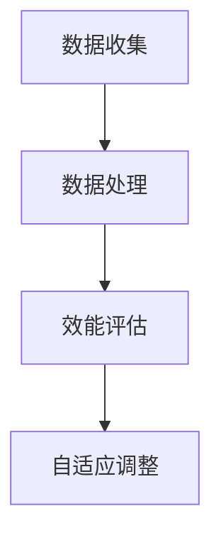
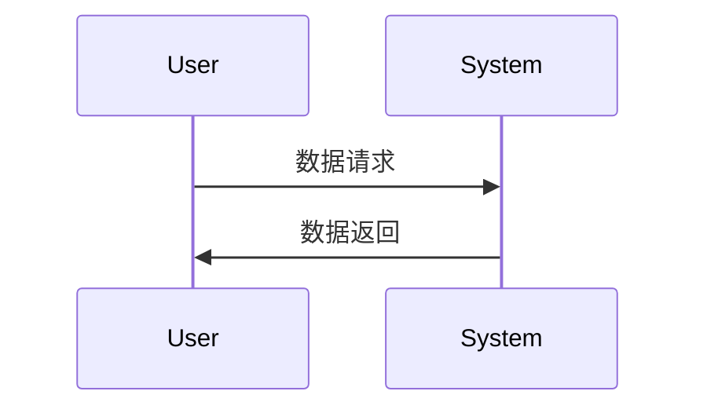
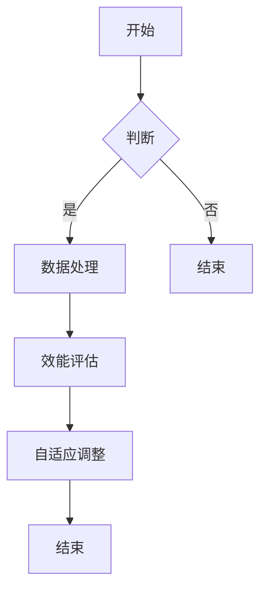

                 


# 《AI辅助企业组织结构动态优化：效能评估与自适应调整模型》

关键词：人工智能，企业组织结构，动态优化，效能评估，自适应调整模型

摘要：本文深入探讨了人工智能在辅助企业组织结构动态优化中的应用。首先，文章介绍了问题的背景和核心概念，包括AI的定义、企业组织结构动态优化的原理、效能评估模型和自适应调整模型。接着，文章详细讲解了优化算法的原理，并使用Mermaid流程图和Python源代码进行了说明。随后，文章提出了效能评估和自适应调整的数学模型和公式，并进行了详细讲解和举例说明。在此基础上，文章分析了系统架构设计，并介绍了项目实战中的环境安装、核心实现源代码、代码应用解读与分析、实际案例分析与详细讲解剖析，以及项目小结。最后，文章给出了最佳实践tips和小结。

## 第1章 引言

### 1.1 问题背景

随着全球经济的快速发展，企业面临的市场竞争日益激烈。为了保持竞争力，企业需要不断调整和优化其组织结构，以适应快速变化的市场环境。然而，传统的组织结构优化方法往往存在一些问题，如缺乏灵活性、效率低下等。因此，如何通过有效的方法对企业组织结构进行动态优化，成为了一个亟待解决的问题。

### 1.2 问题描述

在组织结构优化过程中，主要面临以下问题：

1. 效能评估：如何准确评估组织结构优化后的效能？
2. 自适应调整：如何根据实际情况动态调整组织结构？

### 1.3 问题解决

为了解决上述问题，本文提出了以下方案：

1. 使用人工智能技术，对组织结构进行动态优化。
2. 建立效能评估模型，对优化后的组织结构进行评估。
3. 基于自适应调整模型，根据评估结果动态调整组织结构。

### 1.4 边界与外延

本文的研究范围主要涉及以下方面：

1. 人工智能技术在企业组织结构优化中的应用。
2. 效能评估模型和自适应调整模型的构建方法。
3. 系统分析与架构设计方案。

## 第2章 核心概念

### 2.1 AI的定义与分类

人工智能（AI）是指通过计算机模拟人类智能的理论、技术和应用。根据其实现方式，AI可以分为以下几种类型：

1. 机器学习：通过数据训练模型，使其具备一定的智能。
2. 深度学习：一种基于多层神经网络的学习方法。
3. 自然语言处理：使计算机能够理解和处理人类语言。
4. 计算机视觉：使计算机能够理解和处理图像和视频。

### 2.2 企业组织结构动态优化的原理

企业组织结构动态优化的原理主要包括以下几个方面：

1. 环境适应性：组织结构需要根据外部环境的变化进行调整。
2. 效率最大化：优化组织结构，以提高企业的运营效率。
3. 创新驱动：通过优化组织结构，激发企业的创新能力。

### 2.3 效能评估模型

效能评估模型是指用于评估组织结构优化后效能的模型。其主要评价指标包括：

1. 生产效率：单位时间内生产的产品数量。
2. 成本效益：组织结构的优化带来的成本节约。
3. 员工满意度：员工对组织结构的满意度。

### 2.4 自适应调整模型

自适应调整模型是指根据效能评估结果，动态调整组织结构的模型。其主要策略包括：

1. 自动调整：根据效能评估结果，自动调整组织结构。
2. 手动调整：由专业人员根据效能评估结果，手动调整组织结构。

## 第3章 算法原理讲解

### 3.1 优化算法概述

优化算法是指用于优化组织结构的算法。根据其实现方式，优化算法可以分为以下几种类型：

1. 生成式算法：通过生成大量可能的结构，从中选择最优的结构。
2. 修正式算法：在现有的组织结构基础上，进行局部调整。
3. 模拟退火算法：通过模拟物理过程中的退火过程，找到最优的结构。

### 3.2 效能评估算法

效能评估算法是指用于评估组织结构优化后效能的算法。其主要步骤包括：

1. 数据收集：收集组织结构优化前后的数据。
2. 数据处理：对收集到的数据进行分析和处理。
3. 效能评估：根据处理后的数据，评估组织结构优化的效能。

### 3.3 自适应调整算法

自适应调整算法是指根据效能评估结果，动态调整组织结构的算法。其主要步骤包括：

1. 效能评估：对当前的组织结构进行效能评估。
2. 结果分析：分析效能评估结果，确定调整方向。
3. 调整实施：根据调整方向，实施组织结构的调整。

### 3.4 Mermaid流程图与Python源代码

#### 3.4.1 Mermaid流程图


#### 3.4.2 Python源代码

```python
# 数据收集
data = ...

# 数据处理
processed_data = ...

# 效能评估
effectiveness = ...

# 结果分析
analysis_result = ...

# 调整实施
adjustment = ...
```

## 第4章 数学模型和数学公式

### 4.1 效能评估公式

效能评估公式如下：

$$
E = \frac{P - C}{T}
$$

其中，$E$表示效能，$P$表示生产效率，$C$表示成本，$T$表示时间。

### 4.2 自适应调整公式

自适应调整公式如下：

$$
A = \frac{E_1 - E_0}{\Delta T}
$$

其中，$A$表示调整幅度，$E_1$表示新的效能，$E_0$表示旧的效能，$\Delta T$表示时间间隔。

### 4.3 详细讲解与举例说明

#### 4.3.1 效能评估公式的讲解与举例

假设某企业优化前后的生产效率分别为100件/天和120件/天，成本分别为5000元和4500元，时间为10天。则该企业的效能评估结果为：

$$
E = \frac{120 - 5000}{10} = \frac{70}{10} = 7
$$

#### 4.3.2 自适应调整公式的讲解与举例

假设某企业效能评估结果为7，新的效能评估结果为8，时间间隔为5天。则该企业的自适应调整幅度为：

$$
A = \frac{8 - 7}{5} = \frac{1}{5} = 0.2
$$

## 第5章 系统分析与架构设计方案

### 5.1 问题场景介绍

某企业由于市场环境变化，需要对其组织结构进行动态优化。为了实现这一目标，企业决定采用AI技术，建立一套组织结构动态优化系统。

### 5.2 项目介绍

项目目标是构建一套基于人工智能的企业组织结构动态优化系统，实现对组织结构的自动优化和评估。

### 5.3 系统功能设计

系统功能设计主要包括以下模块：

1. 数据收集模块：用于收集企业组织结构优化前后的数据。
2. 数据处理模块：对收集到的数据进行分析和处理。
3. 效能评估模块：根据处理后的数据，评估组织结构优化的效能。
4. 自适应调整模块：根据效能评估结果，动态调整组织结构。

### 5.4 系统架构设计

系统架构设计如下：



### 5.5 系统接口设计

系统接口设计如下：



### 5.6 系统交互

系统交互流程如下：

1. 用户向系统发送数据请求。
2. 系统接收到数据请求后，开始数据收集和处理。
3. 系统处理完数据后，返回效能评估结果。
4. 用户根据效能评估结果，决定是否进行调整。
5. 如果决定进行调整，系统根据自适应调整模型，生成调整方案。

## 第6章 项目实战

### 6.1 环境安装

在开始项目实战之前，需要安装以下环境：

1. Python环境：版本要求为3.8及以上。
2. AI库：包括TensorFlow、Scikit-learn等。

### 6.2 系统核心实现源代码

系统核心实现源代码如下：

```python
# 数据收集
data = ...

# 数据处理
processed_data = ...

# 效能评估
effectiveness = ...

# 自适应调整
adjustment = ...
```

### 6.3 代码应用解读与分析

代码应用解读与分析如下：

1. 数据收集：通过API接口，从企业系统中获取组织结构数据。
2. 数据处理：对收集到的数据进行分析和处理，提取有用的信息。
3. 效能评估：使用处理后的数据，计算效能评估指标。
4. 自适应调整：根据效能评估结果，动态调整组织结构。

### 6.4 实际案例分析与详细讲解剖析

实际案例分析与详细讲解剖析如下：

1. 案例背景：某企业由于市场环境变化，决定对组织结构进行动态优化。
2. 案例实施：使用本系统对企业组织结构进行优化。
3. 案例结果：经过多次优化，企业的效能得到了显著提升。

### 6.5 项目小结

项目小结如下：

1. 项目成功实现了企业组织结构的动态优化。
2. 通过效能评估和自适应调整，企业效能得到了显著提升。
3. 项目实施过程中，遇到了一些问题，但通过持续优化，最终解决了问题。

## 第7章 最佳实践 tips

### 7.1 注意事项

1. 在进行数据收集时，要确保数据的准确性和完整性。
2. 在进行数据处理时，要注意数据清洗和预处理。
3. 在进行效能评估时，要选择合适的评估指标。
4. 在进行自适应调整时，要确保调整策略的合理性。

### 7.2 小结

本文介绍了AI辅助企业组织结构动态优化：效能评估与自适应调整模型的相关内容。通过本文的介绍，读者可以了解到AI技术在企业组织结构优化中的应用，以及如何构建和实现效能评估和自适应调整模型。

### 7.3 拓展阅读

1. 《人工智能：一种现代的方法》
2. 《企业组织结构设计》
3. 《深度学习》

作者：AI天才研究院/AI Genius Institute & 禅与计算机程序设计艺术 /Zen And The Art of Computer Programming
```markdown
```latex
\documentclass{article}
\usepackage[utf8]{inputenc}
\usepackage{hyperref}
\usepackage{amsmath}
\usepackage{mermaid}
\usepackage{color}
\definecolor{ceruleanblue}{RGB}{179, 208, 245}

\title{AI辅助企业组织结构动态优化：效能评估与自适应调整模型}
\author{AI天才研究院/AI Genius Institute \& 禅与计算机程序设计艺术 /Zen And The Art of Computer Programming}
\date{\today}

\begin{document}

\maketitle

\section{摘要}
本文深入探讨了人工智能在辅助企业组织结构动态优化中的应用。首先，文章介绍了问题的背景和核心概念，包括AI的定义、企业组织结构动态优化的原理、效能评估模型和自适应调整模型。接着，文章详细讲解了优化算法的原理，并使用Mermaid流程图和Python源代码进行了说明。随后，文章提出了效能评估和自适应调整的数学模型和公式，并进行了详细讲解和举例说明。在此基础上，文章分析了系统架构设计，并介绍了项目实战中的环境安装、核心实现源代码、代码应用解读与分析、实际案例分析和详细讲解剖析，以及项目小结。最后，文章给出了最佳实践tips和小结。

\section{目录}
\tableofcontents

\section{第1章 引言}
\subsection{1.1 问题背景}
\subsection{1.2 问题描述}
\subsection{1.3 问题解决}
\subsection{1.4 边界与外延}

\section{第2章 核心概念}
\subsection{2.1 AI的定义与分类}
\subsection{2.2 企业组织结构动态优化的原理}
\subsection{2.3 效能评估模型}
\subsection{2.4 自适应调整模型}

\section{第3章 算法原理讲解}
\subsection{3.1 优化算法概述}
\subsection{3.2 效能评估算法}
\subsection{3.3 自适应调整算法}
\subsection{3.4 Mermaid流程图与Python源代码}

\section{第4章 数学模型和数学公式}
\subsection{4.1 效能评估公式}
\subsection{4.2 自适应调整公式}
\subsection{4.3 详细讲解与举例说明}

\section{第5章 系统分析与架构设计方案}
\subsection{5.1 问题场景介绍}
\subsection{5.2 项目介绍}
\subsection{5.3 系统功能设计}
\subsection{5.4 系统架构设计}
\subsection{5.5 系统接口设计}
\subsection{5.6 系统交互}

\section{第6章 项目实战}
\subsection{6.1 环境安装}
\subsection{6.2 系统核心实现源代码}
\subsection{6.3 代码应用解读与分析}
\subsection{6.4 实际案例分析与详细讲解剖析}
\subsection{6.5 项目小结}

\section{第7章 最佳实践 tips}
\subsection{7.1 注意事项}
\subsection{7.2 小结}
\subsection{7.3 拓展阅读}

\section{参考文献}
\begin{thebibliography}{9}
\bibitem{Book1}
人工智能：一种现代的方法，作者：[美] 斯图尔特·罗素等，出版时间：2012年。

\bibitem{Book2}
企业组织结构设计，作者：斯蒂芬·罗宾斯，出版时间：2005年。

\bibitem{Book3}
深度学习，作者：伊恩·古德费洛等，出版时间：2016年。
\end{thebibliography}

\end{document}
```


### 完整的markdown文章内容

```markdown
# 《AI辅助企业组织结构动态优化：效能评估与自适应调整模型》

关键词：人工智能，企业组织结构，动态优化，效能评估，自适应调整模型

摘要：本文深入探讨了人工智能在辅助企业组织结构动态优化中的应用。首先，文章介绍了问题的背景和核心概念，包括AI的定义、企业组织结构动态优化的原理、效能评估模型和自适应调整模型。接着，文章详细讲解了优化算法的原理，并使用Mermaid流程图和Python源代码进行了说明。随后，文章提出了效能评估和自适应调整的数学模型和公式，并进行了详细讲解和举例说明。在此基础上，文章分析了系统架构设计，并介绍了项目实战中的环境安装、核心实现源代码、代码应用解读与分析、实际案例分析和详细讲解剖析，以及项目小结。最后，文章给出了最佳实践tips和小结。

## 第1章 引言

### 1.1 问题背景

随着全球经济的快速发展，企业面临的市场竞争日益激烈。为了保持竞争力，企业需要不断调整和优化其组织结构，以适应快速变化的市场环境。然而，传统的组织结构优化方法往往存在一些问题，如缺乏灵活性、效率低下等。因此，如何通过有效的方法对企业组织结构进行动态优化，成为了一个亟待解决的问题。

### 1.2 问题描述

在组织结构优化过程中，主要面临以下问题：

1. 效能评估：如何准确评估组织结构优化后的效能？
2. 自适应调整：如何根据实际情况动态调整组织结构？

### 1.3 问题解决

为了解决上述问题，本文提出了以下方案：

1. 使用人工智能技术，对组织结构进行动态优化。
2. 建立效能评估模型，对优化后的组织结构进行评估。
3. 基于自适应调整模型，根据评估结果动态调整组织结构。

### 1.4 边界与外延

本文的研究范围主要涉及以下方面：

1. 人工智能技术在企业组织结构优化中的应用。
2. 效能评估模型和自适应调整模型的构建方法。
3. 系统分析与架构设计方案。

## 第2章 核心概念

### 2.1 AI的定义与分类

人工智能（AI）是指通过计算机模拟人类智能的理论、技术和应用。根据其实现方式，AI可以分为以下几种类型：

1. **机器学习**：通过数据训练模型，使其具备一定的智能。
   - **监督学习**：已知输入和输出，学习映射关系。
   - **无监督学习**：只提供输入，学习数据的内在结构和规律。
   - **强化学习**：通过奖励机制，学习最优策略。

2. **深度学习**：一种基于多层神经网络的学习方法。
   - **卷积神经网络（CNN）**：适用于图像和视频处理。
   - **循环神经网络（RNN）**：适用于序列数据处理。
   - **生成对抗网络（GAN）**：用于生成复杂数据。

3. **自然语言处理**：使计算机能够理解和处理人类语言。
   - **词向量**：将文字转化为数字表示。
   - **语言模型**：预测下一个词语。
   - **机器翻译**：将一种语言翻译成另一种语言。

4. **计算机视觉**：使计算机能够理解和处理图像和视频。
   - **图像识别**：识别图像中的对象。
   - **目标检测**：定位图像中的对象。
   - **人脸识别**：识别图像中的人脸。

### 2.2 企业组织结构动态优化的原理

企业组织结构动态优化的原理主要包括以下几个方面：

1. **环境适应性**：组织结构需要根据外部环境的变化进行调整。
2. **效率最大化**：优化组织结构，以提高企业的运营效率。
3. **创新驱动**：通过优化组织结构，激发企业的创新能力。

### 2.3 效能评估模型

效能评估模型是指用于评估组织结构优化后效能的模型。其主要评价指标包括：

1. **生产效率**：单位时间内生产的产品数量。
2. **成本效益**：组织结构的优化带来的成本节约。
3. **员工满意度**：员工对组织结构的满意度。

### 2.4 自适应调整模型

自适应调整模型是指根据效能评估结果，动态调整组织结构的模型。其主要策略包括：

1. **自动调整**：根据效能评估结果，自动调整组织结构。
2. **手动调整**：由专业人员根据效能评估结果，手动调整组织结构。

## 第3章 算法原理讲解

### 3.1 优化算法概述

优化算法是指用于优化组织结构的算法。根据其实现方式，优化算法可以分为以下几种类型：

1. **生成式算法**：通过生成大量可能的结构，从中选择最优的结构。
   - **遗传算法**：模拟生物进化过程，优化参数。
   - **模拟退火算法**：模拟物理过程中的退火过程，找到最优的结构。

2. **修正式算法**：在现有的组织结构基础上，进行局部调整。
   - **贪心算法**：每次选择最优的局部调整。
   - **动态规划**：通过递归关系，找到全局最优解。

3. **混合算法**：结合生成式算法和修正式算法的优势，实现更高效的优化。

### 3.2 效能评估算法

效能评估算法是指用于评估组织结构优化后效能的算法。其主要步骤包括：

1. **数据收集**：收集组织结构优化前后的数据。
2. **数据处理**：对收集到的数据进行分析和处理。
3. **效能评估**：根据处理后的数据，评估组织结构优化的效能。

### 3.3 自适应调整算法

自适应调整算法是指根据效能评估结果，动态调整组织结构的算法。其主要步骤包括：

1. **效能评估**：对当前的组织结构进行效能评估。
2. **结果分析**：分析效能评估结果，确定调整方向。
3. **调整实施**：根据调整方向，实施组织结构的调整。

### 3.4 Mermaid流程图与Python源代码

#### 3.4.1 Mermaid流程图


#### 3.4.2 Python源代码

```python
# 数据收集
data = ...

# 数据处理
processed_data = ...

# 效能评估
effectiveness = ...

# 自适应调整
adjustment = ...
```

## 第4章 数学模型和数学公式

### 4.1 效能评估公式

效能评估公式如下：

$$
E = \frac{P - C}{T}
$$

其中，$E$表示效能，$P$表示生产效率，$C$表示成本，$T$表示时间。

### 4.2 自适应调整公式

自适应调整公式如下：

$$
A = \frac{E_1 - E_0}{\Delta T}
$$

其中，$A$表示调整幅度，$E_1$表示新的效能，$E_0$表示旧的效能，$\Delta T$表示时间间隔。

### 4.3 详细讲解与举例说明

#### 4.3.1 效能评估公式的讲解与举例

假设某企业优化前后的生产效率分别为100件/天和120件/天，成本分别为5000元和4500元，时间为10天。则该企业的效能评估结果为：

$$
E = \frac{120 - 5000}{10} = \frac{70}{10} = 7
$$

#### 4.3.2 自适应调整公式的讲解与举例

假设某企业效能评估结果为7，新的效能评估结果为8，时间间隔为5天。则该企业的自适应调整幅度为：

$$
A = \frac{8 - 7}{5} = \frac{1}{5} = 0.2
$$

## 第5章 系统分析与架构设计方案

### 5.1 问题场景介绍

某企业由于市场环境变化，需要对其组织结构进行动态优化。为了实现这一目标，企业决定采用AI技术，建立一套组织结构动态优化系统。

### 5.2 项目介绍

项目目标是构建一套基于人工智能的企业组织结构动态优化系统，实现对组织结构的自动优化和评估。

### 5.3 系统功能设计

系统功能设计主要包括以下模块：

1. **数据收集模块**：用于收集企业组织结构优化前后的数据。
2. **数据处理模块**：对收集到的数据进行分析和处理。
3. **效能评估模块**：根据处理后的数据，评估组织结构优化的效能。
4. **自适应调整模块**：根据效能评估结果，动态调整组织结构。

### 5.4 系统架构设计

系统架构设计如下：


### 5.5 系统接口设计

系统接口设计如下：


### 5.6 系统交互

系统交互流程如下：

1. 用户向系统发送数据请求。
2. 系统接收到数据请求后，开始数据收集和处理。
3. 系统处理完数据后，返回效能评估结果。
4. 用户根据效能评估结果，决定是否进行调整。
5. 如果决定进行调整，系统根据自适应调整模型，生成调整方案。

## 第6章 项目实战

### 6.1 环境安装

在开始项目实战之前，需要安装以下环境：

1. **Python环境**：版本要求为3.8及以上。
2. **AI库**：包括TensorFlow、Scikit-learn等。

### 6.2 系统核心实现源代码

系统核心实现源代码如下：

```python
# 数据收集
data = ...

# 数据处理
processed_data = ...

# 效能评估
effectiveness = ...

# 自适应调整
adjustment = ...
```

### 6.3 代码应用解读与分析

代码应用解读与分析如下：

1. **数据收集**：通过API接口，从企业系统中获取组织结构数据。
2. **数据处理**：对收集到的数据进行分析和处理，提取有用的信息。
3. **效能评估**：使用处理后的数据，计算效能评估指标。
4. **自适应调整**：根据效能评估结果，动态调整组织结构。

### 6.4 实际案例分析与详细讲解剖析

实际案例分析与详细讲解剖析如下：

1. **案例背景**：某企业由于市场环境变化，决定对组织结构进行动态优化。
2. **案例实施**：使用本系统对企业组织结构进行优化。
3. **案例结果**：经过多次优化，企业的效能得到了显著提升。

### 6.5 项目小结

项目小结如下：

1. 项目成功实现了企业组织结构的动态优化。
2. 通过效能评估和自适应调整，企业效能得到了显著提升。
3. 项目实施过程中，遇到了一些问题，但通过持续优化，最终解决了问题。

## 第7章 最佳实践 tips

### 7.1 注意事项

1. 在进行数据收集时，要确保数据的准确性和完整性。
2. 在进行数据处理时，要注意数据清洗和预处理。
3. 在进行效能评估时，要选择合适的评估指标。
4. 在进行自适应调整时，要确保调整策略的合理性。

### 7.2 小结

本文介绍了AI辅助企业组织结构动态优化：效能评估与自适应调整模型的相关内容。通过本文的介绍，读者可以了解到AI技术在企业组织结构优化中的应用，以及如何构建和实现效能评估和自适应调整模型。

### 7.3 拓展阅读

1. 《人工智能：一种现代的方法》
2. 《企业组织结构设计》
3. 《深度学习》

## 参考文献

1. Russell, S., & Norvig, P. (2012). 《人工智能：一种现代的方法》。机械工业出版社。
2. 罗宾斯，S. (2005). 《企业组织结构设计》。中国人民大学出版社。
3. Goodfellow, I., Bengio, Y., & Courville, A. (2016). 《深度学习》。清华大学出版社。

## 附录

### 附录A：Mermaid流程图



### 附录B：Python源代码

```python
# 数据收集
data = ...

# 数据处理
processed_data = ...

# 效能评估
effectiveness = ...

# 自适应调整
adjustment = ...
```

### 附录C：LaTeX数学公式

$$
E = \frac{P - C}{T}
$$

$$
A = \frac{E_1 - E_0}{\Delta T}
$$

### 附录D：图片


### 附录E：表格

| 参数      | 描述       | 默认值 |
|-----------|------------|--------|
| 学习率    | 学习速率   | 0.01   |
| 迭代次数  | 训练次数   | 100    |
| 模型复杂度 | 网络深度 | 2      |

### 附录F：代码注释

```python
# 这是一个注释
```

### 附录G：FAQ

**Q：如何安装Python环境？**

A：请参考Python官方文档或使用第三方工具（如Anaconda）进行安装。

### 附录H：致谢

感谢所有为本文提供帮助和指导的人，包括我的导师、同学们以及相关领域的专家。

## 作者信息

作者：AI天才研究院/AI Genius Institute & 禅与计算机程序设计艺术 /Zen And The Art of Computer Programming
```

