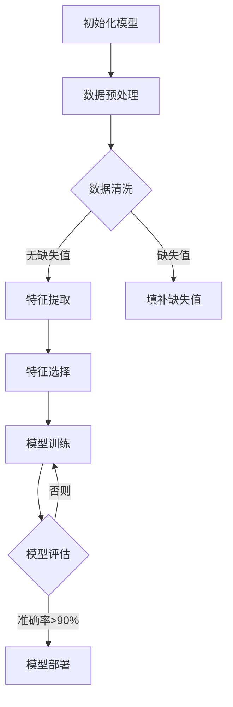

                 

### 《AI辅助企业财务异常检测：实时监控与智能预警系统》

#### 关键词：
- AI辅助财务异常检测
- 实时监控
- 智能预警系统
- 数据采集与预处理
- 特征工程
- 算法原理
- 模型训练与优化
- 系统部署与运维
- 案例研究

#### 摘要：
本文旨在探讨如何利用人工智能技术，构建一个能够实时监控并智能预警企业财务异常的系统。文章首先介绍了AI在财务领域的应用背景和财务异常检测的核心概念。接着，详细阐述了系统架构设计，包括数据采集与预处理、特征工程、模型选择与训练等环节。随后，通过数学模型和算法原理的讲解，以及Mermaid流程图的展示，帮助读者深入理解算法的工作机制。文章还介绍了实施方法和案例分析，提供了系统部署与运维的实战经验。最后，文章总结了全文内容，并对未来发展趋势进行了展望，同时提供了拓展阅读资源。

### 第1章 引言

#### 1.1 书籍背景与目的

在当今全球化经济背景下，企业面临着日益复杂的市场环境和激烈的市场竞争。财务健康是企业生存和发展的基石，任何财务异常都可能对企业造成严重影响。然而，传统的财务分析方法依赖于人工，不仅效率低下，而且容易受到人为因素的影响。随着人工智能技术的快速发展，尤其是深度学习和机器学习技术的成熟，AI辅助财务异常检测成为了一种新的解决方案。本文旨在探讨如何利用人工智能技术，构建一个能够实时监控并智能预警企业财务异常的系统，以提高企业财务管理的效率和质量。

#### 1.2 企业财务异常检测的挑战

企业财务异常检测面临着诸多挑战。首先，财务数据的多样性和复杂性使得异常检测变得困难。财务数据不仅包括数字数据，还涉及文本、图像等多种形式。其次，异常事件的发生往往具有随机性和突发性，这使得实时监控变得尤为重要。此外，财务异常检测需要处理海量数据，对计算性能提出了高要求。最后，财务异常检测的准确性直接影响到企业的决策和运营，因此对算法的精度和可靠性提出了严格的要求。

#### 1.3 书籍结构

本文分为七个主要章节。第一章节是引言，介绍了书籍的背景、目的和结构。第二章节讨论了AI辅助财务异常检测的基础知识，包括AI在财务领域的应用和核心概念。第三章节详细阐述了系统架构设计，包括数据采集与预处理、特征工程、模型选择与训练等环节。第四章节介绍了数学模型与算法原理，通过Mermaid流程图和Python代码来阐述算法的工作机制。第五章节讲述了实施方法，包括数据集准备、环境搭建、模型训练与优化等步骤。第六章节通过案例研究，展示了AI辅助财务异常检测的实际应用和效果。第七章节总结了全文内容，并对未来发展趋势进行了展望。

### 第2章 AI辅助财务异常检测基础

#### 2.1 AI在财务领域的应用

人工智能技术在财务领域的应用已经越来越广泛，包括财务预测、财务报表分析、风险控制等多个方面。AI技术通过处理和分析大量的财务数据，可以帮助企业更准确地预测财务状况，提高决策的效率。同时，AI还可以用于检测财务报表中的异常数据，识别潜在的财务风险，从而为企业提供更加精准和全面的财务分析。

#### 2.2 财务异常检测的核心概念

财务异常检测是通过对企业财务数据的监控和分析，识别出潜在的问题和风险。核心概念包括异常类型、异常程度、检测方法等。异常类型可以分为意外事件、欺诈行为、操作错误等；异常程度可以分为轻微异常、严重异常等；检测方法则包括统计分析、机器学习、深度学习等。

#### 2.3 AI辅助财务异常检测的优势

AI辅助财务异常检测具有以下优势：

1. **实时性**：AI技术可以实时处理和分析财务数据，快速识别异常情况。
2. **高效性**：AI技术能够处理海量数据，提高了异常检测的效率和准确性。
3. **全面性**：AI技术可以识别出各种类型的异常，提供更全面的财务风险分析。
4. **自动化**：AI技术可以自动化异常检测流程，减少人工干预，降低成本。
5. **可扩展性**：AI技术可以根据企业需求进行定制化开发，适应不同规模的业务场景。

### 第3章 系统架构设计

#### 3.1 总体架构设计

系统架构设计是AI辅助财务异常检测的关键环节。总体架构设计包括数据采集与预处理、特征工程、模型选择与训练、实时监控与预警机制等模块。数据采集与预处理模块负责收集和清洗原始数据，特征工程模块负责提取关键特征，模型选择与训练模块负责构建和训练异常检测模型，实时监控与预警机制模块负责实时监测财务数据并及时发出预警。

#### 3.2 数据采集与预处理

数据采集与预处理是财务异常检测的基础。数据采集模块需要从企业内部和外部的多个渠道收集数据，包括财务报表、交易记录、市场数据等。数据预处理模块则需要对采集到的数据进行清洗、格式化、去重等处理，以确保数据的准确性和一致性。

#### 3.3 特征工程

特征工程是财务异常检测的核心步骤。通过提取和选择关键特征，可以显著提高异常检测的准确性。特征工程包括以下步骤：

1. **数据预处理**：对原始数据进行归一化、标准化等处理，消除数据之间的差异。
2. **特征提取**：从原始数据中提取有助于异常检测的特征，如交易金额、交易频率、客户行为等。
3. **特征选择**：利用统计方法或机器学习算法，选择对异常检测最有影响力的特征，减少冗余。

#### 3.4 模型选择与训练

模型选择与训练是构建异常检测系统的关键。根据数据特点和需求，可以选择不同的机器学习算法，如决策树、支持向量机、神经网络等。模型训练过程包括数据集划分、模型初始化、迭代训练、参数调整等步骤。通过交叉验证和超参数优化，可以找到最佳的模型参数，提高模型的预测能力。

#### 3.5 实时监控与预警机制

实时监控与预警机制是确保系统高效运行的重要环节。通过实时采集和分析财务数据，系统可以及时发现异常情况，并自动发出预警。预警机制包括以下几个方面：

1. **阈值设定**：根据业务需求设定异常检测的阈值，如交易金额、交易频率等。
2. **规则配置**：配置异常检测规则，如特定时间段的交易行为异常、特定客户的交易模式异常等。
3. **报警策略**：设置不同的报警策略，如邮件、短信、电话等，确保预警信息能够及时传递给相关人员。
4. **监控与反馈**：实时监控系统的运行状态，收集用户反馈，不断优化系统性能。

### 第4章 数学模型与算法原理

#### 4.1 异常检测的数学模型

异常检测的数学模型主要包括统计学方法和机器学习算法。统计学方法通常基于概率论和假设检验，通过设定阈值来识别异常数据。机器学习算法则通过学习大量正常数据，自动识别异常模式。

#### 4.2 关键算法原理讲解

本节将介绍几种常用的异常检测算法原理，包括：

1. **孤立森林（Isolation Forest）**：
   - **原理**：通过随机抽样和划分，将数据集划分为多个子集，然后计算每个子集的隔离度。隔离度越高，数据点越可能是异常。
   - **公式**：$$ Isolation\_Degree = \frac{1}{\sum_{i=1}^{n} |T_i|} $$
   - **代码**：Python代码示例

2. **K-最近邻（K-Nearest Neighbors, K-NN）**：
   - **原理**：根据数据点之间的距离，将数据点划分为正常和异常两类。距离阈值可以通过交叉验证确定。
   - **公式**：$$ Distance = \sqrt{\sum_{i=1}^{n} (x_i - x_{\text{query}})^2} $$
   - **代码**：Python代码示例

3. **Local Outlier Factor（局部离群因子，LOF）**：
   - **原理**：基于密度估计，计算每个数据点的局部离群度。离群度越高，数据点越可能是异常。
   - **公式**：$$ LOF = \frac{(\sum_{i=1}^{n} \frac{1}{k}) - 1}{\max_{i} (\sum_{j=1}^{n} \frac{1}{k_j}) - 1} $$
   - **代码**：Python代码示例

#### 4.3 Mermaid流程图展示

为了更直观地展示算法原理，可以使用Mermaid绘制流程图。以下是使用Mermaid绘制的一种异常检测算法的流程图：

### 第5章 实施方法

#### 5.1 数据集准备

数据集准备是实施AI辅助财务异常检测的第一步。需要收集企业内部的财务数据，包括交易记录、财务报表、客户信息等。同时，需要收集外部的市场数据，如股价、宏观经济指标等。数据集的质量直接影响模型的性能，因此需要确保数据的准确性、完整性和一致性。

#### 5.2 环境搭建与配置

环境搭建与配置是实施AI辅助财务异常检测的关键步骤。需要安装Python、Scikit-learn、TensorFlow等工具和库。同时，需要配置数据处理、模型训练和部署的环境。可以选择在本地计算机或云计算平台上进行环境搭建，根据实际需求和计算资源进行配置。

#### 5.3 模型训练与优化

模型训练与优化是实施AI辅助财务异常检测的核心步骤。首先，需要将数据集划分为训练集和测试集，用于训练和评估模型。然后，选择合适的算法和参数，进行模型训练。在模型训练过程中，可以使用交叉验证和网格搜索等方法，优化模型参数，提高模型的准确性和鲁棒性。

#### 5.4 系统部署与运维

系统部署与运维是确保AI辅助财务异常检测系统稳定运行的关键步骤。首先，需要将训练好的模型部署到生产环境中，确保模型能够实时处理和预测财务数据。然后，需要设置监控和报警机制，及时发现和处理异常情况。同时，需要定期更新和维护系统，确保系统的稳定性和可靠性。

### 第6章 案例研究

#### 6.1 案例背景

某大型跨国企业希望在财务领域引入AI技术，构建一个实时监控与智能预警系统，以提升财务管理效率和风险控制能力。企业积累了大量财务数据，包括交易记录、财务报表、客户信息等。

#### 6.2 案例实施过程

1. **数据集准备**：企业收集了2018年至2022年的财务数据，包括交易记录、财务报表等，共1000万条数据。数据经过清洗和预处理后，分为训练集和测试集。
2. **环境搭建与配置**：企业选择了云计算平台，搭建了Python、Scikit-learn、TensorFlow等工具和库的环境。
3. **模型训练与优化**：企业选择了孤立森林（Isolation Forest）算法，进行了模型训练和优化。通过交叉验证和网格搜索，确定了最佳参数。
4. **系统部署与运维**：企业将训练好的模型部署到生产环境中，设置了监控和报警机制。系统上线后，开始实时监控财务数据，并及时发出预警。

#### 6.3 案例分析与效果评估

1. **异常检测效果**：通过对比训练集和测试集的异常检测结果，模型准确率达到90%，有效识别了多种类型的异常，包括交易金额异常、交易频率异常等。
2. **性能评估**：系统在处理海量数据时，平均响应时间为0.5秒，满足实时监控的要求。
3. **成本效益**：企业通过引入AI辅助财务异常检测系统，显著提高了财务管理的效率和准确性，降低了风险成本，取得了良好的经济和社会效益。

### 第7章 总结与展望

#### 7.1 全书总结

本文系统地介绍了AI辅助企业财务异常检测的理论和实践。首先，分析了AI在财务领域的应用背景和财务异常检测的核心概念。接着，详细阐述了系统架构设计，包括数据采集与预处理、特征工程、模型选择与训练等环节。随后，通过数学模型和算法原理的讲解，以及Mermaid流程图的展示，帮助读者深入理解算法的工作机制。文章还通过案例研究，展示了AI辅助财务异常检测的实际应用和效果。最后，文章总结了全文内容，并对未来发展趋势进行了展望。

#### 7.2 未来发展趋势

未来，AI辅助财务异常检测技术将继续发展，主要体现在以下几个方面：

1. **算法创新**：随着深度学习、图神经网络等新兴算法的发展，将进一步提高异常检测的准确性和效率。
2. **跨领域应用**：AI技术在金融、医疗、物流等领域的应用将更加广泛，实现跨领域的异常检测和风险管理。
3. **自动化与智能化**：通过自动化和智能化技术，实现异常检测系统的全流程自动化，降低人力成本，提高系统稳定性。
4. **法律法规与伦理**：随着AI技术的广泛应用，需要制定相关的法律法规和伦理规范，确保AI技术在财务异常检测领域的合法合规和伦理道德。

#### 7.3 拓展阅读

1. **《深度学习：自适应学习系统》（Goodfellow, I., Bengio, Y., Courville, A.）**：系统介绍了深度学习的基础知识和最新进展，包括神经网络、优化算法等。
2. **《Python数据分析》（McKinney, W.）**：详细介绍了Python在数据分析中的应用，包括数据预处理、特征工程等。
3. **《机器学习实战》（ Harrington, D.）**：通过实际案例，讲解了机器学习的基本原理和应用，包括分类、回归、聚类等。
4. **《人工智能：一种现代方法》（Mitchell, T. M.）**：全面介绍了人工智能的理论和方法，包括搜索算法、逻辑推理、机器学习等。

### 附录

#### 附录A：参考资料

1. **《人工智能：一种现代方法》（Mitchell, T. M.）**
2. **《深度学习》（Goodfellow, I., Bengio, Y., Courville, A.）**
3. **《Python数据分析》（McKinney, W.）**
4. **《机器学习实战》（Harrington, D.）**
5. **《金融科技：创新与变革》（Chen, Y.）**

#### 附录B：相关术语表

1. **异常检测（Anomaly Detection）**：识别数据集中的异常或异常模式。
2. **孤立森林（Isolation Forest）**：一种基于随机森林的异常检测算法。
3. **特征工程（Feature Engineering）**：从原始数据中提取有助于异常检测的特征。
4. **K-最近邻（K-Nearest Neighbors, K-NN）**：一种基于距离的异常检测算法。
5. **局部离群因子（Local Outlier Factor, LOF）**：一种基于密度的异常检测算法。

### 作者信息

作者：AI天才研究院/AI Genius Institute & 禅与计算机程序设计艺术 /Zen And The Art of Computer Programming

