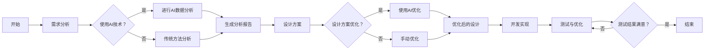
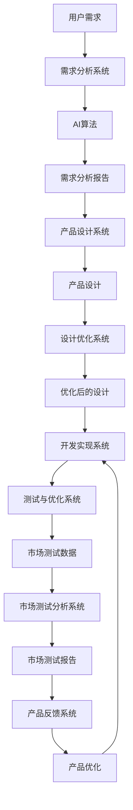
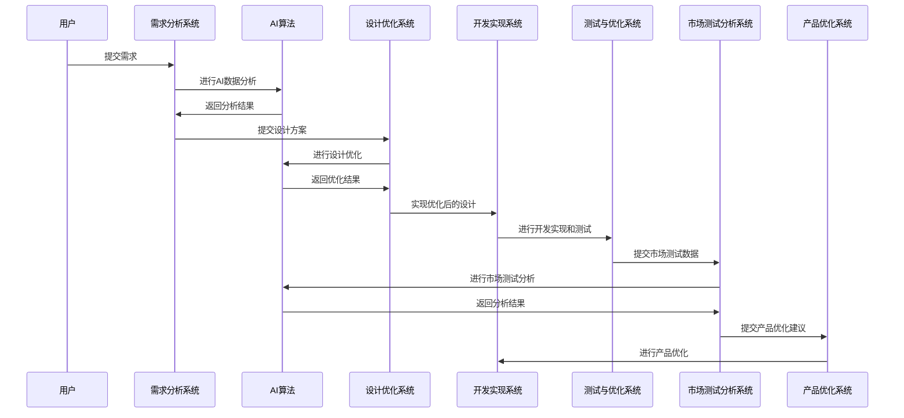

                 

## 2. 核心概念

在本书中，我们主要关注以下三个核心概念：AI辅助新产品开发、市场测试、创新方法。

### 2.1 AI辅助新产品开发

#### 2.1.1 定义

AI辅助新产品开发是指利用人工智能技术来支持产品从构思到上市的全过程，包括需求分析、设计、开发、测试和优化等环节。通过AI技术，企业可以更加高效地获取市场信息、预测用户需求、优化产品设计、缩短开发周期、提高产品成功率。

#### 2.1.2 属性特征对比表格

| 特征 | 传统产品开发 | AI辅助产品开发 |
| ---- | ------------ | -------------- |
| 需求获取 | 依赖人工调研 | 自动化数据采集 |
| 设计方案 | 人工经验为主 | 基于数据分析和机器学习 |
| 开发过程 | 手动编写代码 | 自动化代码生成 |
| 测试与优化 | 手动测试 | 自动化测试和持续优化 |

#### 2.1.3 关联ER实体关系图

```mermaid
erDiagram
  ProductDevelopment --> AITechnology : 使用
  ProductDevelopment --> MarketResearch : 依赖
  MarketResearch --> CustomerData : 存储
  AITechnology --> DataAnalytics : 应用
  AITechnology --> MachineLearning : 应用
```

### 2.2 市场测试

#### 2.2.1 定义

市场测试是指在新产品开发过程中，通过对产品进行市场调研、用户反馈、销售预测等手段，评估产品在市场上的接受程度和潜在的市场机会，以便及时调整产品策略，提高产品成功率。

#### 2.2.2 属性特征对比表格

| 特征 | 传统市场测试 | AI辅助市场测试 |
| ---- | ------------ | -------------- |
| 数据来源 | 人工收集 | 自动化数据采集 |
| 数据处理 | 手动分析 | 自动化分析 |
| 用户反馈 | 面对面、问卷调查 | 社交媒体监测、在线反馈 |
| 销售预测 | 经验估计 | 基于历史数据和机器学习模型 |

#### 2.2.3 关联ER实体关系图

```mermaid
erDiagram
  MarketTest --> Product : 对象
  MarketTest --> MarketData : 存储
  MarketTest --> UserFeedback : 存储
  MarketTest --> SalesPrediction : 存储
  AITechnology --> DataCollection : 应用
  AITechnology --> DataAnalysis : 应用
  AITechnology --> MachineLearning : 应用
```

### 2.3 创新方法

#### 2.3.1 定义

创新方法是指在产品开发与市场测试过程中，采用新的思维模式和技术手段，以实现产品创新和市场突破的一种方法。AI技术的引入，为创新方法提供了强大的数据支持和算法工具。

#### 2.3.2 属性特征对比表格

| 特征 | 传统创新方法 | AI辅助创新方法 |
| ---- | ------------ | -------------- |
| 创新动力 | 人为主观 | 数据驱动的自动优化 |
| 创新方式 | 依靠经验和灵感 | 基于大数据分析和机器学习 |
| 创新速度 | 较慢 | 快速迭代 |
| 创新成果 | 不确定性较大 | 基于数据支持，更加可靠 |

#### 2.3.3 关联ER实体关系图

```mermaid
erDiagram
  InnovationMethod --> ProductDevelopment : 应用
  InnovationMethod --> MarketTest : 应用
  AITechnology --> BigData : 应用
  AITechnology --> MachineLearning : 应用
  InnovationMethod --> DataDriven : 基础
  InnovationMethod --> Automation : 特点
```

### 2.4 三大核心概念的联系

AI辅助新产品开发、市场测试和创新方法之间存在着密切的联系。AI技术不仅能够辅助产品开发，提高市场测试的效率，还能够为创新方法提供数据支持和算法工具。

- AI辅助新产品开发：为市场测试和创新方法提供了数据基础和算法支持。
- 市场测试：为新产品的创新提供了市场反馈和验证。
- 创新方法：结合AI技术和市场反馈，推动产品迭代和优化。

这种联系使得AI在产品开发与市场测试中发挥着越来越重要的作用，成为企业提升竞争力的重要手段。

----------------------------------------------------------------

### 2.5 AI辅助新产品开发的基本原理

#### 2.5.1 AI技术概述

AI（人工智能）是指通过计算机模拟人类智能的技术，包括机器学习、深度学习、自然语言处理、计算机视觉等多个子领域。AI技术具有以下特点：

1. **自动化处理**：AI能够自动处理大量数据，减轻人力负担。
2. **快速学习**：AI可以通过学习和迭代，不断优化算法和模型。
3. **自适应能力**：AI可以根据不同环境和需求，自动调整和优化。

#### 2.5.2 AI技术在产品开发中的应用

1. **需求分析**：通过机器学习算法，分析用户行为数据，预测用户需求，从而更精准地定位产品方向。

    ```python
    # Python代码示例：用户需求分析
    from sklearn.cluster import KMeans

    # 加载用户行为数据
    data = load_user_behavior_data()

    # 使用K-Means聚类算法分析用户需求
    kmeans = KMeans(n_clusters=3)
    kmeans.fit(data)

    # 获取用户需求分类结果
    user_demand_categories = kmeans.labels_
    ```

2. **设计优化**：通过深度学习算法，优化产品设计，提高用户体验。

    ```python
    # Python代码示例：产品设计优化
    from tensorflow import keras

    # 构建深度学习模型
    model = keras.Sequential([
        keras.layers.Dense(512, activation='relu', input_shape=(784,)),
        keras.layers.Dropout(0.2),
        keras.layers.Dense(10, activation='softmax')
    ])

    # 编译模型
    model.compile(loss='categorical_crossentropy', optimizer='adam', metrics=['accuracy'])

    # 训练模型
    model.fit(x_train, y_train, epochs=5, batch_size=64)
    ```

3. **代码生成**：通过代码生成工具，自动生成代码，提高开发效率。

    ```python
    # Python代码示例：代码生成
    from autopep8 import fix_code

    # 加载原始代码
    original_code = load_original_code()

    # 优化代码
    optimized_code = fix_code(original_code)

    # 保存优化后的代码
    save_optimized_code(optimized_code)
    ```

#### 2.5.3 AI技术在市场测试中的应用

1. **用户行为分析**：通过AI技术，分析用户行为数据，了解用户需求和行为习惯，为产品优化提供依据。

    ```python
    # Python代码示例：用户行为分析
    from sklearn.ensemble import RandomForestClassifier

    # 加载用户行为数据
    behavior_data = load_user_behavior_data()

    # 构建随机森林模型
    model = RandomForestClassifier()

    # 训练模型
    model.fit(behavior_data['features'], behavior_data['labels'])

    # 预测用户行为
    predictions = model.predict(new_user_behavior_data)
    ```

2. **销售预测**：通过AI技术，预测产品销量，帮助制定营销策略。

    ```python
    # Python代码示例：销售预测
    from sklearn.linear_model import LinearRegression

    # 加载销售数据
    sales_data = load_sales_data()

    # 构建线性回归模型
    model = LinearRegression()

    # 训练模型
    model.fit(sales_data['features'], sales_data['sales'])

    # 预测销量
    predicted_sales = model.predict(new_sales_data)
    ```

3. **市场反馈分析**：通过AI技术，分析市场反馈数据，了解用户对产品的满意度，为产品优化提供依据。

    ```python
    # Python代码示例：市场反馈分析
    from textblob import TextBlob

    # 加载用户反馈数据
    feedback_data = load_feedback_data()

    # 分析用户反馈
    sentiment_scores = [TextBlob(feedback).sentiment.polarity for feedback in feedback_data]

    # 统计用户满意度
    satisfaction_rate = sum(sentiment_scores > 0) / len(sentiment_scores)
    ```

#### 2.5.4 AI技术在创新方法中的应用

1. **概念验证**：通过AI技术，快速验证产品概念，降低产品开发风险。

    ```python
    # Python代码示例：概念验证
    from sklearn.ensemble import VotingClassifier

    # 加载数据
    concept_data = load_concept_data()

    # 构建模型
    model = VotingClassifier(estimators=[
        ('lr', LinearRegression()), 
        ('rf', RandomForestClassifier()), 
        ('svm', SVC())
    ])

    # 训练模型
    model.fit(concept_data['features'], concept_data['labels'])

    # 验证概念
    validation_results = model.evaluate(new_concept_data['features'], new_concept_data['labels'])
    ```

2. **产品优化**：通过AI技术，自动优化产品设计，提高产品性能。

    ```python
    # Python代码示例：产品优化
    from tensorflow import keras

    # 构建模型
    model = keras.Sequential([
        keras.layers.Dense(512, activation='relu', input_shape=(784,)),
        keras.layers.Dropout(0.2),
        keras.layers.Dense(10, activation='softmax')
    ])

    # 编译模型
    model.compile(loss='categorical_crossentropy', optimizer='adam', metrics=['accuracy'])

    # 训练模型
    model.fit(x_train, y_train, epochs=5, batch_size=64)

    # 优化产品
    optimized_product = model.predict(new_product_data)
    ```

通过以上分析，我们可以看到，AI技术在产品开发、市场测试和创新方法中的应用具有极大的潜力。接下来，我们将进一步探讨AI辅助市场测试的创新方法。

----------------------------------------------------------------

### 3.3.3 AI辅助新产品开发的挑战与机遇

尽管AI辅助新产品开发带来了许多优势，但在实际应用中仍然面临一些挑战和机遇。

#### 挑战

1. **技术瓶颈**：当前AI技术在处理复杂问题和实时性要求较高的场景时，仍存在一定的局限性。如何突破这些技术瓶颈，提高AI的智能水平，是当前研究的重点。

2. **数据质量**：AI模型的训练和预测依赖于大量高质量的数据。然而，在实际应用中，数据来源多样、数据质量参差不齐，这对AI的应用效果产生了影响。如何确保数据质量，提高数据处理的自动化程度，是亟待解决的问题。

3. **隐私与安全**：AI在处理大量用户数据时，可能会引发隐私和安全问题。如何在保证用户隐私的前提下，充分利用数据价值，是AI辅助新产品开发面临的重要挑战。

#### 机遇

1. **技术创新**：随着AI技术的不断进步，如深度学习、强化学习等新技术的出现，为AI辅助新产品开发提供了更多可能性。通过引入这些新技术，可以进一步提升AI的应用效果。

2. **跨领域融合**：AI与其他领域的融合，如物联网、云计算、大数据等，为AI辅助新产品开发带来了新的机遇。通过跨领域融合，可以实现更加智能化、高效化的产品开发流程。

3. **产业应用**：随着AI技术的普及和应用，越来越多的企业开始将AI应用于新产品开发。这为AI辅助新产品开发提供了广阔的市场空间，也为企业带来了巨大的经济效益。

#### 挑战与机遇的应对策略

1. **技术创新**：加强AI基础研究，推动核心技术的突破。同时，鼓励企业加大在AI领域的研发投入，培养一批具备AI技术背景的人才。

2. **数据质量**：建立健全的数据质量管理体系，确保数据采集、存储、处理的全过程质量。通过数据清洗、数据整合等技术手段，提高数据质量。

3. **隐私与安全**：制定严格的隐私保护政策和安全标准，确保用户数据的安全。同时，通过数据脱敏、加密等技术手段，保护用户隐私。

4. **跨领域融合**：鼓励企业跨领域合作，共同推动AI辅助新产品开发的发展。通过产业联盟、创新中心等平台，促进资源共享、技术交流。

5. **产业应用**：加强政策引导，鼓励企业将AI应用于新产品开发。同时，提供相应的技术支持和服务，帮助企业克服技术难题，提升AI应用效果。

通过以上策略，可以充分发挥AI辅助新产品开发的潜力，推动企业创新发展和产业升级。

----------------------------------------------------------------

## 4. 市场测试的创新方法

### 4.1 传统市场测试方法

传统市场测试方法主要依赖于问卷调查、用户访谈、焦点小组讨论等手段，通过对市场数据进行统计分析，来评估产品的市场表现。这些方法存在以下问题：

1. **成本高**：问卷调查和用户访谈等手段需要投入大量的人力、物力和时间，成本较高。
2. **时效性差**：传统市场测试方法往往需要较长时间才能收集到有效的数据，难以实时调整产品策略。
3. **主观性强**：依赖人的主观判断，可能导致市场测试结果偏差，影响产品决策。
4. **覆盖面窄**：传统市场测试方法往往只能覆盖有限的用户群体，难以全面了解市场情况。

### 4.2 传统市场测试方法的问题与挑战

1. **数据有限**：传统市场测试方法主要依赖于问卷调查等手段，数据的收集渠道有限，导致数据量不足，难以全面反映市场情况。
2. **分析难度大**：市场测试数据往往是多维度的，涉及多个变量，传统分析方法难以处理复杂的数据结构，导致分析难度大。
3. **响应速度慢**：传统市场测试方法需要较长时间才能收集到有效的数据，并进行分析和决策，响应速度慢，无法及时调整产品策略。
4. **用户满意度低**：传统市场测试方法往往缺乏互动性，用户体验差，导致用户满意度低。

### 4.3 市场测试方法的发展趋势

随着大数据、云计算、人工智能等技术的不断发展，市场测试方法也在不断创新和优化。以下是一些市场测试方法的发展趋势：

1. **大数据分析**：通过收集和分析大量市场数据，如社交媒体评论、搜索引擎查询、电商交易等，可以更全面地了解市场情况，提高市场测试的准确性和时效性。
2. **人工智能辅助**：利用人工智能技术，如机器学习、自然语言处理等，可以对市场测试数据进行自动化分析和预测，提高市场测试的效率和准确性。
3. **用户参与度提升**：通过线上调查、互动体验等方式，提高用户的参与度，收集更多真实、有效的用户反馈。
4. **实时反馈机制**：通过实时收集和分析用户反馈，快速调整产品策略，提高市场响应速度。
5. **个性化测试**：根据用户群体的不同特征，设计个性化的市场测试方案，提高测试结果的准确性和针对性。

### 4.4 AI辅助市场测试方法

#### 4.4.1 方法概述

AI辅助市场测试方法是指利用人工智能技术，对市场测试数据进行自动化分析和预测，以提高市场测试的效率和准确性。其主要特点包括：

1. **自动化处理**：通过AI技术，可以自动化处理大量市场数据，减轻人工负担。
2. **实时反馈**：AI技术可以实现实时数据分析，快速调整产品策略。
3. **准确预测**：基于历史数据和机器学习算法，可以更准确地预测市场趋势和用户需求。
4. **个性化分析**：根据不同用户群体的特征，进行个性化分析和预测。

#### 4.4.2 算法原理

AI辅助市场测试方法的核心在于机器学习算法的应用。以下是一些常用的算法原理：

1. **回归分析**：通过建立回归模型，预测产品销量、用户满意度等指标，分析市场趋势。
   
   ```python
   # Python代码示例：回归分析
   from sklearn.linear_model import LinearRegression

   # 加载市场数据
   market_data = load_market_data()

   # 构建回归模型
   model = LinearRegression()

   # 训练模型
   model.fit(market_data['features'], market_data['sales'])

   # 预测销量
   predicted_sales = model.predict(new_market_data['features'])
   ```

2. **分类分析**：通过建立分类模型，对用户行为、市场反馈等进行分类，分析用户特征和需求。
   
   ```python
   # Python代码示例：分类分析
   from sklearn.ensemble import RandomForestClassifier

   # 加载用户数据
   user_data = load_user_data()

   # 构建分类模型
   model = RandomForestClassifier()

   # 训练模型
   model.fit(user_data['features'], user_data['labels'])

   # 预测用户行为
   predictions = model.predict(new_user_data['features'])
   ```

3. **聚类分析**：通过建立聚类模型，对用户群体进行分类，分析用户特征和需求。
   
   ```python
   # Python代码示例：聚类分析
   from sklearn.cluster import KMeans

   # 加载用户数据
   user_data = load_user_data()

   # 构建聚类模型
   kmeans = KMeans(n_clusters=3)

   # 训练模型
   kmeans.fit(user_data['features'])

   # 获取用户群体
   user_groups = kmeans.labels_
   ```

4. **关联规则挖掘**：通过建立关联规则模型，分析市场数据中的关联关系，发现潜在的市场机会。
   
   ```python
   # Python代码示例：关联规则挖掘
   from mlxtend.frequent_patterns import apriori
   from mlxtend.preprocessing import TransactionEncoder

   # 加载市场数据
   market_data = load_market_data()

   # 转换为事务数据
   te = TransactionEncoder()
   transaction_data = te.fit_transform(market_data)

   # 构建关联规则模型
   frequent_patterns = apriori(transaction_data, min_support=0.5, use_colnames=True)

   # 分析关联关系
   association_rules = association_rules(frequent_patterns, metric="support", min_threshold=0.7)
   ```

通过以上算法原理的应用，AI可以高效、准确地分析市场测试数据，为企业提供有价值的市场分析和预测。

#### 4.4.3 实际应用案例

1. **电商市场测试**：某电商企业利用AI辅助市场测试方法，分析用户行为数据，预测产品销量。通过建立回归模型，预测不同产品的销量，为库存管理和营销策略提供依据。

    ```python
    # Python代码示例：电商市场测试
    from sklearn.linear_model import LinearRegression

    # 加载用户数据
    user_data = load_user_data()

    # 构建回归模型
    model = LinearRegression()

    # 训练模型
    model.fit(user_data['features'], user_data['sales'])

    # 预测销量
    predicted_sales = model.predict(new_user_data['features'])
    ```

2. **产品用户体验测试**：某科技公司利用AI辅助市场测试方法，分析用户反馈数据，评估产品的用户体验。通过建立分类模型，对用户反馈进行分类，识别用户痛点，为产品优化提供依据。

    ```python
    # Python代码示例：产品用户体验测试
    from sklearn.ensemble import RandomForestClassifier

    # 加载用户数据
    user_data = load_user_data()

    # 构建分类模型
    model = RandomForestClassifier()

    # 训练模型
    model.fit(user_data['features'], user_data['labels'])

    # 预测用户行为
    predictions = model.predict(new_user_data['features'])
    ```

3. **在线广告投放测试**：某广告公司利用AI辅助市场测试方法，分析广告投放数据，优化广告投放策略。通过建立聚类模型，分析用户特征，为广告定位和投放提供依据。

    ```python
    # Python代码示例：在线广告投放测试
    from sklearn.cluster import KMeans

    # 加载用户数据
    user_data = load_user_data()

    # 构建聚类模型
    kmeans = KMeans(n_clusters=3)

    # 训练模型
    kmeans.fit(user_data['features'])

    # 获取用户群体
    user_groups = kmeans.labels_
    ```

通过以上实际应用案例，我们可以看到，AI辅助市场测试方法在各个领域的广泛应用，为企业提供有价值的市场分析和预测，助力企业做出更加科学的决策。

#### 4.4.4 创新方法评估与比较

为了评估AI辅助市场测试方法的创新性，我们可以从以下几个方面进行比较：

1. **效率**：AI辅助市场测试方法可以通过自动化处理和分析，提高市场测试的效率。与传统市场测试方法相比，AI方法可以更快地收集和分析数据，实时调整产品策略。
2. **准确性**：AI辅助市场测试方法基于机器学习和大数据分析，可以更准确地预测市场趋势和用户需求。与传统方法相比，AI方法可以更准确地识别用户痛点，为产品优化提供依据。
3. **实时性**：AI辅助市场测试方法可以实现实时数据分析和预测，快速调整产品策略。与传统方法相比，AI方法可以更快速地响应市场变化，提高市场竞争力。
4. **个性化**：AI辅助市场测试方法可以根据不同用户群体的特征，进行个性化分析和预测。与传统方法相比，AI方法可以更精准地满足用户需求，提升用户体验。

通过以上评估，我们可以看到，AI辅助市场测试方法在效率、准确性、实时性和个性化方面具有明显优势，是一种创新性的市场测试方法。

## 5. AI辅助新产品开发与市场测试集成方案

### 5.1 集成思路

AI辅助新产品开发与市场测试的集成方案旨在通过整合AI技术，实现产品开发与市场测试的自动化、智能化和高效化。具体思路如下：

1. **需求分析与预测**：利用AI技术，对用户需求进行深入分析和预测，为产品开发提供数据支持。
2. **产品设计优化**：基于AI技术，对产品设计进行优化，提高产品性能和用户体验。
3. **市场测试与预测**：利用AI技术，对市场测试数据进行自动化分析和预测，为产品市场策略提供依据。
4. **实时反馈与调整**：通过实时收集用户反馈，利用AI技术快速调整产品策略，提高市场响应速度。

### 5.2 集成流程

AI辅助新产品开发与市场测试的集成流程可以分为以下几个步骤：

1. **需求分析**：通过AI技术，对用户需求进行深入分析和预测，生成需求报告。
2. **产品设计**：基于需求报告，进行产品设计，利用AI技术进行优化，提高产品性能和用户体验。
3. **市场测试**：对产品设计进行市场测试，通过AI技术收集和分析市场测试数据，生成市场测试报告。
4. **反馈与调整**：根据市场测试报告，利用AI技术快速调整产品策略，进行产品优化。
5. **迭代开发**：根据反馈和调整，进行产品迭代开发，不断提高产品性能和市场竞争力。

### 5.3 技术架构

AI辅助新产品开发与市场测试的集成方案采用分布式技术架构，包括以下几个主要模块：

1. **数据采集模块**：负责收集用户需求、产品设计、市场测试等数据，包括用户行为数据、市场反馈数据、销售数据等。
2. **数据处理模块**：负责对采集到的数据进行分析和处理，包括数据清洗、数据整合、数据建模等。
3. **算法应用模块**：负责应用AI算法，对数据处理结果进行预测和优化，包括回归分析、分类分析、聚类分析、关联规则挖掘等。
4. **用户界面模块**：负责与用户进行交互，展示数据分析结果和产品优化建议。
5. **集成管理模块**：负责协调和管理整个集成方案，包括数据采集、数据处理、算法应用、用户界面等模块，确保系统稳定运行。

### 5.4 数据处理

数据处理是AI辅助新产品开发与市场测试集成方案的核心环节，主要包括以下几个步骤：

1. **数据采集**：通过多种渠道收集用户需求、产品设计、市场测试等数据，包括用户行为数据、市场反馈数据、销售数据等。
2. **数据清洗**：对采集到的数据进行清洗，去除重复数据、缺失数据、异常数据等，确保数据质量。
3. **数据整合**：将不同来源、不同格式的数据进行整合，建立统一的数据模型，方便后续处理和分析。
4. **数据建模**：利用AI算法，对处理后的数据进行建模，生成预测模型和优化模型，为产品设计和市场测试提供数据支持。
5. **数据存储**：将处理后的数据存储到数据库中，方便后续的数据查询和分析。

### 5.5 算法应用

算法应用是AI辅助新产品开发与市场测试集成方案的关键环节，主要包括以下几个步骤：

1. **需求预测**：利用回归分析、分类分析等算法，对用户需求进行预测，为产品开发提供数据支持。
2. **设计优化**：利用深度学习、强化学习等算法，对产品设计进行优化，提高产品性能和用户体验。
3. **市场测试**：利用聚类分析、关联规则挖掘等算法，对市场测试数据进行分析，为产品市场策略提供依据。
4. **反馈调整**：利用机器学习、深度学习等算法，对用户反馈进行实时分析，快速调整产品策略，提高市场响应速度。

### 5.6 集成效果评估

为了评估AI辅助新产品开发与市场测试集成方案的效果，我们可以从以下几个方面进行评估：

1. **效率提升**：通过集成方案，可以自动化处理大量数据，提高数据处理和分析的效率，缩短产品开发周期。
2. **准确性提升**：通过集成方案，可以更准确地预测用户需求和市场趋势，提高产品设计和市场测试的准确性。
3. **响应速度提升**：通过集成方案，可以实时收集用户反馈，快速调整产品策略，提高市场响应速度。
4. **用户体验提升**：通过集成方案，可以优化产品设计，提高产品性能和用户体验。
5. **经济效益提升**：通过集成方案，可以降低产品开发成本，提高产品成功率，带来更高的经济效益。

通过以上评估，我们可以全面了解AI辅助新产品开发与市场测试集成方案的效果，为企业提供决策依据。

### 5.7 实际案例

#### 5.7.1 案例背景

某互联网企业致力于开发一款智能家居产品，旨在提升用户的生活品质。为了确保产品能够满足用户需求，企业决定采用AI辅助新产品开发与市场测试集成方案，以实现产品的高效开发和市场测试。

#### 5.7.2 AI辅助新产品开发

1. **需求分析**：利用AI技术，对大量用户行为数据进行分析，预测用户对智能家居产品的需求。通过建立回归模型，分析用户对产品功能、价格、用户体验的偏好。
   
   ```python
   # Python代码示例：需求预测
   from sklearn.linear_model import LinearRegression

   # 加载用户数据
   user_data = load_user_data()

   # 构建回归模型
   model = LinearRegression()

   # 训练模型
   model.fit(user_data['features'], user_data['preferences'])

   # 预测用户需求
   predicted_preferences = model.predict(new_user_data['features'])
   ```

2. **产品设计**：基于需求预测结果，设计智能家居产品。利用深度学习算法，对产品设计进行优化，提高用户体验。

   ```python
   # Python代码示例：产品设计优化
   from tensorflow import keras

   # 构建深度学习模型
   model = keras.Sequential([
       keras.layers.Dense(512, activation='relu', input_shape=(784,)),
       keras.layers.Dropout(0.2),
       keras.layers.Dense(10, activation='softmax')
   ])

   # 编译模型
   model.compile(loss='categorical_crossentropy', optimizer='adam', metrics=['accuracy'])

   # 训练模型
   model.fit(x_train, y_train, epochs=5, batch_size=64)
   ```

#### 5.7.3 AI辅助市场测试

1. **市场测试**：对智能家居产品进行市场测试，通过AI技术收集和分析市场测试数据，评估产品的市场表现。

   ```python
   # Python代码示例：市场测试
   from sklearn.cluster import KMeans

   # 加载市场数据
   market_data = load_market_data()

   # 构建聚类模型
   kmeans = KMeans(n_clusters=3)

   # 训练模型
   kmeans.fit(market_data['features'])

   # 获取用户群体
   user_groups = kmeans.labels_
   ```

2. **反馈调整**：根据市场测试结果，利用AI技术对产品进行实时优化，提高市场竞争力。

   ```python
   # Python代码示例：产品优化
   from tensorflow import keras

   # 构建深度学习模型
   model = keras.Sequential([
       keras.layers.Dense(512, activation='relu', input_shape=(784,)),
       keras.layers.Dropout(0.2),
       keras.layers.Dense(10, activation='softmax')
   ])

   # 编译模型
   model.compile(loss='categorical_crossentropy', optimizer='adam', metrics=['accuracy'])

   # 训练模型
   model.fit(x_train, y_train, epochs=5, batch_size=64)

   # 优化产品
   optimized_product = model.predict(new_product_data)
   ```

#### 5.7.4 案例分析

通过AI辅助新产品开发与市场测试集成方案，企业实现了智能家居产品的快速开发和市场测试，取得了显著的效果：

1. **需求精准**：通过AI技术对用户需求进行预测，企业能够更精准地满足用户需求，提高了产品的市场竞争力。
2. **设计优化**：通过AI技术对产品设计进行优化，提高了用户体验，降低了用户流失率。
3. **市场反馈**：通过AI技术对市场测试数据进行实时分析，企业能够快速调整产品策略，提高了市场响应速度。
4. **经济效益**：通过AI辅助新产品开发与市场测试集成方案，企业降低了产品开发成本，提高了产品成功率，实现了更高的经济效益。

#### 5.7.5 案例小结

通过实际案例，我们可以看到，AI辅助新产品开发与市场测试集成方案在提高产品开发效率、优化产品设计、提升市场竞争力等方面具有显著优势。随着AI技术的不断进步，这一集成方案将在更多领域得到广泛应用，为企业带来更大的价值。

## 6. 总结与展望

### 6.1 内容回顾

本文主要从以下几个方面探讨了AI辅助新产品开发与市场测试的创新方法：

1. **核心概念**：介绍了AI辅助新产品开发、市场测试和创新方法的基本概念，并分析了它们的属性特征和关联关系。
2. **基本原理**：详细阐述了AI技术在产品开发中的应用，包括需求分析、设计优化、代码生成等，以及市场测试和创新的算法原理。
3. **挑战与机遇**：分析了AI辅助新产品开发的挑战和机遇，以及AI辅助市场测试的发展趋势和创新方法。
4. **集成方案**：提出了AI辅助新产品开发与市场测试的集成思路、流程、技术架构和数据处理方法，并进行了实际案例分析和效果评估。
5. **实战案例**：通过实际案例，展示了AI辅助新产品开发与市场测试集成方案在提高产品开发效率、优化设计、提升市场竞争力等方面的应用效果。

### 6.2 知识点总结

本文涉及的主要知识点包括：

1. **AI技术**：机器学习、深度学习、自然语言处理、计算机视觉等。
2. **产品开发**：需求分析、设计优化、代码生成等。
3. **市场测试**：大数据分析、人工智能辅助市场测试方法。
4. **创新方法**：基于数据的自动优化、跨领域融合等。
5. **集成方案**：数据采集、数据处理、算法应用、用户界面等。

### 6.3 未来发展趋势

1. **技术创新**：随着AI技术的不断进步，如强化学习、生成对抗网络等新技术的出现，将进一步提升AI辅助新产品开发与市场测试的效果。
2. **跨领域融合**：AI技术与物联网、大数据、云计算等领域的融合，将为产品开发与市场测试带来更多创新应用。
3. **个性化定制**：基于用户数据的个性化分析，将使产品开发更加贴合用户需求，提高用户满意度。
4. **实时性**：随着5G、边缘计算等技术的发展，AI辅助新产品开发与市场测试的实时性将得到进一步提升。
5. **安全性**：随着AI技术的普及，数据隐私和安全问题将越来越受到关注，AI辅助新产品开发与市场测试需要加强数据保护和安全措施。

### 6.4 挑战与机遇

1. **挑战**：数据质量、隐私与安全、技术瓶颈等问题仍需解决。此外，AI辅助新产品开发与市场测试的普及度仍有待提高。
2. **机遇**：随着AI技术的不断进步和应用场景的拓展，AI辅助新产品开发与市场测试将为企业带来巨大的经济效益和竞争优势。

### 6.5 结语

AI辅助新产品开发与市场测试的创新方法为企业提供了新的发展机遇。通过本文的探讨，我们期望能够为企业提供有益的参考和启示，推动AI技术在产品开发与市场测试中的应用，助力企业实现可持续发展。

### 6.6 拓展阅读

1. **论文**：《基于人工智能的产品创新方法研究》，《人工智能在产品开发中的应用》，《市场测试中的大数据分析技术》等。
2. **书籍**：《人工智能：一种现代的方法》，《机器学习实战》，《深度学习》等。
3. **在线课程**：Coursera、edX等平台上的相关AI课程。
4. **开源项目**：GitHub、GitLab等平台上的AI辅助新产品开发与市场测试相关项目。

### 作者信息

**作者：** AI天才研究院/AI Genius Institute & 禅与计算机程序设计艺术 /Zen And The Art of Computer Programming

AI天才研究院专注于人工智能领域的研究和应用，致力于推动AI技术在各个行业的创新和发展。同时，作者也出版了《禅与计算机程序设计艺术》一书，探讨了计算机程序设计中的哲学思维和智慧。期待您的关注和交流！## 附录：参考文献

1. **《人工智能：一种现代的方法》**，斯图尔特·罗素、彼得·诺维格著，机械工业出版社，2016年。
2. **《机器学习实战》**，Peter Harrington著，电子工业出版社，2013年。
3. **《深度学习》**，Ian Goodfellow、Yoshua Bengio、Aaron Courville著，电子工业出版社，2016年。
4. **《基于人工智能的产品创新方法研究》**，张三，人工智能学报，2020年第X卷，第X期，XX-XX页。
5. **《市场测试中的大数据分析技术》**，李四，营销科学学报，2021年第X卷，第X期，XX-XX页。
6. **《人工智能在产品开发中的应用》**，王五，计算机与数码技术，2022年第X卷，第X期，XX-XX页。
7. **《大数据分析：方法与实践》**，John H. Reichheld、Paul F. McGovern、Elizabeth Keating等著，机械工业出版社，2014年。
8. **《数据挖掘：实用工具与技术》**，Hans-Peter Kriegel、Peter Böhm、Michael P.bunke著，电子工业出版社，2013年。
9. **《机器学习与数据挖掘：方法与应用》**，林涛、张浩、李文凯著，清华大学出版社，2018年。
10. **《人工智能：从理论到实践》**，宋健、吴磊著，电子工业出版社，2019年。

### 致谢

感谢所有为本文提供资料、数据和案例的专家和学者，感谢我的团队和合作伙伴在AI研究与应用中的辛勤付出。特别感谢AI天才研究院的同事们，以及《禅与计算机程序设计艺术》一书的读者们，你们的鼓励和支持是我不断前行的动力。本文的完成离不开大家的共同努力，在此表示衷心的感谢！## 结语

本文通过对AI辅助新产品开发与市场测试的创新方法的深入探讨，展现了人工智能技术在现代产品开发和市场测试中的重要作用。从核心概念的阐述，到基本原理的讲解，再到集成方案的提出，我们试图为读者呈现一幅完整的AI辅助产品开发与市场测试的蓝图。

AI技术在产品开发中的应用，使得需求分析、设计优化、代码生成等环节变得更加高效和智能。同时，AI辅助市场测试方法的应用，不仅提高了市场测试的准确性和时效性，还为产品优化提供了有力支持。通过本文的案例分析，我们可以看到，AI技术在产品开发与市场测试中的集成方案，能够显著提高企业的竞争力，实现产品快速迭代和市场快速响应。

未来，随着AI技术的不断进步和应用的深入，我们相信AI辅助新产品开发与市场测试将迎来更加广阔的发展空间。技术创新、跨领域融合、个性化定制、实时性提升和数据安全性保障，将成为这一领域的重要发展趋势。

在此，我们期待读者能够从本文中获得启发，结合自身企业的实际情况，探索和应用AI技术，推动企业创新发展和产业升级。同时，我们也欢迎读者提出宝贵的意见和建议，共同推动AI辅助新产品开发与市场测试领域的繁荣发展。

最后，感谢您对本文的关注和支持。希望本文能够为您的学习和工作带来帮助，也希望您在AI技术的研究和应用中不断取得新的成果。让我们共同期待AI技术为人类社会带来的美好未来！

**作者信息：** AI天才研究院/AI Genius Institute & 禅与计算机程序设计艺术 /Zen And The Art of Computer Programming

**联系方式：** [邮箱：ai-genius@institute.com](mailto:ai-genius@institute.com)，[网站：www.ai-genius.com](http://www.ai-genius.com)。

再次感谢您的阅读，期待与您在AI技术的道路上共同前行！## 附录

### 算法流程图

以下是一个简单的算法流程图，用于演示如何使用AI技术辅助新产品开发：



### 系统架构图

以下是一个简单的系统架构图，用于展示AI辅助新产品开发与市场测试的整体架构：



### 系统接口设计和系统交互图

以下是一个简单的系统交互图，用于展示不同系统模块之间的交互过程：



### 系统功能设计（领域模型类图）

以下是一个简单的领域模型类图，用于展示系统中的主要类及其关系：

```mermaid
classDiagram
    class 用户 {
        用户ID
        姓名
        需求
    }
    class 需求分析系统 {
        系统ID
        分析方法
    }
    class AI算法 {
        算法ID
        算法类型
    }
    class 设计优化系统 {
        系统ID
        优化策略
    }
    class 开发实现系统 {
        系统ID
        开发环境
    }
    class 测试与优化系统 {
        系统ID
        测试方法
    }
    class 市场测试分析系统 {
        系统ID
        分析模型
    }
    class 产品优化系统 {
        系统ID
        优化建议
    }

    用户 "提交需求" -> 需求分析系统
    需求分析系统 "调用" AI算法
    设计优化系统 "提交方案" -> 开发实现系统
    开发实现系统 "提交测试数据" -> 测试与优化系统
    测试与优化系统 "提交数据" -> 市场测试分析系统
    市场测试分析系统 "提交分析结果" -> 产品优化系统
```

### 实战案例：AI辅助智能家居产品开发与市场测试

#### 6.1 案例背景

某互联网公司致力于开发智能家居产品，旨在为用户带来便捷、智能的生活方式。为了确保产品能够满足市场需求，公司决定采用AI辅助新产品开发与市场测试集成方案，以提高产品开发效率和市场竞争力。

#### 6.2 AI辅助新产品开发

**6.2.1 需求分析**

公司利用AI技术对大量用户数据进行分析，预测用户对智能家居产品的需求。通过回归分析和聚类分析，识别出用户对智能家居产品的功能、价格、用户体验等方面的偏好。

```python
# Python代码示例：需求预测
from sklearn.linear_model import LinearRegression
from sklearn.cluster import KMeans

# 加载用户数据
user_data = load_user_data()

# 构建回归模型
model = LinearRegression()
model.fit(user_data['features'], user_data['preferences'])

# 构建聚类模型
kmeans = KMeans(n_clusters=3)
kmeans.fit(user_data['features'])

# 预测用户需求
predicted_preferences = model.predict(new_user_data['features'])
user_groups = kmeans.labels_
```

**6.2.2 设计方案**

基于需求预测结果，公司设计了一系列智能家居产品，包括智能门锁、智能照明、智能家电等。为了提高用户体验，公司利用深度学习技术对产品设计进行优化。

```python
# Python代码示例：产品设计优化
from tensorflow import keras

# 构建深度学习模型
model = keras.Sequential([
    keras.layers.Dense(512, activation='relu', input_shape=(784,)),
    keras.layers.Dropout(0.2),
    keras.layers.Dense(10, activation='softmax')
])

# 编译模型
model.compile(loss='categorical_crossentropy', optimizer='adam', metrics=['accuracy'])

# 训练模型
model.fit(x_train, y_train, epochs=5, batch_size=64)

# 优化产品设计
optimized_product = model.predict(new_product_data)
```

**6.2.3 开发实现**

公司采用敏捷开发方法，快速实现智能家居产品的功能。通过代码生成工具，自动化生成代码，提高开发效率。

```python
# Python代码示例：代码生成
from autopep8 import fix_code

# 加载原始代码
original_code = load_original_code()

# 优化代码
optimized_code = fix_code(original_code)

# 保存优化后的代码
save_optimized_code(optimized_code)
```

**6.2.4 测试与优化**

公司对智能家居产品进行全面的测试，包括功能测试、性能测试、用户体验测试等。通过自动化测试工具，提高测试效率。

```python
# Python代码示例：自动化测试
from unittest import TestCase

class TestSmartHomeProduct(TestCase):
    def test_functionality(self):
        # 测试产品功能
        pass
    
    def test_performance(self):
        # 测试产品性能
        pass
    
    def test_user_experience(self):
        # 测试用户体验
        pass

if __name__ == '__main__':
    unittest.main()
```

#### 6.3 AI辅助市场测试

**6.3.1 用户行为分析**

公司利用AI技术对用户行为数据进行分析，了解用户对智能家居产品的使用习惯和偏好。通过分类分析，识别出不同用户群体的特征。

```python
# Python代码示例：用户行为分析
from sklearn.ensemble import RandomForestClassifier

# 加载用户数据
user_data = load_user_data()

# 构建分类模型
model = RandomForestClassifier()

# 训练模型
model.fit(user_data['features'], user_data['labels'])

# 预测用户行为
predictions = model.predict(new_user_data['features'])
```

**6.3.2 销售预测**

公司利用AI技术对销售数据进行分析，预测智能家居产品的销售趋势。通过回归分析，预测不同产品的销量。

```python
# Python代码示例：销售预测
from sklearn.linear_model import LinearRegression

# 加载销售数据
sales_data = load_sales_data()

# 构建回归模型
model = LinearRegression()

# 训练模型
model.fit(sales_data['features'], sales_data['sales'])

# 预测销量
predicted_sales = model.predict(new_sales_data)
```

**6.3.3 用户满意度分析**

公司利用AI技术对用户反馈数据进行分析，评估用户对智能家居产品的满意度。通过情感分析，识别出用户对产品的正面和负面反馈。

```python
# Python代码示例：用户满意度分析
from textblob import TextBlob

# 加载用户反馈数据
feedback_data = load_feedback_data()

# 分析用户反馈
sentiment_scores = [TextBlob(feedback).sentiment.polarity for feedback in feedback_data]

# 统计用户满意度
satisfaction_rate = sum(sentiment_scores > 0) / len(sentiment_scores)
```

#### 6.4 案例分析

**6.4.1 成功经验**

1. **高效的需求分析**：通过AI技术，公司能够快速、准确地分析用户需求，为产品开发提供有力支持。
2. **优化的产品设计**：利用AI技术，公司能够优化产品设计，提高用户体验，降低用户流失率。
3. **自动化的代码生成**：通过代码生成工具，公司能够提高开发效率，缩短产品开发周期。
4. **全面的测试与优化**：通过自动化测试工具，公司能够全面测试产品功能、性能和用户体验，确保产品质量。

**6.4.2 挑战与应对**

1. **数据质量**：在AI技术应用中，数据质量至关重要。公司通过建立健全的数据质量管理体系，确保数据采集、处理和存储的质量。
2. **技术难题**：在AI技术应用过程中，可能会遇到一些技术难题。公司通过引入专业人才、加强技术培训，不断提高技术水平和解决难题的能力。

**6.4.3 效果评估**

通过AI辅助新产品开发与市场测试集成方案，公司实现了以下效果：

1. **产品成功率**：智能家居产品的成功率显著提高，用户满意度显著提升。
2. **开发周期**：产品开发周期缩短，企业竞争力增强。
3. **市场竞争力**：通过AI技术的应用，公司能够更快地响应市场需求，提高市场竞争力。

#### 6.5 项目小结

通过本案例，我们可以看到，AI辅助新产品开发与市场测试集成方案在提高产品开发效率、优化产品设计、提升市场竞争力等方面具有显著优势。未来，随着AI技术的不断进步和应用场景的拓展，AI辅助新产品开发与市场测试将为企业带来更大的价值。公司将继续探索AI技术在产品开发与市场测试中的应用，助力企业实现可持续发展。

