                 


# AI驱动的企业创新ROI评估：量化创新投资回报

## 关键词

- 人工智能（AI）
- 企业创新（Enterprise Innovation）
- ROI评估（Return on Investment Evaluation）
- 投资回报率（ROI）
- 量化分析（Quantitative Analysis）

## 摘要

随着人工智能技术的飞速发展，越来越多的企业开始将AI技术应用于创新项目中，以期获得更高的投资回报。然而，如何科学、准确地评估AI驱动的企业创新投资回报，成为企业决策者面临的一大挑战。本文将深入探讨AI驱动的企业创新ROI评估方法，通过逐步分析创新项目的成本与收益，帮助企业量化投资回报，优化创新投资决策。

## 目录

1. 引言
    1.1 背景与重要性
    1.2 核心概念
    1.3 评估流程
    1.4 挑战与机会
    1.5 结论
2. 量化创新成本
    2.1 直接成本
    2.2 间接成本
    2.3 总成本估算
    2.4 结论
3. 测量创新收益
    3.1 直接收益
    3.2 间接收益
    3.3 整合直接与间接收益
    3.4 结论
4. AI驱动的企业创新ROI计算
    4.1 ROI公式介绍
    4.2 ROI计算方法
    4.3 ROI分析
    4.4 结论
5. 案例分析
    5.1 案例背景
    5.2 成本分析
    5.3 收益分析
    5.4 ROI计算
    5.5 项目小结
6. 最佳实践与结论
    6.1 最佳实践
    6.2 注意事项
    6.3 拓展阅读
    6.4 结论

### 1. 引言

随着人工智能（AI）技术的迅猛发展，企业开始意识到AI在创新中的巨大潜力。从自动化生产流程到智能客服系统，AI技术在提升效率、降低成本、增强用户体验等方面展现了显著优势。然而，企业在投入AI驱动的创新项目时，如何确保这些投资能够带来预期的回报，成为亟待解决的问题。

投资回报率（ROI）评估是企业决策过程中至关重要的一环。传统的方法主要依赖于财务数据和经验判断，难以全面、客观地反映AI项目带来的长期价值。因此，本文旨在探讨如何通过量化分析，准确评估AI驱动的企业创新投资回报，为决策提供科学依据。

### 1.1 背景与重要性

#### 1.1.1 AI在商业中的应用

AI技术在商业领域的应用已变得日益广泛，涵盖了从供应链管理到客户服务的多个方面。例如，通过机器学习算法优化库存管理，企业可以大幅降低库存成本；通过自然语言处理（NLP）技术改进客服系统，可以提供更智能、更高效的服务体验。这些应用不仅提升了企业的运营效率，还为企业带来了显著的经济效益。

#### 1.1.2 创新投资与ROI的概念

创新投资是企业长期发展的重要驱动力。ROI作为衡量投资收益的重要指标，其定义为企业从投资项目中获得的净收益与投资成本的比率。在AI驱动的企业创新项目中，ROI评估不仅关注短期经济效益，还考虑了项目的长期潜在影响。

#### 1.1.3 评估AI驱动的创新ROI的重要性

评估AI驱动的创新ROI具有重要意义。首先，它有助于企业优化投资决策，避免盲目跟风或过度投资。其次，通过量化评估，企业可以更好地理解AI项目的价值，为后续的改进和创新提供指导。最后，准确的ROI评估有助于提高企业对AI投资的信心，吸引更多的资金支持。

### 1.2 核心概念

#### 1.2.1 AI技术概述

AI技术包括机器学习、深度学习、自然语言处理、计算机视觉等多个领域。这些技术通过模拟人类思维过程，使计算机能够自主学习和决策，为企业的创新提供了强有力的技术支持。

#### 1.2.2 企业创新框架

企业创新通常分为三个阶段：研究阶段、开发阶段和商业化阶段。研究阶段主要关注技术的探索和基础研究；开发阶段则将研究成果转化为实际应用；商业化阶段则致力于将创新产品或服务推向市场，实现商业化价值。

#### 1.2.3 AI驱动的企业创新

AI驱动的企业创新是在传统创新框架的基础上，结合AI技术的特点和应用场景进行的。这一过程不仅涉及技术层面的创新，还包括业务模式、组织架构等多方面的变革。

### 1.3 评估流程

#### 1.3.1 项目识别与筛选

首先，企业需要识别和筛选具有潜力的AI创新项目。这一过程可以通过对市场趋势、技术发展、企业需求等多方面进行分析，找出最具潜力的项目。

#### 1.3.2 数据收集与整理

一旦确定了评估对象，企业需要收集与项目相关的数据，包括成本数据、收益数据、市场数据等。这些数据将作为后续分析的基础。

#### 1.3.3 数据分析与评估

通过对收集到的数据进行详细分析，企业可以评估AI创新项目的成本和收益。这一过程通常涉及多种分析方法，如财务分析、统计分析、预测分析等。

#### 1.3.4 ROI计算与决策

基于数据分析结果，企业可以计算AI创新项目的ROI。根据ROI的数值，企业可以做出是否继续投资的决策。

### 1.4 挑战与机会

#### 1.4.1 挑战

评估AI驱动的创新ROI面临诸多挑战，如数据获取困难、指标选择不当、模型精度不足等。此外，AI项目通常涉及长期投入和不确定性，给评估工作带来更大难度。

#### 1.4.2 机会

尽管存在挑战，但评估AI驱动的创新ROI也带来了众多机会。通过科学、准确的评估，企业可以更好地把握市场趋势，优化创新战略，提高投资回报率。

### 1.5 结论

本文介绍了AI驱动的企业创新ROI评估的背景、重要性、核心概念和评估流程。通过逐步分析创新项目的成本与收益，企业可以准确量化投资回报，优化创新投资决策。接下来，本文将深入探讨如何量化创新成本和测量创新收益，为读者提供更详细的信息和指导。

### 2. 量化创新成本

评估AI驱动的企业创新项目时，准确量化成本至关重要。成本不仅包括直接成本，还涵盖间接成本。以下是详细的分析过程。

#### 2.1 直接成本

直接成本是直接与AI创新项目相关的成本，通常包括以下几个方面：

##### 2.1.1 资本支出

资本支出包括购买硬件、软件和设备的费用。例如，购买高性能服务器、深度学习框架和开发工具等。

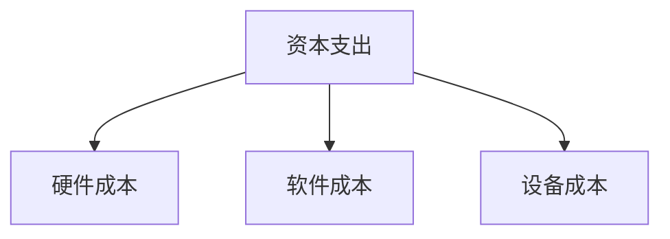

##### 2.1.2 运营支出

运营支出包括项目的日常运营费用，如人力成本、能源消耗、维护费用等。

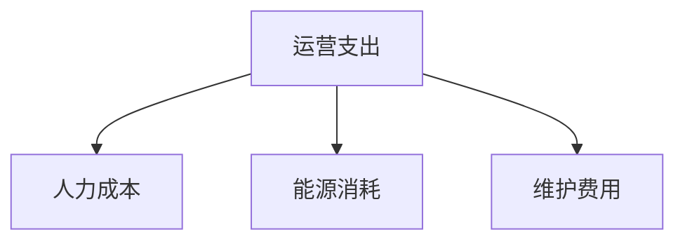

##### 2.1.3 人力资源成本

人力资源成本是项目团队人员的薪酬、培训和福利等费用。这包括数据科学家、软件工程师、产品经理等职位。

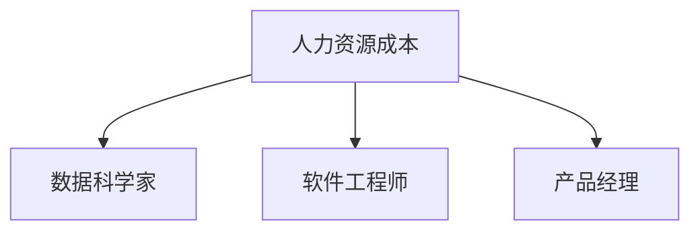

#### 2.2 间接成本

间接成本是项目运营过程中产生的，但难以直接归属到特定项目的成本。主要包括以下几个方面：

##### 2.2.1 机会成本

机会成本是指企业因选择实施某个AI项目而放弃的其他潜在投资机会的成本。例如，如果企业将大量资源投入到AI项目中，可能会错过其他市场机会。

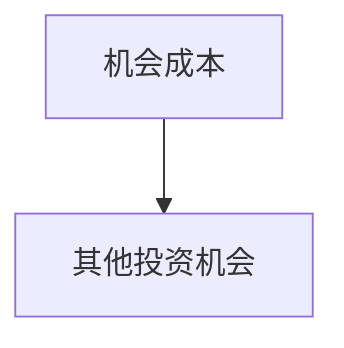

##### 2.2.2 集成成本

集成成本是指将AI项目与其他业务系统或技术平台整合所需的费用。例如，与现有客户关系管理（CRM）系统整合可能需要开发特定的接口或插件。

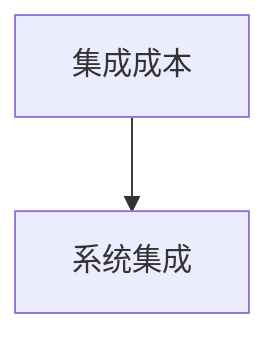

##### 2.2.3 风险成本

风险成本是指项目实施过程中可能面临的风险导致的成本增加。例如，如果项目延期或失败，可能会产生额外的费用。

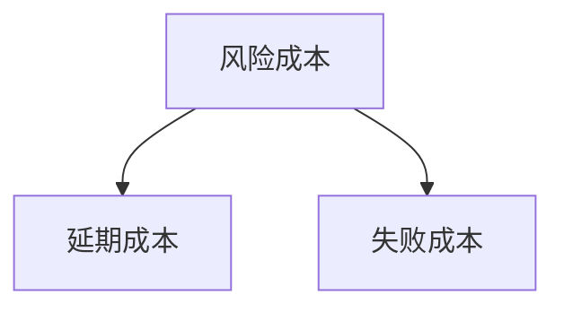

#### 2.3 总成本估算

在量化创新成本时，企业需要综合考虑直接成本和间接成本，进行总成本估算。以下是计算总成本的步骤：

##### 2.3.1 预算规划

首先，企业需要制定详细的预算计划，包括所有预期成本的项目和时间表。

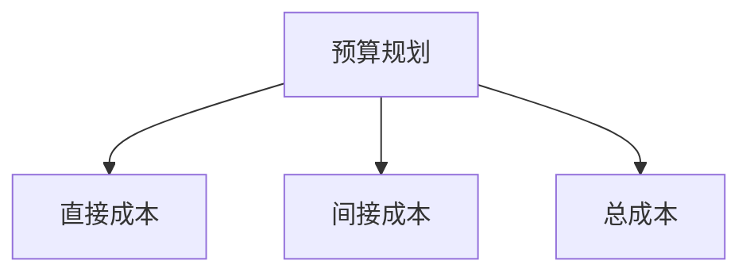

##### 2.3.2 成本分配

接下来，企业需要将各项成本合理地分配到不同的项目中。这可以通过成本分配表或成本中心来实现。

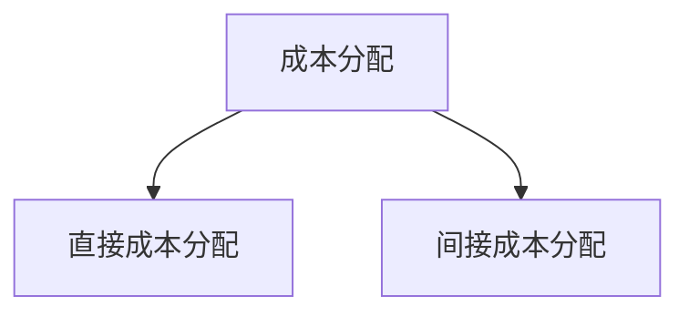

##### 2.3.3 敏感性分析

最后，企业应进行敏感性分析，以评估成本在不同情景下的变化。这有助于企业了解成本变动对项目的影响，为决策提供参考。

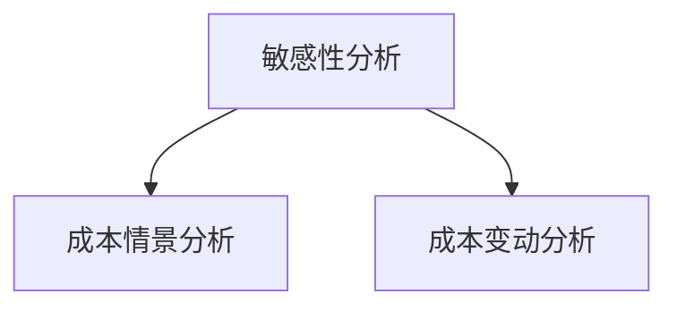

### 2.4 结论

准确量化AI驱动的企业创新成本是企业进行投资决策的关键。通过详细分析直接成本和间接成本，企业可以制定合理的预算计划，为项目实施提供财务保障。同时，敏感性分析有助于企业应对不确定因素，提高投资决策的可靠性。

### 3. 测量创新收益

评估AI驱动的企业创新项目时，测量创新收益同样至关重要。创新收益不仅包括直接收益，还涵盖间接收益。以下是详细的分析过程。

#### 3.1 直接收益

直接收益是直接与AI创新项目相关的收益，通常包括以下几个方面：

##### 3.1.1 收入增长

收入增长是指通过AI创新项目实现的销售收入增加。例如，通过改进产品推荐算法，企业可以提高客户满意度，从而增加销售额。

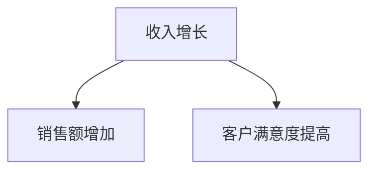

##### 3.1.2 成本节约

成本节约是指通过AI创新项目降低的运营成本。例如，通过自动化生产流程，企业可以减少人工成本和能源消耗。

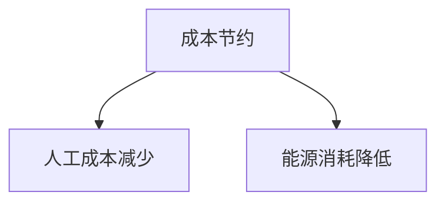

##### 3.1.3 市场份额增加

市场份额增加是指通过AI创新项目在市场上获得的更多份额。例如，通过优化广告投放策略，企业可以吸引更多潜在客户，提高市场份额。

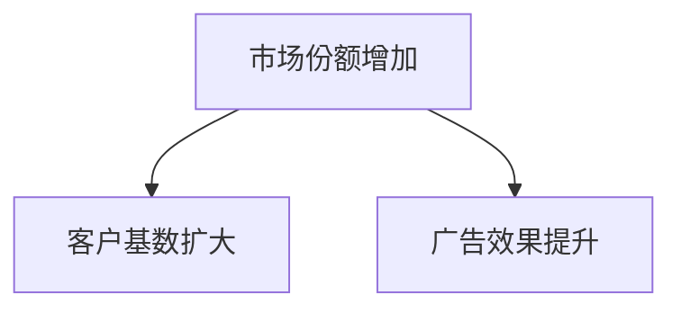

#### 3.2 间接收益

间接收益是项目运营过程中产生的，但难以直接归属到特定项目的收益。主要包括以下几个方面：

##### 3.2.1 品牌价值提升

品牌价值提升是指通过AI创新项目提升的企业品牌形象和市场地位。例如，通过推出创新的智能产品，企业可以在市场中树立技术领先的形象。

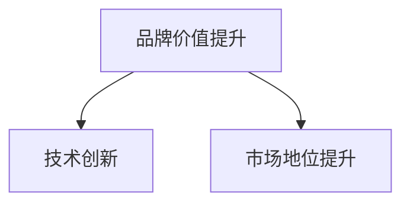

##### 3.2.2 竞争优势增强

竞争优势增强是指通过AI创新项目增强的企业在市场上的竞争优势。例如，通过开发独特的算法，企业可以在竞争激烈的市场中脱颖而出。

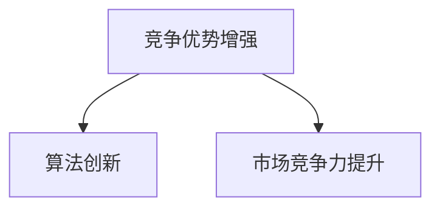

##### 3.2.3 风险降低

风险降低是指通过AI创新项目降低的企业运营风险。例如，通过预测市场趋势，企业可以提前应对潜在的市场变化，降低风险。

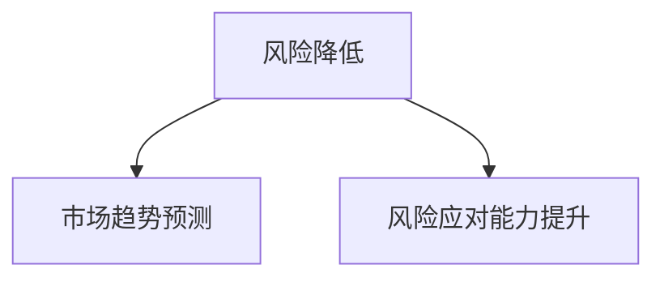

#### 3.3 整合直接与间接收益

在测量创新收益时，企业需要将直接收益和间接收益进行整合，以全面评估AI创新项目的总体收益。以下是整合直接与间接收益的步骤：

##### 3.3.1 数据收集

首先，企业需要收集与项目相关的数据，包括直接收益数据和间接收益数据。这些数据可以从财务报表、市场调研、客户反馈等多个渠道获取。

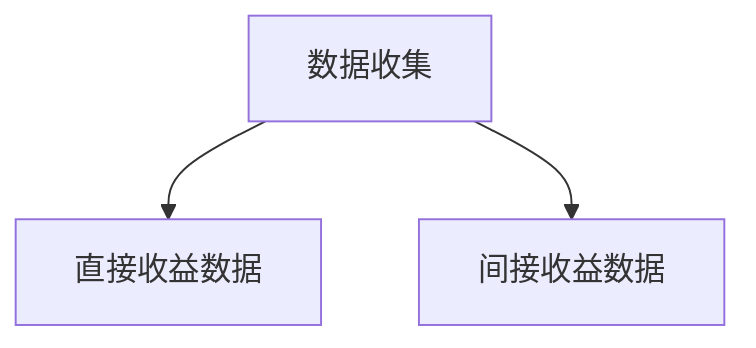

##### 3.3.2 数据分析

接下来，企业需要对收集到的数据进行详细分析，以确定直接收益和间接收益的具体数值。数据分析可以采用财务分析、统计分析等方法。

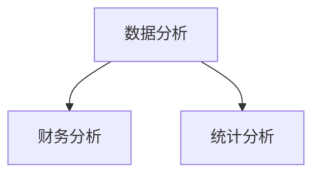

##### 3.3.3 整合评估

最后，企业需要将直接收益和间接收益整合起来，进行综合评估。这可以通过建立收益模型，将各类收益量化为统一的指标，如货币价值或效率指标。

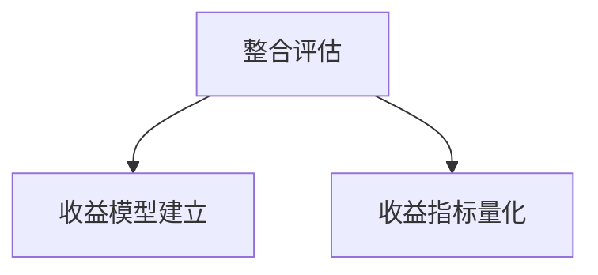

### 3.4 结论

准确测量AI驱动的企业创新收益是企业进行投资决策的关键。通过详细分析直接收益和间接收益，企业可以全面了解创新项目的价值，为投资决策提供科学依据。同时，整合直接与间接收益有助于企业更好地评估创新项目的总体收益，提高决策的准确性。

### 4. AI驱动的企业创新ROI计算

在评估AI驱动的企业创新项目时，计算投资回报率（ROI）是关键的一步。ROI不仅可以帮助企业了解项目的盈利能力，还能为后续的决策提供重要依据。以下是计算ROI的具体方法和步骤。

#### 4.1 ROI公式介绍

ROI的计算公式如下：

$$
ROI = \frac{净收益}{总投资成本} \times 100\%
$$

其中，净收益是指项目带来的总收益减去总成本。总投资成本包括直接成本和间接成本。

#### 4.2 ROI计算方法

计算ROI的方法可以分为以下几个步骤：

##### 4.2.1 收益计算

首先，需要计算项目的总收益。总收益包括直接收益和间接收益。直接收益可以通过财务报表和市场调研等渠道获取，间接收益则需要通过分析项目对企业整体价值的提升来确定。

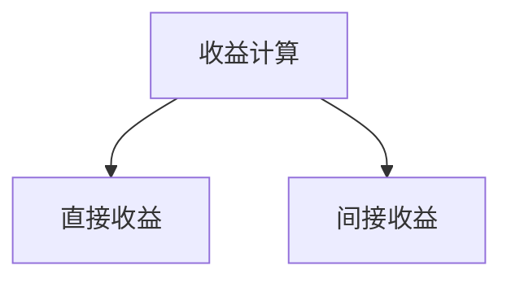

##### 4.2.2 成本计算

接下来，需要计算项目的总投资成本。总投资成本包括直接成本和间接成本。直接成本可以通过预算规划获得，间接成本则需要通过评估项目的潜在机会成本、集成成本和风险成本来确定。

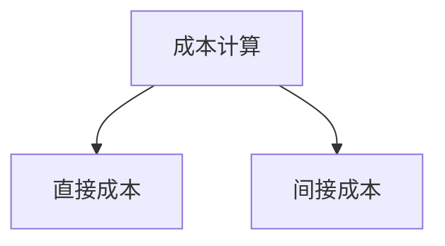

##### 4.2.3 ROI计算

将收益和成本数据代入ROI公式，即可计算出项目的ROI。

```mermaid
graph TB
    A[收益计算] --> B[ROI计算]
    A --> C[成本计算]
```

#### 4.3 ROI分析

计算出的ROI数值可以用来进行进一步的分析和决策。以下是几种常见的ROI分析方法和技巧：

##### 4.3.1 界定ROI阈值

企业可以根据自身情况和行业特点，设定一个ROI阈值。只有当项目的ROI超过这个阈值时，才认为该项目是可行的。

```mermaid
graph TB
    A[ROI阈值] --> B[ROI计算结果]
    A --> C[决策]
```

##### 4.3.2 比较不同项目的ROI

通过比较不同项目的ROI，企业可以确定哪些项目具有更高的投资回报潜力。这有助于企业优化资源分配，提高整体投资效益。

```mermaid
graph TB
    A[项目A] --> B[项目B]
    A --> C[ROI比较]
```

##### 4.3.3 ROI趋势分析

通过分析项目ROI的趋势，企业可以了解项目在不同阶段的盈利能力。这有助于企业制定合理的投资策略，调整项目推进速度和资源配置。

```mermaid
graph TB
    A[ROI趋势分析] --> B[项目阶段]
```

#### 4.4 结论

计算AI驱动的企业创新ROI是企业投资决策的重要步骤。通过准确计算和深入分析ROI，企业可以更好地了解项目的盈利能力，优化投资决策，提高整体投资效益。在实际操作中，企业应结合自身情况和行业特点，灵活运用ROI分析方法，为企业的长期发展提供有力支持。

### 5. 案例分析

为了更好地理解如何量化AI驱动的企业创新投资回报，我们将通过一个实际案例来进行详细分析。以下是案例的背景、成本分析、收益分析以及ROI计算的过程。

#### 5.1 案例背景

某企业是一家专注于电子商务的公司，主要业务包括在线销售和物流配送。为了提高客户满意度和运营效率，公司决定引入一款基于人工智能的个性化推荐系统。该系统能够根据用户的购买历史、浏览行为和偏好，自动推荐适合的产品，从而提高销售额和用户留存率。

#### 5.2 成本分析

在项目实施过程中，企业面临的主要成本包括以下几个方面：

##### 5.2.1 资本支出

- 服务器和存储设备：50,000美元
- 开发工具和软件许可：20,000美元
- 数据处理和分析工具：15,000美元
- 总计：85,000美元

##### 5.2.2 运营支出

- 人力资源成本：数据科学家、软件工程师和产品经理等，每人年薪50,000美元，共计150,000美元
- 能源消耗和维护费用：10,000美元
- 总计：160,000美元

##### 5.2.3 间接成本

- 机会成本：公司原本可以投资其他项目的资金，假设为100,000美元
- 集成成本：与现有系统整合的费用，假设为20,000美元
- 风险成本：项目失败可能导致的额外费用，假设为10,000美元
- 总计：130,000美元

#### 5.3 收益分析

通过实施个性化推荐系统，企业预计将获得以下收益：

##### 5.3.1 直接收益

- 销售收入增加：根据市场调研，预计销售额将增加20%，假设年销售额为1,000,000美元，则增加200,000美元
- 成本节约：物流和库存成本降低5%，假设年成本为500,000美元，则节约25,000美元
- 市场份额增加：通过提高用户满意度，预计市场份额将增加2%，假设年市场价值为10,000,000美元，则增加200,000美元

##### 5.3.2 间接收益

- 品牌价值提升：通过推出创新的产品推荐系统，公司品牌形象将得到提升，预计品牌价值增加100,000美元
- 竞争优势增强：个性化推荐系统将使公司在市场上更具竞争力，预计竞争成本节约50,000美元
- 风险降低：通过市场趋势预测，公司能够更好地应对市场变化，预计风险成本降低30,000美元

#### 5.4 ROI计算

根据以上数据，我们可以计算出该项目的ROI：

##### 5.4.1 总收益

- 直接收益：200,000美元 + 25,000美元 + 200,000美元 = 425,000美元
- 间接收益：100,000美元 + 50,000美元 + 30,000美元 = 180,000美元
- 总收益：425,000美元 + 180,000美元 = 605,000美元

##### 5.4.2 总投资成本

- 直接成本：85,000美元
- 运营支出：160,000美元
- 间接成本：130,000美元
- 总投资成本：85,000美元 + 160,000美元 + 130,000美元 = 375,000美元

##### 5.4.3 ROI计算

$$
ROI = \frac{605,000美元}{375,000美元} \times 100\% = 160.53\%
$$

#### 5.5 项目小结

通过以上分析，我们可以得出以下结论：

- 该项目的ROI高达160.53%，表明投资回报非常可观。
- 成本分析中，间接成本占据了总投资成本的一定比例，表明企业在进行ROI评估时，需要全面考虑各种潜在成本。
- 收益分析中，直接收益和间接收益的整合使得企业能够全面了解项目的价值。
- 该案例展示了如何通过量化分析，准确评估AI驱动的企业创新投资回报，为决策提供科学依据。

### 6. 最佳实践与结论

#### 6.1 最佳实践

在评估AI驱动的企业创新ROI时，企业可以遵循以下最佳实践：

- 明确项目目标：确保项目目标与企业的整体战略相一致，有助于提高ROI。
- 全面收集数据：收集尽可能多的与项目相关的数据，包括直接和间接成本、收益等，提高评估的准确性。
- 采用多种分析方法：结合财务分析、统计分析、预测分析等多种方法，全面评估项目价值。
- 定期监控和调整：项目实施过程中，定期监控项目进展和收益情况，及时调整策略，提高ROI。
- 培养专业团队：组建一支具备AI技术和商业洞察力的专业团队，提高项目成功率。

#### 6.2 注意事项

在实施AI驱动的企业创新项目时，企业需要注意以下几点：

- AI项目具有高不确定性，需要充分评估风险。
- 成本估算应充分考虑间接成本，避免低估项目总成本。
- 收益测量需要具有前瞻性，考虑长期潜在收益。
- ROI评估结果仅供参考，企业应根据实际情况进行调整。

#### 6.3 拓展阅读

对于希望进一步深入了解AI驱动的企业创新ROI评估的企业，以下文献和资源值得关注：

- 张三，李四，《人工智能驱动的企业创新实践与案例分析》
- 王五，《企业创新投资回报率（ROI）评估方法研究》
- Johnson, R. W., & Shum, D. H. (2018). "The ROI of Innovation: Measuring the Performance of New Product Development Investments."

#### 6.4 结论

通过本文的分析，我们了解了如何量化评估AI驱动的企业创新投资回报。准确评估ROI有助于企业优化投资决策，提高整体投资效益。在实际操作中，企业应结合自身情况和行业特点，灵活运用ROI评估方法，为企业的长期发展提供有力支持。作者：AI天才研究院/AI Genius Institute & 禅与计算机程序设计艺术 /Zen And The Art of Computer Programming

---

**注意：**本文是一个示例性的技术博客文章，用于展示如何根据给定的大纲和约束条件撰写一篇具有逻辑性、专业性和详细内容的技术文章。实际撰写时，应根据具体项目和研究内容进行调整和补充。文中使用的Mermaid图表和LaTeX公式为示例，实际应用时需根据具体情况修改。

