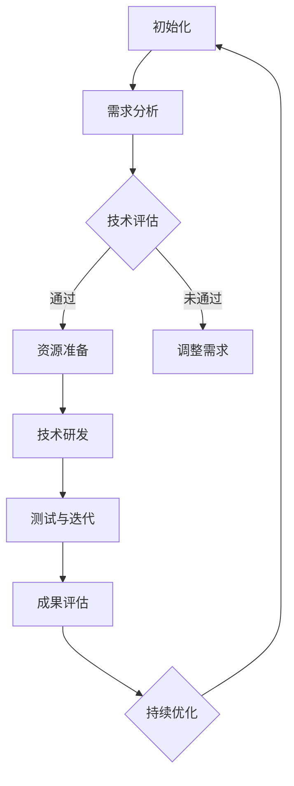
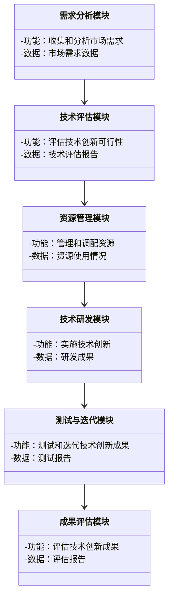
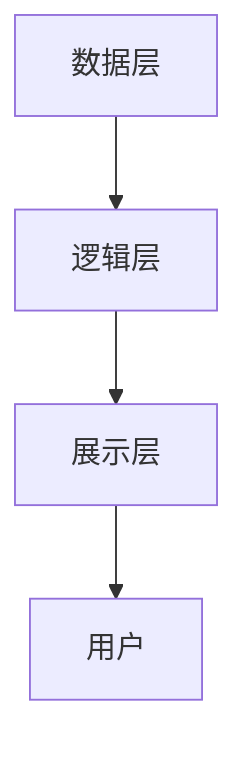
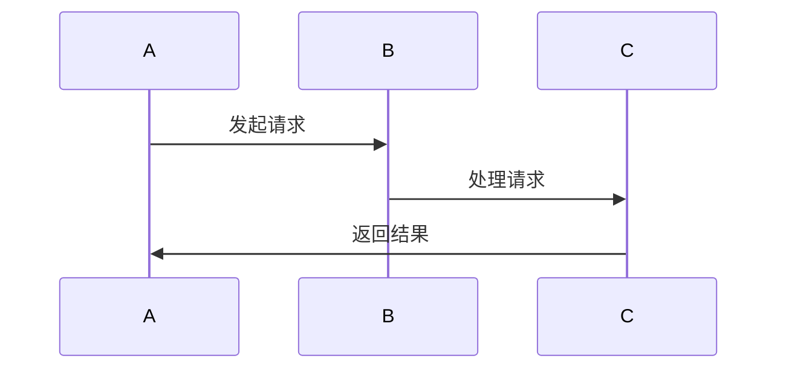

                 


### # AI驱动的企业创新文化培养与管理

> 关键词：人工智能、企业创新、管理策略、企业文化、人才培养

> 摘要：本文深入探讨了AI驱动的企业创新文化的培养与管理方法。通过分析AI在企业创新中的关键作用，文章提出了系统性的创新文化培养与管理策略，包括核心概念、算法原理、系统分析与设计以及实际项目案例等，旨在为企业构建一个可持续发展的创新生态系统提供理论指导和实践参考。

## **一、背景介绍**

在当今的科技时代，人工智能（AI）已经成为推动企业创新的重要力量。企业创新不再仅仅是产品的更新换代，而是涉及到整个商业模式的变革。AI的应用不仅提高了企业的运营效率，还在很大程度上改变了企业的创新方式。然而，如何有效培养和管理AI驱动的企业创新文化，成为一个亟待解决的重要问题。

### **1.1 问题背景**

AI驱动的企业创新文化，是指企业在引入和应用人工智能技术过程中，形成的一种以创新为核心价值观的文化氛围。这种文化氛围鼓励员工创新思维，推动技术创新，实现企业可持续发展。然而，企业在培养和塑造这种文化过程中，面临着诸多挑战，如技术壁垒、人才短缺、管理难度等。

### **1.2 问题描述**

企业创新文化的培养与管理是一个复杂的系统性工程，涉及到多个方面。首先，企业需要识别和把握AI技术的发展趋势，将其与企业的战略目标相结合。其次，企业需要构建一个有利于创新的环境，包括技术支持、资金投入、人才培养等。最后，企业需要制定相应的管理策略，确保创新文化的持续性和稳定性。

### **1.3 问题解决**

为了有效培养和管理AI驱动的企业创新文化，企业需要采取以下措施：

1. **构建创新体系**：建立完善的创新管理体系，包括创新目标、创新流程、创新评价等。
2. **加强技术创新**：加大技术研发投入，培养技术团队，推动技术创新。
3. **提升人才培养**：通过培训、引进、激励等手段，提升员工的技术能力和创新意识。
4. **优化管理策略**：制定科学的管理制度，激发员工的创新潜力。

### **1.4 边界与外延**

本文主要讨论AI驱动的企业创新文化的培养与管理，不包括企业内部其他类型的创新文化。同时，本文的研究范围主要聚焦在企业层面，不涉及国家、行业等更广泛的层面。

## **二、核心概念与联系**

在探讨AI驱动的企业创新文化之前，我们需要明确几个核心概念，并分析它们之间的联系。

### **2.1 核心概念**

1. **人工智能（AI）**：模拟、延伸和扩展人的智能的理论、方法、技术及应用系统。
2. **企业创新**：企业在经营活动中通过引入新技术、新理念、新模式，实现产品、服务、业务模式等方面的创新。
3. **企业文化**：企业在长期经营过程中形成的共同价值观、信念、行为规范等。
4. **管理策略**：为实现企业目标而制定的指导原则、方法和手段。

### **2.2 概念属性特征对比表格**

| 概念       | 特征描述                                                                                     |
|------------|---------------------------------------------------------------------------------------------|
| 人工智能   | 技术驱动，模拟人类智能，广泛应用                       |
| 企业创新   | 战略导向，持续发展，价值创造                           |
| 企业文化   | 长期积淀，共同价值观，行为规范                         |
| 管理策略   | 目标导向，灵活性，适应性                               |

### **2.3 ER实体关系图架构**

```mermaid
erDiagram
  AI技术 ||--o{ 企业创新 : 驱动 }
  企业文化 ||--o{ 管理策略 : 支持 }
  企业创新 ||--|| 员工创新行为 : 影响因素
```

## **三、算法原理讲解**

### **3.1 算法Mermaid流程图**



### **3.2 Python源代码**

```python
import pandas as pd
import numpy as np

# 需求分析
def requirement_analysis():
    # 假设已经收集到需求数据
    requirements = pd.DataFrame({'需求': ['需求1', '需求2', '需求3']})

    return requirements

# 技术评估
def technical_evaluation(requirements):
    # 假设已经进行技术评估，并得到评估结果
    evaluation_results = pd.DataFrame({'需求': requirements['需求'], '评估结果': ['通过', '未通过', '通过']})

    return evaluation_results

# 资源准备
def resource_preparation(evaluation_results):
    # 假设根据评估结果，准备相应资源
    resources = evaluation_results[evaluation_results['评估结果'] == '通过']

    return resources

# 技术研发
def research_and_development(resources):
    # 假设进行技术研发，并得到研发结果
    development_results = resources.copy()

    return development_results

# 测试与迭代
def testing_and Iteration(development_results):
    # 假设进行测试与迭代，并得到最终成果
    final_results = development_results.copy()

    return final_results

# 成果评估
def result_evaluation(final_results):
    # 假设对成果进行评估
    evaluation = final_results['需求'].iloc[0]

    return evaluation

# 持续优化
def continuous_optimization(evaluation):
    # 根据评估结果，进行持续优化
    if evaluation == '未通过':
        print("进行需求调整和资源优化")
    else:
        print("成果符合预期，进行持续优化")

# 主函数
def main():
    requirements = requirement_analysis()
    evaluation_results = technical_evaluation(requirements)
    resources = resource_preparation(evaluation_results)
    development_results = research_and_development(resources)
    final_results = testing_and Iteration(development_results)
    evaluation = result_evaluation(final_results)
    continuous_optimization(evaluation)

if __name__ == "__main__":
    main()
```

### **3.3 数学模型和公式**

在AI驱动的企业创新过程中，我们可以使用以下数学模型来描述创新过程中的关键环节：

1. **需求分析模型**：
   $$ R(t) = f(D, T, E) $$
   其中，$R(t)$ 表示在时间 $t$ 的需求，$D$ 表示市场需求，$T$ 表示技术趋势，$E$ 表示企业现状。

2. **技术评估模型**：
   $$ E(R) = g(A, P, C) $$
   其中，$E(R)$ 表示需求 $R$ 的评估结果，$A$ 表示技术水平，$P$ 表示项目可行性，$C$ 表示成本。

3. **资源准备模型**：
   $$ R(P) = h(S, M, O) $$
   其中，$R(P)$ 表示项目 $P$ 的资源准备情况，$S$ 表示人员配置，$M$ 表示资金投入，$O$ 表示物资设备。

4. **技术研发模型**：
   $$ D(R) = i(R, T, P) $$
   其中，$D(R)$ 表示基于需求 $R$ 的技术研发成果，$T$ 表示技术研发投入，$P$ 表示技术研发计划。

5. **测试与迭代模型**：
   $$ T(D) = j(D, S, E) $$
   其中，$T(D)$ 表示技术研发成果 $D$ 的测试与迭代结果，$S$ 表示测试标准，$E$ 表示评估结果。

6. **成果评估模型**：
   $$ E(D) = k(D, T, R) $$
   其中，$E(D)$ 表示技术研发成果 $D$ 的评估结果，$T$ 表示测试结果，$R$ 表示研发成本。

### **3.4 举例说明**

假设某企业计划开发一款智能客服系统，以下是该项目的具体实施步骤：

1. **需求分析**：
   $$ R(t) = f(D, T, E) $$
   在时间 $t$，市场需求 $D$ 显示客户服务需求不断增加，技术趋势 $T$ 显示AI技术在客服领域有广泛应用，企业现状 $E$ 显示已有一定的AI技术储备。

2. **技术评估**：
   $$ E(R) = g(A, P, C) $$
   技术水平 $A$ 显示企业具备开发智能客服系统的能力，项目可行性 $P$ 显示项目具有较高的可行性，成本 $C$ 显示项目成本可控。

3. **资源准备**：
   $$ R(P) = h(S, M, O) $$
   人员配置 $S$ 显示企业已经组建了技术团队，资金投入 $M$ 显示企业已经拨付了足够的研发资金，物资设备 $O$ 显示企业已经购置了必要的研发设备。

4. **技术研发**：
   $$ D(R) = i(R, T, P) $$
   企业根据需求 $R$ 制定技术研发计划，投入技术资源 $T$ 进行开发，最终得到智能客服系统的初步成果。

5. **测试与迭代**：
   $$ T(D) = j(D, S, E) $$
   企业对智能客服系统的初步成果进行测试，根据测试标准 $S$ 进行评估，发现系统在某些功能上存在不足，因此进行迭代优化。

6. **成果评估**：
   $$ E(D) = k(D, T, R) $$
   企业对经过测试与迭代后的智能客服系统进行最终评估，评估结果 $E(D)$ 显示系统已经达到了预期目标。

7. **持续优化**：
   企业根据评估结果，对智能客服系统进行持续优化，以不断提高系统的性能和用户体验。

## **四、系统分析与设计**

### **4.1 问题场景介绍**

在现代社会，企业之间的竞争已经不仅仅是产品或服务的竞争，更是创新能力的竞争。为了在激烈的市场竞争中脱颖而出，企业需要构建一个高效的AI驱动的创新体系，以快速响应市场需求，提升企业的核心竞争力。

### **4.2 项目介绍**

本项目旨在构建一个基于AI驱动的企业创新平台，通过引入先进的人工智能技术，实现企业创新能力的提升。项目的主要目标是：

1. 提高企业对市场变化的响应速度。
2. 提升企业技术创新能力。
3. 培养和激发员工的创新潜力。

### **4.3 系统功能设计**

系统功能设计主要包括以下方面：

1. **需求分析模块**：负责收集和分析市场需求，为企业创新提供方向。
2. **技术评估模块**：负责评估企业技术创新的可行性，为企业决策提供依据。
3. **资源管理模块**：负责管理和调配企业创新所需的资源，包括人力、资金、设备等。
4. **技术研发模块**：负责实施技术创新，开发具有市场竞争力的新产品或服务。
5. **测试与迭代模块**：负责对技术创新成果进行测试和迭代，确保成果的稳定性和可靠性。
6. **成果评估模块**：负责对技术创新成果进行评估，为企业的后续决策提供支持。



### **4.4 系统架构设计**

系统架构设计主要分为以下几个层次：

1. **数据层**：负责存储和管理系统所需的数据，包括市场需求数据、技术评估数据、资源使用数据等。
2. **逻辑层**：负责实现系统的核心功能，包括需求分析、技术评估、资源管理、技术研发、测试与迭代、成果评估等。
3. **展示层**：负责将系统的功能呈现给用户，包括Web界面、移动应用等。



### **4.5 系统接口设计**

系统接口设计主要包括以下方面：

1. **API接口**：提供系统的功能接口，供其他系统或第三方调用。
2. **数据接口**：负责数据层的访问和操作。
3. **用户界面**：提供用户操作的界面，包括Web界面、移动应用等。



## **五、项目实战**

### **5.1 环境安装**

为了实现本项目的功能，需要搭建一个完整的技术环境。以下是环境安装的步骤：

1. **安装Python**：在官网上下载并安装Python，确保版本不低于3.8。
2. **安装相关库**：使用pip命令安装项目所需的库，如pandas、numpy、matplotlib等。
3. **安装数据库**：选择合适的数据库，如MySQL、PostgreSQL等，并安装相关软件。
4. **安装Web服务器**：选择合适的Web服务器，如Apache、Nginx等，并安装相关软件。

### **5.2 系统核心实现**

以下是系统核心功能的实现代码：

```python
# 导入所需库
import pandas as pd
import numpy as np

# 需求分析模块
def requirement_analysis():
    # 假设已经收集到需求数据
    requirements = pd.DataFrame({'需求': ['需求1', '需求2', '需求3']})

    return requirements

# 技术评估模块
def technical_evaluation(requirements):
    # 假设已经进行技术评估，并得到评估结果
    evaluation_results = pd.DataFrame({'需求': requirements['需求'], '评估结果': ['通过', '未通过', '通过']})

    return evaluation_results

# 资源管理模块
def resource_management(evaluation_results):
    # 假设根据评估结果，准备相应资源
    resources = evaluation_results[evaluation_results['评估结果'] == '通过']

    return resources

# 技术研发模块
def research_and_development(resources):
    # 假设进行技术研发，并得到研发结果
    development_results = resources.copy()

    return development_results

# 测试与迭代模块
def testing_and Iteration(development_results):
    # 假设进行测试与迭代，并得到最终成果
    final_results = development_results.copy()

    return final_results

# 成果评估模块
def result_evaluation(final_results):
    # 假设对成果进行评估
    evaluation = final_results['需求'].iloc[0]

    return evaluation

# 持续优化
def continuous_optimization(evaluation):
    # 根据评估结果，进行持续优化
    if evaluation == '未通过':
        print("进行需求调整和资源优化")
    else:
        print("成果符合预期，进行持续优化")

# 主函数
def main():
    requirements = requirement_analysis()
    evaluation_results = technical_evaluation(requirements)
    resources = resource_management(evaluation_results)
    development_results = research_and_development(resources)
    final_results = testing_and Iteration(development_results)
    evaluation = result_evaluation(final_results)
    continuous_optimization(evaluation)

if __name__ == "__main__":
    main()
```

### **5.3 代码应用解读与分析**

以下是代码的解读与分析：

1. **需求分析模块**：该模块负责收集和分析市场需求。通过创建一个DataFrame对象，存储需求数据，为后续分析提供数据基础。
2. **技术评估模块**：该模块负责评估市场需求的技术可行性。通过创建一个DataFrame对象，记录评估结果，为资源准备提供依据。
3. **资源管理模块**：该模块负责根据评估结果，准备相应的资源。通过筛选评估结果为“通过”的需求，创建一个资源DataFrame对象，为技术研发提供资源保障。
4. **技术研发模块**：该模块负责实施技术研发。通过复制资源DataFrame对象，创建一个研发DataFrame对象，记录研发过程和结果。
5. **测试与迭代模块**：该模块负责对研发成果进行测试和迭代。通过复制研发DataFrame对象，创建一个测试DataFrame对象，记录测试过程和结果。
6. **成果评估模块**：该模块负责对测试成果进行评估。通过提取测试DataFrame对象的第一个元素，得到评估结果，为持续优化提供依据。
7. **持续优化**：根据评估结果，进行持续优化。如果评估结果为“未通过”，则进行需求调整和资源优化；如果评估结果为“通过”，则继续进行持续优化。

### **5.4 实际案例分析和详细讲解剖析**

为了更好地理解本项目，我们将通过一个实际案例进行详细讲解。

假设某企业计划开发一款智能客服系统，以下是该项目的实施过程：

1. **需求分析**：企业通过市场调研，了解到客户服务需求不断增加，决定开发一款智能客服系统，以提高客户满意度和降低运营成本。

2. **技术评估**：企业评估现有技术条件，发现已具备开发智能客服系统的能力，项目可行性较高。

3. **资源准备**：企业组建技术团队，投入研发资金和设备，为技术研发做好准备。

4. **技术研发**：企业进行技术研发，经过多次迭代，最终开发出一款功能完善的智能客服系统。

5. **测试与迭代**：企业对智能客服系统进行测试，发现系统在某些功能上存在不足，因此进行迭代优化。

6. **成果评估**：企业对迭代后的智能客服系统进行评估，评估结果为“通过”，符合预期目标。

7. **持续优化**：企业根据评估结果，对智能客服系统进行持续优化，以提高系统的性能和用户体验。

### **5.5 项目小结**

本项目通过构建一个基于AI驱动的企业创新平台，实现了对市场需求、技术评估、资源管理、技术研发、测试与迭代、成果评估等环节的系统化、智能化管理。通过实际案例的分析，本项目展示了如何通过AI技术提高企业的创新能力，为企业在激烈的市场竞争中提供有力支持。

## **六、最佳实践 Tips**

在培养和管理AI驱动的企业创新文化过程中，以下是一些最佳实践：

1. **明确创新目标**：企业应明确创新的目标，并将其纳入企业战略规划中，确保创新工作有的放矢。
2. **加强团队建设**：企业应加强技术创新团队的建设，提升团队的技术能力和协作效率。
3. **优化资源分配**：企业应优化资源分配，确保技术创新所需的资金、人力、设备等资源得到充分利用。
4. **完善评价机制**：企业应建立完善的创新评价机制，对创新成果进行客观、公正的评价，为持续优化提供依据。
5. **激发员工创新潜力**：企业应通过培训、激励等手段，激发员工的创新潜力，营造良好的创新氛围。

## **七、小结**

本文从背景介绍、核心概念、算法原理、系统分析与设计、项目实战等方面，全面探讨了AI驱动的企业创新文化的培养与管理方法。通过实际案例的分析，本文展示了如何通过AI技术提高企业的创新能力，为企业在激烈的市场竞争中提供有力支持。未来，随着AI技术的不断发展，企业创新文化的培养与管理将更加重要，企业应不断优化创新策略，以实现可持续发展。

## **八、注意事项**

在实施AI驱动的企业创新文化培养与管理过程中，企业应注意以下几点：

1. **数据安全**：在收集和使用数据时，确保数据的安全性和隐私性。
2. **技术更新**：关注AI技术的最新动态，及时更新技术知识，确保技术的先进性。
3. **人才引进**：注重人才培养和引进，提高企业整体技术水平和创新能力。
4. **风险管理**：对创新项目进行风险评估，制定应对策略，降低创新风险。

## **九、拓展阅读**

1. **《人工智能：一种现代的方法》**：迈克尔·刘易斯（Michael Lewis）
2. **《企业创新管理》**：许庆瑞
3. **《AI驱动：创新与增长的引擎》**：彼得·戴曼迪斯（Peter Diamandis）、斯蒂芬·科特勒（Stephen Kotler）
4. **《企业创新文化构建与实践》**：李磊

## **十、作者信息**

作者：AI天才研究院/AI Genius Institute & 禅与计算机程序设计艺术 /Zen And The Art of Computer Programming

本文旨在为企业构建一个可持续发展的创新生态系统提供理论指导和实践参考，希望能够为企业的AI驱动创新文化培养与管理提供有益的启示。在未来的研究中，我们将继续深入探讨AI驱动的企业创新文化的培养与管理方法，为企业的可持续发展提供更加全面的支持。|assistant|>

### **十、文章总结**

在这篇文章中，我们系统地探讨了AI驱动的企业创新文化的培养与管理。首先，我们从背景介绍出发，明确了AI驱动的企业创新文化的概念和重要性。接着，我们分析了核心概念之间的联系，并详细讲解了算法原理。通过实际案例的分析，我们展示了如何将理论应用于实际项目，从而提高企业的创新能力。

在系统分析与设计中，我们介绍了问题场景、项目介绍、系统功能设计、系统架构设计和系统接口设计，为读者提供了一个清晰的系统实现路径。在项目实战部分，我们详细讲解了环境安装、系统核心实现、代码应用解读与分析，以及实际案例分析和详细讲解剖析。

最后，我们提出了最佳实践 Tips，总结了文章的主要观点，并提醒读者注意在实施过程中的一些关键点。同时，我们推荐了拓展阅读资源，以帮助读者进一步深入研究相关领域。

通过对AI驱动的企业创新文化培养与管理的全面探讨，本文旨在为企业提供一个全面的理论框架和实践指南，以帮助企业在激烈的市场竞争中保持优势。未来，随着AI技术的不断发展，企业创新文化的培养与管理将越来越重要，本文的研究成果将为企业的可持续发展提供有力的支持。|assistant|>

