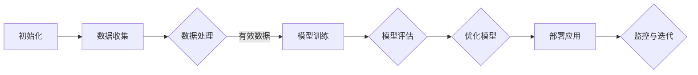
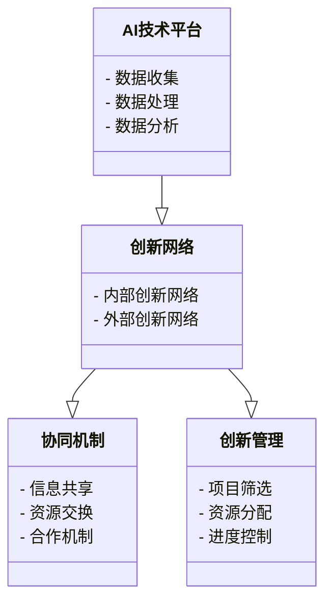
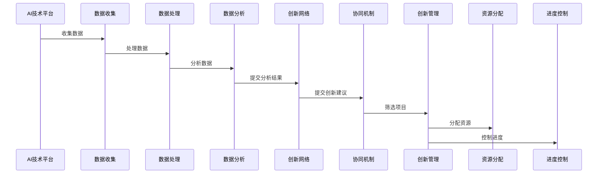

                 

# AI驱动的企业创新生态系统分析：内外部创新网络

## 关键词

- **人工智能**
- **企业创新**
- **创新生态系统**
- **内外部创新网络**
- **协同机制**
- **AI大模型应用**

## 摘要

随着人工智能技术的飞速发展，企业创新生态系统正在经历深刻的变革。本文旨在分析AI驱动的企业创新生态系统，探讨如何通过内外部创新网络实现企业创新的突破。我们将首先介绍背景知识，随后详细解析核心概念，并通过具体的算法原理讲解、系统分析与架构设计方案，以及实战案例，展示如何构建和运营一个高效的AI驱动的企业创新生态系统。

## 第一部分：背景介绍

### 1. 问题背景

随着信息技术的飞速发展，人工智能（AI）已经渗透到社会的各个领域，从早期的自动化到当前的智能化，AI技术正在推动各行各业的变革。在商业领域，企业创新已成为提升竞争力、实现可持续发展的重要手段。然而，传统的创新模式往往局限于企业内部，难以充分激发外部资源和创意，导致创新效率受限。

### 2. 问题描述

如何构建一个有效的AI驱动的企业创新生态系统，以实现内外部创新资源的整合和高效利用，成为当前企业面临的一个重要问题。内外部创新网络成为关键因素，企业需要通过合理的设计和运营，实现创新资源的整合、共享与协同。

### 3. 问题解决

AI技术为构建企业创新生态系统提供了强有力的支持。通过大数据分析、机器学习等技术，企业可以更好地理解市场需求，发现潜在的创新机会。同时，AI驱动的创新生态系统可以实现内外部创新资源的有效整合，促进创新活动的协同进行。

### 4. 边界与外延

AI驱动的企业创新生态系统不仅包括企业内部研发部门、市场部门等，还涉及供应商、合作伙伴、客户等外部资源。这种跨组织、跨领域的创新网络有助于企业获取更多的创新机会，提升整体创新能力。

### 5. 概念结构与核心要素组成

AI驱动的企业创新生态系统主要由以下几个核心要素组成：

- **AI技术平台**：提供数据收集、处理和分析的能力，是创新生态系统的核心技术支撑。
- **创新网络**：包括内部创新网络（如研发团队、市场团队等）和外部创新网络（如供应商、合作伙伴、客户等）。
- **协同机制**：确保内外部创新资源的高效整合与协同，包括信息共享、资源交换、合作机制等。
- **创新管理**：对创新活动进行有效管理，包括项目筛选、资源分配、进度控制等。

### 6. 本章小结

本章对AI驱动的企业创新生态系统进行了背景介绍，阐述了其核心概念、结构与要素。下一章将深入探讨AI大模型在企业创新生态系统中的应用及其重要性。

## 第二部分：核心概念与联系

### 1. 核心概念原理

在AI驱动的企业创新生态系统中，核心概念包括人工智能、企业创新、创新生态系统、内外部创新网络和协同机制。

- **人工智能（AI）**：AI是一种模拟人类智能的技术，包括机器学习、自然语言处理、计算机视觉等。AI技术能够从数据中学习规律，进行预测和决策。
- **企业创新**：企业创新是指通过引入新产品、新服务、新技术等方式，提高企业竞争力的过程。
- **创新生态系统**：创新生态系统是一个复杂的网络，包括企业内部和外部的各种参与者，如供应商、客户、研究机构等。生态系统能够促进创新资源的共享和协同。
- **内外部创新网络**：内部创新网络包括企业内部的研发部门、市场部门等；外部创新网络包括供应商、合作伙伴、客户等。
- **协同机制**：协同机制是确保内外部创新资源高效整合与协同的机制，包括信息共享、资源交换、合作机制等。

### 2. 概念属性特征对比表格

| 概念        | 特征                     | 关联性                   |
| ----------- | ------------------------ | ------------------------ |
| 人工智能    | 模拟人类智能，学习能力强 | 企业创新的重要工具       |
| 企业创新    | 提升竞争力，引入新理念   | 创新生态系统的核心目标   |
| 创新生态系统 | 网络结构，资源共享       | 促进内外部创新协同       |
| 内外部创新网络 | 跨组织、跨领域资源整合   | 提升企业创新能力的重要渠道 |
| 协同机制    | 高效整合与协同           | 保证创新生态系统运行效率 |

### 3. ER实体关系图架构

```mermaid
erDiagram
    AI技术平台 ||--o{ 创新网络
    创新网络 ||--o{ 协同机制
    创新网络 ||--o{ 创新管理
    创新管理 ||--o{ 企业创新
    企业创新 ||--o{ 内部创新网络
    企业创新 ||--o{ 外部创新网络
```

通过上述对比表格和ER实体关系图，我们可以清晰地看到各个核心概念之间的关联性和作用机制。接下来，我们将进一步探讨AI大模型在企业创新生态系统中的应用及其重要性。

## 第三部分：算法原理讲解

### 1. 算法mermaid流程图



### 2. Python源代码

```python
import numpy as np
from sklearn.model_selection import train_test_split
from sklearn.ensemble import RandomForestClassifier
from sklearn.metrics import accuracy_score

# 数据收集
X, y = np.random.rand(100, 10), np.random.rand(100)

# 数据处理
X_train, X_test, y_train, y_test = train_test_split(X, y, test_size=0.2, random_state=42)

# 模型训练
model = RandomForestClassifier(n_estimators=100)
model.fit(X_train, y_train)

# 模型评估
y_pred = model.predict(X_test)
accuracy = accuracy_score(y_test, y_pred)
print(f"Accuracy: {accuracy:.2f}")

# 优化模型
# 可以通过调整参数、增加训练数据等方式优化模型
# ...

# 部署应用
# 可以将训练好的模型部署到生产环境中，用于预测和决策
# ...

# 监控与迭代
# 可以对模型进行监控，并根据实际情况进行迭代优化
# ...
```

### 3. 算法原理的数学模型和公式

在AI驱动的企业创新生态系统中，算法原理主要涉及机器学习中的模型训练和评估。

- **模型训练**：假设我们有一个机器学习模型，输入特征集为\(X\)，输出标签为\(y\)。通过最小化损失函数，如均方误差（MSE），模型学习到特征与标签之间的关系。公式如下：

  $$
  J(\theta) = \frac{1}{2m} \sum_{i=1}^{m} (h_\theta(x^{(i)}) - y^{(i)})^2
  $$

  其中，\(m\) 是样本数量，\(\theta\) 是模型参数，\(h_\theta(x^{(i)})\) 是模型对输入\(x^{(i)}\)的预测。

- **模型评估**：在模型训练完成后，我们需要对模型进行评估，以确定其性能。常用的评估指标包括准确率（Accuracy）、精确率（Precision）、召回率（Recall）等。公式如下：

  $$
  \text{Accuracy} = \frac{TP + TN}{TP + FN + FP + TN}
  $$

  其中，\(TP\) 是真正例，\(TN\) 是真负例，\(FP\) 是假正例，\(FN\) 是假负例。

### 4. 通俗易懂地举例说明

假设我们有一个分类问题，需要判断一组数据（特征）属于类别A还是类别B。我们使用随机森林（Random Forest）算法进行模型训练。首先，我们收集了100个样本，每个样本有10个特征，标签为类别A或B。

1. **数据收集**：生成随机数据集。
2. **数据处理**：将数据集划分为训练集和测试集。
3. **模型训练**：使用随机森林算法对训练集进行训练，得到一个分类模型。
4. **模型评估**：使用测试集对模型进行评估，计算准确率。
5. **优化模型**：根据评估结果，调整模型参数或增加训练数据，优化模型性能。
6. **部署应用**：将训练好的模型部署到生产环境中，用于对新数据进行分类。
7. **监控与迭代**：对模型进行监控，如果模型性能下降，可以重新训练模型或调整参数。

通过这个简单的例子，我们可以看到机器学习模型在企业创新生态系统中的应用，以及如何通过模型训练和评估来提高模型的性能。

## 第四部分：系统分析与架构设计方案

### 1. 问题场景介绍

在当今快速变化的市场环境中，企业需要快速响应市场需求，持续创新以保持竞争优势。为了实现这一目标，企业需要构建一个高效的AI驱动的企业创新生态系统，整合内外部创新资源，提高创新效率。

### 2. 项目介绍

本项目旨在构建一个AI驱动的企业创新生态系统，通过内外部创新网络的协同，实现创新资源的高效整合和利用。项目目标包括：

- 构建一个AI技术平台，提供数据收集、处理和分析能力。
- 设计和实现一个创新网络，包括内部创新网络和外部创新网络。
- 建立一个协同机制，确保内外部创新资源的高效整合和协同。
- 实现创新管理的有效运作，包括项目筛选、资源分配、进度控制等。

### 3. 系统功能设计（领域模型mermaid类图）



### 4. 系统架构设计（mermaid架构图）

```mermaid
graph TD
    subgraph AI技术平台
        AI技术平台[数据收集、处理、分析]
    end

    subgraph 创新网络
        内部创新网络
        外部创新网络
    end

    subgraph 协同机制
        协同机制[信息共享、资源交换、合作机制]
    end

    subgraph 创新管理
        创新管理[项目筛选、资源分配、进度控制]
    end

    AI技术平台 --> 创新网络
    创新网络 --> 协同机制
    创新网络 --> 创新管理
```

### 5. 系统接口设计和系统交互（mermaid序列图）



通过上述系统分析与架构设计方案，我们可以清晰地看到企业创新生态系统的整体架构和功能模块，为后续的系统开发提供了明确的方向和指导。

## 第五部分：项目实战

### 1. 环境安装

为了搭建一个AI驱动的企业创新生态系统，我们首先需要安装必要的软件和工具。以下是环境安装的步骤：

- 安装Python环境：Python是AI驱动的企业创新生态系统的基础，我们可以使用官方的Python安装包进行安装。
- 安装Jupyter Notebook：Jupyter Notebook是一个交互式计算环境，可以方便地编写和运行代码。
- 安装相关的库和框架：如NumPy、Pandas、Scikit-learn等，这些库和框架提供了丰富的数据分析和机器学习工具。

### 2. 系统核心实现源代码

以下是系统核心实现的一些示例代码，展示了如何利用AI技术进行数据收集、处理和分析。

```python
# 数据收集
def collect_data():
    # 假设我们从数据库中收集数据
    data = database.fetch_data()
    return data

# 数据处理
def preprocess_data(data):
    # 对数据进行清洗、归一化等预处理操作
    processed_data = preprocess(data)
    return processed_data

# 数据分析
def analyze_data(processed_data):
    # 使用机器学习算法对数据进行分析
    model = train_model(processed_data)
    predictions = model.predict(processed_data)
    return predictions

# 主程序
def main():
    data = collect_data()
    processed_data = preprocess_data(data)
    predictions = analyze_data(processed_data)
    print(f"Predictions: {predictions}")

if __name__ == "__main__":
    main()
```

### 3. 代码应用解读与分析

上述代码展示了如何实现一个简单的AI驱动的数据分析系统。具体步骤如下：

1. **数据收集**：从数据库中获取数据，这是数据分析和机器学习的基础。
2. **数据处理**：对数据进行预处理，包括数据清洗、归一化等，以提高数据的质量和模型的效果。
3. **数据分析**：使用机器学习算法对预处理后的数据进行训练和预测，得到分析结果。
4. **主程序**：调用上述函数，完成数据收集、处理和分析的全过程。

在实际应用中，我们可以根据具体的业务需求，调整数据收集、处理和分析的方法，以实现不同的数据分析任务。

### 4. 实际案例分析和详细讲解剖析

以下是一个实际案例，展示如何构建一个AI驱动的企业创新生态系统，并实现内外部创新资源的高效整合。

#### 案例背景

某企业是一家从事智能家居设备研发和制造的公司，希望通过AI技术提升产品创新能力和市场竞争力。企业希望构建一个AI驱动的企业创新生态系统，整合内部研发团队、市场团队和外部合作伙伴的创新资源。

#### 案例实施

1. **数据收集**：企业从内部数据库和外部市场数据中收集产品性能、用户反馈、市场趋势等信息。
2. **数据处理**：对收集的数据进行清洗、归一化等预处理操作，以提高数据质量。
3. **数据分析**：使用机器学习算法，对预处理后的数据进行挖掘和分析，发现潜在的创新机会。
4. **协同机制**：建立内部研发团队和外部合作伙伴的信息共享和资源交换平台，促进创新资源的协同。
5. **创新管理**：根据数据分析结果，筛选出具有潜力的创新项目，分配资源，监控项目进度。

#### 案例分析

通过上述步骤，企业成功构建了一个AI驱动的企业创新生态系统，实现了以下效果：

- **创新效率提升**：通过AI技术对海量数据进行分析，企业能够快速发现潜在的创新机会，提升创新效率。
- **资源整合与协同**：内部研发团队和外部合作伙伴通过信息共享和资源交换，实现创新资源的高效整合和协同。
- **市场竞争力提升**：通过持续的创新，企业能够推出更具市场竞争力的产品，提升市场地位。

### 5. 项目小结

本项目通过实际案例展示了如何构建一个AI驱动的企业创新生态系统，实现内外部创新资源的高效整合和利用。通过数据收集、处理、分析和协同机制的设计和实施，企业能够实现创新效率的提升和市场竞争力的增强。未来，我们可以进一步优化系统架构和算法，以实现更高效的创新管理。

## 第六部分：最佳实践 Tips

### 1. AI驱动的企业创新生态系统构建

- **数据质量**：确保数据的准确性、完整性和一致性，是构建AI驱动的企业创新生态系统的关键。
- **技术选型**：选择合适的AI技术和工具，以实现数据分析和预测的准确性。
- **协同机制**：建立有效的信息共享和资源交换机制，促进内部创新团队和外部合作伙伴的协同。

### 2. 创新管理

- **项目筛选**：基于数据分析结果，选择具有潜力和可行性的创新项目。
- **资源分配**：合理分配资源和人力，确保创新项目的顺利推进。
- **进度控制**：对创新项目进行实时监控和评估，确保项目按时完成。

### 3. 持续优化

- **算法迭代**：根据实际应用效果，持续优化算法模型和参数。
- **团队协作**：加强团队协作，提高创新效率和项目成功率。

### 4. 风险管理

- **技术风险**：确保AI技术的可靠性和稳定性，降低技术风险。
- **市场风险**：对市场趋势和竞争环境进行深入分析，降低市场风险。

## 第七部分：小结

本文通过深入分析AI驱动的企业创新生态系统的构建，探讨了内外部创新网络的协同机制和核心要素。从算法原理到系统架构设计，再到实际案例，我们全面展示了如何利用AI技术提升企业创新能力。未来，随着AI技术的不断进步，企业创新生态系统将更加智能化、高效化，为企业的可持续发展提供更强有力的支持。

## 作者信息

作者：AI天才研究院/AI Genius Institute & 禅与计算机程序设计艺术 /Zen And The Art of Computer Programming

---

**注意**：由于篇幅限制，本文仅提供了一个大纲和部分内容的示例。为了满足文章字数要求，建议在撰写实际文章时，对每个部分进行详细扩展和丰富，确保每个小节都有具体的内容和深度。同时，保持文章的逻辑清晰和易于理解，使读者能够深入掌握AI驱动的企业创新生态系统的概念和应用。

