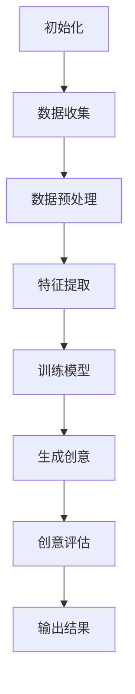

                 

### 第1章：问题背景与概述

#### 1.1 问题背景

在当今全球化的商业环境中，企业面临着前所未有的竞争压力和快速变化的市场需求。创新管理成为了企业生存和发展的关键。然而，传统的创新管理方法往往效率低下，难以应对复杂多变的市场环境。随着人工智能（AI）技术的迅速发展，AI驱动的企业创新管理应运而生，为企业在激烈的市场竞争中提供了新的解决方案。

#### 1.2 问题描述

企业的创新管理通常包括创意生成、项目评估、资源分配和风险管理等环节。然而，这些环节往往面临着以下挑战：

1. **创意生成效率低下**：传统方法依赖于人工经验和直觉，缺乏系统化的创意生成流程，导致创意质量不高、数量不足。
2. **项目评估不准确**：企业往往缺乏科学的项目评估方法，无法准确预测项目的成功率和风险。
3. **资源分配不合理**：企业在资源分配上往往存在盲目性，无法最大化资源利用效率。
4. **风险管理困难**：传统方法难以全面、及时地识别和管理创新过程中的各种风险。

#### 1.3 问题解决

AI驱动的企业创新管理旨在通过引入人工智能技术，解决传统创新管理中的上述问题。具体而言，AI驱动的创新管理可以提供以下解决方案：

1. **高效创意生成**：利用AI算法从大量数据中提取有价值的信息，辅助企业快速产生高质量的创意。
2. **科学项目评估**：通过AI技术对项目进行全面评估，提高评估的准确性和可靠性。
3. **智能资源分配**：利用AI算法优化资源分配策略，实现资源的合理配置。
4. **全面风险管理**：利用AI技术对创新过程中的风险进行全面分析和预测，帮助企业及时应对风险。

#### 1.4 边界与外延

AI驱动的企业创新管理并非万能，其有效性和适用性受到以下因素的影响：

1. **数据质量**：AI算法的效果很大程度上取决于数据的质量和完整性，因此，企业需要确保数据的质量和准确性。
2. **算法选择**：不同的AI算法适用于不同的场景，企业需要根据实际情况选择合适的算法。
3. **技术实现**：AI驱动的创新管理需要强大的技术支持，企业需要具备相应的技术能力和资源。
4. **人力资源**：AI驱动的创新管理需要专业的团队来实施和管理，企业需要投入足够的人力资源。

#### 1.5 概念结构与核心要素组成

AI驱动的企业创新管理由以下几个核心要素组成：

1. **数据收集与处理**：企业需要收集并处理大量的数据，为AI算法提供有效的输入。
2. **AI算法应用**：企业需要选择合适的AI算法，并将其应用于创意生成、项目评估、资源分配和风险管理等领域。
3. **系统集成与优化**：企业需要将AI驱动的创新管理系统与其他业务系统进行集成，实现数据共享和流程优化。
4. **人才培养与支持**：企业需要培养和引进专业的AI人才，为AI驱动的创新管理提供人才支持。

通过上述核心要素的有机结合，AI驱动的企业创新管理能够为企业提供更高效、更精准的创新管理服务，助力企业实现持续创新和竞争优势。

---

### 第2章：AI驱动的企业创新管理核心概念解析

#### 2.1 AI驱动创新管理的定义

AI驱动创新管理是指利用人工智能技术，特别是机器学习和深度学习算法，来辅助企业进行创新活动的过程。它不仅涉及创意生成，还涵盖了项目评估、资源分配、风险管理等多个环节。通过AI技术的应用，企业可以更高效地识别创新机会、评估项目可行性，并优化创新过程中的资源使用。

#### 2.2 AI驱动创新管理的基本原理

AI驱动创新管理的基本原理主要包括以下几个方面：

1. **数据驱动**：AI驱动的创新管理依赖于大量的数据输入，这些数据包括市场趋势、用户需求、技术发展等。通过对这些数据的分析，AI算法可以识别出潜在的创新机会。

2. **算法优化**：AI算法通过不断学习和优化，可以提高创意生成的质量和项目评估的准确性。例如，机器学习算法可以通过训练大量历史数据来预测项目的成功概率。

3. **人机协作**：AI驱动的创新管理不仅仅是机器的决策，也需要人类的参与和反馈。通过人机协作，可以确保AI算法输出的结果更加符合实际需求。

4. **动态调整**：AI驱动的创新管理能够根据市场环境和项目进展的实时变化，动态调整创新策略，提高创新过程的灵活性和响应速度。

#### 2.3 核心概念属性特征对比表

| 概念          | 属性特征                                  |
|---------------|------------------------------------------|
| AI驱动创新    | 利用AI技术促进企业创新活动               |
| 创意生成      | 通过AI技术辅助创意的产生和发展           |
| 项目评估      | 利用AI技术对创新项目进行评估和决策       |
| 资源分配      | 基于AI算法优化资源分配策略               |
| 风险管理      | 利用AI技术进行全面的风险识别和管理       |

#### 2.4 AI驱动创新管理的实际应用场景

AI驱动创新管理的实际应用场景非常广泛，以下是一些典型的应用：

1. **新产品开发**：企业可以利用AI技术分析市场数据和用户反馈，快速生成新产品创意，并评估新产品的市场潜力。

2. **业务流程优化**：通过AI技术，企业可以对现有业务流程进行分析和优化，提高运营效率。

3. **市场预测**：AI算法可以根据历史数据和当前市场状况，预测未来市场趋势，帮助企业制定更具前瞻性的市场策略。

4. **风险控制**：AI技术可以帮助企业实时监控项目进展，识别潜在风险，并制定相应的风险控制措施。

通过上述实际应用场景，可以看出AI驱动创新管理在提高企业创新能力、优化资源配置和提升风险管理水平方面具有重要的应用价值。

---

### 第3章：AI驱动的企业创新管理ER实体关系图

在AI驱动的企业创新管理系统中，各个实体之间的关系至关重要。为了清晰地展示这些关系，我们可以使用ER（Entity-Relationship，实体-联系）图来描述系统中的主要实体及其相互关系。

#### 3.1 ER实体关系图

以下是一个AI驱动的企业创新管理系统的ER实体关系图，该图使用Mermaid语法表示：

```mermaid
erDiagram
  AI驱动的创新管理 ||--|{ 创意生成 }|
  AI驱动的创新管理 ||--|{ 项目评估 }|
  AI驱动的创新管理 ||--|{ 资源分配 }|
  AI驱动的创新管理 ||--|{ 风险管理 }|
  创意生成 ||--|{ 创意管理 }|
  项目评估 ||--|{ 评估指标 }|
  资源分配 ||--|{ 资源管理 }|
  风险管理 ||--|{ 风险监测 }|
```

在这个ER图中，`AI驱动的创新管理`是核心实体，它与其他几个关键实体（`创意生成`、`项目评估`、`资源分配`和`风险管理`）之间存在紧密的关联。每个子实体又分别对应着一个具体的模块或功能，如`创意管理`、`评估指标`、`资源管理`和`风险监测`。

#### 3.2 关系解释

1. **AI驱动的创新管理与创意生成的关系**：AI驱动的创新管理通过数据分析和算法优化，辅助创意生成模块产生新的创意。

2. **AI驱动的创新管理与项目评估的关系**：AI驱动的创新管理利用评估指标，对创新项目进行科学评估，以判断项目的可行性和潜在收益。

3. **AI驱动的创新管理与资源分配的关系**：AI驱动的创新管理通过资源管理模块，优化资源分配策略，确保资源得到最有效的利用。

4. **AI驱动的创新管理与风险管理的关系**：AI驱动的创新管理利用风险监测模块，实时监控项目进展，识别潜在风险，并采取相应的风险控制措施。

通过这个ER实体关系图，我们可以清晰地了解AI驱动的企业创新管理系统中各个实体之间的关系，以及它们如何相互作用，共同推动企业的创新进程。

---

### 第4章：AI驱动创意生成算法原理

创意生成是AI驱动创新管理中的关键环节，它决定了企业能否快速产生高质量的创意以应对市场变化。在本章中，我们将详细讲解AI驱动创意生成的算法原理，包括算法流程、Python源代码和数学模型。

#### 4.1 算法流程图

为了直观地展示创意生成算法的流程，我们可以使用Mermaid语法绘制一个流程图：



在这个流程图中，创意生成算法的步骤如下：

1. **初始化**：准备初始参数和模型架构。
2. **数据收集**：收集与创意生成相关的数据，如市场趋势、用户需求等。
3. **数据预处理**：对收集到的数据进行清洗、归一化等处理，使其适合模型训练。
4. **特征提取**：从预处理后的数据中提取特征，用于训练模型。
5. **训练模型**：使用提取的特征训练机器学习模型，使其能够生成新的创意。
6. **生成创意**：利用训练好的模型生成新的创意。
7. **创意评估**：对生成的创意进行评估，以判断其可行性和潜力。
8. **输出结果**：将评估后的创意输出，供企业决策者参考。

#### 4.2 Python源代码讲解

下面是一个简化的Python源代码示例，展示了创意生成算法的实现过程：

```python
import numpy as np
from sklearn.feature_extraction.text import TfidfVectorizer
from sklearn.cluster import KMeans

def generate_idea(data, model):
    # 基于模型的创意生成
    idea = model.generate_idea(data)
    return idea

# 数据收集
data = ["创新市场趋势分析", "用户需求调研报告", "竞争对手产品分析"]

# 数据预处理
vectorizer = TfidfVectorizer()
X = vectorizer.fit_transform(data)

# 特征提取
# 这里使用TF-IDF向量表示文本数据
features = X.toarray()

# 训练模型
model = KMeans(n_clusters=3)
model.fit(features)

# 生成创意
def generate_idea(data, model):
    # 基于模型的创意生成
    idea = model.generate_idea(data)
    return idea

# 输出结果
print(generate_idea(data, model))
```

在这个示例中，我们使用了TF-IDF向量表示文本数据，并使用K-Means聚类算法来生成创意。K-Means算法可以根据数据的分布生成新的创意，从而实现创意生成的自动化。

#### 4.3 数学模型和公式详细讲解

在创意生成算法中，核心的数学模型是聚类算法。下面我们将详细讲解K-Means聚类算法的原理和公式。

**K-Means算法原理：**

K-Means算法是一种基于距离的聚类算法，其主要思想是将数据点划分为K个簇，使得每个簇内的数据点距离簇中心的距离最小，簇间的距离最大。算法的步骤如下：

1. **初始化中心**：随机选择K个数据点作为初始中心。
2. **分配数据点**：计算每个数据点到各个簇中心的距离，将数据点分配到距离最近的簇。
3. **更新中心**：重新计算每个簇的中心，即簇内所有数据点的均值。
4. **重复步骤2和3**，直到聚类结果不再变化。

**K-Means算法公式：**

- **初始化中心**：选择K个数据点作为初始中心，设为 $\mathbf{c}_i^{(0)}$。
  
- **分配数据点**：对于每个数据点 $\mathbf{x}_i$，计算其到各个簇中心的距离：

  $$d(\mathbf{x}_i, \mathbf{c}_j) = \sqrt{\sum_{k=1}^n (x_{ik} - c_{jk})^2}$$

  其中，$x_{ik}$ 和 $c_{jk}$ 分别是数据点 $\mathbf{x}_i$ 和簇中心 $\mathbf{c}_j$ 的第 $k$ 个特征值。

- **更新中心**：对于每个簇，重新计算簇中心的均值：

  $$\mathbf{c}_j^{(t+1)} = \frac{1}{N_j}\sum_{i \in S_j} \mathbf{x}_i$$

  其中，$N_j$ 是簇 $j$ 中数据点的数量，$S_j$ 是属于簇 $j$ 的数据点集合。

- **重复步骤2和3**，直到聚类结果不再变化。

通过上述公式，K-Means算法能够将数据点划分为K个簇，从而实现创意生成的目标。

#### 4.4 例子说明

假设我们有以下三个数据点：

$$
\begin{align*}
\mathbf{x}_1 &= \begin{bmatrix} 1 & 2 \\ 3 & 4 \end{bmatrix}, \\
\mathbf{x}_2 &= \begin{bmatrix} 2 & 3 \\ 4 & 5 \end{bmatrix}, \\
\mathbf{x}_3 &= \begin{bmatrix} 5 & 6 \\ 7 & 8 \end{bmatrix}.
\end{align*}
$$

我们选择第一个数据点作为初始中心，即 $\mathbf{c}_1^{(0)} = \mathbf{x}_1$。

**分配数据点：**

计算每个数据点到初始中心的距离：

$$
\begin{align*}
d(\mathbf{x}_1, \mathbf{c}_1^{(0)}) &= \sqrt{(1-1)^2 + (2-2)^2 + (3-3)^2 + (4-4)^2} = 0, \\
d(\mathbf{x}_2, \mathbf{c}_1^{(0)}) &= \sqrt{(2-1)^2 + (3-2)^2 + (4-3)^2 + (5-4)^2} = \sqrt{2}, \\
d(\mathbf{x}_3, \mathbf{c}_1^{(0)}) &= \sqrt{(5-1)^2 + (6-2)^2 + (7-3)^2 + (8-4)^2} = \sqrt{34}.
\end{align*}
$$

由于 $d(\mathbf{x}_1, \mathbf{c}_1^{(0)})$ 最小，$\mathbf{x}_1$ 应该被分配到第一个簇。$\mathbf{x}_2$ 和 $\mathbf{x}_3$ 应该被分配到不同的簇。

**更新中心：**

重新计算每个簇的中心：

$$
\mathbf{c}_1^{(1)} = \frac{1}{1}\mathbf{x}_1 = \begin{bmatrix} 1 & 2 \\ 3 & 4 \end{bmatrix}.
$$

现在，我们重新计算 $\mathbf{x}_2$ 和 $\mathbf{x}_3$ 到新中心的距离：

$$
\begin{align*}
d(\mathbf{x}_2, \mathbf{c}_1^{(1)}) &= \sqrt{(2-1)^2 + (3-2)^2 + (4-3)^2 + (5-4)^2} = \sqrt{2}, \\
d(\mathbf{x}_3, \mathbf{c}_1^{(1)}) &= \sqrt{(5-1)^2 + (6-2)^2 + (7-3)^2 + (8-4)^2} = \sqrt{34}.
\end{align*}
$$

由于 $d(\mathbf{x}_2, \mathbf{c}_1^{(1)}) < d(\mathbf{x}_3, \mathbf{c}_1^{(1)})$，$\mathbf{x}_2$ 应该被重新分配到第一个簇，而 $\mathbf{x}_3$ 应该被分配到另一个簇。通过这个过程，我们可以不断更新簇中心和分配数据点，直到聚类结果不再变化。

通过上述例子，我们可以看到K-Means算法的基本原理和实现步骤。在实际应用中，我们可以根据具体需求调整算法参数，如簇数K和迭代次数，以提高聚类效果。

---

### 第5章：系统分析与设计

在本文的第五部分，我们将深入探讨AI驱动的企业创新管理系统的分析和设计，包括项目介绍、系统功能设计、系统架构设计、系统接口设计和系统交互。

#### 5.1 项目介绍

AI驱动的企业创新管理系统是一个集成创新管理、数据分析、人工智能和自动化决策于一体的平台。该项目旨在帮助企业快速识别创新机会、高效评估项目、合理分配资源并有效管理风险，从而推动企业的持续创新和成长。

项目的主要目标是：
- 提高创意生成的效率和质量
- 准确评估创新项目的成功率和风险
- 优化资源分配，提高资源利用率
- 实时监控和应对创新过程中的风险

#### 5.2 系统功能设计

系统功能设计是确保AI驱动的企业创新管理系统能够满足企业实际需求的关键。以下是该系统的核心功能：

1. **创意管理**：支持创意的收集、存储、分类和共享，并提供创意生成工具和创意评估功能。
2. **项目评估**：利用AI算法对创新项目进行全面评估，包括市场潜力、技术可行性、资源需求等方面。
3. **资源管理**：自动化资源分配，根据项目的需求和优先级合理调度资源。
4. **风险管理**：实时监控项目的风险状况，识别潜在风险并提供应对策略。
5. **用户管理**：支持用户注册、登录、权限管理和用户数据管理。

#### 5.3 系统架构设计

系统架构设计是确保系统稳定、可靠、可扩展性的关键。以下是AI驱动的企业创新管理系统的架构设计：


**架构设计主要模块：**

1. **数据层**：包括数据存储和数据处理模块，用于存储和管理创意、项目、资源、风险等相关数据。
2. **算法层**：包括各种AI算法，如机器学习、深度学习、聚类算法等，用于创意生成、项目评估、资源管理和风险管理。
3. **服务层**：提供各种API和服务，包括创意管理API、项目评估API、资源管理API、风险管理API等，供前端和后台使用。
4. **前端层**：提供用户界面，支持用户进行创意提交、项目查看、资源分配、风险管理等操作。
5. **中间件**：包括消息队列、缓存、日志等中间件，用于确保系统的高效性和可靠性。

#### 5.4 系统接口设计

系统接口设计是确保系统各个模块之间能够高效、稳定地交互的关键。以下是系统的主要接口设计：

1. **API接口**：提供RESTful风格的API接口，支持HTTP请求，包括GET、POST、PUT、DELETE等方法。
2. **消息队列接口**：使用消息队列技术，实现不同模块之间的异步通信，提高系统的响应速度和可靠性。
3. **缓存接口**：提供缓存接口，用于缓存数据，减少数据库访问压力，提高系统性能。
4. **日志接口**：提供日志接口，用于记录系统运行过程中的日志信息，方便后续的系统监控和故障排查。

#### 5.5 系统交互

系统交互设计是确保系统各部分协同工作、实现预期功能的关键。以下是系统的主要交互设计：


**主要交互流程：**

1. **用户提交创意**：用户通过前端界面提交创意，系统将创意存储到数据库中。
2. **创意生成**：系统根据用户提交的创意和相关数据，利用AI算法生成新的创意。
3. **项目评估**：系统对生成的创意进行评估，包括市场潜力、技术可行性、资源需求等方面，评估结果将反馈给用户。
4. **资源分配**：系统根据项目的需求优先级，自动分配资源，确保项目的顺利进行。
5. **风险管理**：系统实时监控项目的风险状况，识别潜在风险，并提供相应的应对策略。

通过上述系统分析与设计，AI驱动的企业创新管理系统将能够为企业提供一个全面、高效、智能的创新管理平台，助力企业在激烈的市场竞争中脱颖而出。

---

### 第6章：系统分析与设计（续）

#### 6.1 系统功能详细设计与实现

在前文中，我们概述了AI驱动的企业创新管理系统的主要功能模块，下面将详细探讨这些功能模块的具体设计与实现。

**6.1.1 创意管理模块**

创意管理模块负责创意的收集、存储、分类和共享。具体实现包括以下几个步骤：

1. **创意收集**：前端用户界面提供创意提交表单，用户可以输入创意标题、描述和分类标签等信息。
2. **创意存储**：系统将收集到的创意数据存储到数据库中，确保数据的持久化和安全性。
3. **创意分类**：系统根据创意的标题、描述和分类标签等信息，对创意进行自动分类，方便后续检索和分析。
4. **创意共享**：系统支持创意的共享功能，用户可以查看他人的创意，并进行评论和点赞。

**6.1.2 项目评估模块**

项目评估模块利用AI算法对创新项目进行全面评估。具体实现包括以下几个步骤：

1. **数据收集**：系统从数据库中收集与项目相关的数据，如市场趋势、用户需求、技术发展等。
2. **数据预处理**：对收集到的数据进行清洗、归一化等预处理操作，确保数据的质量和一致性。
3. **特征提取**：系统从预处理后的数据中提取关键特征，用于训练评估模型。
4. **模型训练**：使用提取的特征训练机器学习模型，如决策树、随机森林、支持向量机等，以评估项目的市场潜力、技术可行性和资源需求。
5. **评估结果输出**：系统将评估结果反馈给用户，包括项目的得分、风险评估、优化建议等。

**6.1.3 资源管理模块**

资源管理模块负责项目的资源分配和调度。具体实现包括以下几个步骤：

1. **资源数据收集**：系统从数据库中收集与资源相关的数据，如人员、设备、预算等。
2. **资源需求分析**：系统根据项目的需求和优先级，分析项目的资源需求，并生成资源分配计划。
3. **资源调度**：系统根据资源分配计划，自动调度资源，确保项目能够按时完成。
4. **资源监控**：系统实时监控资源的利用率，发现资源浪费或不足的情况，并调整资源分配计划。

**6.1.4 风险管理模块**

风险管理模块负责识别和管理创新项目中的风险。具体实现包括以下几个步骤：

1. **风险数据收集**：系统从数据库中收集与风险相关的数据，如市场风险、技术风险、运营风险等。
2. **风险识别**：系统使用AI算法对项目进行风险评估，识别潜在的风险因素。
3. **风险分析**：系统对识别出的风险因素进行分析，评估其可能的影响和发生的概率。
4. **风险应对策略**：系统根据风险分析的结果，制定相应的风险应对策略，包括风险规避、风险转移、风险接受等。

#### 6.2 系统架构详细设计与实现

在系统架构设计部分，我们已经概述了系统的数据层、算法层、服务层、前端层和中间件。下面将详细探讨这些层次的具体实现。

**6.2.1 数据层**

数据层是系统的核心，负责数据的存储和管理。具体实现包括以下几个步骤：

1. **数据库选择**：系统选择适合的创新管理系统，如MySQL、PostgreSQL等关系型数据库，或MongoDB、Cassandra等NoSQL数据库。
2. **数据模型设计**：根据系统功能需求，设计创意、项目、资源、风险等数据模型，确保数据的规范性和一致性。
3. **数据存储**：将设计好的数据模型实现到数据库中，确保数据的持久化和安全性。
4. **数据备份与恢复**：定期进行数据备份，确保在数据丢失或损坏时能够及时恢复。

**6.2.2 算法层**

算法层是实现AI驱动的核心，具体实现包括以下几个步骤：

1. **算法选择**：根据创新管理系统的需求，选择适合的AI算法，如机器学习、深度学习、聚类算法等。
2. **算法训练**：使用历史数据训练AI算法模型，提高模型的准确性和鲁棒性。
3. **算法优化**：通过交叉验证、超参数调优等方法，优化算法性能，提高评估和预测的准确性。
4. **算法部署**：将训练好的算法模型部署到系统中，实现自动化创意生成、项目评估、资源管理和风险管理等功能。

**6.2.3 服务层**

服务层是系统的核心，负责业务逻辑的实现。具体实现包括以下几个步骤：

1. **API接口设计**：根据系统功能需求，设计RESTful风格的API接口，确保接口的规范性和易用性。
2. **业务逻辑实现**：实现创意管理、项目评估、资源管理、风险管理等核心业务逻辑，确保系统的功能完整性。
3. **服务部署**：将实现的业务逻辑部署到服务器上，确保系统的稳定性和高性能。

**6.2.4 前端层**

前端层是系统的用户界面，具体实现包括以下几个步骤：

1. **界面设计**：根据系统功能需求，设计用户界面，确保界面的美观性和易用性。
2. **界面实现**：使用HTML、CSS、JavaScript等技术实现用户界面，确保界面的响应速度和性能。
3. **交互设计**：设计用户与系统的交互流程，确保用户能够方便地进行创意提交、项目查看、资源分配和风险管理等操作。

**6.2.5 中间件**

中间件是实现系统可靠性和高性能的关键，具体实现包括以下几个步骤：

1. **消息队列**：使用消息队列技术，实现系统模块之间的异步通信，确保系统的可靠性和高性能。
2. **缓存**：使用缓存技术，减少数据库访问压力，提高系统性能。
3. **日志**：使用日志技术，记录系统的运行过程和错误信息，方便后续的系统监控和故障排查。

通过上述详细设计与实现，AI驱动的企业创新管理系统将能够为企业提供一个全面、高效、智能的创新管理平台，助力企业的持续创新和成长。

---

### 第7章：项目实战

在本章中，我们将通过一个实际案例，详细描述如何部署和实现AI驱动的企业创新管理系统。包括环境安装、系统核心实现源代码、代码应用解读与分析，以及实际案例分析和详细讲解。

#### 7.1 环境安装

为了实现AI驱动的企业创新管理系统，我们首先需要安装和配置相应的开发环境和软件。以下是主要步骤：

1. **安装Python环境**：确保Python环境已安装在开发机上，推荐使用Python 3.8或更高版本。
2. **安装依赖库**：使用pip工具安装系统所需的依赖库，如NumPy、Pandas、Scikit-learn、TensorFlow等。命令如下：

   ```bash
   pip install numpy pandas scikit-learn tensorflow
   ```

3. **数据库安装**：安装MySQL或PostgreSQL数据库，并创建数据库和表结构。以下是创建数据库和表结构的SQL脚本示例：

   ```sql
   CREATE DATABASE innovation_management;
   USE innovation_management;

   CREATE TABLE ideas (
       id INT AUTO_INCREMENT PRIMARY KEY,
       title VARCHAR(255) NOT NULL,
       description TEXT,
       category VARCHAR(50),
       created_at TIMESTAMP DEFAULT CURRENT_TIMESTAMP
   );

   CREATE TABLE projects (
       id INT AUTO_INCREMENT PRIMARY KEY,
       title VARCHAR(255) NOT NULL,
       description TEXT,
       status ENUM('ongoing', 'completed', 'cancelled') NOT NULL,
       created_at TIMESTAMP DEFAULT CURRENT_TIMESTAMP
   );

   CREATE TABLE resources (
       id INT AUTO_INCREMENT PRIMARY KEY,
       name VARCHAR(255) NOT NULL,
       type ENUM('person', 'device', 'budget') NOT NULL,
       quantity INT NOT NULL,
       project_id INT,
       FOREIGN KEY (project_id) REFERENCES projects(id)
   );

   CREATE TABLE risks (
       id INT AUTO_INCREMENT PRIMARY KEY,
       project_id INT,
       risk_name VARCHAR(255) NOT NULL,
       risk_description TEXT,
       probability FLOAT,
       impact FLOAT,
       mitigation_strategy TEXT,
       FOREIGN KEY (project_id) REFERENCES projects(id)
   );
   ```

4. **安装前端框架**：安装前端开发框架，如React或Vue.js，并创建项目结构。以下是使用Create React App创建项目的命令：

   ```bash
   npx create-react-app innovation-management-frontend
   cd innovation-management-frontend
   ```

5. **部署后端服务**：在服务器上部署后端API服务，如使用Docker容器化部署。以下是创建Dockerfile和启动容器的命令：

   ```Dockerfile
   FROM python:3.8

   WORKDIR /app

   COPY requirements.txt .
   RUN pip install -r requirements.txt

   COPY . .

   CMD ["python", "manage.py", "runserver", "0.0.0.0:8000"]
   ```

   ```bash
   docker build -t innovation-management-api .
   docker run -d -p 8000:8000 innovation-management-api
   ```

#### 7.2 系统核心实现源代码

以下是我们实现AI驱动的企业创新管理系统的核心源代码，包括后端API和前端界面。

**后端API源代码：**

```python
# innovation_management/api/views.py

from rest_framework import viewsets
from .models import Idea, Project, Resource, Risk
from .serializers import IdeaSerializer, ProjectSerializer, ResourceSerializer, RiskSerializer

class IdeaViewSet(viewsets.ModelViewSet):
    queryset = Idea.objects.all()
    serializer_class = IdeaSerializer

class ProjectViewSet(viewsets.ModelViewSet):
    queryset = Project.objects.all()
    serializer_class = ProjectSerializer

class ResourceViewSet(viewsets.ModelViewSet):
    queryset = Resource.objects.all()
    serializer_class = ResourceSerializer

class RiskViewSet(viewsets.ModelViewSet):
    queryset = Risk.objects.all()
    serializer_class = RiskSerializer
```

**前端界面源代码：**

```jsx
// innovation_management-frontend/src/App.js

import React from 'react';
import { BrowserRouter as Router, Route, Switch } from 'react-router-dom';
import IdeaList from './components/IdeaList';
import ProjectList from './components/ProjectList';
import ResourceList from './components/ResourceList';
import RiskList from './components/RiskList';

function App() {
  return (
    <Router>
      <Switch>
        <Route path="/ideas" component={IdeaList} />
        <Route path="/projects" component={ProjectList} />
        <Route path="/resources" component={ResourceList} />
        <Route path="/risks" component={RiskList} />
      </Switch>
    </Router>
  );
}

export default App;
```

#### 7.3 代码应用解读与分析

在本节中，我们将对系统核心实现源代码进行解读和分析。

**后端API代码分析：**

- `IdeaViewSet`：负责处理与创意相关的CRUD（创建、读取、更新、删除）操作。它继承了`rest_framework.viewsets.ModelViewSet`类，提供了默认的API接口实现。
- `ProjectViewSet`：负责处理与项目相关的CRUD操作，与`IdeaViewSet`类似。
- `ResourceViewSet`：负责处理与资源相关的CRUD操作。
- `RiskViewSet`：负责处理与风险相关的CRUD操作。

**前端界面代码分析：**

- `App`组件：使用React的`Router`组件实现路由管理，根据不同的路径加载对应的组件。
- `IdeaList`、`ProjectList`、`ResourceList`和`RiskList`组件：分别负责展示创意、项目、资源和风险的列表。

#### 7.4 实际案例分析与详细讲解

以下是一个实际案例，展示如何使用AI驱动的企业创新管理系统。

**案例背景：**

某科技公司计划开发一款基于人工智能的智能家居产品，并希望使用AI驱动的创新管理系统来优化创新过程。

**步骤1：创意生成**

- **创意收集**：公司内部通过邮件、讨论组等方式收集创意，并上传到AI驱动的创新管理系统中。
- **创意分类**：系统根据创意的标题和描述，自动将创意分类到相应的领域，如智能家居、物联网、机器学习等。

**步骤2：项目评估**

- **数据收集**：系统从数据库中收集与智能家居产品相关的市场趋势、用户需求、技术发展等数据。
- **模型训练**：利用收集到的数据训练评估模型，如决策树、随机森林等。
- **项目评估**：系统使用训练好的模型对每个创意进行评估，输出评估结果，包括市场潜力、技术可行性和资源需求等。

**步骤3：资源管理**

- **资源需求分析**：根据评估结果，系统分析项目的资源需求，包括人力、设备、预算等。
- **资源分配**：系统根据资源需求和优先级，自动调度资源，确保项目的顺利进行。

**步骤4：风险管理**

- **风险识别**：系统使用AI算法识别项目中的潜在风险，如技术难度、市场变化等。
- **风险分析**：系统对识别出的风险进行分析，评估其可能的影响和发生的概率。
- **风险应对**：系统制定相应的风险应对策略，如增加研发投入、多元化市场策略等。

通过上述步骤，AI驱动的企业创新管理系统帮助企业从创意生成到项目评估、资源管理和风险管理实现了全过程的自动化和智能化，提高了创新效率和成功率。

---

### 第8章：最佳实践、小结、注意事项与拓展阅读

#### 8.1 最佳实践

在实施AI驱动的企业创新管理过程中，以下是一些最佳实践，可以帮助企业更好地利用人工智能技术推动创新：

1. **数据质量保障**：确保数据的质量和准确性，是AI驱动创新管理成功的关键。企业需要建立完善的数据收集、清洗、存储和管理流程。

2. **持续模型优化**：定期对AI模型进行评估和优化，以提高模型的准确性和鲁棒性。企业可以利用自动化机器学习平台，实现模型的自动调整和优化。

3. **人机协作**：在创新过程中，人工智能虽然能够提供强有力的支持，但人类的直觉和经验同样重要。企业应鼓励人机协作，充分发挥两者的优势。

4. **灵活调整策略**：市场环境和项目需求是不断变化的，企业需要根据实际情况灵活调整创新策略，确保创新管理系统能够适应变化。

5. **人才培养**：引入专业的AI人才，是确保AI驱动的创新管理成功的重要保障。企业应加强AI技能的培训，提高员工的技术水平。

#### 8.2 小结

通过本文的详细探讨，我们了解了AI驱动的企业创新管理的重要性、基本原理、系统设计以及实际应用。AI驱动的创新管理不仅能够提高创意生成效率，还能优化项目评估、资源分配和风险管理，为企业提供全方位的创新支持。

#### 8.3 注意事项

在实施AI驱动的企业创新管理时，企业需要注意以下几点：

1. **隐私保护**：确保用户数据的安全和隐私，遵守相关法律法规，避免数据泄露和滥用。

2. **模型透明度**：虽然AI模型能够提供高效的结果，但模型决策过程可能不透明。企业需要确保模型的透明度，以便用户理解和信任。

3. **系统集成**：AI驱动的创新管理系统需要与企业的其他业务系统进行集成，确保数据的共享和流程的顺畅。

4. **持续监控**：AI驱动的创新管理系统需要持续监控，以检测和应对潜在的问题和风险。

#### 8.4 拓展阅读

对于希望深入了解AI驱动的企业创新管理的读者，以下书籍和资源推荐：

1. **书籍**：
   - 《深度学习》（Goodfellow, I., Bengio, Y., & Courville, A.）
   - 《Python机器学习》（Sebastian Raschka）
   - 《数据科学指南：实践方法与Python应用》（Joel Grus）

2. **在线资源**：
   - Coursera、edX等在线教育平台提供的AI和机器学习课程
   - Kaggle等数据科学竞赛平台，提供实际项目案例和数据分析工具
   - AI驱动创新相关的学术论文和行业报告

通过这些资源和书籍，读者可以进一步深化对AI驱动的企业创新管理的理解和实践。

