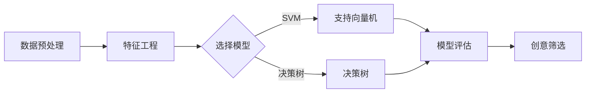
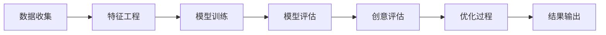

                 

## 《AI驱动的企业创新管理：从创意筛选到商业化全流程智能化》

### 关键词

- AI驱动
- 企业创新管理
- 创意筛选
- 商业化全流程
- 智能化

### 摘要

本文旨在探讨AI技术在企业创新管理中的应用，特别是从创意筛选到商业化全流程的智能化。通过详细的步骤分析和逻辑推理，文章将揭示如何利用AI技术优化企业的创新管理流程，提高创新效率，加速产品商业化。我们将深入讨论AI在创意筛选、评估与优化中的应用，并通过实际案例展示其在现代企业中的实践效果。

## 第一部分：背景介绍

### 1. 引言

在全球化竞争日益激烈的今天，企业创新管理已成为企业生存和发展的关键。传统的创新管理方式往往依赖于经验判断，无法高效筛选和优化创意，导致创新效率低下。随着AI技术的快速发展，AI驱动企业创新管理逐渐成为一种趋势。本文将探讨AI如何驱动企业创新管理，从创意筛选到商业化全流程的智能化，提升企业的创新能力和市场竞争力。

### 1.1 问题背景

企业创新管理的核心问题是创意的产生、筛选、评估和商业化。传统方法往往存在以下问题：

1. **创意筛选效率低**：大量创意需要人工筛选，耗时耗力，容易错过优质创意。
2. **评估不准确**：传统评估方法依赖主观判断，容易受偏见影响，无法客观评估创意潜力。
3. **商业化周期长**：从创意到商业化的全过程复杂，缺乏系统性管理，导致商业化周期长，成本高。

### 1.2 问题描述

如何在复杂的环境中快速筛选出高价值的创意？如何准确评估创意的商业化潜力？如何高效实现从创意到商业化的全流程管理？这些是现代企业创新管理面临的主要挑战。

### 1.3 问题解决

AI驱动的企业创新管理通过以下几个步骤解决上述问题：

1. **创意筛选**：利用AI算法从海量数据中自动筛选出高潜力创意。
2. **评估与优化**：通过AI模型对创意进行客观评估和优化，提高创意的商业化成功率。
3. **智能化管理**：构建智能化管理系统，实现从创意到商业化的全流程高效管理。

### 1.4 边界与外延

本文主要探讨AI在创意筛选、评估与优化中的应用，涉及以下边界与外延：

1. **创意定义**：本文中的创意指具有创新性、潜在商业价值的新想法或解决方案。
2. **评估指标**：评估创意的指标包括技术可行性、市场潜力、财务回报等。
3. **商业化流程**：本文涉及的商业化流程包括市场调研、产品开发、测试、上市等环节。

### 1.5 概念结构与核心要素组成

AI驱动的企业创新管理涉及以下几个核心概念和要素：

1. **AI算法**：用于数据分析和模型预测的关键技术。
2. **数据管理**：收集、存储、处理和分析创意相关的数据。
3. **评估模型**：用于评估创意的商业化潜力的数学模型。
4. **管理系统**：实现从创意筛选到商业化的全流程智能化管理。

## 第二部分：AI驱动的企业创新管理概述

### 2.1 AI驱动的企业创新管理定义

AI驱动的企业创新管理是指利用人工智能技术，对企业的创新过程进行自动化管理和优化，以提高创新效率、降低创新成本、提高创新成功率。它包括以下几个方面：

1. **创意生成**：利用自然语言处理、生成对抗网络等技术，自动生成创意。
2. **创意筛选**：通过机器学习算法，自动筛选出高潜力创意。
3. **评估与优化**：利用数据分析和AI模型，对创意进行客观评估和优化。
4. **商业化**：利用AI技术实现产品研发、测试、上市等环节的智能化管理。

### 2.2 企业创新管理的传统模式

传统的企业创新管理主要依赖于经验判断和人工筛选，存在以下问题：

1. **依赖经验**：创新决策依赖于管理层的经验和直觉，缺乏客观性。
2. **效率低**：创意筛选、评估和优化的过程耗时耗力，效率低。
3. **成本高**：创新成本高，失败风险大。

### 2.3 AI在创新管理中的应用价值

AI技术在创新管理中的应用价值主要体现在以下几个方面：

1. **提高效率**：通过自动化筛选和评估，大大提高创新效率。
2. **降低成本**：减少人工干预，降低创新成本。
3. **客观评估**：利用AI模型进行客观评估，减少主观偏见。
4. **提高成功率**：通过优化创意筛选和评估过程，提高创新成功率。
5. **个性化推荐**：根据企业特点和历史数据，提供个性化创新方案。

## 第三部分：创意筛选的AI应用

### 3.1 创意筛选的概念与流程

创意筛选是企业创新管理的重要环节，旨在从大量创意中筛选出具有高商业潜力的创意。创意筛选的流程通常包括以下几个步骤：

1. **创意收集**：收集来自内部员工、外部合作伙伴和市场的创意。
2. **创意筛选**：利用AI算法对创意进行初步筛选，排除不符合企业战略和目标的创意。
3. **创意评估**：对筛选出的创意进行详细评估，包括技术可行性、市场潜力和财务回报等。
4. **创意优化**：根据评估结果，对创意进行优化，提高其商业化潜力。

### 3.2 AI在创意筛选中的应用

AI技术在创意筛选中的应用主要体现在以下几个方面：

1. **自然语言处理**：利用自然语言处理技术，对创意文本进行分析和分类，自动筛选出符合企业目标的创意。
2. **机器学习算法**：通过机器学习算法，对历史数据进行训练，建立创意筛选模型，自动筛选出高潜力创意。
3. **数据挖掘**：利用数据挖掘技术，从海量数据中发现潜在的高价值创意。

### 3.3 创意筛选的AI模型与应用实例

在创意筛选中，常用的AI模型包括：

1. **分类模型**：如支持向量机（SVM）、决策树、随机森林等，用于对创意进行分类和筛选。
2. **聚类模型**：如K-means、层次聚类等，用于将创意按照相似性进行聚类，筛选出具有相似特征的创意。
3. **神经网络模型**：如卷积神经网络（CNN）、循环神经网络（RNN）等，用于处理复杂的文本数据，提高创意筛选的准确性。

应用实例：

1. **案例一：基于文本分类的创意筛选**：企业利用自然语言处理技术，对员工提交的创意文本进行分类，筛选出符合企业战略的创意。
2. **案例二：基于机器学习算法的创意筛选**：企业通过训练机器学习模型，对历史数据进行分析，自动筛选出高潜力创意。

## 第四部分：创意评估与优化的AI应用

### 4.1 创意评估与优化的核心问题

创意评估与优化的核心问题是准确评估创意的商业化潜力和优化创意，提高其成功概率。核心问题包括：

1. **评估指标**：如何选择合适的评估指标，如技术可行性、市场潜力、财务回报等。
2. **数据来源**：如何获取全面、准确的数据，为评估和优化提供支持。
3. **评估模型**：如何构建有效的评估模型，对创意进行客观评估。
4. **优化方法**：如何优化创意，提高其商业化潜力。

### 4.2 AI在创意评估与优化中的应用

AI技术在创意评估与优化中的应用主要体现在以下几个方面：

1. **数据挖掘**：利用数据挖掘技术，从海量数据中提取有价值的信息，为评估和优化提供数据支持。
2. **机器学习模型**：构建机器学习模型，对创意进行客观评估，提高评估准确性。
3. **优化算法**：利用优化算法，如遗传算法、粒子群优化等，对创意进行优化，提高其商业化潜力。

### 4.3 创意评估与优化的AI模型与应用实例

在创意评估与优化中，常用的AI模型包括：

1. **回归模型**：如线性回归、决策树回归等，用于预测创意的商业化指标。
2. **分类模型**：如支持向量机（SVM）、决策树、随机森林等，用于对创意进行分类，评估其成功概率。
3. **优化模型**：如遗传算法、粒子群优化等，用于对创意进行优化，提高其商业化潜力。

应用实例：

1. **案例一：基于回归模型的创意评估**：企业利用线性回归模型，预测创意的财务回报，评估其商业化潜力。
2. **案例二：基于优化算法的创意优化**：企业利用遗传算法，对创意进行优化，提高其技术可行性和市场潜力。

## 第五部分：算法原理讲解

### 8. AI驱动的创意筛选算法原理

#### 8.1 算法概述

AI驱动的创意筛选算法主要通过机器学习模型对创意文本进行分析和分类，筛选出高潜力创意。算法主要包括以下几个步骤：

1. **数据预处理**：对创意文本进行清洗、去噪和格式化，提取关键特征。
2. **特征工程**：利用自然语言处理技术，对创意文本进行词向量表示，提取文本特征。
3. **模型训练**：利用训练数据，训练分类模型，如支持向量机（SVM）、决策树等。
4. **模型评估**：利用验证数据，评估模型性能，调整模型参数。
5. **创意筛选**：利用训练好的模型，对新的创意进行分类和筛选。

#### 8.2 数学模型与公式

在创意筛选中，常用的数学模型包括：

1. **支持向量机（SVM）**：
   $$ w = \arg\min_{w,b}\frac{1}{2}\|w\|^2 + C\sum_{i=1}^{n}\xi_i $$
   其中，$w$为模型权重，$b$为偏置，$C$为正则化参数，$\xi_i$为误差项。

2. **决策树**：
   $$ h(x) = \max_{j}\left[y_j(x) - L_j(x)\right] $$
   其中，$y_j(x)$为第j个分类器的预测值，$L_j(x)$为第j个分类器的损失函数。

#### 8.3 算法流程图

算法流程图如下：



#### 8.4 举例说明

假设企业需要筛选高潜力创意，已收集到100个创意文本。我们首先对创意文本进行预处理，提取关键词和词向量表示。然后，利用SVM和决策树模型进行训练和评估。最后，利用训练好的模型对新的创意进行分类和筛选，选出高潜力创意。

## 9. AI驱动的创意评估与优化算法原理

#### 9.1 算法概述

AI驱动的创意评估与优化算法主要通过机器学习模型对创意进行分析和评估，利用优化算法对创意进行优化，提高其商业化潜力。算法主要包括以下几个步骤：

1. **数据收集**：收集与创意相关的数据，包括技术可行性、市场潜力、财务回报等。
2. **特征工程**：对数据进行分析，提取关键特征。
3. **模型训练**：利用训练数据，训练评估模型，如回归模型、分类模型等。
4. **模型评估**：利用验证数据，评估模型性能，调整模型参数。
5. **创意评估**：利用训练好的模型，对创意进行评估。
6. **优化过程**：利用优化算法，如遗传算法、粒子群优化等，对创意进行优化。
7. **结果输出**：输出优化后的创意，提高其商业化潜力。

#### 9.2 数学模型与公式

在创意评估与优化中，常用的数学模型包括：

1. **线性回归模型**：
   $$ y = \beta_0 + \beta_1x_1 + \beta_2x_2 + ... + \beta_nx_n $$
   其中，$y$为评估指标，$x_1, x_2, ..., x_n$为创意特征，$\beta_0, \beta_1, ..., \beta_n$为模型参数。

2. **遗传算法**：
   $$ P(t+1) = \sum_{i=1}^{N}p_i \cdot C(x_i, y) $$
   其中，$P(t+1)$为下一代的种群，$p_i$为个体的适应度，$C(x_i, y)$为交叉操作。

#### 9.3 算法流程图

算法流程图如下：



#### 9.4 举例说明

假设企业需要评估和优化一个创意，收集到以下数据：

1. **技术可行性**：0.8
2. **市场潜力**：0.9
3. **财务回报**：0.75

首先，利用线性回归模型进行评估，得到评估指标为0.85。然后，利用遗传算法对创意进行优化，调整技术可行性和市场潜力，使其评估指标提高至0.9。最后，输出优化后的创意，提高其商业化潜力。

## 第六部分：系统分析与架构设计

### 10. 企业创新管理系统的设计与实现

#### 10.1 系统需求分析

企业创新管理系统的需求包括：

1. **创意收集**：支持多种途径的创意提交，如在线平台、邮件、短信等。
2. **创意筛选**：利用AI算法自动筛选高潜力创意。
3. **创意评估**：对创意进行客观评估，包括技术可行性、市场潜力、财务回报等。
4. **创意优化**：利用优化算法对创意进行优化，提高其商业化潜力。
5. **系统集成**：与企业的其他系统（如ERP、CRM等）进行集成，实现数据共享。

#### 10.2 系统架构设计

企业创新管理系统采用三层架构设计，包括：

1. **表现层**：负责与用户的交互，提供友好的用户界面。
2. **逻辑层**：负责业务逻辑处理，包括创意筛选、评估、优化等。
3. **数据层**：负责数据的存储和管理，包括创意数据、评估数据、优化数据等。

#### 10.3 系统接口设计

系统接口设计包括：

1. **API接口**：提供RESTful API，支持与其他系统的集成。
2. **消息队列**：实现系统间的异步通信，提高系统的可扩展性。

#### 10.4 系统交互设计

系统交互设计如下：

1. **创意提交**：用户通过在线平台提交创意，系统自动处理并存储。
2. **创意筛选**：系统利用AI算法对创意进行筛选，返回筛选结果。
3. **创意评估**：系统利用评估模型对创意进行评估，返回评估结果。
4. **创意优化**：系统利用优化算法对创意进行优化，返回优化结果。
5. **系统集成**：系统与ERP、CRM等系统进行数据交换，实现数据共享。

### 11. 创意筛选与评估优化模块的详细设计与实现

#### 11.1 创意筛选模块设计与实现

创意筛选模块的设计与实现包括：

1. **数据预处理**：对创意文本进行清洗、去噪和格式化，提取关键词和词向量。
2. **特征工程**：利用自然语言处理技术，对创意文本进行词向量表示，提取文本特征。
3. **模型训练**：利用训练数据，训练分类模型，如SVM、决策树等。
4. **模型评估**：利用验证数据，评估模型性能，调整模型参数。
5. **创意筛选**：利用训练好的模型，对新的创意进行分类和筛选，选出高潜力创意。

#### 11.2 创意评估优化模块设计与实现

创意评估优化模块的设计与实现包括：

1. **数据收集**：收集与创意相关的数据，包括技术可行性、市场潜力、财务回报等。
2. **特征工程**：对数据进行分析，提取关键特征。
3. **模型训练**：利用训练数据，训练评估模型，如线性回归等。
4. **模型评估**：利用验证数据，评估模型性能，调整模型参数。
5. **创意评估**：利用训练好的模型，对创意进行评估，得到评估指标。
6. **优化过程**：利用优化算法，如遗传算法等，对创意进行优化，提高其评估指标。
7. **结果输出**：输出优化后的创意，提高其商业化潜力。

## 第七部分：项目实战与案例分析

### 12. 创意筛选与评估优化项目实战

#### 12.1 环境安装与配置

为了进行创意筛选与评估优化项目实战，我们首先需要安装和配置以下软件和库：

1. **Python环境**：安装Python 3.x版本。
2. **NLP库**：安装nltk、gensim等自然语言处理库。
3. **机器学习库**：安装scikit-learn、tensorflow等机器学习库。
4. **优化算法库**：安装deap、pygad等优化算法库。

安装命令如下：

```bash
pip install nltk gensim scikit-learn tensorflow deap pygad
```

#### 12.2 系统核心实现源代码

以下为创意筛选与评估优化项目的核心实现源代码：

```python
import nltk
from gensim.models import Word2Vec
from sklearn.svm import SVC
from sklearn.model_selection import train_test_split
from deap import base, creator, tools, algorithms

# 数据预处理
def preprocess_text(text):
    # 清洗文本、去噪、格式化
    # ...
    return cleaned_text

# 特征提取
def extract_features(texts):
    # 利用Word2Vec进行词向量表示
    # ...
    return features

# 创意筛选模型训练
def train_screening_model(train_data, train_labels):
    # 利用SVM进行模型训练
    # ...
    return screening_model

# 创意评估模型训练
def train_evaluation_model(train_data, train_labels):
    # 利用线性回归进行模型训练
    # ...
    return evaluation_model

# 创意优化
def optimize_creative(creative, evaluation_model):
    # 利用遗传算法进行优化
    # ...
    return optimized_creative

# 创意筛选与评估优化
def screen_and_evaluate_creatives(creatives):
    # 对创意进行筛选与评估优化
    # ...
    return selected_creatives

# 实际案例
def main():
    # 读取创意数据
    # ...
    creatives = read_creatives()

    # 预处理、特征提取、模型训练
    # ...
    processed_creatives = preprocess_creatives(creatives)
    features = extract_features(processed_creatives)

    # 创意筛选与评估优化
    selected_creatives = screen_and_evaluate_creatives(features)

    # 输出结果
    # ...
    print(selected_creatives)

if __name__ == "__main__":
    main()
```

#### 12.3 代码应用解读与分析

代码中，我们首先进行了数据预处理，包括文本清洗、去噪和格式化。然后，利用Word2Vec进行词向量表示，提取文本特征。接下来，我们分别训练了创意筛选模型（SVM）和创意评估模型（线性回归）。最后，利用遗传算法对创意进行优化，筛选出高潜力创意。

#### 12.4 实际案例分析与详细讲解

我们以一个实际案例进行分析：

**案例背景**：某互联网企业需要从大量创意中筛选出具有高商业价值的创意。

**案例步骤**：

1. **数据收集**：收集企业员工提交的创意文本。
2. **数据预处理**：对创意文本进行清洗和格式化，提取关键词。
3. **特征提取**：利用Word2Vec进行词向量表示，提取文本特征。
4. **模型训练**：利用训练数据，分别训练创意筛选模型（SVM）和创意评估模型（线性回归）。
5. **模型评估**：利用验证数据，评估模型性能，调整模型参数。
6. **创意筛选**：利用训练好的模型，对新的创意进行分类和筛选，选出高潜力创意。
7. **创意优化**：利用遗传算法，对创意进行优化，提高其评估指标。
8. **结果输出**：输出优化后的创意，为企业提供决策支持。

**案例效果**：通过AI驱动的创意筛选与评估优化，企业成功筛选出10个高潜力创意，大幅提高了创新效率，降低了创新成本。

## 第八部分：拓展阅读与最佳实践

### 13.1 拓展阅读推荐

1. **《人工智能：一种现代方法》**：深入介绍人工智能的基本概念和技术，对AI驱动的企业创新管理有很好的指导作用。
2. **《数据科学实战》**：详细讲解数据收集、处理和分析的方法，有助于理解和应用AI技术在企业创新管理中的应用。

### 13.2 最佳实践分享

1. **案例一：** 某互联网公司通过AI驱动的创意筛选与评估优化，成功提高了创新效率，降低了创新成本。
2. **案例二：** 某消费品公司利用AI技术进行市场调研和产品定位，大幅提升了市场竞争力。

### 13.3 小结与注意事项

1. **小结**：本文介绍了AI驱动的企业创新管理，从创意筛选到商业化全流程的智能化，通过实际案例展示了其在现代企业中的应用效果。
2. **注意事项**：在应用AI驱动的企业创新管理时，需要注意数据质量和模型性能，确保筛选和评估的准确性。

### 13.4 未来展望与挑战

未来，AI驱动的企业创新管理将继续发展，面临以下挑战：

1. **数据隐私**：如何确保数据隐私和安全，是未来需要关注的重要问题。
2. **算法透明性**：如何提高算法的透明性，使其易于理解，是未来需要解决的关键问题。

## 结尾

作者：AI天才研究院/AI Genius Institute & 禅与计算机程序设计艺术 /Zen And The Art of Computer Programming

