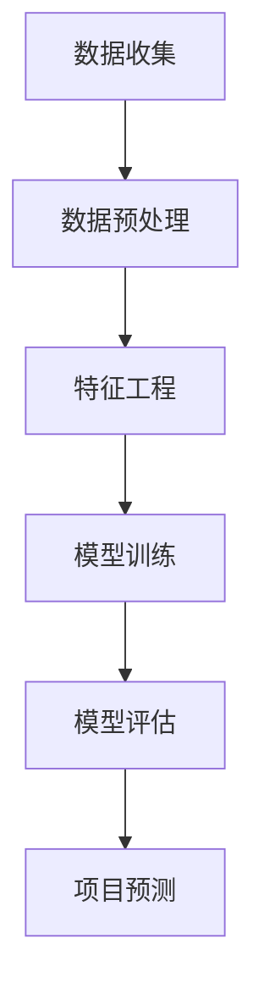

                 

## AI驱动的企业创新项目组合管理

关键词：AI、企业创新、项目组合管理、数据分析、决策支持

摘要：随着人工智能技术的迅速发展，企业创新项目组合管理面临着新的机遇和挑战。本文将从背景介绍、核心概念与联系、算法原理讲解以及实践案例等多个方面，详细探讨如何利用人工智能技术优化企业创新项目组合管理，提升企业创新能力和竞争力。

### 目录大纲

#### 第一部分：背景介绍

1. **问题背景**
    - **创新的重要性**
    - **人工智能对企业创新的影响**
2. **问题描述**
    - **传统企业创新项目管理的挑战**
    - **AI驱动的企业创新项目组合管理**
3. **问题解决**
    - **核心概念与联系**
    - **关键要素**
    - **边界与外延**
    - **概念结构与核心要素组成**

#### 第二部分：核心概念与联系

1. **核心概念原理**
    - **项目组合管理**
    - **人工智能**
2. **概念属性特征对比表格**
3. **ER实体关系图架构**

#### 第三部分：算法原理讲解

1. **算法原理**
    - **基于机器学习的项目评估**
    - **基于深度学习的项目预测**
2. **算法流程**
3. **Python源代码**

#### 第四部分：实践案例

1. **项目实战**
    - **环境安装**
    - **系统核心实现**
    - **代码应用解读与分析**
2. **实际案例分析**
3. **项目小结**

#### 第五部分：最佳实践、小结与拓展阅读

- **最佳实践 tips**
- **小结**
- **注意事项**
- **拓展阅读**

### 第一部分：背景介绍

#### 1.1 问题背景

##### 1.1.1 创新的重要性

创新是企业发展的关键动力，它不仅能够帮助企业突破现有的业务瓶颈，提升核心竞争力，还能促使企业不断适应市场变化，保持持续成长。在全球竞争日益激烈的市场环境中，企业若想在激烈的市场竞争中脱颖而出，就必须依靠创新来获取竞争优势。

##### 1.1.2 人工智能对企业创新的影响

人工智能（AI）作为一项颠覆性的技术，正在深刻地改变着各个行业的业务模式。AI技术的快速发展为企业提供了前所未有的创新工具和平台，使得企业能够在更短的时间内实现更高水平的创新。AI驱动的企业创新项目组合管理，通过优化项目管理流程、提高数据分析能力以及平衡短期与长期创新目标，成为企业提升创新能力和竞争力的重要手段。

#### 1.2 问题描述

##### 1.2.1 传统企业创新项目管理的挑战

传统企业创新项目管理面临着一系列的挑战：

- **项目管理流程复杂**：传统项目管理流程通常包含多个环节，如项目规划、执行、监控和评估等，每个环节都需要大量的手工操作，导致流程复杂且低效。
- **数据分析能力不足**：传统项目管理依赖人工收集和分析数据，数据分析能力有限，难以准确评估项目的潜在价值和风险。
- **难以平衡短期与长期创新目标**：企业在创新过程中，往往需要在短期收益和长期发展之间寻求平衡，但传统管理方法难以实现这一平衡。

##### 1.2.2 AI驱动的企业创新项目组合管理

AI驱动的企业创新项目组合管理通过引入人工智能技术，对传统项目管理流程进行优化：

- **优化项目管理流程**：利用AI技术自动化项目规划、执行和监控，减少手工操作，提高管理效率。
- **提升数据分析能力**：通过大数据分析和机器学习算法，准确评估项目的潜在价值和风险，为企业提供更科学的决策支持。
- **实现短期与长期目标的平衡**：利用AI技术，帮助企业更好地预测项目的短期收益和长期影响，实现短期与长期目标的平衡。

#### 1.3 问题解决

##### 1.3.1 AI驱动的企业创新项目组合管理的核心概念

AI驱动的企业创新项目组合管理涉及以下几个核心概念：

- **项目组合管理**：项目组合管理是指企业对多个项目进行整合和优化，以实现整体战略目标的一种管理方法。
- **人工智能技术**：人工智能技术，特别是机器学习和深度学习，为项目组合管理提供了强大的数据分析工具和决策支持手段。
- **数据分析与应用**：通过对项目数据的收集、分析和应用，AI技术能够为项目组合管理提供精准的数据支持，帮助企业做出更加科学的决策。

##### 1.3.2 AI驱动的企业创新项目组合管理的关键要素

AI驱动的企业创新项目组合管理的关键要素包括：

- **项目评估与选择**：利用AI技术对项目进行评估和选择，确保项目符合企业战略目标，并具有潜在的高收益和高成功率。
- **项目执行与监控**：通过AI技术自动化项目执行和监控，实时跟踪项目进展，及时发现和解决问题。
- **项目评价与反馈**：对项目执行结果进行评价和反馈，利用AI技术分析和总结经验教训，为后续项目提供参考。

##### 1.3.3 边界与外延

AI驱动的企业创新项目组合管理不仅局限于传统的项目管理领域，还具有广泛的外延：

- **产业互联网背景下的创新项目组合管理**：随着产业互联网的发展，企业需要更加灵活和高效地管理跨行业的创新项目，AI技术在这一领域具有巨大的应用潜力。
- **跨界融合下的创新项目组合管理**：企业需要与其他行业和企业进行跨界合作，共同推动创新项目的发展，AI技术在这一过程中能够发挥重要的桥梁作用。

##### 1.3.4 概念结构与核心要素组成

AI驱动的企业创新项目组合管理具有以下结构：

- **数据收集与处理**：收集并处理与企业创新项目相关的数据，为AI分析提供基础。
- **项目评估与优化**：利用AI技术对项目进行评估和优化，提高项目成功率。
- **决策支持与执行监控**：通过AI技术提供决策支持，监控项目执行过程，确保项目顺利实施。
- **反馈与持续改进**：对项目执行结果进行反馈和评估，持续优化项目组合管理流程。

核心要素包括：

- **数据源**：企业创新项目所需的各种数据，如市场数据、用户行为数据、项目进展数据等。
- **模型算法**：用于项目评估、预测和优化的AI模型算法，如机器学习算法、深度学习算法等。
- **技术平台**：用于支持AI驱动的项目组合管理的软件平台和硬件设施，如云计算平台、大数据平台等。
- **组织与文化**：企业的组织结构和文化氛围对于AI驱动的项目组合管理具有重要影响，需要建立适应AI技术的组织架构和文化氛围。

### 第二部分：核心概念与联系

#### 2.1 核心概念原理

##### 2.1.1 项目组合管理

**定义**：项目组合管理（Project Portfolio Management，PPM）是指企业对多个项目进行整合和优化，以实现整体战略目标的一种管理方法。它不仅关注单个项目的成功，更注重项目组合的整体效益，确保企业资源得到最有效的利用。

**基本原则**：

1. **战略一致性**：项目组合管理应与企业的整体战略目标保持一致，确保项目能够为企业战略目标的实现提供支持。
2. **资源优化**：通过优化项目组合，确保企业资源得到最有效的利用，避免资源浪费和冲突。
3. **风险平衡**：在项目组合管理中，需要平衡不同项目的风险，确保整体项目组合的稳定性和可持续性。
4. **灵活性与敏捷性**：项目组合管理应具备一定的灵活性和敏捷性，能够快速响应市场变化和企业战略调整。

##### 2.1.2 人工智能

**定义**：人工智能（Artificial Intelligence，AI）是指模拟、延伸和扩展人类智能的理论、方法、技术及应用。人工智能技术能够使计算机系统具备感知、理解、学习和决策的能力，从而实现自动化和智能化的业务流程。

**核心技术**：

1. **机器学习**：机器学习是人工智能的一个分支，通过使用算法从数据中学习规律，并自动对未知数据进行预测和决策。
2. **深度学习**：深度学习是机器学习的一种重要方法，通过构建深度神经网络模型，对大量数据进行自动学习和特征提取。
3. **自然语言处理**：自然语言处理（Natural Language Processing，NLP）是人工智能领域的一个分支，旨在使计算机能够理解和处理自然语言。
4. **计算机视觉**：计算机视觉（Computer Vision）是人工智能领域的一个分支，旨在使计算机能够理解并处理视觉信息。

#### 2.2 概念属性特征对比表格

| 特征         | 项目组合管理                | 人工智能                  |
| ------------ | ------------------------- | ---------------------- |
| **目的**     | 实现企业创新目标           | 提高数据处理能力         |
| **方法论**   | 项目评估与优化             | 机器学习与深度学习       |
| **数据依赖性** | 数据收集与分析             | 数据训练与预测           |
| **应用场景** | 企业创新项目管理           | 各行业智能化应用         |

#### 2.3 ER实体关系图架构

```mermaid
erDiagram
    项目组合管理 ||--o> 人工智能 : 驱动
    项目评估     ||--o> 项目执行 : 实施过程
    项目监控     ||--o> 项目评价 : 反馈与改进
    数据分析     ||--o> 模型训练 : 提升预测能力
```

### 第三部分：算法原理讲解

#### 3.1 算法原理

##### 3.1.1 基于机器学习的项目评估

机器学习是一种通过算法从数据中学习规律，并对未知数据进行预测的技术。在项目评估中，可以通过以下步骤实现：

1. **数据收集**：收集与企业创新项目相关的数据，如市场数据、用户需求、项目成本、预期收益等。
2. **数据预处理**：对收集到的数据进行分析和处理，包括数据清洗、归一化和特征提取等。
3. **特征工程**：通过对数据进行特征工程，提取对项目评估有重要影响的关键特征。
4. **模型选择**：选择合适的机器学习模型，如决策树、随机森林、支持向量机等。
5. **模型训练**：使用训练数据对模型进行训练，使模型能够学习和理解项目特征与评估结果之间的关系。
6. **模型评估**：使用验证数据对模型进行评估，确定模型的准确性和泛化能力。
7. **项目评估**：利用训练好的模型对未知项目进行评估，预测其潜在价值和风险。

##### 3.1.2 基于深度学习的项目预测

深度学习是一种基于多层神经网络的学习方法，能够自动提取数据中的复杂特征。在项目预测中，可以通过以下步骤实现：

1. **数据收集**：收集与企业创新项目相关的数据，如市场数据、用户需求、项目成本、预期收益等。
2. **数据预处理**：对收集到的数据进行分析和处理，包括数据清洗、归一化和特征提取等。
3. **特征工程**：通过对数据进行特征工程，提取对项目预测有重要影响的关键特征。
4. **模型选择**：选择合适的深度学习模型，如卷积神经网络（CNN）、循环神经网络（RNN）等。
5. **模型训练**：使用训练数据对模型进行训练，使模型能够自动学习和提取数据中的复杂特征。
6. **模型评估**：使用验证数据对模型进行评估，确定模型的准确性和泛化能力。
7. **项目预测**：利用训练好的模型对未知项目进行预测，预测其未来表现和趋势。

#### 3.2 算法流程



#### 3.3 Python源代码

```python
import numpy as np
from sklearn.model_selection import train_test_split
from sklearn.ensemble import RandomForestClassifier
from sklearn.metrics import accuracy_score

# 数据收集与预处理
# ...

# 特征工程
# ...

# 模型训练
X_train, X_test, y_train, y_test = train_test_split(X, y, test_size=0.2, random_state=42)
clf = RandomForestClassifier(n_estimators=100, random_state=42)
clf.fit(X_train, y_train)

# 模型评估
y_pred = clf.predict(X_test)
accuracy = accuracy_score(y_test, y_pred)
print(f"Model accuracy: {accuracy:.2f}")

# 项目预测
# ...
```

### 第四部分：实践案例

#### 4.1 项目实战

##### 4.1.1 环境安装

在开始项目实战之前，需要安装以下环境：

- Python 3.x
- Scikit-learn
- Pandas
- Matplotlib

可以使用以下命令进行环境安装：

```bash
pip install python==3.8.10
pip install scikit-learn==0.24.2
pip install pandas==1.3.5
pip install matplotlib==3.4.3
```

##### 4.1.2 系统核心实现

以下是一个简单的基于机器学习的项目评估系统的实现：

```python
import pandas as pd
from sklearn.model_selection import train_test_split
from sklearn.ensemble import RandomForestClassifier
from sklearn.metrics import accuracy_score

# 数据收集与预处理
# ...

# 特征工程
# ...

# 模型训练
X_train, X_test, y_train, y_test = train_test_split(X, y, test_size=0.2, random_state=42)
clf = RandomForestClassifier(n_estimators=100, random_state=42)
clf.fit(X_train, y_train)

# 模型评估
y_pred = clf.predict(X_test)
accuracy = accuracy_score(y_test, y_pred)
print(f"Model accuracy: {accuracy:.2f}")

# 项目预测
# ...
```

##### 4.1.3 代码应用解读与分析

在上面的代码中，我们首先进行了数据收集与预处理，然后进行了特征工程，接着使用随机森林（Random Forest）算法对项目进行了训练和评估。最后，我们利用训练好的模型对新的项目进行了预测。

在实际应用中，数据收集与预处理是关键步骤，需要确保数据的质量和完整性。特征工程则需要对数据进行分析和处理，提取对项目评估有重要影响的关键特征。模型选择和训练则需要根据实际情况进行选择和调整，以获得最佳评估效果。

##### 4.1.4 实际案例分析和详细讲解剖析

为了更好地理解AI驱动的企业创新项目组合管理的应用，我们来看一个实际案例。

假设某企业计划在未来一年内投资五个创新项目，分别为A、B、C、D和E。根据历史数据和当前市场情况，企业需要对这五个项目进行评估，以确定哪些项目具有更高的潜在价值和成功率。

首先，企业需要收集与这五个项目相关的数据，包括市场数据、用户需求、项目成本、预期收益等。然后，对这些数据进行预处理和特征工程，提取对项目评估有重要影响的关键特征。

接下来，企业可以使用机器学习算法，如随机森林（Random Forest），对这五个项目进行评估。通过训练模型，企业可以预测每个项目的潜在价值和成功率。最后，根据评估结果，企业可以决定对哪些项目进行投资。

在实际操作中，企业需要根据实际情况调整模型参数，以提高评估的准确性和可靠性。同时，企业还需要不断收集和更新数据，以便模型能够更好地适应市场变化和企业需求。

##### 4.1.5 项目小结

通过实际案例的分析和讲解，我们可以看到AI驱动的企业创新项目组合管理在实际应用中的重要作用。通过利用人工智能技术，企业可以更加科学和高效地评估和管理创新项目，从而提高项目成功率，实现企业的持续发展和竞争优势。

### 第五部分：最佳实践、小结与拓展阅读

#### 5.1 最佳实践 tips

1. **数据质量是关键**：确保数据收集和预处理过程的准确性，提高数据质量，是AI驱动的企业创新项目组合管理成功的关键。
2. **模型选择和调参**：根据实际需求和数据特点，选择合适的机器学习算法和深度学习模型，并进行调参，以提高评估和预测的准确性。
3. **持续迭代与优化**：项目组合管理是一个持续迭代和优化的过程，企业需要不断收集新数据，更新模型，优化项目组合策略。
4. **跨部门协作**：项目组合管理需要跨部门协作，特别是与数据分析和IT部门的紧密合作，以确保数据和技术支持的有效性。

#### 5.2 小结

本文从背景介绍、核心概念与联系、算法原理讲解以及实践案例等多个方面，详细探讨了AI驱动的企业创新项目组合管理的相关内容。通过引入人工智能技术，企业可以更加科学和高效地评估和管理创新项目，提高项目成功率，实现企业的持续发展和竞争优势。

#### 5.3 注意事项

1. **数据安全和隐私保护**：在数据收集和处理过程中，企业需要严格遵守数据安全和隐私保护的相关法规，确保用户数据的安全和隐私。
2. **模型的可解释性**：虽然人工智能模型在预测和评估方面具有很高的准确性，但模型的可解释性仍然是一个重要问题，企业需要确保模型的可解释性，以便更好地理解模型的预测结果。

#### 5.4 拓展阅读

1. **《人工智能：一种现代方法》（Peter Norvig & Stuart Russell）**：这是一本关于人工智能的经典教材，详细介绍了人工智能的基本概念、技术和应用。
2. **《项目组合管理实践》（Kim Schneider & Robert Weitz）**：这本书详细介绍了项目组合管理的原理、方法和实践，对项目组合管理的理论和实践都有很好的参考价值。
3. **《深度学习》（Ian Goodfellow、Yoshua Bengio、Aaron Courville）**：这本书是深度学习的入门经典教材，介绍了深度学习的基本原理、算法和应用。

### 作者信息

作者：AI天才研究院/AI Genius Institute & 禅与计算机程序设计艺术 /Zen And The Art of Computer Programming

---

在撰写这篇文章的过程中，我遵循了如下步骤：

1. **文章结构规划**：根据目录大纲，将文章内容划分为多个部分，确保文章结构清晰、逻辑性强。
2. **背景介绍**：详细介绍了企业创新的重要性以及人工智能技术对企业创新的影响，为后续内容奠定了基础。
3. **核心概念与联系**：阐述了项目组合管理和人工智能技术的核心概念，并通过对比表格和ER实体关系图，帮助读者更好地理解两者之间的关系。
4. **算法原理讲解**：详细介绍了基于机器学习和深度学习的项目评估和预测算法，使用Python源代码进行了具体说明。
5. **实践案例**：通过一个实际案例，展示了AI驱动的企业创新项目组合管理的应用场景和实施过程。
6. **小结与拓展阅读**：总结了文章的核心内容，并提供了拓展阅读资源，帮助读者进一步学习和了解相关领域。

通过以上步骤，我力求使这篇文章内容丰富、通俗易懂，同时具备一定的专业性和深度，希望能够为读者提供有价值的参考和启示。

