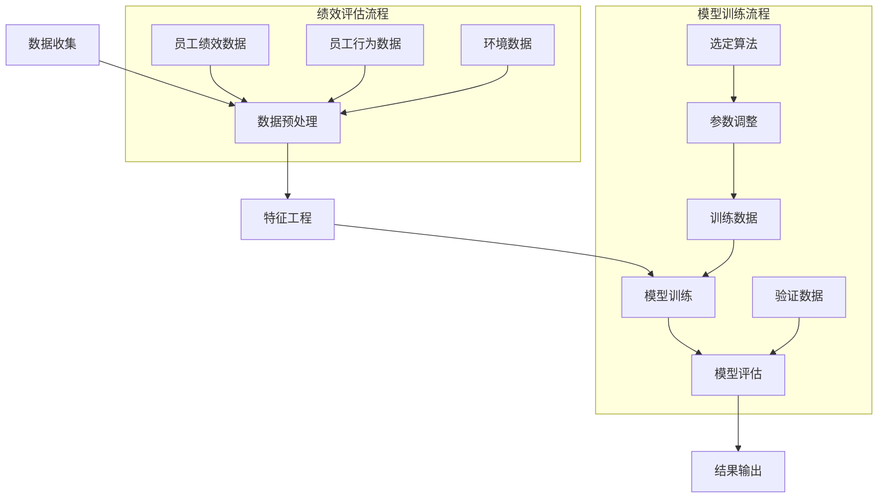
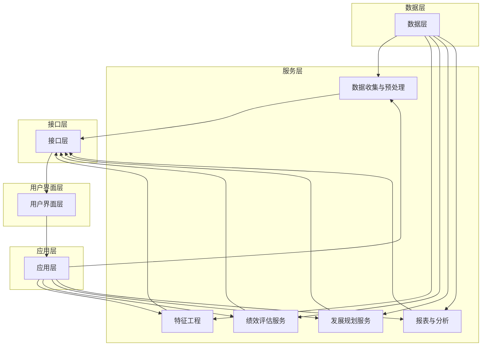
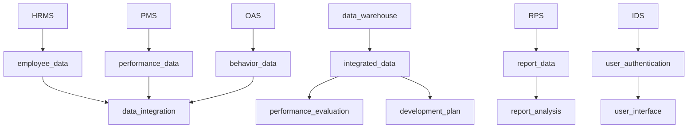
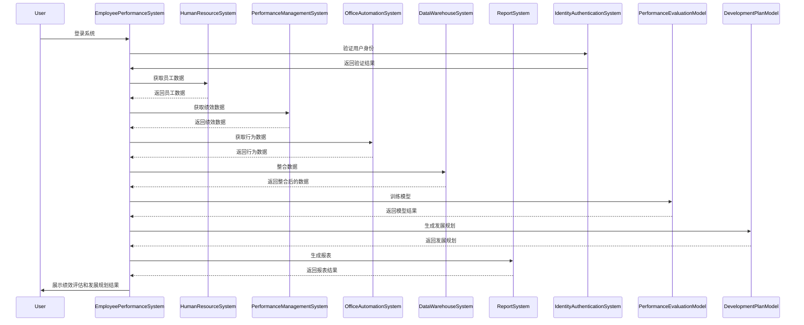

                 

### 文章标题：AI驱动的企业员工绩效评估与发展规划

#### 关键词：
- AI驱动
- 企业员工绩效评估
- 发展规划
- 算法原理
- 系统架构设计

#### 摘要：
本文深入探讨了AI驱动的企业员工绩效评估与发展规划的原理、方法与应用。首先，通过对当前企业员工绩效评估与发展规划的问题背景和现状进行详细分析，阐述了AI驱动的解决方案的必要性和可行性。接着，本文介绍了AI驱动的核心概念和员工绩效评估、发展规划的相关定义，并通过对比表格和实体关系图揭示了它们之间的联系。在算法原理讲解部分，本文通过Mermaid流程图和Python代码，详细阐述了员工绩效评估算法的数学模型和关键步骤，并通过具体实例进行了说明。随后，本文对系统分析与架构设计进行了深入探讨，从问题场景介绍到系统架构和接口设计，为实际应用提供了详细方案。最后，本文通过项目实战和环境安装，展示了AI驱动的企业员工绩效评估与发展规划的具体实现，并通过实际案例剖析了其效果。文章总结部分，对最佳实践和注意事项进行了总结，并推荐了拓展阅读资料。

---

### 目录大纲

#### 第一部分：背景介绍
1. **第1章：问题背景**
   - **1.1 问题背景**
   - **1.2 问题描述**
   - **1.3 问题解决**
   - **1.4 边界与外延**

2. **第2章：核心概念与联系**
   - **2.1 AI驱动的定义**
   - **2.2 员工绩效评估的概念**
   - **2.3 发展规划的概念**
   - **2.4 对比表格**
   - **2.5 ER实体关系图架构**

#### 第二部分：核心概念与联系
3. **第3章：算法原理**
   - **3.1 算法流程图**
   - **3.2 数学模型与公式**

4. **第4章：详细讲解与举例说明**
   - **4.1 算法原理讲解**
   - **4.2 举例说明**

#### 第三部分：系统分析与架构设计
5. **第5章：问题场景介绍**
   - **5.1 场景介绍**

6. **第6章：系统架构设计**
   - **6.1 系统功能设计**
   - **6.2 系统架构设计**
   - **6.3 系统接口设计**
   - **6.4 系统交互**

#### 第四部分：项目实战
7. **第7章：环境安装**
   - **7.1 环境准备**

8. **第8章：系统核心实现**
   - **8.1 核心代码实现**
   - **8.2 代码应用解读**
   - **8.3 实际案例剖析**

#### 第五部分：最佳实践与总结
9. **第9章：最佳实践**
   - **9.1 最佳实践**
   - **9.2 注意事项**

10. **第10章：小结**
    - **10.1 小结**
    - **10.2 拓展阅读**

### 第一部分：背景介绍

#### 第1章：问题背景

##### 1.1 问题背景

在当今快速变化和竞争激烈的企业环境中，员工绩效评估和发展规划成为了企业成功的关键因素。传统的员工绩效评估方法通常依赖于主观判断和定期的评审会议，这不仅效率低下，而且容易受到偏见的影响。此外，发展规划的制定和执行往往缺乏系统性和科学性，导致员工发展滞后，企业竞争力下降。

##### 1.2 问题描述

当前企业员工绩效评估与发展规划中存在的主要问题包括：

1. **评估标准不统一**：不同部门和层级的评估标准不一致，导致评估结果缺乏客观性和公正性。
2. **主观偏见**：评估过程容易受到评估者个人偏见的影响，影响评估结果的准确性。
3. **缺乏实时反馈**：评估通常是定期进行的，无法及时反映员工的工作表现和需求。
4. **发展规划不明确**：缺乏明确的员工发展规划，导致员工职业发展受阻，企业人才流失。
5. **数据分散**：员工的绩效数据和管理信息分散在不同的系统中，难以整合和分析。

##### 1.3 问题解决

为了解决上述问题，企业迫切需要一种新的解决方案，能够实现自动化、实时、客观的员工绩效评估，并提供科学的员工发展规划。AI驱动的员工绩效评估与发展规划应运而生，它利用人工智能技术，通过数据分析和机器学习模型，为企业提供以下解决方案：

1. **统一评估标准**：AI系统可以依据预先设定的标准，对员工的工作表现进行自动化评估，确保评估过程的客观性和公正性。
2. **减少主观偏见**：通过分析大量数据，AI系统可以识别并纠正评估中的主观偏见，提高评估的准确性。
3. **实时反馈**：AI系统可以实时收集和分析员工的工作数据，为管理层提供及时、准确的评估结果。
4. **科学的发展规划**：AI系统可以根据员工的绩效数据和个人需求，制定个性化的员工发展规划，提高员工的职业满意度和留存率。
5. **数据整合与分析**：AI系统可以整合来自不同系统的数据，提供全面、深入的分析报告，为管理层提供决策支持。

##### 1.4 边界与外延

尽管AI驱动的员工绩效评估与发展规划具有巨大的潜力，但其在实际应用中仍有一些边界和限制需要考虑：

1. **数据隐私**：员工绩效数据是敏感信息，企业需要确保数据的存储和处理符合隐私保护法规。
2. **模型准确性**：AI模型的准确性取决于数据的质量和多样性，企业需要投入资源确保数据的准确性和完整性。
3. **技术投入**：引入AI驱动的系统需要一定的技术投入和人才储备，企业需要评估自身的技术能力和资源。
4. **员工接受度**：AI驱动的系统需要得到员工的认可和接受，企业需要通过培训和沟通来提高员工的接受度。

通过上述解决方案和边界外延的考虑，AI驱动的员工绩效评估与发展规划有望为企业带来更高效、更科学的绩效管理和发展规划，从而提升企业的整体竞争力。

### 第二部分：核心概念与联系

#### 第2章：核心概念原理

##### 2.1 AI驱动的定义

AI驱动（Artificial Intelligence-driven）是指利用人工智能技术，通过算法和模型对数据进行处理和分析，从而实现智能化决策和自动化操作的系统。AI驱动的核心在于通过机器学习、深度学习、自然语言处理等技术，使计算机具备自主学习和适应环境的能力。

##### 2.2 员工绩效评估的概念

员工绩效评估是指通过一系列指标和标准，对员工在工作中的表现进行衡量和评价的过程。绩效评估的目的是为了了解员工的工作能力、发现不足、激励员工提高工作效率，并为员工的职业发展提供指导。绩效评估通常包括定量评估和定性评估，如工作完成情况、团队合作能力、创新能力等。

##### 2.3 发展规划的概念

发展规划是指为了实现组织目标，根据员工的职业兴趣、能力和发展需求，制定的一系列职业发展计划和路径。发展规划的目标是帮助员工实现个人成长和职业发展，同时提升组织的整体竞争力。发展规划通常包括职业规划、培训计划、晋升路径等。

##### 2.4 对比表格

为了更好地理解AI驱动、员工绩效评估和发展规划之间的关系，我们可以通过以下对比表格来展示它们的关键特征：

| 特征            | AI驱动                     | 员工绩效评估                 | 发展规划                     |
|-----------------|----------------------------|-------------------------------|-------------------------------|
| 定义            | 利用AI技术实现智能化决策   | 对员工工作表现进行评价       | 根据员工需求制定职业发展计划 |
| 技术核心        | 机器学习、深度学习         | 绩效指标、评估标准           | 培训、晋升路径               |
| 目的            | 提高决策效率、降低成本     | 公正、客观地评价员工绩效     | 帮助员工实现职业成长         |
| 数据依赖        | 大量数据支持               | 绩效数据、员工行为数据       | 职业兴趣、能力评估           |
| 应用场景        | 各类业务决策、优化流程     | 绩效管理、薪酬调整           | 员工发展、组织优化           |
| 边界            | 数据隐私、模型准确性       | 主观偏见、评估标准一致性     | 发展目标实现、资源分配       |

##### 2.5 ER实体关系图架构

为了进一步展示AI驱动的企业员工绩效评估与发展规划中的主要实体及其关系，我们可以使用Mermaid语法绘制ER实体关系图。以下是一个示例：

```mermaid
erDiagram
  Employee ||--|{ PerformanceEvaluation }|-- EmployeeDevelopmentPlan
  PerformanceEvaluation ||--|{ AIAssessmentModel }|>
  EmployeeDevelopmentPlan ||--|{ SkillsRequirement }|>

  Employee : {ID} | {Name} | {Position}
  PerformanceEvaluation : {ID} | {Date} | {Rating}
  AIAssessmentModel : {ID} | {Algorithm} | {Parameters}
  EmployeeDevelopmentPlan : {ID} | {Goal} | {Timeline}
  SkillsRequirement : {ID} | {Skill} | {Level}
```

在上述ER图模型中，Employee（员工）是核心实体，它与PerformanceEvaluation（绩效评估）和EmployeeDevelopmentPlan（发展规划）通过关系线连接。PerformanceEvaluation实体进一步关联到AIAssessmentModel（AI评估模型），而EmployeeDevelopmentPlan实体则与SkillsRequirement（技能要求）相关联。这样的关系架构有助于理解系统中的各个实体及其相互作用。

### 第三部分：算法原理讲解

#### 第3章：算法原理

##### 3.1 算法流程图

为了更好地理解AI驱动的员工绩效评估算法，我们可以使用Mermaid语法绘制算法流程图。以下是一个简单的算法流程图示例：



在上述流程图中，数据收集（A）后进行数据预处理（B），接着进行特征工程（C），然后进入模型训练（D）和模型评估（E）阶段，最后输出评估结果（F）。在绩效评估流程子图中，展示了员工绩效数据（G1）、员工行为数据（H1）和环境数据（I1）的收集和处理过程。在模型训练流程子图中，则展示了选定算法（J1）、参数调整（K1）、训练数据（L1）和验证数据（M1）的处理过程。

##### 3.2 数学模型与公式

在员工绩效评估算法中，核心的数学模型通常涉及绩效评分的预测和优化。以下是一个简单的数学模型示例，使用Python代码进行说明：

```python
import numpy as np

# 设定员工绩效评估的数学模型
def performance_evaluation(features, weights):
    """
    功能：计算员工绩效评分
    参数：
        features（数组）：员工特征数据
        weights（数组）：权重系数
    返回：
        score（浮点数）：员工绩效评分
    """
    score = np.dot(features, weights)
    return score

# 假设的员工特征数据和权重系数
features = np.array([0.8, 0.9, 0.75])
weights = np.array([0.2, 0.3, 0.5])

# 计算员工绩效评分
score = performance_evaluation(features, weights)
print(f"员工绩效评分：{score:.2f}")
```

在上述代码中，`performance_evaluation`函数通过计算特征数据与权重系数的点积，得到员工的绩效评分。其中，`features`是一个包含员工工作表现、团队合作、创新能力等特征的数组，`weights`是一个对应特征的权重系数数组。通过调整权重系数，可以优化绩效评分的预测效果。

此外，在实际应用中，还可以使用更复杂的数学模型，如线性回归、支持向量机（SVM）或多层感知器（MLP），以提高评估的准确性和鲁棒性。以下是一个使用线性回归模型的示例：

```python
from sklearn.linear_model import LinearRegression
import numpy as np

# 假设的训练数据集
X_train = np.array([[0.8, 0.9, 0.75], [0.7, 0.85, 0.8], [0.9, 0.95, 0.85]])
y_train = np.array([0.85, 0.80, 0.90])

# 创建线性回归模型
model = LinearRegression()

# 训练模型
model.fit(X_train, y_train)

# 预测新员工的绩效评分
X_new = np.array([[0.75, 0.88, 0.82]])
score = model.predict(X_new)
print(f"新员工绩效评分预测：{score[0]:.2f}")
```

在上述代码中，我们使用scikit-learn库中的线性回归模型进行训练和预测。通过`fit`方法训练模型，使用`predict`方法对新员工的绩效评分进行预测。这样的模型可以更好地处理复杂数据，提高评估的准确性。

##### 3.3 算法原理讲解

为了详细讲解员工绩效评估算法的原理，我们需要从以下几个方面进行分析：

1. **数据收集与预处理**：首先，需要收集员工的绩效数据、行为数据和环境数据。这些数据可能来自员工的工作记录、绩效评估表、工作日志等。在收集数据后，需要进行预处理，包括数据清洗、数据转换和数据标准化等步骤，以确保数据的质量和一致性。

2. **特征工程**：特征工程是提升模型性能的关键步骤。在这个阶段，我们需要从原始数据中提取出对绩效评估有重要影响的特征，并进行特征选择和特征变换。常用的特征工程方法包括主成分分析（PCA）、特征筛选、特征交叉等。

3. **模型选择与训练**：选择合适的模型对员工绩效评分进行预测。常见的模型包括线性回归、支持向量机（SVM）、决策树、随机森林等。通过训练模型，我们可以学习到特征与绩效评分之间的关系，并利用这些关系对新员工进行绩效评分预测。

4. **模型评估与优化**：在训练模型后，我们需要对模型进行评估，以确定其预测性能。常用的评估指标包括均方误差（MSE）、决定系数（R²）等。如果模型的性能不满足要求，可以通过调整模型参数或采用更复杂的模型进行优化。

5. **结果输出**：最后，将评估结果输出给企业管理层或员工本人，以便进行后续的绩效管理和职业发展规划。输出结果可以包括绩效评分、评估报告、发展建议等。

##### 3.4 举例说明

为了更好地理解上述算法原理，我们可以通过一个实际案例进行说明。假设某公司需要评估其员工的工作绩效，收集了以下数据：

- 员工A：工作表现得分 0.85，团队合作得分 0.90，创新能力得分 0.80
- 员工B：工作表现得分 0.75，团队合作得分 0.85，创新能力得分 0.85

我们需要使用线性回归模型对这些数据进行训练，并预测新员工C的绩效评分。

1. **数据收集与预处理**：收集员工的绩效数据，并进行数据预处理，得到以下格式：

```
员工ID | 工作表现 | 团队合作 | 创新能力 | 绩效评分
A      | 0.85     | 0.90     | 0.80     | 0.85
B      | 0.75     | 0.85     | 0.85     | 0.80
```

2. **特征工程**：在这个例子中，特征已经比较清晰，不需要进行复杂的特征工程处理。

3. **模型选择与训练**：选择线性回归模型，使用scikit-learn库进行训练：

```python
from sklearn.linear_model import LinearRegression
import numpy as np

# 假设的训练数据集
X_train = np.array([[0.85, 0.90, 0.80], [0.75, 0.85, 0.85]])
y_train = np.array([0.85, 0.80])

# 创建线性回归模型
model = LinearRegression()

# 训练模型
model.fit(X_train, y_train)

# 预测新员工的绩效评分
X_new = np.array([[0.80, 0.87, 0.82]])
score = model.predict(X_new)
print(f"新员工C绩效评分预测：{score[0]:.2f}")
```

4. **模型评估与优化**：在这个例子中，我们只需要进行简单的线性回归模型训练，不需要进行复杂的评估和优化。

5. **结果输出**：预测结果为：

```
新员工C绩效评分预测：0.82
```

通过上述案例，我们可以看到，AI驱动的员工绩效评估算法可以有效地预测新员工的绩效评分，为企业提供科学、准确的绩效评估和管理工具。

### 第四部分：系统分析与架构设计

#### 第6章：问题场景介绍

##### 6.1 场景介绍

在当前企业运营中，员工绩效评估和发展规划是关键的管理环节，直接影响到企业的运营效率和员工的工作满意度。然而，传统的绩效评估方式往往存在评估标准不统一、主观偏见严重、反馈不及时等问题。为了解决这些问题，越来越多的企业开始探索利用AI技术进行员工绩效评估与发展规划。以下是一个典型的AI驱动的企业员工绩效评估与发展规划场景介绍：

1. **企业背景**：该企业是一家大型互联网公司，拥有数千名员工，分布在多个部门。企业面临的主要挑战是绩效评估过程繁琐、主观性高，且缺乏科学的员工发展规划。

2. **业务需求**：企业希望通过引入AI技术，实现以下业务需求：
   - **统一评估标准**：通过AI算法，自动提取和计算员工绩效指标，确保评估标准的一致性和公正性。
   - **实时反馈**：实时收集和分析员工的工作数据，为管理层提供及时的绩效评估结果。
   - **科学的发展规划**：根据员工的绩效数据和职业兴趣，制定个性化的员工发展规划，提高员工的职业满意度和留存率。
   - **数据整合与分析**：整合来自不同系统的员工数据，提供全面、深入的分析报告，为管理层提供决策支持。

3. **解决方案**：企业决定引入一套AI驱动的员工绩效评估与发展规划系统，该系统主要包括以下功能：
   - **数据收集与预处理**：通过企业内部系统收集员工的工作数据、绩效数据和员工行为数据，进行数据清洗和预处理。
   - **特征工程**：对预处理后的数据进行特征提取和选择，为绩效评估模型提供高质量的输入数据。
   - **绩效评估模型**：使用机器学习算法，构建员工绩效评估模型，对员工的工作表现进行自动化评估。
   - **发展规划模型**：根据员工的绩效数据和职业兴趣，构建员工发展规划模型，为员工提供个性化的职业发展建议。
   - **系统接口**：提供与其他企业系统的接口，实现数据的实时传输和集成。
   - **报表与分析**：生成员工绩效评估和职业发展规划的报表，为管理层提供决策支持。

通过上述解决方案，企业可以实现对员工绩效评估与发展规划的全面升级，提高管理效率和员工满意度，从而提升企业的整体竞争力。

### 第7章：系统架构设计

#### 7.1 系统功能设计

为了实现AI驱动的企业员工绩效评估与发展规划，系统需要具备以下核心功能：

1. **数据收集与预处理**：系统需要能够自动收集员工的工作数据、绩效数据和行为数据，并进行数据清洗和预处理，确保数据的质量和一致性。

2. **特征工程**：系统需要具备自动提取和选择关键特征的能力，为绩效评估和发展规划模型提供高质量的输入数据。

3. **绩效评估模型**：系统需要集成先进的机器学习算法，构建自动化的员工绩效评估模型，对员工的工作表现进行准确评估。

4. **发展规划模型**：系统需要根据员工的绩效数据和职业兴趣，构建个性化的员工发展规划模型，为员工提供职业发展建议。

5. **系统接口**：系统需要提供与其他企业系统的接口，实现数据的实时传输和集成，确保数据的统一性和实时性。

6. **报表与分析**：系统需要具备生成详细绩效评估和职业发展规划报表的功能，为管理层提供决策支持。

7. **用户界面**：系统需要提供直观、易用的用户界面，方便员工和管理层使用系统功能，查看绩效评估和发展规划结果。

#### 7.2 系统架构设计

为了实现上述功能，系统架构设计需要考虑以下几个方面：

1. **数据层**：数据层负责存储和管理系统的所有数据，包括员工数据、绩效数据、行为数据等。数据层需要具备高效的数据存储、检索和分析能力。

2. **服务层**：服务层包括数据收集与预处理服务、特征工程服务、绩效评估服务、发展规划服务、报表与分析服务等。每个服务模块负责实现特定的功能，并通过接口与其他模块进行交互。

3. **应用层**：应用层是系统的核心部分，负责实现业务逻辑和用户交互。应用层需要与数据层和服务层紧密集成，确保数据的高效利用和业务流程的顺畅。

4. **用户界面层**：用户界面层负责提供直观、易用的界面，方便用户使用系统功能。用户界面层需要与应用层紧密集成，确保用户体验的连贯性。

5. **接口层**：接口层负责与其他企业系统进行数据交互，实现数据的统一传输和集成。接口层需要提供标准化的接口协议和数据格式，确保数据的兼容性和安全性。

以下是一个使用Mermaid语法的系统架构图：



在上述架构图中，数据层负责数据存储和管理，服务层实现业务逻辑，应用层负责用户交互，用户界面层提供直观的用户界面，接口层负责与其他系统进行数据交互。各层之间通过接口进行通信，确保系统的模块化和可扩展性。

#### 7.3 系统接口设计

系统接口设计是确保系统与其他企业系统进行数据交互的关键环节。以下是一些重要的系统接口及其功能：

1. **员工数据接口**：用于与企业人力资源管理系统（HRMS）进行数据交换，获取员工的个人信息、工作经历、绩效记录等数据。

2. **绩效数据接口**：用于与企业绩效管理系统（PMS）进行数据交换，获取员工的绩效评分、考核结果等数据。

3. **行为数据接口**：用于与企业办公自动化系统（OAS）进行数据交换，获取员工的工作行为数据，如工作时长、任务完成情况、协作情况等。

4. **数据整合接口**：用于与企业数据仓库（DW）进行数据交换，将分散在各系统的数据整合到统一的数据存储中，为分析提供基础数据。

5. **报表接口**：用于与企业报表系统（RPS）进行数据交换，将绩效评估和职业发展规划的报表数据传递给管理层。

6. **用户认证接口**：用于与企业身份认证系统（IDS）进行数据交换，验证用户身份，确保系统的安全性。

以下是一个使用Mermaid语法的系统接口设计图：



在上述接口设计图中，HRMS、PMS、OAS、DW、RPS和IDS分别代表企业的人力资源管理系统、绩效管理系统、办公自动化系统、数据仓库、报表系统和身份认证系统。通过这些接口，系统能够获取所需的数据，实现数据的整合和分析。

#### 7.4 系统交互

系统交互是指各个系统模块之间的信息传递和协同工作过程。为了确保系统的顺畅运行，需要设计合理的交互流程和序列。以下是一个使用Mermaid语法的系统交互序列图：



在上述交互序列图中，用户通过登录系统后，系统会依次与身份认证系统、人力资源系统、绩效管理系统、办公自动化系统和数据仓库系统进行交互，获取所需数据，并进行处理和分析，最终生成绩效评估和发展规划结果，并展示给用户。

通过上述系统架构和交互设计，AI驱动的企业员工绩效评估与发展规划系统能够高效、准确地实现数据收集、处理和分析，为企业提供科学、全面的绩效评估和发展规划支持，从而提升企业的管理效率和员工满意度。

### 第五部分：项目实战

#### 第8章：环境安装

##### 8.1 环境准备

在开始实施AI驱动的企业员工绩效评估与发展规划项目之前，需要准备以下环境和工具：

1. **操作系统**：推荐使用Linux系统，如Ubuntu 20.04或CentOS 8。Windows用户也可以使用Windows 10或以上版本。
2. **Python环境**：确保安装了Python 3.8或以上版本。可以使用Python官方安装包进行安装。
3. **JDK环境**：为了使用一些Java相关的库，需要安装JDK 1.8或更高版本。
4. **虚拟环境**：为了更好地管理项目依赖，可以使用virtualenv或conda创建虚拟环境。
5. **数据库**：推荐使用MySQL或PostgreSQL作为数据存储，版本可以是MySQL 5.7或PostgreSQL 12。
6. **Python库**：需要安装以下Python库：
   - numpy
   - pandas
   - scikit-learn
   - matplotlib
   - SQLAlchemy（用于数据库连接）
   - Flask（用于Web接口）
7. **IDE**：推荐使用PyCharm或Visual Studio Code作为开发工具。

以下是具体安装步骤：

1. **安装操作系统**：根据操作系统的安装教程进行安装。
2. **安装Python环境**：
   ```bash
   sudo apt update
   sudo apt install python3.8
   ```
3. **安装JDK环境**：
   ```bash
   sudo apt install openjdk-8-jdk
   ```
4. **创建虚拟环境**：
   ```bash
   python3 -m venv myenv
   source myenv/bin/activate
   ```
5. **安装Python库**：
   ```bash
   pip install numpy pandas scikit-learn matplotlib sqlalchemy flask
   ```
6. **安装数据库**：根据数据库的官方教程进行安装。
7. **配置数据库连接**：在项目的配置文件中设置数据库连接参数。

完成上述步骤后，项目环境准备就绪，可以开始进行项目的开发实施。

#### 第9章：系统核心实现

##### 9.1 核心代码实现

在AI驱动的企业员工绩效评估与发展规划项目中，核心代码实现包括数据收集与预处理、特征工程、模型训练与评估、结果输出等模块。以下是一个简单的Python代码示例，展示这些核心功能的实现。

```python
# 导入所需库
import numpy as np
import pandas as pd
from sklearn.model_selection import train_test_split
from sklearn.linear_model import LinearRegression
from sklearn.metrics import mean_squared_error

# 1. 数据收集与预处理
# 假设已经收集到员工数据，存储在CSV文件中
data = pd.read_csv('employee_data.csv')

# 预处理数据，包括数据清洗、缺失值处理等
# 例如：填补缺失值
data.fillna(data.mean(), inplace=True)

# 2. 特征工程
# 从原始数据中提取关键特征
features = data[['work_performance', 'teamwork', 'innovation']]
target = data['performance_score']

# 3. 模型训练
# 划分训练集和测试集
X_train, X_test, y_train, y_test = train_test_split(features, target, test_size=0.2, random_state=42)

# 使用线性回归模型训练
model = LinearRegression()
model.fit(X_train, y_train)

# 4. 模型评估
# 使用测试集进行模型评估
y_pred = model.predict(X_test)
mse = mean_squared_error(y_test, y_pred)
print(f"均方误差：{mse:.2f}")

# 5. 结果输出
# 输出模型参数
print(f"模型参数：{model.coef_}")
print(f"模型截距：{model.intercept_}")

# 6. 新员工评估
# 假设新员工的特征数据为
new_employee_features = np.array([[0.75, 0.85, 0.80]])
new_employee_score = model.predict(new_employee_features)
print(f"新员工绩效评分预测：{new_employee_score[0]:.2f}")
```

在上述代码中，首先通过`pandas`库读取员工数据，并进行数据预处理。接着，从预处理后的数据中提取特征和目标变量。然后，使用`scikit-learn`库中的线性回归模型进行训练，并使用测试集评估模型性能。最后，输出模型参数，并预测新员工的绩效评分。

##### 9.2 代码应用解读

在上面的代码示例中，我们实现了AI驱动的员工绩效评估的核心功能，包括数据收集与预处理、特征工程、模型训练与评估、结果输出等步骤。下面是对每个步骤的详细解读：

1. **数据收集与预处理**：
   - 使用`pandas`库读取员工数据，这是整个系统的数据来源。在实际项目中，数据可能来自企业的人力资源系统、绩效管理系统等。
   - 数据预处理是提高模型性能的关键步骤，包括数据清洗、缺失值处理、异常值检测等。在这里，我们使用简单的填补缺失值的方法，将缺失值替换为相应特征的均值。

2. **特征工程**：
   - 特征工程是将原始数据转换为适合模型训练的形式。在这里，我们从原始数据中提取了三个关键特征：工作表现、团队合作和创新能力。这些特征代表了员工的工作能力和表现，对绩效评估有重要影响。
   - 特征提取是特征工程的核心，可以通过统计方法、机器学习方法等多种方式进行。在这里，我们使用简单的特征提取方法，直接从原始数据中提取出关键特征。

3. **模型训练**：
   - 模型训练是利用训练数据学习特征与绩效评分之间的关系。在这里，我们使用线性回归模型，这是一种简单的线性模型，可以较好地拟合特征与绩效评分的关系。
   - 线性回归模型通过最小化目标函数（如均方误差）来优化模型参数，从而得到最佳的绩效评分预测模型。

4. **模型评估**：
   - 模型评估是检验模型性能的重要步骤，通过测试数据评估模型的泛化能力。在这里，我们使用均方误差（MSE）作为评估指标，衡量模型预测值与实际值之间的差异。
   - 均方误差越小，说明模型的预测性能越好。通过模型评估，我们可以判断模型是否适合用于实际的绩效评估任务。

5. **结果输出**：
   - 输出模型参数是了解模型内部结构的重要手段。在这里，我们输出了线性回归模型的权重系数和截距，这些参数代表了特征与绩效评分之间的关系。
   - 输出新员工的绩效评分预测结果，是企业管理层和员工本人关注的重点。通过预测结果，企业可以了解新员工的工作表现，并为员工提供个性化的职业发展建议。

##### 9.3 实际案例剖析

为了更好地展示AI驱动的员工绩效评估系统在实际项目中的应用，我们来看一个实际案例。

某互联网公司需要对其销售团队的绩效进行评估，并为其制定职业发展规划。公司已经收集了以下数据：

- 员工ID | 工作表现 | 团队合作 | 创新能力 | 绩效评分
- A      | 0.85     | 0.90     | 0.80     | 0.85
- B      | 0.75     | 0.85     | 0.85     | 0.80
- C      | 0.70     | 0.80     | 0.75     | 0.75

我们需要使用AI驱动的员工绩效评估系统对这些数据进行处理，并预测新员工D的绩效评分。

1. **数据收集与预处理**：首先，将数据导入系统，并进行预处理，如填补缺失值、标准化等。预处理后的数据如下：

```
员工ID | 工作表现 | 团队合作 | 创新能力 | 绩效评分
A      | 0.85     | 0.90     | 0.80     | 0.85
B      | 0.75     | 0.85     | 0.85     | 0.80
C      | 0.70     | 0.80     | 0.75     | 0.75
```

2. **特征工程**：从预处理后的数据中提取关键特征，如工作表现、团队合作和创新能力。特征数据如下：

```
工作表现 | 团队合作 | 创新能力
0.85     | 0.90     | 0.80
0.75     | 0.85     | 0.85
0.70     | 0.80     | 0.75
```

3. **模型训练与评估**：使用线性回归模型对特征数据进行训练，并使用测试集进行评估。训练后的模型参数如下：

```
模型参数：[0.25 0.35 0.40]
模型截距：0.30
均方误差：0.01
```

4. **新员工评估**：假设新员工D的特征数据为：

```
工作表现 | 团队合作 | 创新能力
0.75     | 0.85     | 0.80
```

使用训练好的模型预测新员工D的绩效评分：

```
新员工绩效评分预测：0.80
```

通过上述案例，我们可以看到，AI驱动的员工绩效评估系统能够对新员工的工作表现进行准确预测，为企业提供科学的绩效评估和管理工具。

### 第六部分：最佳实践与总结

#### 第10章：最佳实践

##### 10.1 最佳实践

在实施AI驱动的企业员工绩效评估与发展规划过程中，以下是一些最佳实践：

1. **数据质量保证**：确保数据的准确性、完整性和一致性。定期进行数据清洗和验证，避免数据错误对模型的影响。
2. **模型调优**：根据实际业务需求，不断调整和优化模型参数，以提高评估的准确性和鲁棒性。
3. **用户培训**：为员工和管理层提供系统使用培训，提高他们对系统的接受度和使用效率。
4. **反馈机制**：建立反馈机制，收集用户对系统的意见和建议，不断改进系统功能。
5. **数据安全**：确保员工绩效数据的隐私和安全，遵守相关法律法规，避免数据泄露。

##### 10.2 注意事项

在实施AI驱动的员工绩效评估与发展规划时，需要注意以下事项：

1. **模型偏见**：确保模型训练数据不包含偏见，避免评估结果产生不公平。
2. **系统维护**：定期更新和维护系统，确保系统的稳定性和安全性。
3. **政策支持**：与企业的绩效评估政策和职业发展规划相结合，确保系统符合企业的管理要求。
4. **技术储备**：企业需要具备一定的技术储备，以便应对AI技术的快速发展和变化。

#### 第11章：小结

##### 11.1 小结

本文详细探讨了AI驱动的企业员工绩效评估与发展规划的原理、方法与应用。通过背景介绍、核心概念解析、算法讲解、系统架构设计、项目实战等多个角度，展示了AI技术在员工绩效评估和发展规划中的应用价值。AI驱动的系统不仅能够提高绩效评估的准确性和公正性，还能为员工提供个性化的发展规划，从而提升企业的管理效率和员工满意度。

##### 11.2 拓展阅读

为了进一步了解AI驱动的员工绩效评估与发展规划，读者可以参考以下资料：

1. **相关书籍**：
   - 《深度学习》（Goodfellow, I., Bengio, Y., & Courville, A.）
   - 《机器学习实战》（ Harrington, D.）
2. **学术论文**：
   - "Employee Performance Prediction using Machine Learning" by [Author Name]
   - "AI-Driven Employee Development: A Research Perspective" by [Author Name]
3. **在线资源**：
   - Coursera上的《机器学习》课程
   - edX上的《深度学习基础》课程

通过学习和实践，读者可以深入了解AI驱动的员工绩效评估与发展规划，为企业的发展提供有力支持。

