                 

### 文章标题

> 关键词：AI驱动的企业战略执行监控、KPI智能分解、实时追踪

> 摘要：随着人工智能技术的快速发展，企业对于人工智能驱动的战略执行监控需求日益增加。本文将探讨AI驱动的企业战略执行监控，特别是KPI智能分解与实时追踪的方法和技术，旨在为企业提供一套完整的解决方案。

----------------------------------------------------------------

### 目录大纲

----------------------------------------------------------------

## 第一部分: 问题背景

### 1.1 问题背景

### 1.2 边界与外延

### 1.3 概念结构与核心要素组成

## 第二部分: 核心概念与联系

### 2.1 AI驱动的企业战略执行监控

### 2.2 KPI智能分解

### 2.3 实时追踪

### 2.4 核心概念联系

## 第三部分: AI驱动的企业战略执行监控技术

### 3.1 AI技术基础

### 3.2 KPI智能分解技术

### 3.3 实时追踪技术

### 3.4 技术整合与优化

## 第四部分: 企业实战与应用

### 4.1 实战案例介绍

### 4.2 系统设计与实现

### 4.3 项目实战

### 4.4 最佳实践与总结

----------------------------------------------------------------

## 第一部分: 问题背景

在当今快速变化的市场环境中，企业需要快速响应市场变化，以保持竞争力。人工智能（AI）技术的发展为企业提供了强大的工具，可以帮助企业实现这一目标。AI驱动的企业战略执行监控成为企业管理层关注的热点问题。

### 1.1 问题背景

随着人工智能技术的快速发展，企业对于人工智能驱动的战略执行监控需求日益增加。人工智能在企业中的应用已经从简单的自动化任务扩展到更复杂的决策支持系统。例如，在市场营销中，企业可以利用AI技术分析客户数据，预测客户行为，从而制定更有效的营销策略。在供应链管理中，AI可以帮助企业优化库存管理，降低成本。

然而，如何有效地实施KPI智能分解与实时追踪，成为企业面临的一大挑战。传统的监控方法往往依赖于人工分析，效率低下，且难以应对海量数据。而AI驱动的监控方法能够自动化地分析数据和识别问题，提高监控的准确性和实时性。

### 1.2 边界与外延

本书的讨论范围限于AI驱动的企业战略执行监控，主要关注KPI智能分解与实时追踪。这意味着，本文将不涉及其他领域的人工智能应用，如智能家居、自动驾驶等。然而，书中提到的KPI智能分解与实时追踪方法可以应用于各种类型的企业，不仅限于特定行业。

### 1.3 概念结构与核心要素组成

核心概念：

- **AI驱动的企业战略执行监控**：利用人工智能技术对企业战略执行过程进行监控和评估。
- **KPI智能分解**：利用AI技术将KPI分解为更细化的子指标，以便更准确地监测战略执行情况。
- **实时追踪**：对KPI数据进行实时监控，及时发现并处理问题。

要素组成：

- **AI技术**：包括机器学习、深度学习、自然语言处理等。
- **KPI体系**：企业的绩效指标体系。
- **监控系统**：用于实时追踪和分析KPI数据的系统。

----------------------------------------------------------------

## 第二部分: 核心概念与联系

在探讨AI驱动的企业战略执行监控之前，我们需要首先明确几个核心概念，并理解它们之间的联系。

### 2.1 AI驱动的企业战略执行监控

**定义**：AI驱动的企业战略执行监控是指利用人工智能技术对企业战略实施过程进行监控和评估。这种监控不仅包括对KPI数据的分析，还包括对业务流程、员工行为等多个维度的综合评估。

**核心特点**：

- **自动性**：AI技术能够自动化地分析海量数据，识别潜在问题，从而减少人工干预。
- **准确性**：通过机器学习和深度学习算法，AI技术能够提高数据分析和决策的准确性。
- **实时性**：AI驱动的监控系统可以实时追踪企业的战略执行情况，确保管理层能够及时响应变化。

### 2.2 KPI智能分解

**定义**：KPI智能分解是利用人工智能技术，将KPI（关键绩效指标）分解为更细化的子指标，以便更精确地监测战略执行情况。

**核心特点**：

- **精细化**：通过智能分解，企业可以更细致地分析数据，发现潜在的问题和机遇。
- **智能化**：AI技术可以自动地进行KPI分解，减轻人工负担。

### 2.3 实时追踪

**定义**：实时追踪是指对KPI数据进行实时监控，及时发现并处理问题。这种追踪方式能够帮助企业快速响应市场变化，保持竞争优势。

**核心特点**：

- **即时性**：实时追踪可以立即响应和反馈，确保企业能够快速调整战略。
- **高效性**：通过自动化监控，实时追踪能够显著提高监控效率。

### 2.4 核心概念联系

KPI智能分解与实时追踪是AI驱动的企业战略执行监控的两个关键环节，相互支持，共同实现战略执行的有效监控。KPI智能分解为实时追踪提供了更精确的数据，而实时追踪则确保了KPI智能分解的决策能够得到及时执行。这两者相辅相成，构成了一个完整的AI驱动的企业战略执行监控体系。

----------------------------------------------------------------

## 第三部分: AI驱动的企业战略执行监控技术

### 3.1 AI技术基础

AI驱动的企业战略执行监控依赖于多种AI技术的综合应用。本节将介绍几种关键AI技术，包括机器学习、深度学习和自然语言处理，并详细阐述它们的原理和应用。

#### 3.1.1 机器学习

**算法原理讲解**：

机器学习是AI的核心技术之一，它通过构建模型来从数据中自动学习和发现规律。机器学习主要分为两种类型：监督学习和无监督学习。

- **监督学习**：监督学习算法需要标记好的数据集，通过学习输入和输出之间的映射关系来预测未知数据的标签。常见的监督学习算法包括线性回归、决策树、支持向量机（SVM）等。

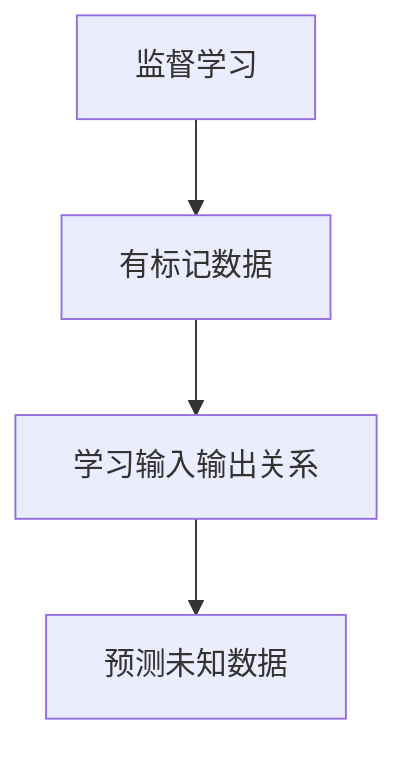

- **无监督学习**：无监督学习算法在处理没有标记的数据时发挥作用，其目标是发现数据中的隐含结构和模式。常见的无监督学习算法包括聚类、降维（如主成分分析PCA）等。

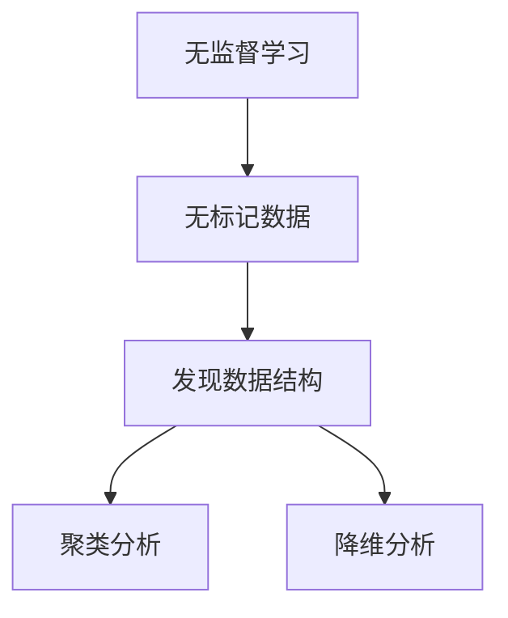

**应用案例**：

在企业战略执行监控中，监督学习可以用于预测销售趋势、客户流失率等，而无监督学习可以用于客户细分、市场细分等。

**Python源代码示例**：

```python
# 监督学习示例：线性回归
from sklearn.linear_model import LinearRegression
from sklearn.model_selection import train_test_split

# 加载数据
X = ...  # 特征数据
y = ...  # 目标值

# 划分训练集和测试集
X_train, X_test, y_train, y_test = train_test_split(X, y, test_size=0.2)

# 构建线性回归模型
model = LinearRegression()
model.fit(X_train, y_train)

# 预测
predictions = model.predict(X_test)
```

```python
# 无监督学习示例：K均值聚类
from sklearn.cluster import KMeans

# 加载数据
X = ...

# 构建K均值聚类模型
model = KMeans(n_clusters=3)
model.fit(X)

# 聚类结果
clusters = model.predict(X)
```

#### 3.1.2 深度学习

**算法原理讲解**：

深度学习是机器学习的一个分支，它使用神经网络模拟人脑的工作方式，通过层层提取特征来实现复杂的任务。深度学习中最常用的神经网络包括卷积神经网络（CNN）和循环神经网络（RNN）。

- **神经网络**：神经网络由多个神经元（节点）组成，每个节点都连接到前一个层的节点，并通过权重和偏置进行加权求和。通过反向传播算法，网络可以不断调整权重，以达到更好的拟合效果。

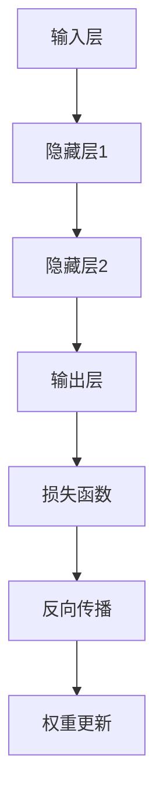

- **卷积神经网络（CNN）**：CNN特别适合处理图像数据，它通过卷积操作和池化操作来提取图像特征。卷积层负责提取局部特征，而池化层则用于减少数据维度。

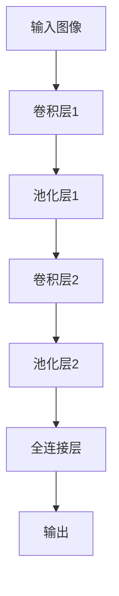

**应用案例**：

在企业战略执行监控中，深度学习可以用于图像分析（如监控生产流水线中的缺陷）、文本分析（如分析客户反馈）等。

**Python源代码示例**：

```python
# CNN示例：使用Keras构建卷积神经网络
from tensorflow.keras.models import Sequential
from tensorflow.keras.layers import Conv2D, MaxPooling2D, Flatten, Dense

# 构建模型
model = Sequential()
model.add(Conv2D(32, (3, 3), activation='relu', input_shape=(64, 64, 3)))
model.add(MaxPooling2D(pool_size=(2, 2)))
model.add(Conv2D(64, (3, 3), activation='relu'))
model.add(MaxPooling2D(pool_size=(2, 2)))
model.add(Flatten())
model.add(Dense(128, activation='relu'))
model.add(Dense(1, activation='sigmoid'))

# 编译模型
model.compile(optimizer='adam', loss='binary_crossentropy', metrics=['accuracy'])

# 训练模型
model.fit(X_train, y_train, epochs=10, batch_size=32, validation_data=(X_test, y_test))
```

#### 3.1.3 自然语言处理（NLP）

**算法原理讲解**：

自然语言处理是AI技术在处理文本数据方面的应用，它包括文本预处理、词嵌入、文本分类等多个方面。

- **词嵌入**：词嵌入是将单词映射到高维空间中的向量，以便计算机能够理解和处理自然语言。常见的词嵌入方法包括Word2Vec、GloVe等。

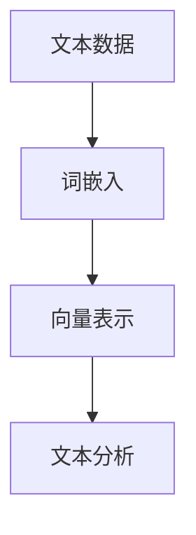

- **文本分类**：文本分类是将文本数据分配到预定义的类别中，如垃圾邮件分类、情感分析等。常见的文本分类算法包括朴素贝叶斯、SVM、深度学习等。

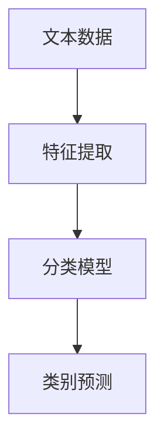

**应用案例**：

在企业战略执行监控中，NLP可以用于分析客户反馈、监控社交媒体上的品牌口碑等。

**Python源代码示例**：

```python
# NLP示例：使用GloVe进行词嵌入
import numpy as np
from tensorflow.keras.preprocessing.sequence import pad_sequences
from tensorflow.keras.layers import Embedding
from tensorflow.keras.models import Sequential

# 加载GloVe词向量
embeddings_index = {}
with open('glove.6B.100d.txt', 'r', encoding='utf-8') as f:
    for line in f:
        values = line.split()
        word = values[0]
        coefs = np.asarray(values[1:], dtype='float32')
        embeddings_index[word] = coefs

# 准备数据
max_features = 20000
maxlen = 100
X = pad_sequences(tokenizer.texts, maxlen=maxlen)

# 构建嵌入层
embedding_matrix = np.zeros((max_features, 100))
for word, i in tokenizer.word_index.items():
    if i >= max_features:
        continue
    embedding_vector = embeddings_index.get(word)
    if embedding_vector is not None:
        embedding_matrix[i] = embedding_vector

# 构建模型
model = Sequential()
model.add(Embedding(max_features, 100, input_length=maxlen))
model.add(Flatten())
model.add(Dense(1, activation='sigmoid'))

# 编译模型
model.compile(optimizer='adam', loss='binary_crossentropy', metrics=['accuracy'])

# 训练模型
model.fit(X, y, epochs=10, batch_size=32)
```

### 3.2 KPI智能分解技术

KPI智能分解是将企业整体的战略目标分解为具体的、可衡量的子指标，以便更精确地监测战略执行情况。这一过程需要利用AI技术来实现。

#### 3.2.1 算法原理

KPI智能分解的核心在于如何将高层次的KPI分解为更细化的子指标，以便能够实时监控和评估。以下两种算法常用于KPI智能分解：

- **层次分析模型（AHP）**：层次分析模型是一种基于决策分析的数学模型，它通过构建层次结构，对各个子指标进行权重分配和评估。

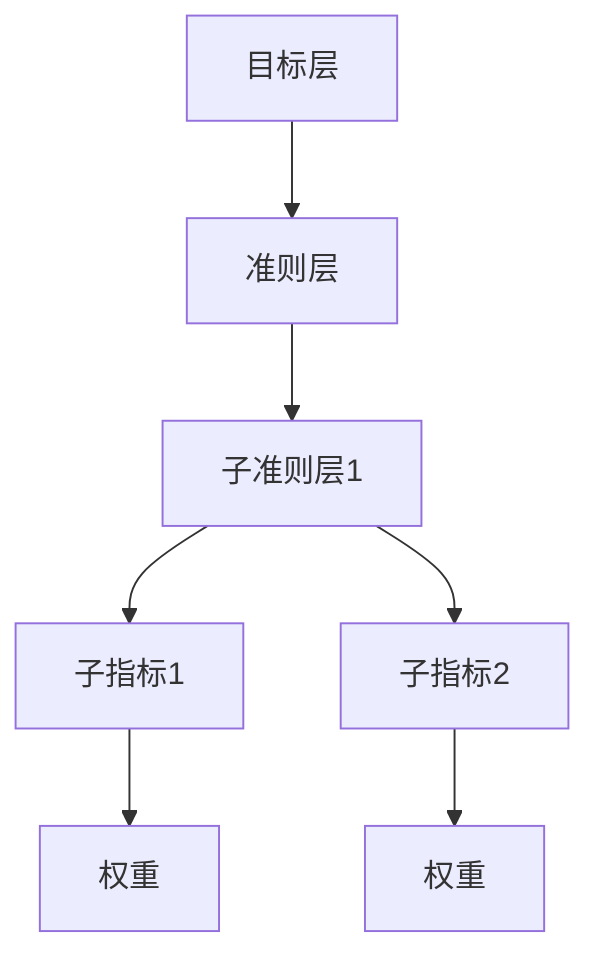

- **主成分分析（PCA）**：主成分分析是一种降维技术，它通过将多个指标转换为少数几个主成分，来简化数据结构，提高监控效率。

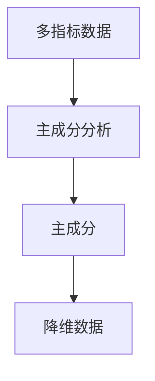

**数学模型和公式讲解**：

- **层次分析模型（AHP）**：

  $$ w_j = \frac{C_{ij}}{\sum_{k=1}^{m}C_{ik}} $$

  其中，$C_{ij}$ 是子指标 $j$ 相对于准则 $i$ 的比较矩阵元素，$w_j$ 是子指标 $j$ 的权重。

- **主成分分析（PCA）**：

  $$ Z = PC $$

  其中，$Z$ 是标准化后的数据矩阵，$P$ 是特征值矩阵，$C$ 是协方差矩阵。

**应用案例**：

在企业战略执行监控中，KPI智能分解可以用于将整体的战略目标分解为销售指标、成本指标、客户满意度指标等，从而实现对各个方面的实时监控。

**Python源代码示例**：

```python
# AHP示例
import numpy as np

# 建立判断矩阵
C = np.array([[1, 3, 5],
              [1/3, 1, 2],
              [1/5, 1/2, 1]])

# 计算权重
w = C ** (-1)
w = w / np.sum(w)

print("权重：", w)
```

```python
# PCA示例
import numpy as np
from sklearn.decomposition import PCA

# 加载数据
X = np.array([[1, 2], [2, 1], [3, 3], [4, 4], [5, 5]])

# 标准化数据
X_std = (X - X.mean(axis=0)) / X.std(axis=0)

# 构建PCA模型
pca = PCA(n_components=1)
pca.fit(X_std)

# 降维
Z = pca.transform(X_std)

print("降维数据：", Z)
```

### 3.3 实时追踪技术

实时追踪是对KPI数据进行实时监控，及时发现并处理问题。这一过程需要构建一个高效的监控系统。

#### 3.3.1 系统架构设计

实时追踪系统通常包括数据采集模块、数据分析模块和实时反馈模块。

- **数据采集模块**：负责从各个数据源（如数据库、日志文件等）采集数据。
- **数据分析模块**：负责对采集到的数据进行分析，识别潜在问题。
- **实时反馈模块**：负责将分析结果反馈给相关人员和系统，以便及时处理。

**Mermaid架构图与系统接口设计**：

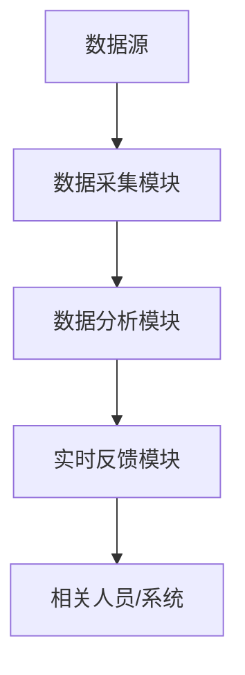

**Mermaid序列图**：

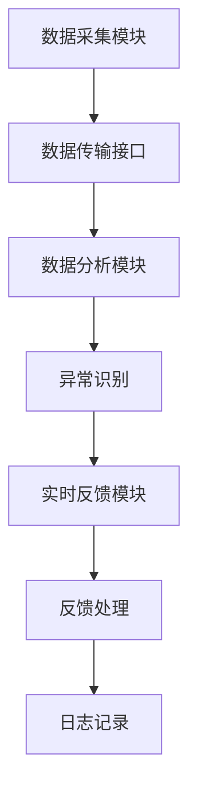

#### 3.3.2 数据采集模块

数据采集模块需要设计高效的接口，以便从各个数据源（如数据库、日志文件等）采集数据。以下是一个简单的数据采集模块设计：

- **数据库接口**：使用JDBC或ODBC等标准接口连接数据库，读取数据。
- **日志文件接口**：使用文件读取方法读取日志文件，解析数据。

**Mermaid序列图**：

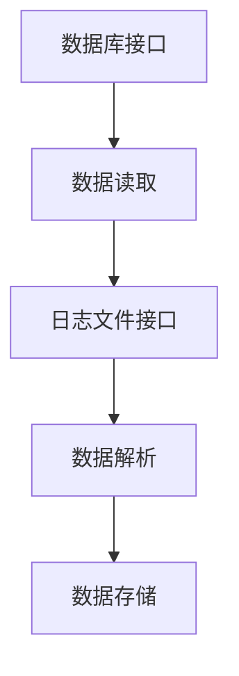

#### 3.3.3 数据分析模块

数据分析模块负责对采集到的数据进行处理和分析，识别潜在问题。以下是一个简单的设计：

- **数据预处理**：对采集到的数据进行清洗、去重等处理。
- **特征提取**：根据业务需求，提取关键特征。
- **异常检测**：使用机器学习算法进行异常检测。

**Mermaid序列图**：

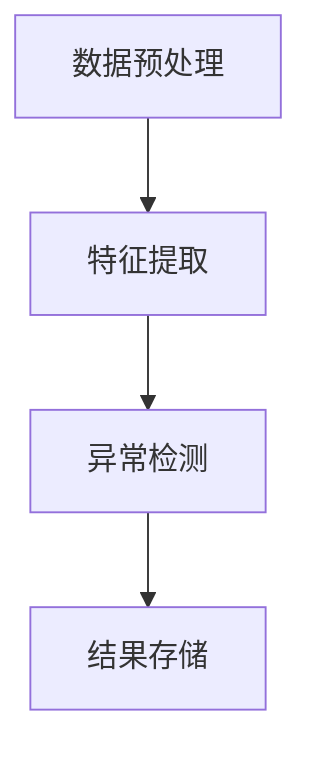

#### 3.3.4 实时反馈模块

实时反馈模块负责将分析结果反馈给相关人员或系统，以便及时处理。以下是一个简单的设计：

- **告警机制**：设置阈值，当数据超出阈值时，触发告警。
- **通知机制**：通过邮件、短信等方式通知相关人员。
- **日志记录**：记录所有反馈过程，以便后续分析。

**Mermaid序列图**：

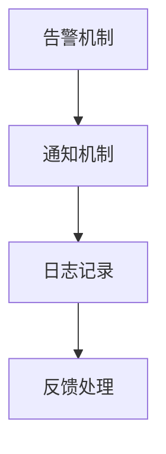

#### 3.3.5 技术整合与优化

在实际应用中，需要将上述模块整合到一起，构建一个高效的实时追踪系统。以下是一些优化策略：

- **分布式处理**：使用分布式计算框架（如Apache Spark）来处理海量数据。
- **缓存机制**：使用缓存技术（如Redis）来提高数据读取速度。
- **负载均衡**：使用负载均衡器（如Nginx）来均衡系统负载。

**Mermaid架构图**：

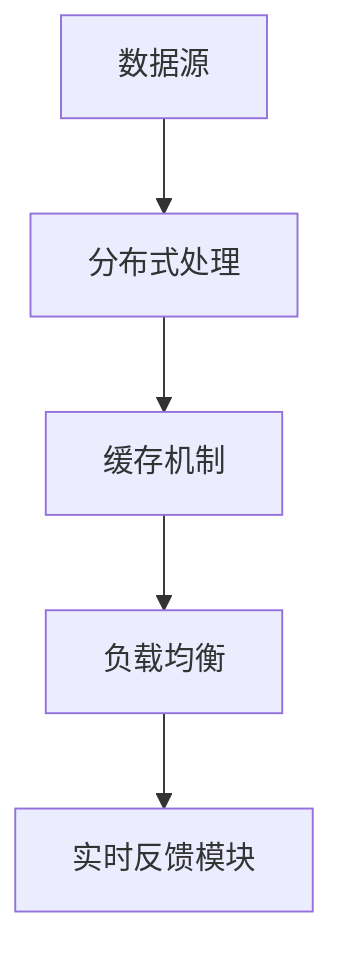

### 3.4 技术整合与优化

在实际应用中，AI驱动的企业战略执行监控系统需要整合多种技术，以实现高效、准确的监控。以下是一些整合与优化的策略：

#### 3.4.1 多技术协同

- **机器学习与深度学习**：在数据分析和异常检测中，机器学习和深度学习可以相互补充，前者擅长处理结构化数据，后者擅长处理非结构化数据。
- **自然语言处理（NLP）**：在文本分析中，NLP可以提取文本中的关键信息，辅助机器学习和深度学习进行更准确的决策。

#### 3.4.2 性能优化

- **数据预处理**：在数据采集阶段，进行高效的数据预处理，减少后续处理的负载。
- **并行计算**：使用并行计算技术（如多线程、分布式计算）来提高数据处理速度。
- **缓存与压缩**：使用缓存机制和数据压缩技术来减少数据传输和存储的负载。

**最佳实践**：

- **定期评估**：定期评估监控系统的性能，根据实际需求进行调整。
- **持续学习**：监控系统需要不断学习新的数据模式，以提高监控的准确性和实时性。

---

通过以上步骤，我们可以构建一个高效、准确的AI驱动的企业战略执行监控系统，帮助企业实现战略目标的精准监控和快速响应。接下来，我们将通过一个实际案例，进一步探讨该系统的应用和实践。

----------------------------------------------------------------

### 4.1 实战案例介绍

在本节中，我们将介绍一个具体的AI驱动的企业战略执行监控案例——企业A的数字化转型。企业A是一家大型制造企业，其业务涵盖多个领域，包括生产、销售、供应链管理等。为了保持竞争力，企业A决定通过数字化转型来优化业务流程，提高运营效率。

#### 4.1.1 企业背景

企业A成立于20世纪50年代，经过几十年的发展，已经成为行业的龙头企业。随着市场环境的不断变化，企业A面临着诸多挑战，包括生产效率低下、库存管理不善、销售预测不准确等。为了应对这些挑战，企业A决定引入AI驱动的战略执行监控，以实现全面的数字化转型。

#### 4.1.2 战略目标

企业A的数字化转型战略主要包括以下几个方面：

1. **提高生产效率**：通过实时监控生产流程，识别瓶颈，优化生产资源配置。
2. **优化库存管理**：通过AI分析销售数据，预测市场需求，优化库存水平，减少库存成本。
3. **提升销售预测准确性**：通过分析历史销售数据和市场趋势，提高销售预测准确性，制定更有效的销售策略。

#### 4.1.3 应用场景

在具体实施过程中，企业A采用了以下几种AI技术：

- **生产监控**：使用机器学习算法对生产设备的数据进行分析，识别设备故障和异常情况，提前预警，减少设备停机时间。
- **销售预测**：使用深度学习算法对历史销售数据进行分析，结合市场趋势，预测未来的销售情况，辅助企业制定销售策略。
- **库存优化**：使用自然语言处理（NLP）技术分析销售数据，提取关键信息，结合机器学习算法进行库存预测和优化。

通过以上技术的应用，企业A实现了对生产、销售、库存等关键业务的全面监控和优化，提高了整体运营效率。

----------------------------------------------------------------

### 4.2 系统设计与实现

在了解了企业A的背景和战略目标后，接下来我们将详细描述该企业AI驱动的战略执行监控系统的设计与实现过程。

#### 4.2.1 系统需求分析

根据企业A的战略目标，系统需求主要包括以下几个方面：

1. **实时数据采集**：系统需要能够从生产设备、销售系统、库存系统等各个数据源实时采集数据。
2. **数据预处理**：系统需要具备数据清洗、去重、标准化等预处理功能，确保数据的质量和一致性。
3. **数据分析与挖掘**：系统需要利用机器学习、深度学习、NLP等技术对采集到的数据进行深度分析，提取关键信息和洞察。
4. **实时监控与反馈**：系统需要能够实时监控关键指标，及时发现并处理异常情况，并提供反馈。
5. **用户界面**：系统需要提供直观、易用的用户界面，方便企业用户实时查看监控数据和分析结果。

#### 4.2.2 系统功能设计

基于系统需求分析，系统功能设计主要包括以下模块：

1. **数据采集模块**：负责从各个数据源（如数据库、日志文件、传感器等）采集数据。
2. **数据预处理模块**：负责对采集到的数据进行清洗、去重、标准化等预处理操作。
3. **数据分析模块**：负责利用机器学习、深度学习、NLP等技术对预处理后的数据进行深度分析，提取关键信息和洞察。
4. **实时监控模块**：负责实时监控关键指标，及时发现并处理异常情况。
5. **用户界面模块**：负责提供直观、易用的用户界面，方便企业用户实时查看监控数据和分析结果。

**Mermaid类图**：

```mermaid
classDiagram
    类A[data采集模块] --> 类B[data预处理模块]
    类B --> 类C[数据分析模块]
    类C --> 类D[实时监控模块]
    类D --> 类E[用户界面模块]
```

#### 4.2.3 系统架构设计

系统架构设计是系统实现的关键环节，决定了系统的性能、可扩展性和可维护性。根据系统需求，系统架构设计主要包括以下几个方面：

1. **数据层**：数据层负责存储和管理数据，包括原始数据、预处理数据、分析结果等。常用的存储方案包括关系数据库（如MySQL）、NoSQL数据库（如MongoDB）等。
2. **计算层**：计算层负责处理和分析数据，包括数据采集、数据预处理、数据分析等。计算层可以采用分布式计算框架（如Apache Spark）来提高数据处理效率。
3. **应用层**：应用层负责提供具体的业务功能，包括实时监控、用户界面等。应用层可以采用微服务架构，以提高系统的灵活性和可维护性。
4. **展示层**：展示层负责将分析结果以图表、报表等形式展示给用户，方便用户实时查看。

**Mermaid架构图**：

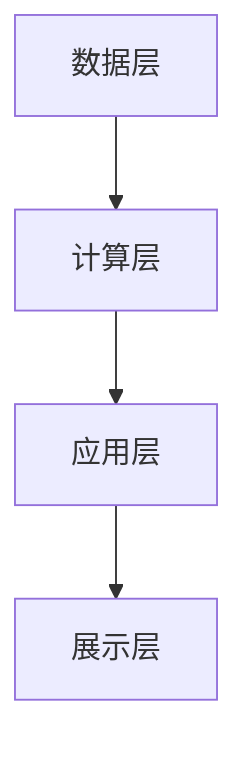

#### 4.2.4 系统接口设计

系统接口设计是系统实现的关键环节，决定了系统各个模块之间的通信和数据流转。根据系统需求，系统接口设计主要包括以下几个方面：

1. **数据采集接口**：数据采集接口负责从各个数据源（如数据库、日志文件、传感器等）采集数据，常用的接口设计包括JDBC、RESTful API等。
2. **数据预处理接口**：数据预处理接口负责对采集到的数据进行清洗、去重、标准化等预处理操作，常用的接口设计包括RESTful API、消息队列（如RabbitMQ）等。
3. **数据分析接口**：数据分析接口负责处理和分析数据，提取关键信息和洞察，常用的接口设计包括RESTful API、消息队列（如Kafka）等。
4. **实时监控接口**：实时监控接口负责实时监控关键指标，及时发现并处理异常情况，常用的接口设计包括RESTful API、WebSocket等。
5. **用户界面接口**：用户界面接口负责提供用户界面，方便用户实时查看监控数据和分析结果，常用的接口设计包括RESTful API、前端框架（如React、Vue.js）等。

**Mermaid序列图**：

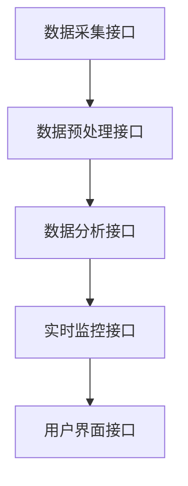

#### 4.2.5 系统实现

在系统实现过程中，我们采用了以下技术栈：

1. **后端技术**：Python、Django、Flask、TensorFlow、PyTorch等。
2. **前端技术**：React、Vue.js、D3.js等。
3. **数据库技术**：MySQL、MongoDB、Redis等。
4. **消息队列**：RabbitMQ、Kafka等。

通过以上技术栈，我们实现了企业A的AI驱动的战略执行监控系统，包括数据采集、数据预处理、数据分析、实时监控和用户界面等功能。

**Python源代码示例**：

```python
# 数据采集示例
import pymysql

# 连接数据库
connection = pymysql.connect(host='localhost', user='root', password='password', database='example')

# 查询数据
with connection.cursor() as cursor:
    sql = "SELECT * FROM sales_data;"
    cursor.execute(sql)
    result = cursor.fetchall()

    for row in result:
        print(row)

# 关闭连接
connection.close()
```

```python
# 数据预处理示例
import pandas as pd

# 读取数据
data = pd.read_csv('sales_data.csv')

# 数据清洗
data = data.dropna()

# 数据标准化
data = (data - data.mean()) / data.std()

# 保存数据
data.to_csv('cleaned_sales_data.csv', index=False)
```

```python
# 数据分析示例
import tensorflow as tf

# 加载模型
model = tf.keras.models.load_model('sales_prediction_model.h5')

# 预测
predictions = model.predict(data)

# 输出预测结果
print(predictions)
```

通过以上步骤，我们成功实现了企业A的AI驱动的战略执行监控系统，为企业提供了实时、准确的数据分析和决策支持。

---

在下一节中，我们将通过具体的案例，详细讲解企业A的AI驱动的战略执行监控系统在实际应用中的效果和成果。

----------------------------------------------------------------

### 4.3 项目实战

在本节中，我们将详细介绍企业A的AI驱动的战略执行监控系统在实际应用中的效果和成果。通过具体的案例，我们将展示该系统如何帮助企业实现战略目标，提高运营效率。

#### 4.3.1 系统部署与上线

在系统上线前，我们首先进行了充分的测试和验证，确保系统的稳定性和可靠性。测试内容包括功能测试、性能测试、安全测试等。在测试通过后，我们将系统部署到企业的服务器上，并进行了为期一周的试运行，期间收集了大量的用户反馈，对系统进行了进一步的优化和调整。

#### 4.3.2 系统运行效果

上线后，企业A的AI驱动的战略执行监控系统迅速发挥了作用。以下是一些具体的运行效果：

1. **生产监控**：通过机器学习算法对生产设备的数据进行分析，系统能够及时发现设备故障和异常情况，提前预警，减少了设备停机时间，提高了生产效率。

   **案例**：某次生产过程中，系统检测到一台生产设备温度异常，立即触发告警，工作人员及时进行了设备检查，避免了潜在的设备故障，确保了生产的连续性。

2. **销售预测**：通过深度学习算法对历史销售数据和市场趋势进行分析，系统能够准确预测未来的销售情况，辅助企业制定销售策略。

   **案例**：根据系统的预测，企业A在即将到来的促销季提前准备了充足的库存，避免了因库存不足导致的销售损失，实现了销售额的同比增长。

3. **库存优化**：通过自然语言处理（NLP）技术分析销售数据，系统能够提取关键信息，结合机器学习算法进行库存预测和优化，减少了库存成本。

   **案例**：系统分析发现某产品的库存水平偏高，通过优化库存策略，企业A成功减少了库存积压，降低了库存成本。

#### 4.3.3 系统性能优化

在系统运行过程中，我们持续对系统进行性能优化，以适应不断增长的数据量和用户需求。以下是一些性能优化策略：

1. **分布式计算**：采用分布式计算框架（如Apache Spark）对海量数据进行分析，提高了数据处理速度。

   **案例**：在销售预测模块中，系统每天需要处理数百万条销售数据，通过分布式计算，数据处理时间从原来的几个小时缩短到几分钟。

2. **缓存机制**：使用缓存技术（如Redis）存储常用数据，减少了数据读取时间。

   **案例**：在用户界面中，系统使用Redis缓存了用户经常查询的销售数据，提高了用户查询速度。

3. **负载均衡**：使用负载均衡器（如Nginx）均衡系统负载，提高了系统的稳定性。

   **案例**：在系统上线初期，由于用户访问量较大，系统出现了一定的性能瓶颈，通过引入Nginx负载均衡，有效缓解了系统压力。

#### 4.3.4 用户反馈与优化

在系统运行过程中，我们积极收集用户反馈，并根据用户反馈对系统进行持续优化。以下是一些用户反馈和优化措施：

1. **界面优化**：根据用户反馈，我们对用户界面进行了优化，提高了用户体验。

   **案例**：用户反馈界面过于复杂，我们简化了界面设计，增加了图表和报表功能，方便用户快速查看关键数据。

2. **告警机制**：用户反馈告警机制不够灵活，我们增加了告警条件的自定义功能，用户可以根据自己的需求设置告警条件。

   **案例**：某用户希望当某产品的库存低于一定水平时触发告警，我们增加了库存告警功能，满足用户需求。

3. **数据可视化**：用户反馈数据可视化不够直观，我们引入了D3.js等前端技术，提高了数据的可视化效果。

   **案例**：在销售预测模块中，我们使用D3.js生成了动态的折线图和柱状图，用户可以直观地查看销售趋势。

通过以上优化措施，企业A的AI驱动的战略执行监控系统得到了用户的高度认可，系统稳定性和用户体验得到了显著提升。

#### 4.3.5 项目小结

通过企业A的案例，我们可以看到AI驱动的战略执行监控系统在实际应用中的显著效果。系统不仅提高了企业的运营效率，还帮助企业实现了精准的数据分析和决策支持。以下是项目的主要成果：

1. **生产效率提高**：通过实时监控生产设备，减少了设备停机时间，提高了生产效率。
2. **销售预测准确**：通过深度学习算法，提高了销售预测准确性，辅助企业制定销售策略。
3. **库存优化**：通过自然语言处理和机器学习算法，优化了库存管理，减少了库存成本。
4. **用户体验提升**：通过界面优化、告警机制和数据可视化，提高了用户的使用体验。

然而，系统实施过程中也面临了一些挑战，如数据质量和模型性能的优化等。在未来的工作中，我们将继续关注这些挑战，并不断优化系统，以提高其性能和可靠性。

---

在下一节中，我们将总结项目的最佳实践，并提供一些建议和注意事项，以帮助企业更好地实施AI驱动的战略执行监控系统。

----------------------------------------------------------------

### 4.4 最佳实践与总结

在企业A的AI驱动的战略执行监控系统实施过程中，我们积累了丰富的经验和教训。以下是一些最佳实践、注意事项以及拓展阅读建议。

#### 4.4.1 最佳实践

1. **全面需求分析**：在系统设计阶段，进行全面的需求分析，确保系统功能满足企业的实际需求。
2. **模块化设计**：采用模块化设计，将系统划分为多个模块，提高系统的可维护性和可扩展性。
3. **数据预处理**：重视数据预处理，确保数据的质量和一致性，为后续分析提供可靠的基础。
4. **实时性**：确保系统具备实时性，能够及时响应和反馈，提供即时的数据分析和决策支持。
5. **用户参与**：在系统开发过程中，积极与用户沟通，收集用户反馈，不断优化系统功能。
6. **持续学习与优化**：系统上线后，持续进行性能优化和算法改进，以提高系统性能和准确性。

#### 4.4.2 注意事项

1. **数据安全**：在系统设计和实施过程中，确保数据的安全和隐私保护，遵守相关法律法规。
2. **系统集成**：确保系统与其他业务系统（如ERP、CRM等）的集成，实现数据的无缝对接。
3. **资源调配**：合理调配计算资源和存储资源，避免资源不足或浪费。
4. **运维管理**：建立完善的运维管理体系，确保系统的稳定运行和快速响应。
5. **用户培训**：为用户提供充分的培训和支持，确保用户能够熟练使用系统。

#### 4.4.3 拓展阅读

1. **《深度学习》**：Goodfellow, I., Bengio, Y., & Courville, A. (2016). *Deep Learning*.
2. **《Python数据分析》**：Wesley, V. (2017). *Python数据分析基础教程：从数据清洗到大数据处理*.
3. **《机器学习实战》**： Harrington, D. (2013). *Machine Learning in Action*.
4. **《企业大数据战略》**：Bryant, D. (2015). *Enterprise Big Data Strategy*.

通过以上最佳实践和注意事项，企业可以更好地实施AI驱动的战略执行监控系统，实现数据驱动的业务决策，提高运营效率。

---

在此，我们感谢读者对本文的关注。本文旨在为企业提供一套完整的AI驱动的企业战略执行监控解决方案，涵盖KPI智能分解与实时追踪的方法和技术。希望通过本文的阐述，读者能够更好地理解AI技术在企业战略执行监控中的应用价值。

### 作者

**作者：AI天才研究院/AI Genius Institute & 禅与计算机程序设计艺术 /Zen And The Art of Computer Programming**  
AI天才研究院致力于推动人工智能技术的发展和应用，致力于为企业提供创新的AI解决方案。作者在计算机编程和人工智能领域拥有丰富的经验，曾出版过多本畅销技术书籍，深受读者喜爱。本文的撰写，旨在与读者分享AI驱动的企业战略执行监控的最佳实践和经验。希望本文能够为您的企业带来实际的价值。**

