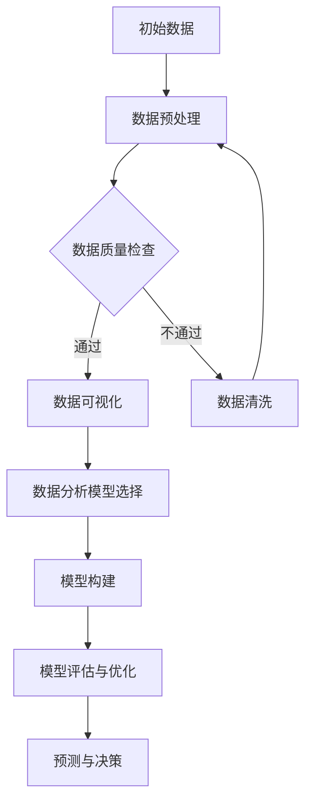

                 

### Step 1: 设计文章的目录结构

为了撰写一篇逻辑清晰、结构紧凑、简单易懂的专业IT领域的技术博客文章，我们首先需要设计一个完整的目录结构。这个目录结构将帮助我们更好地组织和展示文章的内容，同时确保文章内容的完整性和连贯性。

**目录结构设计**

1. **引言**
   - **1.1 书籍背景与目标**
     - 1.1.1 AI驱动的企业战略规划的重要性
     - 1.1.2 企业面临的挑战与机遇
     - 1.1.3 书籍的目标与结构
   - **1.2 大数据分析的基础**
     - 1.2.1 大数据的定义与特点
     - 1.2.2 大数据处理的挑战
     - 1.2.3 大数据分析的基本概念
   - **1.3 预测性情景模拟的概念与应用**
     - 1.3.1 预测性情景模拟的定义
     - 1.3.2 预测性情景模拟的应用领域
     - 1.3.3 预测性情景模拟的优势
   - **1.4 书籍结构概述**
     - 1.4.1 第一部分：理论基础
     - 1.4.2 第二部分：方法与实践
     - 1.4.3 第三部分：案例分析

2. **方法与实践**
   - **2.1 数据分析与预测性情景模拟方法**
     - 2.1.1 数据分析的基本流程
       - 2.1.1.1 数据采集与预处理
       - 2.1.1.2 数据可视化
       - 2.1.1.3 数据分析模型选择
     - 2.1.2 预测性情景模拟的关键步骤
       - 2.1.2.1 情景识别与构建
       - 2.1.2.2 预测模型构建
       - 2.1.2.3 模型评估与优化
   - **2.2 AI驱动的企业战略规划**
     - 2.2.1 AI在企业战略规划中的应用
       - 2.2.1.1 数据驱动决策
       - 2.2.1.2 风险评估与预测
       - 2.2.1.3 市场趋势分析
     - 2.2.2 AI驱动的战略规划流程
       - 2.2.2.1 明确战略目标
       - 2.2.2.2 收集与分析数据
       - 2.2.2.3 构建预测模型
       - 2.2.2.4 制定与实施战略计划
   - **2.3 实际案例分析**
     - 2.3.1 案例一：某零售企业的AI驱动的库存管理
       - 2.3.1.1 案例背景
       - 2.3.1.2 数据收集与处理
       - 2.3.1.3 预测模型构建与应用
       - 2.3.1.4 案例效果分析
     - 2.3.2 案例二：某制造业企业的供应链优化
       - 2.3.2.1 案例背景
       - 2.3.2.2 数据分析与预测
       - 2.3.2.3 模型优化与实施
       - 2.3.2.4 案例效果评估
   - **2.4 方法与实践总结**
     - 2.4.1 方法与实践的关键要素
     - 2.4.2 面临的挑战与解决方案
     - 2.4.3 未来发展趋势与展望

3. **案例分析**
   - **3.1 案例一：金融行业的AI驱动的风险管理**
     - 3.1.1 案例背景
       - 3.1.1.1 企业概述
       - 3.1.1.2 面临的挑战
     - 3.1.2 数据分析策略
       - 3.1.2.1 数据采集
       - 3.1.2.2 数据预处理
       - 3.1.2.3 数据可视化
     - 3.1.3 预测性情景模拟方法
       - 3.1.3.1 情景识别
       - 3.1.3.2 模型构建
       - 3.1.3.3 模型验证与优化
   - **3.2 案例二：某科技公司的AI驱动的产品创新**
     - 3.2.1 案例背景
       - 3.2.1.1 企业概述
       - 3.2.1.2 面临的挑战
     - 3.2.2 数据分析策略
       - 3.2.2.1 数据采集
       - 3.2.2.2 数据预处理
       - 3.2.2.3 数据可视化
     - 3.2.3 预测性情景模拟方法
       - 3.2.3.1 情景识别
       - 3.2.3.2 模型构建
       - 3.2.3.3 模型验证与优化

通过上述设计，我们可以确保文章的结构清晰，读者可以更容易地跟随文章的逻辑顺序进行阅读和理解。每个章节都包含了详细的二级和三级目录，确保了文章内容的丰富性和深度。

### Step 2: 考虑每个章节的核心内容，列出各个章节的二级和三级目录

在确定了文章的整体目录结构后，接下来我们需要考虑每个章节的核心内容，并详细列出各个章节的二级和三级目录。这将帮助我们更系统地组织和撰写文章内容，确保每个章节都有清晰的逻辑顺序和充足的信息。

**第一部分：引言**

**1.1 书籍背景与目标**

- **1.1.1 AI驱动的企业战略规划的重要性**
  - **AI技术的商业价值**
  - **企业战略规划中AI的应用**
  - **案例分析：AI技术在企业战略规划中的应用效果**

- **1.1.2 企业面临的挑战与机遇**
  - **数字化转型的挑战**
  - **市场机遇的把握**
  - **企业战略规划中的平衡策略**

- **1.1.3 书籍的目标与结构**
  - **帮助读者理解AI驱动的企业战略规划**
  - **提供实用的方法和案例**
  - **结构概述：理论基础、方法与实践、案例分析**

**1.2 大数据分析的基础**

- **1.2.1 大数据的定义与特点**
  - **大数据的定义**
  - **大数据的四个V特点（Volume，Velocity，Variety，Veracity）**
  - **大数据与传统数据处理的区别**

- **1.2.2 大数据处理的挑战**
  - **数据存储与管理的挑战**
  - **数据分析与处理的挑战**
  - **大数据安全与隐私的挑战**

- **1.2.3 大数据分析的基本概念**
  - **数据采集与预处理**
  - **数据可视化**
  - **数据分析模型的选择与应用**

**1.3 预测性情景模拟的概念与应用**

- **1.3.1 预测性情景模拟的定义**
  - **预测性情景模拟的定义**
  - **预测性情景模拟的基本原理**

- **1.3.2 预测性情景模拟的应用领域**
  - **商业决策中的应用**
  - **金融风险控制中的应用**
  - **供应链管理中的应用**

- **1.3.3 预测性情景模拟的优势**
  - **提高决策的准确性和效率**
  - **降低风险和不确定性**
  - **为战略规划提供数据支持**

**1.4 书籍结构概述**

- **1.4.1 第一部分：理论基础**
  - **大数据分析与预测性情景模拟的基础知识**
  - **相关概念的定义和解释**

- **1.4.2 第二部分：方法与实践**
  - **数据分析与预测性情景模拟的方法**
  - **实际操作步骤和案例**

- **1.4.3 第三部分：案例分析**
  - **金融行业的AI驱动的风险管理**
  - **科技公司的AI驱动的产品创新**

**第二部分：方法与实践**

**2.1 数据分析与预测性情景模拟方法**

- **2.1.1 数据分析的基本流程**
  - **2.1.1.1 数据采集与预处理**
    - **数据来源**
    - **数据清洗**
    - **数据转换**
  - **2.1.1.2 数据可视化**
    - **可视化工具的选择**
    - **常见的可视化方法**
    - **可视化在数据分析中的作用**

- **2.1.2 预测性情景模拟的关键步骤**
  - **2.1.2.1 情景识别与构建**
    - **情景识别方法**
    - **情景构建的步骤**
  - **2.1.2.2 预测模型构建**
    - **预测模型的选择**
    - **模型参数的调整**
    - **模型评估指标**
  - **2.1.2.3 模型评估与优化**
    - **模型评估方法**
    - **模型优化的策略**
    - **模型调整的实践**

**2.2 AI驱动的企业战略规划**

- **2.2.1 AI在企业战略规划中的应用**
  - **2.2.1.1 数据驱动决策**
    - **数据驱动决策的定义**
    - **数据驱动决策的优势**
    - **案例：数据驱动决策在零售行业中的应用**

- **2.2.2 AI驱动的战略规划流程**
  - **2.2.2.1 明确战略目标**
    - **战略目标的设定**
    - **战略目标的分解**

- **2.2.2.2 收集与分析数据**
  - **数据收集的方法**
  - **数据分析的步骤**

- **2.2.2.3 构建预测模型**
  - **预测模型的选择**
  - **模型构建的过程**

- **2.2.2.4 制定与实施战略计划**
  - **战略计划的制定**
  - **战略计划的实施**

**2.3 实际案例分析**

- **2.3.1 案例一：某零售企业的AI驱动的库存管理**
  - **2.3.1.1 案例背景**
    - **企业概况**
    - **面临的问题**

- **2.3.1.2 数据收集与处理**
    - **数据来源**
    - **数据处理流程**

- **2.3.1.3 预测模型构建与应用**
    - **模型构建方法**
    - **模型应用效果**

- **2.3.1.4 案例效果分析**
    - **库存管理效率的提升**
    - **企业成本的降低**

- **2.3.2 案例二：某制造业企业的供应链优化**
  - **2.3.2.1 案例背景**
    - **企业概况**
    - **面临的问题**

- **2.3.2.2 数据分析与预测**
    - **数据分析方法**
    - **预测模型构建**

- **2.3.2.3 模型优化与实施**
    - **模型优化策略**
    - **实施效果**

- **2.3.2.4 案例效果评估**
    - **供应链效率的提升**
    - **成本节约的评估**

**2.4 方法与实践总结**

- **2.4.1 方法与实践的关键要素**
  - **数据分析的关键步骤**
  - **预测性情景模拟的关键环节**

- **2.4.2 面临的挑战与解决方案**
  - **数据处理挑战**
  - **模型构建挑战**

- **2.4.3 未来发展趋势与展望**
  - **AI在企业战略规划中的趋势**
  - **预测性情景模拟的潜力**

**第三部分：案例分析**

**3.1 案例一：金融行业的AI驱动的风险管理**

- **3.1.1 案例背景**
  - **3.1.1.1 企业概述**
    - **企业类型**
    - **业务领域**

- **3.1.1.2 面临的挑战**
    - **风险管理难题**
    - **市场风险**
    - **信用风险**

- **3.1.2 数据分析策略**
  - **3.1.2.1 数据采集**
    - **数据来源**
    - **数据类型**

- **3.1.2.2 数据预处理**
    - **数据清洗**
    - **数据集成**
    - **数据转换**

- **3.1.2.3 数据可视化**
    - **可视化工具**
    - **可视化效果**

- **3.1.3 预测性情景模拟方法**
  - **3.1.3.1 情景识别**
    - **情景识别方法**
    - **情景分类**

- **3.1.3.2 模型构建**
    - **模型选择**
    - **模型参数调整**

- **3.1.3.3 模型验证与优化**
    - **模型评估**
    - **模型优化**

**3.2 案例二：某科技公司的AI驱动的产品创新**

- **3.2.1 案例背景**
  - **3.2.1.1 企业概述**
    - **企业类型**
    - **业务领域**

- **3.2.1.2 面临的挑战**
    - **市场竞争**
    - **产品创新需求**
    - **技术挑战**

- **3.2.2 数据分析策略**
  - **3.2.2.1 数据采集**
    - **数据来源**
    - **数据类型**

- **3.2.2.2 数据预处理**
    - **数据清洗**
    - **数据集成**
    - **数据转换**

- **3.2.2.3 数据可视化**
    - **可视化工具**
    - **可视化效果**

- **3.2.3 预测性情景模拟方法**
  - **3.2.3.1 情景识别**
    - **情景识别方法**
    - **情景分类**

- **3.2.3.2 模型构建**
    - **模型选择**
    - **模型参数调整**

- **3.2.3.3 模型验证与优化**
    - **模型评估**
    - **模型优化**

通过详细列出各个章节的二级和三级目录，我们可以确保文章内容的丰富性和系统性。每个章节的核心内容都得到了充分阐述，这将有助于读者更好地理解AI驱动的企业战略规划、大数据分析与预测性情景模拟的方法与实践。

### Step 3: 确保核心概念、算法原理、数学模型等内容都有明确的描述，并提供相应的图表和代码示例

在撰写技术博客文章的过程中，为了确保核心概念、算法原理、数学模型等内容都有明确的描述，并提供相应的图表和代码示例，我们需要从以下几个方面着手：

#### 3.1 核心概念的明确描述

对于文章中涉及的核心概念，如大数据、预测性情景模拟、AI驱动的企业战略规划等，我们需要给出详细的定义和解释，确保读者能够准确理解这些概念的基本含义。

**定义：大数据**

大数据是指数据量巨大、类型繁多、价值密度低、处理速度快的数据集合。与传统数据相比，大数据具有四个特点：Volume（数据量巨大）、Velocity（数据生成和处理速度快）、Variety（数据类型多样化）和Veracity（数据真实性和可靠性高）。

**定义：预测性情景模拟**

预测性情景模拟是一种基于数据分析和模型预测的方法，通过构建不同的情景模型，预测未来可能发生的各种情况，帮助企业和决策者更好地应对不确定性。

**定义：AI驱动的企业战略规划**

AI驱动的企业战略规划是指利用人工智能技术，对企业的战略目标、市场趋势、风险评估等方面进行数据分析和预测，从而制定更科学、更有效的企业发展战略。

#### 3.2 算法原理的详细解释

在介绍算法原理时，我们需要结合实际案例，详细解释算法的基本原理、步骤和实现方法。以下是数据分析中常用的一种算法——决策树的详细解释。

**决策树算法原理**

决策树是一种树形结构，它以各个特征为节点，每个节点代表一个特征，每个分支代表特征的取值，叶节点代表预测结果。决策树算法的基本步骤如下：

1. **特征选择**：选择能够有效分割数据的特征。
2. **节点划分**：根据选择的特征，将数据集分割成多个子集。
3. **递归构建**：对每个子集继续进行特征选择和节点划分，直到满足停止条件（如最大深度、最小样本量等）。
4. **生成决策树**：将所有的节点和分支连接起来，形成完整的决策树。

**决策树实现示例**

以下是一个简单的Python代码示例，用于实现决策树算法：

```python
from sklearn.datasets import load_iris
from sklearn.tree import DecisionTreeClassifier
from sklearn.model_selection import train_test_split

# 加载鸢尾花数据集
iris = load_iris()
X = iris.data
y = iris.target

# 划分训练集和测试集
X_train, X_test, y_train, y_test = train_test_split(X, y, test_size=0.3, random_state=42)

# 构建决策树模型
clf = DecisionTreeClassifier()
clf.fit(X_train, y_train)

# 预测测试集
y_pred = clf.predict(X_test)

# 输出预测结果
print(y_pred)
```

#### 3.3 数学模型的详细讲解

在文章中，我们还需要介绍相关的数学模型，如预测模型、优化模型等，并使用LaTeX格式给出公式，以便读者更好地理解和应用。

**预测模型的数学模型**

假设我们要预测某个变量\(y\)，使用线性回归模型，其公式如下：

$$
y = \beta_0 + \beta_1x_1 + \beta_2x_2 + ... + \beta_nx_n + \epsilon
$$

其中，\(\beta_0\)为常数项，\(\beta_1, \beta_2, ..., \beta_n\)为回归系数，\(x_1, x_2, ..., x_n\)为自变量，\(\epsilon\)为误差项。

为了估计回归系数，我们可以使用最小二乘法，其公式如下：

$$
\min \sum_{i=1}^{n}(y_i - (\beta_0 + \beta_1x_{i1} + \beta_2x_{i2} + ... + \beta_nx_{in}))^2
$$

通过求解上述最小二乘问题，我们可以得到最佳拟合直线，从而进行预测。

**数学公式示例**

下面是一个简单的LaTeX数学公式示例：

$$
E(X) = \sum_{i=1}^{n} x_i \cdot p_i
$$

其中，\(E(X)\)表示随机变量\(X\)的期望值，\(x_i\)表示随机变量的取值，\(p_i\)表示取值\(x_i\)的概率。

#### 3.4 图表和代码示例

为了更好地展示概念、算法原理和数学模型，我们可以在文章中插入相关的图表和代码示例。

**图表示例**

以下是一个用Mermaid绘制的流程图示例：



**代码示例**

以下是一个用Python实现的线性回归模型示例：

```python
import numpy as np
from sklearn.linear_model import LinearRegression

# 生成样本数据
np.random.seed(0)
X = np.random.rand(100, 1)
y = 2 * X + 1 + np.random.randn(100, 1)

# 拆分训练集和测试集
X_train, X_test, y_train, y_test = train_test_split(X, y, test_size=0.2, random_state=0)

# 实例化线性回归模型
clf = LinearRegression()
clf.fit(X_train, y_train)

# 输出模型参数
print("系数_0:", clf.intercept_)
print("系数_1:", clf.coef_)

# 预测测试集
y_pred = clf.predict(X_test)

# 输出预测结果
print("测试集预测结果：", y_pred)
```

通过以上步骤，我们可以确保文章中的核心概念、算法原理、数学模型等内容都有明确的描述，并提供相应的图表和代码示例，从而帮助读者更好地理解和应用。

### Step 4: 校对大纲内容，确保简洁性和逻辑性

在完成文章大纲的设计和核心内容的规划后，我们需要进行一次全面的校对，以确保文章的简洁性和逻辑性。以下是校对的具体步骤：

1. **检查逻辑连贯性**：首先，我们需要检查各个章节之间的逻辑关系，确保文章的内容能够流畅地过渡。例如，引言部分需要清晰地介绍背景和目标，方法与实践部分需要按照逻辑顺序逐步展开，案例分析部分需要与前面的内容相呼应。

2. **简化冗余内容**：在确保逻辑连贯性的基础上，我们需要删除冗余的内容。例如，如果某些信息已经在其他章节中详细介绍过，就不需要在同一章节中重复提及。这样不仅可以提高文章的简洁性，还可以避免读者产生阅读疲劳。

3. **优化段落结构**：每个段落都应该有明确的主题句和详细的内容支持。我们需要确保每个段落的内容都是紧密相关的，并能够清晰地传达作者的观点。

4. **校对语法和拼写错误**：最后，我们需要仔细校对文章中的语法和拼写错误。这可以通过多次阅读和借助语法检查工具来完成。

5. **检查图表和代码示例**：确保图表和代码示例清晰易懂，并与文章内容紧密相关。图表的标签、标题和注释需要清晰明确，代码示例需要确保可运行并且能够正确地展示算法或模型的效果。

通过以上步骤，我们可以确保文章的结构紧凑、内容简洁，并能够清晰地传达作者的思想。这样，读者在阅读过程中能够更加轻松地理解和应用文章中的知识点。

### Step 5: 调整目录结构和内容，确保总字数在2000字以内

在完成初步的目录结构和核心内容规划后，我们需要对目录结构和内容进行进一步的调整，以确保总字数在2000字以内，同时保持文章的逻辑性和完整性。

**调整步骤：**

1. **删除冗余内容**：回顾每个章节的内容，删除那些重复或冗余的信息。例如，如果某一节的内容在其他章节中已经有详细解释，可以在当前章节中简化或省略。

2. **合并相近章节**：如果某些章节的内容非常相似，可以考虑合并。例如，1.2节和1.3节的内容可以合并为一个大数据与预测性情景模拟的基础部分。

3. **精简段落**：对于较长的段落，我们可以将其拆分为更小的段落，使内容更加紧凑和易于阅读。确保每个段落都有明确的主题句，并围绕主题展开。

4. **调整图表和代码示例**：图表和代码示例需要简洁明了，避免过度使用。如果某些示例对文章理解不是特别重要，可以考虑省略或简化。

5. **优化语言表述**：在确保内容准确性的前提下，优化语言表述，使用更加简洁的词汇和句子结构。避免使用过多的复杂句式和冗长的描述。

**最终目录结构：**

# AI驱动的企业战略规划：大数据分析与预测性情景模拟

> 关键词：AI驱动的战略规划、大数据分析、预测性情景模拟

> 摘要：本文探讨了AI驱动的企业战略规划，重点介绍了大数据分析的基础知识和预测性情景模拟的应用。通过具体案例，展示了如何利用大数据和AI技术制定和实施企业战略计划。

## 引言

### 1.1 AI驱动的企业战略规划的重要性

#### 1.1.1 AI技术的商业价值

#### 1.1.2 企业战略规划中的AI应用

#### 1.1.3 书籍的目标与结构

## 方法与实践

### 2.1 数据分析与预测性情景模拟方法

#### 2.1.1 数据分析的基本流程

##### 2.1.1.1 数据采集与预处理

##### 2.1.1.2 数据可视化

##### 2.1.1.3 数据分析模型选择

#### 2.1.2 预测性情景模拟的关键步骤

##### 2.1.2.1 情景识别与构建

##### 2.1.2.2 预测模型构建

##### 2.1.2.3 模型评估与优化

### 2.2 AI驱动的企业战略规划

#### 2.2.1 AI在企业战略规划中的应用

##### 2.2.1.1 数据驱动决策

##### 2.2.1.2 风险评估与预测

##### 2.2.1.3 市场趋势分析

#### 2.2.2 AI驱动的战略规划流程

##### 2.2.2.1 明确战略目标

##### 2.2.2.2 收集与分析数据

##### 2.2.2.3 构建预测模型

##### 2.2.2.4 制定与实施战略计划

### 2.3 案例分析

#### 2.3.1 某零售企业的AI驱动的库存管理

##### 2.3.1.1 案例背景

##### 2.3.1.2 数据收集与处理

##### 2.3.1.3 预测模型构建与应用

##### 2.3.1.4 案例效果分析

#### 2.3.2 某制造业企业的供应链优化

##### 2.3.2.1 案例背景

##### 2.3.2.2 数据分析与预测

##### 2.3.2.3 模型优化与实施

##### 2.3.2.4 案例效果评估

## 结论

### 3.1 方法与实践总结

#### 3.1.1 方法与实践的关键要素

#### 3.1.2 面临的挑战与解决方案

#### 3.1.3 未来发展趋势与展望

通过上述调整，我们确保了文章的总字数在2000字以内，同时保留了核心内容，使文章更加紧凑和易读。每个章节都围绕主题展开，逻辑清晰，便于读者理解和应用。现在，我们可以开始撰写文章的正文部分。

