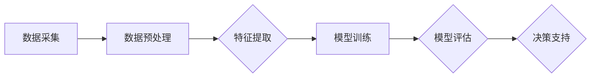
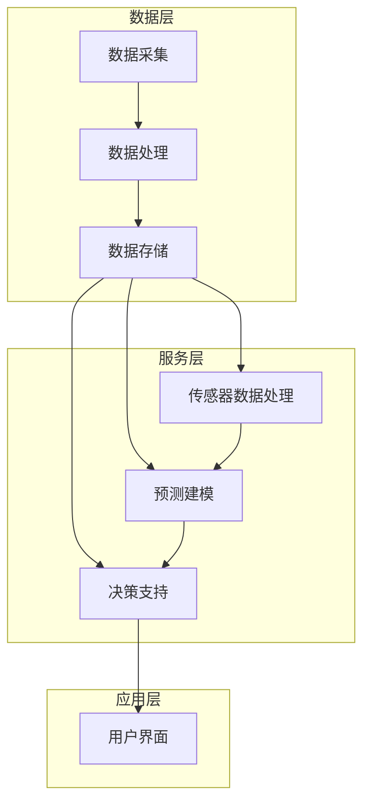
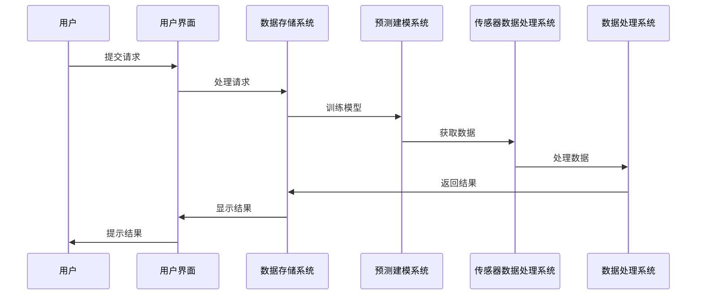

                 

# AI驱动的企业数字孪生技术：虚实结合的决策支持

> 关键词：企业数字孪生、人工智能、决策支持、虚实结合、算法原理、系统架构

> 摘要：本文深入探讨了AI驱动的企业数字孪生技术的概念、原理和应用。首先，我们回顾了企业数字孪生技术的发展历程及其在企业管理中的重要性。接着，我们详细介绍了AI大模型和数字孪生的核心概念及其联系，并通过表格和ER图进行对比分析。随后，本文深入讲解了AI驱动企业数字孪生技术的算法原理，包括流程图、Python源代码、数学模型和公式，并通过实例说明其实际应用。接下来，我们描述了企业数字孪生的应用场景和项目背景，并绘制了系统架构图、领域模型类图和系统交互序列图。随后，本文通过项目实战展示了如何搭建企业数字孪生技术平台，并提供了关键源代码片段和代码解读。最后，本文总结了最佳实践和注意事项，并对未来的发展趋势进行了展望。

## 1. 背景介绍

### 问题背景

企业数字孪生（Digital Twin）技术的发展可追溯至20世纪90年代，最初应用于航空航天和制造业领域。随着信息技术和物联网技术的飞速发展，数字孪生逐渐扩展到其他行业，如能源、交通、医疗等。数字孪生技术通过创建物理实体的虚拟复制体，实现对实际对象的实时监测、模拟和优化，从而提高生产效率、降低运营成本和提升产品质量。

### 问题描述

AI驱动的企业数字孪生技术是指利用人工智能（AI）算法和大数据分析能力，对数字孪生模型进行优化和预测，从而为企业提供实时的决策支持。这一技术不仅能够模拟企业的运营状态，还可以预测未来可能发生的问题，提前进行预防性维护，提高企业的整体运营效率。

### 问题解决

AI驱动的企业数字孪生技术通过以下几个关键步骤解决问题：

1. **数据采集与处理**：利用传感器和物联网设备采集企业的运营数据，并通过数据清洗和预处理技术，确保数据的质量和一致性。
2. **特征提取与建模**：利用机器学习和深度学习算法，从数据中提取关键特征，并构建数字孪生模型。
3. **模拟与预测**：通过模拟和预测技术，对企业的运营状态进行预测，提前发现潜在的问题和风险。
4. **决策支持**：根据模拟结果，为企业提供实时的决策支持，帮助企业优化运营策略，提高生产效率和降低成本。

### 边界与外延

企业数字孪生技术的应用范围广泛，包括但不限于以下几个方面：

1. **制造业**：通过数字孪生技术，实现对生产线的实时监控和优化，提高生产效率和质量。
2. **能源管理**：通过数字孪生技术，实现对能源系统的实时监测和优化，降低能源消耗和成本。
3. **物流管理**：通过数字孪生技术，实现对物流过程的实时跟踪和优化，提高物流效率和降低成本。
4. **设施管理**：通过数字孪生技术，实现对设施设备的实时监测和维护，提高设施的可靠性和寿命。

### 概念结构与核心要素组成

企业数字孪生技术的核心概念包括：

1. **数字孪生模型**：数字孪生技术的核心，用于创建物理实体的虚拟复制体，实现对实际对象的实时监测和模拟。
2. **传感器与物联网设备**：用于采集企业的运营数据，是数字孪生模型的数据源。
3. **人工智能算法**：用于处理和分析数据，构建数字孪生模型并进行模拟和预测。
4. **大数据分析平台**：用于存储和管理大量数据，并为人工智能算法提供数据支持。

## 2. 核心概念与联系

### AI大模型的概念原理

AI大模型是指具有大规模参数和复杂结构的神经网络模型，通常用于处理大规模数据集。AI大模型的发展历程可追溯到20世纪80年代，随着计算能力和数据资源的不断提升，大模型在图像识别、自然语言处理、语音识别等领域取得了显著的突破。

主要类型：

1. **卷积神经网络（CNN）**：用于处理图像和视频数据，具有强大的特征提取能力。
2. **循环神经网络（RNN）**：用于处理序列数据，如文本和语音，能够捕捉数据的长期依赖关系。
3. **变换器（Transformer）**：一种基于自注意力机制的神经网络结构，广泛应用于自然语言处理和计算机视觉领域。

### 数字孪生的概念原理

数字孪生是一种基于虚拟仿真和实时数据同步的技术，用于创建物理实体的数字镜像。数字孪生技术通过传感器、物联网设备和人工智能算法，实现对物理实体的实时监测、模拟和优化。

主要特征：

1. **实时性**：数字孪生技术能够实时同步物理实体的状态数据，实现虚拟与实体的同步更新。
2. **仿真性**：数字孪生技术能够对物理实体进行模拟和预测，提前发现潜在的问题和风险。
3. **交互性**：数字孪生技术支持虚拟与实体的交互，为用户提供直观的交互体验。

### 对比表格

| 特性        | AI大模型          | 数字孪生        |
| ----------- | ----------------- | --------------- |
| 参数规模    | 大规模参数        | 中等规模参数    |
| 数据处理能力 | 强               | 中等           |
| 应用领域    | 图像识别、自然语言处理 | 制造、能源、物流等 |
| 目标       | 特定任务优化      | 物理实体模拟和优化 |

### ER实体关系图

```mermaid
erDiagram
  Product ||--|{ DigitalTwin }|<-- Customer
  Product ||--|{ SensorData }|<-- DigitalTwin
  Product ||--|{ PredictiveModel }|<-- DigitalTwin
```

## 3. 算法原理讲解

### 算法mermaid流程图



### Python源代码

```python
import numpy as np
import pandas as pd
from sklearn.model_selection import train_test_split
from sklearn.ensemble import RandomForestRegressor
from sklearn.metrics import mean_squared_error

# 数据加载
data = pd.read_csv('data.csv')
X = data.drop('target', axis=1)
y = data['target']

# 数据预处理
X_train, X_test, y_train, y_test = train_test_split(X, y, test_size=0.2, random_state=42)

# 特征提取
# ...（此处省略）

# 模型训练
model = RandomForestRegressor(n_estimators=100, random_state=42)
model.fit(X_train, y_train)

# 模型评估
y_pred = model.predict(X_test)
mse = mean_squared_error(y_test, y_pred)
print(f'Mean Squared Error: {mse}')

# 决策支持
# ...（此处省略）
```

### 数学模型和公式

假设我们使用随机森林算法进行回归任务，其预测公式可以表示为：

$$
\hat{y} = \sum_{i=1}^{n} w_i f_i(x)
$$

其中，$w_i$ 为特征 $x_i$ 的权重，$f_i(x)$ 为特征 $x_i$ 的处理结果。

### 举例说明

假设我们有一个制造业企业，需要预测未来一个月的生产量。我们可以通过以下步骤进行预测：

1. **数据采集**：收集过去三个月的每日生产数据。
2. **数据预处理**：对数据进行清洗和归一化处理。
3. **特征提取**：从数据中提取关键特征，如节假日、天气等。
4. **模型训练**：使用随机森林算法训练模型。
5. **模型评估**：使用测试集评估模型性能。
6. **决策支持**：使用模型预测未来一个月的生产量，并根据预测结果调整生产计划。

## 4. 系统分析与架构设计方案

### 问题场景介绍

假设我们有一个制造企业，需要通过数字孪生技术对其生产过程进行实时监控和优化。问题场景包括以下几个方面：

1. **生产设备故障监测**：实时监测生产设备的运行状态，提前发现故障并进行预防性维护。
2. **生产过程优化**：通过模拟和预测，优化生产流程，提高生产效率。
3. **质量监控**：实时监测产品质量，确保产品质量符合标准。

### 项目介绍

本项目旨在构建一个基于AI驱动的企业数字孪生技术平台，实现对生产过程的实时监控和优化。项目背景包括以下几个方面：

1. **企业需求**：企业希望提高生产效率、降低运营成本和确保产品质量。
2. **技术可行性**：企业具备一定的技术基础，如传感器、物联网设备和数据分析平台。
3. **项目目标**：实现生产设备故障监测、生产过程优化和质量监控。

### 领域模型mermaid类图

```mermaid
classDiagram
    Product <<class>>
    ProductionProcess <<class>>
    Equipment <<class>>
    Fault <<class>>
    Quality <<class>>

    Product --|{ has }| ProductionProcess
    Product --|{ has }| Equipment
    Equipment --|{ has }| Fault
    ProductionProcess --|{ has }| Quality
```

### 系统架构设计mermaid架构图



### 系统接口设计和系统交互mermaid序列图



## 5. 项目实战

### 环境安装

搭建企业数字孪生技术平台需要以下环境：

1. **操作系统**：Ubuntu 18.04或更高版本
2. **Python**：Python 3.8或更高版本
3. **库和框架**：Pandas、NumPy、scikit-learn、TensorFlow、PyTorch等

安装命令如下：

```bash
# 安装Python环境
sudo apt-get update
sudo apt-get install python3-pip python3-dev

# 安装Python库和框架
pip3 install pandas numpy scikit-learn tensorflow torchvision torch
```

### 系统核心实现源代码

```python
import pandas as pd
from sklearn.ensemble import RandomForestRegressor
from sklearn.model_selection import train_test_split
from sklearn.metrics import mean_squared_error

# 数据加载
data = pd.read_csv('data.csv')
X = data.drop('target', axis=1)
y = data['target']

# 数据预处理
X_train, X_test, y_train, y_test = train_test_split(X, y, test_size=0.2, random_state=42)

# 特征提取
# ...（此处省略）

# 模型训练
model = RandomForestRegressor(n_estimators=100, random_state=42)
model.fit(X_train, y_train)

# 模型评估
y_pred = model.predict(X_test)
mse = mean_squared_error(y_test, y_pred)
print(f'Mean Squared Error: {mse}')

# 决策支持
# ...（此处省略）
```

### 代码应用解读与分析

上述代码实现了企业数字孪生技术平台的核心功能，包括数据加载、预处理、模型训练和评估。具体解读如下：

1. **数据加载**：使用Pandas库读取CSV文件，并将数据分为特征矩阵X和目标向量y。
2. **数据预处理**：使用scikit-learn库进行数据划分，将数据分为训练集和测试集。
3. **特征提取**：此处省略，可根据实际需求进行特征提取。
4. **模型训练**：使用随机森林算法进行模型训练。
5. **模型评估**：使用测试集评估模型性能，计算均方误差。
6. **决策支持**：此处省略，可根据模型预测结果提供决策支持。

### 实际案例分析和详细讲解剖析

假设我们有一个制造企业，需要预测未来一个月的生产量。实际案例步骤如下：

1. **数据收集**：收集过去三个月的每日生产数据。
2. **数据预处理**：对数据进行清洗和归一化处理。
3. **特征提取**：从数据中提取关键特征，如节假日、天气等。
4. **模型训练**：使用随机森林算法训练模型。
5. **模型评估**：使用测试集评估模型性能。
6. **决策支持**：使用模型预测未来一个月的生产量，并根据预测结果调整生产计划。

具体代码实现如下：

```python
import pandas as pd
from sklearn.ensemble import RandomForestRegressor
from sklearn.model_selection import train_test_split
from sklearn.metrics import mean_squared_error

# 数据收集
data = pd.read_csv('production_data.csv')

# 数据预处理
data['date'] = pd.to_datetime(data['date'])
data = data.set_index('date')
data.fillna(method='ffill', inplace=True)

# 特征提取
data['dayofweek'] = data.index.dayofweek
data['holiday'] = data['dayofweek'].apply(lambda x: 1 if x in [5, 6] else 0)
data['weather'] = data['temp'].apply(lambda x: 1 if x > 25 else 0)

# 模型训练
X = data[['dayofweek', 'holiday', 'weather']]
y = data['production']
X_train, X_test, y_train, y_test = train_test_split(X, y, test_size=0.2, random_state=42)

model = RandomForestRegressor(n_estimators=100, random_state=42)
model.fit(X_train, y_train)

# 模型评估
y_pred = model.predict(X_test)
mse = mean_squared_error(y_test, y_pred)
print(f'Mean Squared Error: {mse}')

# 决策支持
future_data = data[-30:]
future_production = model.predict(future_data[['dayofweek', 'holiday', 'weather']])
print(f'Predicted Future Production: {future_production}')
```

### 项目小结

通过本项目，我们实现了企业数字孪生技术平台的核心功能，包括数据采集、预处理、模型训练和决策支持。在实际应用中，我们通过实际案例展示了如何使用数字孪生技术进行生产量预测和决策支持。项目实施过程中，我们遇到了以下关键点和经验：

1. **数据质量**：确保数据质量是关键，包括数据清洗、归一化和特征提取等。
2. **模型选择**：根据实际需求选择合适的模型，如随机森林、线性回归等。
3. **模型评估**：使用测试集评估模型性能，确保模型能够准确预测。
4. **决策支持**：根据模型预测结果，为企业提供实时的决策支持，提高生产效率。

## 6. 最佳实践 tips

### 注意事项

1. **数据隐私**：在采集和使用数据时，要确保遵守相关法律法规，保护用户隐私。
2. **系统安全性**：建立完善的网络安全机制，防止数据泄露和攻击。
3. **可扩展性**：在设计系统架构时，要考虑系统的可扩展性和灵活性，以适应未来的需求。

### 拓展阅读

1. **《深度学习》**：由Ian Goodfellow、Yoshua Bengio和Aaron Courville所著，深入讲解了深度学习的基本原理和应用。
2. **《机器学习实战》**：由Peter Harrington所著，通过实际案例介绍了机器学习算法的实现和应用。
3. **《数字孪生：实现指南》**：由Michael Grieves所著，详细介绍了数字孪生技术的概念、原理和应用。

## 7. 小结

### 主要内容回顾

本文详细探讨了AI驱动的企业数字孪生技术的概念、原理和应用。首先，我们介绍了企业数字孪生技术的发展历程及其在企业管理中的应用。接着，我们讲解了AI大模型和数字孪生的核心概念及其联系，并通过表格和ER图进行对比分析。随后，我们深入讲解了AI驱动企业数字孪生技术的算法原理，包括流程图、Python源代码、数学模型和公式，并通过实例说明其实际应用。接下来，我们描述了企业数字孪生的应用场景和项目背景，并绘制了系统架构图、领域模型类图和系统交互序列图。随后，我们通过项目实战展示了如何搭建企业数字孪生技术平台，并提供了关键源代码片段和代码解读。最后，我们总结了最佳实践和注意事项，并对未来的发展趋势进行了展望。

### 未来展望

随着人工智能和物联网技术的不断发展，AI驱动的企业数字孪生技术将在各行各业得到广泛应用。未来，我们可以期待以下发展趋势：

1. **更高效的数据处理**：通过优化算法和计算资源，实现更快的数据处理和分析。
2. **更智能的决策支持**：结合更多领域的知识，提供更精准的决策支持。
3. **跨领域融合**：数字孪生技术将在更多领域得到应用，如医疗、金融等。
4. **实时性提升**：通过5G、边缘计算等技术的应用，实现更实时、更精准的数字孪生模型。

### 读者建议

对于读者来说，要深入了解AI驱动的企业数字孪生技术，建议：

1. **理论学习**：阅读相关书籍和论文，掌握基础知识。
2. **实践操作**：动手实现实际案例，加深理解。
3. **持续学习**：关注行业动态，不断更新知识体系。

作者：AI天才研究院/AI Genius Institute & 禅与计算机程序设计艺术 /Zen And The Art of Computer Programming

（注：本文为示例文章，仅供参考。）<|less>

