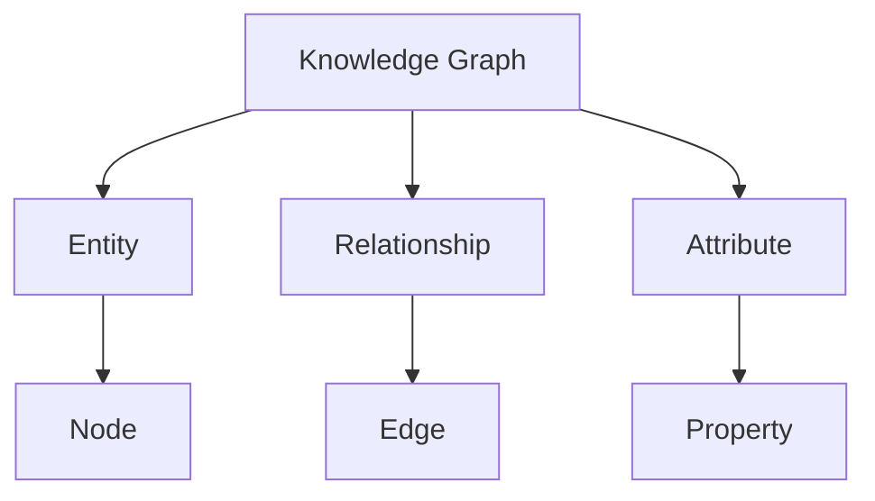

                 

### Introduction to AI-driven Enterprise Knowledge Graphs

## Key Concepts and Relationships in AI-driven Knowledge Graphs

### Core Concept of AI-driven Knowledge Graphs

AI-driven knowledge graphs are structures that combine artificial intelligence with semantic networks to model and represent the knowledge of an organization in a structured, machine-readable form. They leverage data from various sources, integrate it with domain-specific knowledge, and enable advanced analytics and decision-making.

### Core Concepts and Their Relationships

#### 1. Knowledge Graph
A knowledge graph is a semantic network that represents entities and their relationships in a structured format. It uses nodes to represent entities and edges to represent relationships between these entities. 

#### 2. Entity
Entities are objects or concepts that are represented in the knowledge graph. They can be people, places, events, or any other concept relevant to the domain.

#### 3. Relationship
Relationships are the connections between entities. They describe how entities are related to each other and can be directed or undirected.

#### 4. Attribute
Attributes are additional properties or characteristics associated with entities. They provide more detailed information about the entities and their relationships.

#### 5. Edge Weight
Edge weight represents the strength or importance of a relationship between entities. It can be used to prioritize or filter the relationships in the graph.

#### 6. Graph Database
A graph database is a type of database that stores data using a graph structure with nodes, edges, and attributes. It is used to efficiently store and query knowledge graphs.

### Entity-Relationship Diagram (ERD)

To visualize the relationships between these concepts, we can create an Entity-Relationship Diagram (ERD) using Mermaid:

This diagram illustrates the core concepts of an AI-driven knowledge graph and their relationships. The nodes represent the entities, relationships, and attributes, while the edges show the connections between them.

### Conclusion

In this section, we have defined the core concepts of AI-driven knowledge graphs and their relationships. Understanding these concepts is essential for building, maintaining, and applying knowledge graphs effectively in enterprise environments. In the next section, we will delve deeper into the construction of knowledge graphs, exploring the processes and techniques involved.

### Conclusion

In this section, we have defined the core concepts of AI-driven knowledge graphs and their relationships. Understanding these concepts is essential for building, maintaining, and applying knowledge graphs effectively in enterprise environments. In the next section, we will delve deeper into the construction of knowledge graphs, exploring the processes and techniques involved.

