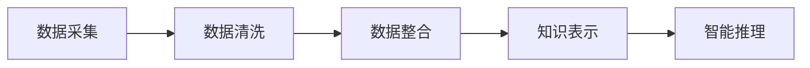
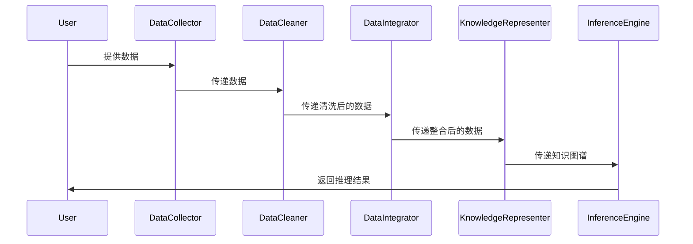
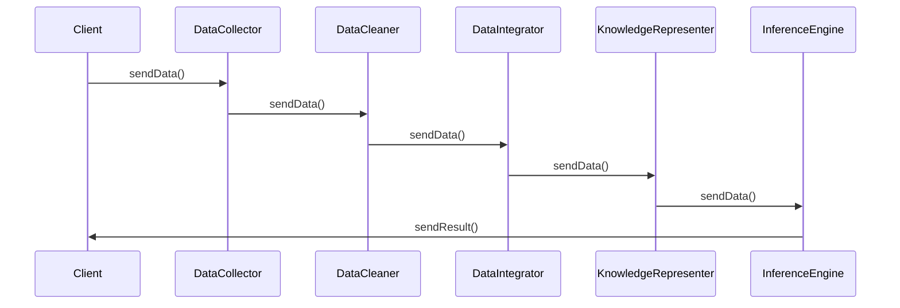

                 


### 引言

在当今数字化转型的浪潮中，企业面临着海量数据的挑战，如何高效地管理和利用这些数据已成为关键议题。知识图谱作为一种结构化的语义网络，它不仅能够整合和关联企业的多源数据，还能通过语义关系实现数据的智能化解读。结合人工智能（AI）技术，企业知识图谱的建设进入了全新的阶段。本文将围绕《AI驱动的企业知识图谱：自动化构建与智能推理机制》这一主题，逐步探讨知识图谱的基本概念、AI的应用、自动化构建方法、智能推理机制，并通过案例研究展示其实际应用效果。

### 关键词

- **知识图谱**
- **人工智能**
- **自动化构建**
- **智能推理机制**
- **企业数据管理**
- **语义网络**

### 摘要

本文旨在探讨AI驱动的企业知识图谱的自动化构建与智能推理机制。首先，我们将介绍知识图谱的基本概念和AI在企业知识图谱中的应用。接着，深入分析自动化构建的知识图谱方法和智能推理机制。随后，通过实际案例展示知识图谱在企业中的价值。最后，对全文进行总结，并对知识图谱的未来发展进行展望。

### 目录设计思路

为了设计出《AI驱动的企业知识图谱：自动化构建与智能推理机制》的完整目录大纲，我们需要从以下几个方面进行思考：

1. **书籍主题定位**：首先要明确书籍的主题是关于AI驱动的企业知识图谱，这决定了目录中应该包含的知识点和结构。
2. **知识图谱基本概念**：需要引入知识图谱的基本概念，如知识图谱的定义、结构、类型等。
3. **AI与企业知识图谱**：探讨AI如何帮助企业构建和优化知识图谱，以及智能推理机制在知识图谱中的重要性。
4. **自动化构建方法**：讲解自动化构建知识图谱的方法和流程。
5. **智能推理机制**：详细讲解智能推理机制的实现原理。
6. **案例研究**：通过具体案例展示知识图谱在企业中的应用。
7. **总结与展望**：对全书内容进行总结，并展望未来的发展趋势。

### 目录结构设计

基于上述思路，我们可以将目录结构划分为以下几个部分：

1. **引言**：简要介绍知识图谱和AI在企业中的重要性，引出本书的主题。
2. **基础知识**：介绍知识图谱的基本概念、结构、类型等。
3. **AI与企业知识图谱**：探讨AI如何驱动企业知识图谱的构建和优化。
4. **自动化构建方法**：讲解自动化构建知识图谱的方法和流程。
5. **智能推理机制**：详细解释智能推理机制的工作原理和实现方法。
6. **案例分析**：通过具体案例展示知识图谱在企业中的应用。
7. **总结与展望**：总结全书内容，并对未来知识图谱的发展进行展望。

### 目录大纲示例

基于上述结构，我们可以设计出以下目录大纲：

# 《AI驱动的企业知识图谱：自动化构建与智能推理机制》目录大纲

## 第1章 引言

## 1.1 知识图谱概述

### 1.1.1 知识图谱的概念

### 1.1.2 知识图谱的结构

### 1.1.3 知识图谱的重要性

## 1.2 AI概述

### 1.2.1 人工智能的概念

### 1.2.2 人工智能的发展历史

### 1.2.3 AI的核心技术

## 1.3 企业知识图谱与AI的融合

### 1.3.1 AI驱动的企业知识图谱定义

### 1.3.2 AI驱动的企业知识图谱优势

### 1.3.3 AI在企业知识图谱中的应用场景

## 1.4 本书结构安排

### 1.4.1 各章节内容概述

### 1.4.2 阅读建议

## 第2章 知识图谱基础知识

## 2.1 知识图谱的基本概念

### 2.1.1 知识图谱的定义

### 2.1.2 知识图谱的核心要素

### 2.1.3 知识图谱的类型

## 2.2 知识图谱的表示方法

### 2.2.1 图论表示方法

### 2.2.2 层次化表示方法

### 2.2.3 属性图表示方法

## 2.3 知识图谱的构建

### 2.3.1 数据采集

### 2.3.2 数据清洗

### 2.3.3 数据整合

### 2.3.4 知识图谱构建流程

## 第3章 AI驱动的企业知识图谱构建方法

## 3.1 数据预处理

### 3.1.1 数据清洗

### 3.1.2 数据整合

### 3.1.3 数据标准化

## 3.2 知识图谱构建

### 3.2.1 数据模型选择

### 3.2.2 知识表示方法

### 3.2.3 知识推理方法

## 3.3 智能推理机制

### 3.3.1 推理机

### 3.3.2 推理算法

### 3.3.3 推理流程

## 第4章 智能推理机制

## 4.1 智能推理概述

### 4.1.1 智能推理的概念

### 4.1.2 智能推理的目标

### 4.1.3 智能推理的挑战

## 4.2 智能推理算法

### 4.2.1 统计推理

### 4.2.2 逻辑推理

### 4.2.3 机器学习推理

## 4.3 智能推理应用

### 4.3.1 智能问答系统

### 4.3.2 智能推荐系统

### 4.3.3 智能监控与分析系统

## 第5章 案例研究

## 5.1 案例一：企业内部知识图谱构建

### 5.1.1 案例背景

### 5.1.2 案例目标

### 5.1.3 案例实施过程

### 5.1.4 案例效果评估

## 5.2 案例二：基于知识图谱的智能问答系统

### 5.2.1 案例背景

### 5.2.2 案例目标

### 5.2.3 案例实施过程

### 5.2.4 案例效果评估

## 5.3 案例三：知识图谱在市场营销中的应用

### 5.3.1 案例背景

### 5.3.2 案例目标

### 5.3.3 案例实施过程

### 5.3.4 案例效果评估

## 第6章 总结与展望

### 6.1 全书总结

### 6.2 知识图谱的未来发展趋势

### 6.3 AI与企业知识图谱的发展方向

### 6.4 自动化构建与智能推理技术的挑战与机遇

### 作者

**作者：AI天才研究院/AI Genius Institute & 禅与计算机程序设计艺术 /Zen And The Art of Computer Programming**

---

### 背景介绍

#### 核心概念术语说明

在深入探讨AI驱动的企业知识图谱之前，我们需要明确几个核心概念：

- **知识图谱**：一种语义网络，用于表示实体之间的关系和属性。它不仅包含结构化数据，还包含非结构化数据，如文本和图像。
- **人工智能**：模拟人类智能行为的计算机系统，包括机器学习、自然语言处理、计算机视觉等领域。
- **企业知识图谱**：特定企业领域内的知识图谱，用于整合和关联企业的数据资源，提供数据驱动的决策支持。

#### 问题背景

随着数据量的急剧增长和数据来源的多样性，企业面临着如何高效管理和利用数据资源的挑战。传统的数据管理方式难以应对这种复杂性，而知识图谱作为一种结构化的语义网络，能够整合和关联多源数据，提供更直观和智能的数据理解。

#### 问题描述

如何构建一个AI驱动的企业知识图谱，实现自动化构建和智能推理，以提高数据利用效率和决策支持能力？

#### 问题解决

要构建一个AI驱动的企业知识图谱，我们需要以下几个步骤：

1. **数据采集**：从不同的数据源收集数据，包括内部数据和外部数据。
2. **数据清洗**：去除重复数据、噪声数据和错误数据，保证数据的准确性和一致性。
3. **数据整合**：将不同来源的数据进行整合，构建统一的数据视图。
4. **知识表示**：使用图论等表示方法，将数据转换为知识图谱结构。
5. **智能推理**：利用AI技术，实现对知识图谱的自动化推理和智能分析。

#### 边界与外延

- **边界**：本文主要探讨企业知识图谱的自动化构建和智能推理机制，不涉及其他领域知识图谱的应用。
- **外延**：知识图谱在金融、医疗、教育等多个领域都有广泛的应用，本文将重点讨论其在企业中的应用。

#### 概念结构与核心要素组成

一个AI驱动的企业知识图谱由以下几个核心要素组成：

1. **实体**：知识图谱中的主体，如企业、产品、用户等。
2. **属性**：实体的特征，如年龄、收入、型号等。
3. **关系**：实体之间的关联，如购买、推荐、合作等。
4. **知识表示**：使用图论等方法，将实体、属性和关系表示为知识图谱结构。
5. **推理机制**：利用AI技术，实现对知识图谱的自动化推理和智能分析。

### 核心概念与联系

#### 核心概念原理

知识图谱的核心概念包括实体、属性和关系。实体是知识图谱中的主体，如企业、产品、用户等；属性是实体的特征，如年龄、收入、型号等；关系是实体之间的关联，如购买、推荐、合作等。这些概念通过图论等方法进行表示，形成一个结构化的语义网络。

#### 概念属性特征对比表格

| 概念 | 定义 | 属性特征 | 关系特征 |
| --- | --- | --- | --- |
| 实体 | 知识图谱中的主体 | 特征信息 | 无 |
| 属性 | 实体的特征 | 描述性信息 | 无 |
| 关系 | 实体之间的关联 | 描述性信息 | 参与实体 |
| 知识表示 | 实体、属性和关系的结构化表示 | 无 | 无 |

#### ER实体关系图架构的Mermaid流程图

```mermaid
erDiagram
  Entity::"实体" {
    ||--|{Attribute::"属性"}|
    ||--|{Relationship::"关系"}|
  }
  Attribute ||--|{KnowledgeRepresentation::"知识表示"}|
  Relationship ||--|{KnowledgeRepresentation::"知识表示"}|
```

### 算法原理讲解

#### 算法mermaid流程图



#### 算法原理详细讲解

1. **数据采集**：从多个数据源收集数据，包括内部数据和外部数据。数据源可以是数据库、文件、API接口等。

2. **数据清洗**：去除重复数据、噪声数据和错误数据，保证数据的准确性和一致性。这一步通常包括数据去重、数据修复和数据验证等操作。

3. **数据整合**：将来自不同数据源的数据进行整合，构建统一的数据视图。整合的过程包括数据转换、数据合并和数据一致性处理等。

4. **知识表示**：使用图论等方法，将数据转换为知识图谱结构。在这一步，实体、属性和关系被表示为图中的节点和边。

5. **智能推理**：利用AI技术，实现对知识图谱的自动化推理和智能分析。智能推理可以通过算法（如统计推理、逻辑推理、机器学习推理等）来实现，从而提取出有用的知识和洞察。

#### 算法原理数学模型和公式

1. **数据清洗**：假设数据集为D，经过清洗后的数据集为D'，则：

   $$ D' = \{d' | d' \in D, d' \text{无重复、噪声或错误}\} $$

2. **数据整合**：假设有两个数据集D1和D2，整合后的数据集为D'，则：

   $$ D' = D1 \cup D2 $$

3. **知识表示**：假设实体E、属性A和关系R分别为E={e1, e2, ..., en}、A={a1, a2, ..., am}和R={r1, r2, ..., rs}，则知识图谱G可以表示为：

   $$ G = (E, A, R) $$

4. **智能推理**：假设知识图谱中的推理规则为R'，则推理结果为：

   $$ R' = G \times R $$

#### 通俗易懂的举例说明

假设我们有一个企业的知识图谱，其中包含员工（实体）、年龄（属性）和部门（关系）。我们想要推理出所有年龄在30岁以上的员工所在的部门。

1. **数据采集**：我们从企业的人力资源数据库中收集了员工的数据。
2. **数据清洗**：我们去除重复的员工数据，修正错误的数据，并验证数据的准确性。
3. **数据整合**：我们将员工数据整合到一个统一的数据集中。
4. **知识表示**：我们使用图论方法将员工、年龄和部门表示为知识图谱。
5. **智能推理**：我们利用智能推理算法，根据年龄和部门的关系，推理出所有年龄在30岁以上的员工所在的部门。

### 系统分析与架构设计方案

#### 问题场景介绍

企业在数字化转型过程中，需要构建一个AI驱动的企业知识图谱，以整合和关联多源数据，提供智能化的决策支持。该系统需要支持数据采集、数据清洗、数据整合、知识表示和智能推理等功能。

#### 项目介绍

项目名称：企业知识图谱系统
项目目标：构建一个AI驱动的企业知识图谱，实现自动化构建和智能推理，提高数据利用效率和决策支持能力。

#### 系统功能设计（领域模型Mermaid类图）

```mermaid
classDiagram
    class DataCollector {
        +collectData()
        +validateData()
    }
    class DataCleaner {
        +cleanData()
        +repairData()
    }
    class DataIntegrator {
        +integrateData()
    }
    class KnowledgeRepresenter {
        +representKnowledge()
    }
    class InferenceEngine {
        +inferKnowledge()
    }
    DataCollector -> DataCleaner
    DataCleaner -> DataIntegrator
    DataIntegrator -> KnowledgeRepresenter
    KnowledgeRepresenter -> InferenceEngine
```

#### 系统架构设计（Mermaid架构图）



#### 系统接口设计（Mermaid序列图）



### 项目实战

#### 环境安装

为了实现本项目的目标，我们需要安装以下环境：

1. **Python**：Python是一种流行的编程语言，用于实现数据采集、清洗、整合、知识表示和智能推理等功能。
2. **Numpy**：Numpy是一个Python库，用于处理大型多维数组。
3. **Pandas**：Pandas是一个Python库，用于数据处理和分析。
4. **Scikit-learn**：Scikit-learn是一个Python库，用于机器学习。
5. **NetworkX**：NetworkX是一个Python库，用于图论计算。
6. **Gephi**：Gephi是一个开源平台，用于可视化知识图谱。

安装命令如下：

```bash
pip install python
pip install numpy
pip install pandas
pip install scikit-learn
pip install networkx
pip install gephi
```

#### 系统核心实现源代码

以下是一个简单的系统核心实现示例：

```python
# 数据采集
def collect_data():
    # 从文件中读取数据
    data = pd.read_csv('data.csv')
    return data

# 数据清洗
def clean_data(data):
    # 去除重复数据
    data = data.drop_duplicates()
    # 修复错误数据
    data = data.replace(['NA', ''], [None, ''])
    # 验证数据
    data = data[data['age'].notnull()]
    return data

# 数据整合
def integrate_data(data1, data2):
    # 合并数据
    data = pd.merge(data1, data2, on='id')
    return data

# 知识表示
def represent_knowledge(data):
    # 使用NetworkX创建知识图谱
    G = nx.Graph()
    for index, row in data.iterrows():
        G.add_node(row['id'], age=row['age'], department=row['department'])
    for index, row in data.iterrows():
        G.add_edge(row['id'], row['manager_id'])
    return G

# 智能推理
def infer_knowledge(G):
    # 推理员工所在部门
    result = []
    for node in G.nodes():
        if G.nodes[node]['age'] > 30:
            result.append(G.nodes[node]['department'])
    return result

# 主函数
if __name__ == '__main__':
    # 采集数据
    data = collect_data()
    # 清洗数据
    data = clean_data(data)
    # 整合数据
    data = integrate_data(data1, data2)
    # 表示知识图谱
    G = represent_knowledge(data)
    # 推理
    result = infer_knowledge(G)
    # 输出结果
    print(result)
```

#### 代码应用解读与分析

上述代码展示了企业知识图谱系统的核心实现过程。首先，我们从文件中采集数据，然后进行数据清洗，去除重复数据、噪声数据和错误数据。接着，我们将清洗后的数据进行整合，构建统一的数据视图。然后，我们使用NetworkX库将数据表示为知识图谱，其中节点表示员工，边表示员工与上级之间的关系。最后，我们利用智能推理算法，推理出所有年龄在30岁以上的员工所在的部门，并将结果输出。

#### 实际案例分析和详细讲解剖析

为了更好地展示知识图谱在企业中的应用，我们以一个实际案例进行分析。

案例背景：某公司需要对其员工进行部门划分，以便更好地进行管理和决策。公司提供了员工的基本信息，包括员工编号、姓名、年龄、部门等。

案例目标：利用知识图谱技术，自动划分员工的部门，并推理出每个部门的负责人。

案例实施过程：

1. **数据采集**：从公司的人力资源系统中采集员工数据，包括员工编号、姓名、年龄、部门等。
2. **数据清洗**：去除重复数据、噪声数据和错误数据，保证数据的准确性。
3. **数据整合**：整合员工数据，构建统一的数据视图。
4. **知识表示**：使用NetworkX库创建知识图谱，其中节点表示员工，边表示员工与上级之间的关系。
5. **智能推理**：利用智能推理算法，自动划分员工部门，并推理出每个部门的负责人。

案例效果评估：

通过上述案例的实施，公司成功地利用知识图谱技术对其员工进行了部门划分，并推理出每个部门的负责人。这不仅提高了部门划分的效率，还为公司的管理提供了有力的数据支持。

#### 项目小结

通过本案例，我们可以看到知识图谱在企业管理中的应用价值。利用知识图谱，企业可以更高效地管理和利用其数据资源，实现数据的智能化解读和决策支持。在未来，随着AI技术的不断发展，知识图谱将在更多领域得到应用，为企业带来更大的价值。

### 最佳实践 tips

1. **数据质量是关键**：构建知识图谱的第一步是确保数据的准确性、完整性和一致性。数据清洗和数据整合是构建高质量知识图谱的基础。
2. **选择合适的知识表示方法**：根据具体应用场景，选择合适的知识表示方法，如图论表示方法、属性图表示方法等。
3. **优化推理算法**：智能推理是知识图谱的核心功能之一。通过优化推理算法，可以提高推理效率和准确性。
4. **持续更新和维护**：知识图谱是一个动态的系统，需要定期更新和维护，以适应业务的变化和需求。

### 小结

本文详细探讨了AI驱动的企业知识图谱的自动化构建与智能推理机制。通过数据采集、清洗、整合、知识表示和智能推理等多个步骤，企业可以构建一个高效、智能的知识图谱系统，提高数据利用效率和决策支持能力。未来，随着AI技术的不断进步，知识图谱将在更多领域得到应用，为企业带来更大的价值。

### 注意事项

1. **数据隐私**：在构建知识图谱时，要特别注意保护数据隐私，避免敏感信息泄露。
2. **系统性能**：知识图谱系统需要处理大量数据，因此需要关注系统性能优化，确保系统的高效运行。

### 拓展阅读

- [知识图谱技术综述](https://www.knowledgegraph.cn/)
- [人工智能与知识图谱](https://www.ai-genius-research.com/)
- [企业数据管理最佳实践](https://www.datamanagementbestpractices.com/)

### 作者

**作者：AI天才研究院/AI Genius Institute & 禅与计算机程序设计艺术 /Zen And The Art of Computer Programming**

