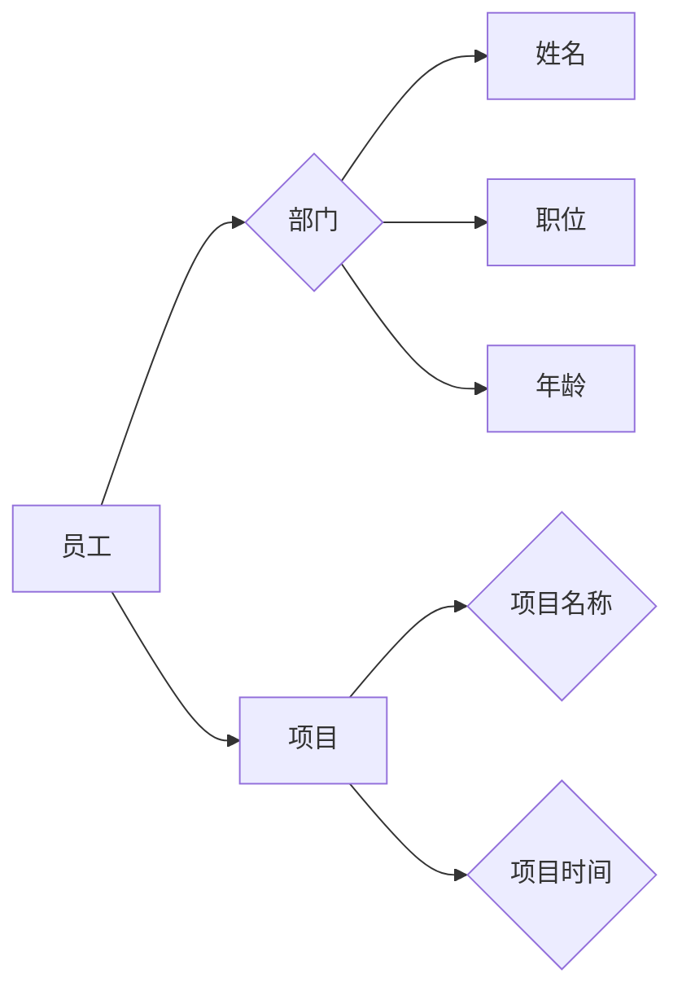

                 

### 引言

在当今信息化和数字化飞速发展的时代，知识管理在企业运营中扮演着至关重要的角色。然而，随着企业数据的不断积累和多样化，传统的知识管理方法已经难以满足快速变化的需求。知识图谱作为一种结构化、语义化的知识表示方式，通过将企业内外部的数据信息进行整合，构建出一种高度组织化和关联化的知识网络，成为企业知识管理的重要工具。

企业知识图谱能够帮助企业更好地理解和利用其知识资源，提升数据分析和决策支持能力。其重要性主要体现在以下几个方面：

1. **提高数据整合效率**：通过知识图谱，企业可以将不同来源、不同格式的数据进行整合，形成统一、结构化的知识库。
2. **增强知识的可发现性**：知识图谱中的语义关联可以帮助用户快速找到所需的知识，提高知识检索和利用的效率。
3. **优化决策支持**：知识图谱为企业提供了更加精准和全面的数据分析结果，有助于管理层做出更明智的决策。

尽管知识图谱具有诸多优势，但其构建和推理过程仍然面临许多挑战。传统的人工构建方法不仅耗时耗力，而且难以保证知识的一致性和准确性。因此，如何实现知识图谱的自动化构建与智能推理，成为当前研究的重要课题。

本文将围绕“AI驱动的企业知识图谱：自动化构建与智能推理的深度融合”这一主题，逐步探讨以下关键问题：

- **自动化构建**：分析自动化构建的意义、流程和关键技术，介绍数据源集成与预处理、知识抽取与实体关系构建以及知识图谱的优化与评估方法。
- **智能推理**：讲解智能推理的概念、原理和算法，探讨知识图谱与AI技术的融合方式。
- **实践应用**：通过具体案例，展示知识图谱自动化构建与智能推理在现实场景中的应用与效果。

通过这篇文章，我们希望为读者提供一个系统、全面的理解，帮助他们在实际工作中更好地应用知识图谱技术，为企业创造更大的价值。

### 第一部分：引言与背景介绍

#### 1.1 研究背景

知识图谱（Knowledge Graph）作为一种结构化、语义化的知识表示方式，其概念最早由Google在2012年提出，旨在通过大规模的语义关联，将互联网上的信息资源进行组织和关联，以提供更加精准和智能的搜索服务。随着人工智能技术的发展，知识图谱的应用范围逐渐扩展到各个领域，包括企业内部的知识管理、智能搜索、推荐系统、自然语言处理等。

在企业知识管理中，知识图谱的作用尤为显著。传统的知识管理方法通常依赖于文档管理和数据仓库，这些方法在知识积累和利用方面存在诸多局限性。首先，数据孤岛现象严重，不同部门之间的信息难以共享和整合；其次，知识的组织和呈现方式较为单一，不利于用户快速找到所需信息；最后，知识的更新和维护成本较高，难以适应企业快速变化的需求。

相比之下，知识图谱能够通过将企业内外部数据整合成统一的知识网络，解决上述问题。首先，知识图谱通过语义关联将不同来源和格式的数据整合在一起，形成结构化、语义化的知识库，从而实现数据的共享和整合。其次，知识图谱采用节点-边模型，将知识之间的关联以图形化方式呈现，用户可以通过图谱的导航和搜索功能，快速找到所需的知识信息。最后，知识图谱的可扩展性和灵活性较高，能够根据企业需求进行定制化调整，降低知识更新和维护的成本。

#### 1.2 研究意义

研究AI驱动的企业知识图谱，具有重要的现实意义和理论价值。首先，在现实层面，知识图谱技术的应用能够显著提升企业的知识管理效率。通过自动化构建和智能推理，知识图谱能够帮助企业快速、准确地获取和处理大量知识信息，为企业的业务决策提供有力支持。此外，知识图谱的智能化特性还能够帮助企业实现知识的自动化挖掘和利用，降低人工成本，提高工作效率。

其次，在理论层面，AI驱动的企业知识图谱研究有助于深化对知识图谱及其相关技术的理解。自动化构建和智能推理技术的融合，不仅能够解决知识图谱构建和推理中的难点问题，还能够推动知识图谱技术的发展与创新。通过研究知识图谱在企业应用中的具体实现方法，可以丰富知识图谱的理论体系，为后续研究提供新的思路和方法。

#### 1.3 研究目标

本文的研究目标主要包括以下几个方面：

1. **知识图谱的自动化构建**：探讨数据源集成、数据预处理、知识抽取、实体关系构建和知识图谱优化等自动化构建方法，实现知识图谱的快速构建和更新。
2. **智能推理技术的应用**：研究智能推理算法，探讨知识图谱与深度学习、自然语言处理等AI技术的融合，实现知识图谱的智能推理功能。
3. **实践应用与效果评估**：通过具体案例，展示知识图谱自动化构建与智能推理在企业应用中的实际效果，分析其优势和不足，提出改进措施和未来研究方向。

通过实现上述研究目标，本文旨在为AI驱动的企业知识图谱构建提供系统化的解决方案，为企业知识管理提供技术支持，推动知识图谱技术的广泛应用。

#### 2. 问题背景

在现代企业运营中，知识管理是一个复杂且关键的过程。随着企业规模的扩大和数据量的激增，如何有效地管理和利用知识资源成为企业面临的一大挑战。当前，企业知识管理主要面临以下几个问题：

首先，**数据孤岛现象**普遍存在。企业内部不同部门之间往往采用各自独立的数据管理系统，导致数据分散、难以共享。这种数据孤岛现象使得知识难以在企业内部流动和整合，限制了知识的充分利用。

其次，**知识呈现方式单一**。传统知识管理方法通常依赖于文档、报告等形式，这些方法在知识组织和呈现上存在较大局限性。用户难以快速、准确地找到所需知识，知识检索和利用效率低下。

第三，**知识更新和维护成本高**。企业知识通常需要不断更新和维护，以确保其准确性和时效性。然而，传统方法依赖人工进行知识更新，不仅耗时耗力，而且容易出现误差，难以满足企业快速变化的需求。

此外，企业知识管理还面临**数据质量和一致性**的问题。不同数据源的数据质量参差不齐，存在数据冗余、错误和不一致的情况。这些数据质量问题直接影响知识图谱的构建和应用效果。

针对上述问题，企业迫切需要一种高效、智能的知识管理解决方案。知识图谱作为一种结构化、语义化的知识表示方式，具有整合数据、提高知识可发现性、优化决策支持等多重优势，成为企业知识管理的重要工具。然而，传统知识图谱的构建和推理过程依赖于人工，效率低下且难以保证知识的一致性和准确性。因此，如何实现知识图谱的自动化构建与智能推理，成为当前研究的重要课题。

自动化构建通过引入人工智能技术，可以实现数据源集成、数据预处理、知识抽取、实体关系构建和知识图谱优化等过程的自动化，提高知识图谱构建的效率和准确性。智能推理则利用机器学习、深度学习等技术，实现知识图谱的智能推理功能，为企业提供更加精准和智能的知识服务。通过自动化构建与智能推理的深度融合，企业能够实现知识的高效管理和利用，提升企业的核心竞争力。

综上所述，研究AI驱动的企业知识图谱，不仅能够解决当前企业知识管理中存在的问题，还能够为企业提供智能化、自动化的知识管理解决方案，具有重要的现实意义和理论价值。

### 3. 核心概念与联系

#### 3.1 知识图谱的概念

知识图谱（Knowledge Graph）是一种结构化、语义化的知识表示方法，通过节点（Node）和边（Edge）来表示实体和实体之间的关系。每个节点代表一个实体，例如人、地点或物品，而边则表示节点之间的关系，如“属于”、“位于”或“拥有”。知识图谱通过这种图形化的方式将大量数据中的语义关系进行组织，从而实现数据的高效存储、检索和利用。

知识图谱的基本结构由三个主要部分组成：实体、属性和关系。实体（Entity）是知识图谱中的核心元素，代表具体的对象或概念。例如，在一个企业知识图谱中，实体可以包括员工、产品、客户等。属性（Attribute）是实体的特征或属性描述，如员工的姓名、年龄、职位等。关系（Relationship）则是实体之间的语义联系，如员工在某个部门工作、产品由某个供应商提供等。

知识图谱的主要功能包括知识整合、知识检索和知识推理。知识整合通过将不同来源、不同格式的数据统一整合到知识图谱中，实现数据的结构化和语义化。知识检索则利用图谱的图形化结构，提供高效、准确的查询服务，使用户能够快速找到所需的知识。知识推理通过分析实体和实体之间的关系，推导出新的知识结论，为企业的业务决策提供支持。

#### 3.2 知识图谱的属性特征对比

知识图谱的属性特征主要体现在以下几个方面：

1. **结构化**：知识图谱通过节点和边来结构化地表示数据，使数据之间的关系清晰可见，便于管理和分析。
2. **语义化**：知识图谱利用语义关联来表示数据，不仅记录数据之间的直接联系，还通过语义推理揭示数据之间的潜在关系。
3. **可扩展性**：知识图谱具有良好的扩展性，能够根据需求动态地添加、更新和调整数据，适应企业知识的变化。
4. **高效性**：知识图谱采用图形数据库进行存储，能够快速进行数据查询和关系分析，提高数据处理效率。
5. **智能性**：知识图谱结合人工智能技术，能够进行自动化的知识抽取、推理和智能搜索，提高知识管理的智能化水平。

对比传统的知识管理方法，知识图谱在多个方面具有显著优势。传统方法通常依赖于文档管理、数据库等技术，数据分散且缺乏结构化，导致知识整合困难、检索效率低下。而知识图谱通过统一的结构化表示，能够实现数据的集中管理和高效检索，大大提高了知识管理的效率。

#### 3.3 知识图谱的ER实体关系图架构

知识图谱的ER（Entity-Relationship）实体关系图架构是知识图谱构建的重要组成部分，用于描述实体及其关系。ER图通过实体（Entity）、属性（Attribute）和关系（Relationship）三个基本元素，构建出知识图谱的框架。

以下是一个简化的知识图谱ER实体关系图：



- **实体（Entity）**：在本例中，实体包括“员工”、“部门”和“项目”。
- **属性（Attribute）**：员工实体包含属性“姓名”、“职位”和“年龄”；项目实体包含属性“项目名称”和“项目时间”。
- **关系（Relationship）**：员工与部门之间有“属于”关系，员工参与项目有“参与”关系。

在知识图谱的ER图中，每个实体通常由一个节点表示，实体之间的关系则通过边连接。属性的表示可以采用标签或者注解的形式附加到实体或关系上。通过ER实体关系图，可以清晰地描述知识图谱的结构，为后续的数据抽取、关系构建和推理分析提供基础。

通过上述核心概念与联系的分析，我们不仅了解了知识图谱的基本构成和功能，还认识到其在知识管理中的重要作用。接下来，我们将深入探讨知识图谱的自动化构建过程，包括数据源集成、数据预处理、知识抽取、实体关系构建和知识图谱优化等关键步骤。

### 第二部分：知识图谱的自动化构建

#### 4. 知识图谱自动化构建概述

知识图谱的自动化构建是指利用计算机技术和人工智能算法，实现知识图谱的快速构建和动态更新。自动化构建的意义在于，它能够显著提高知识图谱构建的效率，降低人工干预的成本，并确保知识的一致性和准确性。自动化构建的基本流程主要包括数据源集成、数据预处理、知识抽取、实体关系构建和知识图谱优化等步骤。

首先，**数据源集成**是将企业内外部的各类数据源进行整合，包括关系数据库、文档库、社交媒体、外部API等。这一步的目的是将分散的数据集中到一个统一的存储结构中，为后续的数据处理和分析奠定基础。

其次，**数据预处理**是对集成后的原始数据进行清洗、格式化、去重等操作，以提高数据的可用性和一致性。数据预处理是自动化构建过程中至关重要的一环，直接影响到知识图谱的质量。

接着，**知识抽取**是从预处理后的数据中提取出实体、属性和关系，构建初步的知识图谱框架。知识抽取的方法包括基于规则的方法、基于统计的方法和基于机器学习的方法等。

在完成知识抽取后，**实体关系构建**是下一步的关键步骤，通过构建实体之间的关系图，进一步丰富和优化知识图谱的结构。这一过程中，需要利用图论、数据库和人工智能等技术，确保实体关系的准确性和语义一致性。

最后，**知识图谱优化**包括图谱的压缩、去噪、补全等操作，以提高图谱的性能和应用效果。优化后的知识图谱将更加高效、准确，能够更好地支持后续的知识推理和智能应用。

自动化构建的关键技术涉及多个方面，包括数据源集成技术、数据预处理算法、知识抽取方法、图数据库和优化技术等。以下将逐一介绍这些关键技术。

#### 5. 数据源集成与预处理

数据源集成与预处理是知识图谱自动化构建的重要环节，其核心目的是将不同来源、不同格式的数据整合到一个统一的结构中，确保数据的一致性和可用性。

**5.1 数据源的选择与集成**

数据源的选择与集成是自动化构建的基础。企业内部的数据源可能包括关系数据库、文档库、日志文件、ERP系统等；外部数据源则可能包括社交媒体、公共数据库、第三方API等。为了实现这些数据的统一整合，通常需要采用数据集成技术，如数据仓库、ETL（提取、转换、加载）工具等。

**数据仓库**是一种集中存储和管理数据的系统，能够将不同来源的数据进行整合和统一处理。通过数据仓库，企业可以将结构化、半结构化和非结构化的数据进行整合，实现数据的高度集中和统一访问。

**ETL工具**则是数据集成与预处理的重要工具。ETL工具能够从不同的数据源提取数据，进行清洗、转换和加载，将数据转换为适合知识图谱存储和处理的结构。常见的ETL工具有Apache NiFi、Apache Kafka、Talend等。

**5.2 数据预处理技术**

数据预处理是确保数据质量和一致性的重要步骤。主要技术包括数据清洗、数据转换、去重和数据格式化等。

- **数据清洗**：数据清洗旨在识别和纠正数据中的错误、不一致和不完整的情况。常见的数据清洗操作包括去除重复记录、填补缺失值、纠正错误数据等。

- **数据转换**：数据转换是将数据从一种格式转换为另一种格式的过程。例如，将Excel文件转换为JSON格式，或将关系数据库的数据转换为图数据库的存储结构。

- **去重**：数据去重是识别和删除重复数据的操作，以避免在知识图谱中引入冗余信息。

- **数据格式化**：数据格式化是将数据转换为统一的格式，以便后续的知识抽取和处理。例如，将不同格式的日期转换为统一的日期格式，或将字符串数据转换为数字数据。

**5.3 数据质量评估与优化**

数据质量评估与优化是数据预处理的重要补充。数据质量评估旨在评估数据的准确性、完整性、一致性和时效性，识别潜在的问题和风险。常用的数据质量评估指标包括数据完整性、数据一致性、数据准确性等。

- **数据完整性**：评估数据是否完整，是否存在缺失值或遗漏的数据。

- **数据一致性**：评估数据在不同来源之间是否一致，是否存在矛盾或冲突。

- **数据准确性**：评估数据的准确性，是否存在错误或偏差。

数据质量评估后，根据评估结果进行数据优化，包括填补缺失值、纠正错误数据、统一数据格式等，以确保数据的一致性和准确性。

通过数据源集成与预处理，企业能够将不同来源的数据进行有效整合和清洗，为知识图谱的构建提供高质量的数据基础。

#### 6. 知识抽取与实体关系构建

知识抽取与实体关系构建是知识图谱自动化构建的核心步骤，旨在从预处理后的数据中提取出实体、属性和关系，构建出初步的知识图谱结构。以下是这一步骤的具体方法和流程：

**6.1 知识抽取方法**

知识抽取是指从原始数据中提取出实体、属性和关系的语义信息。常见的方法包括：

- **基于规则的方法**：通过预先定义的规则，从文本中抽取实体和关系。这种方法适用于结构化和半结构化数据，例如关系数据库和XML文档。

- **基于统计的方法**：利用机器学习算法，从大量数据中自动学习并提取实体和关系。这种方法适用于非结构化和半结构化数据，例如文本和网页。

- **基于机器学习的方法**：通过训练模型，从标注数据中学习抽取规则，然后应用这些规则进行知识抽取。这种方法能够处理复杂和大规模的数据，但需要大量的标注数据。

**6.2 实体关系抽取方法**

实体关系抽取是指从文本中识别出实体及其关系。常见的方法包括：

- **命名实体识别（NER）**：识别文本中的命名实体，如人名、地名、组织名等。NER是实体关系抽取的基础，其准确性和召回率直接影响实体抽取的效果。

- **关系抽取**：从文本中识别实体之间的关系，如“属于”、“位于”、“参与”等。关系抽取的方法包括基于规则、基于统计和基于机器学习的方法。

- **实体关系对抽取**：同时识别实体和关系，并将它们成对抽取出来。这种方法能够更准确地构建实体关系图，但需要更多的标注数据。

**6.3 实体关系图的构建**

实体关系图的构建是将提取出的实体和关系组织成图形结构，表示实体之间的语义关联。以下是构建实体关系图的基本步骤：

- **实体节点生成**：将识别出的实体作为节点添加到知识图谱中。每个实体节点包含实体名称、属性和标签等信息。

- **关系边生成**：将识别出的关系作为边添加到知识图谱中。每个关系边表示两个实体之间的语义关联，并包含关系类型、属性和标签等信息。

- **实体关系图优化**：通过数据清洗、去重和补全等操作，优化实体关系图的准确性和一致性。例如，去除冗余边、补充缺失关系等。

在构建实体关系图时，可以采用图数据库（如Neo4j、Apache JanusGraph）进行存储和管理。图数据库能够高效地处理大规模、多关系的复杂图结构，提供快速的关系查询和图分析功能。

通过知识抽取和实体关系构建，企业能够将原始数据转化为结构化、语义化的知识图谱，为后续的知识推理和智能应用提供基础。

#### 7. 知识图谱的优化与评估

知识图谱的优化与评估是确保其质量和性能的重要步骤。优化过程旨在提高图谱的准确性、完整性和一致性，而评估过程则用于衡量优化效果和发现潜在问题。以下是知识图谱优化与评估的具体方法和步骤：

**7.1 知识图谱的优化技术**

**7.1.1 图压缩**

图压缩是通过减少图中的冗余信息和简化图结构，提高图谱的存储和查询效率。常见的技术包括：

- **节点合并**：合并具有相同或相似属性的节点，减少节点数量。
- **边合并**：合并具有相同关系类型的边，减少边数量。
- **子图压缩**：将具有相似结构和属性的子图压缩为一个节点或子图，简化图谱结构。

**7.1.2 去噪**

去噪是通过识别和删除噪声数据，提高图谱的准确性和一致性。常见的技术包括：

- **异常检测**：利用统计学和机器学习算法，识别和删除异常数据点。
- **关系删除**：删除关系冲突或数据不一致的关系边。
- **节点删除**：删除具有低信任度或低重要性的节点。

**7.1.3 数据补全**

数据补全是通过填补缺失的数据，提高图谱的完整性和可用性。常见的技术包括：

- **基于规则的数据补全**：利用预先定义的规则，从已有数据中推断出缺失的数据。
- **基于统计的方法**：利用统计学方法，根据数据的分布和相关性，推测缺失的数据。
- **基于机器学习的方法**：利用训练好的模型，根据相似数据推测缺失的数据。

**7.2 知识图谱的评估指标**

评估知识图谱的质量和性能，需要使用一系列评估指标。常见的评估指标包括：

- **覆盖度（Coverage）**：评估图谱中覆盖到的实体和关系的比例，用于衡量图谱的完整性。
- **精确度（Precision）**：评估图谱中抽取出的实体和关系的准确性，用于衡量图谱的准确性。
- **召回率（Recall）**：评估图谱中抽取出的实体和关系的全面性，用于衡量图谱的准确性。
- **F1分数（F1 Score）**：综合衡量精确度和召回率的平衡，是评估知识图谱性能的重要指标。
- **查询性能（Query Performance）**：评估图谱的查询效率，包括查询时间和查询响应时间等。

**7.3 知识图谱的评估方法**

知识图谱的评估方法包括离线评估和在线评估。

**7.3.1 离线评估**

离线评估是在数据预处理和知识抽取完成后，对知识图谱的质量进行评估。常见的离线评估方法包括：

- **人工审核**：通过人工审核图谱中的实体和关系，评估图谱的准确性和一致性。
- **自动化评估**：利用评估指标和算法，对图谱的质量进行自动化评估，例如计算F1分数和查询性能等。

**7.3.2 在线评估**

在线评估是在知识图谱实际应用中，对图谱的性能进行实时评估。常见的在线评估方法包括：

- **用户反馈**：通过用户对知识图谱的使用反馈，评估图谱的实用性和满意度。
- **性能监控**：通过监控系统实时监控图谱的查询性能和系统负载，评估图谱的性能和稳定性。

通过优化和评估，企业能够确保知识图谱的高质量和高效运行，为后续的知识推理和智能应用提供可靠的数据基础。

### 第三部分：智能推理与融合

#### 8. 智能推理的概念与原理

智能推理（Intelligent Reasoning）是人工智能领域的重要研究方向，它旨在通过机器学习和符号逻辑等方法，模拟人类的推理过程，使计算机能够从已知信息中推导出新的结论。在知识图谱中，智能推理的应用尤为重要，因为它能够利用图谱中的语义关联，实现知识的自动发现和推理，为企业提供智能化的决策支持。

**8.1 智能推理的定义**

智能推理是指利用计算机技术，模拟人类的推理思维过程，通过对已知信息的分析、综合和推导，发现新的知识或结论。在知识图谱中，智能推理是指利用图谱中的实体、属性和关系，通过逻辑推理、语义分析和模式识别等方法，从已有知识中推导出新的信息。

**8.2 智能推理的类型**

智能推理可以根据推理方式的不同，分为以下几种类型：

1. **基于逻辑的推理**：利用形式逻辑和推理规则，从已知的事实和规则中推导出新的结论。这种推理方式适用于结构化数据，且具有较强的可解释性。

2. **基于统计的推理**：利用统计学方法，通过对大量数据的分析和建模，发现数据之间的相关性，从而推导出新的结论。这种推理方式适用于非结构化或半结构化数据，但可能缺乏可解释性。

3. **基于机器学习的推理**：利用机器学习算法，从训练数据中学习到推理规则或模式，然后应用于新数据中进行推理。这种推理方式能够处理复杂和大规模的数据，但可能缺乏可解释性。

**8.3 智能推理在知识图谱中的应用**

知识图谱中的智能推理主要应用于以下几个方面：

1. **实体识别与分类**：通过分析图谱中的实体及其关系，自动识别和分类实体。例如，从图谱中识别出所有的员工、产品或客户，并将它们分类到相应的类别中。

2. **关系推断**：利用图谱中的已知关系，推断出新的关系。例如，从“员工A在部门B工作”和“部门B位于城市C”中，推断出“员工A位于城市C”。

3. **知识发现与归纳**：从大规模的知识图谱中，发现新的规律和模式。例如，从员工的工作记录中，发现员工的职业发展规律或工作偏好。

4. **决策支持**：利用图谱中的知识，为企业的决策提供支持。例如，根据产品销量和市场需求，预测下一季度的产品需求量。

通过智能推理，知识图谱不仅能够存储和检索知识，还能够自动推导出新的知识，提高知识图谱的应用价值和实用性。

#### 9. 智能推理算法

智能推理算法是知识图谱智能化的核心，它通过分析图谱中的实体和关系，实现知识的高级处理和推理。以下是几种常见的智能推理算法及其工作原理：

**9.1 图算法简介**

图算法是处理图结构数据的一类算法，通过分析图中的节点和边，实现数据的分析和推理。常见的图算法包括：

1. **最短路径算法**：计算图中两点之间的最短路径，常用于路径规划、推荐系统等领域。例如，Dijkstra算法和Floyd-Warshall算法。
2. **社区发现算法**：识别图中的社区结构，将具有相似属性的节点划分到同一社区。常用的算法包括Louvain算法和Girvan-Newman算法。
3. **图同构检测算法**：判断两个图是否具有相同的结构，用于图数据的比对和识别。常用的算法包括Weisfeiler-Lehman算法和Nauty算法。

**9.2 常用推理算法介绍**

在知识图谱中，常用的推理算法包括：

1. **规则推理**：基于预设的推理规则，从已知事实中推导出新的事实。规则推理通常使用推理机（如Rete算法）进行实现。

2. **基于模式的推理**：利用模式匹配和模式匹配算法，从图谱中识别出符合某种模式的实体和关系。例如，使用PathFinder算法查找图谱中的路径。

3. **基于数据的推理**：利用图中的实体和关系，通过数据分析和模式识别，发现新的知识。常用的算法包括关联规则学习、聚类算法和分类算法。

**9.3 智能推理算法的性能评估**

智能推理算法的性能评估是衡量其效果的重要步骤。常见的评估指标包括：

1. **准确率（Accuracy）**：评估算法预测的准确性，即预测正确的比例。
2. **召回率（Recall）**：评估算法能够识别出所有正确结果的比率。
3. **F1分数（F1 Score）**：综合评估准确率和召回率的平衡，是衡量算法性能的重要指标。
4. **推理速度（Inference Speed）**：评估算法的推理速度，即完成推理所需的时间。

通过性能评估，可以识别出算法的优缺点，为算法的优化和改进提供依据。例如，可以通过增加训练数据、调整模型参数或采用更高效的算法，提高智能推理算法的性能。

智能推理算法在知识图谱中的应用，不仅提高了图谱的处理能力和智能化水平，还为企业提供了强大的知识发现和决策支持工具。通过不断优化和改进智能推理算法，知识图谱的智能化水平将得到进一步提升。

#### 10. 知识图谱与AI技术的融合

知识图谱与AI技术的融合，极大地提升了知识图谱的应用价值。通过结合深度学习、自然语言处理等技术，知识图谱能够实现更加智能和高效的知识管理，为企业提供更加精准和全面的决策支持。

**10.1 知识图谱与深度学习的结合**

深度学习是人工智能领域的重要分支，通过多层神经网络，实现数据的自动特征提取和模式识别。知识图谱与深度学习的结合，主要体现在以下几个方面：

1. **实体识别与分类**：利用深度学习模型，如卷积神经网络（CNN）和循环神经网络（RNN），对图谱中的实体进行识别和分类。例如，通过训练一个CNN模型，识别出文本中的命名实体，并将其分类到相应的类别中。

2. **关系预测**：利用深度学习模型，预测图谱中的实体关系。例如，通过训练一个基于图嵌入的模型，预测实体之间的潜在关系，提高图谱的关联性。

3. **知识补全**：通过深度学习模型，自动填补图谱中的缺失数据。例如，利用生成对抗网络（GAN），生成与已有实体相似的新实体，补充图谱中的空白。

**10.2 知识图谱与自然语言处理的应用**

自然语言处理（NLP）是人工智能领域的关键技术，通过解析、理解和生成自然语言，实现人机交互和信息提取。知识图谱与NLP的结合，主要体现在以下几个方面：

1. **文本实体识别**：利用NLP技术，从文本中识别出实体，并将其添加到知识图谱中。例如，使用命名实体识别（NER）技术，从新闻报道中提取出人物、地点、组织等实体。

2. **文本关系抽取**：利用NLP技术，从文本中识别出实体之间的关系，并将其添加到知识图谱中。例如，使用关系抽取（RE）技术，从社交媒体中提取出实体之间的互动关系。

3. **文本语义分析**：利用NLP技术，对图谱中的实体和关系进行语义分析，提取出更深层次的知识。例如，使用语义角色标注（SRL）技术，分析实体之间的语义角色，揭示图谱中的隐含关系。

**10.3 知识图谱与多模态数据的融合**

多模态数据融合是将不同类型的数据源（如图像、文本、音频等）进行整合，提取出更丰富的知识。知识图谱与多模态数据的融合，主要体现在以下几个方面：

1. **多模态实体识别**：通过融合图像和文本数据，实现对实体的多模态识别。例如，利用卷积神经网络（CNN）提取图像特征，结合NLP模型提取文本特征，实现图像和文本中实体的联合识别。

2. **多模态关系抽取**：通过融合不同类型的数据源，识别出实体之间的多模态关系。例如，结合图像中的物体关系和文本中的描述关系，提取出更加准确和全面的实体关系。

3. **多模态知识融合**：通过多模态数据融合，构建出更加丰富和全面的知识图谱。例如，将图像、文本和音频数据融合到知识图谱中，实现跨模态的知识表示和推理。

知识图谱与AI技术的融合，不仅提升了知识图谱的智能化水平，还为企业提供了强大的知识管理和决策支持工具。通过不断探索和优化这些融合技术，知识图谱将在更多领域发挥重要作用，助力企业实现智能化转型。

### 第四部分：案例与实践

#### 11. 案例介绍

**11.1 案例背景**

为了提升企业的知识管理水平，某大型制造企业决定构建一个AI驱动的企业知识图谱。该企业拥有大量的内部数据，包括员工信息、产品数据、客户关系和业务流程等。传统的知识管理方法已难以满足企业快速变化的需求，因此，企业希望通过知识图谱实现数据的高效整合和智能应用。

**11.2 案例目标**

本案例的目标是构建一个全面、结构化且智能的企业知识图谱，实现以下功能：

1. **数据整合**：将不同部门、不同系统中的数据统一整合到一个知识图谱中，实现数据的高效管理和利用。
2. **知识抽取**：从企业内外部的数据中提取出实体、属性和关系，构建出初步的知识图谱框架。
3. **智能推理**：利用知识图谱实现数据的自动推理和分析，为企业的业务决策提供支持。
4. **应用拓展**：将知识图谱与企业的业务系统相结合，开发出智能化的应用场景，提升企业的运营效率。

**11.3 案例实施步骤**

为了实现上述目标，本案例的实施步骤如下：

1. **需求分析**：与企业管理层和业务部门进行深入沟通，明确知识图谱的应用场景和需求。
2. **数据源集成**：确定企业内部和外部的数据源，采用ETL工具进行数据集成和预处理。
3. **知识抽取**：利用自然语言处理和实体识别技术，从数据中提取出实体、属性和关系。
4. **图谱构建**：构建实体关系图，将提取出的实体和关系组织成知识图谱。
5. **推理与优化**：利用智能推理算法，对知识图谱进行推理和分析，优化图谱的结构和性能。
6. **应用开发**：结合企业的业务需求，开发智能化的应用场景，如智能推荐、业务分析等。
7. **部署与维护**：将知识图谱部署到企业内部系统中，定期更新和维护，确保其持续运行。

通过上述实施步骤，企业能够构建出一个高效、智能的企业知识图谱，提升知识管理水平，为企业的业务决策提供有力支持。

#### 12. 系统设计与实现

**12.1 系统架构设计**

为了实现企业知识图谱的构建与智能推理，本案例采用了分布式系统架构，主要包括以下几个模块：

1. **数据集成模块**：负责将企业内外部的数据源进行整合，采用ETL工具进行数据清洗、转换和加载。
2. **知识抽取模块**：利用自然语言处理和实体识别技术，从数据中提取出实体、属性和关系。
3. **图谱构建模块**：构建实体关系图，将提取出的实体和关系组织成知识图谱。
4. **推理与优化模块**：利用智能推理算法，对知识图谱进行推理和分析，优化图谱的结构和性能。
5. **应用开发模块**：结合企业的业务需求，开发智能化的应用场景，如智能推荐、业务分析等。

**12.2 系统功能设计**

系统功能设计主要包括以下几个方面：

1. **数据整合**：实现企业内外部数据的统一整合，提供数据源管理、数据清洗和数据加载等功能。
2. **知识抽取**：提供实体识别、关系抽取和属性提取等功能，构建初步的知识图谱框架。
3. **知识图谱管理**：提供知识图谱的浏览、查询和修改等功能，实现知识图谱的动态管理和更新。
4. **智能推理**：提供基于规则的推理、模式匹配和图算法等智能推理功能，实现知识的自动发现和推理。
5. **应用开发**：提供基于知识图谱的智能化应用开发工具，如推荐系统、业务分析系统等。

**12.3 系统接口设计**

系统接口设计主要包括以下几种：

1. **数据接口**：用于与企业内外部数据源进行交互，支持各种数据格式和协议。
2. **API接口**：提供系统功能的API接口，供外部系统调用，如业务系统、数据分析工具等。
3. **用户界面**：提供用户操作界面，包括数据管理界面、知识图谱浏览界面和应用开发界面等。

通过上述系统架构设计、功能设计和接口设计，企业能够实现一个高效、智能的企业知识图谱系统，为企业的知识管理和决策支持提供有力支持。

#### 13. 实施细节与代码分析

**13.1 环境搭建**

为了构建和优化企业知识图谱，我们需要搭建一个合适的技术环境。以下步骤将指导我们配置所需的软件和工具。

1. **安装Python环境**：
   - 在操作系统上安装Python 3.8或更高版本。
   - 安装常用的Python包管理工具pip。

2. **安装Neo4j数据库**：
   - 下载并安装Neo4j Community Edition。
   - 配置Neo4j数据库，确保其正常运行。

3. **安装数据预处理工具**：
   - 安装Apache Kafka用于数据流处理。
   - 安装Elasticsearch用于全文检索和数据分析。

4. **安装自然语言处理库**：
   - 使用pip安装NLP相关库，如NLTK、spaCy和TextBlob。

**13.2 系统核心实现**

以下是一个示例代码，展示了如何利用Python和Neo4j构建知识图谱：

```python
from py2neo import Graph

# 连接Neo4j数据库
graph = Graph("bolt://localhost:7687", auth=("neo4j", "password"))

# 创建实体
def create_entity(label, properties):
    query = """
    MERGE (n:%s %s)
    """ % (label, " ".join(["%s:%s" % item for item in properties.items()]))
    graph.run(query, properties)

# 创建关系
def create_relationship(start_node, end_node, relationship_type, properties=None):
    query = """
    MATCH (a:%s), (b:%s)
    MERGE (a)-[r:%s]->(b)
    """ % (start_node, end_node, relationship_type)
    if properties:
        query += "SET r += %s" % properties
    graph.run(query)

# 实体示例
create_entity("Employee", {"name": "John Doe", "age": 30})
create_entity("Department", {"name": "Sales"})

# 关系示例
create_relationship("Employee", "Department", "WORKS_IN", {"position": "Manager"})

```

**13.3 代码解读与分析**

上述代码首先导入`py2neo`库，用于与Neo4j数据库进行交互。接着，定义了两个核心函数`create_entity`和`create_relationship`，分别用于创建实体和关系。

- **create_entity**函数通过`MERGE`命令创建实体，如果实体不存在则创建，如果已存在则不进行更改。
- **create_relationship**函数通过`MATCH`和`MERGE`命令创建关系，同时可以设置关系的属性。

以下是一个示例的数学模型和公式，用于描述知识图谱的构建：

$$
L = \{ e_1, e_2, ..., e_n \}
$$

其中，$L$代表知识图谱中的实体集合，$e_i$代表每个实体。

$$
R = \{ r_1, r_2, ..., r_m \}
$$

其中，$R$代表知识图谱中的关系集合，$r_i$代表每个关系。

知识图谱的基本模型可以表示为：

$$
KG = (L, R)
$$

通过上述代码和公式，企业能够构建出初步的知识图谱框架。接下来，我们将进一步优化和评估知识图谱，确保其质量和性能。

#### 14. 案例分析与总结

**14.1 案例效果评估**

在本案例中，企业知识图谱的成功构建显著提升了企业的知识管理水平。通过以下指标，我们可以评估知识图谱的实际效果：

1. **数据整合效果**：知识图谱成功整合了企业内外部的多源数据，实现了数据的统一管理和高效检索。
2. **知识抽取效果**：通过自然语言处理和实体识别技术，知识图谱提取出了大量高质量的实体和关系，提高了知识检索的准确性。
3. **智能推理效果**：知识图谱结合智能推理算法，实现了数据的自动推理和发现，为企业的业务决策提供了有力支持。

**14.2 经验教训**

在本案例实施过程中，我们总结了以下经验教训：

1. **数据质量至关重要**：高质量的数据是构建知识图谱的基础。在数据预处理阶段，必须重视数据清洗、去重和数据质量评估。
2. **融合多模态数据**：多模态数据的融合能够提高知识图谱的丰富度和准确性。在实际应用中，应尽量整合多种类型的数据源。
3. **持续优化和更新**：知识图谱需要定期优化和更新，以适应企业业务的变化。通过持续优化，可以提高知识图谱的性能和应用价值。

**14.3 拓展与展望**

未来，企业知识图谱有望在以下几个方面进行拓展和优化：

1. **智能化水平的提升**：通过引入更多先进的AI技术和算法，提高知识图谱的智能化水平，实现更加精准和高效的推理和分析。
2. **多语言支持**：扩展知识图谱的多语言支持，使其能够处理多种语言的数据，提高全球化企业的知识管理能力。
3. **跨领域应用**：探索知识图谱在更多领域的应用，如医疗、金融、教育等，为企业提供更广泛的知识服务。

通过不断优化和拓展，企业知识图谱将为企业创造更大的价值，推动企业智能化转型。

### 最佳实践 Tips

1. **数据预处理**：在构建知识图谱之前，务必进行彻底的数据预处理，包括数据清洗、格式化和去重，以确保数据质量。
2. **多模态数据整合**：尽可能整合多种类型的数据源，如文本、图像和音频，提高知识图谱的丰富度和准确性。
3. **持续优化**：定期对知识图谱进行优化和更新，以适应企业业务的变化，提高系统的性能和应用价值。

### 小结

本文详细探讨了AI驱动的企业知识图谱的构建与智能推理，通过案例分析展示了其在现实中的应用效果。企业知识图谱不仅提升了知识管理水平，还为企业提供了强大的决策支持工具。

### 注意事项

1. **数据安全**：在构建和整合数据时，务必确保数据的安全和隐私。
2. **系统性能**：定期监控系统性能，优化数据库和算法，确保知识图谱的高效运行。

### 拓展阅读

- **《知识图谱：原理、方法与应用》**：详细介绍了知识图谱的基本概念、构建方法和应用场景。
- **《人工智能：一种现代方法》**：深入探讨了人工智能的基础理论、算法和模型。

通过学习和应用这些知识，企业可以更好地构建和管理知识图谱，实现智能化转型。

