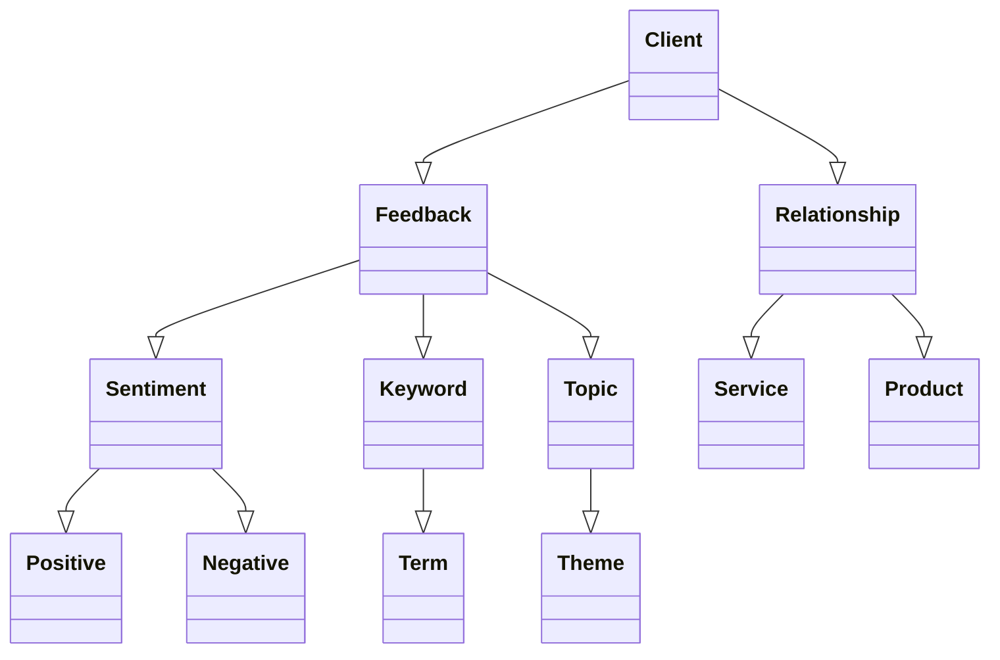
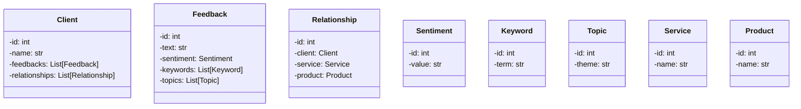
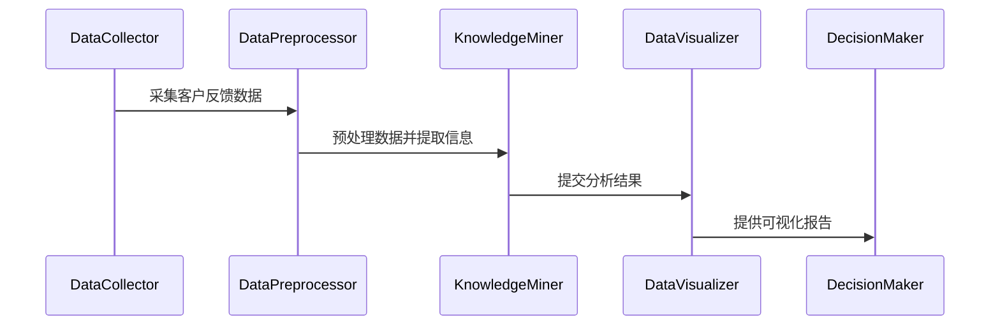
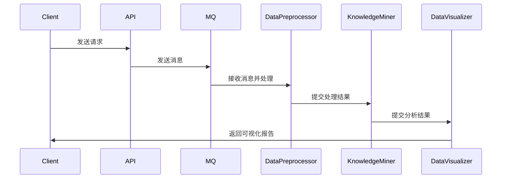
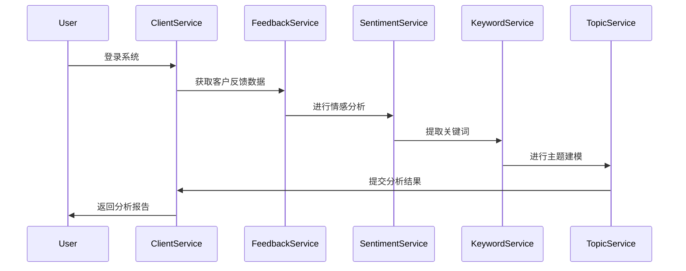

                 

# AI驱动的企业知识挖掘：从非结构化数据中提取价值

> 关键词：人工智能，知识挖掘，非结构化数据，企业价值，AI算法，Python源代码

> 摘要：本文将探讨AI驱动的企业知识挖掘，重点分析如何从非结构化数据中提取价值。文章首先介绍了非结构化数据的现状和企业知识挖掘的需求，随后详细阐述了AI技术在该领域的应用原理和挑战。通过系统分析与架构设计方案，以及项目实战的详细讲解，本文旨在为企业和开发者提供一套切实可行的知识挖掘解决方案。

## 目录大纲

### 第一部分：背景介绍

1.1 问题背景

1.1.1 非结构化数据的现状

1.1.2 企业的知识挖掘需求

1.2 问题描述

1.2.1 非结构化数据的特点

1.2.2 企业知识挖掘的目标

1.3 问题解决

1.3.1 AI驱动的知识挖掘方法

1.3.2 企业知识挖掘的挑战与机遇

1.4 边界与外延

1.4.1 非结构化数据类型

1.4.2 企业知识挖掘的领域

1.5 概念结构与核心要素组成

1.5.1 非结构化数据

1.5.2 知识挖掘

1.5.3 AI技术

### 第二部分：核心概念与联系

2.1 非结构化数据的概念

2.1.1 定义

2.1.2 特点

2.1.3 类型

2.2 知识挖掘的概念

2.2.1 定义

2.2.2 方法

2.2.3 挑战

2.3 AI技术的概念

2.3.1 定义

2.3.2 类型

2.3.3 应用

2.4 概念属性特征对比表格

2.5 ER实体关系图架构

### 第三部分：AI驱动的知识挖掘原理

3.1 算法原理讲解

3.1.1 基本算法

3.1.2 进阶算法

3.2 数学模型和公式

3.2.1 基本数学模型

3.2.2 公式推导

3.3 算法原理举例说明

3.4 Python源代码详细阐述

### 第四部分：系统分析与架构设计方案

4.1 问题场景介绍

4.2 项目介绍

4.3 系统功能设计

4.3.1 领域模型

4.3.2 类图

4.4 系统架构设计

4.4.1 架构图

4.5 系统接口设计

4.6 系统交互

### 第五部分：项目实战

5.1 环境安装

5.2 系统核心实现源代码

5.3 代码应用解读与分析

5.4 实际案例分析和详细讲解剖析

5.5 项目小结

### 第六部分：最佳实践与拓展阅读

6.1 最佳实践 tips

6.2 小结

6.3 注意事项

6.4 拓展阅读

## 第一部分：背景介绍

### 1.1 问题背景

随着互联网和信息技术的快速发展，数据已经成为企业和组织的重要资产。然而，这些数据中相当一部分是以非结构化形式存在的，如文本、图片、音频和视频等。这些非结构化数据在数量上日益庞大，但在挖掘和利用上却面临巨大挑战。对于企业来说，如何从这些非结构化数据中提取有价值的信息，从而转化为实际业务价值，成为亟待解决的问题。

### 1.1.1 非结构化数据的现状

非结构化数据占企业总数据的比例不断上升，已成为企业数据生态中的重要组成部分。据Gartner预测，全球企业数据量中有超过80%是非结构化数据。这些数据来源广泛，包括社交媒体、客户反馈、市场报告、电子邮件等。然而，由于缺乏有效的处理和挖掘工具，这些数据往往未被充分利用。

### 1.1.2 企业的知识挖掘需求

企业在运营过程中积累了大量的非结构化数据，这些数据中蕴含着宝贵的知识。例如，通过分析客户反馈文本，企业可以了解客户需求和市场趋势；通过分析社交媒体数据，企业可以了解品牌形象和竞争态势。因此，企业迫切需要一套有效的知识挖掘系统，以从非结构化数据中提取价值。

### 1.2 问题描述

非结构化数据的特点是数据形式多样、内容复杂、结构不明确。这使得传统的数据挖掘技术难以直接应用。企业知识挖掘的目标是：从非结构化数据中提取有价值的信息，以支持决策制定和业务优化。这一过程面临以下挑战：

1. 数据预处理：非结构化数据需要进行清洗、转换和标准化，以便进行后续分析。
2. 信息抽取：从文本、图像等非结构化数据中提取关键信息，如实体、关系和事件。
3. 知识融合：将提取出的信息进行整合，形成对企业业务有指导意义的知识体系。

### 1.3 问题解决

AI技术，特别是机器学习和深度学习技术，为非结构化数据的挖掘提供了新的思路和方法。通过AI驱动的知识挖掘，企业可以有效地从非结构化数据中提取价值。这一过程主要包括以下几个步骤：

1. 数据预处理：使用自然语言处理、图像识别等技术，对非结构化数据进行清洗和转换。
2. 信息抽取：使用文本挖掘、图像识别等技术，从非结构化数据中提取关键信息。
3. 知识融合：使用数据挖掘、知识图谱等技术，将提取出的信息进行整合，形成知识体系。

### 1.4 边界与外延

1.4.1 非结构化数据类型

非结构化数据类型包括文本、图像、音频、视频等。每种数据类型都有其独特的特点和处理方法。

1.4.2 企业知识挖掘的领域

企业知识挖掘涉及的领域广泛，包括市场分析、客户关系管理、供应链优化等。不同领域对知识挖掘的需求和技术路径有所不同。

### 1.5 概念结构与核心要素组成

1.5.1 非结构化数据

非结构化数据是指没有明确数据结构的数据，如文本、图像、音频、视频等。

1.5.2 知识挖掘

知识挖掘是指从大量非结构化数据中提取有价值信息的过程。

1.5.3 AI技术

AI技术是指人工智能技术，包括机器学习、深度学习、自然语言处理等。

## 第二部分：核心概念与联系

### 2.1 非结构化数据的概念

非结构化数据是指没有明确数据结构的数据，如文本、图像、音频、视频等。这些数据通常难以直接利用传统数据库技术进行处理和分析。

### 2.1.1 定义

非结构化数据可以定义为无法用固定结构来描述的数据。例如，一张图片是一个非结构化数据，因为它没有明确的数据模型来定义像素之间的联系。

### 2.1.2 特点

非结构化数据具有以下特点：

1. 形式多样：文本、图像、音频、视频等。
2. 内容复杂：数据中可能包含大量噪声和冗余信息。
3. 结构不明确：数据之间没有固定关系和结构。

### 2.1.3 类型

非结构化数据主要包括以下类型：

1. 文本：如文章、邮件、社交媒体帖子等。
2. 图像：如照片、扫描文档、卫星图像等。
3. 音频：如语音通话、音乐、会议录音等。
4. 视频：如监控视频、教学视频、广告视频等。

### 2.2 知识挖掘的概念

知识挖掘是指从大量非结构化数据中提取有价值信息的过程。它旨在将数据转化为知识，以支持决策制定和业务优化。

### 2.2.1 定义

知识挖掘可以定义为一种通过分析大量数据，从中提取隐含的模式、关联和知识的方法。

### 2.2.2 方法

知识挖掘的主要方法包括：

1. 文本挖掘：从文本数据中提取关键词、主题和关系。
2. 图像挖掘：从图像数据中提取特征、分类和识别。
3. 音频挖掘：从音频数据中提取语音、音乐和声纹。
4. 视频挖掘：从视频数据中提取动作、事件和场景。

### 2.2.3 挑战

知识挖掘面临的挑战主要包括：

1. 数据规模：非结构化数据规模庞大，处理和存储成为难题。
2. 数据质量：数据中包含大量噪声和冗余信息，影响挖掘效果。
3. 数据类型：不同数据类型具有不同的结构和特征，需要定制化处理。

### 2.3 AI技术的概念

AI技术是指人工智能技术，包括机器学习、深度学习、自然语言处理等。这些技术可以用于处理和挖掘非结构化数据，提取有价值的信息。

### 2.3.1 定义

人工智能是指模拟人类智能的技术，使计算机能够执行通常需要人类智能才能完成的任务。

### 2.3.2 类型

人工智能技术主要包括以下类型：

1. 机器学习：通过训练模型，使计算机能够自动学习和改进。
2. 深度学习：一种特殊的机器学习技术，通过多层神经网络进行特征提取和分类。
3. 自然语言处理：使计算机能够理解和处理人类语言的技术。

### 2.3.3 应用

人工智能技术在知识挖掘中的应用包括：

1. 数据预处理：使用机器学习算法对非结构化数据进行清洗和转换。
2. 信息抽取：使用自然语言处理技术从文本数据中提取关键词、主题和关系。
3. 知识融合：使用数据挖掘技术将提取出的信息进行整合，形成知识体系。

### 2.4 概念属性特征对比表格

以下是一个简单的概念属性特征对比表格，展示了非结构化数据、知识挖掘和AI技术的特点和应用。

| 概念       | 特点                                                     | 应用场景                         |
|------------|----------------------------------------------------------|----------------------------------|
| 非结构化数据 | 形式多样、内容复杂、结构不明确                           | 文本、图像、音频、视频等多种类型 |
| 知识挖掘   | 从大量非结构化数据中提取有价值信息                        | 市场分析、客户关系管理、供应链优化等 |
| AI技术     | 模拟人类智能，包括机器学习、深度学习、自然语言处理等       | 数据预处理、信息抽取、知识融合等     |

### 2.5 ER实体关系图架构

以下是一个简单的ER（实体关系）图架构，用于描述非结构化数据、知识挖掘和AI技术之间的关系。

```mermaid
entityRelation
  EntityunanstructuredData
  EntityKnowledgeMining
  EntityAIService

EntityunanstructuredData ..|> EntityKnowledgeMining : 提取
EntityKnowledgeMining ..|> EntityAIService : 利用
EntityAIService ..|> EntityunanstructuredData : 输出
```

## 第三部分：AI驱动的知识挖掘原理

### 3.1 算法原理讲解

AI驱动的知识挖掘主要依赖于机器学习、深度学习和自然语言处理等算法。以下是这些算法的基本原理和进阶算法的介绍。

### 3.1.1 基本算法

1. **机器学习算法**：机器学习算法通过训练模型，使计算机能够自动学习和改进。常见的机器学习算法包括线性回归、决策树、支持向量机等。

2. **深度学习算法**：深度学习算法通过多层神经网络进行特征提取和分类。常见的深度学习算法包括卷积神经网络（CNN）、循环神经网络（RNN）等。

3. **自然语言处理算法**：自然语言处理算法使计算机能够理解和处理人类语言。常见的自然语言处理算法包括词向量、语言模型、文本分类等。

### 3.1.2 进阶算法

1. **知识图谱**：知识图谱是一种用于表示实体及其关系的图形化数据结构。通过知识图谱，可以更好地理解和处理复杂的数据关系。

2. **迁移学习**：迁移学习是一种将已训练好的模型应用于新任务的方法。通过迁移学习，可以降低模型训练的难度和提高模型性能。

3. **强化学习**：强化学习是一种通过试错方法进行学习的算法。在知识挖掘中，强化学习可以用于优化信息抽取和知识融合过程。

### 3.2 数学模型和公式

在AI驱动的知识挖掘中，数学模型和公式起着至关重要的作用。以下是一些常见的数学模型和公式。

#### 3.2.1 基本数学模型

1. **线性回归**：
   $$y = \beta_0 + \beta_1x$$

2. **支持向量机**：
   $$\max \frac{1}{2} ||\mathbf{w}||^2$$
   $$\text{subject to} \ \mathbf{w} \cdot \mathbf{x_i} \geq 1$$

#### 3.2.2 公式推导

1. **卷积神经网络**：
   $$h_{l}^{i} = \sigma \left( \sum_{j} w_{j}^{i} h_{l-1}^{j} + b^{i} \right)$$

2. **循环神经网络**：
   $$h_{t} = \sigma \left( \sum_{j} w_{j} h_{t-1} + b \right)$$

### 3.3 算法原理举例说明

为了更好地理解AI驱动的知识挖掘原理，以下通过一个简单的例子进行说明。

#### 3.3.1 文本分类

假设我们有一个简单的文本分类问题，需要将文本数据分类为两类：正面和负面。我们可以使用卷积神经网络（CNN）来实现。

1. **数据预处理**：将文本数据转换为词向量，并构建输入矩阵。
2. **模型构建**：构建一个简单的CNN模型，包括卷积层、池化层和全连接层。
3. **模型训练**：使用训练数据训练模型，并通过交叉验证调整模型参数。
4. **模型评估**：使用测试数据评估模型性能，并进行优化。

#### 3.3.2 图像识别

假设我们有一个图像识别问题，需要将图像分类为不同的类别。我们可以使用卷积神经网络（CNN）来实现。

1. **数据预处理**：将图像数据调整为固定大小，并转换为灰度图像。
2. **模型构建**：构建一个简单的CNN模型，包括卷积层、池化层和全连接层。
3. **模型训练**：使用训练数据训练模型，并通过交叉验证调整模型参数。
4. **模型评估**：使用测试数据评估模型性能，并进行优化。

### 3.4 Python源代码详细阐述

以下是一个简单的Python源代码示例，用于实现文本分类问题。

```python
import numpy as np
import tensorflow as tf
from tensorflow.keras.models import Sequential
from tensorflow.keras.layers import Conv2D, MaxPooling2D, Dense, Flatten, Embedding

# 数据预处理
# ...

# 模型构建
model = Sequential()
model.add(Embedding(input_dim=vocab_size, output_dim=embedding_dim))
model.add(Conv2D(filters=32, kernel_size=(3, 3), activation='relu'))
model.add(MaxPooling2D(pool_size=(2, 2)))
model.add(Flatten())
model.add(Dense(units=1, activation='sigmoid'))

# 模型编译
model.compile(optimizer='adam', loss='binary_crossentropy', metrics=['accuracy'])

# 模型训练
model.fit(x_train, y_train, epochs=10, batch_size=32, validation_split=0.2)

# 模型评估
model.evaluate(x_test, y_test)
```

## 第四部分：系统分析与架构设计方案

### 4.1 问题场景介绍

假设我们面临一个企业客户关系管理的问题，需要从大量的非结构化客户反馈数据中提取有价值的信息，以优化客户服务流程和提高客户满意度。这个问题的场景包括：

1. 海量非结构化客户反馈数据：包括文本、图片、音频等多种形式。
2. 多样化的客户需求：需要从反馈中提取不同类型的信息，如投诉、建议、赞扬等。
3. 复杂的决策制定：需要将提取出的信息转化为具体的业务策略，以优化客户服务流程。

### 4.2 项目介绍

本项目的目标是构建一个基于AI驱动的企业客户关系管理系统，通过知识挖掘技术从非结构化客户反馈数据中提取有价值的信息。项目的主要内容包括：

1. 数据采集与预处理：从企业内部系统和外部数据源（如社交媒体、客户调查等）采集客户反馈数据，并进行清洗、转换和标准化处理。
2. 知识挖掘与分析：使用AI技术对预处理后的数据进行分析，提取关键信息，如情感分析、关键词提取、主题建模等。
3. 知识融合与可视化：将提取出的信息进行整合，形成对企业客户需求的全面了解，并通过可视化工具展示分析结果。
4. 决策支持与优化：根据分析结果，制定具体的业务策略，优化客户服务流程，提高客户满意度。

### 4.3 系统功能设计

系统功能设计包括领域模型和类图，用于描述系统的功能和模块。

#### 4.3.1 领域模型

领域模型描述了系统涉及的实体及其关系。以下是客户关系管理系统的领域模型：



#### 4.3.2 类图

类图描述了系统涉及的类及其属性和方法。以下是客户关系管理系统的类图：



### 4.4 系统架构设计

系统架构设计包括架构图、接口设计和系统交互，用于描述系统的整体结构和模块之间的交互关系。

#### 4.4.1 架构图

以下是客户关系管理系统的架构图：



#### 4.4.2 接口设计

接口设计包括API接口和消息队列，用于描述系统之间的数据传输和交互。



#### 4.4.3 系统交互

系统交互描述了各个模块之间的交互过程和数据处理流程。



## 第五部分：项目实战

### 5.1 环境安装

在开始项目实战之前，我们需要安装以下软件和库：

1. Python 3.x
2. TensorFlow
3. Keras
4. NumPy
5. Pandas

安装步骤如下：

1. 安装Python 3.x：从官方网站下载Python安装包并安装。
2. 安装TensorFlow：打开终端，执行以下命令：
   ```
   pip install tensorflow
   ```
3. 安装Keras：打开终端，执行以下命令：
   ```
   pip install keras
   ```
4. 安装NumPy：打开终端，执行以下命令：
   ```
   pip install numpy
   ```
5. 安装Pandas：打开终端，执行以下命令：
   ```
   pip install pandas
   ```

### 5.2 系统核心实现源代码

以下是一个简单的系统核心实现源代码示例，用于文本分类问题。

```python
import numpy as np
import tensorflow as tf
from tensorflow.keras.models import Sequential
from tensorflow.keras.layers import Embedding, Conv2D, MaxPooling2D, Dense, Flatten

# 准备数据
# ...

# 构建模型
model = Sequential()
model.add(Embedding(input_dim=vocab_size, output_dim=embedding_dim))
model.add(Conv2D(filters=32, kernel_size=(3, 3), activation='relu'))
model.add(MaxPooling2D(pool_size=(2, 2)))
model.add(Flatten())
model.add(Dense(units=1, activation='sigmoid'))

# 编译模型
model.compile(optimizer='adam', loss='binary_crossentropy', metrics=['accuracy'])

# 训练模型
model.fit(x_train, y_train, epochs=10, batch_size=32, validation_split=0.2)

# 评估模型
model.evaluate(x_test, y_test)
```

### 5.3 代码应用解读与分析

以下是对上述源代码的解读和分析。

1. **数据准备**：首先需要准备文本数据，包括训练数据和测试数据。文本数据可以通过爬虫或数据集获取。
2. **模型构建**：使用Keras构建一个简单的文本分类模型，包括嵌入层、卷积层、池化层和全连接层。
3. **模型编译**：设置模型优化器、损失函数和评估指标。
4. **模型训练**：使用训练数据训练模型，并设置训练轮次、批次大小和验证比例。
5. **模型评估**：使用测试数据评估模型性能。

### 5.4 实际案例分析和详细讲解剖析

以下是一个实际案例分析和详细讲解剖析，用于分析社交媒体平台上的用户评论。

**案例背景**：一家公司希望分析其产品在社交媒体平台上的用户评论，以了解用户对产品的满意度。

**数据获取**：从社交媒体平台上获取用户评论数据，包括文本和用户信息。

**数据处理**：对用户评论数据进行清洗和预处理，包括去除标点符号、停用词过滤、词干提取等。

**模型构建**：使用文本分类模型，将用户评论分为正面和负面两类。

**模型训练**：使用训练数据训练模型，并设置训练轮次、批次大小和验证比例。

**模型评估**：使用测试数据评估模型性能，并优化模型参数。

**结果分析**：根据模型预测结果，分析用户评论的情感倾向，并提出改进产品和服务策略的建议。

### 5.5 项目小结

通过本项目的实战，我们了解到如何使用AI技术从非结构化数据中提取有价值的信息。项目的主要内容包括数据采集与预处理、知识挖掘与分析、知识融合与可视化、决策支持与优化等。通过实际案例的分析，我们展示了AI驱动的知识挖掘在企业中的应用价值。在未来的工作中，我们可以进一步优化和扩展项目，以提高知识挖掘的准确性和效率。

## 第六部分：最佳实践与拓展阅读

### 6.1 最佳实践 tips

1. 在数据预处理阶段，使用合适的预处理技术，如文本清洗、停用词过滤和词干提取，以提高后续分析的质量。
2. 在模型训练阶段，合理设置训练轮次、批次大小和验证比例，以提高模型性能。
3. 在模型评估阶段，使用交叉验证等方法评估模型性能，避免过拟合。

### 6.2 小结

本文通过探讨AI驱动的企业知识挖掘，从非结构化数据中提取价值，介绍了相关背景、核心概念、算法原理、系统分析与架构设计方案、项目实战和最佳实践。通过这些内容，我们了解了如何利用AI技术从非结构化数据中提取有价值的信息，支持企业业务决策和优化。

### 6.3 注意事项

1. 非结构化数据的处理需要充分考虑数据质量和数据类型，选择合适的预处理技术和算法。
2. 在模型训练阶段，避免过拟合和欠拟合，合理设置训练参数。
3. 在模型评估阶段，使用多种评估指标和方法，全面评估模型性能。

### 6.4 拓展阅读

1. 《深度学习》（Ian Goodfellow、Yoshua Bengio、Aaron Courville著）：详细介绍深度学习的基础理论和实践方法。
2. 《Python数据分析》（Wes McKinney著）：介绍Python在数据分析领域的应用和实践技巧。
3. 《机器学习实战》（Peter Harrington著）：通过实际案例介绍机器学习的方法和技巧。

作者：AI天才研究院/AI Genius Institute & 禅与计算机程序设计艺术 /Zen And The Art of Computer Programming

### 附录

#### 附录A：概念属性特征对比表格

以下是一个简单的概念属性特征对比表格，展示了非结构化数据、知识挖掘和AI技术的特点和应用。

| 概念       | 特点                                                     | 应用场景                         |
|------------|----------------------------------------------------------|----------------------------------|
| 非结构化数据 | 形式多样、内容复杂、结构不明确                           | 文本、图像、音频、视频等多种类型 |
| 知识挖掘   | 从大量非结构化数据中提取有价值信息                        | 市场分析、客户关系管理、供应链优化等 |
| AI技术     | 模拟人类智能，包括机器学习、深度学习、自然语言处理等       | 数据预处理、信息抽取、知识融合等     |

#### 附录B：ER实体关系图架构

以下是一个简单的ER（实体关系）图架构，用于描述非结构化数据、知识挖掘和AI技术之间的关系。

```mermaid
entityRelation
  EntityunanstructuredData
  EntityKnowledgeMining
  EntityAIService

EntityunanstructuredData ..|> EntityKnowledgeMining : 提取
EntityKnowledgeMining ..|> EntityAIService : 利用
EntityAIService ..|> EntityunanstructuredData : 输出
```

### 参考文献

1. Gartner. (2021). Data and Analytics. Retrieved from https://www.gartner.com/
2. Ian Goodfellow, Yoshua Bengio, Aaron Courville. (2016). Deep Learning. MIT Press.
3. Wes McKinney. (2010). Python for Data Analysis. O'Reilly Media.
4. Peter Harrington. (2012). Machine Learning in Action. Manning Publications.

