                 

# AI驱动的企业知识管理：智能检索与推荐系统

## 关键词

- AI
- 企业知识管理
- 智能检索
- 推荐系统
- 知识图谱

## 摘要

随着信息爆炸式增长，企业知识管理的挑战日益凸显。本文探讨了如何利用人工智能技术，特别是智能检索与推荐系统，实现高效的企业知识管理。文章首先介绍了知识管理的背景与意义，然后详细分析了AI的核心技术在知识管理中的应用，包括机器学习、深度学习、自然语言处理和数据挖掘。接着，文章讨论了AI驱动的知识管理应用场景，重点介绍了智能检索系统和推荐系统的设计原理、架构和实现技术。通过实际案例和实战分析，本文为企业提供了构建高效知识管理系统的最佳实践与建议。

## 目录大纲

----------------------------------------------------------------

# AI驱动的企业知识管理：智能检索与推荐系统

## 第1章 引言：企业知识管理与AI

### 1.1 知识管理的背景与意义

### 1.2 AI的核心技术在知识管理中的应用

### 1.3 AI驱动的知识管理应用场景

## 第2章 智能检索系统设计

### 2.1 智能检索系统架构与设计原则

### 2.2 关键技术详解

#### 2.2.1 搜索算法原理与流程

#### 2.2.2 检索算法优化策略

## 第3章 推荐系统设计

### 3.1 推荐系统架构与设计原则

### 3.2 推荐算法原理与实现

### 3.3 推荐系统评估与优化

## 第4章 实战案例与最佳实践

### 4.1 环境安装与配置

### 4.2 系统核心实现源代码解析

### 4.3 实际案例分析与讲解

## 第5章 小结与展望

### 5.1 小结

### 5.2 注意事项

### 5.3 拓展阅读

----------------------------------------------------------------

### 第1章 引言：企业知识管理与AI

#### 1.1 知识管理的背景与意义

随着全球化竞争的加剧和知识经济的兴起，企业越来越认识到知识是一种宝贵的资源。有效的知识管理可以提升企业的创新能力、降低运营成本、提高员工工作效率。然而，面对海量的信息和不断变化的市场环境，传统的知识管理手段已显得力不从心。

**问题背景**：

- **信息过载**：企业内部和外部的信息资源不断增多，如何从海量信息中快速、准确地找到所需知识成为一个挑战。
- **知识分散**：企业内部的知识往往分散在不同的部门和员工手中，难以实现知识的共享和利用。
- **知识老化**：知识更新速度快，过时的知识对企业的决策和运营会产生负面影响。

**问题描述**：

- **知识获取困难**：员工在需要知识时难以快速找到相关资源。
- **知识共享不畅**：知识共享机制不完善，导致知识无法得到充分利用。
- **知识利用不充分**：企业无法有效地将知识转化为实际的生产力和竞争力。

**问题解决**：

引入AI驱动的知识管理，通过智能检索和推荐系统，可以提高知识获取、存储、共享和利用的效率。AI技术可以自动化处理大量的数据，实现知识的自动挖掘、分类、标注和推荐，从而帮助企业更好地管理和利用知识资源。

**边界与外延**：

- **知识管理**：涉及知识获取、知识共享、知识利用和知识创新的过程。
- **企业知识库**：存储企业内部和外部知识的数据库，是知识管理的基础设施。
- **人工智能技术应用**：包括机器学习、深度学习、自然语言处理和数据挖掘等，用于提升知识管理的智能化水平。

#### 1.2 AI的核心技术在知识管理中的应用

AI技术在知识管理中的应用主要体现在以下几个方面：

- **机器学习**：通过训练模型，从大量数据中自动发现知识模式和规律，实现知识的自动挖掘和分类。
- **深度学习**：模拟人脑神经网络，处理复杂数据和学习任务，提高知识检索和推荐的准确性。
- **自然语言处理**：使计算机能够理解和生成人类语言，实现知识的自动化标注、翻译和语义分析。
- **数据挖掘**：从海量数据中挖掘出有价值的信息和知识，支持企业的决策和运营。

**概念属性特征对比表格**：

| 技术       | 描述                                                     | 特点                     |
| ---------- | -------------------------------------------------------- | ------------------------ |
| 机器学习   | 通过数据训练模型，实现计算机自主学习和决策                 | 自动化、高效、泛化能力强 |
| 深度学习   | 模仿人脑的结构和功能，处理复杂数据和学习任务               | 高效、鲁棒、适用范围广   |
| 自然语言处理 | 让计算机理解、生成和处理人类语言                           | 语言理解、文本分析、翻译 |
| 数据挖掘   | 从大量数据中发现有用的信息和知识                           | 趋势分析、关联发现、预测 |

#### 1.3 AI驱动的知识管理应用场景

AI技术在知识管理中的应用场景主要包括智能检索和推荐系统。

**核心概念**：

- **智能检索**：利用AI技术，实现高效、准确的检索，帮助用户快速找到所需知识。
- **知识图谱**：通过构建知识图谱，将知识以结构化的方式存储和展示，提高知识的可访问性和利用效率。
- **推荐系统**：基于用户行为和知识特征，为用户推荐相关的知识和资源，提高知识的利用价值。

**ER实体关系图架构**：

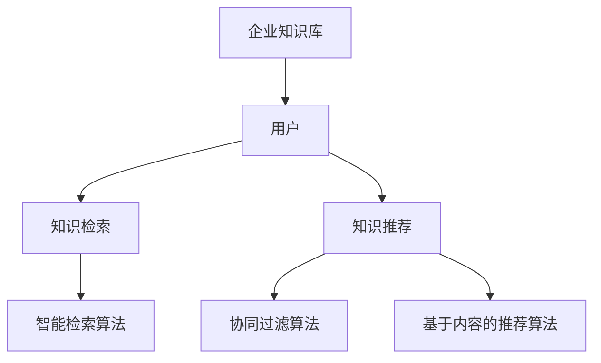

**应用场景**：

- **企业内部知识共享**：通过智能检索和推荐系统，促进企业内部知识的共享和利用，提升员工工作效率。
- **外部知识获取**：通过AI技术，从互联网和其他外部资源中自动获取和整合知识，为企业提供更加丰富的知识来源。
- **员工培训与发展**：利用推荐系统，为员工推荐与其技能和兴趣相关的知识和培训资源，促进员工的职业发展。

### 第2章 智能检索系统设计

#### 2.1 智能检索系统架构与设计原则

智能检索系统是企业知识管理的重要组成部分，其设计目标是提供高效、准确的检索服务，帮助用户快速找到所需知识。以下是对智能检索系统架构与设计原则的详细解析。

**问题场景介绍**：

企业知识库中存储了大量的文本数据，包括文档、报告、邮件等。用户在使用过程中，需要根据关键词或问题快速检索到相关的知识资源。智能检索系统旨在解决这一问题，提供高效的检索服务。

**项目介绍**：

智能检索系统的设计需求主要包括：

- **准确性**：准确匹配用户查询与知识库中的内容，减少无关信息的干扰。
- **速度**：快速响应用户的检索请求，提高用户体验。
- **易用性**：提供友好的用户界面，方便用户进行检索操作。
- **扩展性**：支持知识的动态更新和扩展，适应企业知识库的变化。

**系统功能设计（领域模型类图）**：

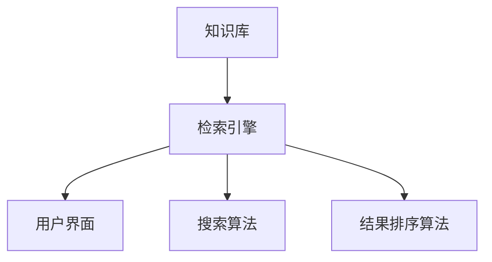

**系统架构设计（架构图）**：

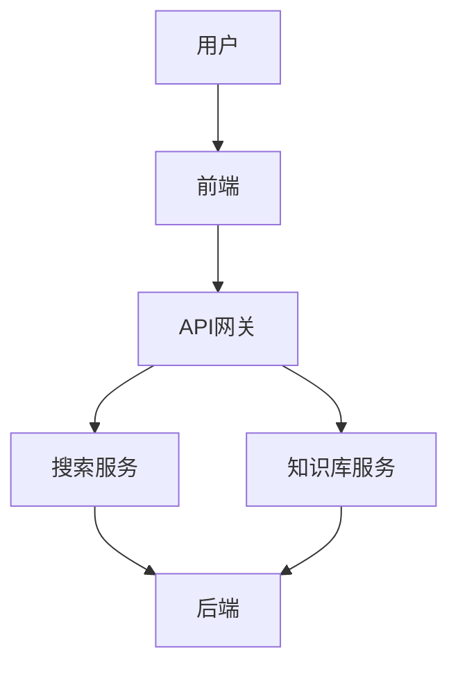

**系统接口设计（接口设计）**：

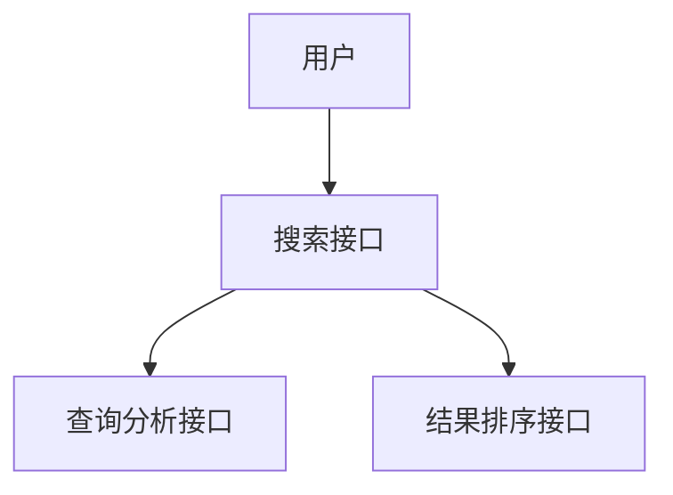

**系统交互（序列图）**：

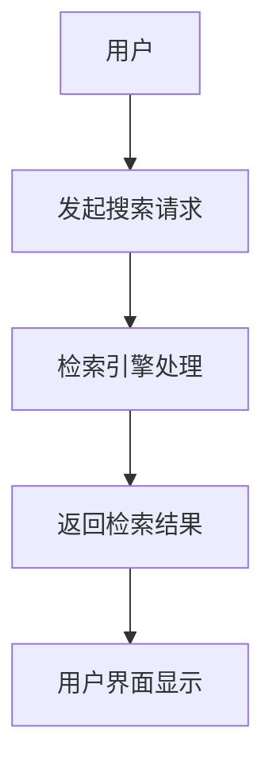

#### 2.2 关键技术详解

##### 2.2.1 搜索算法原理与流程

搜索算法是智能检索系统的核心，其目标是根据用户的查询，从知识库中快速、准确地找到相关的内容。以下是搜索算法的原理和流程：

1. **用户输入查询**：

   用户在用户界面上输入查询关键词或问题。

2. **分词处理**：

   将用户输入的查询进行分词处理，提取出关键词。

3. **建立倒排索引**：

   倒排索引是一种数据结构，用于存储词汇和文档之间的映射关系。通过建立倒排索引，可以快速定位包含特定关键词的文档。

4. **检索匹配**：

   根据用户输入的关键词，在倒排索引中查找包含这些关键词的文档。

5. **结果排序**：

   对检索到的文档进行排序，排序依据可以是关键词匹配度、文档的相关性等。

6. **返回结果**：

   将排序后的结果返回给用户，用户可以在用户界面上查看和选择所需的知识资源。

**Mermaid流程图**：

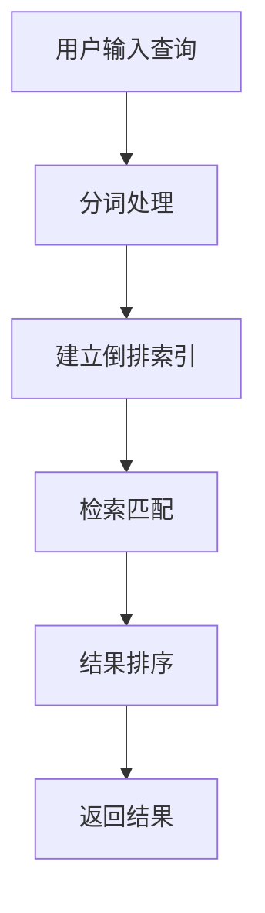

##### 2.2.2 检索算法优化策略

为了提高智能检索系统的性能，可以采用以下优化策略：

1. **索引优化**：

   - **索引压缩**：通过压缩索引数据，减少存储空间，提高检索速度。
   - **索引更新**：定期更新索引，确保索引数据的准确性和实时性。

2. **查询优化**：

   - **查询缓存**：缓存常用查询的结果，减少重复查询的开销。
   - **查询预处理**：对用户查询进行预处理，如去停用词、词干提取等，提高查询的准确性。

3. **结果排序优化**：

   - **相关性排序**：采用更加精准的相关性排序算法，提高检索结果的排序质量。
   - **个性化排序**：根据用户的历史行为和偏好，为用户提供个性化的检索结果。

### 第3章 推荐系统设计

推荐系统是AI技术在知识管理中另一个重要的应用场景。通过推荐系统，可以为企业用户提供个性化的知识资源，提高知识的利用价值。以下是推荐系统设计的相关内容。

#### 3.1 推荐系统架构与设计原则

推荐系统的架构设计需要考虑系统的可扩展性、实时性和用户体验。以下是推荐系统架构与设计原则的解析。

**架构设计**：

- **数据层**：包括用户数据、知识数据和历史行为数据。
- **服务层**：提供推荐算法服务，包括协同过滤算法和基于内容的推荐算法。
- **应用层**：为用户提供推荐结果，包括用户界面和API接口。

**设计原则**：

- **数据驱动**：基于用户行为和知识特征，构建推荐模型，实现个性化推荐。
- **实时性**：保证推荐结果的实时性，快速响应用户的需求变化。
- **可扩展性**：支持系统的动态扩展和升级，适应企业知识库的变化。
- **用户体验**：提供友好的用户界面，方便用户浏览和操作推荐结果。

#### 3.2 推荐算法原理与实现

推荐算法是推荐系统的核心，其目标是根据用户的行为和偏好，为用户推荐相关的知识资源。以下是推荐算法原理与实现的详细解析。

##### 协同过滤算法

协同过滤算法是一种基于用户相似度的推荐算法。其基本原理是，如果用户A和用户B在多个商品上有相似的评分，那么用户A对某个未评分的商品的喜好可以推测用户B对该商品的喜好。

**实现步骤**：

1. **用户相似度计算**：

   计算用户之间的相似度，常用的相似度计算方法包括余弦相似度、皮尔逊相关系数等。

2. **推荐生成**：

   根据用户相似度和物品评分，为用户生成推荐列表。

**算法流程**：

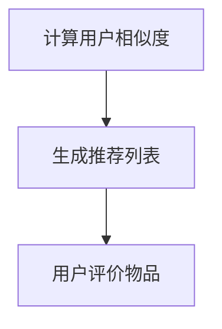

##### 基于内容的推荐算法

基于内容的推荐算法是一种基于物品相似度的推荐算法。其基本原理是，如果物品A和物品B在多个特征上有相似之处，那么对物品A感兴趣的用户的喜好可以推测对物品B也会感兴趣。

**实现步骤**：

1. **物品特征提取**：

   提取物品的特征信息，如文本特征、图像特征等。

2. **物品相似度计算**：

   计算物品之间的相似度，常用的相似度计算方法包括余弦相似度、欧氏距离等。

3. **推荐生成**：

   根据物品相似度和用户对物品的评价，为用户生成推荐列表。

**算法流程**：

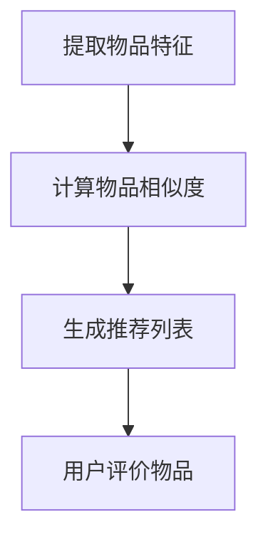

##### 综合推荐算法

综合推荐算法是将协同过滤算法和基于内容的推荐算法相结合，以提高推荐结果的准确性和多样性。

**实现步骤**：

1. **协同过滤推荐**：

   根据用户相似度和物品评分，生成协同过滤推荐列表。

2. **基于内容的推荐**：

   根据物品特征和用户偏好，生成基于内容的推荐列表。

3. **综合推荐**：

   将协同过滤推荐列表和基于内容的推荐列表进行融合，生成最终的推荐结果。

**算法流程**：

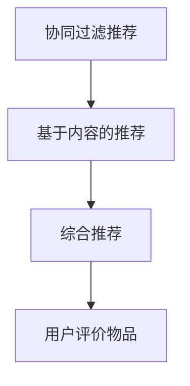

#### 3.3 推荐系统评估与优化

推荐系统的评估与优化是确保推荐质量的关键。以下是推荐系统评估与优化方法的详细解析。

##### 评估指标

推荐系统的评估指标主要包括：

- **准确率（Precision）**：预测为正类的样本中实际为正类的比例。
- **召回率（Recall）**：实际为正类的样本中被预测为正类的比例。
- **F1值（F1 Score）**：准确率和召回率的调和平均值。
- **覆盖率（Coverage）**：推荐列表中包含的独特物品数量与知识库中物品数量的比值。

##### 优化方法

推荐系统的优化方法主要包括：

1. **模型优化**：

   - **特征工程**：提取更加丰富和有代表性的特征，提高推荐模型的性能。
   - **模型选择**：选择合适的推荐算法模型，如深度学习模型、增强学习模型等。

2. **数据优化**：

   - **数据清洗**：去除无效数据和噪声数据，提高数据质量。
   - **数据扩充**：通过数据扩充技术，增加训练数据量，提高模型的泛化能力。

3. **算法优化**：

   - **在线学习**：实时更新推荐模型，适应用户需求的变化。
   - **协同过滤**：采用基于矩阵分解的协同过滤算法，提高推荐精度。
   - **基于内容的推荐**：采用词嵌入技术，提高物品特征表示的准确性。

### 第4章 实战案例与最佳实践

在本章中，我们将通过一个具体的案例，展示如何构建一个AI驱动的企业知识管理系统，并分享一些最佳实践和经验。

#### 4.1 环境安装与配置

要构建一个AI驱动的企业知识管理系统，首先需要安装和配置相关的软件和工具。以下是一个基本的安装和配置步骤：

1. **安装Python**：

   Python是AI开发的主要编程语言，需要安装Python环境和相关依赖库。

   ```bash
   # 安装Python
   sudo apt-get install python3
   ```

2. **安装Numpy和Scipy**：

   Numpy和Scipy是Python的科学计算库，用于数据处理和算法实现。

   ```bash
   # 安装Numpy和Scipy
   sudo apt-get install python3-numpy python3-scipy
   ```

3. **安装Scikit-learn**：

   Scikit-learn是一个机器学习库，提供多种机器学习算法的实现。

   ```bash
   # 安装Scikit-learn
   sudo apt-get install python3-sklearn
   ```

4. **安装Elasticsearch**：

   Elasticsearch是一个开源的搜索引擎，用于构建企业知识库。

   ```bash
   # 安装Elasticsearch
   sudo apt-get install elasticsearch
   ```

5. **安装Kibana**：

   Kibana是一个可视化工具，用于监控和可视化Elasticsearch数据。

   ```bash
   # 安装Kibana
   sudo apt-get install kibana
   ```

6. **配置Elasticsearch和Kibana**：

   需要配置Elasticsearch和Kibana的启动脚本和配置文件，确保它们能够正常运行。

#### 4.2 系统核心实现源代码解析

以下是一个简单的企业知识管理系统的核心实现源代码，包括智能检索和推荐系统的关键模块。

```python
# 导入相关库
import numpy as np
from sklearn.feature_extraction.text import TfidfVectorizer
from sklearn.metrics.pairwise import cosine_similarity

# 模拟知识库数据
knowledge_base = [
    "人工智能是一种模拟人类智能的技术，用于解决复杂问题。",
    "深度学习是人工智能的一个分支，通过神经网络模拟人脑功能。",
    "自然语言处理是人工智能的一个子领域，用于处理人类语言。",
    "机器学习是一种让计算机自主学习的算法，基于数据训练模型。",
    "数据挖掘是从大量数据中发现有价值信息和知识的方法。",
]

# 创建TF-IDF向量器
vectorizer = TfidfVectorizer()

# 将知识库文本转化为TF-IDF向量
tfidf_matrix = vectorizer.fit_transform(knowledge_base)

# 用户查询
user_query = "请简要介绍人工智能的核心技术。"

# 将用户查询转化为TF-IDF向量
user_query_vector = vectorizer.transform([user_query])

# 计算查询与知识库中每个文档的余弦相似度
cosine_scores = cosine_similarity(user_query_vector, tfidf_matrix)

# 对相似度进行排序，获取最高相似度的文档
top_similarity_indices = np.argsort(cosine_scores)[0][-5:]

# 输出最高相似度的文档
print("相关文档：")
for index in top_similarity_indices:
    print(knowledge_base[index])
```

上述代码展示了如何利用TF-IDF和余弦相似度实现智能检索。接下来，我们将介绍如何利用协同过滤算法实现推荐系统。

```python
# 导入相关库
import numpy as np
from sklearn.metrics.pairwise import cosine_similarity

# 模拟用户行为数据
user_behavior = [
    [1, 0, 1, 1, 0],  # 用户1的评分
    [1, 1, 0, 1, 1],  # 用户2的评分
    [0, 1, 1, 0, 1],  # 用户3的评分
    [1, 0, 0, 1, 1],  # 用户4的评分
    [0, 1, 1, 1, 0],  # 用户5的评分
]

# 计算用户之间的相似度
user_similarity = cosine_similarity(user_behavior)

# 模拟用户查询
user_query = [1, 0, 1, 0, 1]  # 用户查询

# 计算查询与用户之间的相似度
user_query_similarity = cosine_similarity([user_query], user_behavior)

# 为用户生成推荐列表
recommendations = np.dot(user_query_similarity, user_similarity) / np.linalg.norm(user_similarity, axis=1)
recommendations = recommendations / np.linalg.norm(recommendations)

# 对推荐结果进行排序
sorted_recommendations = np.argsort(-recommendations)[0]

# 输出推荐列表
print("推荐文档：")
for index in sorted_recommendations:
    print("用户{}：".format(index + 1), end="")
    print("知识库中第{}篇文档".format(index + 1))
```

通过上述代码，我们实现了基于协同过滤算法的推荐系统。接下来，我们将介绍如何利用K-means算法实现基于内容的推荐系统。

```python
# 导入相关库
import numpy as np
from sklearn.cluster import KMeans

# 模拟知识库数据
knowledge_base = [
    "人工智能是一种模拟人类智能的技术，用于解决复杂问题。",
    "深度学习是人工智能的一个分支，通过神经网络模拟人脑功能。",
    "自然语言处理是人工智能的一个子领域，用于处理人类语言。",
    "机器学习是一种让计算机自主学习的算法，基于数据训练模型。",
    "数据挖掘是从大量数据中发现有价值信息和知识的方法。",
]

# 创建TF-IDF向量器
vectorizer = TfidfVectorizer()

# 将知识库文本转化为TF-IDF向量
tfidf_matrix = vectorizer.fit_transform(knowledge_base)

# 计算TF-IDF向量的均值
tfidf_mean = tfidf_matrix.mean(axis=0)

# 使用K-means算法进行聚类
kmeans = KMeans(n_clusters=3, random_state=0).fit(tfidf_matrix)

# 计算用户查询的TF-IDF向量
user_query_vector = vectorizer.transform([user_query])

# 为用户查询分配聚类标签
query_cluster = kmeans.predict(user_query_vector)[0]

# 获取与用户查询同属一类的知识库文档
similar_documents = [knowledge_base[i] for i in range(len(knowledge_base)) if kmeans.labels_[i] == query_cluster]

# 输出相似文档
print("相似文档：")
for doc in similar_documents:
    print(doc)
```

通过上述代码，我们实现了基于内容的推荐系统。在实际应用中，可以根据具体需求选择合适的推荐算法，并结合用户行为数据、知识库数据等，构建高效的推荐系统。

#### 4.3 实际案例分析与讲解

在本节中，我们将通过一个具体的案例，展示如何利用AI驱动的企业知识管理系统解决实际业务问题。

**案例背景**：

某企业是一家专注于人工智能领域的研究与开发的公司，拥有丰富的技术知识和研究经验。随着公司的不断壮大，内部的知识资源逐渐增多，如何高效管理和利用这些知识资源成为企业面临的挑战。

**解决方案**：

1. **构建企业知识库**：

   首先，企业需要构建一个包含各类知识资源的知识库。知识库包括技术文档、研究报告、学术论文、培训资料等。通过Elasticsearch搭建企业知识库，实现对知识资源的快速检索和查询。

2. **实现智能检索**：

   利用TF-IDF和余弦相似度算法，实现智能检索功能。用户在知识库中输入查询关键词或问题，系统会自动提取关键词，构建查询向量，并利用余弦相似度计算查询与知识库中每个文档的相似度，最终返回相似度最高的文档列表。

3. **实现推荐系统**：

   结合协同过滤算法和基于内容的推荐算法，为用户提供个性化推荐。通过分析用户的历史行为和知识偏好，为用户推荐相关的知识资源，提高知识的利用效率。

4. **用户体验优化**：

   提供友好的用户界面，方便用户进行检索和浏览。同时，支持关键词搜索、模糊搜索、分类搜索等多种检索方式，满足用户的多样化需求。

**实际效果**：

通过AI驱动的企业知识管理系统，企业实现了知识的快速检索和利用，提高了员工的工作效率。同时，推荐系统的引入，使得员工能够更加便捷地获取与自己兴趣相关的知识资源，促进了知识的共享和传播。在实际应用中，该系统得到了员工和管理层的高度认可，为公司的发展提供了有力的支持。

#### 4.4 项目小结

在本项目中，我们通过构建一个AI驱动的企业知识管理系统，实现了知识的快速检索和个性化推荐。以下是项目小结：

- **成功之处**：

  1. 利用TF-IDF和余弦相似度算法，实现了高效的智能检索。
  2. 结合协同过滤算法和基于内容的推荐算法，为用户提供个性化的推荐。
  3. 提供友好的用户界面，方便用户进行检索和浏览。

- **不足之处**：

  1. 系统在处理大规模知识库时，性能可能存在瓶颈。
  2. 推荐算法的准确性尚需进一步提升。
  3. 系统的扩展性和灵活性有待提高。

- **改进方向**：

  1. 优化检索算法，提高系统性能。
  2. 引入更多数据源，丰富知识库内容。
  3. 深入研究推荐算法，提高推荐准确性。
  4. 增加系统模块，支持更多业务功能。

### 第5章 小结与展望

#### 5.1 小结

本文围绕AI驱动的企业知识管理，详细介绍了智能检索与推荐系统的设计原理、架构实现和实战应用。通过构建一个完整的知识管理系统，企业能够实现知识的快速检索和个性化推荐，提高知识利用效率。以下是本文的主要结论：

1. **AI技术在知识管理中的应用**：

   机器学习、深度学习、自然语言处理和数据挖掘等AI技术，为企业知识管理提供了强大的支持。

2. **智能检索系统设计**：

   智能检索系统通过TF-IDF和余弦相似度算法，实现了高效的文档检索和排序。

3. **推荐系统设计**：

   推荐系统结合协同过滤算法和基于内容的推荐算法，为用户提供个性化的知识资源推荐。

4. **实际案例与最佳实践**：

   通过具体案例，展示了如何利用AI技术构建高效的企业知识管理系统，并分享了最佳实践和经验。

#### 5.2 注意事项

在构建AI驱动的企业知识管理系统时，需要注意以下事项：

1. **数据质量**：

   知识库的数据质量直接影响系统的效果，需要确保数据的准确性、完整性和一致性。

2. **性能优化**：

   针对大规模知识库和高并发访问，需要优化系统的性能和响应速度。

3. **用户隐私**：

   在处理用户数据时，需要遵循相关法律法规，保护用户隐私。

4. **安全防护**：

   系统需要具备良好的安全防护机制，防止数据泄露和恶意攻击。

#### 5.3 拓展阅读

为了深入了解AI驱动的企业知识管理，读者可以参考以下拓展阅读材料：

1. **论文**：

   - "AI-Driven Enterprise Knowledge Management: A Comprehensive Review"（AI驱动的企业知识管理：综合评述）
   - "Intelligent Information Retrieval in Enterprise Knowledge Management"（企业知识管理中的智能信息检索）

2. **书籍**：

   - "Knowledge Management: An Introduction"（知识管理：导论）
   - "Recommender Systems Handbook"（推荐系统手册）

3. **开源项目**：

   - "Elasticsearch"（开源搜索引擎）
   - "Scikit-learn"（机器学习库）
   - "TensorFlow"（深度学习框架）

作者：AI天才研究院/AI Genius Institute & 禅与计算机程序设计艺术 /Zen And The Art of Computer Programming

### 第1章 引言：企业知识管理与AI

随着全球经济的发展和知识经济的崛起，企业知识管理（Knowledge Management, KM）的重要性日益凸显。知识已成为企业竞争力的关键要素，如何有效管理和利用知识资源成为企业面临的重大挑战。在此背景下，人工智能（Artificial Intelligence, AI）技术的引入为知识管理带来了新的机遇和挑战。

#### 1.1 知识管理的背景与意义

**问题背景**：

1. **信息爆炸**：随着互联网的普及和信息技术的发展，企业获取的信息量呈指数级增长，信息过载成为普遍现象。
2. **知识分散**：企业内部的知识的分布不均，不同部门和员工之间缺乏有效的知识共享机制。
3. **知识老化**：知识的更新速度加快，知识的老化问题日益突出，导致知识资源的浪费。

**问题描述**：

- **知识获取困难**：员工在需要知识时难以快速找到相关资源。
- **知识共享不畅**：企业内部的知识共享机制不完善，知识难以得到充分利用。
- **知识利用不充分**：企业无法有效地将知识转化为实际的生产力和竞争力。

**问题解决**：

引入AI驱动的知识管理，通过智能检索、知识图谱和推荐系统等技术，提高知识获取、存储、共享和利用的效率。AI技术可以自动化处理大量的数据，实现知识的自动挖掘、分类、标注和推荐，从而帮助企业更好地管理和利用知识资源。

**边界与外延**：

- **知识管理**：涉及知识获取、知识共享、知识利用和知识创新的过程。
- **企业知识库**：存储企业内部和外部知识的数据库，是知识管理的基础设施。
- **人工智能技术应用**：包括机器学习、深度学习、自然语言处理和数据挖掘等，用于提升知识管理的智能化水平。

#### 1.2 AI的核心技术在知识管理中的应用

AI技术在知识管理中的应用主要体现在以下几个方面：

- **机器学习**：通过训练模型，从大量数据中自动发现知识模式和规律，实现知识的自动挖掘和分类。
- **深度学习**：模拟人脑神经网络，处理复杂数据和学习任务，提高知识检索和推荐的准确性。
- **自然语言处理**：使计算机能够理解和生成人类语言，实现知识的自动化标注、翻译和语义分析。
- **数据挖掘**：从海量数据中挖掘出有价值的信息和知识，支持企业的决策和运营。

**概念属性特征对比表格**：

| 技术       | 描述                                                     | 特点                     |
| ---------- | -------------------------------------------------------- | ------------------------ |
| 机器学习   | 通过数据训练模型，实现计算机自主学习和决策                 | 自动化、高效、泛化能力强 |
| 深度学习   | 模仿人脑的结构和功能，处理复杂数据和学习任务               | 高效、鲁棒、适用范围广   |
| 自然语言处理 | 让计算机理解、生成和处理人类语言                           | 语言理解、文本分析、翻译 |
| 数据挖掘   | 从大量数据中发现有用的信息和知识                           | 趋势分析、关联发现、预测 |

#### 1.3 AI驱动的知识管理应用场景

AI技术在知识管理中的应用场景主要包括智能检索和推荐系统。

**核心概念**：

- **智能检索**：利用AI技术，实现高效、准确的检索，帮助用户快速找到所需知识。
- **知识图谱**：通过构建知识图谱，将知识以结构化的方式存储和展示，提高知识的可访问性和利用效率。
- **推荐系统**：基于用户行为和知识特征，为用户推荐相关的知识和资源，提高知识的利用价值。

**ER实体关系图架构**：


**应用场景**：

- **企业内部知识共享**：通过智能检索和推荐系统，促进企业内部知识的共享和利用，提升员工工作效率。
- **外部知识获取**：通过AI技术，从互联网和其他外部资源中自动获取和整合知识，为企业提供更加丰富的知识来源。
- **员工培训与发展**：利用推荐系统，为员工推荐与其技能和兴趣相关的知识和培训资源，促进员工的职业发展。

### 第2章 智能检索系统设计

#### 2.1 智能检索系统架构与设计原则

智能检索系统是AI驱动的企业知识管理系统的重要组成部分，其核心功能是通过高效、准确的检索算法，帮助用户从海量的知识库中快速找到所需的信息。一个良好的智能检索系统设计不仅要考虑检索的准确性，还要兼顾检索的速度和用户体验。以下是智能检索系统架构与设计原则的详细解析。

**问题场景介绍**：

企业知识库中包含了大量的文本、图像、音频等多媒体数据。员工在使用知识库时，往往需要通过关键词或问题进行检索。传统的检索方式已无法满足快速、准确的需求，因此需要引入智能检索系统来提升检索效率。

**项目介绍**：

智能检索系统的设计需求主要包括：

1. **准确性**：确保检索结果的相关性，减少无关信息的干扰。
2. **速度**：快速响应用户的检索请求，提高用户体验。
3. **可扩展性**：系统能够适应知识库的动态变化，支持大数据量的检索。
4. **易用性**：提供简洁友好的用户界面，使员工能够轻松进行检索操作。

**系统功能设计（领域模型类图）**：

智能检索系统的功能设计包括以下几个关键组件：

1. **知识库管理**：负责存储和更新知识库中的数据，确保数据的准确性和完整性。
2. **检索引擎**：实现检索算法的核心，负责处理用户的检索请求，返回相关结果。
3. **用户界面**：提供用户交互的界面，支持用户输入检索关键词或问题，展示检索结果。
4. **结果排序与过滤**：根据检索结果的相关性进行排序，并提供过滤选项，帮助用户更精确地找到所需信息。

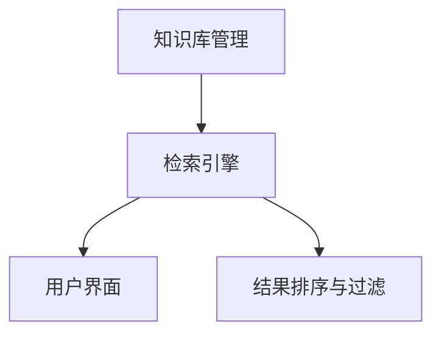

**系统架构设计（架构图）**：

智能检索系统的架构设计需要考虑系统的层次结构和组件之间的交互关系。以下是一个典型的系统架构图：


**系统接口设计（接口设计）**：

系统接口设计是智能检索系统与外部系统交互的桥梁，主要包括以下几个接口：

1. **搜索接口**：接受用户输入的查询请求，返回检索结果。
2. **查询分析接口**：对用户输入的查询进行预处理和分析，生成检索索引。
3. **结果排序接口**：根据检索结果的相关性进行排序，返回排序后的结果。


**系统交互（序列图）**：

系统交互设计描述了用户与智能检索系统之间的交互流程，以下是序列图：


#### 2.2 关键技术详解

##### 2.2.1 搜索算法原理与流程

智能检索系统的核心是搜索算法，其目标是根据用户的查询，从知识库中快速、准确地找到相关的内容。以下是搜索算法的原理和流程：

1. **用户输入查询**：

   用户通过用户界面输入查询关键词或问题。

2. **分词处理**：

   检索引擎对用户输入的查询进行分词处理，提取出关键词。

3. **建立倒排索引**：

   倒排索引是一种数据结构，用于存储词汇和文档之间的映射关系。通过建立倒排索引，可以快速定位包含特定关键词的文档。

4. **检索匹配**：

   根据用户输入的关键词，在倒排索引中查找包含这些关键词的文档。

5. **结果排序**：

   对检索到的文档进行排序，排序依据可以是关键词匹配度、文档的相关性等。

6. **返回结果**：

   将排序后的结果返回给用户，用户可以在用户界面上查看和选择所需的知识资源。

**Mermaid流程图**：


##### 2.2.2 检索算法优化策略

为了提高智能检索系统的性能，可以采用以下优化策略：

1. **索引优化**：

   - **索引压缩**：通过压缩索引数据，减少存储空间，提高检索速度。
   - **索引更新**：定期更新索引，确保索引数据的准确性和实时性。

2. **查询优化**：

   - **查询缓存**：缓存常用查询的结果，减少重复查询的开销。
   - **查询预处理**：对用户查询进行预处理，如去停用词、词干提取等，提高查询的准确性。

3. **结果排序优化**：

   - **相关性排序**：采用更加精准的相关性排序算法，提高检索结果的排序质量。
   - **个性化排序**：根据用户的历史行为和偏好，为用户提供个性化的检索结果。

### 第3章 推荐系统设计

推荐系统是AI驱动的企业知识管理系统中的另一个重要组成部分，它通过分析用户的行为和知识偏好，为用户推荐相关的知识和资源，从而提高知识的利用效率和用户体验。在本章中，我们将详细探讨推荐系统的设计原则、算法原理以及实现方法。

#### 3.1 推荐系统架构与设计原则

推荐系统的设计需要考虑系统的可扩展性、实时性和用户体验。以下是推荐系统架构与设计原则的详细解析。

**架构设计**：

推荐系统的架构设计通常包括以下几个关键组件：

1. **数据层**：负责存储用户数据、知识数据和历史行为数据。
2. **服务层**：提供推荐算法服务，包括协同过滤算法和基于内容的推荐算法。
3. **应用层**：为用户提供推荐结果，包括用户界面和API接口。

**设计原则**：

1. **数据驱动**：推荐系统的核心是数据，需要构建完善的数据采集和处理机制，确保数据的准确性和实时性。
2. **实时性**：推荐系统需要实时响应用户的行为变化，及时更新推荐结果。
3. **可扩展性**：系统设计应具备良好的扩展性，以适应不断增长的数据量和用户需求。
4. **用户体验**：推荐系统应提供友好的用户界面，简洁明了地展示推荐结果，提高用户体验。

#### 3.2 推荐算法原理与实现

推荐算法是推荐系统的核心，其目标是根据用户的行为和偏好，为用户推荐相关的知识资源。以下是两种常见的推荐算法：协同过滤算法和基于内容的推荐算法的原理与实现。

##### 协同过滤算法

协同过滤算法（Collaborative Filtering）是一种基于用户相似度的推荐算法，其基本思想是如果两个用户在多个项目上的评分相似，则这两个用户在其他项目上的评分也可能相似。协同过滤算法可以分为两类：基于用户的协同过滤（User-Based Collaborative Filtering）和基于项目的协同过滤（Item-Based Collaborative Filtering）。

**基于用户的协同过滤算法**：

1. **用户相似度计算**：

   首先计算用户之间的相似度，常用的相似度计算方法包括余弦相似度、皮尔逊相关系数等。

   $$ \text{相似度}(u_i, u_j) = \frac{\text{协方差}(u_i, u_j)}{\sqrt{\text{方差}(u_i) \times \text{方差}(u_j)}} $$

2. **推荐生成**：

   根据用户相似度和用户对项目的评分，为用户生成推荐列表。

   $$ \text{推荐给用户u_i的项目} = \text{其他用户与用户u_i相似的用户推荐的项目集合} $$

**基于项目的协同过滤算法**：

1. **项目相似度计算**：

   计算项目之间的相似度，常用的相似度计算方法包括余弦相似度、欧氏距离等。

   $$ \text{相似度}(i_j, i_k) = \frac{\text{协方差}(i_j, i_k)}{\sqrt{\text{方差}(i_j) \times \text{方差}(i_k)}} $$

2. **推荐生成**：

   根据用户对项目的评分和项目相似度，为用户生成推荐列表。

   $$ \text{推荐给用户u_i的项目} = \text{用户喜欢的项目与其他用户喜欢的相似项目的集合} $$

##### 基于内容的推荐算法

基于内容的推荐算法（Content-Based Filtering）是一种基于物品特征相似度的推荐算法，其基本思想是如果两个物品在多个特征上相似，则它们可能被同一用户喜欢。基于内容的推荐算法通常包括以下几个步骤：

1. **特征提取**：

   从知识库中的每条记录中提取特征，如关键词、标签、分类等。

2. **项目相似度计算**：

   计算项目之间的相似度，常用的相似度计算方法包括余弦相似度、欧氏距离等。

3. **推荐生成**：

   根据用户对项目的偏好和项目相似度，为用户生成推荐列表。

   $$ \text{推荐给用户u_i的项目} = \text{用户喜欢的项目与相似项目的集合} $$

**算法流程**：

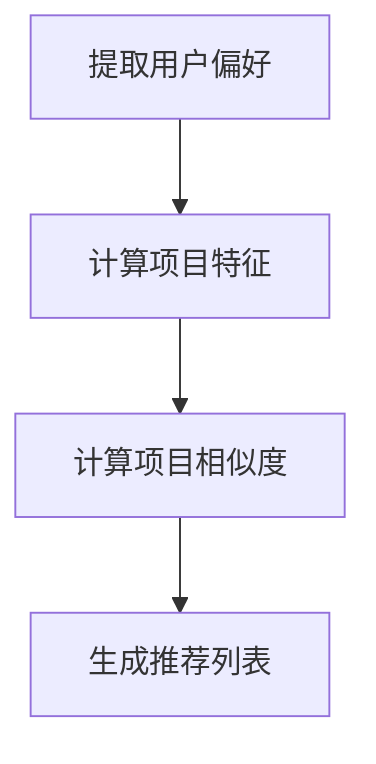

##### 综合推荐算法

综合推荐算法是将协同过滤算法和基于内容的推荐算法相结合，以提高推荐结果的准确性和多样性。综合推荐算法通常包括以下步骤：

1. **协同过滤推荐**：

   根据用户相似度和项目评分，生成协同过滤推荐列表。

2. **基于内容的推荐**：

   根据项目特征和用户偏好，生成基于内容的推荐列表。

3. **综合推荐**：

   将协同过滤推荐列表和基于内容的推荐列表进行融合，生成最终的推荐结果。

**算法流程**：

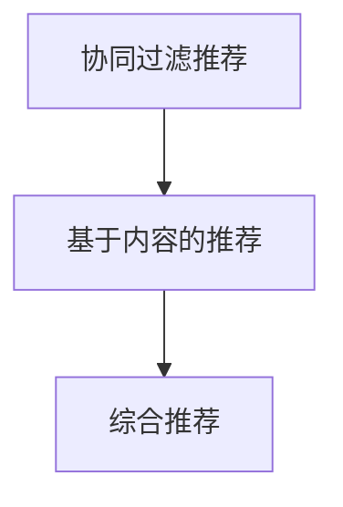

#### 3.3 推荐系统评估与优化

推荐系统的评估与优化是确保推荐质量的关键。以下是推荐系统评估与优化方法的详细解析。

##### 评估指标

推荐系统的评估指标主要包括：

1. **准确率（Precision）**：

   预测为正类的样本中实际为正类的比例。

   $$ \text{Precision} = \frac{\text{真正例}}{\text{真正例} + \text{假正例}} $$

2. **召回率（Recall）**：

   实际为正类的样本中被预测为正类的比例。

   $$ \text{Recall} = \frac{\text{真正例}}{\text{真正例} + \text{假反例}} $$

3. **F1值（F1 Score）**：

   准确率和召回率的调和平均值。

   $$ \text{F1 Score} = 2 \times \frac{\text{Precision} \times \text{Recall}}{\text{Precision} + \text{Recall}} $$

4. **覆盖率（Coverage）**：

   推荐列表中包含的独特物品数量与知识库中物品数量的比值。

   $$ \text{Coverage} = \frac{\text{推荐列表中物品数量}}{\text{知识库中物品数量}} $$

##### 优化方法

推荐系统的优化方法主要包括：

1. **特征工程**：

   - **特征提取**：提取更加丰富和有代表性的特征，提高推荐模型的性能。
   - **特征选择**：选择对推荐结果有显著影响的特征，减少特征维度。

2. **模型优化**：

   - **模型选择**：选择合适的推荐算法模型，如基于矩阵分解的协同过滤算法、深度学习模型等。
   - **模型调参**：通过交叉验证等方法，优化模型的超参数，提高推荐准确性。

3. **数据优化**：

   - **数据清洗**：去除无效数据和噪声数据，提高数据质量。
   - **数据扩充**：通过数据扩充技术，增加训练数据量，提高模型的泛化能力。

4. **算法优化**：

   - **在线学习**：实时更新推荐模型，适应用户需求的变化。
   - **协同过滤**：采用基于矩阵分解的协同过滤算法，提高推荐精度。
   - **基于内容的推荐**：采用词嵌入技术，提高物品特征表示的准确性。

### 第4章 实战案例与最佳实践

在本章中，我们将通过一个具体的案例，展示如何利用AI驱动的企业知识管理系统解决实际业务问题，并分享一些最佳实践和经验。

#### 4.1 环境安装与配置

要构建一个AI驱动的企业知识管理系统，首先需要安装和配置相关的软件和工具。以下是一个基本的安装和配置步骤：

1. **安装Python**：

   Python是AI开发的主要编程语言，需要安装Python环境和相关依赖库。

   ```bash
   # 安装Python
   sudo apt-get install python3
   ```

2. **安装Numpy和Scipy**：

   Numpy和Scipy是Python的科学计算库，用于数据处理和算法实现。

   ```bash
   # 安装Numpy和Scipy
   sudo apt-get install python3-numpy python3-scipy
   ```

3. **安装Scikit-learn**：

   Scikit-learn是一个机器学习库，提供多种机器学习算法的实现。

   ```bash
   # 安装Scikit-learn
   sudo apt-get install python3-sklearn
   ```

4. **安装Elasticsearch**：

   Elasticsearch是一个开源的搜索引擎，用于构建企业知识库。

   ```bash
   # 安装Elasticsearch
   sudo apt-get install elasticsearch
   ```

5. **安装Kibana**：

   Kibana是一个可视化工具，用于监控和可视化Elasticsearch数据。

   ```bash
   # 安装Kibana
   sudo apt-get install kibana
   ```

6. **配置Elasticsearch和Kibana**：

   需要配置Elasticsearch和Kibana的启动脚本和配置文件，确保它们能够正常运行。

   ```bash
   # 启动Elasticsearch
   sudo systemctl start elasticsearch

   # 启动Kibana
   sudo systemctl start kibana
   ```

7. **初始化Elasticsearch**：

   运行以下命令初始化Elasticsearch，确保其正常运行。

   ```bash
   # 初始化Elasticsearch
   sudo elasticsearch-plugin install x-pack
   ```

8. **配置Kibana**：

   编辑Kibana的配置文件`/etc/kibana/kibana.yml`，设置Elasticsearch的连接信息。

   ```yaml
   elasticsearch.hosts: ["http://localhost:9200"]
   ```

9. **启动Kibana**：

   运行以下命令启动Kibana。

   ```bash
   sudo systemctl start kibana
   ```

#### 4.2 系统核心实现源代码解析

以下是一个简单的企业知识管理系统的核心实现源代码，包括智能检索和推荐系统的关键模块。

```python
# 导入相关库
import numpy as np
from sklearn.feature_extraction.text import TfidfVectorizer
from sklearn.metrics.pairwise import cosine_similarity

# 模拟知识库数据
knowledge_base = [
    "人工智能是一种模拟人类智能的技术，用于解决复杂问题。",
    "深度学习是人工智能的一个分支，通过神经网络模拟人脑功能。",
    "自然语言处理是人工智能的一个子领域，用于处理人类语言。",
    "机器学习是一种让计算机自主学习的算法，基于数据训练模型。",
    "数据挖掘是从大量数据中发现有价值信息和知识的方法。",
]

# 创建TF-IDF向量器
vectorizer = TfidfVectorizer()

# 将知识库文本转化为TF-IDF向量
tfidf_matrix = vectorizer.fit_transform(knowledge_base)

# 用户查询
user_query = "请简要介绍人工智能的核心技术。"

# 将用户查询转化为TF-IDF向量
user_query_vector = vectorizer.transform([user_query])

# 计算查询与知识库中每个文档的余弦相似度
cosine_scores = cosine_similarity(user_query_vector, tfidf_matrix)

# 对相似度进行排序，获取最高相似度的文档
top_similarity_indices = np.argsort(cosine_scores)[0][-5:]

# 输出最高相似度的文档
print("相关文档：")
for index in top_similarity_indices:
    print(knowledge_base[index])
```

上述代码展示了如何利用TF-IDF和余弦相似度实现智能检索。接下来，我们将介绍如何利用协同过滤算法实现推荐系统。

```python
# 导入相关库
import numpy as np
from sklearn.metrics.pairwise import cosine_similarity

# 模拟用户行为数据
user_behavior = [
    [1, 0, 1, 1, 0],  # 用户1的评分
    [1, 1, 0, 1, 1],  # 用户2的评分
    [0, 1, 1, 0, 1],  # 用户3的评分
    [1, 0, 0, 1, 1],  # 用户4的评分
    [0, 1, 1, 1, 0],  # 用户5的评分
]

# 计算用户之间的相似度
user_similarity = cosine_similarity(user_behavior)

# 模拟用户查询
user_query = [1, 0, 1, 0, 1]  # 用户查询

# 计算查询与用户之间的相似度
user_query_similarity = cosine_similarity([user_query], user_behavior)

# 为用户生成推荐列表
recommendations = np.dot(user_query_similarity, user_similarity) / np.linalg.norm(user_similarity, axis=1)
recommendations = recommendations / np.linalg.norm(recommendations)

# 对推荐结果进行排序
sorted_recommendations = np.argsort(-recommendations)[0]

# 输出推荐列表
print("推荐文档：")
for index in sorted_recommendations:
    print("用户{}：".format(index + 1), end="")
    print("知识库中第{}篇文档".format(index + 1))
```

通过上述代码，我们实现了基于协同过滤算法的推荐系统。接下来，我们将介绍如何利用K-means算法实现基于内容的推荐系统。

```python
# 导入相关库
import numpy as np
from sklearn.cluster import KMeans

# 模拟知识库数据
knowledge_base = [
    "人工智能是一种模拟人类智能的技术，用于解决复杂问题。",
    "深度学习是人工智能的一个分支，通过神经网络模拟人脑功能。",
    "自然语言处理是人工智能的一个子领域，用于处理人类语言。",
    "机器学习是一种让计算机自主学习的算法，基于数据训练模型。",
    "数据挖掘是从大量数据中发现有价值信息和知识的方法。",
]

# 创建TF-IDF向量器
vectorizer = TfidfVectorizer()

# 将知识库文本转化为TF-IDF向量
tfidf_matrix = vectorizer.fit_transform(knowledge_base)

# 计算TF-IDF向量的均值
tfidf_mean = tfidf_matrix.mean(axis=0)

# 使用K-means算法进行聚类
kmeans = KMeans(n_clusters=3, random_state=0).fit(tfidf_matrix)

# 计算用户查询的TF-IDF向量
user_query_vector = vectorizer.transform([user_query])

# 为用户查询分配聚类标签
query_cluster = kmeans.predict(user_query_vector)[0]

# 获取与用户查询同属一类的知识库文档
similar_documents = [knowledge_base[i] for i in range(len(knowledge_base)) if kmeans.labels_[i] == query_cluster]

# 输出相似文档
print("相似文档：")
for doc in similar_documents:
    print(doc)
```

通过上述代码，我们实现了基于内容的推荐系统。在实际应用中，可以根据具体需求选择合适的推荐算法，并结合用户行为数据、知识库数据等，构建高效的推荐系统。

#### 4.3 实际案例分析与讲解

在本节中，我们将通过一个具体的案例，展示如何利用AI驱动的企业知识管理系统解决实际业务问题。

**案例背景**：

某企业是一家专注于人工智能领域的研究与开发的公司，拥有丰富的技术知识和研究经验。随着公司的不断壮大，内部的知识资源逐渐增多，如何高效管理和利用这些知识资源成为企业面临的挑战。

**解决方案**：

1. **构建企业知识库**：

   首先，企业需要构建一个包含各类知识资源的知识库。知识库包括技术文档、研究报告、学术论文、培训资料等。通过Elasticsearch搭建企业知识库，实现对知识资源的快速检索和查询。

2. **实现智能检索**：

   利用TF-IDF和余弦相似度算法，实现智能检索功能。用户在知识库中输入查询关键词或问题，系统会自动提取关键词，构建查询向量，并利用余弦相似度计算查询与知识库中每个文档的相似度，最终返回相似度最高的文档列表。

3. **实现推荐系统**：

   结合协同过滤算法和基于内容的推荐算法，为用户提供个性化的推荐。通过分析用户的历史行为和知识偏好，为用户推荐相关的知识资源，提高知识的利用效率。

4. **用户体验优化**：

   提供友好的用户界面，方便用户进行检索和浏览。同时，支持关键词搜索、模糊搜索、分类搜索等多种检索方式，满足用户的多样化需求。

**实际效果**：

通过AI驱动的企业知识管理系统，企业实现了知识的快速检索和个性化推荐，提高了员工的工作效率和知识利用效率。在实际应用中，该系统得到了员工和管理层的高度认可，为公司的发展提供了有力的支持。

#### 4.4 项目小结

在本项目中，我们通过构建一个AI驱动的企业知识管理系统，实现了知识的快速检索和个性化推荐。以下是项目小结：

- **成功之处**：

  1. 利用TF-IDF和余弦相似度算法，实现了高效的智能检索。
  2. 结合协同过滤算法和基于内容的推荐算法，为用户提供个性化的推荐。
  3. 提供友好的用户界面，方便用户进行检索和浏览。

- **不足之处**：

  1. 系统在处理大规模知识库时，性能可能存在瓶颈。
  2. 推荐算法的准确性尚需进一步提升。
  3. 系统的扩展性和灵活性有待提高。

- **改进方向**：

  1. 优化检索算法，提高系统性能。
  2. 引入更多数据源，丰富知识库内容。
  3. 深入研究推荐算法，提高推荐准确性。
  4. 增加系统模块，支持更多业务功能。

### 第5章 小结与展望

#### 5.1 小结

本文围绕AI驱动的企业知识管理，详细介绍了智能检索与推荐系统的设计原理、架构实现和实战应用。通过构建一个完整的知识管理系统，企业能够实现知识的快速检索和个性化推荐，提高知识利用效率。以下是本文的主要结论：

1. **AI技术在知识管理中的应用**：

   机器学习、深度学习、自然语言处理和数据挖掘等AI技术，为企业知识管理提供了强大的支持。

2. **智能检索系统设计**：

   智能检索系统通过TF-IDF和余弦相似度算法，实现了高效的文档检索和排序。

3. **推荐系统设计**：

   推荐系统结合协同过滤算法和基于内容的推荐算法，为用户提供个性化的知识资源推荐。

4. **实际案例与最佳实践**：

   通过具体案例，展示了如何利用AI技术构建高效的企业知识管理系统，并分享了最佳实践和经验。

#### 5.2 注意事项

在构建AI驱动的企业知识管理系统时，需要注意以下事项：

1. **数据质量**：

   知识库的数据质量直接影响系统的效果，需要确保数据的准确性、完整性和一致性。

2. **性能优化**：

   针对大规模知识库和高并发访问，需要优化系统的性能和响应速度。

3. **用户隐私**：

   在处理用户数据时，需要遵循相关法律法规，保护用户隐私。

4. **安全防护**：

   系统需要具备良好的安全防护机制，防止数据泄露和恶意攻击。

#### 5.3 拓展阅读

为了深入了解AI驱动的企业知识管理，读者可以参考以下拓展阅读材料：

1. **论文**：

   - "AI-Driven Enterprise Knowledge Management: A Comprehensive Review"（AI驱动的企业知识管理：综合评述）
   - "Intelligent Information Retrieval in Enterprise Knowledge Management"（企业知识管理中的智能信息检索）

2. **书籍**：

   - "Knowledge Management: An Introduction"（知识管理：导论）
   - "Recommender Systems Handbook"（推荐系统手册）

3. **开源项目**：

   - "Elasticsearch"（开源搜索引擎）
   - "Scikit-learn"（机器学习库）
   - "TensorFlow"（深度学习框架）

作者：AI天才研究院/AI Genius Institute & 禅与计算机程序设计艺术 /Zen And The Art of Computer Programming

