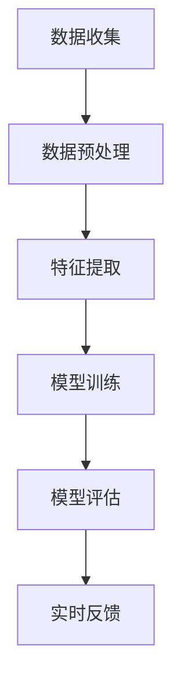
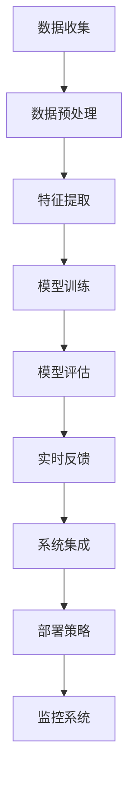
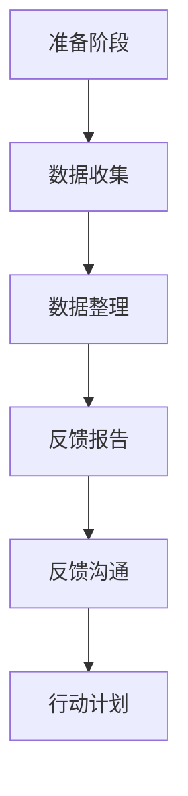
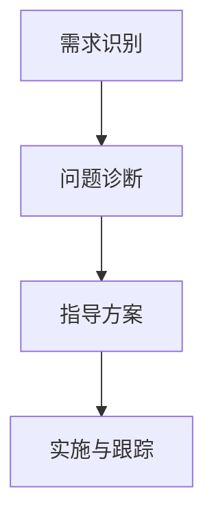
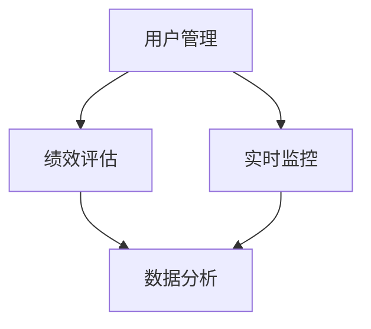
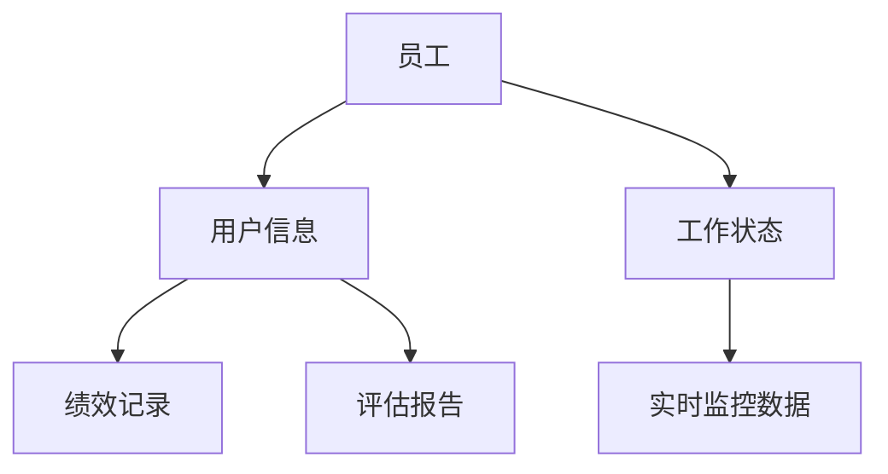
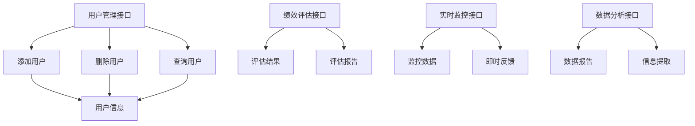
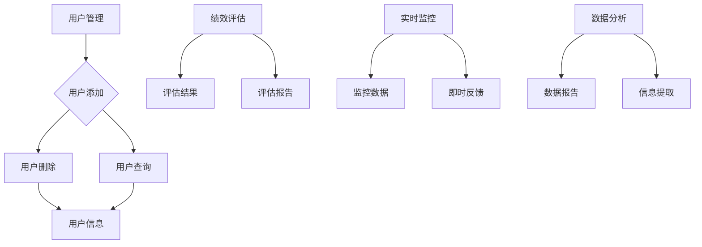

                 

### 引言

#### 1.1 问题背景

在现代企业运营中，绩效管理已成为一个关键的战略工具，用于确保员工表现与公司目标一致，提升整体组织效能。然而，随着企业规模的扩大和市场竞争的加剧，传统的绩效管理方式逐渐暴露出诸多不足。首先，传统绩效管理往往依赖于定期的评估和反馈，这种方式不仅周期较长，而且容易忽略员工的实时动态。其次，传统的评估方法通常局限于上级对下级的评价，缺乏多角度、全方位的反馈机制，可能导致员工发展中的盲点。再者，传统的绩效管理流程复杂，涉及大量的手工操作和数据录入，不仅效率低下，还容易引入人为误差。

面对这些问题，企业需要一种更加智能和高效的绩效管理解决方案。近年来，人工智能（AI）技术的发展为这一需求提供了新的可能性。AI驱动的企业绩效管理可以通过实时数据分析和智能化反馈，提供更加个性化和精准的绩效评估，从而帮助企业更好地识别和发展员工潜力。

#### 1.2 目标与内容概述

本文旨在探讨AI驱动的企业绩效管理的应用，重点关注360度反馈与实时coaching的智能化。文章将首先介绍AI驱动的企业绩效管理的核心概念和技术原理，然后深入探讨360度反馈的概念、流程、优势与挑战，以及实时coaching的定义、方法与实践。接下来，我们将分析智能化技术在企业绩效管理中的具体应用，并通过实际项目案例展示这些技术的实现与效果。最后，文章将总结核心观点，并展望未来企业绩效管理的发展趋势。

### 核心概念与联系

#### 2.1 AI驱动的企业绩效管理

**概念定义：**  
AI驱动的企业绩效管理是指利用人工智能技术对员工的工作表现进行实时监控、评估和反馈，从而优化绩效管理流程，提高管理效率和员工绩效。这种管理方式不仅依赖于传统的绩效指标，还结合了大量的非结构化数据，如员工行为、沟通记录、工作环境等，通过机器学习算法进行分析，提供个性化的绩效改进建议。

**特性：**  
- **实时性：** AI能够快速处理和分析大量数据，提供即时的绩效反馈。
- **全面性：** AI驱动的绩效管理可以从多个维度（如工作质量、工作效率、团队协作等）对员工进行评估。
- **个性化：** AI可以根据员工的特点和需求，提供个性化的绩效改进方案。
- **自动化：** AI技术可以自动化大量的绩效评估工作，减少人工干预。

**与其他概念的关联：**  
- **绩效管理：** AI驱动的企业绩效管理是对传统绩效管理的一种补充和升级，利用AI技术优化绩效评估和反馈流程。
- **大数据：** AI驱动的绩效管理依赖于大数据技术，通过收集和分析员工的各类数据，提供更为精准的评估。
- **机器学习：** 机器学习算法是AI驱动的绩效管理的关键，用于从数据中提取有价值的信息，进行预测和决策。

#### 2.2 360度反馈

**概念定义：**  
360度反馈是一种全方位的绩效评估方法，通过收集来自员工、同事、上级、下属和其他相关者的反馈，为员工提供一个全面的视角，帮助他们了解自己的工作表现和职业发展。

**特性：**  
- **多角度：** 360度反馈涵盖了多个视角，从不同维度对员工进行评估。
- **匿名性：** 为了保证反馈的客观性，360度反馈通常采用匿名形式。
- **互动性：** 360度反馈不仅是一种评估工具，更是一种沟通和改进的机制，有助于员工与管理层之间的双向交流。

**与其他概念的关联：**  
- **绩效管理：** 360度反馈是绩效管理中的一个重要环节，通过提供多角度的反馈，帮助员工了解自己的优势和改进空间。
- **反馈机制：** 360度反馈作为一种反馈机制，能够促进员工的自我反思和持续改进。
- **员工发展：** 360度反馈有助于员工识别自己的职业发展路径，提升个人能力。

#### 2.3 实时coaching

**概念定义：**  
实时coaching是一种动态的管理方法，通过实时监控和指导，帮助员工在工作和职业生涯中不断进步。它侧重于解决具体问题，提供即时的反馈和指导，帮助员工提升绩效。

**特性：**  
- **实时性：** 实时coaching强调在问题出现的第一时间进行干预和指导。
- **个性化：** 实时coaching根据员工的实际情况和需求，提供个性化的指导。
- **互动性：** 实时coaching强调互动和沟通，通过线上或线下的方式与员工保持实时联系。

**与其他概念的关联：**  
- **绩效管理：** 实时coaching是绩效管理中的一个重要组成部分，通过实时指导，帮助员工提升绩效。
- **员工发展：** 实时coaching旨在帮助员工不断成长和进步，提升个人和团队的整体效能。
- **领导力发展：** 实时coaching对于提升领导者的指导和沟通能力也具有重要作用。

#### 2.4 智能化

**概念定义：**  
智能化是指利用计算机技术、人工智能等先进技术，对传统业务流程进行优化和升级，实现自动化、高效化的管理。

**特性：**  
- **自动化：** 智能化通过算法和自动化工具，减少人工干预，提高工作效率。
- **高效化：** 智能化能够快速处理大量数据，提供精准的决策支持。
- **个性化和定制化：** 智能化可以根据用户需求，提供个性化的服务。

**与其他概念的关联：**  
- **AI驱动的企业绩效管理：** 智能化是AI驱动的企业绩效管理的基础，通过智能化的手段，实现绩效管理的自动化和高效化。
- **大数据：** 智能化依赖于大数据技术，通过分析大量的数据，提供智能化的决策支持。
- **云计算：** 智能化也需要云计算的支持，通过云平台实现数据的存储、处理和分析。

### AI驱动的企业绩效管理

#### 3.1 原理与基础

**原理介绍：**  
AI驱动的企业绩效管理基于人工智能技术，通过机器学习和数据挖掘算法，对员工的工作行为、绩效指标、反馈数据进行综合分析，以实现更精准、个性化的绩效评估。其核心原理包括：

1. **数据收集：** 通过各种传感器、日志记录、工作平台等渠道收集员工的工作数据。
2. **数据预处理：** 对收集到的数据进行清洗、标准化和归一化处理，确保数据质量。
3. **特征提取：** 从预处理后的数据中提取关键特征，用于后续的模型训练和评估。
4. **模型训练：** 使用机器学习算法（如决策树、神经网络、聚类分析等）对特征数据进行分析和建模，建立绩效评估模型。
5. **模型评估：** 通过交叉验证、性能指标（如准确率、召回率、F1值等）评估模型的性能。
6. **实时反馈：** 利用训练好的模型对实时数据进行预测和评估，提供个性化的绩效反馈和改进建议。

**基本原理图：**



**应用场景：**  
AI驱动的企业绩效管理可以应用于各种场景，如：

1. **员工绩效评估：** 通过对员工的绩效数据进行实时分析，提供精准的绩效评估。
2. **员工发展：** 利用绩效分析结果，为员工提供个性化的发展建议和培训计划。
3. **团队管理：** 通过分析团队的整体绩效，提供团队优化建议，提升团队效能。
4. **工作流程优化：** 利用绩效数据识别工作中的瓶颈和问题，优化工作流程。

#### 3.2 技术实现

**数据收集与处理：**  
1. **数据来源：** 数据可以从员工的工作平台、邮件系统、即时通讯工具、项目管理工具等获取。
2. **数据类型：** 包括结构化数据（如绩效指标、考勤记录）和非结构化数据（如文本、音频、视频）。
3. **数据处理：** 使用数据清洗和预处理技术，如数据去重、异常值处理、数据归一化等，确保数据质量。

**模型选择与训练：**  
1. **模型选择：** 根据应用场景和数据特点选择合适的机器学习算法，如回归分析、分类算法、聚类算法等。
2. **模型训练：** 使用训练数据集对模型进行训练，通过调整超参数和优化算法，提高模型的性能。
3. **模型评估：** 使用交叉验证和性能指标评估模型的效果，确保模型的可解释性和可靠性。

**集成与部署：**  
1. **系统集成：** 将AI驱动的绩效管理模块与企业现有的人力资源管理系统、绩效评估系统等集成，实现无缝对接。
2. **部署策略：** 根据企业需求和环境，选择合适的部署方案，如本地部署、云部署等。
3. **监控系统：** 构建监控系统，实时监控系统的运行状态和性能，确保系统的稳定性和可靠性。

**实现流程图：**



#### 3.3 关键技术与挑战

**关键技术：**  
1. **数据隐私保护：** 在数据收集和处理过程中，需要确保员工的隐私数据得到保护，遵守相关法律法规。
2. **模型解释性：** AI驱动的绩效管理模型需要具备良好的可解释性，以便管理层和员工理解模型的决策过程和评估结果。
3. **实时数据处理：** 实现实时数据分析和反馈，需要高效的算法和系统架构支持，确保系统的高性能和响应速度。
4. **系统集成与兼容性：** 企业绩效管理系统的集成与现有系统的兼容性是一个挑战，需要解决数据接口、系统架构等兼容性问题。

**挑战与应对策略：**  
1. **数据质量：** 数据质量对绩效管理的准确性至关重要，需要建立完善的数据质量管理流程，确保数据的一致性、完整性和准确性。
2. **技术门槛：** AI驱动的企业绩效管理需要专业的技术团队支持，企业需要投入足够的人力、物力和财力。
3. **用户接受度：** 员工可能对新的绩效管理方式持保留态度，需要通过培训和教育提高员工的接受度和参与度。
4. **法规合规：** 需要确保绩效管理系统的设计和实施符合相关法律法规，如数据保护法、隐私法等。

### 360度反馈

#### 4.1 概念与流程

**概念定义：**  
360度反馈是一种全方位的绩效评估方法，通过收集来自员工、同事、上级、下属和其他相关者的反馈，为员工提供一个全面的视角，帮助他们了解自己的工作表现和职业发展。

**流程：**  
1. **准备阶段：** 明确评估目的、评估对象和评估标准，设计反馈问卷和评估表格。
2. **数据收集：** 通过线上或线下方式，收集来自不同维度（如上级、同事、下属、客户等）的反馈数据。
3. **数据整理：** 收集到的数据进行整理、分类和分析，确保数据的完整性和准确性。
4. **反馈报告：** 根据分析结果，生成反馈报告，为员工提供详细的绩效评估结果。
5. **反馈沟通：** 与员工进行一对一的反馈沟通，帮助他们理解评估结果，讨论改进措施。
6. **行动计划：** 员工根据反馈结果，制定个人发展计划和改进措施。

**流程图：**



#### 4.2 优势与挑战

**优势：**  
1. **多角度评估：** 360度反馈提供了多角度的评估，能够更全面地了解员工的工作表现和职业发展。
2. **促进沟通：** 通过360度反馈，员工能够从不同角度听到反馈，促进内部沟通和协作。
3. **个性化发展：** 360度反馈可以根据不同员工的特点和需求，提供个性化的改进建议和培训计划。
4. **提高员工参与度：** 360度反馈让员工感受到组织的关心和支持，提高员工的参与度和满意度。

**挑战：**  
1. **数据收集难度：** 收集来自不同维度的反馈数据需要耗费大量时间和精力，且可能存在数据不一致的问题。
2. **反馈准确性：** 360度反馈的准确性取决于反馈者的主观判断，可能存在主观偏见和误导。
3. **隐私保护：** 在收集和处理反馈数据时，需要确保员工的隐私得到保护，遵守相关法律法规。
4. **反馈接受度：** 员工可能对反馈持保留态度，需要通过沟通和教育提高反馈的接受度和有效性。

### 实时coaching

#### 5.1 概念与方法

**概念定义：**  
实时coaching是一种动态的管理方法，通过实时监控和指导，帮助员工在工作和职业生涯中不断进步。它侧重于解决具体问题，提供即时的反馈和指导，帮助员工提升绩效。

**方法：**  
1. **实时监控：** 使用各种工具和平台，如视频会议、即时通讯、工作日志等，实时监控员工的工作状态和进展。
2. **即时反馈：** 在发现问题时，及时给予员工反馈，帮助他们识别问题并提出改进建议。
3. **个性化指导：** 根据员工的实际情况和需求，提供个性化的指导和支持，帮助他们解决具体问题。
4. **互动交流：** 通过线上或线下的方式，与员工保持实时沟通和交流，确保指导的有效性和持续性。

**流程：**  
1. **需求识别：** 通过实时监控和数据分析，识别员工在工作中遇到的问题和需求。
2. **问题诊断：** 与员工进行一对一的沟通，了解问题的具体情况和原因。
3. **指导方案：** 制定个性化的指导方案，包括具体的改进措施、培训计划和行动计划。
4. **实施与跟踪：** 帮助员工实施指导方案，并进行实时跟踪和评估，确保改进措施的有效性。

**流程图：**



#### 5.2 实践与案例分析

**案例一：**  
某公司利用实时coaching帮助新入职的员工快速融入团队。通过实时监控和沟通，经理及时发现新员工在团队协作和沟通中遇到的问题，并提供针对性的指导。例如，对于在团队会议中表达不充分的员工，经理会提供演讲技巧培训，并通过模拟演练提高其表达能力。通过实时coaching，新员工能够迅速适应工作环境，提升工作效率。

**案例分析：**  
1. **需求识别：** 通过实时监控和员工反馈，识别新员工在团队协作和沟通中的问题。
2. **问题诊断：** 与新员工进行一对一沟通，了解具体问题和原因。
3. **指导方案：** 制定个性化的指导方案，包括沟通技巧培训、团队协作实践等。
4. **实施与跟踪：** 帮助新员工实施指导方案，并进行实时跟踪和评估，确保改进措施的有效性。

**效果评估：**  
通过实时coaching，新员工在团队协作和沟通方面的能力得到显著提升，融入团队的速度加快，工作效率提高，团队整体氛围得到改善。

**案例二：**  
某公司利用实时coaching帮助中层管理者提升领导力。通过实时监控和数据分析，公司发现部分中层管理者在团队管理和决策过程中存在沟通不畅、决策效率低下等问题。通过实时coaching，公司为这些管理者提供个性化的领导力培训，如沟通技巧、团队建设、决策分析等，并实时跟踪其改进情况。

**案例分析：**  
1. **需求识别：** 通过实时监控和数据分析，识别中层管理者的领导力问题。
2. **问题诊断：** 与中层管理者进行一对一沟通，了解具体问题和原因。
3. **指导方案：** 制定个性化的领导力培训方案，包括沟通技巧、团队建设等。
4. **实施与跟踪：** 帮助中层管理者实施培训方案，并进行实时跟踪和评估，确保改进措施的有效性。

**效果评估：**  
通过实时coaching，中层管理者的领导力得到显著提升，团队沟通更加顺畅，决策效率提高，团队整体绩效得到提升。

### 智能化

#### 6.1 技术应用

**技术介绍：**  
智能化技术在企业绩效管理中的应用涵盖了多个方面，包括数据收集与分析、实时监控与反馈、个性化指导与支持等。以下是几种主要的智能化技术：

1. **机器学习与数据挖掘：** 利用机器学习算法和数据分析技术，从大量的员工绩效数据中提取有价值的信息，进行趋势分析、异常检测和预测。
2. **自然语言处理（NLP）：** 通过NLP技术，分析和理解员工在工作中的沟通记录和反馈，提取关键信息，提供个性化的改进建议。
3. **计算机视觉：** 利用计算机视觉技术，对员工的视频会议、工作环境等进行实时监控，识别员工的情绪和工作状态，提供即时的反馈和指导。
4. **物联网（IoT）：** 通过物联网设备，实时收集员工的工作环境数据，如温度、湿度、光照等，为员工提供舒适的工作环境。

**应用场景：**  
1. **绩效评估：** 利用机器学习和数据分析技术，对员工的绩效数据进行实时分析，提供精准的绩效评估。
2. **员工发展：** 通过自然语言处理技术，分析和理解员工的反馈和需求，提供个性化的培训计划和职业发展建议。
3. **实时监控与反馈：** 利用计算机视觉和物联网技术，实时监控员工的工作状态和环境，提供即时的反馈和指导。
4. **工作流程优化：** 通过数据分析，识别工作中的瓶颈和问题，优化工作流程，提高工作效率。

#### 6.2 实现与部署

**实现步骤：**  
1. **需求分析：** 明确企业绩效管理的具体需求，包括数据类型、分析目标、应用场景等。
2. **技术选型：** 根据需求分析结果，选择合适的智能化技术，如机器学习、NLP、计算机视觉、IoT等。
3. **数据收集与处理：** 收集员工的绩效数据、工作记录、反馈信息等，进行数据清洗、标准化和预处理。
4. **模型训练与优化：** 使用机器学习算法，对预处理后的数据进行训练和优化，建立绩效评估模型。
5. **系统集成与部署：** 将AI驱动的绩效管理模块与企业现有的人力资源系统、绩效评估系统等集成，实现数据共享和功能联动。
6. **监控与维护：** 构建监控系统，实时监控系统的运行状态和性能，确保系统的稳定性和可靠性。

**部署策略：**  
1. **本地部署：** 在企业内部部署AI驱动的绩效管理系统，确保数据的安全性和隐私保护。
2. **云部署：** 利用云平台提供的计算资源和存储能力，实现AI驱动的绩效管理系统的快速部署和扩展。
3. **混合部署：** 结合本地部署和云部署的优势，实现绩效管理系统的灵活部署和高效运行。

**挑战与应对策略：**  
1. **数据质量：** 数据质量对绩效管理的准确性至关重要，需要建立完善的数据质量管理流程，确保数据的一致性、完整性和准确性。
2. **技术门槛：** AI驱动的绩效管理需要专业的技术团队支持，企业需要投入足够的人力、物力和财力。
3. **用户接受度：** 需要通过培训和教育提高员工的接受度和参与度，确保绩效管理系统的有效实施。
4. **法规合规：** 需要确保绩效管理系统的设计和实施符合相关法律法规，如数据保护法、隐私法等。

### 项目实战

#### 7.1 环境安装与配置

**环境需求：**  
为了实现AI驱动的企业绩效管理系统，我们需要准备以下环境：

1. **操作系统：** Linux（如Ubuntu 20.04）
2. **编程语言：** Python 3.8及以上版本
3. **数据库：** MySQL 8.0及以上版本
4. **框架与库：** TensorFlow、Scikit-learn、Pandas、Numpy、Flask

**安装步骤：**  
1. **安装操作系统：** 在虚拟机中安装Linux操作系统，并配置网络。
2. **安装Python：** 
    ```bash
    sudo apt update
    sudo apt install python3 python3-pip
    ```
3. **安装数据库：** 
    ```bash
    sudo apt install mysql-server
    sudo mysql_secure_installation
    ```
4. **安装Python库：** 
    ```bash
    pip3 install tensorflow scikit-learn pandas numpy flask
    ```

**配置数据库：**  
1. **创建数据库：** 
    ```sql
    CREATE DATABASE performance_management;
    ```
2. **创建用户：** 
    ```sql
    CREATE USER 'perform_user'@'localhost' IDENTIFIED BY 'password';
    ```
3. **授权用户：** 
    ```sql
    GRANT ALL PRIVILEGES ON performance_management.* TO 'perform_user'@'localhost';
    ```
4. **刷新权限：** 
    ```sql
    FLUSH PRIVILEGES;
    ```

#### 7.2 系统设计与实现

**系统需求：**  
本系统需要实现以下功能：

1. **用户管理：** 管理员可以添加、删除和查询用户信息。
2. **绩效评估：** 对员工的工作表现进行实时评估，并生成评估报告。
3. **实时监控：** 监控员工的工作状态和绩效表现，提供即时反馈。
4. **数据分析：** 对绩效数据进行分析，提取有价值的信息，为管理决策提供支持。

**系统架构设计：**



**领域模型设计：**



**系统接口设计：**



**系统交互设计：**



#### 7.3 核心模块实现

**用户管理模块：**

```python
# 用户管理模块
class UserManager:
    def __init__(self, db_connection):
        self.db_connection = db_connection

    def add_user(self, user_id, user_info):
        # 添加用户
        pass

    def delete_user(self, user_id):
        # 删除用户
        pass

    def query_user(self, user_id):
        # 查询用户
        pass
```

**绩效评估模块：**

```python
# 绩效评估模块
class PerformanceEvaluation:
    def __init__(self, db_connection):
        self.db_connection = db_connection

    def evaluate_performance(self, user_id):
        # 评估员工绩效
        pass

    def generate_report(self, user_id):
        # 生成评估报告
        pass
```

**实时监控模块：**

```python
# 实时监控模块
class RealTimeMonitoring:
    def __init__(self, db_connection):
        self.db_connection = db_connection

    def monitor_user(self, user_id):
        # 监控员工
        pass

    def provide_feedback(self, user_id, feedback):
        # 提供即时反馈
        pass
```

**数据分析模块：**

```python
# 数据分析模块
class DataAnalysis:
    def __init__(self, db_connection):
        self.db_connection = db_connection

    def analyze_data(self, user_id):
        # 分析员工数据
        pass

    def extract_information(self, user_id):
        # 提取有价值信息
        pass
```

#### 7.4 实际案例分析与详细讲解

**案例背景：**  
某公司需要实现一个AI驱动的企业绩效管理系统，以提升员工绩效和公司整体效能。公司员工规模较大，分布在不同部门和工作岗位，需要一种高效、准确的绩效管理方法。

**目标：**  
1. 实现员工绩效的实时评估和反馈。
2. 提供个性化的员工发展建议和培训计划。
3. 优化工作流程，提高工作效率。

**实施过程：**  
1. **需求分析：** 通过与公司管理层和员工的沟通，明确绩效管理的具体需求和目标。
2. **技术选型：** 选择Python作为开发语言，利用TensorFlow、Scikit-learn等机器学习库，实现绩效评估和数据分析功能。
3. **系统设计：** 设计用户管理、绩效评估、实时监控和数据分析四个核心模块，并搭建系统架构。
4. **数据收集与处理：** 收集员工的绩效数据、工作记录和反馈信息，进行数据清洗和预处理。
5. **模型训练与优化：** 使用机器学习算法训练绩效评估模型，并进行优化，提高模型的准确性和可靠性。
6. **系统集成与部署：** 将各模块集成到企业现有的人力资源系统和绩效评估系统中，实现数据共享和功能联动。
7. **监控与维护：** 构建监控系统，实时监控系统的运行状态和性能，确保系统的稳定性和可靠性。

**效果评估：**  
1. **实时评估与反馈：** 通过AI驱动的绩效管理系统，实现了员工绩效的实时评估和反馈，提高了评估的准确性和及时性。
2. **个性化发展建议：** 根据员工的绩效数据和反馈，系统提供了个性化的员工发展建议和培训计划，促进了员工的职业发展。
3. **工作流程优化：** 通过绩效数据分析和实时监控，识别了工作中的瓶颈和问题，优化了工作流程，提高了工作效率。

**总结与反思：**  
通过实施AI驱动的企业绩效管理系统，公司在员工绩效管理方面取得了显著成效。然而，在实施过程中也遇到了一些挑战，如数据质量问题和用户接受度等。在未来的发展中，公司将继续优化系统功能，提高系统的用户体验，并探索更多智能化技术在绩效管理中的应用。

### 总结与展望

#### 8.1 关键点回顾

**核心概念与原理：**  
- **AI驱动的企业绩效管理：** 通过机器学习和数据分析技术，实现员工绩效的实时评估和反馈。
- **360度反馈：** 从多角度收集反馈，提供全面、客观的绩效评估。
- **实时coaching：** 提供个性化的指导和支持，帮助员工提升绩效。
- **智能化：** 利用先进技术优化绩效管理流程，提高管理效率。

**技术应用与挑战：**  
- **机器学习与数据挖掘：** 提高绩效评估的准确性和及时性，但需关注数据质量和隐私保护。
- **自然语言处理（NLP）：** 分析员工反馈，提供个性化的改进建议，但需解决语义理解和上下文识别问题。
- **计算机视觉与物联网：** 实现实时监控与反馈，提高工作环境舒适度，但需解决数据安全和隐私问题。
- **系统集成与兼容性：** 确保绩效管理系统与企业现有系统的无缝对接，提高用户体验。

**项目实战与案例分析：**  
- 通过实际项目案例，展示了AI驱动的企业绩效管理在提高员工绩效、优化工作流程方面的应用效果。
- 分析了项目实施中的挑战和解决方案，为后续项目提供了宝贵的经验。

#### 8.2 未来发展趋势

**智能化技术的演进：**  
- **人工智能技术：** 未来的智能化技术将更加成熟，算法将更加高效，模型将更加准确，进一步推动企业绩效管理的智能化。
- **大数据与云计算：** 随着大数据和云计算技术的不断发展，企业将能够更方便地获取和处理海量数据，实现更加精准和高效的绩效管理。
- **物联网与边缘计算：** 物联网技术的普及和边缘计算的发展，将实现更多实时数据的收集和分析，为绩效管理提供更加全面和实时的支持。

**企业绩效管理的发展方向：**  
- **个性化与定制化：** 企业绩效管理将更加注重个性化与定制化，根据不同员工的特性需求提供精准的评估和改进建议。
- **实时性与互动性：** 实时性和互动性将进一步提升，通过实时监控和互动反馈，实现更加高效的绩效管理和员工发展。
- **系统集成与生态化：** 绩效管理系统将与企业其他系统（如人力资源系统、办公系统等）实现深度集成，构建企业绩效管理生态体系。

**最佳实践 tips：**  
- **数据质量管理：** 确保数据的一致性、完整性和准确性，是绩效管理成功的关键。
- **用户培训与教育：** 提高员工对智能化绩效管理的接受度和参与度，确保系统的有效实施。
- **持续优化与迭代：** 根据反馈和数据分析结果，持续优化绩效管理系统，不断提升系统性能和用户体验。

**注意事项：**  
- **隐私保护：** 在数据收集和分析过程中，确保员工的隐私数据得到充分保护，遵守相关法律法规。
- **技术门槛：** AI驱动的绩效管理需要专业的技术团队支持，企业应投入足够的人力、物力和财力。

**拓展阅读：**  
- 《AI in Business: How Companies Are Leveraging Artificial Intelligence to Drive Success》
- 《Performance Management 2.0: The Future of Performance Improvement》
- 《The Power of Real-Time Feedback: Transforming Performance Management》

### 作者信息

**作者：** AI天才研究院/AI Genius Institute & 禅与计算机程序设计艺术 /Zen And The Art of Computer Programming

### 小结

本文详细探讨了AI驱动的企业绩效管理，包括360度反馈与实时coaching的智能化应用。通过深入分析核心概念、技术原理、应用场景和项目实战，本文展示了AI驱动的企业绩效管理在提升员工绩效、优化工作流程方面的巨大潜力。未来，随着智能化技术的不断演进，企业绩效管理将朝着个性化、实时化和系统集成化的方向发展，为企业创造更大的价值。希望本文能为读者提供有价值的参考和启示。

