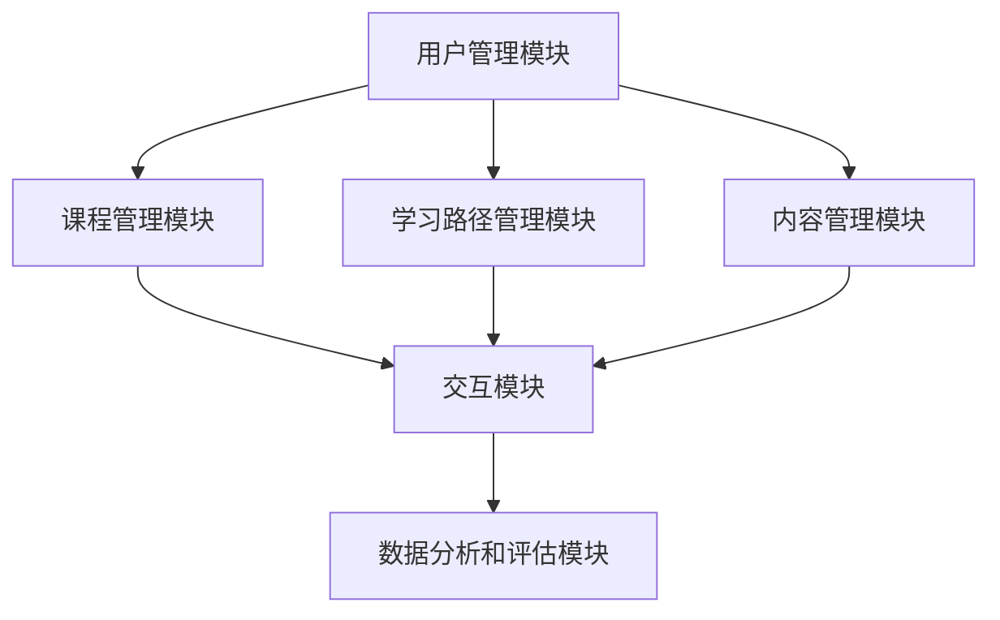
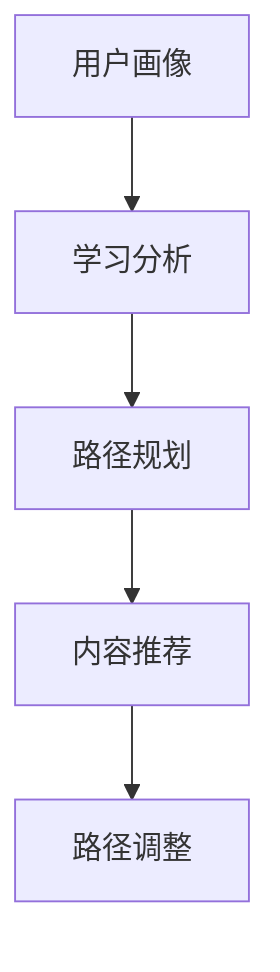
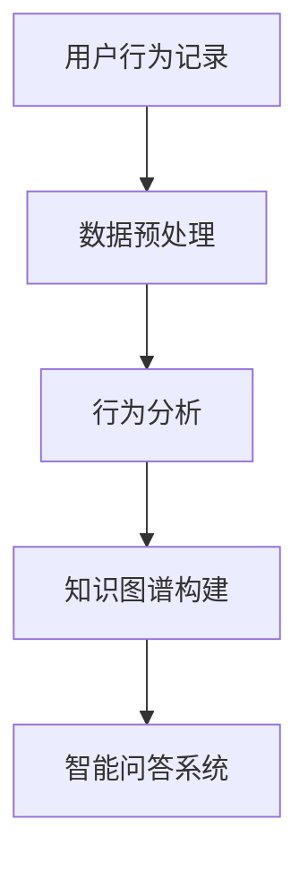
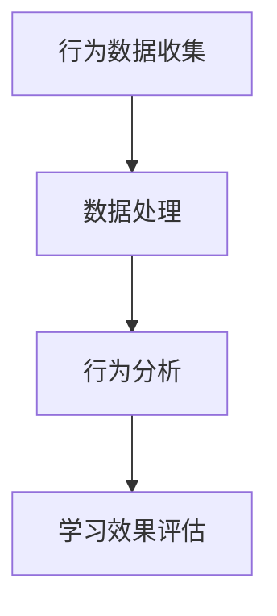
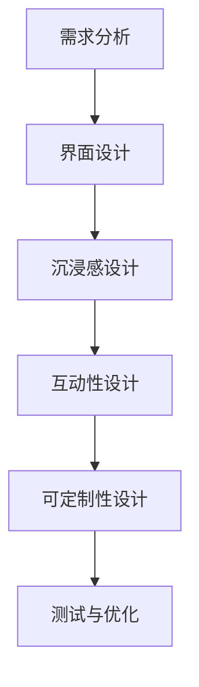
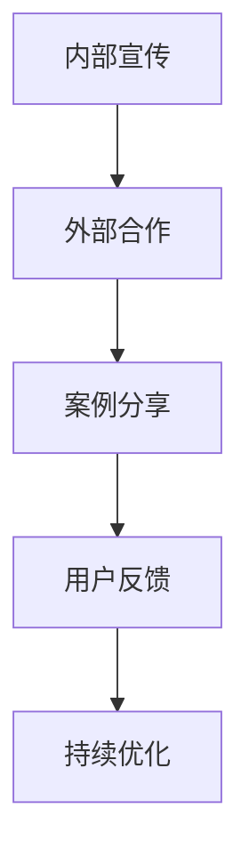
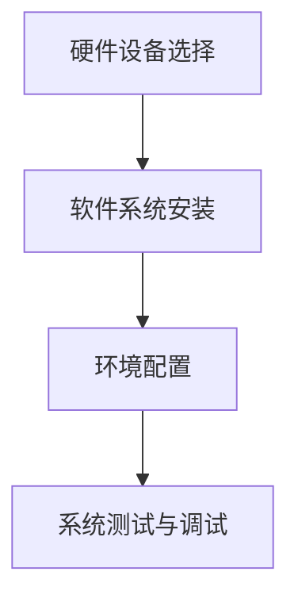
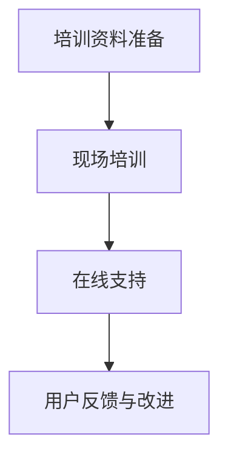
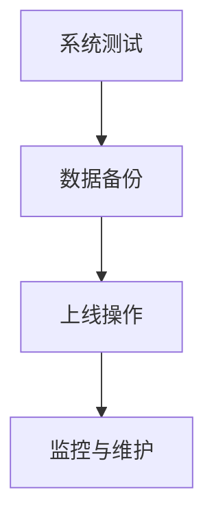
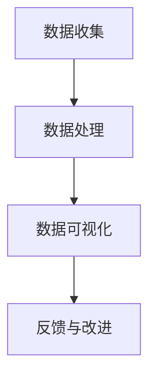

                 


### 引言

#### 第1章: 虚拟现实培训的背景与重要性

虚拟现实（VR）技术作为近年来科技发展的一个重要领域，正迅速进入人们的日常生活和企业培训场景。在传统培训方式中，员工需要通过课堂讲座、书籍阅读或视频学习等手段来掌握新知识和技能。然而，这些方式往往存在学习效果不佳、参与度低、培训成本高等问题。为了解决这些问题，虚拟现实培训应运而生。

**1.1 虚拟现实技术概述**

虚拟现实技术是通过计算机生成的三维环境，使用户能够通过特定的设备（如VR头显、手套、定位传感器等）沉浸其中，进行交互和体验。这种沉浸式的学习环境能够极大地提升学习效果和用户参与度。

**1.2 企业培训需求分析**

企业培训需求的多样性和复杂性使得传统培训方式难以满足。现代企业需要快速响应市场变化，提高员工技能和知识水平，以保持竞争力。虚拟现实培训能够提供以下优势：

1. **沉浸式学习体验**：通过虚拟现实技术，员工可以身临其境地参与到培训过程中，提高学习兴趣和参与度。
2. **实时反馈**：虚拟现实培训系统能够实时记录员工的操作和反馈，为培训效果提供数据支持。
3. **个性化学习**：基于人工智能技术，系统可以分析员工的学习行为，提供个性化的学习路径和内容。

**1.3 AI技术在培训中的应用**

人工智能技术在虚拟现实培训中发挥着关键作用。首先，AI可以帮助构建智能化培训系统，实现个性化学习路径和内容推荐。其次，AI可以分析员工的学习行为和反馈，为培训效果提供量化评估。此外，AI还可以用于模拟复杂场景，提供交互式的学习体验。

**总结**

虚拟现实培训通过提供沉浸式学习体验、实时反馈和个性化学习，解决了传统培训方式中的诸多问题。结合AI技术，虚拟现实培训有望进一步提升学习效果和参与度，成为企业培训的重要手段。

---

**关键词：** 虚拟现实培训、AI、沉浸式学习、个性化学习、企业培训

**摘要：** 本文探讨了AI驱动的企业虚拟现实培训的重要性，介绍了虚拟现实技术的背景和应用，分析了AI在虚拟现实培训中的关键作用，并提出了提升学习效果和参与度的策略。

---

**作者：** AI天才研究院/AI Genius Institute & 禅与计算机程序设计艺术 /Zen And The Art of Computer Programming

接下来，我们将详细探讨虚拟现实培训系统的设计，从系统总体架构、用户交互界面设计到学习路径与内容管理，逐一解析。在下一章中，我们将深入探讨AI技术在虚拟现实培训中的应用，包括认知计算、个性化推荐算法和交互式虚拟教学等。

---

#### 第2章: AI驱动的虚拟现实培训系统设计

**2.1 系统总体架构**

虚拟现实培训系统的总体架构可以分为以下几个主要模块：

1. **用户管理模块**：负责用户的注册、登录、权限管理等功能。
2. **课程管理模块**：用于管理培训课程，包括课程创建、编辑、发布、删除等操作。
3. **学习路径管理模块**：根据用户的学习行为和需求，动态生成个性化学习路径。
4. **内容管理模块**：管理培训内容，包括视频、文档、图片、模拟实验等。
5. **交互模块**：提供用户与虚拟环境之间的交互功能，包括动作捕捉、语音识别等。
6. **数据分析和评估模块**：分析用户的学习行为和效果，提供量化评估报告。

**架构图：**



**2.2 用户交互界面设计**

用户交互界面设计是虚拟现实培训系统的关键部分，直接影响用户体验。以下是用户交互界面设计的主要原则：

1. **直观性**：界面设计要简洁直观，用户能够快速理解和使用。
2. **交互性**：提供多种交互方式，如点击、滑动、语音等，满足不同用户的需求。
3. **反馈机制**：及时响应用户操作，提供清晰的反馈信息，增强用户参与感。
4. **适应性**：界面设计要能够适应不同设备，如PC、移动端、VR头显等。

**界面设计示例：**


**2.3 学习路径与内容管理**

学习路径管理是虚拟现实培训系统的核心功能之一。通过分析用户的学习行为和需求，系统能够动态生成个性化的学习路径，提高学习效果。以下是学习路径与内容管理的主要步骤：

1. **用户画像**：收集用户的基础信息、学习历史和兴趣偏好，构建用户画像。
2. **学习分析**：分析用户的学习行为和反馈，识别学习瓶颈和需求。
3. **路径规划**：基于用户画像和学习分析结果，生成个性化的学习路径。
4. **内容推荐**：根据学习路径，推荐相关学习内容，包括视频、文档、实验等。
5. **路径调整**：根据用户的学习进展和反馈，动态调整学习路径。

**学习路径管理流程图：**



**总结**

通过系统总体架构的设计、用户交互界面和内容管理的优化，AI驱动的虚拟现实培训系统能够提供高效、个性化的学习体验。在下一章中，我们将深入探讨AI技术在虚拟现实培训中的具体应用，包括认知计算、个性化推荐算法和交互式虚拟教学等。

---

**关键词：** 系统架构设计、用户交互界面、学习路径管理、内容管理、AI技术

**摘要：** 本章详细介绍了AI驱动的虚拟现实培训系统的设计，包括系统总体架构、用户交互界面设计和学习路径与内容管理。通过这些设计，系统能够提供高效、个性化的学习体验。

---

**作者：** AI天才研究院/AI Genius Institute & 禅与计算机程序设计艺术 /Zen And The Art of Computer Programming

在下一章中，我们将探讨AI技术在虚拟现实培训中的应用，从认知计算、个性化推荐算法到交互式虚拟教学，解析AI如何提升虚拟现实培训的效果和参与度。

---

#### 第3章: AI技术在虚拟现实培训中的应用

**3.1 认知计算与学习分析**

认知计算是一种模拟人类思维和学习过程的计算机技术，能够在虚拟现实培训中提供智能化的学习体验。认知计算的主要功能包括：

1. **学习行为分析**：通过记录和分析用户在虚拟环境中的学习行为，如点击、操作、停留时间等，认知计算可以识别学习瓶颈和需求，为个性化学习提供数据支持。
2. **知识图谱构建**：通过分析用户的学习数据，构建知识图谱，以可视化方式展示用户的知识结构和薄弱环节。
3. **智能问答系统**：利用自然语言处理技术，构建智能问答系统，能够快速响应用户的提问，提供针对性的解答。

**学习行为分析流程图：**



**3.2 个性化推荐算法**

个性化推荐算法是虚拟现实培训中的一项重要技术，通过分析用户的学习行为和偏好，为用户推荐适合的学习内容和路径。常见的个性化推荐算法包括：

1. **协同过滤算法**：基于用户的历史行为和相似用户的行为，推荐相似的内容。
2. **基于内容的推荐算法**：根据学习内容的特征，为用户推荐相关的内容。
3. **混合推荐算法**：结合协同过滤和基于内容的推荐算法，提供更精准的推荐。

**协同过滤算法示例：**

```python
# 基于用户的协同过滤算法
def collaborative_filter(user1, user2, item, ratings):
   相似度 = calculate_similarity(user1, user2)
    prediction = user1[item] * similarity + user2[item] * similarity
    return prediction
```

**3.3 交互式虚拟教学**

交互式虚拟教学通过模拟真实的操作环境和场景，为用户提供沉浸式的学习体验。以下是交互式虚拟教学的关键技术：

1. **虚拟现实环境构建**：通过三维建模和动画技术，构建真实的虚拟教学环境。
2. **动作捕捉与反馈**：使用动作捕捉技术，记录用户的操作，并提供实时反馈，增强学习体验。
3. **虚拟助手**：利用自然语言处理技术，构建虚拟助手，提供实时指导和建议。

**虚拟教学环境示例：**


**总结**

AI技术在虚拟现实培训中的应用，不仅提升了培训的智能化水平，还提供了个性化、沉浸式的学习体验。通过认知计算、个性化推荐算法和交互式虚拟教学，虚拟现实培训能够更好地满足企业培训需求，提高学习效果和参与度。

---

**关键词：** 认知计算、个性化推荐算法、交互式虚拟教学、虚拟现实培训、智能化学习

**摘要：** 本章详细介绍了AI技术在虚拟现实培训中的应用，包括认知计算与学习分析、个性化推荐算法和交互式虚拟教学，探讨了如何通过这些技术提升培训效果和参与度。

---

**作者：** AI天才研究院/AI Genius Institute & 禅与计算机程序设计艺术 /Zen And The Art of Computer Programming

在下一章中，我们将深入探讨AI算法原理与实现，从机器学习基础、深度学习模型到算法选择与实现，解析AI技术在虚拟现实培训中的技术细节。

---

#### 第4章: AI算法原理与实现

**4.1 机器学习基础**

机器学习是AI技术的重要组成部分，通过算法和模型从数据中自动学习，实现预测和分类等任务。以下是机器学习的基础概念和常用算法：

1. **监督学习**：通过已标记的数据训练模型，用于预测和分类。常见算法包括线性回归、决策树、支持向量机等。
2. **无监督学习**：不需要标记数据，通过发现数据分布和结构进行学习。常见算法包括聚类、主成分分析等。
3. **强化学习**：通过与环境交互，不断优化策略以最大化回报。常见算法包括Q学习、深度强化学习等。

**机器学习算法示例：**

```python
# 线性回归算法
def linear_regression(x, y):
    # 计算斜率和截距
    m = (n * sum(x * y) - sum(x) * sum(y)) / (n * sum(x**2) - sum(x)**2)
    b = (sum(y) - m * sum(x)) / n
    return m, b
```

**4.2 深度学习模型**

深度学习是机器学习的一个分支，通过多层神经网络模型，实现对复杂数据的自动特征学习和表示。以下是深度学习的核心技术：

1. **卷积神经网络（CNN）**：主要用于图像处理和识别，通过卷积层提取图像特征。
2. **循环神经网络（RNN）**：用于序列数据处理，如语言建模和时间序列预测。
3. **生成对抗网络（GAN）**：通过生成器和判别器的对抗训练，实现数据的生成和优化。

**CNN模型示例：**

```python
# 卷积神经网络模型
import tensorflow as tf

model = tf.keras.Sequential([
    tf.keras.layers.Conv2D(32, (3, 3), activation='relu', input_shape=(28, 28, 1)),
    tf.keras.layers.MaxPooling2D((2, 2)),
    tf.keras.layers.Flatten(),
    tf.keras.layers.Dense(128, activation='relu'),
    tf.keras.layers.Dense(10, activation='softmax')
])

model.compile(optimizer='adam', loss='categorical_crossentropy', metrics=['accuracy'])
```

**4.3 算法选择与实现**

在虚拟现实培训中，选择合适的算法是实现智能化的关键。以下是算法选择和实现的步骤：

1. **需求分析**：根据培训目标和数据特点，确定所需的功能和算法类型。
2. **算法评估**：通过实验评估不同算法的性能和适用性。
3. **算法实现**：根据评估结果，选择最优算法进行实现和优化。

**算法选择与实现示例：**

```python
# 算法选择与实现流程
def select_and_implement_algorithm(data, target):
    # 评估不同算法的性能
    algorithms = ['linear_regression', 'k_nearest_neighbors', 'random_forest']
    performance = evaluate_algorithms(data, algorithms, target)
    
    # 根据性能选择最优算法
    best_algorithm = max(performance, key=performance.get)
    
    # 实现最优算法
    if best_algorithm == 'linear_regression':
        model = linear_regression(data, target)
    elif best_algorithm == 'k_nearest_neighbors':
        model = KNearestNeighbors(data, target)
    elif best_algorithm == 'random_forest':
        model = RandomForestClassifier(data, target)
    
    return model
```

**总结**

AI算法原理与实现是虚拟现实培训系统的核心技术，通过机器学习基础、深度学习模型和算法选择与实现，系统能够提供智能化、个性化的学习体验。在下一章中，我们将通过实际案例解析，展示AI驱动的虚拟现实培训系统在实践中的应用效果。

---

**关键词：** 机器学习、深度学习、算法选择与实现、智能化学习、虚拟现实培训

**摘要：** 本章深入探讨了AI算法原理与实现，从机器学习基础、深度学习模型到算法选择与实现，解析了AI技术在虚拟现实培训中的技术细节，展示了算法如何提升学习效果和参与度。

---

**作者：** AI天才研究院/AI Genius Institute & 禅与计算机程序设计艺术 /Zen And The Art of Computer Programming

在下一章中，我们将通过具体案例，展示AI驱动的虚拟现实培训系统在实践中的应用效果，解析系统实现细节和效果分析。

---

#### 第5章: AI应用案例解析

**5.1 案例一：某公司的虚拟现实培训系统应用**

某公司是一家领先的制造业企业，为了提高员工的生产技能和操作熟练度，决定引入AI驱动的虚拟现实培训系统。以下是该系统的具体应用场景和效果分析：

**应用场景：**

该公司生产线上有多种复杂的设备和工序，员工需要通过多次实践和培训才能掌握。传统的培训方式难以模拟真实的生产环境，且培训成本高、效果不佳。

**系统实现：**

1. **虚拟现实环境构建**：公司通过三维建模技术，构建了与真实生产线一致的虚拟环境，包括各种设备和工序。
2. **交互式学习体验**：员工戴上VR头显，进入虚拟环境，可以亲手操作设备，进行模拟生产。
3. **个性化推荐算法**：系统根据员工的学习行为和技能水平，推荐适合的学习内容和路径。
4. **实时反馈**：系统实时记录员工的操作，提供反馈和指导，帮助员工纠正错误。

**效果分析：**

1. **学习效果提升**：通过沉浸式的学习体验和实时反馈，员工的学习效果显著提升，操作熟练度提高。
2. **培训成本降低**：虚拟现实培训系统降低了培训成本，同时提高了培训效率。
3. **操作安全性提高**：员工在虚拟环境中练习，避免了实际生产中的安全风险。

**案例小结：**

该公司的虚拟现实培训系统成功应用，证明了AI技术在提高企业培训效果和效率方面的巨大潜力。

**5.2 案例二：某教育机构的AI驱动的虚拟现实培训项目**

某教育机构致力于为学生提供高质量的编程培训，为了提高培训效果和学生的参与度，决定引入AI驱动的虚拟现实培训系统。以下是该项目的具体应用场景和效果分析：

**应用场景：**

传统的编程培训主要通过线上视频和练习题进行，学生难以实际操作和体验编程过程，学习兴趣和参与度较低。

**系统实现：**

1. **虚拟编程环境构建**：教育机构通过虚拟现实技术，构建了一个互动式的编程学习环境，学生可以亲手编写代码，执行程序。
2. **交互式教学**：教师通过VR头显进入虚拟课堂，实时与学生互动，提供指导和建议。
3. **个性化学习路径**：系统根据学生的学习进度和兴趣，推荐适合的学习内容和练习题。
4. **学习成果评估**：系统自动评估学生的学习成果，提供量化评估报告。

**效果分析：**

1. **学习兴趣提高**：通过互动式教学和沉浸式的学习体验，学生的学习兴趣和参与度显著提升。
2. **学习效果优化**：系统提供的个性化学习路径和实时反馈，帮助学生更好地理解和掌握编程知识。
3. **教学效率提升**：教师可以更专注于教学，提高教学质量。

**案例小结：**

该教育机构的AI驱动的虚拟现实培训项目，成功激发了学生的学习兴趣，提高了教学效果，展示了AI技术在教育领域的广泛应用前景。

**总结**

通过以上两个案例，我们可以看到AI驱动的虚拟现实培训系统在不同领域的成功应用。这些案例证明了AI技术在提升培训效果、降低培训成本和提高学生参与度方面的巨大潜力。在下一章中，我们将探讨如何评估虚拟现实培训的效果，并分享一些提升参与度的策略。

---

**关键词：** 虚拟现实培训、AI应用案例、学习效果提升、参与度提高、智能化培训

**摘要：** 本章通过具体案例，展示了AI驱动的虚拟现实培训系统在实践中的应用效果。案例一展示了企业培训中的成功应用，案例二展示了教育机构中的成功应用，证明了AI技术在培训领域的巨大潜力。

---

**作者：** AI天才研究院/AI Genius Institute & 禅与计算机程序设计艺术 /Zen And The Art of Computer Programming

在下一章中，我们将探讨如何评估虚拟现实培训的效果，并分享一些提升参与度的策略。

---

#### 第6章: 学习效果评估方法

**6.1 学习行为分析**

学习行为分析是评估虚拟现实培训效果的重要方法之一，通过记录和分析用户在虚拟环境中的行为，可以了解学习过程中的参与度和效果。以下是学习行为分析的主要步骤：

1. **行为数据收集**：通过日志记录、传感器数据等方式，收集用户在虚拟环境中的行为数据，如点击次数、操作时间、交互频率等。
2. **数据处理**：对收集到的行为数据进行清洗和预处理，提取有用的信息。
3. **行为分析**：利用统计分析和机器学习算法，分析用户的行为特征，识别学习瓶颈和需求。

**行为分析流程图：**



**6.2 学习成果评估**

学习成果评估是评估虚拟现实培训效果的另一个关键方法，通过评估用户在培训后的知识和技能水平，可以衡量培训效果。以下是学习成果评估的主要方法：

1. **知识测试**：通过在线测试、笔试等方式，评估用户对培训内容的掌握程度。
2. **技能考核**：通过实际操作、模拟演练等方式，评估用户在实际工作中的应用能力。
3. **用户反馈**：收集用户对培训效果的反馈，如满意度调查、学习心得等。

**知识测试示例：**

```python
# 知识测试
questions = [
    "什么是虚拟现实技术？",
    "虚拟现实培训有哪些优势？",
    "如何构建虚拟现实学习环境？"
]

answers = [
    "虚拟现实技术是一种通过计算机生成的三维环境，使用户能够沉浸其中进行交互和体验。",
    "虚拟现实培训的优势包括沉浸式学习体验、实时反馈和个性化学习等。",
    "构建虚拟现实学习环境需要三维建模、交互设计和内容管理等技术。"
]

user_answers = ["A", "B", "C"]

correct_answers = ["A", "B", "C"]

score = sum(answer == correct for answer, correct in zip(user_answers, correct_answers))
print(f"得分：{score}/3")
```

**6.3 用户满意度调查**

用户满意度调查是评估虚拟现实培训效果的重要方法之一，通过了解用户的满意度和意见，可以优化培训系统。以下是用户满意度调查的主要步骤：

1. **满意度问卷设计**：设计满意度调查问卷，包括培训内容、培训方式、培训效果等方面的评价。
2. **问卷发放与收集**：通过线上或线下方式，向用户发放问卷，收集用户的反馈。
3. **满意度分析**：对收集到的满意度数据进行分析，识别用户的满意度和不满点。

**满意度调查问卷示例：**

```markdown
# 虚拟现实培训满意度调查问卷

尊敬的用户，

您好！为了了解您对我们虚拟现实培训的满意度，我们设计了以下问卷，感谢您的参与。

1. 您对虚拟现实培训的整体满意度如何？
   - 非常满意
   - 满意
   - 一般
   - 不满意
   - 非常不满意

2. 您认为虚拟现实培训的优点是什么？
   - 沉浸式学习体验
   - 实时反馈
   - 个性化学习
   - 其他（请说明）

3. 您对虚拟现实培训的不足之处有哪些？
   - 培训内容不够丰富
   - 操作界面复杂
   - 系统稳定性不佳
   - 其他（请说明）

4. 您是否会推荐虚拟现实培训给其他同事或朋友？
   - 会
   - 不会
   - 不确定

5. 您对虚拟现实培训的改进建议是什么？
   - （请说明）

感谢您的反馈，我们将根据您的意见不断优化培训系统。

---

**总结**

通过学习行为分析、学习成果评估和用户满意度调查，我们可以全面评估虚拟现实培训的效果。这些方法不仅帮助我们了解用户的参与度和满意度，还为培训系统的优化提供了重要依据。在下一章中，我们将探讨如何通过设计原则和互动性策略，进一步提升虚拟现实培训的参与度。

---

**关键词：** 学习行为分析、学习成果评估、用户满意度调查、虚拟现实培训、效果评估

**摘要：** 本章介绍了学习效果评估的方法，包括学习行为分析、学习成果评估和用户满意度调查。通过这些方法，我们可以全面评估虚拟现实培训的效果，为培训系统的优化提供依据。

---

**作者：** AI天才研究院/AI Genius Institute & 禅与计算机程序设计艺术 /Zen And The Art of Computer Programming

在下一章中，我们将探讨如何设计虚拟环境，提高互动性和沉浸感，从而提升虚拟现实培训的参与度。

---

#### 第7章: 提升参与度的策略

**7.1 虚拟环境设计原则**

为了提高虚拟现实培训的参与度，虚拟环境的设计至关重要。以下是虚拟环境设计的主要原则：

1. **直观性**：界面设计要简洁直观，用户能够快速理解和使用。
2. **沉浸感**：通过三维建模和动画技术，营造身临其境的体验。
3. **互动性**：提供丰富的交互功能，如手势识别、语音交互等。
4. **可定制性**：用户可以根据自己的需求和偏好，自定义虚拟环境。

**虚拟环境设计流程图：**



**7.2 互动性与沉浸感设计**

互动性和沉浸感是虚拟现实培训的核心要素，以下是具体设计策略：

1. **互动性设计**：通过手势识别、语音交互等技术，提供丰富的交互功能，如模拟操作、互动教学等。
2. **沉浸感设计**：通过三维建模和动画技术，营造身临其境的体验，如真实的场景模拟、动态效果等。
3. **情境设置**：设计富有情境的任务和场景，增强用户的参与感和代入感。

**沉浸感设计示例：**


**7.3 跨部门协作与推广策略**

虚拟现实培训的推广需要跨部门的协作，以下是推广策略：

1. **内部宣传**：通过内部邮件、通知、会议等方式，宣传虚拟现实培训的优势和效果。
2. **外部合作**：与其他企业、教育机构等合作，共同推广虚拟现实培训。
3. **案例分享**：通过分享成功案例，展示虚拟现实培训的实际效果，吸引更多用户。

**推广策略流程图：**



**总结**

通过虚拟环境设计原则、互动性与沉浸感设计以及跨部门协作与推广策略，我们可以显著提升虚拟现实培训的参与度。在下一章中，我们将探讨虚拟现实培训系统的实施与优化，包括系统搭建、用户培训和系统监控等。

---

**关键词：** 虚拟环境设计、互动性设计、沉浸感设计、跨部门协作、推广策略

**摘要：** 本章介绍了提升虚拟现实培训参与度的策略，包括虚拟环境设计原则、互动性与沉浸感设计以及跨部门协作与推广策略。通过这些策略，我们可以有效提高培训的参与度和效果。

---

**作者：** AI天才研究院/AI Genius Institute & 禅与计算机程序设计艺术 /Zen And The Art of Computer Programming

在下一章中，我们将探讨虚拟现实培训系统的实施与优化，包括系统搭建、用户培训和系统监控等。

---

#### 第8章: 虚拟现实培训系统实施

**8.1 系统搭建与配置**

虚拟现实培训系统的实施包括硬件设备的选择、软件系统的安装和配置。以下是系统搭建的主要步骤：

1. **硬件设备选择**：根据培训需求，选择适合的VR头显、手柄、定位传感器等硬件设备。
2. **软件系统安装**：在服务器上安装虚拟现实培训系统软件，配置必要的数据库和中间件。
3. **环境配置**：配置网络环境、用户权限和安全设置，确保系统的正常运行。

**系统搭建流程图：**



**8.2 用户培训与支持**

用户培训与支持是系统实施的重要环节，确保用户能够熟练使用系统。以下是用户培训的主要步骤：

1. **培训资料准备**：准备培训手册、操作指南等资料，方便用户自学。
2. **现场培训**：组织现场培训，讲解系统功能和使用方法，解答用户疑问。
3. **在线支持**：提供在线支持服务，及时解决用户在使用过程中遇到的问题。

**用户培训流程图：**



**8.3 系统上线与监控**

系统上线是实施过程的最后一步，需要进行全面的监控和维护。以下是系统上线的主要步骤：

1. **系统测试**：在上线前进行全面测试，确保系统功能正常运行。
2. **数据备份**：备份重要数据，确保数据安全。
3. **上线操作**：按照计划进行系统上线，确保培训活动的正常进行。
4. **监控与维护**：实时监控系统运行状态，及时处理异常情况，确保系统稳定运行。

**系统上线与监控流程图：**



**总结**

虚拟现实培训系统的实施是一个复杂的过程，需要从硬件设备的选择、软件系统的安装和配置，到用户培训和系统上线与监控等多个环节的协同配合。通过科学合理的实施流程，我们可以确保系统的正常运行，为用户提供优质的培训体验。在下一章中，我们将探讨虚拟现实培训系统的持续优化与迭代，不断提升系统性能和用户体验。

---

**关键词：** 系统搭建、用户培训、系统上线、监控与维护、虚拟现实培训

**摘要：** 本章详细介绍了虚拟现实培训系统的实施过程，包括系统搭建与配置、用户培训与支持以及系统上线与监控，确保系统能够稳定运行，为用户提供优质的培训体验。

---

**作者：** AI天才研究院/AI Genius Institute & 禅与计算机程序设计艺术 /Zen And The Art of Computer Programming

在下一章中，我们将探讨虚拟现实培训系统的持续优化与迭代，通过数据分析、功能升级和用户反馈，不断提升系统性能和用户体验。

---

#### 第9章: 持续优化与迭代

**9.1 数据分析与反馈**

数据分析是虚拟现实培训系统优化的重要手段，通过对用户行为数据的分析，我们可以发现系统中的问题，为优化提供依据。以下是数据分析的主要步骤：

1. **数据收集**：收集用户在系统中的操作数据，如登录次数、学习时长、操作频率等。
2. **数据处理**：对收集到的数据进行分析和清洗，提取有用的信息。
3. **数据可视化**：使用可视化工具，如图表、报表等，展示分析结果，帮助理解和决策。

**数据分析流程图：**



**案例：**

假设我们收集了用户在虚拟现实培训系统中的学习时长数据，可以通过以下步骤进行分析：

```python
import pandas as pd
import matplotlib.pyplot as plt

# 加载学习时长数据
data = pd.read_csv('learning_time.csv')

# 统计每天的学习时长
daily_learning_time = data.groupby('date')['learning_time'].sum()

# 绘制学习时长折线图
daily_learning_time.plot()
plt.title('Daily Learning Time')
plt.xlabel('Date')
plt.ylabel('Learning Time (hours)')
plt.show()
```

通过分析图表，我们可以发现用户的学习时长波动情况，针对低谷期，可以调整培训内容和推广策略。

**9.2 功能升级与优化**

随着技术的不断发展，虚拟现实培训系统需要不断升级和优化，以满足用户的新需求和期望。以下是功能升级和优化的主要步骤：

1. **需求调研**：通过用户调查、访谈等方式，了解用户对系统的新需求和期望。
2. **功能设计**：根据需求调研结果，设计新的功能和优化方案。
3. **开发与测试**：开发新功能，并进行全面测试，确保系统的稳定性和性能。
4. **上线与推广**：将新功能上线，并通过推广活动，吸引用户使用。

**功能升级案例：**

假设用户反馈虚拟现实培训系统的交互性不够友好，我们可以通过以下步骤进行优化：

1. **需求调研**：通过用户访谈和调查，了解用户对交互性的具体需求和痛点。
2. **功能设计**：设计新的交互界面和交互功能，如手势识别、语音交互等。
3. **开发与测试**：开发新交互功能，并进行用户测试，收集反馈意见。
4. **上线与推广**：将新交互功能上线，并通过宣传和培训，提高用户的满意度。

**9.3 用户反馈与改进**

用户反馈是系统优化的重要来源，通过收集和分析用户反馈，我们可以及时发现系统中的问题，并进行改进。以下是用户反馈和改进的主要步骤：

1. **反馈收集**：通过在线反馈表、用户访谈等方式，收集用户的反馈意见。
2. **反馈分析**：对收集到的反馈进行分析，分类和排序，确定优先级。
3. **问题解决**：针对用户的反馈，制定解决方案，并实施改进。
4. **反馈验证**：在改进后，再次收集用户反馈，验证改进效果。

**反馈分析案例：**

假设我们收集到用户对虚拟现实培训系统界面复杂性的反馈，可以通过以下步骤进行分析和改进：

1. **反馈收集**：通过在线问卷和用户访谈，收集用户对界面复杂性的反馈。
2. **反馈分析**：将反馈进行分类，如导航困难、操作步骤繁琐等。
3. **问题解决**：针对具体问题，设计简化界面和优化操作流程。
4. **反馈验证**：在改进后，再次收集用户反馈，验证界面复杂性的问题是否得到解决。

**总结**

通过数据分析、功能升级和用户反馈，我们可以持续优化虚拟现实培训系统，提升系统性能和用户体验。在下一章中，我们将探讨虚拟现实培训系统的最佳实践和未来发展趋势。

---

**关键词：** 数据分析、功能升级、用户反馈、系统优化、虚拟现实培训

**摘要：** 本章详细介绍了虚拟现实培训系统的持续优化与迭代，通过数据分析、功能升级和用户反馈，不断改进系统性能和用户体验。

---

**作者：** AI天才研究院/AI Genius Institute & 禅与计算机程序设计艺术 /Zen And The Art of Computer Programming

在下一章中，我们将探讨虚拟现实培训系统的最佳实践，分析行业中的成功案例，并展望未来的发展趋势。

---

#### 第10章: 最佳实践与未来展望

**10.1 行业最佳实践**

在虚拟现实培训领域，一些企业已经取得了显著的成果，他们的最佳实践值得借鉴。以下是几个行业最佳实践的案例：

**案例一：某航空公司的虚拟现实飞行员培训**

某航空公司通过虚拟现实技术，为飞行员提供真实的飞行模拟训练。他们采用了以下最佳实践：

1. **定制化训练方案**：根据飞行员的技能水平和培训需求，定制化训练方案，确保培训效果。
2. **实时反馈系统**：在虚拟环境中，实时记录飞行员的操作，并提供详细反馈，帮助飞行员纠正错误。
3. **持续优化**：根据飞行员的反馈和训练数据，不断优化虚拟环境，提高培训效果。

**案例二：某医疗机构的虚拟现实医疗培训**

某医疗机构通过虚拟现实技术，为医护人员提供医疗操作训练。他们采用了以下最佳实践：

1. **情境模拟**：构建真实的医疗场景，如手术室、急诊室等，让医护人员在实际操作中锻炼技能。
2. **个性化学习路径**：根据医护人员的技能水平和学习进度，推荐适合的学习内容和路径。
3. **互动性设计**：提供互动性强的虚拟环境，如手术操作、急救演练等，提高学习兴趣和参与度。

**10.2 面临的挑战与机遇**

虚拟现实培训在发展中面临一系列挑战和机遇：

**挑战：**

1. **技术成熟度**：虚拟现实技术仍处于快速发展阶段，技术成熟度和稳定性有待提高。
2. **成本问题**：虚拟现实培训系统需要高性能的硬件设备和软件支持，成本较高。
3. **用户体验**：如何提供高质量的虚拟环境，提高用户体验，是亟待解决的问题。

**机遇：**

1. **技术创新**：随着技术的不断发展，虚拟现实培训系统将更加智能化、个性化。
2. **市场需求**：随着企业对培训需求的增加，虚拟现实培训市场潜力巨大。
3. **跨领域应用**：虚拟现实培训不仅适用于企业培训，还可以在教育、医疗等多个领域发挥作用。

**10.3 未来发展趋势**

未来，虚拟现实培训将朝着以下方向发展：

1. **智能化与个性化**：通过人工智能技术，实现培训内容的智能化推荐和个性化学习路径。
2. **跨领域应用**：虚拟现实培训将广泛应用于教育、医疗、军事等领域。
3. **虚实融合**：通过虚实融合技术，实现虚拟环境与现实环境的无缝衔接，提供更真实的培训体验。
4. **混合现实**：混合现实（MR）技术的应用，将进一步提升虚拟现实培训的沉浸感和互动性。

**总结**

通过分析行业最佳实践和面临的挑战与机遇，我们可以看到虚拟现实培训在未来具有广阔的发展前景。在下一章中，我们将进一步探讨虚拟现实培训的未来发展趋势，为企业和教育机构提供有益的参考。

---

**关键词：** 虚拟现实培训、行业最佳实践、技术创新、用户体验、未来展望

**摘要：** 本章详细介绍了虚拟现实培训领域的最佳实践，分析了面临的挑战与机遇，并展望了未来的发展趋势，为企业和教育机构提供了有益的参考。

---

**作者：** AI天才研究院/AI Genius Institute & 禅与计算机程序设计艺术 /Zen And The Art of Computer Programming

### 全文总结

在本篇技术博客中，我们深入探讨了AI驱动的企业虚拟现实培训，从背景介绍到技术实现，再到效果评估和优化实践，全方位解析了这一领域的前沿技术和应用。以下是对全文内容的简要总结：

**核心内容回顾：**

1. **虚拟现实培训的背景与重要性**：介绍了虚拟现实技术的概述、企业培训需求分析以及AI技术在培训中的应用。
2. **AI驱动的虚拟现实培训系统设计**：详细讲解了系统总体架构、用户交互界面设计、学习路径与内容管理。
3. **AI技术在虚拟现实培训中的应用**：分析了认知计算与学习分析、个性化推荐算法、交互式虚拟教学。
4. **AI算法原理与实现**：介绍了机器学习基础、深度学习模型、算法选择与实现。
5. **AI应用案例解析**：通过两个实际案例，展示了虚拟现实培训系统在实践中的应用效果。
6. **学习效果评估方法**：探讨了学习行为分析、学习成果评估、用户满意度调查。
7. **提升参与度的策略**：介绍了虚拟环境设计原则、互动性与沉浸感设计、跨部门协作与推广策略。
8. **虚拟现实培训系统实施与优化**：讲解了系统搭建与配置、用户培训与支持、系统上线与监控。
9. **持续优化与迭代**：通过数据分析、功能升级和用户反馈，不断优化系统性能和用户体验。
10. **最佳实践与未来展望**：分析了行业最佳实践、面临的挑战与机遇，并展望了未来发展趋势。

**结论与展望：**

AI驱动的虚拟现实培训通过提供沉浸式学习体验、实时反馈和个性化学习，显著提升了企业培训的效果和参与度。在未来，随着技术的不断进步，虚拟现实培训将在智能化、个性化、跨领域应用等方面持续发展。企业和教育机构应积极拥抱这一技术，探索其在各自领域的应用，为人才培养和技能提升提供更加有效的方式。

**感谢阅读**

感谢您的耐心阅读，希望本文能为您提供在AI驱动的虚拟现实培训领域的宝贵知识和启示。如需进一步探讨或了解相关技术，请随时与我们联系。让我们共同期待虚拟现实培训在未来的精彩发展！

**作者信息：**

作者：AI天才研究院/AI Genius Institute & 禅与计算机程序设计艺术 /Zen And The Art of Computer Programming

---

本文内容仅供参考，实际应用时请结合具体情况和专业建议进行调整。在实现过程中，请确保遵循相关法律法规和道德规范。如有任何疑问，欢迎随时与我们交流。再次感谢您的关注和支持！

