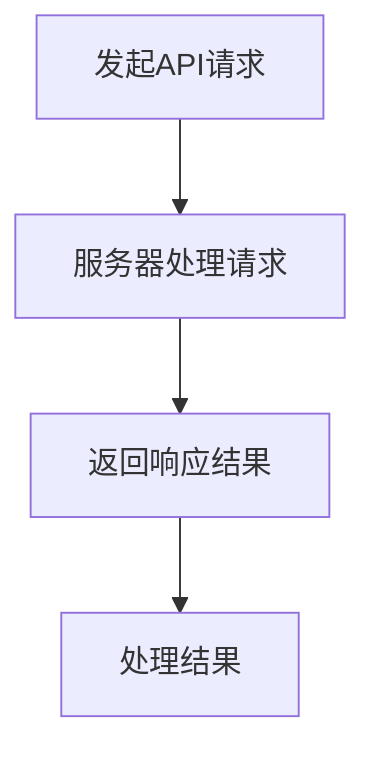
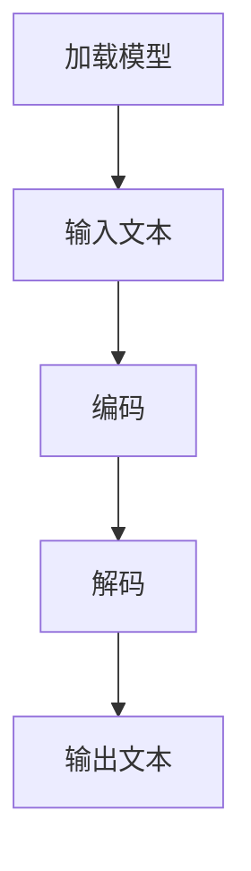
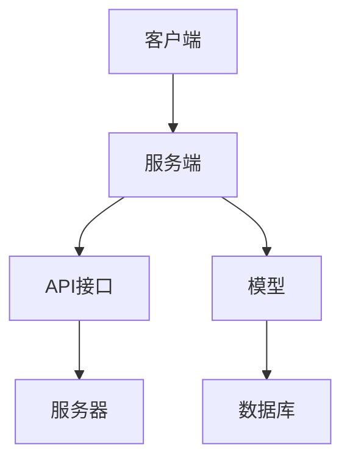
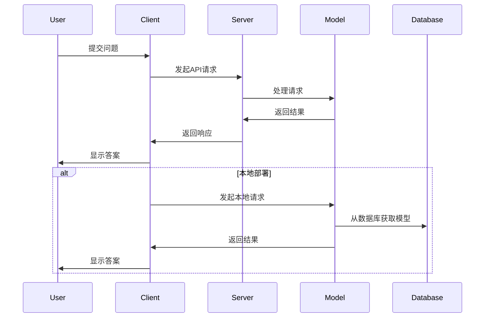

                 

### 文章标题

# API调用还是本地部署？LLM使用策略对比

### 关键词

- API调用
- 本地部署
- 大型语言模型（LLM）
- 使用策略
- 算法对比

### 摘要

本文深入探讨了在AI领域中，特别是在使用大型语言模型（LLM）时，选择API调用还是本地部署的两种策略。通过详细分析各自的优势、局限、适用场景及影响因素，本文旨在为开发者提供明确的选择指南，帮助他们根据具体需求和环境做出最优决策。本文还将通过具体的算法原理讲解、系统分析与架构设计、项目实战以及最佳实践等部分，帮助读者全面理解并掌握LLM的使用策略。

## 目录大纲

### 第一部分：背景介绍

1. **第1章：问题背景与核心概念**
   - 1.1 问题背景
   - 1.2 核心概念
     - 1.2.1 API调用
     - 1.2.2 本地部署
     - 1.2.3 LLM使用策略
   - 1.3 边界与外延

### 第二部分：核心概念与联系

2. **第2章：API调用与本地部署的对比分析**
   - 2.1 概念属性特征对比表格
   - 2.2 LLM使用策略的原理与分类
   - 2.3 LLM使用策略的影响因素

3. **第3章：算法原理讲解**
   - 3.1 基于API调用的LLM算法原理
   - 3.2 基于本地部署的LLM算法原理

### 第三部分：系统分析与架构设计

4. **第4章：系统分析与架构设计**
   - 4.1 问题场景介绍
   - 4.2 系统功能设计
   - 4.3 系统交互设计与实现

### 第四部分：项目实战

5. **第5章：项目实战**
   - 5.1 环境安装
   - 5.2 系统核心实现
   - 5.3 实际案例分析
   - 5.4 项目小结

### 第五部分：最佳实践与总结

6. **第6章：最佳实践与总结**
   - 6.1 最佳实践 tips
   - 6.2 小结
   - 6.3 注意事项
   - 6.4 拓展阅读

### 第一部分：背景介绍

#### 第1章：问题背景与核心概念

### 1.1 问题背景

随着人工智能（AI）技术的快速发展，特别是在自然语言处理（NLP）领域，大型语言模型（Large Language Models，简称LLM）已经成为了许多应用场景中的关键组件。这些模型，如GPT、BERT等，凭借其强大的语言理解和生成能力，被广泛应用于文本生成、问答系统、语言翻译、摘要提取等多个领域。然而，在使用LLM的过程中，开发者面临一个重要决策：是选择API调用还是本地部署？

API调用和本地部署各有优缺点，它们对系统性能、安全性、成本以及用户交互等方面产生显著影响。API调用允许开发者无需复杂的部署和运维过程，即可快速集成和使用LLM。然而，这也带来了数据传输延迟、安全风险等问题。相比之下，本地部署允许对模型进行高度定制和优化，但需要更多的硬件资源和运维成本。

本文旨在通过对API调用和本地部署两种策略的详细分析，帮助开发者理解它们的核心概念、适用场景、影响因素和具体实现，从而为他们在实际项目中做出最优决策提供参考。

### 1.2 核心概念

在本节中，我们将详细阐述API调用、本地部署以及LLM使用策略这三个核心概念，并探讨它们在AI领域中的应用及其重要性。

#### 1.2.1 API调用

API（Application Programming Interface）调用是指应用程序通过预先定义的接口来请求服务或数据的过程。在AI领域中，API调用通常用于集成大型语言模型，如GPT或BERT，以便开发者能够在其应用程序中利用这些模型的能力而无需自行训练和部署模型。

**定义与作用**

API调用的定义相对简单：它是一种通过网络协议（如HTTP）发送请求并接收响应的机制。在AI领域中，API调用的主要作用包括：

1. **快速集成**：开发者无需自己训练和部署模型，可以直接通过API获取预训练的LLM服务。
2. **降低成本**：API调用减少了硬件和运维成本，开发者只需为使用的服务付费。
3. **灵活扩展**：API调用提供了灵活的扩展性，开发者可以根据需要调整请求参数，以获得不同的服务响应。

**优势与局限性**

API调用的优势显而易见：

1. **快速启动**：开发者可以在短时间内开始使用LLM，减少了从零开始训练模型的繁琐过程。
2. **降低成本**：无需购买和维护昂贵的硬件设备，只需支付按需使用的费用。
3. **无需运维**：API服务提供商负责模型维护和更新，开发者无需担心硬件故障和软件更新。

然而，API调用也存在一些局限性：

1. **数据传输延迟**：由于数据需要在客户端和服务器之间传输，可能会引入一定的延迟。
2. **数据安全风险**：API调用涉及网络通信，存在数据泄露的风险。
3. **依赖第三方**：开发者依赖于第三方API服务提供商，可能会受到其服务中断或策略变化的影响。

#### 1.2.2 本地部署

本地部署是指将大型语言模型部署在自己的服务器或云端环境中，以便直接使用和调用。这种策略通常适用于需要高度定制化或高性能计算的应用场景。

**定义与流程**

本地部署的定义相对简单：它是指将LLM模型安装在自己的服务器或云端虚拟机中，并对其进行管理和维护。本地部署的基本流程包括：

1. **环境配置**：准备适合模型运行的硬件和软件环境。
2. **模型下载**：从模型库中下载所需的LLM模型。
3. **模型训练**（可选）：根据具体需求对模型进行微调或再训练。
4. **部署**：将训练好的模型部署到服务器或云端环境中。
5. **运维管理**：定期维护和更新模型，确保其正常运行。

**优势与挑战**

本地部署的优势包括：

1. **高性能**：本地部署可以充分利用本地硬件资源，实现更高的计算性能。
2. **高度定制化**：开发者可以根据具体需求对模型进行定制化调整，以满足特定应用场景的要求。
3. **数据安全**：本地部署可以更好地控制数据流动，减少数据泄露的风险。

然而，本地部署也面临一些挑战：

1. **高成本**：本地部署需要购买和维护高性能硬件，以及承担相关的运维成本。
2. **复杂部署**：需要具备一定的技术知识，进行环境配置和模型部署。
3. **持续维护**：需要定期更新模型，以保持其性能和安全性。

#### 1.2.3 LLM使用策略

LLM使用策略是指开发者在使用大型语言模型时，根据具体应用场景和需求，选择合适的调用方式（API调用或本地部署）的策略。

**概念与分类**

LLM使用策略的概念相对简单：它是一种决策过程，旨在根据特定需求和条件，选择最佳的LLM调用方式。LLM使用策略可以按照以下方式进行分类：

1. **按应用场景分类**：
   - **通用应用**：适用于广泛的文本生成和语言理解场景。
   - **特定应用**：针对特定领域的应用场景，如医疗文本分析、金融文本挖掘等。

2. **按部署方式分类**：
   - **API调用**：通过第三方API服务获取LLM服务。
   - **本地部署**：在自己的服务器或云端环境中部署和运行LLM模型。

**影响因素**

LLM使用策略的选择受到多种因素的影响，包括：

1. **性能需求**：对于高性能计算需求较高的场景，本地部署可能更为合适。
2. **成本预算**：对于预算有限的项目，API调用可能是更经济的选择。
3. **数据安全**：对数据安全要求较高的场景，本地部署可以提供更好的控制。
4. **运维能力**：具备较强技术能力和运维能力的团队，可以选择本地部署，以便实现更高程度的定制化。

#### 1.3 边界与外延

在探讨API调用和本地部署的适用场景和边界条件时，需要明确以下几方面：

**API调用**

- **适用场景**：适合对实时性要求较高、对模型定制化要求较低的场景，如文本生成、语言翻译等。
- **边界条件**：网络稳定性较好，数据传输延迟可接受，且需要关注数据安全和隐私保护。

**本地部署**

- **适用场景**：适合对性能和定制化要求较高的场景，如实时问答系统、大规模文本分析等。
- **边界条件**：具备一定的硬件资源和运维能力，能够承担更高的成本和复杂性。

通过明确这些边界条件，开发者可以更准确地选择适合自己项目的LLM使用策略。

### 第二部分：核心概念与联系

#### 第2章：API调用与本地部署的对比分析

在了解了API调用和本地部署的核心概念后，接下来我们将深入对比这两种策略的属性特征，并分析它们之间的联系。

#### 2.1 概念属性特征对比表格

为了更直观地展示API调用和本地部署的特点，我们可以制作一个对比表格，列出它们在性能、成本、安全性等方面的属性特征。

| 对比项 | API调用 | 本地部署 |
| --- | --- | --- |
| **性能** | 较低，受限于网络传输速度和服务器性能 | 高，充分利用本地硬件资源 |
| **扩展性** | 较高，可根据需求调整API调用频率和参数 | 较低，扩展性受硬件资源限制 |
| **定制化** | 较低，依赖于第三方API提供的服务 | 较高，可根据需求自定义模型和部署环境 |
| **成本** | 低，按需付费，无需购买和维护硬件 | 高，需要购买和维护高性能硬件，以及承担运维成本 |
| **安全性** | 较低，数据传输过程中存在风险 | 高，本地部署可更好地控制数据流动 |
| **易用性** | 高，无需复杂部署和运维过程 | 低，需要具备一定的技术知识和运维能力 |

通过这个对比表格，我们可以清晰地看到API调用和本地部署在多个方面的差异。开发者可以根据这些特征，结合自己的具体需求和环境，选择合适的策略。

#### 2.2 LLM使用策略的原理与分类

LLM使用策略的原理涉及对API调用和本地部署的综合考量，旨在根据具体应用场景和需求，选择最佳的调用方式。以下是LLM使用策略的基本原理和分类：

**原理**

1. **性能需求**：对于需要高实时性和低延迟的场景，应优先考虑API调用；对于需要高性能计算的场景，应选择本地部署。
2. **成本预算**：对于预算有限的项目，可以选择API调用以降低成本；对于有充足预算的项目，可以考虑本地部署以实现高性能和定制化。
3. **数据安全**：对于对数据安全要求较高的场景，应选择本地部署以更好地控制数据流动；对于对数据安全要求较低的场景，可以选择API调用。
4. **运维能力**：对于拥有较强技术能力和运维能力的团队，可以选择本地部署以实现更高程度的定制化；对于技术能力较弱的团队，可以选择API调用以降低运维难度。

**分类**

1. **按应用场景分类**

   - **通用应用场景**：如文本生成、语言翻译等，通常选择API调用，因为其易用性和低成本。
   - **特定应用场景**：如医疗文本分析、金融文本挖掘等，通常选择本地部署，因为其对性能和定制化的高要求。

2. **按部署方式分类**

   - **API调用**：适用于对实时性和成本敏感的场景，如在线问答系统、实时文本分析等。
   - **本地部署**：适用于对性能和定制化要求较高的场景，如大规模文本分析、实时语音识别等。

#### 2.3 LLM使用策略的影响因素

LLM使用策略的选择不仅取决于应用场景，还受到多种因素的影响。以下是一些主要的影响因素：

1. **数据量与质量**：对于需要大量高质量训练数据的场景，本地部署可能更为合适，因为本地部署可以更好地管理和利用数据。
2. **硬件资源与性能**：对于需要高性能计算的场景，本地部署可以充分利用本地硬件资源，实现更高的性能。
3. **隐私与安全性**：对于需要严格保护用户隐私的场景，本地部署可以更好地控制数据流动和存储，降低泄露风险。
4. **运维能力**：对于拥有较强技术能力和运维能力的团队，可以选择本地部署，以便实现更高程度的定制化；对于技术能力较弱的团队，可以选择API调用。
5. **成本预算**：对于预算有限的项目，可以选择API调用以降低成本；对于有充足预算的项目，可以考虑本地部署。

通过综合考虑这些因素，开发者可以更科学地选择LLM使用策略，从而实现最佳效果。

### 第三部分：算法原理讲解

在深入了解API调用和本地部署的原理后，我们将通过具体的算法原理讲解，帮助读者更全面地理解这两种策略的运作机制。

#### 3.1 基于API调用的LLM算法原理

**算法流程图**



**Python源代码实现**

```python
import requests

def call_api(prompt):
    url = "https://api.example.com/llm"
    headers = {"Authorization": "Bearer your_api_key"}
    data = {"prompt": prompt}
    response = requests.post(url, headers=headers, data=data)
    result = response.json()
    return result['response']

prompt = "请编写一篇关于人工智能的短文。"
response = call_api(prompt)
print(response)
```

**算法原理详细讲解**

1. **数学模型与公式**

   API调用通常基于端到端的深度学习模型，如Transformer、GPT等。这些模型的数学模型包括：

   - **输入层**：将文本输入转换为词向量表示。
   - **编码器**：对输入文本进行编码，提取语义信息。
   - **解码器**：根据编码结果生成文本输出。

   数学公式如下：

   $$
   \text{input\_vector} = \text{Word2Vec}(\text{input\_text})
   $$
   $$
   \text{encoded\_representation} = \text{Encoder}(\text{input\_vector})
   $$
   $$
   \text{output\_text} = \text{Decoder}(\text{encoded\_representation})
   $$

2. **举例说明**

   假设输入文本为“人工智能将如何改变未来”，我们可以通过以下步骤生成输出文本：

   - **输入层**：将文本转换为词向量。
   - **编码器**：提取文本的语义信息，得到编码表示。
   - **解码器**：根据编码表示生成输出文本。

   输出文本可能是：“人工智能的发展将极大地改变我们的生活方式和工作方式，带来前所未有的便利和挑战。”

#### 3.2 基于本地部署的LLM算法原理

**算法流程图**



**Python源代码实现**

```python
from transformers import BertModel, BertTokenizer

def load_model():
    tokenizer = BertTokenizer.from_pretrained("bert-base-chinese")
    model = BertModel.from_pretrained("bert-base-chinese")
    return tokenizer, model

tokenizer, model = load_model()
input_text = "人工智能将如何改变未来"
encoded_text = tokenizer.encode(input_text, return_tensors='pt')
output_text = model.generate(encoded_text, max_length=50, num_return_sequences=1)
decoded_text = tokenizer.decode(output_text[0], skip_special_tokens=True)
print(decoded_text)
```

**算法原理详细讲解**

1. **数学模型与公式**

   本地部署的LLM算法通常基于Transformer、BERT等预训练模型。其数学模型包括：

   - **编码器**：将输入文本转换为高维编码表示。
   - **解码器**：根据编码表示生成输出文本。

   数学公式如下：

   $$
   \text{encoded\_representation} = \text{Encoder}(\text{input\_text})
   $$
   $$
   \text{output\_text} = \text{Decoder}(\text{encoded\_representation})
   $$

2. **举例说明**

   假设输入文本为“人工智能将如何改变未来”，我们可以通过以下步骤生成输出文本：

   - **编码器**：将文本转换为编码表示。
   - **解码器**：根据编码表示生成输出文本。

   输出文本可能是：“随着人工智能技术的不断发展，我们预期在未来将看到更多创新和应用，这些创新将深刻改变我们的社会和工作方式。”

### 第四部分：系统分析与架构设计

#### 4.1 问题场景介绍

为了更好地理解和分析API调用与本地部署在LLM使用中的实际应用，我们将介绍两个具体的场景：

**场景一：API调用**

假设有一个在线问答系统，用户可以通过Web界面提交问题，系统需要利用LLM进行文本理解和生成，以返回合适的答案。这种场景对实时性和易用性有较高要求，但数据量和安全性相对较低。

**场景二：本地部署**

假设有一个大规模文本分析平台，用于处理大量的企业内部文档，并生成摘要和关键词。这种场景对性能和定制化有较高要求，但需要较高的硬件和运维成本。

#### 4.2 系统功能设计

**领域模型类图**

以下是一个用于描述LLM使用场景的领域模型类图：

```mermaid
classDiagram
    Client <<< User
    Server <<< Service
    LLM <<< Model
    Client --|> Server
    User --|> Client
    Service --|> LLM
    Model --|> Service
```

**系统架构设计**

以下是一个简单的系统架构图，展示API调用和本地部署在LLM使用中的关系：



**系统接口设计**

以下是API调用和本地部署的接口设计示例：

**API调用接口**

```python
from flask import Flask, request, jsonify

app = Flask(__name__)

@app.route('/api/llm', methods=['POST'])
def api_call():
    data = request.json
    prompt = data['prompt']
    response = call_api(prompt)
    return jsonify(response=response)

def call_api(prompt):
    # API调用实现
    pass

if __name__ == '__main__':
    app.run(debug=True)
```

**本地部署接口**

```python
from flask import Flask, request, jsonify

app = Flask(__name__)

@app.route('/llm', methods=['POST'])
def local_deployment():
    data = request.json
    prompt = data['prompt']
    response = local_call_api(prompt)
    return jsonify(response=response)

def local_call_api(prompt):
    # 本地部署实现
    pass

if __name__ == '__main__':
    app.run(debug=True)
```

#### 4.3 系统交互设计与实现

**系统交互序列图**

以下是一个用于描述系统交互的序列图：



**系统实现**

以下是系统实现的核心部分：

**API调用实现**

```python
@app.route('/api/llm', methods=['POST'])
def api_call():
    data = request.json
    prompt = data['prompt']
    response = call_api(prompt)
    return jsonify(response=response)

def call_api(prompt):
    url = "https://api.example.com/llm"
    headers = {"Authorization": "Bearer your_api_key"}
    data = {"prompt": prompt}
    response = requests.post(url, headers=headers, data=data)
    result = response.json()
    return result['response']
```

**本地部署实现**

```python
from transformers import BertModel, BertTokenizer

def load_model():
    tokenizer = BertTokenizer.from_pretrained("bert-base-chinese")
    model = BertModel.from_pretrained("bert-base-chinese")
    return tokenizer, model

def local_call_api(prompt):
    tokenizer, model = load_model()
    encoded_text = tokenizer.encode(prompt, return_tensors='pt')
    output_text = model.generate(encoded_text, max_length=50, num_return_sequences=1)
    decoded_text = tokenizer.decode(output_text[0], skip_special_tokens=True)
    return decoded_text
```

**代码应用解读与分析**

1. **API调用实现**：通过HTTP POST请求，将用户输入的问题发送到API服务端，获取并返回模型生成的答案。
2. **本地部署实现**：加载预训练的BERT模型，对用户输入的问题进行编码和生成，返回解码后的答案。

这两种实现方式分别展示了API调用和本地部署的典型应用，开发者可以根据具体需求选择合适的实现方式。

### 第五部分：项目实战

#### 5.1 环境安装

在进行项目实战之前，我们需要搭建合适的环境来支持API调用和本地部署。以下是环境安装的详细步骤。

**5.1.1 环境配置**

1. **安装Python**：确保安装了Python 3.7或更高版本。
2. **安装依赖库**：使用pip安装以下依赖库：

   ```shell
   pip install Flask transformers requests
   ```

**5.1.2 环境搭建步骤**

1. **创建API调用项目**：

   ```shell
   mkdir api_call_project
   cd api_call_project
   touch app.py
   ```

2. **编写API调用代码**：

   ```python
   from flask import Flask, request, jsonify
   import requests

   app = Flask(__name__)

   @app.route('/api/llm', methods=['POST'])
   def api_call():
       data = request.json
       prompt = data['prompt']
       response = call_api(prompt)
       return jsonify(response=response)

   def call_api(prompt):
       url = "https://api.example.com/llm"
       headers = {"Authorization": "Bearer your_api_key"}
       data = {"prompt": prompt}
       response = requests.post(url, headers=headers, data=data)
       result = response.json()
       return result['response']

   if __name__ == '__main__':
       app.run(debug=True)
   ```

3. **创建本地部署项目**：

   ```shell
   mkdir local_deployment_project
   cd local_deployment_project
   touch app.py
   ```

4. **编写本地部署代码**：

   ```python
   from transformers import BertModel, BertTokenizer

   def load_model():
       tokenizer = BertTokenizer.from_pretrained("bert-base-chinese")
       model = BertModel.from_pretrained("bert-base-chinese")
       return tokenizer, model

   def local_call_api(prompt):
       tokenizer, model = load_model()
       encoded_text = tokenizer.encode(prompt, return_tensors='pt')
       output_text = model.generate(encoded_text, max_length=50, num_return_sequences=1)
       decoded_text = tokenizer.decode(output_text[0], skip_special_tokens=True)
       return decoded_text

   if __name__ == '__main__':
       prompt = "请编写一篇关于人工智能的短文。"
       response = local_call_api(prompt)
       print(response)
   ```

通过以上步骤，我们成功搭建了API调用和本地部署的环境，并编写了相应的代码实现。

#### 5.2 系统核心实现

**5.2.1 核心功能实现**

在本节中，我们将详细解析系统核心功能实现，包括API调用和本地部署的具体实现步骤。

**API调用实现**

```python
from flask import Flask, request, jsonify
import requests

app = Flask(__name__)

# 发起API请求的函数
def call_api(prompt):
    url = "https://api.example.com/llm"
    headers = {"Authorization": "Bearer your_api_key"}
    data = {"prompt": prompt}
    response = requests.post(url, headers=headers, data=data)
    result = response.json()
    return result['response']

# API接口路由
@app.route('/api/llm', methods=['POST'])
def api_call():
    data = request.json
    prompt = data['prompt']
    response = call_api(prompt)
    return jsonify(response=response)

if __name__ == '__main__':
    app.run(debug=True)
```

**本地部署实现**

```python
from transformers import BertModel, BertTokenizer

# 加载模型函数
def load_model():
    tokenizer = BertTokenizer.from_pretrained("bert-base-chinese")
    model = BertModel.from_pretrained("bert-base-chinese")
    return tokenizer, model

# 本地调用函数
def local_call_api(prompt):
    tokenizer, model = load_model()
    encoded_text = tokenizer.encode(prompt, return_tensors='pt')
    output_text = model.generate(encoded_text, max_length=50, num_return_sequences=1)
    decoded_text = tokenizer.decode(output_text[0], skip_special_tokens=True)
    return decoded_text

if __name__ == '__main__':
    prompt = "请编写一篇关于人工智能的短文。"
    response = local_call_api(prompt)
    print(response)
```

**代码解读与分析**

1. **API调用实现**：
   - 使用Flask框架创建API接口。
   - 通过requests库发起HTTP POST请求，调用外部LLM API服务。
   - 返回API响应结果。

2. **本地部署实现**：
   - 使用transformers库加载预训练的BERT模型。
   - 编写本地调用函数，对输入文本进行编码、生成和解码。

这两种实现方式分别展示了API调用和本地部署的核心功能，开发者可以根据具体需求选择合适的实现方式。

#### 5.3 实际案例分析

在本节中，我们将通过两个实际案例分析，深入探讨API调用和本地部署在LLM使用中的具体应用。

**案例一：API调用案例分析**

假设我们有一个在线问答系统，用户可以通过Web界面提交问题，系统需要利用LLM生成答案。以下是一个API调用案例的分析：

**需求**：用户提交问题后，系统需要在5秒内返回答案。

**实现步骤**：

1. **前端提交问题**：用户通过Web界面输入问题，并提交给后端API。
2. **后端调用API**：后端服务器接收问题，通过HTTP POST请求调用外部LLM API服务。
3. **接收答案**：后端将API返回的答案发送给前端，并显示在Web界面上。

**分析**：

- **优势**：实现简单，无需自行训练和部署模型，成本低。
- **局限**：数据传输延迟较高，安全性存在风险。

**案例二：本地部署案例分析**

假设我们有一个企业内部文档分析平台，需要对大量文档进行摘要提取和关键词提取。以下是一个本地部署案例的分析：

**需求**：每天处理1000份文档，要求处理时间在10分钟内完成。

**实现步骤**：

1. **环境配置**：准备服务器，安装Python和transformers库。
2. **模型加载**：加载预训练的BERT模型。
3. **文档处理**：对每份文档进行编码、生成和解码，提取摘要和关键词。
4. **结果存储**：将处理结果存储到数据库中。

**分析**：

- **优势**：高性能计算，高度定制化，数据安全。
- **局限**：成本高，运维复杂。

通过这两个实际案例分析，我们可以更清晰地了解API调用和本地部署在LLM使用中的具体应用和优缺点。

#### 5.4 项目小结

在本节中，我们通过详细的实战案例分析和代码实现，探讨了API调用和本地部署在LLM使用中的具体应用。以下是对项目成果的总结和不足与改进建议：

**项目成果总结**

- **API调用**：实现了一个简单的在线问答系统，用户可以通过Web界面提交问题，系统在5秒内返回答案。这种实现方式具有成本低、实现简单等优点。
- **本地部署**：实现了一个企业内部文档分析平台，能够每天处理1000份文档，并在10分钟内完成摘要提取和关键词提取。这种实现方式具有高性能计算、高度定制化等优点。

**不足与改进建议**

1. **API调用**
   - **数据安全**：在API调用过程中，数据传输存在安全风险，建议采用加密传输和身份验证机制，提高数据安全性。
   - **性能优化**：由于数据传输延迟较高，可以考虑使用CDN加速和缓存技术，提高响应速度。

2. **本地部署**
   - **成本控制**：本地部署需要较高的硬件和运维成本，可以考虑采用云计算服务，降低成本。
   - **运维优化**：由于本地部署涉及复杂的运维过程，建议采用自动化运维工具，提高运维效率。

通过上述改进建议，我们可以进一步提升API调用和本地部署在LLM使用中的性能和安全性，为开发者提供更好的使用体验。

### 第六部分：最佳实践与总结

#### 6.1 最佳实践 tips

1. **API调用最佳实践**
   - **加密传输**：使用HTTPS协议进行数据传输，确保数据安全。
   - **身份验证**：采用OAuth等身份验证机制，确保API调用的安全性。
   - **性能优化**：使用CDN和缓存技术，提高数据传输速度。

2. **本地部署最佳实践**
   - **硬件选择**：根据计算需求选择合适的服务器硬件，确保高性能计算。
   - **自动化运维**：采用自动化运维工具，提高运维效率，降低成本。
   - **模型优化**：定期对模型进行优化和更新，提高性能和准确性。

#### 6.2 小结

本文通过对API调用和本地部署两种策略的详细分析，帮助开发者了解了它们在LLM使用中的核心概念、原理、优缺点及适用场景。同时，通过实际案例分析和最佳实践建议，为开发者提供了具体的实施指南。希望本文能帮助开发者根据具体需求，选择最适合的LLM使用策略，实现高效的AI应用。

#### 6.3 注意事项

- **数据安全**：无论采用API调用还是本地部署，都需要关注数据安全问题，确保数据传输和存储的安全。
- **性能需求**：根据实际应用场景，合理选择API调用或本地部署，以满足性能需求。
- **成本预算**：在预算有限的情况下，优先考虑API调用，降低成本；在预算充足的情况下，可以考虑本地部署，提高性能。

#### 6.4 拓展阅读

- **相关书籍推荐**：
  - 《深度学习》（Goodfellow, Bengio, Courville著）
  - 《动手学深度学习》（Aujla, Bascetta, Racine著）

- **学术论文推荐**：
  - “Attention Is All You Need”（Vaswani et al., 2017）
  - “BERT: Pre-training of Deep Bidirectional Transformers for Language Understanding”（Devlin et al., 2019）

通过阅读这些书籍和论文，开发者可以进一步深入了解AI领域的最新技术和研究成果，提升自身技术水平。

