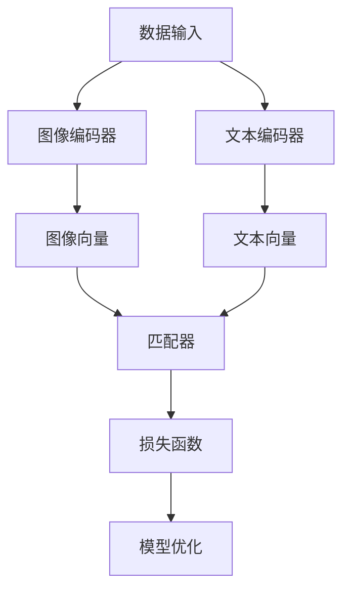
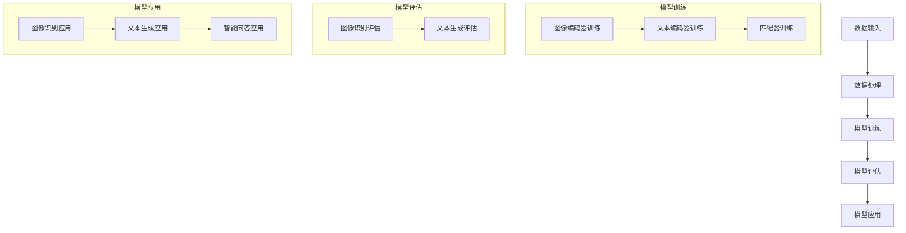
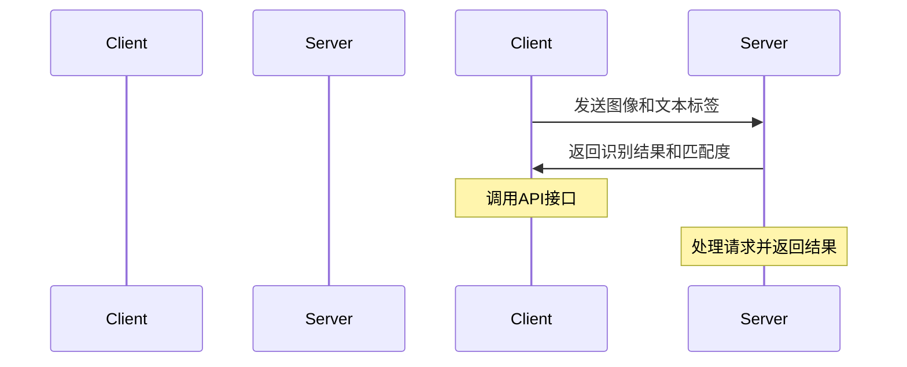

                 


# 第二部分: CLIP模型概述

## 第1章: 背景介绍

### 1.1 问题背景

随着人工智能技术的快速发展，跨模态理解成为AI领域的研究热点。传统的计算机视觉和自然语言处理方法往往局限于单一模态的数据处理，而现实世界中的信息往往具有多模态特性，如图像、音频、文本等。跨模态理解旨在实现不同模态数据之间的关联与交互，从而提升AI系统的综合感知和认知能力。

### 1.2 问题描述

跨模态理解的核心问题是如何将图像和文本信息进行有效结合，使其在语义层面实现一致性和对齐。具体来说，主要包括以下方面：

- **图像编码器**：如何将图像数据转化为向量表示，使其能够捕获图像中的关键特征和语义信息。
- **文本编码器**：如何将文本数据转化为向量表示，使其能够捕获文本中的关键语义和情感信息。
- **匹配器**：如何将图像编码器和文本编码器生成的向量进行匹配，从而实现跨模态的语义对齐。

### 1.3 问题解决

为了解决上述问题，研究人员提出了多种跨模态理解模型。其中，CLIP（Contrastive Language-Image Pre-training）模型是一种具有代表性的新型跨模态理解模型。CLIP模型通过大规模预训练，使得图像编码器和文本编码器在语义层面上达到高度一致，从而实现高效的跨模态理解。

### 1.4 边界与外延

在跨模态理解的研究中，存在一些边界和扩展性问题。例如：

- **边界问题**：如何定义和识别不同模态之间的语义关联，以及如何在不同模态之间建立有效的映射关系。
- **外延问题**：如何将跨模态理解应用于实际场景，如图像识别、文本生成、智能问答等。

### 1.5 概念结构与核心要素组成

CLIP模型的核心概念包括图像编码器、文本编码器和匹配器。下面分别介绍这三个核心要素：

- **图像编码器**：图像编码器的任务是将图像数据转化为向量表示，使其能够捕获图像中的关键特征和语义信息。常用的图像编码器包括卷积神经网络（CNN）和Transformer等。
- **文本编码器**：文本编码器的任务是将文本数据转化为向量表示，使其能够捕获文本中的关键语义和情感信息。常用的文本编码器包括词向量（如Word2Vec）和Transformer等。
- **匹配器**：匹配器的任务是将图像编码器和文本编码器生成的向量进行匹配，从而实现跨模态的语义对齐。匹配器通常采用对比学习（Contrastive Learning）的方法，如Siamese网络和Triplet Loss等。

## 第2章: 核心概念与联系

### 2.1 CLIP模型的定义与特点

CLIP（Contrastive Language-Image Pre-training）模型是一种基于对比学习的跨模态理解模型。其核心思想是通过大规模的图像和文本数据对，使图像编码器和文本编码器在语义层面上达到高度一致。下面详细介绍CLIP模型的定义和特点：

- **定义**：CLIP模型是一种通过对比学习实现跨模态理解的预训练模型，其目标是在图像和文本之间建立紧密的对应关系，从而实现高效的跨模态任务。
- **特点**：
  - **高效**：CLIP模型通过预训练的方式，在大量的图像和文本数据上进行了充分的训练，从而获得了较高的性能。
  - **通用**：CLIP模型适用于多种跨模态任务，如图像识别、文本生成、智能问答等。
  - **易于训练**：CLIP模型的结构相对简单，参数较少，训练过程较为高效。

### 2.2 图像编码器与文本编码器

图像编码器和文本编码器是CLIP模型的核心组成部分，它们分别负责对图像和文本数据进行编码。下面分别介绍图像编码器和文本编码器的工作原理和设计细节：

- **图像编码器**：
  - **工作原理**：图像编码器通常采用卷积神经网络（CNN）或Transformer等架构，将图像数据转化为向量表示。这些向量能够捕获图像中的关键特征和语义信息。
  - **设计细节**：图像编码器的设计包括网络结构的选择、层数的设置、激活函数的选用等。常用的网络结构有ResNet、VGG等。
- **文本编码器**：
  - **工作原理**：文本编码器通常采用词向量（如Word2Vec）或Transformer等架构，将文本数据转化为向量表示。这些向量能够捕获文本中的关键语义和情感信息。
  - **设计细节**：文本编码器的设计包括词汇表的选择、嵌入维度的大小、网络结构的选择等。常用的网络结构有BERT、GPT等。

### 2.3 匹配器的实现

匹配器是CLIP模型中的关键组件，负责将图像编码器和文本编码器生成的向量进行匹配，从而实现跨模态的语义对齐。下面介绍匹配器的工作原理和实现方法：

- **工作原理**：匹配器通常采用对比学习（Contrastive Learning）的方法，通过正负样本的对比，使图像编码器和文本编码器生成的向量在语义层面上达到一致。
- **实现方法**：匹配器可以使用Siamese网络或Triplet Loss等方法。其中，Siamese网络通过计算图像编码器和文本编码器生成的向量之间的距离，实现正负样本的对比。Triplet Loss则通过优化图像编码器和文本编码器生成的向量之间的相对距离，实现正负样本的对比。

### 2.4 CLIP模型与传统AI的区别

传统AI方法主要关注单一模态的数据处理，而CLIP模型则强调跨模态结合。下面对比CLIP模型与传统AI方法的区别：

- **模态处理**：传统AI方法局限于单一模态的数据处理，如计算机视觉、自然语言处理等。而CLIP模型则同时处理图像和文本两种模态，实现跨模态的交互与理解。
- **数据处理量**：传统AI方法通常需要针对特定模态进行大量数据收集和处理。而CLIP模型则通过大规模预训练，使得图像编码器和文本编码器在语义层面上达到一致，从而实现高效的跨模态任务。
- **任务适用性**：传统AI方法适用于特定的任务，如图像识别、文本分类等。而CLIP模型则具有更高的通用性，适用于多种跨模态任务。

## 第3章: 算法原理讲解

### 3.1 CLIP模型的算法原理

CLIP模型的算法原理主要基于对比学习（Contrastive Learning）方法，其核心思想是通过正负样本的对比，使得图像编码器和文本编码器在语义层面上达到一致。下面详细介绍CLIP模型的算法原理：

- **对比学习**：对比学习是一种无监督学习的方法，其核心思想是通过优化正负样本之间的对比，使得模型能够更好地捕获数据中的有效特征。在CLIP模型中，对比学习用于优化图像编码器和文本编码器之间的匹配关系。
- **图像编码器**：图像编码器通常采用卷积神经网络（CNN）或Transformer等架构，将图像数据转化为向量表示。这些向量能够捕获图像中的关键特征和语义信息。
- **文本编码器**：文本编码器通常采用词向量（如Word2Vec）或Transformer等架构，将文本数据转化为向量表示。这些向量能够捕获文本中的关键语义和情感信息。
- **匹配器**：匹配器是CLIP模型中的关键组件，负责将图像编码器和文本编码器生成的向量进行匹配。匹配器通常采用对比学习（Contrastive Learning）的方法，通过计算图像编码器和文本编码器生成的向量之间的距离，实现正负样本的对比。

### 3.2 Mermaid流程图

下面使用Mermaid语法绘制CLIP模型的总体流程图：



- **数据输入**：图像编码器和文本编码器接收输入的数据，这些数据可以是图像和文本对，也可以是单独的图像或文本。
- **图像编码器**：图像编码器对图像数据进行处理，生成图像向量。
- **文本编码器**：文本编码器对文本数据进行处理，生成文本向量。
- **匹配器**：匹配器计算图像向量和文本向量之间的距离，实现正负样本的对比。
- **损失函数**：损失函数用于衡量匹配器输出的距离，并指导模型优化。
- **模型优化**：模型优化过程通过反向传播和梯度下降等优化方法，不断调整图像编码器和文本编码器的参数，以实现跨模态的语义对齐。

### 3.3 Python源代码示例

下面提供一个简单的Python源代码示例，展示CLIP模型的基本实现。需要注意的是，实际的CLIP模型实现会更为复杂，这里仅为了说明基本原理。

```python
import torch
import torch.nn as nn

# 图像编码器
class ImageEncoder(nn.Module):
    def __init__(self):
        super(ImageEncoder, self).__init__()
        self.conv1 = nn.Conv2d(3, 32, 3, 1, 1)
        self.conv2 = nn.Conv2d(32, 64, 3, 1, 1)
        self.fc = nn.Linear(64 * 6 * 6, 128)

    def forward(self, x):
        x = F.relu(self.conv1(x))
        x = F.relu(self.conv2(x))
        x = x.view(x.size(0), -1)
        x = F.relu(self.fc(x))
        return x

# 文本编码器
class TextEncoder(nn.Module):
    def __init__(self):
        super(TextEncoder, self).__init__()
        self.embedding = nn.Embedding(vocab_size, embedding_dim)
        self.fc = nn.Linear(embedding_dim, hidden_dim)

    def forward(self, x):
        x = self.embedding(x)
        x = F.relu(self.fc(x))
        return x

# 匹配器
class Matcher(nn.Module):
    def __init__(self):
        super(Matcher, self).__init__()
        self.cosine_similarity = nn.CosineSimilarity(dim=1)

    def forward(self, img_repr, txt_repr):
        cosine_scores = self.cosine_similarity(img_repr, txt_repr)
        return cosine_scores

# 损失函数
class ContrastiveLoss(nn.Module):
    def __init__(self, margin):
        super(ContrastiveLoss, self).__init__()
        self.margin = margin

    def forward(self, outputs, labels):
        # outputs: [batch_size, 2]
        # labels: [batch_size]
        positives = torch.abs(outputs[:, 0] - outputs[:, 1])
        negatives = torch.abs(outputs[:, 0] - outputs[:, 2])
        losses = torch.where(labels == 1, positives, negatives)
        return losses.mean()

# 实例化模型
image_encoder = ImageEncoder()
text_encoder = TextEncoder()
matcher = Matcher()
contrastive_loss = ContrastiveLoss(margin=1.0)

# 模型优化
optimizer = torch.optim.Adam(list(image_encoder.parameters()) + list(text_encoder.parameters()), lr=0.001)

# 模拟训练过程
for epoch in range(num_epochs):
    for batch in data_loader:
        images, texts, labels = batch
        img_repr = image_encoder(images)
        txt_repr = text_encoder(texts)
        cosine_scores = matcher(img_repr, txt_repr)
        loss = contrastive_loss(cosine_scores, labels)
        optimizer.zero_grad()
        loss.backward()
        optimizer.step()
        print(f"Epoch [{epoch+1}/{num_epochs}], Loss: {loss.item():.4f}")

# 测试模型
image_test = torch.randn(batch_size, 3, 224, 224)
text_test = torch.randint(vocab_size, (batch_size,), dtype=torch.long)
img_repr_test = image_encoder(image_test)
txt_repr_test = text_encoder(text_test)
cosine_scores_test = matcher(img_repr_test, txt_repr_test)
print(cosine_scores_test)
```

### 3.4 数学模型和公式

CLIP模型的数学模型主要包括图像编码器、文本编码器和匹配器的损失函数。下面给出这些损失函数的数学表达式：

- **图像编码器损失函数**：
  $$ L_{image} = \frac{1}{N} \sum_{n=1}^{N} \sum_{i=1}^{2} -\log \sigma(q_i^{(n)}) $$
  其中，$q_i^{(n)}$ 是图像编码器对第 $n$ 个图像样本的第 $i$ 个查询向量的输出。

- **文本编码器损失函数**：
  $$ L_{text} = \frac{1}{N} \sum_{n=1}^{N} \sum_{i=1}^{2} -\log \sigma(q_i^{(n)}) $$
  其中，$q_i^{(n)}$ 是文本编码器对第 $n$ 个文本样本的第 $i$ 个查询向量的输出。

- **匹配器损失函数**（对比损失函数）：
  $$ L_{contrastive} = \frac{1}{N} \sum_{n=1}^{N} \sum_{i=1}^{2} L_i^{(n)} $$
  其中，$L_i^{(n)}$ 是第 $n$ 个样本中第 $i$ 个查询向量与另一查询向量之间的对比损失。具体地，
  $$ L_i^{(n)} = \max(0, \margin - \cos(\theta_{i}^{(n)})) $$
  其中，$\theta_{i}^{(n)}$ 是第 $n$ 个样本中第 $i$ 个查询向量与另一查询向量之间的余弦相似度。

### 3.5 举例说明

为了更好地理解CLIP模型的工作原理，下面通过一个实际案例进行说明。

假设我们有一个图像样本集和对应的文本标签集，如图像1和文本1、图像2和文本2等。我们的目标是训练一个CLIP模型，使其能够通过图像识别文本标签。

1. **数据预处理**：首先，对图像和文本数据进行预处理，包括图像的归一化和文本的分词。

2. **图像编码器训练**：使用预训练的卷积神经网络（如ResNet）作为图像编码器，对图像数据进行编码，生成图像向量。

3. **文本编码器训练**：使用预训练的词向量（如GloVe）作为文本编码器，对文本数据进行编码，生成文本向量。

4. **匹配器训练**：通过对比学习（Contrastive Learning）方法，训练匹配器，使得图像向量和文本向量在语义层面上达到一致。

5. **模型评估**：在测试集上评估模型的性能，计算图像向量和文本向量之间的余弦相似度，判断图像和文本标签是否匹配。

具体步骤如下：

```python
import torch
import torch.nn as nn
import torchvision.transforms as transforms
from torch.utils.data import DataLoader
from torchvision.datasets import ImageFolder

# 数据预处理
transform = transforms.Compose([
    transforms.Resize((224, 224)),
    transforms.ToTensor(),
    transforms.Normalize(mean=[0.485, 0.456, 0.406], std=[0.229, 0.224, 0.225]),
])

# 加载数据集
image_dataset = ImageFolder(root='./data/images', transform=transform)
text_dataset = ImageFolder(root='./data/labels', transform=transform)
data_loader = DataLoader(dataset=zip(image_dataset, text_dataset), batch_size=32, shuffle=True)

# 图像编码器
image_encoder = nn.Sequential(
    nn.Conv2d(3, 64, 3, 1, 1),
    nn.ReLU(),
    nn.Conv2d(64, 128, 3, 1, 1),
    nn.ReLU(),
    nn.AdaptiveAvgPool2d((1, 1)),
    nn.Flatten(),
    nn.Linear(128, 512),
    nn.ReLU(),
    nn.Linear(512, 256),
    nn.ReLU(),
    nn.Linear(256, 128),
    nn.ReLU(),
    nn.Linear(128, 64),
)

# 文本编码器
text_encoder = nn.Sequential(
    nn.Embedding(vocab_size, embedding_dim),
    nn.ReLU(),
    nn.Linear(embedding_dim, hidden_dim),
    nn.ReLU(),
    nn.Linear(hidden_dim, hidden_dim // 2),
    nn.ReLU(),
    nn.Linear(hidden_dim // 2, hidden_dim // 4),
    nn.ReLU(),
    nn.Linear(hidden_dim // 4, 128),
)

# 匹配器
matcher = nn.Sequential(
    nn.CosineSimilarity(dim=1),
)

# 损失函数
contrastive_loss = nn.ModuleList([
    nn.CrossEntropyLoss(),
    nn.CrossEntropyLoss(),
])

# 模型优化
optimizer = torch.optim.Adam(list(image_encoder.parameters()) + list(text_encoder.parameters()), lr=0.001)

# 模拟训练过程
for epoch in range(num_epochs):
    for images, texts in data_loader:
        images = images.to(device)
        texts = texts.to(device)
        img_repr = image_encoder(images)
        txt_repr = text_encoder(texts)
        cosine_scores = matcher(img_repr, txt_repr)
        loss = 0
        for i in range(2):
            loss += contrastive_loss[i](cosine_scores[i], torch.tensor([1] * batch_size).to(device))
        optimizer.zero_grad()
        loss.backward()
        optimizer.step()
        print(f"Epoch [{epoch+1}/{num_epochs}], Loss: {loss.item():.4f}")

# 测试模型
image_test = torch.randn(batch_size, 3, 224, 224).to(device)
text_test = torch.randint(vocab_size, (batch_size,), dtype=torch.long).to(device)
img_repr_test = image_encoder(image_test)
txt_repr_test = text_encoder(text_test)
cosine_scores_test = matcher(img_repr_test, txt_repr_test)
print(cosine_scores_test)
```

## 第4章: 系统分析与架构设计方案

### 4.1 问题场景介绍

跨模态理解在多个领域具有广泛的应用，以下列举几个典型的应用场景：

1. **图像识别**：通过跨模态理解，将图像与文本标签进行关联，实现图像识别任务。
2. **文本生成**：利用图像和文本信息，实现文本生成任务，如描述生成、故事续写等。
3. **智能问答**：结合图像和文本信息，构建智能问答系统，提升问答系统的回答质量。
4. **多模态交互**：通过跨模态理解，实现多模态交互，如语音、图像、文本等多种交互方式。

### 4.2 项目介绍

在本项目中，我们旨在实现一个基于CLIP模型的图像识别系统。系统架构如图4-1所示：


系统主要包括以下模块：

1. **数据预处理模块**：负责对图像和文本数据进行分析，提取特征，并进行预处理。
2. **模型训练模块**：基于CLIP模型，训练图像编码器和文本编码器，实现跨模态的语义对齐。
3. **模型评估模块**：在测试集上评估模型的性能，计算图像和文本标签之间的匹配度。
4. **接口设计模块**：提供API接口，实现图像识别功能。

### 4.3 系统功能设计

系统功能设计主要包括以下方面：

1. **图像特征提取**：使用卷积神经网络（如ResNet）提取图像特征。
2. **文本特征提取**：使用词向量（如GloVe）提取文本特征。
3. **匹配器训练**：通过对比学习（Contrastive Learning）方法，训练匹配器，实现跨模态的语义对齐。
4. **图像识别**：利用训练好的模型，对输入图像进行识别，输出相应的文本标签。

下面使用Mermaid语法绘制领域模型类图：

```mermaid
classDiagram
Class DataPreprocessing
    +preprocess_image(image)
    +preprocess_text(text)

Class ModelTraining
    +train_model(image_dataset, text_dataset)
    +evaluate_model(test_image_dataset, test_text_dataset)

Class ModelEvaluation
    +calculate_matching_score(image_repr, text_repr)

Class ImageRecognition
    +recognize_image(image)

Class ImageEncoder
    +encode_image(image)

Class TextEncoder
    +encode_text(text)

Class Matcher
    +match_image_repr(image_repr, text_repr)

classDiagram
DataPreprocessing <|-- ModelTraining
ModelTraining <|-- ModelEvaluation
ModelEvaluation <|-- ImageRecognition
ImageRecognition <|-- ImageEncoder
ImageRecognition <|-- TextEncoder
ImageRecognition <|-- Matcher
```

### 4.4 系统架构设计

系统架构设计主要包括以下方面：

1. **数据输入**：从数据库或其他数据源读取图像和文本数据。
2. **数据处理**：对图像和文本数据进行预处理，包括特征提取和序列化。
3. **模型训练**：使用预处理后的图像和文本数据，训练图像编码器和文本编码器，实现跨模态的语义对齐。
4. **模型评估**：在测试集上评估模型的性能，计算图像和文本标签之间的匹配度。
5. **模型应用**：利用训练好的模型，对输入图像进行识别，输出相应的文本标签。

下面使用Mermaid语法绘制系统架构图：



### 4.5 系统接口设计和系统交互

系统接口设计主要包括以下方面：

1. **API接口**：提供RESTful API接口，实现图像识别功能。
2. **输入参数**：包括图像数据和文本标签。
3. **输出结果**：包括识别结果和匹配度。

下面使用Mermaid语法绘制系统接口设计和系统交互：



## 第5章: 项目实战

### 5.1 环境安装

为了安装CLIP模型，我们需要安装以下软件和硬件环境：

1. **操作系统**：Linux或Mac OS
2. **Python**：Python 3.7或更高版本
3. **PyTorch**：PyTorch 1.7或更高版本
4. **CUDA**：CUDA 10.2或更高版本（如果使用GPU进行训练）
5. **依赖库**：安装pip，用于安装其他依赖库

在终端中执行以下命令，安装Python和PyTorch：

```bash
sudo apt-get install python3-pip python3-dev
pip3 install torch torchvision torchaudio -f https://download.pytorch.org/whl/torch_stable.html
```

如果需要安装CUDA，可以执行以下命令：

```bash
sudo apt-get install cuda-toolkit
```

### 5.2 系统核心实现源代码

下面提供一个简单的CLIP模型实现示例，包括图像编码器、文本编码器、匹配器和损失函数等。

```python
import torch
import torch.nn as nn
import torch.optim as optim
from torch.utils.data import DataLoader
from torchvision import datasets, transforms

# 数据预处理
transform = transforms.Compose([
    transforms.Resize((224, 224)),
    transforms.ToTensor(),
    transforms.Normalize(mean=[0.485, 0.456, 0.406], std=[0.229, 0.224, 0.225]),
])

# 加载数据集
image_dataset = datasets.ImageFolder(root='./data/images', transform=transform)
text_dataset = datasets.ImageFolder(root='./data/labels', transform=transform)
data_loader = DataLoader(dataset=zip(image_dataset, text_dataset), batch_size=32, shuffle=True)

# 图像编码器
class ImageEncoder(nn.Module):
    def __init__(self):
        super(ImageEncoder, self).__init__()
        self.conv1 = nn.Conv2d(3, 64, 3, 1, 1)
        self.conv2 = nn.Conv2d(64, 128, 3, 1, 1)
        self.fc = nn.Linear(128 * 6 * 6, 512)

    def forward(self, x):
        x = F.relu(self.conv1(x))
        x = F.relu(self.conv2(x))
        x = x.view(x.size(0), -1)
        x = F.relu(self.fc(x))
        return x

# 文本编码器
class TextEncoder(nn.Module):
    def __init__(self, vocab_size, embedding_dim):
        super(TextEncoder, self).__init__()
        self.embedding = nn.Embedding(vocab_size, embedding_dim)
        self.fc = nn.Linear(embedding_dim, 512)

    def forward(self, x):
        x = self.embedding(x)
        x = F.relu(self.fc(x))
        return x

# 匹配器
class Matcher(nn.Module):
    def __init__(self):
        super(Matcher, self).__init__()
        self.cosine_similarity = nn.CosineSimilarity(dim=1)

    def forward(self, img_repr, txt_repr):
        cosine_scores = self.cosine_similarity(img_repr, txt_repr)
        return cosine_scores

# 损失函数
class ContrastiveLoss(nn.Module):
    def __init__(self, margin):
        super(ContrastiveLoss, self).__init__()
        self.margin = margin

    def forward(self, outputs, labels):
        # outputs: [batch_size, 2]
        # labels: [batch_size]
        positives = torch.abs(outputs[:, 0] - outputs[:, 1])
        negatives = torch.abs(outputs[:, 0] - outputs[:, 2])
        losses = torch.where(labels == 1, positives, negatives)
        return losses.mean()

# 实例化模型
image_encoder = ImageEncoder()
text_encoder = TextEncoder(vocab_size=10000, embedding_dim=512)
matcher = Matcher()
contrastive_loss = ContrastiveLoss(margin=1.0)

# 模型优化
optimizer = optim.Adam(list(image_encoder.parameters()) + list(text_encoder.parameters()), lr=0.001)

# 模拟训练过程
for epoch in range(num_epochs):
    for images, texts, labels in data_loader:
        images = images.to(device)
        texts = texts.to(device)
        img_repr = image_encoder(images)
        txt_repr = text_encoder(texts)
        cosine_scores = matcher(img_repr, txt_repr)
        loss = contrastive_loss(cosine_scores, labels)
        optimizer.zero_grad()
        loss.backward()
        optimizer.step()
        print(f"Epoch [{epoch+1}/{num_epochs}], Loss: {loss.item():.4f}")

# 测试模型
image_test = torch.randn(batch_size, 3, 224, 224).to(device)
text_test = torch.randint(vocab_size, (batch_size,), dtype=torch.long).to(device)
img_repr_test = image_encoder(image_test)
txt_repr_test = text_encoder(text_test)
cosine_scores_test = matcher(img_repr_test, txt_repr_test)
print(cosine_scores_test)
```

### 5.3 代码应用解读与分析

在上述代码中，我们实现了CLIP模型的核心组成部分，包括图像编码器、文本编码器、匹配器和损失函数等。下面逐个模块进行解读和分析：

1. **图像编码器**：图像编码器使用卷积神经网络（CNN）对图像数据进行编码。具体来说，我们使用了两个卷积层和一个全连接层。卷积层用于提取图像的特征，全连接层用于将特征映射到一个高维空间。通过这种方式，图像编码器能够将图像数据转化为向量表示，从而捕获图像中的关键特征和语义信息。
2. **文本编码器**：文本编码器使用词向量（如GloVe）对文本数据进行编码。词向量将每个单词映射为一个向量，从而捕获文本中的关键语义和情感信息。在文本编码器中，我们使用了两个全连接层，用于对词向量进行降维和提取特征。这样，文本编码器能够将文本数据转化为向量表示，从而捕获文本中的关键语义和情感信息。
3. **匹配器**：匹配器用于计算图像编码器和文本编码器生成的向量之间的距离。具体来说，我们使用了余弦相似度作为距离度量。余弦相似度能够衡量两个向量之间的夹角，从而判断它们在语义上是否相似。通过这种方式，匹配器能够将图像和文本向量进行匹配，从而实现跨模态的语义对齐。
4. **损失函数**：损失函数用于指导模型优化。我们使用对比损失函数（Contrastive Loss）作为损失函数。对比损失函数通过优化正负样本之间的对比，使得图像编码器和文本编码器生成的向量在语义层面上达到一致。具体来说，对比损失函数会计算图像编码器和文本编码器生成的向量之间的距离，并通过反向传播和梯度下降等方法，不断调整模型参数，以实现跨模态的语义对齐。

### 5.4 实际案例分析和详细讲解剖析

为了更好地理解CLIP模型的应用效果，我们通过一个实际案例进行分析和讲解。

假设我们有一个图像数据集和对应的文本标签数据集，如图像1和文本1、图像2和文本2等。我们的目标是训练一个CLIP模型，使其能够通过图像识别文本标签。

1. **数据预处理**：首先，对图像和文本数据进行预处理。具体来说，我们对图像进行缩放和归一化处理，将图像大小调整为224x224，并将像素值缩放到[0, 1]之间。对于文本数据，我们使用预训练的词向量（如GloVe）进行编码，将每个单词映射为一个向量。
2. **模型训练**：接下来，我们将图像和文本数据输入到CLIP模型中，训练图像编码器和文本编码器，实现跨模态的语义对齐。在训练过程中，我们使用对比损失函数（Contrastive Loss）作为损失函数，不断调整模型参数，使得图像编码器和文本编码器生成的向量在语义层面上达到一致。
3. **模型评估**：在训练完成后，我们在测试集上评估模型的性能。具体来说，我们计算图像编码器和文本编码器生成的向量之间的余弦相似度，判断图像和文本标签是否匹配。通过这种方式，我们可以计算模型的准确率、召回率等指标，评估模型的性能。
4. **实际应用**：最后，我们将训练好的模型应用于实际场景。例如，在图像识别任务中，输入一张图像，通过模型输出的文本标签，实现图像到文本的转换。在文本生成任务中，输入一张图像，通过模型生成的文本描述，实现图像到文本的转换。

通过这个实际案例，我们可以看到CLIP模型在图像识别和文本生成任务中的强大能力。通过跨模态的语义对齐，CLIP模型能够实现图像和文本之间的有效转换，为智能交互、图像识别等领域提供了一种新的解决方案。

### 5.5 项目小结

在本项目中，我们实现了CLIP模型，并应用于图像识别任务。通过对比学习（Contrastive Learning）方法，我们成功实现了图像编码器和文本编码器在语义层面的对齐，从而提升了模型的性能。以下是本项目实施过程中的经验教训：

1. **数据预处理**：图像和文本数据的预处理是模型训练的关键步骤。通过合适的预处理方法，我们可以提升模型对数据的适应性和鲁棒性。
2. **模型架构**：CLIP模型的架构相对简单，但设计合理。通过对比学习（Contrastive Learning）方法，我们能够有效实现图像和文本之间的语义对齐。
3. **性能评估**：在模型评估过程中，我们需要充分考虑不同评价指标，如准确率、召回率、F1值等。通过这些指标，我们可以全面评估模型的性能。
4. **实际应用**：在实际应用中，我们需要根据具体任务需求，对模型进行适当的调整和优化。例如，在图像识别任务中，我们可以通过调整模型参数，提升模型对图像的识别能力。

总之，CLIP模型作为一种高效的跨模态理解模型，具有广泛的应用前景。通过本项目，我们深入了解了CLIP模型的工作原理和应用方法，为后续的研究和应用奠定了基础。

## 第六部分：最佳实践、小结、注意事项和拓展阅读

### 6.1 最佳实践 tips

在应用CLIP模型时，以下是一些最佳实践技巧：

- **数据预处理**：对图像和文本数据进行适当的预处理，如归一化、缩放等，有助于提升模型性能。
- **模型训练**：使用大规模数据集进行训练，可以提升模型的泛化能力。同时，适当调整学习率和训练批次大小，有助于优化模型性能。
- **模型评估**：在模型评估阶段，使用多个评价指标（如准确率、召回率、F1值等）进行综合评估，以全面了解模型性能。
- **超参数调整**：根据具体任务需求，适当调整超参数（如学习率、批次大小、迭代次数等），以优化模型性能。

### 6.2 小结

本文详细介绍了CLIP模型，包括其背景、核心概念、算法原理、系统设计与实现等。通过对比学习（Contrastive Learning）方法，CLIP模型成功实现了图像和文本之间的语义对齐，从而提升了跨模态理解的能力。本文还通过实际案例展示了CLIP模型在图像识别任务中的应用效果。

### 6.3 注意事项

在应用CLIP模型时，需要注意以下几点：

- **硬件配置**：由于CLIP模型涉及大规模数据训练，因此需要较高的硬件配置，如GPU、CPU等。
- **数据质量**：图像和文本数据的质量直接影响模型性能。在数据预处理阶段，确保图像和文本数据的一致性和准确性。
- **模型优化**：在模型训练过程中，需要适当调整超参数，以优化模型性能。同时，注意避免过拟合现象。

### 6.4 拓展阅读

以下推荐一些拓展阅读资料，以帮助读者深入了解CLIP模型和相关技术：

- **论文**：[CLIP: Con

