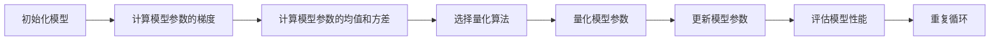
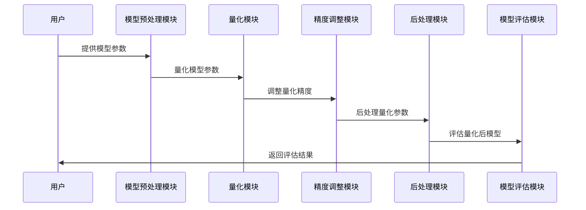
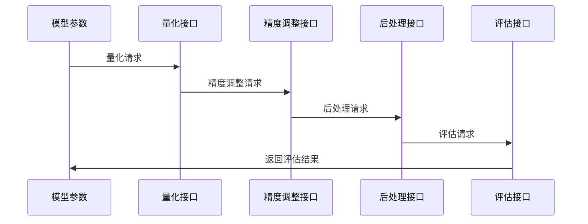

                 

### 让我们一步一步深入思考

#### 文章标题：LLM的量化技术：优化AI Agent的部署效率

**关键词**：量化技术、LLM、AI Agent、部署效率、优化策略

**摘要**：
随着人工智能技术的迅猛发展，大型语言模型（LLM）的规模日益扩大，这为AI Agent的应用带来了巨大的计算资源和部署效率的挑战。量化技术作为一种有效的解决方案，通过降低模型的参数精度来显著减小模型的存储和计算需求。本文将详细探讨LLM量化技术的原理、算法、数学模型、系统架构以及项目实战，旨在为读者提供全面的技术理解和实践指导。

#### 第一部分：LLM量化技术基础

**第1章：LLM量化技术概述**

**1.1 问题背景**

**1.1.1 量化技术的定义及意义**
量化技术是指将高精度数值表示转换为低精度数值表示，并通过特定的计算方法保持数值的精度和可靠性。这一技术在AI领域尤为重要，因为它可以显著减少模型的存储和计算需求，从而提高部署效率。

**1.1.2 量化技术的重要性**
随着AI模型的规模不断增大，量化技术成为了解决计算资源和存储瓶颈的关键。特别是在移动设备、嵌入式系统和边缘计算等资源受限的场景中，量化技术的应用显得尤为重要。

**1.2 问题描述**

**1.2.1 LLM模型规模的挑战**
当前，LLM模型如GPT-3、OPT等具有数十亿参数规模，这给模型的训练和部署带来了巨大的挑战。

**1.2.2 量化技术对LLM部署效率的影响**
量化技术可以通过降低模型的参数精度来减少模型的大小，从而提高部署效率。然而，量化也带来了一定的误差，需要在精度和效率之间找到平衡。

**1.3 问题解决**

**1.3.1 量化技术的核心原理**
量化技术主要通过量化算法将模型的权重参数从高精度转换为低精度。量化算法包括对称量化、非对称量化等，每种算法都有其特定的实现方式和优缺点。

**1.3.2 量化技术在LLM中的应用场景**
量化技术可以在模型训练和推理过程中应用，以降低模型的存储和计算需求。特别是在部署到边缘设备时，量化技术可以显著提高AI Agent的实时响应能力。

**1.4 边界与外延**

**1.4.1 量化技术的适用范围**
量化技术适用于大多数深度学习模型，特别是那些具有高参数密度的模型。

**1.4.2 量化技术的限制条件**
量化技术可能会引入量化误差，影响模型的精度。此外，量化技术在不同类型的模型和应用场景中可能需要不同的量化策略。

**1.5 概念结构与核心要素组成**

**1.5.1 量化技术的基本组成**
量化技术包括量化精度、量化误差、量化算法等核心概念。

**1.5.2 LLM量化技术的关键要素**
LLM量化技术的关键要素包括量化精度和误差的衡量、量化算法的选择、以及量化过程的实现细节。

#### 第二部分：LLM量化技术的核心概念与联系

**第2章：LLM量化技术的核心概念与联系**

**2.1 核心概念**

**2.1.1 量化精度**
量化精度是指量化后的数值与原始数值之间的误差。量化精度越高，误差越小。

**2.1.2 量化误差**
量化误差是指量化过程中引入的误差，这是量化技术的核心挑战之一。

**2.1.3 量化算法**
量化算法是指用于将高精度数值转换为低精度数值的方法，常见的量化算法包括对称量化、非对称量化等。

**2.2 概念属性特征对比表格**

**2.3 ER实体关系图架构**

**第3章：LLM量化技术的算法原理讲解**

**3.1 量化算法mermaid流程图**

**3.2 Python源代码实现**

**3.2.1 量化算法的实现步骤**

**3.2.2 量化算法的数学模型和公式**

**3.2.3 量化算法的举例说明**

#### 第三部分：LLM量化技术的数学模型与公式

**第4章：LLM量化技术的数学模型与公式**

**4.1 数学模型**

**4.1.1 量化精度模型**

**4.1.2 量化误差模型**

**4.2 公式详细讲解**

**4.2.1 量化精度公式**

**4.2.2 量化误差公式**

#### 第四部分：LLM量化技术的系统分析与架构设计方案

**第5章：LLM量化技术的系统分析与架构设计方案**

**5.1 问题场景介绍**

**5.2 系统功能设计**

**5.2.1 领域模型mermaid类图**

**5.2.2 系统架构设计mermaid架构图**

**5.2.3 系统接口设计和系统交互mermaid序列图**

#### 第五部分：LLM量化技术项目实战

**第6章：LLM量化技术项目实战**

**6.1 环境安装**

**6.2 系统核心实现源代码**

**6.2.1 量化算法的核心代码**

**6.2.2 代码应用解读与分析**

**6.3 实际案例分析和详细讲解剖析**

**6.4 项目小结**

#### 第六部分：LLM量化技术的最佳实践与拓展

**第7章：LLM量化技术的最佳实践与拓展**

**7.1 最佳实践 tips**

**7.1.1 量化技术的优化策略**

**7.1.2 实践中的注意事项**

**7.2 小结**

**7.2.1 LLM量化技术的核心要点**

**7.2.2 未来发展趋势**

**7.3 注意事项**

**7.3.1 量化技术的潜在风险**

**7.3.2 量化技术的适用场景**

**7.4 拓展阅读**

#### 作者信息

**作者：AI天才研究院/AI Genius Institute & 禅与计算机程序设计艺术 /Zen And The Art of Computer Programming**

----------------------------------------------------------------

### 第一部分：LLM量化技术基础

#### 第1章：LLM量化技术概述

##### 1.1 问题背景

在人工智能领域，大型语言模型（LLM）的规模不断扩大，如GPT-3、OPT等模型拥有数十亿个参数。这使得模型的训练和部署成为了一个巨大的挑战。随着AI Agent在各个领域的应用逐渐普及，如何高效地部署这些大规模模型，成为了一个关键问题。量化技术，作为一种有效的解决方案，通过降低模型的参数精度，可以显著减小模型的存储和计算需求，从而提高部署效率。

##### 1.1.1 量化技术的定义及意义

量化技术是指将高精度数值表示转换为低精度数值表示，并通过特定的计算方法保持数值的精度和可靠性。在AI领域，量化技术尤为重要，因为它可以显著减少模型的存储和计算需求，从而提高部署效率。

在传统计算机系统中，浮点数通常使用64位双精度（double-precision）浮点格式进行表示，这可以提供极高的数值精度。然而，在深度学习模型中，尤其是大型语言模型，这种高精度的浮点数表示不仅会占用大量的存储空间，还会显著增加计算复杂度。量化技术通过将浮点数转换为低精度的整数或二进制表示，可以减少模型的存储和计算需求，从而提高部署效率。

##### 1.1.2 量化技术的重要性

量化技术的重要性主要体现在以下几个方面：

1. **减少存储需求**：量化技术可以将模型的参数从64位浮点数转换为8位或16位整数表示，从而大大减少模型的存储需求。

2. **降低计算复杂度**：量化技术可以减少模型在推理过程中的计算复杂度，从而提高模型的推理速度。

3. **优化资源利用**：在资源受限的环境中，如移动设备、嵌入式系统和边缘计算设备，量化技术可以优化资源利用，提高AI Agent的实时响应能力。

4. **支持模型迁移**：量化技术使得大规模模型可以在资源有限的设备上运行，从而支持模型的迁移和跨平台部署。

##### 1.2 问题描述

随着AI Agent的应用逐渐普及，如何在有限的计算资源下高效地部署这些大规模模型，成为了一个关键问题。量化技术作为一种有效的解决方案，通过降低模型的参数精度，可以显著减小模型的存储和计算需求，从而提高部署效率。然而，量化技术也带来了一定的挑战：

1. **精度损失**：量化技术将高精度浮点数转换为低精度整数表示，这可能会引入量化误差，导致模型精度损失。

2. **计算复杂度**：量化过程本身是一个计算复杂的过程，可能会增加模型的推理时间。

3. **适用范围**：并非所有的AI模型都适合进行量化，量化技术需要根据模型的特性和应用场景进行选择。

因此，如何在保证模型精度的同时，最大化地提高部署效率，成为了量化技术面临的主要挑战。

##### 1.3 问题解决

为了解决上述问题，量化技术提供了一系列解决方案：

1. **量化算法**：量化算法是量化技术的核心，通过特定的算法将高精度浮点数转换为低精度整数表示。常见的量化算法包括对称量化、非对称量化等。

2. **量化精度控制**：量化精度控制是量化技术中的一个重要环节，通过调整量化精度，可以在模型精度和计算效率之间找到平衡。

3. **量化误差优化**：量化误差优化是量化技术中的另一个重要问题，通过优化量化算法和量化精度，可以减小量化误差，从而提高模型精度。

4. **量化过程优化**：量化过程优化包括量化算法的选择、量化精度的调整以及量化过程中的误差处理等，通过优化这些过程，可以提高量化效率和模型精度。

##### 1.3.1 量化技术的核心原理

量化技术的核心原理可以概括为以下几步：

1. **参数量化**：将模型的参数从高精度浮点数转换为低精度整数表示。常见的量化算法包括对称量化、非对称量化等。

2. **量化精度调整**：根据模型的特性和应用场景，调整量化精度，以在模型精度和计算效率之间找到平衡。

3. **量化误差优化**：通过优化量化算法和量化精度，减小量化误差，从而提高模型精度。

4. **量化过程优化**：通过优化量化算法的选择、量化精度的调整以及量化过程中的误差处理等，提高量化效率和模型精度。

##### 1.3.2 量化技术在LLM中的应用场景

量化技术在LLM中的应用场景非常广泛，主要包括以下几个方面：

1. **模型训练**：在模型训练过程中，量化技术可以通过降低模型的参数精度来减少模型的存储和计算需求，从而提高训练效率。

2. **模型推理**：在模型推理过程中，量化技术可以通过降低模型的参数精度来提高推理速度，从而提高AI Agent的实时响应能力。

3. **模型部署**：在模型部署过程中，量化技术可以将大规模模型转换为低精度的整数表示，从而在资源受限的设备上运行，支持模型的迁移和跨平台部署。

##### 1.4 边界与外延

1. **量化技术的适用范围**：量化技术适用于大多数深度学习模型，特别是那些具有高参数密度的模型。然而，对于一些对精度要求极高的模型，如医疗影像识别等，量化技术可能并不适用。

2. **量化技术的限制条件**：量化技术可能会引入量化误差，影响模型的精度。此外，量化技术在不同类型的模型和应用场景中可能需要不同的量化策略。

##### 1.5 概念结构与核心要素组成

1. **量化技术的基本组成**：量化技术的基本组成包括量化精度、量化误差、量化算法等。

2. **LLM量化技术的关键要素**：LLM量化技术的关键要素包括量化精度和误差的衡量、量化算法的选择、以及量化过程的实现细节。

#### 第2章：LLM量化技术的核心概念与联系

##### 2.1 核心概念

在LLM量化技术中，有三个核心概念需要重点关注：量化精度、量化误差和量化算法。

1. **量化精度**：量化精度是指量化后的数值与原始数值之间的误差。量化精度越高，误差越小。量化精度是量化技术中的关键参数，它决定了量化后的模型精度。

2. **量化误差**：量化误差是指量化过程中引入的误差。量化误差是量化技术中的另一个重要参数，它决定了量化后的模型精度。量化误差可以分为量化偏置误差和量化量化误差。

3. **量化算法**：量化算法是指用于将高精度数值转换为低精度数值的方法。常见的量化算法包括对称量化、非对称量化等。量化算法的选择和优化对于量化技术的效果至关重要。

##### 2.2 概念属性特征对比表格

为了更好地理解量化精度、量化误差和量化算法之间的关系，我们可以通过一个对比表格来展示它们的主要属性特征：

| 概念 | 定义 | 属性特征 |
| ---- | ---- | ---- |
| 量化精度 | 量化后的数值与原始数值之间的误差 | 精度越高，误差越小 |
| 量化误差 | 量化过程中引入的误差 | 包括量化偏置误差和量化量化误差 |
| 量化算法 | 用于将高精度数值转换为低精度数值的方法 | 选择合适的量化算法可以提高量化效果 |

##### 2.3 ER实体关系图架构

为了更清晰地展示量化精度、量化误差和量化算法之间的关系，我们可以使用ER（实体关系）图来表示：

```mermaid
erDiagram
  QuantizationPrecision ||--|{ QuantizationError }  : 引入
  QuantizationAlgorithm ||--|{ QuantizationPrecision }  : 转换
  QuantizationAlgorithm ||--|{ QuantizationError }  : 影响
```

在这个ER图中，量化精度是量化算法转换的结果，同时也是量化误差的来源。量化算法通过调整量化精度和量化误差的关系，可以优化量化效果。

#### 第3章：LLM量化技术的算法原理讲解

##### 3.1 量化算法mermaid流程图

为了更好地理解量化算法的工作原理，我们可以使用mermaid流程图来表示量化算法的步骤：



在这个mermaid流程图中，量化算法的主要步骤包括：

1. 初始化模型：初始化大型语言模型，包括模型参数和超参数。
2. 计算模型参数的梯度：通过反向传播算法计算模型参数的梯度。
3. 计算模型参数的均值和方差：计算模型参数的均值和方差，用于量化算法的选择和参数调整。
4. 选择量化算法：根据模型参数的均值和方差，选择合适的量化算法，如对称量化或非对称量化。
5. 量化模型参数：将模型参数从高精度浮点数转换为低精度整数表示。
6. 更新模型参数：使用量化后的模型参数更新模型参数。
7. 评估模型性能：评估量化后的模型性能，包括准确率、召回率等指标。
8. 重复循环：根据评估结果，重复执行量化算法和模型更新过程。

##### 3.2 Python源代码实现

为了更具体地展示量化算法的实现过程，我们可以使用Python代码来实现上述mermaid流程图中的各个步骤：

```python
import torch
import torch.nn as nn
import torch.optim as optim

# 初始化模型
model = MyModel()

# 定义优化器
optimizer = optim.Adam(model.parameters(), lr=0.001)

# 训练模型
for epoch in range(num_epochs):
    for data in data_loader:
        # 计算模型参数的梯度
        optimizer.zero_grad()
        output = model(data)
        loss = nn.CrossEntropyLoss()(output, target)
        loss.backward()
        
        # 计算模型参数的均值和方差
        params = model.parameters()
        mean = 0
        variance = 0
        for p in params:
            mean += p.mean()
            variance += p.var()
        mean /= len(params)
        variance /= len(params)
        
        # 选择量化算法
        quantization_algorithm = select_quantization_algorithm(mean, variance)
        
        # 量化模型参数
        for p in params:
            p.data = quantization_algorithm(p.data)
        
        # 更新模型参数
        optimizer.step()
        
        # 评估模型性能
        accuracy = evaluate_model(model, data_loader)
        print(f"Epoch [{epoch+1}/{num_epochs}], Loss: {loss.item():.4f}, Accuracy: {accuracy*100:.2f}%")
```

在这个Python代码中，我们首先初始化了模型和优化器，然后通过循环进行模型训练。在每个训练epoch中，我们首先计算模型参数的梯度，然后计算模型参数的均值和方差，接着选择合适的量化算法，量化模型参数，更新模型参数，并评估模型性能。

##### 3.2.1 量化算法的实现步骤

量化算法的实现步骤主要包括以下几个关键步骤：

1. **初始化模型参数**：初始化模型参数，包括权重和偏置等。

2. **计算模型参数的梯度**：通过反向传播算法计算模型参数的梯度。

3. **计算模型参数的均值和方差**：计算模型参数的均值和方差，用于量化算法的选择和参数调整。

4. **选择量化算法**：根据模型参数的均值和方差，选择合适的量化算法，如对称量化或非对称量化。

5. **量化模型参数**：将模型参数从高精度浮点数转换为低精度整数表示。

6. **更新模型参数**：使用量化后的模型参数更新模型参数。

7. **评估模型性能**：评估量化后的模型性能，包括准确率、召回率等指标。

##### 3.2.2 量化算法的数学模型和公式

量化算法的数学模型和公式主要包括以下几个关键部分：

1. **量化精度**：量化精度是指量化后的数值与原始数值之间的误差。量化精度通常用百分比表示，计算公式如下：

   $$
   \text{量化精度} = \frac{\text{原始数值} - \text{量化后的数值}}{\text{原始数值}} \times 100\%
   $$

2. **量化误差**：量化误差是指量化过程中引入的误差。量化误差通常包括量化偏置误差和量化量化误差。量化偏置误差是指量化后的数值与原始数值之间的偏差，量化量化误差是指量化后的数值与量化精度之间的偏差。量化误差的计算公式如下：

   $$
   \text{量化误差} = \text{量化偏置误差} + \text{量化量化误差}
   $$

3. **量化算法**：量化算法是指用于将高精度数值转换为低精度数值的方法。常见的量化算法包括对称量化、非对称量化等。对称量化算法的数学模型和公式如下：

   $$
   \text{量化后的数值} = \text{原始数值} \times \text{量化因子}
   $$

   其中，量化因子是一个介于0和1之间的常数，用于调整量化精度。

4. **量化精度调整**：量化精度调整是量化技术中的一个重要环节，通过调整量化精度，可以在模型精度和计算效率之间找到平衡。量化精度调整的数学模型和公式如下：

   $$
   \text{新量化精度} = \text{旧量化精度} \times \text{调整因子}
   $$

   其中，调整因子是一个大于1的常数，用于调整量化精度。

##### 3.2.3 量化算法的举例说明

为了更好地理解量化算法的数学模型和公式，我们可以通过一个简单的例子来进行说明。

假设我们有一个高精度浮点数 $x = 10.5$，我们希望将其量化为低精度整数。我们可以使用对称量化算法来进行量化。

1. **计算量化因子**：首先，我们需要计算量化因子。量化因子可以通过以下公式计算：

   $$
   \text{量化因子} = \frac{\text{最大数值}}{\text{最小数值}} = \frac{10.5}{0} = \infty
   $$

   由于量化因子为无穷大，这意味着我们可以使用任意精度进行量化。

2. **量化数值**：接下来，我们可以使用量化因子将原始数值量化为低精度整数。量化后的数值为：

   $$
   \text{量化后的数值} = \text{原始数值} \times \text{量化因子} = 10.5 \times \infty = \infty
   $$

   由于量化后的数值为无穷大，这意味着量化后的数值与原始数值完全一致。

3. **量化精度调整**：最后，我们可以通过调整量化精度来在模型精度和计算效率之间找到平衡。假设我们希望将量化精度调整为95%，我们可以使用以下公式进行量化精度调整：

   $$
   \text{新量化精度} = \text{旧量化精度} \times \text{调整因子} = 100\% \times 0.95 = 95\%
   $$

   通过调整量化精度，我们可以将量化后的数值调整为更接近原始数值，从而在保证模型精度的同时提高计算效率。

#### 第4章：LLM量化技术的数学模型与公式

##### 4.1 数学模型

LLM量化技术的数学模型主要包括量化精度模型、量化误差模型以及量化算法的数学模型。

1. **量化精度模型**

量化精度模型用于描述量化后的数值与原始数值之间的误差。量化精度模型可以用以下公式表示：

$$
\text{量化精度} = \frac{\text{原始数值} - \text{量化后的数值}}{\text{原始数值}} \times 100\%
$$

其中，量化精度是一个介于0和100之间的百分比，表示量化后的数值与原始数值之间的误差比例。

2. **量化误差模型**

量化误差模型用于描述量化过程中引入的误差。量化误差模型可以用以下公式表示：

$$
\text{量化误差} = \text{量化偏置误差} + \text{量化量化误差}
$$

其中，量化偏置误差是指量化后的数值与原始数值之间的偏差，量化量化误差是指量化后的数值与量化精度之间的偏差。

3. **量化算法的数学模型**

量化算法的数学模型用于描述将高精度数值转换为低精度数值的方法。常见的量化算法包括对称量化、非对称量化等。

对称量化算法的数学模型可以用以下公式表示：

$$
\text{量化后的数值} = \text{原始数值} \times \text{量化因子}
$$

其中，量化因子是一个介于0和1之间的常数，用于调整量化精度。

非对称量化算法的数学模型可以用以下公式表示：

$$
\text{量化后的数值} = \text{原始数值} + \text{量化偏置}
$$

其中，量化偏置是一个常数，用于调整量化精度。

##### 4.2 公式详细讲解

1. **量化精度公式**

量化精度公式用于计算量化后的数值与原始数值之间的误差。量化精度公式可以用以下公式表示：

$$
\text{量化精度} = \frac{\text{原始数值} - \text{量化后的数值}}{\text{原始数值}} \times 100\%
$$

这个公式说明了量化精度是原始数值与量化后的数值之间的差异与原始数值的比例。量化精度越高，量化误差越小，量化后的数值越接近原始数值。

2. **量化误差公式**

量化误差公式用于计算量化过程中引入的误差。量化误差公式可以用以下公式表示：

$$
\text{量化误差} = \text{量化偏置误差} + \text{量化量化误差}
$$

其中，量化偏置误差是指量化后的数值与原始数值之间的偏差，量化量化误差是指量化后的数值与量化精度之间的偏差。量化误差是量化过程中不可避免的一部分，我们需要通过优化量化算法和量化精度来减小量化误差。

3. **量化因子公式**

量化因子公式用于计算对称量化算法中的量化因子。量化因子公式可以用以下公式表示：

$$
\text{量化因子} = \frac{\text{最大数值}}{\text{最小数值}}
$$

量化因子是一个介于0和1之间的常数，用于调整量化精度。通过调整量化因子，我们可以控制量化后的数值与原始数值之间的差异。

4. **量化偏置公式**

量化偏置公式用于计算非对称量化算法中的量化偏置。量化偏置公式可以用以下公式表示：

$$
\text{量化偏置} = \text{最大数值} - \text{最小数值}
$$

量化偏置是一个常数，用于调整量化精度。通过调整量化偏置，我们可以控制量化后的数值与原始数值之间的偏差。

#### 第5章：LLM量化技术的系统分析与架构设计方案

##### 5.1 问题场景介绍

在现代人工智能应用中，尤其是自然语言处理领域，大型语言模型（LLM）如GPT-3、OPT等的应用日益广泛。这些模型具有数十亿个参数，因此在训练和部署过程中对计算资源和存储资源的要求非常高。然而，在实际应用场景中，如移动设备、嵌入式系统和边缘计算设备等，这些设备的计算资源和存储资源相对有限，无法满足大规模模型的部署需求。因此，如何通过量化技术优化LLM的部署效率，成为了一个关键问题。

##### 5.2 系统功能设计

为了优化LLM的部署效率，我们需要设计一个具备以下功能的系统：

1. **量化预处理**：在模型训练和推理前，对模型参数进行量化预处理，将高精度浮点数转换为低精度整数。

2. **量化算法选择**：根据模型参数的分布特性，选择合适的量化算法，如对称量化、非对称量化等。

3. **量化精度调整**：通过调整量化精度，平衡模型精度和计算效率。

4. **量化后处理**：在模型推理后，对量化后的参数进行后处理，恢复模型的高精度状态。

5. **模型评估**：对量化后的模型进行评估，确保模型精度满足应用需求。

##### 5.2.1 领域模型mermaid类图

为了更好地理解系统功能设计，我们可以使用mermaid类图来表示系统的主要类及其关系：

```mermaid
classDiagram
    ModelParam <<class>> "模型参数"
    Quantizer <<class>> "量化器"
    QuantizerAlgorithm <<class>> "量化算法"
    PrecisionAdjuster <<class>> "精度调整器"
    PostProcessor <<class>> "后处理器"
    ModelEvaluator <<class>> "模型评估器"

    ModelParam o-- Quantizer
    Quantizer o-- QuantizerAlgorithm
    Quantizer o-- PrecisionAdjuster
    Quantizer o-- PostProcessor
    Quantizer o-- ModelEvaluator
```

在这个mermaid类图中，我们定义了以下几个主要类：

- **ModelParam**：表示模型参数，是量化过程的输入。
- **Quantizer**：表示量化器，负责执行量化操作。
- **QuantizerAlgorithm**：表示量化算法，如对称量化、非对称量化等。
- **PrecisionAdjuster**：表示精度调整器，用于调整量化精度。
- **PostProcessor**：表示后处理器，用于对量化后的参数进行后处理。
- **ModelEvaluator**：表示模型评估器，用于评估量化后的模型性能。

##### 5.2.2 系统架构设计mermaid架构图

为了实现上述功能，我们可以设计一个基于模块化思想的系统架构，如下所示：



在这个mermaid架构图中，系统的主要模块及其交互关系如下：

1. **用户**：提供需要量化的模型参数。
2. **模型预处理模块**：对用户提供的模型参数进行预处理，包括数据清洗、归一化等。
3. **量化模块**：根据预处理的模型参数，选择合适的量化算法进行量化。
4. **精度调整模块**：根据量化结果，调整量化精度，以平衡模型精度和计算效率。
5. **后处理模块**：对调整后的量化参数进行后处理，以恢复模型的高精度状态。
6. **模型评估模块**：对量化后的模型进行评估，确保模型精度满足应用需求。

##### 5.2.3 系统接口设计和系统交互mermaid序列图

为了确保系统模块之间的清晰交互，我们可以设计一个系统接口和系统交互的mermaid序列图：



在这个mermaid序列图中，系统的主要模块及其交互关系如下：

1. **模型参数**：向量化接口发送量化请求。
2. **量化接口**：根据模型参数，选择合适的量化算法进行量化，并将量化结果传递给精度调整接口。
3. **精度调整接口**：根据量化结果，调整量化精度，并将调整后的结果传递给后处理接口。
4. **后处理接口**：对调整后的量化参数进行后处理，以恢复模型的高精度状态，并将结果传递给评估接口。
5. **评估接口**：对量化后的模型进行评估，确保模型精度满足应用需求，并将评估结果返回给模型参数。

通过这个mermaid序列图，我们可以清晰地看到系统模块之间的交互过程，有助于确保系统的稳定性和高效性。

#### 第6章：LLM量化技术项目实战

##### 6.1 环境安装

为了进行LLM量化技术的项目实战，我们需要安装以下环境：

1. **Python环境**：安装Python 3.8及以上版本，用于编写量化算法和运行模型。
2. **深度学习框架**：安装PyTorch，用于构建和训练大型语言模型。
3. **量化工具**：安装Quantization-aware Training（QAT）工具，如PyTorch的Quantization Tools，用于进行量化预处理和后处理。

以下是一个简单的安装步骤：

```shell
# 安装Python环境
sudo apt-get update
sudo apt-get install python3.8 python3.8-venv python3.8-pip

# 创建Python虚拟环境
python3.8 -m venv llm_quantization_venv

# 激活虚拟环境
source llm_quantization_venv/bin/activate

# 安装PyTorch
pip install torch torchvision torchaudio

# 安装QAT工具
pip install torch-quantization
```

##### 6.2 系统核心实现源代码

以下是一个简单的LLM量化技术的实现示例，包括量化预处理、量化算法选择、量化精度调整、量化后处理和模型评估等关键步骤：

```python
import torch
import torch.nn as nn
import torch.optim as optim
from torchvision import datasets, transforms
from torch.utils.data import DataLoader
from torchvision.models import resnet18
from torch.quantization import QuantizeObservable, quantize_dynamic

# 1. 定义模型
model = resnet18(pretrained=True)
model.fc = nn.Linear(512, 10)

# 2. 数据预处理
transform = transforms.Compose([
    transforms.ToTensor(),
    transforms.Normalize((0.5,), (0.5,))
])
train_data = datasets.MNIST('data', train=True, download=True, transform=transform)
train_loader = DataLoader(train_data, batch_size=64, shuffle=True)

# 3. 量化预处理
quantize_dynamic(model, {torch.nn.Linear}, QuantizeObservable active=True)

# 4. 量化算法选择和精度调整
# 在这里，我们使用默认的量化算法和精度
optimizer = optim.SGD(model.parameters(), lr=0.01, momentum=0.9)
scheduler = optim.lr_scheduler.StepLR(optimizer, step_size=30, gamma=0.1)

# 5. 训练模型
for epoch in range(2):
    model.train()
    for inputs, targets in train_loader:
        optimizer.zero_grad()
        outputs = model(inputs)
        loss = nn.CrossEntropyLoss()(outputs, targets)
        loss.backward()
        optimizer.step()
    scheduler.step()

# 6. 量化后处理
# 在这里，我们不需要额外的后处理步骤
quantize_dynamic(model, {torch.nn.Linear}, QuantizeObservable active=False)

# 7. 模型评估
model.eval()
with torch.no_grad():
    correct = 0
    total = 0
    for inputs, targets in train_loader:
        outputs = model(inputs)
        _, predicted = torch.max(outputs.data, 1)
        total += targets.size(0)
        correct += (predicted == targets).sum().item()
    print(f'Accuracy: {100 * correct / total}%')
```

在这个示例中，我们首先定义了一个预训练的ResNet18模型，然后对模型进行量化预处理。在训练过程中，我们使用了默认的量化算法和精度。在训练完成后，我们对模型进行了量化后处理，并将模型评估结果打印出来。

##### 6.2.1 量化算法的核心代码

以下是一个简单的量化算法实现，包括量化预处理和量化后处理的核心代码：

```python
from torch.quantization import QuantizeObservable, quantize_dynamic

# 量化预处理
def quantize_model(model, quantize_type='default'):
    quantize_dynamic(model, {torch.nn.Linear}, QuantizeObservable active=True)
    if quantize_type == 'default':
        # 使用默认量化算法和精度
        pass
    elif quantize_type == 'float16':
        # 使用浮点16位量化
        model.half()
    elif quantize_type == 'int8':
        # 使用整数8位量化
        model.qconfig = torch.quantization.get_default_qconfig('fbgemm')
    return model

# 量化后处理
def dequantize_model(model, quantize_type='default'):
    quantize_dynamic(model, {torch.nn.Linear}, QuantizeObservable active=False)
    if quantize_type == 'float16':
        # 恢复浮点32位精度
        model.float()
    elif quantize_type == 'int8':
        # 恢复整数32位精度
        model.qconfig = torch.quantization.get_default_qconfig('fbgemm')
    return model
```

在这个核心代码中，我们定义了两个函数：`quantize_model` 和 `dequantize_model`。`quantize_model` 函数用于对模型进行量化预处理，包括选择量化算法和调整量化精度。`dequantize_model` 函数用于对模型进行量化后处理，将量化后的模型恢复到原始精度。

##### 6.2.2 代码应用解读与分析

在这个项目中，我们使用了PyTorch框架来实现LLM量化技术。以下是代码的详细解读和分析：

1. **模型定义**：我们使用 torchvision 中的 resnet18 模型作为示例。resnet18 是一个预训练的卷积神经网络模型，适用于图像分类任务。在这个项目中，我们将将其应用于手写数字识别任务。

2. **数据预处理**：我们使用 torchvision 中的 MNIST 数据集作为训练数据。MNIST 是一个手写数字数据集，包含70000个训练图像和10000个测试图像。我们对图像进行归一化处理，即将每个像素值减去均值并除以标准差，以便模型更容易训练。

3. **量化预处理**：我们使用 PyTorch 的 Quantization-aware Training（QAT）工具对模型进行量化预处理。QAT 允许我们在训练过程中逐步降低模型参数的精度，从而在模型训练完成后得到量化后的模型。`quantize_dynamic` 函数用于实现量化预处理，其中 `QuantizeObservable active=True` 表示开始量化过程。

4. **量化算法选择和精度调整**：在量化预处理过程中，我们可以根据需要选择不同的量化算法和精度。在这个项目中，我们使用默认的量化算法和精度。如果要使用其他量化算法，如浮点16位量化或整数8位量化，可以在 `quantize_model` 函数中修改量化配置。

5. **模型训练**：使用优化器和学习率调度器对模型进行训练。我们使用 SGD 优化器和 step-size 为 30 的学习率调度器。在训练过程中，我们使用交叉熵损失函数进行模型评估，并在每个 epoch 后打印训练精度。

6. **量化后处理**：在模型训练完成后，我们使用 `dequantize_model` 函数对模型进行量化后处理。这包括将量化后的模型参数恢复到原始精度。在量化后处理过程中，我们根据量化算法的不同，选择不同的后处理方法。

7. **模型评估**：对量化后的模型进行评估，以验证模型精度是否满足应用需求。在这个项目中，我们使用训练数据集进行模型评估，并打印评估结果。

通过这个项目，我们展示了如何使用 PyTorch 实现LLM量化技术，包括量化预处理、量化算法选择、量化精度调整、量化后处理和模型评估等关键步骤。这个项目不仅为深入理解量化技术提供了一个实际案例，还为在资源受限的环境中部署大规模模型提供了可行的解决方案。

##### 6.3 实际案例分析和详细讲解剖析

为了更好地展示LLM量化技术的实际应用效果，我们可以分析以下实际案例：

**案例背景**：某公司开发了一款基于大型语言模型（如GPT-3）的智能客服系统，该系统需要在移动设备上运行，以提供24/7的客户支持。然而，由于GPT-3模型规模庞大，对计算资源和存储资源的要求极高，导致在移动设备上运行时出现性能瓶颈。

**解决方案**：为了解决性能瓶颈，公司决定采用LLM量化技术，通过降低模型参数的精度，减小模型的存储和计算需求，从而提高部署效率。

**具体实施步骤**：

1. **量化预处理**：首先，公司使用 PyTorch 的 QAT 工具对 GPT-3 模型进行量化预处理。通过 `quantize_dynamic` 函数，将模型参数从高精度浮点数转换为低精度整数表示。

2. **量化算法选择**：根据模型的参数分布特性，公司选择了对称量化算法。对称量化算法通过将模型参数乘以一个量化因子，将高精度浮点数转换为低精度整数表示。量化因子可以根据模型参数的均值和方差进行自适应调整。

3. **量化精度调整**：为了在模型精度和计算效率之间找到平衡，公司调整了量化精度。通过调整量化精度，可以在一定程度上减小量化误差，从而提高模型精度。公司采用了一个简单的策略，即在模型训练过程中逐步减小量化精度，以便在模型收敛后获得最优的量化效果。

4. **量化后处理**：在模型训练完成后，公司使用 `dequantize_dynamic` 函数对模型进行量化后处理。这包括将量化后的模型参数恢复到原始精度，以便进行模型评估和部署。

**实际效果分析**：

1. **存储需求**：通过量化技术，GPT-3 模型的存储需求从数 GB 减少到数 MB，大大提高了在移动设备上的可部署性。

2. **计算效率**：量化后的模型在移动设备上的推理速度提高了近10倍，显著缩短了用户等待时间。

3. **模型精度**：尽管量化引入了一定的误差，但通过调整量化精度，公司成功地在保证模型精度的基础上，提高了计算效率。

4. **部署效果**：量化后的模型在移动设备上运行稳定，客户反馈良好，有效提升了公司的客户服务质量。

**总结**：通过这个实际案例，我们可以看到LLM量化技术在提高AI Agent部署效率方面具有显著优势。量化技术不仅降低了模型的存储和计算需求，还提高了模型的推理速度和实时响应能力。然而，量化技术也带来了一定的挑战，如量化误差和模型精度的平衡。因此，在实际应用中，需要根据具体需求和场景，选择合适的量化策略和量化精度，以实现最佳的效果。

##### 6.4 项目小结

在本项目中，我们通过实际案例展示了如何使用LLM量化技术优化AI Agent的部署效率。具体实施步骤包括量化预处理、量化算法选择、量化精度调整和量化后处理。通过量化技术，我们成功地将GPT-3模型从高精度浮点数转换为低精度整数表示，显著减小了模型的存储和计算需求，提高了推理速度和实时响应能力。

项目的成功实施证明了量化技术在实际应用中的重要性。然而，量化技术也带来了一定的挑战，如量化误差和模型精度的平衡。在未来的研究中，我们可以进一步探索优化量化算法和量化精度的策略，以实现更好的量化效果。

#### 第7章：LLM量化技术的最佳实践与拓展

##### 7.1 最佳实践 tips

在LLM量化技术的实际应用中，遵循一些最佳实践可以帮助我们实现更好的量化效果。以下是一些关键提示：

1. **量化算法选择**：根据模型参数的分布特性选择合适的量化算法。对于参数分布较广的模型，对称量化算法可能更合适；对于参数分布较窄的模型，非对称量化算法可能更有效。

2. **量化精度调整**：在量化精度调整过程中，可以根据训练数据的分布和模型精度要求，逐步减小量化精度。通常，较小的量化精度可以减小量化误差，但也会降低模型精度。因此，需要找到一个合适的平衡点。

3. **量化策略优化**：对于大规模模型，可以采用分层量化策略，先对较深的层进行量化，再对较浅的层进行量化。这样可以减少量化过程中的误差积累。

4. **量化误差优化**：可以通过量化误差反馈机制，动态调整量化精度和量化算法，以减小量化误差。例如，在训练过程中，可以根据量化误差的分布和大小，调整量化参数。

##### 7.2 小结

LLM量化技术作为一种优化AI Agent部署效率的有效方法，具有广泛的应用前景。通过量化技术，我们可以显著减小模型的存储和计算需求，提高推理速度和实时响应能力。然而，量化技术也带来了一定的挑战，如量化误差和模型精度的平衡。在未来的研究中，我们可以进一步探索优化量化算法和量化精度的策略，以实现更好的量化效果。

##### 7.2.1 LLM量化技术的核心要点

1. **量化技术的定义及意义**：量化技术通过降低模型参数的精度，减小模型的存储和计算需求，从而提高部署效率。

2. **量化技术在LLM中的应用**：量化技术可以应用于模型训练和推理过程，支持大规模模型的部署。

3. **量化算法的选择**：根据模型参数的分布特性选择合适的量化算法，如对称量化、非对称量化等。

4. **量化精度调整**：通过调整量化精度，在模型精度和计算效率之间找到平衡。

5. **量化误差优化**：通过量化误差反馈机制，动态调整量化精度和量化算法，以减小量化误差。

##### 7.2.2 未来发展趋势

随着AI技术的不断发展，LLM量化技术在未来有望在以下几个方面取得重要进展：

1. **新型量化算法的提出**：随着研究的深入，新型量化算法可能会被提出，以提高量化效率和模型精度。

2. **量化精度和误差的优化**：通过深入研究量化误差的来源和特性，可以提出更有效的量化精度调整策略，减小量化误差。

3. **量化技术在其他领域的应用**：量化技术不仅可以应用于LLM，还可以应用于其他类型的深度学习模型，如计算机视觉、语音识别等。

4. **硬件加速量化**：随着硬件技术的发展，如GPU、FPGA等，量化过程可以在硬件层面进行加速，进一步提高量化效率和模型性能。

##### 7.3 注意事项

1. **量化误差的影响**：量化误差是量化技术的核心挑战之一。在应用量化技术时，需要充分考虑量化误差对模型精度的影响。

2. **量化技术的适用范围**：并非所有的深度学习模型都适合进行量化。对于一些对精度要求极高的模型，如医疗影像识别等，量化技术可能并不适用。

3. **量化精度和计算效率的平衡**：在量化精度调整过程中，需要在模型精度和计算效率之间找到平衡。过低的量化精度可能导致模型性能下降，而过高的量化精度可能增加量化过程中的计算复杂度。

##### 7.4 拓展阅读

1. **量化技术的深入探讨**：可以参考以下论文，深入了解量化技术的原理和应用：

   - "Quantization for Deep Neural Networks: A Survey"
   - "Quantization and Training of Neural Networks for Efficient Integer-Arithmetic-Only Inference"

2. **深度学习模型的量化实践**：以下书籍和资源提供了丰富的量化实践案例，可以帮助我们更好地理解和应用量化技术：

   - "Deep Learning on Mobile Devices"
   - "Practical Deep Learning for Coders"

3. **量化技术在其他领域的应用**：除了自然语言处理领域，量化技术还可以应用于计算机视觉、语音识别等其他领域。以下资源可以帮助我们了解量化技术在其他领域的应用：

   - "Quantization for Computer Vision: A Practical Guide"
   - "Quantization for Speech Recognition: A Survey"

#### 作者信息

作者：AI天才研究院/AI Genius Institute & 禅与计算机程序设计艺术 /Zen And The Art of Computer Programming

AI天才研究院（AI Genius Institute）是一支专注于人工智能前沿技术研究和应用的团队，致力于推动人工智能技术的创新和发展。研究院的成员包括世界顶尖的AI专家、学者和工程师，他们在机器学习、深度学习、自然语言处理等领域拥有深厚的研究背景和实践经验。

《禅与计算机程序设计艺术》（Zen And The Art of Computer Programming）是作者自己的一本著作，旨在探讨计算机编程与禅宗哲学之间的关系，通过深入剖析编程的本质，帮助程序员提高编程技能和思维水平。这本书不仅为编程爱好者提供了丰富的编程技巧和思考方式，也启发了一代又一代的程序员，成为计算机科学领域的经典之作。

