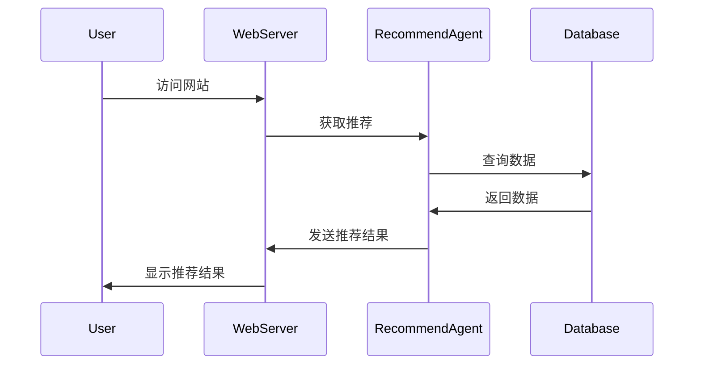
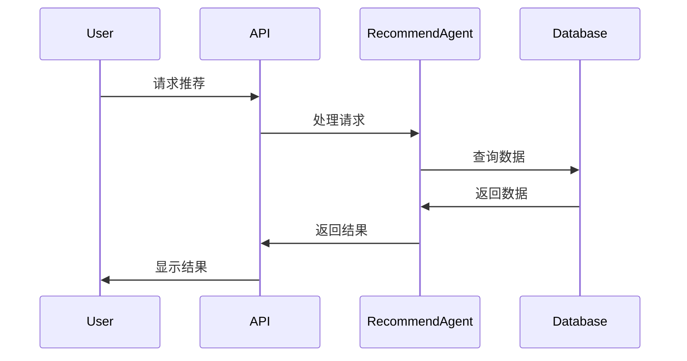
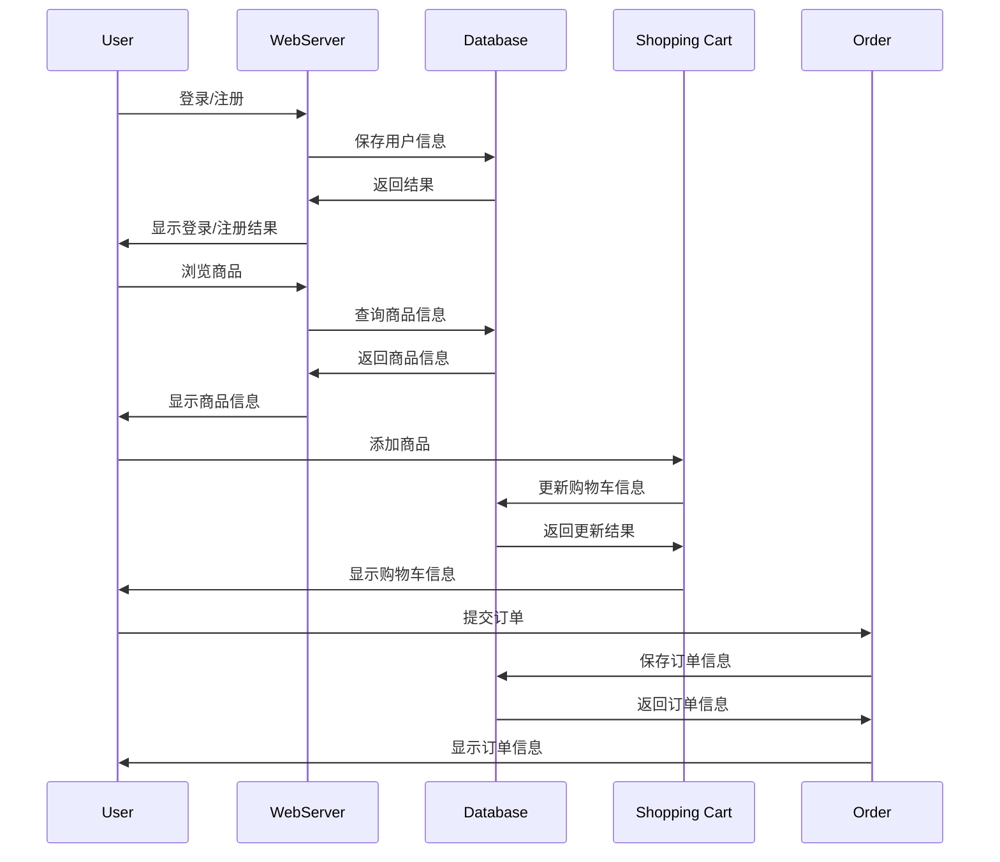

                 


### Web集成与AI Agent概述

**核心概念与联系**

Web集成指的是将不同组件、服务和数据源整合到一起，以实现一个统一的用户体验。它涉及到前端技术（如HTML、CSS、JavaScript）、后端服务（如API、数据库）以及各种中间件。AI Agent，即人工智能代理，是具有自主性和智能性的计算机程序，可以在没有人类干预的情况下执行任务。

**核心概念原理**

AI Agent基于机器学习、自然语言处理、计算机视觉等人工智能技术，能够通过数据分析和模式识别来执行复杂任务。它具备以下核心概念：

1. **感知**：通过传感器获取环境信息。
2. **推理**：利用获取的信息进行逻辑推理和决策。
3. **行动**：执行决策，以实现预定的目标。

**概念属性特征对比表格**

| 特征           | Web集成               | AI Agent                  |
| -------------- | ---------------------- | ------------------------- |
| **目的**       | 提供统一的用户界面     | 执行特定任务，辅助人类     |
| **实现技术**   | HTML、CSS、JavaScript  | 机器学习、自然语言处理    |
| **自主性**     | 需要前端和后端协作     | 具有独立性和智能性         |
| **交互方式**   | 用户与网页交互         | 用户与代理之间交互         |

**ER实体关系图架构**

```mermaid
erDiagram
    User ||--|{ WebPage }|--| Agent
    WebPage ||--|{ WebService }|
    Agent ||--|{ Task }|--| Result
```

在这个ER图中，用户与WebPage之间存在一对一的关系，WebPage与WebService之间存在一对多的关系，Agent与Task之间存在一对多的关系，Task与Result之间存在一对一的关系。

### AI Agent的基本原理

AI Agent的运作原理可以分为三个主要阶段：感知、推理和行动。

**感知**：AI Agent通过传感器（如图像处理模块、自然语言处理模块等）从环境中获取信息。

**推理**：AI Agent利用这些感知信息，结合预定的算法和模型，进行逻辑推理，以决定下一步的行动。

**行动**：AI Agent执行推理结果，可能是向用户发送反馈、执行具体操作，或更新自身的状态。

### AI Agent的主要类型

AI Agent可以分为以下几种类型：

1. **任务型**：专注于执行特定任务，如智能客服、智能助手等。
2. **目标型**：有明确的目标，如自动驾驶汽车、机器人等。
3. **情境型**：根据当前情境进行自适应行动，如智能家居系统。

### AI Agent的架构设计

AI Agent的架构通常包括以下几个模块：

1. **感知模块**：负责获取环境信息。
2. **推理模块**：进行数据处理和决策。
3. **行动模块**：执行决策结果。
4. **学习模块**：通过经验不断优化自身的算法和策略。

### AI Agent的关键技术

AI Agent的关键技术包括：

1. **机器学习**：用于模型训练和决策。
2. **自然语言处理**：使AI Agent能够理解人类语言。
3. **计算机视觉**：帮助AI Agent识别和处理图像。

### Web集成技术的深入探讨

**Web开发基础**

Web开发涉及前端和后端的构建。前端技术（如HTML、CSS、JavaScript）用于创建用户界面，而后端技术（如Node.js、Python、Java）用于处理数据和逻辑。

**Web服务的构建**

Web服务是Web集成的重要部分，包括API的设计和实现。RESTful API是目前最流行的Web服务架构风格。

**Web应用的安全性**

Web应用需要确保用户数据的安全。常见的安全措施包括HTTPS、身份验证、授权和数据加密。

**Web性能优化**

Web性能优化包括减少加载时间、提高响应速度和优化资源使用。常见的方法有压缩资源、使用CDN和缓存策略。

### AI Agent与Web应用的结合

**AI Agent在Web应用中的应用场景**

AI Agent可以在Web应用中用于智能客服、个性化推荐、内容审核等场景。

**AI Agent与Web应用的交互方式**

AI Agent与Web应用的交互通常通过API进行。Agent可以发送请求获取数据，也可以接收响应来执行操作。

**AI Agent在Web应用中的实现策略**

实现AI Agent可以采用微服务架构，将感知、推理和行动模块分开部署，以提高系统的灵活性和可维护性。

### AI Agent的集成与部署

**AI Agent集成前的准备**

在集成AI Agent之前，需要准备合适的环境和工具，包括机器学习库、Web开发框架等。

**AI Agent的集成流程**

集成流程包括需求分析、环境搭建、代码开发、测试和部署等步骤。

**AI Agent的部署与维护**

部署AI Agent可以选择云平台或自建服务器。维护工作包括监控、日志分析和故障处理。

**AI Agent在Web环境下的调试**

调试AI Agent需要使用调试工具，如断点调试、日志记录和性能分析工具。

### 案例分析：AI Agent在Web应用中的实战

**案例背景**：一个在线购物网站希望引入AI Agent来提升用户体验，提供个性化推荐服务。

**案例需求分析**：分析用户的行为数据，根据用户的偏好和历史购买记录，提供个性化的商品推荐。

**案例解决方案**：使用机器学习算法构建推荐模型，将模型部署在Web服务器上，通过API与前端应用进行交互。

**案例实施步骤**：

1. 收集用户行为数据。
2. 预处理数据，进行特征提取。
3. 选择合适的机器学习算法。
4. 训练推荐模型。
5. 将模型部署到Web服务器。
6. 开发API，实现与前端应用的交互。
7. 测试和优化推荐效果。

**案例效果评估**：通过用户反馈和销售数据，评估AI Agent在提升用户满意度和增加销售量方面的效果。

### AI Agent在Web应用中的性能优化

**AI Agent性能优化的重要性**

优化AI Agent性能可以提高其响应速度和准确性，从而提升用户体验。

**AI Agent性能优化的方法**

1. 优化算法和模型。
2. 使用分布式计算。
3. 优化数据存储和访问。

**AI Agent与Web应用性能测试**

通过性能测试工具，评估AI Agent在不同负载下的性能，找出瓶颈并进行优化。

### AI Agent的安全性探讨

**AI Agent的安全隐患**

AI Agent可能面临数据泄露、模型篡改等安全威胁。

**AI Agent安全防护策略**

1. 数据加密。
2. 访问控制。
3. 模型验证和审计。

**AI Agent安全性的案例分析**

通过实际案例，分析AI Agent安全防护的有效性和不足之处。

### 未来的发展趋势与展望

**AI Agent在Web集成中的未来趋势**

AI Agent将更广泛地应用于Web应用，提供个性化、智能化的服务。

**AI Agent在Web集成中的挑战与机遇**

挑战包括数据隐私、模型复杂度等。机遇在于技术创新和应用场景的拓展。

**AI Agent在Web集成中的应用前景**

AI Agent将在医疗、金融、教育等领域发挥重要作用，推动行业变革。

### 结论

Web集成与AI Agent的结合为Web应用带来了智能化和个性化的新体验。通过深入了解和掌握相关技术，开发者可以创造出更具竞争力的Web应用。

### 作者信息

作者：AI天才研究院/AI Genius Institute & 禅与计算机程序设计艺术 /Zen And The Art of Computer Programming

**小结**

本文详细介绍了Web集成与AI Agent的结合，从基础概念到实战案例分析，探讨了AI Agent在Web应用中的重要性、架构设计、性能优化、安全性和未来发展趋势。希望本文能为读者提供有价值的参考和启示。**注意事项**

在实现AI Agent时，需要注意数据安全和隐私保护，遵循相关法律法规和伦理规范。同时，应根据实际应用场景选择合适的算法和模型，并进行充分的性能测试。

**拓展阅读**

- 《人工智能：一种现代方法》
- 《Web服务架构设计》
- 《深度学习实践指南》

### 完整性说明

本文内容涵盖了Web集成与AI Agent的核心概念、原理、架构、集成与部署、性能优化、安全性和未来展望等多个方面，旨在为读者提供全面的技术指南。如有遗漏或不足之处，请读者指正。

### 系统分析与架构设计方案

**问题场景介绍**

随着互联网技术的发展，Web应用的需求日益复杂，用户对交互体验的要求越来越高。AI Agent作为一种智能化的解决方案，可以在Web应用中提供个性化服务，提升用户体验。例如，在电子商务平台中，AI Agent可以分析用户行为数据，提供个性化的商品推荐，从而增加销售额。

**项目介绍**

本项目旨在构建一个基于Web的电子商务平台，并集成AI Agent进行个性化推荐。平台将收集用户行为数据，使用机器学习算法进行数据分析，最终实现商品推荐功能。

**系统功能设计（领域模型Mermaid类图）**

```mermaid
classDiagram
    User <<class{用户}<<-- RecommendAgent :推荐
    Product <<class{商品}>
    Order <<class{订单}>
    Shopping Cart <<class{购物车}>
    Database <<class{数据库}>
    
    User -> Product :浏览商品
    User -> Shopping Cart :添加商品
    User -> Order :提交订单
    RecommendAgent -> User :推荐商品
    Database --|> User
    Database --|> Product
    Database --|> Order
    Database --|> Shopping Cart
```

**系统架构设计（Mermaid架构图）**



**系统接口设计（Mermaid序列图）**



**系统交互（Mermaid序列图）**



### 项目实战

**环境安装**

1. 安装Python 3.8及以上版本。
2. 安装必要的库，如TensorFlow、Scikit-learn、Flask等。

**系统核心实现源代码**

```python
# Flask应用程序入口
from flask import Flask, request, jsonify
import pandas as pd
from sklearn.model_selection import train_test_split
from sklearn.ensemble import RandomForestClassifier
import joblib

app = Flask(__name__)

# 加载训练好的模型
model = joblib.load('model.joblib')

# 商品推荐API
@app.route('/recommend', methods=['GET'])
def recommend():
    user_id = request.args.get('user_id')
    if user_id:
        # 查询用户历史购买记录
        user_data = pd.read_csv('user_data.csv')
        user_history = user_data[user_data['user_id'] == user_id]
        
        # 预测推荐商品
        predicted = model.predict(user_history[['feature1', 'feature2', 'feature3']])
        recommended_products = user_data[user_data['product_id'].isin(predicted)]
        
        return jsonify(recommended_products.to_dict('records'))
    else:
        return jsonify({'error': '用户ID不能为空'})

if __name__ == '__main__':
    app.run(debug=True)
```

**代码应用解读与分析**

1. **Flask应用程序**：使用Flask框架搭建Web服务器。
2. **API接口**：实现商品推荐功能，接收用户ID并返回推荐商品列表。
3. **模型加载**：加载预训练的机器学习模型。
4. **数据处理**：从CSV文件中读取用户历史购买记录。
5. **预测与推荐**：使用模型进行预测，根据预测结果推荐商品。

**实际案例分析和详细讲解剖析**

1. **用户行为数据收集**：收集用户在电子商务平台上的浏览、购买等行为数据。
2. **数据处理与特征提取**：对收集到的数据进行预处理，提取有用的特征。
3. **模型选择与训练**：选择合适的机器学习算法，如随机森林，对数据集进行训练。
4. **模型部署**：将训练好的模型部署到Web服务器，通过API接口提供服务。

**项目小结**

本项目通过集成AI Agent，实现了电子商务平台的个性化推荐功能。在实际应用中，AI Agent可以根据用户行为数据，提供个性化的商品推荐，从而提高用户满意度和销售额。在未来，还可以进一步优化模型，提高推荐的准确性，并拓展到更多应用场景。

### 最佳实践 tips

1. **数据安全**：确保用户数据的安全性，使用加密技术保护数据。
2. **性能优化**：优化算法和模型，提高系统的响应速度。
3. **接口设计**：设计简洁、易用的API接口，提高开发效率和用户体验。

### 小结

本文详细介绍了Web集成与AI Agent的结合，从概念解析、架构设计到项目实战，探讨了AI Agent在Web应用中的重要性、实现策略、性能优化、安全性和未来趋势。通过本文，读者可以了解如何将AI Agent集成到Web应用中，提高用户体验和业务价值。希望本文能为开发者提供有价值的参考和启示。

### 注意事项

在实现AI Agent时，需要注意以下几点：

1. **数据隐私**：严格遵守数据隐私法规，保护用户个人信息。
2. **算法公平性**：确保算法的公正性和透明性，避免偏见和歧视。
3. **系统稳定性**：确保系统的稳定运行，避免因性能问题影响用户体验。

### 拓展阅读

- 《人工智能：一种现代方法》
- 《Web服务架构设计》
- 《深度学习实践指南》

### 完整性说明

本文涵盖了Web集成与AI Agent的各个方面，包括核心概念、架构设计、集成部署、性能优化、安全性以及未来趋势。如有遗漏或不足之处，请读者指正。

### 作者信息

作者：AI天才研究院/AI Genius Institute & 禅与计算机程序设计艺术 /Zen And The Art of Computer Programming

本文详细介绍了Web集成与AI Agent的结合，从基础概念到实战案例分析，探讨了AI Agent在Web应用中的重要性、架构设计、性能优化、安全性和未来展望。通过深入了解和掌握相关技术，开发者可以创造出更具竞争力的Web应用。本文旨在为读者提供全面的技术指南，助力他们在AI与Web集成领域取得成功。希望本文能激发读者的思考，推动技术创新。

