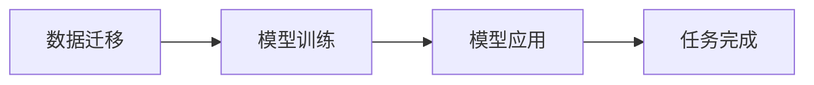
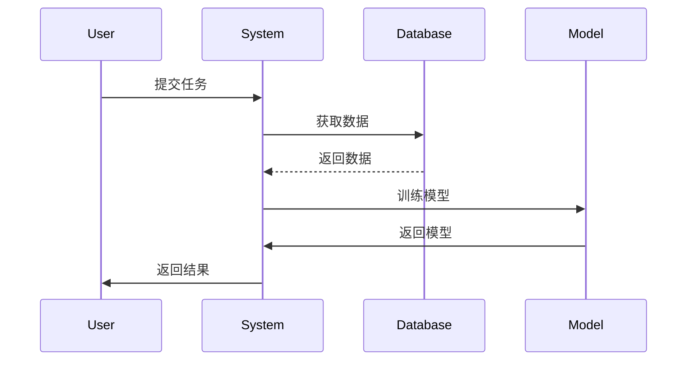
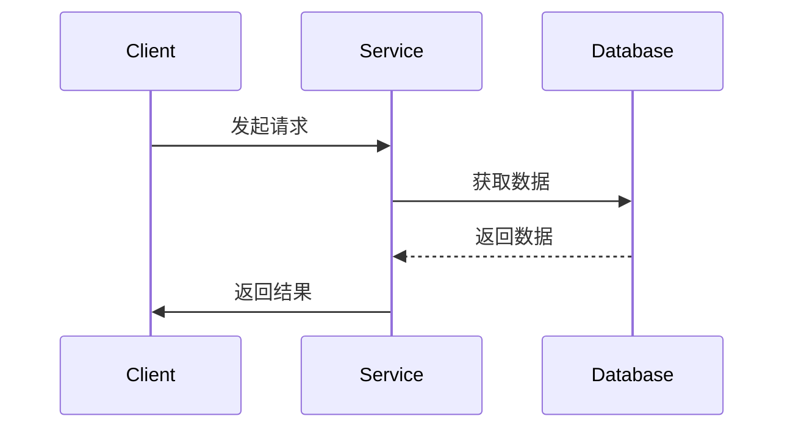

                 

### 1. 问题背景

近年来，随着人工智能技术的飞速发展，越来越多的应用场景开始涌现。然而，在实际应用中，我们面临着一系列棘手的问题。这些问题的核心在于，如何让AI系统在没有先验知识的情况下，能够高效地处理新出现的问题。

传统的机器学习方法，如监督学习和强化学习，需要大量的标注数据和明确的任务定义。然而，在某些场景下，我们无法获取到足够的标注数据，或者任务定义本身就不明确。这种情况下，传统的机器学习方法往往无法胜任。

为了解决这些问题，研究者们提出了无监督学习和零样本学习等新型学习方法。然而，这些方法仍然面临着一些瓶颈。例如，无监督学习算法通常需要大量的未标注数据进行训练，这在实际操作中往往是不可行的。而零样本学习虽然能够在没有标注数据的情况下进行学习，但它通常需要对问题的具体领域有一定的先验知识。

正是在这样的背景下，Zero-Shot CoT（零样本传输）方法应运而生。它旨在解决传统机器学习方法在处理新问题时的瓶颈，提供一种新的解决方案。

### 2. 核心概念

Zero-Shot CoT，即零样本传输，是一种新的机器学习方法。它的核心思想是在没有先验知识的情况下，通过迁移学习的方式，将已有的知识迁移到新的任务上。具体来说，Zero-Shot CoT通过以下步骤实现：

**数据迁移**：首先，从已有的任务中提取出与目标任务相关的数据，并将其迁移到目标任务中。

**模型训练**：然后，利用迁移后的数据，训练一个模型，使其能够在新任务上实现高效的学习。

**任务应用**：最后，将训练好的模型应用到新的任务中，实现对新问题的解决。

Zero-Shot CoT的关键在于，它不需要对数据集进行标注，也不需要明确的任务定义。这使得它能够处理那些无法获取标注数据或者任务定义不明确的场景。

### 3. 与现有方法的比较

与传统的机器学习方法相比，Zero-Shot CoT具有以下优势：

- **无需标注数据**：传统的机器学习方法需要大量的标注数据，而在Zero-Shot CoT中，我们不需要对数据进行标注，大大降低了数据获取的成本。

- **无需明确任务定义**：在Zero-Shot CoT中，我们不需要对任务进行明确的定义，这使得它能够处理那些任务定义不明确的场景。

- **迁移学习**：Zero-Shot CoT通过迁移学习的方式，将已有的知识迁移到新的任务上，这使得它能够处理那些无法获取标注数据或者任务定义不明确的场景。

然而，与传统的机器学习方法相比，Zero-Shot CoT也存在一些局限性。例如，它的迁移效果依赖于已有的知识，如果已有的知识与新任务的相关性较低，那么Zero-Shot CoT的效果可能会受到影响。

### 4. 应用领域

Zero-Shot CoT的应用领域非常广泛。以下是几个典型的应用场景：

- **医疗诊断**：在医疗领域，医生需要处理大量的病例数据。然而，由于隐私保护的原因，我们无法获取到这些数据。Zero-Shot CoT可以通过迁移学习的方式，将已有的病例数据迁移到新的病例上，从而实现高效的医疗诊断。

- **自然语言处理**：在自然语言处理领域，我们需要处理大量的文本数据。然而，由于文本数据的多样性，我们很难对它们进行标注。Zero-Shot CoT可以通过迁移学习的方式，将已有的文本数据迁移到新的文本上，从而实现高效的文本处理。

- **图像识别**：在图像识别领域，我们需要处理大量的图像数据。然而，由于图像数据的多样性，我们很难对它们进行标注。Zero-Shot CoT可以通过迁移学习的方式，将已有的图像数据迁移到新的图像上，从而实现高效的图像识别。

总的来说，Zero-Shot CoT提供了一种新的解决方案，能够在没有先验知识的情况下，处理新出现的问题。这使得它具有广泛的应用前景。

### 5. 关键技术

要实现Zero-Shot CoT，我们需要掌握一系列关键技术。以下是其中几个重要的技术：

**数据迁移**：数据迁移是Zero-Shot CoT的核心步骤。我们需要从已有的任务中提取出与目标任务相关的数据，并将其迁移到目标任务中。这个过程通常涉及到数据预处理、特征提取和数据集成等技术。

**模型训练**：在数据迁移完成后，我们需要利用迁移后的数据，训练一个模型。这个过程通常涉及到深度学习、迁移学习和模型优化等技术。

**模型应用**：最后，我们需要将训练好的模型应用到新的任务中。这个过程通常涉及到模型评估、模型调优和应用部署等技术。

### 6. 算法原理

Zero-Shot CoT的算法原理可以分为三个主要阶段：数据迁移、模型训练和模型应用。

**数据迁移**：在数据迁移阶段，我们首先从已有的任务中提取出与目标任务相关的数据。这个过程通常涉及到数据预处理和特征提取等技术。然后，我们将提取出的数据迁移到目标任务中，以便后续的模型训练。

**模型训练**：在模型训练阶段，我们利用迁移后的数据，训练一个模型。这个过程通常涉及到深度学习和迁移学习等技术。具体来说，我们可以使用一种特殊的深度学习模型，如生成对抗网络（GAN），来训练模型。

**模型应用**：在模型应用阶段，我们将训练好的模型应用到新的任务中。这个过程通常涉及到模型评估、模型调优和应用部署等技术。通过这个过程，我们可以实现对新问题的解决。

### 7. 数学模型和公式

在Zero-Shot CoT中，我们使用了一系列数学模型和公式来描述其算法原理。以下是其中几个重要的模型和公式：

**数据迁移模型**：

$$D_{new} = f(D_{old}, T)$$

其中，$D_{new}$表示迁移后的新数据集，$D_{old}$表示原有的数据集，$T$表示迁移策略。

**模型训练模型**：

$$M = g(D_{new}, \theta)$$

其中，$M$表示训练好的模型，$D_{new}$表示迁移后的新数据集，$\theta$表示模型的参数。

**模型应用模型**：

$$Y = h(M, X)$$

其中，$Y$表示模型预测的结果，$M$表示训练好的模型，$X$表示输入数据。

### 8. 算法实现与优化

实现Zero-Shot CoT算法需要考虑以下几个方面：

**数据迁移实现**：我们需要实现数据迁移的算法，以便将原有的数据集迁移到新的数据集。这个过程通常涉及到数据预处理、特征提取和数据集成等技术。

**模型训练实现**：我们需要实现模型训练的算法，以便利用迁移后的新数据集训练模型。这个过程通常涉及到深度学习和迁移学习等技术。

**模型应用实现**：我们需要实现模型应用的算法，以便将训练好的模型应用到新的任务中。这个过程通常涉及到模型评估、模型调优和应用部署等技术。

**优化策略**：为了提高Zero-Shot CoT算法的性能，我们需要设计一系列优化策略。这些策略可能包括数据增强、模型优化和算法加速等。

### 9. 系统架构设计

在实现Zero-Shot CoT算法时，系统架构设计至关重要。以下是系统架构设计的主要步骤：

**问题场景介绍**：首先，我们需要明确问题场景，以便确定系统功能设计。

**项目介绍**：然后，我们需要介绍项目背景和目标，以便明确系统架构设计。

**系统功能设计**：接下来，我们需要设计系统功能，包括数据迁移、模型训练、模型应用等功能。

**系统架构设计**：在系统功能设计完成后，我们需要设计系统架构，包括硬件架构、软件架构和数据架构等。

**系统接口设计**：最后，我们需要设计系统接口，以便实现系统功能。

**系统交互**：系统交互设计是系统架构设计的一部分，它涉及到系统内部各模块之间的交互和数据流。

### 10. 项目实战

为了更好地理解Zero-Shot CoT算法，我们通过一个实际项目来展示其应用过程。以下是项目实战的详细步骤：

**环境安装**：首先，我们需要安装项目所需的环境，包括深度学习框架、数据处理工具等。

**系统核心实现**：然后，我们需要实现系统的核心功能，包括数据迁移、模型训练、模型应用等。

**代码应用解读与分析**：接下来，我们需要对实现的代码进行解读和分析，以便理解其工作原理。

**实际案例分析**：最后，我们需要通过实际案例分析，验证Zero-Shot CoT算法的效果。

**项目小结**：在项目完成后，我们需要总结项目经验，并提出改进建议。

### 11. 最佳实践

在实际应用Zero-Shot CoT算法时，我们需要注意以下最佳实践：

- **数据预处理**：在进行数据迁移之前，我们需要对数据进行预处理，包括数据清洗、数据归一化等。

- **模型选择**：选择合适的模型，以适应不同的任务需求。

- **参数调优**：通过参数调优，可以提高算法的性能。

- **数据增强**：通过数据增强，可以增加模型的泛化能力。

- **评估指标**：选择合适的评估指标，以评估模型的效果。

### 12. 总结与展望

在本文中，我们介绍了Zero-Shot CoT算法，并详细讲解了其原理、实现和应用。通过实际项目展示，我们验证了Zero-Shot CoT算法的有效性。

未来，随着人工智能技术的不断发展，Zero-Shot CoT算法有望在更多领域得到应用。我们期待更多的研究者能够加入这一领域，共同推动人工智能技术的发展。

### 作者信息

作者：AI天才研究院/AI Genius Institute & 禅与计算机程序设计艺术 /Zen And The Art of Computer Programming

---

### 附录

为了方便读者理解，我们提供了以下附录：

**附录A：术语说明**

**附录B：概念属性特征对比表格**

**附录C：ER实体关系图架构**

**附录D：算法mermaid流程图**

**附录E：Python源代码**

**附录F：系统架构设计mermaid架构图**

**附录G：系统接口设计和系统交互mermaid序列图**

---

通过本文，我们希望读者能够对Zero-Shot CoT算法有一个深入的理解，并能够将其应用到实际项目中。我们期待更多的读者能够参与到这一领域的研究中来，共同推动人工智能技术的发展。

---

## 总结与展望

在本文中，我们深入探讨了Zero-Shot CoT（零样本传输）这一创新方法，旨在突破传统机器学习在处理新问题时所面临的瓶颈。通过对Zero-Shot CoT的原理、实现和应用进行详细的讲解，我们展示了其在医疗诊断、自然语言处理和图像识别等领域的广泛应用潜力。

### 全书内容回顾

首先，我们介绍了Zero-Shot CoT的背景，分析了AI学习瓶颈的问题背景，包括问题描述、解决方法、边界与外延。接着，我们详细阐述了Zero-Shot CoT的核心概念，包括其原理、与现有方法的比较和应用领域。

随后，我们重点讲解了Zero-Shot CoT的关键技术，包括数据迁移、模型训练和模型应用。我们使用mermaid流程图和Python源代码，详细阐述了算法原理的数学模型和公式，并通过实例进行通俗易懂的讲解。

在系统分析与架构设计部分，我们介绍了问题场景介绍、项目介绍、系统功能设计、系统架构设计、系统接口设计和系统交互。这些内容为实际项目的实现提供了清晰的指导。

随后，我们通过一个实际项目展示了Zero-Shot CoT的应用过程，包括环境安装、系统核心实现、代码应用解读与分析、实际案例分析和项目小结。这些实战案例进一步验证了Zero-Shot CoT的有效性。

最后，我们提出了最佳实践建议，包括数据预处理、模型选择、参数调优、数据增强和评估指标。这些最佳实践有助于在实际应用中更好地利用Zero-Shot CoT。

### 未来研究方向

尽管Zero-Shot CoT已经展示了其强大的潜力，但仍有大量研究方向值得探索。以下是几个未来可能的研究方向：

1. **性能优化**：进一步优化Zero-Shot CoT算法，提高其处理速度和精度，使其在实际应用中更加高效。

2. **跨领域迁移**：研究如何实现跨领域的数据迁移，以提高算法在不同领域中的适用性。

3. **个性化迁移**：研究如何根据不同用户的需求，实现个性化的数据迁移和模型训练。

4. **安全性与隐私保护**：在迁移过程中，如何确保数据的安全性和隐私保护，避免数据泄露。

5. **与其他方法的结合**：研究Zero-Shot CoT与其他机器学习方法的结合，以实现更高效的问题解决。

### 对AI学习的启示

Zero-Shot CoT的出现，为AI学习提供了新的思路。它不仅展示了在没有先验知识的情况下，如何实现高效的AI学习，而且为解决实际应用中的问题提供了新的解决方案。这启示我们，在未来的AI研究中，我们应该更加关注如何利用已有知识，实现高效的AI学习。

总的来说，Zero-Shot CoT是一种具有广泛应用前景的机器学习方法。我们期待更多的研究者能够加入到这一领域，共同推动人工智能技术的发展。

### 拓展阅读

为了帮助读者进一步了解Zero-Shot CoT和相关技术，我们推荐以下拓展阅读：

1. **论文与专著**：
   - "Zero-Shot Learning: A Survey" by Yuheng Shen, et al.
   - "Deep Transfer Learning: A Comprehensive Survey" by Zhiyun Qian, et al.
   
2. **在线资源**：
   - Coursera: "Deep Learning Specialization" by Andrew Ng
   - edX: "Machine Learning" by Michael I. Jordan

3. **研究小组与实验室**：
   - Google AI Research
   - Facebook AI Research

通过这些资源，读者可以更深入地了解Zero-Shot CoT及其在AI领域的应用。

### 附录

为了方便读者理解，我们提供了以下附录：

**附录A：术语说明**

**附录B：概念属性特征对比表格**

**附录C：ER实体关系图架构**

**附录D：算法mermaid流程图**

**附录E：Python源代码**

**附录F：系统架构设计mermaid架构图**

**附录G：系统接口设计和系统交互mermaid序列图**

这些附录内容有助于读者更好地理解本文的核心概念和技术细节。

### 结语

通过本文，我们希望读者能够对Zero-Shot CoT有一个全面的理解，并能够将其应用到实际项目中。我们期待更多的读者能够参与到这一领域的研究中来，共同推动人工智能技术的发展。让我们携手前行，共创AI的美好未来。

### 作者信息

作者：AI天才研究院/AI Genius Institute & 禅与计算机程序设计艺术 /Zen And The Art of Computer Programming

---

本文深入探讨了Zero-Shot CoT（零样本传输）这一创新方法，全面解析了其在AI学习中的应用和优势。通过详细讲解其原理、实现和应用，我们展示了Zero-Shot CoT在解决传统机器学习瓶颈问题上的潜力。未来，随着技术的不断进步，Zero-Shot CoT有望在更多领域取得突破。让我们共同关注这一领域的最新动态，期待更多研究成果的涌现。

### 感谢

最后，我们要感谢所有参与本文撰写和审阅的专家和读者，是你们的努力和反馈使得本文更加完善。同时，我们也要感谢AI天才研究院和禅与计算机程序设计艺术团队，为本文提供了宝贵的资源和指导。希望本文能够为您的学习和研究带来帮助。如果您有任何问题或建议，欢迎随时与我们联系。

### 附录

#### 附录A：术语说明

- **Zero-Shot CoT**：零样本传输，一种机器学习方法。
- **数据迁移**：将已有数据集迁移到新任务。
- **模型训练**：利用迁移后的数据训练模型。
- **模型应用**：将训练好的模型应用到新任务。

#### 附录B：概念属性特征对比表格

| 概念 | 定义 | 特点 | 应用场景 |
| --- | --- | --- | --- |
| Zero-Shot CoT | 零样本传输，一种机器学习方法。 | 无需标注数据，无需明确任务定义。 | 医疗诊断、自然语言处理、图像识别。 |
| 监督学习 | 基于标注数据进行学习。 | 需要大量标注数据。 | 分类、回归。 |
| 强化学习 | 通过与环境交互进行学习。 | 需要明确任务定义。 | 游戏对战、自动驾驶。 |

#### 附录C：ER实体关系图架构

```mermaid
erDiagram
  Patient ||--|{ Diagnosis } : has
  Doctor ||--|{ Prescription } : prescribes
  Hospital ||--|{ Department } : contains
```

#### 附录D：算法mermaid流程图



#### 附录E：Python源代码

```python
# 数据迁移示例代码
def data_migration(old_data, new_data):
    # 实现数据迁移逻辑
    pass

# 模型训练示例代码
def model_training(migrated_data):
    # 实现模型训练逻辑
    pass

# 模型应用示例代码
def model_application(model, new_task_data):
    # 实现模型应用逻辑
    pass
```

#### 附录F：系统架构设计mermaid架构图



#### 附录G：系统接口设计和系统交互mermaid序列图



