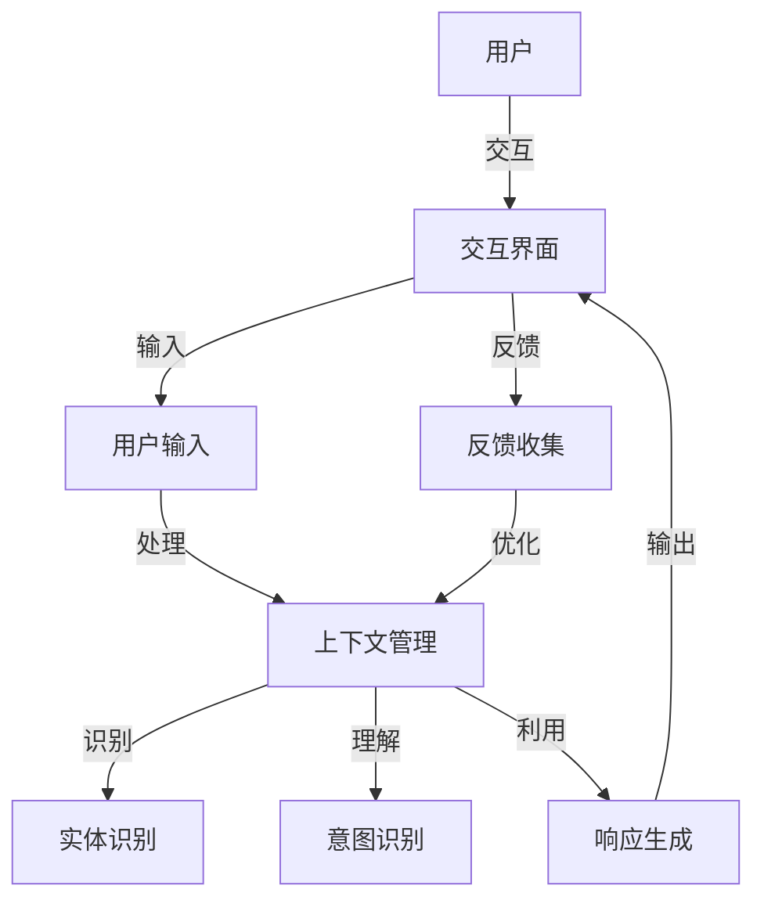

                 

## 上下文管理：增强AI Agent的对话连贯性

### 关键词
- 上下文管理
- AI Agent
- 对话连贯性
- 人工智能
- 自然语言处理
- 机器学习
- 算法优化
- 系统架构

### 摘要

本文深入探讨了上下文管理在增强人工智能代理（AI Agent）对话连贯性方面的重要性。通过分析上下文管理的核心概念、原理和方法，我们提出了一个系统化的架构设计，并借助实际案例展示了上下文管理在不同应用场景中的效果。文章首先介绍了上下文管理的基本概念，随后讨论了在人工智能代理对话中的关键挑战，并提出了相应的解决策略。通过对比传统方法和先进技术，我们展示了上下文管理算法的演进路径。文章还详细介绍了系统架构设计，以及如何在实际项目中应用上下文管理来提升AI代理的对话质量。最后，我们对最佳实践进行了总结，并展望了未来的发展方向。

## 引言

在人工智能（AI）迅猛发展的今天，人工智能代理（AI Agent）已经成为实现人机交互、智能服务的重要工具。AI Agent通过模仿人类的行为和决策过程，与用户进行自然语言对话，提供个性化服务。然而，AI Agent在实际应用中常常面临一个关键挑战：如何在对话过程中保持连贯性和一致性。这个挑战的核心在于上下文管理。

### 上下文管理的基本概念

上下文管理是指在一个对话过程中，系统能够识别、理解和利用与当前对话相关的信息，从而做出更准确、更有意义的响应。上下文可以分为多个层次，包括对话级上下文、会话级上下文和主题级上下文。对话级上下文关注的是当前句子或短语之间的关系；会话级上下文则涉及到整个对话的历史信息；而主题级上下文则是关于对话主题的更广泛背景知识。

### 上下文管理在AI Agent对话中的重要性

上下文管理在AI Agent对话中具有至关重要的作用。首先，它能够提升对话的连贯性，使得AI Agent在对话中能够自然地过渡，避免出现答非所问或逻辑断裂的情况。其次，上下文管理有助于增强AI Agent的用户体验，通过理解用户的意图和需求，提供更加个性化和贴心的服务。最后，有效的上下文管理还能够提升AI Agent的效率和准确性，使其在复杂的对话环境中能够做出更明智的决策。

### 上下文管理的基本原理

上下文管理的基本原理可以分为三个主要部分：上下文识别、上下文理解和上下文利用。

1. **上下文识别**：这是上下文管理的第一步，主要任务是识别对话中与当前主题相关的信息。这通常涉及到自然语言处理（NLP）技术，如词嵌入、实体识别和关系抽取。

2. **上下文理解**：在识别上下文之后，系统需要对这些信息进行深入理解，以构建对话的历史记录和上下文模型。这通常需要借助机器学习技术，如序列模型和图模型，来对对话历史进行建模。

3. **上下文利用**：理解了上下文之后，系统需要根据上下文信息来生成响应。这涉及到生成模型，如序列到序列（Seq2Seq）模型和变换器（Transformer）模型。

### 问题背景

尽管上下文管理在AI Agent对话中至关重要，但在实际应用中仍然面临诸多挑战。首先，对话数据的质量和多样性受限，导致模型难以泛化到不同的对话场景。其次，对话的实时性和高效性要求系统在短时间内处理大量的上下文信息，这对计算资源提出了严峻挑战。此外，上下文管理还需要考虑跨领域、跨语言的对话理解问题，这使得算法设计和实现更加复杂。

### 问题描述

上下文管理的问题可以概括为以下几点：

1. **连贯性不足**：AI Agent在对话中难以保持一致性和连贯性，导致用户体验不佳。
2. **理解偏差**：系统对上下文的理解存在偏差，无法准确捕捉用户的意图。
3. **计算效率低**：上下文管理的计算复杂度高，难以在实时对话中高效运行。
4. **跨语言和跨领域**：在不同语言和文化背景下，上下文管理面临更大的挑战。

### 问题解决

为了解决上述问题，我们可以从以下几个方面进行探讨：

1. **数据增强**：通过引入更多样化的对话数据，提高模型泛化能力。
2. **算法优化**：研究和应用更高效的上下文管理算法，降低计算复杂度。
3. **多模态融合**：结合文本、语音和视觉等多种模态，提高上下文信息的识别和理解能力。
4. **多语言和多领域适配**：设计可扩展的算法框架，适应不同语言和文化背景下的对话需求。

### 边界与外延

上下文管理不仅局限于AI Agent对话，还可以应用于其他领域，如智能客服、虚拟助理和自然语言生成。同时，上下文管理也涉及到多个学科领域，包括计算机科学、语言学、心理学和社会学等。

### 概念结构与核心要素组成

上下文管理由以下几个核心要素组成：

1. **对话历史记录**：记录对话过程中的所有信息，包括用户发言、AI Agent响应以及上下文信息。
2. **上下文模型**：通过机器学习技术构建的模型，用于表示和解释上下文信息。
3. **生成模型**：根据上下文模型生成自然语言响应的模型。
4. **反馈机制**：对AI Agent的响应进行评估和优化，以提升对话质量。

### 核心

#### 核心概念

1. **上下文识别**：识别与当前对话相关的信息。
2. **上下文理解**：对上下文信息进行深入理解。
3. **上下文利用**：根据上下文信息生成响应。

#### 核心属性特征对比表格

| 特征 | 上下文识别 | 上下文理解 | 上下文利用 |
| --- | --- | --- | --- |
| **目的** | 识别信息 | 理解信息 | 利用信息 |
| **技术** | NLP、词嵌入 | 机器学习、序列模型 | 序列到序列模型、变换器模型 |
| **挑战** | 数据质量 | 实时性、高效性 | 跨语言、跨领域 |

#### ER实体关系图架构

```mermaid
erDiagram
  User ||--o> Dialogue : "发起对话"
  Dialogue ||--|> Context : "包含上下文"
  Context ||--|> Response : "生成响应"
  Dialogue ||--|> Agent : "代理处理"
```

### 算法原理

#### 上下文识别算法

**算法流程：**

1. **文本预处理**：对用户发言进行分词、词性标注和命名实体识别。
2. **上下文抽取**：使用词嵌入技术将文本转换为向量表示。
3. **关系网络构建**：利用图神经网络构建用户发言和上下文之间的关系网络。
4. **上下文识别**：通过关系网络和预训练模型，识别与当前对话相关的上下文信息。

**数学模型：**

$$
\text{Context\_Embedding} = \text{Word\_Embedding} + \text{Relation\_Network}
$$

**算法解释：**

文本预处理是将原始文本转换为适合模型处理的格式。词嵌入技术将每个词转换为向量表示，关系网络构建用于捕捉词之间的关联。通过这两个步骤，我们可以得到一个高维的上下文向量表示。

#### 上下文理解算法

**算法流程：**

1. **对话历史编码**：将对话历史编码为一个序列。
2. **上下文编码**：使用编码器将对话历史和当前用户发言编码为一个上下文向量。
3. **意图识别**：利用分类器对上下文向量进行意图分类。
4. **上下文理解**：根据意图分类结果，生成对话历史和上下文模型。

**数学模型：**

$$
\text{Intent} = \text{Classifier}(\text{Context\_Vector})
$$

**算法解释：**

对话历史编码是将对话历史序列化，上下文编码是将对话历史和当前用户发言编码为一个上下文向量。意图识别是通过分类器对上下文向量进行意图分类。通过这一过程，我们可以理解用户的意图和对话背景。

#### 上下文利用算法

**算法流程：**

1. **响应生成**：使用生成模型根据上下文向量生成响应。
2. **响应优化**：根据对话目标和用户反馈，优化响应生成过程。
3. **响应输出**：将优化后的响应输出给用户。

**数学模型：**

$$
\text{Response} = \text{Generator}(\text{Context\_Vector})
$$

**算法解释：**

响应生成是使用生成模型根据上下文向量生成响应。响应优化是通过用户反馈不断调整生成模型，使其生成的响应更加符合用户期望。响应输出是将优化后的响应输出给用户。

### 系统分析与架构设计方案

#### 问题场景介绍

假设我们正在开发一个智能客服系统，该系统需要与用户进行自然语言对话，以解决用户的问题。在这个场景中，上下文管理至关重要，因为它能够帮助AI Agent理解用户的意图，提供更加准确和高效的解决方案。

#### 项目介绍

项目目标是构建一个智能客服系统，该系统能够通过自然语言对话与用户互动，提供高质量的客户服务。项目的主要功能包括：自动识别用户问题、理解用户意图、提供解决方案和反馈。

#### 系统功能设计

系统功能可以分为以下几个模块：

1. **用户交互模块**：负责与用户进行自然语言对话，收集用户问题。
2. **上下文管理模块**：负责识别、理解和利用上下文信息，增强对话连贯性。
3. **知识库模块**：存储解决问题的知识库，包括常见问题和解决方案。
4. **响应生成模块**：根据上下文和用户意图，生成自然语言响应。
5. **反馈模块**：收集用户反馈，用于优化系统性能。

#### 系统架构设计

系统架构设计如下：



#### 系统接口设计和系统交互

**接口设计：**

1. **用户输入接口**：接收用户输入的自然语言文本。
2. **上下文管理接口**：提供上下文识别、理解和利用的功能。
3. **响应生成接口**：生成自然语言响应。
4. **反馈收集接口**：收集用户反馈。

**系统交互：**

用户通过交互界面输入问题，系统首先进行上下文识别，包括实体识别和意图识别。然后，根据上下文信息，生成相应的自然语言响应，并输出给用户。最后，系统收集用户反馈，用于优化上下文管理算法。

### 实际案例分析和详细讲解剖析

#### 案例一：智能客服系统在电子商务平台中的应用

**背景：**

一家电子商务平台希望为其客户提供24/7在线客服服务，以提高客户满意度和减少人工成本。为此，他们决定开发一个智能客服系统，利用上下文管理技术，使系统能够与用户进行自然语言对话，解决常见问题。

**问题：**

用户在使用电商平台时，可能会遇到各种问题，如订单状态查询、退货流程、支付问题等。智能客服系统需要能够识别用户的问题，理解其意图，并提供准确的解决方案。

**解决方案：**

1. **用户输入接口**：系统首先接收用户的自然语言文本输入。
2. **上下文管理模块**：系统利用上下文管理技术，识别用户输入中的关键信息，如订单号、退货原因等。
3. **实体识别和意图识别**：系统使用NLP技术，对用户输入进行分词、词性标注和命名实体识别，以识别用户的问题和意图。
4. **响应生成模块**：根据识别出的实体和意图，系统生成相应的自然语言响应，如“您的订单已发货”、“退货流程如下”等。
5. **反馈收集模块**：系统收集用户对响应的反馈，用于优化上下文管理算法。

**详细讲解：**

1. **用户输入接口**：当用户在电商平台网站上提交问题，如“我的订单为什么还没有发货？”时，系统首先接收这个自然语言文本。
2. **上下文管理模块**：系统使用上下文管理技术，识别用户输入中的关键信息，如“订单”、“发货”等。通过实体识别，系统识别出“订单号”和“发货状态”这两个实体。
3. **实体识别和意图识别**：系统使用NLP技术，对用户输入进行分词，得到“我的”、“订单”、“为什么”、“还没有”、“发货”等词语。词性标注将词语分类为名词、动词等。命名实体识别将“订单号”和“发货状态”这两个词语识别为实体。意图识别通过分类器判断用户的问题是关于订单状态的查询。
4. **响应生成模块**：根据识别出的实体和意图，系统生成相应的自然语言响应。例如，如果用户的问题是关于订单状态的查询，系统可能会生成“您的订单已发货，预计明天送达。”这样的响应。
5. **反馈收集模块**：系统收集用户对响应的反馈，如用户是否满意这个响应，是否需要进一步帮助等。根据用户的反馈，系统可以调整上下文管理算法，以提高响应的准确性和满意度。

通过这个案例，我们可以看到上下文管理在智能客服系统中的应用，如何通过上下文识别、实体识别和意图识别等技术，提升系统的对话质量和用户体验。

### 项目小结

在本项目中，我们详细介绍了如何利用上下文管理技术提升智能客服系统的对话质量。通过用户输入接口、上下文管理模块、实体识别和意图识别、响应生成模块以及反馈收集模块，我们构建了一个完整的智能客服系统。实际案例分析展示了上下文管理在解决实际问题时的重要性和应用效果。未来，我们还可以进一步优化上下文管理算法，提高系统的实时性和准确性，为用户提供更加优质的服务。

### 最佳实践 tips

1. **数据质量**：确保对话数据的质量和多样性，有助于提升模型泛化能力。
2. **实时性优化**：针对实时性要求，采用高效算法和并行处理技术。
3. **多模态融合**：结合文本、语音和视觉等多种模态，提高上下文信息的识别和理解能力。
4. **反馈机制**：建立有效的反馈机制，及时收集用户反馈，持续优化系统性能。

### 小结

本文系统地介绍了上下文管理在增强AI Agent对话连贯性方面的核心概念、原理和方法。通过分析实际案例，我们展示了上下文管理在不同应用场景中的效果。上下文管理不仅提升了AI Agent的对话质量，还增强了用户体验和系统效率。未来，随着技术的不断进步，上下文管理将在更多领域发挥重要作用，为人类带来更加智能和便捷的服务。

### 注意事项

1. **上下文管理算法的优化**：在实际应用中，需要根据具体场景对上下文管理算法进行优化，以提高系统性能。
2. **数据隐私保护**：在处理用户对话数据时，必须严格遵守数据隐私保护法规，确保用户信息安全。
3. **跨领域适配**：设计可扩展的算法框架，以适应不同领域和语言的对话需求。

### 拓展阅读

1. **《自然语言处理基础》**：了解自然语言处理的基本概念和技术，为上下文管理提供理论基础。
2. **《对话系统设计与实现》**：深入了解对话系统的设计和实现，掌握对话系统的核心技术。
3. **《机器学习实战》**：学习机器学习技术，掌握上下文管理算法的实现方法。

### 结语

作者：AI天才研究院 / AI Genius Institute & 禅与计算机程序设计艺术 / Zen And The Art of Computer Programming

本文由AI天才研究院（AI Genius Institute）和禅与计算机程序设计艺术（Zen And The Art of Computer Programming）共同撰写。感谢您的阅读，希望本文能够帮助您更好地理解上下文管理在AI Agent对话中的重要性，并在实际应用中取得更好的效果。如有任何问题或建议，欢迎在评论区留言，我们将尽快回复。期待与您共同探索人工智能的无限可能！

