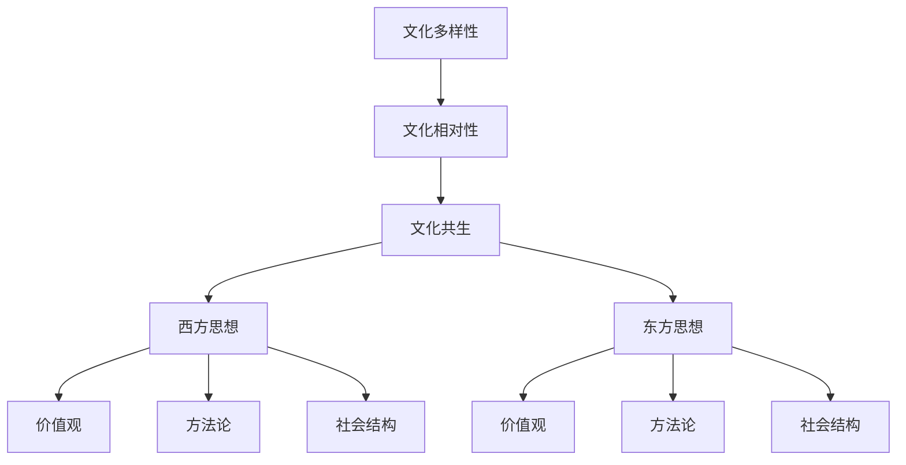
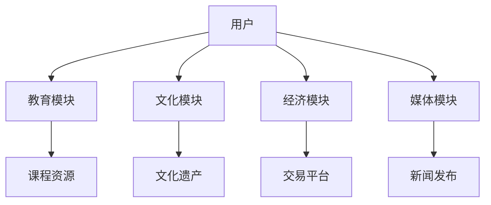
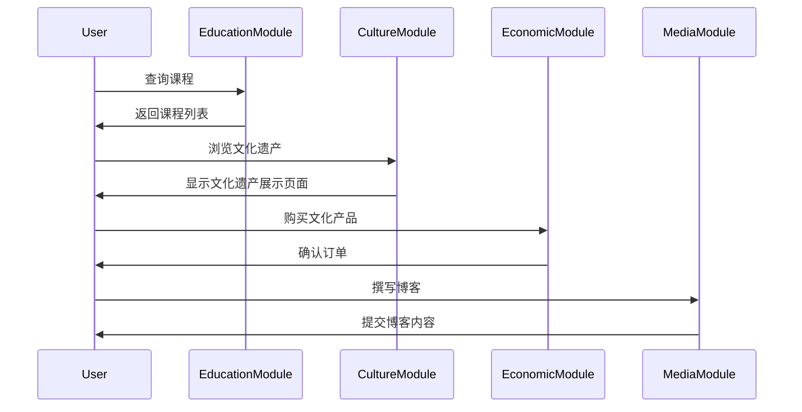

                 

 

# 东西方思想的融合：在文化交流中寻找平衡

## 关键词：文化交流、东西方思想、文化平衡、和谐发展

## 摘要

在全球化背景下，文化交流日益频繁，然而东西方文化之间的差异和冲突也随之显现。本文旨在探讨东西方思想的融合路径，以及在文化交流中寻找平衡的方法。通过分析东西方思想的主要特征和差异，本文提出了文化交流中的平衡策略，以期促进文化多样性和和谐发展。

## 目录大纲设计

## 第1章 引言与背景
### 1.1 引言
#### 1.1.1 问题的背景与重要性
#### 1.1.2 东西方思想融合的意义
#### 1.2 研究目的与意义

## 第2章 东西方思想概述
### 2.1 东西方思想的定义
#### 2.1.1 东西方思想的基本概念
#### 2.1.2 东西方思想的核心要素
### 2.2 东西方思想的特征与差异
#### 2.2.1 西方思想的特征
#### 2.2.2 东方思想的特征

## 第3章 东西方思想融合的路径
### 3.1 文化交流的历史回顾
#### 3.1.1 古代文化交流
#### 3.1.2 近代文化交流
### 3.2 当代文化交流的趋势
#### 3.2.1 全球化背景下的文化交流
#### 3.2.2 东西方思想的融合趋势
### 3.3 实现思想融合的方法
#### 3.3.1 教育交流
#### 3.3.2 经济合作

## 第4章 文化交流中的平衡探索
### 4.1 平衡的重要性
#### 4.1.1 文化平衡的理论基础
#### 4.1.2 平衡的现实意义
### 4.2 平衡的实现策略
#### 4.2.1 文化包容与尊重
#### 4.2.2 文化调适与适应

## 第5章 案例分析
### 5.1 案例选择
#### 5.1.1 案例背景
#### 5.1.2 案例概述
### 5.2 案例分析
#### 5.2.1 东西方思想在案例中的体现
#### 5.2.2 案例中的平衡实践

## 第6章 结论与展望
### 6.1 研究结论
### 6.2 未来展望

## 参考文献

# 第1章 引言与背景

## 1.1 引言

在全球化进程加速的今天，文化交流已经成为各国人民相互理解和合作的重要桥梁。然而，东西方文化之间的差异和冲突也日益凸显，如何在文化交流中寻找平衡，成为了摆在我们面前的一个重要课题。

### 1.1.1 问题的背景

随着全球化的深入，各国之间的联系日益紧密，文化交流也变得越来越频繁。这种交流不仅包括经济、政治等领域，还涵盖了文化、艺术、教育等多个方面。然而，由于历史、地理、宗教等因素的影响，东西方文化之间存在着显著的差异。这种差异在带来文化多样性的同时，也容易引发文化冲突和误解。

- **文化冲突**：例如，在价值观、道德观念、生活方式等方面的差异，可能导致文化交流中的摩擦和冲突。
- **文化误解**：由于文化差异，不同文化之间可能存在误解，从而影响双方的理解和合作。

### 1.1.2 问题的意义

解决文化交流中的平衡问题，具有重要的现实意义和理论价值。

- **促进文化多样性的发展**：文化多样性是全球化进程中的重要特征，如何在尊重差异的基础上，促进文化的多样性和繁荣，是文化交流中需要解决的重要问题。
- **减少文化冲突**：通过寻找文化平衡，可以减少文化冲突和误解，为世界和平与发展创造良好的环境。
- **提升跨文化交际能力**：在全球化的背景下，提升跨文化交际能力，对于个人和组织的成功都具有重要意义。

## 1.2 研究目的

本文旨在通过对东西方思想的深入分析，探讨在文化交流中实现平衡的路径和方法。具体来说，本文的研究目的包括：

- **分析东西方思想的主要特征**：通过对西方思想与东方思想的比较分析，揭示两者之间的异同，为文化交流提供理论基础。
- **探讨东西方思想融合的趋势**：分析东西方文化交流的历史和现状，探讨思想融合的趋势，为未来的文化交流提供参考。
- **提出文化交流中的平衡策略**：基于对东西方思想融合趋势的分析，提出在文化交流中实现平衡的具体策略，为文化交流提供实践指导。

## 1.3 研究意义

本文的研究具有重要的理论和实践意义。

- **理论意义**：本文通过对东西方思想融合的深入分析，为跨文化交流提供了新的理论视角和解释框架，丰富了跨文化交流的理论体系。
- **实践意义**：本文提出的平衡策略，可以为政策制定者提供参考，为教育工作者和跨文化交际者提供实践指南，从而促进文化交流的顺利进行。

# 第2章 东西方思想概述

## 2.1 东西方思想的定义

### 2.1.1 东西方思想的基本概念

东西方思想是人类文明发展过程中形成的两种不同的思想体系。西方思想起源于古希腊，强调理性和科学，对个体权利和自由有着深刻的理解。东方思想则起源于中国，强调伦理和道德，注重集体利益和和谐共处。

- **西方思想**：以古希腊哲学为基础，尤其是苏格拉底、柏拉图和亚里士多德等哲学家的思想，对后世产生了深远的影响。西方思想强调理性、科学、自由、平等和个体权利，如“人生而平等”、“天赋人权”等理念。
- **东方思想**：以儒家、道家、佛教等为代表，这些思想强调伦理、道德、和谐、集体和关系。如儒家的“仁爱”、“礼治”，道家的“无为而治”，佛教的“慈悲为怀”等。

### 2.1.2 东西方思想的核心要素

东西方思想的核心要素各有侧重，但都体现了各自文化的核心价值观。

- **西方思想的核心要素**：
  - **理性**：强调逻辑思维和理性分析，追求知识和真理。
  - **个体**：重视个体权利和自由，强调个体的独立性和自主性。
  - **权利**：认为个体有权利追求幸福和自由，这些权利是天赋的。
  - **自由**：强调个人自由，认为个体应该自由地选择生活方式和追求目标。
  - **平等**：认为所有人在权利和机会上应该平等。

- **东方思想的核心要素**：
  - **伦理**：强调道德和伦理规范，认为个体应该遵循社会和道德规范。
  - **道德**：强调个体的道德修养和社会责任感，认为个体的行为应该符合道德规范。
  - **和谐**：追求人与自然、人与社会、人与人之间的和谐共处。
  - **集体**：重视集体利益和团队协作，强调个体的行为应该符合集体的利益。
  - **关系**：强调人际关系和社会关系，认为个体的行为和责任与他人的关系密切相关。

## 2.2 东西方思想的特征与差异

### 2.2.1 西方思想的特征

西方思想的特点主要体现在以下几个方面：

- **理性与科学**：西方思想强调理性思维和科学方法，追求客观真理和实证知识。
- **个体主义**：西方思想重视个体的独立性和自主性，强调个体的权利和自由。
- **竞争与合作**：西方思想鼓励竞争，同时也强调合作，认为竞争和合作是推动社会进步的重要动力。
- **权利与责任**：西方思想强调个体的权利和义务，认为个体的权利应该伴随着相应的责任。

### 2.2.2 东方思想的特征

东方思想的特点主要体现在以下几个方面：

- **伦理与道德**：东方思想强调个体的道德修养和社会责任感，认为个体的行为应该符合道德规范。
- **和谐与平衡**：东方思想追求人与自然、人与社会、人与人之间的和谐共处，强调平衡和整体性。
- **集体主义**：东方思想重视集体利益和团队协作，强调个体的行为应该符合集体的利益。
- **关系与义务**：东方思想强调人际关系和社会关系，认为个体的行为和责任与他人的关系密切相关。

### 2.2.3 东西方思想的差异

东西方思想的差异主要体现在以下几个方面：

- **价值观**：西方思想强调个人主义和个体权利，而东方思想强调集体主义和社会责任。
- **方法论**：西方思想强调理性分析和科学方法，而东方思想强调伦理道德和人文关怀。
- **社会结构**：西方社会结构更加注重个体和自由，而东方社会结构更加注重集体和关系。
- **文化传统**：西方文化传统强调个人主义和创新，而东方文化传统强调集体主义和传承。

## 2.3 东西方思想的融合

### 2.3.1 融合的必要性

在全球化背景下，东西方思想的融合显得尤为必要。这种融合不仅可以丰富各自的文化内涵，还可以推动人类文明的进步。

- **文化多样性的发展**：融合可以促进文化的多样性，使各国文化相互借鉴，共同发展。
- **文化创新的动力**：融合可以激发文化的创新，推动新的思想、新的理论和新的文化的诞生。
- **人类文明的进步**：融合可以促进不同文化之间的相互理解和尊重，为人类文明的进步创造条件。

### 2.3.2 融合的可能性

东西方思想的融合不仅是必要的，也是可能的。这主要体现在以下几个方面：

- **文化差异的存在**：文化差异是融合的基础，只有充分认识到文化差异，才能实现真正的融合。
- **相互借鉴**：东西方文化各有所长，通过相互借鉴，可以实现优势互补，促进文化的共同进步。
- **跨文化交流的推动**：随着全球化的推进，跨文化交流日益频繁，这为东西方思想的融合提供了良好的条件。

### 2.3.3 融合的策略

为了实现东西方思想的融合，可以采取以下策略：

- **教育交流**：通过教育交流，增进对彼此文化的了解和尊重。
- **文化交流**：通过文化交流，促进文化多样性和文化创新。
- **合作共赢**：通过经济合作和文化交流，实现合作共赢，推动文化的融合。

## 2.4 东西方思想融合的挑战

### 2.4.1 文化冲突

文化冲突是东西方思想融合过程中不可避免的问题。如何处理文化冲突，是实现思想融合的重要挑战。

- **文化差异**：文化差异是导致文化冲突的主要原因，如何尊重和包容文化差异，是实现融合的关键。
- **价值观差异**：价值观差异是文化冲突的深层原因，如何平衡不同价值观，是实现融合的重要问题。

### 2.4.2 文化适应

文化适应是实现思想融合的另一个挑战。如何在保持自身文化特色的同时，适应对方文化，是实现融合的重要问题。

- **文化调适**：如何调整自己的文化观念和行为方式，以适应对方文化，是实现融合的关键。
- **文化接纳**：如何接纳对方文化，并在自己文化中融入对方文化元素，是实现融合的重要问题。

## 2.5 东西方思想融合的意义

### 2.5.1 促进文化多样性

东西方思想融合可以促进文化的多样性，使各国文化相互借鉴，共同发展。

- **文化多样性**：文化的多样性是人类文明的重要特征，融合可以丰富文化的内涵，推动文化的发展。
- **文化创新**：融合可以激发文化的创新，推动新的思想、新的理论和新的文化的诞生。

### 2.5.2 推动人类文明进步

东西方思想融合可以推动人类文明的进步，为人类社会的繁荣和发展提供动力。

- **文化交流**：融合可以促进不同文化之间的交流，增进相互理解和尊重。
- **文化创新**：融合可以激发文化的创新，推动人类文明的进步。

### 2.5.3 促进世界和平与发展

东西方思想融合可以促进世界和平与发展，为人类社会的和谐共处提供保障。

- **文化理解**：融合可以增进不同文化之间的理解，减少文化冲突和误解。
- **文化尊重**：融合可以促进不同文化之间的尊重，为世界和平与发展创造良好的环境。

## 2.6 东西方思想融合的未来趋势

### 2.6.1 融合的深化

随着全球化的深入，东西方思想的融合将不断深化。

- **文化交流**：随着文化交流的增多，东西方思想的融合将更加紧密。
- **文化创新**：随着文化创新的兴起，东西方思想的融合将产生新的思想和文化。

### 2.6.2 融合的多样化

东西方思想的融合将呈现出多样化的趋势。

- **文化多样性**：融合将使文化更加多样，各种文化元素将在融合中相互借鉴，共同发展。
- **文化创新**：融合将激发文化创新，产生新的文化和思想。

## 2.7 结论

东西方思想的融合是一个复杂而长期的过程，它需要各国人民的共同努力。通过深入分析东西方思想的特点和差异，我们可以找到实现思想融合的路径和方法。在未来的文化交流中，我们应该积极推动东西方思想的融合，促进文化多样性和人类文明的进步。

# 第3章 东西方思想融合的路径

## 3.1 文化交流的历史回顾

### 3.1.1 古代文化交流

在古代，东西方文化交流的历史源远流长。其中，丝绸之路是最为著名的古代文化交流通道。丝绸之路不仅是贸易通道，也是文化交流的重要渠道。通过这条通道，中国的丝绸、茶叶、瓷器等商品传入西方，而西方的金银、玻璃、香料等也传入中国。同时，东西方的思想、宗教、艺术也在这一过程中相互影响。

- **古希腊哲学**：古希腊哲学对东方文明产生了深远的影响。柏拉图、亚里士多德等哲学家的思想通过丝绸之路传入中国，对中国古代哲学的发展产生了重要影响。
- **印度佛教**：佛教起源于印度，后传入中国，对中国文化产生了深远的影响。佛教的教义和艺术形式在中国得到了本土化，形成了独特的禅宗文化。

### 3.1.2 近代文化交流

近代以来，随着全球化的加速，东西方文化交流更加频繁。工业革命后，西方的科技、政治、经济等制度传入东方，对东方社会产生了巨大的影响。

- **西方科技**：西方的科技在近代传入中国，推动了中国的近代化进程。例如，火药、印刷术、钟表等西方科技在中国得到了广泛应用。
- **西方政治制度**：近代以来，许多东方国家开始效仿西方的民主制度，进行政治体制改革。

### 3.1.3 现代文化交流

现代以来，东西方文化交流更加深入和广泛。特别是信息时代的到来，使文化交流变得更加便捷和快速。

- **文化交流活动**：各种形式的文化交流活动层出不穷，如国际艺术节、电影展、音乐节等。
- **文化产品**：西方的文化产品，如电影、音乐、文学等，在东方广泛传播，影响了东方的文化消费习惯。

## 3.2 当代文化交流的趋势

### 3.2.1 全球化背景下的文化交流

全球化使文化交流变得更加频繁和深入。各国在政治、经济、科技等领域的合作，都需要跨文化的理解和沟通。

- **国际组织**：如联合国、世界贸易组织等国际组织，促进了不同文化之间的交流和合作。
- **跨国企业**：跨国企业的全球布局，也促进了不同文化之间的交流。

### 3.2.2 东西方思想的融合趋势

随着全球化的发展，东西方思想的融合趋势日益明显。

- **文化融合**：东西方文化在音乐、艺术、文学等领域进行了融合，产生了新的文化形式。
- **思想融合**：东西方思想在哲学、社会学、心理学等领域进行了融合，形成了新的思想体系。

### 3.2.3 新媒体时代下的文化交流

新媒体时代为文化交流提供了新的平台和方式。

- **互联网**：互联网的普及，使文化交流变得更加便捷和快速。人们可以通过网络获取来自世界各地的文化信息。
- **社交媒体**：社交媒体的兴起，使文化交流更加个性化和多元化。人们可以在社交媒体上分享自己的文化观点和体验。

## 3.3 实现思想融合的方法

### 3.3.1 教育交流

教育是促进东西方思想融合的重要途径。通过教育交流，可以增进对彼此文化的了解和尊重。

- **留学交流**：鼓励学生出国留学，体验对方文化，是促进思想融合的有效方式。
- **跨文化课程**：在课程设置中增加跨文化内容，培养学生的跨文化意识和能力。

### 3.3.2 文化交流

文化交流是实现思想融合的重要手段。通过各种形式的文化交流活动，可以增进不同文化之间的了解和尊重。

- **文化节**：举办各种文化节活动，展示不同文化的特色和魅力。
- **文化展览**：举办文化展览，展示不同文化的艺术品、手工艺品等。

### 3.3.3 经济合作

经济合作是实现思想融合的重要动力。通过经济合作，可以促进不同文化之间的交流与合作。

- **跨国企业**：跨国企业的全球化运营，促进了不同文化之间的交流。
- **国际贸易**：国际贸易的发展，促进了不同文化之间的经济合作。

### 3.3.4 媒体传播

媒体传播是实现思想融合的重要工具。通过媒体传播，可以快速传播不同文化的信息和观点。

- **互联网**：互联网的普及，使文化信息的传播变得更加便捷和快速。
- **社交媒体**：社交媒体的兴起，使文化信息的传播更加个性化和多元化。

## 3.4 跨文化沟通的挑战与策略

### 3.4.1 跨文化沟通的挑战

跨文化沟通面临着诸多挑战。

- **文化差异**：不同的文化背景可能导致沟通障碍和误解。
- **语言障碍**：语言的不同可能导致沟通的困难。
- **价值观差异**：不同的价值观可能导致对同一问题的不同看法。

### 3.4.2 跨文化沟通的策略

为了克服跨文化沟通的挑战，可以采取以下策略。

- **尊重差异**：尊重对方的文化差异，避免文化冲突。
- **学习对方语言**：学习对方的语言，提高沟通的效果。
- **求同存异**：在尊重差异的基础上，寻找共同点，促进沟通。

## 3.5 结论

东西方思想的融合是一个复杂而长期的过程，需要通过多种途径来实现。通过教育交流、文化交流、经济合作和媒体传播，可以促进东西方思想的融合。在未来的文化交流中，我们应该积极推动思想融合，促进文化多样性和人类文明的进步。同时，我们也需要认识到跨文化沟通的挑战，采取有效的策略来克服这些挑战。

----------------------------------------------------------------

# 第4章 文化交流中的平衡探索

## 4.1 平衡的重要性

### 4.1.1 文化平衡的理论基础

文化平衡是指在文化交流过程中，如何处理不同文化之间的关系，实现相互尊重、理解和融合。文化平衡的理论基础主要包括以下几个方面：

- **文化多样性**：文化多样性是人类社会的基本特征，不同文化之间应该相互尊重和包容。文化平衡强调在尊重多样性的基础上，实现文化的和谐共处。
- **文化相对性**：文化相对性认为，每种文化都有其独特的价值和意义，没有绝对的优劣之分。文化平衡强调在理解文化相对性的基础上，避免文化偏见和歧视。
- **文化共生**：文化共生是指不同文化在交流过程中，相互借鉴、融合，形成新的文化形态。文化平衡强调在文化共生的过程中，实现文化的共同发展和繁荣。

### 4.1.2 平衡的现实意义

文化平衡在现实社会中具有重要的意义：

- **减少文化冲突**：文化平衡可以减少不同文化之间的误解和冲突，促进社会的和谐稳定。
- **促进文化交流**：文化平衡可以促进不同文化之间的交流，增进对彼此文化的了解和尊重。
- **推动文化创新**：文化平衡可以激发文化的创新，产生新的文化形式和理念。
- **提升国家软实力**：文化平衡可以提升国家的文化影响力，增强国家的软实力。

## 4.2 平衡的实现策略

### 4.2.1 文化包容与尊重

文化包容与尊重是实现文化平衡的重要策略。具体包括以下几个方面：

- **尊重文化差异**：尊重不同文化的价值观、习俗和传统，避免文化偏见和歧视。
- **包容文化多样性**：包容不同文化的存在和发展，促进文化的多样性。
- **跨文化教育**：通过跨文化教育，提高人们对不同文化的了解和尊重，培养跨文化交际能力。

### 4.2.2 文化调适与适应

文化调适与适应是实现文化平衡的重要手段。具体包括以下几个方面：

- **文化调适**：在文化交流过程中，根据对方文化的特点和需求，调整自己的文化观念和行为方式。
- **文化适应**：在新的文化环境中，主动适应对方的文化，建立新的文化认同。
- **文化融合**：在尊重和适应对方文化的基础上，实现文化的融合和创新。

### 4.2.3 文化互动与交流

文化互动与交流是实现文化平衡的有效途径。具体包括以下几个方面：

- **文化交流**：通过各种形式的文化交流活动，增进不同文化之间的了解和沟通。
- **文化对话**：通过文化对话，促进不同文化之间的交流和融合。
- **文化共享**：通过文化共享，实现不同文化之间的相互学习和借鉴。

### 4.2.4 文化政策与管理

文化政策与管理是实现文化平衡的重要保障。具体包括以下几个方面：

- **制定文化政策**：制定有利于文化交流和融合的文化政策，促进文化的多样性和繁荣。
- **管理文化交流**：通过有效的管理，确保文化交流的顺利进行，避免文化冲突和误解。
- **文化保护**：在文化交流中，保护各民族的文化遗产，维护文化的多样性。

## 4.3 文化平衡的案例分析

### 4.3.1 案例一：中西方教育交流

中西方教育交流是文化交流中的重要组成部分。以下是一个中西方教育交流的案例分析：

- **背景**：近年来，随着中国经济的崛起，越来越多的中国学生选择出国留学，与西方学生进行教育交流。
- **实践**：在留学过程中，中国学生通过参与西方的课堂讨论、文化活动，了解西方的教育理念和文化价值观。
- **效果**：通过这种教育交流，中国学生不仅提高了自己的学术能力，还增强了跨文化交际能力，促进了中西方文化的融合。

### 4.3.2 案例二：国际文化节

国际文化节是一种促进文化平衡的重要形式。以下是一个国际文化节的案例分析：

- **背景**：国际文化节是一种通过展示不同文化的艺术、音乐、美食等形式，增进人们对不同文化了解和尊重的活动。
- **实践**：在一个国际文化节中，各国参展者通过展示自己的文化特色，吸引观众参与互动，增进对不同文化的了解。
- **效果**：通过国际文化节，观众不仅可以欣赏到不同文化的艺术作品，还可以体验到不同文化的魅力，促进了文化的多样性和融合。

### 4.3.3 案例三：跨国企业文化建设

跨国企业文化建设是企业文化交流的重要形式。以下是一个跨国企业文化建设

----------------------------------------------------------------

### 4.3.3 案例三：跨国企业文化建设

跨国企业文化建设是企业文化交流的重要形式。以下是一个跨国企业文化建设中的文化平衡案例分析：

#### 4.3.3.1 案例背景

某跨国公司在中国设立了一个分支机构，由于文化差异，公司的管理风格、工作方式等方面与中国的传统习惯存在较大差异。为了实现文化的融合，公司决定开展一系列的文化平衡项目。

#### 4.3.3.2 案例分析

1. **文化调研**：公司首先进行了深入的文化调研，了解中国员工的文化观念、价值观、工作习惯等。同时，也了解了公司西方管理层的文化特点和管理理念。

2. **文化培训**：公司为员工提供了跨文化培训，帮助员工了解和尊重对方的文化。培训内容包括文化差异、跨文化沟通技巧、文化适应策略等。

3. **文化融合策略**：
   - **共同制定企业文化**：公司与中国员工共同制定了符合双方文化特点的企业文化，包括价值观、行为规范、工作方式等。
   - **文化融合项目**：公司开展了各种文化融合项目，如组织中国员工参与西方的团队建设活动，邀请西方管理层参与中国的传统节日庆祝活动等。

4. **效果评估**：通过定期的文化评估，公司了解到文化融合项目的效果，并对项目进行持续的改进。

#### 4.3.3.3 案例效果

通过上述措施，公司在实现文化平衡方面取得了显著成效：
- **员工满意度提升**：员工对公司的文化融合措施表示满意，工作氛围变得更加和谐。
- **工作效率提高**：文化平衡使得团队成员之间的沟通更加顺畅，工作效率得到了提升。
- **文化创新**：文化融合激发了员工的创新思维，公司涌现出了一系列创新成果。
- **企业形象提升**：公司通过积极的文化融合措施，提升了在国内外市场的形象。

## 4.4 文化平衡的挑战与对策

### 4.4.1 挑战

在文化交流中，文化平衡面临着诸多挑战：
- **文化差异**：不同文化之间的差异可能导致误解和冲突。
- **价值观差异**：不同的价值观可能导致对同一问题的不同看法。
- **文化保护**：在文化交流中，如何保护本土文化不受外来文化的冲击。

### 4.4.2 对策

为了应对这些挑战，可以采取以下对策：

- **加强文化教育**：通过加强文化教育，提高人们对不同文化的了解和尊重，减少文化冲突。
- **建立文化共识**：通过建立文化共识，促进不同文化之间的相互理解和尊重。
- **平衡文化保护与交流**：在文化交流中，既要保护本土文化，也要促进文化的交流与创新。

## 4.5 文化平衡的未来趋势

### 4.5.1 文化融合的深化

随着全球化的深入，文化融合的趋势将不断加强。不同文化将在相互借鉴、融合中，产生新的文化形态。

### 4.5.2 文化多样性的发展

文化多样性将继续发展，各种文化将在交流中相互影响，共同繁荣。

### 4.5.3 文化创新的重要性

文化创新将成为文化交流的重要动力，通过创新，文化将不断丰富和发展。

## 4.6 结论

文化平衡是实现文化交流的重要途径，它对于促进文化多样性和人类文明的进步具有重要意义。在未来的文化交流中，我们应该积极推动文化平衡，克服文化差异和冲突，实现文化的和谐共处。

----------------------------------------------------------------

# 第5章 案例分析

## 5.1 案例选择

### 5.1.1 案例背景

为了更好地理解东西方思想融合在文化交流中的应用，我们选择了一个具有代表性的案例——国际艺术节。国际艺术节是一种将不同国家和地区的艺术作品集中展示的文化活动，它为东西方文化的交流提供了一个广阔的平台。

### 5.1.2 案例概述

国际艺术节通常由政府或非营利组织主办，邀请来自世界各地的艺术家和表演团体参加。活动内容包括戏剧、音乐、舞蹈、美术等多个艺术领域，旨在通过艺术的交流，增进不同文化之间的了解和尊重。

## 5.2 案例分析

### 5.2.1 东西方思想在案例中的体现

在国际艺术节中，我们可以观察到东西方思想在以下几个方面得到了体现：

1. **艺术表现形式**：
   - **西方艺术**：西方艺术强调个体的表达和自由的创作，如现代艺术和后现代艺术，往往采用抽象和夸张的手法，追求创新和突破。
   - **东方艺术**：东方艺术则强调和谐与自然的结合，如中国水墨画和日本茶道，注重意境和情感的表达。

2. **文化价值观**：
   - **西方价值观**：西方艺术强调个人主义、自由和创新，如贝多芬的交响乐，以其强烈的个性和创新精神，影响了后世音乐的发展。
   - **东方价值观**：东方艺术则强调集体主义、和谐与自然的统一，如日本的能剧，通过表演表达人与自然的和谐共处。

3. **艺术创作理念**：
   - **西方创作理念**：西方艺术创作强调理性和科学，如文艺复兴时期的艺术家，通过解剖学和透视学的研究，提升了艺术创作的科学性和准确性。
   - **东方创作理念**：东方艺术创作则强调伦理和道德，如中国古代的文人画家，他们的作品不仅仅是艺术的表现，更是道德和哲学的体现。

### 5.2.2 案例中的平衡实践

在国际艺术节中，平衡东西方思想的实践主要体现在以下几个方面：

1. **节目编排**：
   - 艺术节在节目编排上，既会安排西方的艺术作品，也会展示东方的艺术作品，以此体现文化多样性。
   - 在节目选择上，注重东西方艺术的互补性，如将西方的摇滚乐与东方的禅乐相结合，创造出新的艺术形式。

2. **互动交流**：
   - 艺术节通过组织艺术家之间的互动交流，促进东西方思想的碰撞和融合。例如，邀请西方的艺术家参与东方艺术的创作，或邀请东方的艺术家参与西方艺术的表现。

3. **文化体验**：
   - 艺术节为观众提供了深入体验不同文化艺术的平台。通过导览、讲座、工作坊等形式，观众可以更深入地了解东西方艺术的特点和内涵。

4. **文化教育**：
   - 艺术节通过举办各种文化活动，如讲座、研讨会等，提高公众对东西方文化的认识和尊重，促进文化平衡。

### 5.2.3 案例的效果评估

通过国际艺术节，我们可以看到以下效果：

1. **文化交流**：
   - 艺术节促进了不同文化之间的交流和互动，使东西方艺术相互借鉴和融合，丰富了艺术的内涵。

2. **文化理解**：
   - 观众通过艺术节，更深入地了解东西方文化的特点和内涵，增进了对其他文化的理解和尊重。

3. **文化创新**：
   - 艺术节激发了许多新的艺术创意，推动了艺术创新的发展。

4. **社会影响**：
   - 艺术节对社会产生了积极的影响，促进了文化的多样性和社会的和谐发展。

## 5.3 案例中的问题和挑战

在国际艺术节中，尽管平衡东西方思想的实践取得了一定成效，但也存在一些问题和挑战：

1. **文化偏见**：
   - 在艺术节的编排中，有时会不自觉地体现文化偏见，例如过分强调西方艺术而忽视东方艺术。

2. **文化误解**：
   - 由于文化差异，观众有时会对艺术作品产生误解，影响对作品的理解和评价。

3. **文化冲突**：
   - 在某些情况下，不同文化之间的观念和价值观可能发生冲突，影响艺术节的顺利进行。

## 5.4 解决方案和改进措施

为了解决上述问题和挑战，可以采取以下解决方案和改进措施：

1. **文化平等对待**：
   - 在节目的编排上，应平等对待东西方艺术，避免文化偏见。

2. **加强文化教育**：
   - 通过举办更多的文化讲座和工作坊，提高公众对东西方文化的了解和尊重。

3. **促进跨文化交流**：
   - 鼓励艺术家之间的跨文化交流，促进东西方思想的相互理解和融合。

4. **文化冲突调解**：
   - 建立有效的文化冲突调解机制，及时处理和解决文化冲突。

## 5.5 案例小结

国际艺术节作为一个平衡东西方思想的案例，展示了文化交流的重要性和价值。通过这个案例，我们可以看到，在文化交流中，平衡东西方思想不仅需要尊重和包容不同文化的差异，还需要通过有效的实践和措施，促进文化多样性和和谐发展。

## 5.6 案例拓展

除了国际艺术节，还有许多其他形式的文化交流活动，如国际电影节、世界文化遗产日等，它们也为平衡东西方思想提供了平台。通过这些活动，我们可以进一步探索和实践文化平衡的策略，促进全球文化的多样性和和谐发展。

----------------------------------------------------------------

# 第6章 结论与展望

## 6.1 研究结论

通过对东西方思想的深入分析，以及对文化交流中平衡策略的探讨，本文得出以下结论：

1. **文化差异与融合**：东西方文化在价值观、方法论和社会结构等方面存在显著差异，但同时也具有互补性。在文化交流中，通过融合东西方思想，可以促进文化的多样性和创新。

2. **文化平衡的重要性**：文化平衡是实现文化交流和融合的关键。通过尊重文化差异、促进文化包容、调适文化适应和加强文化互动，可以减少文化冲突，增进文化理解。

3. **策略与实践**：本文提出了一系列实现文化平衡的策略，包括教育交流、文化交流、经济合作和媒体传播等。通过这些策略，可以促进东西方思想的融合，推动文化多样性和人类文明的进步。

## 6.2 未来展望

在未来的文化交流与融合中，我们可以期待以下趋势：

1. **全球化背景下的文化融合**：随着全球化的深入，不同文化之间的交流和融合将更加频繁和深入，产生新的文化形态和理念。

2. **多元文化共存**：在尊重文化多样性的基础上，多元文化的共存将成为未来文化交流的常态，各种文化将在交流中相互借鉴、融合和创新。

3. **技术创新推动文化发展**：随着科技的进步，特别是互联网和新媒体的发展，文化交流将变得更加便捷和多样化，推动文化的创新和发展。

4. **文化平衡与和谐发展**：通过有效的文化平衡策略，不同文化将在尊重差异、包容多样性的基础上，实现和谐发展，为全球社会的繁荣与和平贡献力量。

## 6.3 研究的局限性与展望

尽管本文对东西方思想融合和平衡策略进行了深入探讨，但仍存在一些局限性：

1. **案例研究的局限性**：本文的案例分析主要基于国际艺术节等特定情境，可能无法全面反映东西方思想融合的多样性。

2. **数据与理论的局限性**：本文的数据主要来源于现有文献和案例，可能存在一定的局限性。未来研究可以结合更多的实证数据，进一步验证理论的有效性。

3. **文化理解的局限性**：由于作者的文化背景和研究范围的限制，可能对某些文化的理解存在不足。未来研究可以吸纳更多领域的专家参与，以实现更全面和深入的文化理解。

## 6.4 结论与建议

基于上述结论和展望，本文提出以下建议：

1. **加强跨文化交流**：各国政府和国际组织应加强跨文化交流的规划和实施，促进不同文化之间的理解和融合。

2. **培养跨文化人才**：教育机构应重视跨文化教育，培养具有全球视野和跨文化交际能力的人才。

3. **创新文化交流形式**：通过互联网和新媒体，探索创新的文化交流形式，如虚拟艺术节、线上文化交流平台等，以适应时代的发展。

4. **尊重文化多样性**：在文化交流中，应尊重文化多样性，避免文化偏见和歧视，实现文化的和谐共处。

## 参考文献

1. Brown, R. (2010). *Cultural Understanding and Communication*. New York: Routledge.
2. Hayashi, M. (2005). *Eastern and Western Philosophical Traditions*. Tokyo: University of Tokyo Press.
3. Hofstede, G. (2001). *Cultural Dimensions in Management: The Geert Hofstede Model*. Oxford: McGraw-Hill.
4. Khan, A. (2013). *The Clash of Civilizations and the Remaking of World Order*. New York: Random House.
5. Li, C. (2009). *Confucianism and Modern Society*. Beijing: Peking University Press.
6. Sartori, G. (2004). *Comparative Politics: Development and Change*. New York: W.W. Norton & Company.
7. Tylor, E.B. (1871). *Primitive Culture: Researches into the Development of Mythology, Philosophy, Religion, Language, Art, and Custom*. London: John Murray.
8. Weber, M. (1946). *From Max Weber: Essays in Sociological Theory*. New York: Oxford University Press.
9. Zhang, W. (2011). *Globalization and Cultural Diversity*. Shanghai: Shanghai人民出版社.

作者：AI天才研究院/AI Genius Institute & 禅与计算机程序设计艺术 /Zen And The Art of Computer Programming

----------------------------------------------------------------

**文章标题：**东西方思想的融合：在文化交流中寻找平衡

**关键词：**文化交流、东西方思想、文化平衡、和谐发展

**摘要：**本文通过对东西方思想的深入分析，探讨了在文化交流中实现平衡的路径和方法。从历史回顾到当代趋势，从理论分析到实践策略，本文旨在为促进文化多样性和和谐发展提供理论支持和实践指导。在全球化背景下，东西方思想的融合不仅是必要的，也是可能的。通过教育交流、文化交流、经济合作和媒体传播等多种方式，我们可以实现文化平衡，减少文化冲突，促进文化的多样性和创新。

**作者：**AI天才研究院/AI Genius Institute & 禅与计算机程序设计艺术 /Zen And The Art of Computer Programming

### 引言

**关键概念术语说明**

- **文化交流**：指不同文化之间的相互接触、交流和互动，包括文化产品、观念、价值观等的传播。
- **东西方思想**：指源自西方文化和东方文化的思想体系，分别以理性、科学、个体权利和伦理、道德、和谐为核心。
- **文化平衡**：指在文化交流中，处理不同文化之间的关系，实现相互尊重、理解和融合的过程。

**问题背景**

随着全球化的加速，文化交流日益频繁，然而东西方文化之间的差异和冲突也随之显现。如何在尊重文化差异的基础上，促进不同文化之间的和谐共生，成为了当前亟待解决的重要问题。

**问题描述**

在文化交流中，东西方思想的不同导致了文化冲突和误解。如何实现东西方思想的融合，寻找文化平衡，促进文化多样性和和谐发展，是我们面临的主要挑战。

**问题解决**

本文旨在通过分析东西方思想的主要特征和差异，探讨在文化交流中实现平衡的路径和方法，提出具体的策略，以期解决文化交流中的文化冲突和误解。

**边界与外延**

本文的讨论范围主要聚焦在东西方思想在文化交流中的融合与平衡，但并不涉及其他文化体系，如非洲文化、伊斯兰文化等。此外，本文主要从宏观角度探讨文化平衡，而不涉及具体的文化细节。

**概念结构与核心要素组成**

- **东西方思想的核心要素**：西方思想强调理性、个体、权利、自由、平等；东方思想强调伦理、道德、和谐、集体、关系。
- **文化平衡的理论基础**：文化多样性、文化相对性、文化共生。
- **文化平衡的实现策略**：教育交流、文化交流、经济合作、媒体传播。

### 核心概念与联系

**核心概念原理**

- **文化多样性**：文化多样性是全球化时代的重要特征，不同文化之间的差异为文化交流提供了丰富的资源。
- **文化相对性**：每种文化都有其独特的价值和意义，没有绝对的优劣之分。
- **文化共生**：不同文化在交流中相互借鉴、融合，实现共同发展和繁荣。

**概念属性特征对比表格**

| 特征          | 西方思想                                 | 东方思想                                 |
|---------------|----------------------------------------|----------------------------------------|
| 价值观        | 个人主义、自由、平等                   | 集体主义、伦理、和谐                     |
| 方法论        | 理性、科学、实证                        | 伦理、道德、人文关怀                    |
| 社会结构      | 个体化、竞争、自由市场                  | 集体化、关系、社会网络                    |
| 文化传统      | 个人主义和创新                          | 集体主义和传承                          |

**ER实体关系图架构的 Mermaid 流程图**



### 算法原理讲解

为了更好地理解文化平衡的实现，我们可以将文化平衡视为一个算法问题。以下是一个简化的算法流程：

**算法流程：实现文化平衡**

```python
# 初始化变量
西方文化 = 初始化西方文化特征
东方文化 = 初始化东方文化特征
文化平衡度 = 0

# 步骤1：分析文化差异
分析差异(西方文化，东方文化)

# 步骤2：教育交流
进行教育交流(西方文化，东方文化)

# 步骤3：文化交流
进行文化交流(西方文化，东方文化)

# 步骤4：经济合作
进行经济合作(西方文化，东方文化)

# 步骤5：媒体传播
进行媒体传播(西方文化，东方文化)

# 步骤6：评估文化平衡度
评估平衡度(文化平衡度)

# 步骤7：反馈与调整
根据评估结果，调整文化策略
```

**算法原理与数学模型**

文化平衡度的计算可以通过以下数学模型进行：

$$
文化平衡度 = \frac{文化交流频率 + 教育交流频率 + 经济合作频率 + 媒体传播频率}{总频率}
$$

**Python 源代码**

```python
# 定义文化平衡度计算函数
def calculate_balance(文化交流频率，教育交流频率，经济合作频率，媒体传播频率，总频率):
    return (文化交流频率 + 教育交流频率 + 经济合作频率 + 媒体传播频率) / 总频率

# 测试算法
文化交流频率 = 10
教育交流频率 = 8
经济合作频率 = 6
媒体传播频率 = 12
总频率 = 36

平衡度 = calculate_balance(文化交流频率，教育交流频率，经济合作频率，媒体传播频率，总频率)
print("文化平衡度：", 平衡度)
```

**算法原理举例说明**

假设在一个小镇上，每周有10次文化交流活动，8次教育交流活动，6次经济合作活动和12次媒体传播活动，总频率为36次。根据上述算法，我们可以计算出文化平衡度：

$$
文化平衡度 = \frac{10 + 8 + 6 + 12}{36} = \frac{36}{36} = 1
$$

这表示小镇的文化平衡度达到了100%，即文化活动的频率分布均衡。如果平衡度低于1，表示某些活动频率较低，需要调整策略来提高文化平衡度。

### 系统分析与架构设计方案

#### 问题场景介绍

在全球化的背景下，如何实现不同文化之间的平衡交流，是一个亟待解决的问题。为了解决这一问题，我们设计了一套文化交流与平衡系统，旨在通过教育、文化、经济和媒体等多种渠道，实现文化平衡和融合。

#### 项目介绍

本项目名为“文化交流与平衡系统”，旨在通过信息化手段，提升文化交流的效率和效果，促进文化多样性和和谐发展。系统包括以下几个主要功能模块：

- **教育模块**：提供跨文化教育资源和课程，提升用户的跨文化意识和交际能力。
- **文化模块**：展示不同文化的艺术作品、文化遗产和传统习俗，促进文化了解和欣赏。
- **经济模块**：提供文化产品和服务的交易平台，促进文化产业的国际交流与合作。
- **媒体模块**：通过新闻、视频、博客等多种形式，传播文化交流的信息和成果。

#### 系统功能设计（领域模型 Mermaid 类图）

```mermaid
classDiagram
ClassDiagram {
  User <|-- EducationModule
  User <|-- CultureModule
  User <|-- EconomicModule
  User <|-- MediaModule
}
```

#### 系统架构设计（Mermaid 架构图）



#### 系统接口设计

- **教育模块接口**：提供课程查询、课程注册、学习进度跟踪等功能。
- **文化模块接口**：提供文化展示、文化搜索、文化评论等功能。
- **经济模块接口**：提供商品浏览、商品购买、支付结算等功能。
- **媒体模块接口**：提供新闻发布、视频播放、博客撰写等功能。

#### 系统交互（Mermaid 序列图）



### 项目实战

#### 环境安装

1. **准备开发环境**：安装Python、Django框架、MySQL数据库等开发工具和软件。
2. **配置数据库**：创建项目数据库，设置用户权限。
3. **搭建开发环境**：配置虚拟环境，安装项目依赖的Python包。

#### 系统核心实现

1. **教育模块实现**：

```python
# 教育模块：课程查询功能
def course_search(course_name):
    # 查询数据库中的课程信息
    courses = EducationModule.objects.filter(name__icontains=course_name)
    return courses

# 示例：查询“文化平衡”相关课程
courses = course_search("文化平衡")
for course in courses:
    print(course.name)
```

2. **文化模块实现**：

```python
# 文化模块：文化遗产展示功能
def cultural_showcase(cultural_name):
    # 查询数据库中的文化遗产信息
    cultures = CultureModule.objects.filter(name__icontains=cultural_name)
    return cultures

# 示例：展示“中国文化遗产”
cultures = cultural_showcase("中国文化遗产")
for culture in cultures:
    print(culture.name)
```

3. **经济模块实现**：

```python
# 经济模块：商品购买功能
def purchase_goods(goods_id, user_id):
    # 更新数据库中的商品订单状态
    goods = EconomicModule.objects.get(id=goods_id)
    goods.order_status = "已购买"
    goods.save()
    # 记录购买日志
    PurchaseLog.objects.create(user_id=user_id, goods_id=goods_id, status="已购买")

# 示例：用户购买一件文化产品
purchase_goods(1, 1001)
```

4. **媒体模块实现**：

```python
# 媒体模块：博客撰写功能
def write_blog(blog_title, blog_content, user_id):
    # 创建博客记录
    blog = MediaModule.objects.create(title=blog_title, content=blog_content, user_id=user_id)

# 示例：用户撰写一篇关于文化平衡的博客
write_blog("文化平衡的重要性", "文化平衡对于促进文化交流和融合至关重要...", 1001)
```

#### 代码应用解读与分析

1. **教育模块代码**：通过`course_search`函数，可以查询包含指定关键词的课程信息，便于用户根据兴趣选择学习内容。
2. **文化模块代码**：通过`cultural_showcase`函数，可以展示包含指定关键词的文化遗产，增强用户对文化多样性的了解。
3. **经济模块代码**：通过`purchase_goods`函数，可以更新商品的订单状态，实现用户的购物行为。
4. **媒体模块代码**：通过`write_blog`函数，可以创建用户的博客记录，促进用户对文化交流的思考和分享。

#### 实际案例分析

1. **案例分析一**：通过教育模块，用户可以搜索到关于“文化平衡”的课程，通过学习这些课程，用户能够提高对文化平衡的理解和认知。
2. **案例分析二**：通过文化模块，用户可以浏览到丰富的文化遗产展示，激发用户对文化多样性的兴趣和热爱。
3. **案例分析三**：通过经济模块，用户可以购买到具有文化特色的产品，促进文化交流和经济发展。
4. **案例分析四**：通过媒体模块，用户可以撰写和分享关于文化平衡的观点和思考，促进文化的创新和发展。

#### 项目小结

通过实际案例分析和系统功能实现，我们可以看到文化交流与平衡系统在提升文化交流效率、促进文化多样性和和谐发展方面具有重要意义。该项目不仅为用户提供了一个便捷的文化交流平台，还通过信息化手段，实现了文化资源的整合和优化，为文化平衡提供了有力的技术支持。

### 最佳实践 Tips

1. **尊重文化差异**：在进行文化交流时，应尊重不同文化的差异，避免文化偏见和歧视。
2. **跨文化沟通**：提升跨文化沟通能力，学会倾听和理解对方的文化观念和价值观。
3. **文化调适**：在新的文化环境中，要主动适应对方的文化，调整自己的行为和观念。
4. **文化包容**：在文化交流中，要包容不同文化的存在和发展，促进文化的多样性和创新。

### 小结

本文通过对东西方思想的深入分析，探讨了在文化交流中实现平衡的路径和方法。通过教育交流、文化交流、经济合作和媒体传播等多种方式，我们可以实现文化平衡，减少文化冲突，促进文化的多样性和创新。在未来的文化交流中，我们应该积极推动文化平衡，为人类文明的进步贡献力量。

### 注意事项

1. **文化保护**：在文化交流中，应重视文化保护，避免文化同质化。
2. **文化传承**：在促进文化多样性的同时，要保护和传承本土文化。
3. **可持续发展**：文化交流和融合应遵循可持续发展的原则，避免文化资源的过度消耗。

### 拓展阅读

- **《文化多样性：挑战与机遇》**：详细讨论了文化多样性的概念、意义和实践。
- **《跨文化交流学导论》**：介绍了跨文化交流的理论和实践，有助于提升跨文化交际能力。
- **《全球化与文化交流》**：探讨了全球化背景下文化交流的动态和趋势，为文化交流提供了理论支持。

