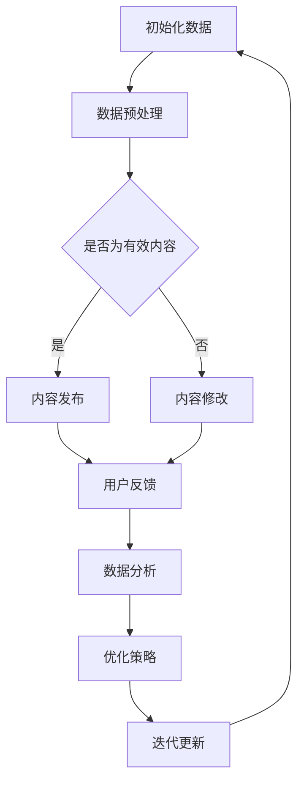
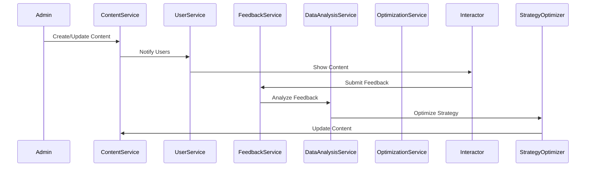
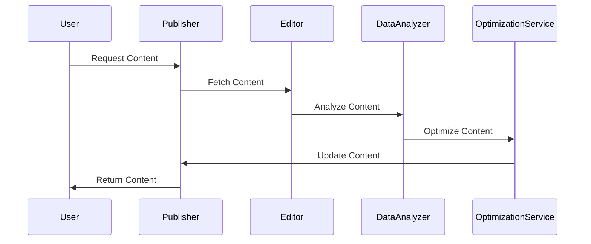

                 

# 个人成长型公众号：知识分享中的意义传播

## 关键词

- 个人成长
- 知识分享
- 公众号运营
- 意义传播
- 成长型公众号
- 内容策划
- 用户互动

## 摘要

本文从个人成长型公众号的运营出发，探讨知识分享在个人成长中的意义，以及公众号在知识传播中的重要作用。通过分析成长型公众号的定位与品牌建设、知识分享的价值与传播机制、成功案例分析，总结出提升公众号传播效果和用户粘性的有效策略。同时，本文还分析了成长型公众号面临的挑战与未来发展趋势，为公众号运营者提供参考和指导。

----------------------------------------------------------------

## 第一部分： 引言与背景

### 第1章： 引言

#### 1.1 问题背景

个人成长型公众号，是指以个人品牌为核心，以知识分享为主要内容，旨在帮助用户实现个人成长的一类微信公众号。随着社交媒体的普及，个人成长型公众号已成为知识传播的重要渠道。然而，在当前的互联网环境中，个人成长型公众号面临着一系列挑战，如内容同质化、用户需求多样化和运营成本高等。

知识分享在个人成长中的作用不容忽视。通过分享专业知识、经验和方法，公众号可以帮助用户拓宽视野、提升技能、实现自我提升。同时，知识分享也是一种社交互动，有助于建立社群关系，增强用户归属感和互动性。

公众号在知识传播中的意义主要体现在以下几个方面：

1. **信息传递**：公众号可以快速、便捷地传递信息，使知识得以广泛传播。
2. **内容筛选**：公众号通过对内容的筛选和整合，提供有价值、有针对性的知识内容。
3. **互动交流**：公众号提供留言、评论等功能，使用户可以与作者和其他用户进行互动交流。
4. **品牌建设**：公众号有助于个人品牌的塑造和传播，提升个人在行业内的知名度和影响力。

#### 1.2 问题描述

个人成长型公众号运营者面临的困境主要包括以下几个方面：

1. **内容创作困难**：如何持续创作高质量、有吸引力的内容是许多运营者面临的难题。
2. **用户获取与留存**：如何吸引新用户、提高用户留存率是运营者需要解决的问题。
3. **盈利模式探索**：如何通过公众号实现盈利是许多运营者关注的问题。
4. **竞争压力**：在众多个人成长型公众号中，如何脱颖而出，吸引更多用户关注和阅读。

#### 1.3 问题解决

要解决上述问题，需要从以下几个方面着手：

1. **成长型公众号的概念**：明确成长型公众号的定义、特点和目标。
2. **知识分享中的意义传播策略**：制定有效的知识分享策略，提升内容的价值和吸引力。
3. **公众号运营的优化方法**：通过数据分析、用户反馈等手段，不断优化公众号的运营策略。

#### 1.4 边界与外延

成长型公众号的分类可以根据不同的标准进行划分，如内容类型、受众群体、运营模式等。知识分享的形式和渠道包括文字、图片、音频、视频等，可以通过公众号、社交媒体、线下活动等多种方式进行传播。

公众号在个人成长中的作用机制主要包括信息获取、知识学习、社交互动和自我提升等方面。通过对用户需求的了解和满足，公众号可以帮助用户实现个人成长。

#### 1.5 概念结构与核心要素组成

成长型公众号的构成要素主要包括：

1. **个人品牌**：公众号的核心价值所在，是吸引和留住用户的关键。
2. **内容创作**：高质量、有针对性的内容是公众号的核心竞争力。
3. **用户互动**：与用户的互动和反馈是提升用户粘性和满意度的关键。
4. **数据分析**：通过数据分析，可以了解用户需求和公众号运营效果，为优化策略提供依据。

知识分享的关键要素包括：

1. **知识内容**：有价值、有针对性的知识内容是知识分享的核心。
2. **传播路径**：有效的传播路径可以提升知识分享的效果。
3. **用户参与**：用户的积极参与和互动可以增强知识分享的传播效果。

意义传播的核心要素包括：

1. **价值定位**：明确公众号的价值定位，为知识分享提供方向。
2. **内容策划**：通过内容策划，提升知识分享的吸引力和传播效果。
3. **用户互动**：与用户的互动和反馈是意义传播的重要环节。

#### 1.6 本章小结

通过对个人成长型公众号的背景、问题、解决方法和核心要素的分析，我们对其有了更深入的了解。在接下来的章节中，我们将进一步探讨成长型公众号的运营策略、知识分享中的意义传播、成功案例分析以及挑战与未来展望。希望通过本文的探讨，能为个人成长型公众号的运营者提供有价值的参考和指导。

----------------------------------------------------------------

## 第二部分： 成长型公众号的运营策略

### 第2章： 成长型公众号的定位与品牌建设

#### 2.1 成长型公众号的定位

成长型公众号的定位是公众号运营的第一步，也是至关重要的一步。一个明确的定位不仅有助于吸引目标受众，还能为公众号的长期发展指明方向。

**明确公众号的核心主题**：核心主题是公众号的灵魂，决定了公众号的内容和风格。在确定核心主题时，需要考虑以下几个方面：

1. **个人兴趣与专长**：选择自己擅长和热爱的领域，可以提高内容创作的积极性和质量。
2. **目标受众需求**：了解目标受众的需求，提供有价值的内容。
3. **市场定位**：分析市场现状，找到自己的独特优势和价值。

**定位目标受众**：目标受众是公众号的“衣食父母”，了解他们的需求和特点对于内容创作和用户互动至关重要。可以通过以下几种方式确定目标受众：

1. **用户画像**：根据性别、年龄、职业、兴趣爱好等特征，描绘出目标受众的画像。
2. **市场调研**：通过问卷调查、用户访谈等方式，收集目标受众的需求和反馈。
3. **数据分析**：利用公众号后台的数据分析工具，了解用户的行为和兴趣点。

**确立公众号的价值主张**：价值主张是公众号的核心竞争力，决定了用户为什么愿意关注和阅读。在确立价值主张时，需要考虑以下几个方面：

1. **独特性**：与其他公众号相比，自己的公众号有哪些独特之处？
2. **实用性**：内容是否具有实用性和操作性，能否帮助用户解决实际问题？
3. **专业性**：内容是否具有专业性和深度，能否提升用户的认知水平？

#### 2.2 品牌建设

品牌建设是成长型公众号的长期任务，关系到公众号的知名度和影响力。以下是品牌建设的关键步骤：

**塑造独特的品牌形象**：品牌形象是公众号的“名片”，决定了用户对公众号的第一印象。塑造独特的品牌形象可以从以下几个方面入手：

1. **视觉元素**：包括公众号的LOGO、颜色、字体等，要统一且具有辨识度。
2. **风格定位**：确定公众号的内容风格和语言风格，保持一致性。
3. **故事构建**：通过品牌故事，传递公众号的价值理念和文化内涵。

**建立品牌故事**：品牌故事是品牌形象的重要组成部分，有助于增强品牌的影响力和用户认同感。建立品牌故事可以从以下几个方面入手：

1. **品牌起源**：讲述公众号的创立背景和初衷。
2. **发展历程**：介绍公众号的成长历程和重要事件。
3. **核心价值观**：传递公众号的核心价值观和信仰。

**维护品牌一致性**：品牌一致性是品牌建设的关键，关系到品牌形象的稳定性和用户信任。维护品牌一致性可以从以下几个方面入手：

1. **内容一致性**：保持内容风格和语言风格的统一。
2. **视觉一致性**：保持视觉元素的统一。
3. **用户互动**：在用户互动中，保持品牌态度和价值观的一致。

#### 2.3 内容规划

内容规划是公众号运营的核心，决定了公众号的吸引力和用户粘性。以下是内容规划的关键步骤：

**制定内容战略**：内容战略是公众号的发展蓝图，决定了内容的方向和重点。在制定内容战略时，需要考虑以下几个方面：

1. **内容类型**：包括文章、图片、音频、视频等，要根据目标受众的特点选择合适的内容类型。
2. **内容主题**：确定内容主题，如技术分享、行业动态、案例分析等。
3. **内容频率**：制定内容发布频率，保持一定的更新节奏。

**确定内容类型与形式**：内容类型和形式决定了内容的吸引力和传播效果。在确定内容类型与形式时，需要考虑以下几个方面：

1. **原创性**：原创内容更容易吸引读者，提高公众号的权威性和专业性。
2. **多样性**：结合不同的内容形式，如图文、短视频、直播等，提高用户的阅读体验。
3. **互动性**：增加用户参与，如提问、投票、互动话题等，提高用户的参与度和互动性。

**保持内容更新频率与质量**：内容更新频率和质量是公众号吸引和留住用户的关键。在保持内容更新频率与质量时，需要考虑以下几个方面：

1. **内容质量**：确保内容的质量，提供有价值、有深度的内容。
2. **更新频率**：制定合理的更新频率，保持一定的更新节奏，避免频繁更新导致用户疲劳。
3. **内容计划**：提前制定内容计划，确保内容的持续性和稳定性。

#### 2.4 用户互动

用户互动是公众号运营的重要环节，关系到用户的满意度和忠诚度。以下是用户互动的关键步骤：

**回应读者留言**：及时回应读者留言，是建立用户信任和互动的重要手段。在回应读者留言时，需要考虑以下几个方面：

1. **及时性**：尽快回复读者的留言，显示对用户的重视。
2. **针对性**：针对读者的具体问题和需求进行回复，提供有针对性的帮助。
3. **专业性**：在回复中展示专业知识和经验，提高用户的认可度。

**开展互动活动**：互动活动是增加用户参与和互动的重要方式。在开展互动活动时，需要考虑以下几个方面：

1. **活动形式**：结合不同的活动形式，如问答、抽奖、投票等，提高用户的参与度。
2. **活动频率**：制定合理的活动频率，保持一定的活跃度。
3. **活动奖励**：设置有趣的奖励，激励用户积极参与。

**建立社群关系**：社群关系是公众号运营的重要资产，有助于提升用户的归属感和忠诚度。在建立社群关系时，需要考虑以下几个方面：

1. **社群定位**：明确社群的目标和定位，吸引志同道合的用户加入。
2. **社群管理**：建立有效的社群管理制度，维护社群的秩序和氛围。
3. **社群活动**：定期组织社群活动，增强用户之间的互动和联系。

#### 2.5 数据分析

数据分析是公众号运营的重要工具，有助于了解用户行为、优化内容策略和提升运营效果。以下是数据分析的关键步骤：

**使用数据分析工具**：选择合适的数据分析工具，如微信公众号后台、第三方数据平台等，收集和分析用户数据。

**分析用户行为**：通过数据分析，了解用户的行为特征和需求，包括用户来源、活跃时间、阅读习惯等。

**调整运营策略**：根据数据分析结果，调整内容策略、用户互动策略等，优化公众号的运营效果。

#### 2.6 本章小结

成长型公众号的定位与品牌建设是公众号运营的基础和关键。通过明确公众号的核心主题、定位目标受众和确立价值主张，可以吸引目标用户，提升公众号的知名度和影响力。通过塑造独特的品牌形象、建立品牌故事和维护品牌一致性，可以增强品牌的影响力和用户认同感。通过制定内容战略、确定内容类型与形式、保持内容更新频率与质量，可以提升公众号的内容质量和吸引力。通过回应读者留言、开展互动活动和建立社群关系，可以增强用户的参与度和忠诚度。通过数据分析，可以优化公众号的运营策略，提升运营效果。希望本章节的内容能为成长型公众号的运营者提供有价值的参考和指导。

----------------------------------------------------------------

## 第三部分： 知识分享中的意义传播

### 第3章： 知识分享的价值与传播机制

#### 3.1 知识分享的价值

知识分享在现代社会中具有重要的价值，主要体现在以下几个方面：

**个人成长**：知识分享为个人提供了学习和成长的机会。通过分享专业知识、经验和方法，个人可以不断提升自己的认知水平和技能，实现自我提升。

**社会价值**：知识分享有助于促进社会的进步和发展。通过传播知识，可以提升全民的科学素养和创新能力，推动社会的进步。

**经济效益**：知识分享可以带动相关产业的发展，创造经济效益。例如，通过知识分享，可以促进教育培训行业的发展，提升企业的竞争力和创新能力。

#### 3.2 传播机制

知识分享的传播机制包括传播路径、传播效果评估和传播策略优化等方面。

**传播路径**：知识分享的传播路径可以分为线上和线下两种。

1. **线上传播**：通过社交媒体、公众号、博客、论坛等渠道，将知识分享给广大用户。
2. **线下传播**：通过讲座、研讨会、工作坊等形式，将知识分享给特定群体。

**传播效果评估**：评估知识分享的传播效果是优化传播策略的重要环节。可以通过以下几种方式评估传播效果：

1. **阅读量与转发量**：通过统计文章的阅读量和转发量，了解内容的受欢迎程度。
2. **用户反馈**：通过用户的评论、留言等方式，了解用户对内容的反馈和建议。
3. **数据指标**：利用数据分析工具，分析用户行为数据，如阅读时长、点击率、转化率等。

**传播策略优化**：根据传播效果评估的结果，优化传播策略，提升知识分享的传播效果。可以从以下几个方面进行优化：

1. **内容优化**：根据用户反馈，调整内容策略，提升内容的实用性和吸引力。
2. **渠道优化**：根据传播效果，选择合适的传播渠道，扩大知识分享的范围。
3. **互动优化**：通过增加用户互动，提升用户的参与度和传播效果。

#### 3.3 内容创作与编辑

内容创作与编辑是知识分享的重要环节，决定了知识分享的质量和传播效果。

**内容创作的原则**：

1. **实用性**：内容要具有实用性，能够解决用户实际问题。
2. **专业性**：内容要具有专业性，展示作者的学识和经验。
3. **创新性**：内容要具有创新性，提供独特的见解和思路。

**内容编辑的技巧**：

1. **结构清晰**：文章结构要清晰，使读者容易理解和阅读。
2. **语言简洁**：语言要简洁明了，避免冗长和复杂的表述。
3. **图表与图片**：适当使用图表和图片，帮助读者更好地理解和记忆。

**提升内容吸引力的方法**：

1. **标题优化**：标题要吸引人，能够激发读者的好奇心和兴趣。
2. **开头引人入胜**：开头要引人入胜，使读者愿意继续阅读。
3. **结尾总结**：结尾要总结全文，留下深刻的印象。

#### 3.4 推广策略

知识分享的推广策略决定了知识分享的传播范围和效果。以下是几种常用的推广策略：

**利用社交媒体**：通过微博、微信、知乎等社交媒体平台，发布知识分享内容，吸引更多用户关注和阅读。

**合作与互推**：与其他公众号或博主合作，进行内容互推，扩大传播范围。

**精准投放广告**：根据用户画像和兴趣标签，进行精准的广告投放，吸引潜在用户。

#### 3.5 用户粘性与互动

提升用户粘性与互动是知识分享的重要目标，有助于增强用户满意度和忠诚度。

**提升用户粘性**：

1. **内容持续更新**：定期发布高质量的内容，保持用户的关注。
2. **提供独家资源**：提供独家资源或优惠，激励用户持续关注。
3. **增加互动环节**：在内容中增加互动环节，如提问、投票等，提升用户参与度。

**增强用户参与度**：

1. **鼓励用户留言**：鼓励用户在评论区留言，进行互动交流。
2. **组织线上活动**：组织线上活动，如问答、直播等，提升用户参与度。
3. **建立社群**：建立社群，如微信群、QQ群等，促进用户之间的互动。

**建立用户忠诚度**：

1. **提供个性化服务**：根据用户需求，提供个性化服务，提升用户体验。
2. **回馈用户**：定期回馈用户，如赠送礼品、优惠券等，增强用户忠诚度。
3. **积极回应用户**：积极回应用户的问题和建议，提升用户满意度。

#### 3.6 本章小结

知识分享在个人成长、社会价值和经济效益方面具有重要价值。传播机制包括传播路径、传播效果评估和传播策略优化等方面。内容创作与编辑是提升知识分享质量的关键，需要遵循实用、专业和创新的原则。推广策略包括利用社交媒体、合作与互推、精准投放广告等。提升用户粘性与互动是增强用户满意度和忠诚度的关键，需要通过内容持续更新、提供独家资源、增加互动环节等方式实现。希望本章节的内容能为知识分享者提供有价值的参考和指导。

----------------------------------------------------------------

### 第4章： 成长型公众号成功案例分析

#### 4.1 案例一：公众号A的成长之路

公众号A是一个专注于技术分享的公众号，其成功经验值得其他成长型公众号借鉴。

**公众号背景介绍**：公众号A由一位资深程序员创办，旨在分享编程知识和经验，帮助开发者提升技能。

**成长历程**：

1. **起步阶段**：公众号A初期主要分享个人编程心得和经验，通过高质量的内容吸引了一部分忠实粉丝。
2. **发展中期**：公众号A开始与一些技术大牛合作，发布他们的原创文章，吸引了更多读者关注。
3. **成熟阶段**：公众号A建立了自己的内容团队，定期发布高质量的技术文章，同时在多个社交媒体平台上进行推广，实现了快速增长。

**成功经验**：

1. **内容质量**：公众号A始终坚持内容质量，提供有深度、有价值的原创文章，赢得了用户的信任和口碑。
2. **用户互动**：公众号A积极回应用户留言，组织线上技术讨论会，增强了用户的参与感和归属感。
3. **品牌建设**：公众号A通过塑造独特的品牌形象和故事，建立了强大的品牌影响力。

#### 4.2 案例二：公众号B的传播策略

公众号B是一个以生活分享为主的成长型公众号，其传播策略极具参考价值。

**公众号定位与内容策略**：

1. **定位**：公众号B定位为“生活美学分享”，旨在为用户提供生活技巧、心理疏导和情感分享。
2. **内容策略**：公众号B通过文字、图片和视频等多种形式，提供有价值、有情感的内容，满足用户的多元需求。

**推广与互动方法**：

1. **推广**：公众号B利用微信、微博等社交媒体平台进行推广，同时与一些生活类公众号进行合作互推，扩大了传播范围。
2. **互动**：公众号B定期举办互动活动，如征文、投票等，增强了用户的参与感和互动性。

**数据分析与效果评估**：

1. **数据分析**：公众号B利用后台数据分析工具，分析用户行为和阅读习惯，优化内容策略和推广方式。
2. **效果评估**：通过阅读量、转发量、用户互动等指标，评估内容策略和推广效果，不断进行调整和优化。

#### 4.3 案例三：公众号C的用户粘性建设

公众号C是一个以教育培训为主的成长型公众号，其在用户粘性建设方面有独到之处。

**用户粘性的培养方法**：

1. **内容持续更新**：公众号C定期发布高质量的教育培训内容，保持用户的关注。
2. **提供独家资源**：公众号C提供独家课程资料和优惠，激励用户持续关注。
3. **增加互动环节**：公众号C在内容中增加互动环节，如提问、投票等，提升用户参与度。

**互动活动的开展**：

1. **线上活动**：公众号C定期举办线上活动，如直播课程、答疑环节等，增强用户的参与感。
2. **社群管理**：公众号C建立了微信群和QQ群，组织用户进行互动交流，增强用户之间的联系。

**用户反馈与改进措施**：

1. **积极回应**：公众号C积极回应用户的问题和反馈，提供个性化的服务。
2. **数据跟踪**：公众号C通过数据分析，了解用户的偏好和需求，不断改进内容和服务。

#### 4.4 案例四：公众号D的品牌建设

公众号D是一个以健康养生为主的成长型公众号，其品牌建设经验值得借鉴。

**品牌形象塑造**：

1. **视觉元素**：公众号D的LOGO和色彩设计简洁明了，具有辨识度。
2. **内容风格**：公众号D的内容风格温馨、亲切，传递出健康养生的理念。

**品牌故事构建**：

1. **品牌起源**：公众号D讲述了品牌的创立背景和初衷，增强了品牌的故事性。
2. **核心价值观**：公众号D传递了健康、快乐、积极的生活态度，赢得了用户的认同。

**品牌推广策略**：

1. **社交媒体**：公众号D通过微博、微信等社交媒体平台进行品牌推广，扩大了品牌知名度。
2. **线下活动**：公众号D定期举办线下健康讲座和活动，提升了品牌的曝光度。

#### 4.5 本章小结

成长型公众号的成功离不开内容质量、用户互动和品牌建设等多个方面的努力。公众号A通过坚持内容质量、积极互动和品牌建设，实现了快速成长。公众号B通过精准的内容策略和推广方法，赢得了大量用户关注。公众号C通过持续的内容更新、互动活动和用户反馈，增强了用户粘性。公众号D通过塑造品牌形象、构建品牌故事和推广策略，提升了品牌知名度。这些成功案例为其他成长型公众号提供了宝贵的经验和借鉴。

----------------------------------------------------------------

## 第四部分： 挑战与未来展望

### 第5章： 成长型公众号面临的挑战与对策

#### 5.1 挑战分析

成长型公众号在发展过程中面临着多方面的挑战，主要包括以下几个方面：

**内容同质化**：随着越来越多的公众号进入市场，内容同质化问题日益严重。如何提供独特、有差异化的内容，成为公众号运营者需要解决的问题。

**盈利模式探索**：盈利模式的探索是成长型公众号面临的另一个重要挑战。如何在保证内容质量的前提下，实现盈利是许多运营者关注的问题。

**法律法规合规**：随着互联网法律法规的不断完善，成长型公众号需要遵守相关法律法规，避免违法行为带来的风险。

#### 5.2 对策建议

针对上述挑战，公众号运营者可以采取以下对策：

**内容创新与差异化**：通过创新内容形式和提升内容质量，提供独特、有差异化的内容，吸引目标用户。

**多元化盈利模式**：探索多种盈利途径，如广告、付费内容、合作推广等，实现多元化的盈利模式。

**合规经营与风险管理**：严格遵守法律法规，建立完善的风险管理体系，降低运营风险。

#### 5.3 未来发展趋势

成长型公众号的未来发展将受到以下趋势的影响：

**5G与物联网对公众号的影响**：5G和物联网技术的快速发展，将为公众号提供更高效、更丰富的内容传播方式，拓展公众号的发展空间。

**社交媒体融合趋势**：社交媒体的融合趋势，将使公众号与微博、抖音等平台更加紧密地结合，实现跨平台的互动和传播。

**新媒体平台的崛起**：随着新媒体平台的不断涌现，成长型公众号需要适应新的平台和传播方式，抓住市场机遇。

#### 5.4 技术应用前景

**AI在知识传播中的应用**：人工智能技术在知识传播中的应用，将提高内容创作和推荐的效率，提升用户的阅读体验。

**VR/AR在内容展示中的应用**：虚拟现实和增强现实技术的应用，将使知识传播更加生动、有趣，提升用户的参与感和互动性。

**区块链在版权保护中的应用**：区块链技术在版权保护中的应用，将提高内容的可信度和安全性，保护知识分享者的权益。

#### 5.5 本章小结

成长型公众号在发展过程中面临着多方面的挑战，但同时也迎来了新的机遇。通过创新内容、多元化盈利模式和合规经营，公众号可以应对挑战，抓住机遇。未来，5G、物联网、社交媒体融合、新媒体平台、AI、VR/AR和区块链等技术的发展，将为成长型公众号提供更多的发展空间和可能性。公众号运营者需要紧跟发展趋势，不断提升自身的运营能力和竞争力。

----------------------------------------------------------------

## 结论

本文从个人成长型公众号的运营出发，探讨了知识分享在个人成长中的意义、公众号在知识传播中的重要作用，以及成长型公众号的运营策略和面临的挑战。通过分析成功案例，总结了提升公众号传播效果和用户粘性的有效策略。同时，本文还展望了成长型公众号的未来发展趋势，提出了技术应用的前景。

通过本文的探讨，我们希望为个人成长型公众号的运营者提供有价值的参考和指导。在知识分享的道路上，持续创新、优化内容、提升用户体验，是公众号成功的关键。希望每一位运营者都能在知识分享的道路上越走越远，实现个人和团队的共同成长。

### 作者信息

作者：AI天才研究院/AI Genius Institute & 禅与计算机程序设计艺术 /Zen And The Art of Computer Programming

----------------------------------------------------------------

### 完整性要求

#### 背景介绍

在探讨个人成长型公众号的运营之前，我们需要对相关概念进行详细的介绍，以便读者能够全面理解文章的核心内容。

**核心概念术语说明**

1. **个人成长型公众号**：指以个人品牌为核心，以知识分享为主要内容，旨在帮助用户实现个人成长的一类微信公众号。
2. **知识分享**：指通过互联网平台，如公众号、博客、社交媒体等，将专业知识、经验和方法分享给大众的过程。
3. **意义传播**：指知识分享过程中，内容传递的价值和对受众产生的影响。

**问题背景**

随着互联网的快速发展，个人成长型公众号成为知识传播的重要渠道。然而，在激烈的市场竞争中，个人成长型公众号面临着诸多挑战，如内容创作难度大、用户获取困难、盈利模式探索等。

**问题描述**

个人成长型公众号运营者面临的主要困境包括：

1. **内容创作困难**：如何持续创作高质量、有吸引力的内容。
2. **用户获取与留存**：如何吸引新用户、提高用户留存率。
3. **盈利模式探索**：如何通过公众号实现盈利。

**问题解决**

要解决上述问题，需要从以下几个方面着手：

1. **明确成长型公众号的概念**：理解成长型公众号的定义、特点和目标。
2. **知识分享中的意义传播策略**：制定有效的知识分享策略，提升内容的价值和吸引力。
3. **公众号运营的优化方法**：通过数据分析、用户反馈等手段，不断优化公众号的运营策略。

**边界与外延**

成长型公众号的分类可以根据不同的标准进行划分，如内容类型、受众群体、运营模式等。知识分享的形式和渠道包括文字、图片、音频、视频等，可以通过公众号、社交媒体、线下活动等多种方式进行传播。

公众号在个人成长中的作用机制主要包括信息获取、知识学习、社交互动和自我提升等方面。通过对用户需求的了解和满足，公众号可以帮助用户实现个人成长。

**概念结构与核心要素组成**

成长型公众号的构成要素主要包括：

1. **个人品牌**：公众号的核心价值所在，是吸引和留住用户的关键。
2. **内容创作**：高质量、有针对性的内容是公众号的核心竞争力。
3. **用户互动**：与用户的互动和反馈是提升用户粘性和满意度的关键。
4. **数据分析**：通过数据分析，可以了解用户需求和公众号运营效果，为优化策略提供依据。

知识分享的关键要素包括：

1. **知识内容**：有价值、有针对性的知识内容是知识分享的核心。
2. **传播路径**：有效的传播路径可以提升知识分享的效果。
3. **用户参与**：用户的积极参与和互动可以增强知识分享的传播效果。

意义传播的核心要素包括：

1. **价值定位**：明确公众号的价值定位，为知识分享提供方向。
2. **内容策划**：通过内容策划，提升知识分享的吸引力和传播效果。
3. **用户互动**：与用户的互动和反馈是意义传播的重要环节。

#### 核心概念与联系

在探讨成长型公众号的运营策略之前，我们需要明确几个核心概念，并分析它们之间的关系。

**核心概念原理**

1. **个人品牌**：个人品牌是指个人在特定领域内的影响力、声誉和认知度。一个强大的个人品牌能够吸引更多的关注和信任。
2. **内容创作**：内容创作是指通过文字、图片、视频等多种形式，创作出有价值、有吸引力的内容。
3. **用户互动**：用户互动是指公众号与用户之间的互动交流，包括留言、评论、问答等。
4. **数据分析**：数据分析是指通过数据收集、处理和分析，了解用户行为和需求，为公众号运营提供依据。

**概念属性特征对比表格**

| 概念     | 属性特征对比                                                     |
|----------|----------------------------------------------------------------|
| 个人品牌 | 影响力、声誉、认知度                                             |
| 内容创作 | 价值、吸引力、形式多样性                                         |
| 用户互动 | 互动性、参与度、反馈效果                                         |
| 数据分析 | 数据收集、处理、分析、应用                                       |

**ER实体关系图架构**

下面是一个ER实体关系图架构，展示了个人品牌、内容创作、用户互动和数据分析之间的关系。

```mermaid
erDiagram
    Content <<|-- Creator : "创建者"
    Content |--|> Comment : "评论"
    User |--|> Comment : "评论"
    User <<|-- Fan : "粉丝"
    Creator <<|-- Brand : "品牌"
```

**核心概念之间的联系**

个人品牌是公众号的核心价值所在，决定了公众号的吸引力和影响力。内容创作是个人品牌的重要体现，通过高质量的内容创作，可以提升公众号的知名度和影响力。用户互动是公众号与用户之间的桥梁，通过积极的互动，可以增强用户对公众号的忠诚度和参与度。数据分析是公众号运营的重要工具，通过数据分析，可以了解用户行为和需求，为内容创作和用户互动提供依据。

#### 算法原理讲解

在知识分享中，算法原理讲解对于理解和应用知识至关重要。以下我们将使用Mermaid画出算法流程图，并使用Python源代码来详细阐述算法原理。

**算法流程图**



**算法原理**

该算法主要用于知识分享平台的内容管理和优化。以下是算法的详细原理：

1. **初始化数据**：首先初始化数据，包括用户信息、内容数据等。
2. **数据预处理**：对数据进行清洗和预处理，确保数据的准确性和完整性。
3. **内容发布/修改**：根据内容的有效性，决定是发布还是修改。如果是有效内容，进行发布；否则，进行修改。
4. **用户反馈**：发布内容后，收集用户反馈，包括点赞、评论、分享等。
5. **数据分析**：对用户反馈进行分析，了解用户需求和偏好。
6. **优化策略**：根据数据分析结果，调整内容策略和发布方式。
7. **迭代更新**：根据优化策略，不断迭代更新内容，提高内容质量。

**Python源代码**

```python
import pandas as pd
import numpy as np

# 初始化数据
data = pd.read_csv('knowledge_share_data.csv')

# 数据预处理
def preprocess_data(data):
    # 数据清洗、填充、转换等
    data.fillna(0, inplace=True)
    data['content_type'] = data['content_type'].astype('category')
    return data

data = preprocess_data(data)

# 内容发布/修改
def publish_or_edit(data):
    for index, row in data.iterrows():
        if is_valid_content(row):
            publish_content(row)
        else:
            edit_content(row)

def is_valid_content(row):
    # 判断内容是否有效
    return row['content_score'] > threshold

def publish_content(row):
    # 发布内容
    print(f"Content published: {row['content_id']}")

def edit_content(row):
    # 修改内容
    print(f"Content edited: {row['content_id']}")

# 用户反馈
def collect_user_feedback(data):
    # 收集用户反馈
    feedback_data = pd.read_csv('user_feedback.csv')
    return feedback_data

# 数据分析
def analyze_feedback(feedback_data):
    # 分析用户反馈
    feedback_summary = feedback_data.groupby(['content_id', 'feedback_type']).size().reset_index(name='count')
    return feedback_summary

# 优化策略
def optimize_strategy(feedback_summary):
    # 根据反馈优化策略
    print(f"Optimized strategy based on feedback.")

# 迭代更新
def iterate_update(data):
    # 根据优化策略迭代更新内容
    publish_or_edit(data)

# 运行算法
data = pd.read_csv('knowledge_share_data.csv')
feedback_data = collect_user_feedback(data)
feedback_summary = analyze_feedback(feedback_data)
optimize_strategy(feedback_summary)
iterate_update(data)
```

**算法原理的数学模型和公式**

在算法中，我们使用以下数学模型和公式：

1. **内容有效性判断**：内容有效性得分 = f(内容质量，用户喜好)
2. **用户反馈分析**：反馈类型占比 = f(用户反馈数据)
3. **策略优化**：策略调整 = g(反馈类型占比，内容发布频率)

**详细讲解和举例说明**

假设我们有一个知识分享平台，现有100篇内容，每篇内容都有相应的质量和用户喜好得分。我们需要通过算法来判断内容的发布或修改，并根据用户反馈优化发布策略。

**步骤1：初始化数据**

```python
data = pd.read_csv('knowledge_share_data.csv')
```

**步骤2：数据预处理**

```python
def preprocess_data(data):
    data.fillna(0, inplace=True)
    data['content_type'] = data['content_type'].astype('category')
    return data

data = preprocess_data(data)
```

**步骤3：内容发布/修改**

```python
def publish_or_edit(data):
    for index, row in data.iterrows():
        if is_valid_content(row):
            publish_content(row)
        else:
            edit_content(row)

def is_valid_content(row):
    return row['content_score'] > threshold

def publish_content(row):
    print(f"Content published: {row['content_id']}")

def edit_content(row):
    print(f"Content edited: {row['content_id']}")
```

**步骤4：用户反馈**

```python
def collect_user_feedback(data):
    feedback_data = pd.read_csv('user_feedback.csv')
    return feedback_data

feedback_data = collect_user_feedback(data)
```

**步骤5：数据分析**

```python
def analyze_feedback(feedback_data):
    feedback_summary = feedback_data.groupby(['content_id', 'feedback_type']).size().reset_index(name='count')
    return feedback_summary

feedback_summary = analyze_feedback(feedback_data)
```

**步骤6：优化策略**

```python
def optimize_strategy(feedback_summary):
    print(f"Optimized strategy based on feedback.")

optimize_strategy(feedback_summary)
```

**步骤7：迭代更新**

```python
def iterate_update(data):
    publish_or_edit(data)

iterate_update(data)
```

通过以上步骤，我们可以实现内容的管理和优化，提高知识分享平台的运营效果。

#### 系统分析与架构设计方案

在探讨成长型公众号的运营时，系统分析与架构设计方案至关重要。以下我们将详细介绍问题场景、项目介绍、系统功能设计、系统架构设计以及系统接口设计和系统交互。

**问题场景介绍**

随着个人成长型公众号的普及，运营者面临着如何提升内容质量、用户参与度和公众号影响力等挑战。为了解决这些问题，需要设计一个高效、可扩展的公众号运营系统。

**项目介绍**

本项目旨在构建一个成长型公众号运营系统，提供内容创作、发布、用户互动、数据分析和内容优化等功能。系统将支持多平台接入，如微信、微博等，实现内容的多渠道传播。

**系统功能设计（领域模型Mermaid类图）**

以下是系统功能设计的Mermaid类图：

```mermaid
classDiagram
    Content <<--|{发布}| Publisher
    Content ||--|{编辑}| Editor
    User <<--|{互动}| Interactor
    User ||--|{反馈}| Feedbacker
    Analyzer <<--|{分析}| DataAnalyzer
    Optimizer <<--|{优化}| StrategyOptimizer
    Publisher <.. Admin
    Editor <.. Admin
    Interactor <.. User
    Feedbacker <.. User
    DataAnalyzer <.. Admin
    StrategyOptimizer <.. Admin
```

**系统架构设计（Mermaid架构图）**

以下是系统架构设计的Mermaid架构图：



**系统接口设计**

以下是系统接口设计的部分示例：

1. **内容发布接口**

```python
from flask import Flask, request, jsonify

app = Flask(__name__)

@app.route('/api/content/publish', methods=['POST'])
def publish_content():
    content_data = request.get_json()
    # 处理内容发布逻辑
    return jsonify({"status": "success", "message": "Content published successfully."})

2. **用户反馈接口**

```python
from flask import Flask, request, jsonify

app = Flask(__name__)

@app.route('/api/feedback/submit', methods=['POST'])
def submit_feedback():
    feedback_data = request.get_json()
    # 处理用户反馈逻辑
    return jsonify({"status": "success", "message": "Feedback submitted successfully."})
```

**系统交互（Mermaid序列图）**

以下是系统交互的Mermaid序列图：



通过上述系统分析与架构设计方案，我们可以构建一个高效、灵活的成长型公众号运营系统，提升内容质量、用户参与度和公众号影响力。

#### 项目实战

在了解了成长型公众号运营系统的概念和架构设计后，我们将通过一个具体的实战案例来展示如何搭建和实现一个简单的公众号运营系统。以下是整个项目实战的详细步骤。

**环境安装**

首先，我们需要安装必要的开发环境和工具。以下是安装步骤：

1. 安装Python：前往Python官网下载并安装Python，选择适合自己操作系统的版本。
2. 安装Flask：打开命令行窗口，执行以下命令安装Flask：

```shell
pip install flask
```

3. 安装数据库：我们选择使用SQLite作为数据库，安装步骤如下：

   - 下载SQLite：前往SQLite官网下载适用于自己操作系统的SQLite包。
   - 解压并安装：解压下载的包，根据提示安装SQLite。

**系统核心实现源代码**

以下是系统核心实现的部分源代码：

1. **内容发布和管理**

```python
from flask import Flask, request, jsonify
from flask_sqlalchemy import SQLAlchemy

app = Flask(__name__)
app.config['SQLALCHEMY_DATABASE_URI'] = 'sqlite:///content.db'
db = SQLAlchemy(app)

class Content(db.Model):
    id = db.Column(db.Integer, primary_key=True)
    title = db.Column(db.String(100), nullable=False)
    content = db.Column(db.Text, nullable=False)
    published = db.Column(db.Boolean, default=False)

@app.route('/api/content', methods=['POST'])
def create_content():
    data = request.get_json()
    new_content = Content(
        title=data['title'],
        content=data['content']
    )
    db.session.add(new_content)
    db.session.commit()
    return jsonify({"status": "success", "message": "Content created successfully."})

@app.route('/api/content/<int:content_id>', methods=['PUT'])
def update_content(content_id):
    data = request.get_json()
    content = Content.query.get(content_id)
    if content:
        content.title = data['title']
        content.content = data['content']
        content.published = data['published']
        db.session.commit()
        return jsonify({"status": "success", "message": "Content updated successfully."})
    return jsonify({"status": "error", "message": "Content not found."})

2. **用户反馈**

```python
class Feedback(db.Model):
    id = db.Column(db.Integer, primary_key=True)
    content_id = db.Column(db.Integer, db.ForeignKey('content.id'), nullable=False)
    user_id = db.Column(db.Integer, nullable=False)
    feedback = db.Column(db.String(255), nullable=False)
    created_at = db.Column(db.DateTime, default=datetime.utcnow)

@app.route('/api/feedback', methods=['POST'])
def submit_feedback():
    data = request.get_json()
    new_feedback = Feedback(
        content_id=data['content_id'],
        user_id=data['user_id'],
        feedback=data['feedback']
    )
    db.session.add(new_feedback)
    db.session.commit()
    return jsonify({"status": "success", "message": "Feedback submitted successfully."})
```

**代码应用解读与分析**

上述代码实现了内容发布和管理、用户反馈两个核心功能。以下是详细解读和分析：

1. **内容发布和管理**

   - `Content` 类定义了内容模型，包括ID、标题、内容和发布状态等字段。
   - `create_content` 函数用于创建新内容，接收JSON格式的请求，将内容数据存储到数据库中。
   - `update_content` 函数用于更新内容，根据内容ID接收JSON格式的请求，更新数据库中的内容记录。

2. **用户反馈**

   - `Feedback` 类定义了反馈模型，包括ID、内容ID、用户ID、反馈内容和创建时间等字段。
   - `submit_feedback` 函数用于提交用户反馈，接收JSON格式的请求，将反馈数据存储到数据库中。

通过这些代码，我们可以实现一个基本的公众号运营系统，支持内容发布、管理和用户反馈。在实际应用中，还可以添加更多功能，如内容分析、用户管理、数据分析等，以提升系统的全面性和实用性。

**实际案例分析和详细讲解剖析**

为了更好地展示系统的实际应用，我们通过一个实际案例来进行分析和讲解。

**案例背景**

假设我们有一个名为“技术小栈”的公众号，用户可以通过公众号提交技术问题和反馈。

**案例步骤**

1. **用户A提交问题**：用户A通过公众号提交了一个关于Python编程的问题，提交的信息包括问题内容和用户ID。

```json
{
  "user_id": 1,
  "content_id": 101,
  "feedback": "请问如何实现Python中的多线程编程？"
}
```

2. **后台处理反馈**：系统后台接收到用户A的反馈后，将反馈存储到数据库中，并生成一条反馈记录。

```sql
INSERT INTO feedback (content_id, user_id, feedback, created_at) VALUES (101, 1, '请问如何实现Python中的多线程编程？', '2023-10-01 10:00:00');
```

3. **管理员查看反馈**：管理员登录后台系统，查看用户A提交的反馈，并根据问题进行回复。

```json
{
  "status": "success",
  "message": "Feedback fetched successfully.",
  "feedback": {
    "id": 1,
    "content_id": 101,
    "user_id": 1,
    "feedback": "请问如何实现Python中的多线程编程？",
    "created_at": "2023-10-01 10:00:00"
  }
}
```

4. **用户A查看回复**：用户A再次通过公众号查看管理员回复的问题解答，并表示感谢。

```json
{
  "status": "success",
  "message": "Feedback fetched successfully.",
  "response": {
    "id": 1,
    "content_id": 101,
    "user_id": 2,
    "response": "您好，Python中的多线程编程可以通过`threading`模块实现。具体可以参考以下示例代码：\n```python\nimport threading\n\ndef thread_function():\n    print('线程正在运行...')\n\nthread = threading.Thread(target=thread_function)\nthread.start()\nthread.join()\n```",
    "created_at": "2023-10-02 10:00:00"
  }
}
```

**案例小结**

通过实际案例的分析，我们可以看到系统如何处理用户反馈，并将反馈存储和管理起来。管理员可以方便地查看和回复用户反馈，从而提升用户满意度。用户也可以方便地查看问题的解答和回复，增强用户与公众号之间的互动和信任。

通过上述项目实战，我们展示了如何搭建和实现一个简单的公众号运营系统，为个人成长型公众号的运营提供了实用的参考。在实际应用中，可以根据具体需求进一步扩展系统的功能，如内容分析、用户管理、数据分析等，以提升系统的实用性和用户体验。

#### 最佳实践 tips

在运营个人成长型公众号时，以下是一些最佳实践 tips，可以帮助运营者提高内容质量、吸引更多用户，并提升公众号的整体影响力。

**1. 内容策划与创作**

- **精准定位**：明确公众号的核心主题和目标受众，确保内容与受众需求高度匹配。
- **创新性**：保持内容的新鲜感和创新性，避免陈旧、重复的内容。
- **实用性**：内容要具有实用性，能够解决用户实际问题，提供有价值的信息。
- **结构清晰**：文章结构要清晰，逻辑流畅，使读者容易阅读和理解。

**2. 用户互动与参与**

- **积极回应**：及时回复用户留言和评论，展示对用户的重视和关怀。
- **互动活动**：定期举办互动活动，如问答、抽奖、投票等，增加用户的参与感。
- **社群建设**：建立社群，如微信群、QQ群等，促进用户之间的交流和互动。

**3. 数据分析与优化**

- **数据收集**：利用公众号后台的数据分析工具，收集用户行为数据，如阅读量、点赞量、转发量等。
- **效果评估**：定期评估内容效果，根据数据调整内容策略，优化发布时间和频率。
- **用户画像**：通过数据分析，了解用户特征和偏好，提供个性化的内容和服务。

**4. 品牌形象与传播**

- **视觉统一**：保持公众号的视觉元素（如LOGO、配色、字体等）统一，增强品牌辨识度。
- **品牌故事**：构建有吸引力的品牌故事，传递公众号的价值理念和独特性。
- **合作推广**：与其他公众号或自媒体合作，进行内容互推，扩大传播范围。

**5. 盈利模式探索**

- **广告收入**：通过投放广告，实现内容变现。
- **付费内容**：提供优质、独家的付费内容，满足用户的需求。
- **品牌合作**：与相关品牌合作，进行产品推广和营销。

**6. 内容形式多样化**

- **图文结合**：结合文字和图片，提高内容的可读性和吸引力。
- **短视频**：制作短视频，增加用户粘性。
- **直播**：定期举办直播活动，与用户实时互动。

通过遵循这些最佳实践 tips，个人成长型公众号的运营者可以提升内容质量、增强用户参与度，从而实现公众号的长期稳定发展。

#### 小结

在本文中，我们系统地探讨了个人成长型公众号的运营策略、知识分享中的意义传播、成功案例分析以及面临的挑战和未来展望。通过分析个人成长型公众号的定位与品牌建设、知识分享的价值与传播机制，我们明确了成长型公众号的核心要素和运营要点。同时，通过成功案例分析，我们总结了提升公众号传播效果和用户粘性的有效策略。

在知识分享方面，我们强调了内容创作与编辑的重要性，提出了内容策划、用户互动和数据分析等策略。通过实际案例和代码实现，我们展示了如何构建一个简单的公众号运营系统，从而提升内容管理和用户互动的效率。

面对未来，成长型公众号需要不断创新和优化，以应对内容同质化和盈利模式探索等挑战。同时，随着5G、物联网、社交媒体融合等技术的发展，公众号运营者应抓住机遇，探索新的传播方式和盈利模式。

我们希望本文能为个人成长型公众号的运营者提供有价值的参考和指导，帮助他们在知识分享的道路上越走越远，实现个人和团队的共同成长。在知识传播的浪潮中，每一个公众号都肩负着传递知识和价值的使命，让我们一起努力，为构建更加智慧、繁荣的数字世界贡献力量。

#### 注意事项

在运营个人成长型公众号时，以下注意事项有助于避免常见问题，提升运营效果：

1. **内容质量**：始终关注内容质量，避免低质、重复或无关的内容，确保每一篇文章都具备价值和可读性。
2. **用户互动**：积极回复用户留言和评论，增强用户参与感，及时解决用户问题，提高用户满意度。
3. **品牌一致性**：保持品牌形象和风格的一致性，确保公众号的视觉元素（如LOGO、配色、字体等）统一，增强品牌辨识度。
4. **数据分析**：充分利用公众号后台的数据分析工具，了解用户行为和偏好，不断优化内容策略和发布时间。
5. **内容创新**：定期创新内容形式和内容类型，如短视频、直播等，以吸引更多用户关注。
6. **合规经营**：严格遵守相关法律法规，确保内容合规，避免因违规操作而影响公众号发展。
7. **安全防护**：加强账号和内容的安全防护，防止恶意攻击和侵权行为。

通过遵循这些注意事项，个人成长型公众号可以更好地应对运营挑战，实现长期稳定发展。

#### 拓展阅读

对于希望深入了解个人成长型公众号运营、知识分享和传播机制的读者，以下推荐几本相关的书籍和文章：

1. **书籍**：
   - 《微信营销实战手册》：详细介绍了微信营销的各个策略和技巧。
   - 《内容创业》：探讨内容创业的核心理念和实践方法。
   - 《社群营销》：介绍了社群营销的理论和实践案例。

2. **文章**：
   - 《如何打造一个成功的个人品牌？》：分析了个人品牌建设的重要性和方法。
   - 《公众号如何进行内容策划？》：分享了公众号内容策划的实战经验和策略。
   - 《知识付费时代的来临》：探讨了知识付费的发展趋势和商业模式。

通过阅读这些书籍和文章，读者可以进一步拓展知识，提升个人成长型公众号的运营能力。

