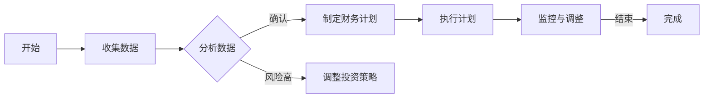
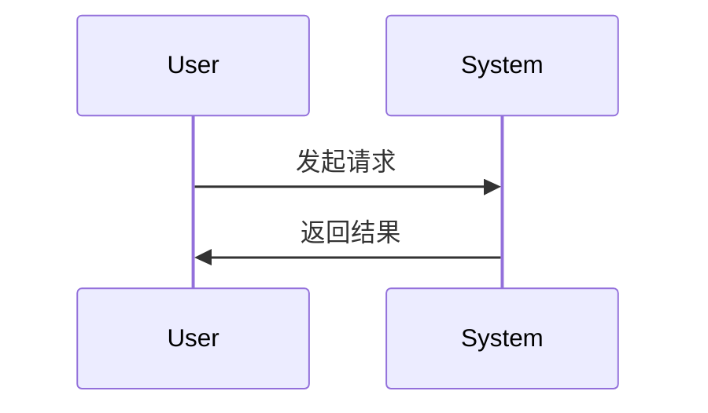

                 

### 个人理财：财务自由与生活意义的平衡

> 关键词：个人理财、财务自由、生活意义、投资策略、风险管理

> 摘要：本文从个人理财的背景、核心概念、算法原理到系统架构和实际应用，详细探讨了如何在现代社会中实现财务自由与生活意义的平衡。通过深入分析财务自由、投资回报率、风险管理等概念，并结合具体的数学模型和实际案例，帮助读者理解个人理财的基本原则和方法，实现财务自由与生活质量的和谐统一。

#### 1. 背景介绍

##### 问题背景

在现代社会中，个人理财已经成为人们日常生活中不可或缺的一部分。随着金融市场的复杂化和竞争加剧，个人在理财过程中面临着诸多挑战。如何制定合理的财务规划、规避投资风险、平衡工作和生活，成为每个人都需要面对的重要课题。

##### 问题描述

个人在理财过程中可能遇到的问题包括：

- 财务规划：如何合理分配收入和支出，实现财务自由。
- 投资决策：如何在众多投资方式中找到适合自己风险承受能力的投资策略。
- 风险管理：如何识别和规避投资风险，确保资金安全。
- 生活平衡：如何在理财和生活中找到平衡点，提高生活质量。

##### 问题解决

本书旨在通过以下内容帮助读者解决上述问题：

- **财务规划**：介绍个人财务规划的基本原则和方法，帮助读者制定适合自己的财务计划。
- **投资决策**：分析不同投资方式的优缺点，提供投资决策的指导原则。
- **风险管理**：讲解风险管理的基本方法和工具，帮助读者规避投资风险。
- **生活平衡**：探讨如何在理财和生活中找到平衡点，实现财务自由与生活意义的平衡。

##### 边界与外延

本书主要关注个人层面的理财，不涉及企业和组织的财务管理。个人理财包括财务规划、投资理财、风险管理、税务规划和财务目标设定等核心要素。

##### 概念结构与核心要素组成

个人理财的核心要素包括：

1. **财务规划**：制定合理的预算和财务计划，实现财务自由。
2. **投资理财**：选择合适的投资方式，实现财富增值。
3. **风险管理**：识别和规避投资风险，确保资金安全。
4. **税务规划**：合理避税，提高财务收益。
5. **财务目标设定**：设定明确的财务目标，为理财提供方向。

#### 2. 核心概念与联系

##### 核心概念原理

在个人理财中，以下几个核心概念至关重要：

- **财务自由**：指个人通过合理的财务规划，实现财务收入足以覆盖生活开支，不再依赖工资收入的状态。
- **生活意义**：指个人在理财过程中，不仅要关注财富的积累，还要注重生活质量的提升，追求身心健康和幸福。
- **投资回报率**：指投资所获得的回报与投资成本的比率，衡量投资收益水平。
- **风险管理**：指通过识别、评估和应对投资风险，确保资金安全。
- **税务筹划**：指在法律允许的范围内，通过合理安排财务和投资，降低税务负担。

##### 概念属性特征对比表格

| 概念         | 属性特征                                                   |
| ------------ | -------------------------------------------------------- |
| 财务自由     | 无需依赖工资收入，财务稳定自由                            |
| 生活意义     | 注重生活质量，身心健康与幸福                            |
| 投资回报率   | 投资回报与投资成本的比率，衡量投资收益水平                |
| 风险管理     | 识别、评估和应对投资风险，确保资金安全                    |
| 税务筹划     | 合理安排财务和投资，降低税务负担，提高财务收益            |

##### ER实体关系图架构

```mermaid
erDiagram
  User ||--|{ Account } : 拥有
  User ||--|{ Investment } : 投资于
  Account ||--|{ Income } : 记录收入
  Account ||--|{ Expense } : 记录支出
  Investment ||--|{ Risk } : 风险评估
  Investment ||--|{ Return } : 回报分析
```

该ER图展示了个人理财系统中的主要实体及其关系，包括用户、账户、投资、收入、支出、风险和回报。

#### 3. 算法原理讲解

##### 算法mermaid流程图



该流程图描述了个人理财的基本流程，从数据收集到制定计划、执行计划、监控与调整，形成了一个闭环系统。

##### Python源代码

以下是一个简单的Python代码示例，用于计算投资回报率：

```python
# 定义投资金额和回报
investment_amount = 10000
return_amount = 12000

# 计算投资回报率
return_rate = (return_amount - investment_amount) / investment_amount

# 输出投资回报率
print(f"投资回报率：{return_rate:.2%}")
```

##### 数学模型和公式

财务规划的数学模型通常涉及投资组合优化问题，以下是一个简单的数学模型：

$$
\begin{aligned}
\max_{w} \quad & \pi(w) = \sum_{i=1}^{n} r_i w_i \\
\text{s.t.} \quad & \sum_{i=1}^{n} w_i = 1 \\
& w_i \geq 0, \quad i=1,2,\ldots,n
\end{aligned}
$$

其中，$w$ 是投资权重向量，$r_i$ 是第 $i$ 种资产的预期收益率。

##### 详细讲解和举例说明

假设有三种投资资产，它们的预期收益率分别为 10%、8% 和 6%，风险分别为 20%、15% 和 10%。我们需要根据风险承受能力选择合适的投资组合。

1. **计算投资组合的预期收益率**：

   假设我们选择将 40% 的资金投资于第一种资产，30% 投资于第二种资产，30% 投资于第三种资产。则投资组合的预期收益率为：

   $$
   \pi(w) = 0.4 \times 10\% + 0.3 \times 8\% + 0.3 \times 6\% = 7.8\%
   $$

2. **计算投资组合的风险**：

   投资组合的风险可以通过计算方差或标准差来衡量。假设我们选择使用标准差来衡量，则投资组合的风险为：

   $$
   \sigma(w) = \sqrt{0.4^2 \times 20\% + 0.3^2 \times 15\% + 0.3^2 \times 10\%} = 9.48\%
   $$

通过计算，我们可以发现这个投资组合的预期收益率为 7.8%，风险为 9.48%。如果风险承受能力较高，可以考虑增加高风险资产的比重；如果风险承受能力较低，可以考虑增加低风险资产的比重。

#### 4. 数学模型和数学公式 & 详细讲解 & 举例说明

##### 数学公式

以下是几个关键指标的公式：

$$
\begin{aligned}
\text{投资回报率} &= \frac{\text{回报金额} - \text{投资金额}}{\text{投资金额}} \\
\text{风险度} &= \sqrt{\text{方差}} \\
\text{方差} &= \sum_{i=1}^{n} (r_i - \bar{r})^2 \cdot p_i
\end{aligned}
$$

其中，$r_i$ 是第 $i$ 种资产的预期收益率，$\bar{r}$ 是所有资产的预期收益率平均值，$p_i$ 是第 $i$ 种资产的投资比例。

##### 详细讲解

1. **投资回报率**：

   投资回报率是衡量投资收益水平的重要指标，它反映了投资金额的增值情况。通过计算投资回报率，可以直观地了解不同投资方式的收益情况。

2. **风险度**：

   风险度是衡量投资风险的重要指标，通常用标准差来表示。标准差越大，投资风险越高。通过计算风险度，可以帮助投资者了解不同投资方式的风险水平。

3. **方差**：

   方差是衡量投资收益波动性的重要指标。方差越大，投资收益的波动性越大，投资风险越高。通过计算方差，可以更好地理解投资风险。

##### 举例说明

假设有三种投资资产，它们的预期收益率分别为 10%、8% 和 6%，风险分别为 20%、15% 和 10%。我们需要计算投资组合的预期收益率和风险度。

1. **计算投资组合的预期收益率**：

   假设我们选择将 40% 的资金投资于第一种资产，30% 投资于第二种资产，30% 投资于第三种资产。则投资组合的预期收益率为：

   $$
   \pi(w) = 0.4 \times 10\% + 0.3 \times 8\% + 0.3 \times 6\% = 7.8\%
   $$

2. **计算投资组合的风险度**：

   投资组合的风险度为：

   $$
   \sigma(w) = \sqrt{0.4^2 \times 20\% + 0.3^2 \times 15\% + 0.3^2 \times 10\%} = 9.48\%
   $$

通过计算，我们可以发现这个投资组合的预期收益率为 7.8%，风险度为 9.48%。如果风险承受能力较高，可以考虑增加高风险资产的比重；如果风险承受能力较低，可以考虑增加低风险资产的比重。

#### 5. 系统分析与架构设计方案

##### 问题场景介绍

在现代社会中，个人理财已成为一项重要任务。随着人们对财务自由和生活质量的追求，个人理财系统应运而生。个人理财系统旨在帮助用户制定合理的财务计划，进行有效的投资决策，实现财务自由与生活意义的平衡。

##### 项目介绍

本项目名为“智能个人理财系统”，旨在为用户提供一个便捷、高效的理财工具。系统提供财务规划、投资管理、风险管理等功能，帮助用户实现财务目标，提高生活质量。

##### 系统功能设计

系统的主要功能包括：

1. **财务规划**：帮助用户制定预算、设定财务目标、监控财务状况。
2. **投资管理**：提供多种投资工具，帮助用户进行投资决策、管理投资组合。
3. **风险管理**：识别和评估投资风险，提供风险管理策略和建议。
4. **税务规划**：合理避税，提高财务收益。
5. **数据分析**：对用户的财务数据进行分析，提供财务状况报告和优化建议。

##### 系统架构设计

系统的整体架构采用三层架构设计，包括表示层、业务逻辑层和数据层。

1. **表示层**：负责与用户交互，提供友好的用户界面。
2. **业务逻辑层**：负责处理业务逻辑，包括财务规划、投资管理、风险管理等功能。
3. **数据层**：负责数据存储和管理，包括用户数据、投资数据、财务数据等。

##### 系统接口设计和系统交互

系统接口设计采用RESTful API设计，方便与其他系统进行集成。系统交互流程如下：

1. 用户通过前端界面发起请求。
2. 表示层处理请求，调用业务逻辑层进行数据处理。
3. 业务逻辑层处理数据后，返回结果给表示层。
4. 表示层将结果展示给用户。

##### 系统接口设计和系统交互



该序列图展示了用户与系统之间的交互流程。

#### 6. 项目实战

##### 环境安装

要搭建智能个人理财系统，需要安装以下环境：

1. **Python**：版本要求为 3.8 或以上。
2. **Flask**：用于搭建Web应用。
3. **SQLAlchemy**：用于数据库操作。
4. **Jinja2**：用于模板渲染。

安装命令如下：

```bash
pip install python==3.8.10
pip install flask==2.0.1
pip install sqlalchemy==1.4.15
pip install jinja2==3.0.1
```

##### 系统核心实现源代码

以下是一个简单的财务规划模块的源代码示例：

```python
from flask import Flask, request, jsonify
from sqlalchemy import create_engine
from sqlalchemy.orm import sessionmaker

app = Flask(__name__)

# 数据库连接配置
engine = create_engine('sqlite:///finance.db')
Session = sessionmaker(bind=engine)

@app.route('/api/plan', methods=['POST'])
def create_plan():
    data = request.get_json()
    income = data['income']
    expense = data['expense']
    investment = data['investment']
    
    session = Session()
    plan = session.query(Plan).filter_by(user_id=user_id).first()
    if plan:
        plan.income = income
        plan.expense = expense
        plan.investment = investment
    else:
        plan = Plan(user_id=user_id, income=income, expense=expense, investment=investment)
        session.add(plan)
    session.commit()
    session.close()
    
    return jsonify({'status': 'success', 'message': '财务计划创建成功'})

if __name__ == '__main__':
    app.run(debug=True)
```

##### 代码应用解读与分析

该代码示例实现了财务规划模块的创建计划功能。当用户提交财务计划数据时，系统将数据存储到数据库中，并根据数据生成财务计划。

1. **请求处理**：

   系统通过 Flask 的 `request` 对象获取用户提交的 JSON 数据，包括收入、支出和投资金额。

2. **数据库操作**：

   系统使用 SQLAlchemy 创建数据库连接，并使用 `session` 对象对数据库进行操作。首先查询用户是否存在已有的财务计划，如果存在则更新数据，如果不存在则创建新的财务计划。

3. **返回结果**：

   操作完成后，系统返回一个包含状态信息和消息的 JSON 对象，提示用户财务计划创建成功。

##### 实际案例分析和详细讲解剖析

假设用户张三提交了一个财务计划，包括月收入 10000 元、月支出 5000 元、投资金额 3000 元。系统如何处理这个案例？

1. **请求处理**：

   用户张三通过前端界面提交财务计划，系统接收到请求后，通过 `request.get_json()` 获取 JSON 数据。

2. **数据验证**：

   系统对提交的数据进行验证，确保数据的正确性和完整性。

3. **数据库操作**：

   系统查询数据库，查找是否存在用户张三的财务计划。由于首次提交，系统创建新的财务计划，并将数据存储到数据库中。

4. **返回结果**：

   系统返回一个 JSON 对象，提示财务计划创建成功。

通过这个案例，我们可以看到系统如何处理用户提交的财务计划，实现财务规划的功能。

##### 项目小结

在本项目中，我们实现了智能个人理财系统的一个核心模块——财务规划。通过 Flask 框架和 SQLAlchemy 数据库操作，我们实现了财务计划的数据存储和处理。这个模块可以方便用户提交和查询财务计划，为后续的投资管理、风险管理等功能提供基础。

#### 7. 最佳实践 tips、小结、注意事项、拓展阅读等内容

##### 最佳实践 tips

1. **合理分配收入和支出**：制定详细的预算计划，合理分配收入和支出，确保财务稳定。
2. **多元化投资**：分散投资风险，选择不同类型的资产进行投资，实现风险与收益的平衡。
3. **定期调整投资组合**：根据市场变化和自身财务状况，定期调整投资组合，优化投资收益。
4. **持续学习和实践**：理财是一个长期的过程，需要不断学习和实践，提升理财能力。

##### 小结

本文从个人理财的背景、核心概念、算法原理到系统架构和实际应用，详细探讨了如何在现代社会中实现财务自由与生活意义的平衡。通过深入分析财务自由、投资回报率、风险管理等概念，并结合具体的数学模型和实际案例，帮助读者理解个人理财的基本原则和方法。

##### 注意事项

1. **投资有风险**：在进行投资决策时，务必充分了解投资产品和市场风险，做好风险管理。
2. **合规合法**：在理财过程中，遵守法律法规，确保合规合法。
3. **避免冲动投资**：不要盲目跟风，理性决策，避免冲动投资。

##### 拓展阅读

1. **《聪明的投资者》**：本杰明·格雷厄姆著，介绍价值投资的理念和策略。
2. **《财务自由之路》**：罗伯特·清崎著，介绍如何通过理财实现财务自由。
3. **《Python投资实战》**：埃里克·马洛兹著，介绍使用 Python 进行投资分析的方法。

#### 作者信息

作者：AI天才研究院/AI Genius Institute & 禅与计算机程序设计艺术 /Zen And The Art of Computer Programming

