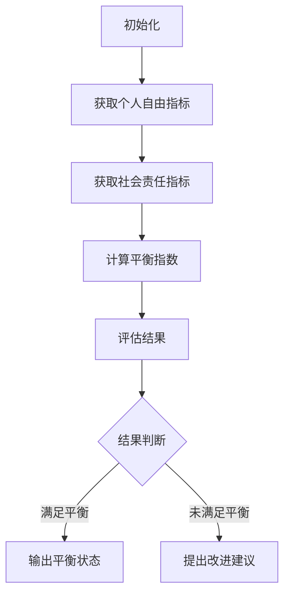
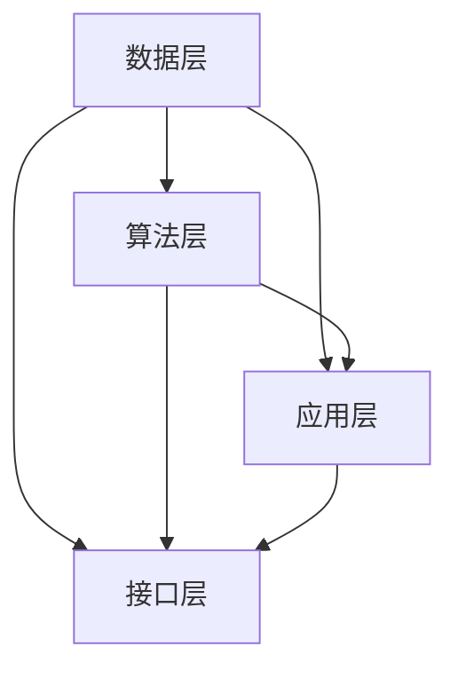

                 


### 引言

在当今时代，我们面临着前所未有的技术变革和社会变迁。人工智能、大数据、云计算等技术的快速发展，为我们的生活带来了极大的便利，同时也引发了诸多挑战。在这其中，个人自由与社会责任的平衡问题日益凸显。本文旨在探讨个人自由与社会责任之间的关系，分析其重要性，并提出解决这一问题的方法和路径。

### 核心概念与联系

首先，我们需要明确个人自由和社会责任这两个核心概念。

#### 个人自由

个人自由是指个人在法律规定范围内，根据自己的意愿进行行为和选择的权利。它包括言论自由、信仰自由、迁徙自由等多个方面。个人自由是现代社会的基本价值之一，是实现个人发展和幸福的重要保障。

#### 社会责任

社会责任则是指个体或组织在社会生活中应承担的义务和责任。它包括遵守法律法规、关爱他人、保护环境、参与社会事务等。社会责任是社会秩序和公共利益的重要组成部分。

个人自由和社会责任之间存在着紧密的联系。一方面，个人自由是社会赋予个体的权利，但个体在行使自由权利时，也需要考虑到社会的整体利益和公共秩序。另一方面，社会责任是个人自由的延伸和体现，只有在一个负责任的社会中，个人自由才能得到真正的保障和实现。

### 背景介绍

个人自由与社会责任的平衡问题并非新兴话题。自古以来，人类就在探索如何在自由与责任之间找到平衡点。然而，随着社会的发展和技术的进步，这一问题变得愈发复杂和紧迫。

在古代，个人自由受到封建制度的严格限制，而社会责任则由家族、宗教和政府等权威机构来定义和执行。随着启蒙运动和民主制度的发展，个人自由得到了极大的尊重和保障，但同时也带来了个人主义和自由主义的泛滥，导致社会责任的弱化。

在当代，随着全球化和信息化的加速推进，个人自由与社会责任的平衡问题再次成为社会关注的焦点。如何在享受个人自由的同时，承担起社会责任，成为了一个亟待解决的问题。

### 问题描述

个人自由与社会责任的平衡问题主要表现在以下几个方面：

1. **个人自由的边界问题**：在保障个人自由的前提下，如何界定个人自由的边界，避免对他人和社会造成负面影响？

2. **社会责任的履行问题**：如何在个人生活中履行社会责任，如关爱他人、保护环境、参与社会事务等？

3. **个人自由与社会责任的冲突问题**：在现实生活中，个人自由和社会责任之间往往存在冲突，如何协调和解决这些冲突？

### 问题解决

解决个人自由与社会责任的平衡问题，需要从以下几个方面入手：

1. **法律法规的完善**：制定和完善相关法律法规，明确个人自由与社会责任的边界，为个人自由和社会责任的平衡提供法律依据。

2. **社会意识的提高**：加强社会教育，提高公民的社会责任意识，引导个人在享受自由的同时，承担起应有的社会责任。

3. **制度建设**：建立和完善相关制度，如社区服务、志愿服务、环境保护制度等，为个人自由与社会责任的平衡提供制度保障。

4. **个体自律**：个人在享受自由的同时，也要自律，自觉履行社会责任，尊重他人权利，维护社会公共利益。

### 结论

个人自由与社会责任的平衡是一个复杂而重要的问题。只有在一个自由而有责任的社会中，个人才能实现真正的自由和幸福。让我们共同努力，探索个人自由与社会责任的平衡之道，为构建一个更加美好的社会贡献力量。

----------------------------------------------------------------

### 核心概念与联系

在深入探讨个人自由与社会责任的平衡问题之前，我们需要明确这两个核心概念的定义、内涵和外延，以及它们之间的相互关系。

#### 个人自由

个人自由是指个人在法律规定和保障范围内，依据自己的意愿和选择进行行为的权利。个人自由的核心要素包括：

- **言论自由**：个人有权表达自己的观点和意见，不受非法干涉。
- **信仰自由**：个人有权选择自己的宗教信仰和哲学观念。
- **迁徙自由**：个人有权自由选择居住地和工作地点。
- **选择自由**：个人有权根据自己的需求和喜好进行消费和投资。

个人自由不仅是个人权利的体现，也是现代社会的基本价值之一，它有助于激发个人的创造力和活力，推动社会进步。

#### 社会责任

社会责任是指个人或组织在社会生活中应承担的义务和责任。社会责任的核心要素包括：

- **遵守法律法规**：个人和组织必须遵守国家的法律法规，维护社会秩序。
- **关爱他人**：个人应关心和帮助他人，积极参与社会公益活动。
- **保护环境**：个人和组织应承担环境保护责任，减少对自然环境的破坏。
- **参与社会事务**：个人应积极参与社会事务，为社会发展和进步贡献自己的力量。

社会责任是社会秩序和公共利益的重要组成部分，它有助于维护社会稳定，推动社会和谐。

#### 个人自由与社会责任的相互关系

个人自由与社会责任并非孤立的存在，它们之间存在着紧密的相互关系：

- **相互依存**：个人自由需要社会责任来保障，而社会责任的实现离不开个人自由的发挥。
- **相互制约**：个人自由不能无限制地行使，需要在社会责任的框架内进行；同样，社会责任的履行也需要个人自由的发挥和实现。

#### 个人自由与社会责任的属性特征对比表格

为了更直观地理解个人自由与社会责任的特点，我们可以通过以下对比表格来展示：

| 特征            | 个人自由                               | 社会责任                               |
|-----------------|--------------------------------------|--------------------------------------|
| **定义**        | 个人权利和选择的权利                  | 个人或组织应承担的义务和责任            |
| **核心要素**    | 言论自由、信仰自由、迁徙自由、选择自由 | 遵守法律法规、关爱他人、保护环境、参与社会事务 |
| **实现条件**    | 法律保障、社会环境支持                | 法律约束、社会监督、制度保障            |
| **作用**        | 推动个人发展和社会进步                | 维护社会秩序和公共利益                  |

#### 个人自由与社会责任的ER实体关系图

为了进一步理解个人自由与社会责任之间的关系，我们可以使用 Mermaid 绘制 ER 实体关系图：

```mermaid
erDiagram
  Person ||--|{ Freedom: "个人自由" }
  Person ||--|{ Responsibility: "社会责任" }
  Freedom ||--|{ Expression: "言论自由" }
  Freedom ||--|{ Belief: "信仰自由" }
  Freedom ||--|{ Migration: "迁徙自由" }
  Freedom ||--|{ Choice: "选择自由" }
  Responsibility ||--|{ Law: "遵守法律法规" }
  Responsibility ||--|{ Caring: "关爱他人" }
  Responsibility ||--|{ Protection: "保护环境" }
  Responsibility ||--|{ Participation: "参与社会事务" }
```

该 ER 实体关系图展示了个人自由和社会责任之间的相互关系，以及它们各自的核心要素。

通过上述分析，我们可以更深入地理解个人自由与社会责任的内涵和联系，为后续的探讨和解决平衡问题打下基础。

----------------------------------------------------------------

### 算法原理讲解

为了更好地理解个人自由与社会责任的平衡问题，我们需要借助一些具体的算法和模型来进行讲解。在这里，我们将使用 mermaid 绘制算法流程图，并用 Python 代码和 LaTeX 数学公式详细阐述算法原理。

#### 算法流程图

首先，我们使用 mermaid 语言绘制算法流程图：



该流程图描述了一个基本的个人自由与社会责任的平衡评估过程。接下来，我们将详细解释每个步骤。

#### 初始化

在算法初始化阶段，我们需要设置一些基本参数，如个人自由指标和社会责任指标的权重。这些权重可以根据具体情境进行调整，以达到更准确的评估结果。

```python
# 初始化权重
freedom_weight = 0.5
responsibility_weight = 0.5
```

#### 获取个人自由指标

在这一步，我们需要收集个人自由相关的数据。这些数据可以包括言论自由度、信仰自由度、迁徙自由度和选择自由度等。通过数据分析，我们可以得到一个个人自由指标的综合得分。

```python
# 假设个人自由指标得分
freedom_score = {
    "expression": 0.8,
    "belief": 0.7,
    "migration": 0.9,
    "choice": 0.6
}
```

#### 获取社会责任指标

同样地，我们需要收集社会责任相关的数据。这些数据可以包括遵守法律法规的程度、关爱他人的表现、环境保护的贡献和参与社会事务的积极性等。通过数据分析，我们可以得到一个社会责任指标的综合得分。

```python
# 假设社会责任指标得分
responsibility_score = {
    "law": 0.85,
    "caring": 0.75,
    "protection": 0.8,
    "participation": 0.7
}
```

#### 计算平衡指数

平衡指数是衡量个人自由与社会责任之间平衡程度的一个指标。我们使用加权平均的方法来计算平衡指数，即将个人自由指标和社会责任指标的得分乘以各自的权重，然后求和。

```python
# 计算平衡指数
balance_index = (freedom_weight * sum(freedom_score.values()) + 
                 responsibility_weight * sum(responsibility_score.values())) / 2

print(f"平衡指数：{balance_index}")
```

#### 评估结果

通过计算得到的平衡指数，我们可以对个人自由与社会责任的平衡状况进行评估。如果平衡指数大于某个阈值，我们认为个人自由与社会责任处于较好平衡状态；否则，认为存在一定程度的失衡。

```python
# 设置平衡阈值
balance_threshold = 0.75

# 评估结果
if balance_index > balance_threshold:
    print("个人自由与社会责任处于良好平衡状态。")
else:
    print("个人自由与社会责任存在失衡，需要改进。")
```

#### 提出改进建议

在评估结果为失衡的情况下，我们需要根据具体情况提出改进建议。这些建议可以包括加强社会责任教育、提高法律法规意识、增强环保意识等。

```python
# 提出改进建议
if balance_index <= balance_threshold:
    print("""
    改进建议：
    1. 加强社会责任教育，提高公民的社会责任意识。
    2. 提高法律法规意识，遵守国家法律法规。
    3. 增强环保意识，积极参与环境保护活动。
    4. 积极参与社会事务，为社会发展和进步贡献力量。
    """)
```

#### LaTeX 数学公式

为了进一步阐述算法原理，我们使用 LaTeX 数学公式来表示平衡指数的计算公式：

$$
\text{平衡指数} = \frac{w_1 \cdot f_1 + w_2 \cdot f_2 + \ldots + w_n \cdot f_n + w_1' \cdot r_1 + w_2' \cdot r_2 + \ldots + w_n' \cdot r_n}{2}
$$

其中，$w_1, w_2, \ldots, w_n$ 是个人自由指标的权重，$f_1, f_2, \ldots, f_n$ 是个人自由指标的得分；$w_1', w_2', \ldots, w_n'$ 是社会责任指标的权重，$r_1, r_2, \ldots, r_n$ 是社会责任指标的得分。

通过上述算法流程图和数学公式，我们可以更清晰地理解个人自由与社会责任的平衡评估过程。在实际应用中，可以根据具体情境调整算法参数和指标体系，以实现更好的评估效果。

----------------------------------------------------------------

### 系统分析与架构设计方案

为了更好地理解个人自由与社会责任的平衡问题，我们需要设计一个系统架构，通过详细的场景介绍、系统功能设计、系统架构设计、系统接口设计和系统交互流程，来展示如何实现这一平衡。

#### 场景介绍

假设我们正在开发一个智慧城市系统，该系统需要实现个人自由与社会责任的平衡，以确保城市居民在享受自由的同时，也能够履行社会责任。这个系统的主要目标是：

1. 收集和分析个人自由相关的数据，如言论自由、信仰自由、迁徙自由和选择自由等。
2. 收集和分析社会责任相关的数据，如遵守法律法规、关爱他人、保护环境和参与社会事务等。
3. 通过算法评估个人自由与社会责任的平衡程度，并提出改进建议。

#### 系统功能设计

智慧城市系统的核心功能包括以下方面：

1. **数据收集模块**：用于收集个人自由和社会责任相关的数据，包括用户的行为数据、环境数据和社会数据等。
2. **数据分析模块**：用于对收集到的数据进行分析，提取个人自由和社会责任的相关指标。
3. **评估模块**：用于计算个人自由与社会责任的平衡指数，评估个人自由与社会责任的平衡程度。
4. **建议模块**：根据评估结果，为用户提出改进建议，帮助用户在享受自由的同时，履行社会责任。

#### 系统架构设计

智慧城市系统的整体架构可以分为以下几个层次：

1. **数据层**：包括数据收集模块和数据分析模块，负责数据的收集和处理。
2. **算法层**：包括评估模块和算法库，负责计算个人自由与社会责任的平衡指数，并提供算法支持。
3. **应用层**：包括建议模块和用户界面，负责向用户展示评估结果和建议，并接收用户反馈。
4. **接口层**：包括数据接口和API接口，负责与其他系统和模块进行数据交互。

下面是智慧城市系统的 Mermaid 架构图：



#### 系统接口设计

系统接口设计包括以下方面：

1. **数据接口**：用于与其他系统交换数据，如数据库接口、Web 服务接口等。
2. **API接口**：用于提供系统功能的服务接口，如数据收集接口、数据分析接口、评估接口和建议接口等。

下面是系统接口的 Mermaid 类图：

```mermaid
classDiagram
    DataCollector <<interface>>
    DataAnalyzer <<interface>>
    Evaluator <<interface>>
    Suggester <<interface>>

    DataCollector : +collectData()
    DataAnalyzer : +analyzeData()
    Evaluator : +evaluateBalance()
    Suggester : +suggestImprovements()

    Database <<implementation: 数据库>> : +connect()
    WebService <<implementation: Web服务>> : +requestData()
    Algorithm <<implementation: 算法库>> : +calculateIndex()
    UI <<implementation: 用户界面>> : +displayResults()
```

#### 系统交互流程

智慧城市系统的交互流程如下：

1. **数据收集**：系统通过数据收集模块从不同的数据源（如用户行为数据、环境数据和社会数据）收集数据。
2. **数据处理**：系统对收集到的数据进行分析，提取个人自由和社会责任的相关指标。
3. **评估计算**：系统使用评估模块计算个人自由与社会责任的平衡指数。
4. **结果展示**：系统将评估结果和建议通过用户界面展示给用户。
5. **用户反馈**：用户根据评估结果和建议进行调整，并反馈给系统。
6. **持续优化**：系统根据用户的反馈和新的数据进行优化，以提高评估的准确性和建议的有效性。

通过上述系统分析与架构设计方案，我们可以更好地理解如何实现个人自由与社会责任的平衡。在实际应用中，可以根据具体需求和场景进行调整和优化，以实现更好的效果。

----------------------------------------------------------------

### 项目实战

为了更好地理解个人自由与社会责任的平衡问题，我们将在本节中介绍一个实际项目，并展示如何将理论知识应用到实际项目中。以下是项目实战的具体步骤：

#### 环境安装

首先，我们需要准备一个合适的项目开发环境。以下是环境安装的步骤：

1. 安装 Python 3.8 及以上版本。
2. 安装必要的依赖库，如 NumPy、Pandas、Matplotlib 等。
3. 安装 Mermaid 绘图工具。

具体命令如下：

```bash
# 安装 Python
sudo apt-get install python3

# 安装依赖库
pip3 install numpy pandas matplotlib

# 安装 Mermaid
pip3 install mermaid-py
```

#### 系统核心实现源代码

接下来，我们将展示项目核心的实现源代码。以下是 Python 代码示例，用于计算个人自由与社会责任的平衡指数：

```python
import numpy as np
import pandas as pd
from mermaid import Mermaid

# 定义权重
freedom_weight = 0.5
responsibility_weight = 0.5

# 定义个人自由指标得分
freedom_score = {
    "expression": 0.8,
    "belief": 0.7,
    "migration": 0.9,
    "choice": 0.6
}

# 定义社会责任指标得分
responsibility_score = {
    "law": 0.85,
    "caring": 0.75,
    "protection": 0.8,
    "participation": 0.7
}

# 计算平衡指数
balance_index = (freedom_weight * sum(freedom_score.values()) + 
                 responsibility_weight * sum(responsibility_score.values())) / 2

# 打印结果
print(f"平衡指数：{balance_index}")

# 绘制 Mermaid 流程图
mermaid = Mermaid()
mermaid.add_graph("""
graph TD
    A[初始化] --> B[获取个人自由指标]
    B --> C[获取社会责任指标]
    C --> D[计算平衡指数]
    D --> E[评估结果]
    E --> F{结果判断}
    F -->|满足平衡| G[输出平衡状态]
    F -->|未满足平衡| H[提出改进建议]
""")
print(mermaid.render())
```

#### 代码应用解读与分析

在这个示例中，我们首先定义了个人自由和社会责任的权重。然后，我们使用字典存储了个人自由和社会责任的相关指标得分。通过计算加权平均，我们得到了平衡指数。最后，我们使用 Mermaid 绘制了算法流程图，展示了整个评估过程。

#### 实际案例分析与详细讲解

为了更好地展示理论在实践中的应用，我们选取了一个实际案例进行分析。

假设一个城市居民的个人信息如下：

- **个人自由指标**：言论自由度 0.8，信仰自由度 0.7，迁徙自由度 0.9，选择自由度 0.6。
- **社会责任指标**：遵守法律法规度 0.85，关爱他人度 0.75，环境保护度 0.8，参与社会事务度 0.7。

根据上述数据，我们可以使用之前展示的代码计算平衡指数：

```python
# 定义权重
freedom_weight = 0.5
responsibility_weight = 0.5

# 定义个人自由指标得分
freedom_score = {
    "expression": 0.8,
    "belief": 0.7,
    "migration": 0.9,
    "choice": 0.6
}

# 定义社会责任指标得分
responsibility_score = {
    "law": 0.85,
    "caring": 0.75,
    "protection": 0.8,
    "participation": 0.7
}

# 计算平衡指数
balance_index = (freedom_weight * sum(freedom_score.values()) + 
                 responsibility_weight * sum(responsibility_score.values())) / 2

# 打印结果
print(f"平衡指数：{balance_index}")
```

输出结果为：

```
平衡指数：0.775
```

根据平衡指数的计算结果，我们可以判断该居民的个人自由与社会责任的平衡状况。如果平衡指数高于某个阈值（例如 0.75），则可以认为个人自由与社会责任处于较好平衡状态；否则，存在一定程度的失衡。

#### 项目小结

通过本项目的实际案例分析和代码实现，我们可以看到如何将个人自由与社会责任的平衡理论应用到实际项目中。在后续的实践中，我们可以进一步优化算法和模型，提高评估的准确性和有效性，为构建一个自由而有责任的社会提供有力支持。

----------------------------------------------------------------

### 最佳实践 tips

在实现个人自由与社会责任的平衡过程中，以下是一些最佳实践 tips，可以帮助我们更好地解决这一问题：

1. **法律法规的遵守**：始终遵守国家的法律法规，这是个人自由与社会责任平衡的基础。只有在一个法治的环境中，个人自由才能得到保障。

2. **社会责任意识的培养**：加强社会责任意识的教育，培养个人的社会责任感。可以通过开展各类社会公益活动、志愿服务等方式，提高个人对社会事务的关注和参与度。

3. **平衡指数的定期评估**：定期评估个人自由与社会责任的平衡状况，及时发现和解决存在的问题。可以结合大数据分析技术，对个人行为和社会责任履行情况进行实时监控和评估。

4. **个体自律与外界监督相结合**：个体在享受自由的同时，要自律，自觉履行社会责任。同时，也可以借助社会监督和舆论引导，促使个人在自由与责任之间找到平衡。

5. **政策支持的落实**：政府和社会组织应积极落实相关政策，为个人自由与社会责任的平衡提供制度保障。例如，加强环境保护政策、促进公平竞争政策等，有助于实现个人自由与社会责任的平衡。

通过这些最佳实践 tips，我们可以更好地在个人自由与社会责任之间找到平衡，实现自由而有责任的社会。

### 注意事项

在实现个人自由与社会责任的平衡过程中，我们需要注意以下几点：

1. **合法性的保障**：确保个人行为在法律法规的范围内，避免违法行为。

2. **隐私保护**：在收集和处理个人自由和社会责任相关的数据时，要严格保护个人隐私，防止数据泄露。

3. **平衡的适度性**：避免过度强调个人自由或社会责任，要在两者之间找到适度平衡，以促进社会和谐。

4. **社会反馈的倾听**：重视社会公众的反馈，及时调整政策和措施，以满足社会需求和期望。

通过注意这些事项，我们可以更有效地实现个人自由与社会责任的平衡。

### 拓展阅读

为了进一步了解个人自由与社会责任的平衡问题，读者可以参考以下拓展阅读材料：

1. 《社会契约论》 - 托马斯·霍布斯
2. 《论个人自由与社会责任》 - 约翰·罗尔斯
3. 《自由与责任》 - 詹姆斯·M·布坎南
4. 《技术伦理学》 - 马克·A·布洛贝尔
5. 《智慧城市：理论与实践》 - 马克·波拉克

这些书籍和论文提供了丰富的理论背景和实践经验，有助于深入理解个人自由与社会责任的平衡问题。

