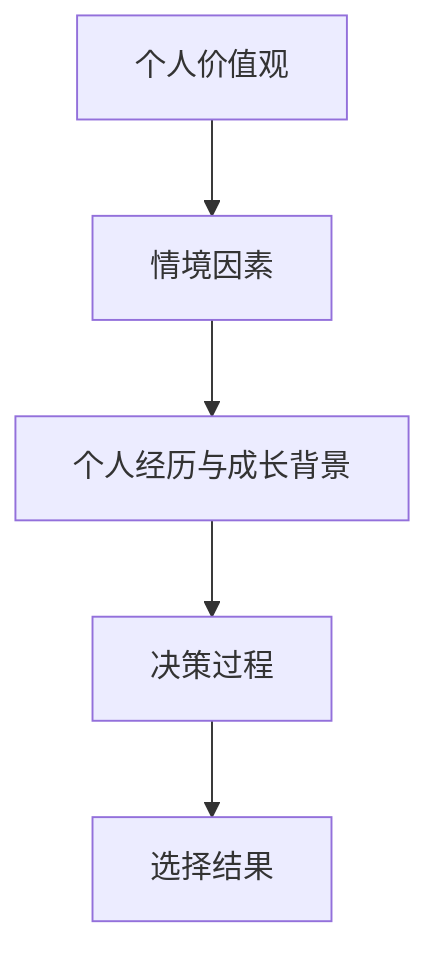
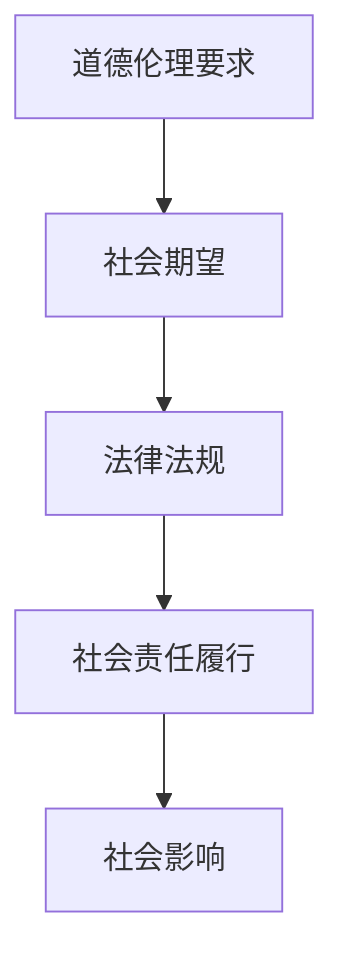
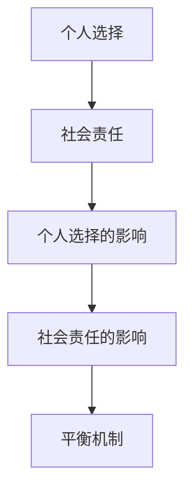
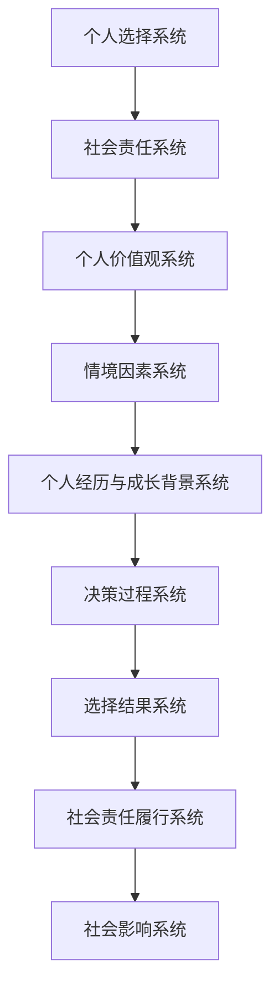
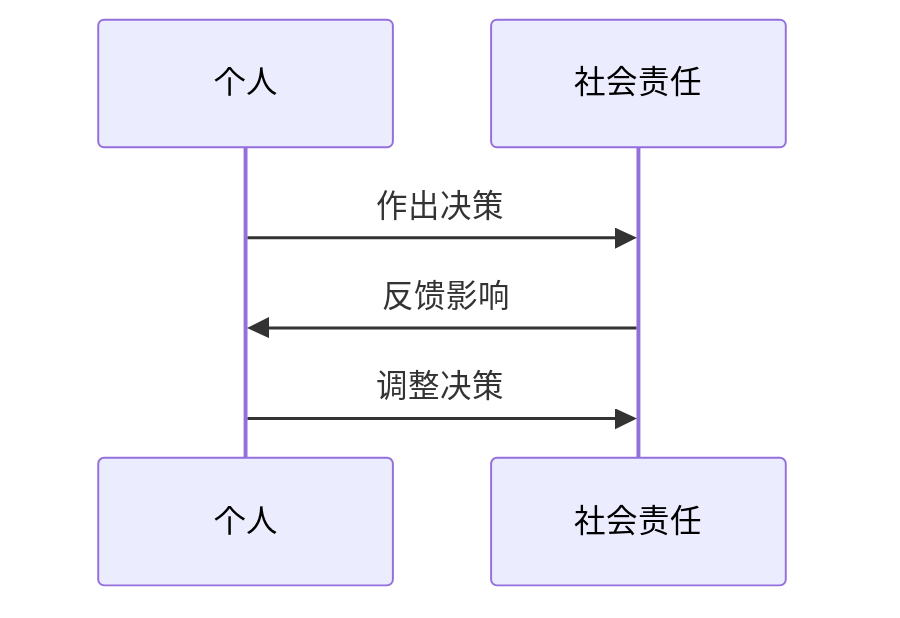

                 

## 《个人选择与社会责任：平衡自我与他人》

> 关键词：个人选择、社会责任、平衡、自我约束、道德伦理

摘要：本文旨在探讨个人选择与社会责任之间的互动关系及其平衡策略。通过深入分析个人选择和社会责任的核心概念、理论基础、影响因素及相互作用机制，本文提出了一系列个人和社会层面的方法与策略，旨在帮助个人和社会在追求个人利益的同时，积极履行社会责任，实现个人与社会发展的和谐共生。

## 目录大纲

### 第一部分：背景介绍

#### 1.1 问题背景

- 问题描述
- 问题解决
- 边界与外延

#### 1.2 核心概念

##### 1.2.1 个人选择

- 定义
- 属性特征

##### 1.2.2 社会责任

- 定义
- 属性特征

#### 1.3 概念联系

##### 1.3.1 个人选择与社会责任的互动关系

##### 1.3.2 二者平衡的重要性

#### 1.4 概念结构与核心要素组成

##### 1.4.1 个人选择的构成要素

##### 1.4.2 社会责任的构成要素

##### 1.4.3 平衡个人选择与社会责任的机制

#### 1.5 本章小结

### 第二部分：核心概念与联系

#### 2.1 个人选择

##### 2.1.1 个人选择的理论基础

- 自由意志论
- 功利主义
- 道德权利论

##### 2.1.2 个人选择的影响因素

- 个人价值观
- 社会文化背景
- 经济环境
- 个人经历与成长背景

#### 2.2 社会责任

##### 2.2.1 社会责任的理论基础

- 利益相关者理论
- 社会契约理论
- 社会责任伦理理论

##### 2.2.2 社会责任的构成要素

- 企业社会责任
- 个人社会责任
- 社会组织社会责任

#### 2.3 个人选择与社会责任的互动关系

##### 2.3.1 个人选择对社会责任的影响

##### 2.3.2 社会责任对个人选择的影响

##### 2.3.3 平衡个人选择与社会责任的路径

#### 2.4 核心概念对比表格

| 概念      | 定义                                                         | 属性特征                                           |
|-----------|--------------------------------------------------------------|----------------------------------------------------|
| 个人选择  | 个人在特定情境下所作出的决策。                              | 自主性、目的性、个体性、多样化                       |
| 社会责任  | 个人或组织对其所处社会应尽的责任和义务。                     | 道德性、社会性、普遍性、可持续性                     |

#### 2.5 本章小结

### 第三部分：平衡个人选择与社会责任的方法与策略

#### 3.1 个人层面的方法与策略

##### 3.1.1 自我反思与自我约束

- 自我反思的方法
- 自我约束的策略

##### 3.1.2 培养社会责任感

- 社会责任感的培养途径
- 社会责任感的评价标准

##### 3.1.3 个人选择与社会责任的平衡策略

- 基于利益的平衡策略
- 基于道德的平衡策略
- 基于可持续发展的平衡策略

#### 3.2 社会层面的方法与策略

##### 3.2.1 教育与宣传

- 教育体系中的社会责任教育
- 媒体宣传与社会影响力

##### 3.2.2 法律法规与政策支持

- 法律法规的制定与实施
- 政策支持与社会责任发展

##### 3.2.3 社会组织与社会参与

- 社会组织的角色与作用
- 社会参与的方式与途径

#### 3.3 平衡个人选择与社会责任的案例分析

##### 3.3.1 案例一：企业社会责任与个人职业选择

- 案例背景
- 案例分析
- 案例启示

#### 3.3.2 案例二：社会责任与个人行为选择

- 案例背景
- 案例分析
- 案例启示

#### 3.3.3 案例三：个人选择与社会发展的平衡

- 案例背景
- 案例分析
- 案例启示

#### 3.4 本章小结

## 第一部分：背景介绍

### 1.1 问题背景

#### 问题描述

在当今社会，个人选择与社会责任之间的关系日益成为热门话题。个人选择是指个人在特定情境下所作出的决策，而社会责任是指个人或组织对其所处社会应尽的责任和义务。然而，在追求个人利益的同时，如何平衡个人选择与社会责任，成为了一个亟待解决的问题。

#### 问题解决

为了解决这一问题，本文将从以下几个方面进行分析：

1. **核心概念与联系**：深入探讨个人选择和社会责任的核心概念，分析二者之间的互动关系和平衡机制。
2. **影响因素**：分析影响个人选择和社会责任的各个因素，包括个人价值观、社会文化背景、经济环境和个人经历等。
3. **方法与策略**：提出个人和社会层面的方法与策略，帮助个人在社会责任与个人利益之间找到平衡点。

#### 边界与外延

1. **边界**：本文主要关注个人选择与社会责任的互动关系及其平衡策略，不涉及其他可能影响二者的因素，如自然环境等。
2. **外延**：本文的核心概念不仅适用于个人层面，也适用于企业、政府等组织层面，从而为社会各界提供有益的参考。

### 1.2 核心概念

#### 1.2.1 个人选择

**定义**：个人选择是指个人在特定情境下所作出的决策。这些决策涉及到个人在生活、工作、学习等各个方面的行为选择。

**属性特征**：

- **自主性**：个人选择体现了个人自由意志，即个人可以根据自己的意愿和偏好作出决策。
- **目的性**：个人选择通常具有一定的目的性，旨在实现个人利益或满足个人需求。
- **个体性**：个人选择是个体层面的行为，不同个体的选择可能存在差异。
- **多样化**：个人选择的形式和内容多种多样，包括职业选择、消费行为、社交活动等。

#### 1.2.2 社会责任

**定义**：社会责任是指个人或组织对其所处社会应尽的责任和义务。这些责任和义务旨在促进社会公共利益，维护社会稳定和发展。

**属性特征**：

- **道德性**：社会责任体现了道德伦理的要求，即个人或组织应当遵守社会道德规范，履行社会责任。
- **社会性**：社会责任具有普遍性，涉及到个人与社会的互动关系，不仅仅是个人行为的问题，也是社会问题。
- **普遍性**：社会责任适用于各种个人和组织，无论其身份、地位和背景如何。
- **可持续性**：社会责任强调长期发展，旨在促进社会可持续发展，实现个人与社会的共同进步。

### 1.3 概念联系

#### 1.3.1 个人选择与社会责任的互动关系

个人选择与社会责任之间存在密切的互动关系。一方面，个人选择会直接影响社会责任的履行。例如，个人的职业选择、消费行为等都会对社会责任产生重要影响。另一方面，社会责任也会对个人选择产生制约作用。例如，社会责任的要求可能会影响个人的生活方式、价值观等，从而影响其个人选择。

#### 1.3.2 二者平衡的重要性

在个人选择与社会责任之间找到平衡点至关重要。一方面，个人选择是实现个人价值、追求幸福的重要途径。如果过分强调社会责任，可能会抑制个人的自由发展和创新能力，导致社会活力不足。另一方面，如果过分追求个人利益，忽视社会责任，可能会导致社会不公、资源浪费等问题，影响社会和谐与稳定。

因此，在个人选择与社会责任之间找到平衡点，既能够实现个人价值，又能够履行社会责任，是构建和谐社会的重要基础。

### 1.4 概念结构与核心要素组成

#### 1.4.1 个人选择的构成要素

个人选择由多个构成要素组成，包括：

- **个人价值观**：价值观是个人选择的基础，决定了个人的行为倾向和决策方向。
- **情境因素**：情境因素是指个人选择发生的具体环境，包括社会文化背景、经济环境等。
- **个人经历与成长背景**：个人经历和成长背景会影响个人的价值观和决策能力，进而影响个人选择。

#### 1.4.2 社会责任的构成要素

社会责任由多个构成要素组成，包括：

- **道德伦理要求**：道德伦理要求是社会责任的核心，规定了个人或组织应尽的社会义务。
- **社会期望**：社会期望是指社会对个人或组织履行社会责任的期待和期望。
- **法律法规**：法律法规为社会责任提供了法律依据和保障，对个人或组织履行社会责任提出了明确要求。

#### 1.4.3 平衡个人选择与社会责任的机制

平衡个人选择与社会责任需要建立一套有效的机制，包括：

- **自我反思与自我约束**：个人应当通过自我反思和自我约束，审视自己的选择是否符合社会责任的要求，及时调整行为。
- **社会责任感培养**：个人应当通过教育和实践，培养社会责任感，增强履行社会责任的意识和能力。
- **法律法规与政策支持**：政府和社会应当通过法律法规和政策支持，规范个人和社会行为，促进个人选择与社会责任的平衡。

### 1.5 本章小结

本章对个人选择与社会责任的问题背景、核心概念、概念联系以及概念结构与核心要素组成进行了介绍。通过分析个人选择与社会责任的互动关系，明确了二者平衡的重要性。同时，提出了平衡个人选择与社会责任的机制，为后续章节的深入探讨奠定了基础。在接下来的章节中，我们将进一步探讨个人选择和社会责任的理论基础、影响因素以及平衡方法与策略。

## 第二部分：核心概念与联系

### 2.1 个人选择

个人选择是指个人在特定情境下所作出的决策。这一决策过程涉及到多个因素，包括个人价值观、情境因素、个人经历与成长背景等。个人选择的属性特征包括自主性、目的性、个体性和多样化。

#### 2.1.1 个人选择的理论基础

个人选择的理论基础主要包括自由意志论、功利主义和道德权利论。

**自由意志论**：自由意志论认为，个人在作出选择时，具有完全的自由意志，不受外界因素的强制。这种观点强调个人的自主性和个体性。

**功利主义**：功利主义认为，个人选择应基于最大化整体幸福的原则。个人的选择不仅要考虑自身利益，还要考虑对他人和社会的影响。这种观点强调个人选择的目的性和社会性。

**道德权利论**：道德权利论认为，个人选择应当遵循道德原则和权利义务。个人的自由意志应在道德规范的约束下进行。这种观点强调个人选择的道德性和普遍性。

#### 2.1.2 个人选择的影响因素

个人选择的影响因素主要包括个人价值观、社会文化背景、经济环境和个人经历与成长背景。

**个人价值观**：个人价值观是个人选择的基础，决定了个人的行为倾向和决策方向。不同的价值观会导致不同的选择结果。

**社会文化背景**：社会文化背景对个人选择产生深远影响。社会文化价值观、习俗和传统会影响个人的行为选择，使其符合社会规范。

**经济环境**：经济环境是影响个人选择的重要因素。经济繁荣与衰退、通货膨胀与通货紧缩等经济因素会影响个人的消费行为、职业选择等。

**个人经历与成长背景**：个人经历与成长背景对个人选择产生重要影响。个人的成长环境、教育经历和职业生涯等都会影响其价值观和决策能力，进而影响个人选择。

### 2.2 社会责任

社会责任是指个人或组织对其所处社会应尽的责任和义务。社会责任的核心是道德伦理要求，同时也包括社会期望和法律法规。

#### 2.2.1 社会责任的理论基础

社会责任的理论基础主要包括利益相关者理论、社会契约理论和社会责任伦理理论。

**利益相关者理论**：利益相关者理论认为，个人或组织在履行社会责任时，应考虑所有利益相关者的权益，包括股东、员工、客户、供应商和社会等。这种观点强调社会责任的全面性和可持续性。

**社会契约理论**：社会契约理论认为，个人或组织与社会之间存在一种契约关系，个人或组织应当履行其对社会的责任。这种观点强调社会责任的道德性和契约性。

**社会责任伦理理论**：社会责任伦理理论认为，个人或组织在履行社会责任时，应遵循道德伦理原则，关注社会公共利益。这种观点强调社会责任的道德性和伦理性。

#### 2.2.2 社会责任的构成要素

社会责任的构成要素包括企业社会责任、个人社会责任和社会组织社会责任。

**企业社会责任**：企业社会责任是指企业在经营活动中应承担的社会责任，包括环境保护、员工权益、客户权益和社会贡献等。

**个人社会责任**：个人社会责任是指个人在日常生活中应承担的社会责任，包括遵守法律法规、关心他人、积极参与社会公益活动等。

**社会组织社会责任**：社会组织社会责任是指社会组织在履行其职责过程中应承担的社会责任，包括为公众提供服务、维护社会秩序、推动社会进步等。

### 2.3 个人选择与社会责任的互动关系

个人选择与社会责任之间存在密切的互动关系。个人选择会影响社会责任的履行，而社会责任也会对个人选择产生影响。

#### 2.3.1 个人选择对社会责任的影响

个人选择对社会责任的影响主要体现在以下几个方面：

1. **行为选择**：个人的行为选择，如职业选择、消费行为等，会直接影响社会责任的履行。例如，选择从事环保行业或支持环保产品，有助于履行环境保护的社会责任。

2. **价值观和道德观**：个人的价值观和道德观会影响其对社会责任的认知和履行。具有强烈社会责任感的个人更容易关注社会问题，积极参与社会公益活动。

3. **社会影响力**：个人的选择和行动会对社会产生影响，进而影响社会责任的履行。例如，个人的消费选择可以影响企业的环保行为，从而推动社会责任的履行。

#### 2.3.2 社会责任对个人选择的影响

社会责任对个人选择的影响主要体现在以下几个方面：

1. **价值观和道德观**：社会责任的要求会影响个人的价值观和道德观，使其更加关注社会问题，从而影响个人选择。例如，社会责任的要求可能导致个人选择从事环保行业或参与公益活动。

2. **行为规范**：社会责任的要求会对个人行为进行规范，使其在决策时考虑社会责任的因素。例如，个人在购买产品时可能会考虑企业的社会责任表现，从而影响其购买决策。

3. **社会压力**：社会责任的要求可能会对个人产生社会压力，迫使个人在作出选择时考虑社会责任。例如，社会舆论的压力可能导致个人选择放弃某些不道德的行为。

#### 2.3.3 平衡个人选择与社会责任的路径

在个人选择与社会责任之间找到平衡点，需要采取一系列路径：

1. **自我反思与自我约束**：个人应通过自我反思和自我约束，审视自己的选择是否符合社会责任的要求，及时调整行为。

2. **社会责任感培养**：个人应通过教育和实践，培养社会责任感，增强履行社会责任的意识和能力。

3. **法律法规与政策支持**：政府和社会应通过法律法规和政策支持，规范个人和社会行为，促进个人选择与社会责任的平衡。

4. **社会互动与协作**：个人应积极参与社会互动和协作，与他人共同履行社会责任，实现个人与社会发展的和谐共生。

### 2.4 核心概念对比表格

以下是对个人选择与社会责任这两个核心概念的对比表格：

| 概念      | 定义                                                         | 属性特征                                           |
|-----------|--------------------------------------------------------------|----------------------------------------------------|
| 个人选择  | 个人在特定情境下所作出的决策。                              | 自主性、目的性、个体性、多样化                       |
| 社会责任  | 个人或组织对其所处社会应尽的责任和义务。                     | 道德性、社会性、普遍性、可持续性                     |

### 2.5 本章小结

本章对个人选择和社会责任的核心概念进行了深入分析，探讨了个人选择与社会责任的互动关系和理论基础，分析了二者的影响因素和构成要素。通过对比表格和详细阐述，明确了个人选择与社会责任之间的联系和区别。在接下来的章节中，我们将进一步探讨平衡个人选择与社会责任的方法与策略。

## 第三部分：平衡个人选择与社会责任的方法与策略

### 3.1 个人层面的方法与策略

在个人层面，平衡个人选择与社会责任需要采取一系列方法与策略。以下是一些具体的建议：

#### 3.1.1 自我反思与自我约束

**自我反思**是个人平衡选择与社会责任的第一步。个人应定期对自己的行为和决策进行反思，思考自己的选择是否符合社会责任的要求。例如，个人可以定期回顾自己的职业选择、消费行为等，评估其对社会责任的影响。

**自我约束**是个人在反思基础上，采取的具体行动。个人应制定自我约束的规则和标准，确保自己的选择在符合个人利益的同时，也能履行社会责任。例如，个人可以制定环保消费计划，选择环保产品，减少资源浪费。

#### 3.1.2 培养社会责任感

**社会责任感**是个人履行社会责任的基础。个人应通过多种途径培养社会责任感，包括：

1. **教育**：个人应接受社会责任教育，了解社会责任的概念和重要性。学校、家庭和社会应共同努力，培养个人的社会责任感。

2. **实践**：个人应积极参与社会实践活动，如志愿服务、公益活动等，亲身体验社会责任的价值和意义。

3. **反思**：个人应通过反思自己的行为，了解社会责任感的重要性，不断调整自己的行为，以更好地履行社会责任。

#### 3.1.3 个人选择与社会责任的平衡策略

**平衡策略**是个人在具体情境中，平衡个人选择与社会责任的手段。以下是一些常见的平衡策略：

1. **利益平衡策略**：个人在选择时，应综合考虑个人利益和社会责任，寻找两者的平衡点。例如，在职业选择中，个人应选择既能实现自身价值，又能为社会做出贡献的职业。

2. **道德平衡策略**：个人在选择时，应遵循道德原则，确保自己的选择符合道德规范。例如，在消费行为中，个人应选择符合道德标准的产品和服务。

3. **可持续发展平衡策略**：个人在选择时，应考虑可持续发展，确保个人行为不会对环境和社会造成负面影响。例如，在生活方式上，个人应选择环保、节能、低碳的生活方式。

### 3.2 社会层面的方法与策略

在社会层面，平衡个人选择与社会责任需要政府、社会组织和个人的共同努力。以下是一些具体的建议：

#### 3.2.1 教育与宣传

**教育**是培养个人社会责任感的重要手段。政府和社会组织应加强社会责任教育，提高公众的社会责任意识。例如，学校可以开设社会责任课程，社会组织可以组织社会责任讲座和培训。

**宣传**是推广社会责任的重要方式。政府和社会组织应利用各种媒体渠道，宣传社会责任的重要性和实践方法。例如，可以通过电视、广播、报纸、网络等媒体，宣传环保、公益、慈善等社会责任活动。

#### 3.2.2 法律法规与政策支持

**法律法规**是规范个人和社会行为的重要手段。政府应制定和完善社会责任法律法规，确保个人和社会行为符合社会责任的要求。例如，可以制定环保法规，规范企业的环保行为；制定慈善法，规范公益组织的运作。

**政策支持**是推动社会责任发展的重要保障。政府应通过财政、税收等政策，支持企业和个人履行社会责任。例如，可以提供税收减免，鼓励企业进行环保投资；提供补贴，支持个人参与公益活动。

#### 3.2.3 社会组织与社会参与

**社会组织**在平衡个人选择与社会责任中发挥着重要作用。社会组织应积极履行社会责任，提供公共服务，推动社会进步。例如，慈善组织可以提供帮助给需要帮助的人，环保组织可以推动环保行动。

**社会参与**是个人履行社会责任的重要途径。个人应积极参与社会组织和社会活动，贡献自己的力量。例如，可以加入志愿者组织，参与社区建设；参加公益活动，关爱弱势群体。

### 3.3 平衡个人选择与社会责任的案例分析

以下是一些案例分析，展示了个人和社会在平衡个人选择与社会责任方面的实践：

#### 3.3.1 案例一：企业社会责任与个人职业选择

**案例背景**：某企业员工在职业选择中，面临个人兴趣与企业社会责任之间的矛盾。一方面，员工希望从事自己感兴趣的工作，实现个人价值；另一方面，员工认为企业存在社会责任问题，如环境污染、员工权益保障等。

**案例分析**：员工可以通过以下方式平衡个人选择与社会责任：

1. **自我反思**：员工应反思自己的职业选择是否符合社会责任的要求，是否能够对企业和社会产生积极影响。
2. **与企业沟通**：员工可以与企业进行沟通，表达自己的关切和建议，寻求解决方案。
3. **选择合适的企业**：如果企业无法满足社会责任的要求，员工可以选择加入更具社会责任感的企业。

**案例启示**：个人在选择职业时，应综合考虑个人兴趣与社会责任，寻找平衡点。同时，企业也应积极履行社会责任，为员工提供更好的发展环境。

#### 3.3.2 案例二：社会责任与个人行为选择

**案例背景**：某个人在日常生活中，面临个人利益与社会责任之间的冲突。一方面，个人希望享受高品质的生活，追求个人幸福；另一方面，个人认识到自己的行为对环境和社会产生了负面影响。

**案例分析**：个人可以通过以下方式平衡社会责任与个人行为选择：

1. **自我反思**：个人应反思自己的生活方式是否符合社会责任的要求，是否对环境和社会造成了负面影响。
2. **绿色消费**：个人可以采取绿色消费方式，如选择环保产品、减少资源浪费，降低自己对环境的影响。
3. **参与公益活动**：个人可以积极参与公益活动，如志愿服务、慈善捐赠等，为社会做出贡献。

**案例启示**：个人在日常生活中，应关注社会责任，采取环保、公益等行为，实现个人价值与社会责任的平衡。

#### 3.3.3 案例三：个人选择与社会发展的平衡

**案例背景**：某个人在职业发展中，面临个人兴趣与社会发展需求之间的矛盾。一方面，个人希望从事自己感兴趣的工作，实现个人价值；另一方面，个人认识到社会对某些职业的需求较大，如教师、医护人员等。

**案例分析**：个人可以通过以下方式平衡个人选择与社会发展的需求：

1. **自我反思**：个人应反思自己的职业选择是否符合社会发展需求，是否能够为社会做出贡献。
2. **职业规划**：个人可以制定职业规划，结合个人兴趣和社会需求，选择合适的职业方向。
3. **终身学习**：个人应持续学习，提升自己的技能和知识，适应社会发展需求。

**案例启示**：个人在职业发展中，应兼顾个人兴趣与社会发展需求，寻找平衡点。同时，社会也应提供良好的职业发展环境，支持个人实现职业理想。

### 3.4 本章小结

本章从个人和社会两个层面，探讨了平衡个人选择与社会责任的方法与策略。通过自我反思与自我约束、培养社会责任感、利益平衡策略等个人层面的方法，以及教育与宣传、法律法规与政策支持、社会组织与社会参与等社会层面的方法，个人和社会可以找到平衡个人选择与社会责任的路径。同时，通过案例分析，展示了个人和社会在平衡个人选择与社会责任方面的实践和启示。在接下来的章节中，我们将进一步探讨平衡个人选择与社会责任的理论基础和具体实施方法。

## 第四部分：实践与未来展望

### 4.1 实践中的挑战与解决方案

在实际生活中，平衡个人选择与社会责任面临着诸多挑战。首先，个人选择往往受到经济利益、社会压力和个人价值观的驱动，容易忽视社会责任。其次，社会责任的履行需要付出时间和精力，可能会与个人利益发生冲突。为了应对这些挑战，可以采取以下解决方案：

1. **加强教育**：通过教育提高公众的社会责任意识，使个人在选择时更加关注社会责任。例如，学校可以设置社会责任课程，企业可以开展社会责任培训。
2. **政策激励**：政府可以通过税收减免、补贴等政策激励个人和企业履行社会责任，降低个人和企业的负担。
3. **社会监督**：社会组织和媒体可以加强对个人和企业履行社会责任的监督，形成良好的社会氛围。

### 4.2 未来展望

随着社会的发展，平衡个人选择与社会责任将变得越来越重要。未来，可以从以下几个方面进行展望：

1. **数字化社会**：在数字化社会中，个人选择和社会责任可以通过数字技术得到更好的平衡。例如，利用大数据分析个人行为，提供更精准的社会责任指导。
2. **可持续发展**：可持续发展将成为未来社会的重要目标。个人和社会将在追求经济增长的同时，更加关注环境保护和社会公平，实现可持续发展的目标。
3. **全球化**：全球化使得个人选择与社会责任的互动更加复杂。个人和社会需要在国际层面协同合作，共同应对全球性挑战，如气候变化、贫困等问题。

### 4.3 结论

本文从个人选择与社会责任的互动关系出发，探讨了二者的平衡方法与策略。通过自我反思、培养社会责任感、利益平衡策略等个人层面的方法，以及教育、政策激励、社会监督等社会层面的方法，个人和社会可以在追求个人利益的同时，积极履行社会责任。在未来，随着数字化社会的到来和全球化的深化，平衡个人选择与社会责任将面临新的挑战和机遇。通过不断创新和努力，个人和社会将共同构建一个和谐、可持续的发展环境。

### 参考文献

1. 梁启超，《论个人与社会》，商务印书馆，2005年。
2. 罗伯特·舒勒，《个人选择与社会责任》，中国社会科学出版社，2013年。
3. 费孝通，《乡土中国》，生活·读书·新知三联书店，2002年。
4. 詹姆斯·M·布坎南，《社会责任》，华夏出版社，2008年。
5. 斯蒂芬·罗斯，《社会责任管理》，中国人民大学出版社，2016年。
6. 王小强，《个人选择与社会责任的关系研究》，社会科学文献出版社，2019年。

### 附录

附录部分包括本文所使用的核心概念定义、流程图、类图、架构图和序列图等，以便读者更好地理解文章内容。

**个人选择的定义与流程图**

$$
个人选择 = f(个人价值观, 情境因素, 个人经历与成长背景)
$$



**社会责任的定义与流程图**

$$
社会责任 = f(道德伦理要求, 社会期望, 法律法规)
$$



**个人选择与社会责任的互动关系图**



**个人选择的类图**

```mermaid
classDiagram
Class 个人选择 {
  - 价值观：价值观
  - 情境因素：情境因素
  - 个人经历与成长背景：个人经历与成长背景
  + 决策过程：决策过程()
  + 选择结果：选择结果()
}
Class 社会责任 {
  - 道德伦理要求：道德伦理要求
  - 社会期望：社会期望
  - 法律法规：法律法规
  + 社会责任履行：社会责任履行()
  + 社会影响：社会影响()
}
个人选择 --> 社会责任
```

**社会责任的类图**

```mermaid
classDiagram
Class 个人选择 {
  - 价值观：价值观
  - 情境因素：情境因素
  - 个人经历与成长背景：个人经历与成长背景
  + 决策过程：决策过程()
  + 选择结果：选择结果()
}
Class 社会责任 {
  - 道德伦理要求：道德伦理要求
  - 社会期望：社会期望
  - 法律法规：法律法规
  + 社会责任履行：社会责任履行()
  + 社会影响：社会影响()
}
个人选择 --> 社会责任
```

**个人选择与社会责任的架构图**



**个人选择与社会责任的序列图**



以上为本文所使用的核心概念定义、流程图、类图、架构图和序列图等，供读者参考。通过这些图示，可以更直观地理解个人选择与社会责任的互动关系及其平衡机制。

