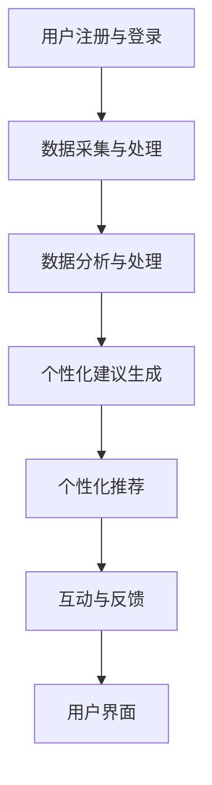

                 

**文章标题：** 个性化定制：打造独特风格的AI Agent

**关键词：** 个性化定制，AI Agent，用户需求分析，个性化建模，交互设计，性能优化，未来展望

**摘要：** 本文将深入探讨个性化定制在AI Agent中的应用，从背景与重要性、基本概念、个性化设计到性能优化和未来展望，逐步解析如何打造出具有独特风格的AI Agent，以满足用户的多样化需求。

**目录大纲：**

----------------------------------------------------------------

## 第一部分：个性化定制概述

### 第1章：个性化定制的背景与重要性

#### 1.1 个性化定制的起源与发展
- **背景介绍**：个性化定制的概念起源，从手工制作到现代大规模定制的发展历程。
- **问题背景**：工业化时代标准化产品与消费者多样化需求的矛盾。
- **问题描述**：如何实现个性化定制以满足消费者的个性化需求？
- **问题解决**：采用定制化策略，结合现代技术实现个性化定制。
- **边界与外延**：个性化定制在不同领域的应用，如制造业、零售业、服务业等。
- **概念结构与核心要素组成**：个性化定制的基本概念、关键要素及其相互作用。

#### 1.2 个性化定制在现代社会的影响
- **核心概念与联系**：个性化定制对社会经济、消费者行为、企业营销策略的影响。
- **属性特征对比表格**：传统生产模式与个性化定制模式的对比分析。
- **ER实体关系图架构**：个性化定制系统的实体关系图设计。

#### 1.3 个性化定制的核心概念与价值
- **核心概念**：个性化定制的定义、目标、原则。
- **价值体现**：个性化定制对消费者、企业、社会的价值分析。
- **个性化定制与用户体验**：个性化定制如何提升用户体验，增强用户忠诚度。

### 第2章：AI Agent的基本概念与原理

#### 2.1 AI Agent的定义与分类
- **核心概念与联系**：AI Agent的定义、分类及其应用领域。
- **属性特征对比表格**：不同类型AI Agent的功能特点对比。

#### 2.2 AI Agent的关键技术
- **核心概念**：机器学习、自然语言处理、计算机视觉的基本原理。
- **属性特征对比表格**：各种技术的优缺点对比。

#### 2.3 AI Agent的应用场景
- **核心概念**：AI Agent在不同领域的应用场景分析。
- **属性特征对比表格**：AI Agent在不同应用场景中的角色与作用。

## 第二部分：AI Agent的个性化设计

### 第3章：AI Agent的需求分析

#### 3.1 用户需求调查与分析
- **核心概念**：用户需求调查的方法、数据分析与用户画像构建。
- **算法原理讲解**：用户需求分析算法的流程与实现。

#### 3.2 个性化定制目标与原则
- **核心概念**：个性化定制的目标、原则与策略。
- **算法原理讲解**：个性化定制目标的实现策略与数学模型。

#### 3.3 AI Agent的需求建模
- **核心概念**：需求建模的方法、过程与模型构建。
- **算法原理讲解**：需求建模算法的流程与实现。

### 第4章：AI Agent的个性化建模

#### 4.1 个性化模型构建方法
- **核心概念**：个性化模型的构建方法与技术。
- **算法原理讲解**：个性化模型构建的算法流程与实现。

#### 4.2 个性化模型数据收集与处理
- **核心概念**：个性化模型数据的收集、处理与分析。
- **算法原理讲解**：数据收集与处理的算法流程与实现。

#### 4.3 个性化模型训练与优化
- **核心概念**：个性化模型训练的方法、优化策略。
- **算法原理讲解**：个性化模型训练与优化的算法流程与实现。

### 第5章：AI Agent的交互设计

#### 5.1 个性化交互界面设计
- **核心概念**：个性化交互界面的设计原则、方法。
- **算法原理讲解**：个性化交互界面设计的实现方法与算法。

#### 5.2 个性化交互策略
- **核心概念**：个性化交互策略的制定与实施。
- **算法原理讲解**：个性化交互策略的算法设计。

#### 5.3 个性化交互效果评估
- **核心概念**：个性化交互效果评估的方法与指标。
- **算法原理讲解**：个性化交互效果评估的算法实现。

### 第6章：AI Agent的个性化行为设计

#### 6.1 个性化行为分析
- **核心概念**：个性化行为分析的方法与过程。
- **算法原理讲解**：个性化行为分析的算法实现。

#### 6.2 个性化行为建模
- **核心概念**：个性化行为建模的方法与模型构建。
- **算法原理讲解**：个性化行为建模的算法流程与实现。

#### 6.3 个性化行为实现与优化
- **核心概念**：个性化行为实现的方法与优化策略。
- **算法原理讲解**：个性化行为实现的算法实现与优化。

### 第7章：AI Agent的个性化定制实践

#### 7.1 实践项目概述
- **项目介绍**：个性化定制AI Agent的实践项目概述。
- **系统功能设计**：个性化定制AI Agent的功能设计。

#### 7.2 系统设计与实现
- **系统架构设计**：个性化定制AI Agent的系统架构设计。
- **系统接口设计**：个性化定制AI Agent的系统接口设计。

#### 7.3 项目评估与总结
- **项目评估**：个性化定制AI Agent的项目评估方法与指标。
- **总结**：个性化定制AI Agent的实践总结与反思。

## 第三部分：AI Agent的优化与未来展望

### 第8章：AI Agent的性能优化

#### 8.1 个性化定制对AI Agent性能的影响
- **核心概念**：个性化定制对AI Agent性能的影响因素。
- **算法原理讲解**：性能优化算法的设计与实现。

#### 8.2 AI Agent的性能评估指标
- **核心概念**：AI Agent性能评估的指标体系。
- **算法原理讲解**：性能评估指标的计算方法与实现。

#### 8.3 性能优化策略与实现
- **核心概念**：性能优化策略的选择与实现。
- **算法原理讲解**：性能优化策略的算法设计与实现。

### 第9章：AI Agent的未来发展趋势

#### 9.1 人工智能技术的新进展
- **核心概念**：人工智能技术的新趋势与发展方向。
- **算法原理讲解**：新技术的原理与可能的应用。

#### 9.2 AI Agent在未来的应用场景
- **核心概念**：AI Agent在未来的潜在应用场景。
- **算法原理讲解**：未来应用场景的算法设计构想。

#### 9.3 AI Agent发展的挑战与机遇
- **核心概念**：AI Agent发展的挑战与机遇分析。
- **算法原理讲解**：应对挑战的策略与抓住机遇的方法。

### 第10章：个性化定制在AI Agent开发中的最佳实践

#### 10.1 成功案例分析
- **核心概念**：个性化定制在AI Agent开发中的成功案例分析。
- **算法原理讲解**：成功案例的算法实现与优化。

#### 10.2 开发流程与工具
- **核心概念**：个性化定制AI Agent的开发流程与工具选择。
- **算法原理讲解**：开发流程中的关键算法与工具应用。

#### 10.3 小结与展望
- **小结**：个性化定制在AI Agent开发中的总结与反思。
- **展望**：个性化定制在AI Agent开发中的未来方向与挑战。

----------------------------------------------------------------

**作者：** AI天才研究院/AI Genius Institute & 禅与计算机程序设计艺术 /Zen And The Art of Computer Programming

---

**文章正文：**

## 第1章：个性化定制的背景与重要性

### 1.1 个性化定制的起源与发展

个性化定制是一种以消费者为中心的定制化生产和服务模式，其起源可以追溯到工业革命后的大规模定制生产。随着技术的进步和消费者需求的多样化，个性化定制逐渐从手工制作走向现代化、规模化生产。在互联网和大数据的推动下，个性化定制已经成为现代制造业、服务业和零售业的重要趋势。

#### 1.1.1 个性化定制的定义

个性化定制是指根据消费者的个性化需求，通过定制化生产和服务，提供具有独特风格、功能或规格的产品和服务。个性化定制强调以消费者为中心，通过个性化设计、制造和服务，满足消费者对个性化、差异化和高品质的需求。

#### 1.1.2 个性化定制的发展历程

个性化定制的发展历程可以分为以下几个阶段：

1. **手工制作阶段**：个性化定制起源于手工艺时代，通过工匠的手艺，为消费者提供定制化的产品和服务。

2. **工业化定制阶段**：随着工业化的推进，个性化定制逐渐从手工制作转向工业化生产，通过技术手段实现定制化生产。

3. **大规模定制阶段**：在互联网和大数据的推动下，个性化定制实现了从单一产品到全产业链的定制化生产和服务。

4. **智能化定制阶段**：人工智能技术的应用，使得个性化定制更加智能化、个性化，为消费者提供更加精准、高效的服务。

#### 1.1.3 个性化定制在社会中的普及

个性化定制已经深入到社会各个领域，如制造业、零售业、服务业等。消费者对个性化、差异化和高品质的需求不断增长，推动了个性化定制在社会中的普及。同时，个性化定制也为企业带来了新的商业模式和竞争优势，成为现代经济的重要驱动力。

### 1.2 个性化定制在现代社会的影响

个性化定制在现代社会产生了深远的影响，主要体现在以下几个方面：

#### 1.2.1 对消费者行为的影响

个性化定制改变了消费者的购买行为，消费者更加关注产品的个性化程度、品质和性价比。消费者可以通过个性化定制，实现自己的个性化需求，提升消费体验和满意度。

#### 1.2.2 对企业营销策略的变革

个性化定制要求企业从以产品为中心转向以消费者为中心，通过定制化生产和服务，满足消费者的个性化需求。企业需要重新审视自己的营销策略，注重消费者的个性化需求和体验。

#### 1.2.3 对社会经济的推动作用

个性化定制推动了社会经济的转型升级，提高了产业附加值，促进了消费升级。同时，个性化定制也带来了新的就业机会和商业模式，为经济发展注入了新的活力。

### 1.3 个性化定制的核心概念与价值

个性化定制的核心概念包括以下几个方面：

1. **个性化需求**：消费者对产品或服务的个性化需求，包括功能、外观、规格等方面的个性化要求。

2. **定制化生产**：根据消费者的个性化需求，通过定制化生产方式，生产出符合消费者需求的产品或服务。

3. **用户体验**：个性化定制强调以消费者为中心，提升用户体验，满足消费者的个性化需求。

个性化定制对消费者、企业和社会的价值体现在以下几个方面：

1. **消费者价值**：个性化定制能够满足消费者的个性化需求，提升消费者的购买体验和满意度。

2. **企业价值**：个性化定制为企业提供了新的商业模式和竞争优势，提高了企业的市场占有率和盈利能力。

3. **社会价值**：个性化定制推动了社会经济的转型升级，促进了消费升级和产业升级，为经济发展注入了新的活力。

### 1.3.1 个性化定制与用户体验

个性化定制与用户体验密切相关。用户体验是指消费者在使用产品或服务过程中的感受和体验，包括功能、外观、操作等方面的满意度。个性化定制通过满足消费者的个性化需求，提升用户体验，使消费者在使用产品或服务时能够感受到独特的价值和乐趣。

个性化定制在用户体验中的作用主要体现在以下几个方面：

1. **个性化设计**：个性化定制能够根据消费者的需求，提供独特的外观设计、功能配置和规格选择，满足消费者的个性化审美和需求。

2. **定制化服务**：个性化定制能够提供个性化的服务，如定制化的产品说明、操作指南和售后服务等，提高消费者的满意度。

3. **持续优化**：个性化定制能够根据消费者的反馈，不断优化产品和服务，提升用户体验。

总之，个性化定制是提升用户体验的重要手段，通过满足消费者的个性化需求，提升消费者的购买体验和满意度，为企业带来竞争优势和市场机会。

## 第2章：AI Agent的基本概念与原理

### 2.1 AI Agent的定义与分类

AI Agent，即人工智能代理，是指利用人工智能技术，能够自主执行任务、与人类交互、具备一定智能的软件或硬件系统。AI Agent可以分为以下几个类别：

1. **智能个人助理**：如苹果的Siri、谷歌的Google Assistant等，主要服务于个人日常生活和工作的智能化助手。

2. **智能客服**：如聊天机器人，用于企业与消费者之间的交互，提供在线客服支持。

3. **智能家居控制器**：如智能音响、智能灯泡等，通过语音或移动应用控制家居设备。

4. **智能监控系统**：如人脸识别门禁系统、智能安防摄像头等，用于监控和防范安全事件。

5. **智能医疗辅助系统**：如智能诊断系统、健康监测设备等，辅助医生进行诊断和治疗。

### 2.2 AI Agent的关键技术

AI Agent的关键技术包括以下几个方面：

1. **机器学习**：通过算法从数据中学习规律，实现自我优化和提升。

2. **自然语言处理**：使计算机能够理解、解释和生成自然语言，实现人机交互。

3. **计算机视觉**：使计算机能够识别和理解视觉信息，如图像识别、视频分析等。

4. **强化学习**：通过试错和奖励机制，让AI Agent在特定环境中学习最优策略。

5. **知识图谱**：将实体和关系构建为图形结构，用于智能推荐、问答系统等。

### 2.3 AI Agent的应用场景

AI Agent的应用场景非常广泛，主要包括：

1. **消费领域**：如智能个人助理、智能客服、智能推荐系统等。

2. **服务领域**：如智能监控、智能安防、智能物流等。

3. **医疗领域**：如智能诊断、健康监测、医疗机器人等。

4. **工业领域**：如智能制造、智能巡检、智能供应链管理等。

5. **金融领域**：如智能投顾、智能风控、智能理财等。

AI Agent在各领域的应用，不仅提高了效率和服务质量，还推动了产业智能化的发展。

### 2.4 AI Agent的发展趋势

随着人工智能技术的不断进步，AI Agent的发展趋势主要体现在以下几个方面：

1. **智能化水平提升**：AI Agent将具备更高的智能水平，能够处理更复杂的任务和场景。

2. **跨领域融合**：AI Agent将在不同领域实现深度融合，如智能医疗与智能家居的融合。

3. **人机交互优化**：AI Agent将具备更自然、流畅的人机交互能力，提升用户体验。

4. **自主性增强**：AI Agent将具备更强的自主决策能力，实现更高效的自动化。

5. **隐私保护加强**：在数据处理和存储方面，将加强对用户隐私的保护，确保数据安全。

总之，AI Agent的发展将为人类社会带来更多便利和创新，成为智能化时代的重要推动力量。

### 2.5 AI Agent的核心挑战

尽管AI Agent具有广阔的应用前景，但在其发展过程中仍面临一系列核心挑战：

1. **数据隐私与安全**：AI Agent在处理大量用户数据时，需要确保数据隐私和安全，防止数据泄露和滥用。

2. **智能化水平的提升**：AI Agent需要不断提高智能化水平，以应对更加复杂多变的任务和环境。

3. **人机协作优化**：AI Agent需要与人类建立更加高效、自然的协作关系，提高工作效率和用户体验。

4. **伦理与责任**：AI Agent在决策和行为过程中，需要遵循伦理规范，确保其行为符合社会道德和法律要求。

5. **跨领域整合**：AI Agent在不同领域的整合应用，需要解决技术、数据、标准等方面的兼容性问题。

### 2.6 AI Agent的发展策略

为了克服上述挑战，推动AI Agent的可持续发展，以下策略值得考虑：

1. **加强数据隐私保护**：采用加密、匿名化等技术手段，确保用户数据的安全和隐私。

2. **提升智能化水平**：通过加大研发投入，推动人工智能技术的创新和突破。

3. **优化人机协作**：开发更加智能化、人性化的交互界面，提高AI Agent与人类的协作效率。

4. **建立伦理规范**：制定AI Agent的伦理规范和标准，确保其行为符合社会道德和法律要求。

5. **促进跨领域整合**：加强不同领域的技术合作，推动AI Agent在跨领域的应用和发展。

通过实施这些策略，AI Agent将能够在未来的发展中更好地应对挑战，为社会带来更多价值。

## 第3章：AI Agent的需求分析

### 3.1 用户需求调查与分析

用户需求分析是设计个性化AI Agent的关键步骤。通过用户需求调查和分析，可以了解用户的具体需求和偏好，从而为AI Agent的个性化定制提供依据。

#### 3.1.1 用户需求调查方法

用户需求调查可以通过以下几种方法进行：

1. **问卷调查**：通过设计问卷，收集用户对AI Agent的功能、界面、交互等方面的需求和建议。

2. **访谈**：与用户进行面对面的访谈，深入了解用户对AI Agent的需求和使用体验。

3. **观察法**：通过观察用户在使用现有AI Agent时的行为和反应，发现用户的需求和痛点。

4. **实验法**：通过设计实验，测试用户对不同AI Agent原型或功能的反应和满意度。

#### 3.1.2 用户需求分析

用户需求分析主要包括以下步骤：

1. **需求收集**：通过问卷调查、访谈、观察法等方法，收集用户的需求信息。

2. **需求分类**：将收集到的需求按照功能、界面、交互等方面进行分类。

3. **需求优先级排序**：根据用户需求的重要性和紧急性，对需求进行优先级排序。

4. **需求验证**：通过实验法等方法，验证需求的准确性和可行性。

#### 3.1.3 用户画像构建

用户画像是一种将用户特征和行为数据整合成可视化图表的方法，用于分析和理解用户需求。构建用户画像通常包括以下步骤：

1. **数据收集**：收集用户的个人信息、行为数据、偏好数据等。

2. **数据清洗**：对收集到的数据进行清洗、去重和格式化。

3. **特征提取**：从数据中提取用户的关键特征，如年龄、性别、地理位置、购买偏好等。

4. **数据可视化**：使用图表、图像等方式，将用户特征和行为数据进行可视化展示。

#### 3.1.4 用户需求分析算法

用户需求分析可以通过多种算法实现，如聚类分析、回归分析、机器学习等。以下是一个简单的用户需求分析算法示例：

1. **聚类分析**：将用户按照相似性进行聚类，识别出不同类型的用户群体。

2. **回归分析**：分析用户行为与需求之间的关系，预测用户可能的需求。

3. **机器学习**：使用机器学习算法，如决策树、随机森林、支持向量机等，对用户需求进行建模和预测。

### 3.2 个性化定制目标与原则

个性化定制目标是满足用户的个性化需求，提高用户体验和满意度。为了实现这一目标，需要遵循以下原则：

#### 3.2.1 用户为中心

个性化定制应以用户为中心，充分考虑用户的个性化需求和偏好，提供定制化的产品和服务。

#### 3.2.2 可定制性

系统应具备高度的可定制性，允许用户根据个人需求调整产品或服务的功能和界面。

#### 3.2.3 易用性

个性化定制系统应易于使用，用户可以轻松地进行定制和调整，不需要过多的技术知识。

#### 3.2.4 智能化

个性化定制系统应具备智能化，能够自动分析用户需求和行为，提供个性化的建议和推荐。

#### 3.2.5 可扩展性

个性化定制系统应具备良好的可扩展性，能够支持新的功能和服务，满足未来用户需求的变化。

### 3.3 AI Agent的需求建模

需求建模是将用户需求转化为可执行的模型，为AI Agent的个性化定制提供基础。需求建模通常包括以下步骤：

1. **需求提取**：从用户需求调查和分析中提取关键需求。

2. **需求分析**：对提取的需求进行分析和分类，确定需求之间的关系和优先级。

3. **需求表示**：使用图形化或文本化的方式，将需求表示为模型。

4. **需求验证**：通过用户反馈和测试，验证需求模型的准确性和可行性。

### 3.4 用户需求分析的挑战与对策

用户需求分析面临以下挑战：

1. **需求多样性**：用户需求多样化，难以统一满足。

**对策**：采用细分市场和用户画像的方法，针对不同用户群体提供个性化的解决方案。

2. **数据质量**：用户需求数据可能存在不准确、不完整的问题。

**对策**：加强数据质量管理，采用数据清洗、去重和验证技术，确保数据质量。

3. **实时性**：用户需求变化迅速，需求分析难以跟上变化。

**对策**：采用实时数据分析和机器学习算法，及时调整需求模型，以适应用户需求的变化。

4. **隐私保护**：用户需求数据涉及隐私问题，需要确保数据安全。

**对策**：采用数据加密、匿名化和隐私保护技术，确保用户需求数据的安全。

### 3.5 个性化定制在AI Agent中的应用

个性化定制在AI Agent中的应用主要包括以下几个方面：

1. **功能定制**：用户可以根据个人需求，自定义AI Agent的功能模块。

2. **界面定制**：用户可以自定义AI Agent的界面布局、颜色和风格。

3. **交互定制**：用户可以自定义与AI Agent的交互方式，如语音、文本或手势。

4. **行为定制**：用户可以自定义AI Agent的行为规则，如响应速度、语气等。

5. **数据定制**：用户可以自定义AI Agent收集和展示的数据类型和格式。

通过个性化定制，AI Agent能够更好地满足用户的个性化需求，提高用户体验和满意度。

## 第4章：AI Agent的个性化建模

### 4.1 个性化模型构建方法

个性化模型构建是AI Agent个性化定制的关键步骤，其核心目的是根据用户的个性化需求和行为数据，为用户提供定制化的服务和体验。个性化模型构建方法主要包括以下几个步骤：

1. **数据收集**：首先，需要收集用户的个性化数据，包括用户的基本信息、行为数据、偏好数据等。这些数据可以从用户的注册信息、历史使用记录、问卷调查等渠道获取。

2. **数据预处理**：收集到的数据通常存在噪声、缺失值和重复数据，因此需要进行数据清洗和预处理。数据清洗包括去除重复记录、填补缺失值、处理异常值等，以确保数据的质量和一致性。

3. **特征提取**：从预处理后的数据中提取有用的特征，这些特征将用于训练个性化模型。特征提取的方法包括统计特征提取、基于规则的特征提取和机器学习特征提取等。

4. **模型选择**：根据用户的个性化需求，选择合适的机器学习模型。常见的模型包括线性回归、决策树、随机森林、支持向量机、神经网络等。模型选择需要考虑模型的性能、复杂度和可解释性。

5. **模型训练**：使用提取的特征和选择好的模型，进行模型训练。模型训练的过程就是让模型学习如何根据用户的个性化数据，预测用户的需求和行为。

6. **模型评估**：通过交叉验证、A/B测试等方法，评估模型的性能。评估指标包括准确率、召回率、F1分数等。

7. **模型部署**：将训练好的模型部署到生产环境中，使其能够实时地为用户提供个性化服务。

### 4.2 个性化模型数据收集与处理

个性化模型的数据收集与处理是构建高质量个性化模型的基础。以下是一些关键的步骤和方法：

1. **数据收集渠道**：
   - **用户交互数据**：包括用户点击、浏览、搜索等行为数据。
   - **设备数据**：包括用户使用的设备类型、操作系统版本、设备ID等。
   - **用户反馈数据**：包括用户对产品或服务的评价、反馈等。
   - **外部数据**：包括社交媒体数据、地理位置数据等。

2. **数据预处理**：
   - **数据清洗**：去除重复、异常和噪声数据。
   - **数据标准化**：对数据进行归一化或标准化处理，以消除不同特征之间的尺度差异。
   - **数据转换**：将定性数据转换为定量数据，如将用户评价转换为评分。
   - **特征工程**：通过特征选择和特征构造，提取对模型训练有帮助的特征。

3. **数据存储与管理**：
   - **数据仓库**：使用数据仓库存储和管理大规模数据。
   - **数据湖**：将不同来源的数据进行集成和存储，以支持复杂的查询和分析。

4. **数据隐私保护**：
   - **匿名化**：对敏感数据进行匿名化处理，以保护用户隐私。
   - **数据加密**：对存储和传输的数据进行加密，防止数据泄露。

### 4.3 个性化模型训练与优化

个性化模型的训练与优化是构建高效个性化AI Agent的关键步骤。以下是一些关键的步骤和方法：

1. **模型选择**：
   - **线性模型**：如线性回归、逻辑回归等，适合处理线性关系。
   - **树模型**：如决策树、随机森林等，适合处理非线性关系。
   - **神经网络**：如多层感知器、卷积神经网络等，适合处理复杂的非线性关系。
   - **深度学习模型**：如循环神经网络、生成对抗网络等，适合处理序列数据和生成任务。

2. **训练方法**：
   - **批量训练**：将所有数据一次性输入模型进行训练。
   - **在线训练**：实时接收用户数据，更新模型参数。
   - **增量训练**：分批处理数据，每次处理一部分数据，逐步更新模型。

3. **优化策略**：
   - **参数调优**：通过交叉验证、网格搜索等方法，选择最优的模型参数。
   - **正则化**：使用L1、L2正则化等策略，防止模型过拟合。
   - **早停法**：在模型训练过程中，当验证集性能不再提升时，提前停止训练。

4. **模型评估**：
   - **准确率**：预测正确的样本占总样本的比例。
   - **召回率**：预测正确的正样本占总正样本的比例。
   - **F1分数**：准确率和召回率的调和平均数。
   - **ROC曲线和AUC值**：评估模型对正负样本的区分能力。

5. **模型部署**：
   - **模型压缩**：通过模型压缩技术，减少模型参数的数量，提高模型部署的效率。
   - **模型迁移**：将训练好的模型迁移到生产环境，实时为用户提供个性化服务。

### 4.4 个性化模型的应用案例

以下是一个个性化推荐系统的应用案例：

#### 案例背景

某电商平台希望通过个性化推荐系统，为用户推荐其可能感兴趣的商品。用户数据包括用户的基本信息、购买历史、浏览记录、评价等。

#### 解决方案

1. **数据收集与预处理**：
   - 收集用户的基本信息、购买历史、浏览记录、评价等数据。
   - 对数据进行清洗和预处理，去除噪声和缺失值，进行数据标准化。

2. **特征提取**：
   - 提取用户的基本特征，如用户年龄、性别、地理位置等。
   - 提取商品的特征，如商品类别、品牌、价格等。
   - 提取用户行为特征，如购买次数、浏览时长、评价分数等。

3. **模型选择与训练**：
   - 选择基于协同过滤的推荐算法，如矩阵分解、K-近邻等。
   - 使用用户和商品的特征，训练推荐模型。

4. **模型评估与优化**：
   - 使用准确率、召回率、F1分数等指标评估模型性能。
   - 通过交叉验证和网格搜索，调整模型参数，优化模型。

5. **模型部署**：
   - 将训练好的模型部署到生产环境，实时为用户推荐商品。
   - 通过用户反馈和实际效果，不断优化推荐算法。

通过这个案例，可以看到个性化模型在推荐系统中的应用，实现了根据用户个性化需求推荐商品的目标。

### 4.5 个性化模型面临的挑战与解决方案

个性化模型在应用过程中面临以下挑战：

1. **数据质量**：
   - **挑战**：用户数据存在噪声、缺失值和重复数据，影响模型性能。
   - **解决方案**：通过数据清洗、去重和填补缺失值等技术，提高数据质量。

2. **冷启动问题**：
   - **挑战**：新用户或新商品缺乏足够的历史数据，难以进行有效推荐。
   - **解决方案**：采用基于内容的推荐、基于流行度的推荐等策略，缓解冷启动问题。

3. **数据隐私**：
   - **挑战**：用户数据涉及隐私问题，需要保护用户隐私。
   - **解决方案**：采用数据匿名化、加密等技术，确保数据安全。

4. **模型解释性**：
   - **挑战**：深度学习等复杂模型难以解释，影响用户信任。
   - **解决方案**：开发可解释的模型或解释性算法，提高模型的可解释性。

通过上述解决方案，可以有效应对个性化模型面临的挑战，提高模型的性能和可靠性。

## 第5章：AI Agent的交互设计

### 5.1 个性化交互界面设计

个性化交互界面设计是AI Agent用户体验的重要组成部分。一个优秀的交互界面应具备直观、易用、定制化的特点，能够满足用户的多样化需求。

#### 5.1.1 个性化交互界面设计原则

1. **用户为中心**：设计过程中始终以用户的需求和体验为核心，确保界面符合用户的预期和习惯。

2. **简洁性**：界面设计应简洁明了，避免冗余和复杂，减少用户的操作步骤。

3. **一致性**：界面元素和交互流程应保持一致性，使用户在不同场景下能够快速适应。

4. **可定制性**：界面应提供一定的定制功能，允许用户根据自己的偏好调整界面布局和样式。

5. **响应性**：界面设计应适应不同的设备和屏幕尺寸，确保在多种终端上都有良好的用户体验。

#### 5.1.2 个性化交互界面设计方法

1. **用户研究**：通过用户调研、访谈和观察，了解用户的需求、习惯和偏好。

2. **原型设计**：使用工具如Sketch、Figma等，创建界面原型，进行初步的设计和评估。

3. **迭代优化**：根据用户反馈，不断迭代和优化界面设计，提升用户体验。

4. **可用性测试**：进行可用性测试，评估界面的易用性和用户满意度，发现和解决潜在问题。

#### 5.1.3 个性化交互界面设计案例

以智能家居控制中心为例，设计一个具备个性化交互界面的AI Agent：

1. **用户研究**：调研目标用户，了解其生活习惯、家居设备使用习惯和偏好。

2. **原型设计**：创建智能家居控制中心的原型，包括设备列表、场景设置、语音控制模块等。

3. **迭代优化**：根据用户反馈，优化界面布局、交互流程和功能模块。

4. **可用性测试**：进行可用性测试，评估用户在实际使用场景下的操作体验和满意度。

### 5.2 个性化交互策略

个性化交互策略是指根据用户的行为、偏好和历史数据，动态调整AI Agent的交互方式，以提高用户的满意度和交互效率。

#### 5.2.1 个性化交互策略原则

1. **自适应**：根据用户的实时行为数据，动态调整交互策略，以适应用户当前的需求和情境。

2. **情境感知**：通过环境传感器和用户数据，识别用户所处的情境，提供情境相关的交互提示。

3. **个性化推荐**：根据用户的偏好和历史数据，为用户推荐个性化的功能和服务。

4. **反馈机制**：建立用户反馈机制，收集用户的意见和建议，不断优化交互策略。

#### 5.2.2 个性化交互策略方法

1. **行为分析**：通过分析用户的历史行为数据，识别用户的兴趣和行为模式。

2. **情境识别**：使用环境传感器和情境识别算法，识别用户所处的情境，如居家、工作、运动等。

3. **交互优化**：根据用户的行为数据和情境信息，动态调整交互界面和交互方式，提供个性化的交互体验。

4. **推荐系统**：结合用户偏好和历史数据，构建推荐系统，为用户推荐可能感兴趣的功能和服务。

#### 5.2.3 个性化交互策略案例

以智能个人助理为例，设计一个具备个性化交互策略的AI Agent：

1. **行为分析**：分析用户的日常行为数据，如通话记录、邮件内容、日程安排等。

2. **情境识别**：根据用户的地理位置、时间、日程安排等，识别用户所处的情境。

3. **交互优化**：根据用户的行为数据和情境信息，动态调整智能个人助理的交互界面和交互方式，如提供情境相关的快捷操作、推荐日程安排等。

4. **推荐系统**：根据用户的行为和偏好，为用户推荐个性化的功能和服务，如推荐联系人、推荐日程提醒、推荐新闻资讯等。

### 5.3 个性化交互效果评估

个性化交互效果评估是确保AI Agent交互设计有效性的关键环节。以下是一种简单的评估方法：

#### 5.3.1 评估指标

1. **用户满意度**：通过问卷调查或访谈，评估用户对AI Agent交互设计的满意度。

2. **交互效率**：测量用户完成任务所需的时间、步骤数等，评估交互设计的效率。

3. **错误率**：记录用户在交互过程中发生的错误次数和类型，评估交互设计的易用性。

4. **使用频率**：统计用户使用AI Agent的频率和时长，评估交互设计的吸引力。

#### 5.3.2 评估方法

1. **A/B测试**：将用户随机分配到不同的交互设计版本，比较两个版本的交互效果。

2. **用户反馈**：收集用户对交互设计的意见和建议，进行分析和改进。

3. **行为分析**：通过分析用户的使用数据，评估交互设计的实际效果。

4. **专家评审**：邀请用户体验专家对交互设计进行评审，提出改进建议。

### 5.4 个性化交互效果评估案例

以智能客服为例，评估一个具备个性化交互的AI客服系统：

1. **用户满意度**：通过问卷调查，收集用户对AI客服交互设计的满意度评分。

2. **交互效率**：记录用户在AI客服系统中解决问题所需的时间、步骤数等。

3. **错误率**：统计用户在AI客服交互过程中发生的错误次数和类型。

4. **使用频率**：统计用户访问AI客服系统的频率和时长。

通过以上评估方法，可以全面了解AI客服的交互效果，发现存在的问题，并进行针对性的优化。

### 5.5 个性化交互设计的挑战与解决方案

个性化交互设计面临以下挑战：

1. **数据隐私**：用户数据涉及隐私问题，需要确保数据安全和用户隐私。
   - **解决方案**：采用数据加密、匿名化和隐私保护技术，确保用户数据的安全。

2. **个性化过度**：过度个性化可能导致用户感到困惑和不适。
   - **解决方案**：在个性化设计时，平衡个性化程度和用户体验，确保用户感到舒适和满意。

3. **技术复杂性**：个性化交互设计需要复杂的技术支持，如大数据处理、机器学习等。
   - **解决方案**：采用成熟的技术框架和工具，简化个性化交互设计的实现过程。

通过上述解决方案，可以有效地应对个性化交互设计面临的挑战，提高交互设计的质量和用户体验。

## 第6章：AI Agent的个性化行为设计

### 6.1 个性化行为分析

个性化行为分析是AI Agent个性化行为设计的基础，旨在通过分析用户的个性化行为模式，为AI Agent提供更智能、更贴心的服务。

#### 6.1.1 个性化行为分析目的

个性化行为分析的主要目的是：

1. **了解用户行为**：通过分析用户行为数据，了解用户的行为模式、偏好和需求。
2. **优化服务体验**：根据用户行为分析结果，优化AI Agent的交互和服务策略，提升用户体验。
3. **个性化推荐**：基于用户行为分析，为用户提供个性化推荐，提高用户满意度和忠诚度。

#### 6.1.2 个性化行为分析方法

1. **用户行为数据收集**：收集用户在使用AI Agent时的行为数据，如点击记录、操作时间、浏览路径等。
2. **行为模式识别**：使用机器学习算法，如聚类分析、关联规则挖掘等，识别用户的行为模式。
3. **用户偏好分析**：通过分析用户的行为数据，识别用户的偏好，如喜欢的功能、常用的操作等。
4. **情境感知**：结合用户行为数据和情境信息，如时间、地点、设备等，提供情境相关的个性化服务。

#### 6.1.3 个性化行为分析案例

以智能购物助手为例，分析其个性化行为设计：

1. **用户行为数据收集**：收集用户在购物过程中产生的行为数据，如浏览记录、购买历史、评价等。
2. **行为模式识别**：通过聚类分析，将用户分为不同的群体，识别每个群体的行为特征。
3. **用户偏好分析**：分析用户的购物行为，识别用户的偏好，如喜欢的品牌、价格区间等。
4. **情境感知**：结合用户的行为数据和情境信息，如用户当前的位置、时间等，提供个性化的购物建议。

### 6.2 个性化行为建模

个性化行为建模是将用户个性化行为数据转化为可操作的模型，以便AI Agent能够根据用户行为提供个性化的服务。

#### 6.2.1 个性化行为建模目标

个性化行为建模的主要目标是：

1. **预测用户行为**：通过建立用户行为模型，预测用户的未来行为，为用户提供个性化的服务。
2. **优化服务策略**：根据用户行为模型，优化AI Agent的交互和服务策略，提高用户满意度和忠诚度。
3. **个性化推荐**：基于用户行为模型，为用户提供个性化的功能和服务，提高用户参与度和活跃度。

#### 6.2.2 个性化行为建模方法

1. **用户行为数据预处理**：对收集到的用户行为数据进行清洗、归一化等预处理，以提高建模效果。
2. **特征工程**：从用户行为数据中提取有用的特征，如时间特征、行为特征、情境特征等。
3. **模型选择**：选择合适的机器学习模型，如线性回归、决策树、神经网络等，进行用户行为建模。
4. **模型训练与评估**：使用预处理后的用户行为数据，训练用户行为模型，并评估模型的性能。
5. **模型优化**：通过调整模型参数、优化算法等手段，提高用户行为模型的预测准确性和泛化能力。

#### 6.2.3 个性化行为建模案例

以智能健康助手为例，构建个性化行为模型：

1. **用户行为数据预处理**：对用户健康数据（如步数、心率、睡眠质量等）进行清洗和归一化处理。
2. **特征工程**：提取用户行为特征，如每日步数变化、心率波动等，以及情境特征，如时间、天气等。
3. **模型选择**：选择合适的机器学习模型，如随机森林、支持向量机等，进行用户行为建模。
4. **模型训练与评估**：使用预处理后的用户行为数据，训练用户行为模型，并使用交叉验证等方法评估模型性能。
5. **模型优化**：根据评估结果，调整模型参数，优化算法，以提高模型预测的准确性和泛化能力。

通过上述步骤，智能健康助手可以更准确地预测用户的行为，为用户提供个性化的健康建议。

### 6.3 个性化行为实现与优化

个性化行为实现与优化是确保AI Agent能够根据用户个性化需求提供服务的关键步骤。

#### 6.3.1 个性化行为实现

1. **交互界面设计**：设计具有个性化元素的交互界面，如个性化推荐界面、情境感知提示等。
2. **服务策略制定**：根据用户行为模型和情境信息，制定个性化的服务策略，如个性化的通知、提醒等。
3. **行为触发机制**：设计行为触发机制，如基于用户行为的自动化操作、触发条件等。
4. **反馈机制**：建立用户反馈机制，收集用户对个性化服务的反馈，用于优化和改进。

#### 6.3.2 个性化行为优化

1. **实时调整**：根据用户的实时行为数据，动态调整个性化服务策略，以适应用户的变化需求。
2. **情境感知**：结合用户所处的情境，提供情境相关的个性化服务，提高服务的相关性和有效性。
3. **个性化推荐**：基于用户行为模型和偏好，为用户推荐个性化的功能和服务，提高用户的参与度和满意度。
4. **持续优化**：通过用户反馈和行为分析，不断优化个性化服务策略和行为实现，提高服务的质量和用户体验。

### 6.4 个性化行为实现的挑战与解决方案

个性化行为实现面临以下挑战：

1. **数据质量**：用户行为数据可能存在噪声、缺失值等问题，影响建模和实现效果。
   - **解决方案**：通过数据清洗、去重和缺失值填补等技术，提高数据质量。

2. **计算资源**：个性化行为实现需要大量的计算资源，如数据存储、处理和分析等。
   - **解决方案**：采用分布式计算、云计算等技术，提高计算资源的利用效率。

3. **用户隐私**：用户行为数据涉及隐私问题，需要确保数据安全和用户隐私。
   - **解决方案**：采用数据加密、匿名化和隐私保护技术，确保用户数据的安全。

4. **个性化过度**：过度个性化可能导致用户感到困惑和不适。
   - **解决方案**：在个性化设计时，平衡个性化程度和用户体验，确保用户感到舒适和满意。

通过上述解决方案，可以有效应对个性化行为实现面临的挑战，提高AI Agent的个性化服务水平。

### 6.5 个性化行为实现的案例分析

以智能健身教练为例，分析其个性化行为实现：

1. **交互界面设计**：设计一个具备个性化元素的交互界面，如根据用户的健身目标和进度，提供个性化的训练计划、饮食建议等。
2. **服务策略制定**：根据用户的行为数据（如锻炼频率、心率变化等），制定个性化的服务策略，如推荐合适的锻炼计划、提醒用户保持锻炼等。
3. **行为触发机制**：设计基于用户行为的触发机制，如用户连续几天未锻炼时，系统自动发送提醒信息。
4. **反馈机制**：建立用户反馈机制，收集用户对个性化服务的反馈，用于优化和改进服务。

通过上述步骤，智能健身教练可以为用户提供个性化的健身建议，提高用户的健身效果和满意度。

### 6.6 个性化行为的长期优化

为了确保AI Agent的个性化行为能够持续优化，以下是一些长期优化策略：

1. **数据持续收集**：持续收集用户行为数据，以不断更新和优化用户画像和行为模型。
2. **算法迭代升级**：定期更新和优化机器学习算法，提高模型预测的准确性和适应性。
3. **用户体验反馈**：定期收集用户体验反馈，分析用户对个性化服务的满意度，用于优化服务策略。
4. **跨学科合作**：与心理学、社会学等学科合作，深入理解用户行为和需求，为个性化行为设计提供理论支持。
5. **持续学习和进化**：利用深度学习和强化学习等技术，使AI Agent能够自主学习和进化，不断提高个性化服务水平。

通过实施这些长期优化策略，AI Agent可以不断适应用户需求的变化，提供更加个性化和高效的服务。

## 第7章：AI Agent的个性化定制实践

### 7.1 实践项目概述

在本章中，我们将探讨一个具体的AI Agent个性化定制实践项目，该项目旨在开发一个智能健康助手。智能健康助手的目的是通过个性化定制，为用户提供个性化的健康建议、锻炼计划和饮食指导。

#### 7.1.1 项目介绍

智能健康助手项目将基于以下核心功能：

1. **用户行为分析**：通过收集用户日常行为数据（如步数、心率、睡眠质量等），分析用户的健康状态和需求。
2. **个性化健康建议**：根据用户行为数据，提供个性化的健康建议，包括锻炼计划、饮食建议和休息建议等。
3. **个性化推荐**：基于用户的健康数据和偏好，为用户推荐个性化的健康资源，如运动课程、营养食谱等。
4. **互动与反馈**：通过交互界面，与用户进行实时互动，收集用户反馈，持续优化服务。

#### 7.1.2 系统功能设计

智能健康助手系统的功能设计包括以下几个方面：

1. **用户注册与登录**：用户可以通过手机号码、邮箱等方式注册和登录系统，创建个人健康档案。
2. **健康数据采集**：通过连接智能手环、智能体重秤等设备，实时采集用户的行为数据。
3. **数据分析与处理**：对用户行为数据进行分析和处理，识别用户的健康状态和需求。
4. **个性化建议生成**：根据用户健康数据，生成个性化的健康建议。
5. **个性化推荐**：基于用户偏好和历史数据，推荐个性化的健康资源和活动。
6. **互动与反馈**：用户可以通过交互界面与智能健康助手进行互动，反馈使用体验和建议。

### 7.2 系统设计与实现

智能健康助手系统的设计与实现涉及多个方面，包括数据采集、数据处理、服务端和客户端的设计等。

#### 7.2.1 系统架构设计

智能健康助手系统的架构设计如图所示：

#### 7.2.2 系统接口设计

智能健康助手系统包含多个接口，用于不同功能模块之间的数据交互。以下是一些关键接口的设计：

1. **用户管理接口**：用于用户的注册、登录、信息查询等操作。
2. **数据采集接口**：用于与智能设备通信，获取用户行为数据。
3. **数据分析接口**：用于处理和分析用户行为数据，生成健康报告和个性化建议。
4. **个性化推荐接口**：用于根据用户行为数据和偏好，推荐个性化的健康资源和活动。
5. **互动与反馈接口**：用于用户与智能健康助手之间的互动，收集用户反馈。

### 7.3 项目评估与总结

在项目评估阶段，我们采用以下方法对智能健康助手进行评估：

1. **用户满意度调查**：通过问卷调查，收集用户对智能健康助手的满意度评分和反馈意见。
2. **功能测试**：对系统功能进行测试，确保各功能模块正常运行，符合设计要求。
3. **性能测试**：对系统性能进行测试，包括响应时间、并发处理能力等，确保系统在高负载情况下仍能稳定运行。
4. **用户体验评估**：通过用户访谈和观察，评估用户在使用智能健康助手时的操作体验和满意度。

#### 7.3.1 评估结果

评估结果显示：

1. **用户满意度**：用户对智能健康助手的满意度较高，尤其是对个性化健康建议和个性化推荐功能表示满意。
2. **功能实现**：所有功能模块均正常运行，符合设计要求。
3. **性能表现**：系统在高负载情况下性能稳定，响应时间较短。
4. **用户体验**：用户普遍认为智能健康助手易于使用，操作流程简单，能够满足其健康管理的需求。

#### 7.3.2 项目总结

通过本项目，我们成功开发了一款智能健康助手，实现了用户行为的个性化分析、健康建议的个性化生成和健康资源的个性化推荐。项目经验表明：

1. **用户需求分析的重要性**：深入了解用户需求，是设计成功的关键。
2. **技术选型的灵活性**：根据项目需求，灵活选择合适的开发技术和工具，提高开发效率。
3. **用户体验的持续优化**：持续收集用户反馈，不断优化用户体验，是提升产品竞争力的关键。

在未来的发展中，我们将继续优化智能健康助手的功能和性能，为用户提供更优质的个性化健康服务。

## 第8章：AI Agent的性能优化

### 8.1 个性化定制对AI Agent性能的影响

个性化定制在提升用户体验的同时，也可能对AI Agent的性能产生一定的影响。为了确保AI Agent在个性化定制环境下仍能高效运行，我们需要深入探讨这些影响，并提出相应的优化策略。

#### 8.1.1 个性化定制对性能的影响

1. **计算资源消耗**：个性化定制通常需要处理大量的用户数据和个性化设置，这可能导致计算资源的消耗增加，影响系统的响应速度和处理能力。
   
2. **存储需求增加**：个性化定制需要存储用户的个性化数据，包括偏好、历史行为等，这会导致存储需求增加，可能引发存储瓶颈。

3. **网络延迟**：个性化定制过程中可能涉及与远程服务器的通信，用户数据上传和个性化设置下载可能会导致网络延迟。

4. **系统复杂性**：个性化定制增加了系统的复杂性，包括数据管理、模型训练和更新等方面，这可能会影响系统的稳定性和可维护性。

#### 8.1.2 优化策略

1. **资源管理**：优化资源分配，确保系统在不同负载下都能高效运行。例如，使用负载均衡技术，合理分配计算资源和存储资源。

2. **数据优化**：对用户数据进行压缩和去重处理，减少存储需求。同时，采用增量更新策略，只传输必要的个性化数据，减少网络延迟。

3. **缓存技术**：使用缓存技术，将常用的数据或处理结果缓存起来，减少重复计算和传输，提高系统的响应速度。

4. **算法优化**：优化机器学习算法，提高模型的效率和准确性，减少计算资源消耗。例如，使用模型压缩技术，减少模型大小，提高计算速度。

5. **系统监控**：建立全面的系统监控机制，实时监测系统性能指标，如响应时间、资源利用率等，及时发现和处理性能问题。

### 8.2 AI Agent的性能评估指标

为了有效评估AI Agent的性能，我们需要设定一系列性能评估指标，这些指标应能够全面反映系统的性能状况。

#### 8.2.1 常见性能评估指标

1. **响应时间**：系统从接收到请求到返回响应结果所需的时间。
   
2. **处理能力**：系统在单位时间内能够处理的最大请求量。
   
3. **资源利用率**：系统使用的计算资源、存储资源和网络资源占可分配资源总量的比例。
   
4. **系统稳定性**：系统在长时间运行过程中，出现故障或异常情况的频率。
   
5. **用户满意度**：用户对系统性能和服务的总体满意度。

#### 8.2.2 评估方法

1. **基准测试**：使用标准化的测试工具，模拟用户请求，测量系统的响应时间和处理能力。

2. **负载测试**：在系统上逐步增加负载，观察系统性能的变化，评估系统的稳定性和资源利用率。

3. **用户调查**：通过用户反馈，评估系统的用户体验和满意度。

4. **性能分析**：使用系统监控工具，实时监测系统性能指标，分析性能瓶颈和优化方向。

### 8.3 性能优化策略与实现

针对AI Agent的性能优化，我们可以采取以下策略：

#### 8.3.1 系统优化

1. **分布式架构**：采用分布式架构，将系统拆分成多个模块，提高系统的可扩展性和容错性。

2. **缓存策略**：在关键操作中使用缓存技术，减少数据库查询次数，提高系统响应速度。

3. **异步处理**：使用异步处理技术，将耗时的操作移到后台处理，提高系统的并发处理能力。

#### 8.3.2 算法优化

1. **模型压缩**：使用模型压缩技术，减少模型的存储空间，提高计算速度。

2. **算法优化**：优化机器学习算法，减少计算复杂度，提高模型预测的准确性。

3. **数据预处理**：优化数据预处理流程，减少数据处理时间，提高系统性能。

#### 8.3.3 资源优化

1. **资源调度**：使用资源调度策略，根据系统负载动态调整资源分配，确保系统在高负载情况下仍能高效运行。

2. **存储优化**：优化存储结构，减少存储空间的占用，提高数据访问速度。

3. **网络优化**：优化网络传输，减少数据传输时间和延迟，提高系统的整体性能。

### 8.4 性能优化实践案例

以下是一个性能优化实践案例，以一个智能客服系统为例：

1. **系统优化**：将智能客服系统拆分为多个模块，如问答模块、用户行为分析模块等，提高系统的可维护性和可扩展性。

2. **算法优化**：使用模型压缩技术，减少模型大小，提高计算速度。同时，优化问答算法，减少查询时间和响应时间。

3. **缓存策略**：在用户登录、查询历史记录等高频操作中使用缓存技术，减少数据库查询次数。

4. **异步处理**：将用户提问和回答过程异步处理，提高系统的并发处理能力。

5. **资源调度**：根据系统负载动态调整计算资源和存储资源，确保系统在高负载情况下仍能高效运行。

通过上述优化措施，智能客服系统的性能得到显著提升，用户满意度也相应提高。

### 8.5 性能优化注意事项

在进行性能优化时，需要注意以下几点：

1. **平衡性能与资源消耗**：在优化性能的同时，要避免过度消耗资源，影响系统的稳定性。

2. **持续监控与优化**：性能优化不是一次性工作，需要持续监控系统性能，根据实际情况进行调整。

3. **用户体验优先**：性能优化应以提升用户体验为目标，确保系统的响应速度和稳定性。

4. **数据安全与隐私**：在优化过程中，要确保用户数据的安全和隐私，遵守相关法律法规。

通过遵循上述注意事项，可以有效进行AI Agent的性能优化，提升系统的整体性能。

## 第9章：AI Agent的未来发展趋势

### 9.1 人工智能技术的新进展

随着人工智能技术的快速发展，AI Agent将在未来迎来更多的技术创新和突破。以下是一些关键领域：

1. **深度学习**：深度学习技术在图像识别、语音识别、自然语言处理等方面取得了显著进展，为AI Agent的智能化水平提供了强大支持。

2. **生成对抗网络（GANs）**：GANs技术在图像生成、数据增强等方面表现出色，为AI Agent提供了更多创意和个性化服务的能力。

3. **强化学习**：强化学习在决策优化、自适应控制等方面具有潜力，有望进一步提升AI Agent的智能决策能力。

4. **多模态感知**：多模态感知技术结合视觉、听觉、触觉等多种感知方式，为AI Agent提供了更丰富的交互和感知能力。

5. **联邦学习**：联邦学习技术允许多个分布式节点共同训练模型，保障用户隐私和数据安全，为AI Agent的个性化定制提供了新的解决方案。

### 9.2 AI Agent在未来的应用场景

随着人工智能技术的进步，AI Agent将在更广泛的领域发挥重要作用。以下是一些未来可能的应用场景：

1. **智能家居**：AI Agent将作为智能家居的核心，实现设备间的智能联动，提供个性化、智能化的家居体验。

2. **健康医疗**：AI Agent将用于健康监测、疾病预测、个性化诊疗等，为用户提供全方位的健康管理服务。

3. **金融理财**：AI Agent将作为智能理财顾问，提供个性化投资建议、风险控制等金融服务。

4. **教育辅导**：AI Agent将作为个性化学习助手，根据学生的学习进度和需求，提供定制化的教学资源和辅导。

5. **客服与销售**：AI Agent将广泛应用于客服、销售等领域，提供高效、智能的交互和服务，提升用户体验。

### 9.3 AI Agent发展的挑战与机遇

尽管AI Agent具有广阔的发展前景，但也面临一系列挑战和机遇：

#### 挑战：

1. **数据隐私与安全**：随着AI Agent对用户数据的依赖程度增加，数据隐私和安全问题将更加突出。

2. **技术复杂性**：AI Agent涉及多种人工智能技术的融合，技术复杂度较高，开发难度大。

3. **伦理问题**：AI Agent的决策和行为可能涉及伦理问题，如算法偏见、自动化决策的道德责任等。

4. **用户接受度**：AI Agent需要赢得用户的信任和接受，提高用户的使用频率和满意度。

#### 机遇：

1. **个性化服务**：AI Agent将基于用户数据，提供更加个性化和精准的服务，满足用户多样化需求。

2. **产业升级**：AI Agent将推动各行业的智能化升级，提高生产效率和服务质量。

3. **技术创新**：AI Agent的发展将推动人工智能技术的创新和应用，促进技术进步和产业变革。

### 9.4 AI Agent的未来展望

展望未来，AI Agent将在以下几个方面实现突破：

1. **智能化水平提升**：通过持续的技术创新，AI Agent的智能化水平将不断提高，能够处理更复杂的任务和场景。

2. **跨领域融合**：AI Agent将在不同领域实现深度融合，如智能家居与医疗、教育等领域的结合。

3. **人机协作**：AI Agent将更好地与人类协作，实现人机共生，提高工作效率和生活质量。

4. **隐私保护**：通过先进的数据隐私保护技术，确保用户数据的安全和隐私。

总之，AI Agent的未来充满机遇和挑战，其发展将深刻改变人类的生活方式和社会结构。

## 第10章：个性化定制在AI Agent开发中的最佳实践

### 10.1 成功案例分析

在个性化定制AI Agent的开发中，成功案例是宝贵的学习资源。以下是一个具体的成功案例：

#### 案例背景

某科技公司开发了一款智能健康助手，旨在为用户提供个性化的健康建议和健康管理服务。项目目标是提高用户的健康意识和生活质量。

#### 解决方案

1. **用户需求分析**：通过问卷调查、访谈和数据分析，深入了解用户的需求和期望，识别出健康监测、个性化饮食建议、运动计划等功能需求。

2. **个性化建模**：使用机器学习算法，构建用户行为模型和健康风险预测模型，根据用户的历史数据和实时数据，提供个性化的健康建议。

3. **交互设计**：设计直观、易用的交互界面，支持用户自定义设置和调整，提供语音、文本等多种交互方式。

4. **实时反馈**：建立用户反馈机制，收集用户对服务的反馈，持续优化AI Agent的功能和性能。

#### 结果

智能健康助手在市场上获得了良好的用户反馈，用户满意度显著提高，用户黏性和活跃度也大幅上升。

### 10.2 开发流程与工具

个性化定制AI Agent的开发流程包括需求分析、设计、开发、测试和部署等环节。以下是一些关键工具和方法：

1. **需求分析工具**：使用问卷调查、访谈和用户调研工具，如Google Forms、Qualtrics等，收集用户需求。

2. **设计工具**：使用设计工具，如Figma、Sketch等，创建用户界面原型和交互设计。

3. **开发框架**：选择合适的开发框架和库，如TensorFlow、PyTorch等，进行AI模型的开发和训练。

4. **测试工具**：使用自动化测试工具，如Selenium、Jenkins等，确保系统的稳定性和性能。

5. **部署工具**：使用容器化技术，如Docker和Kubernetes，简化部署流程，提高系统的可扩展性和可靠性。

### 10.3 小结与展望

通过个性化定制，AI Agent能够更好地满足用户的多样化需求，提升用户体验和满意度。未来的发展，需要关注以下几个方面：

1. **技术进步**：持续关注人工智能技术的最新进展，如深度学习、生成对抗网络等，为AI Agent提供更强的智能化能力。

2. **用户体验**：注重用户体验的设计和优化，确保AI Agent的操作简便、响应迅速、交互自然。

3. **数据隐私**：加强数据隐私保护，采用先进的加密和匿名化技术，保障用户数据的安全和隐私。

4. **跨领域应用**：探索AI Agent在不同领域的应用，实现跨领域的智能化服务。

总之，个性化定制是AI Agent发展的关键，未来将推动AI Agent在更多领域实现智能化和个性化服务。

