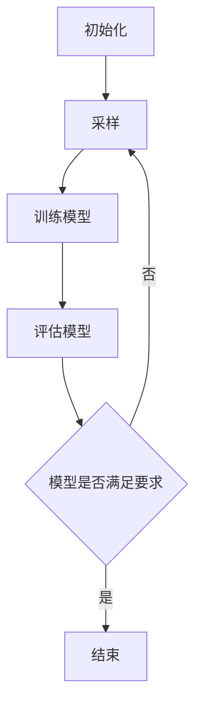
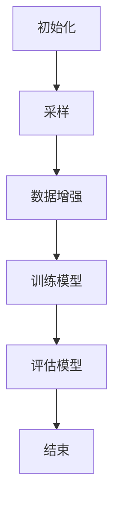
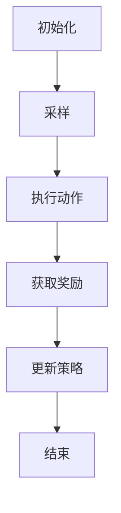

                 

### 引言

在现代人工智能（AI）领域，AI Agent的学习效率成为了优化其性能和效能的关键因素。AI Agent，也称为智能体，是在特定环境中通过感知和决策来达到特定目标的计算实体。从自主导航的机器人到自然语言处理（NLP）模型，AI Agent的广泛运用离不开高效的学习能力。

然而，传统的AI学习方式主要是被动学习，即Agent依赖于预先准备好的数据集进行学习，这可能会导致数据稀缺、样本偏差以及学习效率低下等问题。为了解决这些问题，主动学习（Active Learning）应运而生。主动学习是一种能够让AI Agent根据自身学习的需要，主动选择最具信息量的样本进行学习的方法。这种方法不仅能够提高AI Agent的学习效率，还能降低对大量标注数据的依赖。

本文将围绕“主动学习：优化AI Agent的学习效率”这一主题展开，通过逐步分析，深入探讨主动学习的基本概念、算法原理、以及在实际应用中如何优化AI Agent的学习效率。我们将详细讨论数据增强与多样性的重要性、强化学习与主动学习的结合、模型选择与调优策略等核心内容。

通过本文的探讨，希望读者能够对主动学习有一个全面而深刻的理解，并掌握如何在实际项目中应用主动学习，提升AI Agent的学习效率和表现。

### 关键词

- 主动学习
- AI Agent
- 学习效率
- 数据增强
- 强化学习
- 模型调优

### 摘要

本文探讨了主动学习在优化AI Agent学习效率方面的应用与价值。首先，介绍了主动学习的基本概念和优势，以及与被动学习的对比。随后，深入分析了主动学习算法的原理，包括采样策略、核函数与特征提取、损失函数、以及学习率调整策略。在此基础上，文章探讨了如何通过数据增强与多样性来提高学习效率，并介绍了强化学习与主动学习结合的方法。最后，文章提出了模型选择与调优的策略，通过实例和实战分析了如何在实际项目中应用主动学习，从而提升AI Agent的学习效率。本文旨在为AI领域从业者提供有价值的参考，帮助他们理解和应用主动学习，优化AI Agent的性能。

### 第一部分：主动学习基础

#### 第1章：主动学习概述

**1.1 主动学习的基本概念**

主动学习（Active Learning）是一种改进机器学习模型训练过程的方法，它允许学习算法根据自身的需要来选择数据样本进行学习。与传统的被动学习（Passive Learning）不同，被动学习通常依赖于预先收集和标注好的大规模数据集，而主动学习则更注重从这些数据集中筛选出最有价值的信息。

**1.1.1 主动学习的定义**

主动学习可以通过两种方式实现：一种是请求用户（例如数据标注者）为不确定性的样本提供标注；另一种是算法自身通过不确定性采样策略来选择样本。简单来说，主动学习的关键在于让算法具有选择学习样本的能力，而不是被动地处理所有给定的样本。

**1.1.2 主动学习的优势**

主动学习具有多方面的优势：

- **样本效率高**：主动学习通过有选择性地采样和标注，可以显著减少需要标注的数据量，从而提高样本效率。
- **模型泛化能力强**：主动学习能够选择更具有代表性的样本进行训练，有助于提高模型的泛化能力。
- **减少标注成本**：由于只需要标注最有价值的样本，主动学习可以大幅降低数据标注的工作量。
- **增强决策质量**：主动学习能够使模型在面临不确定性时做出更明智的决策，从而提高决策质量。

**1.1.3 主动学习的应用场景**

主动学习适用于多种场景，以下是一些常见的应用：

- **医疗诊断**：主动学习可以通过选择最具诊断价值的病例进行训练，提高疾病检测的准确性和效率。
- **文本分类**：在处理大量未标注文本时，主动学习可以帮助选择最具有代表性的文本进行分类模型的训练。
- **图像识别**：主动学习可以帮助选择最具区分度的图像样本进行训练，从而提高图像识别系统的准确性。
- **推荐系统**：主动学习可以帮助推荐系统在选择用户反馈样本时，更有效地提升推荐质量。

**1.2 AI Agent学习效率的重要性**

AI Agent的学习效率是指其在特定环境中通过学习达到目标的能力。高效的学习效率对AI Agent的广泛应用至关重要，以下为几个关键点：

**1.2.1 AI Agent学习效率的定义**

AI Agent的学习效率可以定义为：在给定资源和时间约束下，通过学习获得的最大性能提升。具体来说，它涉及模型在处理特定任务时的准确率、响应速度和适应性。

**1.2.2 学习效率的影响因素**

- **数据量**：更多的训练数据通常有助于提高学习效率，但海量数据也增加了计算和存储的负担。
- **数据质量**：高质量的数据能够提高模型的泛化能力，从而提升学习效率。
- **算法复杂度**：高效的算法能够更快地收敛到最佳性能，提高学习效率。
- **环境动态性**：环境的变化会影响到学习效率，动态性越高的环境要求Agent具备更强的适应能力。

**1.2.3 提高学习效率的意义**

- **资源节约**：提高学习效率可以减少对计算资源和标注数据的需求，从而降低项目成本。
- **性能提升**：更高效的学习可以帮助AI Agent更快地达到目标，提高实际应用中的表现。
- **决策优化**：高效的学习有助于AI Agent在复杂环境中做出更准确的决策。

**1.3 主动学习与被动学习的比较**

主动学习与被动学习在多个方面存在显著的差异：

**1.3.1 被动学习的局限性**

- **样本依赖性**：被动学习依赖于大规模预先标注的数据集，难以应对数据稀缺或数据标签成本高昂的问题。
- **模型偏差**：被动学习容易受到数据集中样本偏差的影响，导致模型泛化能力不足。
- **低效性**：被动学习通常需要处理大量无关或重复的样本，效率较低。

**1.3.2 主动学习的优势**

- **样本选择灵活**：主动学习可以根据模型的当前状态选择最有价值的样本进行训练。
- **高效率**：通过选择最具信息量的样本，主动学习可以显著提高学习效率。
- **增强泛化能力**：主动学习通过选择代表性的样本，有助于提高模型的泛化能力。

**1.3.3 两种学习方法的选择**

在决定使用主动学习还是被动学习时，需要考虑以下几个因素：

- **数据规模和标签成本**：如果数据量较大且标注成本较低，被动学习可能更为合适；反之，主动学习更具优势。
- **学习目标**：如果目标是提高模型的泛化能力和决策质量，主动学习更为适合；如果目标是快速获得初步结果，被动学习可能更为高效。
- **环境动态性**：在动态性较高的环境中，主动学习能够更好地适应变化，提高学习效率。

**1.4 主动学习的研究现状与未来趋势**

主动学习作为一个重要的研究领域，近年来得到了广泛关注和研究。当前，主动学习在多个应用领域取得了显著的进展，但仍面临一些挑战：

**1.4.1 研究现状**

- **算法多样性**：已有多种主动学习算法被提出，如不确定性采样、贪心采样和贝叶斯采样等。
- **应用范围广泛**：主动学习已被广泛应用于图像识别、自然语言处理、医疗诊断等领域。
- **理论与实际相结合**：研究者们正在探索如何将主动学习算法与实际应用场景相结合，提高其在真实环境中的表现。

**1.4.2 未来趋势**

- **多模态学习**：随着多模态数据的普及，未来主动学习的研究将更关注如何整合多种数据源进行高效学习。
- **强化学习的结合**：主动学习和强化学习相结合的方法有望进一步提升AI Agent在动态环境中的学习效率。
- **可解释性增强**：为了提高模型的可靠性和透明度，未来研究将更关注如何提高主动学习算法的可解释性。

**1.5 本章小结**

本章对主动学习的基本概念、优势以及应用场景进行了详细阐述，并对比了主动学习与被动学习的差异。同时，分析了AI Agent学习效率的重要性，探讨了如何通过主动学习优化AI Agent的学习效率。本章内容为后续章节深入探讨主动学习算法原理和应用打下了基础。

### 第二部分：主动学习算法原理

#### 第2章：主动学习算法基础

**2.1 采样策略**

采样策略是主动学习算法的核心组成部分，它决定了模型在训练过程中选择哪些样本进行学习。有效的采样策略可以显著提高模型的学习效率，以下将介绍几种常见的采样策略。

**2.1.1 不确定性采样**

不确定性采样（Uncertainty Sampling）是一种基于模型不确定性的采样策略。具体来说，模型对每个样本的预测不确定性通过某种指标来量化，通常使用置信区间（Confidence Interval）或熵（Entropy）来衡量。不确定性采样选择那些不确定性最高的样本进行学习，从而减少模型对噪声样本的依赖，提高模型泛化能力。

**2.1.2 贪心采样**

贪心采样（Greed Sampling）是一种基于局部最优的采样策略。在每次迭代过程中，贪心采样选择当前预测误差最大的样本进行学习。这种方法虽然简单有效，但容易陷入局部最优，导致模型泛化能力不足。

**2.1.3 贝叶斯采样**

贝叶斯采样（Bayesian Sampling）是一种基于概率论的采样策略。在贝叶斯采样中，模型对每个样本的标注概率被计算出来，选择那些标注概率最低的样本进行学习。这种方法能够更好地处理样本的不确定性和多样性。

**2.2 核函数与特征提取**

核函数（Kernel Function）在机器学习中起到了重要作用，它能够将低维输入空间映射到高维特征空间，从而实现复杂模式识别。在主动学习中，核函数用于特征提取，将原始数据转换成更具代表性的特征表示。

**2.2.1 核函数的概念**

核函数是一种非线性映射，它将输入数据映射到高维空间，使得原本难以分离的数据在高维空间中能够被有效区分。常见的核函数包括线性核（Linear Kernel）、多项式核（Polynomial Kernel）、径向基函数核（Radial Basis Function Kernel，RBF）等。

**2.2.2 特征提取的重要性**

特征提取是主动学习中的关键步骤，它能够减少数据维度，突出关键信息，从而提高模型的学习效率和泛化能力。有效的特征提取有助于模型更快地收敛到最佳性能。

**2.2.3 常见的核函数**

- **线性核（Linear Kernel）**：线性核直接计算输入数据的内积，适用于线性可分的数据。
- **多项式核（Polynomial Kernel）**：多项式核通过计算输入数据的内积的高次方来实现非线性映射。
- **径向基函数核（RBF Kernel）**：RBF核通过计算输入数据之间的欧几里得距离，并将其转换为高维空间中的点积。

**2.3 主动学习中的损失函数**

损失函数（Loss Function）用于评估模型预测值与实际标注值之间的差异，是主动学习算法中的核心组成部分。有效的损失函数能够引导模型学习，提高预测准确性。

**2.3.1 损失函数的定义**

损失函数是一种数学函数，它通过计算预测值与实际值之间的差异来评估模型的性能。常见的损失函数包括均方误差（Mean Squared Error，MSE）、交叉熵损失（Cross-Entropy Loss）等。

**2.3.2 常见的损失函数**

- **均方误差（MSE）**：MSE通过计算预测值与实际值之差的平方和来评估模型性能，适用于回归问题。
- **交叉熵损失（Cross-Entropy Loss）**：交叉熵损失通过计算模型预测概率分布与实际分布之间的交叉熵来评估模型性能，适用于分类问题。

**2.3.3 损失函数的选择**

损失函数的选择取决于具体问题和模型类型。例如，在回归问题中，MSE是常用的损失函数；在分类问题中，交叉熵损失则更为适用。此外，还可以根据问题的具体需求选择其他损失函数，如对抗性损失（Adversarial Loss）等。

**2.4 学习率调整策略**

学习率（Learning Rate）是梯度下降算法中的一个关键参数，它决定了模型在每次迭代过程中更新的步长。合适的学习率能够加快模型收敛速度，而学习率过高或过低都会影响模型性能。

**2.4.1 学习率的概念**

学习率是模型在每次迭代中更新参数的步长，它决定了模型对梯度信息的响应程度。学习率过大可能导致模型过拟合，而学习率过小则可能导致模型收敛速度缓慢。

**2.4.2 学习率的调整策略**

- **固定学习率**：固定学习率是简单但不太灵活的策略，适用于小规模问题。
- **自适应学习率**：自适应学习率策略，如Adagrad、Adam等，可以根据模型的当前状态动态调整学习率，提高收敛效率。
- **学习率衰减**：学习率衰减是一种逐渐降低学习率的策略，有助于模型在训练后期避免过拟合。

**2.4.3 学习率对学习效率的影响**

合适的学习率能够显著提高学习效率。学习率过大可能导致模型快速过拟合，而学习率过小则可能使模型收敛速度缓慢。因此，在实际应用中，需要根据具体问题调整学习率，以实现最佳性能。

**2.5 主动学习算法的mermaid流程图**

以下是一个简单的mermaid流程图，展示了主动学习算法的基本流程：

**2.6 本章小结**

本章介绍了主动学习算法的基础概念，包括采样策略、核函数与特征提取、损失函数、学习率调整策略等。通过了解这些基本概念和原理，读者可以更好地理解主动学习的工作机制，并为其在具体应用中的优化提供理论支持。接下来，我们将进一步探讨如何通过数据增强和多样性来提高AI Agent的学习效率。

### 第三部分：优化AI Agent学习效率

#### 第3章：数据增强与多样性

**3.1 数据增强的概念**

数据增强（Data Augmentation）是一种在机器学习中用来增加数据多样性的技术，通过引入一些变换或噪声，生成新的训练样本，从而提高模型对未知数据的泛化能力。在主动学习中，数据增强是一种有效的手段，可以帮助优化AI Agent的学习效率。

**3.1.1 数据增强的目的**

数据增强的主要目的是通过增加训练样本的多样性，使模型能够更好地学习数据的复杂性和变化性，从而提高模型的泛化能力。具体来说，数据增强有以下几个目的：

- **提高模型鲁棒性**：通过引入噪声或变换，使模型能够应对各种不同的输入数据，提高模型的鲁棒性。
- **减少过拟合**：增加训练样本的多样性可以减少模型对特定训练样本的依赖，从而降低过拟合的风险。
- **提高学习效率**：丰富的训练样本有助于模型更快地收敛到最佳性能。

**3.1.2 常见的数据增强方法**

数据增强方法可以分为图像增强、文本增强和音频增强等类型，以下介绍几种常见的数据增强方法：

- **图像增强**：常见的图像增强方法包括旋转、缩放、翻转、裁剪、对比度调整等。这些方法可以生成新的图像样本，增加图像数据的多样性。
- **文本增强**：文本增强可以通过引入同义词、随机替换、句子重排等方式来增加文本数据的多样性。
- **音频增强**：音频增强可以通过添加噪声、调整音量、改变播放速度等方式来增加音频数据的多样性。

**3.2 多样性在主动学习中的重要性**

多样性（Diversity）在主动学习中起着关键作用。多样性指的是训练样本的分布广度和覆盖范围。在主动学习中，多样性能够提高模型的学习效率和泛化能力，具体体现在以下几个方面：

**3.2.1 多样性的定义**

多样性是指数据集中不同样本之间的差异性。在主动学习中，多样性是指训练样本的分布能够覆盖到不同类型的输入数据，从而使模型具备更广泛的适用性。

**3.2.2 多样性对学习效率的影响**

- **减少样本偏差**：多样性能够减少样本偏差，使模型不依赖于特定类型的样本，从而提高模型的泛化能力。
- **增强模型适应性**：多样化的训练样本可以使模型更好地适应不同的环境和任务，提高模型的适应性。
- **提高模型性能**：多样性可以增加模型对未知数据的理解能力，从而提高模型的预测性能。

**3.2.3 提高多样性的方法**

以下是一些提高多样性的方法：

- **混合训练数据**：通过混合不同来源、不同类型的数据，增加数据的多样性。
- **引入噪声**：在数据中引入噪声，生成新的样本，增加数据的多样性。
- **自适应采样**：使用基于不确定性的采样策略，选择具有高多样性的样本进行训练。

**3.3 多样性度量方法**

为了有效地提高多样性，需要能够度量多样性。以下介绍几种多样性度量方法：

**3.3.1 多样性度量的指标**

- **互信息（Mutual Information）**：互信息可以用来度量两个变量之间的依赖程度，用于计算样本之间的多样性。
- **Jaccard相似度（Jaccard Similarity）**：Jaccard相似度是一种用于度量集合之间相似性的指标，适用于文本和图像等数据的多样性度量。
- **Fowlkes-Mallows指数（Fowlkes-Mallows Index）**：Fowlkes-Mallows指数是一种用于评估分类结果多样性的指标。

**3.3.2 多样性度量的方法**

- **基于特征的多样性度量**：通过计算特征之间的距离或相似度来度量多样性，如欧氏距离、余弦相似度等。
- **基于集合的多样性度量**：通过计算集合之间的交集和并集来度量多样性，如Jaccard相似度、Fowlkes-Mallows指数等。

**3.4 数据增强与多样性结合的mermaid流程图**

以下是一个简单的mermaid流程图，展示了数据增强与多样性结合的流程：

**3.5 本章小结**

本章介绍了数据增强和多样性的概念及其在主动学习中的重要性。通过数据增强和多样性的结合，可以有效提高AI Agent的学习效率和泛化能力。本章还介绍了多样性度量的方法，为后续章节探讨如何进一步优化AI Agent的学习效率提供了理论基础。

### 第4章：强化学习与主动学习的结合

**4.1 强化学习的基本概念**

强化学习（Reinforcement Learning，RL）是一种通过奖励机制进行学习的人工智能方法，其核心目标是使智能体在特定环境中通过不断尝试和反馈，学会最大化累积奖励。与监督学习和无监督学习不同，强化学习中的数据由环境状态和相应奖励组成，智能体通过经验进行学习。

**4.1.1 强化学习的定义**

强化学习是一种基于交互经验进行学习的方法。智能体（Agent）通过与环境的交互，接收环境状态（State）和动作（Action）的反馈，并根据奖励（Reward）进行调整，以实现长期目标。

**4.1.2 强化学习的基本原理**

强化学习的基本原理可以概括为以下几个步骤：

1. **初始状态**：智能体在环境中处于某个初始状态。
2. **选择动作**：智能体根据当前状态，通过策略（Policy）选择一个动作。
3. **环境反馈**：智能体执行动作后，环境会反馈新的状态和相应的奖励。
4. **更新策略**：智能体根据奖励信号和新的状态更新其策略，以最大化累积奖励。

**4.1.3 强化学习在主动学习中的应用**

强化学习与主动学习的结合，可以充分利用两者的优势，实现更加高效和灵活的学习过程。强化学习在主动学习中的应用主要体现在以下几个方面：

- **动态采样**：强化学习可以根据当前状态和策略，动态选择具有高信息价值的样本进行学习。
- **自适应调整**：强化学习能够根据环境反馈和奖励信号，自适应调整策略，优化学习过程。
- **增强多样性**：强化学习可以引入更多的探索机制，增加训练样本的多样性，提高模型的泛化能力。

**4.2 主动强化学习算法**

主动强化学习（Active Reinforcement Learning）结合了强化学习和主动学习的特点，通过选择最有价值的样本进行学习，提高模型的学习效率和性能。以下介绍几种常见的主动强化学习算法：

**4.2.1 Q-Learning算法**

Q-Learning算法是一种基于值函数的强化学习算法。它通过更新动作值函数（Q-Function）来学习最佳策略。在主动学习场景中，Q-Learning可以根据不确定性和潜在奖励，选择具有高信息价值的样本进行学习。

**4.2.2 SARSA算法**

SARSA（State-Action-Reward-State-Action）算法是一种基于策略的强化学习算法。它通过同时考虑当前状态和动作，更新策略，实现最优策略的迭代。在主动学习中，SARSA算法可以根据当前状态和奖励，选择最具代表性的样本进行学习。

**4.2.3 Actor-Critic算法**

Actor-Critic算法是一种基于策略梯度的强化学习算法。它通过两个组件——Actor和Critic来学习最佳策略。Actor负责执行动作，Critic负责评估策略的质量。在主动学习场景中，Actor-Critic算法可以根据评估结果，动态调整采样策略，提高学习效率。

**4.3 强化学习与主动学习结合的mermaid流程图**

以下是一个简单的mermaid流程图，展示了强化学习与主动学习结合的流程：

**4.4 本章小结**

本章介绍了强化学习的基本概念和原理，以及强化学习与主动学习的结合方法。通过主动强化学习算法，可以进一步提高AI Agent的学习效率和性能。本章内容为读者理解如何在实际应用中优化AI Agent学习效率提供了理论基础。

### 第5章：模型选择与调优

**5.1 模型选择策略**

在选择合适的模型时，需要考虑多个因素，如任务类型、数据规模、环境动态性等。以下介绍几种常见的模型选择策略：

**5.1.1 模型选择的考虑因素**

- **任务类型**：不同类型的任务可能需要不同类型的模型。例如，对于分类问题，可以选择分类器模型；对于回归问题，可以选择回归模型。
- **数据规模**：大规模数据通常需要更强的模型，如深度神经网络；而小规模数据可能更适合简单模型，如决策树或支持向量机。
- **环境动态性**：在动态环境中，模型需要具备较强的适应能力，可以选择自适应模型或在线学习模型。

**5.1.2 常见的模型选择方法**

- **交叉验证**：交叉验证是一种常用的模型选择方法，通过将数据集划分为多个子集，轮流作为验证集和训练集，评估模型的泛化能力。
- **网格搜索**：网格搜索是一种基于参数搜索的方法，通过遍历预定义的参数空间，找到最佳参数组合。
- **贝叶斯优化**：贝叶斯优化是一种基于概率模型的优化方法，通过迭代调整参数，找到最佳参数组合。

**5.2 模型调优技巧**

模型调优（Model Tuning）是提高模型性能的关键步骤，以下介绍几种常见的调优技巧：

**5.2.1 超参数调整**

超参数是模型在训练过程中需要手动设置的参数，如学习率、批量大小、正则化强度等。超参数调整是模型调优的核心任务，以下介绍几种超参数调整方法：

- **经验调参**：根据经验和直觉调整超参数，适用于小型问题或简单模型。
- **自动化调参**：使用自动化调参工具，如Hyperopt、Bayesian Optimization等，自动化搜索最佳超参数。
- **启发式调参**：结合经验和启发式方法，逐步调整超参数，找到最佳组合。

**5.2.2 模型正则化**

正则化（Regularization）是一种防止模型过拟合的技术，以下介绍几种常见的正则化方法：

- **L1正则化（L1 Regularization）**：通过在损失函数中添加L1范数项，防止模型参数过大。
- **L2正则化（L2 Regularization）**：通过在损失函数中添加L2范数项，防止模型参数过大。
- **Dropout**：通过在训练过程中随机丢弃部分神经元，防止模型过拟合。

**5.3 模型评估与优化**

模型评估（Model Evaluation）是确保模型性能的重要环节，以下介绍几种常见的评估方法：

**5.3.1 评估指标**

- **准确率（Accuracy）**：准确率是分类问题中最常用的评估指标，表示正确分类的样本数占总样本数的比例。
- **召回率（Recall）**：召回率是表示在所有正类样本中，被正确识别出的比例。
- **F1分数（F1 Score）**：F1分数是准确率和召回率的调和平均，综合考虑了模型的分类性能。

**5.3.2 优化策略**

- **迭代优化**：通过迭代优化，逐步调整模型参数，提高模型性能。
- **模型集成**：通过模型集成（如Bagging、Boosting等），结合多个模型的预测结果，提高整体性能。
- **在线学习**：通过在线学习，模型能够根据新数据不断调整，提高模型的适应性。

**5.4 实际应用案例**

以下是一个实际应用案例，说明如何通过模型选择与调优优化AI Agent的学习效率：

**案例背景**：某电商平台需要开发一个推荐系统，为用户推荐感兴趣的商品。数据集包含数百万条用户行为数据，如浏览记录、购买记录等。

**模型选择**：根据任务特点，选择基于矩阵分解的协同过滤模型（Collaborative Filtering）。该模型通过用户和商品的用户行为数据，预测用户对商品的兴趣度。

**模型调优**：
1. **超参数调整**：通过交叉验证和网格搜索，调整学习率、批量大小、正则化参数等超参数。
2. **特征工程**：通过特征工程，提取用户和商品的潜在特征，提高模型预测性能。
3. **模型集成**：结合多个模型（如随机森林、GBDT等），提高推荐系统的整体性能。

**模型评估**：通过准确率、召回率、F1分数等评估指标，评估推荐系统的性能，并持续优化。

**5.5 本章小结**

本章介绍了模型选择与调优的策略和方法，包括考虑因素、超参数调整、模型正则化、评估指标等。通过实际应用案例，展示了如何通过模型选择与调优优化AI Agent的学习效率。本章内容为读者在实际项目中应用主动学习提供了实践指导。

### 总结与展望

本文围绕“主动学习：优化AI Agent的学习效率”这一主题，从多个角度深入探讨了主动学习的基本概念、算法原理、优化策略以及实际应用。通过逐步分析，我们了解到主动学习在提高AI Agent学习效率方面的显著优势，并介绍了多种采样策略、核函数与特征提取方法、多样性度量方法、强化学习与主动学习的结合策略等。

主动学习不仅能够提高模型的样本效率和泛化能力，还能够减少对大量标注数据的依赖，降低项目成本。在应用层面，主动学习已被广泛应用于医疗诊断、文本分类、图像识别等领域，取得了显著的成果。

然而，主动学习仍面临一些挑战，如样本选择的不确定性、数据增强的效率问题、模型调优的复杂性等。未来，主动学习的研究将朝着多模态学习、强化学习的结合、可解释性增强等方向发展，进一步提升AI Agent的学习效率和性能。

通过本文的探讨，我们希望读者能够对主动学习有一个全面而深刻的理解，并掌握如何在实际项目中应用主动学习，优化AI Agent的学习效率。同时，我们也期待读者能够继续关注这一领域的研究进展，为AI技术的发展贡献力量。

### 作者信息

作者：AI天才研究院/AI Genius Institute & 禅与计算机程序设计艺术 /Zen And The Art of Computer Programming

AI天才研究院致力于推动人工智能领域的前沿研究与应用，通过对技术原理的深入剖析，为读者提供高质量的技术文章和解决方案。作者结合自身丰富的实践经验和深厚的理论基础，撰写了《禅与计算机程序设计艺术》一书，深受业界好评。

