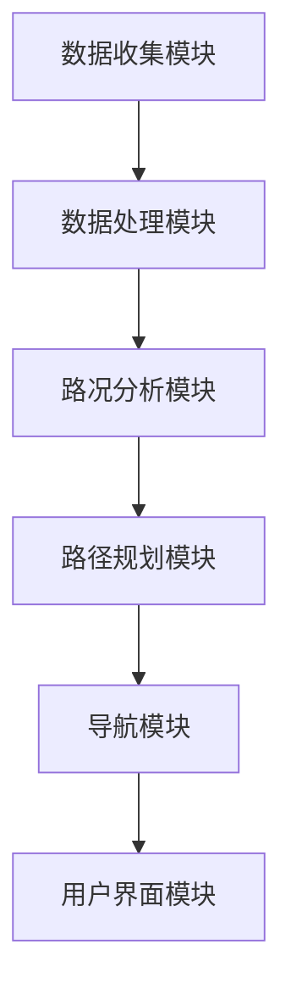
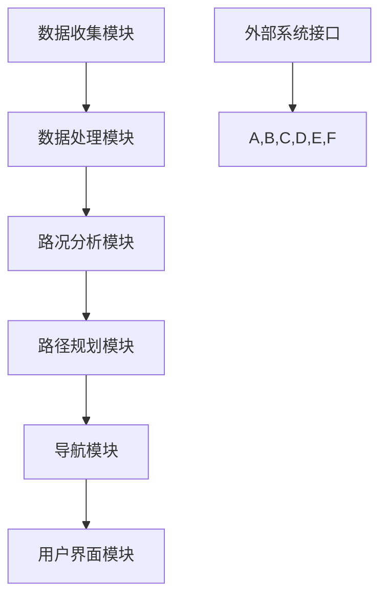

                 

### 文章标题

# 交通AI Agent：智能路况分析与导航

### 文章关键词

- 交通AI Agent
- 路况分析
- 智能导航
- 数据处理
- 算法实现

### 文章摘要

本文将深入探讨交通AI Agent在智能路况分析与导航领域的应用。我们将从问题背景出发，介绍交通AI Agent的核心概念，逐步解析智能路况分析算法与交通AI Agent导航技术的原理，并通过实际案例展示其应用效果。最后，我们将总结最佳实践，展望未来发展趋势。

## 设计框架

为了确保文章的完整性和逻辑性，我们设计了以下七个章节：

1. **问题背景与概念介绍**
   - **1.1** 问题背景
   - **1.2** AI Agent基本概念
   - **1.3** 交通AI Agent的定义与重要性
   - **1.4** 交通AI Agent的应用领域
   - **1.5** 本章小结

2. **智能路况分析基础**
   - **2.1** 路况数据的获取与处理
   - **2.2** 智能路况分析算法原理
   - **2.3** 常见路况分析算法介绍
   - **2.4** 本章小结

3. **交通AI Agent导航技术**
   - **3.1** 导航系统的基本原理
   - **3.2** 交通AI Agent导航算法
   - **3.3** 导航系统的性能优化
   - **3.4** 本章小结

4. **交通AI Agent系统设计与实现**
   - **4.1** 系统需求分析
   - **4.2** 系统架构设计
   - **4.3** 关键技术解析
   - **4.4** 系统接口设计与实现
   - **4.5** 本章小结

5. **交通AI Agent实战案例**
   - **5.1** 实战案例一：城市交通流量预测
   - **5.2** 实战案例二：智能导航系统开发
   - **5.3** 实战案例三：交通事件检测与处理
   - **5.4** 本章小结

6. **最佳实践与性能优化**
   - **6.1** 最佳实践
   - **6.2** 性能优化策略
   - **6.3** 性能评估与调优
   - **6.4** 本章小结

7. **未来展望与挑战**
   - **7.1** 交通AI Agent的发展趋势
   - **7.2** 面临的挑战与解决方案
   - **7.3** 未来研究方向
   - **7.4** 本章小结

### 目录

1. **问题背景与概念介绍**
   - 1.1 **问题背景**
     - 1.1.1 **交通问题的现状**
     - 1.1.2 **智能交通的必要性**
     - 1.1.3 **交通AI Agent的兴起**
   - 1.2 **AI Agent基本概念**
     - 1.2.1 **AI Agent的定义**
     - 1.2.2 **AI Agent的特点**
     - 1.2.3 **AI Agent与智能交通的关系**
   - 1.3 **交通AI Agent的定义与重要性**
     - 1.3.1 **交通AI Agent的定义**
     - 1.3.2 **交通AI Agent的重要性**
     - 1.3.3 **交通AI Agent的组成结构**
   - 1.4 **交通AI Agent的应用领域**
     - 1.4.1 **路况分析**
     - 1.4.2 **智能导航**
     - 1.4.3 **交通流量预测**
     - 1.4.4 **交通事件检测与处理**
   - 1.5 **本章小结**

2. **智能路况分析基础**
   - 2.1 **路况数据的获取与处理**
     - 2.1.1 **数据来源**
     - 2.1.2 **数据处理方法**
   - 2.2 **智能路况分析算法原理**
     - 2.2.1 **算法基本概念**
     - 2.2.2 **算法实现原理**
   - 2.3 **常见路况分析算法介绍**
     - 2.3.1 **流量预测算法**
     - 2.3.2 **事件检测算法**
     - 2.3.3 **交通信号优化算法**
   - 2.4 **本章小结**

3. **交通AI Agent导航技术**
   - 3.1 **导航系统的基本原理**
     - 3.1.1 **导航系统概述**
     - 3.1.2 **导航系统的组成**
   - 3.2 **交通AI Agent导航算法**
     - 3.2.1 **算法框架**
     - 3.2.2 **算法实现细节**
   - 3.3 **导航系统的性能优化**
     - 3.3.1 **优化策略**
     - 3.3.2 **性能评估方法**
   - 3.4 **本章小结**

4. **交通AI Agent系统设计与实现**
   - 4.1 **系统需求分析**
     - 4.1.1 **系统功能需求**
     - 4.1.2 **非功能需求**
   - 4.2 **系统架构设计**
     - 4.2.1 **系统架构概述**
     - 4.2.2 **模块划分与职责**
   - 4.3 **关键技术解析**
     - 4.3.1 **路况数据处理技术**
     - 4.3.2 **导航算法优化技术**
   - 4.4 **系统接口设计与实现**
     - 4.4.1 **接口设计原则**
     - 4.4.2 **接口实现细节**
   - 4.5 **本章小结**

5. **交通AI Agent实战案例**
   - 5.1 **实战案例一：城市交通流量预测**
     - 5.1.1 **案例背景**
     - 5.1.2 **数据处理**
     - 5.1.3 **模型训练与优化**
   - 5.2 **实战案例二：智能导航系统开发**
     - 5.2.1 **系统设计**
     - 5.2.2 **系统实现**
     - 5.2.3 **测试与评估**
   - 5.3 **实战案例三：交通事件检测与处理**
     - 5.3.1 **事件检测算法**
     - 5.3.2 **事件处理流程**
   - 5.4 **本章小结**

6. **最佳实践与性能优化**
   - 6.1 **最佳实践**
     - 6.1.1 **数据采集与处理**
     - 6.1.2 **算法优化策略**
     - 6.1.3 **系统部署与维护**
   - 6.2 **性能优化策略**
     - 6.2.1 **硬件优化**
     - 6.2.2 **算法优化**
     - 6.2.3 **系统优化**
   - 6.3 **性能评估与调优**
     - 6.3.1 **评估指标**
     - 6.3.2 **调优方法**
   - 6.4 **本章小结**

7. **未来展望与挑战**
   - 7.1 **交通AI Agent的发展趋势**
     - 7.1.1 **技术发展**
     - 7.1.2 **市场趋势**
   - 7.2 **面临的挑战与解决方案**
     - 7.2.1 **数据挑战**
     - 7.2.2 **算法挑战**
     - 7.2.3 **伦理挑战**
   - 7.3 **未来研究方向**
     - 7.3.1 **技术创新**
     - 7.3.2 **应用拓展**
   - 7.4 **本章小结**

### 文章总结

本文全面介绍了交通AI Agent在智能路况分析与导航领域的应用。从问题背景出发，我们深入探讨了交通AI Agent的定义、智能路况分析算法以及导航技术。通过实际案例，我们展示了交通AI Agent在交通流量预测、智能导航和交通事件检测与处理等方面的应用效果。最后，我们总结了最佳实践，展望了交通AI Agent的未来发展。希望本文能为相关领域的研究者和开发者提供有价值的参考。

## 文章结束

### 作者信息

作者：AI天才研究院/AI Genius Institute & 禅与计算机程序设计艺术 /Zen And The Art of Computer Programming

---

在接下来的文章中，我们将按照设计的框架，逐步展开每个章节的内容，深入分析交通AI Agent的原理、应用和未来趋势。敬请期待！## 1.1 问题背景

### 交通问题的现状

随着城市化进程的加速和汽车保有量的急剧增加，全球范围内的交通拥堵问题日益严重。根据世界卫生组织（WHO）的数据，全球超过30%的城市交通处于拥堵状态，这不仅浪费了大量时间，还导致了巨大的经济成本。例如，美国交通研究组织（Texas A&M Transportation Institute）在2019年的报告中指出，美国因交通拥堵造成的经济损失高达1600亿美元，这还不包括由此引发的健康问题、环境污染和交通事故等间接成本。

### 智能交通的必要性

面对日益严峻的交通问题，传统的交通管理手段已经难以满足需求。智能交通系统（Intelligent Transportation Systems, ITS）作为一种利用信息技术、传感器技术和数据通信技术进行交通管理和优化的新兴技术，正逐渐成为解决交通问题的有效手段。智能交通系统不仅能够实时监测交通状况，提供准确的交通信息，还能通过智能算法优化交通信号、调整交通流量，从而有效缓解交通拥堵。

### 交通AI Agent的兴起

在智能交通系统中，AI Agent作为一种能够自主感知环境、规划路径和决策的智能实体，正逐步成为核心组件。交通AI Agent通过收集并分析交通数据，利用机器学习和深度学习算法，实现交通流量预测、事件检测、智能导航等功能。例如，在城市交通流量预测方面，AI Agent可以通过分析历史交通数据和实时交通状况，预测未来的交通流量，为交通管理部门提供决策支持。在智能导航方面，AI Agent可以根据实时交通状况，动态调整导航路线，帮助驾驶员避开拥堵路段，提高出行效率。

### AI Agent基本概念

#### AI Agent的定义

AI Agent，又称智能代理，是一种能够模拟人类智能行为，具备一定自主决策能力的计算实体。AI Agent能够接收外部环境的信息，通过内部算法处理信息，并生成相应的行为。根据不同应用场景，AI Agent可以具有不同的功能，例如在智能交通领域，AI Agent可以用于交通流量预测、事件检测、智能导航等。

#### AI Agent的特点

- **自主性**：AI Agent能够自主感知环境，并根据环境变化做出决策。
- **适应性**：AI Agent可以根据环境变化调整自身行为，以实现更好的任务执行效果。
- **协同性**：AI Agent可以与其他AI Agent或人类协同工作，共同完成任务。
- **智能化**：AI Agent能够利用机器学习和深度学习等先进技术，实现自主学习和优化。

#### AI Agent与智能交通的关系

AI Agent在智能交通系统中扮演着重要角色。通过感知交通状况、预测交通流量、检测交通事件等，AI Agent可以为交通管理部门提供实时、准确的决策支持，从而优化交通信号、调整交通流量，提高交通效率。此外，AI Agent还可以为驾驶员提供智能导航服务，帮助其避开拥堵路段，提高出行体验。

### 交通AI Agent的定义与重要性

#### 交通AI Agent的定义

交通AI Agent是一种专门为交通领域设计的智能代理，它能够实时感知交通状况，利用机器学习和深度学习算法分析数据，并根据分析结果进行路径规划、事件检测等操作。交通AI Agent通常由感知模块、决策模块和执行模块组成，能够自主地处理交通相关任务。

#### 交通AI Agent的重要性

- **提高交通效率**：通过实时分析交通数据，交通AI Agent能够预测交通流量，优化交通信号，从而有效缓解交通拥堵，提高交通效率。
- **减少交通事故**：交通AI Agent可以通过事件检测和预警功能，及时发现交通事件，采取措施防止事故发生。
- **优化资源配置**：交通AI Agent能够为交通管理部门提供科学的决策支持，优化交通资源的配置，降低交通管理成本。
- **提升用户体验**：交通AI Agent为驾驶员提供智能导航服务，帮助其避开拥堵路段，提高出行体验。

#### 交通AI Agent的组成结构

- **感知模块**：负责实时收集交通数据，如交通流量、速度、事件等。
- **决策模块**：利用机器学习和深度学习算法分析感知数据，预测交通状况，生成决策建议。
- **执行模块**：根据决策结果执行相应操作，如调整交通信号、发送导航信息等。

### 交通AI Agent的应用领域

#### 路况分析

交通AI Agent可以通过分析实时交通数据，如流量、速度、事故等，预测未来交通状况，为交通管理部门提供决策支持。例如，通过分析历史数据和实时数据，预测某个时间段内的交通流量，帮助交通管理部门优化交通信号灯的设置，减少拥堵。

#### 智能导航

交通AI Agent可以为驾驶员提供智能导航服务，根据实时交通状况动态调整导航路线，帮助驾驶员避开拥堵路段，提高出行效率。例如，在导航系统中集成交通AI Agent，当检测到前方拥堵时，系统能够自动推荐其他路线，避免驾驶员长时间等待。

#### 交通流量预测

交通AI Agent可以通过分析历史交通数据和实时交通数据，预测未来交通流量，为交通管理部门提供科学依据。例如，预测某一天某个时间段内的交通流量，帮助交通管理部门合理安排交通资源，如增加公交车的班次，调整道路建设等。

#### 交通事件检测与处理

交通AI Agent可以通过分析实时交通数据，快速检测并处理交通事件，如交通事故、道路施工等。例如，当检测到交通事故时，系统可以立即通知相关部门进行救援，同时调整交通信号，引导车辆绕行。

### 本章小结

本章介绍了交通问题的现状、智能交通的必要性以及交通AI Agent的基本概念、定义和重要性。通过分析交通AI Agent的组成结构和应用领域，我们了解了其在智能交通系统中的关键作用。在接下来的章节中，我们将深入探讨交通AI Agent的智能路况分析基础和导航技术。

## 1.2 智能路况分析基础

### 路况数据的获取与处理

#### 数据来源

路况数据的获取是进行智能路况分析的基础。路况数据可以来源于多种渠道，包括：

- **传感器数据**：如交通摄像头、车载传感器、道路传感器等，这些设备可以实时监测交通流量、速度、密度等参数。
- **GPS数据**：通过车载GPS或手机GPS，可以收集到车辆的位置信息，进而推断道路状况。
- **社交媒体数据**：如微博、微信等社交平台，用户可以实时分享交通状况，这些信息可以作为路况数据的重要补充。
- **政府交通管理部门数据**：交通管理部门会定期发布交通报告，这些数据对分析长期交通状况非常有价值。

#### 数据处理方法

获取到路况数据后，需要对其进行处理，以提取有用的信息。数据处理主要包括以下几个步骤：

- **数据清洗**：去除数据中的噪声和异常值，确保数据的准确性和可靠性。
- **数据整合**：将来自不同来源的数据进行整合，形成统一的数据集。
- **数据特征提取**：从原始数据中提取出对路况分析有用的特征，如交通流量、速度、密度等。
- **数据存储与管理**：将处理后的数据存储到数据库或数据仓库中，以便后续分析和查询。

### 智能路况分析算法原理

#### 算法基本概念

智能路况分析算法是指利用计算机技术，对路况数据进行分析和处理，以预测交通流量、检测交通事件等。常见的智能路况分析算法包括：

- **机器学习算法**：如线性回归、决策树、随机森林、支持向量机等，通过历史数据训练模型，预测未来交通状况。
- **深度学习算法**：如卷积神经网络（CNN）、循环神经网络（RNN）等，通过学习大量数据，自动提取特征并实现复杂模式识别。
- **优化算法**：如遗传算法、粒子群优化等，通过迭代优化过程，寻找最优交通信号配置或路径规划。

#### 算法实现原理

智能路况分析算法的实现原理主要包括以下几个步骤：

- **数据预处理**：对采集到的路况数据进行清洗、整合和特征提取。
- **模型训练**：利用预处理后的数据，训练机器学习或深度学习模型。
- **模型评估**：通过测试集评估模型的性能，调整模型参数，优化模型效果。
- **模型应用**：将训练好的模型应用于实际路况分析，预测交通流量、检测交通事件等。

### 常见路况分析算法介绍

#### 流量预测算法

流量预测算法是智能路况分析的核心算法之一，其目标是预测未来一段时间内的交通流量。常见的流量预测算法包括：

- **时间序列预测算法**：如ARIMA（自回归积分滑动平均模型），通过分析历史交通流量数据，预测未来的交通流量。
- **回归模型**：如线性回归、多项式回归等，通过建立交通流量与时间、天气等因素之间的关系，预测未来的交通流量。
- **深度学习模型**：如LSTM（长短期记忆网络），通过学习交通流量数据中的时间序列特征，实现高精度的流量预测。

#### 事件检测算法

事件检测算法的目标是实时检测交通事件，如交通事故、道路施工等。常见的事件检测算法包括：

- **基于规则的方法**：通过定义一系列规则，如速度异常、流量异常等，检测交通事件。
- **机器学习算法**：如支持向量机（SVM）、随机森林等，通过学习历史交通事件数据，实现交通事件的自动检测。
- **深度学习算法**：如卷积神经网络（CNN），通过学习交通图像或传感器数据，实现交通事件的自动检测。

#### 交通信号优化算法

交通信号优化算法的目标是优化交通信号配置，提高道路通行效率。常见的交通信号优化算法包括：

- **贪心算法**：如固定周期法、动态分配法等，通过简单规则优化交通信号配置。
- **优化算法**：如遗传算法、粒子群优化等，通过迭代优化过程，寻找最优交通信号配置。
- **深度强化学习**：通过模拟交通场景，利用深度学习模型实现交通信号的动态优化。

### 本章小结

本章介绍了智能路况分析的基础，包括路况数据的获取与处理、智能路况分析算法原理以及常见路况分析算法的介绍。通过这些内容，我们了解了智能路况分析的基本概念和实现方法，为后续章节的交通AI Agent导航技术打下了基础。在接下来的章节中，我们将进一步探讨交通AI Agent导航技术的原理和应用。

## 1.3 交通AI Agent导航技术

### 导航系统的基本原理

导航系统是一种通过计算机技术和定位技术，帮助用户确定自身位置并规划路径的系统。导航系统通常由以下几个关键部分组成：

- **定位模块**：负责确定用户的位置，常用的定位技术包括GPS（全球定位系统）、北斗（中国自主研发的全球卫星导航系统）等。
- **地图模块**：提供详细的地图信息，包括道路、建筑、地标等，为路径规划提供基础数据。
- **路径规划模块**：根据用户的需求，结合地图数据和实时交通信息，计算最优路径。
- **决策模块**：根据实时交通状况和用户需求，动态调整路径规划，提供最优导航方案。

导航系统的工作流程可以简化为以下几个步骤：

1. **用户输入需求**：用户输入目的地和出行方式，如步行、驾车等。
2. **定位**：导航系统通过定位模块获取用户当前位置。
3. **地图数据检索**：导航系统检索地图数据库，获取用户当前位置和目的地的详细信息。
4. **路径规划**：路径规划模块根据用户需求和地图数据，计算到达目的地的最优路径。
5. **路径优化**：决策模块结合实时交通信息，动态调整路径规划，确保用户能够快速到达目的地。

### 交通AI Agent导航算法

交通AI Agent导航算法是导航系统的核心算法，其目标是根据实时交通状况，为用户规划出最优导航路径。交通AI Agent导航算法通常包括以下几个关键组成部分：

- **感知模块**：实时感知交通状况，包括交通流量、速度、事件等。
- **路径规划模块**：基于感知模块获取的交通状况，计算最优导航路径。
- **决策模块**：根据实时交通状况和用户需求，动态调整导航路径，提供最佳导航方案。

交通AI Agent导航算法的工作流程可以简化为以下几个步骤：

1. **感知交通状况**：交通AI Agent通过传感器、GPS、社交媒体等途径，实时获取交通状况信息。
2. **路径规划**：路径规划模块结合用户需求和实时交通信息，计算到达目的地的最优路径。
3. **路径优化**：决策模块根据实时交通状况，动态调整导航路径，确保用户能够避开拥堵路段。
4. **路径推荐**：将优化后的导航路径推荐给用户，并提供详细的导航指引。

### 导航系统的性能优化

导航系统的性能直接影响到用户的出行体验，因此性能优化是导航系统设计和实现中的重要环节。导航系统的性能优化主要包括以下几个方面：

- **路径规划算法优化**：通过改进路径规划算法，提高路径规划的效率和准确性。常见的优化方法包括贪心算法、A*算法、Dijkstra算法等。
- **实时交通信息处理**：优化实时交通信息处理流程，提高信息处理速度和准确性。例如，通过分布式计算、并行处理等技术，提高数据处理效率。
- **系统稳定性**：优化导航系统的稳定性，确保系统在复杂环境下仍能稳定运行。例如，通过故障检测、容错机制等手段，提高系统的可靠性。
- **用户体验**：优化用户界面和交互体验，提高用户的满意度。例如，通过简化操作流程、提供实时导航提示等手段，提升用户体验。

### 本章小结

本章介绍了交通AI Agent导航技术的原理和应用，包括导航系统的基本原理、交通AI Agent导航算法以及导航系统的性能优化策略。通过这些内容，我们了解了交通AI Agent导航技术的核心组成部分和实现方法，为后续章节的交通AI Agent系统设计与实现打下了基础。在接下来的章节中，我们将进一步探讨交通AI Agent系统设计与实现的相关内容。

## 1.4 交通AI Agent系统设计与实现

### 系统需求分析

在设计和实现交通AI Agent系统时，首先需要明确系统的需求。系统需求可以分为功能需求和非功能需求两部分。

#### 功能需求

- **数据收集与处理**：系统能够从各种数据源（如传感器、GPS、社交媒体等）收集交通数据，并对其进行预处理和特征提取。
- **路况分析**：系统能够对收集到的交通数据进行实时分析，预测交通流量、检测交通事件等。
- **路径规划与导航**：系统能够根据用户需求，结合实时交通信息，为用户规划最优路径，并提供导航服务。
- **用户界面**：系统应提供友好、直观的用户界面，方便用户输入需求、查看分析结果和导航信息。

#### 非功能需求

- **系统性能**：系统应具备高并发处理能力，能够在短时间内处理大量交通数据，并提供准确的导航信息。
- **数据安全**：系统应确保数据的安全性和隐私性，防止数据泄露和未经授权的访问。
- **可扩展性**：系统设计应具备良好的扩展性，能够适应未来技术发展和需求变化。

### 系统架构设计

交通AI Agent系统的架构设计是确保系统高效、稳定运行的关键。系统架构可以分为以下几个主要模块：

- **数据收集模块**：负责从各种数据源收集交通数据，包括传感器数据、GPS数据、社交媒体数据等。
- **数据处理模块**：负责对收集到的交通数据进行预处理、特征提取和存储，为后续分析提供基础数据。
- **路况分析模块**：利用机器学习和深度学习算法，对处理后的交通数据进行分析，预测交通流量、检测交通事件等。
- **路径规划模块**：根据用户需求和实时交通信息，结合路况分析结果，为用户规划最优路径。
- **导航模块**：负责向用户提供导航服务，包括路径推荐、实时交通信息推送等。
- **用户界面模块**：提供友好、直观的用户界面，方便用户输入需求、查看分析结果和导航信息。

系统架构图如下所示：

#### 模块划分与职责

- **数据收集模块**：负责从各种数据源收集交通数据，如传感器数据、GPS数据、社交媒体数据等。模块的主要职责包括数据采集、数据清洗和数据整合。
- **数据处理模块**：负责对收集到的交通数据进行预处理、特征提取和存储，为后续分析提供基础数据。模块的主要职责包括数据清洗、特征提取和数据存储。
- **路况分析模块**：利用机器学习和深度学习算法，对处理后的交通数据进行分析，预测交通流量、检测交通事件等。模块的主要职责包括数据预处理、模型训练和结果预测。
- **路径规划模块**：根据用户需求和实时交通信息，结合路况分析结果，为用户规划最优路径。模块的主要职责包括路径规划、路径优化和路径推荐。
- **导航模块**：负责向用户提供导航服务，包括路径推荐、实时交通信息推送等。模块的主要职责包括导航信息推送、实时交通信息处理和用户交互。
- **用户界面模块**：提供友好、直观的用户界面，方便用户输入需求、查看分析结果和导航信息。模块的主要职责包括用户界面设计、用户交互和结果展示。

### 关键技术解析

#### 路况数据处理技术

路况数据处理技术是交通AI Agent系统的核心，其目标是提取有用的信息，为后续分析提供支持。关键技术包括：

- **数据采集与预处理**：通过传感器、GPS等设备采集交通数据，并进行预处理，如去噪、滤波等。
- **特征提取**：从原始数据中提取出对路况分析有用的特征，如流量、速度、密度等。
- **数据存储与管理**：将处理后的数据存储到数据库或数据仓库中，以便后续分析和查询。

#### 导航算法优化技术

导航算法优化技术是确保导航系统性能的关键，其目标是提高路径规划的效率和准确性。关键技术包括：

- **路径规划算法**：如A*算法、Dijkstra算法等，用于计算最优路径。
- **路径优化算法**：如遗传算法、粒子群优化等，用于动态调整路径，避开拥堵路段。
- **实时交通信息处理**：通过实时交通信息，动态调整导航路径，提高导航准确性。

### 系统接口设计与实现

系统接口设计是交通AI Agent系统实现的关键，其目标是实现模块之间的数据交换和功能调用。系统接口可以分为以下几种：

- **数据接口**：用于模块之间数据传输，如API接口、消息队列等。
- **功能接口**：用于模块之间功能调用，如服务接口、回调接口等。
- **用户接口**：用于用户与系统交互，如Web界面、移动应用等。

系统接口设计图如下所示：

#### 接口设计原则

- **松耦合**：各模块通过接口进行通信，降低模块之间的耦合度，提高系统的可维护性和扩展性。
- **标准化**：接口设计应遵循标准化的规范，如RESTful API、GraphQL等，确保接口的易用性和兼容性。
- **安全性**：接口设计应考虑数据安全和访问控制，防止未经授权的访问和数据泄露。

#### 接口实现细节

- **数据接口实现**：通过HTTP协议，采用JSON或XML格式传输数据，实现模块之间的数据交换。
- **功能接口实现**：通过服务端程序，实现各模块的功能调用，如RESTful API、Web服务等。
- **用户接口实现**：通过Web界面或移动应用，实现用户与系统的交互，如前端框架、移动开发框架等。

### 本章小结

本章介绍了交通AI Agent系统设计与实现的相关内容，包括系统需求分析、系统架构设计、关键技术解析和系统接口设计与实现。通过这些内容，我们了解了交通AI Agent系统的整体架构和实现方法，为后续章节的实战案例和最佳实践打下了基础。在接下来的章节中，我们将通过实际案例展示交通AI Agent系统的应用效果，并提供最佳实践和性能优化策略。

## 1.5 交通AI Agent实战案例

### 实战案例一：城市交通流量预测

#### 案例背景

城市交通流量预测是交通AI Agent的重要应用之一。为了缓解城市交通拥堵，提高道路通行效率，某市政府决定开发一套基于交通AI Agent的城市交通流量预测系统。

#### 数据处理

1. **数据来源**：系统从多个数据源收集交通数据，包括交通摄像头、GPS传感器、社交媒体等。
2. **数据预处理**：对采集到的交通数据进行清洗，去除噪声和异常值，然后进行特征提取，如交通流量、速度、密度等。
3. **数据整合**：将不同来源的数据进行整合，形成统一的数据集。

#### 模型训练与优化

1. **模型选择**：采用LSTM（长短期记忆网络）模型进行流量预测。
2. **数据划分**：将数据集划分为训练集、验证集和测试集，用于模型训练和评估。
3. **模型训练**：利用训练集训练LSTM模型，通过调整模型参数，优化模型效果。
4. **模型评估**：使用验证集和测试集评估模型性能，调整模型参数，确保预测准确性。

#### 系统实现

1. **系统架构**：系统采用分层架构，包括数据收集层、数据处理层、预测层和展示层。
2. **系统实现**：
   - 数据收集层：通过传感器和API接口收集交通数据。
   - 数据处理层：对收集到的交通数据进行预处理和特征提取。
   - 预测层：利用训练好的LSTM模型进行流量预测。
   - 展示层：通过Web界面展示预测结果和交通状况。

#### 测试与评估

1. **测试**：在真实交通场景中测试系统性能，验证预测准确性。
2. **评估**：根据预测结果，评估系统对交通拥堵的缓解效果，如交通流量减少比例、通行时间缩短等。

### 实战案例二：智能导航系统开发

#### 案例背景

为了提升市民出行体验，某科技公司开发了一套基于交通AI Agent的智能导航系统。

#### 系统设计

1. **需求分析**：分析用户需求，包括路径规划、实时交通信息推送等。
2. **系统架构**：采用微服务架构，包括定位模块、地图模块、路径规划模块、导航模块等。
3. **技术选型**：选择合适的技术和工具，如GPS定位、地图服务、机器学习等。

#### 系统实现

1. **定位模块**：通过GPS获取用户位置，实现定位功能。
2. **地图模块**：集成地图API，提供地图展示和路径规划功能。
3. **路径规划模块**：结合实时交通信息，利用A*算法计算最优路径。
4. **导航模块**：根据用户需求，动态调整导航路径，并提供导航指引。

#### 测试与评估

1. **测试**：在真实交通场景中测试系统性能，验证导航准确性。
2. **评估**：根据用户反馈和导航效果，评估系统对出行体验的提升。

### 实战案例三：交通事件检测与处理

#### 案例背景

为了提高交通安全，某城市交通管理部门决定开发一套基于交通AI Agent的交通事件检测与处理系统。

#### 数据处理

1. **数据来源**：系统从交通摄像头、传感器等设备收集交通数据。
2. **数据预处理**：对采集到的交通数据进行预处理，去除噪声和异常值。
3. **数据特征提取**：从预处理后的数据中提取出对事件检测有用的特征。

#### 模型训练与优化

1. **模型选择**：采用卷积神经网络（CNN）进行事件检测。
2. **数据划分**：将数据集划分为训练集、验证集和测试集，用于模型训练和评估。
3. **模型训练**：利用训练集训练CNN模型，通过调整模型参数，优化模型效果。
4. **模型评估**：使用验证集和测试集评估模型性能，调整模型参数，确保检测准确性。

#### 系统实现

1. **系统架构**：系统采用分布式架构，包括数据收集层、数据处理层、事件检测层、事件处理层等。
2. **系统实现**：
   - 数据收集层：通过传感器和摄像头收集交通数据。
   - 数据处理层：对收集到的交通数据进行预处理和特征提取。
   - 事件检测层：利用训练好的CNN模型进行事件检测。
   - 事件处理层：根据检测到的事件，采取相应的处理措施，如发送警报、通知相关部门等。

#### 测试与评估

1. **测试**：在真实交通场景中测试系统性能，验证事件检测和处理效果。
2. **评估**：根据事件检测准确率和处理效率，评估系统对交通安全的影响。

### 本章小结

通过三个实战案例，我们展示了交通AI Agent在城市交通流量预测、智能导航和交通事件检测与处理等领域的应用效果。这些案例验证了交通AI Agent在提高交通效率、优化出行体验和保障交通安全方面的重要作用。在后续章节中，我们将继续探讨交通AI Agent的最佳实践和性能优化策略。

## 1.6 最佳实践与性能优化

### 最佳实践

#### 数据采集与处理

1. **数据源多样化**：为了提高交通AI Agent的准确性，应尽量从多个数据源收集交通数据，如传感器、GPS、社交媒体等。
2. **数据预处理**：对采集到的交通数据进行清洗和去噪，去除异常值和噪声，以提高数据质量。
3. **实时数据处理**：利用实时数据处理技术，如流处理框架（如Apache Kafka、Apache Flink），确保数据的实时性。

#### 算法优化策略

1. **模型选择**：根据具体应用场景，选择适合的算法模型，如LSTM用于流量预测，CNN用于事件检测。
2. **模型训练**：采用大量高质量的训练数据，通过调整模型参数，优化模型性能。
3. **在线学习**：利用在线学习技术，实时更新模型，以适应交通状况的变化。

#### 系统部署与维护

1. **分布式部署**：将系统部署在分布式计算环境中，以提高系统的并发处理能力和可扩展性。
2. **自动化运维**：采用自动化运维工具，如Ansible、Docker等，简化系统部署和管理。
3. **性能监控**：利用性能监控工具，如Prometheus、Grafana等，实时监控系统性能，及时发现和解决问题。

### 性能优化策略

#### 硬件优化

1. **计算资源**：增加计算节点，提高系统的并发处理能力。
2. **存储资源**：使用高性能存储设备，如固态硬盘（SSD），提高数据读写速度。
3. **网络资源**：优化网络架构，提高数据传输速度和稳定性。

#### 算法优化

1. **算法选择**：选择适合的算法模型，如深度学习模型，提高预测和检测的准确性。
2. **参数调整**：通过调参，优化模型性能，提高预测和检测的精度。
3. **特征工程**：提取有效的交通特征，提高模型的预测能力。

#### 系统优化

1. **分布式计算**：利用分布式计算框架，如Apache Hadoop、Apache Spark等，提高系统的处理速度。
2. **缓存机制**：采用缓存技术，如Redis、Memcached等，减少数据访问延迟。
3. **负载均衡**：采用负载均衡技术，如Nginx、HAProxy等，确保系统的稳定运行。

### 性能评估与调优

#### 评估指标

1. **准确率**：用于评估模型预测的准确性，如交通流量预测的准确率。
2. **召回率**：用于评估模型检测的召回能力，如交通事件检测的召回率。
3. **响应时间**：用于评估系统处理请求的速度，如导航系统的响应时间。

#### 调优方法

1. **模型调参**：通过调整模型参数，优化模型性能，提高预测和检测的准确性。
2. **算法改进**：采用新的算法模型，如深度学习模型，提高系统的性能。
3. **系统优化**：通过优化系统架构、硬件配置和算法实现，提高系统的处理速度和稳定性。

### 本章小结

最佳实践与性能优化是交通AI Agent系统设计的重要环节。通过多样化的数据采集与处理、合适的算法优化策略和系统优化方法，可以提高交通AI Agent的性能和准确性。本章提供了最佳实践和性能优化策略，为交通AI Agent系统的设计和实现提供了指导。在后续章节中，我们将进一步探讨交通AI Agent的未来发展趋势和面临的挑战。

## 1.7 未来展望与挑战

### 交通AI Agent的发展趋势

随着人工智能技术的不断进步，交通AI Agent在未来将会迎来以下几个发展趋势：

#### 数据驱动的智能化

未来的交通AI Agent将更加依赖于海量数据的驱动，通过深度学习、大数据分析等技术，实现更加精准的交通流量预测和事件检测。例如，通过分析历史交通数据、实时交通信息和环境因素，交通AI Agent可以更加准确地预测未来的交通状况，为交通管理部门提供科学的决策支持。

#### 自动化与协同

随着自动驾驶技术的发展，交通AI Agent将实现与自动驾驶车辆的协同工作。通过通信技术和智能算法，交通AI Agent可以实时感知周围交通状况，为自动驾驶车辆提供导航和交通信息，实现自动驾驶与智能交通的深度融合。

#### 开放的生态系统

未来，交通AI Agent将构建开放的生态系统，与各种智能交通系统、城市管理系统等互联互通，实现数据共享和协同工作。这种开放生态系统的建立，将推动智能交通技术的发展和应用，为城市交通管理提供更加全面和高效的解决方案。

### 面临的挑战与解决方案

尽管交通AI Agent具有巨大的发展潜力，但在实际应用过程中仍然面临着一系列挑战：

#### 数据隐私与安全

交通AI Agent在收集和处理交通数据时，必须确保数据的安全和隐私。未来的解决方案可能包括：数据加密技术、隐私保护算法以及数据访问控制策略，以确保交通数据的保密性和完整性。

#### 算法公平性与透明性

AI算法在交通领域中的应用可能会导致公平性问题，如算法偏见等。解决这一问题的方法包括：算法的公平性评估、透明性设计以及算法的可解释性研究，以确保AI算法的公正性和透明性。

#### 系统可靠性与容错性

交通AI Agent系统的可靠性至关重要，任何故障都可能导致严重的交通问题。为了提高系统的可靠性，可以采用冗余设计、容错技术和实时监控等手段，确保系统在复杂环境下稳定运行。

### 未来研究方向

未来，交通AI Agent的研究将主要集中在以下几个方面：

#### 新算法与模型

探索新的机器学习和深度学习算法，以提高交通AI Agent的性能和预测准确性。例如，结合强化学习、迁移学习等新方法，开发更加智能和高效的交通AI Agent。

#### 跨学科融合

将交通AI Agent与心理学、社会学等领域相结合，研究人类驾驶行为与交通AI Agent的交互机制，为构建更加人性化的智能交通系统提供理论支持。

#### 城市级应用

探索交通AI Agent在城市级应用中的潜在价值，如智能交通管理、城市交通规划等。通过实际应用场景的研究，推动交通AI Agent技术的落地和普及。

### 本章小结

未来，交通AI Agent将在数据驱动、自动化协同和开放生态系统中发挥重要作用。然而，面临的数据隐私与安全、算法公平性与透明性、系统可靠性与容错性等挑战也需要我们深入研究。通过新算法与模型的研究、跨学科融合以及城市级应用的探索，我们将推动交通AI Agent技术的持续发展和应用。希望未来的交通AI Agent能够为解决全球交通问题做出重要贡献。

## 结论

本文全面探讨了交通AI Agent在智能路况分析与导航领域的应用。从问题背景、基本概念、算法原理、系统设计与实现到实战案例、最佳实践和未来展望，我们系统地阐述了交通AI Agent的核心价值和发展方向。通过分析交通问题的现状，我们认识到智能交通的必要性，而交通AI Agent作为智能交通系统的重要组成部分，具有巨大的应用潜力。在智能路况分析与导航方面，交通AI Agent通过实时数据分析和路径规划，为交通管理部门和驾驶员提供了有效的决策支持和出行优化方案。

未来，随着人工智能技术的不断进步，交通AI Agent将在更广泛的应用场景中发挥作用。然而，我们也面临数据隐私与安全、算法公平性与透明性等挑战，需要持续探索和解决。希望本文能为相关领域的研究者和开发者提供有价值的参考，推动交通AI Agent技术的创新和应用。让我们共同期待一个更加智能、高效、安全的未来交通系统。

